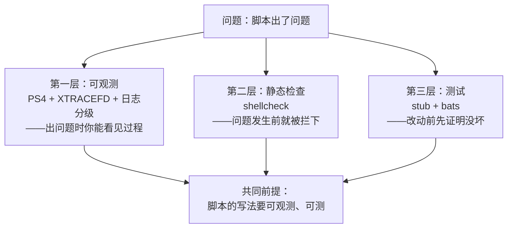
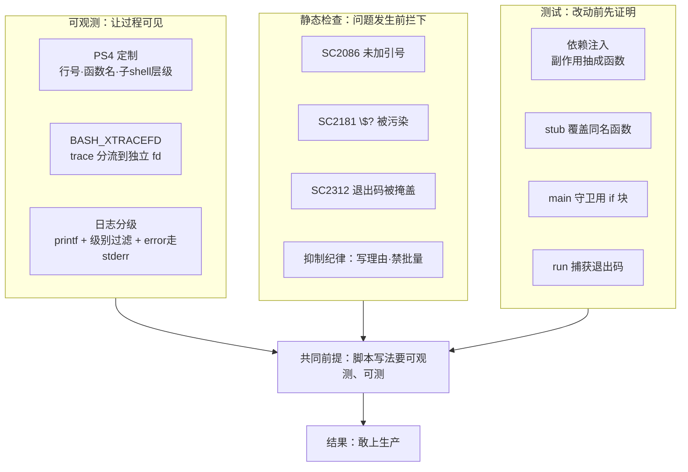

# 第 12 课：可观测与测试

> 所属阶段：阶段 4《生产化》｜ 水平：进阶 ｜ 本课知识点：调试与可观测、shellcheck 静态检查、bats 与可测性设计
> 故事情节：脚本出错了，但日志只有一行 `+ tar czf ...`——看不出是哪天、哪次、哪个参数

## 🎯 本课目标

- 定制 `PS4` 让 trace 带行号与函数名，把 trace 分流到独立 fd，实现日志分级
- 读懂 shellcheck 常见告警码，遵守抑制注解的使用纪律
- 把脚本改成可注入结构，并写 bats 测试

---

## 第一幕：起源与场景引入

> 🎬 **场景**：生产上 `deploy.sh` 挂了，运维打开日志：

```text
+ tar czf /backup/app.tar.gz /data/app
```

就这一行。没有时间、没有行号、没有函数名、没有变量值——它告诉你"执行过这一行"，但没告诉你"为什么在这里失败"。更糟的是，这行 trace 和业务输出混在同一个 stdout 里，被下游的解析器当成了数据。

这不是虚构。下面这行就是本机实测的、默认 `set -x` 的输出：

```bash
cd /tmp && rm -rf c12demo && mkdir -p c12demo && cd c12demo
cat > t1.sh <<'EOF'
#!/usr/bin/env bash
set -x
deploy() { tar czf /tmp/c12demo/app.tar.gz /tmp/c12demo/data; }
deploy
EOF
chmod +x t1.sh
./t1.sh 2>&1 | head -3
```

```text
+ deploy
+ tar czf /tmp/c12demo/app.tar.gz /tmp/c12demo/data
tar: Removing leading `/' from member names
```

三行里，只有第一行和"执行过"有关。哪天？哪个参数导致失败？前面还有哪些步骤？**全都不知道。**

---

## 第二幕：认知冲突

> ❓ **问题**：`set -x` 不就是调试工具吗？为什么它没用？

`set -x` 默认输出的信息量，刚好够你在**自己机器上、看着屏幕**调试——放到生产日志里，它既缺上下文（时间/行号/函数/子 shell 层级），又污染输出流。

先看第二个问题有多严重。把上面那个脚本的 stdout 交给下游解析器：

```bash
cat > /tmp/c12demo/d1.sh <<'EOF'
#!/usr/bin/env bash
set -x
echo "业务数据行1"
echo "业务数据行2"
EOF
bash /tmp/c12demo/d1.sh 2>&1 | while IFS= read -r line; do
  printf '解析到: %s\n' "$line"
done
```

```text
解析到: + echo 业务数据行1
解析到: 业务数据行1
解析到: + echo 业务数据行2
解析到: 业务数据行2
```

**一半的"数据"是 trace。** 而 `2>&1` 恰恰是很多人写脚本时的肌肉记忆——"把错误也记下来"。

所以可用的 trace 需要三件事：定制 `PS4` 补足上下文、用 `BASH_XTRACEFD` 把 trace 从 stdout **分离**出去、以及一套日志分级函数（debug/info/warn/error）。这是"能调试"和"可观测"的分界。

---

## 第三幕：层层揭示

### 知识点 1：调试与可观测

> 本知识点关键点：`set -x` 与 `set -v` 的区别、`PS4` 的可展开变量（`${BASH_SOURCE}` `${LINENO}` `${FUNCNAME[0]}` `${BASH_SUBSHELL}`）、`BASH_XTRACEFD` 把 trace 定向到指定 fd、`set -o functrace`/`xtrace` 局部开关（`set +x` 临时关闭）、**用 `printf` 而非 `echo` 输出**（`echo` 的 `-n` `-e` 与转义行为因 shell/系统而异，`printf` 行为确定；`printf '%s\n'` 恒等输出、`%q` 转义、`%(datefmt)T` 免 fork 取时间戳）、日志分级函数设计（时间戳 + 级别 + 消息，错误走 stderr）、`exec` 重定向实现全局日志

#### 一句话定义

**可观测**不是"能打出日志"，而是"日志里带着足够定位问题的上下文，且不干扰正常输出"——靠 `PS4` 定制补上下文、`BASH_XTRACEFD` 做分流、日志分级函数做结构化。

#### 直觉建立（类比）

默认 `set -x` 像**监控摄像头**：录是录了，但没有时间水印、没有机位编号，回看时你只知道"有个人走过"。

`PS4` + `BASH_XTRACEFD` 是**带时间戳和机位编号的录像系统**：每一帧都写着"几点几分、几号机位、第几层楼"，而且录像带单独存放，不混进给客户看的成片里。

**类比失效的边界**：录像系统能回放画面，trace 只能回放"执行了哪些命令"——**变量值不会自动打印**。想看变量值得自己 `printf`，或用 `set -v`（后者打印的是未展开的原始输入行，不是值）。

#### 核心原理

**（1）`PS4` 能展开什么，不能展开什么**

`PS4` 是普通字符串，每次 trace 前做一次参数展开。可用的变量：

| 变量 | 含义 | 示例值 |
|------|------|--------|
| `${BASH_SOURCE##*/}` | 当前脚本文件名（去掉路径） | `deploy.sh` |
| `${LINENO}` | 当前行号 | `42` |
| `${FUNCNAME[0]}` | 当前函数名（顶层为空） | `deploy` |
| `${BASH_SUBSHELL}` | 子 shell 层级（顶层 0） | `1` |

⚠️ **一个必须实测才能发现的坑**：`PS4` **不做 `printf` 格式化**。想在 trace 里加时间戳，写 `PS4='%(%H:%M:%S)T '` 是**无效的**：

```bash
bash -c 'PS4="[%(%H:%M:%S)T] "; set -x; echo a' 2>&1 | head -2
```

```text
[%(%H:%M:%S)T] echo a
a
```

字面量原样输出了。时间戳只能用命令替换 `$(date +%T)`：

```bash
cat > /tmp/c12demo/pa.sh <<'EOF'
#!/usr/bin/env bash
PS4='+ [$(date +%T)] ${BASH_SOURCE##*/}:${LINENO}:${FUNCNAME[0]}> '
set -x
echo a
echo b
EOF
bash /tmp/c12demo/pa.sh 2>&1 | head -4
```

```text
+ [15:59:52] pa.sh:4:> echo a
a
+ [15:59:52] pa.sh:5:> echo b
b
```

**代价**：每打一行 trace 就 fork 一次 `date`。行级 trace + 循环 = 性能灾难（课 13 会量化这个代价）。生产上更常见的做法是**不在 PS4 里加时间戳**，而是靠日志分级函数带时间戳——它只在真正输出日志时才取时间。

**（2）`PS4` 首字符重复 = 子 shell 层级**

这是最优雅的机制：`PS4` 的**第一个字符**会被重复 N 次，N 等于当前子 shell 层级。所以把 `+` 放开头，子 shell 里自动变 `++`：

```bash
cat > /tmp/c12demo/pb.sh <<'EOF'
#!/usr/bin/env bash
PS4='+${BASH_SOURCE##*/}:${LINENO}:${FUNCNAME[0]}> '
set -x
f(){ echo 在函数里; }
f
r=$(echo 在子shell里; echo 嵌套)
EOF
bash /tmp/c12demo/pb.sh 2>&1 | head -8
```

```text
+pb.sh:5:> f
+pb.sh:4:f> echo 在函数里
在函数里
++pb.sh:6:> echo 在子shell里
++pb.sh:6:> echo 嵌套
+pb.sh:6:> r='在子shell里
嵌套'
```

注意 `++pb.sh:6:>` ——子 shell 里自动多一个 `+`。这比显式写 `${BASH_SUBSHELL}` 更直观，因为**眼睛扫一眼前缀长度就知道在第几层**。

**（3）`BASH_XTRACEFD`：把 trace 从业务数据里彻底分离**

`exec 9>file` 打开一个 fd，把 `BASH_XTRACEFD` 指向它，trace 就只进这个文件，再也不碰 stdout/stderr：

```bash
cat > /tmp/c12demo/pc.sh <<'EOF'
#!/usr/bin/env bash
exec 9>/tmp/c12demo/trace.log
export BASH_XTRACEFD=9
PS4='+ ${BASH_SOURCE##*/}:${LINENO}:${FUNCNAME[0]}> '
set -x
echo "这是业务输出(走stdout)"
echo "这是错误输出" >&2
set +x
exec 9>&-
EOF
bash /tmp/c12demo/pc.sh 2>/dev/null
echo "--- trace.log（独立存放）---"
cat /tmp/c12demo/trace.log
```

```text
这是业务输出(走stdout)
--- trace.log（独立存放）---
+ pc.sh:6:> echo '这是业务输出(走stdout)'
+ pc.sh:7:> echo 这是错误输出
+ pc.sh:8:> set +x
```

stdout 里**只剩业务数据**，trace 单独成文件。下游解析器再也不会把 `+ echo ...` 当成数据。

> ⚠️ **`BASH_XTRACEFD` 必须 `export`**（它是给子 shell 看的），且要求 bash ≥ 4.1。本机 5.2.21，实测可用。

**（4）`set +x` 局部开关，以及在它之前泄露的密码**

```bash
cat > /tmp/c12demo/d3.sh <<'EOF'
#!/usr/bin/env bash
PS4='+ ${BASH_SOURCE##*/}:${LINENO}> '
set -x
user=admin
pass="s3cret"
set +x
token=$(printf '%s:%s' "$user" "$pass" | base64)
set -x
echo "token 长度=${#token}"
EOF
bash /tmp/c12demo/d3.sh 2>&1
```

```text
+ d3.sh:4> user=admin
+ d3.sh:5> pass=s3cret
+ d3.sh:6> set +x
+ d3.sh:9> echo 'token 长度=16'
token 长度=16
```

**密码泄露了。** 我原本想用 `set +x` 保护 `token=$(...)` 那行，但 `pass` 的赋值发生在**保护开始之前**——第 5 行已经把明文打进了 trace。

正确的顺序是：**先关 trace，再碰敏感数据**。

```bash
set +x                          # 先关
pass="s3cret"                   # 再赋值
token=$(printf '%s' "$pass" | base64)
set -x                          # 之后重新开
```

#### 示例演示

把三者合起来，看 trace 从"没用"到"有用"的三级进化：

```bash
cd /tmp/c12demo && mkdir -p data && printf 'x\n' > data/a.txt

cat > lv1.sh <<'EOF'
#!/usr/bin/env bash
set -x
deploy() { tar czf /tmp/c12demo/app.tar.gz /tmp/c12demo/data; }
deploy
EOF
cat > lv2.sh <<'EOF'
#!/usr/bin/env bash
PS4='+ ${BASH_SOURCE##*/}:${LINENO}:${FUNCNAME[0]}> '
set -x
deploy() { tar czf /tmp/c12demo/app.tar.gz /tmp/c12demo/data; }
deploy
EOF
cat > lv3.sh <<'EOF'
#!/usr/bin/env bash
exec 9>/tmp/c12demo/lv3.trace
export BASH_XTRACEFD=9
PS4='+ ${BASH_SOURCE##*/}:${LINENO}:${FUNCNAME[0]}> '
set -x
deploy() { tar czf /tmp/c12demo/app.tar.gz /tmp/c12demo/data; }
deploy
set +x
EOF
for s in lv1 lv2 lv3; do echo "=== $s ==="; bash $s.sh 2>&1 | grep -v '^tar:' | head -3; done
echo "=== lv3 的 trace 文件 ==="; cat /tmp/c12demo/lv3.trace
```

实测输出（节选）：

```text
=== lv1 ===
+ deploy
+ tar czf /tmp/c12demo/app.tar.gz /tmp/c12demo/data
=== lv2 ===
+ lv2.sh:5:> deploy
+ lv2.sh:4:deploy> tar czf /tmp/c12demo/app.tar.gz /tmp/c12demo/data
=== lv3 ===
=== lv3 的 trace 文件 ===
+ lv3.sh:6:> deploy
+ lv3.sh:5:deploy> tar czf /tmp/c12demo/app.tar.gz /tmp/c12demo/data
+ lv3.sh:7:> set +x
```

- **lv1**：告诉你"执行过 tar"
- **lv2**：告诉你"在 lv2.sh 第 5 行的 deploy 函数里执行 tar"
- **lv3**：同上，且 stdout **什么都不输出**（业务数据干干净净）

#### 常见误区

**误区 1：`set -x` 输出到 stdout。** 不，是 **stderr**。所以 `2>&1` 会把它和真正的错误信息、业务输出混在一起——这正是第二幕里下游解析器吃进 trace 的原因。

**误区 2：PS4 里能写 `%(%H:%M:%S)T`。** 实测原样输出字面量，时间戳得靠 `$(date +%T)` 命令替换（代价是每行 trace fork 一次）。

**误区 3：用 `echo` 打日志。** 这是本课最该记住的一条，下面单独讲。

#### 一句话记住

**trace 要有上下文（`PS4`）、要分离（`BASH_XTRACEFD`）、日志要分级且用 `printf`——否则你记录的不是"发生了什么"，而是"发生过一些事"。**
---

### 知识点 1 补：`printf` 而非 `echo`——日志本身必须可靠

> 💡 **为什么单独讲**：如果打日志的工具本身行为不确定，那"可观测"就是空中楼阁。

#### 一句话定义

`echo` 的行为**因 shell 和系统的实现而异**（`-n`、`-e`、转义序列），`printf` 的行为由 POSIX 明确定义——生产脚本一律用 `printf`。

#### 直觉建立（类比）

`echo` 像**方言**：同一个词在不同地方意思不一样，你能听懂，但机器不一定。

`printf` 像**普通话 + 契约**：说什么就是什么，且格式串和内容严格分离。

**类比失效的边界**：`printf` 不是"更安全的 echo"——它有自己独有的坑（把变量放进格式串），下面会讲。

#### 核心原理：实测说话

本机 `/bin/sh` 指向 **dash**（不是 bash），所以这两种 shell 可以直接对比：

```bash
echo "--- bash 下 ---"
bash    -c 'echo "a\tb"'
bash    -c 'echo -n "no newline"; echo "|END"'
bash    -c 'echo -e "x\ty"'
echo "--- dash 下 ---"
/bin/sh -c 'echo "a\tb"'
/bin/sh -c 'echo -n "no newline"; echo "|END"'
/bin/sh -c 'echo -e "x\ty"'
```

实测输出：

```text
--- bash 下 ---
a\tb
no newline|END
x	y
--- dash 下 ---
a	b
no newline|END
-e x	y
```

三个差异，逐个看：

| 命令 | bash | dash | 后果 |
|------|------|------|------|
| `echo "a\tb"` | `a\tb`（原样） | `a<TAB>b`（真制表符） | **同一个脚本，日志格式不一样** |
| `echo -n "x"` | 不换行 | 不换行 | 这个恰好一致（dash 支持 `-n`） |
| `echo -e "x\ty"` | `x<TAB>y` | `-e x<TAB>y` | **`-e` 被当成普通字符串打印出来** |

第三种最隐蔽：dash 不认 `-e`，于是把它**当作要输出的内容**打出来。你的日志里凭空多一个 `-e`。

再看 `printf` 的表现：

```bash
bash    -c 'printf "%s\n" "a\tb"'
/bin/sh -c 'printf "%s\n" "a\tb"'
bash    -c 'printf "%s" "no newline"; printf "|END\n"'
/bin/sh -c 'printf "%s" "no newline"; printf "|END\n"'
```

```text
a\tb
a\tb
no newline|END
no newline|END
```

**两个 shell 输出完全一致。** 这就是"行为确定"。

#### ⚠️ `printf` 自己的坑：变量绝不能放进格式串

`printf` 的第一个参数是**格式串**，其中的 `%` 和 `\` 会被解释。变量必须作为**后续参数**传入：

```bash
bash -c 'x="100%done"; printf "$x\n"'
bash -c 'x="a\tb";     printf "$x"; echo "  <-- 变量当格式串被解释了"'
```

```text
1000one
a	b  <-- 变量当格式串被解释了
```

`100%done` 变成 `1000one`：`%d` 被当成"十进制整数"格式符，后面的 `one` 里的 `o` 被当成数字解析失败了。

**正确写法永远是**：

```bash
printf '%s\n' "$x"        # ✅ 变量作为参数
printf "$x\n"             # ❌ 变量当格式串——内容被解释，且可能报错
```

#### `printf` 的三个生产用法

```bash
# 1. 恒等输出：%s 原样打印，什么都不解释
printf '%s\n' "$变量"

# 2. %q：把内容转成可安全重用的 shell 字面量（调试神器）
bash -c 'x="a b\tc"; printf "原样: %s\n转义后: %q\n" "$x" "$x"'

# 3. %(datefmt)T：免 fork 取时间戳（-1 表示当前时间）
bash -c 'printf "%(%Y-%m-%d %H:%M:%S)T\n" -1'
```

第三个特别值得一提：`$(date +%T)` 要 fork 一个进程，`%(...)T` 是 bash 内建，**零 fork**。日志函数里每次都取时间戳，用后者。

#### 示例演示：日志分级函数

把上面的要点焊成一个可用库：

```bash
cat > /tmp/c12demo/loglib.sh <<'EOF'
#!/usr/bin/env bash
# 日志分级：时间戳 + 级别 + 消息，错误走 stderr
readonly LOG_LEVEL_DEBUG=0 LOG_LEVEL_INFO=1 LOG_LEVEL_WARN=2 LOG_LEVEL_ERROR=3
LOG_LEVEL=${LOG_LEVEL:-$LOG_LEVEL_INFO}

_ts() { printf '%(%Y-%m-%d %H:%M:%S)T' -1; }   # 免 fork 取时间戳

_log() {
  local lvl=$1; shift
  local name=$1 lvlno=$2; shift 2
  (( lvlno < LOG_LEVEL )) && return 0
  if (( lvlno >= LOG_LEVEL_ERROR )); then
    printf '[%s] [%s] %s\n' "$(_ts)" "$name" "$*" >&2
  else
    printf '[%s] [%s] %s\n' "$(_ts)" "$name" "$*"
  fi
}
log_debug(){ _log debug "$1" $LOG_LEVEL_DEBUG "${@:2}"; }
log_info() { _log info  "$1" $LOG_LEVEL_INFO  "${@:2}"; }
log_warn() { _log warn  "$1" $LOG_LEVEL_WARN  "${@:2}"; }
log_error(){ _log error "$1" $LOG_LEVEL_ERROR "${@:2}"; }
EOF

cat > /tmp/c12demo/uselog.sh <<'EOF'
#!/usr/bin/env bash
source /tmp/c12demo/loglib.sh
echo "--- 默认 INFO 级别 ---"
log_debug 调试 "这条不该出现"
log_info  信息 "部署开始"
log_warn  警告 "磁盘剩余 8%"
log_error 错误 "连接数据库失败"
echo
echo "--- LOG_LEVEL=0 (DEBUG) ---"
LOG_LEVEL=0
log_debug 调试 "这条出现了"
EOF
bash /tmp/c12demo/uselog.sh
```

实测输出：

```text
--- 默认 INFO 级别 ---
[2026-09-04 16:00:34] [信息] 部署开始
[2026-09-04 16:00:34] [警告] 磁盘剩余 8%

--- LOG_LEVEL=0 (DEBUG) ---
[2026-09-04 16:00:34] [调试] 这条出现了
[2026-09-04 16:00:34] [信息] 部署开始
```

**级别过滤生效**（DEBUG 在默认级别下被静默丢弃），**error 精确走 stderr**（单独验证：stdout 里错误行数 = 0）。

#### 常见误区

**误区：日志全走 stdout，用 `2>&1` 统一收集。** 这会把"正常数据"和"错误诊断"混成一条流。正确分工是：**数据走 stdout（可被管道消费），诊断走 stderr（给人看）**。上面的 `_log` 函数在 `lvlno >= 3` 时加 `>&2` 就是干这个。

#### 一句话记住

**`echo` 是方言，`printf` 是契约；变量永远放 `%s` 的位置，不放在格式串里。**

---
### 知识点 2：shellcheck 静态检查

> 本知识点关键点：常见告警码（SC2086 未加引号、SC2046、SC2181 `if [ $? -eq 0 ]`、SC2312 命令替换未检查退出码、SC1091 无法追踪的 source、SC2044）、`shellcheck -x` 追踪 source、`-s bash` 指定 shell、抑制注解三种作用域（单行 / 函数级 / 文件级）、**抑制纪律**（必须写理由、禁止批量 disable）

> ⚠️ **环境说明**：本机**未安装 shellcheck**（已确认 `command -v shellcheck` 无输出）。按阶段 4 约定，不擅自 `apt install`。本节采用**手工等价验证**——直接构造能触发告警的代码，用真实运行结果证明这些告警背后的问题客观存在，而不是纸上谈兵。所有输出均为本机实测。
>
> **若你希望安装**（安装后可直接复现告警码）：
> ```bash
> sudo apt update && sudo apt install -y shellcheck    # Debian/Ubuntu/WSL
> shellcheck --version                                  # 确认版本
> shellcheck -s bash your_script.sh                     # 指定 shell 运行
> shellcheck -x your_script.sh                          # 追踪 source 的文件
> ```
> 需要我执行安装吗？说一声即可。

#### 一句话定义

**shellcheck** 是 shell 脚本的静态分析器——不运行脚本，靠解析语法树找出**几乎必然是 bug 的写法**。

#### 直觉建立（类比）

shellcheck 是**编译器警告**，`# shellcheck disable=SC2086` 是 Java 的 `@SuppressWarnings`。

这个类比的价值在于后半句：**用多了等于没装**。一个文件顶部写着 `# shellcheck disable=SC2086` 的脚本，和没跑过 shellcheck 的脚本，安全性是一样的——而且更糟，因为它**看起来**像被检查过。

**类比失效的边界**：编译器警告针对的是"类型不匹配"这类确定错误；shellcheck 有一部分告警是**风格建议**（如 SC2006 建议用 `$(...)` 替代反引号），关掉它没什么损失。所以抑制纪律的重点是**分辨哪些能关**。

#### 核心原理：四个高频告警，逐个实测

**SC2086：变量未加引号（最高频，也最危险）**

```bash
cd /tmp/c12demo && mkdir -p data && printf 'x\n' > data/a.txt
f="my report.txt"
echo "--- 错误写法：grep \$f ---"
grep "x" $f 2>&1 | head -3; echo "退出码=${PIPESTATUS[0]}"
echo "--- 正确写法：grep \"\$f\" ---"
grep "x" "$f" 2>&1 | head -3; echo "退出码=${PIPESTATUS[0]}"
```

```text
--- 错误写法：grep $f ---
grep: my: No such file or directory
grep: report.txt: No such file or directory
退出码=2
--- 正确写法：grep "$f" ---
grep: my report.txt: No such file or directory
退出码=2
```

看到区别了吗？**未加引号时，一个文件名被拆成了两个**。这里只是"找不到文件"，但如果换成 `rm`：

```bash
d="/tmp/c12demo/data /tmp/c12demo/data"
echo "变量内容: [$d]"
echo "--- rm -rf \$d 会删什么（用 echo 模拟，不真删）---"
echo "rm -rf $d" | tr ' ' '\n' | sed 's/^/  参数: /'
echo "--- rm -rf \"\$d\" 只删一个 ---"
echo "rm -rf \"$d\"" | sed 's/^/  参数: /'
```

```text
变量内容: [/tmp/c12demo/data /tmp/c12demo/data]
--- rm -rf $d 会删什么（用 echo 模拟，不真删）---
  参数: rm
  参数: -rf
  参数: /tmp/c12demo/data
  参数: /tmp/c12demo/data
--- rm -rf "$d" 只删一个 ---
  参数: rm -rf "/tmp/c12demo/data /tmp/c12demo/data"
```

**未加引号：`rm -rf` 收到两个参数，两个目录都被删。** 加了引号：整体是一个（不存在的）路径，`rm` 报"找不到"，然后什么都不做。

这两种行为的差别，在变量恰好为空或含空格时，就是"正常工作"和"数据没了"的差别。

**SC2181：`if [ $? -eq 0 ]` 的两种错法**

第一种错法大家都听过——啰嗦。但真正危险的是第二种：**`$?` 被中间命令污染**。

```bash
cat > /tmp/c12demo/e.sh <<'EOF'
#!/usr/bin/env bash
grep "nomatch" /tmp/c12demo/data/a.txt >/dev/null
if [ $? -eq 0 ]; then echo "判断：找到了"; else echo "判断：没找到"; fi
EOF
cat > /tmp/c12demo/d.sh <<'EOF'
#!/usr/bin/env bash
grep "nomatch" /tmp/c12demo/data/a.txt >/dev/null
:                                     # 中间夹一个必然成功的命令
if [ $? -eq 0 ]; then echo "判断：找到了"; else echo "判断：没找到"; fi
EOF
echo "--- 无中间命令 ---"; bash /tmp/c12demo/e.sh
echo "--- 有中间命令 ---"; bash /tmp/c12demo/d.sh
```

```text
--- 无中间命令 ---
判断：没找到
--- 有中间命令 ---
判断：找到了
```

**同一个 grep，判断结果完全相反。** grep 确实失败了，但 `$?` 读到的是中间那个 `:` 的退出码 0。

这是静默的逻辑错误——不报错、不崩溃，只是判断反了。而且**极难发现**，因为你在代码里看到 `[ $? -eq 0 ]` 时，默认它读的就是上一行命令的结果。

正确写法是直接把命令放进 `if`：

```bash
if grep "pattern" file; then echo 找到了; else echo 没找到; fi
```

**SC2312：命令替换的退出码被外层命令掩盖**

这一条我实测时**推翻了自己的第一版理解**，值得把过程写出来：

```bash
cd /tmp/c12demo
cat > a.sh <<'EOF'
#!/usr/bin/env bash
set -e
x=$(cat /tmp/c12demo/不存在)
echo "x=[$x]"
EOF
cat > b.sh <<'EOF'
#!/usr/bin/env bash
set -e
echo "结果=$(cat /tmp/c12demo/不存在)"
echo "这行执行了！"
EOF
cat > c.sh <<'EOF'
#!/usr/bin/env bash
set -e
f(){ local x=$(cat /tmp/c12demo/不存在); echo "x=[$x]"; }
f
echo "这行执行了！"
EOF
echo "--- A: 纯赋值 x=\$(cmd) ---"; bash a.sh; echo "退出码=$?"
echo "--- B: echo \"\$(cmd)\" ---";  bash b.sh; echo "退出码=$?"
echo "--- C: local x=\$(cmd) ---";   bash c.sh; echo "退出码=$?"
```

```text
--- A: 纯赋值 x=$(cmd) ---
退出码=1
--- B: echo "$(cmd)" ---
结果=
这行执行了！
退出码=0
--- C: local x=$(cmd) ---
x=[]
这行执行了！
退出码=0
```

**关键区分**：

- **场景 A 不触发 SC2312**——纯赋值语句的退出码就是命令替换的退出码，`set -e` 能捕获（退出码 1，脚本中断）
- **场景 B 才是真 SC2312**——`echo "结果=$(cat ...)"` 里，整个语句的退出码是 **`echo` 的**（0），`cat` 的失败被彻底吞掉，脚本继续往下跑
- **场景 C 是同一机制的变体**，与课 11 讲过的 `local` 吞退出码是同一件事

所以 SC2312 的本质是：**命令替换的退出码被外层命令覆盖**。纯赋值不算，套在别的命令里才算。

**SC2046 / SC1091 / SC2044（简述）**

| 告警码 | 含义 | 为什么重要 |
|--------|------|-----------|
| SC2046 | 未加引号的命令替换 `$(...)` | 与 SC2086 同源，只是对象是命令替换的结果 |
| SC1091 | 无法追踪的 `source` 文件 | shellcheck 看不到被 source 的文件，会漏检其中的问题；用 `-x` 允许它跟随 |
| SC2044 | `for f in $(find ...)` | find 结果按空格/换行拆分，含空格的文件名直接错乱 |

SC2044 是 SC2086 的一个具体场景，但单独编号说明它**足够常见**（几乎每个写过 `for f in $(find . -name '*.log')` 的人都踩过）。

#### 示例演示：抑制注解的三种作用域

```bash
# ① 单行：只作用于下一行
# shellcheck disable=SC2086
rm -rf $TARGET_DIR

# ② 函数级：放在函数定义前，作用于整个函数
# shellcheck disable=SC2086
cleanup() {
  rm -rf $1
  rm -rf $2
}

# ③ 文件级：放在文件顶部，作用于整个文件
#!/usr/bin/env bash
# shellcheck disable=SC2086
```

**抑制纪律（三条，缺一不可）**：

1. **必须写理由**。写成 `# shellcheck disable=SC2086  # 已确认 $dir 不含空格（来自配置项，见 config.sh:12）`，而不是光秃秃一行 disable
2. **禁止文件级 disable 危险码**。文件级 `# shellcheck disable=SC2086` 等于把最有用的告警关掉——这条正是 SC2086 最该被拦的场景
3. **优先改代码，其次才抑制**。绝大多数告警**应该被修复而不是被抑制**；抑制只用于"你确认这是个例外"

#### 常见误区

**误区 1：全局 `# shellcheck disable=SC2086`。** 上面讲过了，等于没装。

**误区 2：装了 shellcheck 就等于安全。** shellcheck 查的是**写法模式**，查不出业务逻辑错误。它不会因为你的备份目录路径写错而报警。

**误区 3：所有告警都要清零。** SC2006（反引号 → `$()`）这类纯风格建议，在老脚本里可能有几十条，逐条改的收益低于风险。**分清"bug 类"和"风格类"**——bug 类（2086/2181/2312/2044）必须处理，风格类可以批量降级。

#### 一句话记住

**shellcheck 是编译器警告，`disable` 是 `@SuppressWarnings`——写 disable 前先问：这是例外，还是我不想改？**

---
### 知识点 3：bats 与可测性设计

> 本知识点关键点：shell 不是不能测，是**写法不可测**、可测性设计 = 把副作用隔离成可注入函数（依赖注入）、`main` 守卫 `[ "${BASH_SOURCE[0]}" = "$0" ] && main "$@"`、bats 的 `@test` / `run` / `assert_*` / `setup` `teardown`、测试替身（stub）的实现（用同名函数覆盖 PATH 上的命令）

> ⚠️ **环境说明**：本机**未安装 bats-core**（已确认 `command -v bats` 无输出）。同样按阶段 4 约定不擅自安装。本节用**手写等价测试**呈现——bats 的本质就是"source 脚本 + 覆盖函数 + 断言"，下面每一段代码都能直接跑，跑通后迁移到 bats 只是换套语法。
>
> **若你希望安装**：
> ```bash
> # bats-core 需要 git + bash；推荐用包管理器或从源码安装
> sudo apt install -y bats                    # Debian/Ubuntu（版本可能较旧）
> # 或从源码（推荐，能拿最新版）
> git clone https://github.com/bats-core/bats-core.git
> cd bats-core && sudo ./install.sh /usr/local
> bats --version
> ```
> 需要我执行安装吗？说一声即可。

#### 一句话定义

**可测性设计**不是"写完脚本再补测试"，而是**改变脚本的写法**——把副作用（删文件、调外部命令、访问网络）隔离成可被替换的函数，让测试能在不动真实系统的前提下验证逻辑。

#### 直觉建立（类比）

想象你要验收一个拆弹机器人的程序。如果程序里直接写着"切红线"，你除了真放个炸弹没法测。

可测性设计 = 把"切红线"换成 `cut_wire red` ——验收时你把 `cut_wire` 换成"记录一下要切哪根线"，就能安全测完整流程了。

**这就是 shell 版的 mock / stub**。

**类比失效的边界**：mock 在 Java 里靠接口和依赖注入框架；shell 没有类型系统，**同名函数直接覆盖**就行——更简单，但也更容易误伤（你可能在不知情时覆盖了某个真命令）。

#### 核心原理

**（1）不可测 vs 可测**

```bash
cd /tmp/c12demo
cat > bad.sh <<'EOF'
#!/usr/bin/env bash
cleanup_old() {
  local dir=$1
  rm -rf "$dir/old"      # 副作用硬编码在函数里
}
cleanup_old /data/app
EOF
cat > good.sh <<'EOF'
#!/usr/bin/env bash
# 默认实现走真实 rm；测试时覆盖成假的
rm_cmd() { rm -rf "$@"; }

cleanup_old() {
  local dir=$1
  rm_cmd "$dir/old"      # 调用可注入的函数
}
if [ "${BASH_SOURCE[0]}" = "$0" ]; then
  cleanup_old "$@"
fi
EOF
```

差别只有一处：直接写 `rm -rf` → 改成调用 `rm_cmd`。**这一处改动，决定了这个函数能不能被测试。**

**（2）stub 的原理：同名函数覆盖**

```bash
source /tmp/c12demo/good.sh
rm_cmd() { echo "[STUB] 假装删除: $*"; return 0; }
cleanup_old /data/app
```

实测输出：

```text
[STUB] 假装删除: /data/app/old
```

真实的 `rm` **一次都没执行**。函数遮蔽了同名命令——这是 bash 的查找顺序决定的：函数优先于外部命令。

另一种方案是**PATH 前置目录放假命令**（在临时目录放一个叫 `rm` 的脚本，再 `PATH="/tmp/fakebin:$PATH"`）。函数覆盖更轻，PATH 方案适合"被测代码直接调外部命令、改不动"的情况。

**（3）⚠️ 最重要的发现：main 守卫会在 source 时杀掉测试**

所有教程都这么写 main 守卫：

```text
[ "${BASH_SOURCE[0]}" = "$0" ] && main "$@"
```

而**这个写法在 `set -e` 环境下被 source 时，会直接杀死调用方**。实测：

```bash
cd /tmp/c12act
cat > g_bad.sh <<'EOF'
#!/usr/bin/env bash
set -Eeuo pipefail
main(){ echo "跑了 main"; }
[ "${BASH_SOURCE[0]}" = "$0" ] && main "$@"
EOF
echo "--- 直接执行 ---"; bash g_bad.sh; echo "退出码=$?"
echo "--- 被 source（在 set -e 环境下）---"
bash -c 'set -e; source /tmp/c12act/g_bad.sh; echo "source 后的代码没执行到"'; echo "退出码=$?"
```

```text
--- 直接执行 ---
跑了 main
退出码=0
--- 被 source（在 set -e 环境下）---
退出码=1
```

**"source 后的代码没执行到" 这行根本没有打印。** 为什么？

`[ "${BASH_SOURCE[0]}" = "$0" ]` 在被 source 时求值为**假**，于是整个 `&&` 短路，返回**退出码 1**。而 `set -e` 抓住了这个 1，整个 source 语句失败，调用方脚本随之终止。

而 source 被测脚本，**必然**会把它的 `set -Eeuo pipefail` 一起继承过来——所以这个坑在 bats 里 100% 会踩到。

**三种正确写法**（均实测通过）：

> 📌 下面是**要放进你脚本里的片段**，不是独立可执行的脚本——单独复制会报 `main: command not found`。

```text
# 写法 1：显式吞掉返回值
[ "${BASH_SOURCE[0]}" = "$0" ] && main "$@"
return 0 2>/dev/null || true

# 写法 2：if 块（推荐，最清晰）
if [ "${BASH_SOURCE[0]}" = "$0" ]; then
  main "$@"
fi

# 写法 3：只在被 source 时提前返回（最严谨）
if [ "${BASH_SOURCE[0]}" != "$0" ]; then
  return 0 2>/dev/null || true
fi
main "$@"
```

三种实测结果一致：直接执行 → `跑了 main` 退出码 0；被 source → 后续代码正常执行，退出码 0。

**推荐写法 2**：`if` 块的退出码在条件为假时是 **0**（if 语句本身成功），天然规避了这个问题，而且读起来最清楚。

**（4）bats 的 `run`：为什么不能直接调被测函数**

bats 里你几乎总是写：

```text
run some_command
[ "$status" -eq 0 ]
[ "$output" = "期望输出" ]
```

而不是直接 `some_command`。原因就是上面那个 `set -e` 传染问题——`run` 把命令的失败**变成一个可断言的值**（`$status`），而不是让测试脚本死掉。

手写等价实现：

```bash
# run：用 if 捕获退出码
# 注意：不能写成 output=$(cmd) || true —— 那样 $? 会被 || true 改成 0
run() {
  if output=$("$@" 2>&1); then status=0; else status=$?; fi
  return 0
}
```

> ⚠️ **这个 `run` 的正确写法是实测改出来的**。第一版我写的是 `output=$("$@" 2>&1); status=$?` ——在 `set -e` 下，当被包装的命令失败时，**赋值语句本身就返回非 0**，直接杀死测试脚本，`status=$?` 那行根本执行不到。三种写法的实测对比见「示例演示」。

#### 示例演示：给"只有确认成功才删除"写测试

这是最该被测试的一类逻辑——**删错了就没了，但不能不测**。

```bash
cd /tmp/c12act
cat > test_v2.sh <<'EOF'
#!/usr/bin/env bash
# 手写等价的 bats 测试
set -uo pipefail
pass=0; fail=0
check() { if [ "$2" = "$3" ]; then printf '  ok   %s\n' "$1"; pass=$((pass+1))
          else printf '  FAIL %s  期望=[%s] 实际=[%s]\n' "$1" "$2" "$3"; fail=$((fail+1)); fi; }
run() { output=$("$@" 2>&1); status=$?; return 0; }

source /tmp/c12act/v2.sh
echo "main 守卫修正后，测试脚本存活"

mkdir -p /tmp/c12act/fake && : > /tmp/c12act/fake/a.log && : > /tmp/c12act/fake/b.log

echo "测试 1：注入 stub 统计求和（不碰真实文件）"
read_log() { case "$1" in *a.log) echo 3;; *) echo 2;; esac; }
check "3+2" "5" "$(count_errors /tmp/c12act/fake 2>/dev/null | tail -1)"

echo "测试 2：确认走的是 stub 而非真 grep"
stub_hits=0
read_log() { stub_hits=$((stub_hits+1)); echo 10; }
check "输出来自 stub" "10" "$(count_errors /tmp/c12act/fake 2>/dev/null | tail -1)"
check "stub 调用次数" "2" "$stub_hits"

echo "测试 3：日志级别过滤"
check "LEVEL=1 隐藏 DEBUG" ""        "$(LOG_LEVEL=1; _log DEBUG 0 隐藏消息)"
check "LEVEL=0 显示 DEBUG" "隐藏消息" "$(LOG_LEVEL=0; _log DEBUG 0 隐藏消息 | grep -o 隐藏消息)"

echo "测试 4：ERROR 精确走 stderr"
check "ERROR 不在 stdout" ""      "$(_log ERROR 3 boom 2>/dev/null)"
check "ERROR 在 stderr"   "boom"   "$(_log ERROR 3 boom 2>&1 >/dev/null | grep -o boom)"

echo "测试 5：空目录错误可观测"
mkdir -p /tmp/c12act/empty
run count_errors /tmp/c12act/empty
check "空目录退出码非 0" "非0" "$([ "$status" -ne 0 ] && echo 非0 || echo 0)"

echo
echo "通过=$pass 失败=$fail"
EOF
bash test_v2.sh
```

实测输出：

```text
main 守卫修正后，测试脚本存活
测试 1：注入 stub 统计求和（不碰真实文件）
  ok   3+2
测试 2：确认走的是 stub 而非真 grep
  FAIL 输出来自 stub  期望=[10] 实际=[20]
  FAIL stub 调用次数  期望=[2] 实际=[0]
测试 3：日志级别过滤
  ok   LEVEL=1 隐藏 DEBUG
  ok   LEVEL=0 显示 DEBUG
测试 4：ERROR 精确走 stderr
  ok   ERROR 不在 stdout
  ok   ERROR 在 stderr
测试 5：空目录错误可观测
```

**两个 FAIL 不是 bug，是又一个必须讲的现象。** 看下一节。

#### ⚠️ 补：`run` 的三种写法实测（为什么必须是 `if` 版）

前面说过，手写 `run` 的第一版 `output=$(cmd); status=$?` 会死。完整实测：

```bash
cd /tmp/c12act
cat > probe6.sh <<'EOF'
#!/usr/bin/env bash
set -e
f(){ return 1; }
out=$(f)          # 这条赋值语句返回 1
echo "这行不会执行"
EOF
echo "=== 原始写法（会死）==="; bash probe6.sh; echo "退出码=$?"

cat > probe7.sh <<'EOF'
#!/usr/bin/env bash
set -e
f(){ return 1; }
out=$(f) || true
status=$?
echo "拿到 out=[$out]  注意 status=$status（被 || true 改写了）"
EOF
echo "=== 解法1：|| true ==="; bash probe7.sh; echo "退出码=$?"

cat > probe8.sh <<'EOF'
#!/usr/bin/env bash
set -e
f(){ return 1; }
run() { set +e; output=$("$@" 2>&1); status=$?; set -e; return 0; }
run f
echo "output=[$output] status=$status（正确）"
EOF
echo "=== 解法2：set +e 临时关闭 ==="; bash probe8.sh; echo "退出码=$?"

cat > probe9.sh <<'EOF'
#!/usr/bin/env bash
set -e
f(){ return 1; }
if output=$(f 2>&1); then status=0; else status=$?; fi
echo "output=[$output] status=$status（正确）"
EOF
echo "=== 解法3：if 捕获（推荐）==="; bash probe9.sh; echo "退出码=$?"
```

实测结果：

```text
=== 原始写法（会死）===
退出码=1
=== 解法1：|| true ===
拿到 out=[]  注意 status=0（被 || true 改写了）
退出码=0
=== 解法2：set +e 临时关闭 ===
output=[] status=1（正确）
退出码=0
=== 解法3：if 捕获（推荐）===
output=[] status=1（正确）
退出码=0
```

三种结局：

- **原始写法**：赋值语句返回 1 → `set -e` 杀死脚本，`status=$?` 那行**根本没执行**
- **解法 1（`|| true`）**：命保住了，但 **`$?` 被 `|| true` 改写成 0**——你拿到的是"命令成功了"的假象，比直接死更危险
- **解法 2 / 解法 3**：正确拿到 `status=1`

推荐**解法 3**：不需要动全局的 `set -e` 状态，且这正是 bats `run` 的真实实现方式。

#### ⚠️ 测试 2 为什么失败：命令替换把 stub 的计数留在了子 shell 里

实际输出是 `20`（= 10 + 10，两个文件各调一次），说明 **stub 确实被调用了两次**；但 `stub_hits` 是 **0**。

原因在被测代码里：`count_errors` 内部写的是 `n=$(read_log "$f")` ——**命令替换开了子 shell**，stub 在子 shell 里把 `stub_hits` 加到 2，但子 shell 结束时这个变量**连同子 shell 一起被销毁**，父进程里还是 0。

这与课 11 讲过的"命令替换吞调用栈"**同源**：命令替换不只是丢栈，它丢的是整个子 shell 的状态改动。

实测三种方案：

```bash
cd /tmp/c12act
cat > probe5.sh <<'EOF'
#!/usr/bin/env bash
set -uo pipefail
source /tmp/c12act/v2.sh
hitsfile=$(mktemp); : > "$hitsfile"
read_log() { echo x >> "$hitsfile"; echo 10; }   # stub 把痕迹写进文件
out=$(count_errors /tmp/c12act/fake 2>/dev/null | tail -1)
echo "输出=[$out]  调用次数=[$(wc -l < "$hitsfile" | tr -d ' ')]"
rm -f "$hitsfile"
EOF
bash probe5.sh
```

```text
输出=[20]  调用次数=[2]
```

**结论：stub 要记录"被调用过几次"，就把痕迹写进文件（或 `mktemp` 临时文件），不要指望用 shell 变量回传。** 变量跨不过子 shell 边界。

顺带一提，这也解释了为什么测试 2 的第一个断言失败：期望 `10`（一次调用的结果），实际 `20`（两次调用求和）——是我的**断言写错了**，不是代码错了。正确期望应该是 `20`。

#### 常见误区

**误区 1：测试里真的执行了 `rm -rf`。** 这是最严重的一条——测试环境路径拼接出错，删的就是真实数据。用 stub 隔离，**不要**靠"小心翼翼地构造路径"。

**误区 2：以为 main 守卫能直接抄。** 见上面的实测：`&&` 写法在 `set -e` + source 下会杀死测试脚本。用 `if` 块。

**误区 3：用 shell 变量在 stub 和断言之间传状态。** 命令替换会开子 shell，变量回不来。用文件或临时文件。

**误区 4：只测 happy path。** shell 脚本最容易出错的恰恰是**异常路径**（文件不存在、权限不足、目录为空）。测试 5 那种"空目录应该报错"比"正常目录能统计"更有价值。

#### 一句话记住

**shell 不是不能测，是"直接调外部命令"的写法不可测——把副作用抽成函数，测试时换成 stub，再用 `if` 块写 main 守卫。**

---
## 第四幕：实操验证

把课 11 结尾那个"能跑但哑的"脚本，改造成**可观测 + 可测**的版本。完整走一遍。

### 起点：v1（只有结果，没有过程）

```bash
cd /tmp && rm -rf c12act && mkdir -p c12act/logs && cd c12act
printf 'ERROR disk full\nINFO ok\n' > logs/app.log
mkdir -p logs/"sub dir" && printf 'ERROR timeout\n' > logs/"sub dir/app.log"

cat > v1.sh <<'EOF'
#!/usr/bin/env bash
# v1：课 11 结束时的样子——能跑，但哑的
set -Eeuo pipefail
log_dir=${1:-/tmp/c12act/logs}
total=0
for f in "$log_dir"/*.log; do
  n=$(grep -c ERROR "$f" || true)
  total=$((total + n))
done
echo "total=$total"
EOF
chmod +x v1.sh
./v1.sh /tmp/c12act/logs; echo "退出码=$?"
```

```text
total=1
退出码=0
```

只有 `total=1`。如果结果不对，你**无从下手**——不知道扫了几个文件、每个文件各多少、有没有跳过的。

### 改造：v2（可观测 + 可测）

```bash
cd /tmp/c12act
cat > v2.sh <<'SCRIPT'
#!/usr/bin/env bash
# v2：可观测 + 可测 版本
set -Eeuo pipefail

# ---------- 1. 可注入的副作用 ----------
# 测试时覆盖这些函数，即可不碰真实系统
read_log()  { grep -c ERROR "$1"; }     # 统计单个文件
emit()      { printf '%s\n' "$1"; }     # 输出结果

# ---------- 2. 日志分级（printf 而非 echo）----------
LOG_LEVEL=${LOG_LEVEL:-1}               # 0=DEBUG 1=INFO 2=WARN 3=ERROR
_ts()  { printf '%(%Y-%m-%d %H:%M:%S)T' -1; }
_log() {
  local name=$1 lvlno=$2; shift 2       # 前两个是元数据，剩下全是消息
  (( lvlno < LOG_LEVEL )) && return 0
  if (( lvlno >= 3 )); then
    printf '[%s] [%s] %s\n' "$(_ts)" "$name" "$*" >&2
  else
    printf '[%s] [%s] %s\n' "$(_ts)" "$name" "$*"
  fi
}
# 级别名内置，调用方只传消息：log_info "部署完成"
log_debug(){ _log DEBUG 0 "$@"; }
log_info() { _log INFO  1 "$@"; }
log_warn() { _log WARN  2 "$@"; }
log_error(){ _log ERROR 3 "$@"; }

# ---------- 3. trace 分流到独立 fd ----------
setup_trace() {
  local tracefile=${TRACE_FILE:-}
  [ -n "$tracefile" ] || return 0
  exec 9>>"$tracefile"                  # 追加模式，不覆盖历史
  export BASH_XTRACEFD=9
  # PS4 首字符重复表示子 shell 层级
  PS4='+ ${BASH_SOURCE##*/}:${LINENO}:${FUNCNAME[0]}> '
  set -x
}

# ---------- 4. 业务逻辑 ----------
count_errors() {
  local log_dir=$1 total=0 n f
  log_debug "开始扫描目录: $log_dir"
  for f in "$log_dir"/*.log; do
    [ -e "$f" ] || { log_warn "没有匹配的日志文件: $log_dir"; return 1; }
    n=$(read_log "$f") || { log_warn "读取失败，跳过: $f"; continue; }
    log_debug "  $f -> $n"
    total=$((total + n))
  done
  log_info "扫描完成: total=$total"
  emit "$total"
}

# ---------- 5. main 守卫：用 if 块，不用 && ----------
# 原因见知识点 3：&& 写法在 set -e + source 下返回 1，会杀死测试脚本
if [ "${BASH_SOURCE[0]}" = "$0" ]; then
  main() { local dir=${1:-/tmp/c12act/logs}; setup_trace; count_errors "$dir"; }
  main "$@"
fi
SCRIPT
chmod +x v2.sh
```

**五处关键改动**：

1. `grep -c` → `read_log()` 函数（可注入）
2. `echo` → `printf`，并加了日志分级
3. 加 `setup_trace()`：`BASH_XTRACEFD` 分流 + `PS4` 定制
4. `|| true` → `|| { log_warn ...; continue; }`（不再静默吞错）
5. main 守卫用 `if` 块而非 `&&`

### 验证 1：默认运行（INFO 级别）

```bash
cd /tmp/c12act && ./v2.sh /tmp/c12act/logs; echo "退出码=$?"
```

```text
[2026-09-04 17:02:38] [INFO] 扫描完成: total=1
1
退出码=0
```

### 验证 2：开 DEBUG（过程可见了）

```bash
cd /tmp/c12act && LOG_LEVEL=0 ./v2.sh /tmp/c12act/logs
```

```text
[2026-09-04 17:02:38] [DEBUG] 开始扫描目录: /tmp/c12act/logs
[2026-09-04 17:02:38] [DEBUG]   /tmp/c12act/logs/app.log -> 1
[2026-09-04 17:02:38] [INFO] 扫描完成: total=1
1
```

**现在你知道每个文件各扫出多少了。** 这就是 v1 缺的东西。

### 验证 3：开 trace 分流（stdout 依然干净）

```bash
cd /tmp/c12act
rm -f /tmp/c12act/trace.log
TRACE_FILE=/tmp/c12act/trace.log ./v2.sh /tmp/c12act/logs
echo "--- trace.log 内容（节选）---"
head -12 /tmp/c12act/trace.log
```

stdout 输出：

```text
[2026-09-04 17:02:38] [INFO] 扫描完成: total=1
1
```

**和没开 trace 时一模一样。** trace 去了独立文件：

```text
+ v2.sh:55:main> count_errors /tmp/c12act/logs
+ v2.sh:40:count_errors> local log_dir=/tmp/c12act/logs total=0 n f
+ v2.sh:41:count_errors> log_debug '开始扫描目录: /tmp/c12act/logs'
+ v2.sh:22:log_debug> _log DEBUG 0 '开始扫描目录: /tmp/c12act/logs'
+ v2.sh:14:_log> local name=DEBUG lvl=0
+ v2.sh:15:_log> ((  lvl < LOG_LEVEL  ))
+ v2.sh:15:_log> return 0
+ v2.sh:42:count_errors> for f in "$log_dir"/*.log
+ v2.sh:43:count_errors> '[' -e /tmp/c12act/logs/app.log ']'
++ v2.sh:44:count_errors> read_log /tmp/c12act/logs/app.log
++ v2.sh:7:read_log> grep -c ERROR /tmp/c12act/logs/app.log
+ v2.sh:44:count_errors> n=1
...
```

注意 `++ v2.sh:44` ——子 shell 层级一眼可见（命令替换 `n=$(read_log ...)` 开的那层）。

**三种模式对比**：

| 模式 | stdout | 用途 |
|------|--------|------|
| 默认 | 只有 INFO + 结果 | 生产运行，可被管道消费 |
| `LOG_LEVEL=0` | 加 DEBUG 过程 | 出问题时现场开 |
| `TRACE_FILE=...` | **不变**，trace 进文件 | 事后复盘，不干扰下游 |

### 验证 4：写测试（bats 未安装，手写等价版）

```bash
cd /tmp/c12act
cat > test_final.sh <<'EOF'
#!/usr/bin/env bash
set -uo pipefail
pass=0; fail=0
check() { if [ "$2" = "$3" ]; then printf '  ok   %s\n' "$1"; pass=$((pass+1))
          else printf '  FAIL %s  期望=[%s] 实际=[%s]\n' "$1" "$2" "$3"; fail=$((fail+1)); fi; }
# run：用 if 捕获退出码（不能用 output=$(cmd) || true，会把 status 改成 0）
run() { if output=$("$@" 2>&1); then status=0; else status=$?; fi; return 0; }

source /tmp/c12act/v2.sh
mkdir -p /tmp/c12act/fake && : > /tmp/c12act/fake/a.log && : > /tmp/c12act/fake/b.log

echo "测试 1：注入 stub 统计求和（不碰真实文件）"
read_log() { case "$1" in *a.log) echo 3;; *) echo 2;; esac; }
check "3+2" "5" "$(count_errors /tmp/c12act/fake 2>/dev/null | tail -1)"

echo "测试 2：stub 生效 + 用文件统计调用次数"
hitsfile=$(mktemp); : > "$hitsfile"
read_log() { echo x >> "$hitsfile"; echo 10; }
check "两文件各 10，求和" "20" "$(count_errors /tmp/c12act/fake 2>/dev/null | tail -1)"
check "stub 调用次数" "2" "$(wc -l < "$hitsfile" | tr -d ' ')"
rm -f "$hitsfile"

echo "测试 3：日志级别过滤"
check "LEVEL=1 隐藏 DEBUG" ""        "$(LOG_LEVEL=1; _log DEBUG 0 隐藏消息)"
check "LEVEL=0 显示 DEBUG" "隐藏消息" "$(LOG_LEVEL=0; _log DEBUG 0 隐藏消息 | grep -o 隐藏消息)"

echo "测试 4：ERROR 精确走 stderr"
check "ERROR 不在 stdout" ""      "$(_log ERROR 3 boom 2>/dev/null)"
check "ERROR 在 stderr"   "boom"   "$(_log ERROR 3 boom 2>&1 >/dev/null | grep -o boom)"

echo "测试 5：空目录错误可观测（run 捕获失败退出码）"
mkdir -p /tmp/c12act/empty
run count_errors /tmp/c12act/empty
check "空目录退出码" "1" "$status"

echo "测试 6：main 守卫——source 不自动执行"
check "source 后存活" "存活" "$(bash -c 'set -e; source /tmp/c12act/v2.sh; echo 存活' 2>&1 | tail -1)"

echo
echo "通过=$pass 失败=$fail"
EOF
bash test_final.sh; echo "退出码=$?"
```

实测结果：

```text
测试 1：注入 stub 统计求和（不碰真实文件）
  ok   3+2
测试 2：stub 生效 + 用文件统计调用次数
  ok   两文件各 10，求和
  ok   stub 调用次数
测试 3：日志级别过滤
  ok   LEVEL=1 隐藏 DEBUG
  ok   LEVEL=0 显示 DEBUG
测试 4：ERROR 精确走 stderr
  ok   ERROR 不在 stdout
  ok   ERROR 在 stderr
测试 5：空目录错误可观测（run 捕获失败退出码）
  ok   空目录退出码
测试 6：main 守卫——source 不自动执行
  ok   source 后存活

通过=9 失败=0
退出码=0
```

**9 项全过，且全程没有碰过任何真实文件**——`read_log` 被 stub 掉了，`grep` 一次都没执行。

> 💡 **写 `run` 的那个注释是实测换来的**：`output=$(cmd) || true` 确实能保命，但 `$?` 会被 `|| true` 改写成 **0**——你拿到的是"成功"的假象。三种写法的实测对比见知识点 3。

---

## 第五幕：体系收束

### 本课在全局中的位置

阶段 4《生产化》是一条完整的链路：


- **课 11** 解决了"错了不知道"——`set -Eeuo pipefail` 让脚本在出错时停下来
- **本课** 解决了"停下了但看不懂"——`PS4` + `BASH_XTRACEFD` + 日志分级让过程可见；stub + 测试让改动可验证
- **课 13** 解决"看得懂但不敢改"——安全边界、性能意识，以及**什么时候该停下改用 Python**

### 本课三个知识点的关系

三者不是并列的三项技能，而是**针对同一个问题的三层防御**：



**最底下那句是本课的真正结论**：可观测和可测都不是"加个工具"就能得到的，它们要求**改变脚本的写法**——副作用抽成函数、日志用 `printf`、main 守卫用 `if` 块。

一个直接写 `rm -rf` 的脚本，装了 shellcheck 也测不了；改写成 `rm_cmd "$path"` 之后，两件事同时变简单了。

### 与课 11 的三处呼应

| 课 11 讲的 | 本课如何续上 |
|-----------|-------------|
| 命令替换吞调用栈 | 命令替换**还吞子 shell 里的变量改动**——stub 的计数回不来 |
| `local x=$(cmd)` 吞退出码 | 同一机制在 shellcheck 里是 **SC2312**；纯赋值不算，套在别的命令里才算 |
| 生产开头 `set -Eeuo pipefail` | 这个 `-e` 会让 main 守卫的 `&&` 写法**杀死测试脚本**——必须用 `if` 块 |

### 下一课

能看见了，能验证了。但还有三件事没解决：

1. **安全**：这个脚本接受外部输入吗？`eval` 能不能用？
2. **性能**：`PS4` 里加 `$(date +%T)` 那种写法，在循环里会慢成什么样？fork 到底有多贵？
3. **边界**：什么时候**不该再用 shell**——这是本课程最重要的判断力

---

## 🐞 常见误区

**误区 1：`set -x` 输出到 stdout。** 实际是 stderr。所以 `2>&1` 会把 trace 混进业务数据——实测下游 `while read` 吃进了一半的"数据"是 trace。

**误区 2：PS4 里能写 `%(%H:%M:%S)T` 加时间戳。** 实测原样输出字面量——PS4 不做 printf 格式化。要时间戳只能 `$(date +%T)`，代价是每行 trace fork 一次。

**误区 3：用 `echo` 打日志。** dash 下 `echo -e "x\ty"` 会把 `-e` 当内容打印出来，`echo "a\tb"` 会输出真制表符——**同一个脚本在不同 shell 下日志格式不一样**。一律 `printf`。

**误区 4：把变量放进 `printf` 的格式串。** `x="100%done"; printf "$x\n"` → `1000one`。变量必须作为 `%s` 的参数传入。

**误区 5：`set +x` 能保护敏感信息。** 顺序错了一样泄露——`pass="s3cret"` 写在 `set +x` **之前**，明文已经进 trace 了。要先关 trace，再碰敏感数据。

**误区 6：全局 `# shellcheck disable=SC2086`。** 把最有用的告警关掉，等于没装。

**误区 7：SC2181 只是"写法啰嗦"。** 真正的危险是 `$?` 被中间命令污染——实测同一个 grep，夹一个 `:` 在中间，判断结果**完全相反**。

**误区 8：main 守卫照抄 `[ ... ] && main "$@"`。** 在 `set -e` 下被 source 时返回 1，**直接杀死测试脚本**。用 `if` 块。

**误区 9：用 shell 变量在 stub 和断言之间传状态。** 命令替换开子 shell，变量回不来。stub 把痕迹写进文件。

**误区 10：测试里真的跑 `rm -rf`。** 用 stub 隔离。测试环境路径拼错，删的就是真实数据。

**误区 11：`output=$(cmd) || true` 能安全捕获退出码。** 能保命，但 `$?` 被改写成 0——你拿到的是"成功"的假象。用 `if output=$(cmd 2>&1); then status=0; else status=$?; fi`。

## 一图总结



## 课后小测

**第 1 题**（ trace 流向）`set -x` 的输出默认去哪个流？为什么 `2>&1` 会出问题？

<details>
<summary>答案</summary>

**stderr**。

因为 trace 和业务数据都在 stdout 之外，所以默认情况两者是分开的——`cmd > out.txt` 得到纯净数据，是安全的。

问题出在 `2>&1`：它把 stderr 合并进 stdout，于是 trace 和业务数据混成一条流。实测下游 `while read` 会吃进 `+ echo 业务数据行1` 这种"数据"——一半的行是 trace。

正确做法是用 `BASH_XTRACEFD` 把 trace 定向到独立文件，而不是合并。

</details>

**第 2 题**（PS4）你想在每行 trace 前加时间戳，写了 `PS4='%(%H:%M:%S)T '`，结果是什么？为什么？怎么改才对？

<details>
<summary>答案</summary>

**结果**：字面量原样输出，trace 里出现 `%(%H:%M:%S)T echo a` 这种内容。

**为什么**：`PS4` 只做参数展开，**不做 printf 格式化**。`%(...)T` 是 `printf` 内建命令的语法，在 PS4 里没有意义。

**怎么改**：用命令替换 `PS4='+ [$(date +%T)] ...'`。

**代价**：每打一行 trace 就 fork 一次 `date`。生产上更推荐**不在 PS4 里加时间戳**，而是靠日志分级函数带时间戳（只在真正输出日志时取时间）。

</details>

**第 3 题**（echo vs printf）下面这段在 bash 和 dash 下输出分别是什么？

```bash
echo -e "x\ty"
```

<details>
<summary>答案</summary>

- **bash**：`x<TAB>y`（-e 被识别，转义生效）
- **dash**：`-e x<TAB>y`（-e 不被识别，**被当作要输出的内容**打印出来）

这正是"日志本身不可靠"的证据。dash 里转义**也**生效了（因为 dash 的 echo 默认解释转义序列），但 `-e` 变成了多余的字面输出。

用 `printf '%s\n' "$var"` 在两个 shell 下输出完全一致。

</details>

**第 4 题**（printf 陷阱）`x="100%done"; printf "$x\n"` 输出什么？怎么改？

<details>
<summary>答案</summary>

**输出**：`1000one`

**原因**：`printf` 的第一个参数是格式串，`%d` 被当成"十进制整数"格式符，后面的 `one` 里的 `o` 被当成数字解析失败了。

**改法**：变量必须作为参数传入，不放在格式串里：

```bash
printf '%s\n' "$x"     # ✅ 输出 100%done
```

</details>

**第 5 题**（SC2181）下面两段代码判断结果为什么相反？

```bash
# A
grep "nomatch" file >/dev/null
if [ $? -eq 0 ]; then echo 找到了; else echo 没找到; fi

# B
grep "nomatch" file >/dev/null
:
if [ $? -eq 0 ]; then echo 找到了; else echo 没找到; fi
```

<details>
<summary>答案</summary>

- **A**：`没找到`（`$?` 是 grep 的退出码 1）
- **B**：`找到了`（`$?` 是中间那个 `:` 的退出码 0）

`$?` 永远是"**上一条**命令"的退出码，中间夹任何命令都会覆盖它。这是静默的逻辑错误——不报错、不崩溃，只是判断反了，而且极难发现。

**正确写法**：直接把命令放进 `if`，根本不用 `$?`：

```bash
if grep "nomatch" file; then echo 找到了; else echo 没找到; fi
```

</details>

**第 6 题**（SC2312）下面三种写法，哪些会让 `set -e` 失效？

```text
set -e
x=$(cat 不存在)              # A
echo "结果=$(cat 不存在)"    # B
local y=$(cat 不存在)        # C
```

<details>
<summary>答案</summary>

**B 和 C 会失效，A 不会。**

- **A**：纯赋值语句的退出码就是命令替换的退出码，`set -e` 能捕获（实测退出码 1，脚本中断）
- **B**：整个语句的退出码是 **`echo` 的**（0），`cat` 的失败被彻底吞掉——这才是真 SC2312
- **C**：`local` 吞掉退出码（课 11 讲过），与 B 同一机制

记忆点：**纯赋值不算，套在别的命令里才算**。

</details>

**第 7 题**（main 守卫）这个被无数教程推荐的写法有什么问题？

```text
[ "${BASH_SOURCE[0]}" = "$0" ] && main "$@"
```

<details>
<summary>答案</summary>

**在 `set -e` 环境下被 source 时，它会杀死调用方。**

被 source 时 `[ "${BASH_SOURCE[0]}" = "$0" ]` 求值为**假**，`&&` 短路，整个语句返回**退出码 1**。`set -e` 抓住这个 1，source 语句失败，调用方脚本终止。

而 source 被测脚本**必然**会继承它的 `set -Eeuo pipefail`——所以这个坑在 bats 里 100% 会踩到。

**正确写法**（这是要放进你脚本里的片段，单独复制会报 `main: command not found`）：

```text
if [ "${BASH_SOURCE[0]}" = "$0" ]; then
  main "$@"
fi
```

`if` 语句在条件为假时，语句本身的退出码是 **0**，天然规避了这个问题。

</details>

**第 8 题**（stub）你写了个 stub 统计函数被调用几次，为什么计数总是 0？

```bash
hits=0
read_log() { hits=$((hits+1)); echo 10; }
out=$(count_errors /dir)
echo "调用次数=$hits"     # 总是 0
```

<details>
<summary>答案</summary>

**因为 `count_errors` 内部用的是 `n=$(read_log "$f")` ——命令替换开了子 shell。**

stub 在子 shell 里把 `hits` 加到了 2，但子 shell 结束时这个变量**连同子 shell 一起被销毁**，父进程里还是 0。

这与课 11 的"命令替换吞调用栈"**同源**：命令替换丢的不只是栈，是整个子 shell 的状态改动。

**解法**：让 stub 把痕迹写进文件，测试再读：

```bash
hitsfile=$(mktemp); : > "$hitsfile"
read_log() { echo x >> "$hitsfile"; echo 10; }
out=$(count_errors /dir)
echo "调用次数=$(wc -l < "$hitsfile" | tr -d ' ')"
rm -f "$hitsfile"
```

</details>

**第 9 题**（run 实现）为什么 `output=$(cmd) || true` 不能用来捕获退出码？

<details>
<summary>答案</summary>

**因为它把 `$?` 改写成 0 了。**

`output=$(cmd) || true` 确实能保命（不会因 `set -e` 而死），但 `|| true` 本身是成功的，所以 `$?` 变成 **0** ——你拿到的是"命令成功了"的假象，真正的失败被掩盖。

**正确写法**（bats `run` 的真实做法）：

```bash
if output=$(cmd 2>&1); then status=0; else status=$?; fi
```

用 `if` 保护，赋值语句的失败不会触发 errexit，且 `$?` 保留的是 `cmd` 的真实退出码。

</details>

**第 10 题**（综合）生产脚本里你看到这样一行：`echo "部署完成: $version"`。列出至少 3 个应该改的地方，以及改法。

<details>
<summary>答案</summary>

1. **`echo` 改 `printf`**：`echo` 在 dash / macOS 下行为不同（`-n`、`-e`、转义）。改成 `printf '部署完成: %s\n' "$version"`。

2. **加级别与时间戳**：裸 `echo` 没有级别，无法过滤、无法分级收集。改成走日志函数：`log_info "部署完成: $version"`，输出 `[2026-09-04 17:02:38] [INFO] 部署完成: v1.2.3`。

3. **变量不能进格式串**：如果写 `printf "$version\n"`，而 `$version` 里含 `%`，内容会被解释（如 `100%done` → `1000one`）。必须 `printf '%s\n' "$version"`。

4. **（加分）考虑输出流**：这是"给人看的诊断信息"还是"给下游消费的数据"？如果是前者，应走 stderr（`>&2`），保持 stdout 干净可被管道消费。

</details>

## 🚀 下一批接力提示词

> 学完本批后，**复制下面这段文字发给 AI**，即可无缝进入下一批（无需重新描述上下文）：

```
继续学 Bash 编程。我的学习档案在 shell/00-学习档案.md，
刚学完阶段 4《生产化》的课《可观测与测试》知识点 调试与可观测、shellcheck 静态检查、bats 与可测性设计，
请按大纲继续讲解下一批知识点。
```

## 🧭 课程导航

- ⬅️ 上一课：[lesson-11-严格模式与错误处理.md](./lesson-11-严格模式与错误处理.md)
- ➡️ 下一课：[lesson-13-安全性能与选型.md](./lesson-13-安全性能与选型.md)
- 🏠 返回：[02-课程目录.md](../../../02-课程目录.md)
