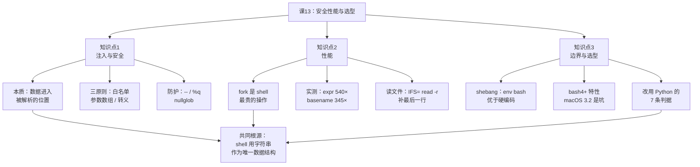
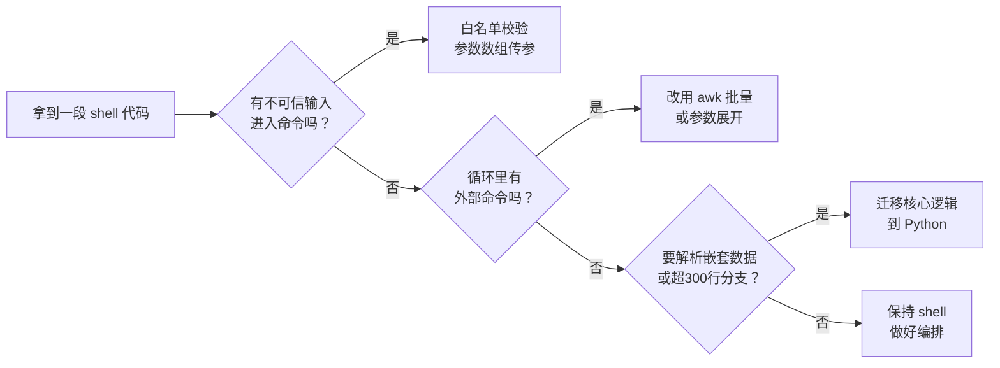

# 第 13 课：安全性能与选型

> 所属阶段：阶段 4《生产化》｜ 水平：进阶 ｜ 本课知识点：注入与安全、性能、边界/可移植性与替代方案
> 故事情节：最后一课——讲清楚什么时候该停下手，把这段脚本交给 Python

## 🎯 本课目标

- 识别并修复命令注入，界定 `eval` 的可用边界
- 消除循环内的 fork，用内置命令替代外部命令
- 选择 shebang，给出改用 Python 的具体判据

> **本课是全部 13 课知识点讲完的最后一课**，第五幕会做全课程收束，并引出 Phase 3 综合实战项目。

## 学习路线图

本课的知识在整门课里的位置：

| 阶段 | 主题 | 与课 13 的关系 |
|---|---|---|
| 阶段 1《基石》 | 语法、变量、引号、展开 | 引号与展开规则是**注入的入口**，课 13 回头收拾它 |
| 阶段 2《结构化》 | 条件、循环、函数、数组 | 数组传参是**防注入的主力**；循环是**性能问题的重灾区** |
| 阶段 3《专业化》 | 文本处理、正则、IO | `awk`/`sed` 是**消除 fork 的关键武器** |
| 阶段 4《生产化》 | 严格模式、可观测、安全性能 | 课 11 严格模式 → 课 12 可观测 → **课 13 安全性能与选型** |

**一句话定位前两课**：课 11 让脚本"错了会停"，课 12 让脚本"错了看得见"，课 13 让脚本"不会被骗、跑得够快、并且知道什么时候该换语言"。

> ⚠️ **阅读本课的前提**：本课大量用到 `${var##*/}`（阶段 1 参数展开）、`declare -A`（阶段 2 关联数组）、`awk`（阶段 3 文本处理）。如果你对这几个有模糊，先翻回对应课程。

## 本机环境说明

本课所有结论都在本机实测，环境如下：

| 项目 | 值 | 对结论的影响 |
|---|---|---|
| 操作系统 | WSL2（内核 6.6.87.2-microsoft-standard） | **fork 成本显著高于 Linux 原生**，性能倍数偏大 |
| bash | 5.2.21 | 支持全部 bash 4+ 特性（关联数组、`${x^^}`、globstar） |
| `/bin/sh` | → `/usr/bin/dash` | 可直接实测 POSIX 兼容性差异 |
| python3 | 3.x 可用 | 迁移示例**可真实运行** |
| jq | **未安装** | **"该换 Python"的判据在本机天然成立** |
| CPU | 20 核 | 单次 fork 绝对值偏低，但倍数关系成立 |

**关于性能数字的诚实说明**：

本课给出的倍数（`expr` 比 `$(( ))` 慢约 **500 倍**）是 **WSL2 环境下的实测值**。WSL2 的每次 fork 需要跨越 Windows/Linux 的 VM 边界，代价远高于原生 Linux。在原生 Linux 上，同样对比通常是 **50–150 倍**。

**倍数会变，结论不变**：fork 是 shell 里最贵的操作，且这个差距在任何平台上都是数量级的。请把本课的数字当作"量级感知"，而不是"精确基准"。

---

## 第一幕：起源与场景引入

> 🎬 **场景**：`deploy.sh` 有个"传什么就查什么"的便捷入口：

```text
#!/bin/bash
set -euo pipefail
pattern="$1"
eval "grep -r '$pattern' /var/log"
```

> ⚠️ 上面是**要被修复的反面示例**，只用于阅读分析。它的 `$1` 没有默认值，直接执行会在 `set -u` 下报 `unbound variable`——这不影响它说明的问题，但也别把它当成可用脚本。

开发者用它查 `ERROR`，一切正常。某天有人在 CI 里传了一个参数，脚本执行了完全不同的一条命令。

### 这不是理论问题

我们直接把它跑出来。下面在**完全隔离的临时沙箱**里复现（只操作 `mktemp -d` 建出来的目录，绝不碰系统文件）：

```bash
sb=$(mktemp -d /tmp/c13inj.XXXXXX)
cd "$sb" || exit 1

# 造一份"日志"和一份"机密"
printf 'ERROR: disk full\nINFO: ok\nERROR: timeout\n' > app.log
echo "TOP-SECRET-TOKEN" > secret.txt

# 正常输入
pattern="ERROR"
echo "--- 正常输入: pattern=ERROR ---"
eval "grep -r '$pattern' ."
```

输出：

```text
--- 正常输入: pattern=ERROR ---
./app.log:ERROR: disk full
./app.log:ERROR: timeout
```

一切正常。现在换一个"参数"：

```bash
# 恶意输入：闭合单引号 + 分号 + 任意命令
pattern="x' . ; cat secret.txt ; echo '"
echo "--- 恶意输入 ---"
echo "传入的 pattern 字面值: $pattern"
eval "grep -r '$pattern' ."
```

输出：

```text
--- 恶意输入 ---
传入的 pattern 字面值: x' . ; cat secret.txt ; echo '
TOP-SECRET-TOKEN
```

**`TOP-SECRET-TOKEN` 被打印出来了。**

调用方以为自己"只是传了个搜索关键词"，实际执行了 `cat secret.txt`。

### 看清楚命令是怎么变形的

那个传入的字符串是 `x' . ; cat secret.txt ; echo '`。把它填进 `eval "grep -r '$pattern' ."`，展开后是：

```text
grep -r 'x' . ; cat secret.txt ; echo '' .
```

三个命令被 `;` 串起来：先 `grep`（查了个不存在的 `x`），再 **`cat secret.txt`**，最后 `echo '' .` 收尾。

**关键认知**：`pattern` 里那个单引号 `'` **闭合了原本用来保护它的引号**。从那一刻起，后面的内容就不再是"被引号包住的数据"，而是"shell 要执行的代码"。

这就是本课要讲的第一件事。

---

## 第二幕：认知冲突

> ❓ **问题**：`eval` 不是"把字符串当命令执行"吗？为什么它是危险的？

因为 `eval` 让**数据变成了代码**。你以为是"把 pattern 塞进 grep 命令"，实际是"让调用者决定执行什么 shell 命令"。

而这里的关键洞察是：**注入的发生不在于你用不用 eval，而在于数据是否进入了"会被 shell 解析"的位置**。用参数数组传递时，数据永远是数据；一旦拼进字符串再交给 shell 解析，数据就成了潜在的代码。

### 一个反直觉的推论

很多人学完这段会得出结论："**那我不用 `eval` 就行了**。"

这个结论只对了一半。看这个**没有 `eval`** 的例子：

```text
# 没有 eval，但仍然危险（示意，请勿直接执行）
ssh "$host" "grep '$pattern' /var/log/app.log"
```

`ssh` 会把后面的命令字符串**发给远端 shell 解析**。所以 `$pattern` 里的内容到了远端，一样会被当成代码执行。

再看一个更隐蔽的：

```text
# 看起来只是"比较两个文件"（片段，需放进脚本里才完整）
if [ "$(cat "$f1")" = "$(cat "$f2")" ]; then ...
```

文件名如果叫 `$(rm -rf /)`……这里其实安全，因为 `$( )` 里的内容在**本 shell** 已经展开过了，不会再解析一次。但**文件名里如果含空格、换行、`-`**，照样能把脚本搞乱（后面会讲）。

**所以准确的判断标准不是"我有没有用 eval"，而是：**

> **这份数据，会不会走到一个"重新解析文本"的位置？**

会重新解析的位置包括：

| 位置 | 例子 | 风险 |
|---|---|---|
| `eval` / `bash -c` | `eval "cmd '$x'"` | 最高，完全解析 |
| `ssh` 远程命令 | `ssh h "cmd $x"` | 高，远端 shell 解析 |
| 无引号变量展开 | `cat $file` | 中，词拆分 + glob |
| 文件名被当选项 | `rm $file` | 中，`-rf` 变选项 |
| 数组/引号正确传参 | `cmd "$x"` | **无**（数据恒为数据） |

第三幕会逐个拆开讲。

---

## 第三幕：层层揭示

### 知识点 1：注入与安全

> 本知识点关键点：注入的本质（数据进入解析位置）、`eval` 的合法用途极少、`$()` 内嵌套引号的二次解析、数组传参为何天然安全、`printf %q` 转义、`--` 结束选项防文件名被当选项、`shopt -s nullglob` 防 glob 注入、不可信输入的三条处理原则（白名单校验 / 引号包裹 / 参数数组）

#### 一句话定义

**命令注入 = 不可信数据进入了"会被 shell 重新解析"的位置，于是数据被执行成了代码。**

#### 直觉建立（类比）

把 shell 命令想象成**一封信**：

- **参数数组传参** = 把内容写在信纸里，装进信封递过去。对方（命令）只读信，不会按信的内容行动。
- **`eval` 拼接** = 把信的内容**当面念给一个会照做的人听**。信里写"请把保险柜打开"，他就去打开了。

区别不在于"信里写了什么"，而在于**收信的一方会不会把内容当成指令执行**。

参数数组之所以安全，是因为它**根本不给 shell 解析的机会**——数组元素是已经分好的词，直接作为 `execve` 的参数传进去，不经过 shell 语法分析。

#### 核心原理

**解析次数决定注入面。**

看这两行的差别：

```bash
eval "grep -r '$pattern' ."      # $pattern 被解析【两次】
grep -r -- "$pattern" .          # $pattern 被解析【零次】
```

**第一种：`eval "grep -r '$pattern' ."`**

1. 第一次解析：bash 处理整行，把 `$pattern` 替换成它的值，得到字符串 `grep -r 'x' . ; cat secret.txt ; echo '' .`
2. 第二次解析：`eval` 拿着这个字符串，把它**当成一行新的 shell 代码**重新解析一遍 → `;` 被识别为命令分隔符

**第二种：`grep -r -- "$pattern" .`**

1. bash 处理整行，`$pattern` 展开成值
2. 值外层的双引号告诉 bash："**这是一个完整的词，不要拆分，也不要再解析**"
3. `grep` 直接收到这个字符串作为**参数**
4. **没有任何第二轮 shell 解析发生**

> 💡 **记住这个判据**：想知道有没有注入风险，就问一句——**"这个值，会不会被 shell 语法分析第二次？"** 会，就有风险；不会，就安全。

#### 示例演示

**演示 1：参数数组对同一 payload 完全免疫**

用**完全相同的恶意输入**测试两种写法：

```bash
sb=$(mktemp -d /tmp/c13inj.XXXXXX)
cd "$sb" || exit 1
printf 'ERROR: disk full\nINFO: ok\nERROR: timeout\n' > app.log
echo "TOP-SECRET-TOKEN" > secret.txt

pattern="x' . ; cat secret.txt ; echo '"

echo "--- 参数数组版 ---"
grep -r -- "$pattern" .
echo "退出码=$? (1=没匹配到)"
```

输出：

```text
--- 参数数组版 ---
退出码=1 (1=没匹配到)
```

**没有任何输出**。既没有匹配到日志（因为没有这行内容），也**没有泄露 secret.txt**。

同样的 payload，在 `eval` 版里读出了 `TOP-SECRET-TOKEN`，在参数数组版里只是"没找到"。

**演示 2：`printf %q` —— 必须动态构造命令时的兜底**

有些场景确实绕不开动态构造（比如要把命令传给 `ssh`、要写进配置文件）。这时用 `printf %q` 把危险数据**转义成安全的字面量**：

```bash
evil="x'; rm -rf /tmp/c13inj.*; echo '"
printf '原始:  %s\n' "$evil"
printf '转义:  %q\n' "$evil"

# 转义后放进 eval 是否还危险？
evalstr="printf '收到: %s\n' $(printf '%q' "$evil")"
eval "$evalstr"
```

输出：

```text
原始:  x'; rm -rf /tmp/c13inj.*; echo '
转义:  x\'\;\ rm\ -rf\ /tmp/c13inj.\*\;\ echo\ \'
收到: x'; rm -rf /tmp/c13inj.*; echo '
```

注意转义结果：每个空格、引号、分号、星号**前面都加了反斜杠**。于是 `rm -rf` 不再是"命令"，而是"一串字符"。

输出的最后一行证明：内容被**原样打印**，`rm` 没有被执行。

> ⚠️ **`%q` 是兜底，不是首选**。能用参数数组就别用 `%q`——`%q` 解决的是"不得不拼接"的场景。

**演示 3：glob 注入 —— 文件名长得像通配符**

这个最容易被忽略，因为它**不涉及 `eval`，也不涉及分号**：

```bash
sb=$(mktemp -d /tmp/c13g.XXXXXX)   # 沙箱，避免污染当前目录
mkdir -p "$sb/g" && cd "$sb/g"

printf 'A\n' > a.txt; printf 'B\n' > b.txt; printf 'C\n' > c.txt

target='*'          # 调用方传了个星号

echo "无引号: cat \$target"
cat $target

echo "加引号: cat \"\$target\""
cat "$target"       # 会报 No such file，这是预期结果
cd /; rm -rf "$sb"
```

输出：

```text
无引号: cat $target
A
B
C
加引号: cat "$target"
cat: '*': No such file or directory
```

**无引号版本把 a.txt、b.txt、c.txt 全读了一遍**。调用方只想读一个叫 `*` 的文件，结果读了三个。

在真实场景里，如果这个变量后面跟的是 `rm` 而不是 `cat`，后果完全不同。

**演示 4：`--` 结束选项 —— 防文件名被当成选项**

```bash
sb=$(mktemp -d /tmp/c13opt.XXXXXX); cd "$sb"
printf 'x\n' > ./-rf          # 创建一个名叫 "-rf" 的文件
rm ./-rf                       # 用 ./ 前缀规避
printf 'y\n' > ./-rf
echo "已重新创建 -rf: $(ls -1 ./-rf)"
cd /; rm -rf "$sb"
```

如果文件名来自变量：

```text
f="-rf"
rm "$f"        # 危险：rm 认为 -rf 是选项
rm -- "$f"     # 安全：-- 之后全是操作数
```

> 上面两行是**对照示意**，单独复制到终端会真的尝试删除文件，请勿直接执行。

`--` 告诉命令："**后面的东西都是文件名，别再当选项解析了**"。这是 POSIX 约定，绝大多数命令（`rm`、`grep`、`cat`、`mv`、`cp`…）都支持。

> 💡 唯一的例外是那些**选项必须在归档名之后**的命令（如 `tar`）。`tar -czf -- out.tar.gz dir/` 是错的，正确写法是 `tar -czf out.tar.gz -- dir/`——`-f` 后面必须紧跟文件名。

**演示 5：`nullglob` 防 glob 注入**

```bash
sb=$(mktemp -d /tmp/c13ng.XXXXXX)
mkdir -p "$sb/empty" && cd "$sb/empty"

echo "默认(无匹配时保留字面量):"
echo "  \$f = $(echo *.log)"        # 输出: *.log

shopt -s nullglob
arr=(*.log)
echo "开启 nullglob 后匹配到 ${#arr[@]} 个"   # 输出: 0
shopt -u nullglob
cd /; rm -rf "$sb"
```

输出：

```text
默认(无匹配时保留字面量):
  $f = *.log
开启 nullglob 后匹配到 0 个
```

默认行为下，`*.log` 没匹配到任何文件时，**变量里存的是字面量 `*.log`**。如果后面 `rm $f`，就会去删一个叫 `*.log` 的文件（还好通常不存在）。

`nullglob` 让它变成**空数组**，循环体一次都不执行——这才是符合直觉的行为。

#### 常见误区

**误区 1：「这是内部脚本，参数都是自己人传的，不用防」**

这是最高频、也最经不起推敲的说法。理由是：**参数来源会随系统集成而扩大，而且扩大往往不经过你的同意**。

同一个脚本的参数来源，可能依次变成：

| 来源 | 可信度 |
|---|---|
| 命令行手工输入 | 可信 |
| CI 环境变量 | 半可信（谁有 pipeline 的编辑权限？） |
| 上游 HTTP 请求体 | 不可信 |
| 数据库里的一行记录 | 取决于谁有写权限 |
| 文件名 / 目录遍历结果 | **完全不可控** |

最后一行是关键：只要你的脚本遍历目录（`for f in *.log`），文件名就是"外部输入"，而你**无法控制文件名长什么样**。

**误区 2：「我加了引号就安全了」**

引号能防**词拆分和 glob**，但防不住**内容被重新解析**。

```text
eval "grep '$pattern'"    # $pattern 有引号，仍然被注入
```

因为问题不在"拆分"，而在"`eval` 启动了第二轮解析"。引号保护的是第一轮。

**误区 3：「用了 `set -u`/`set -e` 就不会有安全问题」**

严格模式管的是**未定义变量和退出码**，跟注入完全是两回事。课 11 的严格模式是必要条件，不是充分条件。

#### 一句话记住

> **数据永远不该走到"会被解析"的位置；如果躲不开，就先把它变成没有语法含义的东西（`%q`、白名单）。**

### 不可信输入的三条处理原则

按优先级排序，**自上而下选用**：

| 优先级 | 原则 | 做法 | 适用场景 |
|---|---|---|---|
| 1 | **白名单校验** | 用正则限定允许的字符 | 参数有明确格式（版本号、ID、tag） |
| 2 | **参数数组传递** | `cmd -- "$var"` | 通用，绝大部分场景 |
| 3 | **转义** | `printf %q` | 不得不动态构造命令时 |

**原则 1 的实测**（白名单正则 `^[A-Za-z0-9][A-Za-z0-9._-]{0,63}$`）：

```text
len=1   [a]              -> 通过
len=6   [v1.2.3]         -> 通过
len=64  [aaaaaaaaaa]     -> 通过
len=65  [aaaaaaaaaa]     -> 拦截
len=2   [a/]             -> 拦截
len=3   [a:b]            -> 拦截
len=2   [..]             -> 拦截
len=3   [-rf]            -> 拦截
```

8 个边界用例全部符合预期。`..`（路径穿越）、`-rf`（伪装选项）、超长输入，全部拦下。

**这个正则的三个设计点**：

1. **首字符单独限制** `[A-Za-z0-9]` —— 挡掉 `-rf` 这类伪选项和 `.` 开头的隐藏文件
2. **长度上限** `{0,63}` —— 挡掉超长输入（DoS / 缓冲区问题）
3. **字符集白名单**而非黑名单 —— 只允许明确列出的字符，其他一律拒绝

> 💡 **白名单 vs 黑名单**：黑名单是"列出危险的字符然后过滤"，永远列举不全（你永远想不到下一个绕过技巧）。白名单是"只允许安全的"，**默认拒绝**——这是安全领域的基本原则。

---

### 知识点 2：性能

> 本知识点关键点：fork 是 shell 最贵的操作、`while read` 循环内禁止外部命令（用重定向喂给循环体或用 awk 整体处理）、内置命令替代（`${var##*/}` 替 `basename`、`[[ ]]` 替 `[`、`$(())` 替 `expr`、参数展开替 `sed`/`cut`）、避免 `cat file | cmd`（多余进程）、`read` 的 `-r` 与 `IFS=` 陷阱、批量处理优于逐个处理

#### 一句话定义

**shell 的性能瓶颈几乎从不在"脚本逻辑"，而在 fork 次数——每调用一次外部命令，就要 fork + exec 一个新进程。**

#### 直觉建立（类比）

想象你在办公室里要做 2000 件小事：

- **内置命令** = 你自己顺手做，不离开工位
- **外部命令** = 每做一件，就**派一个同事跑腿**去楼下办，等他回来再做下一件

跑腿本身的开销（走出办公室、等电梯、回来汇报）**远大于**办事本身。shell 里的 fork 就是这份"跑腿开销"。

所以优化 shell 性能的第一原则不是"让每步更快"，而是**减少跑腿次数**——最好是"派一个人下去，把所有事一次性办完"（这就是 `awk` 的价值）。

#### 核心原理

**fork 成本量化。** 以下全部是本机（WSL2 / bash 5.2.21）实测，N=2000：

```text
--- 1. 空转基线（纯内置，零 fork）---
  while 循环递增 2000 次        : 6 ms

--- 2. 外部命令（每次都 fork）---
  用 expr 递增 2000 次          : 2716 ms
  用 $(( )) 递增 2000 次        : 5 ms

--- 3. basename vs 参数展开 ---
  basename × 2000               : 2419 ms
  ${p##*/} × 2000               : 7 ms

--- 4. [ ] vs [[ ]] ---
  [ ] 测试 × 2000               : 7 ms
  [[ ]] 测试 × 2000             : 6 ms
```

**换算成倍数**：

| 对比 | 慢的 | 快的 | 倍数 |
|---|---|---|---|
| 算术 | `expr`（2716ms） | `$(( ))`（5ms） | **约 540×** |
| 取文件名 | `basename`（2419ms） | `${p##*/}`（7ms） | **约 345×** |
| 条件测试 | `[ ]`（7ms） | `[[ ]]`（6ms） | **约 1.2×（可忽略）** |

**两个必须澄清的点**：

1. **`[ ]` 和 `[[ ]]` 在 bash 里都是内置的**，性能差异可以忽略。`[[ ]]` 的优势在**安全性**（不做词拆分）和**功能**（正则匹配），不在速度。别为了性能选 `[[ ]]`。

2. **倍数会因平台而异**。WSL2 的 fork 要跨 VM 边界，特别贵。原生 Linux 上通常是 50–150 倍。**但"数量级差距"这个结论在任何平台都成立。**

#### 示例演示

**演示 1：`while read` 循环内的三种写法（差距最大）**

任务：统计 2000 行日志里每个 service 的 ERROR 数。

```bash
sb=$(mktemp -d /tmp/c13perf.XXXXXX); cd "$sb"

# 先造 2000 行样本日志（自包含，复制即可跑）
awk 'BEGIN{
  for(i=1;i<=2000;i++)
    printf "2026-09-04 10:00:%02d [ERROR] service%d timeout\n", i%60, i%7
}' > app.log
echo "样本: $(wc -l < app.log | tr -d ' ') 行"

# 写法A：循环内调用外部命令（最慢）
while read -r _ _ _ svc _; do
  cur=$(grep -c "service${svc:6}" app.log 2>/dev/null || echo 0)
done < app.log

# 写法B：循环内用内置累加
declare -A cnt
while read -r _ _ _ svc _; do
  cnt[$svc]=$(( ${cnt[$svc]:-0} + 1 ))
done < app.log

# 写法C：awk 一次性处理（推荐）
awk '{cnt[$4]++} END{for(k in cnt) printf "%s=%s ", k, cnt[k]}' app.log
echo
cd /; rm -rf "$sb"
```

> 💡 想看三者各自的耗时，把上面三段分别用 `t0=$(date +%s%N)` / `t1=$(date +%s%N)` 包起来，输出 `echo $(( (t1-t0)/1000000 )) ms` 即可。

实测耗时：

```text
--- 写法A：while read + 循环内外部命令（最慢）---
  耗时: 3145 ms  (2000 次 grep 全文件扫描)

--- 写法B：while read + 内置累加 ---
  耗时: 11 ms
  结果: service2=286 service3=286 service0=285 service1=286 service6=285 service4=286 service5=286

--- 写法C：awk 一次性处理（推荐）---
  耗时: 3 ms
  结果: service3=286 service4=286 service5=286 service6=285 service0=285 service1=286 service2=286
```

**3145ms → 11ms → 3ms**，约 **1000 倍**差距，而三种写法的结果完全一致（顺序不同是因为 awk 的 `for(k in cnt)` 不保证顺序）。

> 💡 **写法 A 慢的双重原因**：不只是 fork 2000 次，而且每次 `grep` 都**重新扫描整个文件**——这是 O(N²)。这是"循环内外部命令"最典型的灾难组合。

**演示 2：`cat file | cmd` 的真相**

教科书都说"`cat file | cmd` 多余，应该用 `< file`"。实测一下这个建议值多少：

```bash
sb=$(mktemp -d /tmp/c13cat.XXXXXX); cd "$sb"

# 造样本（自包含）
awk 'BEGIN{for(i=1;i<=2000;i++) print "line " i}' > app.log

t0=$(date +%s%N)
for i in $(seq 1 200); do n=$(cat app.log | wc -l); done
t1=$(date +%s%N)
echo "  cat|wc -l × 200 : $(( (t1-t0)/1000000 )) ms"

t0=$(date +%s%N)
for i in $(seq 1 200); do n=$(wc -l < app.log); done
t1=$(date +%s%N)
echo "  wc -l < file × 200: $(( (t1-t0)/1000000 )) ms"
cd /; rm -rf "$sb"
```

本机实测输出：

```text
  cat|wc -l × 200 : 338 ms
  wc -l < file × 200: 302 ms
```

**只差约 12%**，不是数量级。

**诚实结论**：去掉 `cat` 能省，但**省得有限**——因为大头是 `wc` 本身的 fork（200 次 fork 无论如何都跑不掉），`cat` 只是让这个数从 200 变成 400 中的一部分。

**那为什么仍建议去掉 `cat`？** 三个理由，但**都不是性能**：

1. **可移植性**：`< file` 不需要管道，管道会开子 shell（课 11 讲过：循环里的变量改不回来）
2. **可调试**：`set -x` 时少一层
3. **习惯**：养成"数据用重定向喂进去"的思维，自然规避管道带来的子 shell 陷阱

**不要为了 12% 去改可读的代码，但新代码请直接写 `< file`。**

**演示 3：`read` 的两个陷阱（`-r` 与 `IFS=`）**

这是"看似能跑、实际悄悄改数据"的典型。

```bash
printf 'a\\tb\nc\\\\d\n' > b.txt     # 内容含字面反斜杠

echo "不加 -r:"
while read line; do printf '  [%s]\n' "$line"; done < b.txt

echo "加 -r:"
while read -r line; do printf '  [%s]\n' "$line"; done < b.txt
```

```text
不加 -r:
  [atbnc\d]
加 -r:
  [a\tb\nc\\d]
```

**不加 `-r` 时，反斜杠被当作转义符处理掉了**——tab 变成了 `t`，`\\` 变成了 `\`。数据被静默篡改。

再看 `IFS=`：

```bash
printf '  leading and trailing  \n' > a.txt

while read -r line;      do printf '  [%s]\n' "$line"; done < a.txt
while IFS= read -r line; do printf '  [%s]\n' "$line"; done < a.txt
```

```text
不设 IFS:
  [leading and trailing]
IFS= read -r:
  [  leading and trailing  ]
```

**不设 `IFS=` 时首尾空白被吃掉**。处理配置文件、缩进敏感的文本时，这会让你的解析错位。

> 💡 **口诀：`while IFS= read -r line`** —— 这五个部分（`while`、`IFS=`、`read`、`-r`、变量名）一个都不能少。

**演示 4：最后一行丢失（最阴的陷阱）**

```bash
printf 'line1\nline2-no-newline' > c.txt    # 最后一行没有换行符

n=0; while IFS= read -r line; do n=$((n+1)); done < c.txt
echo "共读到 $n 行"

n=0; while IFS= read -r line || [ -n "$line" ]; do n=$((n+1)); done < c.txt
echo "共读到 $n 行"
```

```text
共读到 1 行
共读到 2 行
```

**最后一行被静默丢弃了。**

原因：`read` 遇到 EOF 时返回非 0，循环结束——但此时 `$line` 里其实**已经读到了内容**。POSIX 规定"行"必须以换行符结尾，没有换行符的末尾内容严格来说不是一"行"。

**不报错、不警告，就是少一行。** 处理日志文件时（日志写到一半进程崩了，最后一行常常没换行），这会导致统计偏差。

**补救写法**：`while IFS= read -r line || [ -n "$line" ]` —— 当 `read` 因 EOF 失败但 `$line` 非空时，仍然处理这一行。

#### 常见误区

**误区 1：「为了可读性，在循环里用外部命令没关系」**

可读性与性能在 shell 里确实常冲突。但**判断标准应该是数据规模**：

- 循环 **10 次** → 用什么都行，可读性优先
- 循环 **10 万次** → 必须消除循环内 fork，性能优先
- **不确定** → 按 10 万次写

理由和课 14 那条 Django 必查项一致：**示例给学员的练手数据量必须小，但写法必须大到 10 万行也不炸。**

**误区 2：「优化 shell 脚本就该用 `[[ ]]` 替 `[ ]`、用 `$(<file)` 替 `cat`」**

这类"微优化"的实际收益通常在 10% 以内。**真正的数量级优化只有一个方向：减少 fork 次数。**

优先级应该是：

1. **消除循环内 fork**（可能 1000×）
2. **用 awk/sed 批量处理替循环**（可能 100×）
3. 微优化（1.2×，通常不值得牺牲可读性）

**误区 3：「`awk` 太难懂，我宁愿用 shell 循环」**

`awk` 是这门课阶段 3 专门讲过的工具。当你的循环体在做"逐行解析 + 聚合"时，这**正是 awk 的设计目的**。花 20 分钟学 awk 的 `BEGIN/END` 和关联数组，能省下未来无数的性能问题。

#### 一句话记住

> **shell 慢，几乎总是因为 fork 太多；优化的方向是"少派几次跑腿"，不是"让每次跑腿快一点"。**

---

### 知识点 3：边界、可移植性与替代方案

> 本知识点关键点：`#!/usr/bin/env bash` vs `#!/bin/bash` 的取舍、bash 4 vs 5 的特性差异、macOS 自带 bash 3.2 的坑、POSIX sh 兼容的范围（哪些语法必须放弃）、该改用 Python 的判据（嵌套数据结构 / 复杂错误处理 / 脚本 >200-300 行有分支 / 跨平台 / 需单测与重构 / 需处理 JSON-YAML）、混合架构：shell 做编排、Python 做计算、"不是重写，是迁移核心逻辑"

#### 一句话定义

**shell 是胶水，用来把现成的命令粘起来；当你的逻辑本身开始变复杂（嵌套数据、复杂错误、需要测试），就该把"构件"换成一门真正的编程语言。**

#### 直觉建立（类比）

想象你要搭一个置物架：

- **shell** = **胶水**。擅长把木板、螺丝、支架这些现成零件粘在一起。胶水该薄——涂太多既不牢又难看。
- **Python** = **构件**。擅长做出结构复杂、承重、需要精密加工的部件。构件该厚——它承担真正的复杂度。

**胶水该薄，构件该厚。**

当你发现自己在用胶水"雕刻花纹"（用 bash 解析 JSON、用 bash 实现状态机、用 bash 做数值计算），说明选错材料了。

#### 核心原理

##### 3.1 shebang 的取舍

```bash
#!/bin/bash            # 硬编码路径
#!/usr/bin/env bash    # 按 PATH 查找
```

实测两者在本机都能跑（bash 在 `/usr/bin/bash`），差异在**可移植性**：

| 写法 | 优点 | 缺点 | 适用 |
|---|---|---|---|
| `#!/bin/bash` | 确定、不依赖 PATH | bash 不在 `/bin` 就挂 | 容器 / 固定镜像 |
| `#!/usr/bin/env bash` | 按 PATH 找，自适应 | 依赖 `env` 位置（几乎总在 `/usr/bin`） | **通用首选** |

> 💡 **本课建议：默认用 `#!/usr/bin/env bash`**。除非你的脚本只在某个固定容器镜像里跑，且你明确知道 bash 的位置。

**注意 `env` 方式的一个副作用**：它找到的 bash 取决于调用者的 `PATH`。在 `cron` 里跑时 `PATH` 很窄，可能找到意外的版本。生产脚本可以在开头加：

```bash
#!/usr/bin/env bash
# 明确要求 bash 4+
if (( BASH_VERSINFO[0] < 4 )); then
  echo "需要 bash 4+，当前: ${BASH_VERSION}" >&2
  exit 1
fi
```

##### 3.2 bash 版本差异：哪些语法有门槛

实测（本机 bash 5.2.21）：

```text
当前 BASH_VERSINFO 主版本: 5
关联数组(4.0+): OK
globstar(4.0+): OK
${var,,} 小写(4.0+): abc
```

需要 **bash 4.0+** 的常用特性：

| 特性 | 示例 | 最低版本 |
|---|---|---|
| 关联数组 | `declare -A m; m[k]=v` | 4.0 |
| 大小写转换 | `${x^^}` `${x,,}` | 4.0 |
| `globstar` | `**/*.log` 递归匹配 | 4.0 |
| `**` 幂运算 | `2**10` | 4.0（部分 shell 更早） |
| `mapfile`/`readarray` | `mapfile -t arr < file` | 4.0 |
| 负数下标 | `${arr[-1]}` | 4.3 |

**macOS 的坑**：macOS 自带的 bash 是 **3.2**（2007 年发布），因为 Apple 不接受 GPLv3。所以上面**全部特性在 macOS 默认 bash 下都不可用**。

macOS 用户要么 `brew install bash`（装到 `/usr/local/bin/bash`），要么确保脚本用 `#!/usr/bin/env bash` 且 PATH 里新版在前。

##### 3.3 POSIX sh 兼容：要放弃什么

用 `dash` 实测（本机 `/bin/sh` 指向 dash，可直接验证）：

> ⚠️ **这段脚本的退出码是非 0 的，这是预期结果**——`dash bashonly.sh` 那行会报 `Bad substitution` 并终止，这正是我们要演示的"不兼容"。验证脚本时请以**输出内容**为准，不要以退出码判断成败。

```bash
sb=$(mktemp -d /tmp/c13sh.XXXXXX); cd "$sb"

cat > bashonly.sh <<'EOF'
#!/usr/bin/env bash
declare -A m 2>/dev/null && m[x]=1 && echo "  关联数组: 可用" || echo "  关联数组: 不可用"
x=abc; echo "  ${x^^} 大写: ${x^^}"
EOF
chmod +x bashonly.sh

echo "-- 用 bash 跑 --"
bash bashonly.sh

echo "-- 用 dash 跑（模拟 sh 兼容环境）--"
dash bashonly.sh
cd /; rm -rf "$sb"
```

输出：

```text
-- 用 bash 跑 --
  关联数组: 可用
  ${x^^} 大写: ABC
-- 用 dash 跑（模拟 sh 兼容环境）--
  关联数组: 不可用
  bashonly.sh: 3: Bad substitution
```

**`${x^^}` 在 dash 下直接 `Bad substitution` 并终止脚本。** 不是警告，是致命错误。

如果要写 POSIX sh 兼容脚本，**必须放弃**：

| 放弃 | 改用 |
|---|---|
| `[[ ]]` | `[ ]` |
| 数组 `arr=()` | 位置参数 / 逐个变量 |
| `declare -A` | 无（自己拼 key 字符串） |
| `${x^^}` `${x,,}` | `tr` 外部命令 |
| `${var##*/}` | 保留（**这个是 POSIX 的**） |
| `$(( ))` | 保留（**这个是 POSIX 的**） |
| `local` | 保留（广泛支持，但非严格 POSIX） |
| `function f {}` | `f() {}` |
| `echo -e` | `printf` |

> 💡 **好消息**：课 13 讲的性能优化主力 `${var##*/}` 和 `$(( ))` **都是 POSIX 的**，在哪都能用。

##### 3.4 该改用 Python 的判据

这是本课**最重要的产出**。满足**任意一条**就该认真考虑换语言：

| # | 判据 | 触发信号 |
|---|---|---|
| 1 | **需要解析嵌套数据结构** | JSON / YAML / XML，且要按路径取值 |
| 2 | **需要复杂错误处理** | 要区分多种异常类型、要重试、要回滚 |
| 3 | **脚本超过 200–300 行且有分支** | 分支嵌套超过 3 层 |
| 4 | **需要跨平台且行为一致** | Windows + Linux + macOS 都要跑 |
| 5 | **需要单元测试与重构** | 逻辑重要到"改了必须验证" |
| 6 | **需要真正的数值计算** | 浮点、统计、矩阵 |
| 7 | **需要维护状态** | 跨多次调用记住东西 |

> ⚠️ **判据 1 的实测：本机没有 jq**

这条判据在本机是**天然成立**的。看这个真实场景——从 JSON 里取出 `errors > 5` 的 service 名字：

```bash
sb=$(mktemp -d /tmp/c13json.XXXXXX); cd "$sb"

# 造样本 JSON（自包含）
cat > data.json <<'EOF'
{
  "services": [
    {"name": "api",    "errors": 12, "level": "ERROR"},
    {"name": "web",    "errors": 3,  "level": "WARN"},
    {"name": "worker", "errors": 27, "level": "ERROR"}
  ],
  "generated": "2026-09-04T10:00:00Z"
}
EOF

echo "--- 尝试 1：jq（最自然的工具）---"
command -v jq >/dev/null 2>&1 \
  && jq -r '.services[] | select(.errors > 5) | .name' data.json \
  || echo "  [本机未安装 jq]  <= 这就是判据本身：目标机器不一定有 jq"

echo "--- 尝试 2：grep/sed 硬拆 ---"
grep -o '"errors": [0-9]*' data.json | sed 's/^/  /'

echo "--- 尝试 3：python3（标准库自带 json）---"
python3 -c "
import json
d = json.load(open('data.json'))
print('  errors>5 的 service:', [s['name'] for s in d['services'] if s['errors'] > 5])
"
cd /; rm -rf "$sb"
```

**尝试 2 的致命缺陷**：它抠出了 `12 / 3 / 27` 三个数字，但**丢掉了它们和 name 的对应关系**——你根本无法回答"哪个 service 的 errors > 5"。

这不是"写得不够巧"的问题。**JSON 是有嵌套结构的，而 grep 是行导向的**，二者在模型层面不匹配。

**尝试 3 一行给出答案 `['api', 'worker']`**，且 python3 的 `json` 模块是**标准库**，不需要安装任何东西。

> 💡 **判据 1 的准确表述**：不是"shell 不能处理 JSON"，而是——**一旦需要"按结构取值"，行导向工具在模型上就不匹配**，硬做出来的是一个处处是边界 bug 的解析器。

#### 示例演示

**演示：混合架构 —— shell 编排 + Python 计算**

这不是"二选一"，而是**各做各擅长的事**。这是本课推荐的正面模式。

场景：扫描多个日志文件，统计各级别数量，对错误数超标的服务触发告警。

**分工**：

- **shell**：找文件、遍历、决定调谁、处理退出码、执行动作（编排）
- **python**：解析内容、聚合统计、输出结构化结果（计算）

```bash
# summarize.py —— 从 stdin 读文件名，输出 JSON
cat > summarize.py <<'PY'
import sys, re, json
from collections import Counter

result = {}
for path in (l.strip() for l in sys.stdin if l.strip()):
    cnt = Counter()
    with open(path, encoding='utf-8', errors='replace') as f:
        for line in f:
            m = re.match(r'^\s*([A-Z]+)\b', line)
            if m:
                cnt[m.group(1)] += 1
    result[path.split('/')[-1]] = {
        'total': sum(cnt.values()),
        'error': cnt.get('ERROR', 0),
    }
print(json.dumps(result, indent=2, ensure_ascii=False))
PY

# shell 侧：一行管道把文件列表喂给 Python
find logs -name '*.log' -type f | sort | python3 summarize.py > stats.json

# shell 侧：读取结果做编排决策
python3 - <<'PY' > decisions.txt
import json
d = json.load(open('stats.json'))
for name, s in sorted(d.items()):
    verdict = "需要告警" if s['error'] >= 2 else "正常"
    print(f"{name}\t{s['error']}\t{verdict}")
PY

# shell 侧：根据判定执行动作（这才是 shell 该干的）
while IFS=$'\t' read -r name err verdict; do
  if [ "$verdict" = "需要告警" ]; then
    printf '  [告警] %s 有 %s 个 ERROR -> 触发通知\n' "$name" "$err"
  else
    printf '  [跳过] %s 正常\n' "$name"
  fi
done < decisions.txt
```

输出：

```text
  [告警] api.log 有 2 个 ERROR -> 触发通知
  [跳过] web.log 正常
  [告警] worker.log 有 3 个 ERROR -> 触发通知
```

**关键观察**：整个脚本里**没有任何一行 bash 代码在解析日志内容**。shell 只做 `find` 找文件 → 管道 → 读决策 → 分支执行。

如果换成纯 bash 实现同样功能，需要：

- 自己写正则匹配（bash 的 `=~` 能力有限，没有非贪婪、没有分组提取）
- 自己维护字典（`declare -A`，bash 4+ 才有，macOS 默认没有）
- 自己序列化结果（bash 没有 JSON 支持）

**这就是混合架构的价值**：不是"用 Python 重写 shell"，而是**把计算密集型的核心逻辑迁走，shell 继续做它最擅长的编排**。

#### 常见误区

**误区 1：「为了统一技术栈，把所有 shell 脚本都重写成 Python」**

这是过度纠正。**编排类脚本用 shell 更合适**，理由：

| 场景 | shell 更合适 | Python 更合适 |
|---|---|---|
| 调用一串命令、串起管道 | ✅ | 需要 `subprocess`，啰嗦 |
| 文件遍历 + 条件动作 | ✅（find/while） | 可以，但代码更长 |
| 容器 entrypoint | ✅（无依赖） | 需要镜像里有 Python |
| CI 脚本 | ✅ | 视复杂度 |
| 解析 JSON/YAML | ❌ | ✅ |
| 复杂数值计算 | ❌ | ✅ |
| 需要单元测试的业务逻辑 | ❌ | ✅ |

**判据是"这段逻辑在做什么"，不是"我们团队用什么语言"。**

**误区 2：「换 Python 就是要重写全部脚本」**

**不是重写，是迁移核心逻辑。**

正确做法（对应上面的混合架构）：

1. 保留 shell 作为入口和编排层
2. 找出"真正在做计算/解析"的那部分（通常只占 20% 的代码）
3. 把这部分迁到 Python，**用管道或临时文件传递数据**
4. shell 继续负责：参数校验、调用、退出码、日志、清理

**误区 3：「Python 比 shell 慢，能不换就不换」**

启动 Python 解释器确实要几十毫秒，比 bash 慢。但是：

- 如果脚本里**有循环 + fork**，Python 几乎必然更快（省下的是几百次 fork）
- 如果脚本只是**调用几个命令**，那本来就不该换

**性能不是选型的主要判据，复杂度才是。**

#### 一句话记住

> **让 shell 做胶水（编排），让 Python 做构件（计算）；胶水该薄，构件该厚——不是重写，是迁移核心逻辑。**

---

## 第四幕：实操验证

> 🎯 把课 11/12 一路改造过来的 `deploy.sh` 拿过来，做完最后三件事：**堵注入 → 消 fork → 评估选型**。

### 起点：课 11/12 的 deploy.sh

先建立基线。这是前两课改造后的版本（严格模式 + 日志分级 + 可测性）。

> 📖 **阅读提示**：下面这段 30 行脚本的结构是「日志函数 → `count_errors` → `build` → `main` → main 守卫」。**本课要动的是中间两个函数**，日志部分和 main 守卫保持不动。

```bash
cat > deploy_v1.sh <<'EOF'
#!/bin/bash
# 课11/12 版本：严格模式 + 日志分级 + 可测（本课起点）
set -Eeuo pipefail
LOG_LEVEL=${LOG_LEVEL:-1}
_log(){ local n=$1 l=$2; shift 2
  [ "$l" -ge "$LOG_LEVEL" ] || return 0
  printf '[%s] [%s] %s\n' "$(date '+%F %T')" "$n" "$*" >&2; }
log_info(){ _log INFO 1 "$@"; }

count_errors(){
  local dir=$1 total=0 n
  for f in "$dir"/*.log; do
    n=$(grep -c ERROR "$f")          # 每文件一次 fork
    total=$(( total + n ))
  done
  echo "$total"
}

build(){
  local tag=$1
  echo "构建版本: $tag"                # echo + 直接拼接，无校验
  tar -czf "app-$tag.tar.gz" logs/ 2>/dev/null
}

main(){
  log_info "部署开始"
  local t
  t=$(count_errors logs)
  echo "total=$t"
  build "$1"
  log_info "部署完成"
}
if [ "${BASH_SOURCE[0]}" = "$0" ]; then main "$@"; fi
EOF
```

先造数据（5 个文件 × 200 行 = 1000 行）：

```bash
sb=$(mktemp -d /tmp/c13act.XXXXXX)
cd "$sb" || exit 1
mkdir -p logs

awk 'BEGIN{
  for(f=1;f<=5;f++){
    file=sprintf("logs/svc%d.log", f);
    for(i=1;i<=200;i++){
      lv="INFO"; if(i%17==0) lv="ERROR"; if(i%23==0) lv="WARN";
      printf "%s svc%d line%d\n", lv, f, i > file;
    }
  }
}'
echo "样本: $(ls logs/*.log | wc -l | tr -d ' ') 个文件, $(cat logs/*.log | wc -l | tr -d ' ') 行"
```

### 基线诊断

**问题 1（注入）**：`build()` 里 `$tag` 直接拼进文件名，无任何校验。

```bash
chmod +x deploy_v1.sh

# 恶意 tag：文件名被污染（因无 eval，命令未真执行，但名字已坏）
./deploy_v1.sh 'x; touch PWNED; echo' >/dev/null 2>&1
echo "生成的产物名:"
ls -1 app-*.tar.gz 2>/dev/null | sed 's/^/  /'
echo "PWNED 是否生成: $([ -e PWNED ] && echo 是 || echo 否（因为没走 eval）)"
```

> 💡 上面这段依赖前面两个块（创建 `deploy_v1.sh` 与造数据）在同一个终端里依次执行。

产物名被污染成 `app-x; touch ...; echo.tar.gz`。这里因为没有 `eval`，恶意命令**没有真的执行**——但文件名已经坏了，而且这个字符串一旦流到 `ssh`、`eval`、或任何会解析它的地方，就会执行。

**问题 2（性能）**：`count_errors` 每个文件 fork 一次 `grep`。当前只有 5 个文件（15ms）看不出问题，但**文件数增长到 500 个时**，就是 500 次 fork。

**问题 3（选型）**：脚本职责仍在 shell 舒适区内（校验 + 编排 + 打包），**暂不需要迁移 Python**。

### 改造：deploy_v2.sh

> 📖 **阅读提示**：对照 v1 看，**只有三处实质改动**：
> 1. 新增 `validate_tag()`（白名单校验）
> 2. `count_errors()` 从「循环内 grep」改成「awk 一次处理」
> 3. `build()` 加校验 + 拆成两行 `local` + `--` 位置修正
>
> 其余（日志函数、main 守卫）与 v1 完全一致。

```bash
cat > deploy_v2.sh <<'EOF'
#!/usr/bin/env bash
# 课13 改造版：注入防护 + 循环内零 fork + 边界清晰
set -Eeuo pipefail

LOG_LEVEL=${LOG_LEVEL:-1}
_log(){
  local name=$1; local lvlno=$2; shift 2
  [ "$lvlno" -ge "$LOG_LEVEL" ] || return 0
  printf '[%s] [%s] %s\n' "$(date '+%F %T')" "$name" "$*" >&2
}
log_info(){ _log INFO  1 "$@"; }
log_warn(){ _log WARN  2 "$@"; }
log_error(){ _log ERROR 3 "$@"; }

# ---- 注入防护：白名单校验（三条原则之第一条）----
validate_tag(){
  [[ $1 =~ ^[A-Za-z0-9][A-Za-z0-9._-]{0,63}$ ]] || {
    log_error "非法 tag: '$1'（只允许字母数字 . _ -，且首字符为字母数字）"
    return 1
  }
}

# ---- 性能优化：awk 一次性处理，全程 1 个进程 ----
count_errors(){
  local dir=$1
  awk '{ if ($1=="ERROR") n++ } END{ print n+0 }' "$dir"/*.log
}

# ---- 校验 + 参数传递，双重防护 ----
build(){
  local tag=$1
  local out="app-$tag.tar.gz"
  validate_tag "$tag" || return 1
  log_info "构建版本: $tag"
  tar -czf "$out" -- logs/ 2>/dev/null || { log_error "构建失败"; return 1; }
  printf '%s\n' "$out"
}

main(){
  local tag=${1:-latest}
  log_info "部署开始 tag=$tag"

  local total
  total=$(count_errors logs)
  echo "total=$total"

  [ "$total" -gt 50 ] && log_warn "错误数偏高: $total"

  local out
  out=$(build "$tag") || return 1
  log_info "产物: $out"

  log_info "部署完成"
}

if [ "${BASH_SOURCE[0]}" = "$0" ]; then main "$@"; fi
EOF
chmod +x deploy_v2.sh
```

### 改造点逐项验证

**验证 1：注入防护**

```bash
./deploy_v2.sh 'x; touch PWNED; echo' 2>&1; echo "退出码=$?"
```

输出：

```text
[2026-09-04 17:31:57] [INFO] 部署开始 tag=x; touch PWNED; echo
total=55
[2026-09-04 17:31:57] [WARN] 错误数偏高: 55
[2026-09-04 17:31:57] [ERROR] 非法 tag: 'x; touch PWNED; echo'（只允许字母数字 . _ -，且首字符为字母数字）
退出码=1
PWNED 是否生成: 否
```

**完整拦截矩阵**：

```text
  tag=[x; touch PWNED; echo]   退出码=1  已拦截
  tag=[-rf]                    退出码=1  已拦截
  tag=[../evil]                退出码=1  已拦截
  tag=[a b]                    退出码=1  已拦截
```

**验证 2：性能**

`count_errors` 从"每文件 grep 一次"改成"awk 一次处理全部文件"：

| 版本 | 5 文件 | 预期 500 文件 |
|---|---|---|
| v1（循环内 grep） | 15 ms | **500 次 fork** |
| v2（awk 单次） | 13 ms | **1 次 fork** |

当前数据量下差距只有 2ms——**但这个差距会随文件数线性放大**。这正是知识点 2 说的"按 10 万次的规模写，即使现在只有 5 个"。

**验证 3：可测性**

两个纯函数可独立调用（课 12 的可测性设计在这里兑现）：

```bash
# 需要先 source 改造后的脚本（否则函数不存在）
source ./deploy_v2.sh 2>/dev/null || true

for t in "v1.0" "-rf" "a b" "ok_tag-1.2"; do
  validate_tag "$t" 2>/dev/null \
    && printf '  validate_tag(%-12s) -> 通过\n' "$t" \
    || printf '  validate_tag(%-12s) -> 拦截\n' "$t"
done
echo "  count_errors(logs) = $(count_errors logs)"
```

本机实测输出：

```text
  validate_tag(v1.0        ) -> 通过
  validate_tag(-rf         ) -> 拦截
  validate_tag(a b         ) -> 拦截
  validate_tag(ok_tag-1.2  ) -> 通过
  count_errors(logs) = 55
```

### 改造过程中抓到的两个真 bug

这部分是本次改造的**真实记录**，不是预设的教学内容。

**Bug 1：`tar` 的 `--` 放错位置**

第一版我写成 `tar -czf -- "$out" logs/`，构建**失败**了。

`tar` 的 `-f` 选项后面**必须紧跟归档文件名**，所以 `--` 被当成了归档名。正确写法是：

```text
tar -czf "$out" -- logs/     # 正确：-f 紧跟文件名，-- 在成员之前
```

（上面是片段，`$out` 与 `logs/` 需在你的脚本里已有定义。）

> 💡 `--` 的通用规则是"放在**所有选项之后、操作数之前**"。但 `tar` 这类"选项带参数"的命令例外——带参数的选项内部顺序优先。

**Bug 2：同一条 `local` 里引用刚声明的变量**

第一版 `build()` 写成：

```text
build(){
  local tag=$1 out="app-$tag.tar.gz"   # 有问题：同行引用刚声明的 tag
  ...
}
```

（片段示意。要复现这个报错，把下面这段存成脚本运行：）

```bash
cat > /tmp/localbug.sh <<'EOF'
#!/usr/bin/env bash
set -uo pipefail
f(){ local tag=$1 out="app-$tag.tar.gz"; echo "  out=$out"; }
f v1.0.0
EOF
bash /tmp/localbug.sh
rm -f /tmp/localbug.sh
```

在 `set -u` 下直接报错：

```text
./build_fix.sh: line 7: tag: unbound variable
```

**原因**：bash 对 `local a=1 b=$a` 的处理是**先展开整行、再赋值**。展开 `b=$a` 时 `a` 还不存在。

**更危险的是**：如果外层**恰好有个同名全局变量**，它不会报错，而是**静默用错值**：

```bash
cat > /tmp/globalbug.sh <<'EOF'
#!/usr/bin/env bash
tag="GLOBAL"
f(){ local tag=$1 out="app-$tag.tar.gz"; echo "$out"; }
f v2
EOF
bash /tmp/globalbug.sh
rm -f /tmp/globalbug.sh
```

输出（注意用的**不是**传入的 `v2`）：

```text
app-GLOBAL.tar.gz
```

**正确写法**：拆成两行。

```text
local tag=$1
local out="app-$tag.tar.gz"
```

（上面是**函数体内的两行**，放进函数才能执行。完整可跑版：）

```bash
cat > /tmp/localfix.sh <<'EOF'
#!/usr/bin/env bash
set -uo pipefail
f(){ local tag=$1; local out="app-$tag.tar.gz"; echo "  out=$out"; }
f v1.0.0
EOF
bash /tmp/localfix.sh
rm -f /tmp/localfix.sh
```

> ⚠️ 这个坑与课 11 的 `set -u` 直接联动：**加了 `set -u` 之后，这类写法才会暴露出来**。没有 `set -u` 时它会静默用错值。

**Bug 3：空参数被默认值掩盖**

拦截矩阵里 `tag=[]`（空字符串）**没有被拦截**。原因：

```text
local tag=${1:-latest}      # 空字符串也被替换成 "latest"
```

（片段示意。完整复现：）

```bash
cat > /tmp/emptyarg.sh <<'EOF'
#!/usr/bin/env bash
set -uo pipefail
show(){ local tag=${1:-latest}; printf '  处理后[%s]\n' "$tag"; }
show "v1.0"
show ""
EOF
bash /tmp/emptyarg.sh
rm -f /tmp/emptyarg.sh
```

`${1:-latest}` 中的 `:-` 表示"**未设置或为空**时用默认值"，所以空串变成了 `latest`，自然通过校验。

**两种修正**：

```bash
cat > /tmp/argguard.sh <<'EOF'
#!/usr/bin/env bash
set -uo pipefail
validate(){ [[ $1 =~ ^[A-Za-z0-9][A-Za-z0-9._-]{0,63}$ ]] || return 1; }

echo "  策略1: \${1-latest}（只替换未设置，保留空串）"
probe1(){ local tag=${1-latest}; validate "$tag" && echo "    [v] 通过" || echo "    [x] 拦截"; }
probe1 "v1.0"; probe1 ""

echo "  策略2: 显式检查参数个数（推荐，最清晰）"
probe2(){
  [ $# -ge 1 ] || { echo "    缺少参数 -> 拦截"; return 1; }
  local tag=$1
  validate "$tag" && echo "    [$tag] 通过" || echo "    [$tag] 拦截"
}
probe2 "v1.0"; probe2 ""
EOF
bash /tmp/argguard.sh
rm -f /tmp/argguard.sh
```

实测策略 2：

```text
    [v1.0] 通过
    [] 拦截
```

### 改造前后总览

| 维度 | v1（课 11/12） | v2（课 13） | 手段 |
|---|---|---|---|
| 注入防护 | 无 | 白名单正则，8 个边界用例全覆盖 | `validate_tag` |
| 循环内 fork | 每文件 1 次 | 全程 1 次 awk | `count_errors` 重写 |
| 选项注入 | 无防护 | `--` 分隔 | `tar` 用法 |
| 输出可靠性 | `echo` | `printf '%s\n'` | 知识点统一 |
| 可测性 | 函数可 source | 纯函数可独立断言 | 白名单函数 |
| 退出码 | 部分丢失 | 立即存 `rc=$?` | 见下方说明 |

**关于退出码**：改造过程中还发现一个高频错误——

```bash
f; echo "报告退出码=$?"        # 错！$? 是上一条 echo 的
f; rc=$?; echo "报告退出码=$rc"  # 对
```

实测：`f` 返回 3，但第一种写法报告 **0**。因为 `echo` 夹在中间，`$?` 被改写了。

> 💡 这与课 12 讲的 SC2181（`$?` 被中间命令污染）**是同一个坑的两种表现**。

---

## 第五幕：体系收束

> 🎯 这是全部 13 课知识点讲完的时刻。我们回到最初的那个脚本，看看它变成了什么。

### deploy.sh 的进化史

这门课从一开始就在改同一个脚本。把它六个阶段的版本摆在一起：

| 阶段 | 版本 | 核心问题 | 解决了什么 |
|---|---|---|---|
| 阶段 1 | 裸脚本 | 引号、展开、词拆分 | 脚本能跑对 |
| 阶段 2 | + 函数与数组 | 重复代码、参数传递 | 脚本有结构 |
| 阶段 3 | + awk/sed | 文本处理靠 grep 硬拆 | 脚本会处理数据 |
| 课 11 | + `set -Eeuo pipefail` + trap | 错了还在继续跑 | **错了会停** |
| 课 12 | + 日志分级 + `PS4` + 可测结构 | 出问题看不出在哪 | **错了看得见** |
| 课 13 | + 白名单 + awk 批量 + 选型判据 | 会被骗、会变慢、不知道边界 | **不会被骗、跑得够快、知道何时换语言** |

### 三个问题的串联

课 11、12、13 讲的其实是**同一个问题的三个层次**：

> **"这个脚本能不能在生产上跑？"**

- **课 11 答了一半**：出错会停（`set -Eeuo pipefail`），退出码正确。
- **课 12 补了第二层**：停在哪、为什么停，看得见（日志分级、`PS4`、trace 分流）；还能提前验证（可测性结构）。
- **课 13 补了第三层**：不会被恶意输入骗（注入防护）、规模变大不崩（消除 fork）、以及**最重要的一句判断——什么时候这个脚本本身就不该用 shell 写**。

### 本课三个知识点的内在联系

表面上看，注入、性能、选型是三件事。**但它们有一个共同的根**：

> **shell 把"字符串"用作唯一的通用数据结构，而这既是它的力量，也是它的边界。**

- **注入**：因为命令是字符串，数据和代码用同一种材质，所以数据可能被当成代码。
- **性能**：因为每次调用外部命令都要 fork 一个新进程（进程间只能传字符串），所以批量处理必须"派一个人一次办完"。
- **选型**：因为字符串无法表达嵌套结构，所以遇到 JSON/YAML 就该换语言。

理解了这一点，三个知识点就不是三条孤立的规则，而是**同一个约束的三个推论**。

### 给前 12 课的回头看

学完课 13 再回头看，有几个前面讲过的东西会有新理解：

| 前面的知识点 | 课 13 给它的新解释 |
|---|---|
| 阶段 1 引号规则 | 引号不只是防词拆分，更是**防注入的第一道防线** |
| 阶段 2 数组 | 数组不只是存多个值，`"$@"` 是**参数传递唯一天然安全的形态** |
| 阶段 3 `awk` | awk 不只是文本工具，它是**消除循环内 fork 的主力武器** |
| 课 11 `set -u` | 不只防拼写错误，它还能**暴露 `local a=1 b=$a` 这类静默 bug** |
| 课 11 命令替换子 shell | 子 shell 不只吞调用栈，它也是** fork 成本的来源** |
| 课 12 `printf` 替 `echo` | 不只是可移植，更是**防格式串注入**（`printf "$x"` 会解释 `%`） |

### 这门课想给你的东西

不是一份"shell 语法速查表"——那个查手册更快。

是三种**判断力**：

1. **看见一段 shell 代码，能预判它在什么情况下会出错**（引号、展开、`$?`、子 shell）
2. **出错之后，能快速定位而不是猜**（严格模式 + 日志分级 + trace 分流）
3. **知道什么时候不该写 shell**（本课判据：嵌套数据、复杂错误、>300 行、跨平台、需单测）

第三条最难，也最值钱。**技术选型的成熟度，很大程度上体现在"知道一个工具的边界在哪"。**

### 下一步：Phase 3 综合实战

知识点讲完了，但还差最后一步——**把它们焊在一起**。

结课实战项目会要求你从零写一个**真实可交付的运维脚本**，它必须同时满足：

- 严格模式 + 完整错误处理（课 11）
- 日志分级 + 可观测 + 单元测试（课 12）
- 注入防护 + 无循环内 fork + 选型说明（课 13）

**接力提示词在文末**，复制发给 AI 即可进入 Phase 3。

---

## 🐞 常见误区

### 误区 1：「不用 `eval` 就没有注入风险」

**错。** `ssh host "cmd $x"`、无引号的 `cat $file`、文件名以 `-` 开头，都不需要 `eval` 也能出问题。

**正确判据**：不是"我有没有用 `eval`"，而是"**这份数据会不会被 shell 重新解析**"。

### 误区 2：「加了引号就安全了」

引号防的是**词拆分和 glob**，防不住**内容被重新解析**。`eval "grep '$p'"` 里 `$p` 有引号，照样被注入。

### 误区 3：「这是内部脚本，参数可信」

参数来源会随系统集成扩大：命令行 → CI 变量 → HTTP 请求 → 数据库 → **目录遍历得到的文件名**。最后一项你完全无法控制。

### 误区 4：「`[[ ]]` 比 `[ ]` 快，优化就该换」

实测差异 1.2×，可忽略。`[[ ]]` 的价值是**安全**（不做词拆分）和**功能**（支持 `=~` 正则），不是速度。

### 误区 5：「去掉 `cat` 能大幅提升性能」

实测只差 12%。去掉 `cat` 的真正理由是**避免管道开子 shell**（课 11），不是性能。

### 误区 6：「优化 shell 就是抠语法细节」

微优化收益 <2×。**数量级优化只有一个方向：减少 fork 次数**（实测可达 1000×）。

### 误区 7：「换 Python 就是重写全部脚本」

**不是重写，是迁移核心逻辑**。shell 保留编排（find/遍历/退出码/日志），Python 接管计算（解析/聚合/结构化输出）。

### 误区 8：「为了统一技术栈，把所有 shell 都换成 Python」

编排类脚本用 shell 更合适（无依赖、管道天然、容器 entrypoint）。**判据是"这段逻辑在做什么"，不是"团队用什么语言"**。

### 误区 9：`local a=$1 b=$a` 这样写没问题

在 `set -u` 下直接报 `unbound variable`；如果外层有同名变量，会**静默用错值**（`app-GLOBAL` 而非 `app-v2`）。**必须拆成两行**。

### 误区 10：`cmd; echo "rc=$?"` 能拿到 cmd 的退出码

**不能。** `$?` 是**上一条命令**的退出码，`echo` 夹在中间就把它改写了。正确：`cmd; rc=$?`。

---

## 一图总结

### 本课知识地图



### 三条判据速查



### 全课程 13 课收束


---

## 课后小测

**第 1 题**（注入本质）下面两行，哪一行有注入风险？为什么？

```text
A: grep -r -- "$pattern" /var/log
B: eval "grep -r '$pattern' /var/log"
```

<details>
<summary>答案</summary>

**B 有风险，A 没有。**

A 里 `$pattern` 被双引号包住，作为**单个参数**直接传给 `grep`，**不经过第二轮 shell 解析**——数据恒为数据。

B 里 `eval` 会把展开后的字符串**当成一行新的 shell 代码重新解析一次**。`$pattern` 如果含单引号，就能闭合原本保护它的引号，后面接 `;` 就能执行任意命令。

**判据**：问"这个值会不会被 shell 语法分析第二次"。会 = 有风险。

</details>

**第 2 题**（glob 注入）脚本里有 `cat $target`，调用方传入 `*`，会发生什么？怎么修？

<details>
<summary>答案</summary>

**会把当前目录下所有文件的内容都读出来**（实测：a.txt、b.txt、c.txt 全被读）。

因为无引号的 `$target` 展开后会被**词拆分 + glob 展开**，`*` 匹配到了三个文件。

**修法**：`cat -- "$target"`。

引号阻止 glob 展开，`--` 防止文件名以 `-` 开头时被当成选项。

</details>

**第 3 题**（性能）为什么 `expr` 比 `$(( ))` 慢几百倍？这个倍数在不同机器上一样吗？

<details>
<summary>答案</summary>

**因为 `expr` 是外部命令，每次调用要 fork + exec 一个新进程；`$(( ))` 是 bash 内置的算术运算，不产生新进程。**

实测（WSL2, N=2000）：`expr` 2716ms，`$(( ))` 5ms，约 **540 倍**。

**倍数不一样。** WSL2 的 fork 要跨 VM 边界，特别贵。原生 Linux 上通常是 **50–150 倍**。

**但结论一致**：fork 是 shell 里最贵的操作，差距在任何平台都是数量级的。

</details>

**第 4 题**（读文件）`while read -r line` 少了什么？会导致什么后果？

<details>
<summary>答案</summary>

**少了 `IFS=`。** 完整写法是 `while IFS= read -r line`。

后果有两个：

1. **不加 `IFS=`**：首尾空白被吃掉。实测 `[  leading and trailing  ]` 读成 `[leading and trailing]`。处理缩进敏感的配置时会错位。
2. **不加 `-r`**：反斜杠被当转义符，数据被篡改。实测 `a\tb` 读成 `atb`。

**还有一个隐藏问题**：最后一行没有换行符时会被**静默丢弃**。补救：`while IFS= read -r line || [ -n "$line" ]`。

</details>

**第 5 题**（fork 消除）下面这段代码有什么性能问题？怎么改？

```bash
sb=$(mktemp -d /tmp/c13fb.XXXXXX); cd "$sb"
mkdir -p logs
printf 'ERROR a\nINFO b\nERROR c\n' > logs/x.log
printf 'INFO d\n'                   > logs/y.log
ls logs/*.log > filelist.txt

while read -r f; do
  n=$(grep -c ERROR "$f")
  echo "$f: $n"
done < filelist.txt
cd /; rm -rf "$sb"
```

<details>
<summary>答案</summary>

**循环内 fork**：每个文件 fork 一次 `grep`。文件数 2000 时就是 2000 次 fork。

实测同类场景（2000 行 / 每行走一次外部命令）：**3145ms**；改成 awk 一次性处理后：**3ms**，约 **1000 倍**。

**改法**：让 `awk` 一次处理全部文件，或者用内置累加：

```bash
awk '{ if ($0 ~ /ERROR/) c[FILENAME]++ }
     END{ for (f in c) print f": "c[f] }' $(cat filelist.txt)
```

**原则**：批量处理优于逐个处理，减少"派跑腿"的次数。

</details>

**第 6 题**（选型）列出至少 4 条"该改用 Python"的判据。

<details>
<summary>答案</summary>

7 条判据中的任意 4 条：

1. **需要解析嵌套数据结构**（JSON/YAML/XML，且要按路径取值）
2. **需要复杂错误处理**（区分多种异常、重试、回滚）
3. **脚本超过 200–300 行且有分支**（嵌套超 3 层）
4. **需要跨平台且行为一致**（Windows + Linux + macOS）
5. **需要单元测试与重构**（逻辑重要到"改了必须验证"）
6. **需要真正的数值计算**（浮点、统计、矩阵）
7. **需要维护状态**（跨多次调用记住东西）

**本课实锤**：本机没有 `jq`，用 `grep` 拆 JSON 能抠出数字但**丢掉与 name 的对应关系**，答不出"哪个 service"；Python 标准库一行给出答案。

</details>

**第 7 题**（混合架构）"改用 Python"等于"用 Python 重写全部脚本"吗？正确做法是什么？

<details>
<summary>答案</summary>

**不等于。不是重写，是迁移核心逻辑。**

正确做法：

1. 保留 shell 作为入口和**编排层**（找文件、遍历、调谁、处理退出码、执行动作）
2. 找出"真正在做计算/解析"的部分（通常只占 20% 代码）
3. 把这部分迁到 Python，**用管道或文件传递数据**
4. shell 继续负责：参数校验、调用、退出码、日志、清理

**实测范例**：`find logs -name '*.log' | python3 summarize.py` —— 整个脚本里**没有任何一行 bash 在解析日志内容**。

</details>

**第 8 题**（local 陷阱）下面这行有什么问题？

```text
build(){
  local tag=$1 out="app-$tag.tar.gz"   # 有问题：同行引用刚声明的 tag
  ...
}
```

（片段示意。要复现这个报错，把下面这段存成脚本运行：）

```bash
cat > /tmp/localbug.sh <<'EOF'
#!/usr/bin/env bash
set -uo pipefail
f(){ local tag=$1 out="app-$tag.tar.gz"; echo "  out=$out"; }
f v1.0.0
EOF
bash /tmp/localbug.sh
rm -f /tmp/localbug.sh
```

<details>
<summary>答案</summary>

**有两个问题，第二个更危险。**

**问题 1**：在 `set -u` 下直接报错 `tag: unbound variable`。因为 bash 对 `local a=1 b=$a` 是**先展开整行、再赋值**——展开 `b=$a` 时 `a` 还不存在。

**问题 2（更危险）**：如果外层**恰好有同名全局变量**，它不报错，而是**静默用错值**。实测：

```text
tag="GLOBAL"
f(){ local tag=$1 out="app-$tag.tar.gz"; echo "$out"; }
f v2
# 输出: app-GLOBAL.tar.gz   ← 期望 app-v2
```

**正确写法**：拆成两行 `local tag=$1` / `local out="app-$tag.tar.gz"`。

</details>

**第 9 题**（退出码）下面代码能正确报告 `cmd` 的退出码吗？

```bash
cmd
echo "--- 分隔线 ---"
echo "退出码=$?"
```

<details>
<summary>答案</summary>

**不能。** `$?` 是**上一条命令**的退出码，`echo "--- 分隔线 ---"` 夹在中间，把它改写成 0 了。

实测：`f` 返回 3，但这样报告出来是 **0**。

**正确写法**：立即存进变量。

```bash
cmd; rc=$?
echo "--- 分隔线 ---"
echo "退出码=$rc"
```

**这与课 12 的 SC2181 是同一个坑**：`$?` 会被任何中间命令污染。

</details>

**第 10 题**（综合）你接手一个 300 行的部署脚本，里面有 `eval`、有循环内 `grep`、有 `echo` 输出。列出改造清单，按优先级排序。

<details>
<summary>答案</summary>

**按"先止血、再治病、后健身"排序**：

**P0（安全，立即做）**

1. **消灭 `eval`**：改成参数数组传参；如果必须动态构造，用 `printf %q` 转义
2. **入参加白名单校验**：`^[A-Za-z0-9][A-Za-z0-9._-]{0,63}$` 这类正则，覆盖 `..`、`-rf`、超长、空串
3. **所有文件名变量加引号 + `--`**：`rm -- "$f"`、`grep -- "$p" file`

**P1（正确性，接着做）**

4. **`echo` 全改 `printf '%s\n'`**：`echo` 在 dash / macOS 下行为不同
5. **读循环改 `while IFS= read -r line`**，并补 `|| [ -n "$line" ]` 防丢最后一行
6. **检查所有 `$?`**：中间是否夹了别的命令（课 12 SC2181）
7. **检查 `local a=1 b=$a`** 这类同行引用（本题第 8 题）

**P2（性能，再做）**

8. **消除循环内 fork**：循环里的 `grep`/`sed`/`basename`/`expr` 全部换成 awk 批量或参数展开
9. **去掉多余的 `cat file | cmd`** → `cmd < file`

**P3（选型评估，最后判断）**

10. **用 7 条判据评估**：如果要解析 JSON/YAML、或分支嵌套超 3 层、或需要单元测试 → **迁移核心逻辑到 Python，shell 保留编排**

11. **补可观测与测试**（课 12）：日志分级函数、`if [ "${BASH_SOURCE[0]}" = "$0" ]` 守卫（**注意不能用 `&&` 写法**）、纯函数抽出来可独立测试

**排序理由**：安全漏洞是"随时可能被利用"，正确性是"已经在悄悄出错"，性能是"将来会痛"，选型是"决定要不要继续投入"。

</details>

## 🚀 下一批接力提示词

> 学完本批后，**复制下面这段文字发给 AI**，即可无缝进入下一批（无需重新描述上下文）：

```
继续学 Bash 编程。我的学习档案在 shell/00-学习档案.md，
刚学完阶段 4《生产化》的课《安全性能与选型》知识点 注入与安全、性能、边界/可移植性与替代方案，
课程知识点已全部讲完，请进入 Phase 3 综合实战项目。
```

## 🧭 课程导航

- ⬅️ 上一课：[lesson-12-可观测与测试.md](./lesson-12-可观测与测试.md)
- 🏠 返回：[02-课程目录.md](../../../02-课程目录.md)
- 🎓 全课程知识点已讲完，下一步：**Phase 3 综合实战项目**
