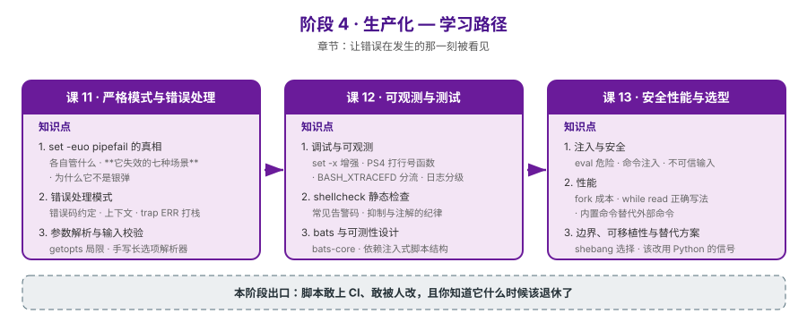

# 阶段 4：生产化

> 所属课程：Bash 编程 ｜ 故事章节：让错误在发生的那一刻被看见 ｜ 上一阶段：[阶段 3](../3-进程边界/overview.md)

## 🎯 本阶段目标

- 把脚本从"能跑"推到"**敢上生产**"：错误在发生的那一刻就被发现，而不是三小时后
- 建立**可观测与可测**能力：能调试、能被静态检查、能有单元测试
- 知道**安全与性能**的硬边界，以及**什么时候该停下改用 Python**

## 📍 学习重点

- **`set -euo pipefail` 的真相**：这是最多人写、最少人真懂的一行。重点是**它失效的七种场景**（条件上下文、`!` 取反、`||` 短路、函数返回值被吞、子 shell、算术上下文、`set -e` 被继承覆盖）——背下"要加"没用，得知道它什么时候不加
- **错误处理模式**：退出码语义约定（0 成功 / 1 通用错 / 2 用法错 / 126-127 / 128+n）、错误信息带上下文、`trap ERR` 打印调用栈、以及"失败时留下可诊断的现场"
- **参数解析**：`getopts` 只支持单字符短选项且不支持 `--long=value`，生产脚本往往需要手写解析器——这其中的套路（未知选项报错、参数校验、`--help` 契约）值得单独讲
- **可观测**：`set -x` 默认输出可读性差，靠 `PS4` 定制（带行号、函数、子 shell 层级）、`BASH_XTRACEFD` 把 trace 从 stdout 分离，才能用于生产排障。输出一律用 `printf` 而非 `echo`——`echo` 的 `-n` `-e` 与转义行为在 bash / dash / macOS 下各不相同，日志本身不可靠谈何可观测
- **`shellcheck`**：不是"装上就完事"，重点是常见告警码（SC2086 未加引号、SC2046、SC2181、SC2312）与**抑制注解的使用纪律**（乱加 `# shellcheck disable` 等于没装）
- **`bats-core`**：shell 不是不能测，是**大多数脚本的写法不可测**。关键是把副作用（调外部命令、写文件）隔离成可注入的函数
- **安全**：`eval` 与命令注入的边界；不可信输入进命令行就是注入，进参数数组则不是
- **性能**：fork 是 shell 最贵的操作；`while read` 循环的正确写法、内置命令替代外部命令
- **选型**：给出"该改用 Python"的**具体信号**（行数阈值、数据结构复杂度、错误处理需求、跨平台需求）——这是本课程最重要的判断力

## ✅ 必须掌握的知识点

| 知识点 | 所属课 | 学完应能 |
|--------|--------|----------|
| `set -euo pipefail` 的真相 | 课 11 | 说清每个开关管什么，并列出它失效的场景 |
| 错误处理模式 | 课 11 | 设计退出码约定；用 `trap ERR` 打出带上下文的错误栈 |
| 参数解析与输入校验 | 课 11 | 用 `getopts` 处理短选项；手写长选项解析器 |
| 调试与可观测 | 课 12 | 定制 `PS4`；把 trace 分流到独立 fd；实现日志分级 |
| shellcheck 静态检查 | 课 12 | 读懂常见告警码；遵守抑制注解纪律 |
| bats 与可测性设计 | 课 12 | 把脚本改成可注入结构，并写 bats 测试 |
| 注入与安全 | 课 13 | 识别并修复命令注入；界定 `eval` 的可用边界 |
| 性能 | 课 13 | 消除循环内的 fork；用内置命令替代外部命令 |
| 边界、可移植性与替代方案 | 课 13 | 选择 shebang；给出改用 Python 的具体判据 |

> ⚠️ **环境提示**：`shellcheck` 与 `bats-core` 本机未安装。课 12 涉及安装时**先征询用户**，不擅自 `apt install`。未安装期间以"手工等价验证 + 安装命令与版本说明"呈现。

## 🗺️ 本阶段路径图

## 📌 课 11 核心结论（2026-09-04 完成）

**`set -e` 的三种结局必须先分清**：生效（失败被捕获）、失效（漏网，错误溜过去）、误伤（正常代码被拦）。多数教程只讲第一种，把后两种混为一谈，而它们的**修复方向完全相反**——漏网要补检查，误伤要加保护。

**三处骨架/概览描述被实测推翻并已更正**：

| 常见说法 | 实测（bash 5.2.21） | 实际性质 |
|----------|---------------------|----------|
| 算术上下文让 `set -e` **失效** | `(( 0 ))` → rc=1 退出；`i=0; ((i++))` → rc=1 退出 | **误伤**（不该拦却拦） |
| `local x=$(cmd)` 吞退出码 | 仅「一行写完」成立；`local x; x=$(cmd)` 正确捕获 | 条件性，需分开写 |
| `-u` 下空数组会报错 | bash 4.4+ 已修复，本机 5.2.21 实测正常 | 版本相关（4.3 及更早才有） |

**补救开关**：`set -E`（让 ERR trap 进函数）+ `shopt -s inherit_errexit`（让命令替换子 shell 继承 errexit）。生产脚本开头应是 `set -Eeuo pipefail`，比标准三连多一个 `E`。

**命令替换吞调用栈**：`r=$(middle)` 开子 shell，导致调用栈丢失中间帧、ERR trap 打印两遍。需要完整栈的深层调用改用全局变量传结果。

**pipefail 的 SIGPIPE 假警报**：`| head` 触发退出码 141（128+13）。实测 `yes | head -1` → 141，`seq 1 10 | head -1` → 0（数据量决定是否触发）。

**退出码约定**：0 成功 / 1 通用错 / 2 用法错 / 3 输入不存在 / 126 不可执行 / 127 未找到 / 130 Ctrl-C / 141 SIGPIPE。参数缺失是 2（你命令写错了），文件不存在是 3（环境不对）——不可混用。

## 📌 课 12 核心结论（2026-09-04 完成）

**可观测与可测都不是"加个工具"，而是"改变脚本的写法"**——一个直接写 `rm -rf "$dir"` 的脚本，装了 shellcheck 也测不了；改成 `rm_cmd "$dir"` 之后，静态检查与单元测试同时变简单。这是本课三个知识点（可观测 / 静态检查 / 测试）的共同前提。

**两处描述被实测推翻并已更正**：

| 常见说法 / 隐含预期 | 实测（bash 5.2.21） | 实际结论 |
|---------------------|---------------------|----------|
| `PS4` 里写 `%(%H:%M:%S)T` 能加时间戳 | 原样输出字面量 `[%(%H:%M:%S)T] echo a` | **PS4 只做参数展开，不做 printf 格式化**；时间戳只能用 `$(date +%T)`（代价：每行 trace fork 一次） |
| main 守卫 `[ "${BASH_SOURCE[0]}" = "$0" ] && main "$@"` 是标准写法 | 在 `set -e` 下被 source 时**杀死调用方** | 条件为假时 `&&` 短路返回 1，`set -e` 抓住它 → source 失败。**应改用 `if` 块**（条件为假时 if 语句退出码为 0） |

> 第二条尤其关键：source 被测脚本**必然**继承其 `set -Eeuo pipefail`，所以这个坑在 bats 里 100% 会踩到。

**`PS4` 首字符重复 = 子 shell 层级**：把 `+` 放开头，子 shell 里自动变 `++`（实测 `+pb.sh:5:> f` vs `++pb.sh:6:> echo 在子shell里`）。比显式写 `${BASH_SUBSHELL}` 更直观。

**`BASH_XTRACEFD` 分流**：配合 `exec 9>>file` + `export BASH_XTRACEFD=9`，stdout 只剩业务数据、trace 全进独立文件。这解决了 `2>&1` 把 trace 混进业务数据的问题（实测下游 `while read` 吃进一半的"数据"是 trace）。

**`echo` 是方言，`printf` 是契约**：本机 `/bin/sh` → dash（非 bash），实测 `echo -e "x\ty"` 在 dash 下把 `-e` **当内容打印**（`-e x<TAB>y`），`echo "a\tb"` 在 bash 输出原样、dash 输出真制表符。`printf '%s\n'` 在两个 shell 下完全一致。另：`printf` 的格式串陷阱——`x="100%done"; printf "$x\n"` → `1000one`，变量必须作为 `%s` 的参数传入。

**SC2312 的精确边界（推翻第一版理解）**：纯赋值 `x=$(cmd)` **不触发**（`set -e` 能捕获）；`echo "结果=$(cmd)"` 才触发（整个语句退出码是 `echo` 的 0，cmd 的失败被吞）；`local x=$(cmd)` 是同一机制（与课 11「local 吞退出码」同源）。

**SC2181 的真危险是 `$?` 被中间命令污染**：同一段 grep 失败代码，在 `if [ $? -eq 0 ]` 前夹一个 `:`，判断结果从「没找到」**反转**成「找到了」。静默逻辑错误，不报错不崩溃。

**命令替换还吞 stub 的状态**：被测代码写 `n=$(read_log "$f")` 时，stub 里 `hits=$((hits+1))` 发生在子 shell，父进程读到的一直是 0（实测 `out=20 hits=0`）。stub 要把痕迹**写进文件**。

**`run` 不能用 `|| true`**：`output=$(cmd) || true` 能保命，但 `$?` 被改写成 0——拿到"命令成功了"的假象。正解 `if output=$(cmd 2>&1); then status=0; else status=$?; fi`。

**环境**：`shellcheck` / `bats-core` 均未安装，按本阶段约定**先征询用户、未擅自 `apt install`**，知识点 2/3 采用「手工等价验证 + 安装命令说明」呈现（构造触发代码 + 真实运行结果，而非纸上谈兵）。

## 📌 课 13 核心结论（2026-09-04 完成）

**shell 把「字符串」用作唯一的通用数据结构，这既是它的力量，也是它的边界**——本课三个知识点（注入 / 性能 / 选型）是这同一个约束的三个推论：因为命令是字符串，所以数据可能被当成**代码**（注入）；因为进程间只能传字符串，所以批量处理必须"派一个人一次办完"（**fork**）；因为字符串无法表达嵌套结构，所以遇到 JSON/YAML 就该**换语言**。

**三处常识 / 骨架描述被实测推翻或修正**（WSL2 / bash 5.2.21）：

| 常见说法 | 实测 | 实际结论 |
|----------|------|----------|
| 去掉 `cat file \| cmd` 是重要性能优化 | 338ms vs 302ms，**仅 12%** | 大头是 `wc` 自身 200 次 fork。真正理由是**避免管道开子 shell**（课 11），不是性能 |
| `[[ ]]` 比 `[ ]` 快，优化该换 | 7ms vs 6ms，**1.2×** | 两者都是内置，差异可忽略。`[[ ]]` 的价值是**安全**（不做词拆分）与**功能**（`=~` 正则） |
| `--` 放在选项后就能防注入 | `tar -czf -- out.tar.gz dir/` **构建失败** | **带参数的选项内部顺序优先**：`-f` 后必须紧跟归档名，正确写法 `tar -czf out.tar.gz -- dir/` |

**注入的本质不是"用没用 eval"，而是"数据会不会被 shell 重新解析"**。实测同一 payload：`eval "grep -r '$p' ."` 读出 `TOP-SECRET-TOKEN`；`grep -r -- "$p" .` 零输出、退出码 1，完全免疫。`ssh host "cmd $x"` 没有 `eval` 同样危险——远端 shell 会解析。

**glob 注入不需要 `eval` 也不需要分号**：传 `*` 作"文件名"，无引号的 `cat $target` 会把目录下所有文件读一遍。这是"参数来源会随系统集成扩大"的最强论据——**只要脚本遍历目录，文件名就是外部输入**。修法 `cat -- "$target"`。

**不可信输入三条原则（按优先级）**：① 白名单校验（正则 `^[A-Za-z0-9][A-Za-z0-9._-]{0,63}$`，8 个边界用例全覆盖，能拦 `..`、`-rf`、`a/b`、超长、空串）→ ② 参数数组 + `--` → ③ `printf %q` 转义（**兜底，不是首选**）。

**fork 是 shell 最贵的操作**（实测 N=2000）：`expr` 2716ms vs `$(( ))` 5ms（约 **540×**）；`basename` 2419ms vs `${p##*/}` 7ms（约 **345×**）。`while read` 三写法差距最大：循环内外部命令 **3145ms** → 内置累加 **11ms** → awk 单次 **3ms**（约 **1000×**）。⚠️ **WSL2 的 fork 跨 VM 边界，代价远高于原生 Linux（通常 50–150×）——倍数会变，结论不变。**

**`while IFS= read -r line` 五个部分一个都不能少**：`-r` 防反斜杠被当转义（`a\tb` → `atb`）、`IFS=` 防首尾空白被吃、末行无换行符会**静默丢失**（2 行读成 1 行），补救加 `|| [ -n "$line" ]`。

**改用 Python 的 7 条判据**（满足任意一条就该考虑）：嵌套数据结构 / 复杂错误处理 / >200-300 行有分支 / 跨平台一致 / 需单测与重构 / 真数值计算 / 需维护状态。**本课天然实锤：本机无 `jq`**，`grep -o '"errors": [0-9]*'` 能抠出 `12/3/27` 但**丢掉与 name 的对应关系**，答不出"哪个 service"；Python 标准库一行给出 `['api','worker']`。

**混合架构（推荐模式）：不是重写，是迁移核心逻辑**。shell 保留编排（find/遍历/退出码/日志），Python 接管计算（解析/聚合/结构化输出）。实测 `find logs -name '*.log' | python3 summarize.py` —— 整个脚本里**没有任何一行 bash 在解析日志内容**。

**两个真 bug（改造过程中抓到）**：
1. `local tag=$1 out="app-$tag.tar.gz"` —— bash 是**先展开整行再赋值**。`set -u` 下报 `unbound variable`；外层有同名变量时**静默用错值**（`app-GLOBAL` 而非 `app-v2`）。必须拆成两行。此坑与课 11 的 `set -u` 联动。
2. `local tag=${1:-latest}` —— `:-` 表示"未设置**或为空**"，空串被替换成 `latest`，**掩盖空参数**（拦截矩阵漏了空 tag）。正解：显式检查 `$#`。

**退出码污染（与课 12 SC2181 同源）**：`cmd; echo "分隔线"; echo "rc=$?"` 拿到的是 echo 的退出码。实测函数返回 3，报告出来是 **0**。正解 `cmd; rc=$?`。

**环境**：`python3` 可用（迁移示例可真跑），`jq` 未安装（判据天然成立），`dash` 已装（可直接实测 POSIX 差异：`${x^^}` 在 dash 下 `Bad substitution` 并终止脚本）。

## 本阶段产出

- [x] `lessons/lesson-11-严格模式与错误处理.md`
- [x] `lessons/lesson-12-可观测与测试.md`
- [x] `lessons/lesson-13-安全性能与选型.md`

## 💡 收束

本阶段是故事的最后一章：主角 `deploy.sh` 从"能跑但没人敢动"，变成"有测试、有检查、出错会喊、且你知道它什么时候该退休"。学完后进入**结课实战项目**（Phase 3）——把全流程焊成一个真实的、可交付的工具。
