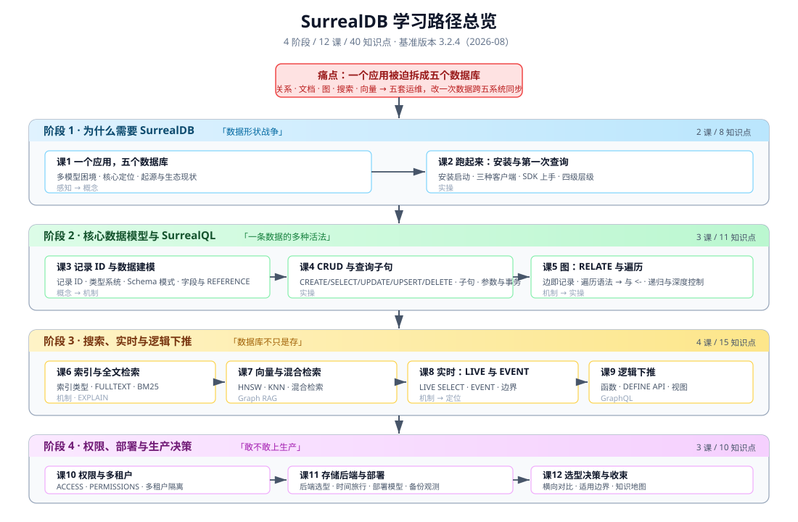
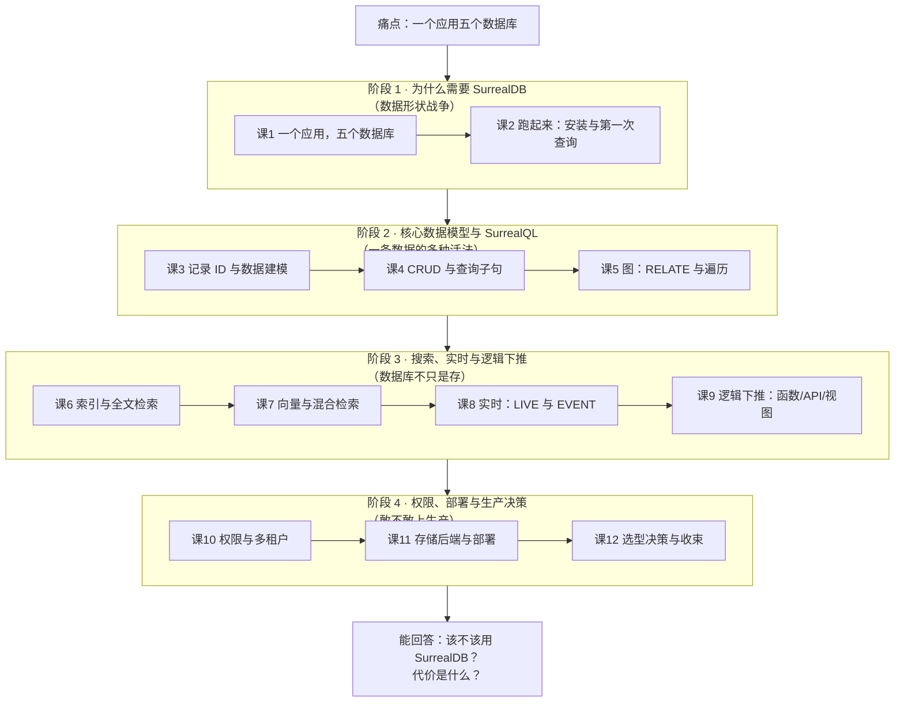

# SurrealDB 学习路径总览

> 活文档：本文件随学习进度动态调整，每次调整记录到 `00-学习档案.md` 的「大纲调整记录」。

---

## 学习目标

学完本系列，你应该能够：

1. **说清** SurrealDB 解决什么问题、不解决什么问题（而不是只会背"多模型"这个词）
2. **用起来**：能在本机跑起实例、建模、写 SurrealQL 完成 CRUD / 图遍历 / 全文 / 向量 / 实时五类查询
3. **判断**：面对一个新项目，能说出"该用 / 不该用 SurrealDB"以及理由和代价

---

## 故事主线

> **主角**：一个典型电商应用里的「一条商品数据」
>
> **冲突（形状战争）**：同一条商品数据，被迫按"形状"分裂到五个数据库——
> 关系型 Postgres 存订单、文档型 Mongo 存商品详情、图数据库 Neo4j 存"买了又买"、搜索用 Elasticsearch、语义搜索还得再来一个向量库。
> 五个库 = 五套运维、五套权限、五种不一致。改一次商品价格，要跨五个系统同步，"最终一致"变成了"最终不一致"。
>
> **转折**：SurrealDB 说——**别按形状拆数据，按业务拆**。一个引擎装下所有形状，一条查询跨所有形状。
>
> **收束**：学完 12 课，你能回答那个真正的大问题——
> *"我的下一个项目，该不该用 SurrealDB 替换掉现在这堆数据库？如果用了，代价是什么？"*

---

## 全阶段总览

| 阶段 | 名称（故事章节） | 目标 | 重点 | 课 | 知识点 |
|------|-----------------|------|------|----|----|
| **1** | 为什么需要 SurrealDB （"数据形状战争"） | 理解它想消灭的痛点，并跑起第一个实例 | 多模型困境、核心定位、生态现状、启动与客户端 | 课1-2 | 7 |
| **2** | 核心数据模型与 SurrealQL （"一条数据的多种活法"） | 掌握建模与查询的基本功 | 记录 ID、类型系统、Schema 模式、CRUD、图遍历 | 课3-5 | 10 |
| **3** | 搜索、实时与逻辑下推 （"数据库不只是存"） | 掌握它超越"存储"的那些能力 | 索引、全文、向量、混合检索、LIVE、EVENT、自定义函数与 API、GraphQL | 课6-9 | 13 |
| **4** | 权限、部署与生产决策 （"敢不敢上生产"） | 把它从玩具变成可投产的方案 | 权限体系、多租户、存储后端、时间旅行、部署模型、选型对比 | 课10-12 | 10 ✅ |

**合计**：4 阶段 / 12 课 / 40 知识点

> 各阶段知识点数按课程骨架文件实际统计（2026-09-02 核对）：3+4 / 4+3+3 / 3+3+3+4 / 3+4+3 = 7+10+13+10 = 40。此前的 8/11/15/10 为建档时的估算值，已按实测更正。

---

## 阶段依赖图

Mermaid 兜底版（SVG 无法渲染时查看）

---

## 各阶段详解

### 阶段 1：为什么需要 SurrealDB（"数据形状战争"）

**章节定位**：故事的开场。先让你感受"形状分裂"的真实痛苦，再介绍主角登场。

| 课 | 名称 | 知识点 | 状态 |
|----|------|--------|------|
| 课1 | [一个应用，五个数据库](./stages/1-为什么需要SurrealDB/lessons/lesson-01-一个应用五个数据库.md) | 多模型困境 / 核心定位 / 起源与生态 | ✅ |
| 课2 | [跑起来：安装与第一次查询](./stages/1-为什么需要SurrealDB/lessons/lesson-02-跑起来安装与第一次查询.md) | 安装启动 / 三种客户端 / SDK / 四级层级 | ✅ |

**阶段出口**：能在本机启动 SurrealDB 并用三种方式连上它，能说清它主打解决什么痛点。
**状态**：✅ 已完成（2026-09-02，7/7 知识点）

---

### 阶段 2：核心数据模型与 SurrealQL（"一条数据的多种活法"）

**章节定位**：主角获得"变形"能力——同一条数据，既能当文档、又能当关系、又能当图节点。

| 课 | 名称 | 知识点 | 状态 |
|----|------|--------|------|
| 课3 | [记录 ID 与数据建模](./stages/2-核心数据模型与SurrealQL/lessons/lesson-03-记录ID与数据建模.md) | 记录 ID / 类型系统 / Schema 模式 / 字段与 REFERENCE | ✅ |
| 课4 | [CRUD 与查询子句](./stages/2-核心数据模型与SurrealQL/lessons/lesson-04-CRUD与查询子句.md) | CRUD 五件套 / 查询子句 / 参数与事务 | ✅ |
| 课5 | [图：RELATE 与遍历](./stages/2-核心数据模型与SurrealQL/lessons/lesson-05-图RELATE与遍历.md) | RELATE / 遍历语法 / 递归遍历 | ✅ |

**阶段出口**：能独立设计一个包含文档、关系、图边的混合 schema，并写出跨形状的查询。
**状态**：✅ 已完成（2026-09-02，10/10 知识点）

**已沉淀结论**：记录 ID 既是主键也是地址（数组/对象 ID 可区间扫描，是免费聚簇索引）；数组 ID 顺序敏感、对象 ID 键序不敏感；金额用 decimal；**REFERENCE ≠ 外键**（不校验目标存在性，只做反向可见 + ON DELETE 策略）；**UPDATE 不存在时返回 `[]` 不报错**；**事务必须打包进同一次请求**（CLI 逐行敲的 BEGIN 不会开启事务），条件中止用 `THROW`；**边即记录**（有 ID、能挂属性、能被 UPDATE）；**`in` = 起点、`out` = 终点**（反直觉，写反只返回 `[]`）；**遍历通配符是 `?` 不是裸 `->`**，FETCH 只展开记录链接不走路；**`.{N}()` 是"恰好第 N 跳"**（骨架的 `@{depth}` 在 3.2.4 已废弃）；递归不自动去重、成本 ≈ 扇出 ^ 深度。

---

### 阶段 3：搜索、实时与逻辑下推（"数据库不只是存"）

**章节定位**：主角获得"主动"能力——不只是被动存取，还能搜、能推、能算。

| 课 | 名称 | 知识点 | 状态 |
|----|------|--------|------|
| 课6 | [索引与全文检索](./stages/3-搜索实时与逻辑下推/lessons/lesson-06-索引与全文检索.md) | 索引类型 / 全文检索 / EXPLAIN | ✅ |
| 课7 | [向量与混合检索](./stages/3-搜索实时与逻辑下推/lessons/lesson-07-向量与混合检索.md) | 向量与 HNSW / KNN / 混合检索与 Graph RAG | ✅ |
| 课8 | [实时：LIVE 与 EVENT](./stages/3-搜索实时与逻辑下推/lessons/lesson-08-实时LIVE与EVENT.md) | LIVE SELECT / DEFINE EVENT / 边界 | ✅ |
| 课9 | [逻辑下推：函数、API 与视图](./stages/3-搜索实时与逻辑下推/lessons/lesson-09-逻辑下推函数API与视图.md) | 自定义函数 / DEFINE API / COMPUTED 与 VIEW / GraphQL | ✅ |

**阶段出口**：能构建一个带语义搜索 + 图推理 + 实时推送的最小 RAG 原型。
**状态**：✅ 已完成（2026-09-02，13/13 知识点）

**课 9 沉淀结论**：**⚠️ 函数以"调用者"权限运行，不是创建者**（骨架说法本机未复现，三组对照证伪），且**是动态作用域**（同一函数在不同调用环境返回不同结果）——函数不是提权后门，但行为依赖调用现场；**⚠️ `DEFINE API` 语法是 `FOR` 不是 `METHOD`**，路径必须带 `/api/:ns/:db/`；**⚠️ 响应 body 只允许 NONE/bytes/string**（对象走真实 HTTP 一律 500，而 `api::invoke()` 内部调用完全正常——**端点必须走真实 HTTP 验证**）；**⚠️ `$request.body` 是字节数组**（静默失败第八次），直接 `.name` 字段静默写空；**端点默认 `PERMISSIONS FULL` = 匿名可调 + 系统权限**，能读 `PERMISSIONS NONE` 的表，公网端点必须显式收紧；**CVE-2026-63735 在 3.2.4 已修复**，但**`/sql` 仍按 token 会话走**（修复是端点层的）；`FUTURE` 语法 3.x 已移除；**COMPUTED 是"读时算"且不能建索引**，**⚠️ `@this` 被解析成 `@.this`**（静默失败第九次），**⚠️ 不能做 `updated_at`**（课 8 遗留定论，`VALUE time::now()` 才是写入时一次）；**VIEW 只读、随源表实时变、可建索引且真被用上**——要按派生值查询就上 VIEW；**⚠️ `DEFINE CONFIG GRAPHQL` 漏 `AUTO` 等于 `TABLES NONE`**（静默失败第十一次，本课最隐蔽），不报错但一张表都不暴露且报错指向"没表"，**配置生效后必须用 `INFO FOR DB` 回显确认**；GraphQL schema 由字段定义生成（**SCHEMALESS 表无字段可查**）、**id 只给 ID 部分**（全限定 ID 静默返回 null，第十次）、错误也返回 200，VIEW 连 mutation 都不生成。

**课 8 沉淀结论**：**LIVE 是"在线者广播"不是"持久化队列"**——离线期间写 5 条补发 **0 条**（MQ 补发 5 条）、两个订阅者**各收一份**；**⚠️ Python SDK `subscribe_live()` 丢 `action`**（三种通知长得一样，静默失败第六次），需区分动作时用原始 WebSocket；**⚠️ WHERE 只过滤"变更后"状态**（80→85 照样推），**不能当阈值告警用**；生命周期三坑——断连即亡不补发、重连无初值、会收到自己的变更，正确姿势是**先 SELECT 拉全量再 LIVE 订阅增量**；**⚠️ THEN 里 `UPDATE $this` 递归 23 层且主写入整体回滚**，解法是加守卫条件；**⚠️ 把 `$this` 当值用（`SET x = $this` 或 `$this.id`）会静默丢字段**（静默失败第七次；2026-09-03 复核：`$this.id` 同样会丢，因 `$this` 在 THEN 值位恒为 NONE），**必须写 `$after.id`**；注意 `$this` 作语句目标（`UPDATE $this SET ...`）是有效的，只有当值用才失效；**`$after` 在 DELETE 时为 NONE**，取被删内容用 `$before`；**事件失败连带回滚主写入**（EVENT 是强一致的一部分，不是事后补偿），而 `1/0` 返回 `null` **不报错**、制造失败要用 `THROW`；ASYNC 自动补 `RETRY 1 MAXDEPTH 3`；**扇出成本约 1.2x**（400 订阅无硬上限），真正成本是连接数与内存；**性能测量必须有反向回测或同时刻基线**——本课第一轮朴素递增给出 2.5x 的错误结论，反向回测才推翻。

**课 7 沉淀结论**：**向量检索两条路**（HNSW `<|K,EF|>` 近似快 vs 暴力 `<|K,DIST|>` 精确慢），**查询写法必须与索引严格配对、配错不报错**；**⚠️ 无索引却写数字 EF → KNN 静默降级、dist 全 null**，排查唯一手段是 EXPLAIN 找 `KnnScan`/`KnnTopK` 算子；**⚠️ 不写 `DIST` 默认是 `EUCLIDEAN` 不是 `COSINE`**；`MTREE` 在 3.0 语法已移除；**`<|K,EF|>` 的 K 是硬上限**（`LIMIT` 突破不了）、**EF 太小会真的漏结果**（300 条数据 EF=1 全错、EF=40 起命中真值，而 8 条数据时完全看不出差异）；**结构化过滤会下推到 HNSW 遍历**（与官方博客"必须独占 WHERE"相反）；**⚠️ KNN 与全文 `@N@` 不能同 WHERE**（静默 `[]`），混合检索必须两路各查再融合；**⚠️ `search::rrf()` 是 `(lists, limit, k)`**（官方两处文档矛盾，由决定性实验判定）；`search::linear()` 需 4 参且 norm 必需、两种归一化不等价；**Graph RAG 一条查询跑通**（向量召回 → RRF 融合 → 图两跳扩展上下文）。

**已沉淀结论**：**索引是"目录"不是"数据"**，复合索引按**左前缀**命中（跳过前导列 → 全表扫描）；**UNIQUE 会挡住 UPSERT**（拦"撞车"不拦"原地更新"）；**COUNT 索引不能带 `FIELDS`**；**全文检索三段拼装**（ANALYZER → INDEX → `@N@`），**ANALYZER 必须显式写**（不写默认用不存在的 `like`，查询才报错）；**`search::score(N)` 的 N 对应 `@N@` 编号**；**文档太少时 score 恒为 0**（实测 2 条为 0、3 条起出分）；**`@@` 等价于 `@AND@`**（全词都要有，无前缀匹配、无词干还原）；**中文开箱不可用**（整串当一个 token）；**3.x 的 EXPLAIN 改为前缀式 + `ANALYZE`**，判读看 `IndexScan` vs `TableScan`。

---

### 阶段 4：权限、部署与生产决策（"敢不敢上生产"）

**章节定位**：故事收束。能力都有了，现在回答那个最难的问题——敢不敢上。

| 课 | 名称 | 知识点 | 状态 |
|----|------|--------|------|
| 课10 | [权限与多租户](./stages/4-权限部署与生产决策/lessons/lesson-10-权限与多租户.md) | 用户与 ACCESS / PERMISSIONS / 多租户 | ✅ |
| 课11 | [存储后端与部署](./stages/4-权限部署与生产决策/lessons/lesson-11-存储后端与部署.md) | 存储后端 / 时间旅行 / 部署模型 / 备份与观测 | ✅ |
| 课12 | [选型决策与收束](./stages/4-权限部署与生产决策/lessons/lesson-12-选型决策与收束.md) | 横向对比 / 适用边界 / 知识地图 | ✅ |

**已沉淀结论（课 10）**：**用户是一条记录**（`TYPE RECORD` 让终端用户变成表里一条记录，权限判断可直接写进 schema）；**系统用户完全绕过 PERMISSIONS**（用 root 跑应用则权限体系整体失效）；**表级与字段级默认值相反**（表级省略 = `NONE`，字段级省略 = `FULL`；表是主闸门，字段只能收窄）；**被拒一律静默**（表级 `[]`、字段级键消失或 `null`、**字段级 update 丢弃该字段但 UPDATE 仍返回 200**，静默失败第十二次）；**`$auth` 是实时读库的**（可即时吊销，但表达式须引用该字段）；**吊销表达式必须写 `!= true`**（`= false` 在字段为 null 时误锁全员，静默失败第十三次）；**`WITH REFRESH` 把 token 变成 `{access, refresh}`**（refresh 放 body、刷新即轮换，官方标注实验特性）；**多租户方案 A 靠引擎划墙、方案 B 靠表达式上锁**（工程上最常混用）。

**已沉淀结论（课 11）**：**`file://`、`fdb://`(FoundationDB)、`indxdb://`、`memory://path` 在 3.2.4 全部无法启动**（且 FoundationDB 的报错完全不提"已移除"），可用后端只有 `memory` / `rocksdb://` / `surrealkv://` / `tikv://`；**⚠️ URL 参数拼错完全静默**（`?versionned=true` 连 WARN 都没有），版本化是否生效的唯一观测点是启动日志里的 `Versioning enabled:` 行；**⚠️ 时间旅行的语义是「截至该时刻的数据库状态」而不是"取最近一个历史版本"**——删除也是状态的一部分，删掉之后查任何更晚时刻都是 `[]`（能回到过去，不能从已删除的"未来"里捞数据）；**⚠️ 起多进程共享同一数据目录 ≠ 高可用**（文件锁互斥 + 不自动组网），横向扩展只有 TiKV 一条路；**⚠️ `import` 会自动创建不存在的 NS 和 DB**（与 `USE NS` 只建 NS 不建 DB 行为相反），且**导出导入不是幂等备份恢复**——非空库遇 `INSERT` 冲突会整批回滚，却只报一句含糊的"可能部分完成"；**⚠️ `/health` 只证明端口上有东西活着**（本机 84xx 段被其他服务占用时照样返回 200），确认实例身份必须查 `/version` 是否以 `surrealdb-` 开头；`/metrics` 仅 5 个进程级指标、`/health/ready` 与 `/health/live` 在 3.2.4 均 404。

**本课方法论**：三次静默失败（第十四/十五/十六次）的共同点是**「成功信号不可信」**——对策是为每个关键假设找一个能回显真实状态的观测点（版本化看日志行、实例身份看 `/version`、导入结果查记录数而非退出码）。

**阶段出口**：能给出一份"用 / 不用 SurrealDB"的技术决策文档，含代价与回退方案。

---

## 收尾产物（学完全部知识点后）

| 产物 | 定位 | 状态 |
|------|------|------|
| [`projects/` 结课实战项目](./projects/技术文档问答系统/README.md) | 跨 ≥3 阶段整合的可运行工程 | ✅ 已完成 2026-09-03（验收 39/39） |
| [final-课程手册.md](./final-课程手册.md) | 全部课时汇总：40 知识点压缩表 + 硬数字速查 + 三条贯穿伏笔 + 三张决策清单 | ✅ 已完成 2026-09-03 |
| [08-实战经验.md](./08-实战经验.md) | 学习态：会踩什么坑、为什么（10 条故障模式 + 10 条反模式 + 16 项上线 Checklist） | ✅ 已完成 2026-09-03 |
| [09-排障速查手册.md](./09-排障速查手册.md) | 使用态：出错了怎么止血（10 条症状倒查，QRH 式） | ✅ 已完成 2026-09-03 |
| [10-场景解法库.md](./10-场景解法库.md) | 设计态：新要求来了怎么设计（8 场景 × 38 个解法） | ✅ 已完成 2026-09-03 |

**结课实战项目整合方式**：技术文档问答系统（语料即本课程 12 篇讲义）。
阶段 1 鉴权双轨 → 阶段 2 SCHEMAFULL 建模 + bigram 索引 → 阶段 3 四种检索模式 + 逻辑下推
→ 阶段 4 行级权限 + 可观测。四阶段非并列罗列，README 说明了四条互相依赖关系。

---

**已沉淀结论（课 12）**：**⚠️ 跨系统性能对比必须先对齐口径**——SurrealDB 走 HTTP，空操作基线 22.97ms，拿客户端 wall time 和驱动直连的 Postgres 比会得出「慢 100 倍」的错误结论，真实差距约 **10 倍常数级**（服务端自报 1.7-3.5ms）；**⚠️ 扣除基线法在噪声大于信号时会失效**（实测负值 -2.128ms），此时要用服务端自报 time；**两跳图遍历 Postgres 的 JOIN 反而最快**（0.56ms < SurrealDB 1.68ms < Neo4j 3.98ms），**图库优势在深度不在两跳**；**⚠️ 深图遍历条数 = 扇出^深度**（扇出 5 第 5 跳 3125 条/23.68ms，扇出 10 时 10 万条即不可用），边界判定：≤1000 条放心用、>10000 条换方案；**聚合是「全表扫描 + 内存聚合」**（8 万行 60ms，数据 16x 耗时 8.7x，近线性）→ OLAP 交给专用引擎；**写入路径反转**（灌 8 万行 SurrealDB 1.8s vs Postgres 9.3s，LSM 顺序写占优），但**⚠️ 逐行写差 940 倍**（24.44ms/条 vs 批量 0.026ms/条），批量写是强制项；**⚠️【静默失败第十七次】`INSERT INTO edge` 建关系边不报错但一条都没写**，边必须用 `RELATE`；**⚠️【静默失败第十八次】`api::invoke()` 把端点 500 伪装成 HTTP 200**，端点必须走真实 HTTP 验证；**⚠️【更正课 9】端点必须 `RETURN { body: … }`**（`RETURN NONE` 与裸字符串走真实 HTTP 均 500），而课 9「对象走真实 HTTP 一律 500」仍成立；**「不支持」是有效结论**（Q4 给 Mongo/Neo4j 标「不支持原生向量索引」，不拿假数字充数）；**阴性断言必须配阳性对照**。

**收束判定**：选 SurrealDB 的三个条件——痛点是**跨形状**而非单形状不够快、能接受单项慢一个常数级、数据量与图深度在崩点以内；三个必须写进决策文档的代价——**生态成熟度**（`/metrics` 仅 5 个指标）、**图遍历规模**、**团队学习成本**。

## 版本基准

本系列以 **SurrealDB 3.2.4（2026-08-03，当前稳定版）** 为实操与讲解基准（核查于 2026-09）。

涉及版本差异处会显式标注。若你使用的是 2.x，注意 3.0 有一批破坏性变更（MTREE→HNSW、SEARCH ANALYZER→FULLTEXT ANALYZER、`rand::guid()`→`rand::id()`、`type::thing`→`type::record`、FUTURE→COMPUTED 等），详见 `00-学习档案.md` 的「事实核查记录」。
