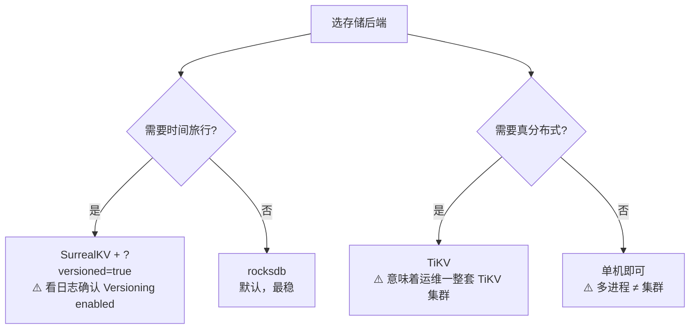

# SurrealDB 课程手册

> **版本基准**：SurrealDB 3.2.4（`surrealdb-3.2.4+20260803.93ab219`，核查于 2026-09）
> **进度**：4 阶段 / 12 课 / 40 知识点，全部完成
> **本文定位**：全部课时的**收束与索引**。不是重讲一遍，是把 40 个知识点压缩成能带走的硬结论。

## 三份收尾产物怎么选

| 你现在的状态 | 该翻哪份 |
|---|---|
| 想回顾全课讲了什么 | 本文（final-课程手册） |
| 想知道会踩什么坑、为什么 | [08-实战经验.md](08-实战经验.md)（学习态） |
| 线上出事了，只要止血动作 | [09-排障速查手册.md](09-排障速查手册.md)（使用态） |
| 新需求来了，怎么设计 | [10-场景解法库.md](10-场景解法库.md)（设计态） |
| 想动手跑一个完整工程 | [结课实战项目](projects/技术文档问答系统/README.md) |

**三份收尾产物的分工**（记住这一句就不会翻错）：
`08` 讲**为什么会崩**（学习态，事后看）→ `09` 讲**崩了怎么止血**（使用态，出事时看）→ `10` 讲**新要求怎么设计**（设计态，动手前看）。

---

## 一、课程地图

### 1.1 四个阶段在回答什么

| 阶段 | 主题 | 核心问题 | 课 |
|---|---|---|---|
| 阶段 1 | 为什么需要 SurrealDB（"数据形状战争"） | 五个数据库的痛点，它怎么解 | 课 1-2 |
| 阶段 2 | 核心数据模型与 SurrealQL（"一条数据的多种活法"） | 数据怎么存、怎么查、关系怎么走 | 课 3-5 |
| 阶段 3 | 搜索、实时与逻辑下推（"数据库不只是存"） | 能搜、能推、能算到什么程度 | 课 6-9 |
| 阶段 4 | 权限、部署与生产决策（"敢不敢上生产"） | 隔离、部署、选型、边界 | 课 10-12 |

主线是一条递进的问题链：**形状分裂的痛 → 一个库能不能都装下 → 装下之后还能干什么 → 敢不敢上生产**。

### 1.2 12 课速览

| 课 | 名称 | 一句话结论 | 讲义 |
|---|---|---|---|
| 课 1 | 一个应用，五个数据库 | 多模型困境不是"库太多"，是**一致性责任从数据库转移到了你的代码里** | [链接](stages/1-为什么需要SurrealDB/lessons/lesson-01-一个应用五个数据库.md) |
| 课 2 | 跑起来：安装与第一次查询 | 启动命令里的三个决定（后端 / 路径 / 认证）**不可逆**，动手前想清楚 | [链接](stages/1-为什么需要SurrealDB/lessons/lesson-02-跑起来安装与第一次查询.md) |
| 课 3 | 记录 ID 与数据建模 | **数组 ID 是免费的聚簇索引**——把最常用于范围查询的维度放进 ID | [链接](stages/2-核心数据模型与SurrealQL/lessons/lesson-03-记录ID与数据建模.md) |
| 课 4 | CRUD 与查询子句 | UPDATE 不存在时**静默无操作**（返回 `[]` 不是报错），这是全课静默失败的起点 | [链接](stages/2-核心数据模型与SurrealQL/lessons/lesson-04-CRUD与查询子句.md) |
| 课 5 | 图：RELATE 与遍历 | **边即记录**：有 ID、能挂属性；`in` 是起点、`out` 是终点（反直觉） | [链接](stages/2-核心数据模型与SurrealQL/lessons/lesson-05-图RELATE与遍历.md) |
| 课 6 | 索引与全文检索 | **中文开箱不可用**，复杂搜索请留给 ES——这是本课最贵的结论 | [链接](stages/3-搜索实时与逻辑下推/lessons/lesson-06-索引与全文检索.md) |
| 课 7 | 向量与混合检索 | 混合检索不是把两个条件塞进一个 WHERE（那样**静默返回空**），要两路各查再融合 | [链接](stages/3-搜索实时与逻辑下推/lessons/lesson-07-向量与混合检索.md) |
| 课 8 | 实时：LIVE 与 EVENT | LIVE 是"在线者广播"不是队列；EVENT 里的错会让**主写入一起回滚** | [链接](stages/3-搜索实时与逻辑下推/lessons/lesson-08-实时LIVE与EVENT.md) |
| 课 9 | 逻辑下推：函数、API 与视图 | DEFINE API 让数据库变成应用服务器，**能力多大风险就多大**（默认匿名可调 + 系统权限运行） | [链接](stages/3-搜索实时与逻辑下推/lessons/lesson-09-逻辑下推函数API与视图.md) |
| 课 10 | 权限与多租户 | **被拒一律静默**：表级空数组、字段级 null；判断生效与否只能查副作用 | [链接](stages/4-权限部署与生产决策/lessons/lesson-10-权限与多租户.md) |
| 课 11 | 存储后端与部署 | "多进程 = 集群"**不成立**；要真分布式得上 TiKV 并接受它的运维成本 | [链接](stages/4-权限部署与生产决策/lessons/lesson-11-存储后端与部署.md) |
| 课 12 | 选型决策与收束 | 适用边界 = **崩点的数字**：深图第 5 跳、聚合 8 万行、逐行写入差 940 倍 | [链接](stages/4-权限部署与生产决策/lessons/lesson-12-选型决策与收束.md) |

---

## 二、40 个知识点压缩成一张表

> 每课每个知识点的「一句话记住」原文照录。忘光了看这张表就够。

### 阶段 1（知识点 1.1 – 2.4）

| # | 知识点 | 一句话记住 |
|---|---|---|
| 1.1 | 多模型困境 | 不是"数据库太多"，是**一致性责任从数据库转移到了你的代码里** |
| 1.2 | 核心定位 | 卖的不是"五种能力"，是**这五种能力在同一个事务里** |
| 1.3 | 起源与生态 | **2021 年创立、2026 年仍在快速演进**——技术理念领先于生态成熟度 |
| 2.1 | 安装与启动 | 三个决定（后端 / 路径 / 认证）**不可逆地影响实例的命运** |
| 2.2 | 三种客户端 | 探索用 REPL，集成用 HTTP，看结构用 GUI；**测连通别写 `SELECT 1;`** |
| 2.3 | SDK 上手 | 要实时、要事务选 `ws://`；做脚本、一次性调用 `http://` 更轻 |
| 2.4 | 四级层级 | **NS 和 DB 是墙，Table 和 Record 是架子**——分模块用 Table，隔离租户才用 NS |

### 阶段 2（知识点 3.1 – 5.3）

| # | 知识点 | 一句话记住 |
|---|---|---|
| 3.1 | 记录 ID | **数组 ID 是免费的聚簇索引**，把范围查询维度放进 ID，全表扫描变顺序 I/O |
| 3.2 | 类型系统 | JSON 的 6 种不够，补了 datetime / duration / decimal / bytes / uuid / geometry |
| 3.3 | Schema 模式 | 早期 SCHEMALESS 探索，稳定后 `ALTER TABLE ... SCHEMAFULL` 收紧 |
| 3.4 | 字段与 REFERENCE | **REFERENCE ≠ 外键**，`ON DELETE REJECT` 才拦得住；别指望它校验目标存在 |
| 4.1 | CRUD 五件套 | UPDATE 不存在**静默无操作**；改字段用 SET/MERGE，整体替换才用 CONTENT |
| 4.2 | 查询子句 | 分页用 START + LIMIT；SPLIT/GROUP 字段要写进 SELECT；**FETCH 不是 JOIN** |
| 4.3 | 参数与事务 | 事务语句**必须打包进同一次请求**；主动中止用 `THROW`；参数声明必须带 `LET` |
| 5.1 | 边即记录 | 边有 ID、能挂属性；`in` 是起点、`out` 是终点（**反直觉**）；改不动只返回 `[]` |
| 5.2 | 遍历语法 | `->` 出、`<-` 入、`<->` 双向；通配符是 `?` 不是裸箭头；FETCH **不走路** |
| 5.3 | 递归与深度 | `.{N}()` 取恰好第 N 跳；`@{depth}` 已废弃；**成本是扇出的深度次方** |

### 阶段 3（知识点 6.1 – 9.4）

| # | 知识点 | 一句话记住 |
|---|---|---|
| 6.1 | 索引类型 | 普通管定位、UNIQUE 管唯一、复合按**左前缀**命中；COUNT 索引不能带 FIELDS |
| 6.2 | FULLTEXT 与 BM25 | ANALYZER 必须显式写、`score(N)` 的 N 必须对应 `@N@`；**中文开箱不可用** |
| 6.3 | EXPLAIN | `IndexScan` 好、`TableScan` 查；**跳过前导列和函数包字段**是两大杀手 |
| 7.1 | 向量与 HNSW | HNSW 是"跳着找"；`DIMENSION` 必须对齐模型、**`DIST` 默认欧氏不是余弦** |
| 7.2 | KNN 与相似度 | K 管回几条（**硬上限，LIMIT 管不了**），EF 管找多仔细；过滤会被下推到遍历里 |
| 7.3 | 混合检索 | 不是塞进一个 WHERE（**静默返回空**），是两路各查再用 `search::rrf` 融合 |
| 8.1 | LIVE SELECT | "在线者广播"不是队列——**断连即亡、不补历史、各收一份** |
| 8.2 | DEFINE EVENT | 写进事务的钩子：出错**主写入一起回滚**，所以 THEN 里永远别改自己 |
| 8.3 | 实时边界 | 要"在线的人看到最新状态"用 LIVE；要"这活儿一定有人干完"用消息队列 |
| 9.1 | DEFINE FUNCTION | **复用的是逻辑不是权限**——永远以调用者身份运行 |
| 9.2 | DEFINE API | 数据库变应用服务器，**默认匿名可调 + 系统权限运行**，公网端点必须收紧 |
| 9.3 | COMPUTED 与 VIEW | COMPUTED 读时算、**算不了索引**；VIEW 是只读虚拟表、能建索引 |
| 9.4 | GraphQL | 白送但**只对 SCHEMAFULL 表有用**；与 SurrealQL、DEFINE API 并存 |

### 阶段 4（知识点 10.1 – 12.3）

| # | 知识点 | 一句话记住 |
|---|---|---|
| 10.1 | 用户与 ACCESS | 用户是一条记录，权限是一道表达式；`WITH REFRESH` 仍是**实验特性** |
| 10.2 | PERMISSIONS | **表级默认关、字段级默认开**；被拒一律静默；**系统用户不受任何约束** |
| 10.3 | 多租户隔离 | 方案 A 靠引擎划墙、方案 B 靠表达式上锁；即时吊销前提是**表达式真引用了该字段** |
| 11.1 | 存储后端 | 默认 rocksdb；要时间旅行才选 surrealkv + `?versioned=true`；**开没开对看日志那行 `Versioning enabled`** |
| 11.2 | 时间旅行 | 只 SurrealKV 支持；删除/DROP 后历史仍可查、重启不丢；**长期存储代价未测准，别当免费** |
| 11.3 | 部署模型 | 单机有文件锁、独立实例不自动组网，**"多进程 = 集群"不成立** |
| 11.4 | 备份与观测 | export 稳、import **必须恢复到空库**；只有 5 个进程级指标，别指望做容量规划 |
| 12.1 | 横向对比 | 别问"谁更快"，问**差距是常数级还是数量级** |
| 12.2 | 适用边界 | 边界 = **崩点的数字**：深图第 5 跳、聚合 8 万行、逐行写入差 940 倍 |
| 12.3 | 收束 | 不是记住 40 个知识点，是压成三句话：**擅长什么 / 什么时候崩 / 崩了怎么回退** |

---

## 三、全课硬数字速查

> 这些是本机实测跑出来的，不是文档抄的。**数字会随版本变**，用时请按你的版本重测。

### 3.1 性能与规模（课 12 实测）

| 场景 | 数字 | 依据与含义 |
|---|---|---|
| 深图遍历 | **第 5 跳**开始明显劣化 | 扇出 5 时第 5 跳 3125 条 / 23.68 ms，**耗时陡增 5.7 倍**；扇出 10 时第 5 跳 = 10 万条。建议深度 ≤ 3 + 强制 LIMIT |
| 聚合行数 | **8 万行**是分水岭 | 60.2 ms vs Postgres 7.27 ms（8.3x），且近线性劣化。报表场景交给专用引擎 |
| 逐行写入 vs 批量 | **940 倍**差距 | 逐行 24.44 ms/条 vs 批量 0.026 ms/条。本项目复测：5045 条逐条 153 s / 批量 6.7 s = 22 倍 |
| 图扩展 vs 纯检索 | 104 ms vs 40 ms | 多一跳图查询的代价，约 2.6 倍 |

> **写文档的关键**（课 12 原文）：每条边界都要**附依据数字**。"谨慎使用图遍历"没人会遵守，"图遍历深度 ≤ 3，依据：第 5 跳 3125 条 / 23.68 ms"会让评审者直接接受。

### 3.2 工程实测（结课项目）

| 项 | 数字 |
|---|---|
| 建库灌数 | 5045 条，批量 50/批，**6.7 s** |
| 四种检索模式时延 | kw / vec / hybrid 约 40 ms，graph 约 104 ms |
| 权限隔离 | 同一条 SQL：alice 见 33 块、bob 见 15 块、root 见 48 块 |
| 验收规模 | 39 项自动 + 4 项人工复核，从零重建后复跑仍 **39/39** |
| 反例沉淀 | 25 条（**静默失败单列 11 条**） |

### 3.3 索引与检索参数

| 参数 | 值 / 语义 |
|---|---|
| `DIST`（HNSW） | **默认欧氏**，不是余弦 |
| `search::rrf` 签名 | `(lists, limit, k)`——**第二参是 limit 不是 k 常数** |
| `search::score(N)` | N 必须对应 `@N@` 编号，否则恒为 0 |
| COUNT 索引 | 不能带 `FIELDS` |
| 复合索引 | 按**左前缀**命中 |

---

## 四、三条贯穿全课的伏笔

> 这是本手册最有价值的部分。三条都是"同一件事在不同课里反复出现"，提炼出来就能迁移。

### 伏笔一：静默失败——十七次，遍布全课

从课 4 的「UPDATE 不存在返回 `[]` 不是报错」开始，到结课项目的第二十二次（`FN_SEARCH_KW` 多字查询零召回而验收全绿），这条线贯穿始终。

**演进轨迹**（节选）：

| 次 | 课 | 表现 |
|---|---|---|
| 1 | 课 4 | UPDATE 不存在的记录，返回 `[]` 而非报错 |
| — | 课 6 | 2 条数据验证打分恒为 0（差点误判为产品 bug） |
| — | 课 8 | `SET pid = $this` 实测**静默丢字段**；2026-09-03 复核：`$this.id` **同样会丢**（值位恒为 NONE），正确写法 `$after.id` |
| — | 课 9 | `DEFINE CONFIG GRAPHQL` 漏 `AUTO` → 等于 `TABLES NONE`，**一张表都不暴露且不报错** |
| — | 课 10 | 权限拒绝返回 `status=OK` + `result=[]`，**不报错** |
| — | 课 11 | `/health` 对**不存在的服务也返回 200**，三个探测脚本白跑 |
| — | 课 12 | `INSERT INTO edge` 建关系边**静默不写入**，四个图遍历实验全部白跑 |
| 22 | 项目 | `$request.method` 是**小写** `get`，与 `'GET'` 比较永远为假，GET 静默走进 POST 分支 |

**提炼成一条方法论**：

> **验证"某事没发生"，不能依赖"没报错"——要么查副作用，要么配阳性对照。**

三个落地手法：
1. **副作用检查**：alice 执行 CREATE 后，用 root 查记录是否真的产生
2. **阳性对照**：测"错误密码被拒"的同时，必须测"正确密码能通过"
3. **行数断言**：性能测量前先断言写入行数，否则你测的是"没写进去"的速度

### 伏笔二：版本约束——相当大的精力花在绕开限制上

结课项目 10 条设计决策里，**4 条是"环境所迫"而非真权衡**：

| 决策 | 性质 |
|---|---|
| 中文用应用层 bigram | 环境所迫（3.2.4 无中文分析器） |
| 12 维向量 | 环境所迫（无 embedding 模型） |
| GET/POST 合并定义 | 环境所迫（后定义覆盖先定义且不报错） |
| `@N@` 加权 | 环境所迫（语言行为如此） |

**这是个值得记住的选型成本**：在 3.2.4 上做中文检索，相当一部分精力花在**绕开版本限制**而不是**算法选择**上。选型时要把这部分算进去。

配套的三个"开箱不可用"清单：
- 中文全文检索（`blank` / `class` 分析器查中文均 0 条）
- 复杂搜索（课 6 原文结论：**请留给 ES**）
- 时间旅行的长期存储代价（课 11 未测准，**别当它免费**）

### 伏笔三：判据本身也会错——先怀疑判据，再怀疑代码

B7 噪声验收改了三次才改对，前两次都是**判据错**：

1. 第一次：断言 junk 查询结果应为空 → 错。中文单字普遍存在，bigram 必然召回噪声
2. 第二次：换判据为"分数显著低于有效查询" → 仍错。**junk 查询本身选错了**（"这个术语肯定不存在zzz"含「存在」二字，而语料里真有这句话）
3. 第三次：校准 junk 为"紫色大象在跳舞" → 才发现**代码确实缺停用词过滤**

**提炼成一条方法论**：

> 验收失败时，先问"判据对不对"，再问"代码对不对"。但别一直怀疑判据——改了三次判据才发现第三次是代码真有缺陷。

判据的自检三问：
1. 这个断言**期望的结果**（空 / 非空 / 数值大小）在原理上成立吗？
2. 我选的**测试输入**是不是恰好避开了缺陷？（单字 vs 多字）
3. 有没有**阳性对照**证明测试本身是有效的？

#### 实验设计三戒（课 8 复核补记）

上面三问查的是**判据**（断言写得对不对）。课 8 的复核暴露了更靠前的一层：**判据没错，实验本身设计错了**。当时评审确实逐字执行了每条命令，但结论照样是错的——因为对照实验的写法有缺陷。所以单列三戒：

1. **每个变体必须独立初始化** — 建表/清表写在变体循环**内**。判定只允许看这个变体自己写入的行，不能"结果表里有一行满足就算这个变体成功"
2. **贴进笔记的输出必须能重跑复现** — 写下脚本名不等于验证过。要按脚本当前状态重跑一次、逐字段比对
3. **所有变体都成功时，先怀疑探针** — 一个"找出哪种写法可行"的实验若全部返回成功，几乎必然是探针缺陷。此时强制加一个**已知必失败**的对照组（字面量、明显非法写法）反向验证探针有鉴别力

**这三戒来自哪次事故**：课 8 为了确定 EVENT 的 THEN 里怎么写才能拿到记录 ID，跑了六种写法对照。原探针的结果表在五个变体之间**从不清空**，判定逻辑又是"表里任意一行有 `pid` 就算成功"——于是第一个成功变体（`$after.id`）写的行被后面所有变体复用，六个变体全判成功，`$this.id` 就这样被误判为可用。真实结论是：`$this` 在 THEN 的值位恒为 `NONE`，`$this.id` 静默丢字段。

更值得记的是第二层：讲义 8.2 贴的那段"实测输出"里有个 `"rid": "order:o1"` 字段，**重跑脚本根本不存在这个字段**——那段输出从来没被复现过，是照着预期写出来的。第一戒查出的是"看错了"，第二戒查出的是"写了没跑"。

> **一句话记住**：逐字执行命令只能保证你没偷懒，保证不了实验没写错。跑之前先问"如果结论是错的，这个实验能显示出来吗"。

---

## 五、三张决策清单

### 5.1 该不该上 SurrealDB

| 问题 | 是 | 否 |
|---|---|---|
| 你的数据形状有 ≥2 种（文档 + 关系 + 向量 + 图）？ | ✅ 强信号 | 单一形状，专用库更省心 |
| 这些形状需要**在同一个事务里**一致？ | ✅ 决定性信号 | 分开存 + 应用层协调也能接受 |
| 能接受生态成熟度落后于理念？ | ✅ | ❌ 等版本再稳一点 |
| 有中文全文检索的强需求？ | ❌ **开箱不可用**，需自建 bigram 或上 ES | ✅ |
| 需要深图遍历（> 5 跳）做核心链路？ | ❌ 第 5 跳起劣化 | ✅ |
| 需要 8 万行以上的重聚合？ | ❌ 数量级差距 | ✅ |

### 5.2 存储后端怎么选



### 5.3 备份策略

| 动作 | 要点 |
|---|---|
| export | 稳，可定期做 |
| import | **必须恢复到空库**——非空库必整批回滚，且只报一句含糊的失败 |
| NS/DB | import 会**自建**，写错库名不报错 |
| 凭证 | 备份文件**含 JWT 密钥**，按凭证级别保管 |

---

## 六、结课实战项目

**技术文档问答系统** —— 语料就是本课程 12 篇讲义，**自指设计**：检索对象即讲义本身，对错一眼可辨，无需额外领域知识。

| 文件 | 说明 |
|---|---|
| [README.md](projects/技术文档问答系统/README.md) | 需求、能力覆盖地图、三分钟跑起来、诚实边界 |
| [设计决策.md](projects/技术文档问答系统/设计决策.md) | 10 条决策，每条含被否决的备选与实测证据 |
| [反例对照.md](projects/技术文档问答系统/反例对照.md) | 25 个真实踩过的坑（静默失败单列 11 条） |
| [验收清单.md](projects/技术文档问答系统/验收清单.md) | 39 项自动验收 + 4 项人工复核 |
| [评审记录.md](projects/技术文档问答系统/评审记录.md) | 双视角评审 + A1-A6 专项维度 |

**跨阶段整合**：阶段 1 鉴权 → 阶段 2 建模与索引 → 阶段 3 检索与下推 → 阶段 4 权限与可观测。

**四种检索模式的互补性实证**（问题「索引怎么加速查询」）：

```
kw      chunk:l06_0  5.35    kw 独有：chunk:l07_0
vec     chunk:l06_1  1.00    vec 独有：chunk:l07_2
hybrid  chunk:l06_0  0.58
graph   chunk:l06_0  0.58    （~104ms，多一跳图查询）
```

kw 与 vec 各有对方找不到的结果 —— **这就是"为什么必须混合"的实证**，而不是口号。

---

## 七、下一步

| 方向 | 具体动作 |
|---|---|
| 补实战手感 | 跑一遍 [结课项目](projects/技术文档问答系统/README.md)，`python3 demo.py` 五幕演示 |
| 补中文检索 | 把 bigram 方案换成真分词器（jieba）+ 真 embedding 模型，对照召回率变化 |
| 补生产验证 | 上 TiKV 跑一遍真实分布式，验证课 11 未实测的部分 |
| 补知识对齐 | `07-知识点对齐.md`（可选，课程目录已占位） |

**一句话收束**（课 12 原文）：

> 收束不是记住 40 个知识点，而是能把它们压缩成三句话：**它擅长什么、它什么时候会崩、崩了怎么回退。**

---

## 🧭 课程导航

- 返回目录：[02-课程目录.md](02-课程目录.md)
- 学习档案：[00-学习档案.md](00-学习档案.md)
- 评审清单：[00-评审清单.md](00-评审清单.md)
- 学习态（为什么会崩）：[08-实战经验.md](08-实战经验.md)
- 使用态（崩了怎么止血）：[09-排障速查手册.md](09-排障速查手册.md)
- 设计态（新要求怎么设计）：[10-场景解法库.md](10-场景解法库.md)
