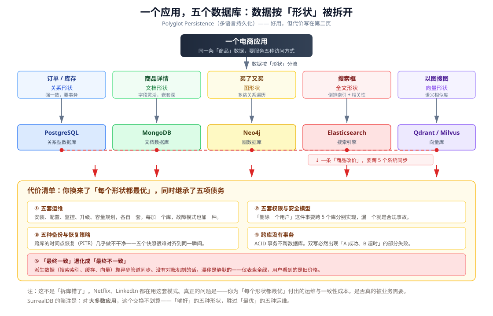
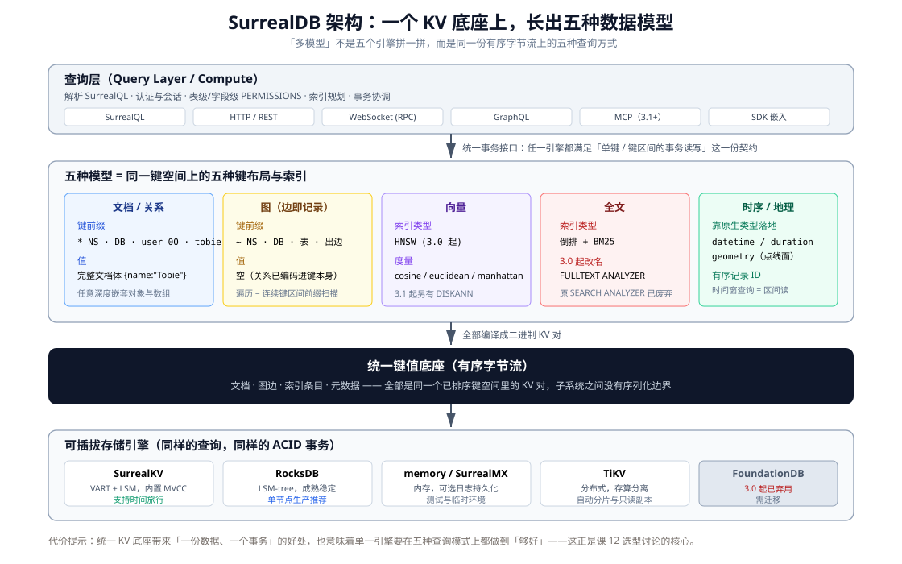

# 课 1 · 一个应用，五个数据库

> **本课在故事主线中的情节定位**：故事开场。主角是一条电商商品数据，它正被五马分尸。

[← 返回课程目录](../../../02-课程目录.md) ｜ [阶段概览](../overview.md)

---

## 本课目标

1. 感受"按形状拆库"的真实代价，能举出具体场景而非抽象抱怨
2. 能用一句话说清 SurrealDB 是什么、解决什么问题、不解决什么问题
3. 了解它的来历与当前生态位置（含版本线与融资）——**作为选型判断的背景，不是追星**

---

## 知识点清单

### 知识点 1.1：多模型困境：一个应用的五种数据形状

**关键点**：

- 电商场景拆解：订单（关系）/ 商品详情（文档）/ 买了又买（图）/ 搜索框（全文）/ 以图搜图（向量）
- 拆库的真实代价：五套运维、五套权限、五种备份策略
- "最终一致"如何变成"最终不一致"：一个跨库更新的失败场景

**状态**：✅ 已完成

---

### 知识点 1.2：SurrealDB 是什么：一句话定义与核心定位

**关键点**：

- 一句话定义：一个引擎装下所有数据形状，一条查询跨所有形状
- 四个支柱：多模型引擎 / SurrealQL / 单二进制部署 / 实时能力
- **什么不是它**：不是"五个引擎拼一拼"，不是 Postgres 的替代品，不是万能药

**状态**：✅ 已完成

---

### 知识点 1.3：起源与生态现状

**关键点**：

- 2021 年创立于伦敦，创始人 Tobie（CEO）与 Jaime（COO）Morgan Hitchcock 兄弟
- 创始人动机：牛津 MSc 论文研究时序图数据库，直接影响架构选择
- 版本线：1.x → 2.0（2024-09）→ 3.0（2026-02-17）→ 3.2.4（2026-08-03，当前稳定）
- 融资：2026-02 Series A 扩展 $23M，累计 $44M
- 生产案例（**厂商自述，置信度中**）：Saks Fifth Avenue、Tencent

**状态**：✅ 已完成

---

## 正文

### 第一幕 · 场景引入：改一次价格，五个系统一起动

假设你在做一个电商后台。今天运营找你：

> "把 SKU-8848 的价格从 2999 改成 2599，再给它加个'开学季'标签，马上生效。"

听起来是个五分钟的活儿。但你在的这家公司，数据是按**形状**拆的：

| 形状 | 存在哪 | 为什么要它 |
|------|--------|-----------|
| 关系形状（价格、库存、订单） | PostgreSQL | 要强一致、要事务 |
| 文档形状（商品详情、规格参数） | MongoDB | 字段不固定，嵌套深 |
| 图形状（"买了又买"推荐） | Neo4j | 多跳关系遍历 |
| 全文形状（搜索框） | Elasticsearch | 倒排索引、相关性打分 |
| 向量形状（以图搜图） | Qdrant | 语义相似度 |

于是这个"五分钟的活儿"实际是：**改 Postgres 的价格 → 改 Mongo 的标签 → 触发搜索索引重建 → 重建商品 embedding → 让推荐图感知新标签**。五个系统，五条链路，五种失败方式。



这就是 Martin Fowler 在 2011 年命名的 **Polyglot Persistence（多语言持久化）**：不为每个应用选一个数据库，而是为每种**数据形状**选一个数据库。

---

### 第二幕 · 认知冲突：这套方案明明是对的，为什么这么累？

先说公道话：**拆库没有错**。

Netflix 用 Cassandra 扛高写入、MySQL 存交易数据、EVCache 做低延迟读、Elasticsearch 做搜索与分析。LinkedIn 用 Espresso、Voldemort、Kafka 和一堆专用系统。这些公司都靠这套架构撑住了海量规模。

如果你说"拆库是错的"，那你解释不了为什么顶级公司都这么干。

**问题出在别的地方。**

那篇经典的 polyglot persistence 综述（MDPI 2019）列了四个缺点，其中一条最致命：

> "There is no unified query language, and no consistency guarantee — cross-database consistency is particularly difficult because of referential integrity."
> （没有统一的查询语言，也没有一致性保证——由于参照完整性，跨数据库的一致性尤其困难。）

翻译成人话就是：**ACID 事务不跨数据库**。

你写代码的时候会本能地想：

```
更新价格（Postgres）
更新搜索索引（ES）
```

但你没法把这两件事包进一个事务。你只能"双写"（dual write），而双写必然会遇到：

- Postgres 提交成功，ES 超时
- ES 写入成功，Postgres 死锁
- 两边都提交完，网络在中间抖了一下，你不知道到底成了没成

一位架构师的总结很到位：**never dual-write for derived data**——凡是"派生数据"（搜索索引、缓存、向量、推荐图），都不要在请求路径里直接双写。

那正确做法是什么？**事务性发件箱（transactional outbox）**：

1. 业务变更写进源数据库（一张业务表）
2. **在同一个事务里**，往 outbox 表插一条事件
3. 后台 worker 读 outbox，异步投递到搜索/向量/图
4. worker 投递成功后标记该行已发送

这条路走得通，但你要为它付出什么？

- 一套发件箱机制 + 幂等消费者 + 重试规则 + 补偿流程
- 死信队列和重放流程，还得**定期演练**
- 对账机制（reconciliation）：定期全量比对源与派生视图，发现漂移就修

一份工程实践总结里有个说法我特别认同：

> "A service may be 'up' while its downstream projections are silently stale. That is a business outage wearing a green dashboard."
> （一个服务可能是"健康的"，而它的下游投影已经悄悄过期了。这是一场穿着绿色仪表盘的业务故障。）

**这就是冲突的真相**：拆库给你的是"每个形状都最优"，收走的是"一个事务能管住一切"。你以为你在做架构，其实你在做**分布式一致性工程**。

---

### 第三幕 · 层层揭示

好，现在主角登场。SurrealDB 的答案朴素得有点冒犯：

> **别按形状拆数据，按业务拆。**

---

#### 知识点 1.1：多模型困境 —— 一个应用的五种数据形状

**一句话定义**：Polyglot Persistence 让每个数据形状都用上最优引擎，代价是运维复杂度、跨库事务缺失和一致性漂移。

**直觉建立**

把它想成厨房。专业厨房里，切菜的、烤肉的、做甜点的各有专门工具和专人负责——效率最高。但如果你只是一个三口之家做晚饭，请五个专业厨师的协调成本，远超他们带来的效率提升。

**多模型困境的本质是**：你为了"每个形状最优"，把**数据的一致性责任从数据库转移给了应用代码**。数据库本来免费给你的东西（事务、参照完整性、一个时间点恢复），现在要你自己用发件箱、对账、补偿流程重建一遍。

**核心原理：拆库的五项债务**

| 债务 | 具体表现 |
|------|---------|
| 运维复杂度 | 每个库都要安装、配置、监控、备份、安全审计、升级。每加一个库，就多一种独立的故障模式 |
| 权限与安全模型 | "删除一个用户"要跨五个库分别实现（含缓存、事件日志、搜索索引），漏一个就是合规事故 |
| 备份与恢复 | 跨库的时间点恢复几乎做不干净——五个快照很难对齐到同一瞬间 |
| 跨库事务 | ACID 不跨数据库。跨库一致性只能靠 saga / outbox / 补偿 |
| 认知负担 | 工程师必须清楚"哪个库是 source of truth"。跨库查询要么反范式化，要么在应用层 join |

**示例演示：一次失败的价格变更**

```
t0  运营点"改价"
t1  BEGIN; UPDATE price in Postgres; INSERT outbox; COMMIT   ✅ 成功
t2  worker 读 outbox，投递到 Elasticsearch
t3  Elasticsearch 超时 —— worker 重试
t4  重试成功，但此时搜索索引里价格是新的，Neo4j 推荐图里还是旧的
t5  用户搜索该商品：列表页显示 2599，点进推荐位显示 2999
t6  客服开始接投诉
```

这个场景里没有任何一个组件"挂了"。每个仪表盘都是绿的。但业务错了。

**常见误区**

| ❌ 误区 | ✅ 真相 |
|--------|--------|
| "拆库是反模式" | 不是。Netflix、LinkedIn、Walmart 都在用。问题在于你是否真的需要每个形状的最优，以及你是否付得起协调成本 |
| "用消息队列就一致了" | MQ 解决"可靠投递"，不解决"源与派生视图的对账"。没有对账机制，漂移是静默的 |
| "最终一致 = 一会儿就一致" | 没有 freshness SLO 和对账，"最终"可能永远不会到。业界建议把新鲜度写成契约：搜索投影 5-20 秒、分析看板 30-120 秒 |
| "五个库只是五倍的运维" | 实际是**超过五倍**——你要精通五种技术，而不是一种 |

**一句话记住**：多模型困境不是"数据库太多"，是**一致性责任从数据库转移到了你的代码里**。

---

#### 知识点 1.2：SurrealDB 是什么 —— 一句话定义与核心定位

**一句话定义**：SurrealDB 是用 Rust 写的多模型数据库，**一个引擎**装下文档、图、向量、全文、时序、地理、关系七种数据形状，**一条查询**可以跨所有形状，且**在一个 ACID 事务里提交**。

> **关于"五种"和"七种"**：本课开头的电商场景只用了五种（关系/文档/图/全文/向量），因为那是一个具体应用的例子。SurrealDB 官方口径是**七种**模型，多了时序（time series）和地理（geospatial）——它们靠原生类型 `datetime` / `duration` / `geometry` + 有序记录 ID 落地，而不是单独的引擎。课 3 会展开类型系统，课 7 之外的时序与地理能力会在阶段 2-4 逐步涉及。

**直觉建立**

上一幕的五库架构里，每种形状都有自己的方言：SQL、MQL、Cypher、DSL、向量检索 API。SurrealDB 说：**一种方言（SurrealQL）就够了，形状的差异交给引擎处理**。

**核心原理：为什么"一个引擎"能干五种活？**

关键在它的底层——**所有东西都是同一个键值底座上的二进制 KV 对**。官方 deep-dive 里的拆解：

| 数据 | 键前缀 | 值 |
|------|--------|-----|
| 文档 / 关系记录 | `*` | 完整文档体 |
| 图边 | `~` | **空**——关系已编码进键本身 |
| 索引条目 | `+` | B-tree / HNSW / BM25 倒排 |

因为**键是按字节有序排列**的，所以：

- 文档查询 = 前缀区间扫描
- **图遍历不是 JOIN，是连续键区间的扫描**
- 时间窗查询 = 区间读（记录 ID 有序）

三种完全不同的"模型"，在底下是**同一个基本操作：扫描一段连续的字节**。

这带来一个关键推论：**一张图遍历 + 一次向量检索，查询规划器看到的是整个操作，并在同一个一致性快照上执行**。没有跨引擎的数据搬运，也就没有序列化边界。



**示例演示：一条查询跨越三种形状**

> **读法提示**：下面这条查询你现在**只需要感受它的形状，不要求看懂每个符号**。`<|5,40|>` 是向量 KNN 算子、`$query_vec` 是参数、`->owns->` 是图遍历——这些分别在课 4（参数）、课 5（图遍历）、课 7（向量）才会正式讲。现在你只要看到一件事：**这三种能力出现在同一条语句里**。

```sql
SELECT id, name, vector::distance::knn() AS dist
FROM customer:acme->owns->product
WHERE embedding <|5,40|> $query_vec
ORDER BY dist LIMIT 5;
```

这条查询做了三件事：**图遍历**（`->owns->`）+ **向量 KNN**（`<|5,40|>`）+ **排序截断**。在五库架构里，这是三个系统的三次往返；在这里，是一个事务里的一条语句。

再感受一下 SurrealQL 的形状融合：

```sql
-- 建一条文档记录，带嵌套对象
CREATE person:john SET
  name = 'John Doe',
  metadata = { preferences: ['rust', 'databases'] };

-- 建一条图边（边是记录，能带属性）
RELATE person:john->follows->person:jane SET since = time::now();

-- 一条查询同时用文档过滤 + 图遍历
SELECT name, ->follows->person.name AS following
FROM person WHERE metadata.preferences CONTAINS 'rust';
```

**四个支柱**

| 支柱 | 内容 |
|------|------|
| 多模型引擎 | 文档 / 图 / 向量 / 全文 / 时序 / 地理 / 关系，共享一个存储层 |
| SurrealQL | 保持 SQL 形状，加上图遍历箭头语法、相似度函数、嵌套字段点号访问 |
| 单二进制部署 | 一个 Rust 二进制，零运行时依赖，可嵌入式运行 |
| 实时能力 | LIVE SELECT 订阅变更、表事件触发器，数据同时是事件源和真相源 |

**⚠️ 什么不是它**（这部分比"是什么"更重要）

| ❌ 不是 | ✅ 实际是 |
|--------|---------|
| 不是"五个引擎拼一拼" | 是一个 KV 底座 + 五种键布局与专用索引 |
| 不是 PostgreSQL 的替代品 | Postgres 的生态深度、分析能力、运维成熟度，SurrealDB 短期内追不上 |
| 不是万能药 | 单一形状做到极致的场景（深度图算法、超大规模向量、复杂 OLAP），专用库仍然更强 |
| 不是"零成本替换五个库" | 你换来的是运维简化，付出的是**单一引擎在每种形状上只能做到"够好"** |

**常见误区**

| ❌ 误区 | ✅ 真相 |
|--------|--------|
| "多模型 = 每个模型都最强" | 多模型 = 每个模型**够好** + 跨模型**一个事务**。专用库在单一形状上通常仍更快 |
| "SurrealDB 能干掉我的后端" | 它能干掉一部分（API 层、鉴权、实时推送），但业务逻辑该在应用层还是在应用层 |
| "统一 KV 底座只是实现细节" | 不。这正是"一条查询跨形状 + 一个事务"能成立的原因，也是理解后续所有设计的钥匙 |

**一句话记住**：SurrealDB 卖的不是"五种能力"，是**"这五种能力在同一个事务里"**。

---

#### 知识点 1.3：起源与生态现状

**一句话定义**：SurrealDB 由 Tobie 与 Jaime Morgan Hitchcock 兄弟于 2021 年在伦敦创立，2022 年首次发布，目前处于快速迭代期——3.0 是一次大规模重构。

**直觉建立：为什么是这两个人？**

Tobie Morgan Hitchcock 在牛津大学读软件工程硕士（2016-2018），硕士论文研究的是**时序图数据库的高效数据结构**。

这不是一段"创始人简历"式的八卦——它直接解释了 SurrealDB 的两个设计执念：

1. **图是一等公民**（不是后来加的插件）
2. **时序靠有序记录 ID + 区间读实现**（不是另起一套时序引擎）

一个人研究了两年的课题，最后变成了一个数据库的架构。理解这一点，后面学记录 ID 的复合结构、学图遍历为什么是前缀扫描时，你就会觉得顺理成章。

**核心原理：版本线与当前位置**

| 时间 | 里程碑 |
|------|--------|
| 2021 | 公司成立于英国伦敦 |
| 2022 | SurrealDB 首次发布 |
| 2024-09 | **2.0 GA**（引入 `RELATE` 记录链接、事务行为变更） |
| 2026-02-17 | **3.0 GA**（经 1 年+ alpha/beta，一次大规模重构） |
| 2026-02 | Series A 扩展 **$23M**（Chalfen Ventures 领投），累计融资 **$44M** |
| 2026-08-03 | **3.2.4**，当前稳定版 |
| 2026-08-20 | 3.3.0-beta.3（beta 线） |

**3.0 是一次硬分叉**，有一批破坏性变更（后面每课都会标注）：

| 变更 | 旧 → 新 |
|------|--------|
| 向量索引 | MTREE 移除 → 只剩 **HNSW** |
| 全文索引 | `SEARCH ANALYZER` → **`FULLTEXT ANALYZER`** |
| 随机 ID | `rand::guid()` → `rand::id()` |
| 记录类型 | `type::thing` → `type::record` |
| 计算字段 | `FUTURE` → **`COMPUTED`** |
| 参数声明 | **必须加 `LET`** |
| 存储后端 | **FoundationDB 弃用** |

**⚠️ 这条变更清单本身就是一条选型信号**：一个在 2024-09 到 2026-02 之间敢做大范围破坏性变更的项目，说明它还在快速演进期。这是好事（快速进步）也是风险（你的代码要跟着改）。

**示例演示：怎么看一个数据库"成不成熟"**

不要只看营销页。看这三个信号：

| 信号 | SurrealDB 现状（2026-09） |
|------|--------------------------|
| 流行度排名 | DB-Engines 2026-08 综合榜 **第 155 位**（得分 1.43，同比 +0.28）；文档库榜第 56；图库榜第 15 |
| 社区规模 | GitHub 约 31.4k star、1.2k fork、166 位贡献者（**第三方聚合站口径，见下方说明**） |
| 生产案例 | Saks、Tencent、Verizon、Samsung Ads、PolyAI、Aspire |

**⚠️ 关于 GitHub 数字的口径**：31.4k star / 1.2k fork / 166 贡献者来自第三方代码分析站 Starlog（2026-05），该站同时标注"最后提交 6 个月前 / 每周提交 0"——这与 SurrealDB 官方在 2026-08 仍发布 3.2.4 的事实明显冲突，说明**该聚合站的抓取存在滞后或失真**。

所以这组数字只能用来看**量级**（三万 star 级别，属于有相当关注度但远未进入主流的项目），不能用来判断**当前活跃度**。判断活跃度的可靠做法是：直接看 [GitHub releases 页](https://github.com/surrealdb/surrealdb/releases) 的最近发布时间间隔，以及 [官方 releases 页](https://surrealdb.com/releases)。

把它放进坐标系看：第 155 名听起来很低，但**同比 +0.28 是在涨**。而 Neo4j 在图库榜是 49.59 分、第 1 名——这就是"专用库在其形状上的统治力"的量化证据。

**⚠️ 置信度声明**：生产案例（Saks 每周 150 万条推荐、Tencent 每秒百万级事件）**来自厂商自述**，未经第三方独立验证。引用时请标注来源性质。融资与创立时间来自媒体报道，可信度较高。

**常见误区**

| ❌ 误区 | ✅ 真相 |
|--------|--------|
| "排名靠后 = 不能用" | 排名衡量流行度，不衡量适用性。Redis 在很多场景不可替代，但它也不是第一名 |
| "有 Tencent 用就是成熟了" | 厂商案例是营销材料。真正的判断依据是：版本稳定性、迁移成本、你团队能否 hold 住 |
| "3.x 是稳定版所以随便升" | 3.0 有一批破坏性变更，2.x 升 3.x 需要走迁移流程（含 `surreal v2 export --v3`） |

**一句话记住**：SurrealDB 是一个**2021 年创立、2026 年仍在快速演进**的项目——它的技术理念领先于它的生态成熟度，这是评估它时必须同时放在天平两端的东西。

---

### 第四幕 · 实操验证

> 本课是概念课，不需要跑环境（课 2 会一次性把环境搭好）。但请你现在就做三件事，它们会直接影响后面 11 课的理解深度：

**练习 1：数一数你自己的"形状"**

打开你正在维护或最熟悉的一个项目，列出它现在用了几个数据存储，填下表：

| 存储 | 承担什么形状 | 是 source of truth 吗 | 怎么和主库同步 |
|------|-------------|---------------------|--------------|
| | | | |

如果你数出来 ≥3 个，且其中至少有一个是"派生数据"（搜索索引/缓存/向量），那么恭喜——你正在亲身经历本课讲的多模型困境。

**练习 2：找一处"最终不一致"**

在上面那张表里，挑一个派生数据源，问自己：

1. 如果同步管道挂了 2 小时，谁会发现？
2. 有没有对账机制能发现"源和派生视图不一致"？
3. 发现之后，修复流程是什么，有人演练过吗？

三个问题里有一个答不上来，你就找到了一处潜在的生产事故。

**练习 3（思考）：SurrealDB 对你的项目意味着什么**

不要急着回答"该不该换"。先回答这个：

> 如果把上表的存储合并成一个，你**失去**的能力是什么？**得到**的又是什么？

把两边都写下来。这个练习的成果，会在课 12 直接变成你的选型决策文档。

---

### 第五幕 · 体系收束

**本课三句话**

1. **多模型困境的本质**：不是"数据库太多"，而是**一致性责任从数据库转移到了应用代码**——你要用发件箱、幂等消费者、对账机制，重建数据库本来免费给你的东西。
2. **SurrealDB 的核心承诺**：不是"五种能力"，而是**这五种能力在同一个事务里**。统一 KV 底座是它能成立的技术原因。
3. **诚实的定位**：它换来运维简化，代价是单一引擎在每种形状上只能做到"够好"，且项目仍在快速演进期。

**认知阶梯回顾**

| 层 | 本课覆盖 |
|----|---------|
| 感知 | 改一次价格要动五个系统（第一幕） |
| 概念 | 多模型困境的五项债务、SurrealDB 的一句话定义（第二、三幕） |
| 机制 | 统一 KV 底座：三种模型 = 同一个"扫描连续字节"操作（知识点 1.2） |
| 实操 | 数清自己项目的存储、找出不一致风险点（第四幕） |
| 定位 | 流行度坐标 + 版本演进速度 = 成熟度判断（知识点 1.3） |

**在全局中的位置**

本课是 12 课里唯一不写代码的课，但它决定了后面 11 课你能吸收多少。

- **课 2** 立刻让你把环境跑起来——从"听说"进到"摸到"
- **阶段 2-3** 逐个点亮那五种能力，你会不断回扣本课的"统一 KV 底座"这张图
- **课 12** 会回到本课的三个练习，把答案变成一份选型决策文档

**⚠️ 现在还别急着下结论**

你可能会想："既然一个库能干五件事，那我下个项目就全用 SurrealDB 了。"

先别。你现在只知道它**宣称**能做什么，还不知道它**实际做得怎么样**，更不知道**什么场景它会露怯**。这三个问题的答案分别在阶段 3（能力实测）和课 12（适用边界）。

带着这个问题继续学：**"如果它什么都能干，那它什么干不好？"**

---

## 本课小结

| 知识点 | 一句话 | 状态 |
|--------|--------|------|
| 1.1 多模型困境 | 不是库太多，是一致性责任转移到了应用代码 | ✅ |
| 1.2 核心定位 | 卖的不是五种能力，是这五种能力在同一个事务里 | ✅ |
| 1.3 起源与生态 | 2021 创立、2026 仍在快速演进，技术领先于生态成熟度 | ✅ |

---

## 🚀 下一批接力提示词

复制以下内容继续学习：

```
我的 SurrealDB 学习档案在 surrealdb/00-学习档案.md，
刚学完阶段 1《为什么需要 SurrealDB》课 1《一个应用，五个数据库》
（知识点 1.1 多模型困境、1.2 核心定位、1.3 起源与生态现状）。
请按大纲继续讲解课 2《跑起来：安装与第一次查询》的知识点
2.1 安装与启动、2.2 三种客户端、2.3 SDK 上手、2.4 四级层级。
```

---

## 🧭 课程导航

- 上一课：无（这是第一课）
- 下一课：[课 2 · 跑起来：安装与第一次查询](./lesson-02-跑起来安装与第一次查询.md)
- 阶段概览：[阶段 1 · 为什么需要 SurrealDB](../overview.md)
- [← 返回课程目录](../../../02-课程目录.md)

---

## 交付状态

| 项 | 值 |
|---|---|
| 状态 | ✅ 已完成 |
| 评审 | ✅ 已完成（双视角评审，P0=0） |
| 完成日期 | 2026-09-02 |
