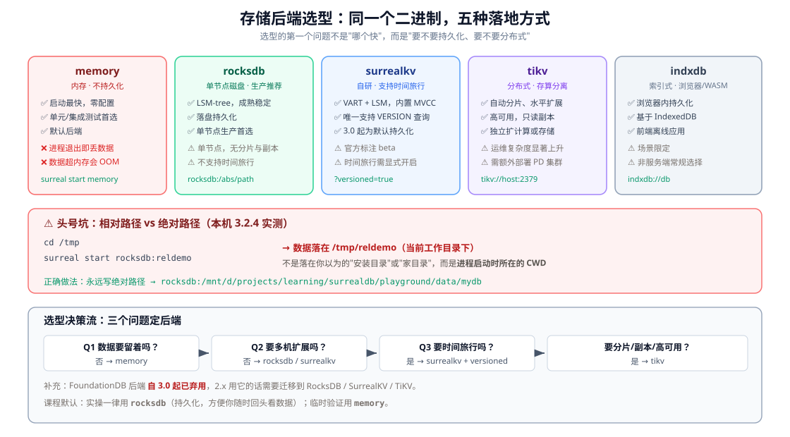
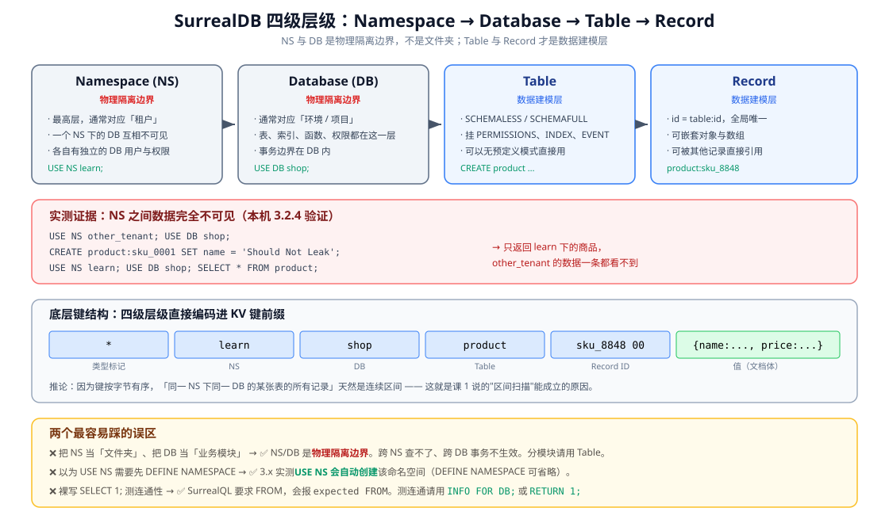

# 课 2 · 跑起来：安装与第一次查询

> **本课在故事主线中的情节定位**：主角登场之后的第一场戏——把舞台搭起来。

[← 返回课程目录](../../../02-课程目录.md) ｜ [阶段概览](../overview.md)

---

## 本课目标

1. 在本机（Windows / WSL）跑起 SurrealDB，理解不同存储后端的差异
2. 能用 CLI、HTTP、GUI、SDK 四种方式连上它并完成第一次查询
3. 理解 Namespace / Database / Table / Record 四级层级，知道每层管什么

---

## 知识点清单

### 知识点 2.1：安装与启动：单二进制与存储后端

**关键点**：

- 三种安装方式：Windows `iwr https://windows.surrealdb.com -useb | iex`、macOS brew、Linux curl
- 存储后端：`memory` / `rocksdb` / `surrealkv` / `indxdb` / `tikv`（FoundationDB 3.0 起弃用）
- 认证参数：`--user` / `--pass` / `--unauthenticated` 的区别与风险
- 相对路径 vs 绝对路径的坑（`rocksdb:mydb` 与 `rocksdb:/path` 语义不同）

**状态**：✅ 已完成

---

### 知识点 2.2：三种客户端：REPL / HTTP / Surrealist

**关键点**：

- `surreal sql` REPL：`--endpoint` / `--user` / `--pass` / `--ns` / `--db` / `--pretty`
- HTTP：curl 打 `/sql` 端点，Header 与鉴权
- Surrealist GUI：官方桌面/web 客户端
- 三者适用场景与切换成本

**状态**：✅ 已完成

---

### 知识点 2.3：用代码连接：SDK 上手

**关键点**：

- 官方 SDK 矩阵：Rust / JS-TS / Python / Go / .NET / Java / PHP / C / Dart
- 最小可运行示例（Python 或 Node，二选一为主，另一个作补充）
- 连接协议：HTTP vs WebSocket（WebSocket 才能用 LIVE 查询）
- 嵌入模式：SDK 直接内嵌数据库进程

**状态**：✅ 已完成

---

### 知识点 2.4：四级层级：NS / DB / Table / Record

**关键点**：

- 每一层是什么：Namespace → Database → Table → Record
- 为什么这么设计：NS/DB 是多租户的**物理边界**，不是逻辑分组
- `USE NS / USE DB` 与连接参数的区别
- `INFO FOR DB` 实际看看里面有什么

**状态**：✅ 已完成

---

## 正文

> **本课所有命令与输出均在本机 WSL Ubuntu 24.04 + SurrealDB 3.2.4 实测通过**（2026-09-02）。文中标注「实测」的结论来自真实执行，不是文档转述。

### 第一幕 · 场景引入：五分钟装好，然后呢？

课 1 结束时，你带着一个问题：**"如果它什么都能干，那它什么干不好？"**

要回答这个问题，你得先把它跑起来。好消息是——这件事五分钟就能完成。

```bash
curl --proto '=https' --tlsv1.2 -sSf https://install.surrealdb.com | sh
```

其他平台（官方安装文档当前给出的命令）：

```bash
# macOS / Linux（Homebrew）
brew install surrealdb/tap/surreal

# Windows（PowerShell）
iwr https://windows.surrealdb.com -useb | iex

# Docker（默认内存后端）
docker run --rm --pull always --name surrealdb -p 8000:8000 \
  surrealdb/surrealdb:latest start
```

> ⚠️ **Windows 安装地址有两个，别混**：官方安装文档首页与 GitHub README 分别出现过 `https://install.surrealdb.com` 和 `https://windows.surrealdb.com` 两个域名。Windows 版请用 **`windows.surrealdb.com`**（`install.surrealdb.com` 的脚本面向 Unix 类系统）。

一行命令，一个 Rust 二进制，零运行时依赖。实测输出：

```
Fetching the latest database version...
Fetching the host system architecture...
Installing surreal-v3.2.4 for linux-amd64...

SurrealDB successfully installed in:
  /usr/local/bin/surreal
```

**实测版本**：`3.2.4+20260803.93ab219 for linux on x86_64`——与本课程的版本基准完全一致。

然后启动：

```bash
surreal start --user root --pass root --bind 127.0.0.1:8000 rocksdb:/path/to/mydb
```

现在问题来了。这一行命令里藏着三个选择，每个选错都会让你在半小时后困惑地翻文档：

1. **数据存哪？**（`rocksdb:` 那个前缀——五种后端，选错了数据会消失）
2. **谁连得上？**（`--user root --pass root`——不写会怎样？写了又意味着什么？）
3. **路径怎么写？**（`:path/to/mydb`——这里有个 90% 的新手都会踩的坑）

**这一课就是把这三个选择讲清楚，然后让你用四种方式连上去，最后理解数据是怎么组织的。**

---

### 第二幕 · 认知冲突：一行命令启动，却有三种"消失"方式

先做个思想实验。下面三条命令都能启动 SurrealDB，都能连上，都能写入成功。但它们**丢数据的方式完全不同**：

```bash
# A
surreal start --user root --pass root memory

# B
surreal start --user root --pass root rocksdb:mydb

# C
surreal start --user root --pass root tikv://127.0.0.1:2379
```

**A 的消失**：进程一停，数据全没。这是设计如此——`memory` 后端就是把数据放内存里。

**B 的消失**：你以为数据存了，重启后却发现是空的。为什么？因为 `rocksdb:mydb` 是**相对路径**，它落在**进程启动时所在的目录**，而不是你以为的地方。

**C 的消失**：数据确实在 TiKV 集群里，但你连错了集群，或者 PD 挂了——这是一种"数据还在但你看不见"的消失。

**冲突的真相**：SurrealDB 把"存储"做成了**可插拔**的，这是它的优势（一套查询语言跑在五种引擎上），也是新手的第一个坑（**你必须在启动的那一刻就决定数据存在哪、怎么存**）。

这个决定几乎不可逆——换后端意味着导出再导入。所以值得花一整节的篇幅讲清楚。

---

### 第三幕 · 层层揭示

---

#### 知识点 2.1：安装与启动：单二进制与存储后端

**一句话定义**：SurrealDB 是一个 Rust 单二进制，服务端与 CLI 合一；启动时通过路径前缀（scheme）选择存储后端，五种后端的持久化、扩展能力与适用场景完全不同。

**直觉建立：一个二进制，五种活法**

把它想成一台相机。`surreal` 这个二进制是机身，`memory` / `rocksdb` / `surrealkv` / `tikv` / `indxdb` 是可换的镜头——**机身不变，取景方式变了**。你的查询（SurrealQL）一句都不用改。

**核心原理：五种后端**



| 后端 | 持久化 | 分布式 | 时间旅行 | 典型场景 |
|------|--------|--------|---------|---------|
| `memory` | ❌ | ❌ | ❌ | 测试、临时验证、默认后端 |
| `rocksdb` | ✅ | ❌ | ❌ | **单节点生产推荐** |
| `surrealkv` | ✅ | ❌ | ✅ | 需要历史版本查询 |
| `tikv` | ✅ | ✅ | ❌ | 多节点集群、存算分离 |
| `indxdb` | ✅ | ❌ | ❌ | 浏览器 / WASM / 离线应用 |

**⚠️ 头号坑：相对路径 vs 绝对路径**

这是本课最重要的一条。实测：

```bash
cd /tmp
surreal start --user root --pass root rocksdb:reldemo
# 数据落在 /tmp/reldemo  ← 当前工作目录（CWD）
```

**`rocksdb:mydb` 里的 `mydb` 是相对路径，基准是进程的当前工作目录**，不是安装目录，不是家目录，不是你上次启动的目录。

三种典型翻车现场：

1. 你在 `~/project` 启动，数据在 `~/project/mydb`；明天在 `~/` 启动，又造了一个 `~/mydb`——两个库，都叫 mydb，数据对不上
2. 用 systemd 启动时 CWD 是 `/`，数据落在 `/mydb`
3. Docker 里 CWD 是 `/`，你挂载了 `/data` 却写到 `/mydb`——容器一删，数据没了

**正确做法：永远写绝对路径。**

```bash
surreal start --user root --pass root rocksdb:/mnt/d/projects/learning/surrealdb/playground/data/mydb
```

**认证参数：三个选项的语义**

| 参数 | 行为 | 风险 |
|------|------|------|
| `--user root --pass root` | 创建/验证 root 用户，认证开启 | 弱密码，生产禁用 |
| 不传任何认证参数 | **认证依然开启**。此时服务端按官方默认行为监听 `127.0.0.1:8000`，首次启动用它自带的默认凭据建 OWNER 角色的 root 用户 | 误以为"没传就是免认证"会直接连不上 |
| `--unauthenticated` | **完全关闭认证** | ⚠️ 任意 guest 拥有等同 root 的 OWNER 权限 |

**⚠️ 实测：三种凭据组合的不同报错（排障对照表）**

| 你做了什么 | 实测返回 | 含义 |
|-----------|---------|------|
| 不带任何凭据 | `{"code":403,...,"Anonymous access not allowed"}` | **匿名被拒**——认证是开着的 |
| 用 `root` / `secret`（官方文档的默认组合） | `The password did not verify` | **密码错**——默认凭据在本实例上不生效 |
| 用 `root` / `root`（本课启动时的凭据） | 正常返回 JSON | 认证通过 |

**关键结论**：启动时传的 `--user/--pass` 才是这个实例的真实凭据，**不要依赖任何"默认密码"**。两种报错要分清——`403 Anonymous access not allowed` 是你没给凭据，`The password did not verify` 是你给了但给错了。

**⚠️ 实测：不带凭据访问会怎样？**

```bash
curl -s -X POST http://127.0.0.1:8000/sql \
  -H "surreal-ns: learn" -H "surreal-db: shop" \
  -d "SELECT * FROM product;"
```

返回：

```json
{"code":403,"details":"Forbidden","description":"Not allowed to do this.",
 "information":"Anonymous access not allowed: Not enough permissions to perform this action"}
```

**403，不是 401**。这个报错信息值得记住——它是"认证没配好"的标准信号。

**示例演示：完整启动一次**

```bash
# 1. 建数据目录
mkdir -p /mnt/d/projects/learning/surrealdb/playground/data

# 2. 启动（后台运行，绝对路径，绑定回环地址）
surreal start \
  --user root --pass root \
  --bind 127.0.0.1:8000 \
  --log info \
  rocksdb:/mnt/d/projects/learning/surrealdb/playground/data/mydb

# 3. 健康检查（这是 3.x 提供的便捷子命令）
surreal is-ready --endpoint http://127.0.0.1:8000
# 输出：OK
```

`--bind 127.0.0.1:8000` 而不是默认的 `0.0.0.0:8000`：学习阶段只监听本机，避免把你这个无强密码的实例暴露到局域网。

**常见误区**

| ❌ 误区 | ✅ 真相 |
|--------|--------|
| "装完就能用，后端随便选" | 后端决定持久化与扩展性，几乎不可热切换，启动前必须想清楚 |
| "`rocksdb:mydb` 会存到固定位置" | 相对路径 → **进程 CWD**；永远写绝对路径 |
| "不传 --user/--pass 就是免认证" | 认证**默认开启**；免认证必须显式 `--unauthenticated` |
| "`--unauthenticated` 方便开发，生产也行" | 该模式下**任何 guest 拥有 OWNER 权限**，等于裸奔 |

**一句话记住**：**启动命令里的三个决定（后端 / 路径 / 认证）都不可逆地影响了这个实例的命运，动手前先想清楚。**

---

#### 知识点 2.2：三种客户端：REPL / HTTP / Surrealist

**一句话定义**：SurrealDB 暴露三种交互入口——`surreal sql` REPL（命令行）、HTTP REST（`/sql` 端点）、Surrealist（官方 GUI），三者底层是同一套 RPC 协议，可随时切换。

**直觉建立**

同一个数据库，三种"说话方式"：REPL 适合**探索**，HTTP 适合**集成**，GUI 适合**看结构**。就像你可以用终端、API 和管理后台操作同一个系统——**它们不是三个系统，是一个系统的三张脸**。

**核心原理**

**方式 1：REPL（`surreal sql`）**

3.x 有个重要变化：**`surreal sql` 默认连接 `main` 命名空间和 `main` 数据库**，因为服务端启动时就会创建这两个默认值。所以最简连接是：

```bash
surreal sql --username root --password root --pretty
```

完整参数：

```bash
surreal sql \
  --endpoint http://127.0.0.1:8000 \
  --username root --password root \
  --namespace learn --database shop \
  --pretty --hide-welcome
```

**一次性查询**（不进交互模式，适合脚本）：

```bash
echo 'INFO FOR DB;' | surreal sql \
  --endpoint http://127.0.0.1:8000 \
  --username root --password root \
  --pretty --hide-welcome
```

实测输出：

```
-- Query 1 (execution time: 169.434µs)
{
	accesses: {  },
	analyzers: {  },
	apis: {  },
	buckets: {  },
	configs: {  },
	functions: {  },
	models: {  },
	modules: {  },
	params: {  },
	sequences: {  },
	tables: {  }
}
```

**方式 2：HTTP REST**

```bash
curl -s -X POST -H "Accept: application/json" \
  -u "root:root" \
  -H "surreal-ns: learn" -H "surreal-db: shop" \
  -d "SELECT * FROM product;" \
  http://127.0.0.1:8000/sql
```

三个关键点：

- **鉴权**：`-u "root:root"`（HTTP Basic）
- **上下文**：`surreal-ns` 与 `surreal-db` 两个 Header 指定命名空间和数据库
- **端点**：`/sql`

**方式 3：Surrealist（GUI）**

官方桌面/网页客户端 [Surrealist](https://surrealist.app/)。它最大的价值不是"能点"，而是**可视化探索图结构与表关系**——阶段 2 学图遍历时它的价值会暴涨。

它还有个独占功能：**2.x → 3.x 迁移诊断**（Migration diagnostics），能自动扫出你的 schema 里哪些地方升级后会坏。

**⚠️ 实测坑：裸 `SELECT 1;` 会报错**

想测连通性，你可能会本能地写 `SELECT 1;`。SurrealQL **不支持无 FROM 的裸 SELECT**：

```
Parse error: Unexpected token `;`, expected FROM
 --> [1:9]
1 | SELECT 1;
  |         ^
```

**测连通性请用这两个**（均已实测）：

```sql
INFO FOR DB;   -- 看库里有什么
RETURN 1;      -- 单纯验证引擎活着
```

`RETURN 1;` 实测输出：

```
-- Query 1 (execution time: 94.402µs)
1
```

**常见误区**

| ❌ 误区 | ✅ 真相 |
|--------|--------|
| "三种客户端是三套 API，要分别学" | 底层同一套 RPC，语法统一，切换成本接近零 |
| "`SELECT 1;` 测连通" | SurrealQL 要求 FROM，会报 `expected FROM`；用 `RETURN 1;` |
| "GUI 只是给新手的" | Surrealist 的图可视化和迁移诊断是 CLI 做不到的 |
| "HTTP 能干所有事" | **LIVE 实时查询只在 WebSocket 上可用**，HTTP 不行（见知识点 2.3） |

**一句话记住**：**探索用 REPL，集成用 HTTP，看结构用 GUI；测连通别写 `SELECT 1;`。**

---

#### 知识点 2.3：用代码连接：SDK 上手

**一句话定义**：官方 SDK 覆盖九种语言，通过 URL scheme 自动选择连接类型（`ws://` 长连接 / `http://` 短连接 / `mem://` `surrealkv://` 内嵌），**只有 WebSocket 支持 LIVE 查询与客户端事务**。

**直觉建立：scheme 决定能力**

URL 的前缀不只是"怎么连"，还决定了**你能用哪些功能**：

| Scheme | 连接类型 | LIVE 查询 | 会话与事务 | 认证状态 |
|--------|---------|----------|-----------|---------|
| `ws://` `wss://` | WebSocket，长连接 | ✅ | ✅ | 连接级持久 |
| `http://` `https://` | HTTP，短连接 | ❌ | ❌ | 每请求独立，token 默认 1h |
| `mem://` | 内嵌内存 | ❌ | ❌ | 免认证 |
| `file://` `surrealkv://` | 内嵌磁盘 | ❌ | ❌ | 免认证 |

**⚠️ 这是选型时容易忽略的一条**：如果你的应用要用实时推送（课 8 的 LIVE SELECT）或客户端事务，**必须用 WebSocket**。

**核心原理：SDK 矩阵**

官方维护：Rust · JavaScript/TypeScript · Python · Go · .NET · Java · PHP · C · Dart

**示例演示：Python SDK（本机实测通过）**

环境准备——**这里有个 Ubuntu 24.04 的坑**：

```bash
python3 -m pip install surrealdb
# error: externally-managed-environment
```

Ubuntu 24.04 启用了 **PEP 668**，禁止直接往系统 Python 装包。解法是用 venv：

```bash
python3 -m venv .venv
.venv/bin/python -m pip install surrealdb
```

**实测安装版本**：`surrealdb 2.0.0`（SDK 版本与服务端版本独立编号，别混淆）

最小可运行示例：

```python
from surrealdb import Surreal

with Surreal("ws://127.0.0.1:8000") as db:
    db.use("learn", "shop")
    db.signin({"username": "root", "password": "root"})

    print("服务端版本:", db.version())
    # 输出：surrealdb-3.2.4+20260803.93ab219

    # 参数化查询，防止注入
    res = db.query(
        "CREATE product SET name = $name, price = $price;",
        {"name": "SDK Keyboard", "price": 459},
    )
    print(res)
    # [{'id': RecordID(table_name=product, record_id='rmks5kcb...'),
    #   'name': 'SDK Keyboard', 'price': 459}]

    rows = db.query("SELECT * FROM product ORDER BY price;")
```

实测输出：

```
--- [1] WebSocket 连接 ---
  已连接并认证
  服务端版本: surrealdb-3.2.4+20260803.93ab219
  新建记录: [{'id': RecordID(table_name=product, record_id='rmks5kcbisq1p8pqunx3'), 'name': 'SDK Keyboard', 'price': 459}]
  全部商品:
    product:rmks5kcbisq1p8pqunx3 SDK Keyboard 459
    product:sku_8848 Mechanical Keyboard 2999
```

**⚠️ 实测坑：WebSocket 新会话需要重新 signin**

`db.new_session()` 创建的会话**不继承主连接的认证态**。直接开事务会报：

```
NotAllowedError: Anonymous access not allowed: Not enough permissions to perform this action
```

正确写法：

```python
with Surreal("ws://127.0.0.1:8000") as db:
    db.use("learn", "shop")
    db.signin({"username": "root", "password": "root"})

    session = db.new_session()
    session.use("learn", "shop")
    session.signin({"username": "root", "password": "root"})  # ← 必须补这行

    txn = session.begin_transaction()
    txn.query("CREATE product:tx_demo SET name = 'In Transaction', price = 1;")
    txn.commit()
    session.close_session()
```

**⚠️ 实测：HTTP 连接根本没有事务方法**

在 `http://` 连接上调 `begin_transaction()`：

```
AttributeError: 'BlockingHttpSurrealConnection' object has no attribute 'begin_transaction'
```

注意这是 **Python 的 AttributeError，不是数据库报错**——SDK 在类型层面就没给 HTTP 连接这个方法。设计意图很明确：**事务是 WebSocket 专属能力**。

**内嵌模式：不需要服务端**

```python
with Surreal("mem://") as db:
    db.use("test", "test")
    print(db.query("CREATE t SET hello = 'world';"))
```

数据库引擎跑在你的 Python 进程里。适合单元测试和边缘场景（课 11 部署时会展开）。

**常见误区**

| ❌ 误区 | ✅ 真相 |
|--------|--------|
| "HTTP 和 WebSocket 只是传输不同，功能一样" | **LIVE 查询与客户端事务只在 WebSocket 可用** |
| "signin 一次，所有会话都认证了" | `new_session()` 的会话必须**单独 signin** |
| "SDK 版本 = 服务端版本" | 独立编号（SDK 2.0.0 连服务端 3.2.4 完全正常） |
| "内嵌模式也能用 LIVE" | 实测：内嵌与 HTTP **都不支持**实时通知 |

**一句话记住**：**要实时、要事务，就选 `ws://`；做脚本、做一次性调用，`http://` 更轻。**

---

#### 知识点 2.4：四级层级：NS / DB / Table / Record

**一句话定义**：SurrealDB 的数据组织是 Namespace → Database → Table → Record 四级，其中 **NS 与 DB 是物理隔离边界**，Table 与 Record 才是数据建模层。

**直觉建立：不是文件夹，是两道墙 + 一层架子**

- **Namespace**：一道墙。墙两边的数据互相看不见，墙两边可以有各自的数据库用户。
- **Database**：第二道墙。同一个 NS 下的不同 DB 也是隔离的，事务边界在 DB 内。
- **Table**：一层架子。放同类记录，可以定义 schema、索引、权限、事件。
- **Record**：架子上的东西。`table:id` 形式，全局唯一，可被直接引用。

**关键推论**：因为 NS/DB 是**物理边界**而不是逻辑分组，所以**跨 NS 查不了，跨 DB 事务不生效**。想按业务模块分，请用 Table，不要用 NS 或 DB。



**核心原理：底层键结构印证了这一点**

回忆课 1 的统一 KV 底座。四级层级**直接编码进 KV 键的前缀**：

```
*  ·  learn  ·  shop  ·  product  ·  sku_8848 00   →  {name: ..., price: ...}
↑      ↑        ↑         ↑            ↑                      ↑
类型    NS       DB       Table      Record ID              文档体
```

因为键按字节有序，**"同一 NS 下同一 DB 的某张表的所有记录"天然是连续区间**——这正是课 1 说的"区间扫描"能成立的原因，也是隔离为什么是物理级的。

**⚠️ 实测发现：`USE NS` 会自动创建命名空间**

你可能以为要先 `DEFINE NAMESPACE learn;` 才能 `USE NS learn;`。实测不需要：

```sql
USE NS learn;   -- 不存在？直接创建
```

`INFO FOR ROOT;` 的实测输出证实了这点：

```
namespaces: {
	learn: 'DEFINE NAMESPACE learn',
	main: "DEFINE NAMESPACE main COMMENT 'Default namespace generated by SurrealDB'"
},
defaults: {
	database: 'main',
	namespace: 'main'
}
```

注意 `main` 那条注释——**`main` 命名空间是服务端自动生成的默认值**，也解释了为什么 3.x 的 `surreal sql` 不传 `--namespace` 也能连上。

**⚠️ 实测：语法别多写**

我第一次写的是 `USE NS learn NS;`（多了一个 `NS`），报错：

```
Parse error: Unexpected token `NAMESPACE`, expected Eof
 --> [1:14]
1 | USE NS learn NS;
  |              ^^
```

正确语法就是 **`USE NS learn;`**（`NS` / `NAMESPACE` 二选一，不要都写）。

**示例演示：第一次查询 + 看结构**

```sql
USE NS learn;
USE DB shop;

CREATE product:sku_8848 SET
  name = 'Mechanical Keyboard',
  price = 2999,
  tags = ['peripheral', 'hot-swap'];

SELECT * FROM product;
```

实测输出：

```json
[
	{
		id: product:sku_8848,
		name: 'Mechanical Keyboard',
		price: 2999,
		tags: ['peripheral', 'hot-swap']
	}
]
```

**用 `INFO` 系列看结构**：

```sql
INFO FOR ROOT;   -- 所有命名空间、节点、系统信息
INFO FOR NS;     -- 当前 NS 下有哪些 DB
INFO FOR DB;     -- 当前 DB 下有哪些表、函数、索引
INFO FOR TABLE product;  -- 某张表的字段与索引定义
```

`INFO FOR NS;` 实测输出：

```
{
	accesses: {  },
	databases: {
		main: 'DEFINE DATABASE main',
		shop: 'DEFINE DATABASE shop'
	},
	users: {  }
}
```

**实测：NS 之间数据完全隔离**

```sql
USE NS other_tenant;
USE DB shop;
CREATE product:sku_0001 SET name = 'Should Not Leak', price = 1;

USE NS learn;
USE DB shop;
SELECT * FROM product;
```

结果只返回 `learn` 下的 `product:sku_8848`，**`other_tenant` 的数据一条都看不到**。这不是权限控制的功劳，是物理隔离。

**`USE` 语句 vs 连接参数**

| 方式 | 作用范围 | 适用场景 |
|------|---------|---------|
| 连接参数 `--namespace` / `--database` | 整个连接 | 应用启动时定好，全程不变 |
| `USE NS` / `USE DB` 语句 | 当前会话 | REPL 里切换、多租户应用动态切换 |
| HTTP Header `surreal-ns` / `surreal-db` | 单个请求 | 无状态 HTTP 调用，每请求指定 |

一个 WebSocket 连接可以多次 `USE` 切换——这正是多租户应用的实现方式（课 10 展开）。

**常见误区**

| ❌ 误区 | ✅ 真相 |
|--------|--------|
| "NS 是文件夹，DB 是业务模块" | 两者都是**物理隔离边界**。分模块请用 Table |
| "跨 NS 也能 JOIN" | 不能。跨 NS 查不了，跨 DB 事务不生效 |
| "要先 DEFINE NAMESPACE" | 3.x 实测 **`USE NS` 会自动创建** |
| "`USE NS learn NS;` 更严谨" | 多写报错；正确是 `USE NS learn;` |

**一句话记住**：**NS 和 DB 是墙，Table 和 Record 才是架子——分业务模块用 Table，隔离租户才用 NS。**

---

### 第四幕 · 实操验证

本课所有脚本已落盘在 `playground/`，可直接运行。

**环境准备**

```bash
# 1. 安装（已实测）
bash playground/l02-install.sh

# 2. 启动服务（后台）
surreal start --user root --pass root --bind 127.0.0.1:8000 \
  rocksdb:/mnt/d/projects/learning/surrealdb/playground/data/mydb

# 3. 健康检查
surreal is-ready --endpoint http://127.0.0.1:8000   # → OK
```

**练习 1：三种客户端都连一遍（10 分钟）**

目标：确认你能在任意一种方式下完成读写。

- **REPL**：`surreal sql --username root --password root --pretty`，然后执行 `INFO FOR DB;`
- **HTTP**：用 curl 打 `/sql` 端点，注意带 `-u` 与两个 Header
- **GUI**：打开 [Surrealist](https://surrealist.app/)，连 `http://127.0.0.1:8000`

验收标准：**三种方式都能看到同一条 `product:sku_8848`**。这能证明它们确实是同一个系统的三张脸。

**练习 2：亲手踩一次路径坑（5 分钟，强烈建议）**

```bash
cd /tmp
surreal start --user root --pass root --bind 127.0.0.1:8011 rocksdb:reldemo &
sleep 4
ls -d /tmp/reldemo        # 你会看到它确实在这里
kill %1
```

然后改成绝对路径重启，观察数据目录位置的变化。**亲手踩过的坑才记得住**——这比读十遍文档有效。

**练习 3：SDK 跑通四种连接（15 分钟）**

```bash
python3 -m venv .venv
.venv/bin/python -m pip install surrealdb
.venv/bin/python playground/l02-sdk-demo.py
```

重点观察三处输出：

1. **WebSocket** 能拿到服务端版本 `surrealdb-3.2.4+20260803.93ab219`
2. **HTTP** 上跑事务 → `AttributeError`（设计如此，不是 bug）
3. **内嵌 `mem://`** 不需要服务端就能写入

**练习 4：画出你自己的层级（思考题）**

假设你要做一个多租户 SaaS，有「用户」「订单」「商品」三类数据，要给 100 家客户用。

问自己：**你的 NS 放什么？DB 放什么？Table 放什么？**

写下你的答案和理由。这个练习的成果会在课 10（权限与多租户）直接被调用——到时候你会知道自己的选择对不对。

---

### 第五幕 · 体系收束

**本课三句话**

1. **启动即抉择**：后端（持久化/扩展性）、路径（相对→CWD 的坑）、认证（默认开启，`--unauthenticated` 等于裸奔）——三个决定都难以回退。
2. **三种客户端是一套 RPC 的三张脸**：探索用 REPL、集成用 HTTP、看结构用 GUI；测连通别写 `SELECT 1;`（SurrealQL 要求 FROM）。
3. **NS/DB 是墙，Table/Record 是架子**：分业务模块用 Table，隔离租户才用 NS；键前缀 `*·NS·DB·Table·RecordID` 印证了这一点。

**认知阶梯回顾**

| 层 | 本课覆盖 |
|----|---------|
| 感知 | 五分钟装好，然后三个选择（第一幕） |
| 概念 | 五种后端、三种客户端、SDK 矩阵、四级层级（第三幕） |
| 机制 | 键前缀编码四级、scheme 决定能力、NS/DB 物理隔离（2.3 / 2.4） |
| 实操 | 三个实测坑：相对路径、裸 SELECT、会话需重新 signin（第四幕） |
| 定位 | 后端选型决策流：要不要持久化→要不要扩展→要不要时间旅行 |

**在全局中的位置**

- **前接课 1**：课 1 说"统一 KV 底座"，本课用**键前缀 `*·NS·DB·Table·RecordID`** 给了它一个具体的形状
- **后接课 3**：你已经能建记录了，下一步是理解 `product:sku_8848` 这个 ID 里还能塞什么——记录 ID 支持**数组与对象**（如 `temperature:['London', d'2026-09-02']`），这是 SurrealDB 建模能力的核心
- **贯穿的课程环境**：本课建的实例（`learn`/`shop` 库、`product:sku_8848`）会一直用到课 12

**三个实测坑的清单**（建议收藏，后面会反复遇到）

| 坑 | 现象 | 正解 |
|----|------|------|
| 相对路径 | 数据落在 CWD，重启"丢数据" | 永远写绝对路径 |
| 裸 `SELECT 1;` | `expected FROM` | 用 `RETURN 1;` 或 `INFO FOR DB;` |
| WS 新会话未 signin | `NotAllowedError` | `session.signin()` 补一行 |

**⚠️ 一个提醒**

本课为了让你快速上手，全程用了 `root/root` 这个弱密码。这在学习环境没问题，但请记住：**`--unauthenticated` 或弱密码一旦带上生产，等于把 OWNER 权限公开。** 课 10 会讲正确的权限模型怎么建。

---

## 本课小结

| 知识点 | 一句话 | 状态 |
|--------|--------|------|
| 2.1 安装与启动 | 一个二进制五种后端；路径写绝对、认证默认开 | ✅ |
| 2.2 三种客户端 | 一套 RPC 三张脸；测连通别写 `SELECT 1;` | ✅ |
| 2.3 SDK 上手 | scheme 决定能力：实时与事务只有 `ws://` 有 | ✅ |
| 2.4 四级层级 | NS/DB 是墙，Table/Record 是架子 | ✅ |

---

## 🚀 下一批接力提示词

复制以下内容继续学习：

```
我的 SurrealDB 学习档案在 surrealdb/00-学习档案.md，
刚学完阶段 1《为什么需要 SurrealDB》课 2《跑起来：安装与第一次查询》
（知识点 2.1 安装与启动、2.2 三种客户端、2.3 SDK 上手、2.4 四级层级）。
阶段 1 已全部完成，请进入阶段 2《核心数据模型与 SurrealQL》，
讲解课 3《记录 ID 与数据建模》的知识点
3.1 记录ID不只是主键、3.2 数据类型系统、
3.3 SCHEMALESS 与 SCHEMAFULL、3.4 字段定义与 REFERENCE。
```

---

## 🧭 课程导航

- 上一课：[课 1 · 一个应用，五个数据库](./lesson-01-一个应用五个数据库.md)
- 下一课：[课 3 · 记录ID与数据建模](../../2-核心数据模型与SurrealQL/lessons/lesson-03-记录ID与数据建模.md)
- 阶段概览：[阶段 1 · 为什么需要 SurrealDB](../overview.md)
- [← 返回课程目录](../../../02-课程目录.md)

---

## 交付状态

| 项 | 值 |
|---|---|
| 状态 | ✅ 已完成 |
| 评审 | ✅ 已完成（双视角评审，P0=0） |
| 完成日期 | 2026-09-02 |
