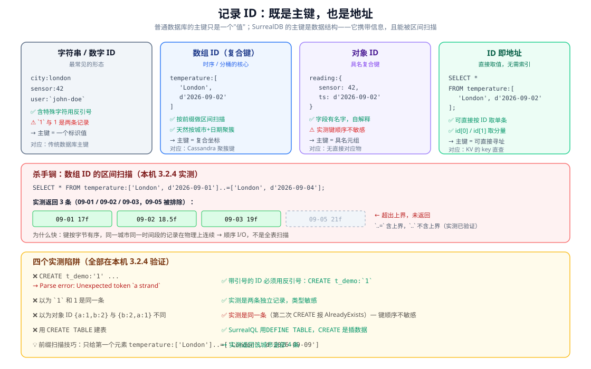
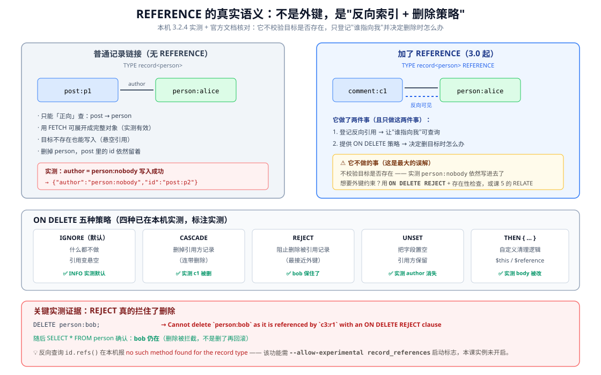

# 课 3 · 记录 ID 与数据建模

> **本课在故事主线中的情节定位**：主角第一次"变形"——原来一条数据的地址本身就是信息。

[← 返回课程目录](../../../02-课程目录.md) ｜ [阶段概览](../overview.md)

---

## 本课目标

1. 理解记录 ID 既是主键也是地址，能用它做范围查询与分桶设计
2. 熟悉 SurrealDB 的原生类型系统，尤其 datetime / duration / geometry
3. 能在 SCHEMALESS 与 SCHEMAFULL 之间做出选择，并知道如何演进
4. 会用 DEFINE FIELD 做类型校验、默认值与删除策略（3.0 新增 REFERENCE，注意它不是外键）

---

## 知识点清单

### 知识点 3.1：记录 ID（Record ID）：不只是主键

**关键点**：

- `table:id` 结构，ID 部分可以是字符串、数字、数组、对象
- ID 即地址：`SELECT * FROM temperature:['London', d'2026-09-02']` 这类复合 ID
- 范围查询：数组 ID 带来的时序与分桶能力
- 陷阱：ID 里的类型敏感（字符串 "1" 与数字 1 是两条记录）

**状态**：✅ 已完成

---

### 知识点 3.2：数据类型系统

**关键点**：

- 原生类型全览：string / number / bool / datetime / duration / decimal / bytes / uuid / geometry / array / object
- `datetime` 与 `duration`：时间计算的原生支持
- `geometry`：GeoJSON 风格点线面，地理查询的基础
- 与 JSON 类型的差异：为什么 SurrealDB 的类型更"厚"

**状态**：✅ 已完成

---

### 知识点 3.3：SCHEMALESS 与 SCHEMAFULL

**关键点**：

- 两种模式的行为差异：SCHEMAFULL 只存定义过的字段
- 什么时候用哪个：早期探索用 SCHEMALESS，稳定后收紧
- 模式演进：`ALTER TABLE ... SCHEMAFULL` 收紧，不必重写数据
- 混合策略：表级 SCHEMALESS + 关键字段单独定义

**状态**：✅ 已完成

---

### 知识点 3.4：字段定义、类型校验与 REFERENCE

**关键点**：

- `DEFINE FIELD ... TYPE ...`：类型约束
- `ASSERT`：自定义校验（如 `string::is_email($value)`）
- `DEFAULT`：默认值
- **3.0 新增 REFERENCE**：`TYPE option<record<person>> REFERENCE ON DELETE CASCADE`
- ⚠️ 实测更正：REFERENCE **不是外键**，不校验目标是否存在，只做「反向可见 + ON DELETE 策略」

**状态**：✅ 已完成

---

## 正文

> **本课所有命令与输出均在本机 WSL Ubuntu 24.04 + SurrealDB 3.2.4 实测通过**（2026-09-02）。文中标注「实测」的结论来自真实执行。有两处结论与坊间文档说法相反，已用实测与官方文档双向核对，见 3.1 与 3.4 的说明。

### 第一幕 · 场景引入：这个 ID 长得不太对

课 2 结束时，你在 `learn`/`shop` 库里建了第一条记录：

```sql
CREATE product:sku_8848 SET name = 'Mechanical Keyboard', price = 2999;
```

看起来平平无奇——`product:sku_8848`，表名加主键，跟其他数据库没区别。

但 SurrealDB 允许你写这样的东西：

```sql
CREATE temperature:['London', d'2026-09-02'] SET celsius = 18.5;
```

**ID 里塞了一个数组，数组里塞了一个城市和一个日期。**

再看这个：

```sql
CREATE reading:{ sensor: 42, ts: d'2026-09-02T10:00:00Z' } SET value = 7.7;
```

**ID 里塞了一个对象。**

这就不太对劲了。在 MySQL 里，主键是 `INT` 或 `VARCHAR`——一个"值"。你把城市和日期编码进主键，DBA 会把你叫去谈话。

**但 SurrealDB 不但允许，还鼓励你这么干。**为什么？

因为在这里，记录 ID 不只是主键——**它是地址**。地址是可以携带结构的，携带了结构就可以被"按区间"扫描。这一课就讲这件事，以及它带来的便利与陷阱。

---

### 第二幕 · 认知冲突：反范式还是新范式？

先听一个反面声音。

**"把时间戳塞进 ID？这是教科书级的反范式！"**

这话在传统关系建模里完全正确。主键应该**无意义、稳定、不可变**（代理主键）。把业务含义编进主键，一旦业务变化，你得改主键——而改主键意味着改所有引用它的地方。这是灾难。

SurrealDB 说：**慢着，看看我这边发生了什么。**

```sql
-- 取伦敦 9 月 1 日到 4 日的全部温度读数
SELECT * FROM temperature:['London', d'2026-09-01']..=['London', d'2026-09-04'];
```

实测返回 3 条（09-01、09-02、09-03），而 09-05 被正确排除。

**注意这条查询没有 `WHERE`，没有索引，没有扫描全表。**它直接按 ID 的区间取数据。

为什么能这么干？回忆课 1 的统一 KV 底座：所有记录按 **键的字节序** 存储。数组 ID 编码成键之后，`['London', 09-01]`、`['London', 09-02]`、`['London', 09-03]` 在物理上是**连续的**——这是一个顺序 I/O，不是一个全表扫描。

**冲突的真相**：SurrealDB 把"主键"和"聚簇索引"合成了一个东西。你的 ID 设计**直接决定了数据在磁盘上的物理排列**。这不是反范式，这是把 Cassandra 的聚簇键（clustering key）思想带到了文档数据库里。

代价是什么？**ID 设计变得重要了**，选错 ID 的代价和选错索引一样大。这就是本课要教你的判断力。

---

### 第三幕 · 层层揭示

---

#### 知识点 3.1：记录 ID（Record ID）：不只是主键

**一句话定义**：记录 ID 格式为 `table:id`，其中 id 部分可以是字符串、数字、数组或对象；ID 既是唯一标识也是物理地址，数组与对象 ID 可直接做区间扫描。

**直觉建立**

传统数据库的主键是**门牌号**——一个纯粹的标签，本身不携带信息。SurrealDB 的记录 ID 是**GPS 坐标**——它描述位置，位置本身就有含义，且相邻坐标在物理上也相邻。

**核心原理：四种形态**



| 形态 | 示例 | 特点 | 对应传统概念 |
|------|------|------|-------------|
| 字符串 | `city:london` | 最常用；特殊字符需反引号 | 主键 |
| 数字 | `sensor:42` | 紧凑 | 自增主键 |
| 数组 | `temperature:['London', d'2026-09-02']` | **可区间扫描**，时序/分桶核心 | Cassandra 聚簇键 |
| 对象 | `reading:{ sensor: 42, ts: ... }` | 字段具名，自解释 | 无直接对应物 |

**实测：四种都能建**

```sql
CREATE city:london SET name = 'London', country = 'UK';
CREATE sensor:42 SET name = 'Sensor 42';
CREATE temperature:['London', d'2026-09-02'] SET celsius = 18.5;
CREATE reading:{ sensor: 42, ts: d'2026-09-02T10:00:00Z' } SET value = 7.7;
```

全部成功。第三条返回的 ID 长这样：

```
temperature:['London', d'2026-09-02T00:00:00Z']
```

**杀手锏：数组 ID 的区间扫描**

```sql
-- 闭区间：..= 含上界
SELECT * FROM temperature:['London', d'2026-09-01']..=['London', d'2026-09-04'];
```

实测返回 09-01（17f）、09-02（18.5f）、09-03（19f）三条，09-05 被排除。

```sql
-- 开区间：.. 不含上界
SELECT * FROM temperature:['London', d'2026-09-02']..['London', d'2026-09-05'];
```

实测返回 09-02、09-03 两条。

```sql
-- 前缀扫描：只给第一个元素，取该城市全部
SELECT * FROM temperature:['London']..=['London', d'2026-09-09'];
```

实测返回伦敦的 4 条记录。**这相当于"按城市分区扫描"**——多租户分桶、时序分片的经典手法。

**ID 即地址：直接取单条**

```sql
SELECT * FROM temperature:['London', d'2026-09-02'];
```

实测直接返回那一条。不需要 `WHERE id = ...`，ID 本身就是地址。

还能取 ID 的分量：

```sql
SELECT id, id[0] AS city_name, id[1] AS day FROM temperature;
```

实测输出：

```
{ city_name: 'London', day: d'2026-09-01T00:00:00Z', id: temperature:['London', d'2026-09-01T00:00:00Z'] }
```

**⚠️ 四个实测陷阱**

**陷阱 1：带引号的字符串 ID 必须用反引号**

```sql
CREATE t_demo:'1' SET kind = 'string one';
-- Parse error: Unexpected token `a strand`, expected an identifier
```

正确写法：

```sql
CREATE t_demo:`1` SET kind = 'string one';   -- ✅
```

**陷阱 2：类型敏感——`1` 和 `1` 是两条记录**

```sql
CREATE t_demo:`1` SET kind = 'string one';
CREATE t_demo:1   SET kind = 'number one';
SELECT * FROM t_demo;
```

实测返回**两条**：`t_demo:1`（number one）与 ``t_demo:`1```（string one）。反引号包起来的是字符串，不包的是数字。

**陷阱 3：对象 ID 的键顺序不敏感**（⚠️ 这一点与部分文档说法相反）

```sql
CREATE obj_demo:{ a: 1, b: 2 } SET v = 'ab';
CREATE obj_demo:{ b: 2, a: 1 } SET v = 'ba';
```

第二条**报错**：

```
AlreadyExists: Database record `obj_demo:{ a: 1, b: 2 }` already exists
```

**这个结论需要严格验证**，所以我补了四组对照实验（`playground/l03-verify-objid.surql`）：

| 实验 | 语句 | 实测结果 | 说明 |
|------|------|---------|------|
| 1 | `{a:1,b:2}` 与 `{a:2,b:1}` | **两条**记录 | 值不同，本就是不同记录 |
| 2 | `{a:1,b:2}` 与 `{b:2,a:1}` | AlreadyExists | **键序不同但键值相同 → 同一条** |
| 3 | `UPSERT {b:2,a:1}` 覆盖 | 成功，v 被改成新值 | 坐实是同一条，且 ID 归一化为 `{ a: 1, b: 2 }` |
| 4 | `[1,2]` 与 `[2,1]` | **两条**记录 | ⚠️ **数组 ID 顺序敏感** |

**结论**：对象 ID **键顺序不敏感**（同键名同值即同一条，ID 会按规范化形式存储）；但**数组 ID 顺序敏感**（`[1,2]` ≠ `[2,1]`）。

这个差异很关键：**对象 ID 适合"具名复合键"（不在乎书写顺序），数组 ID 适合"有序坐标"（顺序即语义）**。

**陷阱 4：建表用 `DEFINE TABLE`，不是 `CREATE TABLE`**

```sql
CREATE TABLE mixed SCHEMALESS;
-- Parse error: Unexpected token `an identifier`, expected Eof
```

`CREATE` 在 SurrealQL 里是**插数据**（`CREATE table:id SET ...`），建表要用 `DEFINE TABLE`。

**常见误区**

| ❌ 误区 | ✅ 真相 |
|--------|--------|
| "ID 只能是无意义字符串" | 可以是数组/对象，且这是时序场景的核心能力 |
| "区间查询要建索引" | 数组 ID 天然有序，**不需要额外索引** |
| "`'1'` 这样写就行" | 必须反引号 `` `1` ``，否则 Parse error |
| "对象 ID 换个键顺序就是新记录" | 实测**键顺序不敏感**，是同一条 |
| "对象/数组 ID 都不在乎顺序" | ⚠️ **数组敏感**（`[1,2]`≠`[2,1]`），**对象不敏感** |

**一句话记住**：**数组 ID 是你的免费聚簇索引——把最常用于范围查询的维度放进 ID，查询就从全表扫描变成顺序 I/O。**

---

#### 知识点 3.2：数据类型系统

**一句话定义**：SurrealDB 的类型系统比 JSON "厚"——除了 string/number/bool/array/object，还原生支持 datetime、duration、decimal、bytes、uuid 与 geometry。

**直觉建立**

JSON 只有 6 种类型，所以每个 JSON 数据库都得自己解决三个问题：日期怎么存？高精度小数怎么存？地理位置怎么存？答案通常是——存成字符串，然后在应用层处理。

SurrealDB 说：**这些应该是数据库的一等公民。**

**核心原理：原生类型全览**

| 类型 | 字面量写法 | 说明 |
|------|-----------|------|
| `string` | `'hello'` | 文本 |
| `int` / `float` | `42` / `3.14` | 整数 / 浮点 |
| `bool` | `true` | 布尔 |
| `datetime` | `d'2026-09-02T10:00:00Z'` | **ISO 8601 时间戳** |
| `duration` | `1h30m`、`1w` | **时间段** |
| `decimal` | `3.14dec` | **高精度定点数** |
| `bytes` | `b'ABCDEF'` | 二进制 |
| `uuid` | `u'0189d6e0-...'` | UUID |
| `geometry` | `(51.5, -0.12)` | **GeoJSON 点线面** |
| `array` / `object` | `[1,2]` / `{a:1}` | 复合 |

**实测：`type::of` 返回的运行时类型**

```sql
RETURN [type::of('hello'), type::of(42), type::of(3.14), type::of(true),
        type::of(d'2026-09-02T10:00:00Z'), type::of(1h30m), type::of(3.14dec),
        type::of(b'ABCDEF'), type::of([1,2,3]), type::of({a:1}),
        type::of((51.5, -0.12)), type::of(u'0189d6e0-4b7a-7000-8000-000000000000')];
```

实测输出：

```
['string', 'int', 'float', 'bool', 'datetime', 'duration', 'decimal',
 'bytes', 'array', 'object', 'geometry<point>', 'uuid']
```

**⚠️ 实测坑：类型判定函数名是下划线，不是双冒号**

你可能按直觉写 `type::is::string(...)`，实测报错：

```
Parse error: Invalid function/constant path, did you maybe mean `type::is_string`
```

解析器还挺贴心，直接告诉你正确名字。**正确的是下划线形式**：

```sql
RETURN type::is_string('hello');     -- true
RETURN type::is_number(42);          -- true
RETURN type::is_datetime(d'2026-09-02');  -- true
RETURN type::is_decimal(3.14dec);    -- true
RETURN type::is_geometry((51.5, -0.12));  -- true
```

实测全部返回 `true`。

**datetime + duration：原生时间计算**

```sql
RETURN d'2026-09-02T10:00:00Z' + 1h30m;   -- d'2026-09-02T11:30:00Z'
RETURN d'2026-09-02T10:00:00Z' + 1w;      -- d'2026-09-09T10:00:00Z'
RETURN d'2026-09-02T10:00:00Z' - d'2026-08-26T10:00:00Z';  -- 1w
```

注意第三条：**两个 datetime 相减直接得到 duration**（`1w`）。这不是字符串运算，是类型系统层面的支持。

**decimal：为什么需要它**

这是本课最有说服力的一条实测：

```sql
RETURN 0.1 + 0.2;        -- 0.30000000000000004
RETURN 0.1dec + 0.2dec;  -- 0.3
```

**同样的算式，float 给出 `0.30000000000000004`，decimal 给出精确的 `0.3`。**

涉及金额时，这不是"精度略有误差"——这是对不上账。所以：**金额一律用 `decimal`，不要用 `float`。**

**geometry：GeoJSON 风格**

```sql
CREATE place:cafe SET name = 'Central Cafe', loc = (51.5074, -0.1278);
SELECT *, loc, type::of(loc) FROM place;
```

实测输出：

```
{ id: place:cafe, loc: (51.5074f, -0.1278f), name: 'Central Cafe', "type::of": 'geometry<point>' }
```

两点写法 `(lat, lon)` 会被识别为 `geometry<point>`。线面用 GeoJSON 对象：

```sql
RETURN type::of({ type: 'Polygon', coordinates: [[[0,0],[0,1],[1,1],[1,0],[0,0]]] });
-- 'geometry<polygon>'
```

地理函数也内置了，**实测**：

```sql
RETURN geo::distance((51.5074, -0.1278), (48.8566, 2.3522));
-- 403584.4516586441（伦敦到巴黎，单位：米）
```

**⚠️ 实测坑**：`type::point()` 只接受 1 个参数

```sql
RETURN type::point(51.5, -0.12);
-- Incorrect arguments for function type::point(). Expected 1 argument
```

想构造点，直接写字面量 `(51.5, -0.12)` 即可，不必调函数。

**类型转换**

```sql
RETURN type::string(42);                        -- '42'
RETURN type::number('42');                      -- 42
RETURN type::datetime('2026-09-02T10:00:00Z');  -- d'2026-09-02T10:00:00Z'
```

**常见误区**

| ❌ 误区 | ✅ 真相 |
|--------|--------|
| "类型判定用 `type::is::string`" | 实测应为 **`type::is_string`**（下划线） |
| "金额用 float 就行" | 实测 `0.1+0.2 = 0.30000000000000004`；**金额用 decimal** |
| "日期存字符串也一样" | datetime 原生支持 `+1h30m`、两日期相减得 duration |
| "`type::point(51.5, -0.12)` 构造点" | 实测只接受 1 参数；直接写字面量 `(51.5, -0.12)` |

**一句话记住**：**JSON 的 6 种类型不够用，SurrealDB 补上了 datetime / duration / decimal / bytes / uuid / geometry——金额用 decimal，时间用 datetime，位置用 geometry。**

---

#### 知识点 3.3：SCHEMALESS 与 SCHEMAFULL

**一句话定义**：SCHEMALESS 表接受任意字段（默认），SCHEMAFULL 表**只接受**已用 `DEFINE FIELD` 定义的字段；可用 `ALTER TABLE ... SCHEMAFULL` 逐步收紧，不必重写数据。

**直觉建立**

把它想成**安检口**：

- **SCHEMALESS** = 开放式园区，带什么都进得去。灵活，但也意味着"说不清里面有什么"。
- **SCHEMAFULL** = 机场安检，清单之外的东西**当场拦下**。

**核心原理：行为差异**

**SCHEMALESS（默认）**

```sql
CREATE loose SET name = 'Alice', age = 30, extra = 'anything goes';
```

实测成功，三个字段全存下了——包括你从没定义过的 `extra`。

**SCHEMAFULL**

```sql
DEFINE TABLE strict SCHEMAFULL;
DEFINE FIELD name ON strict TYPE string;
DEFINE FIELD age ON strict TYPE int;

CREATE strict SET name = 'Bob', age = 25;        -- ✅
CREATE strict SET name = 'Carol', age = 28, junk = 'this should vanish';  -- ❌
```

**⚠️ 实测推翻了一个常见说法**：第二条**报错了**，不是静默丢弃：

```
Found field 'junk', but no such field exists for table 'strict'
```

很多文档说"SCHEMAFULL 会静默丢弃未定义字段"。**在 3.2.4 上实测是报错拒绝**（更早版本可能确实静默丢弃）。这是个好消息——静默丢弃才是真正的坑，报错至少让你知道写错了。

**类型校验**

```sql
CREATE strict SET name = 'Dave', age = 'not-a-number';
```

实测报错：

```
Couldn't coerce value for field `age` of `strict:h6riuno7dcuipoeich04`: Expected `int` but found `'not-a-number'`
```

**模式演进：先松后紧**

这是 SurrealDB 很贴心的一个设计：

```sql
-- 1. 早期随便写
CREATE evolve SET name = 'Legacy', legacy_field = 'exists before tightening';

-- 2. 事后收紧
ALTER TABLE evolve SCHEMAFULL;
DEFINE FIELD name ON evolve TYPE string;

-- 3. 老数据还在吗？实测：在
SELECT * FROM evolve;
```

实测返回：

```
{ id: evolve:qm8dt3hhen4y3z4qx92b, legacy_field: 'exists before tightening', name: 'Legacy' }
```

**`ALTER TABLE` 不会重写或清洗老数据**，老记录原样保留。这一点很重要，也有一个反面（见下方误区）。

**混合策略：最实用的选择**

```sql
DEFINE TABLE mixed SCHEMALESS;              -- 表级宽松
DEFINE FIELD email ON mixed TYPE string ASSERT string::is_email($value);  -- 关键字段严格
```

实测：

```sql
CREATE mixed SET email = 'good@example.com', whatever = 'allowed';  -- ✅
CREATE mixed SET email = 'not-an-email', whatever = 'x';            -- ❌
```

第二条报错：

```
Found 'not-an-email' for field `email`, with record `mixed:du4u5xmwi17exvzmaziv`, but field must conform to: string::is_email($value)
```

**这就是真实项目里最舒服的形态**：整体保持灵活，只对关键字段（邮箱、金额、状态）上约束。

**什么时候用哪个**

| 场景 | 选择 | 理由 |
|------|------|------|
| 早期探索 / 需求未定 | SCHEMALESS | 改结构零成本 |
| 数据结构已稳定 | SCHEMAFULL | 拼写错误当场暴露 |
| 大部分灵活 + 少数关键 | **混合**（推荐） | 兼顾灵活与安全 |
| 要对接外部不可控数据 | SCHEMALESS | 来者不拒 |

**常见误区**

| ❌ 误区 | ✅ 真相 |
|--------|--------|
| "SCHEMAFULL 会静默丢弃未定义字段" | 3.2.4 实测是**报错拒绝**（`no such field exists`） |
| "改成 SCHEMAFULL 要重写数据" | `ALTER TABLE` 只对新写入生效，老数据原样保留 |
| "收紧后老数据会被清洗" | **不会**——这正是危险处：老记录可能缺新字段 |
| "SCHEMALESS 等于没有校验" | 可以对单个字段 `DEFINE FIELD`，实现混合策略 |

**一句话记住**：**早期 SCHEMALESS 探索，稳定后 `ALTER TABLE ... SCHEMAFULL` 收紧；最实用的中间态是表级宽松 + 关键字段单独定义。**

---

#### 知识点 3.4：字段定义、类型校验与 REFERENCE

**一句话定义**：`DEFINE FIELD` 用 `TYPE` 约束类型、`ASSERT` 自定义校验、`DEFAULT` 设默认值；3.0 新增的 `REFERENCE` 让记录链接**可反向查询**并支持 `ON DELETE` 策略，但它**不是外键约束**。

**直觉建立：三种"关系"的强度**

| 写法 | 做了什么 | 强度 |
|------|---------|------|
| `TYPE record<person>` | 只是存了个 ID | 弱（悬空也行） |
| `TYPE record<person> REFERENCE` | 存 ID + **登记反向引用** | 中（可查"谁指向我"） |
| `... REFERENCE ON DELETE REJECT` | 再加**删除保护** | 强（最接近外键） |

**核心原理：`DEFINE FIELD` 的四件套**

```sql
DEFINE TABLE person SCHEMAFULL;
DEFINE FIELD name  ON person TYPE string;
DEFINE FIELD email ON person TYPE string ASSERT string::is_email($value);
DEFINE FIELD since ON person TYPE datetime DEFAULT time::now();
```

四个子句：

- **`TYPE`**：类型约束，不符就拒绝
- **`ASSERT`**：自定义校验，返回 false 就拒绝
- **`DEFAULT`**：没给值时的默认值
- **`READONLY`**（补充）：写入后不可改

**ASSERT 的报错信息很友好**

```sql
DEFINE FIELD email ON person TYPE string ASSERT string::is_email($value);
CREATE person SET email = 'not-an-email';
```

实测报错：

```
Found 'not-an-email' for field `email`, with record `person:xxx`, but field must conform to: string::is_email($value)
```

它把**校验表达式本身**写进了错误信息，排障时不用猜。

**记录链接与 FETCH**

```sql
DEFINE FIELD author ON post TYPE record<person>;
CREATE post:p1 SET title = 'Hello', author = person:alice;

SELECT * FROM post;               -- author: person:alice（只是个 ID）
SELECT * FROM post FETCH author;  -- 展开成完整对象
```

实测第二条：

```
{ author: { email: 'alice@example.com', id: person:alice, name: 'Alice' }, id: post:p1, title: 'Hello' }
```

**`FETCH` 会把记录链接替换成完整对象**——这是文档数据库"不用写 JOIN"的关键。

**⚠️ 最重要的纠错：REFERENCE 不是外键**

很多资料（包括骨架里的描述）说 REFERENCE 提供"引用完整性"。**实测 + 官方文档核对的结论是：不是。**



实测：

```sql
DEFINE FIELD author ON comment TYPE option<record<person>> REFERENCE ON DELETE CASCADE;
CREATE comment:c1 SET body = 'Nice post', author = person:alice;   -- ✅
CREATE comment:c3 SET body = 'Ghost', author = person:nobody;      -- ✅ 写入成功！
```

**`person:nobody` 根本不存在，但写入成功了。**无论是否 `option`，无论是否加 REFERENCE。

**REFERENCE 真正做的事只有两件**（官方文档明确）：

1. **让引用可反向查询** —— 被引记录能看到"谁指向我"
2. **提供 `ON DELETE` 策略** —— 决定删除被引用记录时怎么办

**五种 ON DELETE 策略（四种已实测）**

| 策略 | 行为 | 实测结果 |
|------|------|---------|
| `IGNORE`（默认） | 什么都不做 | ✅ `INFO FOR TABLE` 显示默认即此项 |
| `CASCADE` | 删掉引用方记录 | ✅ 删 `person:alice` 后 `comment:c1` 消失 |
| `REJECT` | 阻止删除被引用记录 | ✅ 删 `person:bob` 被拒，bob 仍在 |
| `UNSET` | 把字段置空 | ✅ 删 `person:carol` 后 `c4:u1` 的 author 消失 |
| `THEN {...}` | 自定义逻辑 | ✅ 删 `person:dave` 后 `c5:t1` 的 body 被改为 'author removed' |

**实测：REJECT 的完整证据**

```sql
DEFINE FIELD author ON c3 TYPE option<record<person>> REFERENCE ON DELETE REJECT;
CREATE c3:r1 SET body = 'protects bob', author = person:bob;
DELETE person:bob;
```

报错：

```
Cannot delete `person:bob` as it is referenced by `c3:r1` with an ON DELETE REJECT clause
```

随后 `SELECT * FROM person` 确认 **bob 仍在**——删除被真正拦截，不是"删了再回滚"。

**⚠️ 实测：`id.refs()` 需要实验标志**

官方教程里用 `id.refs()` 做反向查询。本机实测：

```
There was a problem running the refs() function. no such method found for the record type
```

该功能需启动时加 `--allow-experimental record_references` 标志，本课实例未开启。**3.2.4 上它仍是实验特性**，生产使用前请评估。

**常见误区**

| ❌ 误区 | ✅ 真相 |
|--------|--------|
| "REFERENCE 保证引用的记录一定存在" | **实测不保证**，悬空引用照样写入 |
| "REFERENCE 等于外键" | 它只做「反向可见 + 删除策略」；要拦截删除用 **REJECT** |
| "加了 REFERENCE 就能 `id.refs()`" | 实测报 no such method，**需实验标志** |
| "DEFAULT 只在 CREATE 时生效" | `DEFAULT ALWAYS` 可在每次更新时强制 |

**一句话记住**：**REFERENCE ≠ 外键。想要"删不掉被引用记录"用 `ON DELETE REJECT`，想要"级联删除"用 `CASCADE`；但别指望它校验目标是否存在。**

---

### 第四幕 · 实操验证

本课脚本已落盘在 `playground/`。

```bash
# 前提：课 2 的实例在跑
surreal is-ready --endpoint http://127.0.0.1:8000   # → OK

# 逐个知识点跑（用 /sql 端点，保留完整输出）
curl -s -X POST -H "Accept: application/json" -u "root:root" \
  -H "surreal-ns: learn" -H "surreal-db: kp31" \
  --data-binary @playground/l03-verify-31.surql http://127.0.0.1:8000/sql
```

> 💡 **为什么用 `@` 文件而不是 echo 管道**：多行 SurrealQL 经 shell 管道时换行会被吞掉，导致 `Parse error`。本课所有多行语句都用文件 + `--data-binary @` 提交。

**练习 1：设计一个时序 ID（15 分钟）**

假设你要存 IoT 传感器数据，查询模式是"某设备最近 7 天的读数"。

- 你的 ID 应该长什么样？（提示：设备 ID 和时间戳，谁在前？**先想清楚你总是按什么维度查**）
- 为什么**不能**把时间戳放前面？（提示：时间戳在前，同一设备的读数还连续吗？）
- 写出"设备 A 在 9 月 1-7 日的读数"的查询

> 💡 **参考答案**：`reading:['device-A', d'2026-09-01']..=['device-A', d'2026-09-07']`。设备在前，因为你要的是"某设备的某段时间"——设备相同则键前缀相同，物理上连续。反过来时间戳在前，同一设备的读数会散落在键空间各处，区间扫描就失效了。

验收标准：能用一条**不含 WHERE** 的区间查询取到数据。

**练习 2：亲手验证 REFERENCE 不是外键（10 分钟，重要）**

```sql
DEFINE TABLE t SCHEMAFULL;
DEFINE FIELD ref ON t TYPE record<person> REFERENCE;
CREATE t:x SET ref = person:does_not_exist;   -- 猜猜会不会报错？
```

跑完对照本课结论。**亲手确认一次，比读十遍"它不是外键"记得牢。**

**练习 3：给课 2 的 shop 库收紧 schema（15 分钟）**

课 2 的 `product` 表是 SCHEMALESS 的。现在请你：

1. 用 `ALTER TABLE product SCHEMAFULL` 收紧
2. 为 `name`、`price` 定义字段（`price` 用什么类型？回想 3.2 的 decimal）
3. 验证：**课 2 建的 `product:sku_8848` 还在吗？**（这正是"收紧不重写数据"的实证）

**练习 4：五种删除策略选一个（思考题）**

博客系统，`comment.author` 指向 `person`。用户注销账号时，你希望他的评论怎么办？

| 你的选择 | ON DELETE | 理由 |
|---------|-----------|------|
| 评论一起删掉 | `CASCADE` | 用户数据彻底清除（GDPR 场景） |
| 评论保留但作者置空 | `UNSET` | 保留讨论内容 |
| 有评论就不许注销 | `REJECT` | 防止内容丢失 |

写下你的选择和理由。**这个决策没有标准答案，取决于业务**——但你必须知道每种选择的后果。

---

### 第五幕 · 体系收束

**本课三句话**

1. **记录 ID 不只是主键，是地址**：数组/对象 ID 携带结构，天然有序，`..=`/`..` 区间查询是不建索引的顺序 I/O。
2. **类型系统比 JSON 厚**：datetime / duration / decimal / bytes / uuid / geometry 都是一等公民；**金额用 decimal**（实测 `0.1+0.2 = 0.30000000000000004`）。
3. **REFERENCE 不是外键**：它只提供「反向可见 + ON DELETE 策略」，**不校验目标是否存在**；想要删除保护用 `ON DELETE REJECT`（实测确实拦住了）。

**认知阶梯回顾**

| 层 | 本课覆盖 |
|----|---------|
| 感知 | 这个 ID 长得不太对（第一幕） |
| 概念 | 四种 ID 形态、类型全览、两种 Schema 模式（第三幕） |
| 机制 | 键序 → 区间扫描、decimal 精度、REFERENCE 语义（3.1 / 3.2 / 3.4） |
| 实操 | 四个陷阱 + 四个练习（第三、四幕） |
| 定位 | 先松后紧的演进路径、五种删除策略的业务取舍（3.3 / 3.4） |

**在全局中的位置**

- **前接课 2**：课 2 建的 `product:sku_8848` 用的是简单字符串 ID；本课告诉你 ID 还能怎么设计，课末练习 3 会回头给它收紧 schema
- **后接课 4**：建模好了，下一步是 CRUD——尤其 `UPDATE` 与 `UPSERT` 的语义差异（2.0 起的行为变更）
- **后接课 5**：本课的记录链接（record link）是"关系"的第一种表达；课 5 的 `RELATE` 是第二种（能带属性的边），届时你会理解该选哪个
- **贯穿**：阶段 3 的全文索引、向量索引全部建立在课 3 的 `DEFINE FIELD` 之上

**⚠️ 本课两处与坊间说法相反的结论**（建议记住，容易被误导）

| 说法 | 本课实测结论 |
|------|-------------|
| "SCHEMAFULL 静默丢弃未定义字段" | 3.2.4 是**报错拒绝**（`no such field exists`） |
| "REFERENCE 提供引用完整性" | **不校验目标是否存在**，只做反向可见 + 删除策略 |

**实测陷阱清单**

| 陷阱 | 现象 | 正解 |
|------|------|------|
| 字符串 ID 用单引号 | `Parse error: Unexpected token 'a strand'` | 用**反引号** `` `1` `` |
| `type::is::string` | `Invalid function/constant path` | 用 **`type::is_string`**（下划线） |
| `CREATE TABLE` 建表 | `Unexpected token 'an identifier'` | 用 **`DEFINE TABLE`** |
| `type::point(51.5, -0.12)` | `Expected 1 argument` | 直接写字面量 **`(51.5, -0.12)`** |
| `id.refs()` | `no such method found` | 需 **`--allow-experimental record_references`** |
| 多行语句走管道 | 换行被吞，Parse error | 用文件 + **`--data-binary @`** |

---

## 本课小结

| 知识点 | 一句话 | 状态 |
|--------|--------|------|
| 3.1 记录 ID 不只是主键 | 数组/对象 ID 可区间扫描，是免费聚簇索引 | ✅ |
| 3.2 数据类型系统 | 比 JSON 厚；金额 decimal、时间 datetime、位置 geometry | ✅ |
| 3.3 SCHEMALESS 与 SCHEMAFULL | 先松后紧，`ALTER TABLE` 收紧不重写数据 | ✅ |
| 3.4 字段定义与 REFERENCE | REFERENCE ≠ 外键，只做反向可见 + 删除策略 | ✅ |

---

## 🚀 下一批接力提示词

复制以下内容继续学习：

```
我的 SurrealDB 学习档案在 surrealdb/00-学习档案.md，
刚学完阶段 2《核心数据模型与 SurrealQL》课 3《记录 ID 与数据建模》
（知识点 3.1 记录ID不只是主键、3.2 数据类型系统、
3.3 SCHEMALESS 与 SCHEMAFULL、3.4 字段定义与 REFERENCE）。
请按大纲继续讲解课 4《CRUD 与查询子句》的知识点
4.1 CRUD 五件套、4.2 查询子句、4.3 参数 LET 与事务。
```

---

## 🧭 课程导航

- 上一课：[课 2 · 跑起来：安装与第一次查询](../../1-为什么需要SurrealDB/lessons/lesson-02-跑起来安装与第一次查询.md)
- 下一课：[课 4 · CRUD 与查询子句](./lesson-04-CRUD与查询子句.md)
- 阶段概览：[阶段 2 · 核心数据模型与 SurrealQL](../overview.md)
- [← 返回课程目录](../../../02-课程目录.md)

---

## 交付状态

| 项 | 值 |
|---|---|
| 状态 | ✅ 已完成 |
| 评审 | ✅ 已完成（双视角评审，P0=0） |
| 完成日期 | 2026-09-02 |
