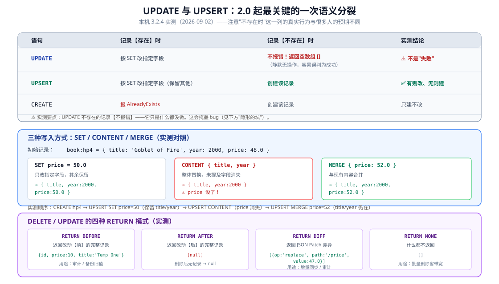
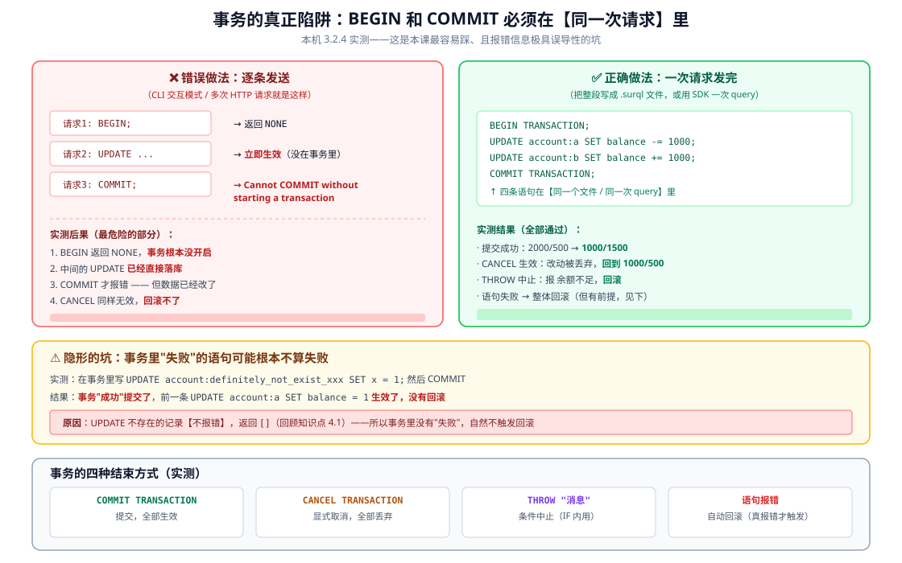

# 课 4 · CRUD 与查询子句

> **本课在故事主线中的情节定位**：主角的基本功——存取查改，但有几个和 SQL 不一样的地方会绊你一下。

[← 返回课程目录](../../../02-课程目录.md) ｜ [阶段概览](../overview.md)

---

## 本课目标

1. 熟练使用 CREATE / SELECT / UPDATE / UPSERT / DELETE，尤其**说清 UPDATE 与 UPSERT 的语义差异**
2. 掌握 WHERE / ORDER BY / LIMIT / START / SPLIT / GROUP BY / FETCH 各子句
3. 会用参数与事务，理解 3.0 起参数声明必须加 `LET` 这个变更

---

## 知识点清单

### 知识点 4.1：CRUD 五件套

**关键点**：

- CREATE / SELECT 基础语法与返回结构
- **UPDATE vs UPSERT**：2.0 起 UPDATE 只更新（⚠️ 实测：不存在时**不报错**，返回 `[]` 静默无操作）；UPSERT 才"有则更新、无则创建"
- DELETE 与 `RETURN BEFORE/AFTER/DIFF/NONE`
- 内容合并 vs 字段替换：`SET` 与 `CONTENT` / `MERGE` 的区别

**状态**：✅ 已完成

---

### 知识点 4.2：查询子句

**关键点**：

- WHERE：条件表达式与操作符
- ORDER BY / LIMIT / START：分页
- SPLIT：按字段拆分（注意 3.0 起 GROUP 与 SPLIT 不能同时使用）
- GROUP BY：分组聚合
- FETCH：展开记录链接（不是 JOIN，是"取过来"）
- ⚠️ 实测：SPLIT / GROUP BY 的字段**必须出现在 SELECT 列表**中

**状态**：✅ 已完成

---

### 知识点 4.3：参数、LET 与事务

**关键点**：

- `$` 变量与参数传递
- **3.0 起参数声明必须加 `LET`**（实测报错信息说是 deprecated，旧写法被废弃）
- `BEGIN` / `COMMIT` / `CANCEL` 手动事务 —— ⚠️ **必须在同一次请求内**，逐条发送则事务从未开启
- `THROW` 基于条件中止事务（`CANCEL` 是无条件）；事务里语句"不报错"就不会回滚
- 快照隔离（snapshot isolation）与写冲突重试

**状态**：✅ 已完成

---

## 正文

> **本课所有命令与输出均在本机 WSL Ubuntu 24.04 + SurrealDB 3.2.4 实测通过**（2026-09-02）。文中标注「实测」的结论来自真实执行。
>
> ⚠️ **本课发现一个骨架描述与实测不符的重要问题**：手工事务（BEGIN/COMMIT）**不能逐条发送**，必须放在同一次请求里。详见知识点 4.3——这是本课最容易踩、且报错信息极具误导性的坑。

### 第一幕 · 场景引入：看起来最不该出问题的一课

课 3 结束时，你已经会设计记录 ID、会用 `DEFINE FIELD` 上约束、知道 `REFERENCE` 不是外键。数据建模这块算是过了。

接下来是 CRUD——增删改查。**这是看起来最不该出问题的一课**。毕竟 `CREATE` / `SELECT` / `UPDATE` / `DELETE` 你闭着眼都能写，SQL 用了这么多年。

于是你照着肌肉记忆写了：

```sql
UPDATE book:hp5 SET price = 55.0;
```

执行，没报错。你以为改好了。然后：

```sql
SELECT * FROM book WHERE id = book:hp5;
-- []
```

**空的。** 你刚才那条 `UPDATE` 什么都没做——因为 `book:hp5` 根本不存在。

这就是本课的第一个绊脚石：**SurrealDB 的 `UPDATE` 在你更新一条不存在的记录时，不报错，什么都不做。** 你的 SQL 肌肉记忆告诉你"改了"，数据库告诉你"没这回事"，而且**没有任何提示**。

同样的"看起来会报错其实不会"，本课还有一处，而且更危险——它在事务里，会让你以为数据被保护着，实际上早就被改掉了。

### 第二幕 · 认知冲突：UPSERT 到底"更新"了什么？

先看一个让人困惑的现象。

你有这条记录：

```sql
CREATE book:hp4 SET title = 'Goblet of Fire', year = 2000, price = 48.0;
```

现在执行：

```sql
UPSERT book:hp4 SET price = 50.0;
```

**猜猜 `title` 和 `year` 还在吗？**

如果你用过 MongoDB 的 `replaceOne`，你会说"没了"——`UPSERT` 嘛，整体替换。如果你用过 SQL 的 `ON DUPLICATE KEY UPDATE`，你会说"还在"——只改指定字段。

**实测答案：还在。**

```
{ id: book:hp4, price: 50.0, title: 'Goblet of Fire', year: 2000 }
```

`SET` 是**合并**，不是替换。那要整体替换怎么办？用 `CONTENT`：

```sql
UPSERT book:hp4 CONTENT { title: 'Goblet of Fire', year: 2000 };
-- → { id: book:hp4, title: 'Goblet of Fire', year: 2000 }   ⚠️ price 消失了
```

**同样是 UPSERT，`SET` 保留字段，`CONTENT` 清空未提及的字段。** 这两个的差别足以在生产环境造成数据丢失，但它们长得几乎一样。

**冲突的真相**：SurrealDB 把"写"拆成了**三个正交的维度**——

| 维度 | 选项 | 作用 |
|------|------|------|
| **动作** | `CREATE` / `UPDATE` / `UPSERT` | 记录不存在/存在时怎么办 |
| **方式** | `SET` / `CONTENT` / `MERGE` | 新数据怎么覆盖旧数据 |
| **返回** | `BEFORE` / `AFTER` / `DIFF` / `NONE` | 返回什么给你 |

多数数据库把这几件事揉进一两个关键字里；SurrealDB 把它们拆开自由组合。**自由度更高，但也意味着你必须明确知道自己选了哪一个。**

---

### 第三幕 · 层层揭示

---

#### 知识点 4.1：CRUD 五件套

**一句话定义**：CREATE 只建、UPDATE 只改（不存在则静默无操作）、UPSERT 有则改无则建、DELETE 删除；写入方式有 `SET`/`CONTENT`/`MERGE` 三种，返回模式有 `BEFORE`/`AFTER`/`DIFF`/`NONE` 四种。

**直觉建立**

把五件套想成**两个维度交叉出来的格子**：

- **"记录不存在时"这一列**决定了 CREATE / UPDATE / UPSERT 的分工
- **"怎么写入"这一层**决定了 SET / CONTENT / MERGE 的选择

**核心原理**



**CREATE / UPDATE / UPSERT 的实测对照**

| 语句 | 记录【存在】 | 记录【不存在】 |
|------|-------------|---------------|
| `CREATE` | 报 `AlreadyExists` | 创建 |
| `UPDATE` | 按 SET 改指定字段 | ⚠️ **不报错，返回 `[]`** |
| `UPSERT` | 按 SET 改（保留其他字段） | 创建 |

**⚠️ 最需要注意的一条**：

```sql
UPDATE book:not_exist SET price = 99.0;
-- 实测返回：[]
-- 后续 SELECT * FROM book 确认：确实什么都没发生
```

**它不报错，只是静默地什么都没做。** 很多文档（包括本课骨架）写成"不存在则失败"——严格说不准确，**失败会让人以为有错误抛出，实际上没有**。

这意味着：如果你在应用代码里 `UPDATE` 之后不检查返回数组是否为空，你就**无法区分"改成功了"和"根本没这条记录"**。批量导入场景下尤其危险。

**怎么判断到底改没改？** 看返回数组长度：

```sql
UPDATE book:hp1 SET price = 36.0;   -- 返回 1 条 → 改到了
UPDATE book:ghost SET price = 36.0; -- 返回 0 条 → 没这条记录
```

**三种写入方式（实测对照）**

初始：`book:hp4 = { title: 'Goblet of Fire', year: 2000, price: 48.0 }`

| 方式 | 语句 | 实测结果 |
|------|------|---------|
| `SET` | `UPSERT book:hp4 SET price = 50.0` | `{ title, year:2000, price:50.0 }` — 其余保留 |
| `CONTENT` | `UPSERT book:hp4 CONTENT { title, year }` | `{ title, year:2000 }` — ⚠️ **price 消失** |
| `MERGE` | `UPSERT book:hp4 MERGE { price: 52.0 }` | `{ title, year:2000, price:52.0 }` — 合并 |

**`CONTENT` 是"整体替换"**，没提到的字段会被删掉——这是数据丢失的经典来源。**改单个字段时，用 `SET` 或 `MERGE` 更安全。**

**四种 RETURN 模式（DELETE / UPDATE 都可用）**

```sql
DELETE book:tmp1 RETURN BEFORE;  -- → { id, price: 10, title: 'Temp One' }   改动前
DELETE book:tmp2 RETURN AFTER;   -- → [null]                                 删除后无记录
DELETE book:tmp3 RETURN DIFF;    -- → [{ op: 'replace', path: '', value: null }]
DELETE book:tmp4 RETURN NONE;    -- → []
```

`RETURN DIFF` 在 UPDATE 上特别有用，实测：

```sql
UPDATE book:hp3 SET price = 47.0 RETURN DIFF;
-- → [[{ op: 'replace', path: '/price', value: 47.0 }]]
```

**它返回的是 JSON Patch 格式的差异**——只有变化的字段、变化前的值、变化后的值。做审计日志或增量同步时，这比"整条记录前后对比"高效得多。

**常见误区**

| ❌ 误区 | ✅ 真相 |
|--------|--------|
| "UPDATE 不存在的记录会报错" | **不报错**，返回 `[]`；必须检查返回数组长度 |
| "UPSERT 会整体替换记录" | 用 `SET` 时是**合并**；要整体替换得用 `CONTENT` |
| "SET 和 MERGE 一样" | 多数场景效果相同，`MERGE` 接受对象字面量更直观 |
| "DELETE 只能返回被删的记录" | 四种 RETURN 可选，`DIFF` 给 JSON Patch |

**一句话记住**：**UPDATE 不存在时静默无操作（返回 `[]` 不是报错）；改字段用 SET/MERGE，整体替换才用 CONTENT；要审计用 RETURN DIFF。**

---

#### 知识点 4.2：查询子句

**一句话定义**：WHERE 过滤、ORDER BY + LIMIT + START 分页、GROUP BY 聚合、SPLIT 拆分、FETCH 展开记录链接；3.0 起 GROUP 与 SPLIT 不能同时使用。

**直觉建立**

这些子句和 SQL 长得几乎一样，**用起来也几乎一样**。但有两处细节会让 SQL 老手翻车：

1. `SPLIT` / `GROUP BY` 的字段**必须出现在 SELECT 列表里**
2. `FETCH` 不是 JOIN——它是"把 ID 换成对象"的展开动作

**核心原理**

**WHERE：条件过滤**

```sql
SELECT * FROM book WHERE price > 42.0;
SELECT * FROM book WHERE year >= 1998 AND stock < 20;
SELECT * FROM book WHERE title CONTAINS 'Stone' OR title CONTAINS 'Dune';
```

实测都正常。`CONTAINS` 是子串匹配（课 3 没讲，这里顺带认识一下）。

**ORDER BY + LIMIT + START：分页**

```sql
SELECT * FROM book ORDER BY price DESC LIMIT 3;      -- 最贵 3 本
SELECT * FROM book ORDER BY year ASC LIMIT 2;        -- 最早 2 本
SELECT * FROM book ORDER BY year ASC START 2 LIMIT 2; -- 跳过 2 本，取接下来 2 本
```

实测：`LIMIT 2` 返回 1965、1997；`START 2 LIMIT 2` 返回 1998、1999。**`START` 就是 OFFSET。**

**GROUP BY：分组聚合**

```sql
SELECT year, count() AS total, math::sum(price) AS sum_price FROM book GROUP BY year;
```

实测输出：

```
{ sum_price: 55.0, total: 1, year: 1965 }
{ sum_price: 39.9, total: 1, year: 1997 }
...
```

**⚠️ 实测坑：聚合函数不能直接套字段**

```sql
SELECT math::mean(price) AS avg_price FROM book;
-- Incorrect arguments for function math::mean(). Argument 1 was the wrong type.
-- Expected `array<number>` but found `55f`
```

`math::mean` 需要的是**数组**，不是字段名。正确做法是先收集成数组：

```sql
LET $prices = (SELECT price FROM book).price;
RETURN math::mean($prices);   -- 实测 → 46.08
RETURN math::sum($prices);    -- 实测 → 230.4
```

而在 `GROUP BY` 分组内，`math::sum(price)` 是能用的（因为分组后每组天然是个集合）。**所以：分组内用聚合函数直接套字段，全局聚合要先收集成数组。**

**SPLIT：按字段拆分**

```sql
SELECT year, title, price FROM book SPLIT year;
```

实测按 `year` 把结果分成了多个数组。

**⚠️ 实测坑：被拆分的字段必须在 SELECT 列表里**

```sql
SELECT title, price FROM book SPLIT year;
-- Parse error: Missing split idiom `year` in statement selection
```

错误信息已经说得很清楚了。修正方式是**把 `year` 加进 SELECT 列表**（如上例）。

**⚠️ 3.0 起 GROUP 与 SPLIT 不能同时使用**（骨架说法正确，已验证）

```sql
SELECT year, count() AS total FROM book GROUP BY year SPLIT year;
-- Parse error: Unexpected token `SPLIT`, expected Eof
```

注意：这条我先满足了"字段在 SELECT 列表里"的前提，**仍然报错**，所以是真正的互斥，不是我写错了。

**FETCH：展开记录链接**

```sql
SELECT * FROM book WHERE author = author:rowling;              -- author: author:rowling（只是 ID）
SELECT * FROM book WHERE author = author:rowling FETCH author;  -- 展开成完整对象
```

实测第二条：

```json
{
  "author": { "country": "UK", "id": "author:rowling", "name": "J.K. Rowling" },
  "id": "book:hp1", "price": 39.9, "stock": 12,
  "title": "Philosopher's Stone", "year": 1997
}
```

**`FETCH` 把记录 ID 替换成了完整对象**——这是文档数据库"不用写 JOIN"的关键手段（课 5 讲 `RELATE` 时你会看到它的另一种用法）。

**常见误区**

| ❌ 误区 | ✅ 真相 |
|--------|--------|
| "`SELECT *` 配合 SPLIT 就行" | 被拆分字段**必须在 SELECT 列表**中 |
| "`math::mean(price)` 能算均价" | 需先收集成数组；`GROUP BY` 内才可直接套字段 |
| "GROUP 和 SPLIT 可以叠加" | 3.0 起**互斥**，实测报 `Unexpected token SPLIT` |
| "FETCH 是 JOIN" | 它是"取过来展开"，不产生笛卡尔积，也不支持 ON 条件 |

**一句话记住**：**分页用 START + LIMIT；SPLIT/GROUP 的字段要写进 SELECT；全局聚合先 LET 收集成数组；FETCH 展开链接不是 JOIN。**

---

#### 知识点 4.3：参数、LET 与事务

**一句话定义**：3.0 起参数声明**必须**加 `LET`（`$x = v` 已废弃）；事务用 `BEGIN`/`COMMIT`/`CANCEL`/`THROW`，**但所有语句必须在同一次请求内**，否则事务根本不会开启。

**直觉建立：这是本课最危险的一个坑**

先看现象。你打开 CLI，照着文档敲：

```sql
BEGIN;
UPDATE account:a SET balance = 900;
UPDATE account:b SET balance = 600;
COMMIT;
```

然后 `COMMIT` 报错：

```
Invalid statement: Cannot COMMIT without starting a transaction
```

"没有开启事务"？**我明明 BEGIN 了啊。**

**⚠️ 这是本课最重要的发现，而且骨架的描述在这里是不准确的。**



**根因**：SurrealDB 3.x 把**每一次 `query()` 调用视为一个独立请求**。CLI 交互模式和逐条 HTTP 请求都是"一条语句 = 一次请求"——所以你的 `BEGIN` 在那个请求结束时就已经结束了，后面的 `UPDATE` 根本不在事务里。

**实测证据链**：

| 做法 | 结果 |
|------|------|
| CLI 逐行输入 `BEGIN;` → `UPDATE` → `COMMIT;` | `BEGIN` 返回 `NONE`；UPDATE **立即生效**；`COMMIT` 报 "Cannot COMMIT without starting a transaction" |
| 同样地 `CANCEL` | 报 "Cannot CANCEL without starting a transaction"，**回滚失败，数据已被改** |
| **整段写成 `.surql` 文件，一次请求提交** | ✅ `COMMIT` 成功，2000/500 → **1000/1500** |
| 同样地文件内 `CANCEL` | ✅ 改动被丢弃，回到 **1000/500** |
| 同样地文件内 `THROW` | ✅ 报 "余额不足 1000，中止转账"，**回滚** |

**结论：`BEGIN` 和 `COMMIT` 必须在同一次请求里。**用 CLI 时，把整段写进文件一次性提交；用 SDK 时，把整段作为一次 `query()` 调用（各语言 SDK 的 `Transaction` 类就是干这个的）。

**⚠️ 第二层坑：事务里"失败"的语句可能不算失败**

这是本课最隐蔽的一处，而且**它和知识点 4.1 直接串起来了**。

```sql
BEGIN TRANSACTION;
UPDATE account:a SET balance = 1;
UPDATE account:definitely_not_exist_xxx SET x = 1;   -- 我指望这条"失败"触发回滚
COMMIT TRANSACTION;
```

实测结果：**事务"成功"提交了**，`account:a` 的余额**变成了 1，没有回滚**。

**为什么？** 回顾知识点 4.1：**`UPDATE` 不存在的记录不报错，返回 `[]`**。所以事务里根本没有"失败的语句"，自然不触发回滚。

**两条知识在这里交汇**：4.1 那个"静默无操作"的特性，在事务里变成了"静默不回滚"。

**想让事务在异常时回滚，你得用 `THROW`**：

```sql
BEGIN TRANSACTION;
LET $bal = (SELECT balance FROM ONLY account:a).balance;
IF $bal < 1000 { THROW "余额不足 1000，中止转账"; };
UPDATE account:a SET balance -= 1000;
UPDATE account:b SET balance += 1000;
COMMIT TRANSACTION;
```

实测两种情形：

- Alice 余额 800（低于阈值）→ 报 `余额不足 1000，中止转账`，**回滚**，仍是 800/500
- Alice 余额 2000（高于阈值）→ **正常提交**，变成 1000/1500

**`THROW` 是唯一能基于条件中止事务的方式**（`CANCEL` 是无条件的）。

**参数声明：3.0 起必须加 LET**

```sql
$threshold = 40;
-- Parse error: Parameter declarations without `let` are deprecated.
--              Replace with `let $threshold = ...` to keep the previous behavior.
```

**报错信息本身就说清了**：这是 **deprecated（已废弃）**，不是新增语法。正确写法：

```sql
LET $threshold = 40;
RETURN $threshold;                                -- → 40
SELECT * FROM account WHERE balance > $threshold; -- 可用
LET $rich = (SELECT * FROM account WHERE balance > 600);  -- LET 也能存查询结果
```

**还有一种是全局参数**（不需要在会话里 LET，定义在数据库里）：

```sql
DEFINE PARAM $min_balance VALUE 100;
SELECT * FROM account WHERE balance > $min_balance;
```

实测可用。适合放那些不常变、多个查询共用的配置。

**快照隔离（snapshot isolation）**

官方文档说明：SurrealDB 的事务运行在**快照隔离**下——事务开始时看到一致的时点快照，提交时检查**写-写冲突**，若两个并发事务改了同一个 key，后提交者会失败并需要重试。

**它不提供可串行化（serializable）隔离**，也就无法防止**写偏斜（write skew）**。如果你的业务依赖跨记录的不变式（比如"至少有一人在岗"），需要在事务内显式读取并更新那些记录，让冲突能被检测到。

> 本课实例是单连接顺序执行，未实测并发冲突——这部分属于认知层，课 8（并发与权限）会展开。

**常见误区**

| ❌ 误区 | ✅ 真相 |
|--------|--------|
| "CLI 里 BEGIN 然后 COMMIT 就能开事务" | **不行**，必须同一次请求；否则事务从未开启、改动已落库 |
| "事务里 UPDATE 不存在的记录会触发回滚" | **不会**——它不报错，返回 `[]`，事务照常提交 |
| "CANCEL 总能回滚" | 只有在**真正开启的事务**里才有效；否则报 "Cannot CANCEL" |
| "`$x = 1` 能声明参数" | 3.0 起必须 `LET $x = 1`（报错信息说是 deprecated） |
| "快照隔离能防所有并发问题" | 防脏读/不可重复读/丢失更新，**不防写偏斜** |

**一句话记住**：**事务语句必须打包进同一次请求；事务里想主动中止用 `THROW`（`CANCEL` 无条件）；参数声明必须带 `LET`。**

---

### 第四幕 · 实操验证

本课脚本已落盘在 `playground/`。

```bash
# 前提：课 2 的实例在跑
surreal is-ready --endpoint http://127.0.0.1:8000   # → OK

# 知识点 4.1 / 4.2：用 /sql 端点提交
curl -s -X POST -H "Accept: application/json" -u "root:root" \
  -H "surreal-ns: learn" -H "surreal-db: kp41" \
  --data-binary @playground/l04-verify-41.surql http://127.0.0.1:8000/sql

# 知识点 4.3：事务必须整文件一次提交（关键！）
curl -s -X POST -H "Accept: application/json" -u "root:root" \
  -H "surreal-ns: learn" -H "surreal-db: kp43" \
  --data-binary @playground/l04-tx-throw.surql http://127.0.0.1:8000/sql
```

> 💡 **为什么又是文件 + `--data-binary @`**：课 3 已经踩过——多行 SurrealQL 走 shell 管道会丢换行。**本课还多了个理由**：事务要求 `BEGIN...COMMIT` 在同一次请求里，用文件提交天然满足。

**练习 1：亲手确认 UPDATE 的静默行为（10 分钟，必做）**

```sql
UPDATE book:this_does_not_exist SET price = 1;
SELECT * FROM book WHERE id = book:this_does_not_exist;
```

- 第一条返回什么？第二条返回什么？
- 如果你在写批量导入脚本，**怎么检测"这条没改到"**？
- 验收标准：能说出"检查返回数组长度"这个答案

**练习 2：SET 与 CONTENT 的破坏力对比（10 分钟）**

```sql
CREATE test:t SET a = 1, b = 2, c = 3;
UPDATE test:t SET a = 10;                 -- 猜：b、c 还在吗？
UPDATE test:t CONTENT { b: 20 };          -- 猜：a、c 呢？
UPDATE test:t MERGE { c: 30 };            -- 猜：现在还剩什么？
SELECT * FROM test:t;                     -- 核对你的预测
```

**先预测，再执行。** 三次预测全对说明你理解了；错一次就把上面那张图重看一遍。

> ⚠️ 注意对象字面量用**冒号** `:`（不是 `=`）——这正是我在备课实测时踩到的 Parse error 之一。
>
> 💡 **参考答案**：`SET` 后 → `{a:10, b:2, c:3}`（只改 a）；`CONTENT` 后 → `{b:20}`（**a、c 被删除**）；`MERGE` 后 → `{b:20, c:30}`（合并，a 回不来）。

**练习 3：让事务真正生效（15 分钟，重点）**

写一个转账事务文件 `my-tx.surql`：

```sql
BEGIN TRANSACTION;
LET $from = (SELECT balance FROM ONLY account:a).balance;
IF $from < 100 { THROW "余额不足"; };
UPDATE account:a SET balance -= 100;
UPDATE account:b SET balance += 100;
COMMIT TRANSACTION;
```

然后**分别**用两种方式跑，对比结果：

1. **在 CLI 里逐行粘贴** → 观察 `COMMIT` 报什么错，数据有没有被改
2. **用 curl 整文件提交** → 观察是否成功

**这个对比是本课最重要的一次亲手验证**——不亲眼看一遍，你很难相信"BEGIN 了却没开事务"。

**练习 4：给课 2 的 shop 库做一次分页查询（10 分钟）**

课 2 建的 `learn`/`shop` 库里还有两条 product 数据（`sku_8848` 和一条 SDK 建的）。

```sql
SELECT * FROM product ORDER BY price DESC LIMIT 1;
SELECT * FROM product ORDER BY price DESC START 1 LIMIT 1;
```

想想：如果商品有 100 万条，`START 500000 LIMIT 10` 会有什么性能问题？（提示：它要跳过 50 万条）

**练习 5（思考题）：什么时候该用事务，什么时候不该？**

| 场景 | 用事务吗 | 理由 |
|------|---------|------|
| 转账（扣 A 加 B） | ✅ 必须 | 两条必须同时成功 |
| 批量导入 1 万条商品 | ❌ 不需要 | 每条独立；用事务反而长锁 |
| 创建订单 + 扣库存 | ✅ 通常要 | 跨记录不变式 |
| 更新用户最后登录时间 | ❌ 不需要 | 单条语句本身就原子 |

**记住一条**：**每条 SurrealQL 语句本身就运行在自己的事务里**（官方文档明确）。只有多条语句必须"同生共死"时，才需要手工事务。

---

### 第五幕 · 体系收束

**本课三句话**

1. **UPDATE 不存在时静默无操作**——返回 `[]` 不是报错，必须检查返回数组长度；改字段用 `SET`/`MERGE`，整体替换才用 `CONTENT`（`CONTENT` 会删掉未提及字段）。
2. **查询子句基本同 SQL**，但 SPLIT/GROUP 的字段必须写进 SELECT 列表，两者 3.0 起互斥；全局聚合要先 `LET` 收集成数组。
3. **事务必须打包进同一次请求**——CLI 逐行敲的 `BEGIN` 根本不会开启事务，改动已直接落库；想条件中止用 `THROW`。

**认知阶梯回顾**

| 层 | 本课覆盖 |
|----|---------|
| 感知 | 看起来最不该出问题的一课（第一幕） |
| 概念 | 五件套语义、子句用法、LET 与事务（第三幕） |
| 机制 | SET/CONTENT/MERGE 差异、请求边界决定事务、UPDATE 静默导致不回滚（3 个知识点） |
| 实操 | 5 个练习，含"逐行 vs 整文件"的决定性对比（第四幕） |
| 定位 | 单语句即事务 → 何时才需要手工事务（练习 5） |

**在全局中的位置**

- **前接课 3**：课 3 的 `DEFINE FIELD` 约束在这课发挥作用（`ASSERT` 失败会让事务语句真报错，从而触发回滚）
- **呼应课 3**：课 3 说 `REFERENCE` 不校验存在性；本课 4.1 说 `UPDATE` 不存在不报错——**两者叠加意味着"悬空引用 + 更新不存在记录"是一条静默失败链**
- **后接课 5**：本课的 `FETCH` 是展开记录链接；课 5 的 `RELATE` 建的是**带属性的边**，届时你会理解两者的分工
- **贯穿**：阶段 3 的索引与全文搜索会大量用到 WHERE / ORDER BY；阶段 4 的并发会回到本课留下的快照隔离话题

**⚠️ 本课对骨架/常见说法的三处更正**

| 骨架或常见说法 | 本课实测结论 |
|--------------|-------------|
| "UPDATE 不存在则失败" | **不报错**，返回 `[]`，静默无操作 |
| "BEGIN / COMMIT / CANCEL 手动事务"（暗示可逐条发） | **必须在同一次请求内**；逐条发则事务从未开启 |
| "参数声明必须加 LET（3.0 新增变更）" | 实测报错信息说是 **deprecated**，属"旧写法被废弃"而非"新语法" |

**实测陷阱清单**

| 陷阱 | 现象 | 正解 |
|------|------|------|
| CLI 逐行 BEGIN/COMMIT | `Cannot COMMIT without starting a transaction` | 整段放进**一次请求**（文件或 SDK 单次 query） |
| 事务里 `UPDATE` 不存在记录 | 不报错 → **不回滚** | 用 `THROW` 显式中止 |
| `$x = 1` 声明参数 | `Parameter declarations without let are deprecated` | 用 **`LET $x = 1`** |
| `SELECT math::mean(price)` | `Expected array<number> but found 55f` | 先 `LET` 收集成数组 |
| `SELECT title FROM t SPLIT year` | `Missing split idiom year` | 把 **`year` 加进 SELECT 列表** |
| `GROUP BY` + `SPLIT` | `Unexpected token SPLIT, expected Eof` | 3.0 起**互斥**，二选一 |
| 字符串含单引号 | `'Philosopher''s Stone'` 报 Parse error | 用双引号包：**`"Philosopher's Stone"`** |
| `UPSERT` 用 `CONTENT` | 未提及字段**被删除** | 改单字段用 `SET` / `MERGE` |

---

## 本课小结

| 知识点 | 一句话 | 状态 |
|--------|--------|------|
| 4.1 CRUD 五件套 | UPDATE 不存在时静默无操作；改字段用 SET/MERGE，整体替换用 CONTENT | ✅ |
| 4.2 查询子句 | 基本同 SQL；SPLIT/GROUP 字段须在 SELECT；GROUP 与 SPLIT 互斥 | ✅ |
| 4.3 参数 LET 与事务 | 参数须 LET；**事务必须同一次请求**，条件中止用 THROW | ✅ |

---

## 🚀 下一批接力提示词

复制以下内容继续学习：

```
我的 SurrealDB 学习档案在 surrealdb/00-学习档案.md，
刚学完阶段 2《核心数据模型与 SurrealQL》课 4《CRUD 与查询子句》
（知识点 4.1 CRUD 五件套、4.2 查询子句、4.3 参数 LET 与事务）。
请按大纲继续讲解课 5《图：RELATE 与遍历》的知识点
5.1 RELATE 建边、5.2 图遍历、5.3 递归与深度控制，
这是阶段 2 的最后一课。
```

---

## 🧭 课程导航

- 上一课：[课 3 · 记录 ID 与数据建模](./lesson-03-记录ID与数据建模.md)
- 下一课：课 5 · 图：RELATE 与遍历（阶段 2 最后一课，待学习）
- 阶段概览：[阶段 2 · 核心数据模型与 SurrealQL](../overview.md)
- [← 返回课程目录](../../../02-课程目录.md)

---

## 交付状态

| 项 | 值 |
|---|---|
| 状态 | ✅ 已完成 |
| 评审 | ✅ 已完成（双视角评审，P0=0） |
| 完成日期 | 2026-09-02 |
