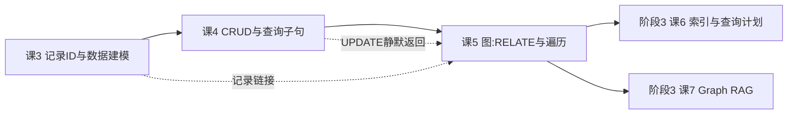

# 课 5 · 图：RELATE 与遍历

> **本课在故事主线中的情节定位**：主角最漂亮的一次变形——数据之间长出"边"，从此关系可以一路走下去。

[← 返回课程目录](../../../02-课程目录.md) ｜ [阶段概览](../overview.md)

---

## 本课目标

1. 理解「边即记录」这个设计，以及它带来的能力（边上能存数据）
2. 熟练使用 `->` 与 `<-` 遍历语法，能写多跳查询
3. 会用递归遍历做树形结构与深度控制，并知道它的性能边界

> ⚠️ **阅读提示**：本课有三处结论与骨架描述或坊间说法不一致，全部已在 SurrealDB **3.2.4** 上实测坐实，并在文中用「⚠️ 实测更正」标注。请以此为准。

---

## 知识点清单

### 知识点 5.1：RELATE：边即记录

**关键点**：

- `RELATE a->edge->b`：创建一条有向边
- **边是普通记录**：有自己的 ID、可以带属性（时间、权重）
- `UNIQUE` 约束：防止重复边
- 双向边与自环的处理
- ⚠️ **实测更正**：边的 `in` / `out` 语义与直觉相反（`in` = 起点、`out` = 终点）

**状态**：✅ 已完成

---

### 知识点 5.2：遍历语法：`->` 与 `<-`

**关键点**：

- 出边 `->`、入边 `<-`、双向 `<->`
- 指定边表与目标表：`->knows->person`
- 嵌套取值与投影：`->knows->person.{name, age}`（2.0 起的批量语法）
- 通配符用 `?`（`->?->?`），**裸 `->` 不能作投影项**
- FETCH 只展开记录链接，不展开图边

**状态**：✅ 已完成

---

### 知识点 5.3：递归遍历与深度控制

**关键点**：

- 固定深度用 `.{N}()`（**精确第 N 跳**，不是"最多 N 跳"）
- 树形递归用 `.{1..N}.{ 字段, then: 路径.@ }`
- ⚠️ **实测更正**：旧式 `@{depth}` 语法在 3.2.4 已报 Parse error，不可用
- 循环图不会无限展开，但**不自动去重**
- **性能边界**：成本随扇出与深度增长，不是"图数据库就一定快"

**状态**：✅ 已完成

---

## 正文

### 第一幕 · 场景引入：看起来最不该出问题的一课

前三课我们已经把主角（一条数据）折腾得够呛：给它发了身份证（记录 ID）、教它守规矩（SCHEMAFULL）、让它能增删改查（CRUD）。到课 4 结束时，你手里的 `book` 表大概长这样：

```sql
SELECT * FROM book;
```

```json
[
  { "id": "book:time_machine", "title": "The Time Machine", "author": "author:hgwells", "year": 1895 },
  { "id": "book:foundation",   "title": "Foundation",       "author": "author:asimov",  "year": 1951 }
]
```

注意 `author` 那一列——它不是一个字符串，而是 `author:hgwells`，**一个记录 ID**。这就是课 3 讲的「记录链接（record link）」。

现在问题来了。产品经理走过来说：

> "我要做一个'你可能认识的人'功能。找到 Alice 认识的人，再找这些人认识的人，一路找三层，按共同好友数排序。"

你盯着 `author` 这个字段想：**记录链接能表达"认识"吗？**

能，但不够。因为：

1. **记录链接是单向字段**——`book.author` 指向作者，但作者那条记录上没有任何东西指回来（除非你手工维护一个 `books` 数组，那就是双写，课 1 讲过的债务）。
2. **记录链接带不了"这段关系本身的数据"**——Alice 什么时候认识 Bob 的？关系强度多少？这些是**关系的属性**，不是 Alice 的属性，也不是 Bob 的属性。塞进任何一方都别扭。
3. **反向查询要靠过滤**——`SELECT * FROM person WHERE 某字段 = person:bob`，本质上反过来了。

于是 SurrealDB 给出第三个答案：**别把关系塞进字段，让关系自己成为一条记录。**

这就是 `RELATE`。听起来很简单，对吧？——**这恰恰是本课的危险之处**。我在备课时连着踩了四个坑，其中两个差点被我当成"产品 bug"写进讲义。

---

### 第二幕 · 认知冲突：一条边，怎么就"改不动"了

先按直觉操作。建三个节点、建两条边：

```sql
CREATE person:alice SET name = "Alice", age = 34;
CREATE person:bob   SET name = "Bob",   age = 29;
CREATE person:carol SET name = "Carol", age = 41;

RELATE person:alice->knows->person:bob;
RELATE person:alice->knows->person:carol SET since = d'2020-03-15', strength = 0.8;
```

现在我想把 Alice→Carol 这条边的强度从 `0.8` 改成 `0.95`。想当然地写：

```sql
UPDATE knows SET strength = 0.95 WHERE out = person:alice AND in = person:carol;
```

**返回 `[]`。**

不是报错，是**空数组**。我以为写错了，检查了两遍——语法没问题，大小写没问题，记录 ID 也没问题。

去查一下边到底长什么样：

```sql
SELECT * FROM knows WHERE in = person:alice;
```

```json
[
  { "id": "knows:9ep1j3ac3cfwnwcur7wh", "in": "person:alice", "out": "person:carol", "strength": 0.8, "since": "2020-03-15T00:00:00Z" },
  { "id": "knows:bxrrp8a7ylc8759msfua", "in": "person:alice", "out": "person:bob", "strength": null }
]
```

真相大白：**`in` 是起点（alice），`out` 是终点（carol）——跟我的直觉完全相反。**

我的直觉是：箭头从 Alice 出发（out），指向 Carol，Carol 那边是"进来的"（in）。而 SurrealDB 的命名视角是：**箭头"射入"边记录的一端记 `in`，从边记录"射出"的一端记 `out`。** 也就是说，它站在**边**的立场上命名，而不是站在**起点节点**的立场上。

按真实语义改写：

```sql
UPDATE knows SET strength = 0.95 WHERE in = person:alice AND out = person:carol;
```

```json
[{ "id": "knows:9ep1j3ac3cfwnwcur7wh", "in": "person:alice", "out": "person:carol", "strength": 0.95 }]
```

命中 1 条，改成了。

**这一幕的教训有两条，第二条更重要：**

1. `in` / `out` 是反直觉的，写过滤条件时务必确认方向。
2. **改不动时它返回 `[]` 而不是报错**——这正是课 4 结论 7（UPDATE 不存在静默无操作）的又一次现身。如果你不看返回值，会以为改成功了，然后在下游看到一个"莫名其妙没生效"的 bug。

> 📌 **与课 4 的交汇（静默失败链，第三次出现）**
> 课 3：REFERENCE 不校验目标存在性 → 课 4：UPDATE 不存在返回 `[]` → **本课：边的方向写反，同样返回 `[]`**。
> 三者叠加的共同点是：**SurrealDB 倾向于"不报错地什么都不做"**。所以本课之后请养成一个习惯：**任何 UPDATE / RELATE 之后，检查返回数组的长度。**

---

### 第三幕 · 层层揭示：三个知识点

---

## 知识点 5.1：RELATE——边即记录

### 一句话定义

`RELATE a->edge->b` 创建一条**有向边**，而这条边本身是**一条有 ID、能带字段、能被 UPDATE 的普通记录**。

### 直觉建立：边上能挂东西，这是它和记录链接的分水岭

回到第一幕的问题：Alice 什么时候认识 Bob 的？

- 用记录链接：你得在 `person:alice` 上加一个 `friends` 数组，数组里放 `{ id: person:bob, since: ... }`。**关系数据被塞进了节点里。**
- 用 RELATE：`RELATE person:alice->knows->person:bob SET since = d'2018-01-01', strength = 0.9;`——**`since` 和 `strength` 住在边上，谁也不侵占。**

这个差别在"关系变复杂"时会放大。想象一个电商场景：用户买了商品，你要记录数量、单价、下单时间、优惠券。这些属性放在 `user` 上不对（一个用户买很多单），放在 `product` 上更不对。它们是**这次购买行为**的属性——也就是边的属性。

### 核心原理

`RELATE` 一次可以做三件事：

```sql
-- ① 最简：不指定边 ID，ID 随机生成
RELATE person:alice->knows->person:bob;

-- ② 带属性
RELATE person:alice->knows->person:carol SET since = d'2020-03-15', strength = 0.8;

-- ③ 显式指定边 ID（推荐：便于后续精确 UPDATE 这条边）
RELATE person:bob->knows:b2c->person:carol SET since = d'2019-07-01', strength = 0.5;
```

实测输出（② 和 ③）：

```json
[{ "id": "knows:se80dwsuc2822l7990f5", "in": "person:alice", "out": "person:carol", "since": "2020-03-15T00:00:00Z", "strength": 0.8 }]
[{ "id": "knows:b2c", "in": "person:bob", "out": "person:carol", "since": "2019-07-01T00:00:00Z", "strength": 0.5 }]
```

看到 `in` / `out` 了吗？这两个字段是**边表自带的**，你不需要定义，也不应该重复定义：

```sql
DEFINE TABLE likes SCHEMAFULL TYPE RELATION IN person OUT post ENFORCED;
DEFINE FIELD in ON likes TYPE record<person>;   -- ❌ 报错
```

```text
"The field 'in' already exists"
```

**为什么指定边 ID 值得推荐？** 因为不指定时 SurrealDB 生成的是 `knows:9ep1j3ac3cfwnwcur7wh` 这种随机 ID——你得先查出来才能改它。而指定了 `knows:b2c`，你可以直接：

```sql
UPDATE knows:b2c SET strength = 0.6;
```

### 双向边与自环：都要当作"两条独立的边"

**自环（自己连自己）**——实测完全允许：

```sql
RELATE person:alice->knows->person:alice SET note = "self loop";
```

```json
[{ "id": "knows:cvh07omoyenf4clnano6", "in": "person:alice", "out": "person:alice", "note": "self loop" }]
```

**双向边**——SurrealDB **没有**"一条边表示双向"的机制。所谓双向就是建两条方向相反的有向边：

```sql
RELATE person:alice->knows->person:bob;
RELATE person:bob->knows->person:alice;   -- 另一条独立的边
```

这带来一个必须记住的推论：**如果你只建了 alice→bob，那么从 bob 出发用出边 `->knows->person` 是找不到 alice 的**，必须用入边 `<-knows<-person`。

> ⚠️ 这里有个常见的过度设计：为了让"查好友"方便，把所有关系都建两条反向边。**这会让写入成本翻倍，还带来一致性问题**（删了一条忘了删另一条）。正确做法是：建一条 + 查询时用双向语法 `<->`（见 5.2）。只有在"两个方向语义确实不同"时才建两条（比如"关注"与"被关注"）。

### 给边加约束：三道闸门全实测

```sql
DEFINE TABLE likes SCHEMAFULL TYPE RELATION IN person OUT post ENFORCED;
DEFINE FIELD created ON likes TYPE datetime DEFAULT time::now();
DEFINE INDEX likes_unique ON TABLE likes COLUMNS in, out UNIQUE;
```

三道闸门的实测表现：

| 闸门 | 触发场景 | 实测报错 |
|---|---|---|
| **端点类型 IN / OUT** | `RELATE person:alice->likes->person:bob`（终点应是 post） | `Couldn't coerce value for field 'out': Expected record<post> but found person:bob` |
| **端点类型（起点侧）** | `RELATE robot:r1->likes->post:p1` | `Couldn't coerce value for field 'in': Expected record<person> but found robot:r1` |
| **UNIQUE 防重复边** | 对同一对节点重复 RELATE | `Database index likes_unique already contains [person:alice, post:p1], with record likes:rjf1…` |

> 💡 **`UNIQUE` 索引是"防重复点赞"这类需求的正解。** 不要靠应用层先查再插——那有竞态。让数据库用唯一索引兜底，插入失败就是已存在。

### 常见误区

1. **把 `in` / `out` 写反**——本课最大的坑，见第二幕。
2. **以为 UPDATE 改不动会报错**——不会，返回 `[]`。
3. **手工 `DEFINE FIELD in / out`**——字段已自带，会报 `already exists`。
4. **为省事把所有关系建两条反向边**——翻倍写入 + 一致性风险，优先用 `<->` 查询。
5. **把关系属性塞进节点字段**——那是记录链接的思路，用 RELATE 就该放到边上。

### 一句话记住

> **边是一条记录：有 ID、能挂属性、能被改；`in` 是起点、`out` 是终点（反直觉）；改不动时它只返回 `[]`。**

---

## 知识点 5.2：遍历语法——`->` 与 `<-`

### 一句话定义

`->` / `<-` / `<->` 是写在 SELECT 投影里的**路径表达式**，沿边表从一个记录走到另一个记录。

### 直觉建立：把 `->` 读成"的"

```sql
SELECT id, ->knows->person AS knows FROM person:alice;
```

读成中文：「查出 alice 的 id，以及**沿着 knows 边走到的那些 person**」。

对比一下两种形状（这是理解遍历结果的关键）：

| 写法 | 走到哪里 | 返回什么 |
|---|---|---|
| `->knows` | 只走到**边表** | 边记录（`knows:xxx`） |
| `->knows->person` | 继续走到**目标节点** | 节点记录（`person:xxx`） |

实测：

```sql
SELECT id, ->knows AS knows_edges FROM person:alice;
-- [{ "id": "person:alice", "knows_edges": ["knows:3k7u96lqaw7redfuw4ri", "knows:4cc2zsdqfuro8q5u4a9p"] }]

SELECT id, ->knows->person AS knows FROM person:alice;
-- [{ "id": "person:alice", "knows": ["person:carol", "person:bob"] }]
```

**第一个返回边 ID，第二个返回节点 ID。** 想拿边上的属性（比如 `strength`），就要停在边表那一层，或两者都取。

### 核心原理

**三种方向：**

```sql
SELECT id, ->knows->person AS knows FROM person:alice;         -- 出边：alice 认识谁
SELECT id, <-knows<-person AS followers FROM person:carol;     -- 入边：谁认识 carol
SELECT id, <->knows<->person AS neighbours FROM person:alice;  -- 双向：所有相邻
```

实测（alice 的邻居，注意**包含她自己**，因为存在 dave→alice 的入边和自环）：

```json
[{ "id": "person:alice", "neighbours": ["person:dave", "person:alice", "person:alice", "person:carol", "person:alice", "person:bob"] }]
```

> ⚠️ **双向遍历不会剔除起点自己。** 如果结果里不该有自己，用 `array::complement(neighbours, [id])` 或者改用 `WHERE id != $this` 之类的方式过滤。这是双向遍历最常见的"结果多了一条"的来源。

**多跳：把路径接起来**

```sql
SELECT id, ->knows->person->knows->person AS fof FROM person:alice;
-- [{ "id": "person:alice", "fof": ["person:dave"] }]   ← 朋友的朋友
```

**通配符用 `?`，不是裸 `->`**

```sql
SELECT id, ->?->?        AS anything FROM person:alice;   -- ✅ 任意边、任意目标
SELECT id, ->?->person   AS reached  FROM person:alice;   -- ✅ 任意边、person 目标
SELECT id, ->knows->?    AS targets  FROM person:alice;   -- ✅ knows 边、任意目标
```

裸 `->` 作投影项**会解析失败**（我踩的第二个坑）：

```sql
SELECT id, -> AS all_out FROM person:alice;   -- ❌ Parse error: Unexpected token `an identifier`, expected FROM
person:alice->;                                -- ❌ Parse error: Unexpected token `;`, expected `?`, `(` or an identifier
```

注意错误提示里写了 `expected ?` ——**`?` 才是通配符**，箭头后面必须跟具体的表名或 `?`。

实测（`->?->?` 从 alice 出发，同时走 knows 和 likes 两种边）：

```json
[{ "id": "person:alice", "anything": ["person:carol", "person:bob", "person:carol"] }]
```

注意 `person:carol` 出现了**两次**——因为她既被 `knows` 走到、又被 `likes` 走到。**遍历不做跨边表的去重。**

**嵌套投影：`.字段名` 与 `.{a, b}`**

```sql
SELECT id, ->knows->person.name    AS names   FROM person:alice;  -- 只取 name
SELECT id, ->knows->person.{name, age} AS friends FROM person:alice;  -- 取多个字段
```

实测：

```json
[{ "id": "person:alice", "names": ["Carol", "Bob"] }]
[{ "id": "person:alice", "friends": [{ "age": 41, "name": "Carol" }, { "age": 29, "name": "Bob" }] }]
```

**边属性过滤：`->(边表 WHERE 条件)->目标表`**

```sql
SELECT id, ->(knows WHERE strength > 0.5)->person AS close_friends FROM person:alice;
-- [{ "id": "person:alice", "close_friends": ["person:bob"] }]   ← carol 的 0.4 被过滤掉
```

这个语法很实用：**把过滤条件下推到遍历过程中**，而不是先取出全部再筛。

**一次走多种边：**

```sql
SELECT id, ->(knows, likes)->person AS reached FROM person:alice;
-- [{ "id": "person:alice", "reached": ["person:carol", "person:bob", "person:carol"] }]
```

**从边表反查两端（记得 `in` = 起点）：**

```sql
SELECT in.name AS from_name, out.name AS to_name, strength FROM knows WHERE strength > 0.5;
-- [{ "from_name": "Alice", "to_name": "Bob", "strength": 0.9 },
--  { "from_name": "Bob",   "to_name": "Dave", "strength": 0.7 }]
```

**注意 `in.name` / `out.name` 会自动解析成对方的名字**——记录链接的自动解引用在这里也生效，不需要 FETCH。

### FETCH 与遍历：它们管的是不同的东西

这是课 4 留下的伏笔，现在回收。

| | 作用对象 | 写法 |
|---|---|---|
| **记录链接** | 字段值 = 记录 ID | `book.author = author:hgwells` |
| **FETCH** | 展开**记录链接** | `SELECT author FROM book FETCH author;` |
| **遍历 `->`** | 沿**图边表**行走 | `SELECT ->knows->person FROM person;` |

实测对照（同一份数据，两种方式）：

```sql
-- 记录链接：默认只给 ID
SELECT title, author FROM book;
-- [{ "title": "The Time Machine", "author": "author:hgwells" }]

-- 加 FETCH：展开成完整记录
SELECT title, author FROM book FETCH author;
-- [{ "title": "The Time Machine", "author": { "id": "author:hgwells", "name": "H.G. Wells" } }]

-- 图边：作者写了哪些书
SELECT id, ->wrote->book AS books FROM author:hgwells;
-- [{ "id": "author:hgwells", "books": ["book:time_machine"] }]
```

**关键结论：FETCH 只管记录链接，不管图边。** 你给一张图边表写 `FETCH knows` 展开的仍是边记录本身，不会因为它是"关系"就自动跳到对面节点。

**那什么时候用哪个？**

- **关系简单、不需要额外属性、主要顺着"父→子"方向查** → 记录链接 + FETCH，更轻。
- **关系本身有数据、需要反向/多跳/递归、关系会演化** → 图边 + 遍历。

### 常见误区

1. **裸 `->` 当投影项** → 用 `?`（我踩的坑，见上）。
2. **以为 `<->` 会剔除自己** → 不会，结果含起点。
3. **以为遍历会去重** → 不会，多条边走到同一节点会重复出现。
4. **用 FETCH 去展开图边** → 无效，FETCH 只管记录链接。
5. **分不清走到边表还是目标表** → `->knows` 给边，`->knows->person` 给节点。

### 一句话记住

> **`->` 出、`<-` 入、`<->` 双向；`->knows` 到边、`->knows->person` 到节点；通配符是 `?` 不是裸箭头；FETCH 只展开记录链接，不走路。**

---

## 知识点 5.3：递归遍历与深度控制

### 一句话定义

用 `.{N}()` 做**固定深度**遍历、用 `.{1..N}.{…@}` 做**树形递归**，把"一路走下去"写进一条查询里。

### 直觉建立：先接受一个反直觉事实

`.{2}` **不是**「最多走 2 跳」，而是「**恰好第 2 跳**」。

实测（4 层组织树：ceo → vp → manager → employee）：

```sql
SELECT array::len(->manages->person.{1}(->manages->person)) AS d1 FROM person:ceo;  -- 4
SELECT array::len(->manages->person.{2}(->manages->person)) AS d2 FROM person:ceo;  -- 8
SELECT array::len(->manages->person.{3}(->manages->person)) AS d3 FROM person:ceo;  -- 0
```

- `{1}` → 4 个（第 1 跳：vp1、vp2、m1… 实测共 4 个节点）
- `{2}` → 8 个（第 2 跳：e1…e8）
- `{3}` → **0**，因为树只有这么多层

**它精确到第 N 跳，跳不到就返回空数组。**

### 核心原理

**写法 ①：固定深度——`.{N}(路径)`**

```sql
SELECT id, ->manages->person.{2}(->manages->person) AS l2 FROM person:ceo;
```

结果是**扁平数组**（同层所有节点混在一起，不保留层级）：

```json
[{ "id": "person:ceo", "l2": ["person:e2","person:e1","person:e3","person:e4","person:e6","person:e5","person:e8","person:e7"] }]
```

注意顺序也不是你建边的顺序——遍历不保证顺序，需要排序请显式 `ORDER BY`。

**写法 ②：树形递归——`.{范围}.{ 字段, then: 路径.@ }`**

```sql
SELECT id,
       ->manages->person.{1..3}.{
         title,
         then: ->manages->person.@
       } AS tree
FROM person:ceo;
```

那个 `.@` 是**关键**：它表示"在这里继续沿同一条路径往下走"。没有它，递归就断了。

实测结构（节选）：

```json
[{ "id": "person:ceo", "tree": [
    { "title": "VP-1", "then": [
        { "title": "M-1", "then": [
            { "title": "E-2", "then": [] },
            { "title": "E-1", "then": [] } ] },
        { "title": "M-2", "then": [ … ] } ] },
    { "title": "VP-2", "then": [ … ] } ] }]
```

这就是**保留层级**的树形结果——渲染组织架构图、评论树、目录树都用这个。

超出实际深度时不报错，末层 `then` 为 `[]`（实测 `{1..8}` 与 `{1..3}` 结果相同，因为树只有这么深）。

**写法 ③：会踩坑的"看起来对"的写法**

```sql
SELECT id, ->manages->person.{1..3} AS flat FROM person:ceo;   -- ❌ 返回 []
SELECT id, ->manages->person.{..}   AS all  FROM person:ceo;   -- ❌ 返回 []
```

**两者都不报错，只返回空数组。** 范围深度必须配合 `.{…}` 输出结构（写法 ②）才有内容。这是我踩的第三个坑——如果不是顺手打印了结果，我会以为"递归不支持范围"。

**写法 ④：已废弃的旧语法**

```sql
SELECT id, ->manages->person.@{2} AS l2 FROM person:ceo;   -- ❌
```

```text
Parse error: Unexpected token `{`, expected FROM
```

> ⚠️ **实测更正（针对骨架）**：骨架里写的 `@{depth}` 语法在 **3.2.4 已不可用**。现行写法是 `.{N}()` 与 `.{1..N}.{…@}`。如果你在别处看到 `@{depth}`，那是 2.x 及更早的资料。

### 循环图：不会崩，但会重复计数

造一个环 `a → b → c → a`：

```sql
RELATE person:cyc_a->manages->person:cyc_b;
RELATE person:cyc_b->manages->person:cyc_c;
RELATE person:cyc_c->manages->person:cyc_a;
```

然后做深度 20 的树形递归：

```sql
SELECT id, ->manages->person.{1..20}.{ title, then: ->manages->person.@ } AS big FROM person:cyc_a;
```

**结果正常返回，没有爆栈、没有报错。** 展开 20 层，同一批节点在树上反复出现（A→B→C→A→B→C…）。

两个结论：

1. ✅ **深度上限保护是有效的**——环不会导致无限递归。
2. ⚠️ **但它不自动去重**——你要"环上所有唯一节点"的话，直接数结果会得到重复值。

**要去重，得自己逐层展开：**

```sql
LET $l1 = (SELECT VALUE out FROM manages WHERE in = person:ceo);
LET $l2 = (SELECT VALUE out FROM manages WHERE in INSIDE $l1);
LET $l3 = (SELECT VALUE out FROM manages WHERE in INSIDE $l2);
RETURN array::distinct(array::union(array::union($l1, $l2), $l3));
```

实测返回 14 个去重后的下属（2 VP + 4 M + 8 E）。

> 💡 顺带两个踩坑点：`array::union()` **只接受 2 个参数**，三个数组要嵌套调用（`array::union(array::union($a,$b),$c)`），直接传三个会报 `Incorrect arguments for function array::union(). Expected 2 arguments`。

**自环也一样会展开**（`person:loop` 自己管自己，递归 3 层得到 3 层嵌套的 LOOP）。

### 性能边界：别被"图数据库"四个字骗了

本课最重要的一条**认知**：

> **遍历成本 ≈ 扇出 ^ 深度。图数据库让多跳"写起来简单"，不等于"跑起来便宜"。**

实测规模（本例：ceo 扇出 2，每层扇出 2）：

| 深度 | 节点数 | 实测 |
|---|---|---|
| 1 跳 | 4 | `depth1 = 4` |
| 2 跳 | 8 | `depth2 = 8` |
| 3 跳 | 0 | `depth3 = 0`（树到底了） |
| 树形 1..4 | 顶层 2 个分支，每个分支继续分叉 | — |

真实业务里扇出可能是几十上百（一个热门商品被几万人买、一个大 V 有百万粉丝）。**扇出 100、深度 3 就是 100³ = 一百万条路径。** 这时候：

- 用 `->(边表 WHERE 条件)` 把过滤**下推到遍历过程**，越早剪枝越好；
- 给边表的 `in` / `out` 建索引（阶段 3 索引课会展开）；
- 对"超深递归"考虑在写入时**物化路径**（把祖先链存成数组字段）——用空间换时间。

> ⚠️ **诚实标注**：本课的规模数据来自 15 个节点的微型图，**仅用于说明增长趋势，不能用来推算生产性能**。真实性能与存储引擎、索引、缓存强相关，本课未做基准测试。

### 常见误区

1. **把 `.{N}` 当成"最多 N 跳"** → 它是"恰好第 N 跳"，跳不到返回 `[]`。
2. **写 `.{1..3}` 却不给输出结构** → 返回 `[]`，不报错（我踩的坑）。
3. **照抄 `@{depth}` 旧语法** → 3.2.4 报 Parse error。
4. **以为递归会自动去重** → 不会，环上同一节点反复出现。
5. **以为深度给大就安全** → 成本随扇出指数增长，先剪枝再遍历。
6. **用 `array::union($a,$b,$c)`** → 只接受 2 个参数。

### 一句话记住

> **`.{N}()` 取恰好第 N 跳（扁平），`.{1..N}.{…@}` 出树；`@{depth}` 已废弃；递归不去重、不会崩，但成本是扇出的深度次方。**

---

### 第四幕 · 实操验证：五个练习

> 全部练习在本机 SurrealDB 3.2.4 上可运行。建议新建库练习：`USE NS learn; USE DB kp5x;`

**练习 1（对应 5.1）· 找出"改不动"的 UPDATE**

下面这条语句执行后返回 `[]`。请说出原因，并写出正确的语句。

```sql
CREATE person:x SET name = "X";
CREATE person:y SET name = "Y";
RELATE person:x->follows->person:y SET score = 10;
UPDATE follows SET score = 20 WHERE out = person:x AND in = person:y;
```

<details>
<summary>参考答案</summary>

原因：`in` / `out` 写反了。`in` 是起点、`out` 是终点，正确条件是 `in = person:x AND out = person:y`。

```sql
UPDATE follows SET score = 20 WHERE in = person:x AND out = person:y;
```

**验收标准**：返回数组长度应为 **1**（为 0 表示仍没命中）。这一步不能省——因为它不报错，只看"没报错"会误判为成功。

</details>

**练习 2（对应 5.1）· 给"关注关系"加防重复约束**

写一个 `follows` 边表的定义，要求：只能从 `person` 到 `person`、不能重复关注、并自动记录关注时间。然后验证：连续两次 `RELATE person:a->follows->person:b` 会怎样？

<details>
<summary>参考答案</summary>

```sql
DEFINE TABLE follows SCHEMAFULL TYPE RELATION IN person OUT person ENFORCED;
DEFINE FIELD created_at ON follows TYPE datetime DEFAULT time::now();
DEFINE INDEX follows_unique ON TABLE follows COLUMNS in, out UNIQUE;

RELATE person:a->follows->person:b;   -- ✅ 成功
RELATE person:a->follows->person:b;   -- ❌ Database index follows_unique already contains [person:a, person:b]
```

注意：**不要**手工 `DEFINE FIELD in / out`，它们是 `TYPE RELATION` 自带的，重复定义会报 `The field 'in' already exists`。

</details>

**练习 3（对应 5.2）· 三种关系表达方式对照**

同一份"作者写书"的数据，请分别用以下三种方式查出 **H.G. Wells 写的书的标题**：

1. 记录链接（`book.author` 字段）
2. 图边 + 遍历
3. 子查询（不用图语法）

<details>
<summary>参考答案</summary>

```sql
-- ① 记录链接
SELECT title FROM book WHERE author = author:hgwells;

-- ② 图边 + 遍历
SELECT id FROM author:hgwells->wrote->book;

-- ③ 子查询（从边表反查，注意 in = 起点）
SELECT VALUE out FROM wrote WHERE in = author:hgwells;
```

三者都能得到 `book:time_machine`。**这不是"哪个对"的问题，是"关系数据放哪"的问题**：需要记录"写于哪年"这种关系属性时，只有 ② 能自然地挂在边上。

</details>

**练习 4（对应 5.3）· 判断递归结果**

在一棵 4 层组织树（ceo→vp→m→e，每层扇出 2）上，下面三条查询各返回什么？

```sql
SELECT array::len(->manages->person.{1}(->manages->person)) AS a FROM person:ceo;
SELECT array::len(->manages->person.{1..3})                  AS b FROM person:ceo;
SELECT array::len(->manages->person.{1..3}.{ title, then: ->manages->person.@ }) AS c FROM person:ceo;
```

<details>
<summary>参考答案</summary>

| 查询 | 结果 | 原因 |
|---|---|---|
| `a` | **4** | `{1}` = 恰好第 1 跳 |
| `b` | **0** | `.{1..3}` 没有输出结构 → 返回 `[]`，**不报错** |
| `c` | **2** | 树形递归，顶层是 2 个 VP 分支 |

`b` 这条是陷阱：它**不报错**，所以你会以为"查了但没有下属"。看到递归返回空数组时，先检查有没有写 `.{…}` 输出结构。

</details>

**练习 5（对应 5.3）· 环上去重**

`a→b→c→a` 的环上，用树形递归 `{1..6}` 查 `person:cyc_a`，结果里 `person:cyc_a` 会出现几次？如何得到"环上所有唯一节点"？

<details>
<summary>参考答案</summary>

递归不自动去重，`cyc_a` 会按跳数周期性地反复出现（第 3、6 层各一次，共 **2 次**）。

要拿到唯一节点，自行展开 + 去重：

```sql
LET $l1 = (SELECT VALUE out FROM manages WHERE in = person:cyc_a);
LET $l2 = (SELECT VALUE out FROM manages WHERE in INSIDE $l1);
RETURN array::distinct(array::union(array::union($l1, $l2), [person:cyc_a]));
```

**注意**：`array::union()` 只接受 **2 个参数**，多个数组要嵌套调用。

</details>

---

### 第五幕 · 体系收束

#### 三句话收束本课

1. **关系可以自己成为记录**——`RELATE` 建出的边有 ID、能挂属性、能被 UPDATE，这是它区别于记录链接的根本。
2. **遍历写在投影里**——`->` 出、`<-` 入、`<->` 双向；`->knows` 到边、`->knows->person` 到节点；通配符是 `?`。
3. **递归给的是形状不是便宜**——`.{N}()` 取恰好第 N 跳，`.{1..N}.{…@}` 出树；不自动去重、成本随扇出指数增长。

#### 本课陷阱清单（按被坑概率排序）

| # | 陷阱 | 症状 | 正确做法 |
|---|------|------|----------|
| 1 | `in` / `out` 写反 | UPDATE 返回 `[]`，改不动 | `in` = 起点、`out` = 终点 |
| 2 | 递归 `.{1..N}` 缺输出结构 | 返回 `[]`，**不报错** | 必须写 `.{字段, then: 路径.@}` |
| 3 | 抄用 `@{depth}` 旧语法 | `Parse error: Unexpected token {` | 用 `.{N}()` |
| 4 | 裸 `->` 作投影项 | `Parse error: expected ?` | 用 `->?->?` |
| 5 | 以为 `<->` 会剔除自己 | 结果含起点自己 | `array::complement(结果, [id])` |
| 6 | 以为遍历会去重 | 同一节点重复出现 | 自行 `array::distinct` |
| 7 | 手工 `DEFINE FIELD in/out` | `The field 'in' already exists` | 字段由 `TYPE RELATION` 自带 |
| 8 | `array::union($a,$b,$c)` | `Incorrect arguments. Expected 2` | 嵌套调用 |
| 9 | 用 FETCH 展开图边 | 无效，只展开记录链接 | 图边用遍历 |
| 10 | 以为 `.{N}` 是"最多 N 跳" | 深层返回 `[]` | 它是"恰好第 N 跳" |

#### 与前后的交汇

- **承接课 3**：记录链接（`REFERENCE` / 记录 ID 字段）是"关系"的轻量表达，本课给出重量级表达——图边。两者可并存。
- **承接课 4**：UPDATE 不存在返回 `[]` 的静默语义，在本课以"边方向写反"的形式第三次出现。**检查返回数组长度**是本阶段最实用的一个习惯。
- **回收伏笔**：课 4 留下的"FETCH vs RELATE"问题，本课在 5.2 末尾正面回答。
- **指向阶段 3**：边表 `in`/`out` 上的索引（课 6）、Graph RAG（课 7）都直接建立在本课之上；深递归的性能优化将在索引课展开。

#### 阶段 2 收尾

这是阶段 2 的最后一课。回顾阶段出口的四条目标：

1. ✅ 设计包含文档、关系、图边三种形状的混合 schema
2. ✅ 写出 CRUD 与查询子句，正确处理 UPDATE 与 UPSERT 的差异
3. ✅ 用 RELATE + 遍历完成多跳查询，含递归与深度控制
4. ✅ 理解记录 ID 既是主键也是地址

**阶段 2 的一句话总结**：同一条数据，可以是文档、可以是关系、也可以是图节点——**形状由你选，代价也由你承担**。SurrealDB 给了你统一的表达力，但没有替你做建模决策。

---

## 在全局中的位置



- **上游**：课 3 的记录 ID（边的端点就是记录 ID）、课 4 的 CRUD（边是记录，所以 CRUD 全适用）
- **下游**：课 6 的索引（边表 `in`/`out` 需要索引）、课 7 的 Graph RAG（向量召回 + 图遍历扩展上下文）
- **横向**：课 9 的 COMPUTED 字段可以用图路径做派生字段（本课未展开）

---

## 配图

- [RELATE 建边：边即记录](../../../assets/lesson-05-relate-edge.svg) —— 边的记录本质、`in`/`out` 反直觉语义、三道约束闸门
- [递归遍历与深度控制](../../../assets/lesson-05-recursion-depth.svg) —— 四种深度写法对照、环图行为、性能边界

---

## 课程导航

- 上一课：[课 4 · CRUD 与查询子句](./lesson-04-CRUD与查询子句.md)
- 阶段概览：[阶段 2 · 核心数据模型与 SurrealQL](../overview.md)
- 下一课：阶段 3 课 6《搜索：索引与查询计划》（待学习）

---

## 交付状态

| 项 | 值 |
|---|---|
| 状态 | ✅ 已完成 |
| 评审 | ✅ 已完成（双视角，P0 清零） |
| 完成日期 | 2026-09-02 |

---

## 接力提示词

> 复制到新会话即可继续下一课：

```text
我的 SurrealDB 学习档案在 surrealdb/00-学习档案.md，
刚学完阶段 2《核心数据模型与 SurrealQL》课 5《图：RELATE 与遍历》
（知识点 5.1 RELATE 建边、5.2 图遍历、5.3 递归与深度控制），
阶段 2 已全部完成（共 3 课：课 3 / 课 4 / 课 5）。
请按大纲继续讲解阶段 3 课 6《搜索：索引与查询计划》的知识点
6.1 索引类型：普通 / UNIQUE / 复合 / COUNT、
6.2 全文检索：FULLTEXT ANALYZER 与 BM25、
6.3 查询计划与 EXPLAIN。
```
