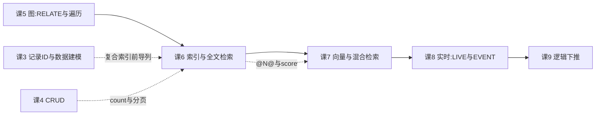

# 课 6 · 索引与全文检索

> **本课在故事主线中的情节定位**：主角第一次"主动"——不只是被动存取，还能帮你找东西。

[← 返回课程目录](../../../02-课程目录.md) ｜ [阶段概览](../overview.md)

---

## 本课目标

1. 为不同查询模式选对索引类型，知道 UNIQUE、复合、COUNT 索引各自的适用场景
2. 配好全文检索（FULLTEXT ANALYZER + BM25），并理解它与 Elasticsearch 的能力边界
3. 会用 EXPLAIN 判断索引是否真的被用上，能定位索引未命中的原因

> ⚠️ **阅读提示**：本课有五处结论与骨架描述或网上常见示例不一致，全部已在 SurrealDB **3.2.4** 上实测坐实，文中用「⚠️ 实测更正」标注。请以此为准。

---

## 知识点清单

### 知识点 6.1：索引类型：普通 / UNIQUE / 复合 / COUNT

**关键点**：

- `DEFINE INDEX ... FIELDS ...`：普通索引（`COLUMNS` 是等价写法）
- `UNIQUE`：唯一约束；**会挡住 UPSERT**（三条规则，见正文）
- 复合索引：**左前缀原则**，字段顺序决定能不能命中
- **COUNT 索引**（3.0 新增）：常数时间 `count()`；⚠️ **不能带 `FIELDS`**

**状态**：✅ 已完成

---

### 知识点 6.2：全文检索：FULLTEXT ANALYZER 与 BM25

**关键点**：

- 三段拼装：`DEFINE ANALYZER` → `DEFINE INDEX ... FULLTEXT` → `@N@` 查询
- ⚠️ **必须显式指定 ANALYZER**（不写会默认用不存在的 `like`，查询全报错）
- ⚠️ **`search::score(N)` 必须传整数 N**，且 N 对应 `@N@` 的编号
- ⚠️ **文档太少时 score 恒为 0**（BM25 的 IDF 依赖语料量，实测 2 条为 0、3 条起有分）
- 与 Elasticsearch 的边界：能覆盖中小规模，分析器生态与聚合能力差距明显

**状态**：✅ 已完成

---

### 知识点 6.3：查询计划与 EXPLAIN

**关键点**：

- ⚠️ **3.x 语法已变**：`EXPLAIN` 移到句首，`FULL` 改为 `ANALYZE`（骨架与多数教程仍是旧写法）
- 判读：看 `operator`（`IndexScan` vs `TableScan`）与 `access`
- 索引未命中的典型原因：跳过复合索引前导列、函数包裹字段、字段没索引
- `WITH INDEX` / `WITH NOINDEX` 可强制干预计划

**状态**：✅ 已完成

---

## 正文

### 第一幕 · 场景引入：存得下，不等于找得到

阶段 2 结束时，你手里已经有一套能跑的模型：商品是文档、订单是关系、"买了又买"是图边。课 5 最后一课我们还让它一口气走三层关系找"朋友的朋友"。

现在产品经理又来了，这回带了两个需求：

> 需求一：商品详情页底部要一个"相关商品"列表，要求**按相关性排序**，搜"无线蓝牙耳机"要把标题里有这些词的排前面。
>
> 需求二：运营后台的分页组件要显示"共 128,453 件商品"，每次翻页都得准。

你可能会想：这不就是 `WHERE` 和 `count()` 吗？

```sql
SELECT * FROM product WHERE title CONTAINS "蓝牙";
SELECT count() FROM product GROUP ALL;
```

在小数据集上这跑得挺好。但课 5 我们已经见过一次"看起来没问题、规模上来就崩"的情况（递归的成本是扇出的深度次方）。这次也一样，只是换了个地方：

- `CONTAINS` 是**逐行扫描 + 子串匹配**。100 万条商品，每次搜索都要把 100 万条读出来比对一遍。
- `count()` 不带 COUNT 索引时，是**把整张表数一遍**。你每翻一页数一次。

这两个问题，恰好对应本课的两个核心：**索引**（让查找从"逐行看"变成"直接定位"）和**全文检索**（让"相关性"有个可计算的分数）。

但我要先给你打个预防针：本课是本系列到目前为止**坑最密集的一课**。我在备课时踩了六个坑，其中有两个差点被我写成"SurrealDB 的 bug"——而它们其实都是**我的用法问题或测试方法问题**。这些坑我会原样写进正文，因为它们比顺滑的教程更有价值。

---

### 第二幕 · 认知冲突：明明匹配上了，为什么分数全是 0

先做一个看起来毫无问题的全文检索。照着官方示例，建分析器、建索引、插两条数据：

```sql
DEFINE ANALYZER az TOKENIZERS class FILTERS lowercase, ascii;
DEFINE INDEX idx ON TABLE t FIELDS text FULLTEXT ANALYZER az BM25 HIGHLIGHTS;

CREATE t:many SET text = "aeon aeon aeon";   -- 短文档，aeon 出现 3 次
CREATE t:once SET text = "this is a very long document that mentions aeon only one time among many many other words";
```

官方文档说得很清楚：`search::score()` 会返回相关性分数，**短文档里出现 3 次的分数，应该远高于长文档里只出现 1 次的**。

查一下：

```sql
SELECT id, search::score(0) AS sc FROM t WHERE text @0@ "aeon";
```

```json
[{ "id": "t:many", "sc": 0.0 }, { "id": "t:once", "sc": 0.0 }]
```

**两个都是 0。**

我的第一反应：`search::score()` 是不是坏了？要不要换个写法？

于是我试了一圈：

| 尝试 | 结果 |
|------|------|
| 加 `ORDER BY sc DESC` | 还是 0 |
| 索引加 BM25、加 `BM25(1.2, 0.75)` 显式参数 | 还是 0 |
| 换 `blank` tokenizer | 还是 0 |
| 查询词改大小写 | 还是 0 |
| 去掉 `HIGHLIGHTS` 只用 BM25 | 还是 0 |
| 完全去掉 BM25 | 还是 0 |

六次尝试，全是 0。到这里，**我有充分的"理由"得出结论：3.2.4 的 BM25 打分是坏的。**

但我先做了另一件事——**检查我的测试环境是不是太干净了**。表里只有 2 条文档。我往里灌了 50 条无关文档，再查：

```json
[
  { "id": "t:many", "sc": 4.475564479827881 },
  { "id": "t:exact", "sc": 4.129334926605225 },
  { "id": "t:once",  "sc": 1.466492772102356 }
]
```

分数出来了，而且**排序完全符合预期**：3 次的 > 1 次独占的 > 长文档里 1 次的。

**BM25 一点都没坏。是我的语料太小了。**

原因其实不难理解：BM25 的核心之一叫 **IDF（逆文档频率）**——一个词在多少文档里出现过。语料里如果只有 2 条文档、且 2 条都含 "aeon"，那这个词就"毫不稀奇"，IDF 把它压到 0。只有在足够多的文档里它是"稀有词"时，分数才显现。

我进一步测了临界点：

| 表中文档数 | t:many 的分数 | t:once 的分数 |
|---|---|---|
| 2（只有目标 2 条） | 0 | 0 |
| 3（+1 条噪声） | 0.511 | 0.191 |
| 12（+10 条噪声） | 1.993 | 0.631 |
| 52（+50 条噪声） | 4.476 | 1.466 |

**3 条就开始出分了。**

> 📌 **这一幕的教训（本系列第四次验证同一条规矩）**
>
> 课 2 的规矩是「反直觉结论必须有对照实验」。本课加一条更具体的：
>
> **当你要验证一个"与规模相关的机制"时，先问一句：我的数据量够不够触发它？**
>
> 打分、压缩、批处理、索引选择——这些机制在小样本上往往表现得"像坏了"。课 4 那次事务"失败"是发送方式错了，这次打分"失败"是语料太小了。**共同点是：先怀疑自己的验证方法，再怀疑产品。**

---

### 第三幕 · 层层揭示：三个知识点

---

## 知识点 6.1：索引类型——普通 / UNIQUE / 复合 / COUNT

### 一句话定义

索引是**一张额外的、按索引键有序的查找表**，让数据库从"逐行扫描"变成"直接定位"；SurrealDB 提供普通、UNIQUE、复合、COUNT 四种。

### 直觉建立：索引是"目录"，不是"数据"

想象一本 1000 页的书：

- **没有索引** = 想找"蓝牙"这个词，从第 1 页翻到第 1000 页，每页都看一遍。**TableScan（全表扫描）。**
- **有索引** = 书后的索引页写着"蓝牙：p.37, p.156, p.802"，直接翻到那几页。**IndexScan（索引扫描）。**

代价是：**索引本身要占空间，且每次写入都要同步更新索引**。所以索引不是越多越好——你为"读得快"付出了"写得慢 + 占地方"。

### 核心原理

**① 普通索引**

```sql
DEFINE INDEX idx_year ON TABLE book FIELDS year;
```

实测 `INFO FOR TABLE` 回显：`DEFINE INDEX idx_year ON book FIELDS year`。

> 💡 **`FIELDS` 与 `COLUMNS` 是等价写法**，本课两种都用（SurrealDB 文档与社区示例两种都在用，都能跑）。

**② UNIQUE 唯一索引**

```sql
DEFINE INDEX book_isbn ON TABLE book COLUMNS isbn UNIQUE;
```

实测冲突报错：

```text
Database index `book_isbn` already contains '111', with record `book:b1`
```

**UNIQUE 与 UPSERT 的三条规则（全部实测）** ——这是本节最容易踩的地方：

| 场景 | 语句 | 实测结果 |
|---|---|---|
| **改自己**（同 id、同唯一值） | `UPSERT u2:x SET code="A"`（x 原本就是 A） | ✅ **成功**，正常更新 |
| **改到别人的值上** | `UPSERT u2:x SET code="B"`（B 已被 y 占用） | ❌ 报 `already contains 'B', with record u2:y` |
| **新记录撞已存在的值** | `UPSERT u2:z SET code="A"`（A 已被 x 占用） | ❌ 报 `already contains 'A', with record u2:x` |

三条规则的记忆法：**UNIQUE 拦的是"最终会撞车"，不拦"原地更新"。**

> ⚠️ 这与很多人的直觉（"UPSERT 嘛，存在就更新、不存在就插入，肯定能成功"）冲突。课 4 我们学过 UPSERT 是 `CREATE` + `UPDATE` 的合体，但 **UNIQUE 索引在 UPSERT 之前就生效了**。

**复合 UNIQUE** 则按**组合**判重（实测）：

```sql
DEFINE INDEX u4_ab ON TABLE u4 COLUMNS a, b UNIQUE;
CREATE u4:1 SET a="x", b=1;   -- ✅
CREATE u4:2 SET a="x", b=2;   -- ✅ 组合不同
CREATE u4:3 SET a="x", b=1;   -- ❌ already contains ['x', 1], with record u4:1
```

**③ 复合索引（左前缀原则）**

```sql
DEFINE INDEX idx_author_year ON TABLE book COLUMNS author, year;
```

**字段顺序决定一切。** 实测（表内只有这一个复合索引）：

| 查询条件 | EXPLAIN 结果 |
|---|---|
| `author = ? AND year = ?` | ✅ `IndexScan idx_author_year, access: ['Author 3', 1960]` |
| `author = ?` | ✅ `IndexScan idx_author_year, access: ['Author 3']` |
| `year = ?`（**跳过前导列**） | ❌ `TableScan` 全表扫描 |

**左前缀原则**：复合索引 `(a, b, c)` 相当于同时有了 `(a)`、`(a,b)`、`(a,b,c)` 三个索引，但**没有** `(b)`、`(b,c)`。

所以 `(author, year)` 和 `(year, author)` 是两个完全不同的索引。实测把顺序换成 `(year, author)` 后，同样的 `WHERE year = 1960` 就从全表扫描变成了 `IndexScan`。

**怎么决定顺序？** 看你的查询模式：

```text
高频查询：WHERE author = ?                    → author 必须在前
高频查询：WHERE author = ? AND year = ?        → author 在前更好（还能兼第一种）
高频查询：WHERE year = ?                       → 需要单独的 year 索引，或把 year 放前
```

**④ COUNT 索引（3.0 新增）**

```sql
DEFINE INDEX big_count ON TABLE big COUNT;   -- ✅
```

> ⚠️ **实测更正**：COUNT 索引**不能带 `FIELDS`**。我第一版写成 `DEFINE INDEX ... ON TABLE book FIELDS id COUNT;`，直接报：
>
> ```text
> Parse error: Cannot create a count index with fields
> ```

它的作用是让 `SELECT count() ... GROUP ALL` 从"数一遍全表"变成"读一个维护好的计数器"。实测 300 行表：

| | 执行耗时（EXPLAIN ANALYZE） |
|---|---|
| **有** COUNT 索引 | **124.08µs**（`CountScan`） |
| **无** COUNT 索引 | **430.83µs** |

快约 3.5 倍。注意这只有 300 行——**行数越多差距越大**，因为无索引的计数是 O(n) 的。

> ⚠️ **诚实标注**：这是 300 行上的单次测量，**仅用于说明"常数时间 vs 线性时间"的趋势，不是基准测试**。生产性能与存储引擎、数据量、缓存强相关，本课未做基准测试。

### 常见误区

1. **COUNT 索引带 `FIELDS`** → 报 `Cannot create a count index with fields`（我踩的坑）。
2. **以为 UPSERT 能绕过 UNIQUE** → 不能，撞别人值就报错。
3. **复合索引顺序随便写** → 跳过前导列就全表扫描。
4. **索引越多越好** → 每个索引都要在写入时同步维护，写多读少的表要克制。
5. **建了索引就以为一定用上** → 必须用 EXPLAIN 确认（见 6.3）。

### 一句话记住

> **普通索引管定位、UNIQUE 管唯一（UPSERT 撞别人值照样拦）、复合索引按左前缀命中、COUNT 索引给 `count()` 开常数时间通道（且不能带 FIELDS）。**

---

## 知识点 6.2：全文检索——FULLTEXT ANALYZER 与 BM25

### 一句话定义

全文检索 = **`ANALYZER`（怎么切词）+ `INDEX`（挂哪个字段、怎么打分）+ `@N@`（怎么查）** 三段拼装，用 BM25 算法给"相关性"算出一个可排序的分数。

### 直觉建立：为什么不能用 `CONTAINS`

`CONTAINS` 能判断"包不包含"，但它给不了三件事：

| 需求 | `CONTAINS` | 全文检索 |
|---|---|---|
| "蓝牙耳机" 拆成两个词分别匹配 | 只能整串匹配 | ✅ 分词后逐词匹配 |
| 标题命中比正文命中更重要 | 做不到 | ✅ 用 `@N@` 给不同字段加权 |
| 出现 3 次的排在出现 1 次的前面 | 做不到 | ✅ BM25 打分排序 |

### 核心原理

**第一段：`DEFINE ANALYZER`（怎么切词）**

```sql
DEFINE ANALYZER az TOKENIZERS class FILTERS lowercase, ascii;
```

- **TOKENIZERS**（分词器）：怎么把一句话切成词。`class` 按 Unicode 字符类别切（对英文友好）。
- **FILTERS**（过滤器）：切完之后怎么处理。`lowercase` 转小写、`ascii` 去音标。

> ⚠️ **实测更正（重要坑）**：**ANALYZER 必须显式指定。** 如果 `DEFINE INDEX` 时不写 ANALYZER：
>
> ```sql
> DEFINE INDEX ft_plain ON TABLE article COLUMNS body FULLTEXT;
> ```
>
> `INFO FOR TABLE` 会显示它被补全成了 `FULLTEXT ANALYZER like BM25(1.2,0.75)`，而 **`like` 这个分析器并不存在**，于是所有查询都报：
>
> ```text
> The analyzer 'like' does not exist
> ```
>
> 这个坑特别难受的地方在于：**定义索引时不报错，插入数据也不报错，只有查询时才炸。**

**第二段：`DEFINE INDEX`（挂哪 + 怎么打分）**

```sql
DEFINE INDEX ft_title ON TABLE article COLUMNS title FULLTEXT ANALYZER az BM25 HIGHLIGHTS;
```

- `FULLTEXT ANALYZER az`：**3.0 起的写法**。旧写法 `SEARCH ANALYZER` 已被**彻底移除**——实测连解析都过不去：
  ```text
  Parse error: Unexpected token `an identifier`, expected Eof
  ```
  注意这不是"能用但废弃"，是**语法直接没了**。骨架的描述是对的，但值得强调：网上 2023-2024 年的教程几乎全用 `SEARCH ANALYZER`，照抄必错。
- `BM25`：启用 BM25 打分，之后才能用 `search::score()`。
- `HIGHLIGHTS`：启用高亮，之后才能用 `search::highlight()`。

**第三段：查询（`@N@` 编号绑定）**

```sql
SELECT id, title,
       search::score(0) * 2 + search::score(1) AS total
FROM article
WHERE title @0@ "search" OR body @1@ "search"
ORDER BY total DESC;
```

**`@0@` / `@1@` 里的数字，就是 `search::score(N)` 里的 N。** 这个编号机制让你能：

- 对**不同字段分别取分**（标题命中给 2 倍权重，正文给 1 倍）；
- 把多个分数**加权合并**成一个排序依据。

> ⚠️ **实测更正**：`search::score()` **必须传整数参数**，不能空着：
>
> ```sql
> SELECT search::score() FROM article WHERE title @@ "search";
> -- ❌ Invalid query: Index function 'search::score' requires at least 1 arguments
> ```
>
> 而且参数必须是 **0..255 的整数**：
> ```sql
> SELECT search::score(title) FROM article WHERE title @@ "search";
> -- ❌ index_ref argument must be a literal integer in range 0..255
> ```
> 另外，**没有 `@N@` 匹配子句时用 score 会报**：`no MATCHES clause found in WHERE condition`。

**匹配语义实测对照**

| 写法 | 数据 `"A rare personal chronicle"` | 结论 |
|---|---|---|
| `@@ "rare personal"` | ✅ 命中 | 多词默认**全词都要有** |
| `@AND@ "rare personal"` | ✅ 命中 | 与 `@@` 等价 |
| `@OR@ "rare nonexistent"` | ✅ 命中 | 任一命中即可 |
| `@AND@ "rare nonexistent"` | ❌ 空 | 缺一个词就无结果 |
| `@@ "sear"`（前缀） | ❌ 空 | **不支持前缀匹配** |
| `@@ "searching"`（词形变化） | ❌ 空 | 无 snowball 词干还原时匹配不到 |

> ⚠️ 最后两行是与 Elasticsearch 直觉冲突最大的地方。ES 默认会做词干还原并能配 `edge_ngram` 做前缀搜索；**SurrealDB 默认什么都不做**，要词干还原得自己在 analyzer 里加 `FILTERS snowball(english)`。

**中文分词：一个必须提前知道的坏消息**

```sql
CREATE article:a6 SET title = "中文分词测试";
SELECT id FROM article WHERE title @0@ "中文";   -- ✅ 命中
SELECT id FROM article WHERE title @0@ "分词";   -- ❌ 空
SELECT id FROM article WHERE title @0@ "文分";   -- ❌ 空
```

**`class` tokenizer 把整串中文当作一个 token**，只有整串查询才命中。这意味着**开箱即用的中文检索基本不可用**。

可选方案（按成本从低到高）：

1. **预先把中文按词切好再入库**（在应用层用 jieba 等分词，存成空格分隔的字符串）——最简单可控。
2. **自定义 ANALYZER** 配合 Surrealism（3.x 的实验特性，用 Rust 写 WASM 分析器）——需要 `--allow-experimental surrealism`。
3. **外接专用搜索引擎**——这就是下面"与 ES 的边界"要谈的。

> ⚠️ **诚实标注**：本课只实测了 `class` 与 `blank` 两种 tokenizer 对中文的表现，**未实测** 3.x 的 Surrealism 自定义分析器（需实验标志）。上面方案 2 的可行性未经本课验证。

**与 Elasticsearch 的边界（正面回答）**

| 能力 | SurrealDB 3.2.4 | Elasticsearch | 判断 |
|---|---|---|---|
| 倒排索引 + BM25 打分 | ✅ 有 | ✅ 有 | 打平 |
| 多字段加权 / 高亮 | ✅ `@N@` 编号 + HIGHLIGHTS | ✅ 有 | 打平 |
| 中文等 CJK 分词 | ❌ 开箱不可用 | ✅ 有成熟插件 | **ES 明显领先** |
| 分析器生态（同义词、词干、ngram） | 少量内置，需自定义 | 极其丰富 | **ES 明显领先** |
| 聚合分析（分面统计、直方图） | 需手写 GROUP BY | ✅ 原生强大 | **ES 明显领先** |
| 与业务数据同库（无同步延迟） | ✅ 天然一体 | ❌ 需双写同步 | **SurrealDB 领先** |
| 运维复杂度 | 一个进程 | 独立集群 | **SurrealDB 领先** |

**结论一句话**：**中小规模、以英文为主、且希望"搜索和主数据在同一个库"的场景，SurrealDB 够用；一旦涉及中文分词、复杂聚合、或搜索本身是核心业务，请继续用 ES。**

这不是妥协，这是取舍——课 1 讲的"按业务拆，不按形状拆"，前提是这个库真能扛住那个业务。

### 常见误区

1. **不写 ANALYZER** → 默认用不存在的 `like`，查询全报错（我踩的坑，且定义时不报错）。
2. **`search::score()` 不传参数** → `requires at least 1 arguments`。
3. **用 2-3 条数据验证打分** → score 恒为 0，误判为"打分坏了"（第二幕的坑）。
4. **以为 `@@` 是 OR 语义** → 默认是全词都要有，要 OR 得写 `@OR@`。
5. **以为有前缀匹配** → 默认没有。
6. **以为中文开箱可用** → 不可用，需预先分词或自定义分析器。
7. **照抄 `SEARCH ANALYZER`** → 3.0 起语法已移除，报 Parse error。

### 一句话记住

> **ANALYZER 必须显式写、`score(N)` 的 N 必须对应 `@N@`、语料要够打分才非零；中文开箱不可用，复杂搜索请留给 ES。**

---

## 知识点 6.3：查询计划与 EXPLAIN

### 一句话定义

`EXPLAIN` 让数据库**把"它打算怎么执行这条查询"打印出来**，你据此判断索引有没有真的被用上。

### 直觉建立：只看"跑不跑得通"是不够的

一条 SQL 返回正确结果，不代表它跑得高效。特别是：

- 小表上跑得飞快，上线后数据量涨 100 倍就卡死；
- 你明明建了索引，但查询写法让它用不上。

**唯一可靠的判断方法是看执行计划，不是看耗时。**

### 核心原理

> ⚠️ **实测更正（本课对骨架的第二处更正）**：**3.x 的 EXPLAIN 语法变了。**

| | 写法 | 3.2.4 实测 |
|---|---|---|
| **旧（2.x，网上教程主流）** | `SELECT ... WHERE ... EXPLAIN;` | — |
| **旧（骨架写法）** | `EXPLAIN FULL SELECT ...;` | ❌ `Parse error: Unexpected token SELECT, expected the query to end` |
| **新（3.x）** | `EXPLAIN SELECT ...;` | ✅ 前缀式 |
| **新（带指标）** | `EXPLAIN ANALYZE SELECT ...;` | ✅ 带 rows / elapsed |
| **新（结构化）** | `EXPLAIN FORMAT JSON SELECT ...;` | ✅ JSON 对象 |

3.0 起 `EXPLAIN` 从**句尾子句**变成了**前缀语句**，`FULL` 被 `ANALYZE` 取代。骨架里写的 `EXPLAIN FULL` 已不可用。

**输出怎么读（文本格式实测）**

```text
SelectProject [ctx: Db] [projections: *]
    IndexScan [ctx: Db] [index: idx_year, access: = 1960, direction: Forward]
```

从上往下是**执行树的父子关系**（缩进表示子节点）。判断索引是否命中，**只看两点**：

| 信号 | 含义 | 判断 |
|---|---|---|
| `IndexScan` + `index: 索引名` + `access: 条件` | 走了索引 | ✅ 好 |
| `TableScan` + `predicate: 条件` | 全表扫描 | ❌ 优化目标 |
| `CountScan` | 走了 COUNT 索引 | ✅ 快 |

带 `ANALYZE` 时会多出执行指标：

```text
SelectProject [ctx: Db] [projections: *] {rows: 4, batches: 1, elapsed: 3.20µs}
    IndexScan [ctx: Db] [index: idx_year, access: = 1960, direction: Forward] {rows: 4, batches: 1, elapsed: 88.63µs}

Total rows: 4
```

`rows` 是各算子输出的行数，`elapsed` 是耗时。**子节点耗时远大于父节点是正常的**——真正干活的是最底层那个扫描算子。

**四种典型的索引未命中（全部实测）**

| # | 场景 | 语句 | EXPLAIN 结果 |
|---|---|---|---|
| ① | **跳过复合索引前导列** | `idx(author, year)` + `WHERE year = 1960` | `TableScan` |
| ② | **函数包裹字段** | `WHERE string::lowercase(author) = "..."` | `TableScan`，且标注 `pre_decode_filter: no (unsupported predicate)` |
| ③ | **字段压根没索引** | `WHERE price = 25` | `TableScan` |
| ④ | **类型不匹配**（意外） | `year` 是 int，却写 `WHERE year = "1960"` | ⚠️ **仍走 `IndexScan`**，但 `access: = '1960'` |

第 ④ 行值得单独说：我原本预期类型不匹配会导致全表扫描，**实测没有**——它照常走了索引，只是把字符串 `'1960'` 当作索引键去查。这**不代表安全**：索引按 int 排序，用字符串查可能查不到预期结果（或查到 0 条），而计划看起来"很正常"。

> 💡 这是个典型的"**计划好看但结果可能不对**"的场景。EXPLAIN 能告诉你效率高不高，**不能告诉你结果对不对**。类型还是要自己保证。

**主动干预：`WITH INDEX` / `WITH NOINDEX`**

查询优化器不总是选对。你可以强制它：

```sql
SELECT * FROM book WITH INDEX idx_year_author WHERE author = ? AND year = ?;  -- 强制用指定索引
SELECT * FROM book WITH NOINDEX WHERE year = 1960;                              -- 强制全表扫描
```

实测 `WITH NOINDEX` 后确实变成 `TableScan`。**用途**：当你怀疑优化器选错了索引，用这两个语句做 A/B 对比，找出更快的那个。

**优化路径：从执行计划反推索引设计**

这是一个可以反复套用的四步循环：

```text
① 收集慢查询  →  ② EXPLAIN 看是否 TableScan  →  ③ 判断缺什么索引 / 写法哪里阻碍了索引  →  ④ 改完再 EXPLAIN 验证
```

第 ③ 步的判断表：

| 计划显示 | 可能原因 | 怎么改 |
|---|---|---|
| `TableScan` + 字段没索引 | 缺索引 | 补 `DEFINE INDEX` |
| `TableScan` + 复合索引字段 | 跳过了前导列 | 调索引顺序，或补一个以该字段开头的索引 |
| `TableScan` + 有函数调用 | 函数包裹了字段 | 改写查询，或建函数索引（若支持） |
| `IndexScan` 但 rows 很大 | 选择性差（如性别字段） | 该索引价值低，考虑去掉或放复合索引后列 |
| `CountScan` 缺失 + 频繁计数 | 缺 COUNT 索引 | `DEFINE INDEX ... COUNT` |

### 常见误区

1. **照抄 `EXPLAIN FULL`** → 3.x 报 Parse error，用 `EXPLAIN ANALYZE`。
2. **把 `EXPLAIN` 写在句尾** → 3.x 要写句首。
3. **只看耗时不看计划** → 小表上全表扫描也很快，看不出来。
4. **以为 `IndexScan` 就一定对** → 类型不匹配时也走索引，但结果可能不对。
5. **建完索引不验证** → 必须 `EXPLAIN` 确认被选中。

### 一句话记住

> **`EXPLAIN` 写句首、`ANALYZE` 看指标；`IndexScan` 好、`TableScan` 查；跳过前导列和函数包字段是两大杀手。**

---

### 第四幕 · 实操验证：五个练习

> 全部练习在本机 SurrealDB 3.2.4 上可运行。建议新建库练习：`USE NS learn; USE DB kp6x;`

**练习 1（对应 6.1）· 找出建不出来的索引**

下面这条语句会报错，请说出原因并改正：

```sql
DEFINE INDEX book_count ON TABLE book FIELDS id COUNT;
```

<details>
<summary>参考答案</summary>

报错原文：

```text
Parse error: Cannot create a count index with fields
```

原因：**COUNT 索引是对整张表维护一个计数器，不针对任何字段**，因此不能带 `FIELDS`。

```sql
DEFINE INDEX book_count ON TABLE book COUNT;
```

**验证方式**：`INFO FOR TABLE book;` 应能看到 `book_count: "DEFINE INDEX book_count ON book COUNT"`。

</details>

**练习 2（对应 6.1）· 判断 UPSERT 会不会被 UNIQUE 拦下**

已有：

```sql
DEFINE INDEX u_code ON TABLE u2 COLUMNS code UNIQUE;
CREATE u2:x SET code = "A", name = "first";
CREATE u2:y SET code = "B", name = "other";
```

判断以下三条语句各自的结果（成功 / 报错 + 报错内容）：

```sql
UPSERT u2:x SET code = "A", name = "second";
UPSERT u2:x SET code = "B", name = "hijack";
UPSERT u2:z SET code = "A", name = "newdup";
```

<details>
<summary>参考答案</summary>

| 语句 | 结果 |
|---|---|
| `UPSERT u2:x SET code="A"` | ✅ **成功**（改的是自己，UNIQUE 不拦原地更新） |
| `UPSERT u2:x SET code="B"` | ❌ `Database index u2_code already contains 'B', with record u2:y` |
| `UPSERT u2:z SET code="A"` | ❌ `Database index u2_code already contains 'A', with record u2:x` |

**记忆法**：UNIQUE 拦的是"最终会撞车"，不拦"原地更新"。

</details>

**练习 3（对应 6.1）· 复合索引该按什么顺序建**

假设你的查询模式有三个，按频率排序：

1. `WHERE author = ? AND year = ?`（最高频）
2. `WHERE author = ?`（次高频）
3. `WHERE year = ?`（偶尔）

你只打算建**一个**复合索引。应该建成 `(author, year)` 还是 `(year, author)`？各自会牺牲什么？

<details>
<summary>参考答案</summary>

建 **`(author, year)`**。

按左前缀原则，`(author, year)` 同时覆盖了 `(author)` 和 `(author, year)`，因此：

| 查询 | `(author, year)` | `(year, author)` |
|---|---|---|
| `author = ? AND year = ?` | ✅ 命中 | ✅ 命中 |
| `author = ?` | ✅ 命中 | ❌ 全表 |
| `year = ?` | ❌ 全表 | ✅ 命中 |

**取舍**：`(author, year)` 牺牲了最低频的"只按 year 查"（实测为 `TableScan`）。如果它偶尔跑一次且表不大，可以接受；若它也变高频，就**再补一个单列索引** `idx_year`——用空间换命中。

**验证方式**：两种都建一遍，用 `EXPLAIN` 看第三种查询的 operator 从 `TableScan` 变成 `IndexScan`。

</details>

**练习 4（对应 6.2）· 排查"全文检索全报错"**

你按下面配置好后，**定义和插入都成功**，但一查询就报 `The analyzer 'like' does not exist`：

```sql
DEFINE TABLE article SCHEMAFULL;
DEFINE FIELD body ON article TYPE string;
DEFINE INDEX ft ON TABLE article COLUMNS body FULLTEXT;
CREATE article:a1 SET body = "SurrealDB supports full-text search";
SELECT id FROM article WHERE body @@ "search";
```

请说出原因、改正方法，以及**为什么这个问题特别难发现**。

<details>
<summary>参考答案</summary>

原因：`DEFINE INDEX` 时没写 `ANALYZER`，SurrealDB 补全成了默认分析器 `like`，而**这个分析器并不存在**。

```sql
DEFINE ANALYZER az TOKENIZERS class FILTERS lowercase, ascii;
DEFINE INDEX ft ON TABLE article COLUMNS body FULLTEXT ANALYZER az BM25;
```

**为什么难发现**：`DEFINE INDEX` 不报错、`CREATE` 也不报错，只有**查询时**才炸。当你拿到报错时，注意力已经在查询语句上了，很难联想到是几十行外的索引定义缺了一截。

**预防方法**：定义完立刻 `INFO FOR TABLE article;`，确认回显里有 `FULLTEXT ANALYZER <你自己定义的名字>`，而不是默认的 `like`。

</details>

**练习 5（对应 6.3）· 读执行计划**

一张 200 行的 `book` 表，有 `idx_author_year ON book COLUMNS author, year` 这一个索引。以下三条查询的 EXPLAIN 结果分别是什么？哪条是优化重点？

```sql
EXPLAIN SELECT * FROM book WHERE author = "Author 3" AND year = 1960;
EXPLAIN SELECT * FROM book WHERE year = 1960;
EXPLAIN SELECT * FROM book WHERE string::lowercase(author) = "author 3";
```

<details>
<summary>参考答案</summary>

| 查询 | operator | access / predicate |
|---|---|---|
| ① `author = ? AND year = ?` | **IndexScan** `idx_author_year` | `['Author 3', 1960]` |
| ② `year = ?` | **TableScan** | `predicate: year = 1960` |
| ③ `lowercase(author) = ?` | **TableScan** | `predicate: string::lowercase(...) = 'author 3'` + `pre_decode_filter: no (unsupported predicate)` |

**优化重点**：

- **② 是首要目标**——它只是跳过了前导列，改索引顺序或补一个 `idx_year` 就能修好，成本低收益大。
- ③ 需要改**查询写法**（别把函数套在字段上），比如改成存一个已经 lowercase 过的 `author_lc` 字段并对它建索引。

**验证方式**：改完再跑 `EXPLAIN`，确认 operator 从 `TableScan` 变成 `IndexScan`。

</details>

---

### 第五幕 · 体系收束

#### 三句话收束本课

1. **索引是"目录"不是"数据"**——普通管定位、UNIQUE 管唯一（连 UPSERT 撞别人值也拦）、复合按左前缀命中、COUNT 给 `count()` 开常数时间通道。
2. **全文检索是三段拼装**——ANALYZER 切词、INDEX 挂字段并启用 BM25、`@N@` 查询并加权；任一段缺失都会以"查询时才报错"的方式暴露。
3. **判断性能唯一可靠的是执行计划**——`IndexScan` 好、`TableScan` 查；跳过前导列与函数包字段是两大杀手。

#### 本课陷阱清单（按被坑概率排序）

| # | 陷阱 | 症状 | 正确做法 |
|---|------|------|----------|
| 1 | 不写 ANALYZER | 查询报 `analyzer 'like' does not exist`（定义/插入时不报） | 显式 `FULLTEXT ANALYZER <自定义>`，并用 INFO 核对 |
| 2 | 文档太少验证打分 | `search::score()` 恒为 0 | 灌足语料（实测 ≥3 条才出分） |
| 3 | `search::score()` 不传参数 | `requires at least 1 arguments` | 传 0..255 整数，对应 `@N@` 编号 |
| 4 | COUNT 索引带 `FIELDS` | `Cannot create a count index with fields` | 只写 `ON TABLE x COUNT` |
| 5 | 抄 `EXPLAIN FULL` | `Parse error: Unexpected token SELECT` | 用 `EXPLAIN ANALYZE SELECT ...`（前缀式） |
| 6 | 抄 `SEARCH ANALYZER` | `Parse error: Unexpected token an identifier` | 用 `FULLTEXT ANALYZER` |
| 7 | 跳过复合索引前导列 | 静默降级为 `TableScan` | 按查询模式排字段顺序 |
| 8 | 以为 `@@` 是 OR / 支持前缀 | 查不到预期结果 | 全词匹配用 `@@`，或显式 `@OR@`；前缀需另配 |
| 9 | 以为中文开箱可用 | "分词" 查 "中文分词测试" 为空 | 预分词入库，或外接 ES |
| 10 | 以为 UPSERT 绕过 UNIQUE | 撞别人值时报错 | 记住三条规则（原地更新放行） |

#### 与前后的交汇

- **承接课 3**：SCHEMAFULL 下无默认值的字段必须显式给值（本备课 6.1 脚本就因此连续失败两次：`price` 与 `tags`）。这是课 3 类型校验的又一次现身。
- **承接课 4**：`count()` 与分页深翻页的问题，本课用 COUNT 索引给出了部分答案；但深翻页（`LIMIT ... START 500000`）仍是 O(offset)，解法留待课 11 与工程实践。
- **承接课 5**：边表的 `in` / `out` 正是本课复合索引的经典场景——`DEFINE INDEX ON knows COLUMNS in, out` 能让"从某个节点出发的所有边"变成索引查找。
- **指向课 7**：本课讲完了"关键词检索"，课 7 将讲"语义检索"（向量 + HNSW），最后用 `search::rrf()` 把两者融合成混合检索。**`@N@` 编号与 `search::score()` 在课 7 会再次出现并承担更重的角色。**
- **指向课 11**：索引与存储后端的选择强相关（RocksDB vs SurrealKV），本课所有结论默认基于本机默认后端。

#### 阶段 3 开篇

这是阶段 3 的第一课。阶段主题是「数据库不只是存」，本课给的是"找"的能力：

- 课 6（本课）：**关键词检索**——索引 + BM25
- 课 7：**语义检索**——向量 + HNSW，以及两者融合
- 课 8：**主动推送**——LIVE 与 EVENT
- 课 9：**逻辑下推**——把计算搬进数据库

四课合起来的阶段出口是：一个带语义搜索 + 图推理 + 实时推送的最小 RAG 原型。**本课是它的地基**——因为课 7 的混合检索需要本课的每个语法都扎实。

---

## 在全局中的位置



- **上游**：课 3 的字段定义与类型校验、课 4 的 `count()` 与查询子句、课 5 的边表结构
- **下游**：课 7 的向量检索（与全文融合成混合检索）、课 9 的 COMPUTED 字段与视图（索引会作用于视图）
- **横向**：本课的全文检索可与 `elasticsearch/` 课程对照阅读；COUNT 索引可与 `redis/` 的计数器方案对照

---

## 配图

- [索引与 EXPLAIN 判读](../../../assets/lesson-06-index-explain.svg) —— 四种索引写法与行为、EXPLAIN 命中/未命中判读、四类失效原因、3.x 语法变更
- [全文检索与 BM25](../../../assets/lesson-06-fulltext-bm25.svg) —— 三段式配置、score 恒 0 的坑、匹配语义对照、中文分词表现

---

## 课程导航

- 上一课：[课 5 · 图：RELATE 与遍历](../../2-核心数据模型与SurrealQL/lessons/lesson-05-图RELATE与遍历.md)
- 阶段概览：[阶段 3 · 搜索、实时与逻辑下推](../overview.md)
- 下一课：课 7《向量与混合检索》（待学习）

---

## 交付状态

| 项 | 值 |
|---|---|
| 状态 | ✅ 已完成 |
| 评审 | ✅ 已完成（双视角，P0 清零） |
| 完成日期 | 2026-09-02 |

---

## 接力提示词

> 复制到新会话即可继续下一课：

```text
我的 SurrealDB 学习档案在 surrealdb/00-学习档案.md，
刚学完阶段 3《搜索、实时与逻辑下推》课 6《索引与全文检索》
（知识点 6.1 索引类型、6.2 全文检索与 BM25、6.3 查询计划与 EXPLAIN）。
请按大纲继续讲解课 7《向量与混合检索》的知识点
7.1 向量字段与 HNSW 索引、
7.2 KNN 与相似度函数、
7.3 混合检索与 Graph RAG。
```
