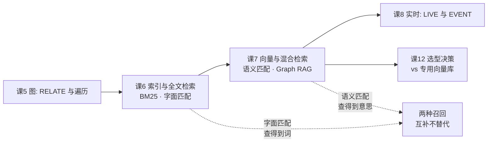

> **本课在故事主线中的情节定位**：主角学会"理解意思"——不再只匹配字面，还能匹配语义。

[← 返回课程目录](../../../02-课程目录.md) ｜ [阶段概览](../overview.md)

---

## 本课目标

1. 会建向量字段与 HNSW 索引，理解关键参数的含义与取舍
2. 能写 KNN 查询与相似度计算
3. 能把**向量 + 全文 + 图遍历融合进一条查询**，搭出最小 Graph RAG 原型

> **版本基准**：本机 SurrealDB **3.2.4**（2026-08-03）。本课所有结论均在本机实测，性能数据仅示趋势、不可外推。

---

## 知识点清单

| # | 知识点 | 关键点 | 状态 |
|---|--------|--------|------|
| 7.1 | 向量字段与 HNSW 索引 | ⚠️ **3.0 移除 MTREE，只剩 HNSW**（`MTREE` 连解析都过不去）/ ⚠️ **不写 `DIST` 默认是 `EUCLIDEAN` 不是 `COSINE`** / `DIMENSION` 必须匹配（不符报 `Incorrect vector dimension`）/ 3.1+ 新增 **DISKANN** | ✅ |
| 7.2 | KNN 与相似度函数 | ⚠️ **`<\|K,EF\|>` 的 K 是硬上限**（不是 DIM）/ ⚠️ **结构化过滤可下推**（与官方博客"必须独占 WHERE"相反）/ `vector::similarity::*` 是全表暴力、`vector::distance::knn()` 只跟随 KNN / ⚠️ **无索引时写数字 EF → 静默退化为全表扫描、`dist` 全 null** | ✅ |
| 7.3 | 混合检索与 Graph RAG | ⚠️ **`search::rrf()` 参数是 `(lists, limit, k)`**（第二参 limit、第三参 k，与部分官方博客相反）/ ⚠️ **`search::linear()` 需要 4 个参数且 `norm` 必需** / ⚠️ **KNN 与全文匹配符不能在同一 WHERE 共存**（静默返回 `[]`） | ✅ |

---

## 在全局中的位置



课 6 解决了"查得到词"，本课解决"查得到意思"。两者不是替代关系——**BM25 查精确术语强、查同义表述弱；向量恰好相反**。把它们合起来，再用课 5 的图遍历把上下文拉进来，就是本课要拼出的那个东西。

---

## 第一幕 · 场景引入：搜"数据库连接池"，什么都没搜到

你在做一个内部技术文档站，内容已经灌进 SurrealDB。现在有个同事问："哪篇文档讲了 HTTP 连接池？"

你很自然地写下课 6 学的全文检索：

```sql
SELECT title, search::score(0) AS s FROM doc WHERE content @0@ "HTTP 连接池" ORDER BY s DESC;
```

**返回 0 条。**

但你明明记得有这篇文档——翻了一下，标题叫《Transport 层的会话复用》，正文里写的是"persistent connections"和"session reuse"。

问题出在：**用户的词和文档的词，一个字都不重合。**

反过来也成立。如果你用向量搜一个精确的产品型号 `SKF-6204-2RS`，向量会给你返回一堆"轴承选型指南""机械零件目录"——语义上都沾边，但没有一篇里有这个型号。**精确字符串反而是向量的弱项。**

这就是本课要解决的矛盾：**字面匹配和语义匹配各自都会漏，而且漏的地方正好互补。**

---

## 第二幕 · 认知冲突：索引建了，为什么距离全是 null

先别急着管融合的事。我们按套路来：先建个 HNSW 索引试试。

```sql
DEFINE TABLE pts SCHEMALESS;
CREATE pts:p1 SET point = [1.0, 0.0, 0.0, 0.0], cat = "x";
CREATE pts:p2 SET point = [0.9, 0.1, 0.0, 0.0], cat = "x";
CREATE pts:p3 SET point = [0.0, 1.0, 0.0, 0.0], cat = "y";
CREATE pts:p4 SET point = [0.0, 0.0, 1.0, 0.0], cat = "y";

SELECT id, cat, vector::distance::knn() AS d FROM pts
  WHERE point <|2,40|> [1.0, 0.0, 0.0, 0.0] AND cat = "x"
  ORDER BY d ASC;
```

期待返回 2 条（`p1` `p2`），带距离。实际返回：

```
[{"cat": "x", "d": null, "id": "pts:p1"}, {"cat": "x", "d": null, "id": "pts:p2"}]
```

**没有报错，条数也对（因为 `cat="x"` 恰好只有 2 条），但 `d` 是 `null`。**

这时候最自然的三个猜测是：① `vector::distance::knn()` 写错了；② `ORDER BY` 影响了；③ 这版本的 KNN 有问题。

### 决定性实验：三个猜测都不对

我们做一件课 2 就立下的规矩要求的事——**先怀疑自己的验证方法，再怀疑产品**。这次的怀疑点是：**我到底有没有建索引？**

| 实验 | 条件 | 结果 |
|------|------|------|
| ① | 无索引 + `<\|2,40\|>` + `AND cat="x"` | 2 条，`d` 全 **null** |
| ② | 无索引 + `<\|2,COSINE\|>` + `AND cat="x"` | 2 条，`d` = `0.0` / `0.0061` ✅ |
| ③ | **建上 HNSW 索引后**再跑 ① 的写法 | 2 条，`d` = `0.0` / `0.0061` ✅ |

根因找到了：**我忘了建索引。**

但这不是重点。重点是 **SurrealDB 在这种情况下的表现**——它既没报"表上没有向量索引"，也没报"EF 参数需要 HNSW 索引"，而是**静默地把 KNN 整个降级掉了**。用 `EXPLAIN` 看得最清楚：

```
无索引 + <|2,40|>：
    TableScan [table: pts, predicate: cat = 'x', pre_decode_filter: yes]     ← 没有 KnnTopK！

无索引 + <|2,COSINE|>：
    KnnTopK [field: point, k: 2, distance: Cosine, dimension: 4]             ← 有
        TableScan [table: pts, direction: Forward]
```

**计划里连 `KnnTopK` 这个算子都没出现。** KNN 被完全忽略了，只剩下 `cat="x"` 在过滤。

这是本系列的**第五次静默失败**（课 3 REFERENCE 不校验 / 课 4 UPDATE 返回 `[]` / 课 5 边方向写反 / 课 6 类型不匹配仍走 IndexScan / **本课 KNN 静默降级**）。它比前四次更危险，因为前四次你至少还能从"结果条数不对"察觉，而这一次——**如果过滤条件恰好筛出 K 条，你连条数都对，只会觉得"距离怎么是空的"。**

> **给自己的规矩（本课新增）**：写完任何 KNN 查询，第一件事是 `EXPLAIN` 里找 `KnnScan`（有索引）或 `KnnTopK`（暴力）这两个算子。找不到，说明你的 KNN 根本没生效。

---

## 第三幕 · 层层揭示

### 知识点 7.1：向量字段与 HNSW 索引

**一句话定义**：向量索引是一种为"高维空间里谁离谁近"这种查询专门设计的索引，SurrealDB 3.x 用 **HNSW**（Hierarchical Navigable Small World，分层可导航小世界图）实现它，3.1 起另提供 **DISKANN** 作为大语料的省内存选项。

#### 直觉建立：从"翻遍全书"到"跳着找"

假设你要在一座城市里找离你最近的咖啡馆。

- **不用索引（暴力搜索）**：挨家挨户问过去，算距离，排个序。**一定找得准**，但城市大了就慢。
- **HNSW**：城市里有一套"高速路 + 主干道 + 小巷"的分层路网。你先上高速快速定位到大致区域，再下主干道，最后走小巷精确到门口。**可能漏掉个别藏在犄角旮旯的店**，但快得多。

这就是 HNSW 的核心权衡：**用一点点召回率的损失，换数量级的速度提升**。对应到 SurrealDB 里，就是"有索引 + `<|K,EF|>`"（近似、快）vs"无索引 + `<|K,DIST>`"（精确、慢）两条路。

#### 核心原理：一条定义语句里的每个参数

```sql
DEFINE INDEX idx_hnsw ON TABLE doc
  FIELDS embedding
  HNSW DIMENSION 4 DIST COSINE TYPE F32 EFC 150 M 12 M0 24 LM 0.40242960438184466f;
```

实测回显（`INFO FOR TABLE doc`）：

```
"idx_hnsw": "DEFINE INDEX idx_hnsw ON doc FIELDS embedding HNSW DIMENSION 4 DIST COSINE TYPE F32 EFC 150 M 12 M0 24 LM 0.402..."
```

| 参数 | 默认 | 含义 | 调参直觉 |
|------|------|------|----------|
| `DIMENSION` | **必填** | 向量维度 | ⚠️ **必须等于嵌入模型输出维度**。OpenAI `text-embedding-3-small` 是 1536，写错直接报错 |
| `DIST` | ⚠️ **`EUCLIDEAN`** | 距离度量 | `COSINE` / `EUCLIDEAN` / `MANHATTAN` / `MINKOWSKI <阶数>`。**文本嵌入一般用 COSINE** |
| `TYPE` | `F32` | 元素存储类型 | `F64`/`F32`/`I64`/`I32`/`I16`。`F32` 省一半内存，精度通常够 |
| `EFC` | 150 | **建**索引时的搜索力度 | 只影响建索引，越大索引质量越高、构建越慢 |
| `M` | 12 | 每个节点的最大连接数 | 越大召回越高、内存越吃 |
| `M0` | 24 | 第 0 层的最大连接数 | 同上，一般 `M0 = 2 * M` |
| `LM` | 0.4024... | 层生成乘数 | ⚠️ **官方明确建议不要手改**，它由其他参数算出 |

> ⚠️ **实测更正 1（骨架未提，极易踩）**：**不写 `DIST` 时默认是 `EUCLIDEAN`，不是 `COSINE`。**
>
> 实测：`DEFINE INDEX ix_nodist ON TABLE doc FIELDS e6 HNSW DIMENSION 4;` → 回显 `... HNSW DIMENSION 4 DIST EUCLIDEAN TYPE F32 ...`
>
> 而几乎所有文本嵌入场景都该用 `COSINE`。**省写这一个词，你的语义搜索结果会和预期完全不同，而且不报错。**

> ⚠️ **实测更正 2（骨架写法已过时）**：**`MTREE` 在 3.0 已被移除，不是"废弃但能用"。**
>
> 实测：`DEFINE INDEX ix_mtree ON TABLE doc FIELDS e MTREE DIMENSION 4;`
> 报 `Parse error: Unexpected token 'an identifier', expected Eof`（箭头直接指向 `MTREE`）
>
> 2.x 的教程里还有 `MTREE`，照抄会连解析都过不去。3.x 只有 `HNSW` 和 `DISKANN`。

**`MINKOWSKI` 需要额外参数**（这个报错信息比较友好）：

```sql
DEFINE INDEX ix ON TABLE doc FIELDS e4 HNSW DIMENSION 4 DIST MINKOWSKI;      -- ❌
-- Parse error: Unexpected token `;`, expected a number

DEFINE INDEX ix ON TABLE doc FIELDS e4 HNSW DIMENSION 4 DIST MINKOWSKI 3;     -- ✅
```

#### 示例演示：从字段到索引

推荐的 `SCHEMAFULL` 写法（课 3 的类型系统在这里派上用场）：

```sql
DEFINE TABLE doc SCHEMAFULL;
DEFINE FIELD body      ON doc TYPE string;
DEFINE FIELD embedding ON doc TYPE array<number>;
DEFINE INDEX ix_emb ON TABLE doc FIELDS embedding HNSW DIMENSION 1536 DIST COSINE TYPE F32;
```

`INFO FOR TABLE doc` 会看到它自动多生成了一条子字段定义：

```
"embedding":     "DEFINE FIELD embedding ON doc TYPE array<number> PERMISSIONS FULL",
"embedding.*":   "DEFINE FIELD embedding.* ON doc TYPE number PERMISSIONS FULL"     ← 自动补的
```

**`DIMENSION` 不匹配会明确报错**（这点 SurrealDB 做得很好）：

```sql
-- 索引 DIMENSION 4，插入 3 维向量
CREATE doc:bad SET title = "bad", embedding = [1.0, 0.0, 0.0];
-- ❌ Incorrect vector dimension (3). Expected a vector of 4 dimension.
```

**3.1.0 新增：DISKANN**（实测 3.2.4 可用）

```sql
DEFINE INDEX ix_disk ON TABLE doc FIELDS embedding DISKANN DIMENSION 4 DIST COSINE;
-- 回显：DISKANN DIMENSION 4 DIST COSINE TYPE F32 DEGREE 64 L_BUILD 100 ALPHA 1.2f
```

两者的取舍，用官方口径说就是：

| | HNSW | DISKANN（3.1+） |
|---|---|---|
| 适用 | 图能舒服放进内存 | **内存装不下全图**的超大语料 |
| 存储 | 内存热图 + 持久化 | 图与全精度向量放 KV 层，靠有界缓存换页 |
| `TYPE` | F64/F32/I64/I32/I16 | **F32/F16/I8/U8**（更省） |
| `DIST` | COSINE/EUCLIDEAN/MANHATTAN/MINKOWSKI | COSINE/EUCLIDEAN/INNER_PRODUCT/COSINE_NORMALIZED |
| 查询写法 | 完全一样，`<\|K,EF\|>` | 完全一样 |

> ⚠️ **诚实标注**：本课只实测了 DISKANN **能建、能查、参数默认值如上**，**未做任何性能对比**。它的价值要到内存装不下时才体现，本课实例的语料规模远未触及那条线。

#### 常见误区

1. **"不写 `DIST` 应该就是 COSINE 吧"** → 是 **`EUCLIDEAN`**。见上。
2. **"`DIMENSION` 随便写个大点的数就行"** → 不行，写入时按实际维度校验，报 `Incorrect vector dimension`。
3. **"建了索引查询就一定会快"** → 不一定。数据量小时，HNSW 的图遍历开销可能还高于暴力扫全表。官方建议：**小数据集上直接用暴力**。
4. **"改 `EFC` 能提升查询速度"** → `EFC` 只影响**构建**。查询时的力度是 KNN 算子里的 `EF`。

#### 一句话记住

> **HNSW 是"跳着找"，`DIMENSION` 必须对齐模型、`DIST` 默认是欧氏不是余弦——这两条记不住，其余参数全用默认值也能跑。**

---

### 知识点 7.2：KNN 与相似度函数

**一句话定义**：KNN 算子 `<|K,EF|>` 是向量检索的查询入口，K 决定**要回几条**、EF 决定**找得多仔细**；配套的 `vector::similarity::*` 与 `vector::distance::knn()` 分别用于"全表精算"与"取回 KNN 已算好的距离"。

#### 直觉建立：K 是你点几份，EF 是服务员问几个人

还用咖啡馆的比方：

- **K** = 你要服务员给你**报几家**咖啡馆。说 K=3 就报 3 家，问都不会多问。
- **EF** = 服务员为了给你报这 3 家，**去打听了多少人**。打听 5 个人可能漏掉真正最近的那家；打听 100 个人基本不会漏，但慢。

所以 **K 是硬上限，EF 是努力程度**。

#### 核心原理：`<|K,EF|>` 到底谁管什么

> ⚠️ **实测更正（骨架写的是 `<\|DIM,EFC\|>`，两个都错了）**
>
> 骨架原文："KNN 算子 `<|DIM,EFC|>` 的用法"。实测下来：
> - 第一个数是 **K（返回条数）**，不是 DIMENSION。维度在 `DEFINE INDEX` 里已经定死了，查询时不需要再写。
> - 第二个数是 **EF（查询时的搜索力度）**，不是 EFC。EFC 是建索引的参数，EF 是查索引的参数，两者同名不同职。

**证据一：`EXPLAIN` 把参数名直接印了出来**

```
KnnScan [ctx: Db] [index: ix_emb, k: 5, ef: 40, dimension: 4, predicate: cat = 'tech']
```

注意 `dimension: 4` 是**从索引读出来的**，不是从 `<|5,40|>` 里读的。

**证据二：K 是硬上限，`LIMIT` 砍不动它**

8 条数据，相似度严格递减：

| 写法 | 返回 |
|------|------|
| `<\|2,40\|>` + `LIMIT 3` | **2 条**（`LIMIT 3` 无效） |
| `<\|5,40\|>` + `LIMIT 2` | **2 条** |
| `<\|5,40\|>` 不写 `LIMIT` | 5 条 |
| `<\|1,40\|>` | 1 条 |

> **实践含义**：想多召回一点再在应用层裁剪，必须**调大 K**，光调 `LIMIT` 没用。反过来，K 写小了，`LIMIT` 写再大也救不回来。

**证据三：EF 在小样本上看不出差别，数据一多就露馅**

8 条数据时，`<|5,1|>` 和 `<|5,40|>` 结果完全一样——**这差点让我以为 EF 没用**。

想起课 6 那条教训（**规模相关机制在小样本上表现异常**），我灌了 300 条 8 维向量重测，以暴力搜索的 Top10 作真值：

| EF | 召回的 i 值 | 与真值对比 | 耗时 |
|----|------------|-----------|------|
| 真值（暴力） | `[296, 94, 195, 262, 161, 60, 228, 26, 127, 194]` | — | 58µs |
| **1** | `[85, 186, 287]` | ❌ **只召回 3 条，且全错** | 507µs |
| **5** | `[85, 186, 287, 152, 253, 51, 219, 118, 17, 185]` | ❌ 条数够了但**结果完全不同** | 199µs |
| **10** | 同 EF=5 | ❌ 同上 | 98µs |
| **40** | `[296, 94, 195, 262, 161, 60, 228, 26, 127, 194]` | ✅ **完全命中真值** | 137µs |
| **100** | 同 EF=40 | ✅ | 104µs |
| **300** | 同 EF=40 | ✅ | 127µs |

**三条可操作结论**：

1. **EF 太小会真的漏结果**，不是"稍微不准一点"——EF=1 时连条数都凑不齐，且召回的和真值毫无交集。
2. **EF 有个收敛点**：本例在 EF=40 处收敛到与暴力搜索一致。再往上加（100、300）结果不变，只增加无谓开销。
3. **默认 EF=40 是个合理的起点**；K 大时要相应调大 EF（经验上 `EF ≥ K` 是底线）。

> ⚠️ **诚实标注**：以上为 300 条 8 维向量、单次测量的结果，**仅示 EF 的作用趋势**。真实维度（如 1536 维）下的收敛点会不同，且这些耗时数字**不可用于推算生产性能**。

#### 示例演示：三种查询写法

**写法一：有 HNSW 索引 → `<|K,EF|>`（近似）**

```sql
SELECT id, title, vector::distance::knn() AS dist
  FROM doc WHERE embedding <|5,40|> [0.95, 0.10, 0.00, 0.00]
  ORDER BY dist ASC;
```

**写法二：无索引 → `<|K,DISTANCE|>`（暴力精确）**

```sql
SELECT id, vector::distance::knn() AS d FROM pts
  WHERE point <|2, COSINE|> [1.0, 0.0, 0.0, 0.0] ORDER BY d ASC;
-- [{"d": 0.0, "id": "pts:p1"}, {"d": 0.006116265326381098, "id": "pts:p2"}]
```

`DISTANCE` 可写 `COSINE` / `EUCLIDEAN` 等度量名。`EXPLAIN` 里对应 `KnnTopK [distance: Cosine]`。

**写法三：全表精算相似度 → `vector::similarity::*`（不靠索引）**

```sql
SELECT id, vector::similarity::cosine(embedding, [1.0, 0.0, 0.0, 0.0]) AS sim FROM doc
  ORDER BY sim DESC;
```

`vector` 命名空间下实测可用的函数：

| 函数 | 是否走索引 | 实测 |
|------|-----------|------|
| `vector::similarity::cosine(a,b)` | ❌ 全表算 | `[1,0,0,0]` vs `[0.9,0.1,0,0]` → `0.9938` |
| `vector::distance::euclidean(a,b)` | ❌ | `[0,0]` vs `[3,4]` → `5.0` |
| `vector::distance::manhattan(a,b)` | ❌ | `[0,0]` vs `[3,4]` → `7` |
| `vector::distance::chebyshev(a,b)` | ❌ | `[0,0]` vs `[3,4]` → `4.0` |
| `vector::distance::minkowski(a,b,p)` | ❌ | `[0,0]` vs `[3,4]`, p=3 → `4.4979` |
| `vector::distance::hamming(a,b)` | ❌ | `[1,0,1]` vs `[1,1,1]` → `1` |
| **`vector::distance::knn()`** | ✅ **只跟随 KNN 算子** | 见下 |

> ⚠️ **`vector::distance::knn()` 的两个使用条件**（与课 6 的 `search::score()` 同构）：
>
> 1. **必须与 KNN 算子出现在同一条查询里**。单独调用报 `Invalid query: Index function 'vector::distance::knn': no KNN operator found in WHERE condition`。
> 2. **它取的是索引算好的距离，不是重算的**。所以无索引且你写了数字 EF 时，它是 `null`——因为 KNN 压根没执行。

#### 常见误区

1. **"`<|5,40|>` 里的 5 是维度"** → 是 K（返回条数）。维度在索引里。
2. **"调 `LIMIT` 能控制召回数量"** → 不能，K 是硬上限。
3. **"`OMIT embedding` 能去掉结果里的大向量"** → ⚠️ **实测无效**，`SELECT id, cat, vector::distance::knn() AS d OMIT embedding FROM ...` 返回的记录里 `embedding` 仍在。想要不返回，就**只投影你需要的字段**（`SELECT id, cat, ...`），别用 `*`。
4. **"KNN 必须独占 WHERE，不能加过滤"** → ⚠️ **这条来自官方博客，但与实测不符**，见下条最重要的结论。

#### 【本课实测最重要的结论】结构化过滤会下推到 HNSW 遍历

官方博客（2026-07）明确写道：

> "The KNN operator also has to be the **sole WHERE condition** to use the index, so we filter out the pending claim in an outer query."

（KNN 必须是 WHERE 里的唯一条件，要过滤就得套一层外层查询。）

**但实测结果相反。** 设计如下：10 条数据，`cat` 按 tech/food 交替，与查询向量的相似度严格递减（`d01` 最近 … `d10` 最远）。

如果过滤是"先取 K 个最近的，再在里面筛 cat"，那么 `<|5,40|> AND cat="tech"` 应该只返回 `d01 d03 d05` 三条。

实测：

```sql
SELECT id, cat, vector::distance::knn() AS dist
  FROM doc WHERE embedding <|5,40|> [1.0, 0.0, 0.0, 0.0] AND cat = "tech"
  ORDER BY dist ASC;
```

```
[{"cat":"tech","dist":0.0,       "id":"doc:d01"},
 {"cat":"tech","dist":0.00538,   "id":"doc:d03"},
 {"cat":"tech","dist":0.02282,   "id":"doc:d05"},
 {"cat":"tech","dist":0.05349,   "id":"doc:d07"},
 {"cat":"tech","dist":0.09714,   "id":"doc:d09"}]     ← 5 条，不是 3 条
```

**返回了 5 条 tech**，说明 HNSW 在遍历过程中就跳过了 food 节点，一直走到凑够 5 个 tech 为止。`EXPLAIN` 印证了这一点：

```
Filter [predicate: cat = 'tech']
    KnnScan [index: ix_emb, k: 5, ef: 40, dimension: 4, predicate: cat = 'tech']
                                                        ^^^^^^^^^^^^^^^^^^^^^^^^
                                                        谓词被带进了 KnnScan 内部
```

**这一条改变了实践写法**：不必为了过滤而套一层子查询，`WHERE embedding <|K,EF|> $v AND 条件` 就能用，且语义是"**在满足条件的记录里，取最近的 K 条**"——这正是你想要的。实测还确认：多个 `AND` 条件（`AND cat="tech" AND pub=2025`）、以及把过滤写在 KNN 前面，结果都一致。

> ⚠️ **诚实标注**：此结论来自 10 条数据的判定性实验（条数差异 5 vs 3 是明确的二分信号，不依赖统计）。但**过滤下推在大数据集上会不会影响召回率，本课未测**。生产使用前建议用自己的数据验证召回质量。

#### 一句话记住

> **K 管回几条（硬上限，`LIMIT` 管不了），EF 管找多仔细（太小会真漏）；过滤可以放心写进同一个 WHERE，它会被下推到 HNSW 遍历里。**

---

### 知识点 7.3：混合检索与 Graph RAG

**一句话定义**：混合检索 = 用 **RRF（Reciprocal Rank Fusion，倒数排名融合）** 把"字面匹配"和"语义匹配"两路召回的**排名**合成一个排名；Graph RAG 则在此之上，用**图遍历把命中的碎片扩展成完整上下文**再交给 LLM。

#### 直觉建立：两路召回为什么不能加权平均

假设你有两个评委给候选人打分：

- 评委 A（BM25）打的分区间是 `0 ~ 20`，且 unbounded。
- 评委 B（余弦相似度）打的分区间是 `0 ~ 1`。

你想合并。**直接加权平均行不行？**

不行——你得先归一化，而"把 0~20 压到 0~1"这个动作本身就武断地决定了 A 和 B 谁的话语权更大。换个语料，BM25 的分数范围变了，你辛苦调的权重就废了。

**RRF 绕开了这个问题：它根本不看分数，只看排名。**

$$\text{RRF}(d) = \sum_{i} \frac{1}{k + \text{rank}_i(d)}$$

其中 $k$ 是平滑常数（通常取 60，来自 2009 年 Cormack 等人的原始论文）。

- 在列表 i 中排第 1 → 得 $1/(60+1) = 0.0164$
- 两路都排第 1 → $0.0164 \times 2 = 0.0328$
- 只在其中一路排第 1 → 只有 $0.0164$

**效果**：在多个列表里都靠前的结果，得分会叠加并被顶上去。而 $k=60$ 这个较大的常数，让"第 1 名"和"第 2 名"的差距不至于大到让第一名一家独大。

> 这是个**刻意的设计选择**：它丢弃了分数的绝对值信息，换来的是**跨量表的鲁棒性**和**零调参**。

#### 核心原理：`search::rrf()` 与 `search::linear()`

> ⚠️ **实测更正（重要，且我的第一版结论是错的）**：**签名是 `search::rrf(lists, limit, k)`——第二个参数是 limit，第三个是 k。** 官方文档两处说法自相矛盾（Search 文档页与博客写 `rrf(..., 5, 60)`，另一处博客写 `rrf(..., 60, 80)`）。
>
> **为什么第一版会判错（值得一讲的推理陷阱）**：我最初用 8 条数据做实验，看到 `rrf(..., 60, 3)` 返回 5 条、`rrf(..., 3, 60)` 返回 3 条，就判定"第三参=3 没截断 → 它不是 limit"。**这是错的**——第三参=3 之所以没把结果截到 3 条，是因为**候选总共只有 5 个不同 id，limit 本来就够用**。我把"limit 没被触发"误当成了"limit 不存在"，却又用分数量级（0.45 ≈ k=3）去佐证第二参是 k，两种证据互相打脸了我却没察觉。
>
> **决定性实验**（候选 6 条，让 limit 一定被触发，且 limit ≠ k）：
>
> | 调用 | 返回条数 | Top1 `rrf_score` | 反推的 k |
> |------|---------|------------------|---------|
> | `rrf([$vs,$ft], 2, 60)` | **2 条** | `0.0164 = 1/61` | **60** |
> | `rrf([$vs,$ft], 60, 2)` | **6 条** | `0.3333 = 1/3` | **2** |
>
> 条数与分数量级**指向同一个结论**：第二参截断条数（limit），第三参决定分母（k）。
>
> **教训（课 3「反直觉结论必须有对照实验」的延伸）**：**验证"某个参数是不是 limit"时，候选数必须明显多于 limit**。否则 limit 根本不会被触发，你观测到的"没截断"是一个伪信号。
>
> 实践建议：两个参数都显式写，别依赖默认值；不确定时用 **`rrf_score` 的数量级反推 k 是否设对**（k=60 时单路第一名约 `0.0164`）。

**`search::linear()` 的签名（实测逐个参数试出来的）**

```sql
RETURN search::linear([$vs, $ft], 0.5);
-- ❌ Incorrect arguments for function search::linear(). weights must be an array

RETURN search::linear([$vs, $ft], [0.5, 0.5]);
-- ❌ Incorrect arguments for function search::linear(). limit must be a number

RETURN search::linear([$vs, $ft], [0.5, 0.5], 5);
-- ❌ Incorrect arguments for function search::linear(). norm must be a string

RETURN search::linear([$vs, $ft], [0.5, 0.5], 5, 'minmax');   -- ✅
```

| 参数 | 类型 | 说明 |
|------|------|------|
| 1 | `array` | 多个已排序的结果集 |
| 2 | `array` | **权重数组**（每路一个），必须是数组 |
| 3 | `number` | limit |
| 4 | `string` | **归一化方式，必需**：`'minmax'` 或 `'zscore'` |

实测两种归一化的差异（同一份数据）：

| | minmax | zscore |
|---|---|---|
| Top1 | `doc:c` 0.7143 | `doc:c` 0.8782 |
| Top2 | `doc:a` 0.6875 | `doc:a` 0.7140 |
| Top3 | `doc:e` 0.0833 | **`doc:b` -0.3562** |
| 分值域 | `[0, 1]` | **可正可负** |

`zscore` 会出现负值且排序不同——**它不是"另一种等价选择"，会真的改变结果**。默认没有归一化方式，必须显式给。

**RRF vs linear 怎么选**：

| | `search::rrf()` | `search::linear()` |
|---|---|---|
| 依据 | **排名** | **加权后的分数** |
| 需要调参 | 否（k=60 是论文默认值） | 是（权重 + 归一化方式） |
| 跨量表 | 天然免疫 | 需要归一化兜底 |
| 适用 | **默认首选** | 你确信某一路更重要时 |

#### 示例演示：最小可运行 Graph RAG

场景：技术文档知识库。`chunk`（文档片段，带 embedding）通过 `belongs_to` 边属于 `doc`，`doc` 之间通过 `cites` 边引用。

**Step 1 · Schema（两个索引各管一路）**

```sql
DEFINE TABLE doc SCHEMALESS;
DEFINE TABLE chunk SCHEMALESS;
DEFINE TABLE cites SCHEMALESS TYPE RELATION IN doc OUT doc;
DEFINE TABLE belongs_to SCHEMALESS TYPE RELATION IN chunk OUT doc;

DEFINE ANALYZER az TOKENIZERS blank,class,punct FILTERS lowercase,snowball(english);
DEFINE INDEX ft_chunk ON TABLE chunk FIELDS body FULLTEXT ANALYZER az BM25 HIGHLIGHTS;
DEFINE INDEX hn_chunk ON TABLE chunk FIELDS embedding HNSW DIMENSION 4 DIST COSINE;
```

**Step 2 · 两路召回 + RRF 融合**

```sql
LET $q   = "vector index";
LET $qv  = [0.87, 0.15, 0.00, 0.00];      -- 由嵌入模型生成，见下方说明

LET $vs = (SELECT id, body, vector::distance::knn() AS d
             FROM chunk WHERE embedding <|5,40|> $qv ORDER BY d ASC);
-- ["chunk:c2", "chunk:c1", "chunk:c5", "chunk:c6", "chunk:c3"]

LET $ft = (SELECT id, body, search::score(0) AS s
             FROM chunk WHERE body @0@ $q ORDER BY s DESC LIMIT 5);
-- ["chunk:c2"]

LET $hits = (SELECT * FROM search::rrf([$vs, $ft], 5, 60) ORDER BY rrf_score DESC);
--                                                ↑   ↑
--                                             limit  k
-- ["chunk:c2", "chunk:c1", "chunk:c5", "chunk:c6", "chunk:c3"]
```

注意 `c2` 在两路都排第一，`rrf_score = 0.3333` 远高于其余（`c1` 只有 0.1429）——**这就是"两路都说好"的叠加效应**。

**Step 3 · 图遍历扩展上下文（课 5 的 `->` 在这里回收）**

```sql
-- 一跳：命中的 chunk 属于哪篇文档
SELECT id AS chunk, rrf_score, ->belongs_to->doc.title AS from_doc FROM $hits;

-- 两跳：那篇文档又引用了谁
SELECT id AS chunk, ->belongs_to->doc->cites->doc.title AS cited FROM $hits;
```

**Step 4 · 组装成给 LLM 的上下文**

```sql
LET $ctx = (SELECT id, body, rrf_score,
                   ->belongs_to->doc.title AS doc_title,
                   ->belongs_to->doc->cites->doc.title AS cited_docs
              FROM $hits ORDER BY rrf_score DESC);
RETURN $ctx;
```

实测输出（节选）：

```json
{"body":"HNSW is a graph based vector index.", "cited_docs":["Indexes in SurrealDB"],
 "doc_title":["Vector Search Guide"], "id":"chunk:c2", "rrf_score":0.3333},
{"body":"An index speeds up lookups on a table.", "cited_docs":[],
 "doc_title":["Indexes in SurrealDB"], "id":"chunk:c1", "rrf_score":0.1429}
```

**一条查询，同时完成了语义召回、字面召回、排名融合、两跳图扩展。** 不需要向量库 + 搜索引擎 + 图数据库三套系统，也不需要中间件把三边结果拉到一起排序。

**关于嵌入从哪来**：SurrealDB **不生成嵌入**，`$qv` 必须由外部模型产出。两条路：

1. **应用层生成**（最常用）：`openai.embeddings.create(...)` → 拿到 1536 维数组 → 作为参数传进查询，入库时同理。
2. **数据库内声明**：3.x 支持定义嵌入提供者，由库在写入时自动生成。

> ⚠️ **诚实标注**：本课实例**未接入任何嵌入模型**，所有向量都是手工构造的 4 维数组，用于验证**语法与执行链路**。方案 2 的可用性**未经本课实测**，方案 1 为官方示例与第三方实践普遍采用的路径。
>
> **维度必须全程一致**：查询向量、入库向量、索引 `DIMENSION` 三者任一对不上，余弦分数就失去意义——**而且不会报错**。

#### 常见误区

1. **"KNN 和全文写在同一个 WHERE 里，就是混合检索"** → ⚠️ **这是本课最隐蔽的坑，会静默返回 `[]`。**

   ```sql
   SELECT id, vector::distance::knn() AS d FROM doc
     WHERE body @0@ "vector" AND embedding <|3,40|> [1.0, 0.0, 0.0, 0.0];
   -- → []   不报错，就是空
   ```

   实测对照：

   | 写法 | 结果 |
   |------|------|
   | `WHERE body @0@ "vector"`（只全文） | 2 条 ✅ |
   | `WHERE embedding <\|3,40\|> $v`（只 KNN） | 3 条 ✅ |
   | `WHERE body @0@ "vector" AND embedding <\|3,40\|> $v` | **`[]`** ❌ |
   | `WHERE embedding <\|3,40\|> $v AND body @0@ "vector"`（换序） | **`[]`** ❌ |
   | `WHERE embedding <\|3,40\|> $v AND cat = "tech"`（结构化） | 3 条 ✅ |

   **结论**：KNN 能和**结构化条件**共存（还下推，见 7.2），但**不能和全文匹配符 `@N@` 共存**。`EXPLAIN` 显示谓词确实被带进了 `KnnScan`，但求值恒为 false：

   ```
   KnnScan [index: hn, k: 3, ef: 40, dimension: 4, predicate: body @0@ 'vector']
   ```

   **正确做法**：像上面示例那样，两路**各自查各自的**，再用 `search::rrf()` 融合。这也正好符合 RRF 的设计前提——它本来就要的是两个已排序的列表。

2. **"融合后 `rrf_score` 可以当相关性分数用"** → 它是排名倒数的累加值，**有上界无绝对含义**。别拿它做阈值过滤，要过滤就用 `LIMIT` 或各路自己的分数。

3. **"`search::highlight()` 不出高亮就是查询写错了"** → 需要两个前提：索引带 **`HIGHLIGHTS`**，且查询用**带编号的 `@0@`**。

   ```sql
   DEFINE INDEX ix_ft ON TABLE doc FIELDS body FULLTEXT ANALYZER az BM25 HIGHLIGHTS;
   SELECT id, search::highlight('<b>','</b>', 0) AS hl FROM doc WHERE body @0@ "vector";
   -- → ["surrealdb <b>vector</b> search tutorial", ...]  ✅
   ```

   去掉 `HIGHLIGHTS` 则返回原文无标记。**另注**：课 6 只提过 `search::offsets()` 的名字，本课实测它在这份数据上返回 `null`，本课未深入。

#### 一句话记住

> **混合检索不是把两个条件写进一个 WHERE（那样会静默返回空），而是两路各查各的、再用 `search::rrf(lists, k, limit)` 按排名融合；融合之后用 `->` 走两跳把上下文拉进来。**

---

## 第四幕 · 实操验证

> 参考答案都在下方折叠块里，**全部经本机 3.2.4 实测通过**。建议先自己写，再对照。

### 练习 1 · 建一个能被真正用上的向量索引

表 `article` 有字段 `title`（string）和 `embedding`（数组，维度 768，来自某嵌入模型）。文本语义检索场景。

**要求**：写出建表、建字段、建索引的完整语句，并说明每个参数为什么这么选。

<details>
<summary>参考答案</summary>

```sql
DEFINE TABLE article SCHEMAFULL;
DEFINE FIELD title     ON article TYPE string;
DEFINE FIELD embedding ON article TYPE array<number>;

DEFINE INDEX ix_emb ON TABLE article
  FIELDS embedding
  HNSW DIMENSION 768          -- 必须等于嵌入模型输出维度，写错会在 INSERT 时报 Incorrect vector dimension
  DIST COSINE                 -- 文本嵌入看方向不看长度；不写默认是 EUCLIDEAN，语义会偏
  TYPE F32                    -- 768 维 × 大量文档，F32 比 F64 省一半内存，精度足够
  EFC 150 M 12;               -- 建索引质量参数，用默认值即可
```

**验收动作**（课 6 立下的规矩：定义完立刻核对回显）：

```sql
INFO FOR TABLE article;
```

应看到 `ix_emb` 回显为 `... HNSW DIMENSION 768 DIST COSINE TYPE F32 EFC 150 M 12 M0 24 LM 0.402...`，且 `fields` 里多出自动生成的 `embedding.*`。

注意：`M0` 和 `LM` 不要手填，官方明示 `LM` 是算出来的。

</details>

### 练习 2 · K 与 LIMIT，谁说了算

沿用 7.2 的 8 条数据（相似度严格递减 `d01`>…`d08`）。以下查询会返回几条？

```sql
SELECT id, vector::distance::knn() AS d
  FROM doc WHERE embedding <|3,40|> [1.0, 0.0, 0.0, 0.0]
  ORDER BY d ASC LIMIT 10;
```

<details>
<summary>参考答案</summary>

**3 条**（`d01` `d02` `d03`）。

**K 是硬上限，`LIMIT 10` 无法突破它。** 反过来，如果写 `<|5,40|> ... LIMIT 2`，则返回 2 条——`LIMIT` 只能在 K 划定的范围内再砍一刀。

**实践含义**：想在应用层做二次排序/裁剪，必须调大 K；K 写小了，后面怎么调都救不回来。

</details>

### 练习 3 · 找出"距离全是 null"的原因

你写了这条查询，返回条数看着正常，但 `d` 全是 `null`：

```sql
SELECT id, vector::distance::knn() AS d FROM product
  WHERE embedding <|10,40|> $qv AND category = "book"
  ORDER BY d ASC;
```

请给出**排查步骤**和**最可能的原因**。

<details>
<summary>参考答案</summary>

**排查第一步永远是 `EXPLAIN`**：

```sql
EXPLAIN SELECT id, vector::distance::knn() AS d FROM product
  WHERE embedding <|10,40|> $qv AND category = "book" ORDER BY d ASC;
```

看计划里有没有 `KnnScan`（有索引）或 `KnnTopK`（暴力）算子。

**最可能的原因：表上没有可用的 HNSW 索引。**

此时计划会退化成：

```
TableScan [table: product, predicate: category = 'book', pre_decode_filter: yes]
```

KNN 被整个忽略，只剩 `category` 在过滤；`vector::distance::knn()` 因为没有任何 KNN 算子给它提供值，返回 `null`。**全程不报错**。

**两种修法**：

```sql
-- A. 建上 HNSW 索引（推荐，快）
DEFINE INDEX ix ON TABLE product FIELDS embedding HNSW DIMENSION <N> DIST COSINE;

-- B. 不建索引，改用暴力语法（精确，小数据量适用）
SELECT id, vector::distance::knn() AS d FROM product
  WHERE embedding <|10,COSINE|> $qv AND category = "book" ORDER BY d ASC;
```

**次可能的原因**：索引建了，但 `DIMENSION` 与 `$qv` 长度不符——不过这种情况插入时就会报 `Incorrect vector dimension`，通常撑不到查询阶段。

</details>

### 练习 4 · 两条查询，为什么一条空一条不空

```sql
-- A
SELECT id, vector::distance::knn() AS d FROM doc
  WHERE embedding <|5,40|> $qv AND cat = "tech" ORDER BY d ASC;

-- B
SELECT id, vector::distance::knn() AS d FROM doc
  WHERE embedding <|5,40|> $qv AND body @0@ "index" ORDER BY d ASC;
```

A 正常返回，B 返回 `[]`。已知：表上 `embedding` 有 HNSW 索引、`body` 有 FULLTEXT 索引，`$qv` 维度正确，且确实存在 `body` 含 "index" 且向量相近的记录。

请解释 B 为什么是空的，并给出**正确的混合检索写法**。

<details>
<summary>参考答案</summary>

**B 为空的原因：KNN 算子可以与结构化条件共存，但不能与全文匹配符 `@N@` 共存。**

A 的 `cat = "tech"` 是普通谓词，会被下推进 `KnnScan` 内部，在 HNSW 遍历时求值——实测 10 条数据、K=5、交替类别时返回**满 5 条** tech，证明是"遍历中过滤"而非"取 K 个再筛"。

B 的 `body @0@ "index"` 虽然也被写进了 `KnnScan` 的 `predicate`，但**求值恒为 false**，于是无论有多少真实匹配，结果都是 `[]`。

推测原因是 MATCHES 谓词依赖全文索引的游标状态，而 KNN 走的是另一条扫描路径，两者不能在同一算子内组合。

**正确的混合检索写法——两路各查各的，再融合**：

```sql
LET $q  = "index";
LET $qv = <查询向量>;

LET $vs = (SELECT id, vector::distance::knn() AS d
             FROM doc WHERE embedding <|20,40|> $qv ORDER BY d ASC);

LET $ft = (SELECT id, search::score(0) AS s
             FROM doc WHERE body @0@ $q ORDER BY s DESC LIMIT 20);

SELECT * FROM search::rrf([$vs, $ft], 10, 60) ORDER BY rrf_score DESC;
--                                    ↑    ↑
--                                  limit  k（默认 60）
```

这不仅是"绕开限制"，**它本来就是 RRF 的正确用法**——RRF 要的就是两个各自排好序的列表，而不是一个 WHERE 里的两个条件。

顺带注意：这里 KNN 的 K 取了 20 而不是 10，是给融合留余量，最后用 `rrf` 的第二参 limit=10 收口。

</details>

### 练习 5 · 设计一个能真正判定参数的实验

你想确认 `search::rrf()` 的第二个参数到底是 limit 还是 k。有位同学做了这个实验：

```sql
-- 候选共 5 个不同 id
RETURN search::rrf([$vs, $ft], 60, 3);   -- 返回 5 条
RETURN search::rrf([$vs, $ft], 3, 60);   -- 返回 3 条
```

他据此得出结论："第二个参数是 k，因为第三参写 3 却返回了 5 条，说明它没在截断。"

**请问这个推理错在哪？并设计一个能真正判定它的实验。**

<details>
<summary>参考答案</summary>

**错在把"limit 没被触发"当成了"limit 不存在"。**

第三参写 3 却返回 5 条，有两种可能：① 它根本不是 limit；② **它是 limit，但候选只有 5 个……等等，那也该截到 3 条才对。**

真正的破绽在别处：那个实验里**两路召回的并集可能不足 5 个不同 id**，或者更重要的是——**两个参数同时被改了（60→3，3→60），这是一个混淆实验**，条数变化无法确定归因于哪一个参数。要判定两个参数的角色，必须**每次只动一个**。

**正确的实验设计（决定性实验）**：

1. **候选数必须明显多于 limit**，否则 limit 不会被触发，你观测到的是伪信号。
2. **两个参数取可区分的值**（limit=2、k=60），并且**对照组的两个值互换**（limit=60、k=2）。
3. **同时看两个指标**：条数（谁在截断）+ `rrf_score` 量级（谁是分母 k）。

```sql
-- 6 条候选（向量召回 6 条，全文召回让 6 条都命中）
LET $vs = (SELECT id, vector::distance::knn() AS d FROM doc
             WHERE embedding <|6,40|> [1.0, 0.0, 0.0, 0.0] ORDER BY d ASC);
LET $ft = (SELECT id, search::score(0) AS s FROM doc
             WHERE body @0@ "alpha beta gamma delta epsilon zeta"
             ORDER BY s DESC LIMIT 6);

RETURN search::rrf([$vs, $ft], 2, 60);   -- 条数？Top1 分数？
RETURN search::rrf([$vs, $ft], 60, 2);   -- 条数？Top1 分数？
```

**实测结果**：

| 调用 | 返回条数 | Top1 `rrf_score` | 反推的 k |
|------|---------|------------------|---------|
| `rrf([$vs,$ft], 2, 60)` | **2 条** | `0.0164 = 1/(60+1)` | **60** |
| `rrf([$vs,$ft], 60, 2)` | **6 条** | `0.3333 = 1/(2+1)` | **2** |

条数与分数量级**一致地指向**：**第二参 = limit，第三参 = k**。签名 `search::rrf(lists, limit, k)`。

**可迁移的技巧**：

- 验证任何"某参数是不是 limit"时，**候选数要明显多于 limit**。
- 判定两个参数角色时，**每次只动一个**，或像这里一样做**互换对照**。
- 有解析式的分值（如 RRF）时，**用分值量级反推参数**比看条数更可靠。

</details>

---

## 第五幕 · 体系收束

### 三句话总结

1. **向量检索的两条路是"跳着找"与"挨个问"**：HNSW（`<|K,EF|>`，近似、快）适合数据量大到你不在乎漏掉个别结果；暴力（`<|K,DIST|>` 或 `vector::similarity::*`，精确、慢）适合小数据集和要拿真值做基准的场景。
2. **K 管回几条、EF 管找多仔细**：K 是硬上限（`LIMIT` 突破不了），EF 太小会**真的漏结果**（300 条数据上 EF=1 只召回 3 条且全错，EF=40 起与暴力搜索一致）。结构化过滤可以放心写进同一个 WHERE，它会被下推到 HNSW 遍历里。
3. **混合检索不是把两个条件塞进一个 WHERE**：那是本课最隐蔽的坑（静默返回 `[]`）。正确做法是两路各查各的，用 `search::rrf(lists, limit, k)` 按排名融合，再用 `->` 走图把上下文拉进来——一条查询完成语义召回 + 字面召回 + 排名融合 + 多跳扩展。

### 陷阱清单

| # | 坑 | 症状 | 性质 |
|---|-----|------|------|
| 1 | **无索引时写数字 EF** | `dist` 全 `null`，KNN 静默降级为 TableScan，不报错 | **隐蔽坑（本课最危险）** |
| 2 | **KNN 与全文 `@N@` 同一 WHERE** | 返回 `[]`，不报错 | **隐蔽坑** |
| 3 | 不写 `DIST` | 默认 `EUCLIDEAN` 而非 `COSINE`，语义结果偏移，不报错 | **隐蔽坑** |
| 4 | 写 `MTREE`（2.x 教程） | `Parse error: Unexpected token 'an identifier'` | 版本变更坑 |
| 5 | `DIST MINKOWSKI` 不带阶数 | `Parse error: expected a number` | 语法坑 |
| 6 | `DIMENSION` 与实际向量不符 | `Incorrect vector dimension (3). Expected a vector of 4 dimension.` | 语法坑（报错明确） |
| 7 | 以为 `LIMIT` 能控制召回量 | K 是硬上限，`LIMIT` 只能在 K 内再砍 | 认知坑 |
| 8 | EF 在小样本上验证 | 8 条数据时 EF=1 与 EF=40 结果相同，误判"EF 没用" | **测试环境坑** |
| 9 | `search::rrf()` 参数顺序 | 官方两处文档矛盾，实测为 `(lists, limit, k)`；且**验证时候选数必须多于 limit**，否则观测到的是伪信号 | 文档坑 |
| 10 | `search::linear()` 参数不足 | 依次报 `weights must be an array` → `limit must be a number` → `norm must be a string` | 语法坑 |
| 11 | `search::highlight()` 无效果 | 索引缺 `HIGHLIGHTS` 或查询用了不带编号的 `@@` | 配置坑 |
| 12 | `OMIT embedding` 想去掉大向量 | 实测无效，embedding 仍返回 | 认知坑 |
| 13 | KNN 单参数 `<\|2\|>` | 报错，但**错误信息里给了完整正确用法** | 语法坑（友好） |

第 13 条的报错值得单独看一眼——**它把正确写法直接告诉你了**：

```
Invalid query: The `<|k|>` KNN operator (KTree / M-Tree) is no longer supported.
Use `<|k, EF|>` against an HNSW index (e.g. `DEFINE INDEX … HNSW DIMENSION N`),
or `<|k, DISTANCE|>` for a brute-force KNN with an explicit distance metric.
```

这其实是本课最好的一张速查卡，**两种写法的适用条件一句话就讲清了**。

### 与前后课的交汇

**与课 6（索引与全文检索）**：本课是它的镜像。课 6 的 BM25 处理"词对得上"，本课的向量处理"意思对得上"。两者都依赖**索引定义与查询写法严格配对**——课 6 是"ANALYZER 必须显式写"，本课是"必须有 HNSW 索引或显式距离度量"，**违反时都不报错**。课 6 立下的"`EXPLAIN` 判读"规矩在本课依然是唯一的排查手段。

**与课 5（图）**：`->` 遍历在本课从"查询功能"升级为"上下文扩展手段"。`chunk->belongs_to->doc->cites->doc` 这种两跳，正是课 5 讲的 `->table->table` 链式写法。注意课 5 的 `in`/`out` 语义在这里也适用（`TYPE RELATION IN chunk OUT doc`）。

**与课 3（类型系统）**：`DEFINE FIELD embedding TYPE array<number>` 会自动生成 `embedding.*` 子字段定义——这是课 3 没覆盖到的一个细节。

**与课 4（查询子句）**：课 4 的"ORDER BY 字段必须在 SELECT 列表"在本课再次命中：`ORDER BY vector::distance::knn()` 会报 `Missing order idiom`，必须起别名。

**静默失败链第五次出现**：课 3 REFERENCE 不校验 → 课 4 UPDATE 返回 `[]` → 课 5 边方向写反 → 课 6 类型不匹配仍走 IndexScan → **本课 KNN 静默降级 + KNN 与全文共存返回空**。

**通用对策（本课升级版）**：

1. **写完 KNN 就 `EXPLAIN`**，找 `KnnScan` / `KnnTopK` 算子。找不到 = KNN 没生效。
2. **混合检索一定分两路查**，不要试图在一个 WHERE 里同时满足两种匹配。
3. **融合分数只用来排序，不用来过滤**。
4. **验证"某参数是不是 limit"时，候选数必须明显多于 limit**（本课练习 5 的教训：候选不足时 limit 不触发，"没截断"是个伪信号）。

> **本课我在评审中抓到了自己的一个 P0 错误**：初稿判定 `search::rrf()` 的签名是 `(lists, k, limit)`，依据却自相矛盾（第三参写 3 却返回 5 条）。补做决定性实验后更正为 `(lists, limit, k)`。**根因是实验设计缺陷**——候选数不足导致 limit 未被触发，加上同时改动两个参数造成归因混淆。这条教训已写进练习 5 与陷阱清单第 9 条。

### 与 Elasticsearch 的边界（接课 6 的对照）

课 6 讲了全文检索的边界，这里补上向量的部分：

| | SurrealDB 3.2.4 | 专用向量库（Qdrant / Milvus 等） |
|---|---|---|
| **打平项** | HNSW、COSINE/EUCLIDEAN 距离、KNN TopK、混合检索 RRF | 同样有 |
| **SurrealDB 明显领先** | **与主数据同库**：向量、文档、图在一处，无同步延迟、无一致性问题、无额外运维 | 需独立部署 + 与主库双向同步 |
| **SurrealDB 领先** | 混合检索 + 图扩展能在**一条查询**内完成 | 需在应用层编排多次调用 |
| **专用库明显领先** | — | 量化/压缩策略、分片与水平扩展、GPU 加速、成熟的调优工具链与基准数据 |
| **需要留意** | **HNSW 常驻内存**；DISKANN 是省内存选项但本课未做性能验证；**EF/召回率的调优经验远不如专用库成熟** | — |

**判断线（供课 12 选型时回收）**：

- 向量条目在**百万级以内**、且你本来就要用 SurrealDB 存文档和图 → 用 SurrealDB，**省掉一整个系统**。
- 到了**千万级以上**、或需要精细的量化与分片调优 → 上专用向量库，接受同步成本。
- **中间地带看团队**：你有没有人愿意调优 HNSW 参数并做召回率监控。没有的话，专用库的默认值更省心。

> ⚠️ **诚实标注**：上表的规模量级（百万/千万）是**工程经验性的判断**，本课未做任何基准测试，不作为精确阈值使用。

### 本课未覆盖 / 待验证

- **嵌入模型的接入**：本课实例未接任何模型，所有向量为手工构造的 4 维数组。数据库内自动生成嵌入的方案未实测。
- **DISKANN 的性能**：只验证了可用性与参数默认值，未做与 HNSW 的对比测试。
- **过滤下推在大数据集上的召回影响**：10 条数据的判定性实验证明了"下推"这个行为，但未测大规模下的召回率变化。
- **`search::offsets()`**：实测返回 `null`，未深入。

---

## 交付状态

| 项 | 值 |
|---|---|
| 状态 | ✅ 已完成 |
| 评审 | ✅ 已完成（双视角，P0×1 / P1×3 / P2×2，全部修订） |
| 完成日期 | 2026-09-02 |

---

## 课程导航

- 上一课：[课 6 · 索引与全文检索](./lesson-06-索引与全文检索.md)
- 下一课：课 8 · 实时：LIVE 与 EVENT（阶段 3 第 3 课，待学习）
- 阶段概览：[阶段 3 · 搜索、实时与逻辑下推](../overview.md)
- [← 返回课程目录](../../../02-课程目录.md)

---

## 接力提示词

```
我的 SurrealDB 学习档案在 surrealdb/00-学习档案.md，
刚学完阶段 3《搜索、实时与逻辑下推》课 7《向量与混合检索》
（知识点 7.1 向量字段与 HNSW 索引、7.2 KNN 与相似度函数、
7.3 混合检索与 Graph RAG）。
请按大纲继续讲解课 8《实时：LIVE 与 EVENT》的知识点
8.1 LIVE SELECT 实时订阅、
8.2 DEFINE EVENT 触发器、
8.3 实时能力的边界。
```
