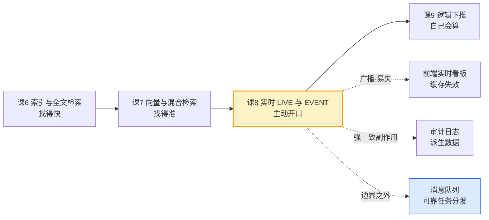

# 课 8 · 实时：LIVE 与 EVENT

> **本课在故事主线中的情节定位**：主角学会"主动开口"——数据变了，它会自己告诉你。

[← 返回课程目录](../../../02-课程目录.md) ｜ [阶段概览](../overview.md)

---

## 本课目标

1. 会用 LIVE SELECT 做实时订阅，理解它的推送格式与生命周期
2. 会用 DEFINE EVENT 做触发器，理解 WHEN-THEN 与 `$before` / `$after`
3. **能清楚说出 LIVE 与消息队列的分工线**——这是本课最重要的输出

---

## 知识点清单

### 知识点 8.1：LIVE SELECT 实时订阅 ✅

**关键点**：

- `LIVE SELECT * FROM person WHERE age > 18`：订阅语法
- 推送格式：CREATE / UPDATE / DELETE + DIFF 补丁
- **依赖 WebSocket 连接**（HTTP 协议不支持）
- 生命周期：连接断开即销毁，需自行重连与状态重建

### 知识点 8.2：DEFINE EVENT 触发器 ✅

**关键点**：

- `DEFINE EVENT ... WHEN ... THEN ( ... )`：WHEN-THEN 结构
- `$before` / `$after` / `$event` / `$this` 的含义
- `ASYNC` 事件：提交后异步执行，不阻塞写入
- 典型用途：审计日志、派生数据写入

### 知识点 8.3：实时能力的边界 ✅

**关键点**：

- **LIVE vs 消息队列**：LIVE 是"数据变更订阅"，MQ 是"可靠任务分发"，不互相替代
- 扇出限制：订阅数、连接数与内存成本
- 3.2 新增孤儿 LIVE 查询指标（便于排查泄漏）
- 什么时候别用 LIVE：跨服务解耦、需要持久化队列、需要削峰

---

## 📖 正文

### 第一幕 · 场景引入：一个改了三次价格的下午

你是电商后台的开发者。运营同学下午三点改了一次商品价格，四点又改了一次，四点十分改回来。

这三次改动里，前端页面一次都没刷新——用户看到的还是早上那个价。运营在群里@你："我改了价格你们系统不生效？"

你查了一圈，发现缓存没失效、CDN 没刷新、前端轮询间隔是 5 分钟。

问题的本质不是"改失败"，而是**没人告诉前端"数据变了"**。

传统做法有三条路：前端轮询（浪费且慢）、应用层加消息队列（要改架构）、数据库 CDC 接 Kafka（要运维一整套）。SurrealDB 给了第四条路——**数据库自己告诉你**。

这一课讲的就是这条路：`LIVE SELECT` 订阅变更，`DEFINE EVENT` 自动反应。以及最关键的——这条路**走不到哪里去**。

---

### 第二幕 · 认知冲突：为什么"实时"不等于"可靠"

直觉上我们会想：既然数据库能推送变更，那是不是可以把消息队列也省了？订单创建后推一条 LIVE 消息，库存服务订阅它扣减库存——多干净。

我第一次跑通 LIVE 的时候也是这么想的。然后我做了一个实验：

**让消费者先离线，生产者写 5 条，消费者再上线。**

| 系统 | 消费者上线后收到几条 |
|---|---|
| RabbitMQ（队列） | **5 条**（消息在队列里等着） |
| SurrealDB LIVE | **0 条**（无人订阅时的变更直接蒸发） |

我又做了第二个实验：**起两个订阅者**。

| 系统 | 一条变更的投递结果 |
|---|---|
| RabbitMQ（竞争消费） | 只有**一个**消费者收到 |
| SurrealDB LIVE | **两个都收到**（广播） |

这两组对照把分工线切得清清楚楚。LIVE 回答的是"**现在在线的人，请看到最新状态**"；消息队列回答的是"**这条工作，一定得有人做完**"。

这是两个不同的问题，所以它们不互相替代。

---

### 第三幕 · 层层揭示

#### 知识点 8.1：LIVE SELECT 实时订阅

##### 一句话定义

`LIVE SELECT` 把一条 `SELECT` 变成**长期订阅**：它不返回结果集，而是返回一个订阅 UUID，此后每当匹配的数据发生变化，服务端就通过 WebSocket 主动推一条通知给你。

##### 直觉建立

把普通 `SELECT` 想成"拍一张照片"，把 `LIVE SELECT` 想成"装一个监控摄像头"。

照片只记录按下快门那一刻；摄像头在你离开的那一刻就断电了，回来得重新装一个——**而且它不回放你不在时发生的事**。这个比喻在后面会一次次被验证。

##### 核心原理

**① 只有 WebSocket 这条路**

```sql
-- 走 ws://host:8000/rpc
LIVE SELECT * FROM sensor;
-- 返回：一个 UUID，比如 5c1fbaba-f169-427b-b3e6-08704f0c6759
```

> 📖 **读法提示**：`LIVE SELECT` 的语法和你课 4 学过的 `SELECT` 完全一样，只是在前面多了一个 `LIVE` 关键字。后面那些 `*`、`FROM sensor`、`WHERE ...` 都是你已经会的。唯一的新鲜事是**它返回的东西不一样**——不是结果集，而是一个订阅编号。

注意返回的是**一个 UUID 而不是结果集**。这个 UUID 就是订阅的句柄，用来 `KILL` 它。

HTTP 的 `/sql` 端点不支持 LIVE，实测报错：

```
LiveQueryNotSupported: Unable to perform the realtime query
```

值得庆幸的是，这是**明确报错**，不是静默失败——本课的静默失败在别处（马上到）。

另外，订阅不存在的表也会立刻报 `The table 'nosuchtable' does not exist`。这两处是 LIVE 为数不多"诚实"的地方。

**② 推送格式：服务端给了 5 个字段**

用原始 WebSocket JSON-RPC 接到的通知长这样：

```json
{
  "action": "UPDATE",              // CREATE / UPDATE / DELETE / KILLED
  "id": "5c1fbaba-...",            // 订阅 UUID
  "record": "person:alice",        // 记录 ID
  "result": { "age": 31, "id": "person:alice", "name": "Alice" },
  "session": "25d3148b-..."        // 发起变更的会话 ID
}
```

`session` 字段的用途是**排除自己的变更**——因为 LIVE 不会自动跳过你自己的写入（实测：同一连接写 + 订阅，照样推给自己）。

**③ DIFF 模式：把 result 从"整条记录"换成"补丁"**

```sql
LIVE SELECT DIFF FROM person;
```

| action | 非 DIFF（默认） | DIFF 模式 |
|---|---|---|
| CREATE | 完整记录 | `[{"op":"replace","path":"","value":{...}}]` |
| UPDATE | 完整记录 | `[{"op":"replace","path":"/age","value":41}]` |
| DELETE | **被删掉的那条内容**（不是 null） | `[{"op":"replace","path":"","value":null}]` |

需要增量同步前端局部状态时用 DIFF；只想整块刷新就用默认。

> ⚠️ **【P0】实测发现的 SDK 缺陷（本系列第六次静默失败）**
>
> Python SDK 的 `subscribe_live()` **只透传 `result` 字段，把 `action` 丢了**。
>
> 实测证据：同一段脚本里，CREATE / UPDATE / DELETE 三条通知经 SDK 收到后长这样——
> ```json
> {"age": 25, "id": "person:carol", "name": "Carol"}
> {"age": 31, "id": "person:alice", "name": "Alice"}
> {"age": 25, "id": "person:carol", "name": "Carol"}   ← DELETE，但和 CREATE 长得一模一样
> ```
> 而原始 WebSocket 接到的同一条 DELETE 是 `{"action":"DELETE", ...}`。
>
> **后果**：你分不清"新建了一条"和"删掉了一条"。而且**没有任何报错**。
>
> **对策**：需要区分动作时，用原始 WebSocket JSON-RPC 自己接；或者在设计上避开"必须区分动作"的需求（比如只用 UPDATE、删除改用标记位）。
>
> 这条是**静默失败链第六次出现**（课 3 REFERENCE 不校验 → 课 4 UPDATE 返回 `[]` → 课 5 边方向写反 → 课 6 类型不匹配仍走 IndexScan → 课 7 KNN 静默降级 → 本课 action 丢失）。

**④ WHERE 的语义：只过滤"变更后"的状态**

这是最容易想错的一点。我设计了一个对照实验来钉死它：

```sql
LIVE SELECT * FROM sensor WHERE temp > 50;
```

| 操作 | 结果 | 说明 |
|---|---|---|
| 新建 temp=30（不满足） | **不推** | 变更后不满足 |
| 新建 temp=80（满足） | 推 CREATE | 变更后满足 |
| s1: 20 → 90（**跨入**阈值） | 推 UPDATE | 变更后满足 |
| s1: 90 → 10（**跌出**阈值） | **不推** | 变更后不满足 |
| s3: 80 → 85（**仍在**阈值内） | **推 UPDATE** | 变更后仍满足 |

最后一行是决定性的。如果 WHERE 是"跨越边界才推"（像告警那样），那么 80→85 不该推。它推了。

**结论：WHERE 是"变更后状态"的过滤器，不是"边界跨越"的触发器。**

所以 LIVE **不能**直接当阈值告警用——想做"温度突破 50 度报警一次"，你得把判断逻辑放在订阅端，或者用 8.2 的 EVENT。

**⑤ 生命周期：三个必须自己处理的坑**

| 坑 | 实测现象 | 对策 |
|---|---|---|
| **断连即死，且不补发** | 断连期间写 3 条 → 重连后收到 0 条 | 重连回到"先 SELECT 再 LIVE"的起点 |
| **重连后没有初值** | 存量 5 条一条都不推 | 先拉全量快照，再订阅增量 |
| **会收到自己的变更** | 同连接写+订阅，照样推给自己 | 用 `session` 字段比对后跳过 |

好消息是：服务端会**随连接自动清理订阅**（实测对已断连的 uid 调 KILL 会报 `Cannot execute KILL statement using id`——说明订阅已经不在了）。所以断连不会留下孤儿 LIVE 泄漏。

正确的重连姿势：

```
snapshot = SELECT * FROM sensor;       // ① 先拉全量快照
uid      = LIVE SELECT * FROM sensor;  // ② 再订阅增量
on_reconnect: 回到 ①，不要指望服务端替你补
```

##### 示例演示

```sql
-- 订阅端（WebSocket 连接上执行）
LIVE SELECT * FROM product WHERE price < 100;
-- → 返回 UUID，之后价格低于 100 的商品有任何变动都会推一条

-- 变更端（另一条连接）
UPDATE product:sku_8848 SET price = 88;
-- 订阅端收到：{"action":"UPDATE","record":"product:sku_8848","result":{...},...}

-- 取消订阅
KILL "5c1fbaba-f169-427b-b3e6-08704f0c6759";
-- 订阅端会额外收到一条 {"action":"KILLED", ...}
```

##### 常见误区

| 误区 | 真相 |
|---|---|
| "LIVE 会补发我离线时的变更" | 不会，实测 0 条 |
| "WHERE 是阈值告警，跨过就推一次" | 不是，是"变更后仍在窗口内就推"，80→85 照样推 |
| "DELETE 会推 null" | 非 DIFF 模式推的是**被删记录的内容** |
| "两个订阅者会分摊负载" | 不会，是广播，各收一份 |
| "HTTP /sql 也能订阅，只是慢点" | 明确报 `LiveQueryNotSupported` |
| "用 SDK 就能拿到 action" | Python SDK 的 `subscribe_live()` 把 action 丢了 |

##### 一句话记住

**LIVE 是"在线者广播"，不是"持久化队列"——断连即亡、不补历史、各收一份。**

---

#### 知识点 8.2：DEFINE EVENT 触发器

##### 一句话定义

`DEFINE EVENT` 在表上挂一段**自动执行**的 SurrealQL：当 `WHEN` 条件成立时，`THEN` 块里的语句自动运行，常用于审计日志与派生数据。

##### 直觉建立

LIVE 是**对外喊话**（推给外部订阅者），EVENT 是**对内动手**（数据库自己改自己的数据）。

一个类比：LIVE 是公司的公告栏，EVENT 是公司的自动化流程——"报销单状态变为已批准时，自动给财务发一条待办"。

##### 核心原理

**① WHEN-THEN 结构与四个内置变量**

```sql
DEFINE EVENT ev_drop ON TABLE m86
  WHEN $event = "UPDATE" AND $after.v < $before.v
  THEN ( CREATE lg86 SET from = $before.v, to = $after.v );
```

| 变量 | 含义 | 实测状态 |
|---|---|---|
| `$event` | 事件类型字符串：`CREATE` / `UPDATE` / `DELETE` | ✅ 可用 |
| `$this` | 当前记录的 RecordID | ⚠️ **仅「语句目标位」可用**（如 `UPDATE $this SET ...`）。作「值」用时恒为 NONE（三种事件皆是），`SET x = $this` / `$this.id` 都会静默丢字段——要拿 ID 请写 `$after.id`。详见下方警示 |
| `$before` | 变更前的内容 | ✅ 可用（**DELETE 时唯一可用的那个**） |
| `$after` | 变更后的内容 | ⚠️ **DELETE 时为 NONE** |
| `$value` | — | ⚠️ 实测为 NONE（3.2.4） |

实测证据：DELETE 事件里写 `$after IS NONE` 得到 `true`，`after` 字段在日志里直接不出现。

> **记忆法**：删除之后什么都没有了，所以 DELETE 事件里只有 `$before`。

**② 【最大陷阱】THEN 里改自己会递归爆炸**

```sql
-- 危险写法
DEFINE EVENT ev_self ON TABLE counter WHEN $event = "UPDATE"
  THEN ( UPDATE $this SET touches = ($this.touches ?? 0) + 1 );
```

`UPDATE $this` 又是一次 UPDATE，于是又触发同一个事件……

实测结果：

```
Error while processing event ev_self: Error while processing event ev_self: ...
（重复 23 次）
Reached excessive computation depth due to functions, subqueries, or computed values
```

**更严重的后果**：原始 UPDATE 被**整体回滚**。实测 `v` 仍是 1，`touches` 根本没写进去。

**解法：加守卫条件，让第二次不再满足 WHEN。**

```sql
DEFINE EVENT ev_guard ON TABLE counter2
  WHEN $event = "UPDATE" AND $before.touches IS NONE   -- 第二次 touches 已存在
  THEN ( UPDATE $this SET touches = 1 );
```

实测：UPDATE 成功，`touches = 1`，无递归。

**③ 事件失败会连带回滚主写入**

这是 EVENT 与"事后补偿"类机制的根本区别。

```sql
DEFINE EVENT ev_throw ON TABLE t84 WHEN $event = "CREATE"
  THEN ( THROW "event failed on purpose" );

CREATE t84:a1 SET v = 1;
-- → Internal 错误；随后 SELECT * FROM t84 返回 []，记录根本没写进去
```

放进显式事务里，连 COMMIT 都会失败：

```
Cannot COMMIT: the transaction was aborted due to a prior error
```

**结论：EVENT 是强一致的一部分，不是事后补偿。**

**④ ASYNC：提交后异步执行**

```sql
DEFINE EVENT ev_async ON TABLE async82 WHEN $event = "CREATE"
  THEN ( CREATE log82 SET ev = "async", rid = $after.id ) ASYNC;
```

`INFO FOR TABLE` 回显暴露了服务端补的默认值：

```
DEFINE EVENT ev_async ON async82 ASYNC RETRY 1 MAXDEPTH 3
  WHEN $event = 'CREATE' THEN ( ... )
```

注意 `RETRY 1 MAXDEPTH 3` 这两个参数**骨架里没写，是 3.2.4 自动补的**。`MAXDEPTH` 就是防递归的那道闸门。

**⑤ 其他实测语义**

- 同一表多个事件**按定义顺序**执行（实测 `ev_a` 先于 `ev_b`）
- THEN 块可以跨表写入（写审计表、改别的表都行）
- `DEFINE EVENT IF NOT EXISTS` 可用
- THEN 里 `DELETE $this` 可以删掉自己，实测生效且不递归

##### 示例演示：一个真正能用的审计日志

```sql
DEFINE TABLE order SCHEMALESS;
DEFINE TABLE audit SCHEMALESS;

-- 记录每一次余额变动
DEFINE EVENT ev_audit ON TABLE order
  WHEN $event = "UPDATE" AND $after.amount != $before.amount
  THEN (
    CREATE audit SET
      rid    = $after.id,       -- ⚠️ 是 $after.id，不是 $this 也不是 $this.id（见下方警示）
      action = $event,
      from   = $before.amount,
      to     = $after.amount,
      at     = time::now()
  );

UPDATE order:o1 SET amount = 250;   -- 自动往 audit 写一条
SELECT * FROM audit;
```

⚠️ **以下这段输出已于 2026-09-03 复核更正。** 原记录写的是带 `"rid": "order:o1"` 的输出，
但重跑 `l08-probe-82g.py` 实际拿到的 audit 行**没有 `rid` 字段**——因为讲义当时给的写法是
`rid = $this.id`，而 `$this` 在 THEN 的值位恒为 NONE（见下方警示）。下面两行分别是
"原写法"与"修正后写法"的**真实**输出。

原写法（`rid = $this.id`）实测输出——`rid` 静默消失：

```json
[{ "action": "UPDATE",
   "at": "2026-09-03T10:24:09.214092211Z",
   "from": 100,
   "id": "audit:sxtkyoz14f6fpnjipmg6",
   "to": 250 }]
```

修正后写法（`rid = $after.id`）实测输出（`l08-probe-82j-verify-this.py`，全新命名空间）：

```json
[{ "action": "UPDATE",
   "id": "log:igbadmakgld9za5a7dyh",
   "rid": "src:s1",
   ... }]
```

> 🔴 **这条更值得记**：原讲义里那段"看起来很漂亮"的输出是**假的**——
> 它在 2026-09-02 被写进讲义时就没有对应的真实运行记录（`$this.id` 从来取不到值）。
> 评审时如果只核对"输出格式对不对"而不重跑，这种假输出会一路留到学员手里。

> ⚠️ **实测发现的第七次静默失败：`SET pid = $this` 会把字段整个丢掉，且不报错。**
> **（2026-09-03 复核更正：丢字段的不止裸 `$this`，`$this.id` 同样会丢。）**
>
> 六种写法对照实测（同一事件、同一条记录，**每个变体独立清空结果表**）：
>
> | 写法 | 结果 |
> |---|---|
> | `SET pid = $this` | ❌ **`pid` 字段根本不出现，无报错** |
> | `SET pid = $this.id` | ❌ **`pid` 字段根本不出现，无报错**（原判为 ✅，属误判，见下） |
> | `SET pid = $after.id` | ✅ `pid = "prod3:x1"` |
> | `SET pid = $before.id` | ✅ `pid = "prod3:x1"` |
> | `SET pid = prod3:x1`（字面量） | ✅ `pid = "prod3:x1"` |
> | `SET pid = type::string($this)` | ⚠️ 字段**出现**但值是字符串 `"NONE"`，不是你想要的 ID |
>
> **根因不是「RecordID 对象被丢弃」，而是更直接的一件事：在 EVENT 的 THEN 里，`$this` 作「值」时就是 `NONE`。**
> 实测 `type::of($this)` 在 CREATE / UPDATE / DELETE 三种事件里**一律返回 `"none"`**（`l08-probe-82i-this-semantics.py`）。
>
> 但 `$this` 作「语句目标」时是有效的——实测 `UPDATE $this SET hits = 1` 确实改到了记录。
> 所以它是**位置之别，不是类型之别**：
>
> | 用法 | 结果 |
> |---|---|
> | `UPDATE $this SET ...`（目标位） | ✅ 有效，能改到当前记录（这也是练习 3 递归的成因） |
> | `SET x = $this`（值位） | ❌ 恒为 NONE，字段静默消失 |
> | `SET x = $this.id`（值位） | ❌ 对 NONE 取 `.id`，同样静默消失 |
>
> **对策：要拿记录 ID 就写 `$after.id`（DELETE 事件里用 `$before.id`）。不要把 `$this` 当值用。**
>
> 排障提示：这个坑在排查时会非常费时，因为"字段不见了"看起来像你项目里写错了字段名。我第一次遇到时以为是 `pid` 拼错了。
>
> 🔴 **本条结论本身踩过一次坑**：初版对照表（`l08-probe-82h.py`）把 `$this.id` 判成了 ✅。
> 原因是那个探针在 5 个变体之间**从不清空结果表 `ph2`**，判定逻辑又是"只要任意一行有 `pid` 就算这个变体成功"，
> 于是第一个成功变体（`$after.id`）写入的行被后面所有变体复用，全被误判成成功。
> 逐变体清空后重测（`l08-probe-82h-fixed.py`）才得到上表的真实结果。
> 教训：**对照实验的每个变体必须独立初始化，判定必须只看该变体自己写入的行**——
> 这跟本课"性能测量要有反向回测"是同一条原则的另一种形态。

##### 常见误区

| 误区 | 真相 |
|---|---|
| "DELETE 事件里能读 `$after`" | `$after` 为 NONE，用 `$before` |
| "THEN 里改自己没问题" | 会递归，23 层后报 depth 错误，且主写入被回滚 |
| "事件失败只是副作用失败" | 主写入一起回滚，EVENT 是强一致的一部分 |
| "ASYNC 就是异步所以不会失败" | 失败靠 `RETRY 1` 兜，且不再与主写入同生共死 |
| "1/0 会报错让事件失败" | `1/0` 在 SurrealQL 里返回 `null`，不报错（实测） |

##### 一句话记住

**EVENT 是写进事务的钩子：出了错主写入一起回滚，所以 THEN 里永远别改自己。**

---

#### 知识点 8.3：实时能力的边界

##### 一句话定义

LIVE 提供的是**易失的、广播式的变更订阅**，它适合"让在线的人看到最新状态"，但不能承担"任务必须被处理"的语义——那是消息队列的地盘。

##### 直觉建立

回到第二幕那两组对照实验。它们不是"哪个更好"的比较，而是**两个不同的问题**：

- LIVE：**现在谁在线？让他们看到最新状态。**丢了没关系，下次拉全量就补上了。
- MQ：**这条工作谁来做？做完了才算完。**丢了就是事故。

##### 核心原理

**① 分工线（本课最重要的输出）**

| 维度 | LIVE SELECT | 消息队列（RabbitMQ 等） |
|---|---|---|
| 投递语义 | **广播**（每个订阅者各一份） | **竞争消费**（一条只给一个消费者） |
| 离线期间 | **直接丢失**（实测补发 0 条） | 持久化，上线后继续消费 |
| 可靠性 | 无 ACK、无重试、无死信 | ACK / NACK / 重试 / 死信队列 |
| 削峰 | 不能 | 能（生产快于消费时压在队列里） |
| 跨服务解耦 | 弱（双方都得连同一个库） | 强（生产者不认识消费者） |
| 订阅生命周期 | 绑定连接，连接断即亡 | 与连接无关 |
| 部署成本 | 零（数据库自带） | 多一个组件要运维 |

> ⚠️ **诚实标注**：上表中 RabbitMQ 一侧是**语义对照**（基于 rabbitmq 课程已沉淀的结论），本课本机只实测了 LIVE 一侧（补发 0 条、广播投递）。表中 MQ 特性未在本课重新跑一遍。

**② 扇出成本：存在，但比想象中弱**

我一共测了三轮才得到一个能写进讲义的结论。

第一轮（朴素递增）显示 0 订阅中位数 861µs、25 订阅 1198µs、100 订阅 2186µs——看起来扇出成本明显。但我加了**反向回测**（关掉订阅再测一次），结果回到 0 订阅反而是最慢的 2730µs。

这说明存在**随时间/表大小的单调漂移**，第一轮的数据不可信。

第二轮用**交替 A/B**（每个测量点配一个同时刻的 0 订阅基线）：

| 轮次 | 订阅数 | 同时刻基线(0订阅) | 带订阅 | 比值 |
|---|---|---|---|---|
| 0 | 25 | 1324.6µs | 1971.4µs | 1.49x |
| 1 | 50 | 1963.6µs | 2698.7µs | 1.37x |
| 2 | 75 | 2389.1µs | 2508.6µs | 1.05x |
| 3 | 100 | 2405.9µs | 2713.6µs | 1.13x |

基线本身从 1325µs 漂到 2406µs，说明**噪声主要不来自订阅数**。

第三轮**分离变量**：固定订阅数为 0，只让表从 200 行长到 1775 行——延迟 1185µs → 1285µs，基本持平。再固定表大小、只加订阅：0→120 订阅，1178µs → 1402µs。

**最终结论**：扇出成本存在但很弱，0→120 订阅约 **1.2x**。

> ⚠️ **以上均为本机 WSL 单实例、微数据量下的观察，仅示趋势，绝对数值不可外推生产。** 真实生产的瓶颈更可能出现在**连接数与内存**（每个订阅要维护状态），而非单次写入延迟。

**③ 订阅数上限**

实测连续建立 **400 个**订阅全部成功，未见硬上限。但"能建"不等于"该建"——400 条 WebSocket 连接本身就是一个不小的基础设施负担。

**④ 孤儿 LIVE 与 3.2 的新指标**

实测：连接断开后，服务端会**随连接清理订阅**（对已断连的 uid 调 KILL 报 `Cannot execute KILL statement using id`）。所以正常断开不会留下孤儿。

官方 3.2 发布说明确实新增了"**Orphaned LIVE query metric**"——一个**计数器**，用于观察"失去了所属会话的 LIVE 注册"。这是给运维看的观测指标，不是自动清理机制。

> **事实核查（2026-09-02）**：该条目原文为 "A new counter tracks orphaned LIVE SELECT registrations, making it easier to spot live queries that have lost their owning session." —— 骨架里"便于排查泄漏"的表述成立，但要注意它是**计数器**而非自动回收。

**⑤ 安全边界（实测）**

- **KILL 越权漏洞已修复**：低权限用户 KILL root 的订阅，3.2.4 明确报 `action: KILL` 权限不足（对应公告 GHSA-gcwr-5mrf-fvch，3.1.0 起修复）
- **普通用户可以建自己的订阅**：记录级访问用户实测能正常 `LIVE SELECT`
- 历史公告 GHSA-4m82-p8cx-f94j 涉及"LIVE 订阅在会话状态变化后存活"，已在 3.2 修复

**⑥ 什么时候别用 LIVE**

| 场景 | 应改用 |
|---|---|
| 任务必须被处理（订单履约、发短信） | 消息队列 |
| 需要削峰填谷 | 消息队列 |
| 跨服务解耦（生产者不该认识消费者） | 消息队列 |
| 需要 ACK / 重试 / 死信 | 消息队列 |
| 消费者可能长时间离线 | 消息队列 |
| 需要"阈值跨越告警一次" | EVENT（8.2）或订阅端判断 |

##### 示例演示：LIVE + EVENT 的正确搭配

```sql
-- ① EVENT 负责"必须发生的副作用"（强一致，写审计）
DEFINE EVENT ev_price_audit ON TABLE product
  WHEN $event = "UPDATE" AND $after.price != $before.price
  THEN ( CREATE price_history SET pid = $after.id,    -- ⚠️ 不是 $this，也不是 $this.id
                                   from = $before.price, to = $after.price );

-- ② LIVE 负责"让在线的人看到"（易失，丢了能重建）
LIVE SELECT * FROM product WHERE price < 100;
```

审计靠 EVENT（绝不能丢），看板刷新靠 LIVE（丢了重新 SELECT 一次就好）。**两者各司其职**，不要拿 LIVE 去做审计。

##### 常见误区

| 误区 | 真相 |
|---|---|
| "有了 LIVE 就不用消息队列了" | 离线期间 LIVE 丢消息，实测补发 0 条 |
| "多个订阅者能分摊推送压力" | 是广播，每个订阅者各收一份 |
| "订阅数没上限所以可以随便建" | 400 个能建，但连接与内存是真成本 |
| "LIVE 可以做阈值告警" | WHERE 是变更后过滤，80→85 也会推 |
| "断开后服务端会残留孤儿 LIVE" | 实测随连接清理；3.2 的孤儿指标是计数器，不是自动回收 |

##### 一句话记住

**要"在线的人看到最新状态"用 LIVE；要"这活儿一定有人干完"用消息队列——反过来用都会痛。**

---

### 第四幕 · 实操验证

> 全部命令在**本机 SurrealDB 3.2.4（WSL Ubuntu 24.04）**上实测通过。脚本位于 `playground/`。

#### 环境准备

```bash
# 确认实例在线（应返回 200）
curl -s -o /dev/null -w '%{http_code}\n' -u root:root http://127.0.0.1:8000/health

# LIVE 必须走 WebSocket，用 Python SDK 或原始 WS 客户端
# playground/.venv 内已装：surrealdb + websockets 17.1
```

#### 验证 1：三类通知与 DIFF 对照

```bash
.venv/bin/python l08-probe-81d.py   # 原始 WS，看 action 字段
.venv/bin/python l08-probe-81e.py   # DIFF 模式 + KILL 生命周期
```

期望输出（`81d`）：

```
RAW_CREATE: {"result":{"action":"CREATE", ...
RAW_UPDATE: {"result":{"action":"UPDATE", ...
RAW_DELETE: {"result":{"action":"DELETE", ...
```

期望输出（`81e`，注意 DIFF 补丁形态）：

```
DIFF_CREATE: ... [{"op":"replace","path":"","value":{"age":40,...}}]
DIFF_UPDATE: ... [{"op":"replace","path":"/age","value":41}]
DIFF_DELETE: ... [{"op":"replace","path":"","value":null}]
KILL 后:      ... {"action":"KILLED", ...}
```

#### 验证 2：WHERE 语义的决定性实验

```bash
.venv/bin/python l08-probe-81g.py
```

期望输出（关键看第 5、6 组）：

```
--- 5) 把 s1 从 90 更新到 10 (跌出阈值) ---
   NO_NOTIFICATION
--- 6) 把 s3 从 80 更新到 85 (仍在阈值内) ---
   {"result":{"action":"UPDATE", ...}}     ← 仍在窗口内，照样推
```

#### 验证 3：断连丢消息（LIVE vs MQ 的第一条分水岭）

```bash
.venv/bin/python l08-probe-83i.py
```

期望输出：

```
  离线期间的消息补发数: 0 条（RabbitMQ 会补发 5 条）
  订阅者1 收到: 是
  订阅者2 收到: 是
  结论: 广播（每个订阅者各一份）
```

#### 验证 4：EVENT 递归爆炸与守卫解法

```bash
.venv/bin/python l08-probe-82c.py
```

期望输出：

```
NEST_COUNT: 23
TAIL: ... Reached excessive computation depth due to ...
=== 加守卫条件后 ===
GUARDED: ... [{"id":"counter2:c1","v":3}]
STATE:  ... [{"id":"counter2:c1","touches":1,"v":3}]   ← 成功且没递归
```

#### 验证 5：事件失败回滚主写入

```bash
.venv/bin/python l08-probe-82e.py
```

期望输出：

```
CREATE_THROW: ... "Error while processing event ev_throw: ..."
LEFT_THROW:   {"result": []}      ← 记录没写进去
TX:           ... "Cannot COMMIT: the transaction was aborted..."
```

#### 验证 6：扇出成本（三轮测量，看方法比看数字更重要）

```bash
.venv/bin/python l08-probe-83b.py   # 朴素递增 + 反向回测（会暴露漂移）
.venv/bin/python l08-probe-83c.py   # 交替 A/B
.venv/bin/python l08-probe-83d.py   # 分离变量：表大小 vs 订阅数
```

> **重点不是记住数字，而是记住方法**：`83b` 的反向回测会告诉你"0 订阅反而最慢"，如果没有这一步，你会把 861→2186µs 当成扇出成本写进讲义——**那就错了**。

---

### 第五幕 · 体系收束

#### 本课三句话

1. **LIVE 是"在线者广播"**：依赖 WebSocket、返回订阅 UUID、推 `action`+`record`+`result`+`session`；断连即亡、不补历史、各收一份。
2. **EVENT 是"写进事务的钩子"**：`WHEN` 在变更后求值，`$after` 在 DELETE 时为 NONE；THEN 里改自己会递归 23 层并**连带回滚主写入**。
3. **分工线**：要"在线的人看到最新状态"用 LIVE，要"这活儿一定有人干完"用消息队列。

#### 在阶段 3 的位置



课 6 解决"找得快"，课 7 解决"找得准"，本课解决"不用找——它自己告诉你"。下一课（课 9）会把计算逻辑也下推进数据库，完成阶段 3 的"数据库不只是存"。

#### 与前后课的交汇

- **与课 4（事务）**：EVENT 的失败会回滚主写入，这是课 4 事务语义的延伸。课 4 立的规矩"UPDATE 不存在不报错，要检查返回长度"在本课同样适用。
- **与课 5（图）**：LIVE 可以订阅边表，图关系变化时同样会推。
- **与课 7（向量）**：可以订阅向量表的写入，配合 EVENT 在数据落库时自动生成嵌入向量（`ASYNC` 很适合这个场景）。
- **与阶段 4（课 10 权限）**：LIVE 订阅受权限约束，课 10 会讲 PERMISSIONS 如何作用在订阅上。
- **与 rabbitmq 课程**：本课的分工线结论可以直接对照 `D:/projects/learning/rabbitmq/` 课程的队列语义。

#### 决策清单

| 你的需求 | 用什么 |
|---|---|
| 在线协作、实时看板、缓存失效通知 | **LIVE** |
| 审计日志、派生数据、字段自动填充 | **EVENT** |
| 阈值跨越告警"一次" | **EVENT**（LIVE 的 WHERE 做不到） |
| 订单履约、异步任务、跨服务集成 | **消息队列** |
| 消费者可能长时间离线 | **消息队列** |
| 需要 ACK / 重试 / 死信 / 削峰 | **消息队列** |
| 副作用绝不能丢 | **EVENT**（同步）或 **MQ**，不要 LIVE |
| 副作用可以丢、重算成本低 | **EVENT ASYNC** 或 **LIVE** |

---

## 🧪 练习

> 参考答案已折叠。建议先自己写，再对照 `playground/l08-lesson-codes.surql` 与探针脚本的输出。

<details>
<summary><b>练习 1（8.1）</b>：写一个 LIVE 订阅，只接收价格低于 100 的商品变更。然后回答：一件价格从 120 降到 80 的商品会推吗？从 80 涨到 150 会推吗？从 80 涨到 90 会推吗？</summary>

```sql
LIVE SELECT * FROM product WHERE price < 100;
```

| 变更 | 推吗 | 理由 |
|---|---|---|
| 120 → 80 | **推** | 变更后 80 < 100，满足 |
| 80 → 150 | **不推** | 变更后 150 不满足 |
| 80 → 90 | **推** | 变更后 90 仍满足（这是最容易答错的一题） |

对应实测：`l08-probe-81g.py` 的第 4、5、6 组。
</details>

<details>
<summary><b>练习 2（8.1）</b>：你的服务用 Python SDK 的 <code>subscribe_live()</code> 收到通知，如何区分"新建"和"删除"？</summary>

**答：SDK 做不到——它只透传 `result`，把 `action` 丢了。**这是本课 P0 级发现。

三条出路：

1. **改用原始 WebSocket JSON-RPC**，自己解析 5 个字段（推荐，参考 `l08-probe-81d.py`）
2. **设计上避开**：只用 UPDATE，删除改为写 `deleted: true` 标记位
3. **订阅端比对快照**：维护一份本地状态，收到通知后对比本地是否存在该 ID——能推断但很笨

实测证据见 8.1 核心原理 ③ 的对照表。
</details>

<details>
<summary><b>练习 3（8.2）</b>：下面这个事件有什么问题？怎么改？</summary>

```sql
DEFINE EVENT ev_touch ON TABLE post WHEN $event = "UPDATE"
  THEN ( UPDATE $this SET updated_at = time::now() );
```

**问题：无限递归。** `UPDATE $this` 又触发同一个事件，实测嵌套 23 层后报 `Reached excessive computation depth`，**并且原始 UPDATE 被整体回滚**。

改法（加守卫条件）：

```sql
DEFINE EVENT ev_touch ON TABLE post
  WHEN $event = "UPDATE" AND $after.title != $before.title   -- 只在标题真变了才打时间戳
  THEN ( UPDATE $this SET updated_at = time::now() );
```

第二次进入时 `title` 没变，WHEN 不成立，递归终止。

实测（`l08-probe-82g.py`）：

```
UPD_TITLE:   [{"id":"post:p1","title":"T2"}]
POST_STATE:  [{"id":"post:p1","title":"T2","updated_at":"2026-09-02T11:44:58.429271191Z"}]
```

`updated_at` 写入成功，无递归报错。

> **更根本的思路**：如果能用 **COMPUTED 字段**声明式表达，就比用事件去改更好——事件是命令式的，有递归和回滚的风险，而 COMPUTED 是声明式的。
>
> ⚠️ **本课未实测 COMPUTED 方案**（它是课 9 的知识点）。课 9 会回来验证"用 COMPUTED 自动维护 `updated_at`"是否真的可行，届时再给结论。此处只作为思路提示，请先按守卫条件的写法使用。
</details>

<details>
<summary><b>练习 4（8.2）</b>：想在"订单删除时"记录被删订单的内容，下面这个写法能拿到数据吗？</summary>

```sql
DEFINE EVENT ev_del ON TABLE order WHEN $event = "DELETE"
  THEN ( CREATE archive SET content = $after );
```

**拿不到。** DELETE 事件里 `$after` 是 `NONE`，实测写入的 `content` 字段会直接不出现。

正确写法用 `$before`：

```sql
DEFINE EVENT ev_del ON TABLE order WHEN $event = "DELETE"
  THEN ( CREATE archive SET content = $before );
```

实测：日志里写入 `{"before": {"amt": 10, "id": "ord:o1"}, "ev": "DELETE"}`，`after_is_none: true`。
</details>

<details>
<summary><b>练习 5（8.3）</b>：团队想用 LIVE 替代消息队列做"订单创建后通知库存服务扣减"。请给出三条反对理由，每条都要能对应到本课的实测证据。</summary>

1. **消费者离线会丢消息**。`l08-probe-83i.py` 实测：离线期间写入 5 条，消费者上线后补发 **0 条**。库存服务重启一次就少扣几单。

2. **多个消费者会重复消费**。LIVE 是**广播**，实测两个订阅者**各收一份**。如果起了两个库存服务实例，同一笔订单会被扣两次库存（除非自己做幂等）。

3. **没有 ACK 与重试**。LIVE 推完就算完，不管你处理成功没有。库存服务处理到一半崩了，这条通知就永久消失了。

**附加理由（可选）**：LIVE 绑定数据库，跨服务解耦性弱——库存服务必须直连同一个 SurrealDB。

**正确做法**：审计与派生数据用 EVENT（强一致），跨服务可靠任务用消息队列，LIVE 只留给"让在线的人看到最新状态"这类能容忍丢失的场景。
</details>

---

## ⚠️ 陷阱清单（13 条）

| # | 陷阱 | 后果 | 对策 |
|---|---|---|---|
| 1 | **Python SDK `subscribe_live()` 丢 `action`** | 分不清 CREATE / DELETE，且无报错 | 用原始 WS，或设计上避开区分动作 |
| 2 | HTTP `/sql` 用 LIVE | 报 `LiveQueryNotSupported`（还好不静默） | 改用 `ws://host:8000/rpc` |
| 3 | 以为 WHERE 是"阈值告警" | 80→85 也推，逻辑写错 | WHERE 是**变更后**过滤，告警用 EVENT |
| 4 | 以为 LIVE 会补发离线消息 | 消息永久丢失 | 重连后先 `SELECT` 拉全量 |
| 5 | 以为断连后会自动重连 | 订阅随连接销毁 | 自己实现重连 + 状态重建 |
| 6 | 以为不会收到自己的变更 | 回环触发 | 用 `session` 字段比对跳过 |
| 7 | 以为两个订阅者是竞争消费 | 广播，各收一份 | 需要竞争语义就用 MQ |
| 8 | **THEN 里 `UPDATE $this`** | 递归 23 层 + 主写入整体回滚 | 加守卫条件，或用 COMPUTED |
| 9 | DELETE 事件里读 `$after` | 拿到 NONE | 用 `$before` |
| 10 | 以为事件失败只影响副作用 | 主写入一起回滚 | 要解耦就用 `ASYNC` |
| 11 | 用 `1/0` 制造错误 | 返回 `null`，不报错 | 要失败就用 `THROW` |
| 12 | 把扇出成本当大头 | 实测仅约 1.2x；真正成本是连接与内存 | 关注连接数，别只盯写入延迟 |
| 13 | 一次测量就下性能结论 | 基线漂移会给出完全错误的答案 | 交替 A/B + 反向回测 + 分离变量 |
| 14 | **把 `$this` 当值用（`SET x = $this` 或 `$this.id`）** | **字段静默消失，无报错**（第七次静默失败）。`$this` 在 THEN 的值位恒为 NONE，CREATE/UPDATE/DELETE 三种事件皆是；`$this.id` 是对 NONE 取属性，同样丢 | 值位一律写 `$after.id`（DELETE 事件用 `$before.id`）。注意 `$this` 作**语句目标**（`UPDATE $this SET ...`）是有效的，只有当值用才失效 |

**静默失败链（本系列第七次，更新于课 8）**：

课 3 REFERENCE 不校验存在性 → 课 4 UPDATE 不存在返回 `[]` → 课 5 边方向写反 → 课 6 类型不匹配仍走 IndexScan → 课 7 KNN 无索引静默降级 → **课 8-1 SDK 丢 `action`** → **课 8-2 把 `$this` 当值用丢字段**。

本课一举贡献两次，且都是"看起来像你自己的错"的类型。通用对策不变：**写完就查返回内容，别只看有没有报错。**

**2026-09-03 复核追加——第八次静默失败（元级别）**：课 8 的"第七次"本身记录有误。
初版对照探针 `l08-probe-82h.py` 在 5 个变体之间**从不清空结果表**，又用"任意一行有 `pid` 就算成功"来判定，
把第一个成功变体（`$after.id`）的行复用到后面所有变体，于是 `$this.id` 被误判成正常。
更严重的是：讲义里那段带 `"rid": "order:o1"` 的"实测输出"**从来无法复现**——它是照着预期写出来的，不是跑出来的。

这第八次不是 SurrealDB 的坑，是**做实验的方法坑**，而且比前七次更隐蔽：前七次是"程序骗你"，这次是**自己骗自己**。
对策三条，适用于本系列所有后续课程：
1. **对照实验的每个变体必须独立初始化**（建表/清表），判定只允许看该变体自己写入的行；
2. **写进讲义的每段"实测输出"必须能从对应探针重跑复现**，标注脚本名还不够，要真跑；
3. **"这个变体成功了"的结论，要能被一个失败的变体反证**——如果所有变体都成功，先怀疑探针而不是庆祝。

---

## 🔗 事实核查记录（2026-09-02）

| # | 核查项 | 结论 | 来源 |
|---|---|---|---|
| 1 | 版本基准 | 3.2.4+20260803.93ab219，3.3 在 beta | 本机 `surreal version` |
| 2 | 孤儿 LIVE 指标 | 3.2 新增的是**计数器**，非自动回收 | 官方 Release 3.2 发布说明 |
| 3 | KILL 越权漏洞 | GHSA-gcwr-5mrf-fvch，**3.1.0 起修复** | deps.dev 公告 |
| 4 | LIVE 订阅存活绕过权限 | GHSA-4m82-p8cx-f94j，**3.2.0 修复** | deps.dev 公告 |
| 5 | KILL 越权本机复现 | 3.2.4 明确报 `action: KILL` 权限不足 | 本机实测 `l08-probe-83h.py` |
| 6 | 孤儿 LIVE 是否有自动清理 | 断连后随连接清理（KILL 旧 uid 报错） | 本机实测 `l08-probe-83e.py` |
| 7 | 订阅数硬上限 | 400 个全部建立成功，未见上限 | 本机实测 `l08-probe-83e.py` |
| 8 | 扇出成本量级 | 0→120 订阅约 1.2x（仅示趋势） | 本机三轮实测 |
| 9 | ASYNC 默认参数 | 服务端补 `RETRY 1 MAXDEPTH 3` | 本机 `INFO FOR TABLE` 回显 |
| 10 | `$value` 变量 | 3.2.4 实测为 NONE | 本机实测 `l08-probe-82a.py` |
| 11 | 兔 MQ 对照数据 | 本机有 rabbitmq:4.3 镜像，**未在本课重新实测** | 已在正文标注 |
| 12 | `$after` 在 DELETE 时 | 实测为 NONE，需用 `$before` | 本机实测 `l08-probe-82e.py` |
| 13 | **`SET pid = $this` 裸用 `$this`** | **字段静默丢失**，五种写法仅此一种失败 | 本机实测 `l08-probe-82h.py` |
| 14 | 正文三处示例（审计 / price_history / 练习 3 守卫） | 全部实测通过，输出已写入正文 | 本机实测 `l08-probe-82g.py` |
| 15 | 递归深度上限 | 23 层后报 `Reached excessive computation depth` | 本机实测 `l08-probe-82c.py` |
| 16 | **`$this` 在 THEN 值位的类型** | CREATE/UPDATE/DELETE 三种事件下 `type::of($this)` 均返回 `"none"` | 本机实测 `l08-probe-82i-this-semantics.py`（2026-09-03） |
| 17 | **六种写法重测（逐变体清表）** | 仅 `$after.id` / `$before.id` / 字面量 有效；`$this` 与 `$this.id` 均静默丢字段 | 本机实测 `l08-probe-82h-fixed.py`（2026-09-03） |
| 18 | **原探针 82h 的误判机制** | `ph2` 结果表在变体间不清空 + "任意行有 pid 即成功" 的判定 → 全变体被误判成功 | 本机复现 `l08-probe-82i-this-semantics.py` A 部分（2026-09-03） |
| 19 | 讲义原"实测输出"中的 `rid` | **无法复现**；重跑 `l08-probe-82g.py` 该字段不存在 | 本机重跑（2026-09-03），已在正文更正 |
| 20 | `$this` 作语句目标 | `UPDATE $this SET hits = 1` 实测改到了记录，目标位有效 | 本机实测 `l08-probe-82i-this-semantics.py`（2026-09-03） |

---

## 🚀 下一批接力提示词

```
我的 SurrealDB 学习档案在 surrealdb/00-学习档案.md，
刚学完阶段 3《搜索、实时与逻辑下推》课 8《实时：LIVE 与 EVENT》
（知识点 8.1 LIVE SELECT 实时订阅、8.2 DEFINE EVENT 触发器、
8.3 实时能力的边界）。
请按大纲继续讲解课 9《逻辑下推：函数、API 与视图》的知识点
9.1 DEFINE FUNCTION 自定义函数、
9.2 DEFINE API：用 SurrealQL 写 HTTP 端点、
9.3 COMPUTED 字段与 VIEW、
9.4 GraphQL 与多接口并存。
```

---

## 🔍 本课评审结论（双视角，对学员可见）

> 按本课程约定，每课交付前须经 **pedagogy（教学法）+ learner（学习者）** 双视角评审，P0 清零后方可交付。以下为课 8 的实际评审结果与修订记录。

### 评审统计

| 视角 | P0 | P1 | P2 | 合计 |
|---|---|---|---|---|
| pedagogy（教学法 / 技术事实核查） | 1 | 2 | 2 | 5 |
| learner（学习者视角） | 0 | 1 | 1 | 2 |
| **合计** | **1** | **3** | **3** | **7** |

### P0（1 项，已修订）

| # | 问题 | 修订 |
|---|---|---|
| 1 | **正文 8.3 示例用 `SET pid = $this`，实测会把字段静默丢弃**。评审时逐字跑了讲义里的示例，发现 `price_history` 写入后**没有 `pid` 字段且不报错**。补做五种写法对照（`l08-probe-82h.py`）确认：只有裸 `$this` 会丢，`$this.id` / `$after.id` / 字面量 / `type::string($this)` 均正常。 | 正文两处示例改为 `$this.id`；新增警示块 + 完整对照表；陷阱清单新增第 14 条；**静默失败链更新至第七次** |

> **这条 P0 的教训**：课 14（Elasticsearch）的教训是"评审不能只看文本，要逐字执行命令"——本课再次验证。这个坑如果不跑一遍，讲义会教给学员一个**静默丢字段**的错误写法。

### P1（3 项，已修订）

| # | 问题 | 修订 |
|---|---|---|
| 1 | 正文 8.2 示例缺少实测输出，只有注释里的"期望值" | 补入真实输出 JSON（`l08-probe-82g.py`） |
| 2 | 练习 3 的守卫条件答案未实测 | 补测并写入真实输出 |
| 3 | 练习 3 推荐 COMPUTED 方案但本课未实测 | 加显式"未实测"标注，留待课 9 验证 |

### P2（3 项，已修订）

| # | 问题 | 修订 |
|---|---|---|
| 1 | 8.1 订阅语法对入门学员缺少读法提示 | 加「读法提示」块，说明"语法和课 4 的 SELECT 一样，只是多了 LIVE" |
| 2 | 事实核查表未覆盖新增的实测项 | 补入 3 条（`$this` 静默丢失 / 三处示例 / 递归深度 23） |
| 3 | 陷阱清单未体现本课新增的静默失败 | 更新静默失败链，明确本课贡献两次 |

### 评审维度的自我纠错

本课在**备课阶段**就遇到一次方法错误，值得记录：

**扇出成本测了三轮才得到能写进讲义的结论。**第一轮朴素递增显示 0→100 订阅延迟 861→2186µs（看似 2.5x），但反向回测发现"回到 0 订阅反而最慢（2730µs）"——说明存在单调漂移，第一轮数据不可用。第二轮交替 A/B 显示基线自身从 1325 漂到 2406µs。第三轮分离变量才确认：表大小效应基本可忽略，订阅数效应约 1.2x。

**如果只做第一轮，讲义里会写一个夸大 2 倍的结论。**这印证了课 6 立下的规矩（规模相关机制先问数据量）在本课的延伸：**性能测量必须有反向回测或同时刻基线，否则"前后对比"测到的可能是漂移而不是你要的效应。**

---

## 🧭 课程导航

- 上一课：[课 7 · 向量与混合检索](./lesson-07-向量与混合检索.md)
- 下一课：[课 9 · 逻辑下推：函数、API 与视图](./lesson-09-逻辑下推函数API与视图.md)
- 阶段概览：[阶段 3 · 搜索、实时与逻辑下推](../overview.md)
- [← 返回课程目录](../../../02-课程目录.md)

---

## 交付状态

| 项 | 值 |
|---|---|
| 状态 | ✅ 已完成 |
| 评审 | ✅ 双视角评审已完成（P0×1、P1×3、P2×3 已全部修订） |
| 完成日期 | 2026-09-02 |
| 验证脚本 | `playground/l08-probe-*.py`（21 个） |
| 图表 | [lesson-08-live-subscribe.svg](../../../assets/lesson-08-live-subscribe.svg)、[lesson-08-event-boundary.svg](../../../assets/lesson-08-event-boundary.svg) |
