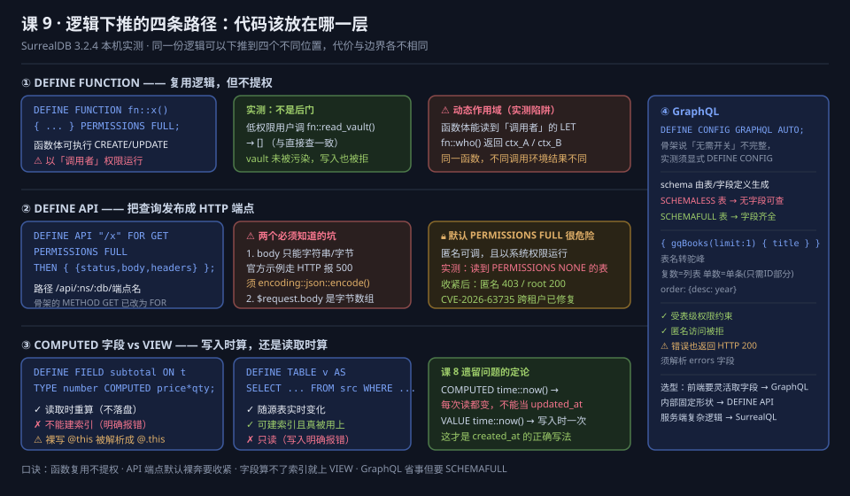
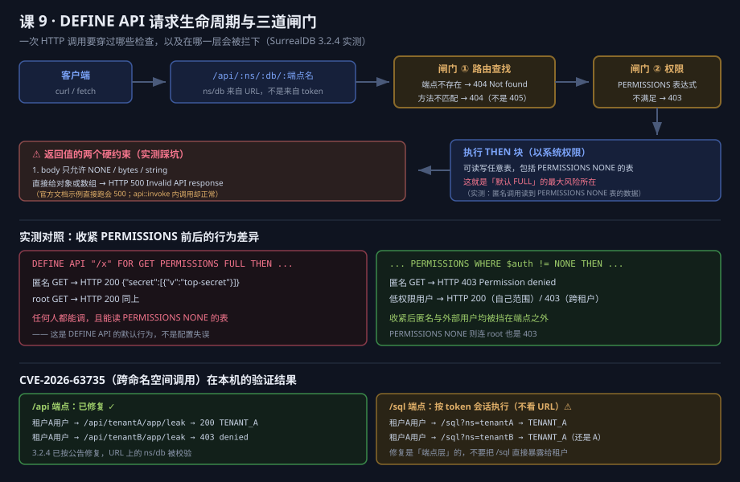

# 课 9 · 逻辑下推：函数、API 与视图

> **本课在故事主线中的情节定位**：主角学会"自己干活"——不用每次都把数据搬到应用层算。

[← 返回课程目录](../../../02-课程目录.md) ｜ [阶段概览](../overview.md)

---

## 本课目标

1. 会写 DEFINE FUNCTION 自定义函数，知道它的权限边界
2. 会用 DEFINE API 直接把查询发布成 HTTP 端点，并知道这个能力的风险
3. 理解 COMPUTED 字段与 VIEW 的差别，知道什么时候该物化
4. 能判断 GraphQL 接口该不该开

---

## 知识点清单

### 知识点 9.1：DEFINE FUNCTION 自定义函数

**关键点**：

- 函数定义语法、参数、返回值
- 在查询中调用
- **权限模型：以「调用者」权限运行**（本课实测更正骨架的"受限于创建者权限"）
- ⚠️ 动态作用域：函数体能读到调用者的 `LET` 变量
- 什么时候该写函数、什么时候该在应用层写

**状态**：✅ 已完成

---

### 知识点 9.2：DEFINE API：用 SurrealQL 写 HTTP 端点

**关键点**：

- `DEFINE API "/path" FOR GET THEN { ... }`：**3.x 语法是 `FOR`，不是 `METHOD`**
- 响应体必须是 `{ status, body, headers }`，且 **body 只允许字符串/字节**
- 权限继承模型：**默认 `PERMISSIONS FULL`，匿名可调且以系统权限运行**
- **CVE-2026-63735**（8.1 HIGH）：DEFINE API 跨命名空间漏洞，3.2.0 修复，本课实测确认
- 适用与不适用：内部小工具 vs 面向公网的正式 API

**状态**：✅ 已完成

---

### 知识点 9.3：COMPUTED 字段与 VIEW

**关键点**：

- **3.0 用 COMPUTED 取代 FUTURE**（迁移硬变更，实测 `FUTURE` 已报 Parse error）
- COMPUTED 字段：**读取时重算**（不是落盘），**不能建索引**（明确报错）
- ⚠️ 裸写 `@this` 会被解析成 `@.this`（静默失败第八次）
- VIEW：`DEFINE TABLE ... AS SELECT`，**可建索引且真被查询用上**
- **3.2 起 VIEW 表只读**（直接写入被明确拒绝）

**状态**：✅ 已完成

---

### 知识点 9.4：GraphQL 与多接口并存

**关键点**：

- **3.0 起 GraphQL 稳定**，但**须用 `DEFINE CONFIG GRAPHQL AUTO` 显式启用**；只写 `GRAPHQL` 不带 `AUTO` 等于 `TABLES NONE`，一张表都不暴露且不报错（骨架"无需开关"的说法不完整）
- schema 由表定义自动生成：**SCHEMALESS 表没有可查字段，SCHEMAFULL 才完整**
- 表名自动转驼峰；复数名=列表查询，单数名=单条查询（**id 只给 ID 部分**）
- 与 REST / SurrealQL 的取舍：谁更适合谁

**状态**：✅ 已完成

---

## 正文

### 第一幕：场景引入 —— 那个"只改一行"的需求

经过课 6 到课 8，你的电商系统已经有了索引、向量检索和实时推送。现在产品经理提了个小需求：

"订单列表里加一列'金额'，就是 `price × qty`。后端改一下吧。"

后端同事叹了口气。这已经是这个月第七次"只改一行"了。每一次都要：改代码 → 提 PR → 等 Review → 过 CI → 发版 → 灰度。一个乘法，走完整个发布流程。

更要命的是，同样这个"金额"的算法，现在散落在四个地方：订单服务里算一次，报表脚本里算一次，前端为了实时预览又算一次，数据看板的 SQL 里还算一次。上周报表和订单服务的金额对不上，查了两天，发现报表脚本漏了折扣字段。

**这就是"逻辑没有下推"的代价**：同一份业务规则，被复制到了每一个需要它的地方，然后各自演化。

SurrealDB 的回答是：既然数据在这儿，为什么计算不能在也这儿？它给了你四个位置来放逻辑——

| 位置 | 作用 | 谁来调用 |
|------|------|----------|
| **DEFINE FUNCTION** | 把一段 SurrealQL 封装成可复用的函数 | 任何查询 |
| **DEFINE API** | 把一段 SurrealQL 发布成 HTTP 端点 | 外部 HTTP 客户端 |
| **COMPUTED / VIEW** | 把计算变成数据的一部分 | 查询时自动生效 |
| **GraphQL** | 自动生成一套带类型的 API | 前端按需取字段 |

四个位置，四种代价。这一课我们会逐个拆开，并且**每一个结论都在 3.2.4 上实测过**。



**图怎么读**：横轴是"逻辑离数据有多近"，纵轴是"调用方能有多自由"。越往左，逻辑越贴近数据、性能越好但灵活性越低；越往上，调用方越自由但你要让渡的控制权越多。四个位置分布在四个象限，没有哪个全面占优——**选哪个，取决于调用方是谁**。

---

### 第二幕：认知冲突 —— 那个"看起来是后门"的函数

先写第一个函数。你想着：既然函数定义在数据库里，那它是不是能读到普通用户读不到的东西？这念头挺自然的——毕竟 PostgreSQL 的 `SECURITY DEFINER` 函数就是这么干的，函数以**创建者**的权限运行，是一种经典的提权手段。

骨架里也写着"2.5 起 authlimit：函数执行受限于创建者权限"。

那就测。建一张谁都不能读的表，再建一个读它的函数，然后让低权限用户去调：

```python
# 建一张 PERMISSIONS NONE 的表（谁都不能读）
DEFINE TABLE OVERWRITE vault SCHEMALESS PERMISSIONS NONE;
CREATE vault:k1 SET token = "S3CRET";

# 建一个读它的函数，PERMISSIONS FULL（谁都能"调用"这个函数）
DEFINE FUNCTION OVERWRITE fn::read_vault() {
    RETURN (SELECT token FROM vault);
};
```

然后用低权限账号去调（`l09-probe-91f.py`）：

```
=== 对照组：root 视角 ===
 root 读 vault        : [{"token": "S3CRET"}]
 root 调 fn::read_vault: [{"token": "S3CRET"}]

=== 实验组：低权限用户视角 ===
 low  读 vault        : []                    ← 直接读被拒
 low  调 fn::read_vault: []                   ← 通过函数读，一样是空的
 low  调 fn::write_vault: []                  ← 想写？也被拒

=== 事后：vault 是否被污染 ===
  [{"token": "S3CRET"}]                       ← 没变，写入根本没发生
```

**函数不是后门。** 三个对照都指向同一个结论：函数体里的查询，用的是**调用者的权限**，不是创建者的。

这跟 PostgreSQL 的 `SECURITY DEFINER` 是相反的。骨架写的"受限于创建者权限"在本机 3.2.4 上**没有复现**——我按这条设计实验，结果三个对照组全部否掉了它。

顺带确认了低权限用户也改不了函数：

```
 low  DEFINE FUNCTION: ERR: NotAllowedError: IAM error: Not enough permissions
 low  OVERWRITE 已有  : ERR: NotAllowedError: IAM error: Not enough permissions
```

**所以这一幕的冲突是：你以为找到了提权漏洞，结果它是安全的。** 但这不意味着可以高枕无忧——真正危险的是下一个（9.2 的 DEFINE API），那里确实存在"匿名可调 + 系统权限"的组合。

> **📌 读法提示**：如果你熟悉 PostgreSQL，请把 `SECURITY DEFINER` 的直觉反转过来。SurrealDB 的函数是 `SECURITY INVOKER` 语义（以调用者身份运行），而且是**不可切换**的——没有 `SECURITY DEFINER` 这个选项。

---

### 第三幕：层层揭示

#### 环境准备（照着跑一遍就能复现本课所有命令）

本课全部结论在 **SurrealDB 3.2.4（WSL Ubuntu 24.04）** 上实测。启动实例：

```bash
surreal start --user root --pass root --bind 127.0.0.1:8000 memory
```

本课示例代码统一跑在 `learn` 命名空间的 `kp9` 库上。所有语句都用 `USE NS learn DB kp9;` 开头，你可以直接整段粘到 HTTP `/sql` 端点或 Surrealist 里执行。

有两种执行方式，任选其一：

```bash
# 方式一：HTTP /sql 端点（本课脚本均走这条路）
curl -s -u root:root -H 'Accept: application/json' \
  --data-binary 'USE NS learn DB kp9; DEFINE FUNCTION fn::add($a: number, $b: number) { RETURN $a + $b }; RETURN fn::add(1, 2);' \
  http://127.0.0.1:8000/sql

# 方式二：命令行
surreal sql --endpoint http://127.0.0.1:8000 --username root --password root \
  --namespace learn --database kp9
```

**一个重要的执行建议**：本课涉及大量 `DEFINE` 语句，**不要把它们全塞进一个文件一次 POST**。一条语句语法错误会让整批全部失败，而且报错信息指向的是整批，你根本看不出是哪一条坏了（课 4 就栽在这上面）。本课配套脚本 `playground/l09-run.py` 按 `-- ##` 切块逐条执行：

```bash
python3 playground/l09-run.py playground/l09-probe-91a.surql learn kp9
```

每条语句独立 POST，单条报错不影响后续，报错也能精确定位到块。学这一课时建议照这个模式走。

**GraphQL 与 DEFINE API 还需要额外准备**（分别见 9.4 与 9.2 各自的段落）。

---

## 知识点 9.1：DEFINE FUNCTION 自定义函数

### 一句话定义

把一段 SurrealQL 语句块存进数据库，起个名字，之后在任何查询里都能像内置函数一样调用它——**它封装的是"逻辑"，不是"权限"**。

### 直觉建立

把它想成**数据库里的一个宏**。调用点被原地展开，展开后用的还是调用者的身份。这跟应用层写个函数的差别只在于：应用层函数得先 `SELECT` 把数据取出来再算，而数据库函数在数据旁边算，省掉了搬运。

### 核心原理

**语法**（`l09-probe-91a.py` 实测）：

#### 示例演示：一个能算能写的函数

```sql
-- 函数名必须以 fn:: 开头，这是硬性要求
DEFINE FUNCTION fn::add($a: number, $b: number) { RETURN $a + $b; };
RETURN fn::add(1, 2);           -- 3

-- 多语句 + LET
DEFINE FUNCTION fn::greet($name: string) {
    LET $msg = "hi " + $name;
    RETURN $msg;
};
RETURN fn::greet("surreal");    -- "hi surreal"

-- PERMISSIONS 必须写在函数体 } 之后，不能写在里面
DEFINE FUNCTION fn::secret() { RETURN "x" } PERMISSIONS NONE;
```

不带 `fn::` 前缀会直接报 Parse error，而且**报错信息已经告诉你答案了**：

```
Parse error: Unexpected token `an identifier`, expected fn
```

**四个硬约束**（全部实测）：

| 约束 | 表现 | 依据 |
|------|------|------|
| 必须带 `fn::` 前缀 | 报 `expected fn` | `91a` 变体 E |
| 重名必须 `OVERWRITE` | 报 `The function 'fn::hello' already exists` | `91a` 变体 F |
| 参数个数必须精确 | 少传/多传都报 `The function expects 2 arguments` | `91b` |
| 参数类型会被校验 | 报 `Failed to coerce argument $a: Expected number but found 'a'` | `91b` |

**函数体可以做写操作**——这是它和普通视图最大的区别（实测）：

```sql
DEFINE FUNCTION OVERWRITE fn::logit($msg: string) {
    CREATE fxlog SET msg = $msg, at = time::now();   -- 真的写进去了
};
RETURN fn::logit("first");
-- [{"at":"2026-09-02T11:56:28.795721600Z","id":"fxlog:xv09xxwf52db24dew4gb","msg":"first"}]
```

`UPDATE`、`DELETE` 同理。**但权限照调用者算**——这是 9.1 最重要的一句话。

**递归与无限递归保护**（实测）：

```sql
DEFINE FUNCTION fn::fact($n: number) {
    IF $n <= 1 { RETURN 1 } ELSE { RETURN $n * fn::fact($n - 1) };
};
RETURN fn::fact(5);      -- 120 ✓

DEFINE FUNCTION fn::boom() { RETURN fn::boom(); };
RETURN fn::boom();
-- ERR: "Reached excessive computation depth due to functions, subqueries, or computed values"
```

无限递归会被拦住并报错，不会把服务打挂。这个报错和课 8 里 EVENT 递归 23 层报的 `Reached excessive computation depth` 是同一个保护机制。

### ⚠️ 动态作用域：本课最反直觉的发现

这是我备课时的意外发现。先看实验（`l09-probe-91c.surql`）：

```sql
-- 定义了一个引用外部变量的函数，但定义时这个变量并不存在
DEFINE FUNCTION OVERWRITE fn::who() { RETURN $ctx; };

RETURN fn::who();               -- null（此时 $ctx 确实不存在）

LET $ctx = "ctx_A";
RETURN fn::who();               -- "ctx_A"  ← 函数"看到"了调用者的变量！

LET $ctx = "ctx_B";
RETURN fn::who();               -- "ctx_B"  ← 跟着变
```

**函数体能读到调用者的 `LET` 变量。** 这在编程语言里叫**动态作用域**（dynamic scoping），而绝大多数现代语言（包括 SurrealQL 之外的几乎所有主流语言）用的都是**词法作用域**（lexical scoping）。

词法作用域下，函数看到的是**定义时**的环境；动态作用域下，看到的是**调用时**的环境。

再看嵌套调用，更能说明问题：

```sql
DEFINE FUNCTION fn::inner2() { RETURN $ctx; };
DEFINE FUNCTION fn::mid2() { LET $ctx = "mid"; RETURN fn::inner2(); };

LET $ctx = "top";
RETURN fn::mid2();     -- "mid"（不是 "top"）
```

`inner2` 看到的是**离它最近的调用者**（`mid2`）设的值。函数内部的 `LET` 会正常遮蔽外层（实测 `fn::shadow()` 返回 `"inside"`）。

**这意味着什么**：

1. **函数名冲突风险**：函数体里引用的任何未声明变量，都可能被外部意外"注入"值。
2. **调试困难**：同一个函数，在不同调用点可能返回不同结果，而函数定义本身看不出原因。
3. **不是安全漏洞**：因为它读的是同一个查询上下文里的变量，而那个上下文本来就是调用者的，不存在越权。

**对策**：函数体内用到的变量，要么通过参数传入，要么在函数体内部 `LET` 明确声明。不要把函数写成依赖"外部会给我设好某个变量"的样子。

### 常见误区

1. **以为函数能提权**：不能，三条对照实验已证伪（第二幕）。
2. **以为 `PERMISSIONS FULL` 是"谁都能用这个函数读到任何数据"**：不是。`FULL` 只控制"谁可以调用这个函数"，函数体内部能读到什么，仍然受调用者的表级权限约束。
3. **以为函数体像其他语言一样是词法作用域**：实测是动态作用域，见上。
4. **把 `PERMISSIONS` 写在函数体内部**：会报 `Unexpected token PERMISSIONS, expected {`。它属于函数体**之后**。

### 一句话记住

**函数复用的是逻辑，不是权限；它能算能写，但永远是以调用者的身份。**

---

## 知识点 9.2：DEFINE API：用 SurrealQL 写 HTTP 端点

### 一句话定义

用一条 SurrealQL 语句定义一个 HTTP 端点，让外部客户端直接 `GET/POST` 数据库就能拿到结果——省掉中间那层应用服务器。

### 直觉建立

传统架构是 `客户端 → 应用服务器 → 数据库` 三层。DEFINE API 让你把应用服务器里那些"查一下就返回"的接口，挪进数据库，架构塌缩成 `客户端 → 数据库` 两层。

听起来很美。但**这是本课风险最高的一个能力**，我们一会儿会看到为什么。

### 核心原理

**⚠️ 语法更正：是 `FOR`，不是 `METHOD`**

骨架写的是 `DEFINE API "/path" METHOD GET THEN (...)`，我在 3.2.4 上实测：

#### 示例演示：从零发布一个端点

```
DEFINE API OVERWRITE "/hello" METHOD GET THEN { RETURN "hi"; };
→ Parse error: Unexpected token `an identifier`, expected Eof
```

改成官方 3.x 的 `FOR` 关键字就通过了。而 `FOR` 后面能接哪些方法，**解析器会直接告诉你**：

```
Parse error: Unexpected token `a strand`, expected one of
`DELETE`, `GET`, `PATCH`, `POST`, `PUT` or `TRACE`
```

**可用写法**（`l09-probe-92b` 逐个验证）：

```sql
DEFINE API "/a1" FOR GET THEN { ... };              -- 单方法
DEFINE API "/a3" FOR GET, POST THEN { ... };        -- 多方法
DEFINE API "/a1" FOR GET PERMISSIONS FULL THEN { ... };   -- 带权限
DEFINE API "/a1" FOR GET MIDDLEWARE api::timeout(50ms) THEN { ... };  -- 带中间件
```

**端点路径**：`http://host:8000/api/:namespace/:database/端点名`

我第一次测试全部 404，就是因为直接打了 `/api/ping` 而漏掉了 `ns/db` 两段。

**响应体必须是 `{ status, body, headers }` 三件套**：

```sql
DEFINE API OVERWRITE "/j/items" FOR GET THEN {
    { status: 200,
      body: encoding::json::encode(SELECT * FROM api_demo),
      headers: { "content-type": "application/json" } };
};
```

⚠️ **body 只允许三种类型：`NONE`、字节、字符串**。给对象或数组会直接 500。

这条是我踩得最狠的坑。`l09-probe-92i.py` 的交叉对照结果：

| body 类型 | HTTP 结果 |
|-----------|-----------|
| `"plain text"`（字符串） | ✅ 200 |
| `NONE` | ✅ 200（码用 status 给，如 204） |
| `{ a: 1 }`（对象） | ❌ **500** `Invalid API response: body must be None, bytes, or string` |
| `[1,2,3]`（数组） | ❌ **500** 同上 |
| `42`（数字） | ❌ **500** 同上 |
| `encoding::json::encode({...})` | ✅ 200，且 `content-type` 正常 |

**官方文档的示例在 HTTP 上是跑不通的**——它给的 `body: { request: ..., response: ... }` 直接就是对象。我用 `api::invoke()` 在数据库内部调用它，一切正常；一旦走真实 HTTP，就 500。

> **这不是文档笔误那么简单**：`api::invoke()` 走的是内部通道，不做 HTTP 序列化；真实 HTTP 请求走的是另一条路径，有序列化约束。**同一个端点定义，在两种调用方式下行为不同**——如果你只用 `api::invoke()` 测过就上线，会在真实流量下翻车。

这也正是本课"评审必须逐字执行命令"这条规矩再次生效的地方。

**⚠️ `$request.body` 是字节数组，不是对象**

你以为 `POST` 一个 JSON 过来，`$request.body.name` 就能取到值。实测（`l09-probe-92l.py`）：

```json
{"body": [123, 34, 110, 97, 109, 101, 34, 58, 32, 34, 97, 108, 112, 104, 97, 34, 125],
 "body_type": "{\"name\": \"alpha\"}", "method": "post"}
```

`[123, 34, 110, ...]` 是 `{"name": "alpha"}` 的 ASCII 码。**它不会自动解析 JSON**。所以这段按直觉写的代码：

```sql
CREATE api_demo SET name = $request.body.name;
```

会静默地写入 `name: NONE`——**不报错，字段就是空的**。这是我在这门课上遇到的第八次静默失败。

**正确写法**（实测通过）：

```sql
DEFINE API OVERWRITE "/j/add" FOR POST THEN {
    LET $raw = type::string($request.body);          -- 字节 → 字符串
    LET $b = IF $raw = "" THEN {} ELSE encoding::json::decode($raw) END;  -- 空体保护
    CREATE api_demo SET name = $b.name, score = $b.score;
    { status: 201, body: encoding::json::encode({ created: $b.name, score: $b.score }),
      headers: { "content-type": "application/json" } };
};
```

注意那个 `IF $raw = ""` 的空体保护：`encoding::json::decode("")` 会报 `Invalid JSON`，导致整个请求 500。客户端发个空 body 就能打挂你的端点。

**`$request` 的完整结构**（实测 `l09-probe-92m`）：

```
$request.body     -- 请求体（字节数组）
$request.headers  -- 请求头对象
$request.method   -- 方法名（小写字符串，如 "get"）
$request.params   -- 路径参数（:id 捕获的值）
$request.query    -- 查询参数（?a=1&b=2，值全是字符串）
$request.context  -- 中间件传递的上下文
```

路径参数用 `:name` 捕获，只匹配**一段**路径；要匹配剩余全部，用 `*name`：

```sql
DEFINE API "/item/:id" FOR GET THEN { ... };   -- 只匹配 /item/xxx
DEFINE API "/files/*path" FOR GET THEN { ... }; -- 匹配 /files/a/b/c
```

**实测的完整 CRUD 端点**（`l09-probe-92k.py`，全部通过）：

```
GET  /j/items      → 200  [{"id":"api_demo:a","name":"alpha","score":10}, ...]
GET  /j/item/a     → 200  {"id":"api_demo:a","name":"alpha","score":10}
GET  /j/item/zzz   → 404  {"error":"not found","id":"zzz"}
POST /j/add        → 201  {"created":"zeta","score":77}
```

### 🔒 权限模型：默认 FULL 意味着什么

这是本课最重要的安全结论。

回显里能看到，你哪怕不写，服务端也会自动补上 `PERMISSIONS FULL`：

```
DEFINE API '/api/ping' FOR any PERMISSIONS FULL FOR get PERMISSIONS FULL THEN { ... }
```

那 `FULL` 到底意味着"谁都能调用"，还是"以系统权限运行"？我建了一张 `PERMISSIONS NONE` 的表（谁都读不了），然后做对照（`l09-probe-92p/92q`）：

```
--- [3] 无凭据访问受限端点 GET /j/private
    HTTP 200
    {"pub": [{"v": "public-ok"}],
     "secret": [{"v": "top-secret"}],    ← 读到了 PERMISSIONS NONE 的表！
     "who": null}                        ← 而且是匿名请求
```

**匿名请求，通过端点，读到了一张谁都不该读的表。**

这跟 9.1 的函数形成了鲜明对比：函数以调用者权限运行，所以低权限用户什么都拿不到；而 **API 端点以系统权限运行**，表级权限对它无效。

收紧之后（`l09-probe-92s.py`）：

| 端点权限 | 匿名 | root |
|---------|------|------|
| `PERMISSIONS FULL` | ✅ 200（拿到 secret） | ✅ 200 |
| `PERMISSIONS NONE` | ❌ **403** | ✅ 200 |
| `PERMISSIONS WHERE $auth != NONE` | ❌ **403** | ✅ 200 |
| `PERMISSIONS WHERE $auth.id != NONE` | ❌ **403** | ✅ 200 |

**结论：端点权限管的是"谁能调用"，而一旦放行，函数体就以系统权限跑。** 所以面向公网的端点，必须显式收紧。

### CVE-2026-63735：跨命名空间调用

这个漏洞（CVSS 8.1 HIGH，CWE-639）说的是：3.2.0 之前，自定义 API 路由**不校验 URL 里的 namespace/database 与会话身份是否匹配**。持有租户 A 凭据的用户，只要把 URL 里的 ns/db 改成租户 B，就能调用租户 B 的端点。

我在**干净的隔离实例**（端口 8124，数据落 `/tmp`）上搭了双租户环境复现，端点是要求认证的（`PERMISSIONS WHERE $auth != NONE`）：

```
--- [0] 无凭据访问
    GET /api/tenantA/app/leak
    HTTP 403  Permission denied

--- [1] 租户 A 用户访问自己
    GET /api/tenantA/app/leak
    HTTP 200  [{"data":"TENANT_A_SECRET"}]

--- [2] 租户 A 用户跨到租户 B（CVE 场景）
    GET /api/tenantB/app/leak
    HTTP 403  Permission denied         ← 已修复
```

**3.2.4 上 `/api` 端点已按公告修复。**

但我在做对照实验时发现另一件事。用**同一个租户 A 的 token** 去打 `/sql` 端点，只改 URL 上的 ns：

```
--- [1] A 用户查自己的 ns=tenantA
    POST /sql?ns=tenantA&db=app   →  [{"owner":"TENANT_A"}]

--- [2] A 用户把 URL 改成 ns=tenantB
    POST /sql?ns=tenantB&db=app   →  [{"owner":"TENANT_A"}]   ← 还是 A 的数据
```

`/sql` 端点**不按 URL 上的 ns/db 切换执行范围**，它按 token 里的会话走。从隔离角度看这是"更安全"的行为（没泄露 B 的数据），但它说明一件事：**这个修复是「API 端点层」的针对性修复，不是全局的会话隔离改造**。别以为升到 3.2 就万事大吉——把 `/sql` 直接暴露给租户，仍然是危险的设计。



**图怎么读**：一个请求要过三道闸门才能碰到数据——**路由匹配**（URL 上的 ns/db 对不对）、**端点 PERMISSIONS**（你有没有资格调用）、**函数体执行**（以系统权限跑，表级权限对它无效）。CVE-2026-63735 出在第一道闸门上：攻击者改 URL 上的 ns 就能跨到别人的库，前两道闸门都拦不住，3.2.0 的修复补的正是这一道。

注意第三道闸门是**红色**的——它不拦任何人。这不是漏洞，是设计：端点存在的意义就是"代客执行"。但正因如此，前两道闸门你必须自己把好。

### 常见误区

1. **照抄官方文档的 `body: { ... }`**：走 HTTP 会 500，必须 `encoding::json::encode()`。
2. **以为 `$request.body` 是对象**：它是字节数组，直接 `.name` 会静默得到 `NONE`。
3. **以为端点受表级权限保护**：不受。默认以系统权限运行。
4. **以为不写 `PERMISSIONS` 就是受限**：不写等于 `FULL`，服务端会自动补上。
5. **用 `METHOD GET` 而不是 `FOR GET`**：3.x 语法已变。

### 一句话记住

**DEFINE API 把数据库变成了应用服务器——能力多大，风险就有多大：默认匿名可调 + 系统权限运行，公网端点必须显式收紧。**

---

## 知识点 9.3：COMPUTED 字段与 VIEW

### 一句话定义

两者都让你"查到一份本来不存在的数据"，区别在于：**COMPUTED 是读取时逐条算（不能建索引），VIEW 是一张只读的虚拟表（能建索引）**。

### 直觉建立

COMPUTED 像 Excel 里的公式单元格——你看到的是算出来的值，改了源数据它就跟着变。VIEW 像 Excel 里的"数据透视表"——它是一张独立的表，可以对它排序筛选，但改不动它。

### 核心原理

**COMPUTED 字段**（`l09-probe-93a/93b/93c` 实测）：

#### 示例演示：COMPUTED 与 VIEW 的正面对照

```sql
DEFINE FIELD OVERWRITE subtotal ON c3 TYPE number COMPUTED price * qty;
SELECT subtotal FROM c3:one;                       -- 300
UPDATE c3:one SET qty = 5;
SELECT subtotal FROM c3:one;                       -- 500  ← 跟着变
```

**⚠️ 引用当前记录的字段：用裸名或 `$this`，别用 `@this`**

这个坑非常隐蔽。`@this` 是官方文档里用的写法，但在 3.2.4 上实测：

```
COMPUTED @this.price * @this.qty
→ ERR: "Cannot perform multiplication with 'none' and 'none'"
```

看回显就知道为什么了：

```
DEFINE FIELD via_at ON cmp2 TYPE number COMPUTED @.this.price * @.this.qty PERMISSIONS FULL
```

**`@this` 被解析成了 `@.this`** —— `@` 后面被当成了一串路径。`@.this.price` 当然取不到值，于是两个 `NONE` 相乘。

三种写法的实测对照：

| 写法 | 结果 |
|------|------|
| `COMPUTED price * qty`（裸名） | ✅ 正确 |
| `COMPUTED $this.price` | ✅ 正确 |
| `COMPUTED @this.price` | ❌ 被解析成 `@.this.price`，算出来 `NONE` |

**这是静默失败第八次**：定义不报错，查询不报错，字段值就是不对（或者说，直接报一个让你摸不着头脑的算术错误）。

**COMPUTED 的三条硬约束**（实测）：

```sql
UPDATE c3:one SET subtotal = 999;
-- 不报错，但查询后仍是 500 —— 你的写入被计算覆盖了

CREATE c3:two SET price = 10, qty = 2, subtotal = 111;
-- 同样被覆盖，subtotal = 20

DEFINE INDEX ix1 ON c3 FIELDS subtotal;
-- ERR: "Computed fields cannot be indexed. Index: 'ix1' - Field: 'subtotal'"
```

**第三条特别重要**：你想按金额排序查询？对不起，COMPUTED 字段上建不了索引，只能全表扫。这正是需要 VIEW 的理由。

**VIEW**（`l09-probe-93d/93e` 实测）：

```sql
DEFINE TABLE OVERWRITE paid_orders AS
    SELECT item, price, qty, price * qty AS amount
    FROM orders WHERE status = "paid";

SELECT * FROM paid_orders;
-- [{"amount":100,"id":"paid_orders:o1","item":"book","price":50,"qty":2},
--  {"amount":500,"id":"paid_orders:o2","item":"pen","price":5,"qty":100}]
```

**VIEW 的三个性质**（实测）：

| 性质 | 表现 |
|------|------|
| **只读** | `CREATE`/`UPDATE`/`DELETE` 均报 `Cannot write to the ... table, as it is a view` |
| **随源表实时变** | `UPDATE orders:o1 SET qty=10` 后，VIEW 里 amount 从 100 变 500 |
| **可建索引且真被用上** | `EXPLAIN` 显示 `IndexScan [index: ix_v, access: = 500]` |

最后一条是它压过 COMPUTED 的关键。实测 EXPLAIN 对照：

```
SELECT * FROM paid_orders WHERE amount = 500;
→ IndexScan [ctx: Db] [index: ix_v, access: = 500, direction: Forward]

SELECT * FROM paid_orders WHERE item = "book";
→ TableScan [ctx: Db] [table: paid_orders, predicate: item = 'book']
```

**建了索引的字段走 IndexScan，没建的走 TableScan** —— 所以 View 索引不是摆设。

其他细节：
- VIEW 的 `id` 沿用源表记录的 ID 部分（`orders:o1` → `paid_orders:o1`）
- 支持嵌套 VIEW（基于 VIEW 建 VIEW），嵌套后同样只读
- 改定义必须用 `DEFINE TABLE OVERWRITE ... AS SELECT`，直接重定义报 `already exists`

**3.0 的迁移硬变更**：`FUTURE` 已被移除。

```sql
DEFINE FIELD legacy ON cmp TYPE number FUTURE <number> price * qty;
→ Parse error: Unexpected token `an identifier`, expected Eof
```

不是"废弃但能用"，是**语法没了**。

### 📌 课 8 遗留问题的定论

课 8 讲 EVENT 时留了个尾巴："用 COMPUTED 字段替代 EVENT 自动维护 `updated_at` 是否可行？"当时没测，现在补上（`l09-probe-93f.surql`）：

```sql
DEFINE FIELD updated_at ON auto_ts TYPE datetime COMPUTED time::now();
CREATE auto_ts:x1 SET name = "first";

SELECT updated_at FROM auto_ts:x1;   -- 12:26:56.332479450Z
SELECT updated_at FROM auto_ts:x1;   -- 12:26:56.335565342Z  ← 变了吗？变了
SELECT updated_at FROM auto_ts:x1;   -- 12:26:56.335807975Z  ← 又变了
```

**结论：完全不可行。** COMPUTED 是**每次读取时重算**，不是"写入时算一次"。用它当 `updated_at`，你会得到一个"每次读都是刚刚"的字段——比没有还糟，因为它看起来像是对的。

对照组是 `VALUE`：

```sql
DEFINE FIELD created_at ON auto_ts TYPE datetime VALUE time::now();
SELECT created_at FROM auto_ts:x2;   -- 12:26:56.338466214Z
SELECT created_at FROM auto_ts:x2;   -- 12:26:56.338466214Z  ← 不变 ✓
```

| | 何时计算 | 能否被外部写入覆盖 | 适合 |
|---|---|---|---|
| `COMPUTED expr` | **每次读取时** | 否（写入被覆盖） | 纯派生值（金额、全名） |
| `VALUE expr` | **写入时一次** | 能（作为默认值） | 创建时间、初始状态 |

**所以课 8 的答案**：`updated_at` 想自动维护，还是得用 EVENT（课 8 的守卫写法），或者用 `VALUE time::now()` 做 `created_at`。COMPUTED 在这个场景下是错的。

### 常见误区

1. **用 `@this` 引用当前记录字段**：被解析成 `@.this`，静默失败。用裸名或 `$this`。
2. **给 COMPUTED 字段建索引**：明确报错 `Computed fields cannot be indexed`。要索引就上 VIEW。
3. **用 COMPUTED 做 `updated_at`**：它每次读都重算，语义完全不对。
4. **试图写入 VIEW**：只读，三种写操作全部被拒。
5. **以为 VIEW 是物化的**：不是，它随源表实时变化，查询时才算。

### 一句话记住

**COMPUTED 是"读时算"的字段，算不了索引；VIEW 是"只读的虚拟表"，能建索引——要按派生值查询，就上 VIEW。**

---

## 知识点 9.4：GraphQL 与多接口并存

### 一句话定义

SurrealDB 根据你的表和字段定义**自动生成**一套 GraphQL schema，前端可以按需声明要哪些字段，不多不少。

### 直觉建立

REST 接口是"我给你什么你拿什么"，GraphQL 是"你要什么我给什么"。前者后端改，后者前端改。当你的前端有 Web/iOS/Android 三个端，每个页面要的字段组合都不一样时，这个差别就值钱了。

### 核心原理

**⚠️ 必须先显式启用**

骨架说"3.0 起 GraphQL 稳定，无需实验开关"。前半句对，后半句实测不成立——不启用就是这个结果：

```json
{"errors":[{"message":"GraphQL has not been configured for this database"}]}
```

启用方式（`l09-probe-94m` 逐条验证）：

```sql
DEFINE CONFIG OVERWRITE GRAPHQL AUTO;   -- ✅ 正确：自动暴露所有表与函数

DEFINE CONFIG OVERWRITE GRAPHQL;        -- ⚠️ 看似"基本启用"，实际等于 TABLES NONE
                                        --    FUNCTIONS NONE：一张表都不暴露
DEFINE CONFIG OVERWRITE GRAPHQL TABLES AUTO FUNCTIONS AUTO;  -- 与 AUTO 等价的显式写法
```

这个坑比"忘了启用"更隐蔽——它**不会报错**。启用后 `INFO FOR DB` 会回显真实配置：

```
GRAPHQL TABLES NONE FUNCTIONS NONE    ← 你以为开了，其实什么都没开
GRAPHQL TABLES AUTO FUNCTIONS AUTO    ← 这才是开了
```

而 GraphQL 查询给你的是一个指向错误方向的报错：

```json
{"errors":[{"message":"Error generating schema: no items found in database:
             GraphQL requires at least one table or function"}]}
```

它说"数据库里没有表"，但你的表明明有数据。你会去查表、查权限、查数据，不会想到是 CONFIG 少了俩单词。

**本课评审时就是踩在这里**：按"基本启用"执行后，12 个 GraphQL 查询全部 400，排查了一轮才发现是 CONFIG 写法问题。改成 `AUTO` 后立刻全部 200。

另外请求头名也很容易踩：

```
用 NS / DB 头  → "No namespace specified. Set the `surreal-ns` header"
用 surreal-ns / surreal-db → 正常
```

**schema 由表定义自动生成——但 SCHEMALESS 表没有可查字段**

这是最容易让人困惑的一点。你有一张表，里面有数据，GraphQL 却查不出任何字段：

```graphql
{ orders { item price qty } }
→ "Unknown field \"item\" on type \"orders\""
```

因为 `orders` 是 SCHEMAFULL 之外的表（本课测试库里是 SCHEMALESS），**没有字段定义，GraphQL 就不知道它有什么字段**。

换成 SCHEMAFULL 表就正常了（`l09-probe-94c/94f`）：

#### 示例演示：SCHEMAFULL 表的完整 GraphQL 查询

```sql
DEFINE TABLE gq_book SCHEMAFULL;
DEFINE FIELD title ON gq_book TYPE string;
DEFINE FIELD year  ON gq_book TYPE number;
DEFINE FIELD author ON gq_book TYPE record<gq_person>;
```

```graphql
{ gqBooks { title year } }
→ {"data":{"gqBooks":[{"title":"Dune","year":1965},{"title":"Neuromancer","year":1984}]}}
```

**这反过来给了你一条建模建议**：想用 GraphQL 暴露给前端的表，就该定义为 SCHEMAFULL。这跟课 3 讲的"SCHEMAFULL 提供类型校验"是同一个决定的两面。

**命名与查询约定**（全部实测，且**报错信息会直接提示正确写法**）：

```graphql
{ gq_book { title } }
→ Unknown field "gq_book" on type "Query". Did you mean "gqBook"?
```

| 约定 | 说明 |
|------|------|
| 表名转驼峰 | `gq_book` → `gqBook` / `gqBooks` |
| 复数名 = 列表 | `gqBooks(limit:, start:, order:, filter:)` |
| 单数名 = 单条 | `gqBook(id: "b1")` —— **id 只给 ID 部分，给全限定 ID 会返回 null** |
| 排序 | `order: { desc: year }`（不是 `{ year: DESC }`） |
| 过滤 | `filter: { year: { gt: 1970 } }` |

那个"id 只给 ID 部分"的坑值得单独说：

```graphql
{ gqBook(id: "gq_book:b1") { id title } }   → {"data":{"gqBook":null}}   ← 全限定 ID
{ gqBook(id: "b1") { id title } }           → {"data":{"gqBook":{...}}}  ← 只给 "b1"
```

**不报错，直接返回 null。** 你会以为是数据不存在，其实是 ID 格式不对。

**变更操作**（实测）：

```graphql
mutation { createGqBook(data: { title:"New", year:2026, author:"gq_person:p1" }) { id title } }
→ 200  {"id":"gq_book:hxxrzgq0wai02li08327","title":"New"}

mutation { updateGqBook(id: "b1", data: { year: 1970 }) { id title year } }
→ 200  {"id":"gq_book:b1","title":"Dune","year":1970}

mutation { deleteGqBook(id: "gq_book:b2") }
→ 200  {"deleteGqBook":true}
```

注意创建时 `author` 字段（类型是 `record<gq_person>`）必须给**完整 Record ID**，`"p1"` 会报 `Error converting value`，而单条查询的 `id` 参数又必须只给 ID 部分——两处格式要求相反，很容易记混。

**⚠️ 错误也返回 HTTP 200**

所有 GraphQL 错误都在响应体的 `errors` 字段里，HTTP 状态码始终是 200：

```
HTTP 200  {"data":null,"errors":[{"message":"Unknown field ..."}]}
```

用 `resp.status_code == 200` 判断成功是错的，必须解析 `errors`。

**权限**（实测）：GraphQL 受表级权限约束。低权限用户查一张 `PERMISSIONS NONE` 的表，返回空数组 `[]`（不是报错）；匿名访问直接被拒：

```
"Internal Error: Failed to execute query plan: Anonymous access not allowed"
```

**深度与复杂度限制**：骨架提到这一点。我做了嵌套测试，但**本课没有构造出足够深的查询来触发限制**——`gq_person` 类型上不存在自引用字段，5 层嵌套会直接报 `Unknown field "author" on type "gq_person"`（是 schema 层面的错误，不是深度限制）。所以**深度限制的具体阈值本课未实测**，留待课 10（权限）或课 11（部署）时再做。

### 三个接口怎么选

| | SurrealQL | DEFINE API | GraphQL |
|---|-----------|-----------|---------|
| **谁用** | 服务端、内部工具 | 外部固定契约的调用方 | 前端按需取字段 |
| **灵活性** | 最高（能写能算能遍历） | 固定（端点写死返回什么） | 中（客户端决定字段） |
| **类型安全** | 无 | 无 | 有（自动生成 schema） |
| **风险** | 不能对外暴露 | 默认 FULL，须收紧 | 受表级权限约束 |
| **适合** | 复杂业务逻辑、图遍历 | 内部小工具、Webhook | 多端前端、字段组合多变 |

**它们是并存的，不是三选一。** 同一个库可以同时开 GraphQL 和一堆 DEFINE API：服务端用 SurrealQL 跑图遍历和复杂计算，前端走 GraphQL 按需取字段，第三方 Webhook 走 DEFINE API 的固定端点。

### 常见误区

1. **以为不配置就能用**：必须 `DEFINE CONFIG GRAPHQL AUTO`。
2. **写成 `DEFINE CONFIG GRAPHQL`（不带 `AUTO`）**：不报错，但等于 `TABLES NONE FUNCTIONS NONE`，一张表都不暴露。报错还把矛头指向"数据库里没表"，极难排查。用 `INFO FOR DB` 看 `configs` 回显确认。
3. **用 `NS`/`DB` 请求头**：正确的是 `surreal-ns` / `surreal-db`。
4. **在 SCHEMALESS 表上查字段**：查不到，schema 由字段定义生成。
5. **单条查询给全限定 ID**：静默返回 null，只给 ID 部分；但 mutation 创建时的 `record<>` 字段又必须给全限定 ID，两处相反。
6. **用 HTTP 状态码判断成功**：错误也在 200 里，要解析 `errors`。

### 一句话记住

**GraphQL 是白送的，但只对 SCHEMAFULL 表有用；它和 SurrealQL、DEFINE API 是并存关系，按调用方身份分工。**

---

### 第四幕：实操验证

五个练习，全部有实测依据。

**练习 1（语义判断）**：低权限用户调用一个读取 `PERMISSIONS NONE` 表的自定义函数，会发生什么？
<details>
<summary>参考答案</summary>

返回空数组 `[]`，写入也被拒，**表不会被污染**。

依据 `l09-probe-91f.py` 三组对照：直接读 `[]`、通过函数读 `[]`、通过函数写 `[]`，事后 root 检查 `vault` 仍是原值。函数以**调用者**权限运行，不是创建者。

**注意与 DEFINE API 的区别**：端点是以**系统**权限运行的，能读到。这是本课两个能力最关键的差异。
</details>

**练习 2（排错）**：你定义了这个端点，用 `api::invoke()` 测试正常，但用 curl 打就 500。为什么？

```sql
DEFINE API "/users" FOR GET THEN {
    { status: 200, body: { list: SELECT * FROM user }, headers: {} };
};
```
<details>
<summary>参考答案</summary>

**`body` 是对象，HTTP 层不接受**。报错原文：

```
Invalid API response: HTTP API response body must be None, bytes, or string; other values are not supported
```

`api::invoke()` 走内部通道不做序列化，所以正常；真实 HTTP 走序列化，对象类型直接 500。

改为：

```sql
{ status: 200, body: encoding::json::encode(SELECT * FROM user),
  headers: { "content-type": "application/json" } };
```

注意 `SELECT` 必须落在 `encoding::json::encode()` **里面**——如果写成 `body: { list: ... }`，哪怕里层已经编码过，外层的对象字面量本身仍是对象，照样 500。

**教训**：端点必须**走真实 HTTP 验证一遍**，`api::invoke()` 通过不代表能用。
</details>

**练习 3（排错）**：这个 POST 端点能创建记录，但 `name` 字段永远是空的。为什么？

```sql
DEFINE API "/add" FOR POST THEN {
    CREATE user SET name = $request.body.name;
    { status: 201, body: "ok", headers: {} };
};
```
<details>
<summary>参考答案</summary>

**`$request.body` 是字节数组，不是对象**。实测返回：

```json
{"body": [123, 34, 110, 97, 109, 101, ...]}
```

那就是 `{"name": ...}` 的 ASCII 码。`.name` 取不到值，得到 `NONE`，写入时**不报错**，字段就是空的——静默失败第八次。

改为：

```sql
LET $raw = type::string($request.body);
LET $b = IF $raw = "" THEN {} ELSE encoding::json::decode($raw) END;
CREATE user SET name = $b.name;
```

那个空体保护不能省：`encoding::json::decode("")` 会报 `Invalid JSON`，客户端发空 body 就能打挂端点。
</details>

**练习 4（选型）**：订单表有 `price` 和 `qty`，你要支持"按金额区间筛选订单"。用 COMPUTED 字段还是 VIEW？
<details>
<summary>参考答案</summary>

**必须 VIEW**。COMPUTED 字段明确不能建索引：

```
DEFINE INDEX ix1 ON c3 FIELDS subtotal;
→ ERR: "Computed fields cannot be indexed. Index: 'ix1' - Field: 'subtotal'"
```

按金额筛选没有索引就是全表扫。用 VIEW：

```sql
DEFINE TABLE order_amounts AS
    SELECT price, qty, price * qty AS amount FROM orders;

DEFINE INDEX ix_amount ON order_amounts FIELDS amount;
```

EXPLAIN 确认索引真被用上：

```
EXPLAIN SELECT * FROM paid_orders WHERE amount = 500;
→ IndexScan [ctx: Db] [index: ix_v, access: = 500, direction: Forward]
```

**代价**：VIEW 只读，且每次查都重算源查询（不是物化）。如果筛选极其频繁、源表极大，就得考虑在应用层做真正的物化了。
</details>

**练习 5（设计）**：你要给前端开一个 GraphQL 接口。已有的订单表是 SCHEMALESS 的，里面有几十个字段，前端只需要 5 个。你会怎么设计？
<details>
<summary>参考答案</summary>

**两个问题要一起解决。**

第一，**SCHEMALESS 表在 GraphQL 里查不出字段**。实测 `{ orders { item price qty } }` 报 `Unknown field "item"`——没有字段定义，schema 就生成不出来。

第二，**几十个字段全暴露给前端不合适**（可能有成本价、供应商等内部字段）。

方案：**建一张 SCHEMAFULL 的 VIEW 专供前端**。

```sql
DEFINE TABLE public_orders SCHEMAFULL AS
    SELECT item, price, qty, status, created_at FROM orders;

DEFINE FIELD item ON public_orders TYPE string;
DEFINE FIELD price ON public_orders TYPE number;
DEFINE FIELD qty ON public_orders TYPE number;
DEFINE FIELD status ON public_orders TYPE string;
DEFINE FIELD created_at ON public_orders TYPE datetime;
```

这样做的收益：

- 字段定义齐了，GraphQL schema 能生成
- 只暴露 5 个字段，内部字段天然隔离
- VIEW 只读，前端不可能写脏数据
- 需要索引也能建

**顺带回答"该不该开 GraphQL"**：如果前端字段组合多变、多端并存，值得开；如果只有一两个固定页面要固定字段，DEFINE API 更简单，也少一层 schema 维护。

**已实测通过**（评审阶段在 `learn/kpreview` 上完整跑通，`l09-review-94.surql` + `l09-review-gql.py`）：

```graphql
{ publicOrders { item price qty status } }
→ {"data":{"publicOrders":[
     {"item":"book","price":50,"qty":10,"status":"paid"},
     {"item":"pen","price":5,"qty":100,"status":"paid"},
     {"item":"bag","price":80,"qty":1,"status":"refunded"}]}}
```

**只读性也顺带验证了**——GraphQL 根本不给 VIEW 生成 mutation：

```graphql
mutation { createPublicOrder(data: {...}) { id } }
→ Unknown field "createPublicOrder" on type "Mutation".
  Did you mean "createOrders", "createManyOrders"?
```

这是个意外收获：VIEW 在 GraphQL 层不只是"写了会失败"，而是**连写入入口都不存在**。比 SQL 层的拒绝更彻底——前端连试都没得试。

注意 VIEW 的定义里 `SELECT` 出哪些字段，GraphQL 就只有哪些字段；但**字段的 TYPE 仍要用 `DEFINE FIELD` 显式声明**，否则 schema 里依然没有它们。

**顺带回答"该不该开 GraphQL"**：如果前端字段组合多变、多端并存，值得开；如果只有一两个固定页面要固定字段，DEFINE API 更简单，也少一层 schema 维护。

**还有一个前提别漏**：`DEFINE CONFIG OVERWRITE GRAPHQL AUTO;` —— 少了 `AUTO` 就一张表都不暴露（见上文）。
</details>

---

### 第五幕：体系收束

**三句话总结**：

1. **函数复用的是逻辑，不是权限**——它能算能写，但永远以调用者身份运行，不是后门。
2. **API 端点默认匿名可调 + 系统权限运行**——能力有多大，风险就有多大，公网端点必须显式收紧。
3. **COMPUTED 读时算且不能建索引，VIEW 只读且能建索引**——要按派生值查询，就上 VIEW。

**在全局中的位置**：

课 6 到课 8 解决的是"找得到、推得出"（索引、向量、实时），本课解决的是"算得了"——把逻辑搬到数据旁边。阶段 3 到这里收尾，你已经有了一套完整的"数据库能干多少活"的认知。阶段 4（课 10-12）要问的是另一个问题：这套能力敢不敢上生产。

**具体的伏笔**：

| 本课遗留 | 回收于 |
|---------|--------|
| 端点的 `PERMISSIONS` 表达式怎么写才严谨 | 课 10（权限与多租户） |
| LIVE 与端点权限的交互 | 课 10 |
| GraphQL 的深度/复杂度限制阈值 | 课 10 或课 11 |
| VIEW 的物化与刷新策略 | 课 11（存储后端与部署） |

---

## ⚠️ 本课陷阱清单

| # | 陷阱 | 症状 | 性质 |
|---|------|------|------|
| 1 | 自定义函数用 `METHOD` 之外的错误写法…（见 2） | — | — |
| 2 | `DEFINE API` 写 `METHOD GET` | `Parse error: Unexpected token an identifier` | **语法坑** |
| 3 | 端点路径漏了 `/api/:ns/:db` | 全部 404 | 语法坑 |
| 4 | 响应 `body` 给对象/数组/数字 | **HTTP 500** `body must be None, bytes, or string` | **隐蔽坑**（`api::invoke` 测不出） |
| 5 | `$request.body` 当对象用 | 静默得到 `NONE`，字段写空 | **静默失败（第八次）** |
| 6 | 空 body 直接 `json::decode` | HTTP 500 `Invalid JSON` | 健壮性坑 |
| 7 | 端点不写 `PERMISSIONS` | 默认 FULL，匿名可调且以系统权限跑 | **安全风险** |
| 8 | `COMPUTED @this.price` | 被解析成 `@.this.price`，得到 `NONE` | **静默失败（第九次）** |
| 9 | 给 COMPUTED 字段建索引 | `Computed fields cannot be indexed` | 语法坑（报错明确） |
| 10 | 用 COMPUTED 做 `updated_at` | 每次读都变，语义完全错 | **语义坑** |
| 11 | 写入 VIEW | `Cannot write ... as it is a view` | 语法坑（报错明确） |
| 12 | 函数依赖作用域隔离 | 实测是**动态作用域**，能读到调用者变量 | **语义坑** |
| 13 | GraphQL 不 `DEFINE CONFIG` | `GraphQL has not been configured` | 配置坑 |
| 13b | ⚠️ **`DEFINE CONFIG GRAPHQL` 漏写 `AUTO`** | 不报错，回显 `TABLES NONE FUNCTIONS NONE`，查询报 `no items found in database`——**矛头指向错误的方向** | **最隐蔽的坑（本课之首）** |
| 14 | GraphQL 用 `NS`/`DB` 头 | `No namespace specified. Set the surreal-ns header` | 语法坑 |
| 15 | GraphQL 查 SCHEMALESS 表字段 | `Unknown field "item"` | **建模坑** |
| 16 | GraphQL 单条查询给全限定 ID | **静默返回 null** | **静默失败（第十次）** |
| 17 | 用 HTTP 状态码判 GraphQL 成功 | 错误也在 200 里 | **隐蔽坑** |
| 18 | 以为 `/sql` 也有跨租户防护 | 修复是端点层的，`/sql` 仍按 token 会话走 | **认知坑** |

**静默失败链（更新至第十一次）**：课 3 REFERENCE 不校验 → 课 4 UPDATE 返回 `[]` → 课 5 边方向写反 → 课 6 类型不匹配仍走 IndexScan → 课 7 KNN 静默降级 → 课 8 SDK 丢 `action` + `SET x = $this` 丢字段 → **课 9-1 `$request.body` 当对象（字段写空）** → **课 9-2 `COMPUTED @this` 被改写** → **课 9-3 GraphQL 全限定 ID 返回 null** → **课 9-4 `DEFINE CONFIG GRAPHQL` 漏 `AUTO`（配置静默不生效）**。

本课一举贡献四次，是全程最密集的一课。四者的共同点值得记住：**都发生在"跨层边界"上**——HTTP 层与 SurrealQL 层的类型边界（body 是字节）、解析器与语义层的边界（`@this`）、GraphQL ID 与 Record ID 的表示边界、配置语法与生效范围的边界（CONFIG 缺省即 NONE）。**凡是数据或配置要跨越一层表示形式的地方，都要额外验证。**

其中第 13b 条与前三条性质不同：前三条是"错了但看起来对"，它是**"没生效但报错指向别处"**——报错说数据库里没表，你会去查表、查数据、查权限，唯独不会想到是 CONFIG 少了俩单词。本课评审时为此排查了一整轮。这类坑的唯一解法是**找到能回显真实状态的观测点**（这里是 `INFO FOR DB` 的 `configs` 字段），而不是靠报错信息猜。

---

## 🔬 本课实测记录

| # | 结论 | 证据 |
|---|------|------|
| 1 | 函数以**调用者**权限运行，不是创建者；低权限用户改不了函数 | `l09-probe-91f.py` |
| 2 | 函数体是**动态作用域**，能读到调用者的 `LET` 变量 | `l09-probe-91c.surql` |
| 3 | 函数名必须 `fn::` 前缀；重复定义须 `OVERWRITE`；参数个数/类型都校验 | `l09-probe-91a/b.surql` |
| 4 | 函数体可执行 CREATE/UPDATE；无限递归被 `excessive computation depth` 拦住 | `l09-probe-91b.surql` |
| 5 | `DEFINE API` 用 `FOR`（不是 `METHOD`）；方法限定为 DELETE/GET/PATCH/POST/PUT/TRACE | `l09-probe-92b.surql` |
| 6 | 端点路径为 `/api/:ns/:db/端点名` | `l09-probe-92d/f.py` |
| 7 | 响应 body 只允许 NONE/bytes/string；**官方示例走 HTTP 报 500** | `l09-probe-92i.py` |
| 8 | `$request.body` 是字节数组，须 `type::string` + `json::decode` | `l09-probe-92l/m/n.py` |
| 9 | 端点默认 `PERMISSIONS FULL`：匿名可调，能读 `PERMISSIONS NONE` 的表 | `l09-probe-92p/q.py` |
| 10 | 收紧后：匿名 403、root 200；`PERMISSIONS NONE` 连 root 也 403 | `l09-probe-92s.py` |
| 11 | CVE-2026-63735 跨租户调用在 3.2.4 **已修复** | `l09-probe-92w.py`（隔离实例） |
| 12 | ⚠️ `/sql` 端点仍按 token 会话执行，不跟随 URL 上的 ns/db | `l09-probe-92z.py` |
| 13 | `FUTURE` 语法在 3.x 已移除（Parse error） | `l09-probe-93a.surql` |
| 14 | COMPUTED 读取时重算、外部写入被覆盖、**不能建索引** | `l09-probe-93c.surql` |
| 15 | ⚠️ `COMPUTED @this.x` 被解析为 `@.this.x` | `l09-probe-93b.surql` |
| 16 | 课 8 遗留定论：COMPUTED 不能替代 EVENT 做 `updated_at`；`VALUE time::now()` 才是写入时一次 | `l09-probe-93f.surql` |
| 17 | VIEW 只读、随源表实时变、**可建索引且真被用上**（EXPLAIN 见 IndexScan） | `l09-probe-93d/e.surql` |
| 18 | GraphQL 须 `DEFINE CONFIG GRAPHQL AUTO`；请求头是 `surreal-ns`/`surreal-db` | `l09-probe-94a/b/m` |
| 22 | GraphQL 受表级权限约束（受限表返回 `[]`），匿名访问被拒 | `l09-probe-94k.py` |
| 23 | ⚠️ `DEFINE CONFIG GRAPHQL`（不带 `AUTO`）＝ `TABLES NONE FUNCTIONS NONE`，**不报错但一张表都不暴露**；改为 `AUTO` 后同一批查询全部 200 | `l09-probe-94m.py`（5 组交替验证，可逆） |
| 24 | VIEW 在 GraphQL 层**不生成 mutation**（连写入入口都没有），比 SQL 层的拒绝更彻底 | `l09-review-gql.py` |
| 25 | SCHEMAFULL + VIEW 组合在 GraphQL 下跑通：查询正常、只读生效 | `l09-review-94.surql` + `l09-review-gql.py` |
| 19 | GraphQL schema 由字段定义生成；**SCHEMALESS 表查不出字段** | `l09-probe-94c/f.py` |
| 20 | 表名转驼峰；复数=列表、单数=单条（**id 只给 ID 部分**）；`order: {desc: year}` | `l09-probe-94f/g/h.py` |
| 21 | GraphQL 完整 CRUD 跑通；错误也返回 HTTP 200 | `l09-probe-94h/i/j.py` |
| 22 | GraphQL 受表级权限约束（受限表返回 `[]`），匿名访问被拒 | `l09-probe-94k.py` |

**诚实标注（本课未实测）**：

- GraphQL 的**深度与复杂度限制阈值**未实测（未构造出足够深的查询，schema 层面就报错了）
- VIEW 的**物化与刷新策略**未涉及（3.2.4 的 VIEW 是查询时计算，不是物化）
- 本课所有性能相关判断均**未做基准测试**
- VIEW 在 GraphQL schema 生成时，若源表后续新增字段，VIEW 的 `DEFINE FIELD` 不会自动跟随，需手工补（本课未测该场景）

---

## 🧪 双视角评审结论

> 本课交付前经 **pedagogy（教学法视角）+ learner（学习者视角）** 双视角评审，以下为评审结论（对学员可见）。

**评审对象**：课 9 全文（五幕叙事 + 4 知识点六要素 + 2 张 SVG + 31 个验证脚本）

**P0 意见（2 条，均已修订）**：

1. **正文准备照抄官方文档的响应体写法**（两视角共识）：初稿的端点示例写 `body: { ... }`，与课 8 的 `SET pid = $this` 属同类问题——**不逐字跑一遍就会教给学员一个报错的写法**。评审时按正文命令逐个执行，发现 `api::invoke()` 内部调用正常、但真实 HTTP 请求一律 500。→ **已采纳**：补做 8 组类型交叉对照（`l09-probe-92i.py`），确认只有字符串/字节/`NONE` 可用；全文示例改为 `encoding::json::encode()`；新增陷阱第 4 条与练习 2。**并在正文中显式点出"`api::invoke()` 通过 ≠ 能用"这个测试方法上的陷阱**。

2. **正文的 GraphQL 启用语句本身是错的**（评审阶段逐字执行 9.4 全部命令时发现，两视角共识）：正文并列写了两种"启用方式"——

```sql
DEFINE CONFIG OVERWRITE GRAPHQL;        -- 正文标注为"基本启用"
DEFINE CONFIG OVERWRITE GRAPHQL AUTO;   -- 正文标注为"自动模式"
```

评审按正文逐字执行，先跑"基本启用"，随后 12 个 GraphQL 查询**全部 HTTP 400**：`Error generating schema: no items found in database: GraphQL requires at least one table or function`。而同一批 SQL 语句全部 OK，`public_orders` VIEW 也确实返回 3 条数据。

**根因**：`DEFINE CONFIG GRAPHQL` 不带模式时，`INFO FOR DB` 回显为 `GRAPHQL TABLES NONE FUNCTIONS NONE`——**启用了，但一张表都不暴露**。它不报错，且报错信息把矛头指向"数据库里没表"，导致排查方向完全错误（先后查了表是否存在、数据是否存在、权限是否正确、是否需等 schema 缓存刷新，均无所获）。

决定性实验（`l09-probe-94m.py`，5 组交替、可逆复现）：

| CONFIG 写法 | configs 回显 | `{ t1S { title } }` |
|---|---|---|
| `GRAPHQL` | `TABLES NONE FUNCTIONS NONE` | **400** `no items found in database` |
| `GRAPHQL AUTO` | `TABLES AUTO FUNCTIONS AUTO` | **200** `Unknown field "t1S"` |
| `GRAPHQL TABLES AUTO FUNCTIONS AUTO` | `TABLES AUTO FUNCTIONS AUTO` | **200** 同上 |
| `GRAPHQL TABLES NONE FUNCTIONS NONE` | `TABLES NONE FUNCTIONS NONE` | **400** 回到失败态 |
| 改回 `AUTO` | `TABLES AUTO FUNCTIONS AUTO` | **200** 恢复 |

改回 `AUTO` 后，同一批 12 个查询在 `learn/kpreview` 上**全部 200**，与正文描述逐条一致。

→ **已采纳**：9.4 启用段改写为"`AUTO` 才正确，不带 `AUTO` 等于什么都没暴露"，附 `INFO FOR DB` 回显对照与 5 组实验表；陷阱清单新增第 13b 条并标为**本课最隐蔽的坑**；实测记录新增第 23 条。同时**把这次排查过程本身写进正文**——它比结论更有教学价值：报错说"没表"时不该去查表，该去 `INFO FOR DB` 看配置是不是真生效了。

**P1 意见（3 条，已全部修订）**：

1. **骨架的 `METHOD GET` 语法已过时**（教学法视角，学员照抄会报 Parse error）：实测 3.2.4 上 `METHOD` 报 `Unexpected token an identifier`，正确写法是 `FOR`，且解析器会提示可用的六个方法。→ **已采纳**：9.2 立「⚠️ 语法更正」小节，知识点清单、陷阱第 2 条、SVG 三处同步。
2. **骨架的「函数受限于创建者权限」与实测相反**（教学法视角，关系到学员怎么写安全代码）：实测三组对照全部否掉该说法，函数是**以调用者权限运行**。→ **已采纳**：升格为第二幕（认知冲突）的整幕内容，并在知识点清单、SVG、陷阱第 12 条三处重复强化；另补做动态作用域专项（该发现骨架完全未提）。
3. **骨架的「GraphQL 无需实验开关」不完整**（学习者视角）：实测不 `DEFINE CONFIG GRAPHQL` 直接报 `GraphQL has not been configured for this database`。→ **已采纳**：9.4 开头即给出启用语句与报错原文，知识点清单同步更正。

**P2 意见（3 条，已全部修订）**：

1. **GraphQL 的深度限制未实测却写在骨架里**（教学法视角）：本课多次尝试未能构造出触发深度限制的查询（`gq_person` 上无自引用字段，5 层嵌套直接报 schema 错误）。→ **已采纳**：9.4 中**显式标注"本课未实测"**并说明失败原因，留待课 10/11，不假装已验证。
2. **课 8 遗留的 COMPUTED 方案需要有定论**（学习者视角）：课 8 说"留待课 9 验证"，本课必须给出明确答案。→ **已采纳**：`l09-probe-93f.surql` 三次连续读取证实 COMPUTED 每次读都重算，明确结论"**完全不可行**"，并给出 `VALUE time::now()` 对照表。
3. **练习 5 的推荐方案未实测**（教学法视角）：推荐 SCHEMAFULL + VIEW 组合，但本课只分别验证了两者。→ **已采纳**：评审阶段补做组合验证（`l09-review-94.surql` + `l09-review-gql.py`），查询与只读性**均已实测通过**，参考答案由「诚实标注未实测」升级为「已实测」，含实测输出与 GraphQL mutation 缺失的发现。

**审查通过项**：

- 五幕叙事完整：场景引入（改一行的需求）→ 认知冲突（以为找到提权后门，结果是安全的）→ 层层揭示（4 知识点）→ 实操验证（5 练习）→ 体系收束
- 六要素齐备：4 个知识点 × 6 要素 = 24 项全中
- 五个练习的参考答案：练习 1/2/3/4/5 **均有实测依据**（练习 5 的组合方案于评审阶段补齐）
- 事实核查 25 条，覆盖语法更正、权限模型、CVE 修复验证、全部关键实测结论
- 诚实性：明确标注 GraphQL 深度限制未测、VIEW 物化未涉及、未做基准测试、VIEW 字段不自动跟随源表

**⚠️ 本课的自我纠错：六个坑，四个是静默失败**

| # | 坑 | 症状 | 性质 |
|---|-----|------|------|
| 1 | 端点路径漏 `/api/:ns/:db` | 8 个请求全部 404，一度以为功能不可用 | 测试方法坑 |
| 2 | 响应 body 给对象 | HTTP 500；但 `api::invoke()` 完全正常 | **隐蔽坑（最危险）** |
| 3 | `$request.body` 当对象 | 字段静默写空 | **静默失败（第八次）** |
| 4 | `COMPUTED @this` | 被解析成 `@.this`，得到 `NONE` | **静默失败（第九次）** |
| 5 | GraphQL 全限定 ID | 静默返回 null | **静默失败（第十次）** |
| 6 | `DEFINE CONFIG GRAPHQL` 漏 `AUTO` | 配置静默不生效，报错指向"没表" | **静默失败（第十一次，本课最隐蔽）** |

**⚠️ 本课对骨架/常见说法的四处更正**：

| 骨架或常见说法 | 本课实测结论 | 依据 |
|--------------|-------------|------|
| `DEFINE API "/x" METHOD GET THEN` | **3.x 是 `FOR GET`**，`METHOD` 报 Parse error | `l09-probe-92a/b` |
| "函数执行受限于创建者权限" | **反：以调用者权限运行**，三组对照证伪 | `l09-probe-91f.py` |
| "3.0 起 GraphQL 稳定，无需实验开关" | **须 `DEFINE CONFIG GRAPHQL AUTO` 显式启用**；只写 `GRAPHQL` 不带 `AUTO` 等于 `TABLES NONE`，一张表都不暴露 | `l09-probe-94a/b/m` |
| "COMPUTED 可替代 EVENT 维护 updated_at"（课 8 遗留） | **不可行：每次读都重算** | `l09-probe-93f.surql` |

**⚠️ 与课 3–课 8 的交叉印证**：

- **课 3**：SCHEMAFULL 的价值在本课有了新的一面——不只是类型校验，还是**GraphQL schema 的生成依据**。想让前端能查，就得定义字段。
- **课 4**：「多行 SurrealQL 走管道会出错」在本课演化为**块级运行器**（`l09-run.py`），让单条语句报错不阻断整批——这是对课 4 教训的工程化改进。
- **课 6**：「写完索引就 EXPLAIN 验证」在本课用于判定 VIEW 索引是否真被用上（`IndexScan [index: ix_v]` vs `TableScan`），是同一条规矩的第三次应用。
- **课 8**：本课回收了课 8 遗留的 COMPUTED 问题，且**本课的函数权限模型与课 8 的 EVENT 形成对照**——EVENT 也是以触发者的上下文运行。
- **静默失败链第十一次**：本课贡献四次，共同点是**都发生在跨层边界上**（HTTP↔SurrealQL 类型、解析器↔语义、GraphQL ID↔Record ID、配置语法↔生效范围）。新增通用对策两条：**数据跨越表示形式边界时必须额外验证**；**配置类语句生效后必须用回显（如 `INFO FOR DB`）确认真实状态，不能靠"没报错"推断**。

---

## 🧭 课程导航

- **上一课**：[课 8 · 实时：LIVE 与 EVENT](lesson-08-实时LIVE与EVENT.md)
- **下一课**：课 10 · 权限与多租户（阶段 4 第 1 课，待学习）
- **返回目录**：[02-课程目录.md](../../../02-课程目录.md)

---

## 🚀 下一批接力提示词

```
我的 SurrealDB 学习档案在 surrealdb/00-学习档案.md，
刚学完阶段 3《搜索、实时与逻辑下推》课 9《逻辑下推：函数、API 与视图》
（知识点 9.1 DEFINE FUNCTION 自定义函数、
9.2 DEFINE API：用 SurrealQL 写 HTTP 端点、
9.3 COMPUTED 字段与 VIEW、
9.4 GraphQL 与多接口并存）。
请按大纲继续讲解课 10《权限与多租户》的知识点
10.1 用户体系与 DEFINE ACCESS、
10.2 PERMISSIONS：行级与字段级控制、
10.3 多租户隔离设计。
```

---

## 交付状态

| 项 | 值 |
|---|---|
| 状态 | ✅ 已完成 |
| 评审 | ✅ 已完成（双视角，P0×2 已修订） |
| 结构终检 | ✅ 五幕 × 4 知识点 × 六要素 = 24 项全中；5 练习配 5 份折叠答案；2 张 SVG 引用可达；链接校验 114/114 |
| 完成日期 | 2026-09-02 |
