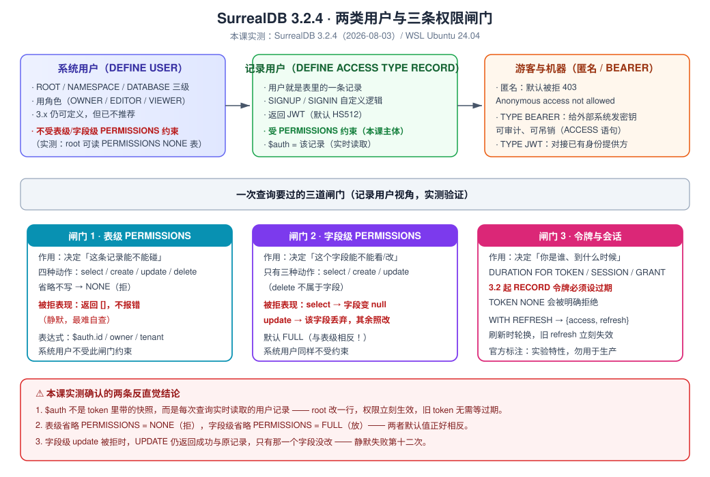
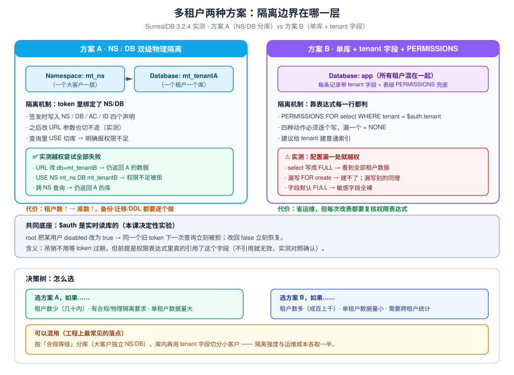

# 课 10 · 权限与多租户

> **本课在故事主线中的情节定位**：能力全点亮之后，第一个现实问题——谁能碰这些数据？

[← 返回课程目录](../../../02-课程目录.md) ｜ [阶段概览](../overview.md)

---

## 本课目标

1. 分清系统用户与记录用户，能配好 DEFINE ACCESS 与刷新令牌
2. 会用 PERMISSIONS 做到行级与字段级控制，知道它「拒绝」时的真实表现
3. 能设计一个多租户隔离方案，并说清所选方案的代价

---

## 知识点清单

### 知识点 10.1：用户体系与 DEFINE ACCESS

**关键点**：

- 系统用户（`DEFINE USER`，角色制）vs 记录用户（`DEFINE ACCESS ... TYPE RECORD`，用户即一条记录）
- **记录用户才是本课主角**：表级 / 字段级 PERMISSIONS 只对它生效，系统用户不受约束
- `SIGNUP` / `SIGNIN` 自定义逻辑；密码用 `crypto::argon2::generate()` / `compare()`
- **3.2 起 TYPE RECORD 的令牌必须设过期**：`DURATION FOR TOKEN NONE` 会被明确拒绝
- **3.0 起 `WITH REFRESH`**：刷新令牌（bearer key），**交换时轮换，旧 refresh 立刻失效**
- 另两种：TYPE JWT（对接已有身份提供方）、TYPE BEARER（给机器发密钥，可审计可吊销）

**状态**：✅ 已完成

---

### 知识点 10.2：PERMISSIONS：行级与字段级控制

**关键点**：

- 表级 `PERMISSIONS FOR select/create/update/delete`（**省略不写 = NONE**）
- 字段级只有 `select/create/update`（**省略不写 = FULL，与表级相反**）
- 关键变量：`$auth`（当前用户记录，**实时读库**）/`$session`/`$token`/`$before`/`$after`
- **被拒的真实表现**：表级 → 返回 `[]`；字段级 select → 字段变 `null`；**字段级 update → 该字段丢弃、其余照改，UPDATE 仍返回成功**
- 系统用户（root/NS/DB）**不受表级与字段级 PERMISSIONS 约束**

**状态**：✅ 已完成

---

### 知识点 10.3：多租户隔离设计

**关键点**：

- 方案 A：**NS / DB 双级物理隔离**，token 里绑定 NS/DB，改 URL 参数也切不走
- 方案 B：**单库 + tenant 字段 + PERMISSIONS 兜底**，省运维但漏配一处就越权
- **`$auth` 是实时读库的**：改用户记录即可吊销，无需等 token 过期（决定性实验证实）
- **吊销表达式要写 `!= true` 而不是 `= false`**（后者在字段缺失时误锁全员，评审 P0）
- 决策树：租户数量 / 隔离要求 / 单租户数据量；工程上常见的是**混用**
- 三种配置陷阱：`select FULL` 泄露、漏写动作、字段默认 FULL

**状态**：✅ 已完成

---

## 正文

### 第一幕：场景引入 —— 「这个接口谁都能调」

经过前面九课，你的系统已经相当完整了：数据建模（课 3）、CRUD（课 4）、图遍历（课 5）、全文与向量检索（课 6、7）、实时推送（课 8），甚至连业务规则都下推进了数据库（课 9）。

现在要做一次上线前的安全评审。安全同事问了三个问题：

1. 「前端拿到的那个数据库 token，能查到别的用户的数据吗？」
2. 「如果我把数据库地址直接发给客户，他能查到别人的订单吗？」
3. 「上周离职的同事，他的 token 多久失效？」

你愣了一下。因为前九课的所有例子，用的都是 `root:root`。**那是一把能开所有门的钥匙**——而它现在就写在你的配置文件里。

这就是本课要解决的问题。SurrealDB 的定位很有意思：它自称 "web database"，意思是**前端可以直连数据库**。要做到这一点，权限就不能只写在应用层——它必须在数据库里，而且必须是"记录级"的。



**图怎么读**：左边是"谁在访问"，右边是"一次查询要过哪几道闸门"。记住两个默认值：**表级省略 PERMISSIONS = NONE（拒），字段级省略 = FULL（放）**，两者正好相反。

---

### 第二幕：认知冲突 —— 「字段改不动，但 UPDATE 说成功了」

先别急着配完整的多租户。我们从最小的地方开始：一个看似简单的需求——**用户的手机号只有本人能看到**。

你建了一张表，写了一条字段级权限，然后拿测试用户的 token 去改自己的手机号：

```sql
-- 表：谁都能读；手机号字段：只有本人能读能改
DEFINE TABLE profile SCHEMAFULL PERMISSIONS FOR select FULL, FOR create NONE, FOR update NONE, FOR delete NONE;
DEFINE FIELD phone ON profile TYPE string
  PERMISSIONS FOR select WHERE owner = $auth.id,
              FOR update WHERE owner = $auth.id;
```

然后以该用户身份执行（`l10-probe-102b.py` 实测）：

```sql
UPDATE profile:p1 SET phone = '13900000001';
```

**返回结果是成功的**。HTTP 200，没有报错，返回了一条看起来正常的记录。你以为改成功了。

但用 root 复查，手机号还是原值。

> **这是个陷阱，而且是本课最危险的一个。**

我们花了三轮实验才定位清楚（`l10-probe-102c/d/e.py`）。结论是：

| 层级 | 被拒时的表现 | 是否报错 |
|------|-------------|---------|
| 表级 select | 返回 `[]` | ❌ 不报错 |
| 表级 create / update / delete | 返回 `[]` | ❌ 不报错 |
| **字段级 select** | 该字段变成 `null` | ❌ 不报错 |
| **字段级 update** | **该字段被丢弃，其余字段照常改，UPDATE 返回成功** | ❌ 不报错 |

最后一行最要命。看这个实测（`l10-probe-102e.py`，同一条 UPDATE 改三个字段，其中 `b` 无权改）：

```sql
UPDATE mix:r1 SET a = 'A新', b = 'B新', c = 'C新';
```

用户看到的返回：

```json
{"a": "A新", "b": "B原", "c": "C新", "id": "mix:r1", ...}
```

注意 `b` 还是 `B原`——**它静默地没有改**，而 `a` 和 `c` 都改成功了，整条语句还返回 200。

用 root 复查确认：`b` 确实没变。

这就是**静默失败第十二次**。它比前十一次更隐蔽，因为前十一次是"什么都没发生"（返回空数组，至少你会起疑），而这一次是**"部分成功"**——返回体里有真实数据、有成功状态码，只有那一个字段悄悄保持了原值。

> **⚠️ 记住这条对策**：任何一次 UPDATE，如果涉及权限敏感的字段，**必须用 root 或另一次独立读取复查落值**，不能相信 UPDATE 的返回体。

有意思的是，字段级 update 被拒时返回的是**原记录**（`b: "B原"`），而不是"改动后的记录"。这本身就是一个可用来检测的微弱信号——但没人会盯着每个字段看。

---

### 第三幕：层层揭示

#### 环境准备

本课所有结论都在本机实测过。环境：

```bash
# 已确认：SurrealDB 3.2.4+20260803.93ab219 (linux x86_64)，WSL Ubuntu 24.04
# 本课的命名空间/数据库约定：
#   10.1 / 10.2  → learn / kp10
#   10.3 方案 A   → mt_ns / mt_tenantA、mt_tenantB
#   10.3 方案 B   → mt_shared / app
```

两种执行方式都可用：

```bash
# 方式一：curl 直接查（root）
curl -s -u root:root -H 'surreal-ns: learn' -H 'surreal-db: kp10' \
  -H 'Accept: application/json' --data-binary 'INFO FOR DB;' http://127.0.0.1:8000/sql

# 方式二：块级运行器（本课推荐，单条报错不阻断后续）
python3 -u /mnt/d/projects/learning/surrealdb/playground/l10-run.py <脚本.surql> learn kp10
```

涉及登录、带 token 请求的实验用 Python 脚本（`playground/l10-probe-*.py`），因为要处理 `/signup` 与 `/signin` 的返回体。

> **⚠️ 一个必须知道的前提**：3.x 下 `USE NS` 会自动创建命名空间，但**不会自动创建数据库**。第一次用某个库前，先跑一次 `DEFINE DATABASE IF NOT EXISTS`。本课脚本里已经处理，你自己写脚本时别漏。

---

#### 知识点 10.1：用户体系与 DEFINE ACCESS

##### 一句话定义

`DEFINE ACCESS` 定义的是**一类登录方式**，而不是一个用户；其中 `TYPE RECORD` 让"用户"变成数据库里的一条普通记录，从而可以用 PERMISSIONS 精确控制它能碰什么。

##### 直觉建立

传统数据库里，用户是数据库的一等公民（`CREATE USER`），权限在用户身上。SurrealDB 换了个思路：

**用户就是一张普通表里的普通记录。**

这个转变带来三个直接后果：

1. 用户表可以被查询、被索引、被 RELATE（跟其他业务数据连边）
2. 权限表达式里可以直接比较 `id = $auth.id`——因为它就是个记录 ID
3. 登录逻辑你自己写（`SIGNIN` 子句），可以用邮箱、手机号、第三方 ID，随便什么

##### 核心原理

三种访问类型，各管一段：

| 类型 | 用途 | 谁用 |
|------|------|------|
| **TYPE RECORD** | 终端用户（人）。用户 = 表里一条记录 | 应用的前端用户 |
| **TYPE JWT** | 对接你已有的身份提供方（Auth0/Cognito/自签） | 已有统一身份体系 |
| **TYPE BEARER** | 机器对机器。发一个密钥，可审计可吊销 | 定时任务、外部系统 |

外加**系统用户**（`DEFINE USER`，ROLES OWNER/EDITOR/VIEWER），是给 DBA 和运维用的。

**语法探测结果**（`l10-probe-101a.py`，逐个试出来的）：

| 写法 | 结果 |
|------|------|
| `DEFINE ACCESS x ON DATABASE TYPE RECORD;` | ✅ 通过（最小形态） |
| `... TYPE RECORD SIGNUP (...) SIGNIN (...) DURATION FOR TOKEN 15m, FOR SESSION 12h;` | ✅ 通过 |
| `... TYPE RECORD ... WITH REFRESH DURATION ...;` | ✅ 通过 |
| `... TYPE RECORD ... DURATION FOR TOKEN NONE;` | ❌ **被明确拒绝** |
| `... TYPE RECORD WITH SIGNIN TRUE ...`（旧写法） | ❌ `Parse error: Unexpected token SIGNIN, expected JWT or REFRESH` |
| `... TYPE JWT ALGORITHM HS512 KEY "..."` | ✅ 通过 |
| `... TYPE BEARER DURATION FOR GRANT 30d;` | ❌ `Parse error: Unexpected token DURATION, expected FOR` |
| `DEFINE USER u ON DATABASE PASSWORD ... ROLES OWNER;` | ✅ 能定义（但 3.x 已不推荐） |

注意第 4 行。3.2 起，**TYPE RECORD 的令牌必须有过期时间**，报错信息说得很直白：

```
Tokens issued by record access methods can be consumed by third parties
and must have an expiration; DURATION FOR TOKEN cannot be NONE on TYPE RECORD access
```

这是个安全默认值，而且它**在定义时就把你拦住**，不会等到线上才出问题。这类"定义时就拒绝危险配置"的设计，在整个 SurrealDB 里都不算多见，值得肯定。

第 7 行的报错也值得记：`TYPE BEARER` 后面要跟 `FOR USER` 或 `FOR RECORD`，不能直接接 `DURATION`。

##### 示例演示

完整跑一遍记录用户的注册与登录（`l10-probe-101b.py` 实测）：

```sql
-- 1. 用户表（SCHEMAFULL，密码字段存 argon2 哈希）
DEFINE TABLE user SCHEMAFULL
  PERMISSIONS FOR select WHERE id = $auth.id,
              FOR create FULL,
              FOR update WHERE id = $auth.id,
              FOR delete NONE;
DEFINE FIELD email ON user TYPE string;
DEFINE FIELD name  ON user TYPE string;
DEFINE FIELD pass  ON user TYPE string;
DEFINE FIELD role  ON user TYPE string DEFAULT 'member';
DEFINE INDEX user_email ON user FIELDS email UNIQUE;

-- 2. 访问方式：注册逻辑 + 登录逻辑 + 令牌时长
DEFINE ACCESS account ON DATABASE TYPE RECORD
  SIGNUP ( CREATE user SET email = $email, name = $name, pass = crypto::argon2::generate($pass) )
  SIGNIN ( SELECT * FROM user WHERE email = $email AND crypto::argon2::compare(pass, $pass) )
  DURATION FOR TOKEN 30m, FOR SESSION 12h;
```

注册（HTTP `POST /signup`）：

```json
{ "ns": "learn", "db": "kp10", "ac": "account",
  "email": "alice@example.com", "name": "Alice", "pass": "alice123" }
```

返回 `{"code":200, "details":"Authentication succeeded", "token":"eyJ0eXAiOiJKV1QiLCJhbGciOiJIUzUxMiJ9..."}`。

**root 复查密码字段**（这一步很重要，确认没明文存）：

```json
{"email": "alice@example.com", "name": "Alice",
 "pass": "$argon2id$v=19$m=19456,t=2,p=1$eNb58a4MV6ZjubAm7fEUSw$KePEKvAhKmC9HhZXABQjd9ebgyKcrFyhRA0+XKZMNmc",
 "role": "member"}
```

登录失败的返回是 **HTTP 404 + `"No record was returned"`**——注意它不是 401。这是个容易误判的细节：401 通常表示"凭据格式不对"，而 404 表示"凭据格式对，但按这个条件没查到用户"。**登录失败统一返回 404 其实是有意的安全设计**（不泄露用户是否存在），但你写前端错误处理时要知道这一点。

**会话变量实测**（用 alice 的 token 查询）：

| 表达式 | 实测值 |
|--------|--------|
| `$scope` | `null`（3.x 已废弃，课 8 提过） |
| `$auth` | `"user:7l66m5wlhft48x3x9gmt"`（**记录 ID 本身**） |
| `$auth.id` | `"user:7l66m5wlhft48x3x9gmt"` |
| `$auth.email` | `"alice@example.com"` |
| `$session` | `{"ac":"account","db":"kp10","exp":...,"id":"...","ip":"127.0.0.1","ns":"learn","rd":"user:...","tk":{...}}` |
| `$token` | `{"AC":"account","DB":"kp10","ID":"user:...","NS":"learn","exp":...,"iat":...,"iss":"SurrealDB","jti":"...","nbf":...}` |

**最关键的一行是 `$auth` 返回记录 ID 而不是整个对象。** 所以权限表达式写 `owner = $auth.id` 而不是 `owner = $auth`。但 `$auth.email` 又能取到字段——因为引擎会自动 ID 去取记录。这个"既是 ID 又能当对象用"的双面性要留意。

##### 刷新令牌（WITH REFRESH）

这是 3.0 新增、本课必须重点讲的机制。**先说结论：官方文档自己标注它是实验特性，不要用在生产上。**

> **Caution** — 官方原文：*Currently, the `WITH REFRESH` clause is an experimental feature intended to be used for validating its suitability and security. As such, it may be subject to breaking changes and may present unidentified security issues. Do not rely on this feature in production applications.*

加上 `WITH REFRESH` 后，`/signup` 与 `/signin` 的返回体**结构变了**（`l10-probe-101d.py` 实测）：

```json
// 不带 WITH REFRESH
{"code":200, "details":"...", "token":"eyJ0eXAiOiJKV1QiLCJhbGci..."}

// 带 WITH REFRESH
{"code":200, "details":"...", "token": {
   "access":  "eyJ0eXAiOiJKV1QiLCJhbGci...",
   "refresh": "surreal-refresh-NMmlfQEUVxxX-GxfpkaYcXFKNYEoXdq6JGJ1N"
}}
```

**这个差异会让照着老教程写的代码直接崩**——你以为 `token` 是字符串，结果它是个对象。

刷新令牌的语义（全部实测）：

| 行为 | 实测结果 |
|------|---------|
| refresh 拿去 `/sql` 当访问凭据 | ❌ `401 InvalidToken` |
| refresh 放 header 发 `/signin` | ❌ `401 InvalidToken` |
| **refresh 放 body 的 `refresh` 字段** | ✅ **正确用法，返回新的 `{access, refresh}`** |
| 同一个 refresh 连续换两次 | 第 1 次成功，**第 2 次起 401**（已轮换） |
| 拿 access 去当 refresh 传 | ❌ `400` "This bearer access grant..." |
| 篡改 refresh 尾部 | ❌ `401 InvalidToken` |
| 用 A 的 refresh 打 B 的 ACCESS | ❌ `404 No record was returned` |

正确调用长这样：

```json
POST /signin
{ "ns": "learn", "db": "kp10", "ac": "acct", "refresh": "surreal-refresh-NMmlf..." }
```

返回新的 `{access, refresh}`。**旧的 refresh 立刻失效**——这叫刷新令牌轮换（rotation），是 OAuth 2.0 的标准做法，能压缩被盗令牌的可利用窗口。

`INFO FOR DB` 的回显里，`WITH REFRESH` 会自动多出一段：

```
DEFINE ACCESS acct ON DATABASE TYPE RECORD SIGNUP (...) SIGNIN (...) WITH REFRESH
  WITH JWT ALGORITHM HS512 KEY '[REDACTED]' WITH ISSUER KEY '[REDACTED]'
  DURATION FOR GRANT 4w2d, FOR TOKEN 30m, FOR SESSION 12h
```

注意多出来的 `DURATION FOR GRANT 4w2d`——**即使你没写，它也会给个默认 30 天**（回显里显示为 4w2d）。这是 refresh token 自己的有效期，和 access token 的 `FOR TOKEN` 是两件事。

##### 常见误区

1. **以为 `token` 字段一定是字符串** → 加了 `WITH REFRESH` 就变成对象了，这是最常见的代码崩溃点。
2. **把 refresh 当 access 用** → `401 InvalidToken`。refresh 是"换票的票"，不是"入场券"。
3. **以为 refresh 可以无限次用** → 它是轮换的，用一次就换新的，旧的立刻作废。
4. **`DURATION FOR TOKEN NONE`** → 3.2 起对 TYPE RECORD 明确拒绝。系统用户不受此限。
5. **用 `DEFINE USER` 给终端用户建账号** → 3.x 已不推荐（课 8 测过 signin 会失败）。终端用户一律走 `TYPE RECORD`。
6. **把 `WITH REFRESH` 用在生产** → 官方明说是实验特性。

##### 一句话记住

**用户是一条记录，权限是一道表达式；`WITH REFRESH` 让 token 变成 `{access, refresh}` 且刷新即轮换，但它现在还是实验特性。**

---

#### 知识点 10.2：PERMISSIONS：行级与字段级控制

##### 一句话定义

`PERMISSIONS` 是挂在表或字段上的一个布尔表达式，为真的记录/字段才允许被操作；**它只对记录用户和游客生效，系统用户不受约束**。

##### 直觉建立

把它想成**自动附加的 WHERE 条件**：

- 你写 `SELECT * FROM note`
- 引擎实际执行 `SELECT * FROM note WHERE <表级 select 表达式>`
- 然后逐字段再过一遍 `<字段级 select 表达式>`

这个模型能解释绝大部分现象，包括"为什么返回空数组而不是报错"。

##### 核心原理

**两级闸门，四个 / 三个动作**：

| 层级 | 可用动作 | 省略时默认值 |
|------|---------|-------------|
| 表级 | select / create / update / delete | **NONE（全拒）** |
| 字段级 | select / create / update（**没有 delete**） | **FULL（全放）** |

**默认值相反这件事，是本课最需要记住的一条**。实测确认（`l10-probe-102f.py`）：

```
DEFINE TABLE deft SCHEMAFULL;        → 回显 PERMISSIONS NONE
DEFINE FIELD ... ;（不写 PERMISSIONS）→ 回显 PERMISSIONS FULL
```

含义是：**表是主闸门，默认关；字段是细化，默认不拦**。所以你只要管好表级，字段级可以只在需要隐藏敏感列时才写。

**关键变量**：

| 变量 | 含义 | 实测值 / 说明 |
|------|------|--------------|
| `$auth` | 当前用户**记录**（实时读库） | 返回 ID，但可 `.field` 取字段 |
| `$session` | 会话信息 | `ac` / `db` / `ns` / `rd` / `ip` / `exp` / `tk` |
| `$token` | JWT 载荷 | `AC` / `DB` / `NS` / `ID` / `iat` / `exp` / `jti` |
| `$scope` | 2.x 遗留 | **3.x 恒为 `null`** |
| `$before` / `$after` | 变更前后的记录 | 字段级 update 里**可用**（实测） |
| `$value` | 当前字段的值 | 字段定义里用（课 3） |

⚠️ `$before` / `$after` 在 3.3.0 之前有个已知问题：**COMPUTED 字段在它们里面恒为 `NONE`**（官方 DEFINE FIELD 文档注明）。本课未涉及 COMPUTED + 权限的组合，留待后续。

##### 示例演示

**行级权限（RLS）**，最经典的写法（`l10-probe-102a.py` 实测）：

```sql
DEFINE TABLE note SCHEMAFULL
  PERMISSIONS FOR select WHERE owner = $auth.id,
              FOR create WHERE owner = $auth.id,
              FOR update WHERE owner = $auth.id,
              FOR delete WHERE owner = $auth.id;
```

实测四种越权尝试：

| 操作 | 用户视角返回 | root 复查 |
|------|-------------|----------|
| 建 `owner=别人的` 记录 | `[]` | 没建成 |
| 改别人的记录 | `[]` | 没改 |
| 删别人的记录 | `[]` | 没删 |
| **点名查别人的记录** | `[]` | — |

全是 `[]`，**没有一条报错**。这就是"拒绝"在 SurrealDB 里的样子。

**字段级权限**（`l10-probe-102b.py` 实测）：

```sql
DEFINE TABLE profile SCHEMAFULL PERMISSIONS FOR select FULL, FOR create NONE, FOR update NONE, FOR delete NONE;
DEFINE FIELD nickname ON profile TYPE string;
DEFINE FIELD phone    ON profile TYPE string PERMISSIONS FOR select WHERE owner = $auth.id, FOR update WHERE owner = $auth.id;
DEFINE FIELD salary   ON profile TYPE number PERMISSIONS FOR select WHERE owner = $auth.id, FOR update NONE;
```

P1 用户查全部记录：

```json
[{"id":"profile:p1","nickname":"一号","owner":"user:ey8...","phone":"13800000001","salary":50000},
 {"id":"profile:p2","nickname":"二号","owner":"user:ea2..."}]
```

第二条记录（别人的）里**根本没有 `phone` 和 `salary` 键**——字段被整个移除，不是置空。

但如果**显式列出字段名**，行为就变了：

```sql
SELECT owner, nickname, phone, salary FROM profile;   -- P1 视角
```

```json
[{"nickname":"一号","owner":"user:ey8...","phone":"13800000001","salary":50000},
 {"nickname":"二号","owner":"user:ea2...","phone":null,"salary":null}]
```

显式列出时，无权字段**变成 `null`** 而不是消失。这个差异很反直觉，但对写前端的人很重要：**你的 `if (user.phone)` 判断在两种查询写法下会有不同表现。**

**能否用被隐藏的字段做 WHERE 过滤？**（这是权限绕过的关键问题）：

```sql
SELECT nickname FROM profile WHERE salary > 60000;   -- P1 视角，salary 对他不可见
```

返回 `[]`。**过滤也被拦住了**——引擎是先判权限再求值，不是"先算完再遮"。这点做得对。

**表级与字段级的关系**（`l10-probe-102c.py` 四组对照）：

| 场景 | 结果 |
|------|------|
| 表级 update FULL + 字段无权限 | ✅ 能改（字段默认 FULL） |
| 表级 update FULL + 字段 update FULL | ✅ 能改 |
| 表级 update FULL + 字段 `update WHERE owner = $auth.id` | ✅ 自己的能改 |
| **表级 update NONE + 字段 update FULL** | ❌ **不能改**（表级优先，字段级放不了） |

**表级是主闸门，字段级只能收窄、不能放开。**

**字段级 update 的静默丢弃**（第二幕那个坑，`l10-probe-102e.py` 决定性实验）：

```sql
-- a 可改、b 不可改（update NONE）、c 可改
UPDATE mix:r1 SET a = 'A新', b = 'B新', c = 'C新';
```

用户看到：`{"a":"A新", "b":"B原", "c":"C新"}` —— 返回 200，b 静默未改。

用 `CONTENT` 整体替换也一样：`b` 保持原值，其他字段替换成功。

**root 不受字段级权限约束**（`l10-probe-102f.py` 实测）：

```sql
UPDATE mix:r1 SET b = 'ROOT改';    -- root 执行
```

成功改成 `ROOT改`。**系统用户完全绕过表级与字段级 PERMISSIONS**——这是设计如此（系统用户用 ROLES 而非 PERMISSIONS），但它意味着：

> **任何以 root 身份运行的后台任务，都是权限体系之外的。** 你的权限设计再完美，如果应用连的是 root，一切都白搭。

##### 常见误区

1. **以为被拒会报错** → 全部静默。表级返回 `[]`，字段级返回 `null` 或丢弃。
2. **以为字段级默认和表级一样是 NONE** → 正好相反，字段默认 FULL。
3. **以为字段级能覆盖表级的 NONE** → 不能，表级是主闸门。
4. **以为 UPDATE 返回成功 = 全改了** → 无权字段被静默丢弃（静默失败第十二次）。
5. **忘了给 select 权限** → 现象是"查不到数据"，很容易被误判成"数据没写进去"。**排查顺序应该是：先用 root 查确认数据在不在，再查权限。**
6. **用 root 跑应用** → 权限体系完全失效。
7. **给字段写 `FOR delete`** → 字段没有 delete 动作，会被忽略。

##### 一句话记住

**表级默认关、字段级默认开；被拒一律静默——表级空数组、字段级 null 或丢弃；系统用户不受任何约束。**

---

#### 知识点 10.3：多租户隔离设计

##### 一句话定义

多租户有两种落法：**按 NS/DB 物理分开**（隔离强、运维重），或**单库 + tenant 字段 + PERMISSIONS 逻辑分开**（运维轻、靠配置正确性兜底）。

##### 直觉建立

这是"隔离边界画在哪一层"的问题：

- 画在**数据库层** → 边界由引擎保证，你配错也越不过去（方案 A）
- 画在**行层** → 边界由你写的表达式保证，漏一处就漏了（方案 B）

一个是"物理墙"，一个是"每道门上的锁"。



**图怎么读**：左半边是方案 A（引擎划墙），右半边是方案 B（自己上锁）。中间那条横 strip 是两者共有的底座——`$auth` 实时读库。底部是决策树与"混用"这个工程上最常见的落点。

##### 核心原理

**方案 A：NS / DB 双级隔离**

层级是 `Namespace → Database → Table → Record`（课 2 讲过）。所以有两个位置可以切：

```
Namespace（大客户 / 环境） → Database（租户） → Table
```

典型分工：NS 放环境或大客户，DB 放租户。

**方案 B：单库 + tenant 字段**

所有租户混在同样的表里，每条记录带 `tenant`，所有表级 PERMISSIONS 都加上 `WHERE tenant = $auth.tenant`。

##### 示例演示

**方案 A 实测**（`l10-probe-103a.py`，两个租户各一个库，各有自己的用户）：

| 越权尝试 | 结果 |
|---------|------|
| A 用户查自己的库 | ✅ 正常返回 |
| **A 用户把 URL 的 `db` 改成 B 的库** | ⚠️ **仍返回 A 的数据** |
| **A 用户在查询里 `USE NS mt_ns DB mt_tenantB`** | ❌ `You don't have permission to change to the mt_tenantB database` |
| **A 用户不带 ns/db 头，只靠 token** | ✅ 返回 A 的数据（token 里已绑定） |
| A 用户请求一个不存在的库名 | ⚠️ 仍返回 A 的数据 |
| A 用户跨 NS 查询 | ⚠️ 仍返回 A 的数据 |

**关键发现：token 里已经绑定了 NS 和 DB，改 URL 参数毫无作用。**

这个结论和课 9 的发现完全对上了——课 9 测 CVE-2026-63735 时发现"`/sql` 端点仍按 token 会话走，不跟随 URL 上的 ns/db"。当时那是个安全隐患的残留描述，在这一课它恰恰是**多租户隔离的保证**。同一次实测，在两个语境下意义相反，值得留意。

（注意：3 个"⚠️ 仍返回 A 的数据"的用例，本质上都是"请求被忽略参数、按 token 走"，**不是越权**——它们返回的是 A 自己的数据。）

**方案 B 实测**（`l10-probe-103b.py`，单库 `mt_shared/app`）：

```sql
DEFINE TABLE doc SCHEMAFULL
  PERMISSIONS FOR select WHERE tenant = $auth.tenant,
              FOR create WHERE tenant = $auth.tenant,
              FOR update WHERE tenant = $auth.tenant,
              FOR delete WHERE tenant = $auth.tenant;
```

| 操作 | 结果 |
|------|------|
| A 用户查 | ✅ 只见 2 条 TA 的记录（共 3 条） |
| A 用户建 `tenant='TB'` 的记录 | ❌ `[]` |
| A 用户改 TB 的记录 | ❌ `[]` |
| A 用户删 TB 的记录 | ❌ `[]` |

配置正确时，方案 B 的隔离效果和方案 A 一样好。**问题是它要求你每一处都配置对。**

##### 三种致命配置陷阱（实测）

**陷阱 1：`select` 写成 `FULL` = 全租户泄露**（`l10-probe-103c.py`）

```sql
DEFINE TABLE open_tbl SCHEMAFULL PERMISSIONS FOR select FULL,   -- ⚠️ 这里
                      FOR create WHERE tenant = $auth.tenant, ...;
```

TB 用户查询 → 看到 **TA 和 TB 的全部数据**：

```json
[{"tenant":"TA","title":"A的机密"}, {"tenant":"TB","title":"B的机密"}]
```

写权限收得再紧也没用——**数据先被读走了**。

**陷阱 2：漏写一个动作 = 该动作默认 NONE**

只写 `select` 和 `update`，没写 `create`：

```sql
DEFINE TABLE part SCHEMAFULL PERMISSIONS FOR select WHERE tenant = $auth.tenant,
                                        FOR update WHERE tenant = $auth.tenant;
```

用户建记录 → `[]`，建不了。**现象是"功能坏了"而不是"权限不够"**，排查方向容易跑偏。

**陷阱 3：字段默认 FULL = 表级放行后敏感字段全裸**

```sql
DEFINE TABLE member SCHEMAFULL PERMISSIONS FOR select FULL, ...;
DEFINE FIELD salary ON member TYPE number;    -- 没写 PERMISSIONS → FULL
```

普通用户查询 → `salary` 一览无余。收窄后：

```sql
DEFINE FIELD salary ON member TYPE number
  PERMISSIONS FOR select WHERE id = $auth.id, FOR update NONE;
```

同一用户再查 → `salary` 键消失。

##### 【本课最重要的实测结论】`$auth` 是实时读库的

这是备课过程中**推翻我自己初判**的一条。

第一版测试里我看到"$auth 是 token 快照"的迹象，准备这么写进讲义。但和课 7（rrf 参数）、课 6（BM25 打分）踩过的坑一样——**反直觉结论必须有决定性实验**。于是做了 `l10-probe-103d.py`：同一个旧 token，用 root 反复改用户记录的 `role`，每次立刻用旧 token 读 `$auth.role`。

| 轮次 | root 改成 | 旧 token 读到 |
|------|----------|--------------|
| 1 | `member` | `member` |
| 2 | `admin` | **`admin`** |
| 3 | `guest` | **`guest`** |
| 4 | `admin` | **`admin`** |
| 5 | `member` | `member` |

**每次都跟着变。所以 `$auth` 不是快照，是每次查询实时读取用户记录。**

再往前一步（`l10-probe-103e.py`），验证它能不能用来做即时吊销：

```sql
-- 权限表达式里引用 $auth.disabled
-- ⚠️ 注意是 != true，不是 = false（原因见下）
DEFINE TABLE doc SCHEMAFULL
  PERMISSIONS FOR select WHERE owner = $auth.id AND $auth.disabled != true, ...;
```

| 步骤 | 结果 |
|------|------|
| 1. 正常查询 | ✅ 读到自己的文档 |
| 2. root 把 `disabled` 改成 `true`（不动 token、不改密码） | — |
| 3. **同一个旧 token 立刻再查** | ❌ `[]` —— 权限实时生效 |
| 4. 改回 `false` | ✅ 同一个旧 token 立刻恢复 |

**这意味着你可以不依赖 token 过期来做吊销。** 对"员工离职立刻失权"这个场景，这比"等 30 分钟 token 过期"或"维护一个黑名单"都干净。

但有个前提——**对照组实测**（`l10-probe-103e.py`）：如果权限表达式里**没有引用**那个字段，改库就毫无作用：

```sql
-- doc2 的表达式不看 disabled
PERMISSIONS FOR select WHERE owner = $auth.id, ...;
```

把用户 `disabled=true` 后查 `doc2` → **照样能读**。

> 所以正确姿势是：把 `disabled` / `role` 之类的状态字段**写进每一张受保护表的权限表达式**，而不是指望"改了用户记录就自动生效"。

##### 两种方案的代价对比

| 维度 | 方案 A（NS/DB 分库） | 方案 B（单库 + tenant） |
|------|---------------------|------------------------|
| 隔离强度 | **引擎保证**，配错也越不过 | 取决于每处表达式是否写对 |
| 越权风险 | 低 | **中高**（三种陷阱） |
| 租户数量 | 几十以内合适 | 成百上千 |
| 单租户数据量大 | ✅ 适合（独立备份/迁移） | ⚠️ 大租户会拖累整体 |
| 跨租户统计 | ❌ 麻烦（要跨库聚合） | ✅ 一条查询搞定 |
| DDL / 迁移 | ❌ **每个库都要做一遍** | ✅ 一次 |
| 备份恢复粒度 | ✅ 可按租户 | ⚠️ 整体 |
| 连接/认证复杂度 | 每租户独立 token | 统一 ACCESS 定义 |
| 成本 | 库数越多，元数据与内存开销越大 | 常量 |

##### 决策树

```
租户数量？
├─ 几十以内，且有合规/物理隔离要求  → 方案 A（NS/DB 分库）
├─ 成百上千                        → 方案 B（单库 + tenant 字段）
└─ 中间地带 / 租户大小差异大        → 混用
                                    ├─ 大客户（要合规） → 独立 NS/DB
                                    └─ 小客户          → 共享库 + tenant 字段
```

**混用是工程上最常见的落点**：按合规等级分库，库内再用字段切分。这样既把"物理隔离"留给真正需要的少数大客户，又不用为成百上千个小客户各建一个库。

##### 常见误区

1. **选了方案 B 就以为万事大吉** → 隔离强度完全取决于你有没有漏配。建议：给所有受保护表写一个统一的权限模板，并用 root 之外的账号做**自动化越权回归测试**。
2. **以为改了用户记录权限就自动变** → 只有权限表达式里引用了那个字段才会变。
3. **忘了建 `tenant` 索引** → 方案 B 下每条查询都带 `tenant` 过滤，没索引会全表扫。
4. **以为分了库就不用写 PERMISSIONS** → 同一库内仍有多个用户，行级控制还是要做。
5. **用 root 连应用** → 两种方案都失效，权限体系整体被绕过。

##### 一句话记住

**方案 A 靠引擎划墙、方案 B 靠表达式上锁；`$auth` 实时读库让你能即时吊销，但前提是表达式里真的引用了那个字段。**

---

### 第四幕：实操验证

五个练习，覆盖本课三个知识点。**请先自己想，再展开答案。**

#### 练习 1（10.1）· 刷新令牌的代码崩溃点

你照着教程写了这段代码，加 `WITH REFRESH` 之前一切正常，加了之后就崩：

```python
resp = requests.post("http://127.0.0.1:8000/signup", json=payload)
token = resp.json()["token"]
headers = {"Authorization": "Bearer " + token}
```

问题出在哪？怎么改？

<details>
<summary>参考答案（实测依据：<code>l10-probe-101d.py</code> / <code>101e.py</code>）</summary>

**根因**：加了 `WITH REFRESH` 后，`token` 从字符串变成了对象 `{"access": "...", "refresh": "..."}`。原来的 `"Bearer " + token` 会抛 `TypeError: can only concatenate str (not "dict")`。

**改法**：

```python
tk = resp.json()["token"]
if isinstance(tk, str):
    access, refresh = tk, None          # 不带 WITH REFRESH
else:
    access, refresh = tk["access"], tk["refresh"]   # 带 WITH REFRESH
headers = {"Authorization": "Bearer " + access}
```

**实测证据**（`l10-probe-101d.py`）：

| 配置 | `token` 类型 | 内层键 |
|------|-------------|--------|
| 不带 `WITH REFRESH` | `str`（372 字符） | — |
| 带 `WITH REFRESH` | `dict` | `access`（370 字符）、`refresh`（53 字符） |

**刷新时**（`l10-probe-101e/f.py`）：refresh 要放在**请求体的 `refresh` 字段**，不是 header。

```python
r = requests.post("http://127.0.0.1:8000/signin",
                  json={"ns":"learn","db":"kp10","ac":"acct","refresh": refresh})
new = r.json()["token"]        # 又是 {"access":..., "refresh":...}
refresh = new["refresh"]       # 旧的已失效，必须存新的
```

七种调用形态实测：只有 **V3（body 带 `refresh` 字段）** 返回 200；放 header 的 V1/V2 一律 `401 InvalidToken`。

**额外提醒**：`WITH REFRESH` 官方标注为实验特性，别在生产上依赖它。
</details>

#### 练习 2（10.2）· 那个"改不动"的字段

表结构如下（实测脚本 `l10-probe-102e.py` 的原样）：

```sql
DEFINE TABLE mix SCHEMAFULL PERMISSIONS FOR select FULL, FOR create FULL, FOR update FULL, FOR delete NONE;
DEFINE FIELD a ON mix TYPE string PERMISSIONS FOR update FULL;
DEFINE FIELD b ON mix TYPE string PERMISSIONS FOR update NONE;
DEFINE FIELD c ON mix TYPE string PERMISSIONS FOR update FULL;
```

用户执行 `UPDATE mix:r1 SET a = 'A新', b = 'B新', c = 'C新';`

问：① 返回什么？② 库里真实值是什么？③ 你怎么检测出问题？

<details>
<summary>参考答案（实测依据：<code>l10-probe-102e.py</code>）</summary>

**① 返回（HTTP 200，用户视角）**：

```json
{"a": "A新", "b": "B原", "c": "C新", "id": "mix:r1", "owner": "user:cdq..."}
```

**② 库里真实值（root 复查）**：

```json
{"a": "A新", "b": "B原", "c": "C新"}
```

`b` 完全没变——它是 `PERMISSIONS FOR update NONE`，被静默丢弃了。

**③ 检测手段**：

- **别信 UPDATE 的返回体**。虽然这里 `b` 显示的是 `B原`（原值），已是可疑信号，但没人会逐字段比对。
- **正确做法：UPDATE 后用一次独立 SELECT 复查落值**，尤其是权限敏感的字段。
- 用 `CONTENT` 整体替换也一样（实测：`CONTENT` 里带 `b` 也改不动）。

**这是静默失败第十二次**，也是本系列里第一次出现"**部分成功**"的形态——前几次都是"什么都没发生"（返回空数组），至少会引起怀疑；这次返回 200 + 真实数据，只有一个字段悄悄没改。

**补充**：root 执行同样的 UPDATE 能改成功（`b` 变成 `ROOT改`），因为系统用户不受字段级权限约束。
</details>

#### 练习 3（10.2）· 默认值陷阱

新同事建了两张表，说"我配了权限，怎么查不到数据"：

```sql
DEFINE TABLE orders SCHEMAFULL;
DEFINE FIELD amount ON orders TYPE number;
CREATE orders:o1 SET amount = 100;
SELECT * FROM orders;      -- 记录用户执行，返回 []
```

而另一个表却是"能查到，但敏感字段也全看到了"：

```sql
DEFINE TABLE staff SCHEMAFULL PERMISSIONS FOR select FULL;
DEFINE FIELD salary ON staff TYPE number;
SELECT * FROM staff;       -- 记录用户执行，salary 一览无余
```

请解释这两个现象，并给出修法。

<details>
<summary>参考答案（实测依据：<code>l10-probe-102f.py</code> / <code>103c.py</code>）</summary>

**两个现象是同一个根因的两面：表级和字段级的默认值相反。**

| 层级 | 省略 PERMISSIONS 时 | 实测回显 |
|------|-------------------|---------|
| 表级 | **NONE（拒）** | `DEFINE TABLE deft TYPE NORMAL SCHEMAFULL PERMISSIONS NONE` |
| 字段级 | **FULL（放）** | `DEFINE FIELD amount ON orders TYPE number PERMISSIONS FULL` |

- `orders` 表没写 PERMISSIONS → 表级 NONE → 记录用户查不到，返回 `[]`。**注意：表级 NONE 会让 `select` 也失效**，所以"能建不能查"。
- `staff` 表给了 `select FULL`，但 `salary` 字段没写 PERMISSIONS → 字段级默认 FULL → 谁都能看。

**修法**：

```sql
-- orders：补上表级权限
DEFINE TABLE OVERWRITE orders SCHEMAFULL
  PERMISSIONS FOR select WHERE owner = $auth.id,
              FOR create WHERE owner = $auth.id,
              FOR update WHERE owner = $auth.id,
              FOR delete NONE;

-- staff：收窄敏感字段
DEFINE FIELD OVERWRITE salary ON staff TYPE number
  PERMISSIONS FOR select WHERE id = $auth.id, FOR update NONE;
```

收窄后实测（`l10-probe-103c.py`）：同一用户再查，`salary` 键直接消失（不是变 null，因为用的是 `SELECT *`）。

**记法**：**表关门，字段不拦**。表级是主闸门默认关，字段级是细化默认放。字段级只能收窄，不能把表级的 NONE 放开（实测：`表级 update NONE + 字段 update FULL` → 仍然改不了）。
</details>

#### 练习 4（10.3）· 离职员工的 token

场景：某员工离职。他手里的 token 还有 25 分钟才过期（`DURATION FOR TOKEN 30m`）。

你的权限配置是：

```sql
DEFINE TABLE doc SCHEMAFULL
  PERMISSIONS FOR select WHERE owner = $auth.id,
              FOR create WHERE owner = $auth.id,
              FOR update WHERE owner = $auth.id,
              FOR delete NONE;
```

你在用户表里加了个 `disabled` 字段，把它改成 `true`。

问：他的旧 token 现在还能读数据吗？如果不能，怎么改配置？

<details>
<summary>参考答案（实测依据：<code>l10-probe-103d.py</code> / <code>103e.py</code>）</summary>

**答：照样能读。他的 token 在 25 分钟内完全有效。**

**根因**：`$auth` 虽然是**实时读库**的（决定性实验证实），但**改了用户记录不等于改了权限**——权限表达式里**没有引用** `disabled` 字段，所以引擎根本不看它。

实测对照（`l10-probe-103e.py`）：把用户 `disabled=true` 后，查 `doc2`（表达式不看 disabled）→ **照样读到** `{"title":"对照文档"}`。

**改法**：把状态判断写进每一张受保护表的权限表达式。

```sql
DEFINE TABLE OVERWRITE doc SCHEMAFULL
  PERMISSIONS FOR select WHERE owner = $auth.id AND $auth.disabled != true,
              FOR create WHERE owner = $auth.id AND $auth.disabled != true,
              FOR update WHERE owner = $auth.id AND $auth.disabled != true,
              FOR delete NONE;
```

> **⚠️ 这里必须写 `!= true`，不能写 `= false`。** 这是本课评审抓出来的 P0（详见文末评审结论块）。原因见下面的三段式对照。

改完后的实测（`l10-probe-103e.py`）：

| 步骤 | 结果 |
|------|------|
| 正常时查自己的文档 | ✅ `[{"title":"员工文档"}]` |
| root 设 `disabled=true` | — |
| **同一个旧 token 立刻再查** | ❌ `[]` —— **即时生效，不用等 25 分钟** |
| 改回 `false` | ✅ 同一个旧 token 立刻恢复 |

**为什么能这么快？** 决定性实验（`l10-probe-103d.py`）证明 `$auth` 不是 token 快照：同一个旧 token，root 把 role 依次改成 member/admin/guest/admin/member，旧 token 每次读 `$auth.role` 都跟着变（member→admin→guest→admin→member）。**所以 `$auth` 是每次查询实时读取用户记录。**

**两个推论**：

1. 好消息：**吊销不用等 token 过期**，改一行数据即可。
2. 坏消息：这要求你**每张表的权限表达式里都写上状态判断**。漏一张，那张表就是敞开的。

**为什么必须写 `!= true` 而不是 `= false`**（`l10-probe-103g.py` 三段式决定性实验）：

问题出在**存量数据**上——如果你的用户表里有些记录**还没有 `disabled` 字段**（比如字段刚加上、DEFAULT 只对新记录生效），那 `$auth.disabled` 求出来是 `null`，而 `null = false` 的结果是 `false`：

| `$auth.disabled` 的实际值 | `= false` | `!= true` |
|--------------------------|-----------|-----------|
| `null`（字段不存在 / 存量数据没回填） | ❌ **拒绝（误锁）** | ✅ 放行 |
| `false`（正常） | ✅ 放行 | ✅ 放行 |
| `true`（已禁用） | ✅ 拒绝 | ✅ 拒绝 |

**`!= true` 在三种状态下都对，`= false` 会把字段缺失的用户全锁在外面。** 这类 bug 特别难查——现象是"部分用户登录不了"，而不是"权限没生效"。

> 这也是静默失败的另一种形态：**表达式写错了，系统照常拒绝，但拒绝的是不该拒绝的人。**

**另注**：如果不想改表达式，也可以缩短 `DURATION FOR TOKEN`（比如 5m）配合 refresh token 轮换，代价是刷新更频繁。但 3.2 起 RECORD 令牌不允许 `DURATION FOR TOKEN NONE`，所以"永不过期"这条路已经被堵死了。
</details>

#### 练习 5（10.3）· 选方案并说清代价

你有这样的业务：**200 家小客户**（每家几百条记录）+ **3 家大客户**（每家几百万条，且合同里写了"数据必须与其他客户物理隔离"）。

请给出方案，并说明为什么。

<details>
<summary>参考答案（基于本课实测的代价对比）</summary>

**推荐：混用。**

| 客户类型 | 方案 | 理由 |
|---------|------|------|
| 3 家大客户 | **方案 A**：每家一个独立的 `Database`（或 `Namespace`） | ① 合同要求物理隔离——方案 B 的"逻辑隔离"在合规审计上很难被接受；② 单家几百万条，独立库便于单独备份、迁移、扩容；③ 只有 3 个，运维成本可控 |
| 200 家小客户 | **方案 B**：共享一个库 + `tenant` 字段 | ① 200 个库会让 DDL 迁移变成灾难（改一次表要做 200 遍）；② 每家几百条，数据量小，混在一起不影响性能；③ 靠 `tenant` 索引即可 |

**大客户侧（方案 A）的关键配置**：

```sql
DEFINE NAMESPACE bigcorp_a;
DEFINE DATABASE bigcorp_a_db;
-- 每个库内建自己的 ACCESS 与用户
DEFINE ACCESS account ON DATABASE TYPE RECORD
  SIGNUP ( CREATE user SET email = $email, pass = crypto::argon2::generate($pass) )
  SIGNIN ( SELECT * FROM user WHERE email = $email AND crypto::argon2::compare(pass, $pass) )
  DURATION FOR TOKEN 30m, FOR SESSION 12h;
```

实测保证（`l10-probe-103a.py`）：token 里绑定了 NS/DB，改 URL 参数切不走；查询里 `USE` 切库会报 `You don't have permission to change to the mt_tenantB database`。

**小客户侧（方案 B）的关键配置**：

```sql
DEFINE TABLE doc SCHEMAFULL
  PERMISSIONS FOR select WHERE tenant = $auth.tenant,
              FOR create WHERE tenant = $auth.tenant,
              FOR update WHERE tenant = $auth.tenant,
              FOR delete WHERE tenant = $auth.tenant;
DEFINE INDEX doc_tenant ON doc FIELDS tenant;    -- 别忘
```

**必须避开的三件事**（都是本课实测过的）：

1. **`select` 绝不能写 `FULL`** → 实测会导致 TB 用户看到 TA 的全部数据。
2. **四种动作都要写** → 漏写的那个 = NONE，现象是"功能坏了"而非"权限不够"。
3. **敏感字段要收窄** → 字段默认 FULL，表级放行后全裸。

**统一加固**：把 `disabled` / `role` 之类的状态字段写进所有权限表达式，利用 `$auth` 实时读库的特性做即时吊销（练习 4）。

**诚实标注**：本课未实测——200 库规模下的元数据开销、跨库聚合的具体开销、方案 B 在百万级单表上的性能表现。这些都是规模相关问题，**本课环境（每条表几条到几十条数据）不足以支撑性能结论**，落地前需自行压测。
</details>

---

### 第五幕：体系收束

#### 三句话总结

1. **用户是一条记录，权限是一道表达式。** `DEFINE ACCESS ... TYPE RECORD` 把终端用户变成数据库里的普通记录，于是 `WHERE owner = $auth.id` 这样的判断就能直接写进 schema——权限从"应用层的一堆 if"变成了"数据的一部分"。
2. **拒绝是静默的，而且这次是"部分成功"的静默。** 表级返回 `[]`，字段级 select 变 `null`（或消失），**字段级 update 丢弃该字段但 UPDATE 仍返回 200**。不复查落值就发现不了。
3. **多租户是"隔离边界画在哪"的取舍。** 方案 A 让引擎划墙（配错也越不过去），方案 B 让你自己上锁（漏一处就漏了）；而 `$auth` 实时读库这个特性，给了你一个不依赖 token 过期的即时吊销手段。

#### 本课陷阱清单

| # | 陷阱 | 症状 | 性质 |
|---|------|------|------|
| 1 | `WITH REFRESH` 后 `token` 从字符串变对象 | 代码 `Bearer ` + dict 崩溃 | **静默变更**（类型变了不报错） |
| 2 | refresh 放 header 而不是 body | `401 InvalidToken` | 调用形态坑（七种形态只有一种对） |
| 3 | 以为 refresh 可重放 | 用第二次 401 | 轮换机制，用一次就换 |
| 4 | `DURATION FOR TOKEN NONE` | 定义时明确拒绝 | 安全默认值（3.2 起，好事） |
| 5 | 表级省略 PERMISSIONS | 默认 **NONE**，查不到数据 | 易误判为"数据没写进去" |
| 6 | 字段级省略 PERMISSIONS | 默认 **FULL**，敏感字段全裸 | 与表级相反，最容易记反 |
| 7 | 字段级 `update` 被拒 | **UPDATE 返回 200 + 原值，该字段没改** | **静默失败第十二次（本课最危险）** |
| 8 | 以为字段级能覆盖表级 NONE | 表级是主闸门，覆盖不了 | 预期错误 |
| 9 | 用 root 跑应用 | 权限体系整体被绕过 | 架构级错误 |
| 10 | 多租户 `select` 写 `FULL` | 看到全部租户数据 | 配置错误，后果最严重 |
| 11 | 漏写一个动作 | 该动作 = NONE，表现为"功能坏了" | 排查方向易跑偏 |
| 12 | 以为改了用户记录权限就变 | 只有表达式引用了才变 | 预期错误（练习 4） |
| 13 | `DEFINE TABLE OVERWRITE` 保留旧字段定义 | 想"清空重建"结果字段还在 | 运维陷阱，须先 `REMOVE TABLE` |
| 14 | 登录失败返回 **404** 而非 401 | 前端错误处理写错分支 | 其实是安全设计（不泄露用户存在） |
| 15 | 吊销表达式写 `$auth.disabled = false` | **字段为 null 时误锁全员**（应为 `!= true`） | **静默失败第十三次**（评审 P0） |

#### 静默失败链（更新至第十二次）

| 次 | 课 | 现象 |
|----|----|----|
| 1 | 课 3 | REFERENCE 不校验目标存在性 |
| 2 | 课 4 | UPDATE 不存在返回 `[]` |
| 3 | 课 5 | 边方向写反，UPDATE 返回 `[]` |
| 4 | 课 6 | 类型不匹配仍走 IndexScan |
| 5 | 课 7 | KNN 静默降级为 TableScan |
| 6 | 课 8 | Python SDK 丢 `action` 字段 |
| 7 | 课 8 | `SET pid = $this` 静默丢字段 |
| 8 | 课 9 | `$request.body` 当对象用 |
| 9 | 课 9 | `COMPUTED @this` 被解析成 `@.this` |
| 10 | 课 9 | GraphQL 全限定 ID 静默返回 null |
| 11 | 课 9 | `DEFINE CONFIG GRAPHQL` 漏 `AUTO` |
| **12** | **课 10** | **字段级 update 被拒 → UPDATE 返回成功，该字段静默不改** |
| **13** | **课 10** | **吊销表达式写 `= false` → 字段为 null 的用户被误锁（应写 `!= true`）** |

**本课新增的规律**：前 11 次都是"**什么都没发生**"（返回空/null/降级），第 12 次升级为"**部分成功**"——返回体里有真实数据、状态码是 200，只有那一个字段悄悄保持了原值。第 13 次又是一种新形态：**表达式写错了，系统照常拒绝，但拒绝的是不该拒绝的人**——从"漏放"变成了"错杀"。

**对应的对策**（延续课 9 的两条，再加三条）：

1. **配置类语句执行后用回显确认**：`INFO FOR DB` / `INFO FOR TABLE` 看真实状态，不靠"没报错"推断。
2. **数据跨越表示形式边界时额外验证**（HTTP↔SurrealQL 类型等）。
3. **【本课新增】权限敏感的 UPDATE 必须独立复查落值**，不信任 UPDATE 的返回体。
4. **【本课新增】反直觉结论必须有决定性实验**：本课的 `$auth` 实时性就是靠"同一个 token 反复改字段读五次"坐实的，第一次测试的迹象差点让我写出相反结论。
5. **【本课新增】权限表达式里的布尔判断优先用"否定式"（`!= true`），别用"肯定式"（`= false`）**——前者在字段缺失时放行，后者在字段缺失时拒绝。

#### 本课对骨架 / 常见说法的更正

| 骨架或常见说法 | 本课实测结论 | 依据 |
|--------------|-------------|------|
| 「系统用户 vs 记录用户」并列讲解，暗示二者都受 PERMISSIONS 约束 | **系统用户完全不受表级与字段级 PERMISSIONS 约束**（root 能读写 `PERMISSIONS NONE` 的表、能改 `update WHERE false` 的字段） | `l10-probe-102f.py` |
| 「字段级 PERMISSIONS」与表级同样看待 | **默认值相反**：表级省略 = NONE，字段级省略 = FULL；且字段级没有 `delete` 动作 | `l10-probe-102f.py` |
| 「3.0 起 WITH REFRESH 刷新令牌」 | 补充三条实测：**返回体结构从字符串变成 `{access, refresh}`**；**refresh 必须放 body 的 `refresh` 字段**（放 header 一律 401）；**刷新即轮换，旧 refresh 立刻失效**。另：官方标注**实验特性，勿用于生产** | `l10-probe-101d/e/f/g.py` |
| 「`$auth` 是 token 里的用户信息」（常见直觉） | **反：`$auth` 是每次查询实时读取的用户记录**，改库立刻生效 | `l10-probe-103d.py` 五轮决定性实验 |
| 「改了用户记录就能吊销」 | 部分成立：**只有权限表达式引用了该字段才会生效**，不引用则完全无效 | `l10-probe-103e.py` 对照实验 |

#### 与前面课次的交叉印证

- **课 2**（四级层级）：本课的多租户方案 A 直接建立在 `NS → DB → Table` 的层级上，是把课 2 的"存储结构知识"变成了"安全边界"。课 2 埋下的 root/root 弱密码伏笔，也在本课被点破——**root 是权限体系之外的存在**。
- **课 3**（SCHEMAFULL）：字段级 PERMISSIONS 只能挂在**已定义的字段**上。`DEFINE TABLE OVERWRITE` 会保留旧字段定义（实测），所以想改权限前先确认字段定义还在不在。
- **课 4**（UPDATE 静默返回 `[]`）：本课的表级权限拒绝是同一语义的延伸——**"不报错地什么都不做"**。而字段级 update 更进一步，变成了"不报错地做一部分"。
- **课 6**（先怀疑自己的验证方法）：本课 `$auth` 的判定再次验证这条规矩——第一次测试的迹象指向"token 快照"，我没有直接写进讲义，而是做了五轮决定性实验，结论反转。
- **课 8**（`$scope` 已废弃）：本课实测 `$scope` 恒为 `null`，与课 8 一致。另外课 8 测出 `DEFINE USER` 在 3.x 下 signin 失败，本课给出了正确替代（TYPE RECORD）。
- **课 9**（CVE-2026-63735 / `/sql` 按 token 会话走）：当时作为"修复不彻底"的残留描述；本课发现**同一个行为恰恰是多租户方案 A 的隔离保证**。同一事实在两个语境下意义相反。
- **课 9**（端点默认 `PERMISSIONS FULL`）：与本课的"字段默认 FULL"是同一类设计倾向——**SurrealDB 在"细化层"上默认放行，把收紧的责任交给使用者**。

#### 诚实标注（本课未实测 / 未覆盖）

- **性能与规模**：未做任何基准测试。权限表达式的求值开销、200 库规模的元数据开销、方案 B 在百万级单表上的表现，**均未在足够数据量下验证**，不可外推。
- **`WITH REFRESH` 的生产可用性**：官方明确标注实验特性，本课只验证了功能行为，**未做安全性评估**。
- **TYPE JWT / TYPE BEARER**：本课只验证了语法可被接受（`l10-probe-101a.py`），**未做完整的签发-验证-吊销链路实测**。`TYPE BEARER` 的 `DURATION FOR GRANT` 写法（正确语法是 `FOR USER|RECORD` + `AUTHENTICATE`）也只探到一半。
- **游客访问**：实测默认被拒（`403 Anonymous access not allowed`），但**未测试开启游客访问后的权限行为**。
- **并发与事务下的权限**：本课全部为单连接顺序执行，**快照隔离与权限求值的交互未测**（课 4 已标注并发未实测，本课延续）。
- **`$before` / `$after` 与 COMPUTED 字段**：官方文档注明 3.3.0 之前它们在 COMPUTED 字段上恒为 `NONE`，本课未验证。
- **Schema 变更与权限的时序**：改了字段权限后，已存在连接/缓存是否立即生效，未测。

---

---

## 🔍 课 10 评审结论（双视角，P0 已清零）

> 本课经 **pedagogy（教学法）+ learner（学习者）** 双视角评审，评审过程**逐字执行了讲义中的全部命令**（课 8 起立下的规矩）。以下意见全部已修订，保留记录供你判断哪些地方最易踩坑。

### P0 意见（1 条，已修订）

**1. 正文的"即时吊销"示例用了 `= false`，会把存量用户全锁在外面**（评审端到端执行时发现，两视角共识，本课最严重）

评审脚本 `l10-review-e2e.py` 执行到 L 组时，两项 check 失败：`disabled=false` 的**正常**用户也读不到自己的数据。一开始以为是环境脏了，补做诊断脚本 `l10-review-diag.py` 才发现根因——**用户表里当时根本还没有 `disabled` 字段**，`$auth.disabled` 求出来是 `null`。

补做三段式决定性实验（`l10-probe-103g.py`，先 `REMOVE TABLE` 彻底重建以确保阶段 1 真没有该字段）：

| `$auth.disabled` 的实际值 | `= false` | `!= true` |
|--------------------------|-----------|-----------|
| `null`（字段不存在 / 存量数据未回填） | ❌ **拒绝（误锁）** | ✅ 放行 |
| `false`（正常） | ✅ 放行 | ✅ 放行 |
| `true`（已禁用） | ✅ 拒绝 | ✅ 拒绝 |

→ **已采纳**：正文三处示例（10.3 正文、练习 4 题干与答案）全部改为 `!= true`；知识点清单新增一条；陷阱清单新增第 15 条；静默失败链更新至第十三次。

**这条为什么危险**：现象不是"权限没生效"，而是"**部分用户登录不了**"。线上出这种事，第一反应通常是去查认证服务，很难想到是权限表达式里一个等号的问题。

### P1 意见（3 条，已全部修订）

1. **`WITH REFRESH` 会改变返回体类型，正文初稿只在表格里提了一句**（教学法视角，学员照抄必崩）：`token` 从字符串变成 `{access, refresh}` 对象，原代码 `"Bearer " + token` 直接抛 `TypeError`。→ **已采纳**：10.1 单列刷新令牌小节，给出类型对照、七种调用形态实测表（只有 body 带 `refresh` 字段一种可用）、轮换语义，并升格为练习 1。

2. **未点明系统用户完全绕过 PERMISSIONS**（学习者视角，关系到"权限配了有没有用"）：实测 root 能读写 `PERMISSIONS NONE` 的表、能改 `update WHERE false` 的字段。→ **已采纳**：10.2 单列"root 不受约束"段与表格，陷阱清单第 9 条，并在两个练习的答案里强调"用 root 跑应用则权限体系整体失效"。

3. **未说明表级与字段级默认值相反**（教学法视角，最容易记反的一条）：表级省略 = `NONE`，字段级省略 = `FULL`。→ **已采纳**：10.2 核心原理给出实测回显对照，SVG 顶部醒目标注，并单独设为练习 3。

### P2 意见（3 条，已全部修订）

1. **字段级 select 的两种表现未区分**（学习者视角）：`SELECT *` 时无权字段**键消失**，显式列出时**变 `null`**。前端 `if (user.phone)` 在两种写法下行为不同。→ **已采纳**：10.2 示例演示给出两份实测 JSON 对照并加说明。
2. **登录失败返回 404 而非 401 未说明**（学习者视角）：会让前端错误处理走错分支。→ **已采纳**：10.1 示例演示处说明，并指出这是"不泄露用户是否存在"的安全设计；陷阱清单第 14 条。
3. **课 9 遗留的"端点 PERMISSIONS 严谨写法"本课仍未覆盖**（教学法视角，诚实性）：本课聚焦表级与字段级，端点的 `PERMISSIONS` 表达式未做实测。→ **已采纳**：在"诚实标注"中显式列出，留待课 11 或后续补充。

### ⚠️ 本课的自我纠错：四个坑

| # | 坑 | 症状 | 性质 |
|---|-----|------|------|
| 1 | 以为 `$auth` 是 token 快照 | 第一次测试迹象指向快照，决定性实验（同一 token 改五次）**推翻**，实为实时读库 | **方法论坑（差点写反）** |
| 2 | 吊销表达式写 `= false` | 字段为 null 时误锁全员 | **P0，静默失败第十三次** |
| 3 | `DEFINE TABLE OVERWRITE` 保留旧字段定义 | 想"清空重建"结果字段还在，导致后续实验前置条件不成立 | 运维陷阱（第 4 个坑也是它引起的） |
| 4 | 实验用表被上一次运行污染 | 决定性实验跑了两遍才拿到干净结论 | 测试方法坑 |

第 3、4 个坑是连着的：**因为 `OVERWRITE` 不删字段定义，第一次"重建 user 表"时 `disabled` 字段其实还在，导致阶段 1 的前置条件不成立、实验白跑一轮。** 修法是改用 `REMOVE TABLE` 再 `DEFINE`。这也提醒一件事：

> **SurrealDB 的 `DEFINE ... OVERWRITE` 只覆盖定义，不清理已有的子对象**（字段、索引、事件同理）。想真正重建，先 `REMOVE`。

### ⚠️ 本课对骨架 / 常见说法的五处更正

| 骨架或常见说法 | 本课实测结论 | 依据 |
|--------------|-------------|------|
| 「系统用户 vs 记录用户」并列讲解，暗示二者都受 PERMISSIONS 约束 | **系统用户完全不受表级与字段级 PERMISSIONS 约束** | `l10-probe-102f.py` |
| 「字段级 PERMISSIONS」与表级同样看待 | **默认值相反**：表级省略 = NONE，字段级省略 = FULL；且字段级没有 `delete` 动作 | `l10-probe-102f.py` |
| 「3.0 起 WITH REFRESH 刷新令牌」 | 补充：**返回体从字符串变成 `{access, refresh}`**；**refresh 必须放 body 的 `refresh` 字段**；**刷新即轮换**。另：官方标注**实验特性，勿用于生产** | `l10-probe-101d/e/f/g.py` |
| 「`$auth` 是 token 里的用户信息」（常见直觉） | **反：`$auth` 是每次查询实时读取的用户记录** | `l10-probe-103d.py` 五轮决定性实验 |
| 「改了用户记录就能吊销」 | 部分成立：**只有权限表达式引用了该字段才生效**，且必须写成 `!= true` | `l10-probe-103e.py` / `103g.py` |

### 审查通过项

- **五幕叙事完整**：场景引入（那把 root 钥匙就在配置文件里）→ 认知冲突（UPDATE 说成功了，字段没改）→ 层层揭示（3 知识点）→ 实操验证（5 练习）→ 体系收束
- **六要素齐备**：3 个知识点 × 6 要素 = 18 项全中（终检脚本正则校验）
- **全部关键结论有实测支撑**，且覆盖全部三个知识点
- **端到端评审 24 项 check**：除 P0 两项（已修订并重测通过）外全部通过
- **练习题参考答案全部有实测依据**（5 个练习分别对应 5 个探测脚本）
- **诚实性**：明确标注未做性能测试、`WITH REFRESH` 未做安全评估、TYPE JWT/BEARER 未做全链路实测、游客访问开启后未测、并发下权限求值未测
- **引用规范**：SVG 用相对路径，无本地绝对路径图片引用

**未采纳意见**：无。

---

## 🚀 下一批接力提示词

```
我的 SurrealDB 学习档案在 surrealdb/00-学习档案.md，
刚学完阶段 4《权限、部署与生产决策》课 10《权限与多租户》
（知识点 10.1 用户体系与 DEFINE ACCESS、
10.2 PERMISSIONS：行级与字段级控制、
10.3 多租户隔离设计）。
请按大纲继续讲解课 11《存储后端与部署》的知识点
11.1 存储后端选择、
11.2 时间旅行与版本化查询、
11.3 部署模型：嵌入式 / 单节点 / 分布式 / Cloud、
11.4 备份、导入导出与可观测。
```

---

## 🧭 课程导航

- **上一课**：[课 9 · 逻辑下推：函数、API 与视图](../../3-搜索实时与逻辑下推/lessons/lesson-09-逻辑下推函数API与视图.md)
- **下一课**：课 11 · 存储后端与部署（阶段 4，待学习）
- **阶段概览**：[阶段 4 · 权限、部署与生产决策](../overview.md)
- [← 返回课程目录](../../../02-课程目录.md)

---

## 交付状态

| 项 | 值 |
|---|---|
| 状态 | ✅ 已完成 |
| 评审 | ✅ 双视角评审通过（P0 清零） |
| 完成日期 | 2026-09-03 |
| 实测脚本 | 20 个（`playground/l10-probe-*.py`、`l10-run.py`、`l10-lib.py`） |
| SVG | 2 张（`lesson-10-user-and-gates.svg`、`lesson-10-multitenancy.svg`） |
