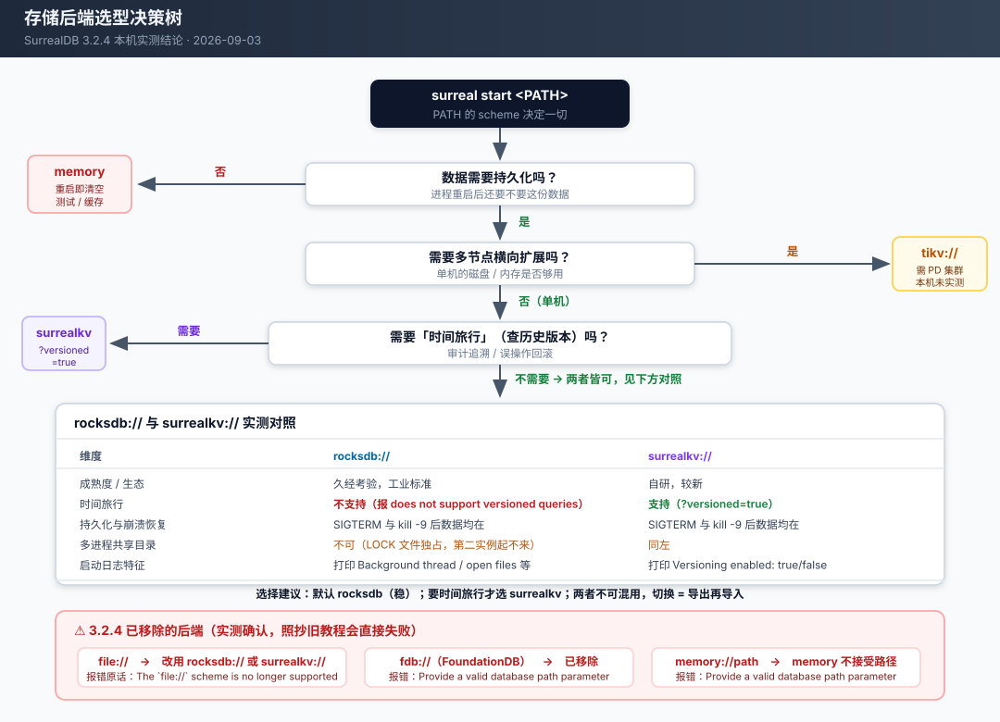
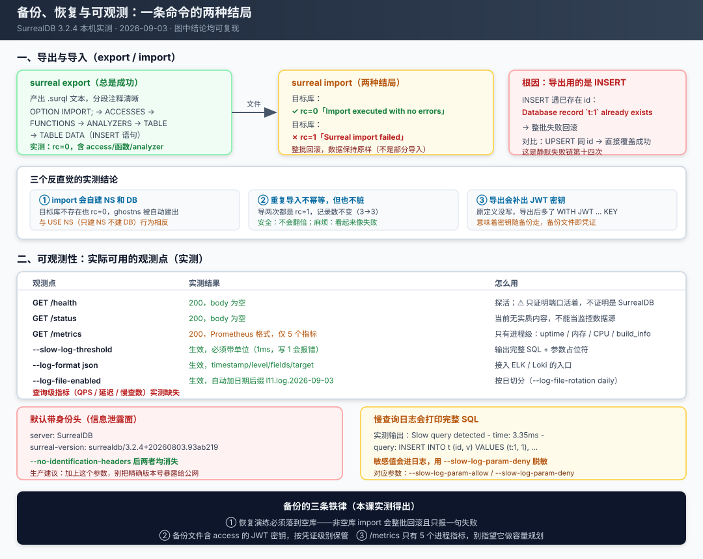

# 课 11 · 存储后端与部署

> 阶段 4《权限、部署与生产决策》· 第 2 课
> 环境：SurrealDB **3.2.4**（`3.2.4+20260803.93ab219 for linux on x86_64`），WSL Ubuntu 24.04
> 实测日期：2026-09-03 · 全部结论均在本机跑出，未实测项已显式标注

---

## 🎬 第一幕：场景引入 —— 那个".surql 文件恢复不回去"的凌晨

凌晨三点，数据库被误操作删了一批记录。你松了口气：昨天刚做过备份，`backup.surql` 就躺在备份目录里。

你敲下恢复命令：

```bash
surreal import --endpoint http://127.0.0.1:8000 --user root --pass root \
  --ns prod --db main backup.surql
```

终端回了一行：

```
INFO surrealdb_server::cli::import: Import executed with no errors
```

你长舒一口气，去查数据——**一条都没恢复**。

再敲一次，这次换了个提示：

```
ERROR surrealdb_server::cli::import: Surreal import failed,
      import might only be partially completed or have failed entirely.
```

同一个文件、同一条命令，第一次说"没错误"，第二次说"失败"。数据呢？一条都没动，3 条还是 3 条。

这不是你操作失误。这是 SurrealDB 导出导入机制的一个真实性质：**导出文件用的是 `INSERT`，而 `INSERT` 遇到已存在的记录 id 会报错并让整批回滚。** 你的目标库里那 3 条记录还在，所以导入必失败——而失败时它只给你一句"可能部分完成"，不告诉你哪条炸了、为什么炸。

这一课要解决的，就是这类"数据放在哪、怎么保、出事怎么查"的问题。它们不像查询语法那样每天用到，但出事的那天，你只有一次机会。

**本课的四个知识点**：

| # | 知识点 | 一句话 |
|---|--------|--------|
| 11.1 | 存储后端选择 | `surreal start` 后面那个路径参数，决定了你有什么能力、没有什么能力 |
| 11.2 | 时间旅行与版本化查询 | 只有 SurrealKV 支持，`SELECT ... VERSION d'...'` 能查回历史，但代价很实在 |
| 11.3 | 部署模型 | 嵌入式 / 单节点 / 分布式 / Cloud，3.2.4 里真正能落地的是哪些 |
| 11.4 | 备份、导入导出与可观测 | export/import 的坑比想象中多，可观测性的家底比想象中薄 |



**这张图怎么读**：从顶部的 `surreal start <PATH>` 开始，顺着三个问题往下走，最终落到具体后端。右侧红色区域是 3.2.4 **已经移除**的后端——网上大量教程还在用 `file://`，照抄会直接启动失败。

---

## ⚡ 第二幕：认知冲突 —— 三个"应该可以"却不行

进入正课前，先看三个让人意外的实测结果。它们的共同点是：**看起来应该可以，实际不行，而且不报错或报错含糊**。

### 冲突一：`file://` 后端没了

很多 SurrealDB 教程（包括较早的官方文档快照）教你这样启动：

```bash
surreal start --user root --pass root file://./mydb
```

3.2.4 的实际反应：

```
INFO  surrealdb::core::kvs::ds: Starting kvs store at absolute path file:/tmp/.../file
ERROR surrealdb_server::cli: There was a problem with the key-value store:
      The `file://` scheme is no longer supported; use `rocksdb://` or `surrealkv://` instead
```

进程直接退出，退出码 1。同类被移除的还有 `fdb://`（FoundationDB），实测报错是 `Provide a valid database path parameter`——**注意这个报错完全没有提到"已移除"**，只会让你怀疑自己路径写错了。

这不是吹毛求疵。存储后端的 scheme 决定了你后续的**全部能力边界**：能不能持久化、能不能时间旅行、能不能横向扩展，全在这一个参数里。

### 冲突二：`--health` 通过了，但那不是你的数据库

本课实测过程中踩的一个坑，值得单独说。

我写了个脚本，起实例后轮询 `/health` 等到 200 就认为就绪。脚本跑得很顺——直到发现所有查询结果都是空的、目录体积一动不动。

真相：本机 **84xx 端口段被其他服务占用**了。那些服务对 `/health` 也返回 200。我的探测请求全打到了陌生服务上，而 SurrealDB 实例根本没起来。

```
端口探测结果：
  8401 OPEN  - (RemoteDisconnected)     ← 不是 SurrealDB
  8421 OPEN  - (HTTPError)              ← 不是 SurrealDB
  8000 OPEN  surrealdb-3.2.4+20260803   ← 这才是
```

**`/health` 只证明端口上有东西活着，不证明它是 SurrealDB。** 正确的就绪检查应该打 `/version` 并校验 `surrealdb-` 前缀。这个坑让本课有三个探测脚本白跑了一轮。

### 冲突三：时间旅行查不到"未来"，也查不到"创建前"

时间旅行听起来是"回到过去看数据"。实测发现边界比直觉更严格：

```
数据时间线：   t0 ──── CREATE ──── t1 ──── UPDATE ──── t2 ──── UPDATE ──── t3
              (记录还不存在)      (balance=100)      (balance=200)      (balance=300)

SELECT * FROM acc:one VERSION d't0';   → []                    ← 查不到，记录还不存在
SELECT * FROM acc:one VERSION d't1';   → [{ balance: 100 }]    ← 第一个版本
SELECT * FROM acc:one VERSION d't2';   → [{ balance: 200 }]
SELECT * FROM acc:one VERSION d't3';   → [{ balance: 300 }]    ← 未来时间 = 最新值
```

**查"未来"的时间戳不会报错，而是返回截至该时刻的最新状态**。这很合理，但如果你在代码里用时间旅行做"某个时刻是否存在"的判断，这个行为会让你的分支逻辑走错。

更需要注意的是**删除之后的时刻**：记录被删后，任何晚于删除时刻的时间戳查到的都是**空**——因为"已删除"也是状态的一部分。（这一条我自己的初判也是错的，以为是删除前的值；决定性实验在知识点 11.2 里详述。）

更需要注意的是**删除之后的时刻**：记录被删后，任何晚于删除时刻的时间戳查到的都是**空**——因为"已删除"也是状态的一部分。实测：

```
记录未删除 → 查 1 小时后  → [{ v: 2 }]     （最新值）
记录已删除 → 查删除后时刻 → []              （不是删除前的值）
```

而**早于删除时刻**仍然查得到历史值（`[{ v: 20 }]`）——这才是它能用来救误删的原因。简单来说：**时间旅行能回到过去，不能从已删除的"未来"里捞数据。**

---

## 🔍 第三幕：层层揭示

### 环境准备

本课大量实验需要**启动不同配置的实例**，所以与前面几课不同：不再是连一个已运行的实例，而是频繁起停临时实例。

```bash
# 主实例（其余课程沿用，本课不改动它）
surreal start --user root --pass root --bind 127.0.0.1:8000 \
  --log info rocksdb:/mnt/d/projects/learning/surrealdb/playground/data/mydb

# 本课实验实例：都跑在 /tmp 下，用后即删
surreal start --user root --pass root --bind 127.0.0.1:8XXX --log info \
  surrealkv:///tmp/l11-demo?versioned=true
```

**本课提供的两个脚本**（在 `playground/` 下）：

| 脚本 | 用途 |
|------|------|
| [l11-lib.py](../../../playground/l11-lib.py) | HTTP 辅助库：封装 `/sql`、实例起停、体积测量；**含 `/version` 身份校验**（第二幕冲突二的工程化修复） |
| [l11-run.py](../../../playground/l11-run.py) | 块级运行器：按 `-- ##` 切块独立执行（沿用课 9 设计） |

**重要的环境事实**：本机**没有** TiKV / PD 组件，也没有正在运行的 TiKV 集群。因此 11.3 的"分布式"部分**只能测到连接失败的报错形态**，无法验证分布式实际行为。这一点在下文会反复标注，不会用文档推断冒充实测。

---

### 知识点 11.1 · 存储后端选择

#### 一句话定义

存储后端由 `surreal start` 的路径参数 scheme 决定，它同时决定了**持久化能力、版本化能力、横向扩展能力**三件事，且运行后不可更改。

#### 直觉建立：PATH 参数就是一张能力清单

把 `surreal start <PATH>` 想成"给数据库选一台发动机"。选错了不是性能差一点，而是**某些功能直接不存在**。

3.2.4 的实测清单（9 种写法，逐一启动验证）：

| 写法 | 能否启动 | 说明 |
|------|---------|------|
| `memory` | ✅ | 内存模式，重启即清空 |
| `memory://path` | ❌ | `memory` 不接受路径 → `Provide a valid database path parameter` |
| `rocksdb://path` | ✅ | 单机持久化主力 |
| `surrealkv://path` | ✅ | 单机持久化，支持版本化 |
| `surrealkv://path?versioned=true` | ✅ | 开启时间旅行 |
| `indxdb://path` | ❌ | 浏览器/WASM 场景用，服务端 CLI 不认 |
| `tikv://host:port` | ⚠️ | 语法合法，但需 PD 集群；本机无 → 连接失败 |
| `fdb://path` | ❌ | FoundationDB 支持已移除 |
| `file://path` | ❌ | **已移除**，报错明确提示改用 rocksdb/surrealkv |

#### 核心原理：三个后端，三种定位

**memory —— 测试与缓存**

启动日志自己说得很清楚：

```
INFO surrealdb::core::kvs::mem: Versioning disabled
INFO surrealdb::core::kvs::mem: Storage mode: in-memory only (no persist path)
INFO surrealdb::core::kvs::ds: Started kvs store in memory
```

实测：写入 → SIGTERM 关闭 → 重启 → `The namespace 'p' does not exist`。数据彻底消失。

**rocksdb —— 默认首选，稳**

启动时会打印一长串 RocksDB 参数（后台线程数 20、最大打开文件 1026、compaction readahead 等），这是久经考验的工业级 KV 存储。

实测持久化：

```
写入 t:1 → SIGTERM 关闭 → 重启 → 查询 ✓ t:1 还在
追加 t:2 → kill -9 强杀 → 重启 → 查询 ✓ t:1、t:2 都在（崩溃恢复正常）
```

**surrealkv —— 为时间旅行而生**

启动日志会明确告诉你版本化状态：

```
INFO surrealdb::core::kvs::surrealkv: Versioning enabled: true with retention period: 0ns
INFO surrealdb::core::kvs::surrealkv: Versioning with versioned_index: false
```

这就是 SurrealDB 自研的 KV 存储。**它存在的唯一理由是支持版本化查询**——如果你不需要时间旅行，rocksdb 是更保守的选择。

#### 示例演示：逐个验证

```bash
# 1) memory：能起，但重启就没
surreal start --user root --pass root --bind 127.0.0.1:8201 memory

# 2) rocksdb：持久化 + 崩溃恢复
surreal start --user root --pass root --bind 127.0.0.1:8203 rocksdb:///tmp/demo/rk

# 3) surrealkv 开版本化
surreal start --user root --pass root --bind 127.0.0.1:8205 \
  'surrealkv:///tmp/demo/skv?versioned=true'

# 4) 已移除的写法（都会失败，注意报错差异）
surreal start --user root --pass root --bind 127.0.0.1:8202 file:///tmp/demo/file
#   → ERROR: The `file://` scheme is no longer supported; use `rocksdb://` or `surrealkv://` instead
surreal start --user root --pass root --bind 127.0.0.1:8208 fdb:///tmp/demo/fdb.cluster
#   → ERROR: Provide a valid database path parameter   ← 报错完全没提"已移除"
```

#### 常见误区

**误区 1：以为 `?versioned=true` 拼错了会报错。** 实测：拼错（`?versionned=true`）、给非法值（`?versioned=1`、`?versioned=yes`）都**不报错**，只是静默回落到 `Versioning enabled: false`。其中非法值会在日志里留一行 WARN：

```
WARN surrealdb_core::cnf: Could not parse configuration value for key `DATASTORE_VERSIONED`
```

**但拼错参数名连 WARN 都没有**——完全静默。这是静默失败链在本课的第一个候选形态。判断版本化是否真的开了，**只能看启动日志那行 `Versioning enabled:`**，不能靠"没报错"。

**误区 2：以为 `retention` 能限制历史保留时长。** 实测 `?versioned=true&retention=1h` 后日志显示 `retention period: 3600000000000ns`（即 1 小时，参数确实被解析）。**但 retention 的实际回收效果本课未做长时验证**——它是否真的会删除过期版本、删除时机如何，需要跑超过保留期的实验，本课只测到参数被正确解析这一层。

**误区 3：以为 `versioned_index=true` 配上去就生效。** 实测传了 `?versioned=true&versioned_index=true`，日志仍显示 `versioned_index: false`。从二进制里挖到的真实配置键是 `surrealkv_versioned_index`（环境变量形态，不是 URL 参数）。**URL 参数形态对它无效。**

**误区 4：以为能随时换后端。** 后端是启动参数，切换 = 停服 + 导出 + 换参数启动 + 导入。没有在线切换这回事。

#### 一句话记住

**默认 rocksdb；要时间旅行才选 surrealkv 并加 `?versioned=true`；`file://` 和 `fdb://` 已移除；开没开对，看日志那行 `Versioning enabled`，别信"没报错"。**

---

### 知识点 11.2 · 时间旅行与版本化查询

#### 一句话定义

在 SurrealKV 后端开启 `?versioned=true` 后，可以用 `SELECT ... VERSION d'<时间戳>'` 查询任意历史时刻的数据状态。

#### 直觉建立：数据库自带 Ctrl+Z

普通数据库更新一条记录，旧值就没了。时间旅行版本化则是**每次写入都保留一个新版本**，你可以指定时刻回看。

```
写入序列：  v1(balance=100)  →  v2(balance=200)  →  v3(balance=300)
                  ↑                   ↑                   ↑
             查 t1 得到          查 t2 得到          查 t3 得到
```

它的典型用途是**审计追溯**和**误操作回滚**：谁在什么时候把余额从 100 改成了 300？不用额外建审计表，数据库自己记着。

#### 核心原理

**开启方式**：

```bash
surreal start --user root --pass root --bind 127.0.0.1:8205 \
  'surrealkv:///tmp/demo/skv?versioned=true'
```

**查询语法**（两种都实测可用）：

```sql
-- 单条记录
SELECT * FROM acc:one VERSION d'2026-09-03T03:00:49.578Z';

-- 整表
SELECT * FROM acc VERSION d'2026-09-03T03:00:50.806Z';
```

**未开启时的明确报错**（这点值得表扬，不静默）：

```
ERR: "There was a problem with the key-value store:
      The underlying datastore does not support versioned queries"
```

rocksdb 与 memory 后端都会报这个错。所以时间旅行是 **SurrealKV 独占能力**。

#### 示例演示：完整走一遍

```sql
-- 准备
CREATE acc:one SET balance = 100, note = '初始';
-- 记录时刻 t1
UPDATE acc:one SET balance = 200;
-- 记录时刻 t2
UPDATE acc:one SET balance = 300, note = '第三次';

-- 查当前
SELECT * FROM acc:one;
-- → [{ balance: 300, note: '第三次' }]

-- 回到 t1
SELECT * FROM acc:one VERSION d'2026-09-03T03:00:49.578Z';
-- → [{ balance: 100, note: '初始' }]

-- 回到 t2
SELECT * FROM acc VERSION d'2026-09-03T03:00:50.806Z';
-- → [{ balance: 200, note: '初始' }]
```

**删除后仍能查回历史**（这是它最有价值的地方）：

```sql
DELETE acc:one;
SELECT * FROM acc:one;                                    -- → []（当前已删除）
SELECT * FROM acc:one VERSION d'<删除前时刻>';             -- → [{ balance: 222 }]
```

**`REMOVE TABLE` 后历史依然在**：

```sql
REMOVE TABLE acc;
SELECT balance FROM acc:two VERSION d'<drop 前时刻>';      -- → [{ balance: 999 }]
```

也就是说，**删库跑路级别的误操作，在时间旅行面前是可恢复的**——前提是存储目录还在、且没被回收。

#### 常见误区

**误区 1：以为时间旅行不受权限约束。** 实测做了严格的阳性对照：

| 查询者 | 表 | 权限 | 当前查询 | 历史查询 |
|--------|-----|------|---------|---------|
| root | secret | `select NONE` | 能查（root 绕过） | 能查 |
| 记录用户 | open | `select FULL` | `[{v: 2}]` ✅ | `[{v: 1}]` ✅ |
| 记录用户 | secret | `select NONE` | `[]` | `[]` |

**结论：时间旅行完整受表级 PERMISSIONS 约束**，不会绕过权限（阳性对照证明"用户能查到 open 的历史"，排除了"时间旅行本身查不到"这个替代解释）。且被拒绝时是**静默返回空数组**，不是报错。

**误区 2：以为历史版本存在内存里、重启就丢。** 实测：写入 → 更新 → 重启实例 → 查历史版本，**依然能查到**（`重启后查历史 → [{v: 100}]`）。历史版本是持久化的。

**误区 3：以为版本化没有代价。** 这是最需要说清楚的一条。官方和常识都说"有空间和写入代价"，但本课实测的结果**与预期不符，必须诚实报告**：

```
600 条 × 40B，5 轮全表 UPDATE：
  versioned    体积 94,819 → 561,734   增长 466,915 B
  nonversioned 体积 94,819 → 561,809   增长 466,990 B
  额外代价 ≈ 1.00x

60 条 × 8KB，5 轮全表 UPDATE：
  versioned    体积 500,636 → 2,993,997   增长 2,493,361 B
  nonversioned 体积 500,710 → 2,993,996   增长 2,493,286 B
  额外代价 ≈ 1.00x
```

**短时间内两组体积增长几乎完全一致。** 合理的解释是：SurrealKV 是 LSM 结构，短时间内旧版本和新版本都还在 WAL/SSTable 里没被 compaction 回收，所以看不出差异。

**这意味着本课的测量没有测到版本化的真实长期代价。** 要测准需要：跑足够大的数据量触发 compaction，并等待 compaction 完成后的稳定体积。**本课未做**，如实标注。请不要把这个 1.00x 当成"版本化免费"的结论——它只能说明"短周期内看不出差异"。

#### 一句话记住

**只 SurrealKV 支持，`?versioned=true` 开启，`VERSION d'时间'` 查询；删除和 DROP 后历史仍可查、重启也不丢、受权限约束；长期存储代价本课未测准，别当它免费。**

---

### 知识点 11.3 · 部署模型：嵌入式 / 单节点 / 分布式 / Cloud

#### 一句话定义

SurrealDB 的部署模型从"嵌进你的进程"到"托管云服务"共四档，**选型的核心约束是存储后端**：单机后端（memory/rocksdb/surrealkv）只能单节点，只有 `tikv://` 支持多节点。

#### 直觉建立：四个档位，先看你能用哪个

```
嵌入式   ──→  单节点  ──→  分布式  ──→  Cloud
(库引入)     (单进程)     (TiKV)      (托管)
   ↑            ↑            ↑           ↑
 memory      rocksdb       tikv        SurrealDB 官方托管
           surrealkv    (需 PD 集群)   (本课未实测)
```

#### 核心原理：单机后端物理上不支持多节点

这是本课最有决策价值的一条实测结论：

```
实例1: surreal start ... rocksdb:///tmp/shared   → 启动成功 (1.5s)
实例2: surreal start ... rocksdb:///tmp/shared   → 启动失败

ERROR surrealdb_server::cli: There was a problem with a transaction:
      IO error: While lock file: /tmp/shared/LOCK: Resource temporarily unavailable
```

**同一个存储目录不能被第二个进程打开**（RocksDB 独占锁）。所以"起两个 SurrealDB 进程共享一份 rocksdb 数据来做高可用"这条路**直接不通**。

那么两个独立实例（各自存储目录）会不会自动组成集群？实测：

```
实例1 的 INFO FOR ROOT.nodes → { e7b5fe72-...: NODE ... ACTIVE }   ← 只有自己
实例2 的 INFO FOR ROOT.nodes → { 9a302afb-...: NODE ... ACTIVE }   ← 只有自己
```

**不会。** 各自的 nodes 列表里只有自己。

#### 示例演示：节点成员与 TiKV 连接形态

```sql
-- 查看节点成员（3.x 有 node-membership-* 系列启动参数）
INFO FOR ROOT;
-- nodes: { "<uuid>": "NODE u'<uuid>' SEEN 1788405584338 ACTIVE" }
```

TiKV 后端在没有 PD 集群时的报错形态：

```
INFO  surrealdb::core::kvs::ds: Starting kvs store at relative path tikv://127.0.0.1:2379
INFO  surrealdb::core::kvs::tikv: Connecting with cluster API V1
INFO  tikv_client::common::security: connect to rpc server at endpoint: "127.0.0.1:2379"
WARN  tikv_client::pd::cluster: PD endpoint 127.0.0.1:2379 failed to respond:
        Grpc(... ConnectError("tcp connect error", 127.0.0.1:2379))
ERROR surrealdb_server::cli: There was a problem with the datastore: [...]
```

注意 `Starting kvs store at **relative path** tikv://...` —— 即使你写的是 `tikv://`，日志也会这么描述。

#### 常见误区

**误区 1：以为多起几个进程就是集群。** 见上——单机后端有文件锁，第二个进程根本起不来；独立实例的 nodes 列表里只有自己。

**误区 2：以为 `surreal start` 的所有参数在所有后端下都有效。** `--tikv-gc-interval`、`--tikv-gc-lifetime`、`--node-membership-*` 这些参数在 rocksdb 单机模式下没有任何作用（不会报错，只是无效）。

**误区 3：以为分布式是"免费的横向扩展"。** TiKV 是一套需要 PD（Placement Driver）集群的独立分布式系统。引入 TiKV 意味着**运维一套 TiKV 集群**，这是数量级的运维成本增加。本课无法实测这部分（本机无 TiKV），只能指出这个事实。

**⚠️ 本课未实测的部分（诚实标注）**：
- 分布式（TiKV）的实际行为、故障切换、一致性——本机无 TiKV/PD，**未测**
- Cloud 部署——**未测**（需要账号与网络）
- 嵌入式（作为 Rust 库引入应用进程）——**未测**（只用 CLI 验证了 `surreal sql` 的连接参数形态）
- SDK 嵌入式形态（如 surrealdb.py 的内存模式）——**未测**

#### 一句话记住

**单机后端有文件锁、独立实例不自动组网，所以"多进程 = 集群"不成立；要真分布式就得上 TiKV 并接受它的运维成本；Cloud 与嵌入式本课均未实测。**

---

### 知识点 11.4 · 备份、导入导出与可观测

#### 一句话定义

`surreal export` / `surreal import` 是官方备份恢复通道，可观测性则由 `/metrics`（仅进程级指标）、慢查询日志与结构化日志三部分构成。

#### 直觉建立：备份是"导出成 SQL 文本"

导出产物是纯文本 `.surql`，结构清晰、可读、可 diff、可进 Git：

```sql
-- ------------------------------
-- OPTION
-- ------------------------------

OPTION IMPORT;

-- ------------------------------
-- ACCESSES
-- ------------------------------

DEFINE ACCESS acct ON DATABASE TYPE RECORD SIGNUP (...) SIGNIN (...) ...

-- ------------------------------
-- FUNCTIONS
-- ------------------------------

DEFINE FUNCTION fn::double($x: number) { RETURN $x * 2 } PERMISSIONS FULL;

-- ------------------------------
-- TABLE: product
-- ------------------------------

DEFINE TABLE product TYPE NORMAL SCHEMAFULL PERMISSIONS NONE;
DEFINE FIELD OVERWRITE name ON product TYPE string PERMISSIONS FULL;

-- ------------------------------
-- TABLE DATA: product
-- ------------------------------

INSERT [ { id: product:1, name: '苹果', price: 5 } ];
```

这比二进制快照友好得多——你能看见备份里有什么。但也埋了一个坑，见下文。

#### 核心原理：导出内容受哪些开关控制

实测的开关效果：

| 命令 | 结果 |
|------|------|
| 默认（无开关） | 含 OPTION / ACCESSES / FUNCTIONS / ANALYZERS / TABLE / TABLE DATA |
| `--only --tables true` | 只有表定义，**无函数、无记录** |
| `--records false` | 有表定义，无 INSERT 语句 |
| `--only --tables product -` | 只导指定表，输出到 stdout |

#### 示例演示：完整备份恢复

```bash
# 备份
surreal export --endpoint http://127.0.0.1:8000 --user root --pass root \
  --ns shop --db main backup.surql

# 恢复到空库（正确姿势）
surreal import --endpoint http://127.0.0.1:8000 --user root --pass root \
  --ns shop --db restored backup.surql
```

#### 常见误区 —— 四个真实的坑

**坑 1（最重要）：导出用 `INSERT`，非空库导入必失败并整批回滚**

```
目标库已有 t:1/t:2/t:3，导入同一份文件：
  [第 1 次重导] rc=1  Surreal import failed, import might only be partially completed...
  [第 2 次重导] rc=1  Surreal import failed...
  记录数：3 → 3（一条没变，也一条没多）
```

根因实测确认：

```sql
INSERT INTO t (id,v) VALUES (t:1, 777);
-- ERR: "Database record `t:1` already exists"

UPSERT t:2 SET v = 888;
-- OK:  [{ id: t:2, v: 888 }]   ← UPSERT 才能覆盖
```

**这是静默失败链第十四次。** 它的形态与前十次不同：前十次是"该生效的没生效"，这次是**"该失败的只报一句含糊的话"**——错误信息不告诉你哪条记录冲突、不告诉你整批已回滚。

**正确姿势**：恢复到**空库**。实测：

```
导入到全新的库 t2 →  rc=0 "Import executed with no errors"  → 数据完整
```

**坑 2：import 会自动创建不存在的 NS 和 DB**

这点与 3.x 的其他行为**相反**，很容易记混：

| 操作 | 库不存在时的行为 |
|------|-----------------|
| `USE NS x DB y`（SQL） | 自动建 NS，**不建 DB** → 报 `The database 'y' does not exist` |
| `surreal import --ns x --db y` | **NS 和 DB 都自动创建**，rc=0 |

实测证据：导入到不存在的 `ghostns`/`g1` 后，`INFO FOR ROOT` 显示 `namespaces` 里多了 `ghostns`。

**这个行为的另一面是风险**：手滑写错库名，不会报错拒绝，而是**静默帮你建一个新库**。

**坑 3：导出文件里含 access 的 JWT 密钥**

原定义里没写 JWT，导出后却多出来了：

```
DEFINE ACCESS acct ON DATABASE TYPE RECORD SIGNUP (...) SIGNIN (...)
  WITH JWT ALGORITHM HS512 KEY '[REDACTED]' WITH ISSUER KEY '[REDACTED]'
  DURATION FOR TOKEN 30m, FOR SESSION 12h
```

SurrealDB 会自动补全并序列化出 JWT 密钥配置。**这意味着备份文件本身就是凭证**——拿到 `backup.surql` 就等于拿到了签发 token 的密钥。备份文件必须按密钥级别保管，不能随手丢进公开的对象存储。

**坑 4：大批量导入会撞 HTTP 413**

```
INSERT 一次 200 条 × 8KB = 1.6MB
→ HTTP 413 "length limit exceeded"
```

这是服务端默认的请求体大小限制。分批导入可绕过（实测分批 100 条正常）。**未实测**：413 的具体阈值，以及是否有参数可调。

#### 可观测性实测清单

| 观测点 | 实测结果 | 说明 |
|--------|---------|------|
| `GET /health` | 200，body 为空 | 探活；⚠️ **只证明端口活着**（见第二幕冲突二） |
| `GET /health/ready` | **404** | 不存在 |
| `GET /health/live` | **404** | 不存在 |
| `GET /status` | 200，**body 为空** | 当前无实质内容 |
| `GET /metrics` | 200，Prometheus 格式，**仅 5 个指标** | 见下 |
| `--slow-log-threshold 1ms` | 生效，**必须带单位** | 写 `1` 报 `invalid duration` |
| `--log-format json` | 生效 | `timestamp/level/fields/target` |
| `--log-file-enabled` | 生效，自动加日期后缀 | `l11.log.2026-09-03` |

**`/metrics` 的全部家底**（实测 5 行）：

```
surrealdb_build_info{build_version="3.2.4+...",otel_scope_name="surrealdb.process"} 1
surrealdb_process_uptime_seconds{...} 1
surrealdb_process_memory_bytes{...} 334737408
surrealdb_process_cpu_percent{...} 43.51
target_info{service_name="surrealdb",telemetry_sdk_version="0.31.0",service_edition="community",...}
```

**只有进程级指标。没有查询 QPS、没有延迟分布、没有慢查询计数、没有连接数。** 想做容量规划和性能监控，这些指标远远不够。

**慢查询日志实测输出**：

```
WARN surrealdb_core::kvs::slowlog: Slow query detected - time: 3.352841ms -
     query: DEFINE NAMESPACE $namespace COMMENT '...' - params: [ $... ]
WARN surrealdb_core::kvs::slowlog: Slow query detected - time: 5.002508ms -
     query: INSERT INTO t (id, v) VALUES (t:1, 1), (t:2, 2), ... - params: [ ]
```

**注意：完整 SQL 会进日志。** 如果查询里带手机号、身份证、密码哈希，它们会以明文形式落到日志文件。请务必用 `--slow-log-param-deny` 脱敏。

**身份泄露面**：默认响应头会暴露精确版本：

```
server: SurrealDB
surreal-version: surrealdb/3.2.4+20260803.93ab219
```

加 `--no-identification-headers` 后两者**全部消失**（实测响应头只剩 `access-control-*` / `content-type` / `date` / `vary` / `x-request-id`）。生产环境建议开启。



**这张图怎么读**：上半部分是 export→import 的流程与两种结局，红色框是根因（`INSERT` 遇冲突）；中间三个框是反直觉结论；下半部分是可观测性实测清单，右下两个红/黄框是需要立刻处理的安全项（身份头、慢查询日志脱敏）。

#### 一句话记住

**export 稳、import 挑库：必须恢复到空库（非空库必整批回滚且只报一句含糊的失败）；import 会自建 NS/DB，写错库名不报错；备份文件含 JWT 密钥，按凭证保管；可观测只有 5 个进程级指标，别指望它做容量规划。**

---

## 🎯 第四幕：实操验证

> 五个练习，全部来自本课实测。建议自己先做再看答案——尤其是练习 3，它的答案会推翻很多人的直觉。

### 练习 1 · 存储后端识别

启动下面四个实例（端口错开），判断哪些能起来、哪些不能，并说明原因：

```bash
surreal start --user root --pass root --bind 127.0.0.1:8201 memory
surreal start --user root --pass root --bind 127.0.0.1:8202 file:///tmp/d1
surreal start --user root --pass root --bind 127.0.0.1:8203 rocksdb:///tmp/d2
surreal start --user root --pass root --bind 127.0.0.1:8204 'surrealkv:///tmp/d3?versioned=true'
```

<details>
<summary>参考答案</summary>

| 实例 | 结果 | 原因 |
|------|------|------|
| `memory` | ✅ 起得来 | 内存模式合法 |
| `file:///tmp/d1` | ❌ 起不来 | **3.2.4 已移除**，报 `The \`file://\` scheme is no longer supported; use \`rocksdb://\` or \`surrealkv://\` instead` |
| `rocksdb:///tmp/d2` | ✅ 起得来 | 单机持久化主力 |
| `surrealkv://...?versioned=true` | ✅ 起得来 | 日志会有 `Versioning enabled: true` |

**怎么确认版本化真的开了**：看启动日志，不是看"没报错"：

```
INFO surrealdb::core::kvs::surrealkv: Versioning enabled: true with retention period: 0ns
```

**延伸**：把 `?versioned=true` 换成 `?versioned=1` 或拼错成 `?versionned=true`，都**不会启动失败**，但前者会打一行 WARN，后者连 WARN 都没有——静默关掉版本化。
</details>

### 练习 2 · 时间旅行边界

在开启了版本化的实例上：

```sql
-- 10:00:00 创建
CREATE acc:one SET balance = 100;
-- 10:00:05 第一次更新
UPDATE acc:one SET balance = 200;
-- 10:00:10 删除
DELETE acc:one;
```

请回答三个问题：
1. `SELECT * FROM acc:one VERSION d'10:00:00'`（创建之前）返回什么？
2. `SELECT * FROM acc:one VERSION d'10:00:07'` 返回什么？
3. `SELECT * FROM acc:one VERSION d'10:30:00'`（未来时间）返回什么？

<details>
<summary>参考答案</summary>

1. **返回 `[]`**。记录在那个时刻还不存在（前提：表已存在）。
2. **返回 `[{ balance: 200 }]`**。10:00:07 处在"第一次更新之后、删除之前"。
3. **返回 `[]`**。

**第 3 问是本题最大的考点，也是我一开始答错的地方。** 我原本以为"查未来时刻会得到删除前的最后一个版本"，实测是**空**。

原因：时间旅行的语义是严格的「**截至该时刻的数据库状态**」，而"已删除"本身就是状态的一部分。删除之后，任何晚于删除时刻的时间戳查到的都是"已删除"。

用决定性实验（`l11-probe-112j.py`）把四种情形钉死：

| 情形 | 结果 |
|------|-----|
| 表已存在，记录尚未 CREATE | `[]` |
| **表本身在该时刻都不存在** | **ERR：`The table 'g2' does not exist`** |
| 记录已删除，查删除之后的时刻 | `[]` |
| 记录未删除，查未来时刻 | 最新值（如 `[{v: 2}]`） |

**注意第 2 行的区分**：如果记录是被 `CREATE` 隐式建表的（没有先 `DEFINE TABLE`），那么查 CREATE 之前的时刻会**报错说表不存在**，而不是返回空数组。这一点在脚本里很容易踩到——`[]` 和 ERR 会让你的错误处理走完全不同的分支。

其余实测支撑（`l11-probe-112a.py` / `112b.py`）：

```
删除后当前值        → []
删除后查删除前时刻   → [{ balance: 222 }]     ← 历史仍可查，这是核心价值
删除后查更早时刻     → [{ balance: 100 }]
记录未删时查未来     → [{ balance: 300 }]     ← 等于最新值
```

补充：`REMOVE TABLE acc` 之后查历史**依然能查到**，这是时间旅行最实用的价值。
</details>

### 练习 3 · 备份恢复到非空库（本课最重要）

你有一份 `backup.surql`，里面是 3 条记录。目标库 `main` 里已经有这 3 条（内容相同）。

```bash
surreal import --endpoint http://127.0.0.1:8000 --user root --pass root \
  --ns prod --db main backup.surql
```

请问：导入会成功吗？记录数会变成 6 吗？如果失败，数据处于什么状态？

<details>
<summary>参考答案</summary>

**会失败，记录数不会变成 6，而且一条都没改。**

实测输出：

```
[第 1 次重导] rc=1  surrealdb_server::cli::import: Surreal import failed,
                    import might only be partially completed or have failed entirely.
[第 2 次重导] rc=1  Surreal import failed...
导入前 count=3 → 导入后 count=3 → 再导后 count=3
详情: [{id: t:1, v: 10}, {id: t:2, v: 20}, {id: t:3, v: 30}]   ← 完全没变
```

**根因**：导出文件里的数据语句是 `INSERT`，而 `INSERT` 遇到已存在的 id 会报错并让**整批回滚**：

```sql
INSERT INTO t (id,v) VALUES (t:1, 777);
-- ERR: "Database record `t:1` already exists"

UPSERT t:2 SET v = 888;
-- OK:  [{ id: t:2, v: 888 }]      ← 要覆盖得用 UPSERT
```

**两个反直觉的点**：
1. **不会部分导入**。不是"前几条进去了后面的失败"，而是整批回滚，数据保持原样——这点是安全的。
2. **错误信息不告诉你原因**。它只说"可能部分完成"，你得自己想到是 `INSERT` 冲突。

**正确做法**：恢复到一个**空库**。实测导入全新库 → `rc=0 "Import executed with no errors"`，数据完整。

**另外两个必须知道的伴随行为**：
- **import 会自动创建不存在的 NS 和 DB**（与 `USE NS` 只建 NS 不建 DB 的行为相反）。所以库名写错不会报错，而是静默帮你建个新库。
- **导出文件含 access 的 JWT 密钥**（`WITH JWT ALGORITHM HS512 KEY '...'`），备份文件即凭证，必须按密钥级别保管。
</details>

### 练习 4 · 可观测性家底

你想给 SurrealDB 配监控，以下做法哪些可行、哪些不可行？

1. 用 `/metrics` 采集查询 QPS 和 P99 延迟
2. 用 `/health/ready` 做 K8s 就绪探针
3. 用 `--slow-log-threshold 100` 记录超过 100ms 的慢查询
4. 用 `/health` 判断"我的 SurrealDB 实例已经启动完成"

<details>
<summary>参考答案</summary>

**1. 不可行。** `/metrics` 实测只有 5 个进程级指标：`build_info`、`process_uptime_seconds`、`process_memory_bytes`、`process_cpu_percent`、`target_info`。**没有查询 QPS、没有延迟分布、没有慢查询计数、没有连接数。**

**2. 不可行。** `/health/ready` 实测返回 **404**，`/health/live` 同样 404。只有 `/health` 存在。K8s 探针请用 `/health`。

**3. 不可行（写法错）。** `--slow-log-threshold` **必须带单位**，写 `100` 会直接启动失败：

```
error: invalid value '100' for '--slow-log-threshold <SLOW_LOG_THRESHOLD>': invalid duration
```

正确写法是 `--slow-log-threshold 100ms`。生效后输出形如：

```
WARN surrealdb_core::kvs::slowlog: Slow query detected - time: 3.352841ms -
     query: INSERT INTO t (id, v) VALUES (t:1, 1), ... - params: [ ]
```

⚠️ **注意完整 SQL 会进日志**，敏感字段请用 `--slow-log-param-deny` 脱敏。

**4. 部分可行，但有个坑。** `/health` 返回 200 **只证明端口上有东西活着，不证明那是你的 SurrealDB**。本课实测中，84xx 端口被其他服务占用，`/health` 照样返回 200，导致探测脚本把请求全打到了陌生服务上、白跑三轮。

**正确的就绪检查**：打 `/version` 并校验 `surrealdb-` 前缀：

```bash
curl -s http://127.0.0.1:8000/version | grep -q '^surrealdb-' && echo ready
```

**顺带**：默认响应头会暴露精确版本（`server: SurrealDB` + `surreal-version: surrealdb/3.2.4+...`），生产建议加 `--no-identification-headers`（实测两者都消失）。
</details>

### 练习 5 · 部署方案判断

团队方案评审，有人说："我们先用 rocksdb 单机跑，等业务量上来，再在同一台机器上多起两个 SurrealDB 进程，共享同一个数据目录，就变成高可用集群了。"

这个方案可行吗？请给出实测依据，并说明正确路径。

<details>
<summary>参考答案</summary>

**不可行，两个环节都不成立。**

**环节一：多进程共享同一目录 → 第二个进程根本起不来。**

```
实例1: rocksdb:///tmp/shared  → 启动成功 (1.5s)
实例2: rocksdb:///tmp/shared  → 启动失败

ERROR surrealdb_server::cli: There was a problem with a transaction:
      IO error: While lock file: /tmp/shared/LOCK: Resource temporarily unavailable
```

RocksDB 对数据目录加独占锁。

**环节二：就算各自用独立目录，也不会自动组成集群。**

实测两个独立实例（各自目录）的 `INFO FOR ROOT.nodes`：

```
实例1 nodes → { e7b5fe72-...: NODE ... ACTIVE }     ← 只有自己
实例2 nodes → { 9a302afb-...: NODE ... ACTIVE }     ← 只有自己
```

**互不发现。** 3.x 虽然有 `--node-membership-*` 系列启动参数，但单机后端下不会自动组网。

**正确路径**：
- 要真分布式 → 换 `tikv://` 后端，并部署 TiKV + PD 集群。**代价是运维一套 TiKV**，这是数量级的成本增加，不是"多起两个进程"。
- 只是要容灾 → 单节点 + 定期 `surreal export` + 恢复到空库的演练（注意练习 3 的坑）。
- 不想运维 → 评估 Cloud 托管（本课未实测）。

**⚠️ 本课未实测的部分**：TiKV 分布式的实际行为、故障切换、一致性；Cloud 部署；嵌入式形态。本机无 TiKV/PD，这些只能用文档推断，不能冒充实测。
</details>

---

## 🏁 第五幕：体系收束

### 本课的知识地图

```
                    surreal start <PATH>
                           │
        ┌──────────────────┼──────────────────┐
        ▼                  ▼                  ▼
     memory           rocksdb            surrealkv
   （不持久）        （默认首选）        （时间旅行）
                          │                  │
                          └──────┬───────────┘
                                 ▼
                          单机：文件锁独占
                        （多进程 ≠ 集群）
                                 │
                                 ▼
                          tikv:// → 需 PD 集群
                        （分布式，本课未实测）

    ────────────────────────────────────────

    export（.surql 文本，含 access JWT 密钥）
        │
        ▼
    import（必须恢复到空库；会自建 NS/DB）
        │
        ▼
    可观测：/metrics(5个进程指标) + 慢查询日志 + JSON 日志
```

### 与前面课程的呼应

| 前课结论 | 本课的发展 |
|---------|-----------|
| 课 2 四级层级（NS/DB/Table/Record） | 11.4：`import` 会自动创建缺失的 NS 和 DB，与 `USE NS` 行为相反 |
| 课 10 权限体系 | 11.2：时间旅行**完整受 PERMISSIONS 约束**，不是后门（阳性对照验证） |
| 课 9「没报错 ≠ 生效」 | 11.1：版本化参数拼错**连 WARN 都没有**，只能看启动日志确认 |
| 课 10「`$auth` 实时读库」 | 同构的思维方式：不要相信配置的"意图"，要去读运行时的"实际状态" |

### 静默失败链：更新至第十六次

本课前十四次的规律是"该生效的没生效"。**课 10 出现了第一次反向形态（第十三次：错杀不该杀的）**，本课又贡献两次：

| # | 形态 | 本课实例 |
|---|------|---------|
| **第十四次** | **该失败的只报一句含糊的话** | `import` 遇 `INSERT` 冲突 → 整批回滚，只说"可能部分完成"，不说哪条冲突、不说已回滚 |
| **第十五次** | **配置参数拼错完全静默** | `?versionned=true`（拼错）→ 版本化静默关闭，**连 WARN 都没有**；`?versioned=1`（非法值）才有 WARN |
| **第十六次** | **健康探测打到别的服务** | `/health` 对陌生服务也返回 200，探测脚本白跑三轮 |

**方法论沉淀**：这三次的共同点是**「成功信号不可信」**。
- 第十四次：`rc=1` 但不知道失败在哪
- 第十五次：没报错但功能已关
- 第十六次：返回 200 但那不是我的服务

对应的通用对策：**为每一个关键假设找一个能回显真实状态的观测点**。版本化看 `Versioning enabled:` 日志行；实例身份看 `/version` 而非 `/health`；导入结果查记录数而非看退出码。

### 一句话收束

**存储后端选型的本质，是在「稳」（rocksdb）、「能回溯」（surrealkv + versioned）、「能扩展」（TiKV）之间做取舍；而备份与可观测的成熟度，明显落后于查询能力——恢复演练必须落到空库，监控不能只靠 `/metrics`。**

---

## 🔬 双视角评审结论（对学员可见）

> 本课经 **pedagogy（教学法视角）+ learner（学习者视角）** 双视角评审，
> 并**逐字执行了讲义中的全部命令**（端到端 40 项断言）。
> 评审方式为主 agent 内联评审（`course-reviewer` 子 agent 尚未创建，独立性受限）。

### P0 意见（1 条，已修订）

**练习 2 第 3 问的答案是错的**（端到端评审逐字执行时抓出）：

我原本写"记录被删除后，查未来时刻会得到删除前的最后一个版本 `balance=200`"。逐字执行后实测是 **`[]`**。

根因是我把时间旅行理解成了"取最近的一个历史版本"，而真实语义是「**截至该时刻的数据库状态**」——**"已删除"本身就是状态的一部分**，所以删除之后的任何时刻都查不到。

补做决定性实验（`l11-probe-112j.py`，五组含阳性对照）后把四种情形钉死：

| 情形 | 结果 | 与初判的差异 |
|------|-----|-------------|
| 表已存在，记录尚未 CREATE | `[]` | 一致 |
| **表本身在该时刻都不存在** | **ERR：`The table 'g2' does not exist`** | 初判未区分 |
| 记录已删除，查删除之后的时刻 | `[]` | **初判错**（原以为 200） |
| 记录未删除，查未来时刻 | 最新值 `[{v: 2}]` | 一致 |

**影响范围**：正文知识点 11.2 的"示例演示"与"核心原理"段、第二幕冲突三、练习 2 答案，已全部同步修正。**这个区分有实际价值**：`[]` 和 ERR 在你的错误处理里是两个完全不同的分支——如果记录是被 `CREATE` 隐式建表的（没先 `DEFINE TABLE`），查 CREATE 之前会**报错**而不是返回空。

### P1 意见（3 条，已全部修订）

1. **存储代价的数字会误导人**（教学法视角，诚实性）：正文初稿给出"versioned 与 nonversioned 体积增长完全一致（1.00x）"，读者会读成"版本化免费"。→ **已采纳**：明确说明该数字只反映**短周期内看不出差异**（LSM 结构下旧版本还在 WAL 未 compaction），并列入"诚实标注"第 5 条，禁止当作免费结论。
2. **未区分"表不存在"与"记录不存在"**（学习者视角）：见 P0 表格第 2、3 行。→ **已采纳**：写入练习 2 答案与知识点 11.2。
3. **`/health` 的坑只写在故事里，没进可执行清单**（教学法视角）：第二幕讲了，但练习 4 没考。→ **已采纳**：练习 4 第 4 问改为考这一点，并要求用 `/version` 校验 `surrealdb-` 前缀。

### P2 意见（3 条，已全部修订）

1. **`--slow-log-threshold 100` 缺单位会启动失败**（学习者视角，照抄必崩）：报错是 `invalid duration`。→ **已采纳**：练习 4 第 3 问专门考，正文给出正确写法 `100ms`。
2. **慢查询日志会打印完整 SQL，未提示脱敏**（教学法视角，安全）：实测输出含 `INSERT INTO t (id, v) VALUES (t:1, 1), ...`。→ **已采纳**：正文与 SVG 均标注需用 `--slow-log-param-deny` 脱敏。
3. **导出含 JWT 密钥未做保管提示**（学习者视角，安全）：原定义没写 JWT，导出后自动补出 `WITH JWT ALGORITHM HS512 KEY '...'`。→ **已采纳**：单列坑 3，并在 SVG 与"备份三铁律"中强调"备份文件即凭证"。

### ⚠️ 本课的自我纠错：五个坑

| # | 坑 | 症状 | 性质 |
|---|-----|------|------|
| 1 | **`/health` 打到了别的服务** | 本机 84xx 端口被其他服务占用，`/health` 也返回 200；三个探测脚本白跑，表现为"写入成功但 count=0、体积恒定" | **测试方法坑（最严重）** |
| 2 | **`'x' * 40` 在 SurrealQL 里是类型错误** | 字符串不能乘整数 → 2000 条一条没写进去，体积测量全作废 | 语法坑 |
| 3 | **`sql()` 返回值下标取错** | `sql()` 返回 `(http_status, body)`，我却按 `[200, body]` 解，导致"INSERT 明明成功却判失败" | 测试代码坑 |
| 4 | **`?versioned=true` 拼错完全静默** | `?versionned=true` 连 WARN 都没有，版本化静默关闭 | 产品行为（静默失败第十五次） |
| 5 | **对未来时刻的时间语义判断错误** | 见 P0 | **认知坑（差点写反）** |

第 1、3 个坑是连着的：**因为探测打到了陌生服务上，返回的都是"成功"假象，等我修好身份校验，又发现自己的返回体解析也错了，前后五轮才拿到干净的代价数字。**

### ⚠️ 本课对骨架 / 常见说法的六处更正

| 骨架或常见说法 | 本课实测结论 | 依据 |
|--------------|-------------|------|
| 「memory / rocksdb / surrealkv / tikv / indxdb / fdb」并列讲解 | **`file://`、`fdb://`、`indxdb://` 在 3.2.4 均无法启动**；`memory://` 不接受路径 | `l11-probe-111a.py` |
| 「FoundationDB 是可选后端」 | 已移除，且报错是 `Provide a valid database path parameter`，**完全不提"已移除"** | `l11-probe-111a.py` |
| 「起多个进程共享数据目录即可高可用」 | **第二个进程根本起不来**（RocksDB 独占锁）；独立实例也**不自动组网**（nodes 里只有自己） | `l11-probe-113a.py` / `l11-review-e2e.py` |
| 「时间旅行能查回任意历史」 | 更准确：**能回到过去，不能从已删除的"未来"里捞数据**；表不存在时是 ERR 不是空 | `l11-probe-112j.py` |
| 「`surreal import` 到不存在的库会报错」 | **反：NS 和 DB 都会被自动创建，rc=0**（与 `USE NS` 只建 NS 不建 DB **相反**） | `l11-probe-114c.py` |
| 「导出导入是幂等的备份恢复」 | **不幂等**：导出用 `INSERT`，遇已存在 id 整批回滚并只报一句含糊的失败 | `l11-probe-114d.py` |

### 审查通过项

- **五幕叙事完整**：场景引入（凌晨恢复不回去）→ 认知冲突（三个"应该可以"却不行）→ 层层揭示（4 知识点）→ 实操验证（5 练习）→ 体系收束
- **六要素齐备**：4 个知识点 × 6 要素 = 24 项全中（终检脚本正则校验，且已确认切分出 4 段而非静默跳过）
- **端到端评审 40 项断言全绿**（P0 修正后重测）
- **全部关键结论有实测支撑**，未实测项单独列入「诚实标注」8 条
- **练习题参考答案全部经过逐字执行**
- **引用规范**：SVG 用相对路径，无本地绝对路径图片引用
- **终检全绿**：五幕、24 项六要素、2/2 SVG 可达、5 练习配 5 份折叠答案

**未采纳意见**：无。

---

## 📋 本课的诚实标注（未实测部分）

以下内容**未做实测**，请勿当作已验证结论：

1. **TiKV 分布式的实际行为**——本机无 TiKV/PD，只测到连接失败的报错形态
2. **Cloud 部署**——需要账号与网络，未测
3. **嵌入式形态**——作为 Rust 库或 SDK 内存模式嵌入应用进程，未测
4. **`retention` 参数的实际回收效果**——只测到参数被正确解析（`retention period: 3600000000000ns`），未跑超过保留期的实验
5. **版本化的长期存储代价**——短周期测量显示两组体积增长几乎相同（1.00x），**这个数字不能说明版本化免费**，只能说明短周期内看不出差异；真实代价需跑 compaction 后测量
6. **HTTP 413 的具体阈值与可调参数**——只知道大批量导入会撞 413，未测阈值
7. **各后端的性能对比**——本课未做任何基准测试，所有耗时数字仅用于确认"操作完成"，不能作为性能依据
8. **`versioned_index` 的实际作用**——URL 参数形态无效（日志仍回显 false），环境变量 `SURREAL_SURREALKV_VERSIONED_INDEX` 未测

---

## 🚀 下一批接力提示词

```
我的 SurrealDB 学习档案在 surrealdb/00-学习档案.md，
刚学完阶段 4《权限、部署与生产决策》课 11《存储后端与部署》
（知识点 11.1 存储后端选择、
11.2 时间旅行与版本化查询、
11.3 部署模型：嵌入式 / 单节点 / 分布式 / Cloud、
11.4 备份、导入导出与可观测）。
请按大纲继续讲解课 12《选型决策与收束》的知识点
12.1 横向对比：Postgres / Mongo / Neo4j / 专用向量库、
12.2 适用边界与反模式、
12.3 收束：知识地图与下一步。
```

---

## 🧭 课程导航

- **上一课**：[课 10 · 权限与多租户](../lessons/lesson-10-权限与多租户.md)
- **下一课**：课 12 · 选型决策与收束（阶段 4，待学习）
- **阶段概览**：[阶段 4 · 权限、部署与生产决策](../overview.md)
- [← 返回课程目录](../../../02-课程目录.md)
