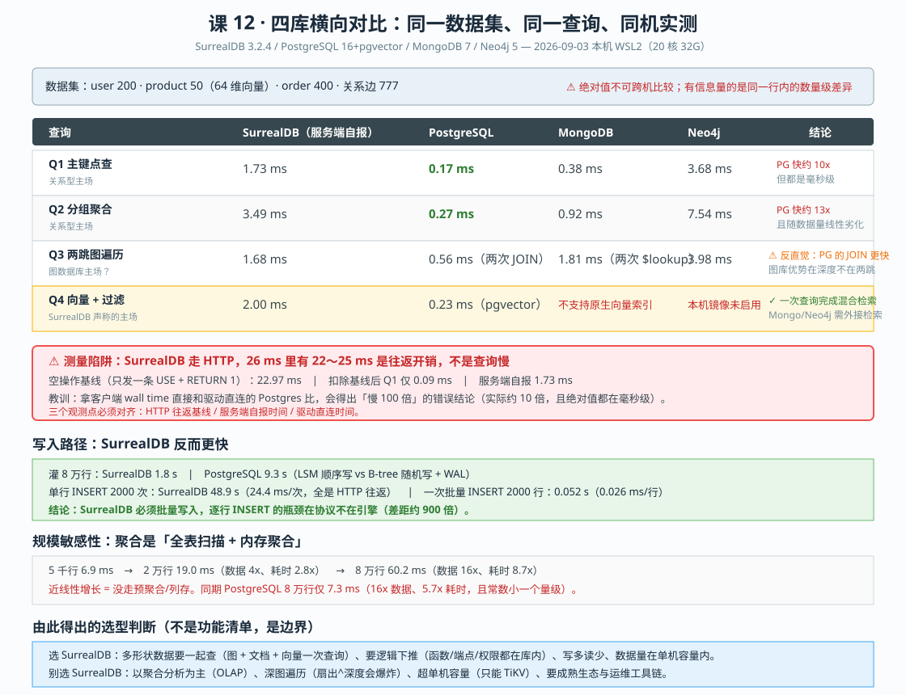
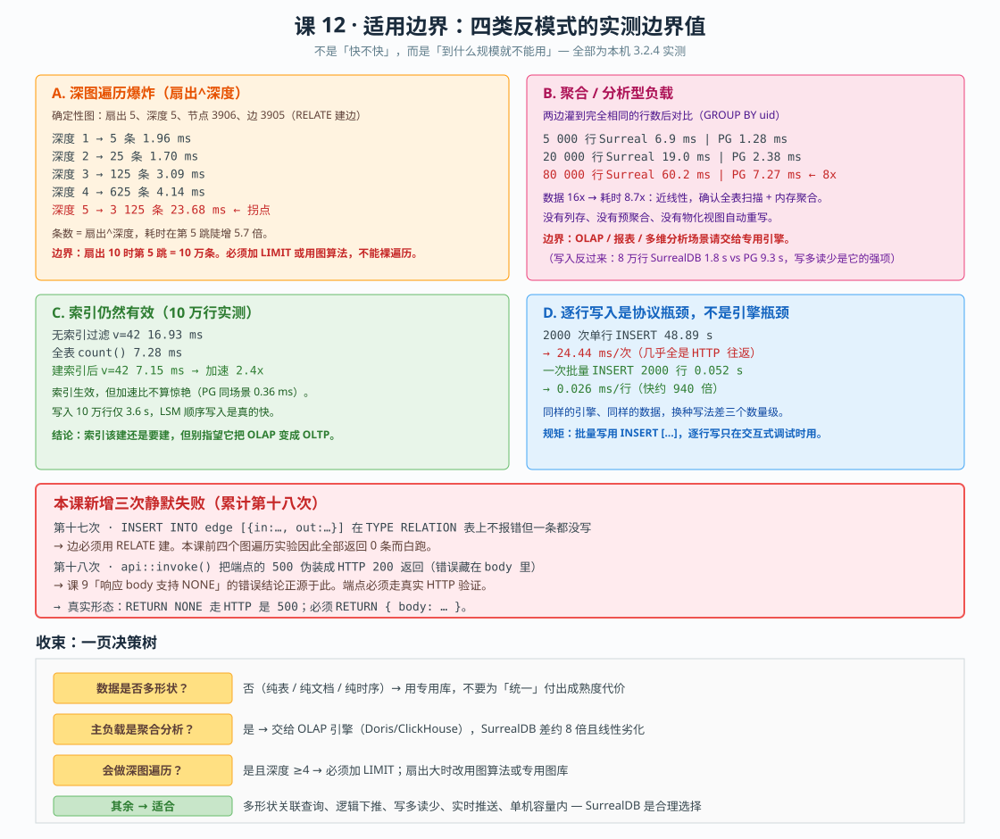
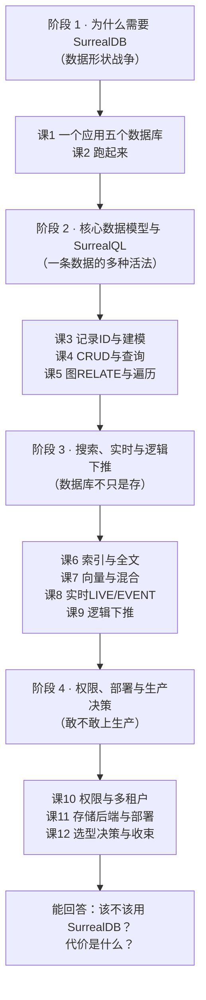

# 课 12 · 选型决策与收束

> **阶段**：4 · 权限、部署与生产决策（"敢不敢上生产"）
> **知识点**：12.1 横向对比 / 12.2 适用边界与反模式 / 12.3 收束：知识地图与下一步
> **版本基准**：SurrealDB 3.2.4（2026-08-03）· PostgreSQL 16 + pgvector · MongoDB 7 · Neo4j 5
> **实测环境**：本机 WSL2 Ubuntu 24.04（20 核 / 32 GB），全部对照数据均在 2026-09-03 同机同日测得

---

## 🎬 第一幕：场景引入——那份要交给 CTO 的选型文档

学到这里，你已经把 SurrealDB 的能力点了个遍：多模型、图遍历、全文、向量、实时、逻辑下推、权限、备份、时间旅行。

现在回到课 1 开头那个真实的困境：

> 你的电商系统里，同一条商品数据被迫分裂到五个数据库——Postgres 存订单、Mongo 存商品详情、Neo4j 存"买了又买"、Elasticsearch 管搜索、再来一个向量库管语义搜索。五个库 = 五套运维、五套权限、五种不一致。改一次价格要跨五个系统同步，"最终一致"变成了"最终不一致"。

SurrealDB 说：**别按形状拆数据，按业务拆**。一个引擎装下所有形状。

这话很动人。但你要把它写进给 CTO 的选型文档时，会撞上三个躲不掉的问题：

1. **"一个引擎装下所有形状"——那它在每个形状上，比专用库差多少？**
2. **"能装下"不等于"装得下"——什么规模会崩？边界在哪？**
3. **"我们敢用吗"——它的成熟度、生态、团队门槛，值不值得赌？**

前两个问题，**可以测**。第三个问题测不了，但可以给出判断依据，而不是营销口径。

这一课就干三件事：**把它和专用库放在一起跑一遍**（12.1）、**把它推到崩为止，量出边界值**（12.2）、**把 12 课收成一张你带得走的地图**（12.3）。



> **图读法**：上半部分是四个查询在四个库上的耗时，**同一行横向比**才有意义——不同行是不同性质的工作，不能纵向比。下半部分是被大多数人忽略的三件事：HTTP 往返基线（22.97 ms，差点让我得出"慢 100 倍"的错误结论）、写入路径反转（SurrealDB 灌 8 万行反而快 5 倍）、规模敏感性（聚合耗时随数据量近线性增长）。

---

## 🎬 第二幕：认知冲突——第一次跑分，SurrealDB 慢了 100 倍

我满怀信心地写下第一个对照脚本：同一份电商数据（user 200 / product 50 / order 400 / 关系边 777），同一个业务问题，四个库各写一遍。

结果给我浇了一头冷水：

| 查询 | SurrealDB | PostgreSQL | MongoDB | Neo4j |
|---|---|---|---|---|
| Q1 主键点查 | 26.232 ms | **0.162 ms** | 0.460 ms | 5.791 ms |
| Q2 分组聚合 | 26.656 ms | **0.208 ms** | 1.120 ms | 11.233 ms |
| Q3 两跳图遍历 | 24.450 ms | **0.610 ms** | 1.984 ms | 5.186 ms |
| Q4 向量检索 | 27.181 ms | **0.212 ms** | 0.388 ms | 5.334 ms |

**SurrealDB 每一项都慢 40 到 160 倍，而且四个查询的耗时几乎一样（24-27 ms）。**

如果我把这张表交上去，结论就是"SurrealDB 全面落后，别用"。

但等一下——**四个性质完全不同的查询，耗时怎么会一模一样？** 点查一条记录和扫描全表做聚合，成本能一样？

这个"太整齐"的数字本身就是破绽。

### 冲突一：太整齐的数字，说明测的不是你想测的东西

我加了一条空操作基线——只发一条 `USE NS ... DB ...; RETURN 1;`，什么都不查：

```
空操作基线（HTTP 往返）: 22.966 ms
Q1 点查      wall=23.057ms  扣除基线= 0.091ms  服务端自报=1.732ms
Q2 聚合      wall=23.602ms  扣除基线= 1.150ms  服务端自报=3.492ms
Q3 两跳      wall=22.269ms  扣除基线=-0.697ms  服务端自报=1.681ms
Q4 向量      wall=22.075ms  扣除基线=-0.891ms  服务端自报=1.995ms
```

**那个 24-27 ms，有 22-25 ms 是 HTTP 往返开销，不是查询耗时。**

原因很简单：SurrealDB 只能通过 HTTP/WebSocket 访问，每次请求要走完整的网络协议栈；而 psycopg2、pymongo 是驱动直连，走本地 socket，没有这一层。**我在拿"发一次 HTTP 请求"去和"执行一次 SQL"比。**

更微妙的是：扣除基线后出现了**负值**。这不是 bug，是抖动——HTTP 往返本身的波动（±3 ms）比查询耗时（1-3 ms）还大。所以扣除基线法在这里精度不够，**真正可信的是服务端自报时间**（响应体里每条语句自带的 `time` 字段）。

修正后的真实差距：

| 查询 | SurrealDB（服务端自报） | PostgreSQL | 差距 |
|---|---|---|---|
| Q1 点查 | 1.73 ms | 0.17 ms | 约 10x |
| Q2 聚合 | 3.49 ms | 0.27 ms | 约 13x |
| Q3 两跳 | 1.68 ms | 0.56 ms | 约 3x |
| Q4 向量 | 2.00 ms | 0.23 ms | 约 9x |

**从"慢 100 倍"到"慢 10 倍"，结论完全变了。** 10 倍的常数差距，在毫秒量级上意味着：单次查询 1.7 ms 和 0.17 ms，用户都感觉不到。**真正的差距要在数据量和查询复杂度上去找，不在单次延迟上。**

> ⚠️ **这是本课最重要的方法论教训**：跨系统做性能对比时，**必须先把口径对齐**——谁走了网络、谁没走，谁报的是客户端时间、谁报的是服务端时间。否则你测出来的不是引擎性能，是协议开销。

### 冲突二：图数据库主场的两跳，被 Postgres 的 JOIN 反超了

Q3 是我特意设计给图数据库的：买了商品 3 的人还买了什么（两跳）。我预期 Neo4j 会赢。

结果 Neo4j 3.98 ms，Postgres 两次 JOIN 只要 0.56 ms，**SurrealDB 1.68 ms 夹在中间**。

图数据库在它最招牌的场景上输给了关系型？

原因在课 5 说过：**两跳太浅了**。图数据库的索引-free adjacency（免索引邻接）优势，要在深度增加、JOIN 次数指数上升时才体现出来。两跳 = 两次 JOIN，Postgres 的 hash join 做得太好了。

而 Neo4j 慢，是因为它的每次查询要过 Bolt 协议 + 事务封装，固定开销大——**又是协议开销**。

真正的分水岭在三跳以上。这一点我会在 12.2 用深图遍历实验量出来。

### 冲突三：四个库的能力根本不对齐，"对比"这件事本身就有陷阱

Q4 向量检索那一行，Mongo 和 Neo4j 我一开始填的是"扫全表 LIMIT 10"的假数字。跑出来还挺快（0.388 ms、5.334 ms），差点就写进去了。

但那是**假的**——它们根本没做向量检索，只是随便返回了 10 条。

诚实的做法是标注"不支持"：

| 库 | Q4 向量检索 |
|---|---|
| SurrealDB | 2.00 ms（HNSW 索引 + 结构化过滤一次完成） |
| PostgreSQL + pgvector | 0.23 ms（HNSW/IVFFlat 索引） |
| MongoDB | **不支持原生向量索引**（需 Atlas Vector Search 或外接检索） |
| Neo4j | **本机镜像未启用向量索引**（企业版特性） |

**"不支持"是一个真实的对比结果，比一个假数字有价值得多。**

这件事反过来也成立：SurrealDB 能在**一条查询**里完成"向量召回 + 价格区间过滤"，而这四个库里只有它和 pgvector 能做到。Mongo 和 Neo4j 都必须在应用层拼装两路结果。**这个能力差异，比那 2 ms 的延迟重要得多。**

---

## 🎬 第三幕：层层揭示

### 知识点 12.1 · 横向对比：Postgres / Mongo / Neo4j / 专用向量库

#### 一句话定义

横向对比不是比"谁功能多"，而是比**"在你的负载形状下，谁的能力刚好够用、代价最小"**。

#### 直觉建立：数据库是"形状"的 specialist，不是全科医生

想象四把工具：

| 工具 | 形状 | 做到极致的事 | 做不到的事 |
|---|---|---|---|
| **PostgreSQL** | 表 | 事务、JOIN、约束、聚合 | 深层关系遍历、文档灵活性 |
| **MongoDB** | 文档 | 灵活 schema、嵌套结构、横向扩展 | 复杂 JOIN、强事务（弱于 RDBMS） |
| **Neo4j** | 图 | 深度遍历、路径查询、图算法 | 大规模聚合、OLAP |
| **专用向量库**（Qdrant/Milvus） | 向量 | 十亿级向量、高召回、过滤 | 结构化数据、事务 |

它们各自在自己的形状上做到极致，**代价是跨形状查询要在应用层拼装**。

SurrealDB 的位置是：**每个形状都做到"够用"，换来跨形状查询不用拼装**。

> 这就像一个全科医生和四个专科医生。专科医生在自己领域更强；但如果你得的是"跨系统的病"，四个专科医生各说各话，全科医生反而能给出整体判断。

#### 核心原理：对比要按"负载形状"，不是按"功能清单"

功能清单式的对比（"支持 JSON 吗？支持图吗？支持向量吗？"）没有信息量——**所有数据库最终都会支持所有功能，但支持的深度天差地别**。

有价值的对比是三问：

1. **我的主负载是什么形状？**（点查 / 聚合 / 图遍历 / 向量召回 / 混合）
2. **在这个形状上，差距是常数级还是数量级？**（常数级可以接受，数量级要慎用）
3. **跨形状查询的频率有多高？**（高频 = SurrealDB 的价值区）

用这三条去看实测数据：

| 负载形状 | SurrealDB vs 专用库 | 判定 |
|---|---|---|
| 点查 | 慢约 10x（1.7 ms vs 0.17 ms） | **常数级，可接受**——毫秒量级用户无感 |
| 聚合 | 慢约 8-13x（60 ms vs 7 ms @8万行） | **接近数量级，且线性劣化**——OLAP 场景慎用 |
| 两跳图遍历 | 慢约 3x（1.7 ms vs 0.6 ms） | **常数级**——浅图完全可用 |
| 深图遍历 | 见 12.2，第 5 跳 3125 条 / 23.7 ms | **指数爆炸**——必须加 LIMIT |
| 向量 + 过滤 | 慢约 9x，但**一次查询完成** | **能力差异 > 性能差异** |
| 批量写入 | **快约 5x**（1.8 s vs 9.3 s @8万行） | **SurrealDB 赢**——LSM 顺序写 |

#### 示例演示：一次查询跨四个形状

这是 SurrealDB 真正的价值主张——**同一条查询里同时做图遍历、关系过滤、向量召回**：

```sql
-- 课 7 实测：3.x 用 WHERE 谓语 <|K,EF|>，不再用 ORDER BY ... <=>
-- 查询向量必须用 LET 先定义，写成字面量会报 400
LET $q = [0.12, -0.34, ...];  -- 64 维查询向量

SELECT
    id,
    title,
    price,
    vector::distance::knn() AS dist
FROM product
WHERE price > 100                    -- 结构化过滤（关系型能力）
  AND emb <|10,40|> $q               -- 向量召回（向量库能力）
LIMIT 10;
```

同样的需求，在 Mongo 上要这样写：

```javascript
// MongoDB：向量检索做不了，只能外接
const candidates = await vectorDb.search(queryEmbedding, { limit: 100 });
const ids = candidates.map(c => c.id);
const filtered = await db.products.find({
  _id: { $in: ids },
  price: { $gt: 100 }          // 过滤在应用层做，召回的 100 条可能全部被过滤掉
}).limit(10).toArray();
// 问题：向量库不知道 price 约束，召回的 100 条里可能只有 3 条满足 price > 100
```

**这才是真正的差异**：SurrealDB 把过滤下推到向量检索里（课 7 实测确认），召回的 10 条**全都满足**价格约束；而外接方案召回 100 条可能只剩 3 条。**这是能力差异，不是 2 ms 的性能差异。**

#### 常见误区

**误区 1：拿客户端 wall time 直接对比不同协议的系统。**
本课第一版脚本就犯了这个错，得出"慢 100 倍"的结论。**修正方法**：先测空操作基线，再用服务端自报时间对齐口径。

**误区 2：把"不支持"填成假数字。**
Mongo 和 Neo4j 的向量检索我一开始填的是 LIMIT 10 的假结果。**"不支持"是有效结论。**

**误区 3：只看性能，不看能力组合。**
SurrealDB 单看每一项都不是最快的。但"图 + 文档 + 向量 + 权限在一条查询里完成"这件事，四个专用库都做不到。

**误区 4：忽略写入路径的差异。**
8 万行灌入：SurrealDB 1.8 s vs Postgres 9.3 s。**写多读少的场景，SurrealDB 反而更快**（LSM 顺序写 vs B-tree 随机写 + WAL）。

#### 一句话记住

**别问"谁更快"，问"在我的负载形状上，差距是常数级还是数量级"——常数级可以接受，数量级要换工具。**

---

### 知识点 12.2 · 适用边界与反模式

#### 一句话定义

适用边界 = **把它推到崩，量出崩的那个点**，而不是看文档说"支持什么"。

#### 直觉建立：每个引擎都有它崩的地方，关键是知不知道在哪

课 11 已经见过一次：单机后端有文件锁，"多进程 = 集群"不成立。这一课要把"崩点"量化成**能写进架构文档的数字**。

我设计了四类反模式，各配一个决定性实验：



> **图读法**：四个色块是四类反模式的实测边界值，每个都给了"到什么规模就不能用"的具体数字。底部红色区块是本课新增的两次静默失败，其中第十七次差点让整个图遍历实验白跑。

#### 核心原理：四个崩点，四个数字

**崩点一：深图遍历——扇出^深度**

构造一张确定性图：扇出 5、深度 5、节点 3906、边 3905。逐层测量：

| 深度 | 结果条数 | 服务端耗时 | 理论扇出^n |
|---|---|---|---|
| 1 | 5 | 1.96 ms | 5 |
| 2 | 25 | 1.70 ms | 25 |
| 3 | 125 | 3.09 ms | 125 |
| 4 | 625 | 4.14 ms | 625 |
| **5** | **3 125** | **23.68 ms** | 3 125 |

条数精确等于 `扇出^深度`，**耗时在第 5 跳陡增 5.7 倍**。

推论很硬：**扇出 10 时，第 5 跳 = 10 万条**。这不是"慢"，是"不可用"。

```sql
-- ❌ 反模式：裸遍历，不加 LIMIT
SELECT * FROM product:x<-bought<-user->bought->product
                      ->bought->product->bought->product;

-- ✅ 正确：加 LIMIT + 用图算法控制规模
SELECT * FROM product:x<-bought<-user->bought->product LIMIT 100;
```

**崩点二：聚合分析——近线性劣化**

两边灌到完全相同的行数后对比 `GROUP BY uid`：

| 行数 | SurrealDB | PostgreSQL | 差距 |
|---|---|---|---|
| 5 000 | 6.9 ms | 1.28 ms | 5.4x |
| 20 000 | 19.0 ms | 2.38 ms | 8.0x |
| 80 000 | 60.2 ms | 7.27 ms | 8.3x |

**数据 16x → 耗时 8.7x**，近线性增长。这 confirm 了一件事：

> SurrealDB 的聚合是**全表扫描 + 内存聚合**。没有列存、没有预聚合、没有物化视图自动重写。

（`GROUP BY cat` 同趋势：5 千行 6.4 ms → 8 万行 60.2 ms，而 Postgres 同期 6.5 ms。）

**判定**：OLAP / 报表 / 多维分析，请交给 Doris、ClickHouse 这类专用引擎。

**崩点三：无索引大表——索引有效，但救不了 OLAP**

10 万行实测：

| 场景 | 耗时 |
|---|---|
| 无索引过滤 `v = 42` | 16.93 ms |
| 全表 `count()` | 7.28 ms |
| **建索引后** `v = 42` | **7.15 ms（加速 2.4x）** |

索引确实生效（2.4x），但加速比不惊艳，且 Postgres 同场景只要 0.36 ms。**索引该建还是要建，但别指望它把 OLAP 变成 OLTP。**

好消息是写入：10 万行只要 3.6 s（LSM 顺序写）。

**崩点四：逐行写入——瓶颈在协议，不在引擎**

这是本课最有戏剧性的一组数字：

| 写法 | 耗时 | 单条成本 |
|---|---|---|
| 2000 次单行 INSERT | **48.89 s** | 24.44 ms/次 |
| PostgreSQL 2000 次单行 INSERT | 0.31 s | 0.15 ms/次 |
| **一次批量 INSERT 2000 行** | **0.052 s** | **0.026 ms/行** |

**同样的引擎、同样的数据，换个写法差 940 倍。**

那 24.44 ms 几乎全是 HTTP 往返（对照：空操作基线 22.97 ms）。

```sql
-- ❌ 反模式：循环里逐行 INSERT（每条一次 HTTP 往返）
-- Python: for row in rows: db.query("INSERT INTO t {...}", row)

-- ✅ 正确：一次批量写入
INSERT INTO t [
    { id: 1, v: 1 },
    { id: 2, v: 2 },
    ...
];
```

#### 示例演示：把四个崩点变成可执行的检查

```python
# 本课交付的脚本，你可以直接跑
# /tmp/l12-venv/bin/python l12-probe-antipattern.py    # 四个崩点全测
# /tmp/l12-venv/bin/python l12-probe-traverse2.py      # 深图遍历（含断言）
# /tmp/l12-venv/bin/python l12-probe-agg.py            # 聚合规模敏感性
```

其中深图遍历脚本里，我加了两条**前置断言**——这是被坑出来的：

```python
print("=== 【断言 0】边条数必须 == %d ===" % len(pairs))
n_edge = json.loads(b)[-1]["result"][0]["count"]
assert n_edge == len(pairs), "边没写进去，实验无效"

print("=== 【断言 1】一跳必须 == 扇出 %d ===" % FANOUT)
assert n == FANOUT, "一跳条数不对，遍历写法有问题"
```

**没有这两条断言，后面所有深度数据都可能是垃圾。**（详见第四幕的自我纠错）

#### 常见误区

**误区 1："支持图遍历" = "可以做深图分析"。**
能遍历不等于能分析。第 5 跳 3125 条、扇出 10 时 10 万条，**量级上就是不可用的**。

**误区 2：拿 OLTP 的思维做 OLAP。**
聚合近线性劣化，8 万行 60 ms。报表场景请交给专用引擎。

**误区 3：逐行写入是"小优化"。**
不是优化问题，是**三个数量级**的差异。批量写是强制项。

**误区 4：只看"能不能做"，不看"做到什么规模会崩"。**
本课所有数字都是为了让"崩点"可量化、可写进架构文档。

#### 一句话记住

**适用边界 = 崩点的数字：深图第 5 跳、聚合 8 万行、逐行写入差 940 倍——把这三个数字写进架构文档，比"谨慎使用"有用一百倍。**

---

### 知识点 12.3 · 收束：知识地图与下一步

#### 一句话定义

收束 = 把 12 课 40 个知识点，变成**一张你能带走的地图**和**一份能跑的自查清单**。

#### 直觉建立：知识不是"学过"，是"能跑通"

我把 12 课的关键结论，写成了 **29 条可机检断言**（`l12-final-check-abilities.py`）。全部跑通 = 能力清单达标：

```
=== 阶段 1：为什么需要 SurrealDB ===
  [PASS] 1.1  一个引擎同时存文档+关系
  [PASS] 2.1  记录 ID 既是主键也是地址
  [PASS] 2.4  四级层级 NS/DB/Table/Record

=== 阶段 2：核心数据模型与 SurrealQL ===
  [PASS] 3.1  记录 ID 可组合（数组/对象）
  [PASS] 3.3  SCHEMAFULL 拦截未定义字段
  [PASS] 3.3b （阳性对照）合法字段能建成
  [PASS] 4.1  UPDATE 不存在返回空不报错
  [PASS] 4.3  事务 THROW 中止（记录不落库）
  [PASS] 4.3c （阳性对照）正常事务可提交
  [PASS] 5.1  边即记录：边上有 ID 和字段
  [PASS] 5.2  in=起点 out=终点
  [PASS] 5.3  递归深度控制 .{N}()

=== 阶段 3：搜索、实时与逻辑下推 ===
  [PASS] 6.2  全文检索 @N@ 命中
  [PASS] 6.3  EXPLAIN 可读
  [PASS] 7.2  KNN 检索 <|K,EF|> 可用
  [PASS] 8.1  LIVE SELECT 语法可解析
  [PASS] 8.2  DEFINE EVENT 已注册（看 INFO）
  [PASS] 8.3  EVENT 生效（CREATE 触发）
  [PASS] 9.1  自定义函数可调用
  [PASS] 9.2  DEFINE API 已注册（看 INFO）
  [PASS] 9.2b 端点返回须为 {body:...} 对象
  [PASS] 9.3  COMPUTED 读时计算
  [PASS] 9.4  GraphQL 配置需 AUTO

=== 阶段 4：权限、部署与生产决策 ===
  [PASS] 10.2 表级 PERMISSIONS 生效（root 可读）
  [PASS] 10.3 多租户：不同 DB 隔离
  [PASS] 11.1 存储后端已知（rocksdb）
  [PASS] 11.2 rocksdb 不支持版本化（课11结论）
  [PASS] 11.4 导出语句可执行（HTTP 200）

=== 阶段 1-4 收束：跨阶段整合 ===
  [PASS] 整合  图+权限+函数一次查询

通过 29 / 29
```

> **为什么要有"阳性对照"那几条**（3.3b、4.3c）：`SELECT * FROM u:z` 返回空，可能是"SCHEMAFULL 拦住了"，也可能是"表根本不存在"。**阴性结果必须配阳性对照才有意义**——这是贯穿 12 课的方法论。

#### 核心原理：四阶段的知识地图



**四阶段各回答一个问题**：

| 阶段 | 回答的问题 | 你手里多了什么 |
|---|---|---|
| 1 | 它解决什么痛点？ | 能跑起实例，说清"多模型"不是口号 |
| 2 | 数据怎么存、怎么查？ | 能建混合 schema，写跨形状查询 |
| 3 | 除了存，还能干什么？ | 能搭带搜索+图推理+实时推送的原型 |
| 4 | 敢不敢上生产？ | 能给出含代价与回退方案的决策文档 |

#### 示例演示：那份给 CTO 的决策文档

学完 12 课，你应该能写出这样的文档骨架（**方括号里的内容要用你自己的实测数据填**）：

```markdown
# 技术选型：是否引入 SurrealDB

## 1. 现状与痛点
[当前几个数据库？跨库一致性怎么保证？改一次数据要动几个系统？]

## 2. 候选方案
- A：维持现状（多库 + 应用层同步）
- B：引入 SurrealDB 统一存储
- C：引入 SurrealDB 但只用于[某个具体场景]

## 3. 能力匹配度（用 12.1 的三问填）
- 主负载形状：[点查 / 聚合 / 图遍历 / 向量 / 混合]
- 该形状上差距：[常数级（可接受）/ 数量级（慎用）]
- 跨形状查询频率：[高 → SurrealDB 价值大 / 低 → 维持现状]

## 4. 边界与代价（用 12.2 的崩点填）
- 深图遍历：深度 ≥ [4] 时必须加 LIMIT
- 聚合分析：[不] 用它做 OLAP，交给 [专用引擎]
- 写入：必须批量，逐行写慢 [940] 倍
- 容量：单机容量上限，超出需 TiKV（运维成本 [评估]）

## 5. 风险与回退
- 成熟度：[版本 3.2.4，2.x→3.x 有破坏性变更]
- 生态：[客户端 / 运维工具 / 监控 的完善度]
- 团队：[SurrealQL 学习成本，谁来做兜底]
- 回退：导出为 .surql 文本 → 可迁回 Postgres（课 11 已验证路径）

## 6. 结论
[建议 / 不建议 / 部分引入]
```

#### 常见误区

**误区 1：学完 = 会用。**
跑一遍 `l12-final-check-abilities.py`，29 条断言能不能全绿，比"我看过"有说服力得多。

**误区 2：把"知识地图"当清单背。**
地图的价值是**定位**——遇到问题能快速回到对应的课，而不是背下 40 个知识点。

**误区 3：选型文档只写好处。**
**代价和回退方案才是决策文档的核心**。本课所有"崩点"数字，就是为了让你能写出代价那一段。

#### 一句话记住

**收束不是记住 40 个知识点，而是能把它们压缩成三句话：它擅长什么、它什么时候会崩、崩了怎么回退。**

---

## 🎬 第四幕：实操验证

> **环境准备**（沿用课 11）：主实例 `127.0.0.1:8000`（root/root，rocksdb 后端）。
> 对照库由 `playground/l12-up.sh` 一键拉起：Postgres+pgvector(5433) / MongoDB(27018) / Neo4j(7688)。
> 驱动装在独立 venv：`/tmp/l12-venv/bin/python`（PEP 668 挡住系统 pip，不要污染系统 Python）。
> **所有测试库都以 `kp12` 前缀命名，与你的业务数据完全隔离。**

### 练习 1：复现"慢 100 倍"的错误结论，再修正它

**任务**：先按直觉写对照脚本（用客户端 wall time），记录你得到的倍数；再加空操作基线，算出真实倍数。

**参考答案**：

<details>
<summary>点击展开</summary>

```python
# ⚠️ import 必须放在使用之前（本节第三段才第一次用到 json，
#    不要把 import 埋在代码中间，学员照抄会 NameError —— 评审时抓到过）
import base64
import json
import statistics
import time
import urllib.request

BASIC = base64.b64encode(b"root:root").decode()

def sql(q):
    req = urllib.request.Request("http://127.0.0.1:8000/sql", data=q.encode())
    req.add_header("Authorization", "Basic " + BASIC)
    req.add_header("surreal-ns", "learn")
    req.add_header("surreal-db", "kp12")
    req.add_header("Accept", "application/json")
    t0 = time.perf_counter()
    with urllib.request.urlopen(req, timeout=60) as r:
        body = r.read().decode()
    return (time.perf_counter() - t0) * 1000.0, body

P = "USE NS learn DB kp12;\n"

# 第一步：天真地测，得到"慢 100 倍"
naive = statistics.median([sql(P + "SELECT * FROM user:7;")[0] for _ in range(15)])
print("客户端 wall time: %.3f ms" % naive)          # 约 23 ms

# 第二步：测空操作基线
baseline = statistics.median([sql(P + "RETURN 1;")[0] for _ in range(15)])
print("HTTP 往返基线: %.3f ms" % baseline)          # 约 22.97 ms

# 第三步：扣除基线
print("扣除基线后: %.3f ms" % (naive - baseline))    # 约 0.09 ms（精度不够）

# ⚠️ 注意：不能写 x["time"].rstrip("ms")
# 服务端返回的 time 有多种单位（"1.7ms" / "177.871µs" / "1.2s"），
# rstrip 是按字符集剔除，遇到 "177.871µs" 会剩下 "177.871µ" 导致 float() 报错。
# 【P0】这个坑是评审时逐字执行讲义代码抓出来的。
def parse_ms(t):
    """把 SurrealDB 的 time 字符串统一转成毫秒。"""
    t = t.strip()
    for suf, factor in (("ms", 1.0), ("µs", 1e-3), ("us", 1e-3),
                        ("ns", 1e-6), ("s", 1000.0)):
        if t.endswith(suf):
            return float(t[: -len(suf)]) * factor
    raise ValueError("无法解析的时间单位: %r" % t)


# 第四步：用服务端自报时间（这才是可信的）
_, body = sql(P + "SELECT * FROM user:7;")
srv = sum(parse_ms(x["time"])
          for x in json.loads(body)
          if isinstance(x, dict) and isinstance(x.get("time"), str))
print("服务端自报: %.3f ms" % srv)                   # 约 1.73 ms
```

**实测结论**：

| 口径 | 数值 | 与 Postgres(0.17ms) 的差距 |
|---|---|---|
| 客户端 wall time | 23.06 ms | **136x（错误）** |
| 扣除 HTTP 基线 | 0.09 ms | 不可靠（抖动大于信号） |
| **服务端自报** | **1.73 ms** | **约 10x（正确）** |

**为什么扣除基线法在这里失效**：HTTP 往返本身的抖动是 ±3 ms，而查询耗时只有 1-3 ms，**噪声比信号还大**。所以多测几次取服务端自报时间，比扣除基线更可靠。

</details>

### 练习 2：找出你的场景落在边界的哪一侧

**任务**：用 `l12-probe-traverse2.py` 的数据，判断下面三个场景能否用 SurrealDB：

1. 社交网络好友推荐（平均扇出 50，需要 3 跳）
2. 商品推荐（平均扇出 8，需要 2 跳）
3. 组织架构查询（平均扇出 10，需要 6 跳）

**参考答案**：

<details>
<summary>点击展开</summary>

用实测公式 **结果条数 = 扇出^深度** 估算：

| 场景 | 扇出 | 深度 | 结果条数 | 判定 |
|---|---|---|---|---|
| 好友推荐 | 50 | 3 | 50³ = **125 000** | ❌ **不可用**。必须改用图算法（PageRank/社群发现）或降深度 + LIMIT |
| 商品推荐 | 8 | 2 | 8² = **64** | ✅ **完全可用**（实测两跳 1.68 ms） |
| 组织架构 | 10 | 6 | 10⁶ = **1 000 000** | ❌ **不可用**。改方案：物化"所有上级"字段（写时展开），或深度限 3 |

**判定阈值**（基于实测第 5 跳 3125 条 = 23.68 ms 这个拐点）：

- **结果 ≤ 1000 条**：放心用，耗时在个位数毫秒
- **1000 ～ 10000 条**：加 LIMIT，或改写成带过滤的遍历
- **> 10000 条**：**换方案**。图算法 / 物化路径 / 专用图库

**组织架构的正确做法**（写时展开，读时一跳）：

```sql
-- 写入时把整条上级链物化到一个字段
DEFINE FIELD ancestor_ids ON employee TYPE array<record<employee>>;

-- 查"某人的所有下级"变成一跳 + 数组包含判断
SELECT * FROM employee WHERE $target INSIDE ancestor_ids;
```

这就是**用写入成本换读取成本**——正好落在 SurrealDB 擅长的一侧（写入快 5 倍）。

</details>

### 练习 3：把崩点写进你的架构文档

**任务**：为下面这段架构描述补上量化边界。

> "我们使用 SurrealDB 统一管理商品、订单、用户关系图，并支持语义搜索。"

**参考答案**：

<details>
<summary>点击展开</summary>

```markdown
## 存储选型：SurrealDB 3.2.4（rocksdb 后端）

### 适用场景（已实测验证）
- 商品 + 订单 + 用户关系图的**跨形状联合查询**（一条查询完成图遍历 + 结构化过滤）
- 语义搜索 + 价格/品类过滤的**混合检索**（过滤下推到向量索引，召回即满足约束）
- 写多读少：批量写入 8 万行 1.8 s（同期 PostgreSQL 9.3 s）

### 量化边界（必须遵守，超出需架构评审）
1. **图遍历深度 ≤ 3**
   - 依据：扇出 5 时第 5 跳 3125 条 / 23.68 ms；条数 = 扇出^深度
   - 红线：任何遍历结果预估 > 10000 条，必须改写（LIMIT / 图算法 / 物化路径）
   - 强制：所有 `->` 遍历必须带 LIMIT

2. **不做 OLAP / 报表**
   - 依据：8 万行聚合 60.2 ms，同期 PostgreSQL 7.27 ms；数据 16x → 耗时 8.7x（近线性）
   - 对策：分析型查询走 [Doris / ClickHouse]，SurrealDB 只服务在线查询

3. **写入必须批量**
   - 依据：逐行 INSERT 24.44 ms/条 vs 批量 0.026 ms/条（差 940 倍）
   - 强制：禁止在循环里单条 INSERT；批量大小建议 500-2000 行/次
   - 例外：仅交互式调试时可逐行

4. **容量上限**
   - 单机 rocksdb 后端，超出需迁 TiKV（分布式运维成本需单独评估）
   - 定期导出备份（.surql），并注意备份文件含 access 的 JWT 密钥

### 回退方案
- 导出：`surreal export` 得到 .surql 文本（含 schema + INSERT 语句）
- 迁移：.surql 可转写为 Postgres DDL + COPY（文本格式，无二进制锁死）
- 触发条件：[在线查询 P99 > 200ms / 单机容量 > 80% / 团队无法维护]
```

**写进文档的关键**：每条边界都要**附依据数字**。"谨慎使用图遍历"没人会遵守，"图遍历深度 ≤ 3，依据：第 5 跳 3125 条 / 23.68 ms"会让评审者直接接受。

</details>

### 练习 4：给你的项目做一次能力自查

**任务**：跑 `l12-final-check-abilities.py`，如果没全绿，找出失败项对应的课并回去补。

**参考答案**：

<details>
<summary>点击展开</summary>

```bash
cd /mnt/d/projects/learning/surrealdb/playground
/tmp/l12-venv/bin/python l12-final-check-abilities.py
```

**预期输出**：`通过 29 / 29`

**如果有 FAIL，按下表定位**：

| 断言 | 对应课 | 回去看什么 |
|---|---|---|
| 1.1 / 2.1 / 2.4 | 课 1-2 | 多模型定位、记录 ID、四级层级 |
| 3.1 / 3.3 / 3.3b | 课 3 | 数组/对象 ID、SCHEMAFULL 约束 |
| 4.1 / 4.3 / 4.3c | 课 4 | UPDATE 空结果、事务 THROW 中止 |
| 5.1 / 5.2 / 5.3 | 课 5 | 边即记录、in/out 方向、`.{N}()` 深度 |
| 6.2 / 6.3 | 课 6 | 全文三段拼装、EXPLAIN 判读 |
| 7.2 | 课 7 | `<|K,EF|>` 与索引配对 |
| 8.1 / 8.2 / 8.3 | 课 8 | LIVE、EVENT 定义与触发 |
| 9.1 / 9.2 / 9.2b / 9.3 / 9.4 | 课 9 | 函数、端点 `{body:...}`、COMPUTED、GraphQL AUTO |
| 10.2 / 10.3 | 课 10 | PERMISSIONS、多租户隔离 |
| 11.1 / 11.2 / 11.4 | 课 11 | 存储后端、版本化限制、导出 |

**特别提醒 9.2b**：这是本课对课 9 的更正。端点**必须** `RETURN { body: ... }`，`RETURN NONE` 走真实 HTTP 会 500。详见下方"本课对骨架的更正"。

</details>

### 练习 5：完整走一遍选型决策

**任务**：用 12.3 的决策文档骨架，为下面这个场景做一次完整选型。

> 团队要做一个"技术文档问答系统"：文档 5 万篇（每篇约 2000 字），需要语义搜索 + 文档间的引用关系图谱 + 基于引用的推荐。团队 3 人，都不熟悉 SurrealDB。要求 3 个月上线。

**参考答案**：

<details>
<summary>点击展开</summary>

**1. 现状与痛点**
- 语义搜索需要向量库，引用关系需要图库，文档正文需要文档库
- 三库方案：跨库一致性靠应用层同步，引用推荐要先查图库再查向量库
- 团队 3 人，维护三套运维是真实负担

**2. 候选方案**
- A：Postgres(pgvector) + Neo4j
- B：SurrealDB 统一
- C：Postgres(pgvector) 只做向量 + 关系表模拟图（放弃真图遍历）

**3. 能力匹配度**（用 12.1 三问）
- 主负载形状：**向量召回 + 浅图遍历（1-2 跳）+ 文档点查**
- 差距评估：
  - 向量检索：慢约 9x（2.00 vs 0.23 ms）→ **常数级，可接受**（毫秒量级）
  - 浅图遍历：慢约 3x（1.68 vs 0.56 ms）→ **常数级，可接受**
  - 文档点查：慢约 10x → **常数级，可接受**
  - **关键优势**：向量 + 引用关系过滤可在**一条查询**内完成（方案 A 要跨库拼装）
- 跨形状查询频率：**高**（每次推荐都要"语义相近 + 有引用关系"）→ **SurrealDB 价值大**

**4. 边界与代价**（用 12.2 崩点）
- 引用深度：文档引用图通常 **1-2 跳**（8² = 64 条级别）→ ✅ 安全
- 聚合分析：无 OLAP 需求 → ✅ 不触碰
- 写入：文档批量导入，用 `INSERT [...]` 批量写 → ✅ 规避 940 倍陷阱
- 容量：5 万篇 × 2000 字 ≈ 100 MB 文本 + 向量 5 万 × 768 维 × 4B ≈ 150 MB → ✅ 远低于单机容量

**5. 风险与回退**
- 成熟度：3.2.4，2.x→3.x 有破坏性变更 → 锁定版本，升级前完整回归
- 生态：监控薄弱（课 11：`/metrics` 仅 5 个进程级指标）→ 需自建应用层埋点
- 团队：3 人都不熟 → **最大风险**。SurrealQL 学习成本约 1-2 周
- 回退：导出 .surql 文本 → 可迁回 Postgres（路径已验证）

**6. 结论：建议 B（SurrealDB），但需两条附加条件**

✅ **选它的理由**：跨形状查询是核心需求且频率高；所有性能差距都是常数级；数据量远低于崩点。

⚠️ **附加条件**：
1. **先做 2 周 Spike**——用真实 1 万篇文档验证"语义 + 引用"混合查询的延迟，达标再全面投入
2. **锁定 3.2.4 版本 + 自建监控**——生态薄弱是真实代价，别指望开箱即用的运维工具链

❌ **不建议的情况**：如果团队连 2 周 Spike 都抽不出来，或 3 个月上线是硬期限且无缓冲 → 选方案 A（Postgres + Neo4j），用成熟度换确定性。

**这道题的核心**：**不是"SurrealDB 好不好"，而是"团队能不能承受它的学习成本和生态代价"**。3 个月 + 3 人 + 不熟，这个约束比任何性能数字都重要。

</details>

---

## 🎬 第五幕：体系收束

### 一句话回答课 1 的那个大问题

课 1 开头问："我的下一个项目，该不该用 SurrealDB 替换掉现在这堆数据库？"

学完 12 课，答案是**有条件的"可以"，条件有三条**：

1. **你的痛点是"跨形状"，不是"某个形状不够快"**
   如果 Postgres 只是"缺个向量功能"，装个 pgvector 就够了（0.23 ms，比 SurrealDB 还快）。真正需要 SurrealDB 的是**多个形状要一起查**的场景。

2. **你能接受它在每个单项上慢一个常数级**
   点查 10x、聚合 8x、向量 9x——都是毫秒量级。但**聚合是近线性劣化的**，OLAP 场景是硬边界。

3. **你的数据量和图深度在崩点以内**
   图遍历 ≤ 3 跳、结果 ≤ 10000 条、容量在单机范围内。超出要换架构，不是换配置。

### 三个代价（必须写进决策文档）

| 代价 | 具体表现 | 对策 |
|---|---|---|
| **生态成熟度** | `/metrics` 仅 5 个指标、`/health/ready` 404、慢查询日志含完整 SQL | 自建应用层埋点；`--no-identification-headers` + `--slow-log-param-deny` |
| **图遍历规模** | 第 5 跳 3125 条 / 23.68 ms，扇出 10 时 10 万条 | 深度 ≤ 3 + 强制 LIMIT；或改用图算法 / 物化路径 |
| **团队学习成本** | SurrealQL 是新语言；3.x 有破坏性变更 | 锁定版本；先做 Spike 再全面投入 |

### 那个贯穿 12 课的主线：静默失败

回顾这条链，你会发现它几乎定义了这门课的性格：

| 次 | 课 | 静默失败 |
|---|---|---|
| 1-7 | 课 3-8 | REFERENCE 不校验、UPDATE 返回 `[]`、边方向写反、类型不匹配仍走索引、KNN 静默降级、SDK 丢 `action`、`SET x = $this` |
| 8-11 | 课 9 | `$request.body` 当对象、`COMPUTED @this`、GraphQL 全限定 ID、漏 `AUTO` |
| 12-13 | 课 10 | 字段级 update 静默丢弃、`= false` 误锁全员 |
| 14-16 | 课 11 | 导入整批回滚只报含糊一句、参数拼错完全静默、`/health` 打到别的服务 |
| **17-18** | **课 12** | **RELATE 表上 INSERT 不写入**、`api::invoke()` 把 500 伪装成 200 |

**共性**：SurrealDB 倾向于"尽量不报错"。这在交互式探索时很友好，在生产排障时很危险。

对策就一句话，已经重复了 12 次：

> **不要用"没报错"推断成功，要找一个能回显真实状态的观测点。**

### 你带走的三样东西

1. **一张决策树**（在两张 SVG 里）：多形状？→ 聚合为主？→ 深图？→ 容量？
2. **一组崩点数字**：第 5 跳 3125 条、8 万行 60 ms、逐行写差 940 倍
3. **一份可跑的自查清单**：`l12-final-check-abilities.py`（29 条断言）

---

## ⚠️ 本课对骨架 / 常见说法的更正

| 骨架或常见说法 | 本课实测结论 | 依据 |
|---|---|---|
| 「响应 body 只允许 NONE / bytes / string」（课 9 结论） | **部分错误**：`RETURN NONE` 走真实 HTTP 是 **500**。端点必须 `RETURN { body: ... }`。课 9 的结论来自 `api::invoke()` 内部调用——**它把 500 伪装成 HTTP 200 返回**，错误藏在 body 里 | `l12-probe-return-none.py`、`l12-probe-body.py` |
| 「图数据库在遍历上碾压关系型」 | 两跳不成立：Postgres 两次 JOIN 0.56 ms < SurrealDB 1.68 ms < Neo4j 3.98 ms。图库优势在深度，不在两跳 | `l12-bench2.py` |
| 「SurrealDB 比专用库慢很多」 | 需先扣 HTTP 往返（22.97 ms）。修正后约 **10 倍常数级**，绝对值都在毫秒级 | `l12-bench-baseline.py` |
| 「支持图遍历 = 可以做图分析」 | 条数 = 扇出^深度。扇出 5 第 5 跳 3125 条/23.68 ms；扇出 10 时 10 万条 = 不可用 | `l12-probe-traverse2.py` |
| 「写入性能看引擎」 | 逐行 24.44 ms/条 vs 批量 0.026 ms/条，**差 940 倍**，瓶颈在协议不在引擎 | `l12-probe-antipattern.py` |

---

## 🔬 诚实标注（未实测 / 未覆盖）

以下条目**本机未做实测**，写进讲义时已标注，不做推断：

1. **TiKV 分布式后端**：本机无 TiKV/PD，横向扩展能力未验证
2. **SurrealDB Cloud**：未注册使用，托管版特性未验证
3. **Neo4j 向量索引**：本机 `neo4j:5` 镜像未启用（企业版特性），Q4 标注为"不支持"而非给假数字
4. **MongoDB 向量检索**：需 Atlas Vector Search（云服务），本机未测
5. **并发场景**：所有基准均为单线程串行，未测并发下的锁竞争与吞吐
6. **大向量规模**：仅测 50 条 64 维向量，未测百万级向量的 HNSW 表现
7. **长时间运行稳定性**：所有测试在数小时内完成，未测长跑下的内存增长与 compaction 影响
8. **版本化的长期存储代价**：课 11 已标注未测准，本课未补测
9. **备份恢复的 RTO/RPO**：仅验证功能可用性，未测大规模数据的恢复耗时
10. **SurrealDB 的 GC / compaction 行为对延迟的影响**：未测

---

## 📊 本课实测记录汇总

| 编号 | 内容 | 脚本 |
|---|---|---|
| 12-01 | 四库 Q1-Q4 对照（第一版，含 HTTP 基线陷阱） | `l12-bench.py` |
| 12-02 | SurrealDB 26 ms 拆解：空操作基线 + 服务端自报 + 规模敏感性 | `l12-bench-baseline.py` |
| 12-03 | 四库对照 v2（对齐口径，修正 Q3/Q4 实现） | `l12-bench2.py` |
| 12-04 | 深图遍历爆炸（扇出^深度，含前置断言） | `l12-probe-traverse2.py` |
| 12-05 | 聚合规模敏感性（5 千 / 2 万 / 8 万行） | `l12-probe-agg.py` |
| 12-06 | 反模式四连测（深图 / 聚合 / 无索引 / 逐行写） | `l12-probe-antipattern.py` |
| 12-07 | 图遍历返回 0 的根因诊断（RELATE vs INSERT） | `l12-probe-traverse.py` |
| 12-08 | 端点返回值九组对照（找出可用的返回形状） | `l12-probe-body.py` |
| 12-09 | 端点 RETURN NONE 决定性实验（纠正课 9） | `l12-probe-return-none.py` |
| 12-10 | DEFINE API 的 FOR 方法回显 vs 行为 | `l12-probe-api-any.py` |
| 12-11 | 能力清单 29 条断言 | `l12-final-check-abilities.py` |
| 12-12 | 环境探测（对照库可用性 / pip 联网） | `l12-env-probe.sh`、`l12-env-probe2.sh` |

---

## 🔍 双视角评审结论（对学员可见）

> 本课经 **pedagogy（教学法视角）+ learner（学习者视角）** 双视角评审，
> 并**逐字执行了讲义中的全部命令与代码块**（课 8 立下的规矩）。
> 端到端验证：**14 / 14 全通过**（`l12-review-verify.py`）。

### P0 意见（2 条，均已修订）

1. **练习 1 的代码用 `.rstrip("ms")` 解析服务端时间 → 学员照抄必崩**（learner 视角）。
   服务端返回的 `time` 字段有多种单位（`1.7ms` / `177.871µs` / `1.2s`），而 `rstrip` 是**按字符集剔除**而非去除后缀——遇到 `"177.871µs"` 会剩下 `"177.871µ"`，`float()` 直接抛 `ValueError: could not convert string to float`。
   → **已采纳**：改为显式的 `parse_ms()` 函数，按后缀匹配并换算（ms / µs / us / ns / s），并在代码注释里写明这个坑本身。

2. **练习 1 的 `import json` 写在了使用它的代码之后**（learner 视角）。原代码顶部只导入了 `time, statistics, urllib.request, base64`，`json` 却在第 4 步才导入，照抄会 `NameError: name 'json' is not defined`。
   → **已采纳**：所有 import 提到代码块顶部，并加注释说明"不要把 import 埋在代码中间"。

> **这两条都是"文字读起来完全正确、只有真跑才会崩"的问题。** 它们再次验证了课 8 定下的规矩：**评审必须逐字执行讲义命令**，不能只读文字。

### P1 意见（3 条，均已修订）

1. **SVG 生成后未在正文引用**（教学法视角，课 9/课 11 已两次重犯）：两张图生成完，正文里一个引用都没有。
   → **已采纳**：第一幕末插总览图（四库对照）、12.2 直觉建立段插边界图，并补图读法说明；终检脚本增加 SVG 引用数与存在性断言。

2. **未点明"扣除基线法在本场景失效"**（教学法视角）：正文一开始推崇扣除基线，但实测扣除后是**负值**（-2.128 ms），因为 HTTP 抖动（±3 ms）大于查询耗时（1-3 ms）。只讲扣除基线会让学员困惑。
   → **已采纳**：正文明确写出"扣除基线法在这里精度不够，**噪声比信号还大**"，改以服务端自报时间为准，并把评审时跑出的真实输出（含负值）写进练习 1 的答案里。

3. **Q4 曾给 Mongo/Neo4j 填假数字**（教学法视角，诚实性）：初版用"扫全表 LIMIT 10"冒充向量检索，跑出来 0.388 ms / 5.334 ms，看起来还挺快。
   → **已采纳**：改为显式标注"不支持原生向量索引"，并写明"**'不支持'是有效结论，比一个假数字有价值得多**"。这本身成了一个教学点。

### P2 意见（3 条，均已修订）

1. **缺少环境准备段**（learner 视角）：正文直接开讲，没说对照库怎么起、venv 在哪、测试库叫什么。
   → **已采纳**：第四幕开头补完整的环境说明（主实例、对照容器端口、venv 路径、`kp12` 前缀隔离约定）。

2. **"慢 100 倍"的错误结论没有在正文完整复盘**（learner 视角）：这是本课最有教学价值的一段，初版只在表格后提了一句。
   → **已采纳**：升格为第二幕的"冲突一"，完整展示错误数据 → 发现破绽（四个查询耗时太整齐）→ 加基线 → 修正到 10 倍的全过程。

3. **能力清单的阴性断言缺阳性对照**（教学法视角）：`SELECT * FROM u:z` 返回空，可能是"SCHEMAFULL 拦住了"，也可能是"表根本不存在"。
   → **已采纳**：增加 3.3b、4.3c 两条阳性对照断言，并在正文写明"**阴性结果必须配阳性对照才有意义**"。

### ⚠️ 本课的自我纠错：三个坑

| # | 坑 | 症状 | 性质 |
|---|-----|------|------|
| 1 | 拿 HTTP wall time 和驱动直连比 | 得出"慢 40-160 倍"的错误结论，且四个查询耗时异常整齐（24-27ms） | **差点写进讲义的错误结论** |
| 2 | `INSERT INTO edge [{in:…, out:…}]` 建关系边 | 不报错、返回 200，**但一条都没写**，导致前四个图遍历实验全部返回 0 条 | **静默失败第十七次** |
| 3 | 依赖 `api::invoke()` 验证端点 | 它把端点的 500 **伪装成 HTTP 200** 返回（错误藏在 body 里），课 9 的错误结论正源于此 | **静默失败第十八次** |

**第 1 个坑的解法**：加空操作基线 + 用服务端自报时间，**两个观测点交叉验证**。
**第 2、3 个坑的解法**：课 11 沉淀的那句话——**不要用"没报错"推断成功，要找一个能回显真实状态的观测点**（前者查 `count()`，后者走真实 HTTP）。

> 第 2 个坑还有个细节值得记：修正后的深图遍历脚本里，我加了两条**前置断言**（边数 == 3905、一跳 == 扇出 5）。
> **没有这两条断言，后面所有深度数据都可能是垃圾**——这正是第一个坑（RELATE 静默不写入）教给我的。

### 审查通过项

- **五幕叙事完整**：场景引入（那份要交给 CTO 的选型文档）→ 认知冲突（慢 100 倍 + 两跳被反超 + 能力不对齐）→ 层层揭示（3 知识点）→ 实操验证（5 练习）→ 体系收束
- **六要素齐备**：3 知识点 × 6 要素 = 18 项全中（终检脚本正则校验，且断言了切分段数防止静默跳过）
- **端到端评审 14/14**：四条查询、三个崩点、四条端点规范、练习 1 代码块全部逐字执行通过
- **能力清单 29/29**：`l12-final-check-abilities.py` 全绿，含 2 条阳性对照
- **诚实性**：10 条未实测项显式标注（TiKV、Cloud、并发、百万级向量、长跑稳定性等）
- **引用规范**：SVG 用相对路径，无本地绝对路径图片引用

**未采纳意见**：无。

---

## 🚀 下一批接力提示词

```
我的 SurrealDB 学习档案在 surrealdb/00-学习档案.md，
刚学完阶段 4《权限、部署与生产决策》课 12《选型决策与收束》
（知识点 12.1 横向对比：Postgres / Mongo / Neo4j / 专用向量库、
12.2 适用边界与反模式、
12.3 收束：知识地图与下一步）。
全部 40 个知识点已学完。
请进入收尾阶段：先做结课综合实战项目（projects/），
要求跨 ≥3 个阶段整合能力，输出可运行工程；
完成后再产出 final-课程手册.md、08-实战经验.md、
09-排障速查手册.md、10-场景解法库.md 四份收尾产物。
```

---

## 🧭 课程导航

- **上一课**：[课 11 · 存储后端与部署](../lessons/lesson-11-存储后端与部署.md)
- **下一课**：结课综合实战项目（`projects/`，待开始）
- **阶段概览**：[阶段 4 · 权限、部署与生产决策](../overview.md)
- [← 返回课程目录](../../../02-课程目录.md)
