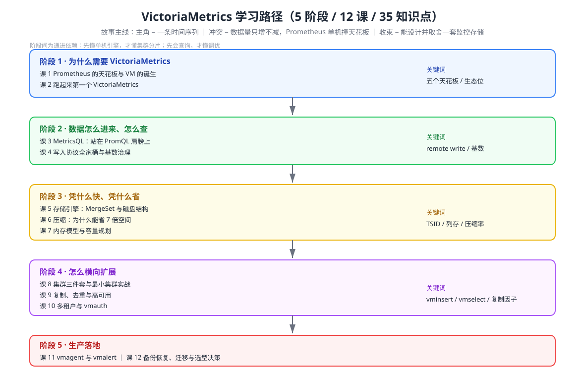

# VictoriaMetrics 学习路径总览

> 本文件是活文档，随学习进度动态调整。

## 🎯 学习目标

- **目标类型**：理解概念 + 动手实操 + 决策参考（VictoriaMetrics 无官方认证体系，不含「应试认证」）
- **目标说明**：
  - 理解概念 —— 说清 VictoriaMetrics 为什么快、省、稳，以及它凭什么能当 Prometheus 的长期存储
  - 动手实操 —— 能在本机跑通单机与最小集群，会写入 / 查询 / 备份 / 迁移，能配 vmagent + vmalert 替代 Prometheus 链路
  - 决策参考 —— 能判断「我的场景该不该上 VM」「单机还是集群」「开源版够不够用」

## 起点说明（你已有的基础）

| 你已掌握 | 来源 | 本课态度 |
|----------|------|----------|
| Prometheus 数据模型、四种指标类型 | 本仓库 `promql/` L1–L3 | **不重讲**，直接对照 |
| PromQL 语法与函数 | 本仓库 `promql/` L4–L10 | 课 3 只讲 MetricsQL 的增量 |
| 告警规则与 Grafana 面板 | 本仓库 `promql/` L11–L12 | 课 11 对照 Prometheus rules |
| 时序数据模型与基数概念 | 本仓库 `influxdb/` L6–L7 | 课 4 从「已知概念」升级到 VM 治理手段 |

> 这门课把课时全部押在 **VictoriaMetrics 独有的增量**上，不做 Prometheus 复读机。

## 故事主线

- **主角**：一条时间序列（你手里的每一个监控样本）
- **冲突**：监控系统的数据量只增不减，Prometheus 单机迟早撞上天花板——而「加机器」这件事，Prometheus 自身做不到
- **收束**：学完能回答「一套能扛住未来三年增长的监控存储，该怎么设计、怎么取舍、什么时候不该用 VM」

## 学习路径图

## 阶段总览

### 阶段 1：为什么需要 VictoriaMetrics（预计 1–2 周）

- **目标**：说清 Prometheus 单机的天花板在哪，以及 VM 用什么方式绕过去；在本机跑通第一个 VM
- **学习重点**：五个天花板 / VM 的诞生与定位 / 生态位对照 / 单节点部署 / **写入落盘的可见性机制**
- **必须掌握**：能独立启动单节点 VM、完成写入与查询、解释「写入返回 204 却查不到数据」的完整原因
- **对应课**：课 1、课 2

### 阶段 2：数据怎么进来、怎么查（预计 2 周）

- **目标**：掌握全部写入协议与 MetricsQL，能把现有 Prometheus 链路无痛接进来
- **学习重点**：Prometheus 兼容性边界 / MetricsQL 独有能力 / remote write 配置 / 多协议接入 / **基数治理**
- **必须掌握**：能给现有 Prometheus 配 remote write；能写出 PromQL 写不出或写不好的查询；能识别并治理高基数
- **对应课**：课 3、课 4

### 阶段 3：凭什么快、凭什么省（预计 2 周）

- **目标**：理解存储引擎与内存模型，能解释性能数字背后的机制，能自己做容量规划
- **学习重点**：MergeSet / TSID 与 indexDB / 列式布局与压缩算法 / **实测压缩率** / 降采样 / 内存去向 / 容量规划
- **必须掌握**：能说清一条样本从写入到落盘再被查出的完整路径；能估算给定基数下的内存与磁盘
- **对应课**：课 5、课 6、课 7

### 阶段 4：怎么横向扩展（预计 2 周）

- **目标**：理解集群三件套的分工，能搭最小集群，能用复制与多租户承载多团队
- **学习重点**：shared-nothing 架构 / 一致性哈希分片 / vmselect 聚合与去重 / **复制因子的代价** / 多租户与 vmauth
- **必须掌握**：能独立搭起最小集群并做故障演练；能判断「什么规模才值得上集群」
- **对应课**：课 8、课 9、课 10

### 阶段 5：生产落地（预计 2 周）

- **目标**：补全生产链路（采集、告警、备份、迁移），并形成自己的选型判断
- **学习重点**：vmagent 与持久化队列 / relabeling 与流式聚合 / vmalert / 快照备份 / **迁移路径** / 选型决策
- **必须掌握**：能用 vmagent + vmalert 完整替代 Prometheus 采集与告警；能执行备份恢复与迁移；**能说出什么时候不该用 VM**
- **对应课**：课 11、课 12

## 当前进度

> 更新时间：2026-09-03（Phase 4 + Phase 5 交付后同步 · 全课程 12/12 完结 + Phase 3/4/5 全部完成）

- [x] 阶段 1：为什么需要 VictoriaMetrics（已完成，2026-09-02）— 课 1、课 2
- [x] 阶段 2：数据怎么进来、怎么查（已完成，2026-09-02）— 课 3、课 4
- [x] 阶段 3：凭什么快、凭什么省（已完成，2026-09-02）— 课 5、课 6、课 7
- [x] 阶段 4：怎么横向扩展（已完成，2026-09-02）— 课 8、课 9、课 10
- [x] 阶段 5：生产落地（已完成，2026-09-02）— 课 11、课 12
- [x] **结课实战项目（Phase 3）**：[多租户监控平台](projects/多租户监控平台/README.md)（已完成，2026-09-03）— 跨阶段 2/3/4/5，端到端 14/14 + 故障演练 6/6 通过
- [x] **课程手册（Phase 4）**：[final-课程手册.md](final-课程手册.md)（已完成，2026-09-03）— 12 课收束 + 全局速查硬数字 + 决策清单
- [x] **收尾三件套（Phase 5）**（已完成，2026-09-03）
  - [08-实战经验.md](08-实战经验.md) — 学习态：10 条故障模式 × 五段式
  - [09-排障速查手册.md](09-排障速查手册.md) — 使用态：15 条症状倒查（🔴5 / 🟡9 / ⚪1）
  - [10-场景解法库.md](10-场景解法库.md) — 设计态：7 场景 29 个解法

**总进度**：12 课中已完成 **12 课（课 1–12，全部完结）**，35 知识点中已完成 40 个；**结课实战项目已完成**。

> 🎉 **全课程已于 2026-09-02 完结**。收官课（课 12）交付快照与备份恢复、迁移路径、选型决策三个知识点，并给出 RTO 2,548 ms 的实测灾难恢复演练。
>
> 🏗️ **结课实战项目已于 2026-09-03 交付**：《多租户监控平台》是可运行的多文件工程——两个租户从 vmagent 采集、经集群三件套存储、由 vmauth 按身份隔离、各自 vmalert 告警，并附 6 项故障演练（存储宕机 / 采集宕机 / 故障域隔离 / 自动恢复）。**20 项断言全部通过**，全新环境可复现。项目过程中踩到 8 个坑，其中 **6 个是静默失败**（不报错、能跑通，只是功能悄悄不生效），全部固化进 [反例对照](projects/多租户监控平台/反例对照.md)。
>
> 📕 **课程手册已于 2026-09-03 交付**（Phase 4）：[final-课程手册.md](final-课程手册.md) 把 12 课收束成一册——逐课的「一句话定位 / 核心结论 / 一图总结 / 最容易踩的坑」，外加 6 张全局速查硬数字表和 3 张决策清单（该不该上 VM / 单机还是集群 / 备份策略）。手册提炼出**三条贯穿全课的伏笔**，其中最重要的是「不信任 HTTP 状态码」——同一个失败模式在课 2（写入 204 却查不到）、课 4（CSV import 204 但零行）、课 11（vmalert reload 返 200 但失败）、课 12（JSON 喂错端点 204 全丢）**四次重现**，由此得出本课程最有迁移价值的方法论：**为每个关键假设找一个能回显真实状态的观测点**。
>
> 🧰 **收尾三件套已于 2026-09-03 交付**（Phase 5），按三种使用姿态切分同一批素材：[08-实战经验.md](08-实战经验.md)（学习态，10 条故障模式五段式 + 30 项落地 Checklist）、[09-排障速查手册.md](09-排障速查手册.md)（使用态，出事时按症状倒查，15 条中 5 条标 🔴）、[10-场景解法库.md](10-场景解法库.md)（设计态，7 场景 29 个解法，每场景带「先自己想 30 秒」与不适用边界）。
>
> 🎉 **本课程全部阶段完结**（Phase 1 大纲 → Phase 2 十二课 → Phase 3 实战项目 → Phase 4 手册 → Phase 5 三件套）。课后若要继续，两条路可选：① 回到 [09-排障速查手册.md](09-排障速查手册.md) 在真实工作环境里逐条实操验证；② 按 [08-实战经验.md](08-实战经验.md) 结尾的下一步提示词，把 VM 接入你自己的生产链路。
