# VictoriaMetrics 系统学习 · 课程手册

> 全课程汇总手册：5 阶段 / 12 课 + 1 个结课实战项目 + 收尾三件套
> 版本基准：**VictoriaMetrics v1.151.0**（2026-08-28 构建，本机二进制自报）
> 环境基准：WSL Ubuntu + Docker 29.4.1，20 核 / 31 GB 内存；单机实验端口 `8428`，集群实验端口 `8480/8481/8482`，实战项目端口 `8500-8507`
> 数据基准：全部实测数字来自 2026-09 本机实跑，**看量级与倍数关系，不要当固定常量背**

**导航**

| 想干什么 | 去哪 |
|----------|------|
| 快速回忆某课讲了什么 | [阶段 1](#阶段-1--为什么需要-victoriametrics) / [2](#阶段-2--数据怎么进来怎么查) / [3](#阶段-3--凭什么快凭什么省) / [4](#阶段-4--怎么横向扩展) / [5](#阶段-5--生产落地) |
| 忘了某个数字（压缩率 / 内存 / RTO） | [全局速查](#全局速查最容易忘的硬数字) |
| 出事了要止血 | [09 排障速查手册](09-排障速查手册.md) |
| 想搞懂为什么会崩 | [08 实战经验](08-实战经验.md) |
| 新需求不知道怎么设计 | [10 场景解法库](10-场景解法库.md) |
| 想看完整的工程交付 | [综合实战项目](#综合实战项目) |
| 该不该上 VM / 单机还是集群 | [决策清单](#决策清单) |

**收尾三件套（别混着用）**

- [08-实战经验.md](08-实战经验.md) — **学习态**：为什么会崩（适用边界、反模式、故障模式五段式）
- [09-排障速查手册.md](09-排障速查手册.md) — **使用态**：崩了怎么止血（按症状倒查，QRH 式）
- [10-场景解法库.md](10-场景解法库.md) — **设计态**：新需求怎么设计（多解法权衡 + 推荐路径）

---

## 怎么读这份手册

| 你现在的状态 | 从这里读起 |
|--------------|-----------|
| 学完了，想复习 | [故事主线](#故事主线一条时间序列的求生之路) → 按阶段速览每课的「一图总结」 |
| 忘了某个数字 | [全局速查](#全局速查最容易忘的硬数字) |
| 要上手做项目 | [综合实战项目](#综合实战项目) 的三条决定性实验 → [决策清单](#决策清单) |
| 值班时出了问题 | 直接去 [09 排障速查手册](09-排障速查手册.md)，本手册是复习材料不是急救材料 |
| 要给别人讲 | [故事主线](#故事主线一条时间序列的求生之路) 的 mermaid 图 + 每课「最容易踩的坑」 |

这份手册**不引入新内容**——每一条结论、每一个数字都能在 12 课讲义、结课实战项目或收尾三件套里找到出处。它的价值在于把散在 12 课里的东西压成一张可检索的网。

---

## 故事主线：一条时间序列的求生之路

- **主角**：一条时间序列（你手里的每一个监控样本）
- **冲突**：监控系统的数据量只增不减，Prometheus 单机迟早撞上天花板——而「加机器」这件事，Prometheus 自身做不到
- **收束**：学完能回答「一套能扛住未来三年增长的监控存储，该怎么设计、怎么取舍、什么时候不该用 VM」

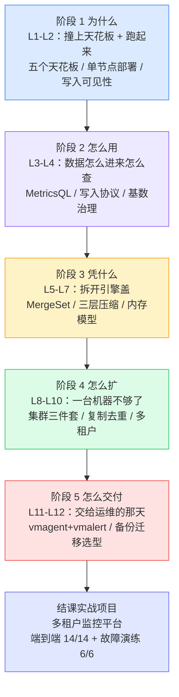

三条贯穿全课程的伏笔：

- **伏笔一（L4 → L5 → L7）**：L4 说「基数是监控系统的头号杀手」，L5 用 `items.bin`（806 KB）> `values.bin`（285 KB）的实测证明**索引比数据还占地方**，L7 用「序列翻一倍、查询耗时涨 3.5 倍」兑现成硬数字。**压缩和缓存都只在基数可控的前提下才有意义。**
- **伏笔二（L8 → L9 → L10）**：L8 搭起集群，代价是节点故障会**静默少一半数据**（1000→509 且不报错）；L9 用复制因子补上，代价是**查询翻倍**（600）与 dedup **误删**（12→3）；L10 用租户隔离承载多团队，代价是**只有数据隔离、没有资源隔离**（慢 7.4 倍）。**每一课解决一个问题，同时引入一个新问题——这是分布式系统的常态。**
- **伏笔三（L2 → L4 → L11）**：L2 的「写入返回 204 却查不到」教会你**不信任 HTTP 状态码**；L4 的 CSV import 再次强化（204 但 `vm_rows_inserted_total=0`）；L11 的 vmalert reload 第三次出现（返 200 但 `config_last_reload_successful=0`）；L12 的 JSON 喂错端点第四次（204 但数据全丢）。**这是整门课最重要的方法论：为每个关键假设找一个能回显真实状态的观测点。**

---

## 全局速查：最容易忘的硬数字

> 全部实测于 2026-09 本机环境（v1.151.0）。演练数据会「呼吸」，**用它们判断量级与倍数关系，别当固定常量背。**

### 环境与版本

| 项目 | 实测值 | 出处 |
|------|--------|------|
| VM 版本 | **v1.151.0**（2026-08-28 构建） | 学习档案 / L2 |
| 集群版镜像仓库 | `vminsert` / `vmselect` / `vmstorage` 三个独立仓库，tag `v1.151.0-cluster` | L8 |
| 内存水位规则 | `-memory.allowedPercent` 默认 **60%**（31.8 GB → VM 额度 19.1 GB） | L7 |
| 单节点内存建议上限 | 约 **1000 万**活跃序列 | L7 |
| 单机裸盘要求 | 磁盘至少留 **20% 空闲**给后台合并 | L5 |

### 存储与压缩

| 项目 | 实测值 | 出处 |
|------|--------|------|
| 每样本字节（缓变数据） | **2~4 字节**（恒定 1.02 / 缓变 3.97 / 随机 6.12） | L6 |
| ZSTD 单层压缩比 | **5.583 倍**（不是 59 倍——差额在列式布局与值编码） | L6 |
| 索引 vs 数据体积 | `items.bin` **806 KB** > `values.bin` **285 KB**；后台合并后 806 KB → **1.2 MB** | L5 |
| 后台合并效果 | part 数 **14 → 8**（台阶式下降） | L5 |
| 内存刷盘间隔 | **1 秒**（`-inmemoryDataFlushInterval`） | L5 |
| 快照代价 | 快照自身 **68 KB**，却阻止 **1,128 KB** 被回收（**16 倍**） | L12 |

### 内存与查询

| 项目 | 实测值 | 出处 |
|------|--------|------|
| 虚拟 vs 物理内存 | 虚拟 **1490 MB** > 缓存统计 **349 MB** > RSS **119 MB** | L7 |
| 单序列边际内存成本 | **65.5 字节/序列**（平均值法算出 6234.7，**差 95 倍**） | L7 |
| `hour_metric_ids` 跳过率 | **97.5%** 的数据（scanned/read = **40.08**） | L7 |
| 查询耗时不对称性 | 序列数翻 2 倍 → 耗时涨 **3.5 倍**；时间窗口翻 12 倍 → 耗时仅涨 **1.3 倍** | L7 |
| 重启是否清缓存 | **不清**。fastcache 落盘 `data/cache/`，重启后 297415 → 337608，命中率 **99.94%** | L7 |
| vmselect 自我保护 | `-search.maxPointsPerTimeseries` 默认 **30000**（7 天 × step=10s 被拒返 **422**） | L10 |

> ⚠️ **优化第一优先级是减序列数，不是缩时间窗口。** 这条来自上表的耗时不对称性实测。

### 集群

| 项目 | 实测值 | 出处 |
|------|--------|------|
| 组件内存（空闲态） | vmstorage **84.5 MB** / vmselect **33.2 MB** / vminsert **14.8 MB** / 单节点 **235.3 MB** | L8 |
| 直接访问 vmstorage | HTTP **400**（哑存储，集群智能全在代理里） | L8 |
| 一致性哈希分布 | 1000 条序列分两节点 = **509 / 491**；同一条序列 20 个样本全落一处 | L8 |
| 扩容是否迁移旧数据 | **不迁移**。229 条旧数据留在原节点，须重启 vminsert/vmselect | L8 |
| 无副本故障的表现 | 停一节点，count 从 1000 → **509 且不报错**（静默降级） | L8 |
| RF=2 无 dedup | 查询 **600**（翻倍）；配 dedup 后 **300** | L9 |
| dedup 间隔设太大的代价 | 12 个样本（间隔 5s）用 `dedup=30s` 只剩 **3 个**（丢 75%） | L9 |
| 副本缺口是否补齐 | **不补**。故障期 100 条，恢复后仍 100 / **0** | L9 |
| 最小推荐配置 | **3 个 vmstorage 配 RF=2** | L9 |

### 多租户

| 项目 | 实测值 | 出处 |
|------|--------|------|
| 租户 ID 边界 | `2^32-1` 可用；`2^32` 报 **400**；**空 ID 不报错，静默进 tenant 0** | L10 |
| projectID 语义 | **平级标识**：查 `7` 看不到 `7:9`（`7`=`7:0`=20，`7:9`=10） | L8 / L10 |
| 数据隔离 | ✅ 硬边界（backend 只见 `['100']`，frontend 只见 `['200']`） | L10 |
| 资源隔离 | ❌ 大租户让他人查询 **0.001792s → 0.013223s（慢 7.4 倍）**，全局 tsid 缓存 2932 → 10932 | L10 |
| 限流触发条件 | 只卡**并发数**不卡速率：8ms 查询 30/60 并发**零 429**；0.8s 查询 40 并发 → **429×36** | L10 |
| 限流是否按用户隔离 | ✅ backend 429×26 时 frontend 全 200 | L10 |

### 生产落地

| 项目 | 实测值 | 出处 |
|------|--------|------|
| vmagent 持久化队列 | 后端停机 **150 秒**零丢弃，恢复后 blocks_sent 307 → 409 | L11 |
| 队列内存缓冲期 | 前 **60 秒**走内存（vmagent 自身崩溃仍会丢） | L11 |
| `maxDiskUsagePerURL` | **软约束**：设 50 KB 涨到 **242 KB** 未丢弃（按 ~500MB 块组织） | L11 |
| vmalert 的 `/healthz` | **不存在**，只有 `/health` | L11 |
| 快照是否为复制 | **不是**。硬链接 `inode=7318349394894097`、`links=3`，df 仅增 **184 KB** | L12 |
| 增量备份 | 首次 **7,169,266 B** → 第二次 **136,362 B（1.9%）** | L12 |
| vmctl 迁移 | **1058 万样本 / 195.4 MB / 5.76 秒**，样本层面幂等 | L12 |
| 跨租户迁移 | 租户号写在 **URL 路径**（无 `--account-id` 参数），240 序列 / 30 ms | L12 |
| 删除后是否回收 | **不自动回收**。删 5 万条后磁盘**反增 2,348 KB**，须 `POST /internal/force_merge`（1 秒内回收 1,068 KB） | L12 |
| RTO / RPO | RTO = **2,548 ms**（纯 vmrestore 1,126 ms）；RPO 由备份频率决定 | L12 |
| 时间戳单位 | import API 用**毫秒**，传秒级 `1788355138` 被解析成 **1970-01-22** | L12 |

> ⚠️ **最容易踩的三个坑**：① 空租户 ID 静默进 tenant 0；② `dedup` 间隔必须**等于**真实采集间隔（设大只误删数据、不会漏副本）；③ 删除是墓碑机制，`/series/count` 不降、磁盘反增，且**不可逆无回收站**。

---

## 阶段 1：为什么需要 VictoriaMetrics

- **阶段目标**：说清 Prometheus 单机的天花板在哪，以及 VM 用什么方式绕过去；在本机跑通第一个 VM
- **故事章节**：撞上天花板的那天

### 课 1：Prometheus 的天花板与 VM 的诞生

> [讲义](stages/1-为什么需要VictoriaMetrics/1-Prometheus的天花板与VM的诞生.md)

**一句话定位**：搞清楚「为什么需要一个新东西」，以及这个新东西是什么来路。

**核心结论**：Prometheus 的五个天花板——存储不可横向扩展、保留期受限于单盘、高基数内存线性暴涨、无复制单点故障、多实例无全局视图。**根源是索引与数据绑定在同一个进程里**。VM 由 Valialkin 于 2018 年发起、灵感来自 ClickHouse、2019-05 以 Apache 2.0 开源，定位是**可替换 Prometheus 存储层的 drop-in 方案**。

**一图总结**：

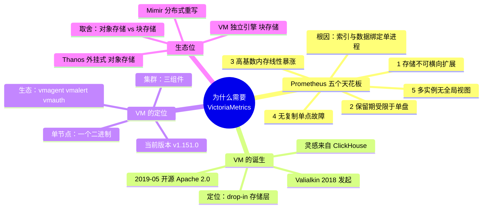

**最容易踩的坑**：把 VM 与 Thanos / Mimir 当成同一类东西对比——三者是**外挂式（Thanos）/ 分布式重写（Mimir）/ 独立引擎（VM）**三种不同路子，选型看的是架构风格而非单纯的性能数字。

### 课 2：跑起来第一个 VictoriaMetrics

> [讲义](stages/1-为什么需要VictoriaMetrics/2-跑起来第一个VictoriaMetrics.md)

**一句话定位**：在本机跑通单节点，并撞上第一个「不报错但不对劲」的现象。

**核心结论**：**写入返回 204 ≠ 查得到**。写入先进内存缓冲，攒批或 `force_flush` 后才落盘；查询有结果缓存，新样本若不在 5 分钟窗口内触发缓存重置，就会命中旧结果返回 0 条。验证数据是否进来，用 `/api/v1/series/count`，别信 HTTP 状态码。查参数默认值用 `/flags`（比看文档可靠）。

**一图总结**：

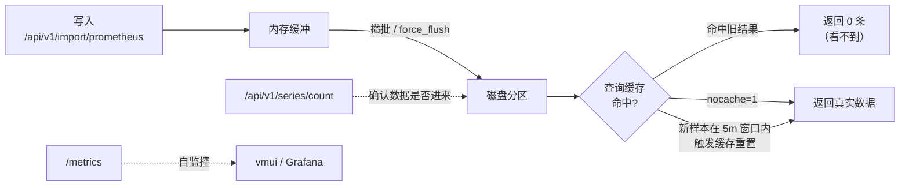

**最容易踩的坑**：以为「写入成功 == 能查到」。这是整门课**不信任 HTTP 状态码**方法论的第一次出现（后面 L4 / L11 / L12 会重复三次）。

---

## 阶段 2：数据怎么进来、怎么查

- **阶段目标**：掌握全部写入协议与 MetricsQL，能把现有 Prometheus 链路无痛接进来
- **故事章节**：把老链路接进来

### 课 3：MetricsQL：站在 PromQL 肩膀上

> [讲义](stages/2-数据怎么进来怎么查/3-MetricsQL站在PromQL肩膀上.md)

**一句话定位**：本课只讲 MetricsQL **比 PromQL 多了什么、差了什么**——不重讲 PromQL 语法（你已在 `promql/` 课程学过）。

**核心结论**：MetricsQL 是 PromQL 的**超集但不 100% 兼容**（官方自测 72.78%），有六类有意差异（窗口前采样点、不做外推、step 小于间隔、保留指标名、去除 NaN、scalar 等同 vector）。独有能力里最实用的是 **gap 填补三件套**。

**一图总结**：

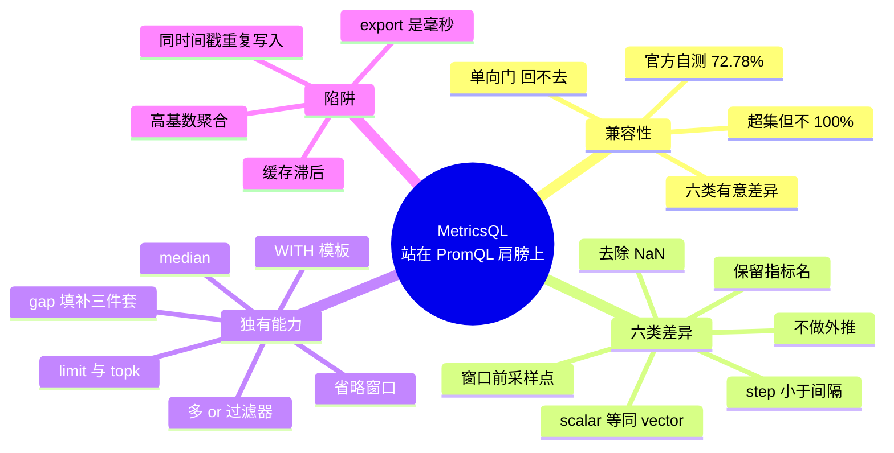

**最容易踩的坑（两条，均为实测推翻直觉）**：

1. **「over_time 类函数保留指标名」是笼统说法**——实测 `min/max_over_time` 保留，但 **`sum_over_time` 与 `abs` 不保留**。判据是「结果是否仍代表同一量的取值」。
2. **`keep_last_value` 填不了整条序列消失的断档**——10 分钟 gap 实测返回 **0 条**，只有 `default` 能填。三件套能力边界不同，别混用。

### 课 4：写入协议全家桶与基数治理

> [讲义](stages/2-数据怎么进来怎么查/4-写入协议全家桶与基数治理.md)

**一句话定位**：把数据弄进来的所有路子，以及**最要命的那条路该怎么管**（基数）。

**核心结论**：默认开启 Prometheus remote write 与 Influx line protocol，Graphite / OpenTSDB 需显式开端口（注意与既有端口冲突会导致启动失败）。**基数治理三层**：写入前 relabel / 流式聚合（根治）→ 查询时 `sum by`（治标）→ 限流 `-maxSeries`（兜底）。

**一图总结**：

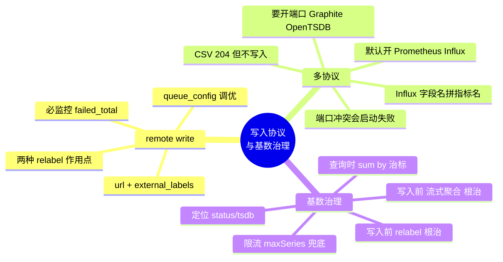

**最容易踩的坑（两条，均为实测推翻直觉）**：

1. **Influx line protocol 的 `_s`/`_ms`/`_ns` 后缀不是单位标识符**——真正原因是**字段名一律被拼进指标名**（连 `value` 也被拼进去）。
2. **CSV import 四种写法全部返回 HTTP 204 且不报错，但一行都没写入**（`vm_rows_inserted_total{type="csvimport"}=0`）。由此确立判据：**验证写入必须用 VM 自身统计，不能信 HTTP 状态码**。

> 📌 **`relabel_configs` vs `metric_relabel_configs`**（本课奠基，L11 与实战项目反复踩）：前者作用于**抓取目标**（target 标签），后者才作用于**指标自带标签**。要 drop 掉指标里已有的高基数标签，必须写 `metric_relabel_configs`——写错位置**不报错、永不匹配**。

---

## 阶段 3：凭什么快、凭什么省

- **阶段目标**：理解存储引擎与内存模型，能解释性能数字背后的机制，能自己做容量规划
- **故事章节**：拆开引擎盖

### 课 5：存储引擎 —— MergeSet 与磁盘结构

> [讲义](stages/3-凭什么快凭什么省/5-存储引擎MergeSet与磁盘结构.md)

**一句话定位**：拆开引擎盖，看一条样本从写入到落盘到底经过了什么。

**核心结论**：磁盘分 `data/small`（近期，持续合并）与 `data/big`（历史，已合并），`indexdb` 存倒排索引，`cache` 放热数据，`parts.json` 原子注册。**TSID** 是序列的内部数字 ID，数据按 TSID 排序，倒排索引把标签映射到 TSID。写入先进内存缓冲（默认 1 秒刷盘），落盘成 small part，后台合并成台阶式下降。

**一图总结**：

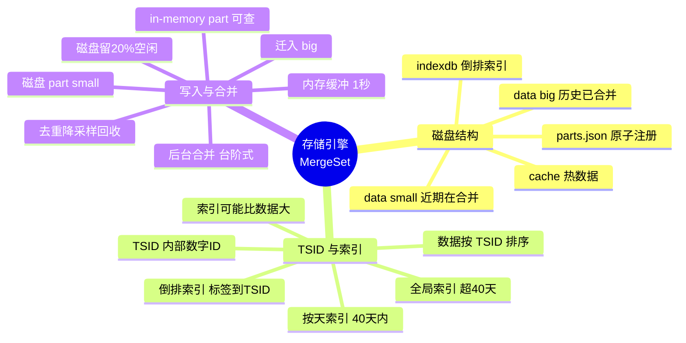

**最容易踩的坑**：本课的**反直觉发现**——`items.bin`（806 KB）**大于** `values.bin`（285 KB），**索引比数据还占地方**，直接推翻「压缩率高 = 算法强」的直觉，把省存储的真正杠杆指回课 4 的基数治理。另注意路径视角：宿主机是 `data/data/indexdb/`，不是顶层。

### 课 6：压缩 —— 为什么能省 7 倍空间

> [讲义](stages/3-凭什么快凭什么省/6-压缩为什么能省7倍空间.md)

**一句话定位**：用对照实验证明「省空间」的功劳到底归谁。

**核心结论**：官方说的「7 倍」是**端到端**整体压缩率，**ZSTD 那一层单独只有 5.583 倍**——差额来自前两层。三组「样本数相同、值形态不同」的对照实验证明存在**前置编码层**：三组交给 ZSTD 的原始字节为 266383 / 938997 / 1463618（差 5.5 倍），若直接喂 float64 则应完全相同。

**一图总结**：

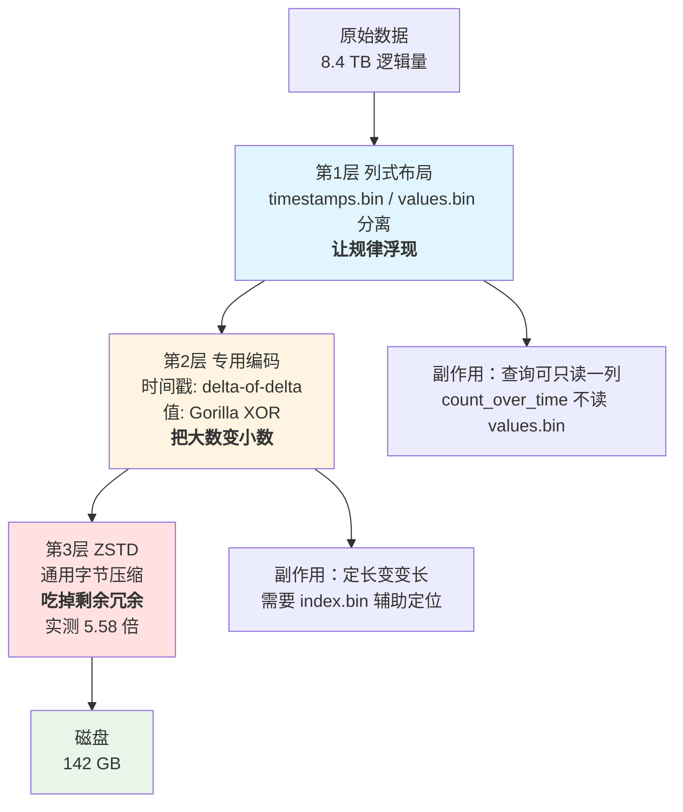

**最容易踩的坑（测量方法论，三条）**：① 磁盘增量法会被后台合并干扰（改用 `vm_zstd_block_*` 计数增量）；② 用 `NOW + t*10` 生成时间戳会让数据落在未来，`count()` 全返 0（改用 `NOW - 1200`）；③ `vm_rows` 是**累计计数**不是存量，曾据此算出荒谬的「104 倍」。另：**写压测方案别用恒定值自欺欺人**（恒定 1.02 字节/样本 vs 随机 6.12，差 6 倍）。

### 课 7：内存模型与容量规划

> [讲义](stages/3-凭什么快凭什么省/7-内存模型与容量规划.md)

**一句话定位**：回答「凭什么快」的最后一课，也是阶段 3 的总答案。

**核心结论**：三层缓存（storage 身份 / indexdb 索引 / promql 查询）。**虚拟地址 ≠ 物理页**——实测虚拟 1490 MB > 缓存统计 349 MB > RSS 119 MB，`vm_cache_size_bytes` 是 fastcache 预分配的「占座」。**推翻「重启清空缓存」**：fastcache 落盘于 `data/cache/` 且启动时自动加载（297415 → 337608，命中率 99.94%）。**推翻平均值法**：边际成本 65.5 字节/序列 vs 平均值 6234.7，**差 95 倍**。

**一图总结**：

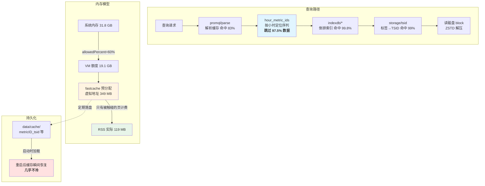

**阶段 3 总答案**：

| 维度 | 机制 | 贡献 |
|------|------|------|
| **凭什么省** | 列式布局 | 让规律浮现，副作用是查询可只读一列 |
| | delta-of-delta / Gorilla XOR | 把大数变小数，每样本 1~6 字节 |
| | ZSTD | 再压 5.6 倍（实测） |
| **凭什么快** | MergeSet（L5） | part 分层，查询只需打开少数几个 part |
| | TSID + 倒排索引（L5） | 标签查询不扫全表 |
| | `hour_metric_ids`（L7） | **跳过 97.5% 的数据不读** |
| | fastcache 分层（L7） | tsid 命中率 99%，免去磁盘查找 |
| | fastcache 落盘（L7） | **重启几乎不冷** |

> **它们的共同前提（L4）**：基数控制。序列数既是空间的主要变量，也是查询耗时的主要驱动因素（序列翻一倍，耗时涨 3.5 倍）。压缩和缓存都只在基数可控的前提下才能发挥作用。

**最容易踩的坑**：① `hour_metric_ids` 有 **15 秒延迟**，查活跃序列数要改用 `/api/v1/status/tsdb` 的 `totalSeries`；② 重启会重置 `vm_zstd_block_*` 内存计数器（压缩比 5.648 → 8.494 是假象）。

---

## 阶段 4：怎么横向扩展

- **阶段目标**：理解集群三件套的分工，能搭最小集群，能用复制与多租户承载多团队
- **故事章节**：一台机器不够了

### 课 8：集群三件套与最小集群实战

> [讲义](stages/4-怎么横向扩展/8-集群三件套与最小集群实战.md)

**一句话定位**：搭起真实集群，并亲眼看到「扩容」带来的第一个新问题。

**核心结论**：集群版在**三个独立仓库**（`vminsert` / `vmselect` / `vmstorage`），tag 为 `v1.151.0-cluster`，不是 `victoria-metrics:-cluster`。**vmstorage 是哑存储**——直接查/写 8482 均返 HTTP 400，集群智能全在 vminsert/vmselect 两个无状态代理里。故障隔离成立：停 vmselect 后写入仍 204。**一致性哈希是确定的**：同一条序列 20 个样本全落一处。**扩容不迁移旧数据**：须重启 vminsert/vmselect。

**一图总结**：

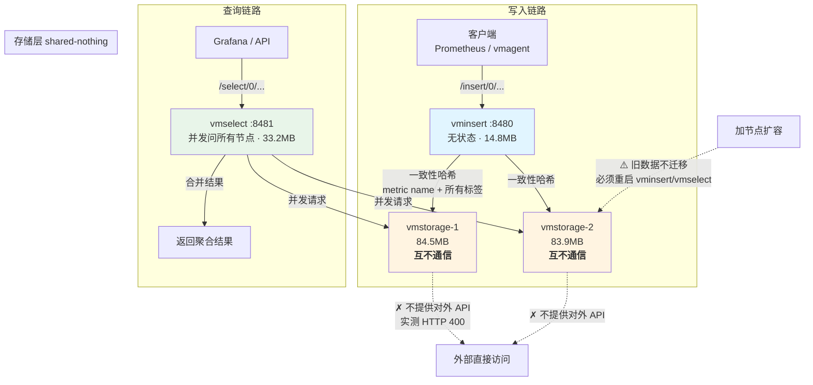

**最容易踩的坑**：**静默降级**——停掉一个 vmstorage，`count` 从 1000 → **509 且不报错**。这是课 9 复制因子要解决的首要问题，也是本课最重要的伏笔。另：projectID 是**平级标识**、省略租户 ID 缺省为 0、`vm_account_id` 标签需 multitenant 端点才生效。

### 课 9：复制、去重与高可用

> [讲义](stages/4-怎么横向扩展/9-复制去重与高可用.md)

**一句话定位**：用复制因子解决静默降级，然后发现复制自己带来的两个坑。

**核心结论**：**副本必须配 dedup**——RF=2 后无 dedup 查询 **600**（翻倍），配 dedup 后 **300**。高可用成立：停一个 vmstorage，有副本+dedup 时结果保持 300 不变（与课 8 的 1000→509 形成决定性对照）。**最小推荐 3 个 vmstorage 配 RF=2**——2 节点配 RF=2 时故障期数据会退化成单副本。

**最容易踩的坑（两条，本课最有价值）**：

1. **dedup 间隔设大会误删数据**：12 个样本（间隔 5s）用 `dedup=30s` 只剩 **3 个**（丢 75%），改用 5s 恢复 12 个。判据：**间隔必须等于真实采集间隔**，设大不会漏掉副本，只会误删数据。
2. **副本缺口不自动补齐**（本课最重要警告）：故障期写入 100 条，节点恢复后 vmstorage1=100 / vmstorage2=**0**，社区版无修复机制。副本失败的唯一可靠证据是日志 `cannot make a copy`，且 `vm_rpc_rows_incompletely_replicated_total` 在 5 次失败后**仍为 0**（可靠性存疑）。

另：RF>1 会**禁用慢节点重路由**（启动日志明确警告），一个慢节点会拖慢整体写入。

### 课 10：多租户与 vmauth

> [讲义](stages/4-怎么横向扩展/10-多租户与vmauth.md)

**一句话定位**：让多团队安全共用一套集群，并摸清隔离的边界在哪。

**核心结论**：租户 ID 边界 `2^32-1` 可用、`2^32` 报 400，**空 ID 不报错，静默进 tenant 0**（危险）。vmauth 补上缺失的认证层：租户**写死在服务端**，客户端无法自选（越权返 `missing route` 400）。**数据隔离 ✅ / 资源隔离 ❌**——往 tenant 400 写 8000 条后，tenant 300 查询慢 **7.4 倍**，全局 tsid 缓存 2932 → 10932。

**一图总结**：

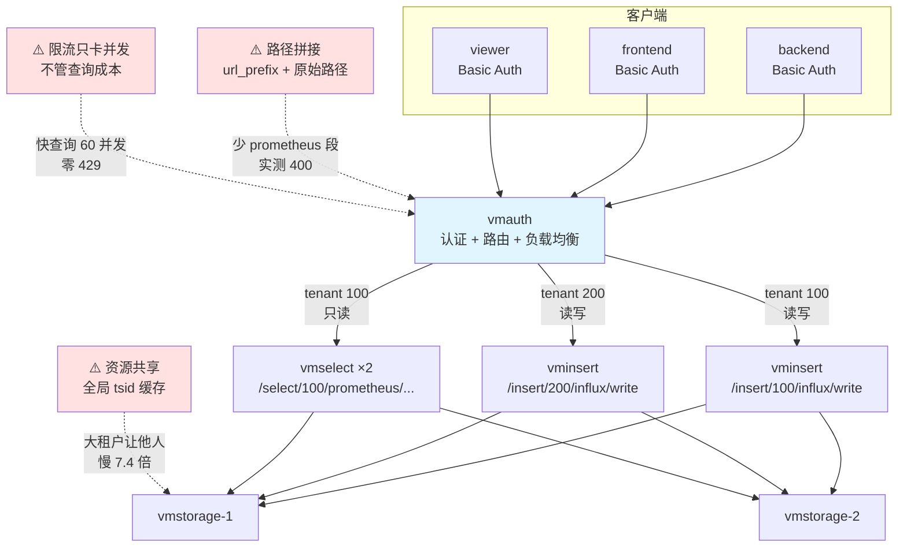

**阶段 4 的完整故事**：

| 课 | 解决的问题 | 引入的新问题 |
|---|---|---|
| **课 8** | 单机容量不够 → 集群分片 | 节点故障会**静默少一半数据** |
| **课 9** | 数据丢失 → 复制因子 | 副本导致**查询翻倍**；dedup 又会**误删** |
| **课 10** | 多团队共用 → 租户隔离 | 只有**数据隔离**，没有**资源隔离** |

> **贯穿三课的主线**：VictoriaMetrics 的取舍是一致的——**用「较弱的一致性/隔离保证」换取「极低的资源占用和运维复杂度」**。shared-nothing（课 8）、复制尽力而为（课 9）、资源共享（课 10）是同一条设计哲学的三次体现。

**最容易踩的坑**：① **vmauth 路径拼接连踩两次 400**——拼接规则是 `url_prefix + 原始路径`，漏 `prometheus` 段报 `unsupported path requested`；把 Prometheus 风格 `/api/v1/write` 拼到 influx 后端同样报错。② **限流三轮才测出**——`-maxConcurrentPerUserRequests` 只卡并发数不卡速率，必须把查询拉慢才触发。③ vmauth 轮询到 dedup 配置不同的 vmselect 时，同一查询连查 12 次得 `5 10 5 10 ...` 规律跳变。

---

## 阶段 5：生产落地

- **阶段目标**：补全生产链路（采集、告警、备份、迁移），并形成自己的选型判断
- **故事章节**：交给运维的那天

### 课 11：vmagent 与 vmalert

> [讲义](stages/5-生产落地/11-vmagent与vmalert.md)

**一句话定位**：用 VM 生态组件完整替代 Prometheus 的采集与告警链路。

**核心结论**：**vmagent 的持久化队列是真的**——后端停机 150 秒零丢弃，靠磁盘队列 + 读写双偏移（只追加不截断）。**但有内存缓冲期**：前 60 秒走内存，vmagent 自身崩溃仍会丢数据。vmalert 语法兼容 Prometheus 且能力超出（**MetricsQL 可直接写进记录规则**）。采集端可治理基数：`maxScrapeSize` 硬拦截、流式聚合降基数。

**一图总结**：

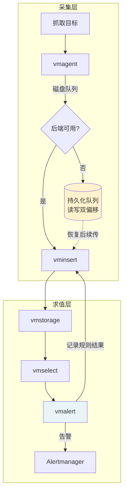

**最容易踩的坑**：① `maxDiskUsagePerURL` 是**软约束**（设 50KB 涨到 242KB 未丢弃）；② vmalert 的 `-remoteWrite.url` 会**自动追加** `/api/v1/write`，手写完整路径会重复 400（与课 10 vmauth 拼接坑同源）；③ reload 返 200 但 `config_last_reload_successful=0` 是**假成功**；④ vmalert 无 `/healthz`（只有 `/health`）；⑤ 流式聚合三坑——全量匹配抹平所有指标名、`keep_metric_names` 与多 outputs 冲突 fatal、产物写回同名指标致 `up` 从 1 变 6。

### 课 12：备份恢复、迁移与选型决策

> [讲义](stages/5-生产落地/12-备份恢复迁移与选型决策.md)

**一句话定位**：整套课程从「会用」到「敢交付」的最后一环。

**核心结论**：**快照是硬链接的冻结视图**（`links=3` 证明同一 inode，建快照 df 仅增 184 KB），但被快照保护的文件无法回收——实测快照自身 68 KB 却阻止 **1,128 KB** 被回收（**16 倍**）。vmbackup 拒绝无快照备份（`-origin cannot be empty`，是设计非缺陷）。增量备份首次 7.17 MB → 第二次 **136 KB（1.9%）**。备份不阻塞在线服务。**RTO = 2,548 ms**（纯 vmrestore 1,126 ms），RPO 由备份频率决定。

**最容易踩的坑（本课数量最多，15 条，挑最要命的三条）**：

1. **删除是墓碑机制而非回收**——`/api/v1/admin/tsdb/delete_series` 返 204 且日志确认删除，但删 5 万条后磁盘**反增 2,348 KB**、`/series/count` 不降（142,394 → 142,396）。**不可逆且无回收站**，本课误删的 20,000 条因备份晚于删除而**无法找回**。空间不会自动回收，需 `POST /internal/force_merge`（1 秒内回收 1,068 KB，只有 vmstorage 有此端点）。
2. **用 `du` 判断快照占用是错的**——硬链接被重复计数，必须用 `df`。
3. **JSON 喂给 `/api/v1/import/prometheus`（行协议端点）会静默全丢**——返 HTTP 204，错误只在 vminsert 日志中逐行出现。这是「验证写入必须用 `/api/v1/export`」原则的最强证据。

另两个环境坑：S3 地址把 endpoint 塞进 bucket 位报 `InvalidBucketName`；9p 文件系统（Windows + WSL）不支持 fallocate，在 `D:\` 挂载目录恢复会报 `cannot fallocate`。

---

## 综合实战项目

> 完整交付物：[README](projects/多租户监控平台/README.md) ｜ [设计决策](projects/多租户监控平台/设计决策.md) ｜ [反例对照](projects/多租户监控平台/反例对照.md) ｜ [验收清单](projects/多租户监控平台/验收清单.md)

**需求**：给两个业务团队各搭一套独立的监控链路——采集、存储、查询、告警四层互不干扰，且能扛住组件故障。

**覆盖**：阶段 2 / 3 / 4 / 5 共 **4 个阶段**，12 个知识点。工程规模 **16 个实现文件**（1 个 Python exporter + 6 个 YAML 配置 + 9 个 Shell 脚本），端口 `8500-8507`。

**四层隔离**（漏一层即击穿）：

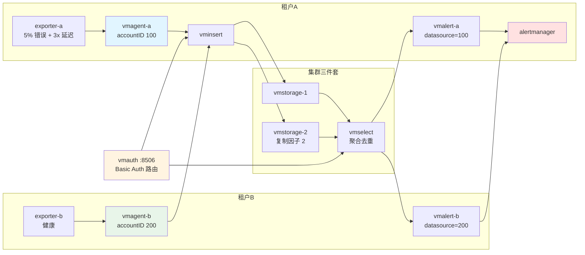

**验收结果**：端到端 **14/14** + 故障演练 **6/6** 全部通过，全新环境 `--reset` 后可复现。

| 验证项 | 实测结果 |
|---|---|
| V1 采集 | tenant-a 1726 / tenant-b 1762，各写各的 accountID |
| V2 隔离 | 100 查 tenant-b = 0 行；200 查 tenant-a = 0 行 |
| V3 权限 | 只读写入 400；错误密码 401 |
| V4 告警 | tenant-a 6 条规则 firing 1（HighErrorRate）；tenant-b 6 条 firing 0 |
| V4b 口径 | 全站 2.25% vs 按接口 4.37%（**稀释近一半**） |
| V5 基数 | 近 90 秒新增样本 1 条，带 user_id 0 条 |

**三条决定性实验**：

1. **labeldrop 对照实验**——两个并行 vmagent 写入不同 accountID，有 `metric_relabel_configs` 的**序列数 1**、无的**序列数 50**。50 条高基数序列塌缩成 1 条。这证明 L4 讲的作用点差异不是纸面知识。
2. **采集中断检测对照**——停 vmagent 140 秒后逐一求值：`absent(up)` **无结果**（历史序列仍在，恒为 0）、`absent(last_over_time(up[2m]))` = **1**、`time() - max(timestamp(up))` = **139.8 秒**。这是本项目最有普适价值的一条结论。
3. **故障演练**——单 vmstorage 宕机查询仍持续增长（1918 → 2314）；停 vmagent-a 240 秒后 ScrapeStalled + ScrapeLagging + LatencySLOBreach 全部 firing，滞后 244 秒；tenant-b 数据不受影响（故障域隔离）；恢复后告警自动清除。

**踩到的 8 个坑，其中 6 个是静默失败**（不报错、能跑通，只是功能悄悄不生效）：

| # | 坑 | 症状 |
|---|---|---|
| 1 | `labeldrop` 写在 `relabel_configs` 而非 `metric_relabel_configs` | 写错位置不报错、永不匹配 |
| 2 | 多租户共写 accountID 0 | 逻辑隔离依赖人人都记得写过滤器 |
| 3 | 单 vmalert 服务多租户 | `-datasource.url` 只有一个 → **假告警恒真 + 真告警永不响**的双向失效 |
| 4 | vmalert `-remoteWrite.url` 多写 `/api/v1/write` | 路径重复 400、ALERTS 状态指标全丢弃 |
| 5 | 错误率用全站口径 | 实测全站 2.25% vs 按接口 4.37%，配 5% 阈值则故障已到 5% 仍不响 |
| 6 | `absent(up)` 检测不出采集中断 | 历史序列仍在 → 恒为 0，须改 `absent(last_over_time(up[2m]))` |
| 7 | 配 `unauthorized_user` | 把 401 变成 200 + 空结果，排查方向被带偏 |
| 8 | 用清 docker volume 的方式清 bind mount 数据 | 清了个寂寞，一直在用旧数据验证新配置，浪费三轮排查 |

**两条方法论教训**（已从本项目提炼，可迁移到任何时序系统排查）：

1. **观察告警状态迁移时不能重启观察对象**——连续三轮因重启 vmalert 把 `for: 1m` 计时清零而误判「规则写了却不响」，纯等待（不重启）后才观察到 pending → firing。
2. **故障演练的阶段之间要留静置期**——F1 停启 vmstorage 会让 vmselect 短暂不可用、打断 vmalert 求值，不静置就进 F2 则 `for` 永远凑不满。两处等待时间已固化进脚本。

---

## 决策清单

> 学习目标含「决策参考」，故本节回答三个「该不该」问题。全部判据来自本课程实测。

### 该不该上 VictoriaMetrics

| 条件 | 判断 | 依据 |
|------|------|------|
| 数据量极小（< 100 万序列）、单机 Prometheus 跑得好好的 | **不该上**。小数据集上 Prometheus 反而快 3~35 倍 | L12 实测 |
| Prometheus 单机撞上内存/磁盘天花板 | **该上**。这正是 VM 的靶心 | L1 |
| 需要频繁删除/更新数据 | **不该上**。删除是墓碑机制，不释放空间、不可逆 | L12 实测 |
| 需要事务保证 | **不该上**。VM 不是 OLTP 数据库 | L12 |
| 超高基数 + 需要精确单点查询 | **谨慎**。压缩与缓存都只在基数可控时才有效 | L5 / L7 |
| 已有 Prometheus，想低成本延长保留期 | **该上**。remote write 无痛接入 | L4 |

### 单机还是集群

| 条件 | 判断 | 依据 |
|------|------|------|
| 活跃序列 < 1000 万 | **单机版**。一个二进制，运维成本最低 | L7 |
| 活跃序列 > 1000 万，或需要水平扩展 | **集群版** | L7 / L8 |
| 需要多租户 | **集群版**（多租户是集群版能力） | L10 |
| 集群规模 | 最小推荐 **3 个 vmstorage 配 RF=2** | L9 |

### 备份策略怎么定

| 决策点 | 建议 | 依据 |
|--------|------|------|
| 备份频率 | 按可容忍 RPO 定；本环境 7 MB / 2.76 秒，可高频执行 | L12 |
| 备份目标 | 异地容灾**必须 S3**（fs 不支持 server-side copy） | L12 |
| 快照保留多久 | **短期（小时级）**。实测带快照时删除 + 合并反增 628 KB，删快照瞬间释放 1,128 KB | L12 |
| 空间回收 | 不会自动回收，删除后需 `POST /internal/force_merge` | L12 |
| 迁移用哪种模式 | Prometheus 存活用 `remote-read`；停机窗口用 `prometheus`；VM 间用 `vm-native`（跨租户靠 URL 路径，无 account-id 参数） | L12 |
| 删除操作前置检查 | **备份存在、且备份时间早于删除时间** | L12（误删 20,000 条无法找回的教训） |

---

## 📚 官方文档

- [VictoriaMetrics 官方文档](https://docs.victoriametrics.com/)
- [VictoriaMetrics 集群版文档](https://docs.victoriametrics.com/Cluster-VictoriaMetrics.html)
- [vmagent 文档](https://docs.victoriametrics.com/vmagent.html)
- [vmalert 文档](https://docs.victoriametrics.com/vmalert.html)
- [vmauth 文档](https://docs.victoriametrics.com/vmauth.html)
- [vmbackup / vmrestore 文档](https://docs.victoriametrics.com/vmbackup.html)
- [MetricsQL 文档](https://docs.victoriametrics.com/MetricsQL.html)

---

## 🚀 结课提示词

> 全课程（12 课 + 结课实战项目 + 收尾三件套）已完结。想继续时，复制下面这段文字发给 AI：

```text
继续学 VictoriaMetrics。我的学习档案在 victoriametrics/00-学习档案.md，
已完成全部 12 课 + 结课实战项目（多租户监控平台）+ 课程手册 + 收尾三件套，
请帮我做一次知识点对齐（出选择题测验），或针对某个方向深入。
```
