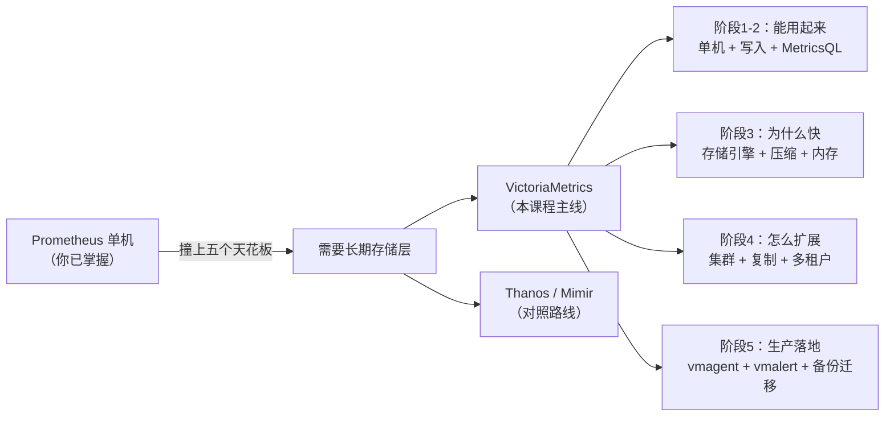
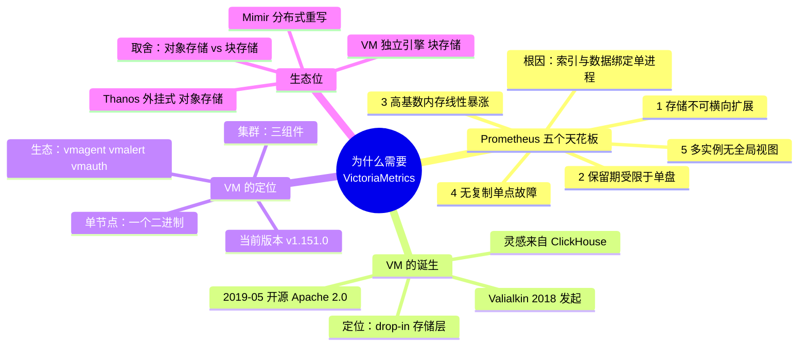

# 课 1：Prometheus 的天花板与 VM 的诞生

> 阶段 1 · 为什么需要 VictoriaMetrics ｜ 故事章节：撞上天花板的那天
> 返回：[阶段概览](README.md) ｜ [课程目录](../../02-课程目录.md)

---

## 第一幕：场景引入

假设你接手了一套跑了两年、运转良好的 Prometheus。

它管着三个 Kubernetes 集群、四百多个节点、两千多个 Pod。Grafana 上有二十几块面板，
告警规则一百多条。团队里每个人都会写 PromQL，没人抱怨过。

然后事情开始一件件发生：

- 第 25 个月，你想看「去年双十一的 QPS 曲线」，发现只查得到 15 天以内的数据
- 第 26 个月，运维给 Prometheus 从 32 GB 内存加到 64 GB，两周后又告警了
- 第 27 个月，一次宿主机磁盘故障，Prometheus 本地数据全丢，监控盲了两小时
- 第 28 个月，业务上线了一个按 `user_id` 打标签的指标，当晚 Prometheus OOM 重启了四次

每一件事单看都有临时解法：加大盘、加内存、做备份、删标签。
但你隐约觉得不对——**这些解法都是在给一个设计上就不打算长大的东西续命。**

这就是 VictoriaMetrics 存在的原因。它不是「更快的 Prometheus」，而是对一个具体问题的具体回答：
**当 Prometheus 的存储层成为瓶颈时，有没有一种办法，不用重写一行 PromQL、不用改一个 Grafana 面板，就能把数据搬过去？**

---

## 第二幕：认知冲突

遇到上面的问题，大多数人的第一反应是：**加机器**。

这个直觉来自我们对无状态服务的经验——Web 服务扛不住了，加几个副本，前面挂负载均衡，完事。

但对 Prometheus 来说，这条路走不通，而且原因比想象的更根本：

> Prometheus 的 TSDB 把**索引**和**数据**都放在单个进程的内存与本地磁盘里。
> 两个 Prometheus 实例之间**没有任何协调机制**——它们不知道彼此存在，
> 也不知道对方抓了哪些数据。

所以「加一个 Prometheus 实例」意味着：

- 查询端要自己把两个实例的结果合并（而且两个实例的抓取目标必须手工划分，不能重叠）
- 任何一个实例的本地盘挂了，那部分历史数据就没了
- 保留期仍然是「单块磁盘能撑多久」

**加机器解决的是算力问题，而 Prometheus 撞的是架构问题。**

这就是认知冲突所在：你需要的不是「更多 Prometheus」，而是「一个能横向扩展的存储层」。

顺带说一句，这个冲突还有个更微妙的第三层——
就算你成功加到了十台 Prometheus，你手上也还是**十台互不相识的 Prometheus**。
跨集群查询、全局聚合、统一保留策略，这些需求一个都没解决。

---

## 第三幕：层层揭示

### 知识点 1：Prometheus 单机的五个天花板

**一句话定义**：Prometheus 的设计目标是「单进程、本地存储、简单可靠」，
这带来五个无法通过加机器解决的结构性上限——存储不可横向扩展、保留期受限于单盘、
高基数下内存线性暴涨、无复制导致单点故障、多实例间无全局视图。

#### 直觉建立

把 Prometheus 想成**一个特别靠谱的笔记本**。

一个人记账，翻页快、写得清楚、绝不出错——这就是 Prometheus 单机的状态。
它快，是因为所有东西都在手边（内存 + 本地 SSD），不需要问任何人。

但笔记本有个天然上限：

- 一本写满了，就得换新本——**旧本子不会自动归档**（保留期受限于本地磁盘）
- 两个人各记各的，事后对账要人工合并——**多实例无协同**
- 你把「每个用户的消费记录」都记进去，本子三天就写满——**高基数**
- 本子丢了就是丢了——**无副本**

VictoriaMetrics 要做的，是把「一个人记一本」变成「一个能自动归档、
能多人协同、能复印备份的档案系统」，同时**让使用者感觉不到区别**——
你还是用同样的笔迹（PromQL）在上面写字。

> ⚠️ **类比失效的边界**：笔记本是被动的，Prometheus 是主动抓取的。
> 这个类比只覆盖「存储与扩展」维度，不涉及 Prometheus 的**拉取模型**和**服务发现**——
> 那部分是 Prometheus 真正的强项，VictoriaMetrics 也没有试图替代它
> （它用 `vmagent` 来接管这部分，见课 11）。

#### 核心原理

五个天花板，逐个拆开看：

**天花板 1：存储无法横向扩展**

Prometheus 的 TSDB 是单进程内的：head block（内存中最近的数据）+
本地磁盘上的 2 小时 block。所有数据必须落在这一台机器上。

你把机器从 8 核升到 64 核，能抓更多目标；
但你想把数据**分到三台机器上**，Prometheus 没有这个能力。

**天花板 2：保留期受限于单盘**

Prometheus 的 `--storage.tsdb.retention.time` 默认 15 天，不是因为它觉得 15 天够用，
而是因为它的存储就是本地目录。想留一年？那就准备一块能装一年数据的本地盘。

这与「数据重要不重要」无关，纯粹是**存储介质绑定**的结果。

**天花板 3：高基数导致内存线性暴涨**

这是最要命的一个。Prometheus 会为每个活跃时间序列在内存里维护索引结构，
业界经验值大约是**每百万活跃序列约 2 GB 内存**（含 head block 与索引开销，
实际值随标签长度和序列 churn 率浮动）。

于是：

| 活跃序列数 | 大致内存 |
|-----------|---------|
| 100 万 | ~2 GB |
| 1000 万 | ~20 GB |
| 1 亿 | ~200 GB（单机不可行） |

注意「活跃」二字——**K8s 环境下 Pod 重建会产生新的序列**，
所以你监控的序列数往往远超你以为的那个数字。这个现象叫 **churn（序列更替率）**，
是监控领域最容易被低估的成本来源。

**天花板 4：无复制，单机故障即数据不可用**

Prometheus 没有内置的数据复制。常见做法是**跑两个配置完全相同的 Prometheus**
（所谓 HA pair），靠 Alertmanager 去重告警。

但这两个实例各自的本地存储仍是独立的——一个实例的磁盘损坏，
它那一份历史数据就没了。**这是冗余，不是复制。**

**天花板 5：多实例之间无全局视图**

十个 Prometheus 就是十个孤岛。你想回答「全公司所有集群的总 QPS 是多少」，
Prometheus 原生只提供 **federation（联邦）**——让上级 Prometheus 去抓下级的聚合结果。

联邦能解决一部分问题，但它会丢失原始标签维度（只能抓聚合后的值），
而且层级一多就难以维护。

#### 示例演示：算一算你自己的天花板

打开你的 Prometheus，跑：

```promql
# 当前活跃序列数
prometheus_tsdb_head_series

# 序列更替率：每秒新增序列数
rate(prometheus_tsdb_head_series_created_total[5m])
```

假设第一个数是 `2_000_000`（200 万），那么按每百万约 2 GB 估算，
你的 Prometheus 光索引就要吃掉约 4 GB 内存。

再看第二个指标。如果每秒新增 500 个序列，一天就是 `500 × 86400 = 4320 万` 个新序列——
**这就是 churn**。它不增加「活跃序列数」，但会持续消耗索引空间和查询性能。

> 你在 `promql/` 课程里学过 `rate()` 用在 counter 上的规则，这里正是那个知识点的直接应用。

#### 常见误区

**误区 A：「加内存能解决 Prometheus 的扩展问题」**

加内存能推迟天花板 3，但对天花板 1、2、4、5 毫无作用。
而且它有个隐性的坏处：**更大的内存意味着更长的重启恢复时间**——
Prometheus 重启时要重放 WAL 重建 head block，内存越大，这段不可用时间越长。

**误区 B：「序列数和指标数是同一个东西」**

完全不是。一个指标名（`http_requests_total`）可以因为标签组合
产生几十万个序列。**决定成本的是标签组合数，不是指标名数量。**

举例：`http_requests_total{path, code, machine}`，
若 path 有 1000 种、code 有 20 种、machine 有 100 台，
序列数就是 `1000 × 20 × 100 = 200 万`——**一个指标名，两百万条序列。**

**误区 C：「我数据量小，天花板跟我没关系」**

天花板 3 和天花板 5 与数据量无关，与**标签设计**和**集群数量**有关。
一个只有一个集群、200 万序列的团队，一样会被 churn 和多集群视图困扰。

#### 一句话记住

> Prometheus 的五个天花板（不可扩展 / 保留期受限 / 高基数吃内存 / 无复制 / 无全局视图）
> **全部源自同一个设计选择**：索引与数据绑定在单进程、单磁盘上。
> 所有「加机器」的方案都绕不开这个根因。

---

### 知识点 2：VictoriaMetrics 的诞生与定位

**一句话定义**：VictoriaMetrics 由 Aliaksandr Valialkin 于 2018 年发起、
2019 年 5 月开源的时序数据库，核心定位是**兼容 Prometheus 生态的
drop-in 长期存储**——保留 PromQL / 抓取协议 / Grafana 集成不变，
只替换底下那个撑不住的存储层。

#### 直觉建立

官方博客里有一句话，几乎是整个项目的起源：

> 「我们当时把分析负载从 PostgreSQL 迁到了 ClickHouse，
> 12 台服务器缩到了 1 台。这让我们开始想：
> **如果我们有一个采用 ClickHouse 架构的 Prometheus，会怎样？**」

这就是 VictoriaMetrics 的核心直觉——**它不是重新发明监控，
而是把 ClickHouse 那套在 OLAP 领域验证过的效率手段，搬到时序数据上。**

> ⚠️ **类比失效的边界**：ClickHouse 是分析型数据库，擅长大范围扫描与聚合；
> 监控场景还需要**高基数点查**和**低延迟实时查询**。
> VictoriaMetrics 借鉴的是 ClickHouse 的**存储与压缩思路**，
> 而不是照搬它的查询引擎。它自己的查询语言叫 MetricsQL（课 3 详讲）。

#### 核心原理

**关键事实**（已联网核查，多来源交叉确认）：

| 项目 | 事实 | 来源 |
|------|------|------|
| 发起者 | Aliaksandr Valialkin（高性能 Go 库 `fasthttp` / `fastcache` 的作者） | 官方 about-us 页、维基百科条目 |
| 设计灵感 | ClickHouse 的架构与效率 | 官方博客 The Rise of Open Source TSDB |
| 闭源版发布 | 2018 年 9 月 | 维基百科条目 |
| 开源版发布 | 2019 年 5 月 | 维基百科条目 |
| 许可证 | **Apache 2.0**（宽松许可证，可商用） | 官方站点、多个第三方对照表 |
| 实现语言 | Go | 官方站点 |
| 当前版本 | **v1.151.0**（本机实测，2026-09-02） | 本机 `docker exec` 二进制自报 |

**四位联合创始人**均来自 Google / Cloudflare / Lyft 等公司，
其中 Valialkin 任 CTO 兼首席架构师。

**产品形态分两层**：

- **单节点版（single-node）**：一个二进制文件，无外部依赖。
  官方称单节点可支撑**千万级活跃序列**（具体上限取决于内存与基数特征）
- **集群版（cluster）**：拆成 `vminsert` / `vmselect` / `vmstorage` 三个组件，
  支持水平扩展、复制、多租户（课 8–10 详讲）

**生态组件**（课 11–12 会逐个用到）：

| 组件 | 作用 |
|------|------|
| `vmagent` | 轻量采集代理，替代 Prometheus 的抓取职责 |
| `vmalert` | 告警与 recording rules 求值 |
| `vmbackup` / `vmrestore` | 备份与恢复 |
| `vmauth` | 认证与路由代理 |
| `vmctl` | 从 Prometheus / InfluxDB / OpenTSDB 迁移数据 |

**典型用户**：CERN（CMS 实验）、Grammarly、Roblox、Wix、Cloudflare 等。
CERN 的案例尤其说明问题——他们正是因为 **Prometheus 和 InfluxDB 都遇到了扩展性瓶颈**才换的。

#### 示例演示：官方给出的效率数字

VictoriaMetrics 官方公布的两组 benchmark（**注意：这是厂商自测数据，
测试条件与你的实际负载未必一致，仅作量级参考**）：

**对比 Prometheus**（官方博客）：

- 磁盘占用约为 Prometheus 的 **1/2.5**
- 查询速度约为 Prometheus 的 **16 倍**

**对比 Grafana Mimir**（官方公布）：

- CPU 用量 **1.7 倍**更省
- 内存用量 **5 倍**更省
- 24 小时数据的存储空间 **3 倍**更省

> 第三方对照文章给出的口径不太一样（有的说「比 Prometheus 省 70% 空间」，
> 有的说「7–10 倍」）。**这类数字务必以你自己的真实数据实测为准**——
> 课 6 我们会用你自己的数据跑一次真实压缩率测量，
> 届时会把「厂商宣称值 vs 你的实测值」并列出来做对照。

**怎么读这些数字**：它们证明的不是「VictoriaMetrics 永远快 16 倍」，
而是「**在同等硬件下，它能承载的规模量级不同**」。
对选型来说，后者才是关键信息。

#### 常见误区

**误区 A：「VictoriaMetrics 是 Prometheus 的替代品，要把 Prometheus 卸载掉」**

不准确。更常见的落地路径是**共存渐进**：

1. 第一阶段：保留 Prometheus 抓取，加一行 `remote_write` 把数据也发一份给 VM（课 4）
2. 第二阶段：查询切到 VM（Grafana 加一个数据源即可）
3. 第三阶段：用 `vmagent` 接管抓取，Prometheus 退场（课 11）

全程 PromQL 与面板都不用改。

**误区 B：「开源版功能不全，必须买企业版」**

取决于需求。Apache 2.0 的开源版已包含单节点 + 集群 + 复制 + 多租户 + 全部生态组件。
**企业版主要多的是**：降采样（downsampling）、部分高级运维特性、官方 LTS 支持。
课 6 会讲清楚哪些场景真的需要企业版的降采样。

**误区 C：「它是 InfluxDB 的那种通用时序数据库」**

不是。VictoriaMetrics **只存数值型指标**，不支持字符串值，
不支持更新已写入的数据点，删除功能也受限。
它的定位非常聚焦：**Prometheus 生态的指标存储**。需要 SQL 或存日志，
应该看 TimescaleDB / ClickHouse / VictoriaLogs。

#### 一句话记住

> VictoriaMetrics = **用 ClickHouse 的思路重做 Prometheus 的存储层**，
> 对外保持 Prometheus 的全部接口不变。
> 你换的是地基，不是房子。

---

### 知识点 3：生态位与竞品对照

**一句话定义**：在「Prometheus 长期存储」这个赛道上，主流方案分成
**外挂式（Thanos）**、**分布式重写（Mimir / Cortex）** 和 **独立引擎（VictoriaMetrics）**
三条路线，它们在**运维复杂度**与**架构侵入性**上取舍不同。

#### 直觉建立

想象你要给一栋老房子加电梯：

- **Thanos 路线**：在房子外面架一部观光电梯。房子本身一点不动，
  优点是不打扰住户，缺点是电梯井、钢结构、机房都是新增的维护点
- **Mimir 路线**：把房子推倒，按现代标准重建一栋。住起来最好，
  但工程量最大，而且施工期间你得有地方住
- **VictoriaMetrics 路线**：换掉房子的地基和管道，户型不动。
  住户（PromQL / Grafana / Alertmanager）感觉不到差别，但承重能力变了

三条路都能解决「上楼」的问题，代价和适用场景完全不同。

> ⚠️ **类比失效的边界**：换地基在现实中极难，但在软件里「换存储层」
> 恰好是可行的——因为 Prometheus 的查询协议是公开的。
> 类比的「施工难度」排序因此与实际相反，**别拿这个类比推断工程量**。

#### 核心原理

**方案对照表**（信息核查于 2026-09，版本号可能变化）：

| 方案 | 路线 | 存储后端 | 组件数 | 核心优势 | 主要代价 |
|------|------|----------|--------|----------|----------|
| **Thanos** | 外挂式 | 对象存储（S3 等） | 4+（Sidecar / Store Gateway / Compactor / Querier） | 不改动现有 Prometheus，多集群全局视图成熟，CNCF 毕业项目 | 查询需跨 Store Gateway 扇出，延迟随数据量上升；组件多 |
| **Grafana Mimir** | 分布式重写 | 对象存储 | 多微服务（3.0 起写入路径引入 Kafka） | 原生多租户，可扩到十亿级序列，Grafana 官方支持 | 运维复杂度最高，需专职平台团队 |
| **Cortex** | 分布式重写 | 对象存储 | 多微服务 | Mimir 的前身 | 开发已基本停滞，维护者转向 Mimir，**新部署不推荐** |
| **VictoriaMetrics** | 独立引擎 | **块存储**（非对象存储） | 单节点 1 个二进制；集群 3 个组件 | 部署最简单，资源效率最高，单节点即可覆盖多数场景 | 生态规模小于 Prometheus；MetricsQL 是超集，边缘行为有差异 |
| **InfluxDB 3** | 独立引擎 | 对象存储（Parquet） | 中等 | SQL 支持，高基数设计，写入吞吐高 | 不是 PromQL 生态，迁移需改查询 |
| **TimescaleDB** | Postgres 扩展 | Postgres 表 | 1（Postgres） | 完整 SQL，可与关系数据 JOIN | 压缩率低于专用引擎，写入受 Postgres 单写模型限制 |

**关键取舍点：对象存储 vs 块存储**

这是 Thanos / Mimir 与 VictoriaMetrics 最根本的架构分歧：

- **对象存储派**：冷数据放 S3，成本极低，保留数年也不心疼；
  代价是查询冷数据要走网络，延迟高，且有 GET 请求计费
- **块存储派**：数据放本地 SSD，查询快、无请求计费；
  代价是存储成本高于对象存储，且备份与容灾要自己做

**这个分歧会直接影响你的成本模型和灾备策略**——选型时别只看「哪个快」。

#### 示例演示：用三个问题定位你的选择

回答这三个问题，路线基本就定了：

**问题 1：你有多少活跃序列？**

- < 500 万 → 单节点 VictoriaMetrics 通常足够，**不需要 Thanos / Mimir**
- 500 万 – 5000 万 → VictoriaMetrics 集群或 Mimir
- \> 1 亿 → Mimir 或 VictoriaMetrics 集群（均需认真做容量规划）

**问题 2：你能投入多少运维人力？**

- 没有专职平台团队 → **VictoriaMetrics**（单节点一个二进制，集群三个组件）
- 有专职团队且已重度使用 Grafana 生态 → Mimir
- 已有大量存量 Prometheus 且不想动 → Thanos

**问题 3：你需要多租户隔离吗？**

- 不需要（单一团队自用） → 单节点 VictoriaMetrics，最简单
- 需要（平台团队服务多个业务方） → VictoriaMetrics 集群（多租户）或 Mimir
  （注：**单节点版不支持多租户**，这是很多人踩的坑）

**一个常见的组合答案**：中等规模、无专职团队、单团队自用
→ **单节点 VictoriaMetrics**，这是本课程阶段 1–3 的主线。

#### 常见误区

**误区 A：「Thanos 最简单，因为不用改 Prometheus」**

「不用改 Prometheus」≠「运维简单」。Thanos 要额外部署和维护
Sidecar、Store Gateway、Compactor、Querier 四类组件，
还得配对象存储的生命周期与权限。**它的优势是迁移平滑，不是运维简单。**

**误区 B：「Mimir 是 Cortex 的升级版，选它就对了」**

只在特定前提下成立：你有专职平台团队、需要原生多租户、规模到了千万级序列以上。
对一个三人小组自用的监控系统，上 Mimir 属于**用牛刀杀鸡，还得雇人养牛**。

**误区 C：「对象存储一定比块存储便宜」**

通常是对的，但要考虑两点：

1. 查询冷数据有 **GET 请求费用**，高频查历史面板时这笔钱不容忽视
2. 对象存储的延迟是**毫秒到百毫秒级**，本地 SSD 是**微秒级**——
   对告警这种延迟敏感的场景，差异很实在

#### 一句话记住

> 选型的三个决定性问题是：**多少序列 / 多少运维人力 / 要不要多租户**。
> Thanos 赢在迁移平滑，Mimir 赢在多租户与超大规模，
> **VictoriaMetrics 赢在「规模还没到天文数字时的最佳投入产出比」**。

---

## 第四幕：实操验证

这一课是概念课，但我们可以做一件很实用的事：**把你的真实情况填进天花板评估表**。

### 步骤 1：测你自己的 Prometheus 天花板

如果你有可访问的 Prometheus，跑这三个查询（没有也没关系，看步骤 2）：

```promql
# 1. 活跃序列数 —— 判断天花板 3
prometheus_tsdb_head_series

# 2. 每秒新增序列数 —— 判断 churn 压力
rate(prometheus_tsdb_head_series_created_total[5m])

# 3. 已落盘数据量 —— 判断天花板 2
prometheus_tsdb_head_chunks_storage_size_bytes
```

### 步骤 2：对照天花板评估表

| 天花板 | 怎么判断自己撞上了 | 典型阈值 |
|--------|-------------------|----------|
| 1. 不可扩展 | 单机 CPU/内存已升到较高配置，仍需继续扩容 | 无明显阈值，取决于预算 |
| 2. 保留期受限 | 想留 3 个月以上，本地盘扛不住 | 保留期 > 30 天且数据量 > 数百 GB |
| 3. 高基数吃内存 | 内存占用随序列数线性涨，OOM 过 | 活跃序列 > 数百万 |
| 4. 无复制 | 经历过单机故障导致监控盲区 | 发生过即算 |
| 5. 无全局视图 | 多个 Prometheus 各查各的，跨集群聚合靠手工 | 集群数 ≥ 2 且有跨集群查询需求 |

### 步骤 3：确认 VictoriaMetrics 版本（本机已实测）

```bash
docker exec vm-learn /victoria-metrics-prod --version
```

本机输出（2026-09-02 实测）：

```
victoria-metrics-20260828-144206-tags-v1.151.0-0-g83fc70c6ac
```

> ✅ **回扣场景**：回到第一幕那四个麻烦——
> 15 天保留期（天花板 2）、加内存无效（天花板 3）、磁盘故障丢数据（天花板 4）、
> 按 user_id 打标签导致 OOM（天花板 3 的极端形式）。
> 现在你能明确指出每一个对应哪个天花板，以及 VictoriaMetrics 各自用什么手段应对
> （长期保留、更省的内存模型、集群复制、基数治理工具）。
> **知道问题叫什么，就解决了一半。**

---

## 第五幕：体系收束

### 本课在全局的位置



### 你现在会了什么

- 能说出 Prometheus 五个天花板的名字，并判断自己撞上了哪一个
- 知道 VictoriaMetrics 的来龙去脉：谁做的、为什么做、什么时候开源、什么许可证
- 能在 Thanos / Mimir / Cortex / VictoriaMetrics / InfluxDB 之间，
  按「序列规模 / 运维人力 / 多租户需求」三个问题做出初步判断

### 关键伏笔

**最重要的一条**：VictoriaMetrics 是多快好省，
但**「省」这件事需要证据**。课 6 我们会用你自己的数据实测压缩率，
而不是引用厂商数字。

> 📍 **全局定位**：本课回答了「为什么需要它」。它是整个课程的动机锚点——
> 后面每一个设计（TSID、列存、三件套、vmagent）都能回溯到这五个天花板之一。
> 🔗 **下一步**：课 2 把它跑起来。你会亲手撞上一个反直觉现象——
> **写入接口返回成功，但立刻查却查不到数据**。
> 这个现象正是理解 VictoriaMetrics 存储模型的入口。

---

## 🐞 常见误区

1. **「VictoriaMetrics 要替代 Prometheus，所以得先卸载 Prometheus」**
   错。标准路径是渐进共存：`remote_write` 先接数据 → 查询切过去 → 最后才用 vmagent 接管抓取。全程不改 PromQL 与面板。

2. **「加内存能解决 Prometheus 的扩展问题」**
   只能推迟高基数问题（天花板 3），对另外四个天花板无效，且会拉长重启恢复时间。

3. **「序列数 = 指标数」**
   差了几个数量级。`http_requests_total` 一个指标名，
   配上 1000 path × 20 code × 100 machine 就是 200 万条序列。

4. **「Thanos 最简单」**
   它赢在**迁移平滑**（不用动现有 Prometheus），不是运维简单——
   四类新增组件 + 对象存储生命周期管理都是实打实的维护成本。

5. **「对象存储一定比块存储便宜」**
   存储单价是便宜，但要算上冷查询的 GET 请求费和延迟代价。

---

## 一图总结



---

## 课后小测

**Q1**：某团队的 Prometheus 跑了两年很稳定，近期想看「去年同期流量对比」发现查不到。
这最直接对应哪个天花板？

- A. 天花板 1：存储无法横向扩展
- B. 天花板 2：保留期受限于单盘
- C. 天花板 3：高基数导致内存暴涨
- D. 天花板 5：多实例无全局视图

<details><summary>答案与解析</summary>

**答案：B**。查不到历史数据，直接原因是数据已被保留期策略清理，
根源是 Prometheus 存储绑定本地磁盘（天花板 2）。
注意 A 是「不能分摊到多台机器」，与「数据被删了」不是同一件事——
这是最容易混淆的一对。

</details>

**Q2**：一个指标 `http_requests_total` 带了三个标签：
`path`（1000 种）、`code`（20 种）、`machine`（100 台）。
它会产生多少条时间序列？

- A. 1120 条（三个标签值数量相加）
- B. 200 万条（三个标签值数量相乘）
- C. 1 条（一个指标名对应一条序列）
- D. 取决于实际出现了多少组合，最多 200 万条

<details><summary>答案与解析</summary>

**答案：D**。序列数 = **实际出现过的**标签组合数，上限是笛卡尔积 `1000 × 20 × 100 = 200 万`。
B 是常见错答——它算的是理论上限，不是实际值。
这个区别很重要：容量规划按上限估，成本优化则要看实际出现率（很多 path×code 组合可能从未发生过）。

</details>

**Q3**：关于 Thanos / Mimir / VictoriaMetrics 的架构分歧，下列说法正确的是？

- A. 三者都默认使用对象存储作为后端
- B. VictoriaMetrics 使用块存储，Thanos / Mimir 使用对象存储
- C. VictoriaMetrics 组件最多，因此运维最复杂
- D. Cortex 是 Mimir 的升级版，新部署应优先选择

<details><summary>答案与解析</summary>

**答案：B**。这是最根本的架构分歧：VM 走本地块存储（查询快、无 GET 计费），
Thanos / Mimir 走对象存储（冷数据便宜、但查询有延迟和请求费）。
C 错——VM 单节点只有一个二进制，组件最少；
D 说反了——**Mimir 才是 Cortex 的后继者**，Cortex 已基本停滞。

</details>

---

## 🚀 下一批接力提示词

```text
我想学习 VictoriaMetrics，我已完成 课 1《Prometheus 的天花板与 VM 的诞生》。

已完成的知识：
- Prometheus 单机的五个天花板（不可扩展 / 保留期受限 / 高基数吃内存 / 无复制 / 无全局视图）
- VictoriaMetrics 的起源（Valialkin、ClickHouse 灵感、2019-05 开源、Apache 2.0）
- 生态位对照（Thanos 外挂式 / Mimir 分布式重写 / VM 独立引擎）

请继续 课 2《跑起来第一个 VictoriaMetrics》，需要覆盖：
1. 单节点部署与关键启动参数（retentionPeriod、storageDataPath、memory.allowedPercent 等）
2. 第一次写入与查询（/api/v1/import/prometheus、/api/v1/query、/api/v1/series/count）
3. 「写入返回 204 但查不到数据」的完整排查过程与三招解法
4. vmui 界面与自监控指标（/metrics）

实操环境：WSL Ubuntu + Docker，容器名 vm-learn，端口 8428，
数据目录挂载 D:/projects/learning/victoriametrics/playground/data。
请按 topic-teach skill 的五幕结构 + 知识点六要素撰写，
并在写完后执行双 agent（pedagogy + learner）评审，把评审结论附在回复中。
```

---

## 🧭 课程导航

- **上一课**：无（本课是第 1 课）
- **下一课**：[课 2 跑起来第一个 VictoriaMetrics](2-跑起来第一个VictoriaMetrics.md)
- **本阶段**：[阶段 1 概览](README.md)
- **返回**：[课程目录](../../02-课程目录.md) ｜ [学习路径总览](../../01-学习路径总览.md)
