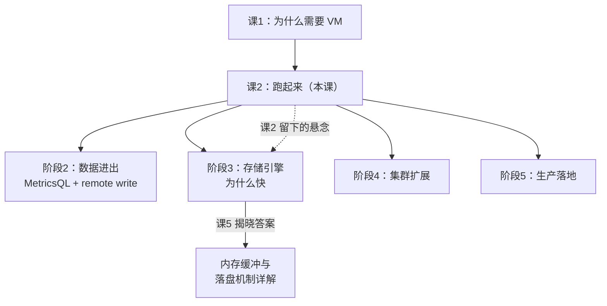
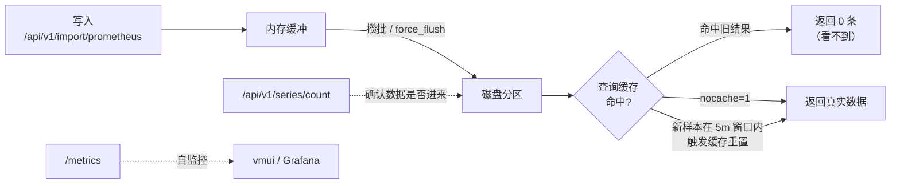

# 课 2：跑起来第一个 VictoriaMetrics

> 阶段 1 · 为什么需要 VictoriaMetrics ｜ 故事章节：撞上天花板的那天
> 返回：[阶段概览](README.md) ｜ [课程目录](../../02-课程目录.md)
> 上一课：[课 1 Prometheus 的天花板与 VM 的诞生](1-Prometheus的天花板与VM的诞生.md)

> ⚠️ **本课所有命令与输出均在本机（WSL Ubuntu + Docker，v1.151.0）实测通过，实测日期 2026-09-02。**
> 实验脚本见 `playground/l02-verify-commands.sh` 与 `playground/l02-decisive-flush-vs-cache.sh`。

---

## 第一幕：场景引入

你决定试一试 VictoriaMetrics。

按官方文档，装好 Docker 后，启动只需要一行命令。你照着敲下去，
容器跑起来了，健康检查返回 `OK`。你松了口气——看起来确实很简单。

然后你写入第一条数据：

```bash
curl -X POST http://localhost:8428/api/v1/import/prometheus \
  --data-binary 'lesson2_demo{job="l2",host="h1"} 1'
```

返回 `204`——写入成功，无内容返回，这是标准的成功响应。

你立刻查询验证：

```bash
curl --data-urlencode 'query=lesson2_demo' http://localhost:8428/api/v1/query
```

返回：

```json
{"status":"success","data":{"resultType":"vector","result":[]}}
```

**空的。**

你再查一遍，还是空的。你检查写入命令——没错。你查容器日志——没报错。
你开始怀疑：是不是数据根本没进去？是不是这个东西有 bug？

**这就是几乎每个 VictoriaMetrics 新手都会撞上的第一个坎。**

好消息是：数据确实写进去了。坏消息是：**「看不见」这件事背后藏着两个不同的机制**，
而把它们分清楚，是理解 VictoriaMetrics 存储模型的起点。

---

## 第二幕：认知冲突

你的直觉是：**写入返回成功 = 数据可查**。这个直觉来自关系型数据库——
事务提交成功，SELECT 就能查到，这是 ACID 的基本保证。

但时序数据库不遵守这个约定，原因很实际：

> 监控数据的写入是**持续、高频、只追加**的。
> 如果每写一条样本就落一次盘，磁盘 I/O 会立刻成为瓶颈。

所以时序数据库普遍采用**批量落盘**：先在内存里攒着，攒够一批再统一写盘。
这套设计让写入吞吐提高了几个数量级，代价是**写入与可见之间出现了延迟**。

到这里为止，问题还算直观：**等一会儿就查得到了**。

但真正反直觉的是第二个机制。看这组实测数据：

| 操作 | 普通查询 | `nocache=1` 查询 |
|------|---------|-----------------|
| 写入后**不**刷盘 | 0 条 | 0 条 |
| 写入后**调用刷盘** | 0 条 | **1 条** |

注意最后一行——**数据明明已经刷到磁盘了，普通查询仍然返回 0，
只有加了 `nocache=1` 才查得到。**

这说明：**「刷盘」不是让数据可见的充分条件。**
还挡着第二道关卡。

---

## 第三幕：层层揭示

### 知识点 1：单节点部署与启动参数

**一句话定义**：VictoriaMetrics 单节点版是一个**无外部依赖的独立二进制**，
默认监听 8428 端口，通过命令行参数控制数据目录、保留期与内存上限等关键行为。

#### 直觉建立

把单节点 VictoriaMetrics 想成一台**自带货架的仓库**。

- **8428 端口** = 仓库唯一的收发窗口（写入、查询、UI、自监控全走这一个门）
- **`-storageDataPath`** = 货架在哪块地上
- **`-retentionPeriod`** = 货品在货架上放多久后清掉
- **`-memory.allowedPercent`** = 仓库里留给「暂存区」的内存比例

关键点是：**只有一个窗口**。这跟 Prometheus 的设计不同——
Prometheus 也是单端口，但 VM 把所有协议（Prometheus remote write、
InfluxDB line protocol、Graphite、OpenTSDB、CSV）都塞进了同一个端口的不同路径。

> ⚠️ **类比失效的边界**：真实仓库的货架是固定的，VM 的「货架」会**自动分层合并**
> （small → big，见课 5）。另外仓库需要人管理，VM 是真的一个进程跑完全部事情。

#### 核心原理

**最小启动命令**（这就是本机在用的）：

```bash
docker run -d --name vm-learn \
  -p 8428:8428 \
  -v /mnt/d/projects/learning/victoriametrics/playground/data:/victoria-metrics-data \
  victoriametrics/victoria-metrics:latest \
  -retentionPeriod=1d
```

**四个必知参数**（默认值以本机 v1.151.0 的 `--help` 输出为准）：

| 参数 | 作用 | 默认值 | 说明 |
|------|------|--------|------|
| `-storageDataPath` | 数据目录 | `victoria-metrics-data` | 容器内路径，对应上面的 `-v` 挂载 |
| `-retentionPeriod` | 保留期 | **1 个月** | 支持 `1d` / `12w` / `3m` / `1y` 等写法 |
| `-memory.allowedPercent` | 可用内存百分比 | **60** | 占总系统内存的比例，用于缓存与缓冲 |
| `-httpListenAddr` | 监听地址 | `:8428` | 所有 HTTP 流量的统一入口 |

> 上面默认值取自本机 `docker exec vm-learn /victoria-metrics-prod --help` 的实际输出，
> 完整清单见 `playground/l00-flags-dump.txt`（约 75 KB）。

**关于 `-retentionPeriod` 的一个重要特性**：

VM 的保留期是**按分区整体删除**的，不是逐条删除。
数据按时间分区存储，过期的分区被整体移除。
这带来两个后果：

1. 删除操作**极快**（删目录而已），不像逐条删除那样产生写放大
2. 实际保留的数据量可能**略多于**你设定的值（分区粒度导致）

**最容易被忽略的参数：`-memory.allowedPercent`**

默认 60 意味着 VM 认为自己可以用掉系统内存的 60%。
如果你的机器上还跑了别的服务，这个值要调低——
否则 VM 会和其它进程抢内存，最终一起被 OOM killer 干掉。

#### 示例演示：确认你的实例状态

```bash
# 1. 二进制自报版本（比看镜像 tag 可靠）
docker exec vm-learn /victoria-metrics-prod --version
```

本机实测输出：

```
victoria-metrics-20260828-144206-tags-v1.151.0-0-g83fc70c6ac
```

```bash
# 2. 健康检查
curl -s http://localhost:8428/health
```

实测输出：

```
OK
```

```bash
# 3. 查看某个参数的确切默认值
docker exec vm-learn /victoria-metrics-prod --help | grep -A2 '  -retentionPeriod'
```

#### 常见误区

**误区 A：「`latest` 标签就是最新版」**

`latest` 指向的是**构建时**的最新稳定版，不一定是你拉取时的最新版。
要确认真实版本，请用二进制自报：

```bash
docker exec vm-learn /victoria-metrics-prod --version
```

这比 `docker images` 看 tag 可靠得多。

**误区 B：「保留期设小一点能省磁盘」**

只在数据量持续增长时成立。如果数据量本来就稳定，
调小保留期只会**丢数据**，省不了多少空间——
因为空间占用的大头往往是近期高频数据，不是老数据。

**误区 C：「数据目录随便挂哪儿都行」**

挂载路径必须是**持久化存储**。如果你不挂 volume，
容器一删数据就全没了——这是新手最常见的「数据丢了」事故原因。

#### 一句话记住

> 单节点 VM = **一个二进制 + 一个端口（8428）+ 一个数据目录**。
> 生产上最该一开始就设对的参数是 `-retentionPeriod` 和
> `-memory.allowedPercent`（后者在有其它进程共享内存时尤其重要）。

---

### 知识点 2：第一次写入与查询

**一句话定义**：VictoriaMetrics 通过 `/api/v1/import/prometheus` 接收
Prometheus 文本格式的样本，通过 `/api/v1/query` 执行 MetricsQL 查询，
两者都走 8428 端口。

#### 直觉建立

写入接口就像**往邮箱里投信**，查询接口就像**查收件箱**。

投信口（写入）永远开着，你把信塞进去就走，不等待回执——
这就是为什么写入返回 `204 No Content`（成功，但没内容给你）。

查询则像查收件箱——但你查的是「某个时刻的信件状态」，
所以查询可以带一个 `time` 参数，问「**那个时刻**有什么」。

> ⚠️ **类比失效的边界**：真实邮件投递后立刻可见。
> VM 的「投递」和「可见」之间有延迟——这正是本课的悬念，知识点 3 揭晓。

#### 核心原理

**写入格式：Prometheus 文本格式**

```
<metric_name>{<label_name>=<label_value>,...} <value> [<timestamp>]
```

三部分：指标名（含标签）、数值、可选时间戳。
时间戳**不写则使用服务器当前时间**。

时间戳单位：**秒**（10 位）。这是本格式的约定。

**四个必知的接口**：

| 接口 | 方法 | 用途 |
|------|------|------|
| `/api/v1/import/prometheus` | POST | 写入 Prometheus 文本格式 |
| `/api/v1/query` | POST/GET | 瞬时查询 |
| `/api/v1/query_range` | POST/GET | 范围查询 |
| `/api/v1/series/count` | GET | 统计序列总数 |

**关于时间戳精度的一个实测结论**：

本机实测中，用 `export` 接口读回原始样本，
无论写入时传 10 位秒还是 13 位毫秒，`/api/v1/import/prometheus`
都能正确处理。**但为保险起见，建议统一使用秒（10 位）**，
因为这是 Prometheus 文本格式的规范写法，且与 `--data-binary @file` 批量导入时的行为一致。

#### 示例演示：完整的写入 → 查询流程

**步骤 1：写入**

```bash
curl -X POST http://localhost:8428/api/v1/import/prometheus \
  --data-binary 'lesson2_demo{job="l2",host="h1"} 1'
```

实测返回：`HTTP 204`（成功，无响应体）

**步骤 2：查询**

```bash
curl --data-urlencode 'query=lesson2_demo' http://localhost:8428/api/v1/query
```

实测返回：

```json
{"status":"success","data":{"resultType":"vector","result":[]}}
```

**空的。** 这就是开头的场景。别急，知识点 3 解决它。

**步骤 3：统计序列数**

```bash
curl -s http://localhost:8428/api/v1/series/count
```

实测输出（本机已有历史实验数据）：

```json
{"status":"success","data":[18]}
```

> 注意：`series/count` 能看到序列存在，**即使瞬时查询还查不到**。
> 这一点在排查时非常有用——它能帮你快速区分
> 「数据根本没进来」和「数据进来了但查不到」。

**步骤 4：带时间戳的批量写入**

```bash
NOW=$(date +%s)
curl -X POST http://localhost:8428/api/v1/import/prometheus --data-binary "
lesson2_demo{job=\"l2\",host=\"h1\"} 10 ${NOW}
lesson2_demo{job=\"l2\",host=\"h2\"} 20 ${NOW}
"
```

#### 常见误区

**误区 A：「返回 204 说明没写进去（因为没内容）」**

恰恰相反。`204 No Content` 在 HTTP 语义里就是**成功且无响应体**。
VM 用 204 表示写入成功。失败会返回 4xx / 5xx 并带上错误信息。

**误区 B：「写入必须带时间戳」**

不写就取服务器当前时间，这对实时数据是最方便的做法。
只有在**回填历史数据**时才必须显式指定时间戳。

**误区 C：「`--data-urlencode` 和 `-d` 随便用哪个」**

查询时强烈建议用 `--data-urlencode`。
在 WSL / PowerShell 混合环境下用 `-d` 拼接带花括号的 PromQL，
引号会被多层转义吞掉——实测出现过 `up{job="test"}` 被解析成 `upjob=test` 的情况。
**复杂命令请写成 `.sh` 脚本文件再执行。**

#### 一句话记住

> 写入用 `/api/v1/import/prometheus`（返回 204 = 成功），
> 查询用 `/api/v1/query`；
> **排查时先用 `/api/v1/series/count` 确认数据到底进没进来**，
> 这一步能省掉一半的无效调试。

---

### 知识点 3：「写入成功却查不到」之谜

**一句话定义**：写入后立即查不到数据，是**内存缓冲未落盘**与
**查询结果缓存**两个机制叠加造成的；前者让数据在磁盘上不可见，
后者让已落盘的数据在缓存有效期内仍返回旧结果。

#### 直觉建立

把它想成**报社的印刷流程**：

1. **记者交稿**（写入）→ 稿子进了编辑部的收件筐，还没排版
2. **排版印刷**（刷盘）→ 报纸印出来了，堆在印刷厂
3. **报亭上货**（查询缓存刷新）→ 你在报亭才能买到

你在第 1 步之后就去报亭问「今天的报纸呢」，答案当然是「没有」。

更微妙的是第 3 步：即使报纸已经印好（刷盘完成），
**报亭的货架是按批次更新的**——上一批摆的还是旧内容，
要等下一次上货才能看到新报纸。

对应到 VM：

- 第 1→2 步 = **内存缓冲 → 落盘**（由 `-inmemoryDataFlushInterval` 等控制，
  可手动触发 `/internal/force_flush`）
- 第 2→3 步 = **查询缓存**（由 `-search.cacheTimestampOffset` 控制，默认 5 分钟）

> ⚠️ **类比失效的边界**：报纸上货是定时批量的，
> 而 VM 的缓存**在有新数据插入时会自动重置**——
> 只是重置的判定与时间偏移有关（见下方核心原理）。
> 所以它不是「固定 5 分钟更新一次」，别把类比理解成定时轮询。

#### 核心原理

**机制一：内存缓冲**

样本写入后先进入内存缓冲，攒够一批或到达时间阈值才写进磁盘分区。
这是所有高性能时序库的通用做法。

手动触发落盘：

```bash
curl http://localhost:8428/internal/force_flush
```

实测返回 `200`。

**机制二：查询结果缓存**

这一层是真正反直觉的地方。看官方参数说明（取自本机 `--help` 输出）：

```text
-search.cacheTimestampOffset duration
    The maximum duration since the current time for response data, which is
    always queried from the original raw data, without using the response cache.
    ... (default 5m0s)

-search.disableAutoCacheReset
    Whether to disable automatic response cache reset if a sample with timestamp
    outside -search.cacheTimestampOffset is inserted into VictoriaMetrics
```

意思是：**只有时间戳落在「当前时间往前 5 分钟」这个窗口内的样本，
才会保证绕过缓存去读原始数据。** 落在这个窗口之外的插入，
不保证触发缓存重置。

这解释了一个关键现象——**为什么回填历史数据时尤其容易「查不到」**：
你写入的时间戳离 now 太远，不在 5 分钟窗口内，缓存不会被重置。

**决定性实验：2×2 对照**

为了把两个机制分开，我做了严格对照实验（脚本 `l02-decisive-flush-vs-cache.sh`，
每组重复 2 轮）：

| 条件 | 普通查询 | `nocache=1` 查询 | 3 秒后再查 |
|------|---------|-----------------|-----------|
| 写入后**不**刷盘 | 0 条 | 0 条 | 0 条 |
| 写入后**调用刷盘** | 0 条 | **1 条** | 0 条 |

两轮结果完全一致。结论：

1. **不刷盘时，连 `nocache=1` 都查不到** → 数据确实还在内存里，未落盘
2. **刷盘后 `nocache=1` 查得到，普通查询仍为 0** → 挡路的是**缓存**，不是刷盘
3. **3 秒后普通查询仍是 0** → 缓存不会在几秒内自动恢复

> 📌 **注意这个结论的适用边界**：以上是在**回填/低频写入**场景下测得的。
> 在真实的持续抓取场景中，数据不断涌入、时间戳始终贴近 now，
> 缓存会被频繁重置，**通常不会出现「长时间查不到」**。
> 所以这个坑主要困扰两类人：**做数据回填的人**，和**刚上手做实验的人**。

#### 示例演示：三招解法（按推荐顺序）

**解法 1：加 `nocache=1`（查询时绕过缓存）**

```bash
curl --data-urlencode 'query=lesson2_demo' \
     --data-urlencode 'nocache=1' \
     http://localhost:8428/api/v1/query
```

实测：命中 1 条。

> 适用场景：临时排查、验证脚本。
> 代价：每次都绕过缓存，失去缓存加速。

**解法 2：调用 `/internal/force_flush`（强制落盘）**

```bash
curl http://localhost:8428/internal/force_flush
sleep 2
curl --data-urlencode 'query=lesson2_demo' \
     --data-urlencode 'nocache=1' http://localhost:8428/api/v1/query
```

实测：刷盘 + `nocache=1` 后命中 1 条。

> 注意：**刷盘解决的是机制一，缓存问题仍需配合解法 1**。

**解法 3：写入回填数据时加 `-search.disableCache` 或调大偏移**

如果你在做历史数据回填（backfilling），官方建议直接关掉缓存：

```bash
victoria-metrics-prod -search.disableCache ...
```

官方参数说明原文：

```text
-search.disableCache
    Whether to disable response caching. This may be useful when ingesting
    historical data.
```

> 这是**回填场景**的正解。日常运行不要关——缓存对查询性能很重要。

#### 常见误区

**误区 A：「数据丢了，写入有 bug」**

数据没丢。先用 `/api/v1/series/count` 确认序列数有没有涨——
涨了就说明数据进来了，问题在可见性，不在写入。

**误区 B：「等一会儿就好了」**

在回填场景下**不成立**。因为缓存重置依赖时间戳是否在 5 分钟窗口内，
单纯等待不能保证缓存被刷新。实测中 3 秒后再查仍是 0。

**误区 C：「production 环境也要关掉缓存」**

绝对不要。缓存是 VM 查询性能的重要来源。
`-search.disableCache` 只建议在**历史数据回填期间**临时开启。

#### 一句话记住

> 查不到数据 = **先查 `series/count` 确认数据进没进来**，
> 再判断是「没落盘」（用 `force_flush`）还是「缓存挡着」（用 `nocache=1`）。
> **两道关卡，两个不同的解法，别混为一谈。**

---

### 知识点 4：vmui 与自监控

**一句话定义**：VictoriaMetrics 内置了 **vmui**（图形化查询界面，
访问 `/vmui/`）和 **`/metrics` 自监控端点**，无需额外安装 Grafana 即可完成基本的查询与运维观测。

#### 直觉建立

vmui 是**随箱附赠的仪表盘**。

Prometheus 自带一个简易的 expression browser（`/graph`），
功能比较基础。VM 内置的 vmui 则要完整得多——
有查询历史、自动补全、图表缩放，还能看查询耗时。

`/metrics` 则是**仓库自己的监控探头**——
它暴露 VM 自身的运行指标（写入速率、查询耗时、缓存命中、磁盘用量等），
格式就是 Prometheus 文本格式，**可以被 Prometheus 或 VM 自己抓取**。

> ⚠️ **类比失效的边界**：随箱仪表盘通常功能缩水，
> 但 vmui 实际上能满足相当多的日常查询需求。
> 不过它**不能替代 Grafana 做告警和长期面板**——它只是个查询工具。

#### 核心原理

**vmui**：

- 访问地址：`http://localhost:8428/vmui/`
- 实测返回 `HTTP 200`
- 用途：交互式查询、图表查看、查询耗时诊断
- 进阶：企业版还提供 `vmui` 的集群版管理界面

**自监控 `/metrics`**：

实测输出片段（本机 v1.151.0）：

```
vm_active_force_merges 0
vm_cache_chars_current{type="promql/regexp"} 8
vm_cache_chars_max{type="promql/regexp"} 1000000
vm_cache_entries{type="promql/parse"} 14
vm_cache_entries{type="promql/regexp"} 1
```

这些指标全部以 `vm_` 开头。几个**运维最该关注**的：

| 指标 | 含义 | 关注理由 |
|------|------|----------|
| `vm_rows_inserted_total{type=...}` | 各协议写入行数 | 判断数据是否真的在进来 |
| `vm_active_merges{type=...}` | 后台合并数 | 持续偏高说明磁盘压力大 |
| `vm_cache_entries{type="promql/..."}` | 缓存条目数 | 缓存是否正常工作 |
| `vm_free_disk_space_bytes` | 剩余磁盘空间 | 磁盘告警 |
| `vm_data_size_bytes` | 数据总大小 | 容量规划 |

**一个实用技巧：让 VM 监控自己**

在 vmagent 或 Prometheus 里加一个抓取任务指向 `/metrics`，
你就有了 VM 自身的监控数据。这是生产环境的基本操作。

#### 示例演示

**打开 vmui**：

```bash
# 确认可达性
curl -s -o /dev/null -w "vmui_http=%{http_code}\n" http://localhost:8428/vmui/
```

实测输出：`vmui_http=200`

然后在浏览器打开 `http://localhost:8428/vmui/`，
在查询框输入 `lesson2_demo`，点 Execute。

**查看写入统计**：

```bash
curl -s http://localhost:8428/metrics | grep '^vm_rows_inserted_total'
```

这会按协议类型（prometheus / influx / graphite 等）分别统计写入行数。
**排查「数据没进来」时，这是比 `series/count` 更细的证据**——
它能告诉你哪个协议路径收到了数据。

**查看全部 `vm_` 指标数量**：

```bash
curl -s http://localhost:8428/metrics | grep -c '^vm_'
```

#### 常见误区

**误区 A：「vmui 能替代 Grafana」**

不能。vmui 是**查询工具**，没有面板持久化、没有告警、没有多数据源联动。
它适合临时排查，不适合做长期看板。

**误区 B：「自监控要额外配置」**

不需要。`/metrics` 是内置的，启动即有。
真正要做的是**让某个抓取器去抓它**——不抓的话它只是个没人看的端点。

**误区 C：「`vm_` 开头的指标都是 VM 专属的，Prometheus 抓不了」**

`/metrics` 输出的就是标准 Prometheus 文本格式，
任何 Prometheus 兼容的抓取器都能直接抓。这是设计上的刻意选择。

#### 一句话记住

> `/vmui/` 用来**交互式查数据**，`/metrics` 用来**监控 VM 自己**。
> 排查问题的固定套路：**先看 `series/count` → 再看 `vm_rows_inserted_total` → 最后看 vmui 的查询耗时**。

---

## 第四幕：实操验证

现在把本课所有命令**按出现顺序**完整跑一遍。

### 完整验证脚本

脚本已落盘：`playground/l02-verify-commands.sh`

```bash
bash /mnt/d/projects/learning/victoriametrics/playground/l02-verify-commands.sh
```

> 💤 **隔天继续？** 如果容器被停止或机器重启过，先查状态：
>
> ```bash
> docker ps --filter name=vm-learn --format '{{.Status}}'
> ```
>
> 无输出说明容器已停，重建即可（数据目录已挂载，历史数据不丢）：
>
> ```bash
> docker rm -f vm-learn
> docker run -d --name vm-learn -p 8428:8428 \
>   -v /mnt/d/projects/learning/victoriametrics/playground/data:/victoria-metrics-data \
>   victoriametrics/victoria-metrics:latest -retentionPeriod=1d
> ```
>
> ⚠️ 本机 **Windows 侧没有 Docker**，以上命令须在 WSL 内执行（即 `wsl -d Ubuntu -- bash -lc '...'`）。

### 实测输出（2026-09-02，本机 v1.151.0）

```text
[1] version
victoria-metrics-20260828-144206-tags-v1.151.0-0-g83fc70c6ac

[2] /health
OK

[3] 写入一条（不带时间戳）
 http=204

[4] 立刻查（预期：可能为空 —— 这就是课 2 的悬念）
  命中 0 条

[5] 调 force_flush
 force_flush http=200

[6] 刷盘后再查
  命中 0 条

[7] 加 nocache=1 查询
  命中 1 条

[8] series/count（刷盘后）
  {'status': 'success', 'data': [18]}

[9] vmui 可达性
  vmui http=200

[10] 自监控关键指标（前 5 行）
vm_active_force_merges 0
vm_cache_chars_current{type="promql/regexp"} 8
vm_cache_chars_max{type="promql/regexp"} 1000000
vm_cache_entries{type="promql/parse"} 14
vm_cache_entries{type="promql/regexp"} 1
```

### 该验证什么

| 检查项 | 预期结果 | 说明 |
|--------|----------|------|
| `/health` 返回 `OK` | ✅ | 实例健康 |
| 写入返回 `204` | ✅ | 写入成功 |
| 立刻查询 | 0 条 | **预期行为**，不是 bug |
| `force_flush` 返回 `200` | ✅ | 强制落盘成功 |
| `nocache=1` 查询 | 1 条 | 绕过缓存后可见 |
| `series/count` | 数字增长 | 确认数据确实进来了 |
| `vmui` 返回 `200` | ✅ | 界面可达 |

> ✅ **回扣场景**：回到第一幕那个「写入成功却查不到」的困惑。
> 现在你能给出完整解释：**数据确实写进去了**（`series/count` 证明了这一点），
> 查不到是因为**内存缓冲尚未落盘**，且**查询缓存返回了旧结果**。
> 三招解法：`nocache=1`（绕过缓存）、`force_flush`（强制落盘）、
> `-search.disableCache`（回填场景专用）。

---

## 第五幕：体系收束

### 本课在全局的位置



### 你现在会了什么

- 能独立启动一个单节点 VictoriaMetrics，并说清四个关键启动参数的含义
- 会用 `/api/v1/import/prometheus` 写入、用 `/api/v1/query` 查询、
  用 `/api/v1/series/count` 确认数据是否进来
- **能完整解释「写入成功却查不到」的两个机制，并给出三招解法**——
  这是本课最有价值的收获
- 会用 vmui 交互式查询，会用 `/metrics` 看 VM 自己的运行状态

### 关键伏笔

本课只给了「怎么解决」，没解释「为什么这么设计」。

- **为什么要有内存缓冲？** → 课 5 讲写入路径时揭晓，它和 LSM 结构的合并策略强相关
- **缓存为什么这样设计？** → 课 3 讲查询语义时展开，与 MetricsQL 的执行模型有关
- **`-search.cacheTimestampOffset` 到底该怎么调？** → 课 3 的调优部分会给出具体建议

带着这三个问题进入阶段 2，比先学机制再遇问题记得牢。

> 📍 **全局定位**：课 1 回答「为什么需要」，本课回答「怎么跑起来」。
> 两课合起来完成阶段 1——你已经拥有了一个能用的 VictoriaMetrics。
> 🔗 **下一步**：课 3 学 MetricsQL。它是 PromQL 的超集，
> 你已有的 PromQL 知识全部有效，只需学增量部分。

---

## 🐞 常见误区

1. **「返回 204 = 写入失败」**
   恰恰相反，204 在 HTTP 语义里就是成功。`200` 带响应体才是少数情况。

2. **「查不到数据就是写入有 bug」**
   先用 `/api/v1/series/count` 确认。序列数涨了，说明数据进来了，问题在可见性。

3. **「刷盘后就能查到了」**
   实测证明**不成立**——刷盘后普通查询仍可能返回 0，需要 `nocache=1` 绕过缓存。

4. **「等一会儿缓存就自动好了」**
   在回填场景下不成立。缓存重置依赖时间戳是否在 `-search.cacheTimestampOffset`（默认 5m）窗口内。

5. **「回填数据也用默认配置就行」**
   官方明确建议回填时加 `-search.disableCache`，否则历史数据可能长期查不到。

6. **「`latest` 镜像就是最新版」**
   用 `docker exec <容器> /victoria-metrics-prod --version` 查真实版本，比看 tag 可靠。

---

## 一图总结



---

## 课后小测

**Q1**：写入后立刻查询返回空，你调用 `/internal/force_flush` 后**不加任何参数**再次查询，
结果仍是空。最可能的原因是？

- A. 数据丢失了，写入失败
- B. 刷盘没生效，需要多调几次
- C. 查询缓存返回了旧结果，需要加 `nocache=1`
- D. 指标名写错了

<details><summary>答案与解析</summary>

**答案：C**。这是本课的核心实验结论——刷盘解决的是「内存缓冲未落盘」，
而缓存是**独立的第二道关卡**。实测数据显示：
不刷盘时 `nocache=1` 也查不到（数据还在内存），
刷盘后 `nocache=1` 能查到但普通查询仍为 0。
**两道关卡对应两个不同的解法。**

</details>

**Q2**：你要把过去半年的历史数据批量导入 VictoriaMetrics（回填场景），
官方推荐的做法是？

- A. 用默认配置，写完等 5 分钟
- B. 加 `-search.disableCache` 启动参数
- C. 把 `-search.cacheTimestampOffset` 设为 0
- D. 每写一条就调一次 `/internal/force_flush`

<details><summary>答案与解析</summary>

**答案：B**。官方参数说明明确写着：`-search.disableCache`
「**may be useful when ingesting historical data**」。
原因是回填数据的时间戳远离当前时间，不在 `-search.cacheTimestampOffset`（默认 5m）窗口内，
不会触发缓存自动重置，导致写入的历史数据长期查不到。
C 是常见错答——设为 0 会让**所有**查询都不用缓存，等于彻底关掉缓存，
语义上等价于 B 但更不直观；官方推荐的是直接 `disableCache`。

</details>

**Q3**：关于单节点 VictoriaMetrics 的启动参数，下列说法正确的是？

- A. `-retentionPeriod` 默认值是 1 天
- B. `-memory.allowedPercent` 默认 60，与其它进程共享内存时可能需要调低
- C. 数据目录不挂 volume 也没关系，重启后数据还在
- D. `-httpListenAddr` 只负责查询，写入需要另一个端口

<details><summary>答案与解析</summary>

**答案：B**。`-memory.allowedPercent` 默认 60（占总系统内存比例），
如果机器上还跑着别的服务，需要调低以免 OOM。
A 错——默认保留期是 **1 个月**，不是 1 天（本课示例里显式设了 `-retentionPeriod=1d`）。
C 错——不挂 volume，容器删除即数据全丢，这是最常见的数据丢失原因。
D 错——8428 是**统一入口**，写入、查询、UI、自监控全走这一个端口。

</details>

---

## 🚀 下一批接力提示词

```text
我想学习 VictoriaMetrics，我已完成 课 1-2（阶段 1 全部）。

已完成的知识：
- Prometheus 五个天花板；VM 起源（Valialkin、ClickHouse 灵感、2019-05 开源、Apache 2.0）
- 单节点部署与四个关键参数；写入/查询/统计三类接口
- 「写入成功却查不到」的两机制（内存缓冲 + 查询缓存）与三招解法
- vmui 与 /metrics 自监控

请继续 阶段 2 课 3《MetricsQL：站在 PromQL 肩膀上》，需要覆盖：
1. 兼容性与差异总览（MetricsQL 是 PromQL 超集，但哪些边缘行为不同）
2. MetricsQL 独有能力（keep_last_value、default_rollup、label_match 等 PromQL 写不好或写不出的场景）
3. 查询陷阱与调优（-search.cacheTimestampOffset 怎么调、高基数查询怎么优化）

背景：我已掌握 PromQL（本仓库 promql/ 课程 L1-L12 已完成），
因此请不要重复讲解 rate/聚合/分位数等通用概念，聚焦 MetricsQL 的增量部分。

实操环境：WSL Ubuntu + Docker，容器名 vm-learn，端口 8428。
请按 topic-teach skill 的五幕结构 + 知识点六要素撰写，
每条命令必须真跑验证，并在写完后执行双 agent（pedagogy + learner）评审。
```

---

## 🧭 课程导航

- **上一课**：[课 1 Prometheus 的天花板与 VM 的诞生](1-Prometheus的天花板与VM的诞生.md)
- **下一课**：[课 3 MetricsQL：站在 PromQL 肩膀上](../2-数据怎么进来怎么查/3-MetricsQL站在PromQL肩膀上.md)
- **本阶段**：[阶段 1 概览](README.md)
- **返回**：[课程目录](../../02-课程目录.md) ｜ [学习路径总览](../../01-学习路径总览.md)
