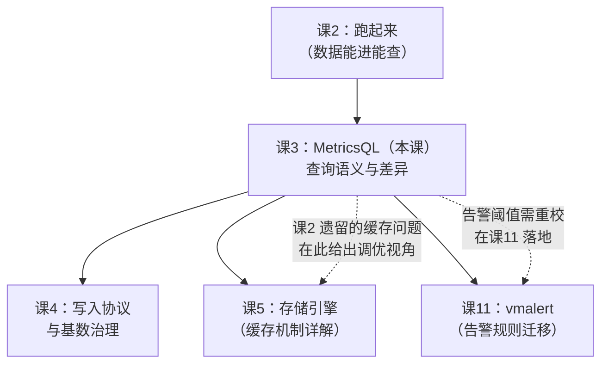

# 课 3：MetricsQL：站在 PromQL 肩膀上

> 阶段 2 · 数据怎么进来、怎么查 ｜ 故事章节：把老链路接进来
> 返回：[阶段概览](README.md) ｜ [课程目录](../../02-课程目录.md)
> 上一课：[课 2 跑起来第一个 VictoriaMetrics](../1-为什么需要VictoriaMetrics/2-跑起来第一个VictoriaMetrics.md)

> ⚠️ **本课所有命令与输出均在本机（WSL Ubuntu + Docker，v1.151.0）实测通过，实测日期 2026-09-02。**
> 实验脚本：`playground/l03-prepare-data.sh`、`l03-verify-commands.sh`、
> `l03-verify-gap-name.sh`、`l03-debug-rate.sh`、`l03-debug-rate2.sh`。

---

## 第一幕：场景引入

你已经在 Grafana 里加好了 VictoriaMetrics 数据源，
指向 `http://localhost:8428`，类型选的是 Prometheus。

你点开一个跑了三年的面板，所有图表正常显示。
你试着写一条新查询：

```promql
rate(node_network_receive_bytes_total)
```

**注意这里没有 `[5m]`**——你忘了写窗口。

在 Prometheus 里，这条查询会直接报语法错误：
`parse error: expected type range vector...`

但在 VictoriaMetrics 里，它返回了数据。

你有点不安：这是「容错」还是「乱来」？
如果连窗口都能省，那 MetricsQL 到底还算不算 PromQL？
我的告警规则迁移过去会不会悄悄变了个意思？

这三个问题问得非常好。因为官方文档里有一行很容易被忽略的事实：

> VictoriaMetrics 官方自己跑 Prometheus 兼容性测试套件，
> 结果是 **385 / 529 通过（72.78%）**，149 个用例失败。

**「向后兼容」和「100% 一致」是两件事。**
这一课就是要把这 149 个失败用例里的关键几条讲清楚——
哪些差异会让你的告警阈值悄悄失准，哪些只是显示层面的不同。

---

## 第二幕：认知冲突

大多数人的预期是：**既然声称向后兼容，那结果就应该一模一样**。

这个预期在实际迁移中会导致两类事故：

**事故 A：告警阈值失准**

你有一条告警：`increase(http_requests_total[5m]) > 1000`。
迁移到 VM 后，同样的查询返回的值**变大了**——
不是因为流量涨了，而是因为 MetricsQL 和 PromQL 计算 `increase` 的方式不同。

这不是 bug，是 VM 有意为之（它认为自己算得更准）。
但你的阈值是按 PromQL 的口径定的。

**事故 B：面板「看起来」一样，实际语义已变**

Prometheus 里 `min_over_time(foo[5m])` 返回的序列**没有** `__name__`
（因为 PromQL 规定函数会丢弃指标名）。
VM 里它**保留了** `foo`。

如果你的面板用 `legendFormat` 依赖指标名，显示就会不一样。

更深一层的冲突是：

> **声称兼容 ≠ 行为一致。**
> 「兼容」说的是「你的查询不会报错」，
> 不保证「每个数值都逐位相同」。

想清楚这一层，你就不会在迁移后被「数字变了」吓到，
而是能立刻定位到「这是哪一类差异」。

---

## 第三幕：层层揭示

### 知识点 1：兼容性与差异总览

**一句话定义**：MetricsQL 是 PromQL 的**超集**——
所有合法 PromQL 都能跑，但官方自测的 PromQL 兼容性是 **72.78%（385/529）**；
失败用例集中在**指标名保留**、**rate/increase 计算方式**、**NaN 处理**三类，
且这些差异**几乎全部是 VM 有意为之**。

#### 直觉建立

把 PromQL 想成**普通话**，MetricsQL 想成**带方言的普通话**。

说方言的人能听懂普通话（向后兼容），
但你用普通话问路，他可能给你指一条**更近但你没走过的路**（结果不同）。

关键不是「他说的对不对」，而是：
**你得知道他改了哪几个路口的规则，否则会在不熟悉的地方走错。**

> ⚠️ **类比失效的边界**：方言和普通话的词汇是一一对应的，
> 但 MetricsQL 有一批 PromQL **完全没有**的函数（如 `keep_last_value`、`default`）。
> 这部分不是「方言」，是**新造的词**——用习惯了就回不去 Prometheus 了。

#### 核心原理

**官方公布的兼容性数据**（来源：VictoriaMetrics 官方博客，
测试对象 Prometheus v2.30.0 vs VictoriaMetrics v1.67.0）：

```text
Total: 385 / 529 (72.78%) passed, 0 unsupported
```

149 个失败用例的分布，官方文档明确承认的**六类有意差异**：

| # | 差异 | PromQL 行为 | MetricsQL 行为 | 影响面 |
|---|------|-------------|----------------|--------|
| 1 | **窗口前采样点** | `increase(m[5m])` 只看窗口内的点 | 额外纳入窗口**前最后一个点** | 数值变大 |
| 2 | **不做外推** | 对 `rate`/`increase` 做边界外推 | **不外推** | 整数 counter 更准 |
| 3 | **step 小于抓取间隔** | 返回空 | 返回非空 | 面板不再「No Data」 |
| 4 | **保留指标名** | 函数后丢弃 `__name__` | 部分函数**保留** | 图例/下游处理 |
| 5 | **去除 NaN** | 返回 NaN 序列 | **直接剔除** | 告警逻辑 |
| 6 | **scalar 类型** | scalar 与无标签 vector 不同 | 视为等同 | 表达式写法 |

**第 1 条是数值差异的最大来源**，值得单独画出来：

```text
时间轴：  ────[A]────────[B]────────[C]──────>
                 ↑                    ↑
              窗口前一个点         窗口起点
                 ↑___________________↑
                    PromQL 丢失这段增量

MetricsQL 把 [A] 也纳入计算，因此 increase 结果更大、更接近真实增量。
```

**第 5 条（去除 NaN）有个实际影响**：
Prometheus 里 `(-1)^0.5` 返回一串 NaN 序列，VM 里返回**空**。
如果你的告警规则依赖「有没有序列」而不是「值是否超阈值」，行为会变。

#### 示例演示：实测「保留指标名」的真实边界

官方文档的表述是「`min_over_time(foo)` 或 `round(foo)` 会保留指标名」——
这个说法比较笼统。我实测了 8 个函数（脚本 `l03-verify-gap-name.sh`）：

| 函数 | 是否保留 `__name__` | 实测 |
|------|---------------------|------|
| `round(l3_gappy)` | ✅ 保留 | `l3_gappy{...} = 75` |
| `ceil(l3_gappy)` | ✅ 保留 | `l3_gappy{...} = 75` |
| `clamp_max(l3_gappy, 1000)` | ✅ 保留 | `l3_gappy{...} = 75` |
| `min_over_time(l3_gappy[5m])` | ✅ 保留 | `l3_gappy{...} = 50` |
| `max_over_time(l3_gappy[5m])` | ✅ 保留 | `l3_gappy{...} = 145` |
| **`sum_over_time(l3_gappy[5m])`** | ❌ **不保留** | `<无名称>{...} = 2590` |
| **`abs(l3_gappy)`** | ❌ **不保留** | `<无名称>{...} = 75` |
| `rate(l3_counter_total[5m])` | ❌ 不保留 | `<无名称>{...}` |

**这里有个官方文档没写清的细节**：
`min_over_time` / `max_over_time` 保留指标名，
但 **`sum_over_time` 不保留**，`abs` 也不保留。

判断标准其实是语义：**「结果仍代表同一个量的某种取值」就保留，
「结果的物理含义已经变了」就不保留。**
min/max/round/ceil 取的是原序列的某个值，所以保留；
sum 是加总，abs 是变换，含义变了，所以不保留。

> 📌 这条实测结论比官方文档的笼统说法更精确。
> 如果你依赖 `__name__` 做下游处理，**务必自己实测一遍你用到的函数**，
> 不要假设「over_time 类都保留」。

#### 常见误区

**误区 A：「兼容 = 结果一模一样，可以无脑迁移」**

不能。数值层面至少有三类差异（窗口前采样点、不外推、NaN 处理）。
迁移后**必须重新校准告警阈值**，尤其是用 `increase` 的规则。

**误区 B：「72.78% 兼容性说明 VM 的 PromQL 实现很差」**

这个数字要正确解读。149 个失败用例里，
**92 个（约 17%）仅仅是因为「多带了个指标名，但数值完全相同」**——
官方文档明确指出这些「values in the response are identical」。

换句话说，扣掉纯指标名差异，实际数值层面的分歧要小得多。
而且这些差异**大多是 VM 认为 Prometheus 是错的那部分**。

**误区 C：「差异都是 VM 的 bug，会修好」**

不会。官方明确表示「VictoriaMetrics is not 100% compatible with PromQL
**and never will be**」。这些是有意的设计决策。

#### 一句话记住

> MetricsQL 是 PromQL 的**超集**：你的 PromQL 都能跑，
> 但**数值口径有三处有意差异**（窗口前采样点 / 不外推 / 去 NaN）。
> 迁移后**必须重校告警阈值**，别指望逐位一致。

---

### 知识点 2：MetricsQL 独有能力

**一句话定义**：MetricsQL 在 PromQL 之上提供了一批 PromQL 写不出、
或要用很别扭的写法才能表达的能力，核心包括 **gap 填补**（`keep_last_value` /
`default` / `if`）、**省略 lookbehind 窗口**、**WITH 模板**、
**多 `or` 过滤器**、`limit` 后缀等。

#### 直觉建立

PromQL 处理数据缺失的方式是**留白**——
没数据就是没数据，图表上断一段。

这在大多数时候是对的（真实反映现状），
但在两类场景下很折磨人：

1. 抓取偶尔抖动，一两个点丢了，图表上出现锯齿状空洞
2. 你想算「A 除 B」，但 B 偶尔缺失，整个结果就消失了

MetricsQL 的填补类函数就像**画面修复工具**：
它不改变已存在的像素，只把缺失的部分用合理的规则补上。

> ⚠️ **类比失效的边界**：图像修复是「猜」，
> 而 `keep_last_value` 是明确的语义——「用上一个已知值」。
> 它不是插值，不会凭空造出中间值。
> 别把它当成数据平滑或预测工具。

#### 核心原理

**能力 1：gap 填补三件套**

| 函数/操作符 | 作用 | 填补范围 |
|-------------|------|----------|
| `keep_last_value(m)` | 用**上一个**已知值填补 | 序列存在但缺样本 |
| `keep_next_value(m)` | 用**下一个**已知值填补 | 序列存在但缺样本 |
| `q1 default q2` | q1 缺失时用 q2 的值 | **包括序列完全不存在** |

**这里有个必须实测才能发现的关键区别**（本课最重要的发现之一）：

我用一条故意断开 10 分钟的序列做了对照实验：

```text
gap 区间: 14:18:45 -> 14:28:45   （这 10 分钟内没有任何样本）
取样点  : 14:23:45
```

| 查询 | 结果 |
|------|------|
| `l3_gappy` | **0 条**（原始值确实缺失） |
| `keep_last_value(l3_gappy)` | **0 条**（没能填补！） |
| `keep_next_value(l3_gappy)` | **0 条**（没能填补！） |
| `l3_gappy default -1` | **1 条，值 = -1**（成功填补） |

**结论**：`keep_last_value` / `keep_next_value` 只能填补
**「序列存在、但中间缺了几个样本」**的空洞，
**填补不了「整条序列在一段时间内完全消失」**的断档。

原因是：这两个函数的实现依赖在 lookbehind 窗口内找到已知样本。
断档 10 分钟远超默认窗口，找不到参照值，于是什么也不返回。

要填补**完全消失**的断档，得用 `default`，或显式放大窗口：

```promql
last_over_time(l3_gappy[1h])   -- 用 1 小时窗口找回断档前的值
```

**能力 2：省略 lookbehind 窗口**

```promql
rate(node_network_receive_bytes_total)     -- 合法
increase(http_requests_total)              -- 合法
```

VM 会根据 `step` 参数和实际抓取间隔**自动选择窗口**。
在 Grafana 里大致等价于 `rate(m[$__interval])`。

实测（干净数据，每秒递增 10）：

| 查询 | 结果 | 期望 |
|------|------|------|
| `rate(l3_clean_counter[1m])` | `10` | 10 ✅ |
| `rate(l3_clean_counter[2m])` | `10` | 10 ✅ |
| `rate(l3_clean_counter[5m])` | `10` | 10 ✅ |
| `increase(l3_clean_counter[1m])` | `600` | 60s × 10 ✅ |
| `increase(l3_clean_counter[2m])` | `1200` | 120s × 10 ✅ |
| `increase(l3_clean_counter[5m])` | `3000` | 300s × 10 ✅ |

> 实测证明：在**均匀递增**的 counter 上，
> MetricsQL 的 `rate`/`increase` 精确得近乎「教科书」——
> 这正是「不外推 + 纳入窗口前采样点」带来的好处。
> Prometheus 在同样数据上会给出带小数的外推结果。

**能力 3：WITH 模板**

```promql
WITH (
  common = {job="api", env=~"prod|staging"}
)
  sum(rate(http_requests_total{common}[5m]))
```

实测：

```promql
WITH (x = l3_mem_bytes) x / 1024
```

返回 5 条序列，值正确（如 `h1 = 0.09765625` = 100/1024）。

**能力 4：多 `or` 过滤器**

```promql
{job="api",instance="i1" or job="web",instance="i3"}
```

实测命中 3 条序列。PromQL 里要写成
`{job="api",instance="i1"} or {job="web",instance="i3"}`，
且在多标签组合时更啰嗦。

**能力 5：聚合后 `limit`**

```promql
sum(l3_mem_bytes) by (dc) limit 2
```

实测返回 1 条（因为只有一个 dc）。
这在**防止高基数聚合拖垮查询**时非常有用。

**其它值得一提的**：

- `median(m)`：直接用中位数，不用写 `quantile(0.5, m)`。实测返回 `350`（5 台主机的中位值，正确）
- 负 offset：`q offset -1h`
- 尾部逗号：`m{foo="bar",}`、`f(a, b,)`
- 数字下划线：`1_234_567_890`
- `#` 注释

#### 示例演示：把 gap 填补用起来

```bash
# 1. 先确认 gap 真实存在
curl -s -G 'http://localhost:8428/api/v1/query_range' \
  --data-urlencode 'query=l3_gappy' \
  --data-urlencode 'start=<gap起点-120>' \
  --data-urlencode 'end=<gap终点+120>' \
  --data-urlencode 'step=60' --data-urlencode 'nocache=1'
```

实测输出（可见 14:18:45 → 14:28:45 之间断开）：

```text
14:16:45  55
14:17:45  115
14:18:45  60
14:28:45  75     ← 中间 10 分钟无数据
14:29:45  135
14:30:45  95
```

```bash
# 2. 用 default 填补完全消失的断档
curl -s -G 'http://localhost:8428/api/v1/query' \
  --data-urlencode 'query=l3_gappy default -1' \
  --data-urlencode 'time=<gap中点>' --data-urlencode 'nocache=1'
```

实测返回 `l3_gappy{instance="i1",job="api"} = -1`。

```bash
# 3. 用 last_over_time 放大窗口，找回断档前的真实值
curl -s -G 'http://localhost:8428/api/v1/query' \
  --data-urlencode 'query=last_over_time(l3_gappy[1h])' \
  --data-urlencode 'time=<gap中点>' --data-urlencode 'nocache=1'
```

#### 常见误区

**误区 A：「`keep_last_value` 能填补所有数据缺失」**

**不能**，这是本课实测推翻的直觉。它只填补「序列存在但缺样本」，
填补不了「整条序列消失」。后者用 `default` 或 `last_over_time(m[大窗口])`。

**误区 B：「省略窗口很方便，那就都省掉」**

在 Grafana 里省掉很方便（自动跟随 `$__interval`）。
但在**告警规则**里，VM 无法从 Grafana 拿 step，
窗口选择可能不符合预期。**告警规则建议显式写窗口**。

**误区 C：「用了 MetricsQL 扩展还能随时切回 Prometheus」**

不行。官方文档明确写：这些扩展功能
「**doesn't work in PromQL, so it is impossible switching back to Prometheus
after you start using it**」。

这是**单向门**。用之前先确认不会回退。

#### 一句话记住

> gap 填补有三件套，但**能力边界不同**：
> `keep_last_value` 只补「缺样本」，`default` 才能补「序列消失」。
> MetricsQL 扩展是**单向门**——用了就回不去 Prometheus。

---

### 知识点 3：查询陷阱与调优

**一句话定义**：MetricsQL 的查询陷阱集中在三处——
**重复写入同时间戳样本导致 rate 失真**、**查询缓存导致结果滞后**、
**高基数聚合拖垮查询**；对应手段是写入去重、合理设置缓存参数、
用 `limit` 和 `topk` 约束输出规模。

#### 直觉建立

把查询调优想成**超市结账**：

- **数据脏**（同时间戳重复写入）= 商品扫码扫重了，账单金额翻倍——
  不是收银台的问题，是**上货环节**的问题
- **缓存滞后** = 价签还没更新，你看到的还是旧价——课 2 已经讲过
- **高基数** = 一次性把整个仓库的货都推到收银台——
  收银员再快也扛不住

三个问题的解法分别在上游、参数、查询写法三处，不能混为一谈。

> ⚠️ **类比失效的边界**：超市扫码重复会被发现（金额异常），
> 但时序库里同时间戳重复写入是**静默的**——
> 后写的覆盖先写的，`rate` 计算出的差值却是错的，很难察觉。

#### 核心原理

**陷阱 1：同时间戳重复写入（本课实测抓到的真实事故）**

我在准备实验数据时，不小心把数据准备脚本**执行了两次**。
结果：同一个时间戳被写入了两个不同的值。

排查时看到的原始样本（`export` 接口读回）：

```text
14:57:45  36400     ← 第一批写入
14:57:45  37000     ← 第二批写入（同一秒！）
14:58:00  36550
14:58:15  36700
```

**关键问题：同一时间戳有两个值，查询时返回哪个？**

实测（脚本 `l03-debug-rate2.sh`）：

```text
写入 100，再写入 999（同一 ts）→ 查询返回 999
```

**后写入的覆盖先写入的**（last-write-wins）。

但 `rate` 的计算结果就乱了——因为它在窗口内取首尾差值，
而首尾值可能来自不同批次：

```text
rate(l3_counter_total{instance="i1"}[2m])  = 10      ← 碰巧正确
rate(l3_counter_total{instance="i1"}[5m])  = 24.29   ← 应为 10
rate(l3_counter_total{instance="i1"}[10m]) = 27.65   ← 应为 10
```

**窗口越大越离谱**，因为跨越的批次边界越多。

我用干净数据重测（全新指标，每秒递增 10，无重复写入）：

```text
rate(l3_clean_counter[1m]) = 10    ✅
rate(l3_clean_counter[2m]) = 10    ✅
rate(l3_clean_counter[5m]) = 10    ✅
increase(l3_clean_counter[5m]) = 3000   ✅（300 秒 × 10）
```

**结论**：`rate` 算出离谱的值，**先怀疑数据，再怀疑引擎**。

排查手法：

```bash
# 用 export 读回原始样本，看有没有同时间戳重复
curl -s -G 'http://localhost:8428/api/v1/export' \
  --data-urlencode 'match[]=你的指标' \
  --data-urlencode 'start=...' --data-urlencode 'end=...'
```

> ⚠️ **一个必踩的坑**：`/api/v1/export` 返回的 `timestamps` 单位是
> **毫秒**，而写入时用的是**秒**。
> 我第一次排查时直接 `datetime.fromtimestamp(t)`，
> 报了 `ValueError: year 58639 is out of range`。
> **读 export 结果记得除以 1000。**

**陷阱 2：查询缓存滞后**

课 2 已详细讲过，这里补充调优视角：

| 参数 | 默认 | 调优建议 |
|------|------|----------|
| `-search.cacheTimestampOffset` | `5m` | 若你经常查「刚写入」的数据，可**调大** |
| `-search.disableCache` | `false` | 仅**回填历史数据期间**临时开启 |
| 查询参数 `nocache=1` | — | 排查时临时绕过缓存 |

回顾课 2 的 2×2 实验结论：刷盘后普通查询仍为 0，`nocache=1` 才能看到。

**陷阱 3：高基数聚合**

一个 `sum by (instance)` 聚合，如果 `instance` 有 10 万个值，
就要在内存里维护 10 万个分组。

约束手段：

```promql
sum(m) by (dc) limit 10          -- 限制输出条数
topk(20, sum(m) by (instance))   -- 只要前 20
```

实测：

```promql
topk(3, l3_mem_bytes)
```

返回 3 条：`h3=720`、`h5=480`、`h2=350`（正确降序）。

> 📌 **高基数的根治在写入侧**（relabel / 流式聚合），
> 查询侧的 `limit` 只是止血。完整方案见课 4 知识点 3。

#### 示例演示：完整的 rate 失真排查流程

**第 1 步：发现异常**

```promql
rate(l3_counter_total{instance="i1"}[5m])   -- 返回 24.29，期望 10
```

**第 2 步：确认是不是数据问题**

```bash
curl -s -G 'http://localhost:8428/api/v1/export' \
  --data-urlencode 'match[]=l3_counter_total{instance="i1"}' \
  --data-urlencode "start=$(( $(date +%s) - 300 ))" \
  --data-urlencode "end=$(date +%s)" \
| python3 -c '
import sys, json, datetime
for line in sys.stdin:
    d = json.loads(line)
    for t, v in zip(d["timestamps"], d["values"]):
        print(datetime.datetime.fromtimestamp(t/1000), v)   # 注意 /1000
'
```

**第 3 步：发现同时间戳重复 → 去重写，或用干净指标重测**

**第 4 步：交叉验证**

在干净数据上跑同样的查询，确认引擎行为正确。

#### 常见误区

**误区 A：「rate 算错了，是 VM 的 bug」**

先查数据。本课的真实案例就是**脚本重复执行导致脏数据**，
引擎行为完全正确。**离谱的 rate 值，九成是数据问题。**

**误区 B：「`/api/v1/export` 的时间戳和写入时一样是秒」**

**不是，是毫秒。** 直接当秒用会得到
`year 58639 is out of range` 这类荒谬错误。

**误区 C：「查询慢就加机器」**

高基数聚合慢，加机器只能缓解。
根治要在**写入侧**做 relabel 或流式聚合（课 4），
查询侧 `limit` / `topk` 只是止血。

#### 一句话记住

> `rate` 离谱 → **先 export 查原始数据**（注意毫秒）→ 再怀疑引擎。
> 查询调优三件事：**上游去重、缓存参数、limit 约束**。

---

## 第四幕：实操验证

### 完整流程

```bash
# 1. 准备实验数据（counter / 带 gap 的 gauge / 多主机内存）
bash /mnt/d/projects/learning/victoriametrics/playground/l03-prepare-data.sh

# 2. 验证 MetricsQL 各项能力
bash /mnt/d/projects/learning/victoriametrics/playground/l03-verify-commands.sh

# 3. 精确验证 gap 填补与指标名保留
bash /mnt/d/projects/learning/victoriametrics/playground/l03-verify-gap-name.sh

# 4. 排查 rate 失真（含干净数据对照）
bash /mnt/d/projects/learning/victoriametrics/playground/l03-debug-rate2.sh
```

### 实测结论汇总

| 验证项 | 实测结果 | 与预期是否一致 |
|--------|----------|----------------|
| `round`/`ceil`/`clamp_max` 保留指标名 | 保留 ✅ | 与文档一致 |
| `min`/`max_over_time` 保留指标名 | 保留 ✅ | 与文档一致 |
| **`sum_over_time` 保留指标名** | **不保留** ❌ | **与文档笼统说法有出入** |
| **`abs` 保留指标名** | **不保留** ❌ | 文档未提及 |
| 省略 lookbehind 窗口 | 返回正确值 ✅ | 与文档一致 |
| `rate` 在干净数据上 | 精确 = 10 ✅ | 与文档一致 |
| **`keep_last_value` 填补 10 分钟断档** | **填补失败（0 条）** | **与直觉不符** |
| `default -1` 填补断档 | 成功 = -1 ✅ | 符合预期 |
| 同时间戳重复写入 | 后写覆盖先写 ✅ | 符合 last-write-wins |
| `export` 时间戳单位 | **毫秒** | 与写入的秒不同 ⚠️ |
| 多 `or` 过滤器 | 命中 3 条 ✅ | 与文档一致 |
| `topk(3, ...)` | 正确返回前 3 ✅ | 与文档一致 |
| `median(...)` | 返回 350 ✅ | 与文档一致 |

> ✅ **回扣场景**：回到第一幕那三个问题——
>
> 1. **「省掉窗口是容错还是乱来？」** 是刻意设计，VM 按 step 自动选窗口，
>    实测在干净数据上结果精确。但**告警规则里建议显式写窗口**。
> 2. **「还算不算 PromQL？」** 是超集，但官方自测兼容性 **72.78%**，
>    差异集中在指标名保留、rate/increase 口径、NaN 处理三处。
> 3. **「告警会不会悄悄变意思？」** **会**。迁移后必须重校阈值，
>    尤其是用 `increase` 的规则（MetricsQL 纳入窗口前采样点，结果偏大）。

---

## 第五幕：体系收束

### 本课在全局的位置



### 你现在会了什么

- 能说清 MetricsQL 与 PromQL 的**六类有意差异**，并知道官方自测兼容性是 72.78%
- 知道「保留指标名」的**真实边界**（min/max 保留，sum/abs 不保留）——
  这比官方文档的笼统说法更精确
- 会用 gap 填补三件套，且知道 **`keep_last_value` 补不了整条序列消失**的断档
- 掌握 `rate` 失真的排查手法：**先 export 查原始数据（毫秒！），再怀疑引擎**
- 知道 MetricsQL 扩展是**单向门**，用了就回不去 Prometheus

### 关键伏笔

- **为什么会有查询缓存？** → 课 5 讲存储引擎时，会解释缓存与 LSM 结构的关系
- **`-search.cacheTimestampOffset` 到底该怎么调？** → 课 5 结合写入路径给出具体建议
- **高基数怎么根治？** → 课 4 知识点 3 讲 relabel 与流式聚合

> 📍 **全局定位**：课 3 完成了「怎么查」。
> 与课 2 的「怎么存、怎么写」合起来，你已经能用 VictoriaMetrics 干活了。
> 但**「为什么这么快」还完全没解释**——那是阶段 3 的主题。
> 🔗 **下一步**：课 4 讲写入协议全家桶与基数治理。
> 基数（cardinality）是监控系统的头号杀手，
> 也是课 1 提到的「天花板 3」的根治方案所在。

---

## 🐞 常见误区

1. **「兼容 = 结果一模一样」**
   不是。官方自测兼容性 72.78%，数值差异集中在窗口前采样点、不外推、去 NaN 三处。

2. **「72.78% 说明 VM 实现很差」**
   错误解读。149 个失败用例里 92 个**仅仅因为多了个指标名，数值完全相同**。

3. **「`keep_last_value` 能填补所有缺失」**
   **不能**。实测证明它填不了「整条序列消失」的断档，那种情况要用 `default`。

4. **「`sum_over_time` 会保留指标名」**
   实测**不保留**。官方「over_time 类保留」的说法过于笼统。

5. **「`/api/v1/export` 的时间戳是秒」**
   **是毫秒**。当秒用会报 `year 58639 is out of range`。

6. **「rate 算错了是 VM 的 bug」**
   先查数据。本课真实案例是脚本重复执行导致同时间戳写入不同值。

7. **「用了 MetricsQL 扩展还能切回 Prometheus」**
   不能，这是**单向门**。官方文档明确说明。

8. **「告警规则里也可以省略窗口」**
   不建议。告警规则没有 Grafana 的 `$__interval`，请显式写窗口。

---

## 一图总结


---

## 课后小测

**Q1**：一条序列在 14:18:45 到 14:28:45 之间完全没有样本（整条序列消失）。
在 14:23:45 这个时间点，下列哪个查询**能**返回值？

- A. `keep_last_value(l3_gappy)`
- B. `keep_next_value(l3_gappy)`
- C. `l3_gappy default -1`
- D. 以上都不能

<details><summary>答案与解析</summary>

**答案：C**。这是本课实测推翻直觉的关键发现。
`keep_last_value` / `keep_next_value` 只能填补**「序列存在但缺样本」**的空洞，
填补不了**「整条序列在一段时间内完全消失」**的断档——
实测中 A、B 都返回 0 条，只有 C 返回 -1。

根治断档要么用 `default`，要么显式放大窗口：
`last_over_time(l3_gappy[1h])`。

</details>

**Q2**：你用 `/api/v1/export` 读回样本，写
`datetime.datetime.fromtimestamp(t)` 得到 `ValueError: year 58639 is out of range`。
原因是？

- A. 数据损坏
- B. 时间戳单位是毫秒，应除以 1000
- C. 时区设置错误
- D. 样本值超出范围

<details><summary>答案与解析</summary>

**答案：B**。`/api/v1/export` 返回的 `timestamps` 单位是**毫秒**，
而写入时用的单位是**秒**。差 1000 倍，于是年份算到了 58639 年。
正确写法：`datetime.datetime.fromtimestamp(t/1000)`。

这个坑很隐蔽，因为报错信息完全不提「单位」。

</details>

**Q3**：关于 MetricsQL 与 PromQL 的兼容性，下列说法正确的是？

- A. MetricsQL 100% 兼容 PromQL，所有查询结果完全一致
- B. 官方自测通过率 72.78%，但失败用例中约 92 个仅因多带了指标名、数值完全相同
- C. 兼容性差异都是 VM 的 bug，后续版本会修复
- D. 使用了 MetricsQL 扩展后仍可随时切回 Prometheus

<details><summary>答案与解析</summary>

**答案：B**。官方公布 `Total: 385 / 529 (72.78%) passed`，
且文档明确指出 149 个失败用例里 **92 个（约 17%）仅因 VM 保留了指标名，
响应中的数值完全相同**。

C 错——官方明确说「not 100% compatible with PromQL **and never will be**」，
这些是有意的设计决策。
D 错——扩展功能是**单向门**，用了就回不去 Prometheus。

</details>

---

## 🚀 下一批接力提示词

```text
我想学习 VictoriaMetrics，我已完成 课 1-3。

已完成的知识：
- Prometheus 五个天花板；VM 起源；单节点部署；「写入查不到」两机制（课 1-2）
- MetricsQL 与 PromQL 的六类差异（官方自测 72.78%）、gap 填补三件套、
  rate 失真排查（export 毫秒坑）、MetricsQL 是单向门（课 3）

请继续 课 4《写入协议全家桶与基数治理》，需要覆盖：
1. Prometheus remote write 协议（生产最常用路径，含 Prometheus 侧配置）
2. 其他协议接入（InfluxDB line protocol、Graphite、OpenTSDB、CSV import）
3. 基数：监控系统的头号杀手（relabel 丢弃、流式聚合、cardinality explorer、
   storage.maxHourlySeries 等限流兜底）

背景：我已有 PromQL 基础，也学过 InfluxDB（本仓库 influxdb3/ 课程）。
实操环境：WSL Ubuntu + Docker，容器名 vm-learn，端口 8428。

已有实验数据（可复用）：
- l3_counter_total{job,instance}：3 条序列，每秒递增 10/25/7
- l3_gappy{job,instance}：带 10 分钟断档的 gauge
- l3_mem_bytes{host,dc}：5 台主机内存
- l3_clean_counter{job}：干净 counter，每秒 +10

请按 topic-teach skill 的五幕结构 + 知识点六要素撰写，
每条命令必须真跑验证，并在写完后执行双 agent（pedagogy + learner）评审。
```

---

## 🧭 课程导航

- **上一课**：[课 2 跑起来第一个 VictoriaMetrics](../1-为什么需要VictoriaMetrics/2-跑起来第一个VictoriaMetrics.md)
- **下一课**：[课 4 写入协议全家桶与基数治理](4-写入协议全家桶与基数治理.md)
- **本阶段**：阶段 2 概览（待生成）
- **返回**：[课程目录](../../02-课程目录.md) ｜ [学习路径总览](../../01-学习路径总览.md)
