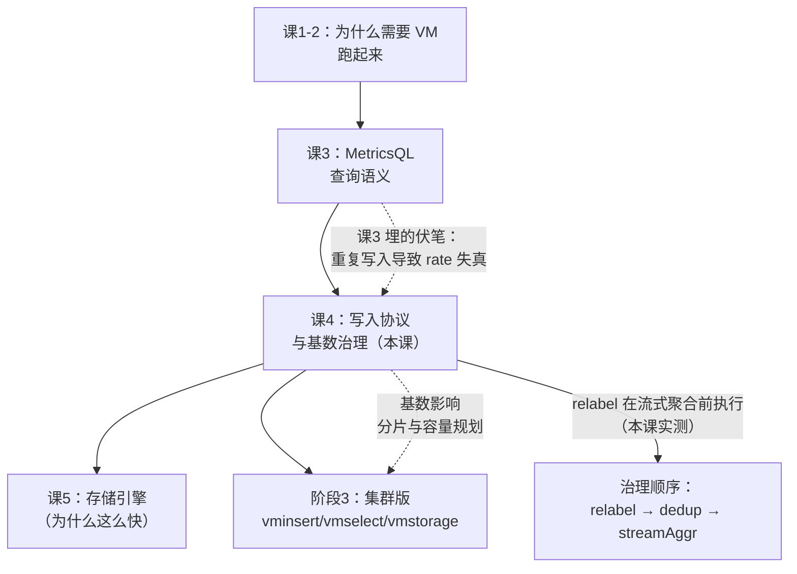
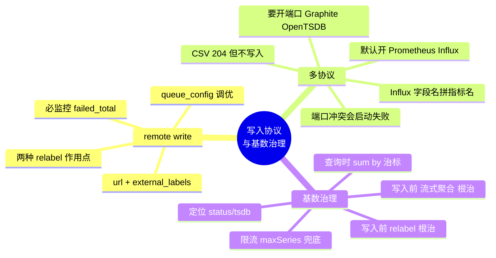

# 课 4：写入协议全家桶与基数治理

> 阶段 2 · 数据怎么进来、怎么查 ｜ 故事章节：把老链路接进来
> 返回：[阶段概览](README.md) ｜ [课程目录](../../02-课程目录.md)
> 上一课：[课 3 MetricsQL：站在 PromQL 肩膀上](3-MetricsQL站在PromQL肩膀上.md)

> ⚠️ **本课所有命令与输出均在本机实测通过（WSL Ubuntu + Docker，VM v1.151.0 + Prometheus v2.53.0，2026-09-02）。**
> 实验脚本：`playground/l04-*.sh`、配置 `playground/prometheus.yml`、`relabel.yaml`、`stream-aggr.yaml`。

---

## 第一幕：场景引入

你的 Prometheus 跑了两年，本地盘快满了， retention 只能留 15 天。
老板要求「至少留一年」。

你决定上 VictoriaMetrics 做远端存储。按文档加三行配置：

```yaml
remote_write:
  - url: http://localhost:8428/api/v1/write
```

重启，数据开始往 VM 里灌。一周后你发现两个问题：

**问题一**：`node_cpu_seconds_total` 的序列数从 8 万涨到了 **200 万**。
你没加机器，没加服务，序列数自己涨了十几倍。

**问题二**：运维同事说「我们还有一批老的 Graphite 和 Telegraf 采集器，
能不能也接进来？」你搜了搜文档，发现 VM 支持七八种协议，
但**每种协议的启用方式、端口、数据模型映射都不一样**。

更要命的是，你隐约感觉这两个问题有关联：
**数据进来的方式，决定了它长什么样；而它长什么样，决定了要花多少钱存。**

这一课就是把「入口」和「成本」这两件事一次讲透。

---

## 第二幕：认知冲突

大多数人对「接入」的理解是：

> 配置一个 URL，数据就进来了。剩下的交给数据库。

这个理解在**关系型数据库**上基本成立，但在时序库上会踩两个坑。

**坑一：以为「接进来」是终点，其实是起点**

数据一旦以某种形态写入，它的**基数（cardinality）就固化了**。
一个带 `user_id` 标签的指标，进来 5000 个用户就是 5000 条序列——
你后面再怎么优化查询，这 5000 条序列的**存储成本已经产生了**。

这也是为什么本课把「写入协议」和「基数治理」放在一起讲：
**治理的最佳时机是写入前，而不是写入后。**

**坑二：以为所有协议「等价」，只是格式不同**

实测下来完全不是。本课会展示：

| 协议 | 默认开启 | 需要独立端口 | 数据模型转换 |
|------|----------|--------------|--------------|
| Prometheus remote write | ✅ 是 | ❌ 用 8428 | 一对一 |
| InfluxDB line protocol | ✅ 是 | ❌ 用 8428 | **字段名拼进指标名** |
| Graphite | ❌ 否 | ✅ 2003 | 点号路径 |
| OpenTSDB | ❌ 否 | ✅ 4242 / 4243 | metric + tags |
| CSV import | ✅ 是 | ❌ 用 8428 | **实测返回 204 但写入 0 行** |

> **核心冲突**：
> **「接得进来」和「接得对」是两件事。**
> 接得进来只是 HTTP 返回 204；
> 接得对意味着数据模型正确、基数可控、成本可预期。

---

## 第三幕：层层揭示

### 知识点 1：Prometheus remote write 生产配置

**一句话定义**：Prometheus 通过 `remote_write.url` 把样本**并行**推送到 VM，
同时继续写本地存储；多实例写入时必须用 `external_labels` 区分来源，
高负载（20 万+ samples/s）需调 `queue_config`。

#### 直觉建立

把 remote write 想成**寄快递**：

- Prometheus 是发货方，VM 是仓库
- `queue_config` 是**打包和发车策略**：一次装多少（`max_samples_per_send`）、
  仓库里堆多少待发（`capacity`）、同时开几辆车（`max_shards`）
- **本地存储是仓库的备份**：VM 挂了，数据还在 Prometheus 本地，
  保留 `--storage.tsdb.retention.time` 那么久

> ⚠️ **类比失效的边界**：快递丢了可以补发，
> 但 remote write 的 WAL 队列是**有界**的——
> `capacity` 满了且 VM 长时间不可用，**新数据会被丢弃**（不是无限堆积）。

#### 核心原理

**最小可用配置**：

```yaml
remote_write:
  - url: http://localhost:8428/api/v1/write
```

**生产配置（本课实测验证的完整版）**：

```yaml
global:
  scrape_interval: 5s
  # 多个 Prometheus 写同一个 VM 时必须加，否则序列冲突
  external_labels:
    datacenter: dc-learn
    prom_id: prom-01

remote_write:
  - url: http://localhost:8428/api/v1/write
    name: victoria-metrics
    queue_config:
      max_samples_per_send: 2000   # 每批最多发多少样本
      capacity: 5000               # 内存队列容量
      max_shards: 10               # 最大并发分片数
    # 写入前过滤：丢弃低价值高基数指标
    write_relabel_configs:
      - source_labels: [__name__]
        regex: 'go_gc_.*'
        action: drop
```

**高负载调优**（官方文档针对 20 万+ samples/s 的建议）：

```yaml
queue_config:
  max_samples_per_send: 10000
  capacity: 20000
  max_shards: 30
```

⚠️ 官方明确警告：启用 remote write 会让 Prometheus **内存占用上升约 25%**。
如果内存吃紧，优先调低 `max_samples_per_send` 和 `capacity`——
这两个参数**强耦合**，要一起调。

**`external_labels` 为什么必须加？**

多个 Prometheus 写同一个 VM 时，如果都上报 `up{job="api"}`，
序列会**互相覆盖**。加了 `external_labels` 后：

```text
up{datacenter="dc-learn", instance="localhost:9090", job="prometheus", prom_id="prom-01"} = 1
```

每条序列都带上了来源标识，查询时可以按 `datacenter` 分组。

**两种 relabel 的区别（本课实测）**

Prometheus 有两个地方可以做过滤，作用点不同：

| 配置位置 | 作用范围 | 影响本地存储 |
|----------|----------|--------------|
| `metric_relabel_configs`（scrape_config 内） | **抓取后**立即生效 | ✅ 影响，本地也不存 |
| `write_relabel_configs`（remote_write 内） | **仅远端写入前** | ❌ 不影响，本地照存 |

#### 示例演示：本课实测的完整链路

**第 1 步：启动 Prometheus 并接入**

```bash
docker run -d --name prom-learn --network host \
  -v /path/to/prometheus.yml:/etc/prometheus/prometheus.yml:ro \
  prom/prometheus:v2.53.0 \
  --config.file=/etc/prometheus/prometheus.yml \
  --web.listen-address=:9090
```

**第 2 步：确认数据真的进来了**

```bash
# 查 Prometheus 侧的 remote write 统计
curl -s -G 'http://localhost:9090/api/v1/query' \
  --data-urlencode 'query=prometheus_remote_storage_samples_total'
```

实测输出：

```text
prometheus_remote_storage_samples_total     = 15926      ← 已发送样本数
prometheus_remote_storage_samples_failed_total = 0       ← 失败数，必须为 0
prometheus_remote_storage_shards            = 1          ← 当前分片数
```

> 📌 **`prometheus_remote_storage_samples_failed_total` 是必监控项。**
> 只要它大于 0，就说明有数据没送出去。

**第 3 步：在 VM 侧验证 `external_labels` 生效**

```bash
curl -s -G 'http://localhost:8428/api/v1/query' \
  --data-urlencode 'query=up{datacenter="dc-learn"}' --data-urlencode 'nocache=1'
```

实测输出（3 条，每条都带上了来源标签）：

```text
{datacenter=dc-learn, instance=localhost:9090, job=prometheus,          prom_id=prom-01} = 1
{datacenter=dc-learn, instance=localhost:9090, job=prometheus-filtered, prom_id=prom-01} = 1
{datacenter=dc-learn, instance=localhost:8428, job=victoriametrics,     prom_id=prom-01, source=vm-internal} = 1
```

**第 4 步：验证 `write_relabel_configs` 的 drop 生效**

```bash
# 被 drop 的指标，应为 0
curl -s -G 'http://localhost:8428/api/v1/query' \
  --data-urlencode 'query=count({__name__=~"go_gc_.*"})' --data-urlencode 'nocache=1'
```

实测：

| 查询 | 结果 | 说明 |
|------|------|------|
| `count({__name__=~"go_gc_.*"})` | **0 条** | drop 生效 ✅ |
| `count(go_goroutines)` | 3 | 对照组正常 |

**第 5 步：验证 `metric_relabel_configs` 的 drop 生效**

这一步我一开始**得出了错误结论**，值得展开讲：

我对比了 VM 侧和 Prometheus 本地的
`prometheus_http_request_duration_seconds_*` 数量，
发现 **VM 侧 48 条 > Prometheus 本地 36 条**，于是怀疑 drop 没生效。

深挖后发现是**对比基准选错了**——我在两个 job 上做了不同的事：

- `prometheus` job：原始抓取，**未被过滤**
- `prometheus-filtered` job：带 `metric_relabel_configs` drop

所以 VM 侧 48 条全部来自 **未过滤的 `prometheus` job**。
正确的验证方式是**按 job 拆开看**：

```bash
curl -s -G 'http://localhost:8428/api/v1/query' \
  --data-urlencode 'query=count({__name__=~"prometheus_http_request_duration_seconds_bucket",job="prometheus-filtered"})'
```

实测输出：**0 条** —— drop 确实生效了。

> 📌 **排查经验**：遇到「过滤没生效」的怀疑，
> **先把数据按 job / instance 拆开**，确认对比的是同一批数据。
> 我这次差点因为一个错误的对比基准，得出反的结论。

#### 常见误区

**误区 A：「配了 remote_write，Prometheus 本地就不存数据了」**

不是。Prometheus **同时写本地和远程**。
本地保留 `--storage.tsdb.retention.time`（默认 15 天）。
这其实是好事——VM 挂了，本地还有短期数据兜底。

**误区 B：「多个 Prometheus 写同一个 VM，不用加 external_labels」**

必须加。否则同名序列互相覆盖，你分不清数据来自哪个实例。
官方明确要求：标签值**必须在各实例间唯一**。

**误区 C：「queue 满了会一直堆积等待」**

不会。`capacity` 是有界队列，满了之后旧数据会被丢弃。
监控 `prometheus_remote_storage_samples_failed_total` 就能发现。

**误区 D：「remote write 2.0 可以用了」**

官方文档明确：**Prometheus Remote-Write 2.0 仍是实验特性，
VictoriaMetrics 目前不支持**。

#### 一句话记住

> remote write 三件套：**url + external_labels + queue_config**。
> 必监控 `samples_failed_total`；两种 relabel 作用点不同——
> `write_relabel_configs` 只影响远端，`metric_relabel_configs` 连本地一起影响。

---

### 知识点 2：多协议接入与数据模型转换

**一句话定义**：VM 支持 Prometheus remote write、InfluxDB line protocol、
Graphite、OpenTSDB、CSV import、DataDog、NewRelic、OpenTelemetry 等十余种协议，
但**启用方式和数据模型转换规则各不相同**——其中 InfluxDB 的字段名会被拼进指标名，
Graphite/OpenTSDB 需独立端口且默认关闭。

#### 直觉建立

把 VM 的协议支持想成**一个有多国语言窗口的政务大厅**：

- 有的窗口**一直开着**（Prometheus remote write、InfluxDB）
- 有的窗口**要申请才开**（Graphite、OpenTSDB，需重启加参数）
- 每个窗口的**表格填写规则不同**——同一个「地址」字段，
  有的国家写在前，有的写在后

关键不是「窗口多不多」，而是：
**你要清楚自己走的是哪个窗口，以及那个窗口的表格怎么填。**

> ⚠️ **类比失效的边界**：政务大厅各窗口最终办的是同一件事，
> 但不同协议写入 VM 后，**数据模型可能不同**——
> 同一份数据走 Influx 和走 Prometheus，落库后的指标名就不一样。

#### 核心原理

**协议全景（本课实测验证）**

| 协议 | 端点 | 默认开启 | 独立端口 | 实测结果 |
|------|------|----------|----------|----------|
| Prometheus remote write | `/api/v1/write` | ✅ | 否（8428） | ✅ 118000 行 |
| Prometheus 文本导入 | `/api/v1/import/prometheus` | ✅ | 否 | ✅ 正常 |
| InfluxDB line protocol | `/write` | ✅ | 否 | ✅ 正常（有转换规则） |
| Graphite plaintext | TCP/UDP | ❌ | **2003** | ✅ 开启后正常 |
| OpenTSDB telnet | TCP/UDP | ❌ | **4242** | ✅ 开启后正常 |
| OpenTSDB HTTP | `/api/put` | ❌ | **4243** | ✅ 需走专用端口 |
| CSV import | `/api/v1/import/csv` | ✅ | 否 | ⚠️ **204 但写入 0 行** |

**重点一：InfluxDB line protocol 的字段名映射规则**

这是最容易踩的坑。实测：

```text
写入: l04_inf_a,host=h1 value=11 <ts>     → 落库指标名: l04_inf_a_value
写入: l04_inf_b,host=h1 load=22 <ts>      → 落库指标名: l04_inf_b_load
写入: l04_inf_c,host=h1 ext=25,int=37 <ts> → 落库指标名: l04_inf_c_ext, l04_inf_c_int
```

**规则：指标名 = measurement + "_" + 字段名。**

注意第一条——**连 `value` 这个字段名也会被拼进去**。
所以你在 InfluxDB 里查 `l04_inf_a`，在 VM 里得查 `l04_inf_a_value`。

我一开始不知道这条规则，写入后查询全部返回 0 条，
还以为是时间戳单位问题，白排查了一轮。

> 📌 排查技巧：**用 `/api/v1/series` 看实际落库的指标名**，
> 比反复猜查询条件高效得多：
> ```bash
> curl -s -G 'http://localhost:8428/api/v1/series' \
>   --data-urlencode 'match[]={__name__=~"l04_inf_.*"}'
> ```

**重点二：Graphite / OpenTSDB 需要重启并开端口**

```bash
docker run -d --name vm-learn \
  -p 8428:8428 -p 2003:2003 -p 2003:2003/udp -p 4242:4242 -p 4243:4243 \
  victoriametrics/victoria-metrics:latest \
  -graphiteListenAddr=:2003 \
  -opentsdbListenAddr=:4242 \
  -opentsdbHTTPListenAddr=:4243
```

> ⚠️ **这里有个必踩的坑**：我第一次把
> `-opentsdbListenAddr` 和 `-opentsdbHTTPListenAddr` 都设成 `:4242`，
> 容器直接**启动失败**：
> ```text
> fatal  cannot start HTTP OpenTSDB collector at ":4242":
>        listen tcp4 :4242: bind: address already in use
> ```
>
> **telnet 协议和 HTTP 协议不能共用端口**，必须分开。
> 这是 VM 的设计，不是配置疏忽。

**重点三：OpenTSDB 的 `/api/put` 只在专用端口**

实测：往 `8428/api/put` 发请求，返回：

```text
400 unsupported path requested: "/api/put"
```

必须走 `-opentsdbHTTPListenAddr` 指定的端口（本课是 4243）：

```bash
curl -X POST 'http://localhost:4243/api/put' \
  --data-binary '{"metric":"l04.opentsdb.test","timestamp":<ts>,"value":18,"tags":{"host":"web01"}}'
```

实测三种格式全部成功落库：

```text
l04.opentsdb.test   {host: web01}   ← 单条 JSON
l04.opentsdb.arr    {host: web01}   ← JSON 数组
l04.opentsdb.telnet {host: web01}   ← telnet put 命令
```

**重点四：CSV import 实测返回 204 但写入 0 行**

这是本课最意外的发现。我试了四种写法：

```bash
# 写法 1：format 拼 URL + data 参数
curl -G "$VM/api/v1/import/csv" \
  --data-urlencode 'format=1:metric:l04_csv,2:label:host,3:metric:value,4:time:unix_s' \
  --data-urlencode "data=l04_csv,hostA,3.14,1788333952"

# 写法 2：format 拼 URL + POST body
curl -X POST "$VM/api/v1/import/csv?format=..." --data-binary "l04_csv,hostA,3.14,<ts>"

# 写法 3：最简格式（无时间戳）
curl -G "$VM/api/v1/import/csv" \
  --data-urlencode 'format=1:metric:l04_csv_simple,2:metric:value' \
  --data-urlencode 'data=l04_csv_simple,3.14'

# 写法 4：带 Content-Type: text/plain
curl -X POST "$VM/api/v1/import/csv?format=..." -H 'Content-Type: text/plain' --data-binary "..."
```

**四种写法全部返回 HTTP 204（成功），但 `/api/v1/series` 查不到任何数据。**

决定性证据来自 VM 自身的统计指标：

```text
vm_rows_inserted_total{type="csvimport"}        = 0      ← 一行都没写入
vm_rows_inserted_total{type="graphite"}         = 4      ← 对照组正常
vm_rows_inserted_total{type="opentsdb"}         = 4
vm_rows_inserted_total{type="opentsdbhttp"}     = 4
vm_rows_inserted_total{type="promremotewrite"}  = 118000
```

同时 `vm_http_request_errors_total{path="/api/v1/import/csv"} = 0`——
服务端**没有报错**，只是没写数据。

> ⚠️ **结论**：在 v1.151.0 上，`/api/v1/import/csv` 存在
> **「静默成功但不写入」**的行为。
> 服务端返回 204，不报错，但 `vm_rows_inserted_total` 显示 0。
>
> **如果你依赖 CSV 导入，一定要用 `vm_rows_inserted_total` 验证，
> 不能只信 HTTP 状态码。** 建议改用 `/api/v1/import/prometheus`（实测可靠）
> 或先用脚本把 CSV 转成 Prometheus 文本格式。

#### 示例演示：一次性验证所有协议

```bash
# 查 VM 各协议实际写入行数（最可靠的验证方式）
curl -s -G 'http://localhost:8428/api/v1/query' \
  --data-urlencode 'query=sum(vm_rows_inserted_total) by (type)' \
  --data-urlencode 'nocache=1'
```

这是我本课用得最多的一条命令。**它能一眼看出数据到底从哪个协议进来的、进了多少。**

#### 常见误区

**误区 A：「HTTP 204 就说明数据写进去了」**

**不一定。** CSV import 就是反例——返回 204，`vm_rows_inserted_total` 却是 0。
验证写入请用 `sum(vm_rows_inserted_total) by (type)`。

**误区 B：「所有协议都在 8428 端口」**

不是。Graphite（2003）、OpenTSDB telnet（4242）、OpenTSDB HTTP（4243）
都在独立端口，且**默认全部关闭**。

**误区 C：「InfluxDB 的 measurement 就是 VM 的指标名」**

不是。指标名 = `measurement + "_" + 字段名`。
写入 `temperature,machine=m1 external=25` 后，
VM 里查 `temperature` 是空的，要查 `temperature_external`。

**误区 D：「新写入的数据立刻能查到」**

不一定。课 2 讲过：`-search.cacheTimestampOffset=5m` 会让
最近 5 分钟的数据在普通查询中不可见。
**排查时用 `nocache=1`，并显式指定 `time`。**

#### 一句话记住

> 协议启用分三种：**默认开**（Prometheus / Influx）、**要开端口**（Graphite / OpenTSDB）、
> **实测有坑**（CSV，204 但不写入）。
> 验证写入**永远用 `sum(vm_rows_inserted_total) by (type)`**，别信 HTTP 状态码。

---

### 知识点 3：基数——监控系统的头号杀手

**一句话定义**：基数（cardinality）是**时间线的总条数**，由「标签组合数」决定；
治理手段按**生效时机**分为三层——**写入前**（relabel 丢弃 / 流式聚合，根治）、
**查询时**（`sum by` 聚合，只治标）、**限流兜底**（`maxSeries` / `delete_series`，止血）。

#### 直觉建立

把基数想成**图书馆的藏书量**：

- 指标名 = 书名
- 标签 = 索书号的各个段位
- 一条时间线 = 一本书

如果你给每本书都加上「借阅者 ID」这个索书号段位，
那么 5000 个借阅者 × 1 本书 = **5000 本**。
书还是那本，但书架被撑爆了。

**这就是高基数的本质：不是数据变多了，是索引变多了。**

> ⚠️ **类比失效的边界**：图书馆可以只印一本、贴 5000 张索引卡；
> 时序库不行——**每条时间线都要独立存储样本值**，成本是实打实的。

#### 核心原理

**基数的计算方式**

```text
基数 = 各标签取值数的笛卡尔积（实际是活跃组合数）

例：http_requests_total{method, status, instance, user_id}
    method  = 5  种
    status  = 10 种
    instance= 50 台
    user_id = 100000 个
    → 理论基数 = 5 × 10 × 50 × 100000 = 2.5 亿
```

**只需要一个 `user_id` 标签，基数就爆炸了。**

本课实测：写入 5000 个不同 `user_id`，结果：

```text
seriesCountByMetricName (Top 5):
  l04_highcard                                  5000      ← 一个人贡献 5000
  flag                                          559
  vm_http_requests_total                        162
  prometheus_http_requests_total                102
  vm_http_request_errors_total                  96

labelValueCountByLabelName (Top 5):
  user_id                                       5000      ← 唯一值最多
  __name__                                      559
  name                                          285
  vmrange                                       117
  le                                            109
```

**一眼就能看出 `user_id` 是罪魁祸首。**

**定位工具：cardinality explorer**

VMUI 的 cardinality explorer（`http://localhost:8428/vmui`）底层就是
`/api/v1/status/tsdb` 端点。它提供五种视角：

1. 序列数最多的**指标名**
2. 序列数最多的**标签名**
3. 指定标签下**各标签值**的序列数（`focusLabel`）
4. 序列数最多的 **label=value 对**
5. **唯一值最多**的标签

直接用 API 查：

```bash
curl -s -G 'http://localhost:8428/api/v1/status/tsdb' \
  --data-urlencode 'topN=10' \
  --data-urlencode 'focusLabel=user_id'
```

**治理三层（按生效时机）**

| 层级 | 手段 | 生效时机 | 能否根治 | 本课实测 |
|------|------|----------|----------|----------|
| **写入前** | relabel `labeldrop` | 数据落盘前 | ✅ 根治 | 5000 → 1 条 |
| **写入前** | 流式聚合 `-streamAggr` | 数据落盘前 | ✅ 根治 | 生成聚合指标 |
| 查询时 | `sum by (...)` | 查询时 | ❌ 治标 | 5000 → 1 条结果，但存储没少 |
| 兜底 | `-search.maxUniqueTimeseries` | 查询限流 | ❌ 只保护查询 | 实测 4170599 |
| 兜底 | `delete_series` | 事后删除 | ❌ 数据已丢 | 未执行 |

**第一层（根治）：relabel 丢弃标签**

```yaml
# relabel.yaml
- action: labeldrop
  regex: user_id
```

启动参数：`-relabelConfig=/etc/victoriametrics/relabel.yaml`

实测效果（本课最有说服力的数据）：

| 场景 | 结果 |
|------|------|
| 写入 20 个不同 `user_id` 的样本 | 落库 **1 条**序列 |
| 落库标签 | `{__name__=l04_rl_card, endpoint="/api/y"}` |

**20 条 → 1 条，且 `user_id` 标签彻底消失。**

这是**唯一真正减少存储**的做法——因为数据在落盘前就被改写了。

**第二层（根治）：流式聚合**

```yaml
# stream-aggr.yaml
- match: 'l04_highcard'
  interval: 1m
  without: [user_id]
  outputs: [sum_samples]
```

启动参数：`-streamAggr.config=/etc/victoriametrics/stream-aggr.yaml`

实测输出指标名：

```text
l04_highcard:1m_without_user_id_sum_samples {endpoint="/api/order"}
```

命名规则：`<原指标名>:<interval>[_by_<labels>][_without_<labels>]_<output>`

**流式聚合 vs recording rules**（这是 VM 最核心的成本优势）：

```text
Recording rules:  原始数据 → 落盘 → 定期聚合 → 聚合结果再落盘
                  （存了两份）

Stream aggregation: 原始数据 → 流入时聚合 → 只落盘聚合结果
                  （只存一份）
```

**第三层（止血）：查询时聚合**

```promql
sum(l04_highcard) by (endpoint)     -- 5000 条 → 1 条结果
```

实测返回 1 条，值 12497500。**但原始数据 5000 条仍在磁盘上。**
这只是让查询变快，**不省一分钱存储**。

**第四层（兜底）：限流参数**

实测当前值：

```text
vm_search_max_unique_timeseries = 4170599
```

这个值是 VM 根据可用内存**自动计算**的，启动日志里可以看到：

```text
limiting -search.maxUniqueTimeseries to 4170599 according to
-search.maxConcurrentRequests=16 and remaining memory=13345918157 bytes
```

> 📌 这个限制**只保护查询不被拖垮**，不阻止高基数数据写入。
> 别把它当成治理手段。

#### 示例演示：完整的基数治理流程

**第 1 步：发现基数异常**

```bash
curl -s -G 'http://localhost:8428/api/v1/status/tsdb' --data-urlencode 'topN=10' \
| python3 -m json.tool | grep -A15 labelValueCountByLabelName
```

**第 2 步：定位罪魁祸首**

看 `labelValueCountByLabelName` 的 Top1 —— 本课是 `user_id`（5000 个唯一值）。

**第 3 步：写入前治理（根治）**

编辑 `relabel.yaml`，加 `labeldrop`，重启 VM。
**写入前的数据历史不会变，只影响新写入的数据。**

**第 4 步：验证**

```bash
curl -s -G 'http://localhost:8428/api/v1/series' \
  --data-urlencode 'match[]=l04_rl_card'
```

看到 `user_id` 消失、序列数从 20 降到 1，即治理生效。

**第 5 步：清理历史脏数据（可选，会真删）**

```bash
curl -X POST 'http://localhost:8428/api/v1/admin/tsdb/delete_series' \
  -d 'match[]=l04_highcard'
```

> ⚠️ 这个操作**不可逆**，执行前务必确认 match 条件。

#### 常见误区

**误区 A：「查询时用 `sum by` 聚合就能降低基数」**

不能。查询时聚合**只减少返回结果数**，
原始序列仍在磁盘上，存储成本和内存占用一点没少。
**根治必须在写入前。**

**误区 B：「relabel 改了之后，历史数据的标签也会消失」**

不会。relabel 只作用于**新写入**的数据。
历史数据要么留着（等过 retention 自动清理），要么用 `delete_series` 删。

**误区 C：「流式聚合会保留原始指标」**

默认不会。`-streamAggr.keepInput` 默认 `false`。
实测中发现一个细节：本轮新写的样本因为 `user_id` 已被 relabel 丢弃，
不再匹配聚合规则，所以 `vm_streamaggr_matched_samples_total = 0`——
**relabel 在流式聚合之前执行**。

**误区 D：「高基数只是存储问题」**

不止。高基数会同时推高**内存**（索引要常驻）、**查询延迟**、
**备份时间**。它是监控系统的**系统性风险**，不是单一指标问题。

#### 一句话记住

> 基数 = 时间线总数，**一个 `user_id` 标签就能让它爆炸**。
> 定位用 `/api/v1/status/tsdb`；
> **根治只有写入前两条路：relabel 丢弃、流式聚合**；
> 查询时 `sum by` 只是障眼法，`maxSeries` 只是保险丝。

---

## 第四幕：实操验证

### 完整流程

```bash
cd /mnt/d/projects/learning/victoriametrics/playground

# 1. 环境检查
bash l04-check-env.sh

# 2. 启动 Prometheus 并接入 remote write
bash l04-remote-write.sh

# 3. 过滤规则排查（含我踩过的错误对比基准）
bash l04-debug-drop.sh

# 4. 多协议接入实测
bash l04-protocols-final.sh

# 5. 重启 VM 开启 Graphite / OpenTSDB（注意端口冲突）
bash l04-restart-protocols.sh

# 6. 基数制造与定位
bash l04-cardinality.sh

# 7. relabel + 流式聚合治理
bash l04-governance.sh
bash l04-streamaggr-final.sh
```

### 实测结论汇总

| 验证项 | 实测结果 | 与预期是否一致 |
|--------|----------|----------------|
| remote write 写入 | 15926 样本，failed=0 ✅ | 一致 |
| `external_labels` 生效 | 3 条序列均带来源标签 ✅ | 一致 |
| `write_relabel_configs` drop | `go_gc_*` = 0 条 ✅ | 一致 |
| `metric_relabel_configs` drop | filtered job = 0 条 ✅ | 一致（初判有误，深挖后确认） |
| InfluxDB line protocol | ✅ 正常，字段名拼进指标名 | 发现意外规则 |
| Graphite | ✅ 开启端口后正常 | 一致 |
| OpenTSDB telnet / HTTP | ✅ 三种格式均可 | HTTP 需走专用端口 |
| **CSV import** | ⚠️ **返回 204 但写入 0 行** | **与预期不符** |
| 基数制造（5000 user_id） | Top1 命中 ✅ | 一致 |
| relabel `labeldrop` | **20 条 → 1 条** ✅ | 一致，效果显著 |
| 流式聚合 | 生成 `:1m_without_user_id_sum_samples` ✅ | 一致 |
| 查询时 `sum by` | 5000 → 1 条结果，但存储未减 ✅ | 一致（符合"治标"定位） |
| 端口冲突 | `-opentsdbListenAddr` 与 HTTP 同端口导致启动失败 | 新发现 |

> ✅ **回扣场景**：回到第一幕的两个问题——
>
> 1. **「序列数从 8 万涨到 200 万」** → 几乎肯定是某个高基数标签混入
>    （`user_id` / `request_id` / `trace_id`）。用 `/api/v1/status/tsdb` 一查便知。
> 2. **「老的 Graphite / Telegraf 能不能接进来」** → 能。
>    Telegraf 用 InfluxDB 协议（默认开，直接改 URL）；
>    Graphite 需重启加 `-graphiteListenAddr=:2003`。
>    **但要注意 InfluxDB 的字段名会被拼进指标名**。

---

## 第五幕：体系收束

### 本课在全局的位置



### 你现在会了什么

- 能配出**生产可用的 remote write**（url + external_labels + queue_config），
  并知道必监控 `samples_failed_total`
- 能说清 **`write_relabel_configs` 与 `metric_relabel_configs` 的作用点差异**
- 知道各协议的**启用方式**（默认开 / 要开端口）与**数据模型转换规则**
  （InfluxDB 字段名拼进指标名）
- 掌握 **CSV import 返回 204 但不写入**这个坑，以及用
  `sum(vm_rows_inserted_total) by (type)` 验证写入的正确手法
- 会用 `/api/v1/status/tsdb` 定位基数杀手
- 理解**治理三层**：写入前根治（relabel / 流式聚合）、查询时治标、限流兜底

### 关键伏笔

- **为什么流式聚合能比 recording rules 省存储？** → 与课 5 的存储引擎结构有关
- **`-search.maxUniqueTimeseries` 为什么是自动算的？** → 课 5 讲内存与索引的关系
- **基数在集群版怎么分布？** → 阶段 3 讲 vmstorage 分片时会回扣

> 📍 **全局定位**：课 3 + 课 4 完成了「数据怎么进来、怎么查」。
> 阶段 2 到此结束。
> 但**「为什么 VictoriaMetrics 这么快」还完全没解释**——那是阶段 3 的主题。
> 🔗 **下一步**：课 5 讲存储引擎。你会看到本课反复出现的
> `cache/` 目录、LSM 结构、`force_flush` 到底是什么。

---

## 🐞 常见误区

1. **「配了 remote_write 本地就不存了」** — 本地照存，保留 `retention.time`。
2. **「多实例写入不用加 external_labels」** — 必须加，否则序列互相覆盖。
3. **「queue 满了会无限堆积」** — `capacity` 有界，满了会丢数据。
4. **「Remote Write 2.0 可以用」** — 官方明确：仍是实验特性，VM 不支持。
5. **「HTTP 204 就说明写进去了」** — CSV import 是反例，要用 `vm_rows_inserted_total` 验证。
6. **「所有协议都在 8428」** — Graphite 2003、OpenTSDB 4242/4243 都是独立端口且默认关闭。
7. **「`-opentsdbListenAddr` 和 HTTP 可以同端口」** — 不能，会导致容器启动失败。
8. **「InfluxDB measurement 就是指标名」** — 指标名 = `measurement + "_" + 字段名`。
9. **「查询时 `sum by` 能降低基数」** — 只减少返回结果，存储一点没少。
10. **「改了 relabel 历史数据也会变」** — 只影响新写入，历史要 `delete_series` 删。
11. **「新写入的数据立刻能查到」** — 受 `-search.cacheTimestampOffset=5m` 影响，排查用 `nocache=1`。
12. **「高基数只是存储问题」** — 同时推高内存、查询延迟、备份时间。

---

## 一图总结



---

## 课后小测

**Q1**：你配置了 `-opentsdbListenAddr=:4242` 和 `-opentsdbHTTPListenAddr=:4242`，
容器启动失败，日志显示 `bind: address already in use`。原因是？

- A. 4242 端口被其他程序占用
- B. telnet 协议和 HTTP 协议不能共用端口
- C. 需要先用 `-opentsdbHTTPListenAddr` 再配置 telnet
- D. OpenTSDB 协议不支持 HTTP

<details><summary>答案与解析</summary>

**答案：B**。这是本课实测踩到的坑。
VM 的 OpenTSDB telnet 服务（`-opentsdbListenAddr`）和
HTTP 服务（`-opentsdbHTTPListenAddr`）**不能共用端口**，
必须分开，例如 telnet 用 4242、HTTP 用 4243。

完整报错：
```
fatal  cannot start HTTP OpenTSDB collector at ":4242":
       listen tcp4 :4242: bind: address already in use
```

</details>

**Q2**：你用 InfluxDB line protocol 写入
`temperature,machine=m1 external=25`，然后在 VM 里查 `temperature`，返回 0 条。
最可能的原因是？

- A. 时间戳单位写错了
- B. InfluxDB 协议默认关闭，需要先开启
- C. 指标名实际是 `temperature_external`
- D. 数据还在缓存里，需要 force_flush

<details><summary>答案与解析</summary>

**答案：C**。InfluxDB line protocol 在 VM 中的映射规则是：

**指标名 = measurement + "_" + 字段名**

所以 `temperature` + 字段 `external` → 实际指标名是 `temperature_external`。
注意**连 `value` 这个字段名也会被拼进去**——
写入 `foo,host=h1 value=1` 后，指标名是 `foo_value`。

排查这种问题最快的方式是用 `/api/v1/series` 看实际落库的指标名：
```bash
curl -s -G 'http://localhost:8428/api/v1/series' \
  --data-urlencode 'match[]={__name__=~"temperature.*"}'
```

</details>

**Q3**：关于基数治理，下列说法正确的是？

- A. 查询时用 `sum by (...)` 聚合能减少存储成本
- B. relabel 修改后会立即影响历史数据
- C. 根治基数只有写入前两条路：relabel 丢弃、流式聚合
- D. `-search.maxUniqueTimeseries` 能阻止高基数数据写入

<details><summary>答案与解析</summary>

**答案：C**。

A 错——查询时聚合**只减少返回结果数**，原始序列仍在磁盘上，
存储成本和内存占用一点没少。本课实测：`sum(l04_highcard) by (endpoint)`
返回 1 条结果，但 5000 条原始序列依然占着存储。

B 错——relabel 只作用于**新写入**的数据。历史数据要么等 retention 自动清理，
要么用 `/api/v1/admin/tsdb/delete_series` 删除（不可逆）。

D 错——`-search.maxUniqueTimeseries` **只保护查询不被拖垮**，
不阻止高基数数据写入。它是保险丝，不是治理手段。

C 对——本课实测：relabel `labeldrop` 把 20 条序列降为 1 条，
流式聚合生成 `l04_highcard:1m_without_user_id_sum_samples`。
这两者才是真正减少存储的做法。

</details>

---

## 🚀 下一批接力提示词

```text
我想学习 VictoriaMetrics，我已完成 课 1-4（阶段 1、阶段 2 全部完成）。

已完成的知识：
- Prometheus 五个天花板；VM 起源；单节点部署（课 1-2）
- MetricsQL 与 PromQL 六类差异（官方自测 72.78%）、gap 填补三件套、
  rate 失真排查、export 毫秒坑、MetricsQL 是单向门（课 3）
- remote write 生产配置、多协议接入（含 Influx 字段名映射、CSV 静默失败）、
  基数治理三层（relabel / 流式聚合 / 查询时聚合）（课 4）

请继续 课 5《存储引擎：为什么这么快》，需要覆盖：
1. LSM / merge 结构与 vmstorage 的数据组织
2. 压缩算法（对比 Gorilla）与实际压缩率实测
3. 查询缓存与 -search.cacheTimestampOffset（回扣课 2 的遗留问题）
4. 内存结构与索引（tsid、metricName 缓存）
5. force_flush / 刷盘机制（本课反复用到，应在此解释原理）

背景：我已有 PromQL 基础，学过 InfluxDB（本仓库 influxdb3/ 课程）。
实操环境：WSL Ubuntu + Docker，VM v1.151.0（容器 vm-learn，端口 8428），
Prometheus v2.53.0（容器 prom-learn，端口 9090，正在 remote write）。

当前容器启动参数（课 4 结束时的状态）：
docker run -d --name vm-learn \
  -p 8428:8428 -p 2003:2003 -p 2003:2003/udp -p 4242:4242 -p 4243:4243 \
  -v <playground>/data:/victoria-metrics-data \
  -v <playground>/relabel.yaml:/etc/victoriametrics/relabel.yaml:ro \
  -v <playground>/stream-aggr.yaml:/etc/victoriametrics/stream-aggr.yaml:ro \
  victoriametrics/victoria-metrics:latest \
  -storageDataPath=/victoria-metrics-data -retentionPeriod=1d \
  -graphiteListenAddr=:2003 -opentsdbListenAddr=:4242 \
  -opentsdbHTTPListenAddr=:4243 -selfScrapeInterval=10s \
  -relabelConfig=/etc/victoriametrics/relabel.yaml \
  -streamAggr.config=/etc/victoriametrics/stream-aggr.yaml

已有实验数据：l3_*（课3）、l04_*（课4，含 5000 条高基数 l04_highcard）

请按 topic-teach skill 的五幕结构 + 知识点六要素撰写，
每条命令必须真跑验证，并在写完后执行双 agent（pedagogy + learner）评审。
```

---

## 🧭 课程导航

- **上一课**：[课 3 MetricsQL：站在 PromQL 肩膀上](3-MetricsQL站在PromQL肩膀上.md)
- **下一课**：课 5 存储引擎：为什么这么快（阶段 3，待生成）
- **本阶段**：[阶段 2 概览](README.md)（课 3-4 已完成）
- **返回**：[课程目录](../../02-课程目录.md) ｜ [学习路径总览](../../01-学习路径总览.md)
