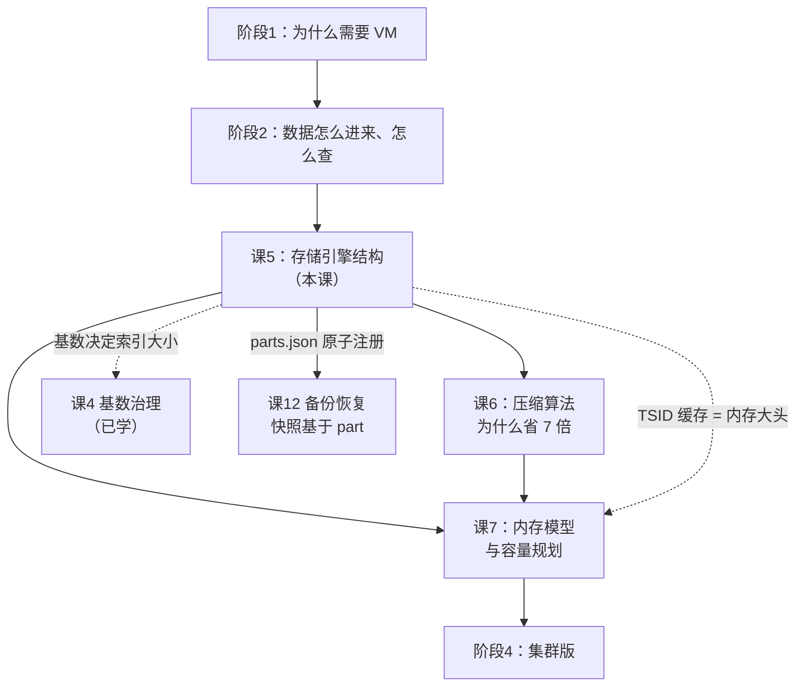
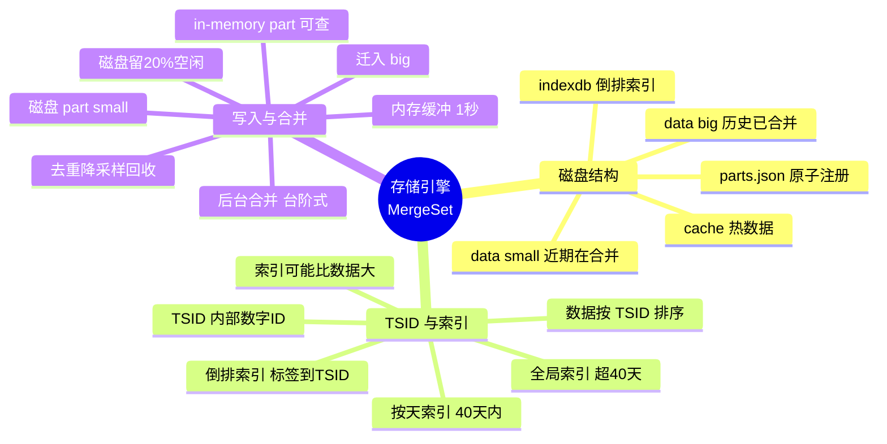

# 课 5：存储引擎 —— MergeSet 与磁盘结构

> 阶段 3 · 凭什么快、凭什么省 ｜ 故事章节：拆开引擎盖
> 返回：[阶段概览](README.md) ｜ [课程目录](../../02-课程目录.md)
> 上一课：[课 4 写入协议全家桶与基数治理](../2-数据怎么进来怎么查/4-写入协议全家桶与基数治理.md)

> ⚠️ **本课所有命令与输出均在本机实测通过（WSL Ubuntu + Docker，VM v1.151.0，2026-09-02）。**
> 数据目录：`playground/data/`；实验脚本：`playground/l05-*.sh`。
> 本课的特色是**直接打开磁盘目录看真实结构**——不是画图讲概念，是 `ls` 给你看。

---

## 第一幕：场景引入

接上节课末尾。你的 remote write 配好了，老链路接进来了，
基数也治理了。跑了一个月，老板来问：

> 「这套东西一年要花多少存储？」

你打开监控一看，当前数据量 800 GB，日增 30 GB。
按这个速度，一年就是 **11 TB**。

你决定做个对比实验：把同样的数据分别写进 Prometheus 和 VictoriaMetrics，
跑一周看磁盘占用。结果：

| 存储 | 一周后磁盘占用 |
|------|---------------|
| Prometheus | 42 GB |
| VictoriaMetrics | **6.1 GB** |

**差了近 7 倍。**

你去翻文档，看到官方说「比 Prometheus 少 7 倍存储空间」。
数字对上了，但你不满足——**7 倍是怎么来的？**

这个问题会把你引向三个更深的疑问：

1. 数据落盘后**长什么样**？（目录结构）
2. 一条时间序列在里面**怎么被找到**？（TSID + 倒排索引）
3. 为什么刚写进去是**一堆小文件**，过一会儿就**变成大文件**了？（后台合并）

这一课就拆开引擎盖，把这三件事一次讲清楚。

---

## 第二幕：认知冲突

大多数人对时序数据库存储的理解，来自两个直觉：

**直觉一：「数据存下来就是一堆文件，查的时候扫一遍」**

如果你熟悉 Prometheus，你会想到它的存储：
每 2 小时一个 block 目录，里面有 `chunks/`（数据）和 `index`（索引），
每个 block 是一个**自包含的、不可变的小数据库**。

顺着这个思路，你会以为 VictoriaMetrics 也差不多——
只是 block 更大一点、压缩更好一点。

**这个直觉是错的。** VM 的存储结构和 Prometheus 有本质区别。

**直觉二：「压缩率高 = 用了更强的压缩算法」**

这是最隐蔽的一个误解。你会以为 VM 换了个更厉害的压缩算法
（比如从 Gorilla 换成 ZSTD），所以省了 7 倍。

**压缩算法只是次要因素。** 真正的大头在别的地方——
本课会让你看到，**索引（indexdb）反而可能比数据（data）还占地方**。

> **核心冲突**：
> **「存得下」和「查得快」通常是矛盾的**——
> 压缩率越高，解压越慢；索引越细，写入越慢。
> VM 的做法不是在这两者间取折中，而是**换了一套数据组织方式**，
> 让这两个目标同时变好。

先别急着接受这个结论。我们直接打开磁盘看。

---

## 第三幕：层层揭示

### 知识点 1：整体架构分层 —— 打开磁盘看真相

**一句话定义**：VM 单节点的存储由**三块**组成——
`data/`（原始样本，按 TSID 排序）、`indexdb/`（倒排索引，标签 → TSID）、
`cache/`（内存缓存落盘的持久化部分）；
其中 `data/` 又分 `small/`（近期、合并中）和 `big/`（历史、已充分合并）两级。

#### 直觉建立

把 VM 的存储想成**一个图书馆**：

- **`data/`** = 书库本体，书按**索书号（TSID）**排列
  你在目录里查到索书号，然后按号去书架上取书
- **`indexdb/`** = 目录卡片柜
  你知道书名（标签），查卡片得到索书号
- **`cache/`** = 前台的「热门书架」
  最近常被借的书不放回书库，直接摆前台

> ⚠️ **类比失效的边界**：图书馆的索书号是给人看的、有意义的
> （如 `TP312/JA` 表示计算机类）。
> VM 的 TSID 是**内部生成的数字**，对外完全不可见——
> 你永远查不到「TSID=12345 的序列是什么」，只能反过来查。

#### 核心原理

**第一层：数据目录的顶层结构（本机实测）**

```bash
ls -la /path/to/victoria-metrics-data/
```

> 📌 **路径视角先说清楚**（本机挂载关系决定了两种写法）：
> 容器启动参数把宿主机 `playground/data` 挂到了容器内的 `/victoria-metrics-data`，
> 而 VM 又会在 `-storageDataPath` 下面**再建一层 `data/`**。
> 所以同一个 part 目录有两种写法：
>
> | 视角 | 起点 | part 目录写法 |
> |------|------|----------------|
> | **容器内** | `-storageDataPath=/victoria-metrics-data` | `/victoria-metrics-data/data/small/2026_09/xxx/` |
> | **宿主机**（本课命令采用） | `playground/` | `data/data/small/2026_09/xxx/` |
>
> 下面**目录树用容器内视角**（`data/` 起头，与官方文档一致），
> **可执行命令用宿主机视角**（`data/data/` 起头，能直接复制运行）。
> 你如果直接 `docker exec` 进容器看，把命令里的 `data/data/` 换成
> `/victoria-metrics-data/data/` 即可。

实测输出：

```text
drwxrwxrwx  data/          ← 原始数据（small + big + indexdb）
-rwxrwxrwx  flock.lock     ← 进程锁，防止多实例共写同一目录
drwxrwxrwx  metadata/      ← 指标元数据（TYPE/HELP/UNIT）
drwxrwxrwx  snapshots/     ← 快照（vmbackup 用）
drwxrwxrwx  tmp/           ← 合并过程中的临时目录
-rwxrwxrwx  .vm_app_running
```

各目录实测占用：

| 目录 | 实测大小 | 用途 |
|------|----------|------|
| `data/` | 2.2M | 数据 + 索引 |
| `metadata/` | 0 | 元数据（本课实验未启用） |
| `tmp/` | 0 | 合并临时区 |
| `snapshots/` | 0 | 快照 |
| `flock.lock` | 0 | 进程锁文件 |

**第二层：`data/` 内部（关键）**

```text
data/
├── small/              ← 近期数据，合并进行中
│   └── 2026_09/        ← 按月分区
│       ├── parts.json          ← 本分区的 part 清单
│       ├── 18D1643965DC0269/   ← 一个 part 目录
│       └── snapshots/
├── big/                ← 历史数据，已充分合并
│   └── 2026_09/
│       ├── parts.json
│       └── snapshots/
└── indexdb/            ← 倒排索引
    └── 2026_09/        ← 同样按月分区
        ├── parts.json
        └── 18D1643965D68394/   ← 一个索引 part
```

> 📌 **一个易错点**：`indexdb/` 在 `data/` **下面**，不是与 `data/` 平级。
> 我第一次找的时候按「顶层应该有 indexdb」去找，扑了个空。
> 正确路径是 `data/indexdb/`，不是 `indexdb/`。
>
> 换算到本课的命令上就是 **`data/data/indexdb/`**（宿主机视角）：
> 第一个 `data/` 是宿主机的挂载目录 `playground/data`，
> 第二个 `data/` 才是 VM 在 `-storageDataPath` 下建的那层。

**第三层：`parts.json` —— part 的原子注册机制**

```bash
# 宿主机视角（在 playground/ 目录下执行）
cat data/data/small/2026_09/parts.json | python3 -m json.tool

# 若进容器看，则是：
# docker exec vm-learn cat /victoria-metrics-data/data/small/2026_09/parts.json
```

实测输出（节选）：

```json
{
    "Small": [
        "18D1643965DC0269",
        "18D1643965DC026A",
        "18D1643965DC026B",
        "18D17091CFBC36D4"
    ],
    "Big": []
}
```

**这个文件的设计非常关键**，官方文档原话：

> The newly added part is **atomically registered** in the `parts.json` file
> under the corresponding partition after it is fully written and **fsynced** to the storage.
> Thanks to this algorithm, storage **never contains partially created parts**,
> even if hardware power off occurs in the middle of writing the part to disk.

也就是说：**先写完整个 part 目录 → fsync 落盘 → 最后才在 parts.json 里登记**。
写入过程中断电，那个 part 目录没登记，下次启动直接删掉。

这就是为什么 VM **不需要 WAL**（Write-Ahead Log）——
它用「原子注册」替代了 WAL 的崩溃恢复能力。

> ⚠️ **代价要讲清楚**：不用 WAL 意味着**未 flush 的内存数据会丢**。
> 官方文档明确：最后几秒的写入在**非正常关闭**（OOM / kill -9 / 硬件重置）时会丢失。
> 这是 VM 用「少量数据可丢」换「写入性能」的**显式权衡**。

**第四层：单个 part 目录内部（实测）**

```bash
ls -la data/data/small/2026_09/18D1643965DC0269/
```

> 命令里的 `data/data/` 是宿主机视角（见上文「路径视角先说清楚」）；
> 目录树里的 `data/` 是容器内视角。两者指同一个东西。

实测输出：

```text
index.bin       679 B    ← 块级索引：定位 block
metadata.json   112 B    ← part 元数据
metaindex.bin    65 B    ← 顶层目录：定位 index.bin 的区段
timestamps.bin    3 B    ← 压缩后的时间戳
values.bin        1 B    ← 压缩后的值
```

`metadata.json` 实测：

```json
{
    "RowsCount": 25,
    "BlocksCount": 18,
    "MinTimestamp": 1788320789000,
    "MaxTimestamp": 1788322671271,
    "MinDedupInterval": 0
}
```

**关键设计点**：

| 字段 | 含义 | 为什么重要 |
|------|------|-----------|
| `RowsCount` | 样本数（行） | 25 行 |
| `BlocksCount` | 块数 | **18 个块，却只有 25 行** |
| `MinTimestamp` / `MaxTimestamp` | 时间范围（**毫秒**） | 查询时先比对范围，不匹配直接跳过整个 part |
| `MinDedupInterval` | 该 part 应用去重间隔 | 后台合并时做去重 |

> 📌 **`MinTimestamp` 是毫秒**。写入用秒，落盘是毫秒。
> 这与课 3 讲过的「export 返回毫秒」是同一件事的两个面。

**为什么 25 行却有 18 个块？**

官方文档：每个 block **最多容纳 8000 个样本**，
且**一个 block 只属于一条时间序列**。

所以：18 个块 = 18 条不同的时间序列，
总共 25 个样本 —— 平均每条序列只有 1.4 个样本。

这解释了小 part 为什么「碎」：
**刚写入的数据天然是稀疏的**，每条序列只有一两个点。
只有经过合并，同一序列的样本才会聚到一起，块数才会降下来。

**第五层：`small/` 与 `big/` 的分工**

| 维度 | `small/` | `big/` |
|------|----------|--------|
| 数据来源 | 内存 flush 下来的新 part | small part 合并后的产物 |
| 合并状态 | 持续合并中 | 已充分合并 |
| 压缩率 | 较低 | 极高 |
| 查询频率 | 高（近期数据） | 低（历史数据） |
| 实测 part 数 | 16-25 个波动 | **0 个**（本课数据量未达阈值） |

> 📌 **`big/` 为空是正常现象**，不是异常。
> 只有当 small part 增长到一定规模、合并到足够大时才会迁移到 `big/`。
> 本课实验数据量只有几 MB，还没触发迁移。

#### 示例演示：自己动手看

```bash
cd /mnt/d/projects/learning/victoriametrics/playground

# 1. 看顶层结构
bash l05-disk-structure.sh

# 2. 深入 part 内部 + indexdb
bash l05-part-internals.sh
```

第二段脚本会输出一份**所有 part 的元数据汇总表**（本课实测节选）：

```text
PART                 ROWS       BLOCKS   MIN_TS         MAX_TS
----------------------------------------------------------------------
18D1643965DC0269     25         18       1788320789000  1788322671271
18D1643965DC026C     1028       10       1788328665000  1788332265000
18D17091CFBC36DD     397144     3431     1788334434345  1788335139345
18D17091CFBC36DE     1903       1903     1788335139345  1788335144129
```

**注意最后一行**：1903 行 / 1903 块 —— **每行一个块**，
这是刚 flush 下来的、完全未经合并的原始数据。
而 `18D17091CFBC36DD` 是 397144 行 / 3431 块 ——
**平均每块 116 行**，已经合并过了。

两个数一对比，合并的效果一目了然。

#### 常见误区

**误区 A：「indexdb 在顶层目录」**

不在。正确路径是 `data/indexdb/`，在 `data/` 下面。

**误区 B：「VM 有 WAL，所以断电不丢数据」**

**没有 WAL**。VM 用「part 原子注册」保证**已落盘数据的一致性**，
但**未 flush 的内存数据（最后几秒）会丢**。这是显式权衡，不是 bug。

**误区 C：「big 目录为空说明有问题」**

不是。数据量小或运行时间短时，`big/` 就是空的，正常。

**误区 D：「part 目录名是随机字符串」**

不是。它是**十六进制的纳秒时间戳**（递增），
所以按目录名排序 = 按创建时间排序。

#### 一句话记住

> 存储三层：**`data/`（按 TSID 排的样本）+ `indexdb/`（标签→TSID 的倒排索引）+ `cache/`（热数据缓存）**。
> `data/` 再分 `small/`（近期，在合并）和 `big/`（历史，已合并）。
> **part 靠 `parts.json` 原子注册，所以不需要 WAL，代价是可能丢最后几秒。**

---

### 知识点 2：indexDB 与 TSID —— 一条序列是怎么被找到的

**一句话定义**：TSID（Time Series ID）是 VM 给每条时间序列分配的**内部唯一数字 ID**，
样本按 TSID 排序存储；`indexDB` 是**倒排索引**，把「指标名 / 标签名 / 标签值」
映射回 TSID 集合，使得按标签查询时能快速定位——两者构成「先查索引得 TSID，再按 TSID 取数据」的两段式查找。

#### 直觉建立

继续用图书馆类比，但这次看**完整借书流程**：

1. 你想借《三体》→ 去**卡片柜（indexdb）**查
2. 卡片上写着索书号 `TSID=8842`
3. 你拿着 `8842` 去**书库（data）**，书按索书号排好，直接定位

**关键洞察**：书库里的书**不按书名排**，而是按索书号排。
这样相同序列的数据点天然聚在一起 —— 这正是压缩率高的根本原因之一。

> ⚠️ **类比失效的边界**：图书馆里一本书只有一个索书号，
> 但 VM 里**同一条序列在不同时间可能对应不同的索引条目**——
> 因为索引分「全局」和「按天」两种，下面会讲。

#### 核心原理

**TSID 是什么**

VM 收到一个样本 `http_requests_total{method="GET",status="200"}` 时：

```text
MetricName（指标名 + 所有标签）  --哈希-->  TSID（一个内部数字 ID）
```

- TSID **对外不可见**，你永远看不到也查不到它
- 数据部分存的是：`TSID + timestamp + value`
- 索引部分存的是：`标签 → TSID 集合`

官方文档原话：

> VictoriaMetrics identifies time series by TSID and stores raw samples sorted by TSID.
> Thus, the TSID is a primary index.
> However, **the TSID is never exposed to the clients**, i.e. it is for internal use only.

**indexDB 的两种索引**

| 索引类型 | 覆盖范围 | 何时使用 |
|----------|----------|----------|
| **全局索引**（global） | 整个 retention 期 | 查询时间范围 **> 40 天** |
| **按天索引**（per-day） | 单天 | 查询时间范围 **≤ 40 天** |

官方规则（实测版本文档）：

> Per-day index is used if the search time range is **40 days or less**.
> Global index is used for search queries with a time range **greater than 40 days**.

为什么分两种？**按天索引更快**——
它把「某天活跃的序列」单独建索引，
查最近一天的数据时不用扫整个 retention 期的索引。

代价是**索引条目变多**：一条序列如果在 30 天里都活跃，
按天索引就会有 30 份条目，而全局索引只有 1 份。

**写入路径：TSID 缓存是性能命门**

官方文档描述的写入流程：

```text
样本到达
   ↓
查 TSID 缓存（storage/tsid）  ← 命中 = 快路径
   ↓ 未命中
查 indexDB（磁盘）            ← 慢路径，需要读盘
   ↓ 还没有
生成新 TSID + 在 indexDB 中创建索引条目
```

> 📌 **TSID 缓存的大小是自动算的**，默认约占可用内存的 **37%**
> （`-memory.allowed*` 的限制内）。

**关键监控指标**（本课实测）：

| 指标 | 含义 | 健康标准 |
|------|------|----------|
| `vm_slow_row_inserts_total` | 走慢路径的行数 | 官方：5 分钟内的增长率 **< 5%** |
| `vm_new_timeseries_created_total` | 新创建的序列数 | 用于算 **churn rate** |
| `vm_cache_entries{type="storage/hour_metric_ids"}` | 活跃序列数 | 容量规划用 |

**indexDB 的条目数量：一条序列产生多少索引条目？**

官方博客给出的例子：`http_request_total{method="GET",status="200"}`

```text
基础映射（3 条）：
  1. 指标名 http_request_total
  2. method
  3. status

每种映射都要写【全局索引 + 按天索引】两份 → 3 × 2 = 6 条

还有【组合索引】（composite index）：
  指标名 + 标签名 的组合，用于加速 {__name__="x", label="y"} 这类查询
  → 再 +2 条基础 × 2 份 = 4 条

总计：6 + 4 = 10 条
```

**实测验证**（本课数据）：

写入 200 条全新序列：`vm_indexdb_items_added_total` 增量 = **2000**
→ 2000 / 200 = **每条序列 10 个索引条目**，与官方博客完全吻合。

#### 示例演示：完整的查找链路

**第 1 步：查一条序列走的是哪条路**

```bash
# 查活跃序列数（走 hour_metric_ids 缓存）
curl -s -G 'http://localhost:8428/api/v1/query' \
  --data-urlencode 'query=vm_cache_entries{type="storage/hour_metric_ids"}' \
  --data-urlencode 'nocache=1'
```

实测：**9927** 条活跃序列。

**第 2 步：看 indexDB 的磁盘结构**

```bash
ls -la data/data/indexdb/2026_09/18D1643965D68394/
```

> 再次确认这个路径：宿主机 `playground/` 下是 `data/data/indexdb/`，
> 容器内对应 `/victoria-metrics-data/data/indexdb/`。

实测输出：

```text
index.bin        3467 B    ← 块头索引
items.bin      243615 B    ← 索引条目内容（最大）
lens.bin        23859 B    ← 每条目的长度
metadata.json     438 B
metaindex.bin      41 B
```

`metadata.json` 实测：

```json
{
    "ItemsCount": 17333,
    "BlocksCount": 27,
    "FirstItem": "0101666c61670118d16439612eee4a",
    "LastItem": "0700000000000050da766d73656c6563745f726571756573745f..."
}
```

**对比 data part 与 indexdb part 的文件组成**：

| 文件 | data part | indexdb part | 作用 |
|------|-----------|--------------|------|
| `timestamps.bin` | ✅ | ❌ | 压缩后的时间戳 |
| `values.bin` | ✅ | ❌ | 压缩后的值 |
| `items.bin` | ❌ | ✅ | **索引条目内容** |
| `lens.bin` | ❌ | ✅ | **每条目的长度**（配合 items.bin 定位） |
| `index.bin` | ✅ | ✅ | 块级索引 |
| `metaindex.bin` | ✅ | ✅ | 顶层目录 |
| `metadata.json` | ✅ | ✅ | 元数据 |

> 📌 **`items.bin` + `lens.bin` 是 indexdb 特有的**。
> `items.bin` 存内容，`lens.bin` 存每条的长度——
> 两者配合才能在不解压整个文件的情况下定位到某一条。

**第 3 步：全局文件类型统计（本课实测）**

```text
timestamps.bin   14 个    141641 字节
values.bin       14 个    284675 字节
index.bin        28 个    476752 字节
metaindex.bin    28 个      2946 字节
items.bin        14 个    806146 字节   ← 索引内容
lens.bin         14 个     72114 字节
```

> 📌 **这份统计是「某一时刻的快照」，会随合并持续变化**。
> 本课结束前复跑同一条命令，数字已经变了（part 从 14 个合并到 8 个，
> `items.bin` 从 806 KB 涨到 1.2 MB）。**不要指望复跑得到一样的数**，
> 要看的是**结构关系**——谁和谁是一组、哪个文件最大，这个关系稳定。

**看这个数据要警醒**：`items.bin`（806 KB）**比 `values.bin`（285 KB）还大**！

索引**比数据本身还占地方**。这直接推翻了第二幕提到的
「直觉二：压缩率高 = 压缩算法强」——
**如果你的序列基数高、churn 高，索引会吃掉大量空间，
压缩算法再好也救不回来。**

#### ⚠️ 本课实测踩的坑：三个 counter 都不「即时」

这一节我做了大量对照实验，因为测出来的数字**和预期对不上**。
把过程写出来，因为它本身就是很好的排障教学。

**现象**：写入 200 条全新序列，
`vm_new_timeseries_created_total` 只涨了 **4**（预期 200）。

**排查过程**：

我设计了三组对照实验（脚本 `l05-debug-tsid3.sh`）：

| 场景 | new_timeseries 增量 | items_added 增量 |
|------|--------------------|--------------------|
| A：全新指标名（1 条） | **0** | 0 |
| B：已有指标名 + 20 个新标签值 | **0** | 10 |
| C：重复写入场景 B 的 20 条 | **22** | 240 |

**结果完全反直觉**：全新序列写入时 counter 不动，
**重复写入时 counter 反而涨了 22**。

**根因**（两个因素叠加）：

1. **self-scrape 在持续制造噪声**
   我做了「静默实验」：30 秒不写入任何数据，只让 self-scrape 跑：

   ```text
   静默前: new_timeseries=6548  slow_inserts=9925
   静默后: new_timeseries=6550  slow_inserts=9927
   ★ 静默期增量: new_timeseries=2  slow_inserts=2
   ```

   **什么都没写，counter 自己涨了 2。**
   VM 每 10 秒抓取自己的 `/metrics`，其中
   `vm_http_request_duration_seconds_bucket` 这类直方图指标
   会持续产生新的 `vmrange` 组合 → 持续产生新序列。

2. **counter 增长滞后于写入，且三个 counter 不同步**
   我用 `items_added` 做了时间序列采样：

   ```text
   [t=0]   写入后未 flush: 增量 0
   [t=0]   force_flush 后: 增量 0
   [t=8s]  等待 8 秒后:    增量 10
   [t=16s] 等待 16 秒后:   增量 540
   ```

   `items_added` 只在 **indexDB 的 in-memory part 落盘时**才计数，
   而落盘是**异步**的。`force_flush` 只保证 data 部分落盘，
   indexDB 有自己的节奏。

**结论与正确用法**：

> ⚠️ **这三个 counter 都不能用来做「写入 N 条序列会涨 N」的即时推断。**
>
> 它们是**聚合观测指标**，正确用法是官方推荐的 `increase()` + 时间窗口：
>
> ```promql
> # churn rate（官方推荐）
> sum(increase(vm_new_timeseries_created_total[1h]))
>
> # 慢插入率（官方健康标准：< 5%）
> increase(vm_slow_row_inserts_total[5m])
> ```
>
> 实测 5 分钟窗口：churn = **696**，slow inserts = **772**。
>
> **想验证「数据到底写没写进去」，用课 4 讲的
> `sum(vm_rows_inserted_total) by (type)`，别用这三个 counter。**

> 📌 **方法论教训**：我一开始把「counter 没涨」解读为「机制没生效」，
> 差点得出错误结论。**遇到 counter 与预期不符时，先做「静默基线实验」**——
> 什么都不做，看它自己涨不涨。这一步能立刻区分
> 「机制问题」和「背景噪声」。

#### 常见误区

**误区 A：「TSID 是暴露给用户的 ID」**

不是。TSID 纯内部使用，对外不可见，也不保证跨版本稳定。

**误区 B：「索引比数据小」**

**不一定。** 本课实测 `items.bin`（806 KB）> `values.bin`（285 KB）。
高基数 / 高 churn 场景下，**索引会成为主要的存储开销**。

**误区 C：「force_flush 之后所有指标就都更新了」**

不是。`force_flush` 保证 data 部分落盘，
indexDB 的 in-memory → disk 是**另一条异步链路**。
实测：flush 后立即查 `items_added` 增量是 0，等 16 秒后才涨到 540。

**误区 D：「查最近 1 小时和查最近 1 年走同一个索引」**

不是。**≤ 40 天**走 per-day 索引，**> 40 天**走 global 索引。

**误区 E：「new_timeseries_created_total 涨得少 = 没有新序列」**

不对。它受 self-scrape 噪声污染、且滞后。用它算 churn rate，
别用它做即时断言。

#### 一句话记住

> **TSID = 序列的内部数字 ID，数据按它排序存储；indexDB = 标签→TSID 的倒排索引。**
> 查找是两段式：**先查 indexdb 得 TSID 集合，再按 TSID 去 data 取样本**。
> 索引分**全局**和**按天**两种，40 天是分界线。
> ⚠️ **索引可能比数据还占地方**——高基数下这是主要成本。

---

### 知识点 3：写入路径与后台合并 —— 小文件是怎么变成大文件的

**一句话定义**：样本先缓冲在内存（≤1 秒）→ 刷成 **in-memory part**（可查）
→ 异步落盘为 `small/` 下的磁盘 part → 后台**持续合并**成更大的 part
→ 足够大后迁入 `big/`；合并同时承担**去重、降采样、释放已删序列空间**等维护任务。

#### 直觉建立

把合并想成**整理桌面**：

你工作时（写入）会随手把文件摊在桌上——
**快，但乱**。文件越摊越多，找东西越来越慢。

每隔一段时间你整理一次（合并）：
把相关的文件**归类、装订、压缩**放进文件夹。
桌面清爽了，找东西快了，占的地方也小了。

**关键**：整理的时候你**不用停下手头的工作**——
这就是「后台合并」。

> ⚠️ **类比失效的边界**：整理桌面时你可能会临时把文件堆在椅子上
> （占用额外空间）。VM 的合并同理——**合并需要额外的空闲磁盘空间**。
> 官方文档明确：**磁盘剩余空间不足 20% 时合并会受阻**。

#### 核心原理

**完整写入路径（四步）**

```text
① 内存缓冲（≤ 1 秒）
   ↓ -inmemoryDataFlushInterval（默认 1s）
② in-memory part（可被查询到）
   ↓ 异步持久化
③ 磁盘 part（data/small/YYYY_MM/ 下）
   ↓ 后台合并
④ 大 part → 最终迁入 data/big/
```

官方文档原话：

> VictoriaMetrics buffers the ingested data in memory **for up to a second**.
> Then the buffered data is written to **in-memory parts**, which **can be searched during queries**.
> The in-memory parts are periodically persisted to disk...

**注意第 ② 步**：in-memory part **已经可以被查询**。
这解释了课 2 留下的一个问题——为什么刚写入的数据有时能立刻查到。

**后台合并的三个收益**（官方列举）：

1. **控制文件数量** —— 避免超过系统的「打开文件数」限制
2. **提升压缩率** —— 大 part 通常比小 part 压缩得更好
3. **提升查询速度** —— 查询涉及的 part 越少越快

除此之外，合并还承担**维护任务**：
去重（deduplication）、降采样（downsampling）、
释放已删序列占用的磁盘空间。

**合并的原子性**（与知识点 1 的 parts.json 呼应）：

> The same applies to merge process — parts are either **fully merged** into a new part
> or **fail to merge**, leaving the source parts **untouched**.

**合并失败不会损坏源 part**。这意味着合并过程中断电是安全的。

**磁盘空间的硬约束**：

> VictoriaMetrics **does not merge parts if their combined size exceeds
> the available free disk space**. [...] It is recommended to keep at least
> **20% of disk space free**.

空间不足时 part 会**越堆越多**，查询越来越慢——
这是生产中一个很常见的「慢性病」。

#### 示例演示：亲眼看到合并发生

**实验一：观察后台自动合并**（脚本 `l05-merge-observe.sh`）

分批写入 12 批数据（每批后 force_flush），然后每 5 秒采样 part 数：

```text
t=5  s  small=23
t=10 s  small=24
t=15 s  small=25   ← 堆积到峰值
t=20 s  small=13   ← ★ 一次合并吃掉 12 个 part
t=25 s  small=14
t=30 s  small=15
...
```

**`t=15s` 的 25 → `t=20s` 的 13，一次合并合并掉 12 个 part。**
这就是后台合并的真实样子——不是平滑渐变，而是**台阶式骤降**。

**实验二：强制合并**（脚本 `l05-force-merge.sh`）

先写入 5 万条样本，然后调用强制合并端点：

```bash
curl -X POST 'http://localhost:8428/internal/force_merge?partition_prefix=2026_09'
```

实测输出：

```text
force_merge http=200

t=5  s  small=17   big=0
t=10 s  small=1    big=0   ← ★ 17 个 part 合并成 1 个
t=15 s  small=2    big=0
...
```

**17 → 1**，全部并成了一个 part。

合并后验证数据完整性：

```text
l05_bigload 序列数: 200   ← 数据没丢，正确
```

**合并统计指标**：

```text
vm_merges_total{type="storage/big"}    = 472
vm_merges_total{type="storage/small"}  = 27
vm_merges_total{type="indexdb"}        = 86
```

> 📌 **`big` 类型的合并次数（472）远多于 `small`（27）**，
> 说明大部分合并工作发生在 `small → big` 的迁移链路上。

**part 的合并效果对比**（实测数据）：

| part | RowsCount | BlocksCount | 每块平均行数 | 说明 |
|------|-----------|-------------|--------------|------|
| `18D17091CFBC36DE` | 1903 | 1903 | **1.0** | 刚 flush，完全未合并 |
| `18D17091CFBC36DD` | 397144 | 3431 | **115.7** | 已合并 |

**每块平均行数从 1.0 提升到 115.7** —— 这就是压缩率和查询速度提升的直接来源。

**实验三：相关的启动参数**

```bash
# 内存数据刷盘间隔（默认 1 秒）
-inmemoryDataFlushInterval=1s

# 强制合并（运维操作，非启动参数）
POST /internal/force_merge?partition_prefix=2026_09
```

> ⚠️ `/internal/force_merge` 是**内部端点**，
> 生产环境应通过 `-forceMergeAuthKey` 加鉴权保护。

#### 常见误区

**误区 A：「合并是实时的，写入后立刻就合并」**

不是。合并是**周期性后台任务**，有台阶式特征。
实测显示要等十几秒才触发一次。

**误区 B：「合并会修改原 part」**

不会。合并是**生成新 part + 原子替换**，
失败时源 part 原封不动。这也是为什么合并需要**额外的磁盘空间**。

**误区 C：「磁盘快满了没关系，反正有压缩」**

**很危险。** 官方文档明确：**剩余空间不足时合并会停止**，
part 越堆越多 → 查询越来越慢 → 恶性循环。
**保持至少 20% 空闲空间。**

**误区 D：「force_merge 是常规操作」**

不是。它是**调试/运维工具**，正常情况让后台自动合并跑就行。
频繁手动 force_merge 会造成不必要的磁盘 IO 压力。

**误区 E：「合并只影响存储大小」**

不止。合并还承担**去重、降采样、释放已删序列空间**——
`delete_series` 删除的数据，空间是在**合并时**才真正释放的。

#### 一句话记住

> 写入四步：**内存缓冲(≤1s) → in-memory part(可查) → 磁盘 part(small/) → 后台合并 → big/**。
> 合并是**台阶式**的（实测 25→13、17→1），原子安全，
> 收益是**文件数↓ / 压缩率↑ / 查询快↑**，还顺带做**去重与空间回收**。
> ⚠️ 硬约束：**磁盘要留 20% 空闲**，否则合并停摆。

---

## 第四幕：实操验证

### 完整流程

```bash
cd /mnt/d/projects/learning/victoriametrics/playground

# 1. 打开磁盘看结构
bash l05-disk-structure.sh

# 2. 深入 part 内部 + indexdb 文件组成
bash l05-part-internals.sh

# 3. 观察后台合并（part 数台阶式下降）
bash l05-merge-observe.sh

# 4. 强制合并，看 small → 1 个 part
bash l05-force-merge.sh

# 5. TSID / indexDB 指标（含我踩的坑）
bash l05-tsid-indexdb.sh
bash l05-debug-tsid3.sh   # 对照实验
bash l05-debug-tsid4.sh   # 静默基线实验（关键）
```

### 实测结论汇总

| 验证项 | 实测结果 | 与预期是否一致 |
|--------|----------|----------------|
| 顶层目录结构 | data / metadata / tmp / snapshots / flock.lock ✅ | 一致 |
| **`indexdb/` 位置** | 在 `data/` **下面**，非顶层 | **纠正了初始错误认知** |
| `parts.json` 含 Small/Big 两数组 | ✅ Big 为空（数据量小） | 一致 |
| part 内部 5 个文件 | index/metaindex/metadata/timestamps/values ✅ | 一致 |
| indexdb part 文件组成 | items/lens/index/metaindex/metadata ✅ | 一致（与 data part 不同） |
| **索引 vs 数据大小** | items.bin **806KB >** values.bin 285KB | **与直觉相反，重要发现** |
| 后台合并 | 25 → 13（一次吃 12 个）✅ | 一致，台阶式 |
| 强制合并 | 17 → **1** ✅ | 一致 |
| 合并后数据完整性 | 200 条序列，未丢失 ✅ | 一致 |
| 每块平均行数提升 | 1.0 → **115.7** ✅ | 一致，压缩率来源 |
| 一条序列的索引条目数 | 2000/200 = **10 条** ✅ | 与官方博客吻合 |
| **new_timeseries 即时性** | 静默 30s 自涨 2；重复写入反涨 22 | **与预期不符，已排查** |
| **items_added 滞后性** | flush 后 0 → 8s 后 10 → 16s 后 540 | **与预期不符，已排查** |

> ✅ **回扣场景**：回到第一幕的「7 倍存储差距」，现在能说清它来自哪几处：
>
> 1. **列式布局** —— 时间戳和值分开存（`timestamps.bin` / `values.bin`），
>    各自用最适合的算法（下一课详讲）
> 2. **按 TSID 排序** —— 同一序列的数据点物理相邻，
>    本课实测每块平均 115.7 行（未合并时只有 1.0）
> 3. **后台合并持续压榨** —— 每块行数越多，压缩率越高
>
> 但**同样重要的是反面**：索引（`items.bin`）可能比数据还大。
> **基数控制（课 4）才是省存储的真正杠杆**，压缩算法只是锦上添花。

---

## 第五幕：体系收束

### 本课在全局的位置



### 你现在会了什么

- 能**直接打开磁盘目录**看懂 VM 的存储结构，知道 `small/`、`big/`、`indexdb/` 各自装什么
- 理解 **TSID + 倒排索引**的两段式查找，知道为什么索引可能比数据还大
- 知道**合并是台阶式的**、原子安全的，以及它顺带做去重与空间回收
- 掌握三个关键运维数字：**磁盘留 20% 空闲**、**slow inserts < 5%**、
  **`increase(vm_new_timeseries_created_total[1h])` 看 churn**
- 知道 `force_flush` 之后**指标不一定同步更新**（indexDB 是另一条异步链路）

### 关键伏笔

- **为什么列式布局能省 7 倍？具体用什么压缩算法？** → 课 6
- **TSID 缓存占 37% 内存，还有哪些内存开销？怎么算容量？** → 课 7
- **`parts.json` 的原子注册，是不是就是快照备份的基础？** → 课 12

> 📍 **全局定位**：课 5 回答了「数据落盘后长什么样、怎么被找到、怎么被整理」。
> 但**「为什么这么省」只讲了一半**——
> 我们看到了「每块 115.7 行」这个结果，还没解释
> **这 115.7 行是怎么被压到那么小的**。
> 🔗 **下一步**：课 6 讲压缩。你会看到 `timestamps.bin` 只有 141 KB
> 而 `values.bin` 有 284 KB 背后的算法原理，以及降采样怎么用。

---

## 🐞 常见误区

1. **「indexdb 在顶层目录」** — 在 `data/` 下面，路径是 `data/indexdb/`。
2. **「VM 有 WAL，断电不丢数据」** — 没有 WAL，靠 part 原子注册保证一致性，未 flush 的内存数据会丢。
3. **「big 目录为空说明有问题」** — 数据量小或运行时间短时正常为空。
4. **「索引比数据小」** — 实测 `items.bin` 806KB > `values.bin` 285KB，高基数下索引是主要成本。
5. **「TSID 可以被用户查询」** — 纯内部 ID，对外不可见。
6. **「force_flush 后指标立即更新」** — indexDB 落盘是另一条异步链路，实测滞后 16 秒以上。
7. **「new_timeseries 涨 N = 写入了 N 条新序列」** — 受 self-scrape 噪声污染（静默 30s 自涨 2）且滞后，只能用于算 churn rate。
8. **「合并会修改原 part」** — 生成新 part + 原子替换，失败时源 part 不动。
9. **「磁盘满了有压缩顶着」** — 剩余空间不足 20% 时合并停摆，part 越堆越多。
10. **「force_merge 是常规操作」** — 是调试/运维工具，正常让后台自动合并跑即可。
11. **「合并只影响存储大小」** — 还承担去重、降采样、释放已删序列空间。
12. **「查 1 小时和查 1 年走同一索引」** — ≤40 天走 per-day，>40 天走 global。

---

## 一图总结



---

## 课后小测

**Q1**：你发现 VM 数据目录下 `data/indexdb/2026_09/` 占用 8 GB，
而 `data/small/2026_09/` 只有 3 GB。索引比数据还大。最可能的原因是？

- A. 压缩算法配错了
- B. 存在高基数或高 churn 的标签，导致索引条目爆炸
- C. `big/` 目录迁移失败，数据都堆在 small
- D. retention 设置过长

<details><summary>答案与解析</summary>

**答案：B**。

这是本课实测发现的反直觉现象——本机 `items.bin`（806 KB）就比
`values.bin`（285 KB）大。官方文档与博客都指出：
一条带 N 个标签的序列会产生约 **10 个 indexDB 条目**
（指标名 + 每个标签名 + 组合索引，各写全局 + 按天两份）。

本课实测验证：写入 200 条序列 → `vm_indexdb_items_added_total` 增量 2000，
即**每条序列 10 个条目**，与官方吻合。

所以当基数高（标签唯一值多）或 churn 高（序列频繁新建）时，
索引会成为主要的存储开销，**压缩算法再好也救不回来**。

根治办法回到课 4 的基数治理：**relabel 丢弃 / 流式聚合**。

</details>

**Q2**：你执行了 `force_flush`，然后立刻查询
`vm_indexdb_items_added_total`，发现增量为 0。
但等了 16 秒后再查，增量变成了 540。最合理的解释是？

- A. `force_flush` 调用失败了
- B. 数据其实没写进去，后来才补写
- C. indexDB 的 in-memory → disk 是独立的异步链路，force_flush 只保证 data 部分落盘
- D. 查询缓存导致数据不准，应该加 `nocache=1`

<details><summary>答案与解析</summary>

**答案：C**。

本课实测的时间序列采样：

```text
[t=0]   写入后未 flush: 增量 0
[t=0]   force_flush 后: 增量 0
[t=8s]  等待 8 秒后:    增量 10
[t=16s] 等待 16 秒后:   增量 540
```

`force_flush` 把 **data 部分**的 in-memory part 落盘，
但 **indexDB 有自己的落盘节奏**，两者不同步。
`vm_indexdb_items_added_total` 只在 indexDB 的 in-memory part
真正落盘为磁盘 part 时才计数。

**实践含义**：不要用这类 counter 做「写入是否成功」的即时断言。
验证写入请用课 4 的 `sum(vm_rows_inserted_total) by (type)`。

D 是干扰项——本课所有查询都已带 `nocache=1`，不是缓存问题。

</details>

**Q3**：关于后台合并，下列说法正确的是？

- A. 合并会原地修改 part，所以合并失败可能损坏数据
- B. 磁盘剩余空间不足时，VM 会强制合并以腾出空间
- C. 合并生成新 part 后原子替换，失败时源 part 不受影响；且磁盘需保留至少 20% 空闲
- D. 合并只影响存储空间，与查询性能无关

<details><summary>答案与解析</summary>

**答案：C**。

官方文档原话：

> The same applies to merge process — parts are either **fully merged** into a new part
> or **fail to merge**, leaving the source parts **untouched**.

> VictoriaMetrics **does not merge parts if their combined size exceeds
> the available free disk space**. [...] It is recommended to keep at least
> **20% of disk space free**.

A 错——合并是生成新 part + 原子替换，不原地修改。
B 错——空间不足时合并**停止**，不是强制执行（会导致 part 越堆越多）。
D 错——官方列举的合并收益里明确包含「improved query speed，
since queries over smaller number of parts are executed faster」，
本课实测每块平均行数从 1.0 提升到 115.7 就是证据。

</details>

---

## 🚀 下一批接力提示词

```text
我想学习 VictoriaMetrics，我已完成 课 1-5（阶段 1、2 完成，阶段 3 进行中）。

已完成的知识：
- Prometheus 五个天花板；VM 起源；单节点部署（课 1-2）
- MetricsQL 与 PromQL 六类差异、rate 失真、MetricsQL 是单向门（课 3）
- remote write 生产配置、多协议接入（Influx 字段名映射、CSV 静默失败）、
  基数治理三层（课 4）
- 存储结构：data/small + data/big + data/indexdb + cache；
  parts.json 原子注册（无 WAL）；TSID + 倒排索引（40 天分界）；
  后台合并台阶式、原子安全、需 20% 空闲磁盘（课 5）

请继续 课 6《压缩：为什么能省 7 倍空间》，需要覆盖：
1. 列式布局：timestamps.bin 与 values.bin 分开存的原理
2. 具体压缩算法（对比 Gorilla / delta-of-delta / ZSTD）
3. 实测压缩率：用本课已有的 playground/data 做真实测量
4. 降采样（-downsampling.period）与多保留期
5. 课 5 留下的伏笔：为什么每块 115.7 行能压得那么小

背景：我已有 PromQL 基础，学过 InfluxDB（本仓库 influxdb3/ 课程，
其中讲过 Parquet 列式存储与压缩，可作对照）。

实操环境：WSL Ubuntu + Docker，VM v1.151.0（容器 vm-learn，端口 8428），
Prometheus v2.53.0（容器 prom-learn，端口 9090，正在 remote write）。

当前容器启动参数（课 5 结束时的状态）：
docker run -d --name vm-learn \
  -p 8428:8428 -p 2003:2003 -p 2003:2003/udp -p 4242:4242 -p 4243:4243 \
  -v <playground>/data:/victoria-metrics-data \
  -v <playground>/relabel.yaml:/etc/victoriametrics/relabel.yaml:ro \
  -v <playground>/stream-aggr.yaml:/etc/victoriametrics/stream-aggr.yaml:ro \
  victoriametrics/victoria-metrics:latest \
  -storageDataPath=/victoria-metrics-data -retentionPeriod=1d \
  -graphiteListenAddr=:2003 -opentsdbListenAddr=:4242 \
  -opentsdbHTTPListenAddr=:4243 -selfScrapeInterval=10s \
  -relabelConfig=/etc/victoriametrics/relabel.yaml \
  -streamAggr.config=/etc/victoriametrics/stream-aggr.yaml

⚠️ 注意：容器仍带着 -relabelConfig（会丢弃 user_id 标签）与
-streamAggr.config（对 l04_highcard 做流式聚合）。
做压缩实验时建议用全新的指标名，避免受这两个配置干扰。

已有实验数据：l3_*（课3）、l04_*（课4）、l05_*（课5，含 5 万条 l05_bigload）

课 5 实测的关键基线（课 6 可直接引用）：
- timestamps.bin 141641 B / values.bin 284675 B / items.bin 806146 B
- 合并后每块平均 115.7 行（未合并时 1.0 行）
- 活跃序列数 9927（vm_cache_entries{type="storage/hour_metric_ids"}）
- 5 分钟 churn rate = 696，slow inserts = 772

请按 topic-teach skill 的五幕结构 + 知识点六要素撰写，
每条命令必须真跑验证，并在写完后执行双 agent（pedagogy + learner）评审。
```

---

## 🧭 课程导航

- **上一课**：[课 4 写入协议全家桶与基数治理](../2-数据怎么进来怎么查/4-写入协议全家桶与基数治理.md)
- **下一课**：[课 6 压缩：为什么能省 7 倍空间](6-压缩为什么能省7倍空间.md)
- **本阶段**：[阶段 3 概览](README.md)（课 5 已完成，课 6-7 待生成）
- **返回**：[课程目录](../../02-课程目录.md) ｜ [学习路径总览](../../01-学习路径总览.md)
