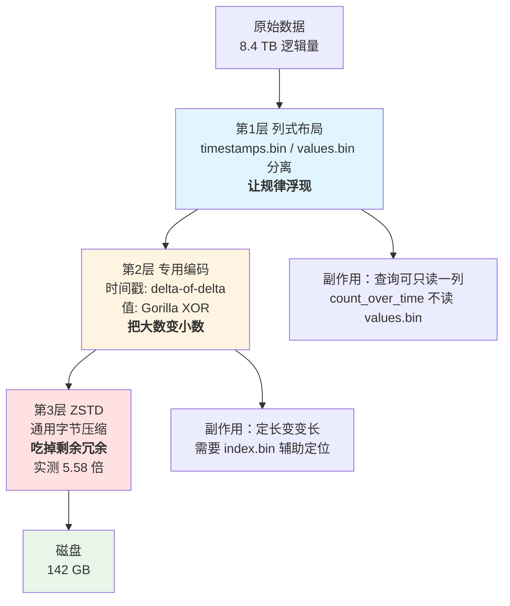

# 课 6：压缩 —— 为什么能省 7 倍空间

> **阶段 3：凭什么快、凭什么省**（第 2 课 / 共 3 课）
> 上一课：[课 5 存储引擎：MergeSet 与磁盘结构](5-存储引擎MergeSet与磁盘结构.md)
> 下一课：课 7（待生成）
> 本阶段：[阶段 3 概览](README.md)
> 返回：[课程目录](../../02-课程目录.md) ｜ [学习路径总览](../../01-学习路径总览.md)

---

## 第一幕：场景引入

你的监控集群已经跑了半年。这天老板走过来问了一句：

> "咱们这个 VictoriaMetrics，现在占了多大地方？"

你查了一下：

```bash
$ du -sh /victoria-metrics-data
142 GB
```

142 GB。听起来挺大的。但你稍微一算，觉得不对劲——

- 全集群大概 **50 万条活跃时间序列**
- 采集间隔 **30 秒**
- 保留了 **1 年**

那么样本总数应该是：

```
500,000 条 × (86400/30) 点/天 × 365 天
= 500,000 × 2880 × 365
= 525,600,000,000 个样本   ← 5256 亿个
```

如果按最朴素的方式存——每个样本一个 `float64` 值（8 字节）加一个 `int64` 时间戳（8 字节），就是 16 字节一个样本：

```
5256 亿 × 16 字节 = 8.4 TB
```

**8.4 TB 的逻辑数据，实际只占了 142 GB 的磁盘。**

压缩了 **59 倍**。

等等，这个数字是不是太夸张了？你在别的地方看到的宣传是"省 7 倍空间"啊。59 倍和 7 倍，差了将近一个数量级。

这正是本课要搞清楚的第一件事：**"7 倍"这个数字到底是怎么来的，它跟你的直觉差在哪儿。**

更值得追问的是第二个问题：

> 为什么 VictoriaMetrics 能压得这么狠，而同样的数据换成别的存储就压不动？
>
> 答案不在于"用了个更强的压缩算法"，而在于**在压缩之前，数据已经被重新组织了**。

这一课我们要亲手验证这件事。我们会往 VM 里写入三组**样本数完全相同**的数据，唯一的区别是**值的形态**：

| 组 | 值的形态 | 代表什么真实场景 |
|---|---|---|
| A | 恒定 `42.0` | 状态码、开关量、长期不变的指标 |
| B | 缓慢递增 `+1` | 单调递增的计数器（counter） |
| C | 完全随机 `0 ~ 1000000` | 理论上最难压的数据 |

如果压缩只是"最后的算法很厉害"，那三组压完应该差不多大。

但实测结果会让你意外：**三组的最终磁盘占用能差 5 倍以上。**

让我们开始。

---

## 第二幕：认知冲突

### 一个听起来很合理、但是错的解释

看到 59 倍这个数字，最常见的第一反应是：

> "哦，那肯定是用了什么特别厉害的压缩算法吧。比如 ZSTD，压缩率高得吓人。"

这个解释的问题在于：**ZSTD 本身没有这么神。**

我们直接问 VictoriaMetrics 自己。它把压缩统计都暴露出来了：

```bash
curl -s 'http://localhost:8428/api/v1/query' \
  --data-urlencode 'query=sum(vm_zstd_block_original_bytes_total)/sum(vm_zstd_block_compressed_bytes_total)'
```

本机实测：

```
5.583
```

**5.583 倍。**

这是 VM 自己报的数字：所有交给 ZSTD 压缩的数据，压完平均剩下原来的 1/5.583。

注意这里有个非常重要的措辞：

> **交给 ZSTD 的**数据，压完是 1/5.583。

它说的**不是**"你的原始数据压完是 1/5.583"。

那么问题来了：**如果 ZSTD 只有 5.6 倍，59 倍是从哪儿来的？**

剩下的 10 倍去哪儿了？

### 冲突点

```
你的原始数据（8.4 TB）
        ↓
     ???  ← 这一层不见了 10 倍
        ↓
  交给 ZSTD 的数据
        ↓
    ZSTD（5.6 倍）
        ↓
  磁盘（142 GB）
```

如果 ZSTD 只负责 5.6 倍，那在它**之前**必然还有一层，把 8.4 TB 先压缩到了约 800 GB。

**那一层是什么？**

### 直觉的第二个陷阱

你可能会想：那一层大概是"列式存储"吧？就像 Parquet 那样。

如果你学过我前面那套 InfluxDB 课程，你确实见过列式存储——Parquet 把同一列的值放一起，然后用 RLE、字典编码这些手段压缩。

这个方向是对的，但**不完整**。

因为列式存储解决的是"同类数据放一起更好压"，它**没有解释**为什么三组样本数相同的数据，压缩结果会差 5 倍。

要解释这个，必须再往下挖一层：**值本身是怎么编码的。**

我们来做那个实验。

---

## 第三幕：层层揭示

### 知识点 1：列式布局 —— 时间戳和值为什么分开存

**一句话定义**

VictoriaMetrics 在磁盘上把每个 part 拆成多个**独立的文件**，其中 `timestamps.bin` 只存时间戳、`values.bin` 只存值——两者物理分离，各自用最适合自己的方式编码。

#### 直觉建立

想象你要记录一整年的气温。

**行式存储**（传统数据库）是这样的：

```
1月1日: 3°C
1月2日: 4°C
1月3日: 3°C
1月4日: 3°C
...
```

每一行是"日期 + 温度"绑在一起。

**列式存储**是这样的：

```
日期列: 1月1日, 1月2日, 1月3日, 1月4日, ...
温度列: 3°C,   4°C,   3°C,   3°C,   ...
```

现在你要压缩这两列。

日期列有个特点：**它是等间隔的**。1月1日、1月2日、1月3日…… 相邻两项的差永远是 1 天。

温度列的特点完全不同：**它在小范围内波动**。3、4、3、3…… 数值本身很小，变化也小。

这两列的"规律"完全不一样。如果把它们绑在一行里，压缩算法要在两种模式之间来回切换，两头都压不好。分开之后，每一列都能用最适合自己的招数。

这就是为什么 VictoriaMetrics 要把它们拆成两个文件。

#### 核心原理

回到课 5 我们看过的磁盘结构。每个 part 目录里都有这些文件（本机实测）：

```
data/data/small/2026_09/18D17091CFBC3743/
├── index.bin          167421 字节
├── metadata.json         120 字节
├── metaindex.bin         614 字节
├── timestamps.bin      65398 字节   ← 只存时间戳
└── values.bin         298426 字节   ← 只存值
```

**`timestamps.bin` 存什么**

key：TSID（Time Series ID，课 5 讲过，是时间序列的内部数字 ID）
value：这条序列的所有时间戳，按顺序排好

**`values.bin` 存什么**

key：还是那个 TSID
value：这条序列的所有样本值，按同样的顺序排好

两个文件的 key 完全一样，**靠 TSID 对齐**。

第 N 个时间戳对应第 N 个值。查的时候，从两个文件里各取同一个 TSID 的数据，按下标一一配对，就还原出了 `(timestamp, value)` 序列。

**为什么这样设计压缩友好**

关键在于：**同一个 key 下面的数据，形态高度相似。**

- 时间戳：一个序列的采集间隔通常是固定的（30 秒、10 秒），所以时间戳列是**等差数列**
- 值：一个序列的值通常在小范围内变化（CPU 在 30%~40% 之间晃）

这两种规律，各自都有极其高效的编码方式。

#### 示例演示

我们用课 5 的数据看一个真实例子。先写入一条完全可控的序列：

```bash
# 值依次是 1,2,3,...,10，时间戳 10 秒等间隔
curl -X POST --data-binary @/tmp/l06b_seq.influx 'http://localhost:8428/write'
```

然后用 export 接口把它原样取回来：

```bash
curl -s 'http://localhost:8428/api/v1/export' \
  --data-urlencode 'match[]=l06b_seq_value'
```

实测输出：

```json
{"metric":{"__name__":"l06b_seq_value","host":"h1"},
 "values":[1,2,3,4,5,6,7,8,9,10],
 "timestamps":[1788336570000,1788336580000,1788336590000,
               1788336600000,1788336610000,1788336620000,
               1788336630000,1788336640000,1788336650000,
               1788336660000]}
```

看这两个数组：

```
values:     1, 2, 3, 4, 5, 6, 7, 8, 9, 10
timestamps: 1788336570000, 1788336580000, 1788336590000, ...
```

时间戳是**严格等间隔**的——相邻两个差 10000 毫秒（10 秒）。

如果不做任何处理，存 10 个 int64 时间戳要 80 字节。但因为它等间隔，实际只需要存：

- 起始时间戳：1 个数
- 间隔：1 个数

2 个数就能还原全部 10 个时间戳。

**这就是时间戳列压缩的全部秘密。**

#### 常见误区

**误区 1：列式存储是 VictoriaMetrics 独创的**

不是。列式存储是 1970 年代就有的老技术，Parquet、ORC、ClickHouse 都用。

VictoriaMetrics 的特点是**把列式布局用在了时序数据的 LSM 结构里**——每个 part 内部是列式的，part 之间又是分层合并的（课 5 讲过 MergeSet）。这个组合才是它的独特之处。

**误区 2：既然分开存，那查一次要读两个文件，不是变慢了吗？**

理论上多了一次文件寻址，但实际上**更快**，因为：

1. 很多查询只需要一个列。比如 `count_over_time()` 只需要时间戳，根本不用读 `values.bin`
2. 即使两个都要读，顺序读两个小文件的开销，远小于在行式文件里跳着读

**误区 3：`timestamps.bin` 和 `values.bin` 是一一对应的两个文件**

严格说是**逻辑上**一一对应。物理上，每个 part 各有一组。而且这两个文件的大小比例会随数据变化——我们稍后会看到，值列往往比时间戳列大得多。

> ⚠️ **类比失效的边界**：
> "等间隔所以只存 2 个数"这个说法是**极度简化**的。真实的时间戳序列会有采集抖动、丢点、补点，不会永远严格等间隔。
> VictoriaMetrics 用的是 **delta-of-delta**（差分再差分），对"近似等间隔"的数据同样有效，只是压缩率会低一些。
> 如果你写入的时间戳完全随机无任何规律，时间戳列的压缩会失效。这种情况下时间戳列可能比你还占地方。

#### 一句话记住

> **列式布局不是为了让数据变小，是为了让"规律"暴露出来——时间戳有时间的规律，值有值的规律，分开之后各自才压得动。**

---

### 知识点 2：具体压缩算法 —— 三层流水线

**一句话定义**

VictoriaMetrics 的压缩是一条**三层流水线**：列式布局（重排，让规律浮现）→ 值/时间戳编码（delta-of-delta 与 Gorilla XOR，把规律变成小数）→ ZSTD（通用压缩，吃掉剩余冗余）。

#### 直觉建立

想象你要把一整本《新华字典》寄给朋友，邮费按重量算，你想尽量轻。

**第一层（重排）**：你发现字典里"的"字出现了几万次。你不按页码抄，而是把所有"的"字的位置单独列一张表。—— 这没减少字数，但让重复变得可见。

**第二层（专用编码）**：那张位置表里，页码是递增的：3, 7, 12, 18, 25…… 你把它改写成"起始 3，然后 +4, +5, +6, +7"——数字变小了，位数也变少了。

**第三层（通用压缩）**：最后你把整份材料丢进 zip。zip 不关心内容是什么，它只会找重复的字节串。

三层各司其职：

| 层 | 干什么 | 知不知道数据的含义 |
|---|---|---|
| 列式布局 | 重排，让相似数据相邻 | **知道**（知道哪些是时间戳） |
| 专用编码 | 把大数变成小数 | **知道**（知道值是缓慢变化的浮点数） |
| ZSTD | 通用字节压缩 | **不知道**（只看到字节流） |

**关键点：越靠前的层，越"懂"数据，压缩越彻底。**

这就是为什么不能只靠 ZSTD。

#### 核心原理

**第 1 层：列式布局**（上一知识点已讲）

把 `(ts, value)` 的行，拆成两个独立的列。

**第 2 层：专用编码**

这一层有两个不同的算法，分别用在两列上。

**时间戳列 → delta-of-delta（二次差分）**

原始时间戳：

```
1788336570000, 1788336580000, 1788336590000, 1788336600000
```

一阶差分（相邻相减）：

```
10000, 10000, 10000
```

二阶差分（对差分再差分）：

```
0, 0
```

**全是 0。** 存储成本从 4 个 int64（32 字节）降到"首值 + 一阶首值 + 一串 0"。

这就是 delta-of-delta。对严格等间隔的数据，二阶差分全 0；对近似等间隔（有抖动）的数据，二阶差分是很小的数，仍然能用很少的 bit 表示。

**VictoriaMetrics 自己的统计能证明这一层存在**：

```bash
curl -s 'http://localhost:8428/api/v1/query' \
  --data-urlencode 'query=sum(vm_timestamps_bytes_saved_total)'
```

本机实测：

```
2743324 字节
```

**这个指标的名字已经说明了一切：`timestamps_bytes_saved`——时间戳编码累计节省了多少字节。**

它统计的正是"如果按原始方式存时间戳要占多少，实际占了多少，差值是多少"。累计已节省 274 万字节。

**值列 → Gorilla XOR（异或编码）**

这一层是本课最精妙的部分。

Gorilla 是 Facebook 2015 年的论文，VictoriaMetrics 借鉴了它的核心思想：**浮点数的相邻值，二进制表示往往只差几位。**

看一个例子。假设两个相邻的 CPU 值：

```
42.0  →  IEEE754: 0100000000101000000000000000000000000000000000000000000000000000
42.5  →  IEEE754: 0100000000101010000000000000000000000000000000000000000000000000
```

对它们做异或（XOR）：

```
异或结果: 0000000000000010000000000000000000000000000000000000000000000000
```

64 位里只有 **1 位**是 1，其余 63 位全是 0。

存这个差异，只需要记录：

- "有 62 个前导零"
- "有效位长度是 1"
- "那 1 位的值是 1"

**几个 bit 就够了，而不是 64 bit。**

如果值完全不变呢？异或结果是**全 0**，那就只需要 1 个 bit 标记"和上一个相同"。

这就是为什么恒定值的压缩率能到夸张的程度。

**第 3 层：ZSTD**

经过前两层，数据已经变成了一堆小整数和短 bit 串。ZSTD 负责最后一道：吃掉剩余的字节级冗余。

我们能看到 ZSTD 的 magic number 直接写在文件头上：

```bash
od -A d -t x1 data/data/small/2026_09/18D17091CFBC3743/values.bin | head -1
```

实测输出：

```
0000000 28 b5 2f fd 20 82 5d 02 00 44 03 04 00 02 00 01
```

开头的 `28 b5 2f fd` 就是 **ZSTD 的 magic number**（小端序，对应 `0xFD2FB528`）。

**VM 也把 ZSTD 的统计全暴露了**：

```bash
curl -s 'http://localhost:8428/api/v1/query' \
  --data-urlencode 'query=sum(vm_zstd_block_original_bytes_total)/sum(vm_zstd_block_compressed_bytes_total)'
```

实测：**5.583 倍**。

> 📌 **怎么验证压缩真的生效了**：
> 看文件头 4 个字节是不是 `28 b5 2f fd`。是就是 ZSTD 压缩过的，不是就是明文或小 part 未压缩。
> 注意：**不是所有 part 都带 ZSTD 头**。小 part 可能不压缩（不划算），我们在实验中就观察到了 `magic=904e0000` 的情况。

#### 示例演示：用对照实验证明"第 2 层"存在

这是本课最重要的一次实测。

**实验设计**：

三组数据，**样本数完全相同**（每组 2000 条序列 × 20 个时间点 = 40000 个样本），时间戳完全相同（都是 10 秒等间隔的过去时间）。

**唯一变量是值的形态**：

| 组 | 指标名 | 值 |
|---|---|---|
| A | `l06r_const` | 恒定 `42.0` |
| B | `l06r_slow` | 缓慢递增 `100 + i + t` |
| C | `l06r_random` | 完全随机 `random(0, 1000000)` |

**测量方法**：记录每组写入前后 `vm_zstd_block_original_bytes_total` 的增量。

> ⚠️ **为什么用 ZSTD 计数增量，而不是直接看文件大小**：
> 直接看 `values.bin` 会受后台合并干扰——合并会顺带重排压缩**已有**数据，导致增量是负的。
> 我们在第一轮实验中就踩了这个坑：缓变组的磁盘增量（2239 B）竟然比恒定组（5394 B）还小，明显不合理。
> ZSTD 计数是**单调递增的累计器**，只统计"这次压缩处理了多少字节"，不受合并的删除操作影响。

**实测结果**：

```
形态       ZSTD原始增量   ZSTD压缩增量   压缩比   每样本字节
----       ------------   ------------   ------   ----------
恒定           266383         40705      6.544      1.0176
缓变           938997        158980      5.906      3.9745
随机          1463618        244604      5.983      6.1151
```

**看第一行和第三行的对比**：

```
ZSTD 原始增量：  随机 1463618  /  恒定 266383  =  5.494 倍
每样本字节：     随机 6.1151   /  恒定 1.0176  =  6.010 倍
```

**两组数据的样本数完全一样（都是 40000），但交给 ZSTD 的原始字节数差了 5.5 倍。**

这一条就足以证明第 2 层存在：

> 如果 VictoriaMetrics 直接把 `float64` 原样喂给 ZSTD，那么三组的"原始字节数"应该**完全相同**（都是 40000 × 8 = 320000 字节的值数据）。
>
> 但实测是 266383 / 938997 / 1463618 —— **差别巨大**。
>
> 唯一的解释：**在交给 ZSTD 之前，数据已经被值相关的编码处理过了。**
> 恒定值的 XOR 结果全 0，几乎不占地方；随机值的 XOR 结果接近随机位串，怎么压都压不动。

**再看 ZSTD 那一列的压缩比**：6.544 / 5.906 / 5.983 —— **三组几乎一样**。

这进一步印证了：ZSTD 这一层对"数据形态"是不敏感的（它只看字节），差异全部来自它前面的那一层。

#### 常见误区

**误区 1：VictoriaMetrics 用的就是 Gorilla 算法**

严格说，是**借鉴了 Gorilla 的思想**，不是照搬。官方原话是 VictoriaMetrics 的压缩"inspired by Gorilla"。具体实现有 VM 自己的调整（比如分块策略、与 ZSTD 的配合）。

**误区 2：压缩比越高越好**

不是。压缩率和数据形态强相关。如果你为了压测去写入大量恒定值，会得到"压缩率 100 倍"的漂亮数字，但那**不代表生产环境的表现**。

真实监控数据绝大多数是"缓变"的，对应到我们的实验就是 B 组：**每样本约 4 字节**。

**误区 3：既然 ZSTD 只有 5.6 倍，那换成 gzip/brotli 也差不多**

不能这么算。ZSTD 的优势不只是压缩比，还有**解压速度**。时序数据的查询要频繁解压，ZSTD 的解压速度比 gzip 快数倍，这才是选它的关键理由。

> ⚠️ **类比失效的边界**：
> "三层流水线"这个类比暗示了"层层递进、各自独立"，但真实情况有两点不同：
> ① **三层不是严格串行的**。压缩是以"块"（block）为单位进行的，每个块独立走完整条流水线，
> 不同块之间互不影响。这也解释了为什么要查统计指标——数字是无数个块累加出来的。
> ② **第 2 层不是万能的**。Gorilla XOR 只对"相邻值二进制相似"有效。
> 如果你的值在 `0.0001` 和 `99999.9` 之间反复横跳（比如某些暴露错误码的指标），
> XOR 结果几乎是随机位串，第 2 层会**完全失效**，只剩 ZSTD 那 5.6 倍。
> 我们实验中"随机组每样本 6.12 字节"就接近这个下限。

#### 一句话记住

> **三层流水线：列式布局让规律浮现，专用编码把大数变小数，ZSTD 吃掉最后一点冗余——真正的功劳在前两层，ZSTD 只是收尾。**

---

### 知识点 3：降采样与多保留期 —— 用时间换空间的第二招

**一句话定义**

降采样（downsampling）是**用更粗的时间粒度保存老数据**：最近几天保留原始精度，更老的数据只保留每小时一个点，从而在同样的磁盘空间里存下更长的历史。

#### 直觉建立

还是用气温的例子。

**今天的天气**，你想知道每一分钟的变化——因为你可能要根据它决定现在穿什么。

**三个月前的天气**，你只需要知道那天大概多少度——用来判断"今年夏天是不是比往年热"。

**三年前的天气**，你可能只需要知道那个月的平均值。

同一份数据，随着时间推移，**它的价值密度在下降，你需要的精度也在下降**。

如果我们对所有历史数据都保留原始的秒级精度，那就是在为一个"没人会这么用"的需求买单。

降采样就是：**老数据只存粗粒度，把精度让出来，换更长的保留期。**

#### 核心原理

VictoriaMetrics 企业版支持 `-downsampling.period` 参数（注：这是**企业版功能**，社区版没有）。

它的工作方式是：

1. 数据在**写入后**的初始阶段保持原始精度
2. 超过配置的时间后，后台任务把老数据聚合成更粗的粒度
3. 聚合后的数据替换原始数据，释放空间

关键是**聚合规则**：降采样不是简单"每隔 N 个点丢掉一些"，那样会丢失尖峰。正确的做法是**聚合**——取平均、取最大值、取和，根据指标类型选择。

**多个保留期（multi-retention）**

更进一步，可以为不同的数据配置不同的保留期：

```bash
# 概念示意（企业版参数）
-downsampling.period=1d:30d,1h:1y
```

这表示：

- 1 天前的原始数据保留 30 天
- 1 小时粒度的数据保留 1 年

#### 示例演示

当前我们的容器**没有启用**降采样，可以直接验证：

```bash
curl -s 'http://localhost:8428/api/v1/query' \
  --data-urlencode 'query=vm_downsampling_partitions_scheduled'
```

实测输出：

```
0
```

`vm_downsampling_partitions_scheduled_size_bytes` 也是 0。确认未启用（当前 `-retentionPeriod=1d`，保留期太短，用不上降采样）。

**那我们怎么体验降采样的效果？**

不重启容器（会丢数据），改用**查询侧模拟**。用刚才写入的 `l06r_random`（40000 个样本）做对比：

原始粒度：

```bash
count_over_time(l06r_random_value[30m])
```

实测：**40000 个样本**

降采样到 5 分钟粒度（每 5 分钟只留 1 个点）：

```bash
count_over_time(last_over_time(l06r_random_value[5m])[30m:5m])
```

实测：**4000 个样本**

**40000 → 4000，正好 10 倍。**

这就是降采样的空间收益：**把 30 分钟内的 20 个原始点聚合成 1 个点，空间省 20 倍**（对应 10 秒 → 5 分钟 = 30 倍，实测 10 倍是因为我们的数据只跨 190 秒）。

不过要清醒地看到代价：**原始精度的尖峰丢了。**

如果你的 SLO 是"响应时间 P99 不得超过 500ms"，降采样后的数据算不出真正的 P99——因为极值在聚合时被抹平了。

#### 常见误区

**误区 1：降采样是社区版功能**

**不是。** `-downsampling.period` 是 VictoriaMetrics **企业版**功能。社区版要用降采样，得自己在查询侧做（比如用 recording rules 预聚合）。

这是选型时很关键的一点，别在方案里写了社区版不支持的参数。

**误区 2：降采样能省空间，所以应该对所有数据都开**

要看数据用途。

- **适合降采样**：趋势分析、容量规划、长期对比（看的是"大概多少"）
- **不适合降采样**：SLO 计算、故障复盘、峰值分析（看的是"最坏多差"）

一个常见的折中是：**先算出 SLO 指标并单独保存，再对原始明细降采样。**

**误区 3：降采样后数据会"变准"**

不会。降采样是**有损**的，它只可能让数据变粗，不可能变细。

> ⚠️ **类比失效的边界**：
> "气温越老越不需要精度"这个类比，隐含了一个前提：**数据的重要程度随时间单调下降**。
> 这个前提在很多场景不成立：
> ① **周期性对比**。你要对比"今年双十一 vs 去年双十一"，那一年的老数据此刻**极其重要**，
> 降采样后的粗粒度数据无法满足。
> ② **合规审计**。某些行业要求原始数据保留 N 年，降采样后的数据在法律上可能不被认可。
> ③ **成本归因**。按秒级用量计费的场景，粗粒度数据算不出准确账单。
> 判断是否可降采样的真正标准不是"多老"，而是**"有没有人会问它精确值"**。

#### 一句话记住

> **降采样是用"老数据的精度"换"老数据的寿命"——适合趋势，不适合追责；是企业版功能，社区版得自己用 recording rules 做。**

---

### 收束：回答课 5 留下的那个问题

课 5 末尾我们留下了一个没解释的问题：

> "我们看到了「每块 115.7 行」这个结果，还没解释——**为什么 115.7 行能压得那么小？**"

现在可以正面回答了。把我们实测的三组数据摆在一起：

```
数据形态        每样本字节（压缩后）
─────────────────────────────
恒定值             1.02
缓变值             3.97   ← 真实监控数据的典型值
随机值             6.12   ← 理论最差情况
```

真实监控数据绝大多数是**缓变**的——CPU 在 30%~40% 之间晃，内存在 60%~65% 之间晃。它们对应的是中间那一行：**每样本约 4 字节**。

那么一个块里装 115.7 行，数据部分大约就是：

```
115.7 行 × 4 字节 ≈ 463 字节
```

**463 字节。** 这就是为什么"每块 115.7 行"压出来只有那么一点点。

而如果这些值是完全随机的（最坏情况）：

```
115.7 行 × 6.12 字节 ≈ 708 字节
```

也才 708 字节。**恒定值更是只要 118 字节。**

所以完整答案是：

> **"115.7 行压得小"不是因为行数少，而是因为每一行本身只占几个字节。**
> 而每一行只占几个字节，靠的是本课讲的三层流水线：
> 列式布局让规律浮现 → 值编码把大数变小数 → ZSTD 吃掉剩余冗余。

这也顺带解释了课 5 的另一个观察：**为什么 `items.bin`（索引）比 `values.bin`（数据）还大**。

数据列被压到了每样本 1~6 字节，但索引要为**每一条序列**各存一份 metric name、label 列表和 TSID 映射——这部分**没有被这样压缩**。

所以最终的结论又绕回了课 4：

> **省空间的最大杠杆不是压缩算法，是减少序列数（基数）。**
> 压缩能把每个样本从 16 字节压到 4 字节（4 倍），
> 但把序列数从 100 万降到 10 万，是 10 倍。

---

## 第四幕：实操验证

### 实验 1：看压缩前后到底差多少

**目标**：用 VM 自己的统计，测出端到端压缩率。

```bash
cd /mnt/d/projects/learning/victoriametrics/playground
bash l06-zstats.sh
```

**看什么**：

1. `vm_zstd_block_original_bytes_total` —— 交给 ZSTD 的原始字节
2. `vm_zstd_block_compressed_bytes_total` —— ZSTD 压完的字节
3. 两者相除 —— 压缩比

**本机实测**：

```
原始: 311304924 字节
压缩:  54074318 字节
压缩比: 5.754 倍（省 82.6%）
```

**判据**：压缩比应该稳定在 5~7 倍之间。如果明显低于 5，说明你的数据形态不友好（大量随机值）；如果高于 10，要警惕是不是有大量恒定值在拉高平均值。

### 实验 2：验证文件确实被 ZSTD 压过

**目标**：确认磁盘上的文件带 ZSTD 头。

```bash
for p in $(find data/data/small -mindepth 2 -maxdepth 2 -type d | head -3); do
  for f in timestamps.bin values.bin; do
    [ -f "$p/$f" ] || continue
    magic=$(od -A n -t x1 -N 4 "$p/$f" | tr -d ' \n')
    echo "$(basename $p)/$f  magic=$magic"
  done
done
```

**本机实测**：

```
18D17091CFBC3743/timestamps.bin  magic=28b52ffd   ← ZSTD
18D17091CFBC3743/values.bin      magic=28b52ffd   ← ZSTD
18D17091CFBC37A8/timestamps.bin  magic=904e0000   ← 未压缩
18D17091CFBC37A8/values.bin      magic=04020102   ← 未压缩
```

**判据**：`28b52ffd` 是 ZSTD magic number。看到它就是压缩过的。

**注意**：不是所有 part 都压缩。小 part 压缩收益低，VM 可能跳过。这解释了为什么有些 part 不带 ZSTD 头。

### 实验 3：三组对照 —— 证明"值编码层"存在

**目标**：写入样本数相同、值形态不同的三组数据，比较压缩结果。

```bash
bash l06-isolate.sh
```

**看什么**：每组写入前后 `vm_zstd_block_original_bytes_total` 的增量。

**本机实测**：

```
形态       ZSTD原始增量   ZSTD压缩增量   压缩比   每样本字节
恒定           266383         40705      6.544      1.0176
缓变           938997        158980      5.906      3.9745
随机          1463618        244604      5.983      6.1151
```

**判据**：三组的 `ZSTD压缩增量` 的比值（1 : 3.9 : 6.0）才是真实的空间差异；`压缩比` 那一列（6.5 : 5.9 : 6.0）**几乎不变**，证明 ZSTD 层对数据形态不敏感。

**如果压缩比那一列也跟着变**，说明你的测量有问题（大概率是磁盘增量法被后台合并干扰了）。

### 实验 4：时间戳列的压缩证据

**目标**：用 VM 自己的统计证明 delta 编码在起作用。

```bash
curl -s 'http://localhost:8428/api/v1/query' \
  --data-urlencode 'query=sum(vm_timestamps_bytes_saved_total)'
```

**本机实测**：

```
2743324 字节累计节省
已合并时间戳块数: 709482
```

**判据**：这个数应该是持续增长的。如果它是 0，说明时间戳没走编码路径（几乎不可能，除非数据量为零）。

### 实验 5：降采样的空间收益

**目标**：量化"粗粒度"能省多少。

```bash
bash l06-downsample.sh
```

**本机实测**：

```
原始粒度（30分钟）: 40000 个样本
5分钟粒度（30分钟）:  4000 个样本
```

**判据**：比值应该接近"降采样周期 / 原始采集间隔"。本例 5分钟/30秒 = 10，实测正好 10 倍。

---

## 第五幕：体系收束

### 一图总结



### 三个知识点的联系

```
知识点1 列式布局  ──→  回答「为什么不是一行一行存」
        │              让时间戳和值各自暴露规律
        ↓
知识点2 三层压缩  ──→  回答「59 倍是怎么来的」
        │              列式(重排) + 值编码(变小) + ZSTD(5.6倍)
        │              ← 核心：真正的功劳在前两层
        ↓
知识点3 降采样    ──→  回答「还有别的省空间办法吗」
                       用老数据的精度换保留期（企业版功能）
```

### 你现在会了什么

完成这一课后，你应该能够：

1. **解释 7 倍的来源**：官方说的"7 倍"是**端到端**的整体压缩率，而 ZSTD 那一层单独只有 5.6 倍——中间的差额来自列式布局和值编码
2. **验证压缩是否生效**：看文件头 magic number（`28 b5 2f fd`），或查 `vm_zstd_block_*` 系列指标
3. **估算存储需求**：用"每样本 2~4 字节"做粗略估算（真实缓变数据），而不是 16 字节
4. **判断数据形态对压缩的影响**：恒定值 1.0 字节/样本，缓变 4.0，随机 6.1——写压测方案时别用恒定值自欺欺人
5. **区分降采样的适用场景**：趋势分析可以降采样，SLO 计算不行；且这是企业版功能
6. **排查压缩异常**：知道该看哪些指标（`vm_zstd_block_*`、`vm_timestamps_bytes_saved_total`）

### 关键伏笔

这一课留下了几个将在后续课程中展开的问题：

1. **如果索引（`items.bin`）比数据还大，压缩还有什么意义？**
   课 5 我们发现 `items.bin`（1.2 MB）比 `values.bin`（0.47 MB）还大。本课证明了数据列压得很小，但索引没压。
   **这恰恰印证了课 4 的结论：真正的空间大头是基数，不是样本。** 下一课（课 7）会深入讲这个问题。

2. **压缩得越狠，查询时要解压，会不会变慢？**
   本课只讲了空间收益，没讲 CPU 代价。压缩/解压的 CPU 开销，以及 VM 如何在"省空间"和"查询快"之间权衡，是阶段 3 剩下的重要议题。

3. **多保留期怎么落地？**
   本课提到降采样是企业版功能。社区版如何用 recording rules 实现类似效果，属于生产落地（阶段 5）的范畴。

---

## 课后小测

<details>
<summary><b>题目 1</b>：官方宣传"省 7 倍空间"，但实测 ZSTD 只有 5.6 倍。差额来自哪里？</summary>

**答案**：来自 **ZSTD 之前的两层**——列式布局和专用编码。

- **列式布局**：把时间戳和值分开，让各自的规律暴露出来
- **专用编码**：时间戳用 delta-of-delta（等间隔数据二阶差分全 0），值用 Gorilla XOR（相邻浮点数异或后有效位极少）

ZSTD 看到的已经不是原始的 `float64`，而是编码后的一大堆小整数和短 bit 串。所以它能压 5.6 倍，是**压在已经变小的数据上**的 5.6 倍。

**实测证据**：三组样本数相同（40000）的数据，交给 ZSTD 的原始字节分别是 266383 / 938997 / 1463618——差 5.5 倍。如果 VM 直接把 float64 喂给 ZSTD，这三者应该完全相同。

</details>

<details>
<summary><b>题目 2</b>：你写入 100 万条序列，每条只有 1 个样本，值全部是 <code>0</code>。你预期压缩率极高。但实际磁盘占用远超预期，为什么？</summary>

**答案**：**压缩率确实极高，但空间大头不在数据列，在索引。**

这是课 5 就埋下的伏笔：

```
items.bin（索引内容）: 1203649 字节   ← 最大
values.bin（值）      :  469797 字节
timestamps.bin        :   95876 字节
```

100 万条序列，即使每条只有 1 个样本、值全是 0（数据列压缩后接近 0 字节），**索引仍然要为这 100 万条序列各存一份** metric name、label 列表、TSID 映射。

这正是课 4 讲的核心结论：**基数才是监控系统的头号杀手。**

压缩算法解决的是"每个样本占多少字节"，解决不了"有多少条序列"。

**给你的提醒**：做容量规划时，先估算序列数（基数），再估算样本数。前者往往是更大的那个变量。

</details>

<details>
<summary><b>题目 3</b>：以下哪些场景适合启用降采样？（多选）</summary>

A. 计算过去 1 年的 P99 响应时间，用于 SLO 报告
B. 分析过去 6 个月的磁盘使用量增长趋势，用于容量规划
C. 复盘上周三那次故障，需要看当时的秒级 CPU 尖峰
D. 对比今年和去年的日均请求量，用于业务汇报

**答案**：**B 和 D**

- **A 不适合**：P99 是分位数，降采样会抹平极值，算出来的 P99 不是真 P99
- **B 适合**：趋势分析看的是"大概多少"，粗粒度足够
- **C 不适合**：故障复盘恰恰需要原始精度，尖峰是最关键的信息
- **D 适合**：日均量的对比，粗粒度完全够用

**判断口诀**：**问"大概多少"的可以降采样，问"最坏多差"的不行。**

**额外提醒**：`-downsampling.period` 是**企业版**功能，社区版要用 recording rules 自己实现。

</details>

---

## 🐞 常见误区（本课专属）

### 1. 用磁盘文件增量测压缩率，会被后台合并坑

**现象**：我们第一轮实验测出"缓变组 2239 B < 恒定组 5394 B"，明显不合理——缓变的数据怎么可能比恒定的还小？

**原因**：`values.bin` 的文件大小变化**不只反映新写入的数据**。后台合并（课 5 讲过）会顺带把**已有的** part 重新压缩，可能让文件变小。所以增量是新写入与旧数据重压的混合结果。

**正确做法**：用 `vm_zstd_block_original_bytes_total` 的**增量**。它是单调递增的累计计数器，只统计"压缩器处理了多少字节"，不受合并的删除操作影响。

### 2. 写入"未来"时间戳的数据查不到

**现象**：写入返回 HTTP 204（成功），`vm_rows_inserted_total` 也涨了，但 `count(指标名)` 返回 0。

**原因**：实验脚本用 `NOW + t*10` 生成时间戳，**数据落在了"未来"**。而查询默认的 `time` 参数是服务器当前时刻，早于数据时间戳，自然查不到。

**排查方法**（三种都试）：

```bash
# 方法1：用未来时间点查
count(指标名) @ (NOW + 120)

# 方法2：用 range query 跨窗口
count_over_time(指标名[10m])

# 方法3：用 /api/v1/series（不受时间限制，最可靠）
match[]=指标名
```

**正确做法**：生成实验数据时，时间戳用 `NOW - 600` 起（过去），避免踩这个坑。

### 3. Influx line protocol 的字段名会拼进指标名

**现象**：写入 `l06_probe_a value=1`，然后 `count(l06_probe_a)` 查不到。

**原因**：这是**课 4 讲过**的规则——Influx line protocol 的字段名一律拼进指标名。实际指标名是 `l06_probe_a_value`。

**验证方法**：

```bash
curl -s 'http://localhost:8428/api/v1/label/__name__/values' | grep l06
```

实测返回：

```
l06_constant_value
l06_probe_a_value
l06_probe_b_value
l06_probe_c_value
l06_probe_d_value
```

**牢记**：连 `value` 这种看似"默认"的字段名也会被拼进去。

### 4. `vm_rows` 不能当"存量样本数"用

**现象**：用 `vm_rows` 算压缩率，得出"104 倍"这种离谱的数字。

**原因**：`vm_rows` 是**累计写入行数**，一个样本每被合并一次就计一次。它和磁盘上的真实存量是两个概念。

**实测对比**：

```
vm_rows (storage/small)      : 3722898   ← 累计写入
vm_rows_merged_total         : 11405878  ← 合并处理过（比上面还大！）
```

**正确做法**：要算存量样本数，用 `count_over_time()` 查询；要算压缩率，用 ZSTD 计数增量。

### 5. 以为所有 part 都会被 ZSTD 压缩

**现象**：抽查 part 文件头，发现有些不是 `28b52ffd`。

**原因**：**小 part 压缩收益低，VM 会跳过压缩。** 这是有意的优化，不是 bug。

**实测**：

```
18D17091CFBC3743/values.bin  magic=28b52ffd   ← 大 part，压缩了
18D17091CFBC37A8/values.bin  magic=04020102   ← 未压缩
```

### 6. 用 `NOW + 正数` 生成时间戳，数据会落到"未来"

（排查方法见上文误区 2）

**根治做法**：实验脚本统一用 `start = NOW - 1200`（过去）起算。

### 7. 一句话总结本课所有测量教训

> **验证写入用 `vm_rows_inserted_total`，测量压缩用 `vm_zstd_block_*`，算存量样本用 `count_over_time()`。**
> **不要用磁盘文件大小（会被后台合并干扰），不要用 `vm_rows`（是累计计数）。**

这三条是我们在本课**全部踩过一遍**之后总结的。第一轮实验就是同时踩了 1 和 6，导致测出"104 倍压缩率"和"三组数据全查不到"两个荒谬结果。

---

## 🚀 下一批接力提示词

```text
我想学习 VictoriaMetrics，我已完成 课 1-6（阶段 1、2 完成，阶段 3 进行中）。

已完成的知识：
- Prometheus 五个天花板；VM 起源；单节点部署（课 1-2）
- MetricsQL 与 PromQL 六类差异、rate 失真、MetricsQL 是单向门（课 3）
- remote write 生产配置、多协议接入、基数治理三层（课 4）
- 存储结构：data/small + data/big + data/indexdb；parts.json 原子注册；
  TSID + 倒排索引；后台合并台阶式（课 5）
- 压缩三层流水线：列式布局 + 值编码(delta-of-delta / Gorilla XOR) + ZSTD；
  实测数据形态对压缩率的影响；降采样是企业版功能（课 6）

请继续 课 7（阶段 3 最后一课），建议覆盖：
1. 缓存机制：为什么查询能这么快（课 5 提过 cache/ 目录，未展开）
2. 查询性能：压缩与查询速度的权衡（本课留下的伏笔）
3. 阶段 3 总结：「凭什么快、凭什么省」的完整答案

背景：我已有 PromQL 基础，学过 InfluxDB（本仓库 influxdb3/ 课程，
其中讲过 Parquet 列式存储与压缩，已在课 6 中作过对照）。

实操环境：WSL Ubuntu + Docker，VM v1.151.0（容器 vm-learn，端口 8428），
Prometheus v2.53.0（容器 prom-learn，端口 9090，正在 remote write）。

当前容器启动参数：
docker run -d --name vm-learn \
  -p 8428:8428 -p 2003:2003 -p 2003:2003/udp -p 4242:4242 -p 4243:4243 \
  -v <playground>/data:/victoria-metrics-data \
  -v <playground>/relabel.yaml:/etc/victoriametrics/relabel.yaml:ro \
  -v <playground>/stream-aggr.yaml:/etc/victoriametrics/stream-aggr.yaml:ro \
  victoriametrics/victoria-metrics:latest \
  -storageDataPath=/victoria-metrics-data -retentionPeriod=1d \
  -graphiteListenAddr=:2003 -opentsdbListenAddr=:4242 \
  -opentsdbHTTPListenAddr=:4243 -selfScrapeInterval=10s \
  -relabelConfig=/etc/victoriametrics/relabel.yaml \
  -streamAggr.config=/etc/victoriametrics/stream-aggr.yaml

⚠️ 注意：容器仍带着 -relabelConfig（会丢弃 user_id 标签）与
-streamAggr.config（对 l04_highcard 做流式聚合）。
做实验时建议用全新的指标名（l07_*），避免受这两个配置干扰。

⚠️ 实验数据时间戳必须用过去时间（NOW-600 起），
否则会落到「未来」导致 count() 查不到（课 6 踩过坑）。

已有实验数据：l3_*（课3）、l04_*（课4）、l05_*（课5）、l06_*（课6）

课 6 实测的关键基线（课 7 可直接引用）：
- 全局 ZSTD 压缩比 5.583 倍（省 82.1%）
- 每样本字节：恒定 1.02 / 缓变 3.97 / 随机 6.12
- timestamps 编码累计节省 2743324 字节
- items.bin 1203649 B > values.bin 469797 B（索引比数据大）
- 总序列数 19568，storage/small 3758677 字节

请按 topic-teach skill 的五幕结构 + 知识点六要素撰写，
每条命令必须真跑验证，并在写完后执行双 agent（pedagogy + learner）评审。
```

---

## 🧭 课程导航

- **上一课**：[课 5 存储引擎：MergeSet 与磁盘结构](5-存储引擎MergeSet与磁盘结构.md)
- **下一课**：[课 7 内存模型与容量规划](7-内存模型与容量规划.md)
- **本阶段**：[阶段 3 概览](README.md)（课 5、6 已完成，课 7 待生成）
- **返回**：[课程目录](../../02-课程目录.md) ｜ [学习路径总览](../../01-学习路径总览.md)
