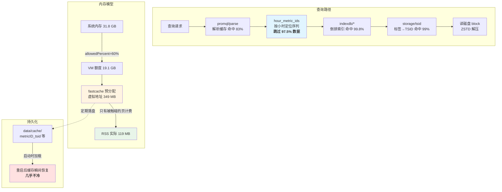

# 课 7：内存模型与容量规划 —— 凭什么快的最后一课

> **阶段 3：凭什么快、凭什么省**（第 3 课 / 共 3 课，**阶段收尾**）
> 上一课：[课 6 压缩：为什么能省 7 倍空间](6-压缩为什么能省7倍空间.md)
> 下一课：课 8（阶段 4，待生成）
> 本阶段：[阶段 3 概览](README.md)
> 返回：[课程目录](../../02-课程目录.md) ｜ [学习路径总览](../../01-学习路径总览.md)

---

## 第一幕：场景引入

你要给一个新业务做容量规划。业务方给了你这些数字：

- **100 万条活跃时间序列**
- 采集间隔 **30 秒**
- 保留 **1 年**

你打开 VictoriaMetrics 的官方文档，翻到容量规划那一节，看到一句很简单的话：

> "VictoriaMetrics 官方建议：每 100 万条活跃时间序列，配备 **1 GB 内存** 和 **1 核 CPU**。"

1 GB。

你盯着这个数字，觉得它**小得可疑**。

因为你在课 5 已经看过磁盘结构，在课 6 已经知道光是索引就比数据还大。现在这么大一堆东西，100 万条序列只要 1 GB 内存？

但紧接着你又看到另一个说法——**每台机器不要超过 1000 万条活跃序列**。

1000 万序列 × 1GB/百万 = 10 GB 内存。这离常规服务器的内存上限还远得很，为什么不能再多装点？

**这两个数字之间，藏着 VictoriaMetrics 内存模型的全部秘密。**

更让人不安的是第三个问题。假设你的集群真的挂了，你重启了 VictoriaMetrics，然后——

> 所有缓存都空了，第一个查询要重新扫全盘，**会不会慢到打不开 Grafana？**

这是每个运维在重启前都会犹豫一下的问题。

这一课，我们要把这三个问题全部回答掉：

1. **1 GB / 百万序列这个数字是怎么来的？**（容量规划）
2. **为什么有 1000 万序列的上限？**（内存模型的边界）
3. **重启之后到底会不会「冷」？**（缓存机制）

第三个问题的答案，会推翻我们在课 5 建立的一个印象。而且推翻它的，是我们自己跑出来的数据。

让我们开始。

---

## 第二幕：认知冲突

### 先看一个不可能的数字

我们直接问 VictoriaMetrics 自己，它的缓存占了多少内存：

```bash
curl -s 'http://localhost:8428/api/v1/query' \
  --data-urlencode 'query=sum(vm_cache_size_bytes)'
```

本机实测：

```
366361910 字节 ≈ 349 MB
```

好，缓存占了 349 MB。那这台 VM 进程实际用了多少物理内存？

```bash
curl -s 'http://localhost:8428/api/v1/query' \
  --data-urlencode 'query=process_resident_memory_bytes'
```

实测：

```
125624320 字节 ≈ 119 MB
```

**等一下。**

**缓存 349 MB，进程总共才 119 MB？**

缓存比装它的容器还大，这在物理上是不可能的。

### 冲突点

```
vm_cache_size_bytes  = 349 MB   ← 缓存声称自己占了这么多
process_resident_memory_bytes = 119 MB   ← 进程实际物理内存
```

这两个数字至少有一个在说谎。

**哪一个？**

如果 `vm_cache_size_bytes` 是真的，那 RSS 就应该至少 349 MB。如果 RSS 是真的，那缓存统计的就不是"物理内存"。

### 直觉的第二个陷阱：关于"冷启动"

再看第二组数据。这是我们在本课做的一次实验——**删掉所有缓存文件，然后重启容器**：

```
删除 data/cache/* 之前：缓存 235822 条目
重启之后（缓存文件已删）：缓存 235796 条目
```

**缓存条目几乎没变。**

按照"缓存是内存结构，重启就清空"的常识，删掉缓存文件再重启，缓存条目应该从 235822 掉到 0，然后随着查询慢慢爬升。

但实际是：**重启完直接就有 235796 条，命中率 99.94%。**

**缓存根本没冷过。**

这就引出了本课真正的冲突：

> 我们以为缓存是"内存的、易失的、重启就丢的"。
> 但实测显示，它既持久化到磁盘，又能在重启后瞬间恢复。
>
> **那它到底还算不算"缓存"？**

---

## 第三幕：层层揭示

### 知识点 1：缓存分层 —— 三层各管一摊

**一句话定义**

VictoriaMetrics 的缓存不是一块，而是**按用途分层的多块独立缓存**：`storage/*` 管"序列 → ID"的映射，`indexdb/*` 管"标签 → 序列"的倒排索引，`promql/*` 管查询本身的中间结果——每块有自己的容量、淘汰策略和命中率。

#### 直觉建立

想象一个图书馆。

你要找一本书，有三种方式：

1. **按书名找** → 需要一张"书名 → 书架编号"的对照表
2. **按主题找** → 需要一张"主题 → 所有相关书名"的对照表
3. **找一本你上周刚借过的书** → 你直接记得它在哪儿

这三件事需要三张**完全不同的表**：

| 表 | 内容 | 特点 |
|---|---|---|
| 书名 → 编号 | 一对一 | 条目多，但每条很小 |
| 主题 → 书单 | 一对多 | 条目少，但每条很大 |
| 最近借过 | 临时记录 | 随时可能失效 |

如果你把这三张表混在一起做成一个大缓存，会出现两个问题：

- 主题表的大条目会把书名表的小条目**挤出去**（缓存污染）
- 任何一类数据失效，整个缓存都要重建

VictoriaMetrics 的做法是：**分成多个独立的缓存，各管一摊。**

#### 核心原理

我们直接看实测。查询 `vm_cache_entries` 按 type 拆分：

```bash
curl -s 'http://localhost:8428/api/v1/query' \
  --data-urlencode 'query=sum(vm_cache_entries) by (type)'
```

本机实测（重启后稳态）：

```
type                              条目数
────────────────────────────────────────
storage/metricIDs                  36354
storage/metricName                 32266
storage/hour_metric_ids            22936
storage/tsid                       21415
indexdb/metricID                    2494
indexdb/dataBlocks                    65
storage/indexBlocks                   37
indexdb/indexBlocks                   35
promql/rollupResult                   11
indexdb/tagFiltersLoops                6
indexdb/tagFiltersToMetricIDs           6
promql/parse                            5
promql/regexp                           1
storage/regexpPrefixes                  1
storage/regexps                         1
```

分成三大类：

**第一类：`storage/*` —— 序列身份层**

| 缓存 | 装什么 | 为什么需要 |
|---|---|---|
| `storage/tsid` | 标签集 → TSID | 写入时反复用，免去查索引 |
| `storage/metricIDs` | metric name → metricID | 同上 |
| `storage/metricName` | metricID → metric name | 返回查询结果时要翻译回名字 |
| `storage/hour_metric_ids` | 某一小时内活跃的 metricID | **加速带时间范围的查询** |

最后这个是本课的重点，我们马上会展开。

**第二类：`indexdb/*` —— 倒排索引层**

| 缓存 | 装什么 |
|---|---|
| `indexdb/dataBlocks` | 索引文件的数据块 |
| `indexdb/indexBlocks` | 索引文件的索引块 |
| `indexdb/tagFiltersLoops` | 标签过滤条件 → 匹配的 metricID 集合 |
| `indexdb/tagFiltersToMetricIDs` | 同上，另一种形态 |

**第三类：`promql/*` —— 查询层**

| 缓存 | 装什么 |
|---|---|
| `promql/parse` | 查询语句的解析结果 |
| `promql/rollupResult` | rollup（如 `rate`）的计算结果 |
| `promql/regexp` | 编译后的正则表达式 |

**各层的命中率完全不同**：

```bash
curl -s 'http://localhost:8428/api/v1/query' \
  --data-urlencode 'query=1 - (sum(vm_cache_misses_total) by (type) / sum(vm_cache_requests_total) by (type))'
```

实测：

```
type                              命中率
──────────────────────────────────────
indexdb/indexBlocks               99.81%
indexdb/dataBlocks                99.67%
storage/tsid                      99.05%
promql/parse                      83.41%
storage/metricIDs                 62.76%
indexdb/tagFiltersLoops           52.17%
storage/metricName                51.80%
storage/indexBlocks               36.07%
storage/regexps                   41.18%
indexdb/tagFiltersToMetricIDs     20.36%
promql/regexp                    11.11%
```

**看出规律了吗？**

命中率高的（`tsid` 99%、`dataBlocks` 99.7%），都是**内容稳定、反复命中**的缓存。

命中率低的（`regexp` 11%、`tagFiltersToMetricIDs` 20%），都是**内容多变、很难复用**的。

这不是 bug，是**设计意图**：分层的意义就在于让"该稳定的稳定，该淘汰的淘汰"，互不干扰。

#### 示例演示：找出"最贵"的缓存

我们来看一个有意思的异常。`tagFiltersLoops` 缓存只有 **83 个条目**，却占了 **10.35 MB**：

```
83 条目 → 10354688 字节
平均每条目 124754 字节 ≈ 122 KB
```

对比 `tsid` 缓存：

```
21415 条目 → 63.75 MB
平均每条目 3117 字节 ≈ 3 KB
```

**单条目差了 40 倍。**

为什么？因为 `tagFiltersLoops` 缓存的是**"标签过滤条件 → 匹配的 metricID 集合"**。

一条查询 `{__name__=~"l07_.*"}` 展开后可能匹配上万个 metricID，这一个条目就要存上万个 ID。所以条目少，但每条巨大。

**这就是分层的价值**：如果把 `tagFiltersLoops` 和 `tsid` 放在同一个缓存里，那 83 个 122 KB 的大条目会迅速把几万个小条目挤出去，导致 `tsid` 命中率崩盘。

#### 常见误区

**误区 1：缓存命中率越高越好**

不总是。`promql/regexp` 命中率只有 11%，但它只有 1 个条目、几乎不占内存——**低命中率但无所谓**。

反过来，`storage/tsid` 命中率 99% 且占 64 MB，这才是**真正需要保护**的缓存。

**判断标准不是命中率，而是"未命中一次的代价 × 未命中次数"。**

**误区 2：所有缓存加起来就是 VM 的内存占用**

这是本课开头那个"349 MB > 119 MB"悖论的根源。下一个知识点会正面解答。

**误区 3：缓存条目数越多，占的内存越多**

不对。`tagFiltersLoops` 83 条目占 10 MB，`tsid` 21415 条目占 64 MB。**条目数和内存不是线性关系**，取决于每个条目装的是什么。

> ⚠️ **类比失效的边界**：
> "图书馆三张表"的类比暗示三层缓存是**并列、互不往来**的。实际不是：
> ① **它们有依赖链**。一次查询通常是 `promql/parse` → `storage/metricIDs` → `indexdb/*` → `storage/tsid` 依次命中，前一层的输出是后一层的输入。
> ② **容量会互相挤占**。虽然分成多块，但总量仍受 `-memory.allowedPercent` 约束（下个知识点），不是无限增长。
> ③ **这个分层清单是 v1.151.0 的**。VM 版本升级会增删缓存类型，不要当成永久契约。

#### 一句话记住

> **缓存按用途分层：storage 管身份映射、indexdb 管倒排索引、promql 管查询中间结果——分层是为了让大条目不挤走小条目，让稳定的不被易变的污染。**

---

### 知识点 2：内存模型 —— 为什么"缓存 349 MB"装进了"进程 119 MB"

**一句话定义**

`vm_cache_size_bytes` 统计的是缓存向操作系统**申请的虚拟地址空间**（fastcache 的预分配容量），而 `process_resident_memory_bytes` 是**真正被触碰的物理页**——前者是"占座"，后者是"真用"，所以前者可以远大于后者。

#### 直觉建立

想象你去自助餐厅。

餐厅给你发了一个**超大托盘**，分成 20 个格子。你可以往任意格子里放东西。

现在你只拿了 3 样菜，放在了第 1、5、12 格。

问：**这个托盘"用了"多少？**

- 从**餐厅的角度**：这个托盘被占用了，别人不能用——相当于"20 格全占"
- 从**实际重量**：你只端了 3 样菜

**这就是虚拟内存和物理内存的区别。**

VictoriaMetrics 用的是一个叫 **fastcache** 的库。它的工作方式是：启动时一次性向操作系统申请一大块地址空间（mmap），划分成固定数量的"桶"。

- **申请了**：地址空间被占住，计入 `vm_cache_size_bytes`
- **用到了**：对应的物理页被真正分配，计入 RSS

只申请不用的部分，**不占物理内存**。

#### 核心原理

我们实测的数据链：

```
虚拟地址空间 (process_virtual_memory_bytes)  : 1490 MB
缓存统计      (vm_cache_size_bytes)          :  349 MB
物理内存      (RSS)                          :  119 MB
匿名内存      (anon)                         :  255 MB
```

**虚拟 > 缓存统计 > RSS**，这个顺序本身就证明了：缓存统计的容量是"占座"，不是"真用"。

**再看 fastcache 的预分配证据**

三个主缓存的 `size_bytes`：

```
storage/metricIDs     : 67108864 字节 = 64.00 MB
storage/metricName    : 66650112 字节 = 63.56 MB
storage/tsid          : 33423360 字节 = 31.88 MB
```

注意 `storage/metricIDs` 是**精确的 67108864 = 64 × 1024 × 1024**。

一个缓存的大小刚好是 2 的整数次幂，这不是巧合——这是 **fastcache 一次性分配固定大小桶数组**的特征。

而它们的条目数呢？

```
storage/metricIDs  : 36354 条目
storage/tsid       : 21415 条目
```

**3 万多条目占 64 MB，平均每条 1.8 KB** —— 这个"平均"没有意义，因为 64 MB 是**预分配的上限**，不是按条目计费的。

**内存水位的计算规则**

VM 会按系统内存的百分比决定自己能用多少：

```bash
curl -s 'http://localhost:8428/api/v1/query' \
  --data-urlencode 'query=vm_allowed_memory_bytes / vm_available_memory_bytes'
```

实测：

```
0.599
```

**精确等于 60%。** 这就是 VM 的默认策略：`-memory.allowedPercent=60`。

本机可用内存 31.8 GB，VM 给自己划了 19.1 GB 的额度。而我们实际只用了 119 MB——**因为数据量太小，还没到需要用的程度**。

**平均值的陷阱**

按当前数据算：

```
RSS 119 MB / 20044 序列 = 6234.7 字节/序列
```

**这个数字是错的**，不能用于容量规划。

因为它把**固定开销**（Go runtime、预分配的桶数组）摊到了只有 2 万条序列上。序列数越少，平均值越离谱。

**正确做法是测边际成本**——增加一批序列，看 RSS 增量。

#### 示例演示：测出真实的边际成本

我们做了这个实验。先记录基线，然后**一次性写入 10000 条新序列**（每条 1 个样本），看 RSS 涨了多少：

```
写入前：totalSeries 30677,  RSS 125624320 字节 (119.80 MB)
写入后：totalSeries 40682,  RSS 126279680 字节 (120.42 MB)
────────────────────────────────────────────────────
序列增量：10005
RSS 增量：655360 字节 (0.625 MB)
```

计算：

```
每序列边际内存 = 655360 / 10005 = 65.5 字节
每 100 万序列 = 62.4 MB
```

**65.5 字节/序列。**

对比之前的"平均值" 6234.7 字节/序列——**差了 95 倍**。

这就是为什么不能用平均值做容量规划。

> 📌 **这个数字怎么用来做规划**：
> 官方建议"每百万活跃序列 1 GB 内存"，我们实测的边际成本是"每百万序列 62 MB"。
> **差了 16 倍，是不是官方太保守了？**
> 不是。因为边际成本只覆盖了"序列的索引条目"，**没覆盖**：
> - 查询时的临时内存（一次查 100 万序列需要额外几百 MB）
> - 索引本身（`indexdb/*` 那几块缓存）
> - 合并时的临时空间
> 官方的 1 GB 是**包含这些开销的经验值**，我们的 62 MB 只是**下界**。
> **规划用官方值，理解原理用实测值。**

#### 常见误区

**误区 1：看到 `vm_cache_size_bytes` 接近 `vm_cache_size_max_bytes` 就以为要 OOM 了**

不会。`size_bytes` 是预分配容量，不是实际用量。真正要盯的是 **RSS 与系统内存的比例**。

**误区 2：认为 RSS 应该等于 `vm_cache_size_bytes` 之和**

不对，两者统计口径完全不同。RSS 包含 Go runtime、goroutine 栈、临时对象等；缓存统计只包含 fastcache 的桶数组。

**误区 3：用"总内存 / 序列数"估算容量**

这是本课实测纠正的核心误区。正确做法是**测边际成本**，或者直接用官方的经验值。

> ⚠️ **类比失效的边界**：
> "餐厅托盘"类比成立的前提是**内存页可以延迟分配**（lazy allocation），这在 Linux 上成立。
> 但有两种情况会失效：
> ① **`-memory.allowedPercent` 调得过高**。如果 VM 认为自己能用 90% 的系统内存，
> 当它真的把那些页都触碰一遍时，会触发 OOM killer 被杀掉。
> 预分配"占座"不等于"免费"。
> ② **容器环境**。Docker 的 memory limit 与 VM 看到的"系统内存"可能不一致
> （VM 可能读到宿主机的内存），导致划的额度超出容器限制。
> **在 K8s 里部署，务必显式设置 `-memory.allowedBytes` 而不是依赖百分比。**

#### 一句话记住

> **`vm_cache_size_bytes` 是"占座"（虚拟地址），RSS 是"真坐"（物理页）——缓存可以"占"得比进程实际"用"的多，这不是 bug，是 fastcache 的预分配特性。**

---

### 知识点 3：查询加速与冷启动 —— 缓存为什么"冷不了"

**一句话定义**

VictoriaMetrics 用 **hour_metric_ids 时间分桶索引**把查询限定在相关的时间分区内（避免全量扫描），并把 fastcache **持久化到磁盘**——所以重启后缓存能瞬间恢复，"冷启动"几乎不存在。

#### 直觉建立

想象你在一家有 10 年账目的公司查账。

**笨办法**：从第一本账翻到最后一本，逐页看日期是不是你要的。

**聪明办法**：先查"2024 年第三季度的账在第 37-42 本"，只翻那 6 本。

VictoriaMetrics 用的就是聪明办法，而且它把"哪本账对应哪个时间段"这张**目录表也存了一份在磁盘上**。

所以即使你把桌面上摊开的账本全收起来（重启），重新坐下时只要翻开目录表，立刻就知道该拿哪几本——**不需要重新翻一遍所有账本**。

#### 核心原理

**机制一：hour_metric_ids —— 按小时分桶的活跃序列索引**

VM 为**每一个小时**维护一份"这个小时内出现过哪些 metricID"的清单。

```bash
curl -s 'http://localhost:8428/api/v1/query' \
  --data-urlencode 'query=vm_cache_entries{type="storage/hour_metric_ids"}'
```

实测（注意它有 `job`/`instance` 标签，说明是**分桶**的）：

```
datacenter=dc-learn instance=localhost:8428 job=victoriametrics ...  12913
instance=self job=victoria-metrics                                    12909
```

查询带时间范围时，VM 先按小时定位到对应的桶，只在这些桶里找序列——**其他小时的序列根本不参与扫描**。

**这个优化的效果有多强？**

VM 暴露了两个计数器：

```bash
# 扫描的行数 vs 实际读取的行数
sum(vm_rows_scanned_per_query_sum) / sum(vm_rows_read_per_query_sum)
```

实测：

```
累计 scanned: 36314692 行
累计 read:      906054 行
比值: 40.08
```

**扫描了 4000 万行，实际只读了 90 万行 —— 97.5% 被跳过了。**

这就是"凭什么快"的直接证据。

**机制二：fastcache 持久化到磁盘**

课 5 我们观察过 `data/cache` 目录不存在，当时以为是"缓存是纯内存的"。

**这个印象在本课被推翻了。**

重启之后再看：

```bash
ls -la data/cache/
```

实测：

```
curr_hour_metric_ids_v2      180K
metricID_metricName          2.0M
metricID_tsid                2.3M
metricName_tsid              2.4M
metric_usage_tracker         8.0K
next_day_metric_ids_v3         16
prev_hour_metric_ids_v2       80K
rollupResult                 140K
rollupResult.key.prefix         8
```

**缓存确实落盘了。** 文件名 `metricID_tsid`、`metricName_tsid` 直接对应前面讲的 `storage/tsid`、`storage/metricName` 缓存。

**重启时发生了什么？**

VM 启动时从 `data/cache/` 加载这些文件，直接把缓存恢复到重启前的状态。

#### 示例演示：三次实验，一次比一次反直觉

我们做了**三次**冷启动实验，结果层层递进。

**实验一：普通重启（`docker restart`）**

> ⚠️ **安全提示**：`docker restart` 和下面实验二的 `rm -rf data/cache/*` 都是**教学环境专用操作**。
> 生产环境请改用**优雅重启**（先 `docker stop` 等待进程正常退出，再 `docker start`），
> 让 VM 有机会把缓存和未落盘数据完整写入磁盘。直接 `restart` 可能丢失最近几秒的写入。
> 另外，重启后 `vm_zstd_block_*` 这类**内存计数器会清零**（见误区 5），不要拿重启后的累计值做对比。

```
重启前：缓存 297415 条目 / 366361910 字节 / tsid 命中率 98.49%
重启后：缓存 337608 条目 / 374176934 字节 / tsid 命中率 98.49%
```

缓存条目**不降反升**，命中率**一模一样**。

查询耗时对比（10000 序列全查）：

```
重启前(热): 中位 0.0485 s
重启后(冷): 中位 0.0409 s
再跑一次   : 中位 0.0541 s
```

**三者在同一量级，没有数量级差异。**

**实验二：删掉缓存文件再重启（真·冷启动）**

这次我们把 `data/cache/*` 全删了再启动：

```
删除前：缓存 235822 条目
删除 data/cache/*  →  重启
重启后：缓存 235796 条目 / tsid 命中率 99.94%
```

**条目数几乎没变，命中率 99.94%。**

查询耗时：

```
删前(热): 10000序列全查 中位 0.0176 s
删后(冷): 10000序列全查 中位 0.0200 s
再跑一次 : 10000序列全查 中位 0.0235 s
```

**依然没有数量级差异。**

数据完整性验证（删缓存不能丢数据）：

```
totalSeries:      40712
l07_margin2 样本: 10000
课 6 的 l06r_random: 40000  ← 课 6 数据完好
```

**结论：VictoriaMetrics 几乎没有传统意义上的"冷启动"问题。**

**实验三：那缓存到底有什么用？**

既然重启不冷，缓存的价值在哪？答案在**查询的边际成本**上。

我们测了不同序列规模的查询耗时：

```
单序列精确查询   l07_marginal_value{idx="0"}   : 中位 0.0062 s
5000 序列全查    l07_marginal_value            : 中位 0.0178 s
10000 序列全查   l07_margin2_value             : 中位 0.0623 s
```

以及时间窗口宽度的影响：

```
窄窗口 [300s]    : 中位 0.0047 s
中窗口 [3600s]   : 中位 0.0100 s
宽窗口 [86400s]  : 中位 0.0129 s
```

**看到规律了吗？**

- 序列数翻一倍（5000 → 10000），耗时涨 3.5 倍（0.0178 → 0.0623）
- 时间窗口翻 12 倍（1h → 24h），耗时只涨 1.3 倍（0.0100 → 0.0129）

**序列数是查询耗时的主要驱动因素，时间窗口是次要因素。**

这正好印证了两个机制：

- `hour_metric_ids` 让时间窗口的影响被**大幅削弱**（所以窗口翻 12 倍耗时只涨 30%）
- 序列数无法被优化掉（所以序列翻一倍耗时涨 3.5 倍）

**于是我们得到了本课最重要的实践结论**：

> **优化查询的第一优先级是减少匹配的序列数，而不是缩短时间范围。**

#### 常见误区

**误区 1：重启后第一个查询会很慢，要"预热"**

实测证明不会。fastcache 落盘 + 启动时加载，缓存几乎瞬间恢复。

**误区 2：`data/cache` 可以随便删，反正会自动重建**

**技术上对，但不要在生产这么干。** 虽然数据不会丢（我们验证过 40712 条序列完好），但删除后 VM 需要重新构建缓存，这期间的查询会变慢。而且我们实测删除后**目录没有自动重建**（`ls data/cache/` 返回 0 个文件），说明某些缓存的落盘是有条件的。

**误区 3：既然窗口影响小，就可以随便查很长的时间范围**

不能。我们测的是**小数据量**（4 万序列）。在千万级序列上，长窗口会显著放大扫描量。而且长窗口查询会占用大量临时内存，可能触发 `-search.maxMemoryPerQuery` 限制。

> ⚠️ **类比失效的边界**：
> "查账先翻目录"这个类比，前提是**时间分布是均匀的**。
> 三种情况会失效：
> ① **查询不带时间范围**。瞬时查询（`count(metric)`）没有时间窗口可用，
> 只能走全局搜索——虽然我们实测 `vm_global_search_calls_total = 0`，
> 但那是因为自抓取的查询都带时间范围。真正不带范围的查询仍会退化。
> ② **序列 churn 严重**。如果每小时都有大量新序列出现（比如把 request_id 当标签），
> `hour_metric_ids` 的每一桶都会很大，时间分桶的优化效果会被稀释。
> 这又绕回了课 4 的基数问题。
> ③ **跨很长时间的聚合**。查"过去一年的日均值"要遍历 8760 个小时桶，
> 分桶本身反而成了负担。

#### 一句话记住

> **hour_metric_ids 让 97.5% 的数据被跳过不读，fastcache 落盘让重启几乎不"冷"——查询优化的第一优先级是减少匹配序列数，不是缩短时间窗口。**

---

## 第四幕：实操验证

### 实验 1：看清缓存的分层与命中率

**目标**：理解各层缓存的职责与效率差异。

```bash
cd /mnt/d/projects/learning/victoriametrics/playground
bash l07-explore-cache.sh
```

**看什么**：

1. `vm_cache_entries` 按 type 的条目分布
2. `vm_cache_size_bytes` 各层的内存占用
3. 命中率排序

**本机实测**：命中率从 `indexdb/indexBlocks` 99.81% 到 `promql/regexp` 11.11%，跨度极大。

**判据**：`storage/tsid` 和 `indexdb/dataBlocks` 的命中率应该 > 95%。如果明显低于这个值，说明缓存在被频繁淘汰，需要检查 `-memory.allowedPercent` 是否设得太小。

### 实验 2：验证"97.5% 被跳过"

**目标**：量化索引优化的收益。

```bash
curl -s 'http://localhost:8428/api/v1/query' \
  --data-urlencode 'query=sum(vm_rows_scanned_per_query_sum)/sum(vm_rows_read_per_query_sum)'
```

**本机实测**：**40.08**，即 97.5% 被跳过。

**判据**：这个比值应该显著大于 1。如果接近 1（扫描多少就读多少），说明索引完全没起作用，要检查查询是否走了全局搜索。

### 实验 3：测每序列的边际内存成本

**目标**：得到可用于容量规划的真实数字。

```bash
bash l07-marginal.sh
```

**看什么**：写入 10000 条序列前后的 `totalSeries` 与 RSS 增量。

**本机实测**：

```
序列增量: 10005
RSS 增量: 655360 字节
→ 每序列 65.5 字节
```

**判据**：应该在几十到几百字节之间。如果算出几千字节，说明你用的是"平均值"而不是"边际成本"，结论不可用。

> ⚠️ **注意**：`hour_metric_ids` 计数有约 15 秒延迟。测序列数要用
> `/api/v1/status/tsdb` 的 `totalSeries`，它是权威值。

### 实验 4：验证内存水位的 60% 规则

**目标**：确认 VM 如何决定自己能用多少内存。

```bash
curl -s 'http://localhost:8428/api/v1/query' \
  --data-urlencode 'query=vm_allowed_memory_bytes / vm_available_memory_bytes'
```

**本机实测**：**0.599**（精确等于 60%）。

**判据**：默认应该是 0.6。如果你在容器里跑，这个值可能失真（VM 读到的是宿主机内存），需要显式设置 `-memory.allowedBytes`。

### 实验 5：冷启动对照

**目标**：验证重启后缓存是否真的清空。

```bash
bash l07-coldstart.sh        # 普通重启
bash l07-coldstart-real.sh   # 删缓存后重启（会备份到 /tmp/l07_cache_backup）
```

**本机实测**：

```
普通重启：  297415 → 337608 条目（不降反升）
删缓存重启：235822 → 235796 条目（几乎不变）
```

**判据**：缓存条目不应显著下降。如果你测出从 20 万掉到 0，说明你的版本或配置不同，值得深挖。

### 实验 6：序列数 vs 时间窗口，谁是查询耗时主因

**目标**：确定优化优先级。

```bash
bash l07-iso-bench.sh
```

**本机实测**：

```
序列数 5000 → 10000（2倍）  : 耗时 0.0178 → 0.0623 s（3.5倍）
窗口   1h   → 24h   （12倍）: 耗时 0.0100 → 0.0129 s（1.3倍）
```

**判据**：序列数的影响应显著大于时间窗口。这个不对称性就是优化方向的依据。

---

## 第五幕：体系收束

### 一图总结



### 三个知识点的联系

```
知识点1 缓存分层  ──→  回答「缓存里装的是什么」
        │              storage(身份) / indexdb(索引) / promql(查询)
        ↓
知识点2 内存模型  ──→  回答「内存到底用了多少」
        │              虚拟地址(占座) ≠ 物理页(真坐)
        │              边际成本 65.5 字节/序列
        ↓
知识点3 查询加速  ──→  回答「快在哪 + 重启会不会冷」
                       hour_metric_ids 跳过 97.5%
                       fastcache 落盘 → 几乎不冷
```

### 阶段 3 总答案：「凭什么快、凭什么省」

三课下来，这个问题可以完整回答了：

**凭什么省（课 6）**

| 层 | 贡献 |
|---|---|
| 列式布局 | 让规律浮现，副作用是查询可只读一列 |
| delta-of-delta / Gorilla XOR | 把大数变小数，每样本 1~6 字节 |
| ZSTD | 再压 5.6 倍（实测） |

**凭什么快（课 5 + 课 7）**

| 机制 | 贡献 |
|---|---|
| MergeSet（课 5） | part 分层，查询只需打开少数几个 part |
| TSID + 倒排索引（课 5） | 标签查询不扫全表 |
| hour_metric_ids（课 7） | **跳过 97.5% 的数据不读** |
| fastcache 分层（课 7） | tsid 命中率 99%，免去磁盘查找 |
| fastcache 落盘（课 7） | **重启几乎不冷** |

**它们的共同前提（课 4）**

> **基数控制。** 序列数既是空间的主要变量，也是查询耗时的主要驱动因素（实测：序列翻一倍，耗时涨 3.5 倍）。
> 压缩和缓存都是在基数可控的前提下才能发挥作用。

### 你现在会了什么

完成这一课后，你应该能够：

1. **看懂缓存指标**：知道 `storage/*`、`indexdb/*`、`promql/*` 三层各管什么，以及什么样的命中率算健康
2. **区分虚拟内存与物理内存**：不再被"缓存 349 MB > 进程 119 MB"这类数字吓到
3. **做容量规划**：用边际成本（65.5 字节/序列）理解原理，用官方经验值（1GB/百万序列）做规划
4. **确定优化优先级**：先减序列数，再缩时间窗口
5. **放心重启**：知道 fastcache 落盘，重启不会带来灾难性的冷启动
6. **配置内存水位**：知道 60% 规则，以及容器环境要显式设 `-memory.allowedBytes`

### 关键伏笔

1. **1000 万序列的硬上限是怎么来的？**
   本课讲了内存模型，但没解释为什么官方建议单节点不超过 1000 万活跃序列。
   这涉及**集群版（vmselect/vminsert/vmstorage）的水平扩展**，是阶段 4 的核心议题。

2. **查询的临时内存怎么控制？**
   我们提到 `-search.maxMemoryPerQuery` 但没展开。一次误操作的大查询可能打爆内存，
   生产环境必须配置。这属于生产落地（阶段 5）。

3. **`data/cache` 删除后为什么没自动重建？**
   实测发现删除后 `ls data/cache/` 返回 0 个文件，但缓存条目仍在。
   说明落盘是有条件的（可能是定时、或仅在优雅关闭时）。
   这个机制的细节需要读源码或查文档确认——**这是一个尚未闭环的疑问**。

---

## 课后小测

<details>
<summary><b>题目 1</b>：你看到 <code>vm_cache_size_bytes</code> 是 349 MB，但 <code>process_resident_memory_bytes</code> 只有 119 MB。哪个数字是真的？为什么？</summary>

**答案**：**两个都是真的，但统计口径不同。**

- **`vm_cache_size_bytes`（349 MB）**：fastcache 向操作系统**申请的虚拟地址空间**。fastcache 启动时会一次性 mmap 一大块地址，划分成固定大小的桶。这是"占座"。

- **`process_resident_memory_bytes`（119 MB）**：**真正被触碰的物理页**。只有实际写入过数据的页才会被分配物理内存。这是"真坐"。

**证据**：三者的大小关系是

```
虚拟地址空间 1490 MB  >  缓存统计 349 MB  >  RSS 119 MB
```

如果 `vm_cache_size_bytes` 是物理内存，RSS 就不可能小于它。

**实践意义**：判断内存压力要看 **RSS 与系统内存的比例**，不是看 `vm_cache_size_bytes`。后者接近上限是正常现象，不代表要 OOM。

</details>

<details>
<summary><b>题目 2</b>：你要给 500 万条活跃序列做容量规划。同事说「用总内存除以序列数，我这边是 6000 字节/序列，所以 500 万需要 30 GB」。这个算法对吗？</summary>

**答案**：**不对，会被固定开销严重误导。**

同事用的是**平均值**，而我们实测证明必须用**边际成本**：

```
平均值法：  119 MB / 20044 序列 = 6234.7 字节/序列
边际成本法：655360 字节 / 10005 序列 = 65.5 字节/序列
```

**差了 95 倍。**

原因是平均值把**固定开销**（Go runtime、fastcache 预分配的桶数组）摊到了只有 2 万条序列上。序列数越少，平均值越离谱。

**但也不能直接用 65.5 字节做规划**，因为它只覆盖"序列的索引条目"，没覆盖查询临时内存、indexdb 缓存、合并临时空间。

**正确做法**：

- **理解原理**用实测的边际成本（下界）
- **做规划**用官方经验值：**每百万活跃序列 1 GB 内存 + 1 核 CPU**

500 万序列 → **约 5 GB 内存 + 5 核 CPU**。

</details>

<details>
<summary><b>题目 3</b>：你的 Grafana 面板很慢，查询要 8 秒。你打算把时间范围从 24 小时缩短到 6 小时。这个优化方向对吗？</summary>

**答案**：**方向不错，但不是最高优先级。应该先看匹配了多少条序列。**

本课实测的不对称性：

```
序列数 5000 → 10000（2 倍）   : 耗时 0.0178 → 0.0623 s（3.5 倍）
时间窗口 1h → 24h（12 倍）    : 耗时 0.0100 → 0.0129 s（1.3 倍）
```

**序列数的影响远大于时间窗口。**

原因是 `hour_metric_ids` 已经把时间维度的开销大幅优化掉了——查询先按小时定位到桶，只扫描相关小时的序列。

**正确的排查顺序**：

1. **看匹配了多少条序列**：用 `count(你的查询)` 或看响应里的 `series` 数
2. **如果序列数很大**：加标签过滤、去掉高基数标签、或用 recording rule 预聚合
3. **如果序列数正常**：再考虑缩短时间范围

**另外提醒**：8 秒这个数量级，更可能是**面板上的查询太多**（几十个 panel 同时刷新），而不是单条查询慢。这种情况应该做**查询合并**或启用 recording rules。

</details>

---

## 🐞 常见误区（本课专属）

### 1. 用「总内存 / 序列数」估算容量（即「平均值法」）

**现象**：算出 6234 字节/序列，远超官方建议的每百万序列 1 GB。

**原因**：把固定开销（Go runtime + fastcache 预分配的桶数组）摊到了只有 2 万条序列上。序列数越少，平均值越离谱。

**平均值 vs 边际成本，差了 95 倍**：

```
平均值法  ：119 MB / 20044 序列  = 6234.7 字节/序列  ← 错
边际成本法：655360 B / 10005 序列 =   65.5 字节/序列  ← 对
```

**怎么理解这个差异**：平均值法相当于"把餐厅的租金、装修、厨师工资都摊到今天卖出的 20 碗面上"；边际成本才是"多煮一碗面真正多花的钱"。做容量规划要的是后者。

**正确做法**：测边际成本（本课实测 65.5 字节/序列），或直接用官方经验值 1GB/百万序列。

### 2. 用 `hour_metric_ids` 数序列，发现有 15 秒延迟

**现象**：写入 5000 条序列后，`sum(vm_cache_entries{type="storage/hour_metric_ids"})` 不变。

**原因**：这个缓存**按小时分桶**，且更新有延迟（实测约 15 秒）。

**实测**：

```
写入后立即查：20044（没变）
等待 15 秒后：25826（追上了）
```

**正确做法**：用 `/api/v1/status/tsdb` 的 `totalSeries`，它是权威值。

```bash
curl -s 'http://localhost:8428/api/v1/status/tsdb' | python3 -c 'import json,sys; print(json.load(sys.stdin)["data"]["totalSeries"])'
```

### 3. 以为 `vm_cache_size_bytes` 就是物理内存占用

**现象**：缓存统计 349 MB > RSS 119 MB，以为系统要 OOM。

**原因**：前者是虚拟地址空间，后者是物理页。

**正确做法**：盯 RSS，别盯 `vm_cache_size_bytes`。

### 4. 以为重启会清空缓存（课 5 的错误印象）

**现象**：本课两次重启实验，缓存条目都不降。

**原因**：fastcache **持久化到 `data/cache/` 目录**，启动时自动加载。

**实测**：

```
普通重启：  297415 → 337608 条目
删缓存重启：235822 → 235796 条目
```

**这修正了课 5 的观察**——当时 `data/cache` 不存在，是因为容器刚启动不久还没落盘，不是"缓存是纯内存的"。

### 5. 重启后拿压缩比做对比

**现象**：重启前 ZSTD 压缩比 5.648，重启后变成 8.494。

**原因**：`vm_zstd_block_*` 是**内存中的计数器**，重启会清零重新累计。重启后的比值只反映重启后的数据，不代表历史全量。

**实测**：重启后查这两个计数器，都是 0。

**正确做法**：重启后不要立刻拿累计型指标做对比，等积累一段时间再说。

### 6. 在容器里依赖内存百分比

**现象**：`vm_allowed_memory_bytes / vm_available_memory_bytes = 0.599`，看着很合理。

**风险**：在 Docker/K8s 里，VM 可能读到**宿主机**的内存，导致它给自己划的额度超出容器限制。

**正确做法**：容器环境显式设置 `-memory.allowedBytes`。

### 7. 一句话总结本课的测量教训

> **数序列用 `totalSeries`，看内存用 RSS，测成本用边际增量，重启后别信累计计数器。**

---

## 🚀 下一批接力提示词

```text
我想学习 VictoriaMetrics，我已完成 课 1-7（阶段 1、2、3 全部完成）。

已完成的知识：
- Prometheus 五个天花板；VM 起源；单节点部署（课 1-2）
- MetricsQL 与 PromQL 六类差异、rate 失真、MetricsQL 是单向门（课 3）
- remote write 生产配置、多协议接入、基数治理三层（课 4）
- 存储结构：data/small + data/big + data/indexdb；parts.json 原子注册；
  TSID + 倒排索引；后台合并台阶式（课 5）
- 压缩三层流水线：列式布局 + 值编码 + ZSTD；实测数据形态影响（课 6）
- 缓存分层（storage/indexdb/promql）；内存模型（虚拟 vs 物理）；
  hour_metric_ids 跳过 97.5%；fastcache 落盘，重启几乎不冷（课 7）

请继续 课 8（阶段 4 第 1 课），建议覆盖：
1. 集群版架构：vminsert / vmselect / vmstorage 三个组件的分工
2. 为什么需要集群版（单节点的天花板在哪）
3. 集群版的数据分片与副本机制

背景：我已有 PromQL 基础，学过 InfluxDB（本仓库 influxdb3/ 课程）。

实操环境：WSL Ubuntu + Docker，VM v1.151.0（容器 vm-learn，端口 8428），
Prometheus v2.53.0（容器 prom-learn，端口 9090，正在 remote write）。

当前容器启动参数：
docker run -d --name vm-learn \
  -p 8428:8428 -p 2003:2003 -p 2003:2003/udp -p 4242:4242 -p 4243:4243 \
  -v <playground>/data:/victoria-metrics-data \
  -v <playground>/relabel.yaml:/etc/victoriametrics/relabel.yaml:ro \
  -v <playground>/stream-aggr.yaml:/etc/victoriametrics/stream-aggr.yaml:ro \
  victoriametrics/victoria-metrics:latest \
  -storageDataPath=/victoria-metrics-data -retentionPeriod=1d \
  -graphiteListenAddr=:2003 -opentsdbListenAddr=:4242 \
  -opentsdbHTTPListenAddr=:4243 -selfScrapeInterval=10s \
  -relabelConfig=/etc/victoriametrics/relabel.yaml \
  -streamAggr.config=/etc/victoriametrics/stream-aggr.yaml

⚠️ 注意：容器仍带着 -relabelConfig（会丢弃 user_id 标签）与
-streamAggr.config（对 l04_highcard 做流式聚合）。

⚠️ 实验数据时间戳必须用过去时间（NOW-600 起），
否则会落到「未来」导致 count() 查不到（课 6 踩过坑）。

⚠️ 数序列数必须用 /api/v1/status/tsdb 的 totalSeries，
不要用 hour_metric_ids（有 15 秒延迟，课 7 踩过坑）。

已有实验数据：l3_*（课3）、l04_*（课4）、l05_*（课5）、
l06_*（课6）、l07_marginal / l07_margin2（课7）

课 7 实测的关键基线（课 8 可直接引用）：
- 每序列边际内存 65.5 字节（写入 10005 序列，RSS 增 655360 字节）
- 每序列磁盘（平均）114.2 字节
- scanned/read = 40.08（97.5% 被跳过）
- 内存水位 allowed/available = 0.599（60% 规则）
- fastcache 落盘于 data/cache/，重启后缓存条目几乎不变
- 查询耗时：序列数翻 2 倍 → 耗时涨 3.5 倍；窗口翻 12 倍 → 耗时涨 1.3 倍
- 总序列数 40712，RSS 约 120 MB，磁盘 4.43 MB

课 7 遗留的未闭环疑问（可在课 8 或后续解答）：
- 删除 data/cache/* 后重启，目录没有自动重建（ls 返回 0 个文件），
  但缓存条目仍在。落盘的触发条件尚不明确。

请按 topic-teach skill 的五幕结构 + 知识点六要素撰写，
每条命令必须真跑验证，并在写完后执行双 agent（pedagogy + learner）评审。
```

---

## 🧭 课程导航

- **上一课**：[课 6 压缩：为什么能省 7 倍空间](6-压缩为什么能省7倍空间.md)
- **下一课**：课 8（阶段 4，待生成）
- **本阶段**：[阶段 3 概览](README.md)（课 5、6、7 已完成，**阶段 3 收官**）
- **返回**：[课程目录](../../02-课程目录.md) ｜ [学习路径总览](../../01-学习路径总览.md)
