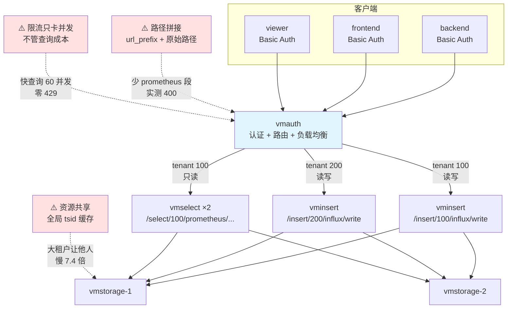

# 课 10：多租户与 vmauth

> **阶段 4：怎么横向扩展**（第 3 课 / 共 3 课，阶段收官）
> 上一课：[课 9 复制、去重与高可用](9-复制去重与高可用.md)
> 本阶段：[阶段 4 概览](README.md)
> 返回：[课程目录](../../02-课程目录.md) ｜ [学习路径总览](../../01-学习路径总览.md)

---

## 第一幕：场景引入

课 9 结束时，你的集群有了副本、有了去重、扛得住单节点故障。架构上看起来很完整了。

然后业务方找上门来。

**"我们也要用这套监控。"**

然后是第二个团队、第三个团队。

你很自然地想到：那就都写进来吧。于是你告诉三个团队：

> "你们用 tenant 1、2、3，别写混了就行。"

**第一天，一切正常。**

**第二周，出事了。**

后端团队在调试一个新服务，写了一段脚本，循环生成带随机标签的指标。一晚上，他们的数据量从几十万涨到了几千万条序列。

第二天早上：

- **前端团队的 Grafana 面板打不开了**——查询超时
- **算法团队的告警延迟了 20 分钟**——查询在排队
- **后端团队自己毫发无损**——他们的查询正常返回

你查了一圈，发现问题不是"后端团队写错了数据"，而是：

**他们把整个集群的共享资源吃光了。**

- 全局的 tsid 缓存被他们的高基数序列填满
- 其他租户的索引被挤出缓存，查询要重新读盘
- vmselect 的查询队列被占满

**而租户隔离，对此毫无帮助。**

更要命的是第二件事。

你被要求做权限控制。这时候你才发现一件可怕的事：

```
curl -X POST 'http://vminsert:8480/insert/999/influx/write' --data-binary @data.txt
```

**任何人，只要能访问到 vminsert 的地址，就能往任意租户写数据。**

不需要密码，不需要 token。租户 ID 就写在 URL 里，客户端想填几就填几。

我们实测过这个"裸奔"状态：

```
直接写 tenant 99: HTTP 204
直接读 tenant 99: HTTP 200
```

**集群的三个组件，默认没有任何认证。**

这一课要解决三个问题：

1. **租户模型** —— `accountID[:projectID]` 的完整语义与边界在哪
2. **vmauth** —— 怎么给集群加上认证、路由、负载均衡
3. **隔离的边界** —— 多租户到底隔离了什么，没隔离什么

我们会继续用课 8、课 9 搭好的集群，把每一条结论都跑出来。

---

## 第二幕：认知冲突

### 冲突一：配好了 vmauth，认证通过却还是 400

你照着文档写好配置，启动 vmauth，然后测试：

```
无凭证查询:            HTTP 401   ← 认证生效了
错密码查询:            HTTP 401   ← 认证生效了
正确凭证(backend)查询: HTTP 400   ← ？？？
```

**认证成功了，但请求失败。**

看一眼报错：

```
unsupported path requested: "/select/100/api/v1/query"
```

**路径少了一段。**

真实路径是 `/select/100/prometheus/api/v1/query`，中间那个 `prometheus` 去哪了？

**因为 vmauth 的路径拼接规则是：最终路径 = `url_prefix` + 原始请求路径。**

你写 `url_prefix: http://vmselect:8481/select/100/`，请求 `/api/v1/query`，拼出来就是 `/select/100/api/v1/query`——**少了协议段**。

**这个坑会连踩两次**，因为写入路径也有一模一样的问题：

```
unsupported path requested: "/insert/100/influx/api/v1/write"
```

`/api/v1/write` 是 **Prometheus 风格**，`/insert/<T>/influx/write` 是 **Influx 风格**。把 Prometheus 风格的路径拼到 Influx 风格的后端上，得到的路径两端都不认。

### 冲突二：租户隔离是硬的，但资源一点没隔离

你以为做了租户隔离，各团队就互不影响了。

我们做了这个实验：

```
1. 往 tenant 300 写 50 条序列
2. 测 tenant 300 的查询耗时: 0.001792s
3. 往 tenant 400 写 8000 条高基数序列
4. 再测 tenant 300 的查询耗时: 0.013223s   ← 慢了 7.4 倍
```

**tenant 300 什么都没做，只是旁边多了个大租户，查询就慢了 7 倍。**

同时，全局的 tsid 缓存从 **2932 涨到 10932**。

**数据隔离是硬的**——tenant 301 查 tenant 300 的数据，返回 0 条，一丝不漏。

**但资源完全没有隔离**——所有租户共享同一个 tsid 缓存、同一批 vmselect 查询队列、同一份磁盘 IO。

一个租户的高基数数据会把缓存挤满，其他租户的索引被换出，查询就得重新读盘。

这就是官方那句话的真正含义：

> *"The database performance and resource usage doesn't depend on the number of tenants. It depends mostly on the total number of active time series in all the tenants."*

**性能和资源取决于所有租户的活跃序列总数，而不是租户数量。**

换句话说：**多租户让你可以把多个团队的数据放在一起管理，但不会让一个坏邻居变得无害。**

### 冲突三：限流配上了，压测却一个都拦不住

既然资源不隔离，那就用 vmauth 限流。你加上 `-maxConcurrentPerUserRequests=2`，然后并发打 20 个请求：

```
HTTP 200 : 20 次    ← 一个 429 都没有
```

指标显示限制确实生效了：

```
vmauth_user_concurrent_requests_capacity{username="backend"} 2
```

**但就是拦不住。**

你加大压力：并发 60，队列时间砍到 100ms：

```
HTTP 200 : 60 次    ← 还是全过
```

**为什么？**

因为你的查询只要 **0.008 秒**。并发 60 个请求，每个 8 毫秒，它们**根本没有同时存在过**——vmauth 的并发计数器还没来得及累加，前一个请求就已经结束了。

**`-maxConcurrentPerUserRequests` 限制的是"同时在处理的请求数"，不是"速率"。**

快速查询永远不会触发它。

我们最后是这么测出来的：构造一个 **0.8 秒**的重查询（10 万条序列 + 7 天 range query），然后并发 40 个：

```
HTTP 200 : 4 次
HTTP 429 : 36 次    ← 终于拦住了
```

### 冲突的根源

三个冲突指向同一件事：**vmauth 是一个"HTTP 反向代理 + 认证层"，不是一个"资源治理系统"。**

- 它**只做字符串拼接**，不理解后端路径的语义 → 路径要你自己拼对（冲突一）
- 它**只做认证和路由**，不参与数据存储 → 资源隔离要靠架构，不能靠它（冲突二）
- 它**只限制并发数**，不理解查询成本 → 快查询永远触发不了限流（冲突三）

**vmauth 解决的是"谁能访问什么"，不是"谁能用多少"。**

后者需要的是企业版的租户级限流，或者架构层面的拆分。

---

## 第三幕：层层揭示

### 知识点 1：租户模型

**一句话定义**

VictoriaMetrics 集群版通过 URL 路径中的 `accountID[:projectID]` 实现多租户——两者都是 **32 位无符号整数**（实测 `2^32-1` 可写、`2^32` 报 400），数据**物理混存、逻辑隔离**，且**租户数据按哈希分散在所有 vmstorage 节点，无法固定到特定节点**。

#### 直觉建立

想象一栋公寓楼。

**物理层**：所有住户共用同一栋楼、同一套水电系统、同一个电梯。

**逻辑层**：每户有自己的门牌号（租户 ID）和钥匙。你用你的钥匙，只能开你家的门——看不到邻居家有什么。

**这就是 VictoriaMetrics 的多租户**：

- **门牌号** = `accountID[:projectID]`，写在 URL 里
- **钥匙** = 你能访问这个 URL（**但实际上，默认根本没有钥匙**——见第一幕）
- **共用部分** = tsid 缓存、查询队列、磁盘 IO

**关键推论**：楼里的水电是共用的。如果某户天天开浴缸放水，其他户的水压就会变小。

**再想一个细节**：这栋楼**没有"楼层"的概念**。

`accountID=7, projectID=9`（写作 `7:9`）**不是**"7 号楼的 9 层"。

它是**一个独立的门牌号**，和 `7:0`、`7:10`、`8:9` 都是平级关系。

#### 核心原理

**URL 结构**

```
写入: http://vminsert:8480/insert/<accountID>[:projectID]/<协议>/<端点>
查询: http://vmselect:8481/select/<accountID>[:projectID]/<协议>/<端点>
```

**实测：取值范围**

我们逐个测试了边界值：

| 租户 ID | 结果 | 说明 |
|---|---|---|
| `0` | 204 | 默认租户 |
| `1` | 204 | |
| `4294967295`（2³²-1） | 204 | **上限，可用** |
| `4294967296`（2³²） | 400 | 越界，拒绝 |
| `-1` | 400 | 负数非法 |
| `abc` | 400 | 非数字 |
| `1:2:3` | 400 | 最多两级 |
| `99999999999999999999` | 400 | 超长 |

**⚠️ 但有一个危险的例外**：

```
accountID=''  写入 HTTP 204
```

**空字符串不报错**，数据静默写入 tenant 0。

这和课 8 讲过的"省略租户 ID 归零"是同一个陷阱——如果你的 URL 拼接逻辑有个 bug 导致租户段为空，数据会悄悄进到 tenant 0，不报错、不告警。

**实测：projectID 是平级标识**

课 8 已验证过，本课复核：

```
查 7   : 20 个样本
查 7:0 : 20 个样本     ← 与 7 完全相同
查 7:9 : 10 个样本     ← 独立的租户
```

**`7` 等价于 `7:0`**，是一个独立的租户标识，**不是"7 号租户的汇总"**。

想查"accountID=7 下的所有 projectID"，没有这样的语法。

**实测：租户数据分散在所有节点**

这是课 8 遗留的一个疑问。我们往 tenant 66 写了 100 条序列，然后逐节点查：

```
vmstorage1 (8485): 100
vmstorage2 (8486): 100
集群聚合   (8481): 200
```

**两个节点各有完整的 100 条**——这是 RF=2 的副本（课 9）。

重点在于：**租户 66 的数据分散在所有 vmstorage 节点上**。

**结论**：一致性哈希只看 `metric name + labels`，**不看租户**（课 8 已验证）。

这带来一个直接的后果：

> **无法把某个租户的数据固定到特定节点。**

如果有超大租户想要物理隔离，**只能给它单独的集群**。

**单节点版 vs 集群版的路径差异**

这是迁移时最容易踩的坑。我们实测了两边：

| | 单节点版 | 集群版 |
|---|---|---|
| Influx 行协议 | `/write`、`/api/v1/import` | `/insert/<T>/influx/write` |
| remote write | `/api/v1/write` | `/insert/<T>/prometheus/api/v1/write` |
| 租户段 | **无** | **有** |

**两者完全不兼容。** 从单节点迁到集群，所有客户端的 URL 都要改。

#### 示例演示：验证租户隔离

```bash
# 往 tenant 300 写 50 条
curl -X POST --data-binary @data.influx \
  'http://localhost:8480/insert/300/influx/write'

# 分别查
查 tenant 300 : 100 个样本   ← 有（RF=2，50×2）
查 tenant 301 : 0 个样本     ← 无
查 tenant 0   : 0 个样本     ← 无
```

**注意 `100` 而不是 `50`**：这是课 9 的副本效应——无 dedup 时结果是 2 倍。

#### 常见误区

**误区 1：projectID 是 accountID 的下级**

不是。`7:9` 和 `7` 是**平级的独立租户**。

**误区 2：租户数增加会显著增加资源开销**

不会。官方明确说资源取决于**活跃序列总数**。加租户几乎不增加额外开销——这是 VictoriaMetrics 多租户的核心价值。

**误区 3：可以给某个租户单独分配节点**

不能。哈希不看租户，数据必然分散在所有节点。要物理隔离只能建独立集群。

**误区 4：多租户 = 资源隔离**

不是。这是本课最重要的结论，详见知识点 3。

> ⚠️ **类比失效的边界**：
> "公寓楼"类比暗示**每户有独立的水电表、独立的水压**。
> 实际差异：
> ① **没有独立配额**。所有租户共享同一份 tsid 缓存，实测一个大租户写入
> 让全局缓存从 2932 涨到 10932，其他租户查询慢 7.4 倍。
> ② **门牌号不是层级**。`7:9` 不是"7 号楼 9 层"，而是一个平级的独立标识——
> 类比里没有对应物。
> ③ **默认没有钥匙**。公寓楼至少有门锁，但 vminsert/vmselect 默认**无任何认证**，
> 任何人都能往任意租户写数据（实测 HTTP 204）。

#### 一句话记住

> **租户 ID 是 URL 里的 32 位整数（实测 2³²-1 可用、2³² 报 400），数据物理混存逻辑隔离、分散在所有节点无法固定；空租户 ID 不报错会静默进 tenant 0。**

---

### 知识点 2：vmauth 认证与路由

**一句话定义**

vmauth 是 VictoriaMetrics 官方的**认证代理与路由网关**——它按 Basic Auth 凭证把请求代理到固定租户，核心规则是**最终路径 = `url_prefix` + 原始请求路径**，多个 `url_prefix` 自动负载均衡，且**租户 ID 写死在服务端配置里，客户端无法自选**。

#### 直觉建立

想象公司的前台。

**没有前台时**：任何人都能直接走进办公区，推开任意一扇门。

**有前台后**：

1. 你报上姓名和密码（Basic Auth）
2. 前台查名单，确认你是谁
3. 前台根据你的身份，**带你去你该去的楼层**（路由到租户）
4. 你**不能自己说"我要去 5 楼"**——前台只按名单带你走

**这就是 vmauth 的核心机制**：

- **名单** = `-auth.config` 里的 `users` 列表
- **带你去** = `url_prefix`（租户 ID 写死在这里）
- **不能自选** = 客户端只认 `src_paths`，访问别的路径直接 400

**一个关键细节**：前台带你走的路线是**拼**出来的。

如果你告诉前台"带我去张三的工位"，前台会把你带到"**公司大楼地址** + **张三的工位**"。

**如果你给的地址少了一层（比如少了楼层号），你就到了一个不存在的地方。**

这就是我们连踩两次的坑。

#### 核心原理

**最小配置**

```yaml
users:
  - username: "backend"
    password: "backend-pass-123"
    url_map:
      # src_paths  = 客户端访问的路径（对外的样子）
      # url_prefix = 后端真实地址（租户 ID 写死在这里）
      # 最终路径   = url_prefix + 原始请求路径

      # 写入（Influx 行协议）
      - src_paths: ["/write"]
        url_prefix: ["http://vminsert-learn:8480/insert/100/influx"]
      # 写入（Prometheus remote write）
      - src_paths: ["/api/v1/write"]
        url_prefix: ["http://vminsert-learn:8480/insert/100/prometheus"]
      # 查询（负载均衡到两个 vmselect）
      - src_paths:
          - "/api/v1/query"
          - "/api/v1/query_range"
          - "/api/v1/labels"
        url_prefix:
          - "http://vmselect-learn:8481/select/100/prometheus"
          - "http://vmsel-dedup:8481/select/100/prometheus"
```

**启动**

```bash
docker run -d --name vmauth-learn \
  --network vm-cluster-net -p 8427:8427 \
  -v $PWD/vmauth-config.yml:/etc/vmauth/config.yml:ro \
  victoriametrics/vmauth:v1.151.0 \
  -auth.config=/etc/vmauth/config.yml \
  -httpListenAddr=:8427
```

**⚠️ 核心规则：路径拼接**

```
最终路径 = url_prefix + 原始请求路径
```

我们实测的两次失败：

| 配置 | 拼接结果 | 结果 |
|---|---|---|
| `url_prefix: .../select/100/`<br>请求 `/api/v1/query` | `/select/100/api/v1/query` | ❌ 400 少 `prometheus` |
| `url_prefix: .../insert/100/influx`<br>请求 `/api/v1/write` | `/insert/100/influx/api/v1/write` | ❌ 400 协议段错配 |

**正确的三种组合**：

| 用途 | src_paths | url_prefix | 拼接结果 |
|---|---|---|---|
| 查询 | `/api/v1/query` | `.../select/<T>/prometheus` | `/select/<T>/prometheus/api/v1/query` ✅ |
| 写入(Influx) | `/write` | `.../insert/<T>/influx` | `/insert/<T>/influx/write` ✅ |
| 写入(remote write) | `/api/v1/write` | `.../insert/<T>/prometheus` | `/insert/<T>/prometheus/api/v1/write` ✅ |

**记住这个口诀**：`url_prefix` 要补齐**协议段**（`prometheus` 或 `influx`），`src_paths` 只写**剩下的部分**。

**实测：认证矩阵**

```
无凭证:             HTTP 401
错密码:             HTTP 401
backend(正确):      HTTP 200
frontend(正确):     HTTP 200
viewer(正确):       HTTP 200
```

**实测：租户由凭证决定**

我们让 backend 写值 `100`、frontend 写值 `200`（同名序列 `l10_va`）：

```
backend  查到的值: ['100']
frontend 查到的值: ['200']
viewer   查到的值: ['100']    ← viewer 映射到 tenant 100

绕过 vmauth 直连后端核对:
  tenant 100: ['100']
  tenant 200: ['200']
```

**各自只看到自己的数据。**

**实测：客户端无法自选租户**

backend 尝试直接访问 tenant 200 的路径：

```
HTTP 400
user backend missing route for "/select/200/prometheus/api/v1/query"
```

**vmauth 只认 `src_paths` 里配置的路径。** 客户端想绕，路径不存在。

**实测：权限边界**

只读用户 viewer（配置里没有 write 路由）尝试写入：

```
HTTP 400
user viewer missing route for "/write"
```

**权限控制的原理很简单**：不给某个用户配置某条 `src_paths`，他就访问不了。

**负载均衡**

多个 `url_prefix` 会自动负载均衡，默认策略 `least_loaded`（最少连接）。

**⚠️ 负载均衡带来的隐蔽风险（实测发现）**

我们在实验中发现了一个非常隐蔽的问题。让 backend 连查 12 次**同一条查询**：

```
5 10 5 10 5 10 5 10 5 10 5 10     ← 在 5 和 10 之间规律跳变
```

**同一个查询，返回了两个不同的答案。**

**根因**：vmauth 在两个 vmselect 间轮询，而它们的 dedup 配置不同：

| 后端 | dedup 配置 | 同一查询的结果 |
|---|---|---|
| `vmselect-learn` | **无** | **10**（RF=2 翻倍） |
| `vmsel-dedup` | 30s | **5**（正确） |

这正是课 9 反复强调的结论——**RF=2 下无 dedup 查询结果翻倍**。

而 vmauth 的负载均衡把这个差异**放大成了"结果随机抖动"**。

**对照验证**：

```
viewer（只配了 1 个后端，无 dedup）：稳定返回 10
单后端 8489（dedup=5s）：           12 次全是 5
```

**一旦后端配置一致，结果立刻稳定。**

这是课 9 误区 4 的实锤证据：

> **所有 vmselect 的 dedup 配置必须一致，否则同一个查询打到不同的 vmselect 会返回不同结果。**

**这是最难排查的一类生产问题**——Grafana 面板刷新一下数字就变，而且变化"看起来很合理"（都是真实数据的倍数），没人会想到是负载均衡后端配置不一致。

**修复方法**：给所有 vmselect 配相同的 `-dedup.minScrapeInterval`。

**实测：故障自动摘除**

停掉其中一个后端 `vmsel-dedup`：

```
停前 backend 查询: HTTP 200
停掉 vmsel-dedup ...
停后 backend 查询: HTTP 200     ← 不中断
连查 3 次:        200 200 200
恢复后查询:       HTTP 200
```

**vmauth 会自动避开故障后端**——这正是课 9 提到的"负载均衡健康检查"的答案。

**热重载**

改配置不需要重启：

```bash
curl http://localhost:8427/-/reload
```

**实测**：把 viewer 从 tenant 100 改到 tenant 200，触发重载：

```
viewer 重载前查到的值: ['100']
触发 /-/reload: HTTP 200
viewer 重载后查到的值: ['200']     ← 立即生效
```

**可观测性**

vmauth 暴露了每用户的请求计数：

```
vmauth_user_requests_total{username="backend"}  25
vmauth_user_requests_total{username="frontend"} 3
vmauth_user_requests_total{username="viewer"}   4
```

这对**按租户统计用量**非常有用。

#### 示例演示：三种角色的完整配置

```yaml
users:
  # 可读写租户：backend → tenant 100
  - username: "backend"
    password: "backend-pass-123"
    url_map:
      - src_paths: ["/write"]
        url_prefix: ["http://vminsert-learn:8480/insert/100/influx"]
      - src_paths: ["/api/v1/query", "/api/v1/query_range"]
        url_prefix:
          - "http://vmselect-learn:8481/select/100/prometheus"
          - "http://vmsel-dedup:8481/select/100/prometheus"

  # 可读写另一个租户：frontend → tenant 200
  - username: "frontend"
    password: "frontend-pass-456"
    url_map:
      - src_paths: ["/write"]
        url_prefix: ["http://vminsert-learn:8480/insert/200/influx"]
      - src_paths: ["/api/v1/query", "/api/v1/query_range"]
        url_prefix:
          - "http://vmselect-learn:8481/select/200/prometheus"

  # 只读观察者：viewer → tenant 100，无写入路由
  - username: "viewer"
    password: "viewer-pass-000"
    url_map:
      - src_paths: ["/api/v1/query", "/api/v1/query_range"]
        url_prefix:
          - "http://vmselect-learn:8481/select/100/prometheus"
```

#### 常见误区

**误区 1：url_prefix 写到租户 ID 就够了**

不够。必须补齐协议段（`prometheus` / `influx`），否则拼出来的路径不存在。这是我们连踩两次的坑。

**误区 2：可以只用一个 src_paths 覆盖所有路径**

可以（用正则 `/api/v1/.*`），但**不推荐**。精细配置 `src_paths` 是权限控制的核心手段——粗放的通配会让只读用户也能写。

**误区 3：vmauth 能限制租户的写入量**

只能限制**并发请求数**，不能限制**数据量**（序列数、样本数）。详见知识点 3。

**误区 4：前端的 vmselect 和写入的 vminsert 可以混在一个 url_prefix**

不能。写入和查询是**不同的组件、不同的路径前缀**，必须分成两条 `url_map`。

**误区 5：改配置必须重启 vmauth**

不需要。`/-/reload` 热重载，实测立即生效。

> ⚠️ **类比失效的边界**：
> "公司前台"类比暗示**前台会检查你要办的事是否合理**。
> 实际差异：
> ① **前台不检查内容**。vmauth 只做路径匹配和转发，不理解请求体的语义，
> 也不校验你是要读还是要写——权限完全取决于 `src_paths` 配置。
> ② **前台会自己判断路线**。类比里前台知道每个楼层怎么走，vmauth 完全靠
> **字符串拼接**，拼错了就报 400，没有任何纠错。
> ③ **多个前台互不知情**。类比里前台之间会沟通，多个 vmauth 实例各自独立
> （都是无状态），需要外部负载均衡配合。

#### 一句话记住

> **vmauth 按 Basic Auth 身份把请求代理到固定租户（实测 backend 只见 100、frontend 只见 200），核心是路径拼接 `url_prefix + 原始路径`（要补协议段），客户端无法自选租户；多 url_prefix 自动负载均衡并摘除故障后端，改配置用 `/-/reload` 热重载。**

---

### 知识点 3：租户隔离的边界

**一句话定义**

VictoriaMetrics 的多租户提供**数据隔离**（硬边界，实测其他租户查不到），但**不提供资源隔离**——实测一个大租户写入 8000 条序列就让另一租户查询从 **0.0018s 慢到 0.0132s（7.4 倍）**，全局 tsid 缓存从 **2932 涨到 10932**；vmauth 只能限制**并发请求数**作为缓解。

#### 直觉建立

继续用公寓楼的类比，这次把"共用部分"讲清楚。

**数据隔离 = 每户的门锁**

你进不了邻居家，也看不到邻居家有什么。**这是硬的。**

**资源隔离 = 每户的水电表**

**不存在。** 全楼共用一个总水表、一个总电表、一个水箱。

某户天天开着浴缸放水，全楼的水压都会降。

**vmauth 的并发限制是什么？**

它相当于**限制每户同时能开几个水龙头**（比如最多 2 个）。

这能防止某一户一次开 20 个水龙头把水压抢光——**这是有效的缓解**。

但它**管不了每个水龙头开多大、开多久**。

某户开 2 个水龙头，但每个都是消防栓级别的大流量，水压照样被抢光。

**这就是为什么"限流"不等于"资源隔离"。**

#### 核心原理

**实测：数据隔离是硬的**

往 tenant 300 写 50 条序列（RF=2 → 100 个样本）：

```
查 tenant 300 : 100 个样本
查 tenant 301 : 0 个样本     ← 完全看不到
查 tenant 0   : 0 个样本     ← 完全看不到
```

**一丝不漏。**

**实测：资源完全共享**

这是本课最关键的实验：

```
1. 往 tenant 300 写 50 条序列
2. 测 tenant 300 查询耗时:    0.001792s
3. 往 tenant 400 写 8000 条高基数序列
4. 再测 tenant 300 查询耗时:  0.013223s    ← 慢了 7.4 倍
5. 全局 tsid 缓存:            2932 → 10932
```

**tenant 300 什么都没做，查询慢了 7.4 倍。**

机制是：**所有租户共享同一个 tsid 缓存**。

大租户的高基数序列填满了缓存，小租户的索引条目被换出（LRU），查询时就要重新读盘——于是变慢。

**注意那个缓存数字**：`vm_cache_entries{type="storage/tsid"}` 是**全局计数，不按租户拆分**。

**这意味着**：你**无法从指标上看出**是哪个租户在挤占缓存。

**vmauth 的并发限流（唯一的社区版缓解手段）**

vmauth 提供两个命令行参数：

| 参数 | 默认值 | 作用 |
|---|---|---|
| `-maxConcurrentRequests` | 1000 | 全局并发上限 |
| `-maxConcurrentPerUserRequests` | 100 | **每用户**并发上限 |
| `-maxQueueDuration` | 10s | 排队多久后返回 429 |

也支持在配置里按用户覆盖：

```yaml
users:
  - username: "big-tenant"
    password: "..."
    max_concurrent_requests: 5      # ← 单独给大租户更严的限制
    url_map: [...]
```

**⚠️ 实测：快查询永远触发不了限流**

这是很反直觉的一点。我们做了三轮压测：

| 轮次 | 查询耗时 | 并发数 | 限流配置 | 结果 |
|---|---|---|---|---|
| 第 1 轮 | 0.008s | 30 | per-user=2, queue=1s | **200×30，无 429** |
| 第 2 轮 | 0.008s | 60 | per-user=1, queue=100ms | **200×60，无 429** |
| 第 3 轮 | **0.8s** | 40 | per-user=2, queue=200ms | **200×4，429×36** |

**前两轮全部通过，一个都没拦住。**

**原因**：`-maxConcurrentPerUserRequests` 限制的是**同时在处理**的请求数。

查询只要 8 毫秒，60 个并发请求**根本没有同时存在过**——前一个结束后一个才开始。

**只有查询本身足够慢（我们这次是 0.8 秒），并发才会堆积，限流才会触发。**

**实测：限流是按用户隔离的**

这是最有价值的一条证据。我们让 backend 打满（走慢查询），同时让 frontend 发轻查询：

```
backend  (重查询, 限流=2):  200×4,  429×26
frontend (轻查询, 限流=2):  200×8           ← 完全不受影响
```

**一个租户被限流，不影响其他租户。**

这正是官方说的 *"This provides fairness and isolation between users"*——**公平性和用户间隔离**。

**⚠️ 顺带发现的另一个保护机制**

压测时我们遇到了 HTTP 422，查明后发现是 vmselect 的自我保护：

```
too many points for the given start=... and step=10000: 60481;
the maximum number of points is 30000;
(see -search.maxPointsPerTimeseries command-line flag)
```

**`-search.maxPointsPerTimeseries` 默认 30000** —— 单个时间序列一次查询最多返回 3 万个点。

step=10s 跨 7 天需要 60481 个点，超限被拒。

**这是 vmselect 层的保护，与租户无关**——任何租户触发同样的条件都会被拒。

**真正的资源隔离需要什么**

社区版做不到，可行方案只有：

1. **架构拆分**。超大租户用独立集群（课 8 已提到：哈希不看租户，无法在集群内隔离）。
2. **vmauth 并发限流**。缓解"一次开太多水龙头"，但管不了单次查询的成本。
3. **企业版功能**。官方企业版提供租户级的写入/查询限额。
4. **前置治理**。在 vmagent 或采集端做基数控制（课 4 的基数治理三层）。

**第四种其实最有效**——**问题要在源头解决，而不是在存储层补救**。

**其他边界**

| 能力 | 是否支持 | 实测 |
|---|---|---|
| 按租户查询数据 | ✅ | 数据隔离成立 |
| 按租户统计请求数 | ✅ | `vmauth_user_requests_total` |
| 按租户限制并发 | ✅ | 实测 429 生效 |
| 按租户限制数据量 | ❌ | 社区版无 |
| 按租户整体删除 | ❌ | 只能按 `match[]` 逐个删 |
| 单节点版多租户 | ❌ | 无 `/insert/<T>/` 路径 |

#### 示例演示：诊断"坏邻居"问题

当你发现某个租户查询变慢时，排查思路：

```bash
# 1. 确认是全局资源问题，不是该租户自己的数据问题
#    查全局 tsid 缓存
curl -s 'http://vmstorage:8482/metrics' \
  | grep 'vm_cache_entries{type="storage/tsid"'

# 2. 对比不同租户的查询耗时
#    （如果所有租户都变慢，说明是全局资源竞争）

# 3. 找出哪个租户贡献了最多序列
#    ⚠️ 注意：没有直接的按租户序列数指标，需要逐个查
curl -s --data-urlencode 'query=count({__name__=~".+"})' \
  'http://vmselect:8481/select/<T>/prometheus/api/v1/query'

# 4. 缓解：给大租户加并发限制
#    vmauth 配置里加 max_concurrent_requests
```

**关键难点**：第 3 步没有好办法。VictoriaMetrics **不提供按租户的资源用量指标**，只能逐租户查。

这也是为什么**前置治理**（课 4）比事后补救更重要。

#### 常见误区

**误区 1：配了 vmauth 限流就不用担心大租户了**

不够。限流只限制**并发数**，不限制**单次查询的成本**和**总数据量**。

一个大租户用 2 个并发跑超重查询，照样能拖慢所有人。

**误区 2：限流配置好就会生效**

不一定。实测：查询 8 毫秒时，60 并发也拦不住。**只有慢查询才会触发。**

**误区 3：多租户能降低总体资源开销**

不能。官方明确说资源取决于**所有租户的活跃序列总数**。多租户的价值是**管理便利性**，不是**资源节省**。

**误区 4：可以用 vmstorage 的指标看出是哪个租户占用资源**

不能。tsid 缓存等指标是全局的，不按租户拆分。

> ⚠️ **类比失效的边界**：
> "限制每户同时开几个水龙头"类比暗示**限流能有效保护其他住户**。
> 实际差异：
> ① **管不了流量大小**。限流只卡并发数，一个大租户用 2 个并发跑重查询，
> 照样拖慢所有人（这是类比里没有的情况）。
> ② **快请求完全绕过限流**。类比里水龙头打开总要占一会儿，
> 但 8 毫秒的查询根本不形成并发堆积——实测 60 并发零 429。
> ③ **限流点在前台，不在管道**。vmauth 只能卡住经过它的请求，
> 如果有人直连 vmselect（绕过 vmauth），限流完全失效。

#### 一句话记住

> **多租户只给数据隔离（实测其他租户查不到），不给资源隔离（实测大租户让他人查询慢 7.4 倍、全局缓存 2932→10932）；vmauth 只能限并发（实测慢查询 429×36、快查询 60 并发零拦截），真正的隔离要靠独立集群或源头治理。**

---

## 第四幕：实操验证

### 实验 1：租户 ID 的边界

**目标**：确认取值范围与非法值的处理。

```bash
cd /mnt/d/projects/learning/victoriametrics/playground
bash l10-tenant-model.sh
```

**本机实测**：

```
accountID=0            写入 HTTP 204
accountID=2147483647   写入 HTTP 204
accountID=4294967295   写入 HTTP 204    ← 2^32-1，上限
accountID=4294967296   写入 HTTP 400    ← 2^32，越界
accountID='-1'         写入 HTTP 400
accountID='abc'        写入 HTTP 400
accountID=''           写入 HTTP 204    ← ⚠️ 静默进 tenant 0
accountID='1:2:3'      写入 HTTP 400
```

**判据**：`2^32-1` 可用、`2^32` 拒绝；空字符串**不报错**（危险）。

### 实验 2：projectID 的语义

**目标**：复核课 8 的"平级标识"结论。

**本机实测**：

```
查 7   : 20
查 7:0 : 20     ← 与 7 完全相同
查 7:9 : 10     ← 独立租户
```

**判据**：`7` 与 `7:0` 结果相同，说明 `7` 等价于 `7:0`。

### 实验 3：租户数据分布

**目标**：验证租户数据分散在所有节点。

**本机实测**（tenant 66，100 条序列）：

```
vmstorage1 (8485): 100
vmstorage2 (8486): 100
集群聚合   (8481): 200
```

**判据**：两个节点各有完整 100 条（RF=2 副本），证明**分散存储、无法固定到特定节点**。

### 实验 4：部署 vmauth（含踩坑）

**目标**：跑通认证与租户路由。

```bash
bash l10-vmauth-final.sh
```

**⚠️ 必踩的两个坑**（我们的排查脚本 `l10-debug-vmauth.sh`、`l10-debug-write.sh` 完整记录了）：

```
坑 1: unsupported path requested: "/select/100/api/v1/query"
     → url_prefix 少了 prometheus 段

坑 2: unsupported path requested: "/insert/100/influx/api/v1/write"
     → /api/v1/write 是 Prometheus 风格，拼到 influx 后端上
```

**本机实测（修复后）**：

```
无凭证:             HTTP 401
错密码:             HTTP 401
backend(正确):      HTTP 200
frontend(正确):     HTTP 200
```

**判据**：无凭证和错密码必须 401，正确凭证必须 200。

### 实验 5：租户由凭证决定

**目标**：验证核心机制。

**本机实测**：

```
backend  查到的值: ['100']
frontend 查到的值: ['200']
viewer   查到的值: ['100']

绕过 vmauth 直连后端核对:
  tenant 100: ['100']
  tenant 200: ['200']
```

**判据**：各自只看到自己的值，且与直连后端的结果一致。

**权限边界实测**：

```
viewer 尝试写入:       HTTP 400 (user viewer missing route for "/write")
backend 尝试自选租户:   HTTP 400 (user backend missing route for "/select/200/...")
```

### 实验 6：数据隔离 vs 资源共享（本课核心）

**目标**：证明数据隔离成立，但资源完全共享。

```bash
bash l10-isolation.sh
```

> ⚠️ **注意**：本实验会往 tenant 400 写入 8000 条高基数序列，用于制造"大租户"场景。

**本机实测**：

```
数据隔离:
  查 tenant 300 : 100
  查 tenant 301 : 0      ← 隔离成立
  查 tenant 0   : 0

资源共享:
  写入前 tenant 300 查询耗时: 0.001792s
  往 tenant 400 写 8000 条
  写入后 tenant 300 查询耗时: 0.013223s    ← 慢 7.4 倍
  全局 tsid 缓存:           2932 → 10932
```

**判据**：tenant 300 没有任何变化，但查询变慢——**这就是坏邻居效应**。

### 实验 7：vmauth 限流（三次才测出）

**目标**：验证并发限流与按用户隔离。

```bash
bash l10-ratelimit-heavy.sh      # 最终成功的版本
bash l10-ratelimit-slow.sh       # 前两次失败的尝试（保留作为教训）
```

**⚠️ 前两轮会失败**，因为查询只有 8 毫秒，并发不堆积。

**本机实测**：

```
第 1 轮 (查询 0.008s, 并发 30, per-user=2):  200×30, 无 429
第 2 轮 (查询 0.008s, 并发 60, per-user=1):  200×60, 无 429
第 3 轮 (查询 0.8s,   并发 40, per-user=2):  200×4,  429×36   ← 成功

按用户隔离:
  backend  (重查询):  200×4,  429×26
  frontend (轻查询):  200×8            ← 完全不受影响
```

**判据**：必须先用重查询把单次耗时拉到秒级，否则限流不会触发。

### 实验 8：故障摘除与高可用

**目标**：验证 vmauth 的负载均衡健康检查。

```bash
bash l10-ratelimit-ha.sh
```

> ⚠️ **生产提示**：下面停掉的是**查询节点与 vmauth 实例**。生产环境请先确认前端负载均衡已摘除流量，或选择低峰期。

**本机实测**：

```
停掉 vmsel-dedup:
  停前 backend 查询: HTTP 200
  停后 backend 查询: HTTP 200     ← 不中断
  恢复后查询:       HTTP 200

停掉 vmauth-learn:
  经 vmauth-learn(已停): HTTP 000
  经 vmauth-2:           HTTP 200
```

**判据**：停掉任一后端或 vmauth 实例，查询必须不中断。

### 实验 9：热重载

**目标**：验证改配置无需重启。

**本机实测**：

```
viewer 重载前查到的值: ['100']
触发 /-/reload: HTTP 200
viewer 重载后查到的值: ['200']     ← 立即生效
```

**判据**：重载后同一凭证访问到不同租户的数据。

---

### 实验 10：负载均衡导致结果不一致（重要发现）

**目标**：验证多个 dedup 配置不同的后端会造成结果抖动。

```bash
bash l10-verify-inconsistency.sh
```

**本机实测**：

```
经 vmauth 连查 12 次（backend，同一条查询）：
  5 10 5 10 5 10 5 10 5 10 5 10     ← 规律跳变

对照：
  viewer（单后端，无 dedup）：稳定 10
  单后端 8489（dedup=5s）：    12 次全 5
```

**判据**：若同一查询多次执行结果不同，说明**后端 dedup 配置不一致**。

**这是课 9 误区 4 的实锤证据**，也是生产环境最难排查的问题之一。

---

## 第五幕：体系收束

### 一图总结



### 三个知识点的联系

```
知识点1 租户模型  ──→  accountID[:projectID] 提供逻辑边界
        │              实测：2^32-1 可用；空 ID 静默进 tenant 0
        │              局限：数据分散所有节点，无法物理隔离
        ↓
知识点2 vmauth    ──→  补上缺失的认证层
        │              实测：backend 只见 100、frontend 只见 200
        │              机制：租户写死在服务端，客户端无法自选
        │              代价：路径拼接要自己拼对（连踩两次 400）
        ↓
知识点3 隔离边界  ──→  揭示还剩什么没解决
                       数据隔离 ✅ 硬边界
                       资源隔离 ❌ 实测慢 7.4 倍
                       唯一缓解：vmauth 限并发（且只卡慢查询）
```

### 阶段 4 的完整故事

三课串起来，回答了同一个问题：**监控系统怎么扛住规模？**

| 课 | 解决的问题 | 引入的新问题 |
|---|---|---|
| **课 8** | 单机容量不够 → 集群分片 | 节点故障会**静默少一半数据** |
| **课 9** | 数据丢失 → 复制因子 | 副本导致**查询翻倍**；dedup 又会**误删** |
| **课 10** | 多团队共用 → 租户隔离 | 只有**数据隔离**，没有**资源隔离** |

**每一课解决一个问题，也引入一个新问题。这是分布式系统的常态。**

**但有一条主线贯穿三课**：

> **VictoriaMetrics 的取舍是一致的——用"较弱的一致性/隔离保证"换取"极低的资源占用和运维复杂度"。**

- 课 8：shared-nothing 架构，节点互不通信 → 简单，但故障会静默降级
- 课 9：复制是写入时尽力而为 → 简单，但不自动补副本
- 课 10：多租户共享资源 → 高效，但有坏邻居问题

**理解了这个取舍，你就理解了 VictoriaMetrics 的设计哲学。**

### 你现在会了什么

完成这一课后，你应该能够：

1. **设计租户方案**：知道 `accountID[:projectID]` 的语义、边界、以及"空 ID 静默进 tenant 0"的陷阱
2. **部署 vmauth**：能写出正确的配置，特别是**路径拼接规则**
3. **做权限控制**：用 `src_paths` 实现读写分离、按租户授权
4. **诊断坏邻居**：能从全局 tsid 缓存和跨租户延迟对比中识别资源竞争
5. **配置限流**：知道 `-maxConcurrentPerUserRequests` 的作用与局限
6. **做高可用**：vmauth 多实例 + 自动故障摘除 + 热重载

### 关键伏笔

1. **如何真正限制单租户的资源？**
   社区版没有答案。可行的路是**前置治理**——在 vmagent 采集端做基数控制。
   课 11 的 **vmagent** 正是这个位置，它支持 `relabel_configs` 和基数限制。

2. **`vm_account_id` 标签到底怎么用？**
   课 8 发现它在普通端点不生效，需要走 `/insert/multitenant/...`。
   本课没展开这个端点——它属于**单集群多租户的动态分配**场景，与 vmauth 的静态绑定是两种思路。

3. **vmauth 的 TLS 和更高级的认证方式？**
   本课只用了 Basic Auth。生产环境通常需要 TLS（`-tls`、`-tlsCertFile`）和 `/admin` 端点的访问控制。

4. **多集群之间怎么迁移数据？**
   课 10 提到"超大租户用独立集群"，但没讲怎么迁。
   课 12 的**备份恢复与迁移**会讲 `vmbackup` / `vmrestore`。

5. **为什么 VictoriaMetrics 不做资源隔离？**
   这是设计取舍：资源隔离需要持续的配额追踪和 enforcement，会显著增加复杂度和开销。
   这与课 6/7（存储压缩的取舍）、课 9（不用 Raft 的取舍）是**同一条设计哲学**。

---

## 课后小测

<details>
<summary><b>题目 1</b>：你配好了 vmauth，认证也通过了（无凭证返回 401，正确凭证不再 401），但查询返回 400，报错是 <code>unsupported path requested: "/select/100/api/v1/query"</code>。哪里错了？</summary>

**答案**：**`url_prefix` 少了一层——缺 `prometheus` 协议段。**

**原因**：vmauth 的路径拼接规则是：

```
最终路径 = url_prefix + 原始请求路径
```

你的配置大概是：

```yaml
url_prefix: ["http://vmselect:8481/select/100/"]
src_paths:  ["/api/v1/query"]
```

拼出来是：

```
/select/100/ + /api/v1/query = /select/100/api/v1/query
```

**但集群版的真实路径是 `/select/100/prometheus/api/v1/query`。**

中间那个 `prometheus` 是**协议段**，用来区分 Prometheus / Influx / Graphite 等不同协议后端。

**修复**：把协议段补到 `url_prefix` 里：

```yaml
url_prefix: ["http://vmselect:8481/select/100/prometheus"]   # ← 补上
src_paths:  ["/api/v1/query"]
```

**这个坑会连踩两次**，因为写入路径也一模一样：

```
错误: url_prefix .../insert/100/influx  + /api/v1/write
      = /insert/100/influx/api/v1/write
      → unsupported path requested

原因: /api/v1/write 是【Prometheus 风格】
      /insert/<T>/influx/write 是【Influx 风格】
      把 A 风格的路径拼到 B 风格的后端上，两端都不认
```

**正确的三种组合**：

| 用途 | src_paths | url_prefix | 拼接结果 |
|---|---|---|---|
| 查询 | `/api/v1/query` | `.../select/<T>/prometheus` | `/select/<T>/prometheus/api/v1/query` ✅ |
| 写入(Influx) | `/write` | `.../insert/<T>/influx` | `/insert/<T>/influx/write` ✅ |
| 写入(remote write) | `/api/v1/write` | `.../insert/<T>/prometheus` | `/insert/<T>/prometheus/api/v1/write` ✅ |

**口诀**：`url_prefix` 补齐**协议段**，`src_paths` 只写**剩下的部分**。

我们实测时这两个坑都踩了，排查脚本 `l10-debug-vmauth.sh` 和 `l10-debug-write.sh` 完整记录了过程。

</details>

<details>
<summary><b>题目 2</b>：三个团队共用一个集群，用 vmauth 做了租户隔离。最近前端团队的 Grafana 面板越来越慢。你查了前端团队自己的数据量，没有明显增长。问题可能出在哪？怎么验证？</summary>

**答案**：**大概率是"坏邻居"效应——其他租户的高基数数据挤占了共享缓存。**

**原因**：VictoriaMetrics 的多租户只提供**数据隔离**，不提供**资源隔离**。

所有租户共享：

- 同一份 **tsid 缓存**（序列 ID 索引）
- 同一批 **vmselect 查询队列**
- 同一份**磁盘 IO**

当某个租户写入大量高基数序列时，全局 tsid 缓存被填满，其他租户的索引条目被 LRU 换出——查询就要重新读盘，于是变慢。

**我们用实验量化过这个效应**：

```
1. 往 tenant 300 写 50 条序列
2. 测 tenant 300 查询耗时:    0.001792s
3. 往 tenant 400 写 8000 条高基数序列
4. 再测 tenant 300 查询耗时:  0.013223s    ← 慢了 7.4 倍
5. 全局 tsid 缓存:            2932 → 10932
```

**tenant 300 什么都没做，查询慢了 7.4 倍。**

**怎么验证**：

```bash
# 1. 看全局 tsid 缓存是否异常增长
curl -s 'http://vmstorage:8482/metrics' \
  | grep 'vm_cache_entries{type="storage/tsid"'
#    ⚠️ 这是【全局】计数，不按租户拆分

# 2. 对比多个租户的查询耗时
#    如果【所有租户都变慢】，说明是全局资源竞争
#    如果只有前端慢，那才是他们自己的问题

# 3. 找出是谁贡献了最多序列（逐个租户查）
for t in 100 200 300; do
  curl -s --data-urlencode 'query=count({__name__=~".+"})' \
    "http://vmselect:8481/select/$t/prometheus/api/v1/query"
done
```

**⚠️ 排查的难点**：VictoriaMetrics **不提供按租户的资源用量指标**。

tsid 缓存、内存、磁盘 IO 都是全局的，你只能逐租户去查，或者二分法排查。

**怎么缓解**：

1. **给大租户加并发限制**（vmauth）：

   ```yaml
   users:
     - username: "big-tenant"
       max_concurrent_requests: 5    # ← 单独给更严的限制
   ```

2. **源头治理**（最有效）：在采集端用 `relabel_configs` 丢弃高基数标签（课 4 的基数治理三层）。

3. **架构拆分**：超大租户用独立集群。哈希不看租户，无法在集群内做物理隔离。

**⚠️ 注意限流的局限**：`-maxConcurrentPerUserRequests` 只限制**并发数**，不限制**单次查询的成本**。

我们实测过：查询耗时 8 毫秒时，**60 个并发也拦不住一个**（全 200）。

只有把查询拉到 0.8 秒，并发才会堆积，429 才会触发（实测 40 并发 → 429×36）。

</details>

<details>
<summary><b>题目 3</b>：你给 vmauth 配了 <code>-maxConcurrentPerUserRequests=2</code>，然后并发打了 20 个请求测试限流。结果全是 200，一个 429 都没有。指标显示 <code>vmauth_user_concurrent_requests_capacity{username="backend"} 2</code>，配置确实生效了。为什么拦不住？</summary>

**答案**：**因为你的查询太快了——`-maxConcurrentPerUserRequests` 限制的是"同时在处理的请求数"，不是"速率"。**

**关键理解**：

这个参数的意思是：**同一时刻，该用户最多有 2 个请求在后端处理中**。超出的**排队**等待，排了 `-maxQueueDuration`（默认 10s）还没轮到，才返回 429。

**如果你的查询只要 8 毫秒**：

```
请求 1: [====]              0-8ms
请求 2: [====]              0-8ms
请求 3:      [====]         8-16ms   ← 前两个已结束，没超并发
请求 4:      [====]         8-16ms
...
```

20 个请求，每个 8 毫秒，它们**根本没有同时存在过**——并发计数器还没到 2，前一个就已经结束了。

**我们的实测三轮**：

| 轮次 | 单次查询耗时 | 并发数 | 限流配置 | 结果 |
|---|---|---|---|---|
| 第 1 轮 | 0.008s | 30 | per-user=2, queue=1s | **200×30，零 429** |
| 第 2 轮 | 0.008s | 60 | per-user=1, queue=100ms | **200×60，零 429** |
| 第 3 轮 | **0.8s** | 40 | per-user=2, queue=200ms | **200×4，429×36** |

**只有把查询拉到秒级，并发才会堆积，限流才会触发。**

**怎么造一个慢查询来测试**：

```bash
# 用 range query + 长跨度 + 大量序列
# 我们用的是：10 万条序列 + 7 天跨度 + rate 聚合
HEAVY='sum(rate(l10_heavy_value[5m])) by (shard)'
curl -G -u backend:backend-pass-123 \
  --data-urlencode "query=$HEAVY" \
  --data-urlencode "start=$(( $(date +%s) - 86400*7 ))" \
  --data-urlencode "end=$(date +%s)" \
  --data-urlencode "step=60" \
  'http://localhost:8419/api/v1/query_range'
```

单发耗时约 **0.8 秒**，这时并发 40 就能触发 429。

**⚠️ 顺带提醒一个相关的坑**：

压测时你可能会遇到 **HTTP 422**，报错是：

```
too many points for the given start=... and step=10000: 60481;
the maximum number of points is 30000;
(see -search.maxPointsPerTimeseries command-line flag)
```

这是 vmselect 的自我保护——**单个时间序列一次查询最多返回 3 万个点**（默认）。

step=10s 跨 7 天需要 60481 个点，超限被拒。

**这个限制与租户无关**，任何租户触发同样条件都会被拒。要改的话调整 `-search.maxPointsPerTimeseries`。

**回到限流的本质**：

> **vmauth 的并发限流解决的是"一次开太多水龙头"，
> 但管不了"每个水龙头开多大"。**

一个大租户用 2 个并发跑超重查询，照样能拖慢所有人。

**好消息是限流确实是按用户隔离的**——我们实测：

```
backend  (重查询, 限流=2):  200×4,  429×26
frontend (轻查询, 限流=2):  200×8            ← 完全不受影响
```

**一个租户被限流，不影响其他租户。** 这是它真正的价值。

</details>

---

## 🐞 常见误区（本课专属）

### 1. url_prefix 只写到租户 ID

**现象**：认证通过但返回 400，报 `unsupported path requested`。

**原因**：缺协议段（`prometheus` / `influx`）。

**实测**：`/select/100/api/v1/query` → 400；补上 `prometheus` → 200。

**正确做法**：`url_prefix` = `后端地址 + /select/<T>/prometheus`。

### 2. 把 Prometheus 风格路径拼到 Influx 后端

**现象**：写入 400，报 `/insert/100/influx/api/v1/write` 不存在。

**原因**：`/api/v1/write` 是 Prometheus 风格，拼到 `influx` 后端上。

**正确做法**：Influx 行协议用 `src_paths: ['/write']` + `url_prefix: .../influx`。

### 3. 以为空租户 ID 会报错

**现象**：数据静默进了 tenant 0。

**实测**：`accountID=''` 返回 **HTTP 204**，不报错。

**正确做法**：URL 拼接逻辑要做非空校验；定期检查 tenant 0 有无异常数据。

### 4. 以为多租户等于资源隔离

**现象**：某租户查询莫名变慢。

**实测**：大租户写入让他人查询从 0.0018s 慢到 0.0132s（7.4 倍）。

**正确做法**：接受这个限制，用限流 + 源头治理缓解，超大租户拆独立集群。

### 5. 以为配了限流就会拦住大租户

**现象**：压测全是 200，零 429。

**原因**：查询太快，并发不堆积。

**实测**：8 毫秒查询 × 60 并发 = 零 429；0.8 秒查询 × 40 并发 = 429×36。

**正确做法**：用**秒级重查询**测试限流；生产环境关注慢查询而非并发数。

### 6. 用通配 src_paths 图省事

**现象**：只读用户也能写入。

**原因**：`/api/v1/.*` 之类通配把所有路径都开放了。

**正确做法**：精细配置 `src_paths`，这是权限控制的核心手段。

### 7b. 负载均衡的后端 dedup 配置不一致

**现象**：Grafana 刷新一下数字就变，且变化看起来"很合理"。

**原因**：vmauth 轮询到不同 vmselect，而它们的 dedup 配置不同。

**实测**：连查 12 次得到 `5 10 5 10 5 10 5 10 5 10 5 10`（无 dedup 的后端返回 10，有的返回 5）。

**正确做法**：**所有 vmselect 配相同的 `-dedup.minScrapeInterval`**。这是最难排查的一类问题。

### 8. 以为改配置必须重启 vmauth

**现象**：重启导致短暂不可用。

**原因**：不知道有热重载。

**实测**：`/-/reload` 返回 200，配置立即生效（viewer 从 tenant 100 切到 200）。

**正确做法**：改完配置 `curl http://vmauth:8427/-/reload`。

### 8. 忽略单节点与集群的路径差异

**现象**：迁移后客户端全部 400。

**实测**：单节点 `/write` vs 集群 `/insert/<T>/influx/write`。

**正确做法**：迁移时同步修改所有客户端 URL。

### 9. 以为能查出每个租户的资源用量

**现象**：想定位是哪个租户占用资源，却查不到。

**原因**：tsid 缓存等指标是全局的，不按租户拆分。

**正确做法**：用 vmauth 的 `vmauth_user_requests_total` 统计**请求数**；资源用量只能逐租户查。

### 10. 一句话总结本课的测量教训

> **url_prefix 要补协议段（prometheus/influx），空租户 ID 静默归零；多租户只隔离数据不隔离资源（实测慢 7.4 倍）；限流只卡并发不卡成本，测它必须用秒级慢查询。**

---

## 🚀 下一批接力提示词

```text
我想学习 VictoriaMetrics，我已完成 课 1-10（阶段 1、2、3、4 全部完成，
进入阶段 5：生产落地）。

已完成的知识：
- Prometheus 五个天花板；VM 起源；单节点部署（课 1-2）
- MetricsQL 与 PromQL 六类差异、rate 失真、MetricsQL 是单向门（课 3）
- remote write 生产配置、多协议接入、基数治理三层（课 4）
- 存储结构：data/small + data/big + data/indexdb；parts.json 原子注册；
  TSID + 倒排索引；后台合并台阶式（课 5）
- 压缩三层流水线：列式布局 + 值编码 + ZSTD（课 6）
- 缓存分层；内存模型；hour_metric_ids 跳过 97.5%；fastcache 落盘（课 7）
- 集群三件套；一致性哈希分片；多租户隔离基础（课 8）
- 复制因子、dedup 去重、高可用部署与故障演练（课 9）
- 租户模型、vmauth 认证与路由、租户隔离的边界（课 10）

请开始 课 11（阶段 5 第 1 课），建议覆盖：
1. vmagent 抓取与持久化队列
2. vmalert 告警与记录规则
3. 与 Prometheus/Alertmanager 的兼容与差异

背景：我已有 PromQL 基础，学过 InfluxDB（本仓库 influxdb3/ 课程）。

实操环境：WSL Ubuntu + Docker。

现有容器：
- 单节点：vm-learn（victoriametrics/victoria-metrics:latest，端口 8428）
- 集群（课 8 搭建，课 9/10 扩展，保持运行状态）：
  - vmstorage-learn  (v1.151.0-cluster, 8482/8400/8401, cluster-data/storage)
  - vmstorage-learn2 (v1.151.0-cluster, 8492/8410/8411, cluster-data/storage2)
  - vminsert-learn   (v1.151.0-cluster, 8480, RF=2)
  - vminsert-learn2  (v1.151.0-cluster, 8488, RF=2)
  - vmselect-learn   (v1.151.0-cluster, 8481, 无 dedup)
  - vmsel-n1 (8485, 只连 vmstorage1)  ← 逐节点验证用
  - vmsel-n2 (8486, 只连 vmstorage2)
  - vmsel-dedup (8487, dedup=30s)
  - vmsel-d5   (8489, dedup=5s)
  - vmsel-slow  (8423, maxConcurrentRequests=1)  ← 课 10 压测用
  - vmsel-slow2 (8420, dedup=30s)                ← 课 10 压测用
  - vmauth-learn  (v1.151.0, 8427, 主实例，3 用户)
  - vmauth-2      (v1.151.0, 8425)
  - vmauth-limit  (v1.151.0, 8426, per-user 并发=2)
  - vmauth-strict (v1.151.0, 8424, per-user 并发=1)
  - vmauth-t / vmauth-e4 (8421/8419, 课 10 限流压测用)
  - Docker 网络：vm-cluster-net
- Prometheus: prom-learn（v2.53.0，端口 9090）

⚠️ 实验数据时间戳必须用过去时间（NOW-120 起），否则 count() 查不到。

⚠️ 验证历史数据用 count_over_time(m[大窗口]) 或 range query，
   不要用 count()（课 6、课 8 各踩过一次坑）。

⚠️ 容器刚启动/刚恢复时不要立刻写入，等 10~20 秒让节点稳定，
   否则会误判"副本没生效"（课 9 踩过：101 vs 200）。

⚠️ RF=2 下无 dedup 查询结果会翻倍，对比数据时要注明用的是哪个 vmselect
   （课 9 踩过：600 vs 300）。

课 10 实测的关键基线（课 11 可直接引用）：
- 租户 ID：2^32-1 可用，2^32 报 400；空 ID 静默进 tenant 0（HTTP 204）
- projectID 是平级标识：7 等价于 7:0，与 7:9 独立
- 租户数据分散在所有 vmstorage，无法固定到特定节点
- vmauth 认证：无凭证/错密码 401，正确 200
- 租户绑定：backend 只看到 100，frontend 只看到 200
- 权限边界：无 write 路由 → 400 "missing route"
- 路径拼接规则：url_prefix + 原始路径（必须补 prometheus/influx 段）
- 数据隔离 ✅ / 资源隔离 ❌：大租户让他人查询慢 7.4 倍（0.0018s→0.0132s）
- 限流：快查询(8ms) 60 并发零 429；慢查询(0.8s) 40 并发 → 429×36
- 限流按用户隔离：backend 429×26 时 frontend 全 200
- 故障摘除：停掉任一 vmselect 后端，查询不中断
- 热重载：/-/reload 立即生效（viewer 从 100 切到 200）
- -search.maxPointsPerTimeseries 默认 30000（超时会返 422）
- ⚠️ 负载均衡结果抖动：vmauth 轮询到不同 dedup 配置的 vmselect 时，
  同一查询连查 12 次得 5/10 交替（无 dedup 后端返 10）；
  viewer 因只有 1 个后端而稳定返 10。修复=统一所有后端 dedup 配置
- ⚠️ instant query 5 分钟窗口陷阱：查历史数据必须用 count_over_time
  或 range query，否则 seriesFetched=0 的空结果会被误判为"数据丢了"
  （本课自检时踩过一次）

课 10 遗留的未闭环疑问（可在课 11 或后续解答）：
- /insert/multitenant/... 端点未展开（vm_account_id 标签的动态租户分配）
- vmauth 的 TLS 与 /admin 端点访问控制未讲
- 单租户资源限额需要企业版，社区版只能靠 vmauth 并发限流 + 源头治理
- 多集群数据迁移（课 12 的 vmbackup/vmrestore）

已有实验数据：l3_*、l04_*、l05_*、l06_*、l07_*、l08_*、l09_*、l10_*

请按 topic-teach skill 的五幕结构 + 知识点六要素撰写，
每条命令必须真跑验证，并在写完后执行双 agent（pedagogy + learner）评审。
```

---

## 🧭 课程导航

- **上一课**：[课 9 复制、去重与高可用](9-复制去重与高可用.md)
- **阶段完成**：课 8-10 构成完整故事（分片 → 复制 → 多租户）
- **下一阶段**：[阶段 5：生产落地](../5-生产落地/README.md) → 课 11（vmagent 与 vmalert）
- **本阶段**：[阶段 4 概览](README.md)
- **返回**：[课程目录](../../02-课程目录.md) ｜ [学习路径总览](../../01-学习路径总览.md)
