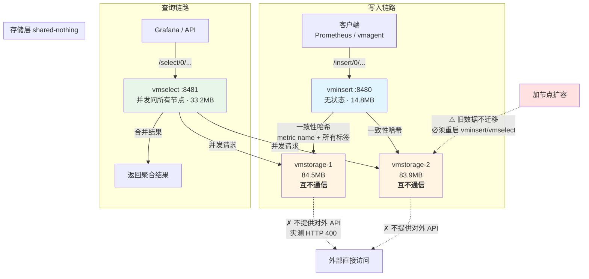

# 课 8：集群三件套与最小集群实战

> **阶段 4：怎么横向扩展**（第 1 课 / 共 3 课，**阶段开篇**）
> 上一课：[课 7 内存模型与容量规划](../3-凭什么快凭什么省/7-内存模型与容量规划.md)（阶段 3 收官）
> 下一课：课 9（复制、去重与高可用）
> 本阶段：[阶段 4 概览](README.md)
> 返回：[课程目录](../../02-课程目录.md) ｜ [学习路径总览](../../01-学习路径总览.md)

---

## 第一幕：场景引入

你的单节点 VictoriaMetrics 已经跑了半年。

一开始很顺。Prometheus remote write 接进来，Grafana 面板刷刷地出图，磁盘占用只有老 Prometheus 的七分之一。你在周会上汇报了这个数字，领导很满意。

然后业务开始涨。

先是采集目标从 200 个涨到 2000 个。然后是采集间隔从 60 秒压到 15 秒。某天早上你打开 Grafana，发现**查询要转十几秒**，面板一片超时。

你去看监控，发现：

```
活跃序列:      800 万
写入速率:      120 万样本/秒
CPU 使用率:    92%
内存使用率:    88%
磁盘 IO wait:  持续高位
```

你加内存、加 CPU、换 NVMe 硬盘。撑了三个月，又到顶了。

这时候你面临一个选择：

**继续加机器（纵向扩展），还是换成集群版（横向扩展）？**

先看一组数字。你在课 7 已经知道：

- 每百万活跃序列约需 **1 GB 内存 + 1 核 CPU**
- 单节点建议**不超过 1000 万活跃序列**

你现在 800 万，距离上限只差 25%。而业务还在涨。

**纵向扩展的路快走到头了。**

但换成集群版，你又听说了一堆新东西：vminsert、vmselect、vmstorage、一致性哈希、分片、副本……光是组件就从 1 个变成了 3 类。

**为什么非要拆成三个？一个不够吗？**

> 官方文档里有一句非常直白的话：
> *"It is recommended using single-node version instead of cluster version for ingestion rates lower than a million of data points per second."*
> （写入速率低于每秒 100 万数据点时，建议用单节点版而不是集群版。）

**每秒 100 万** —— 这是一个分水岭。

但更让人犹豫的是另一句话：

> *"Single-node version is easier to configure and operate comparing to cluster version, so think twice before sticking to cluster version."*
> （单节点版比集群版更易配置、更易运维，选择集群版前请三思。）

**官方在劝退。**

这就形成了一个有意思的张力：

- 单节点版更省事，但有天花板
- 集群版能突破天花板，但复杂得多，而且官方不推荐小数据量用

这一课，我们要回答三个问题：

1. **为什么非要拆成三个组件？** 一个进程干完所有事不行吗？
2. **数据怎么分到多个节点？** 分完之后查询还能查全吗？
3. **什么时候该上集群？** 那个"每秒 100 万"的线怎么判断？

我们会**真的搭一个集群**出来，写数据、查数据、加节点、停节点，把每个结论都用实测验证。

---

## 第二幕：认知冲突

### 冲突一：三个组件，但 vmstorage 不能查也不能写

搭好最小集群后，我们做了第一个实验：直接访问 vmstorage。

```bash
# 直接查 vmstorage
curl 'http://localhost:8482/select/0/prometheus/api/v1/query' \
  --data-urlencode 'query=count(l08_cluster_value)'
```

结果：

```
HTTP 400
```

再试试直接往 vmstorage 写：

```bash
curl -X POST --data-binary @data.influx \
  'http://localhost:8482/insert/0/influx/write'
```

结果：

```
HTTP 400
```

**等等。**

vmstorage 是"存储"组件，数据都存在它那里。但你**既不能直接写它，也不能直接查它**。

它就像一个**没有门的仓库**——货在里面，但你只能通过 vminsert 送货进来、通过 vmselect 取货出去。

**为什么要这么设计？**

如果 vmstorage 直接开放写入和查询，那集群版和单节点版就没有区别了——每个节点都是一个独立的小单节点，互相不知道对方有什么。

### 冲突二：加了节点，数据不会自动搬过去

我们把集群从 1 个 vmstorage 扩到 2 个：

```
扩容前：vmstorage1 = 229 条序列
扩容后：vmstorage1 = 738 条，vmstorage2 = 491 条（新写入 1000 条）
```

新写入的 1000 条被分到了两个节点。看起来很合理。

**但问题来了**：扩容前那 229 条旧数据呢？

它们**还全在 vmstorage1 上**，一个都没搬到 vmstorage2。

这意味着：

- 新数据均匀分散在两个节点
- 旧数据全挤在一个节点

**负载是不均衡的，而且不会自动变均衡。**

官方文档说社区版不支持自动数据迁移，扩容需要手动处理。这跟很多分布式数据库"加节点自动 rebalance"的直觉完全相反。

### 冲突三：停掉一个节点，查询只返回一半数据

这是最反直觉的一个。

我们停掉 vmstorage2，然后查刚才写的 1000 条序列：

```
两节点都在：count = 1000
停掉 vmstorage2：count = 509
恢复 vmstorage2：count = 1000
```

**查询没有报错，只是安静地少了一半数据。**

如果这是一个 Grafana 告警面板，你会看到"告警数量突然减半"——然后可能误以为故障恢复了。

**没有副本的集群，节点故障 = 数据丢失，而且是静默的。**

这正是课 9 要解决的核心问题。

### 冲突的根源

三个冲突指向同一个设计取舍：

> **VictoriaMetrics 集群版选择了"共享无状态架构"（shared-nothing）：**
> vmstorage 节点之间**互不相识、互不通信、不共享任何数据**。
>
> 好处是——加节点不用协调，简单、可靠。
> 代价是——数据分布由客户端（vminsert）决定，节点故障由客户端（vmselect）兜底，
> **存储节点自己什么都不知道。**

理解了这一点，三个冲突就都说得通了：

| 冲突 | 原因 |
|---|---|
| vmstorage 不能读写 | 它只是个"哑存储"，路由逻辑在 vminsert/vmselect 里 |
| 数据不自动迁移 | vmstorage 不知道有新节点加入，只有 vminsert 知道 |
| 丢节点只丢一半 | vmselect 优雅降级，但没副本可补 |

---

## 第三幕：层层揭示

### 知识点 1：为什么拆成三个组件 —— 写入、查询、存储的三种压力

**一句话定义**

VictoriaMetrics 集群版把单节点拆成 vminsert（写入代理）、vmselect（查询聚合）、vmstorage（哑存储）三类组件，**因为写入、查询、存储三种负载的压力来源和扩容方式完全不同**——拆开后各自独立伸缩，互不影响。

#### 直觉建立

想象一家餐厅。

生意小的时候，老板一个人干所有活：点菜、做菜、上菜。这没问题。

生意好了，一个人忙不过来。这时候有两种扩展方式：

**方式一：再找一个"全能老板"**

找三个人，每个人都能点菜、做菜、上菜。

问题是：
- 三个人都要会全套技能（招人难）
- 忙的时候可能三个人都在做菜，没人点菜（无法按瓶颈调配）
- 或者三个人都在点菜，没人做菜

**方式二：按职能分工**

- 2 个服务员（点菜 + 上菜）
- 5 个厨师（做菜）
- 1 个仓库管理员（管食材）

好处很明显：
- 客人多但菜品简单 → 加服务员
- 菜品复杂但客人少 → 加厨师
- 备料不够 → 扩仓库

**VictoriaMetrics 集群版选的是方式二。**

三个角色的压力完全不同：

| 组件 | 压力来源 | 瓶颈资源 | 扩容触发条件 |
|---|---|---|---|
| **vminsert** | 写入速率（样本/秒） | CPU + 网络 | 写入延迟升高 |
| **vmselect** | 查询并发 + 查询复杂度 | CPU + 内存 | 查询超时增多 |
| **vmstorage** | 数据量（序列数、磁盘） | 内存 + 磁盘 IO | 磁盘/内存吃紧 |

**关键洞察**：这三种压力**几乎不会同时按比例增长**。

一个典型的监控系统：
- 写入速率取决于采集目标数 × 采集频率 —— 稳定增长
- 查询压力取决于有多少人在看 Grafana —— **白天高、夜里低，且有突发**
- 存储量取决于序列数 × 保留期 —— 缓慢累积

如果是一个"全能进程"，你只能整体扩容：查询压力大时，你加了一台机器，结果它的存储能力也跟着闲置了。

**拆开后，你可以只加 vmselect 应对白天的查询高峰，不动 vmstorage。**

#### 核心原理

**架构图**

```
                    ┌─────────────────────────────────────┐
   写入请求          │        负载均衡 (vmauth / nginx)      │
      ───────────►  │   /insert/*  → vminsert:8480        │
                    │   /select/*  → vmselect:8481        │
                    └─────────────────────────────────────┘
                            │                    │
           ┌────────────────┘                    └────────────────┐
           ▼                                                      ▼
    ┌─────────────┐                                        ┌─────────────┐
    │  vminsert   │  一致性哈希分片                          │  vmselect   │
    │   :8480     │  (无状态，可随意增减)                    │   :8481     │
    │  (写入代理)  │                                        │  (查询聚合)  │
    └──────┬──────┘                                        └──────┬──────┘
           │  :8400 (内部 RPC)                    :8401 (内部 RPC) │
           │                                                       │
           ▼                                                       ▼
    ┌──────────────────────────────────────────────────────────────────┐
    │              vmstorage 集群（shared-nothing）                      │
    │   ┌──────────────┐  ┌──────────────┐  ┌──────────────┐          │
    │   │ vmstorage-1  │  │ vmstorage-2  │  │ vmstorage-3  │   ...     │
    │   │   :8400/8401 │  │   :8400/8401 │  │   :8400/8401 │          │
    │   │   (互不通信)  │  │   (互不通信)  │  │   (互不通信)  │          │
    │   └──────────────┘  └──────────────┘  └──────────────┘          │
    └──────────────────────────────────────────────────────────────────┘
```

**端口约定**（这是排查集群问题时最先要确认的）

| 组件 | 外部 HTTP | 内部 RPC | 用途 |
|---|---|---|---|
| vminsert | 8480 | — | 接收写入请求 |
| vmselect | 8481 | — | 接收查询请求 |
| vmstorage | 8482 | 8400 / 8401 | 8400 收 vminsert，8401 收 vmselect |

**注意**：vmstorage 上 8400 和 8401 是**两个独立的 RPC 端口**，分别服务 vminsert 和 vmselect。这不只是约定，是因为两者的通信模式不同：

- vminsert → vmstorage：单向推送，追求吞吐
- vmselect → vmstorage：双向请求-响应，追求低延迟

**实测：组件的故障隔离**

我们做了这个实验——**只停掉 vmselect**：

```
停掉 vmselect ...
  写入 vminsert: HTTP 204 (正常)
  查询 vmselect: HTTP 000 (失败)
恢复 vmselect ...
  恢复后查询: HTTP 200
```

**写入完全不受影响。**

这就是拆分的核心价值。如果这是一个单节点进程，任何一部分出问题，整个服务都不可用。

#### 示例演示：组建最小集群

最小集群 = 1 个 vmstorage + 1 个 vminsert + 1 个 vmselect。

```bash
# 1. 创建专用网络（容器名即主机名）
docker network create vm-cluster-net

# 2. 先启动 vmstorage（另外两个依赖它）
docker run -d --name vmstorage-learn \
  --network vm-cluster-net \
  -p 8482:8482 -p 8400:8400 -p 8401:8401 \
  -v $PWD/cluster-data/storage:/storage \
  victoriametrics/vmstorage:v1.151.0-cluster \
  -storageDataPath=/storage \
  -retentionPeriod=1d \
  -vminsertAddr=:8400 \
  -vmselectAddr=:8401 \
  -httpListenAddr=:8482

# 3. 启动 vminsert（指向 vmstorage 的 8400）
docker run -d --name vminsert-learn \
  --network vm-cluster-net -p 8480:8480 \
  victoriametrics/vminsert:v1.151.0-cluster \
  -storageNode=vmstorage-learn:8400 \
  -httpListenAddr=:8480

# 4. 启动 vmselect（指向 vmstorage 的 8401）
docker run -d --name vmselect-learn \
  --network vm-cluster-net -p 8481:8481 \
  victoriametrics/vmselect:v1.151.0-cluster \
  -storageNode=vmstorage-learn:8401 \
  -httpListenAddr=:8481
```

**关键参数解读**：

- `-vminsertAddr=:8400` / `-vmselectAddr=:8401` —— vmstorage 上**必须**显式指定，否则用默认值
- `-storageNode=` —— vminsert/vmselect **可以重复指定多次**，这是扩容的方式
- `-httpListenAddr=` —— 单机部署多个节点时必须各不相同，否则端口冲突

启动后确认连上了：

```bash
docker logs vminsert-learn 2>&1 | grep 'successfully dialed'
```

实测输出：

```
successfully dialed -storageNode="vmstorage-learn:8400"
successfully dialed -storageNode="vmstorage-learn:8400"
```

**各组件的资源占用**（实测）：

```
组件                 内存        说明
────────────────────────────────────────────
vmstorage-learn      84.5 MB    存数据，占大头
vmstorage-learn2     83.9 MB    同上
vminsert-learn       14.8 MB    纯转发，很轻
vmselect-learn       33.2 MB    查询聚合，中等
单节点 vm-learn     235.3 MB    一个进程干完所有事
```

**vminsert 只用了 14.8 MB** —— 因为它不做存储，只做哈希计算和转发。这意味着扩 vminsert 几乎不花钱。

#### 常见误区

**误区 1：vmstorage 是"主节点"，其他两个围着它转**

完全相反。vmstorage 是**最被动**的组件——它不主动连接任何人，不知道集群里有几个节点，也不提供对外服务。

**整个集群的"智能"都在 vminsert 和 vmselect 里。**

**误区 2：三件套必须一一对应，1:1:1 部署**

不需要。典型的生产配置是：

- vminsert：2~4 个（写入压力通常平稳）
- vmselect：3~8 个（查询有突发，多留余量）
- vmstorage：按数据量定（这是唯一需要"大机器"的）

**误区 3：可以在同一个目录下跑多个 vmstorage 省事**

绝对不行。`-storageDataPath` 必须每个节点独立。我们在实验中用了两个目录：

```
cluster-data/storage/   → vmstorage-learn
cluster-data/storage2/  → vmstorage-learn2
```

共用一个目录会导致数据损坏。

> ⚠️ **类比失效的边界**：
> "餐厅分工"类比成立的前提是**三种压力可以独立变化**。
> 三种情况会失效：
> ① **小规模场景**。如果你只有 10 万序列、写入 1 万样本/秒，
> 拆成三个组件纯属自找麻烦——三个进程要监控、要升级、要排查网络。
> 这就是官方说"低于每秒 100 万建议用单节点"的原因。
> ② **vmstorage 之间的负载不均**。一致性哈希不能保证完美均匀，
> 我们实测 1000 条序列分到两个节点是 738 / 491（偏离理想值 25%）。
> 序列数少时这种偏差更明显。
> ③ **多租户场景下的倾斜**。一个大租户的数据可能压在某个节点上，
> 因为哈希只看 metric name + labels，不看租户——虽然官方说租户数据会均匀分散。

#### 一句话记住

> **拆成三个组件，是因为写入、查询、存储三种压力来源不同、扩容节奏不同——拆开后可以只扩瓶颈那一层，且故障互不影响（实测停 vmselect 后写入完全正常）。**

---

### 知识点 2：一致性哈希分片 —— 同一条序列永远去同一个节点

**一句话定义**

vminsert 对**"metric name + 全部标签"**做一致性哈希，把每条序列映射到一个 vmstorage 节点——同一条序列无论经过多少次写入，永远落到同一个节点，查询时 vmselect 则向**所有**节点并发请求再合并结果。

#### 直觉建立

想象一个环形跑道，跑道上有 3 个补给站（A、B、C）。

每个跑者（每条序列）进场时，先报自己的名字，然后按名字算出他该站在跑道的哪个位置。他站在那里，然后**顺着跑道往前走，遇到的第一个补给站就是他的补给站**。

现在加一个补给站 D，插在 B 和 C 之间。

会发生什么？

- 原本站在 D 和 C 之间的跑者：以前往前走遇到 C，现在遇到 D —— **换站了**
- 其他所有跑者：**补给站没变**

**这就是"一致性"的含义**：加节点时，只有**一小部分**数据需要迁移，不是全部。

对比一下"取模哈希"（`hash(name) % 节点数`）：

```
3 个节点：hash % 3
4 个节点：hash % 4
```

节点数从 3 变 4，**几乎所有数据都要重新分配**。对监控系统来说这等于全量数据迁移，不可接受。

一致性哈希把迁移量从"接近 100%"降到"约 1/N"（N 是节点数）。

#### 核心原理

**哈希的输入**

官方文档原文：

> *"vminsert - accepts the ingested data and spreads it among vmstorage nodes according to consistent hashing over metric name and all its labels"*

注意是 **metric name + 所有标签**，不只是 metric name。

这很重要，它意味着：

```
cpu_usage{host="a"}  → 节点 X
cpu_usage{host="b"}  → 节点 Y   ← 同样 metric name，不同标签，可能不同节点
memory_usage{host="a"} → 节点 Z ← 不同 metric name，也分散
```

**实测：同一条序列只落到一个节点**

我们写入 20 个样本，全部属于同一条序列（`idx=fixed`）：

```
写入前：vmstorage1 = 738, vmstorage2 = 491
写入后：vmstorage1 = 739, vmstorage2 = 491
                    ↑ +1              ↑ +0
```

**20 个样本全部落到 vmstorage1，vmstorage2 一个都没收到。**

这证明了两点：

1. 哈希路由是**确定性的**（同样的序列 → 同样的节点）
2. 同一条序列**不会**被拆到多个节点（否则按标签做聚合的查询会很麻烦）

**实测：分片均匀度**

写入 1000 条不同序列后：

```
vmstorage1: 738 条 (60.1%)
vmstorage2: 491 条 (39.9%)
                    合计 1229 = 229(旧) + 1000(新)
```

**注意**：1229 里包含扩容前就在 vmstorage1 上的 229 条旧数据。新数据 1000 条的实际分布是：

```
vmstorage1: 738 - 229 = 509 条 (50.9%)
vmstorage2: 491 - 0   = 491 条 (49.1%)
```

**新数据的分布是 509 / 491 —— 非常接近理想的 50/50。**

这个数字正好被后面的故障实验交叉验证：停掉 vmstorage2 后查询结果从 1000 掉到 **509**。

**vmselect 的聚合**

查询时，vmselect 会**向所有 vmstorage 节点并发发请求**，然后合并结果：

```
查询: count(l08_shard_value)
  → vmselect 并发问 vmstorage1 和 vmstorage2
  → vmstorage1 返回 509
  → vmstorage2 返回 491
  → vmselect 合并 = 1000
```

实测：

```
两节点都在：count = 1000
```

**这意味着：查询的耗时取决于最慢的那个节点。**

如果一个节点因为 GC 或磁盘 IO 变慢，整个查询都被拖慢。这是分片架构的固有代价。

#### 示例演示：扩容的完整流程

**这是本课最重要的实操环节。** 社区版不支持热发现，扩容必须重启 vminsert/vmselect。

```bash
# 1. 启动新的 vmstorage（独立数据目录！）
docker run -d --name vmstorage-learn2 \
  --network vm-cluster-net \
  -p 8492:8482 -p 8410:8400 -p 8411:8401 \
  -v $PWD/cluster-data/storage2:/storage \
  victoriametrics/vmstorage:v1.151.0-cluster \
  -storageDataPath=/storage -retentionPeriod=1d \
  -vminsertAddr=:8400 -vmselectAddr=:8401 -httpListenAddr=:8482

# 2. ⚠️ 必须重启 vminsert / vmselect，让它们知道新节点
docker rm -f vminsert-learn vmselect-learn

docker run -d --name vminsert-learn \
  --network vm-cluster-net -p 8480:8480 \
  victoriametrics/vminsert:v1.151.0-cluster \
  -storageNode=vmstorage-learn:8400 \
  -storageNode=vmstorage-learn2:8400 \    # ← 新增
  -httpListenAddr=:8480

docker run -d --name vmselect-learn \
  --network vm-cluster-net -p 8481:8481 \
  victoriametrics/vmselect:v1.151.0-cluster \
  -storageNode=vmstorage-learn:8401 \
  -storageNode=vmstorage-learn2:8401 \    # ← 新增
  -httpListenAddr=:8481
```

**`-storageNode` 是启动时读取的，不是动态发现的。**

这是社区版和企业版的一个重要差异——企业版支持自动发现 vmstorage 节点。

**扩容过程中的写入中断**：重启 vminsert 期间，写入会失败。生产环境需要通过负载均衡和健康检查把流量摘走，或者用企业版的热发现。

#### 常见误区

**误区 1：加了节点，老数据会自动迁移过去**

**不会。** 我们的实测数据很清楚：

```
扩容前：vmstorage1 = 229 条
扩容后：vmstorage1 = 738 条（229 旧 + 509 新）
        vmstorage2 = 491 条（0 旧 + 491 新）
```

旧的 229 条**纹丝不动**地待在 vmstorage1。

原因是：vmstorage 节点不知道有新同伴加入，`-storageNode` 只存在于 vminsert/vmselect 的配置里。

**这意味着扩容后负载在相当长一段时间内是不均衡的**，直到旧数据过期被清理。

**误区 2：一致性哈希 = 完美均匀**

不是。我们实测 1000 条序列分成 509 / 491，偏差约 2%。序列数少时偏差会更大。

一致性哈希保证的是**"加节点时迁移量小"**，不是**"每个节点数据量相同"**。

**误区 3：分片键可以配置**

不能。分片键是硬编码的 `metric name + 所有标签`，不可配置。

这带来一个后果：**无法把某个租户或某类指标固定到特定节点**。如果有超大租户想隔离，只能靠独立的集群。

> ⚠️ **类比失效的边界**：
> "环形跑道"类比是**简化模型**，真实实现有两点重要差异：
> ① **虚拟节点**。真实实现会给每个物理节点分配多个"虚拟节点"散布在环上，
> 这样数据分布更均匀、加节点时迁移量更平均。我们的类比假设一个物理节点一个位置。
> ② **扩容后旧数据不迁移**。类比里"只有一小部分跑者换站"暗示旧数据也会重新分布，
> 但 VictoriaMetrics **完全不迁移旧数据**——旧数据永远留在原节点直到过期。
> 这一点是本课最重要的实践警告。

#### 一句话记住

> **vminsert 按"metric name + 全部标签"做一致性哈希，同一条序列永远落到同一节点（实测 20 个样本全落一处）；vmselect 向所有节点并发查询再合并——但加节点不会迁移旧数据。**

---

### 知识点 3：多租户 —— 集群版独有的能力

**一句话定义**

集群版通过 URL 路径中的 `accountID[:projectID]` 实现多租户隔离，不同租户的数据**物理混存但逻辑隔离**——这是单节点版完全没有的能力，也是很多团队选择集群版的真正理由。

#### 直觉建立

想象一栋公寓楼。

所有住户共用同一栋建筑、同一套水电系统（物理资源），但每户有自己的门锁和门牌号（逻辑隔离）。

邮递员送信时，看门牌号就知道送到哪一家。他**不能**把 A 户的信投到 B 户的信箱。

VictoriaMetrics 的多租户就是这样：

- **物理层**：所有租户的数据混存在同样的 vmstorage 节点上，均匀分散
- **逻辑层**：靠 URL 里的租户 ID 区分，查询时只返回该租户的数据

**关键价值**：租户数增加不会显著增加资源开销。官方原文：

> *"The database performance and resource usage doesn't depend on the number of tenants. It depends mostly on the total number of active time series in all the tenants."*

#### 核心原理

**URL 格式**

```
写入: http://vminsert:8480/insert/<accountID>/<协议>/<端点>
查询: http://vmselect:8481/select/<accountID>/<协议>/<端点>
                              ↑
                        租户 ID（32 位整数，或 accountID:projectID）
```

**单节点 vs 集群的 URL 对照**（这条对照表是迁移时最容易踩的坑）

| 操作 | 单节点 | 集群 |
|---|---|---|
| 写入（Prometheus） | `:8428/api/v1/write` | `:8480/insert/0/prometheus/api/v1/write` |
| 写入（Influx） | `:8428/write` | `:8480/insert/0/influx/write` |
| 查询 | `:8428/api/v1/query` | `:8481/select/0/prometheus/api/v1/query` |
| 范围查询 | `:8428/api/v1/query_range` | `:8481/select/0/prometheus/api/v1/query_range` |
| 标签值 | `:8428/api/v1/label/<n>/values` | `:8481/select/0/prometheus/api/v1/label/<n>/values` |
| vmui | `:8428/vmui` | `:8481/select/0/vmui` |

**实测：路径不能混用**

```
单节点 /insert/0/prometheus/api/v1/write → HTTP 400
集群(8480) /api/v1/write                → HTTP 400
集群(8481) /api/v1/query                → HTTP 400
```

**两边的路径完全不兼容。** 从单节点迁到集群，所有客户端配置都要改。

**实测：租户隔离**

我们往三个租户各写 5 条序列：

```
写入 tenant 0:   HTTP 204
写入 tenant 42:  HTTP 204
写入 tenant 100: HTTP 204

查询 tenant 0:   5 个样本
查询 tenant 42:  5 个样本
查询 tenant 100: 5 个样本
查询 tenant 999: 0 个样本   ← 没写过的租户，空
```

**隔离是干净的。**

#### 示例演示：两级租户与三个易错点

**1. projectID 是"平级标识"不是"层级包含"**

写入 `7:9`（accountID=7, projectID=9）后：

```
查 7:9  → 3 个样本  ✓
查 7:0  → 0 个样本  ✗
查 7    → 0 个样本  ✗
```

**很多人以为 `查 7` 能看到 7 下面所有 project 的数据，实际不能。**

`7` 等价于 `7:0`，是一个**独立的租户标识**，不是"7 号租户的汇总"。

**2. 缺省租户 ID 归零**

```
/select/prometheus/api/v1/query    → 等价于 /select/0/
/select//prometheus/api/v1/query   → 等价于 /select/0/
/select/abc/prometheus/api/v1/query → HTTP 400（非数字）
```

实测：`/select/prometheus/...` 查 `l08_tenant_value` 返回 **5 个样本**，与 `/select/0/` 完全一致。

所以**省略租户 ID 是合法的**，默认就是 tenant 0。这既是便利也是陷阱——迁移时如果忘了加租户 ID，数据会静默地全部写进 tenant 0。

**3. `vm_account_id` 标签只在 multitenant 端点生效**

官方说可以用 `vm_account_id` 标签指定租户。我们测了一下：

```bash
# 数据: l08_lbl,idx=0,vm_account_id="55" value=0
curl -X POST --data-binary @data.influx \
  'http://localhost:8480/insert/0/influx/write'
```

结果：

```
查 tenant 0  → 3 个样本  ← 数据在这里
查 tenant 55 → 0 个样本  ← 标签没生效
```

**原因**：`vm_account_id` 标签的提取需要走 **multitenant 端点**（`/insert/multitenant/...`）。普通端点会把它当成普通标签保留。

我们实测的租户 0 数据里，标签确实还在：

```json
{"__name__": "l08_lbl_value", "idx": "0", "vm_account_id": "55"}
```

**这是个很容易踩的坑**——你以为做了租户隔离，实际上所有数据都在 tenant 0。

#### 常见误区

**误区 1：多租户 = 资源隔离**

不是。多租户提供的是**数据隔离**（查不到别人的数据），不是**资源隔离**（大租户仍然可能拖垮整个集群）。

官方明确说：资源开销取决于**所有租户的活跃序列总数**。

如果需要限制单个租户的写入量或查询开销，需要企业版功能或前置代理（vmauth）。

**误区 2：可以一次查询跨多个租户**

**官方明确不支持**：

> *"VictoriaMetrics doesn't support querying multiple tenants in a single request."*

需要跨租户聚合，只能发多个请求在客户端合并。

**误区 3：多租户端点很安全，可以随意开放**

官方文档有明确警告：

> *"it is recommended restricting access to multitenant endpoints only to trusted sources, since untrusted source may break per-tenant data by writing unwanted samples to arbitrary tenants"*

**租户 ID 是客户端随便填的。** 如果 `/insert/multitenant/` 暴露在公网，任何人都能往任意租户写数据。生产环境必须前置 vmauth 做鉴权——这正是课 10 的主题。

> ⚠️ **类比失效的边界**：
> "公寓楼"类比暗示租户之间有坚固的墙。
> 实际差异有三点：
> ① **没有资源配额**。类比里每户水电独立计量，实际 VM 不限制单租户资源。
> ② **租户 ID 不鉴权**。类比里邮递员要核对身份，实际 VM 相信客户端填的 ID。
> ③ **数据物理混存**。类比里每户是独立空间，实际所有租户数据在同一个 vmstorage
> 的同一批 part 文件里。这意味着**删除某租户数据需要遍历所有 part**。

#### 一句话记住

> **集群版用 URL 里的 accountID[:projectID] 做租户隔离（实测三个租户互不干扰），但这只是数据隔离不是资源隔离——且 projectID 是平级标识，查 `7` 看不到 `7:9` 的数据。**

---

## 第四幕：实操验证

### 实验 1：搭建最小集群并验证连通

**目标**：从零搭起 1+1+1 集群，确认三个组件互相认识。

```bash
cd /mnt/d/projects/learning/victoriametrics/playground
bash l08-cluster-up.sh
```

**看什么**：

1. 三个容器都是 `Up` 状态
2. 三个健康端点都返回 `OK`
3. vminsert 日志出现 `successfully dialed -storageNode=...`

**本机实测**：

```
port 8480 health: OK    (vminsert)
port 8481 health: OK    (vmselect)
port 8482 health: OK    (vmstorage)
```

**判据**：三个 `/health` 全部 200，且 vminsert 日志有 `successfully dialed`。

### 实验 2：验证 vmstorage 的角色边界

**目标**：证明 vmstorage 不直接对外提供读写。

```bash
# 直接查 vmstorage
curl 'http://localhost:8482/select/0/prometheus/api/v1/query' \
  --data-urlencode 'query=count(l08_cluster_value)'
# 直接写 vmstorage
curl -X POST --data-binary @data.influx \
  'http://localhost:8482/insert/0/influx/write'
```

**本机实测**：两个都返回 **HTTP 400**。

**判据**：必须是 400。如果返回 200 说明你连错了端口（连到了 vmselect 或 vminsert）。

### 实验 3：验证一致性哈希的确定性

**目标**：证明同一条序列只落到一个节点。

```bash
bash l08-hash-stability.sh
```

**看什么**：写入同一条序列的 20 个样本，观察两个 vmstorage 的 tsid 增量。

**本机实测**：

```
vmstorage1: 738 → 739  (增量 1)
vmstorage2: 491 → 491  (增量 0)
```

**判据**：只有一个节点增量 ≥ 1，另一个必须是 0。如果两个都涨，说明哈希不确定（不可能发生）。

### 实验 4：节点故障的影响（衔接课 9）

**目标**：直观感受无副本时丢节点的后果。

> ⚠️ **生产提示**：下面停掉的是**存储节点**，会导致该节点上的数据暂时不可查询。
> 生产环境请先确认已配置复制因子（课 9），或选择业务低峰期、且已摘除流量的节点。
> 本实验用的是教学集群，可以随便停。

```bash
docker stop vmstorage-learn2
# 查询结果
curl 'http://localhost:8481/select/0/prometheus/api/v1/query' \
  --data-urlencode 'query=count(l08_shard_value)'
docker start vmstorage-learn2
```

**本机实测**：

```
两节点都在：count = 1000
停掉一个  ：count = 509   ← 静默少了一半
恢复之后  ：count = 1000
```

**判据**：查询结果应该显著下降但**不报错**。这个"静默降级"就是课 9 要解决的痛点。

### 实验 5：组件故障隔离

**目标**：验证写入链路和查询链路可以独立故障。

```bash
docker stop vmselect-learn
# 写入仍然成功，查询失败
docker start vmselect-learn
```

**本机实测**：

```
写入 vminsert: HTTP 204 (正常)
查询 vmselect: HTTP 000 (失败)
```

**判据**：写入必须仍然 204。如果写入也失败，说明你的架构有问题（比如 vminsert 依赖了 vmselect）。

### 实验 6：多租户隔离

**目标**：验证不同租户数据互不干扰。

```bash
bash l08-tenant-verify.sh
```

**本机实测**：

```
tenant 0:   5 个样本
tenant 42:  5 个样本
tenant 100: 5 个样本
tenant 999: 0 个样本
```

**判据**：每个租户返回自己写入的量，未写入的租户返回 0。

### 实验 7：单节点 vs 集群的资源对比

**目标**：量化集群版的额外开销。

```bash
bash l08-compare.sh
```

**本机实测**：

```
vmstorage-learn      84.5 MB
vmstorage-learn2     83.9 MB
vminsert-learn       14.8 MB
vmselect-learn       33.2 MB
单节点 vm-learn     235.3 MB
```

**判据**：vminsert 应该显著小于 vmstorage（因为它不存数据）。如果 vminsert 内存接近 vmstorage，说明有异常。

---

## 第五幕：体系收束

### 一图总结



### 三个知识点的联系

```
知识点1 三件套拆分  ──→  回答「为什么不是一个进程」
        │             写入/查询/存储三种压力独立
        │             实测：停 vmselect，写入仍 204
        ↓
知识点2 一致性哈希  ──→  回答「数据怎么分」
        │             metric name + 所有标签 → 固定节点
        │             实测：20 样本全落一处；1000 条分 509/491
        ↓
知识点3 多租户      ──→  回答「集群版独有什么」
                       URL 里的 accountID 隔离
                       实测：3 租户互不干扰
```

### 什么时候该上集群？决策清单

官方给了一条线：**写入速率低于每秒 100 万数据点，用单节点。**

但"每秒 100 万"太抽象了。结合课 7 的容量数据和本课实测，给你一个可操作的判断：

**继续用单节点的信号**

```
✓ 活跃序列 < 1000 万
✓ 写入速率 < 100 万样本/秒
✓ 没有多租户需求
✓ 单台机器的 CPU/内存/磁盘还能加
✓ 团队没有专职运维
```

**该考虑集群的信号**

```
⚠ 活跃序列接近或超过 1000 万
⚠ 写入速率持续超过 100 万样本/秒
⚠ 需要给多个团队/客户做数据隔离（多租户）
⚠ 单机已经加到硬件上限
⚠ 查询压力大且波动明显（可以只扩 vmselect）
```

**一个容易忽略的判断点**

课 7 实测的边际成本是 **65.5 字节/序列**。按这个粗略估算：

```
1000 万序列 × 65.5 字节 ≈ 655 MB（仅索引条目）
```

但官方建议每百万序列 1 GB，1000 万就是 **10 GB**。差值来自查询临时内存、indexdb 缓存、合并开销。

**所以"1000 万上限"不是硬限制，而是"再往上单机成本开始不划算"的经济线。**

超过这条线，两台 500 万序列的机器通常比一台 1000 万的机器更便宜、更可靠。

### 你现在会了什么

完成这一课后，你应该能够：

1. **独立搭建最小集群**：知道三件套的端口约定、`-storageNode` 的用法、数据目录必须独立
2. **解释为什么拆三个组件**：能说出三种压力的差异，并用"停 vmselect 写入仍正常"证明故障隔离
3. **讲清一致性哈希的行为**：知道同一条序列永远落同一节点，加节点只影响新数据
4. **规划扩容**：知道社区版扩容要重启 vminsert/vmselect，且旧数据不迁移
5. **使用多租户**：知道 URL 格式、projectID 是平级标识、`vm_account_id` 标签需要 multitenant 端点
6. **做选型判断**：能根据序列数、写入速率、多租户需求判断该不该上集群

### 关键伏笔

1. **节点故障丢失 509 条数据怎么办？**
   本课实测：停掉一个 vmstorage，查询结果从 1000 掉到 509，**静默降级不报错**。
   生产环境绝不能接受。课 9 的**复制因子**就是为此设计的——但也带来容量翻倍、去重等新问题。

2. **扩容后负载不均衡怎么缓解？**
   旧数据全部留在原节点直到过期。如果保留期是 1 年，意味着**一整年里负载都是倾斜的**。
   课 9 会讲到这如何影响副本策略的选择。

3. **多租户的鉴权怎么做？**
   本课实测：租户 ID 是客户端随便填的，`/insert/42/` 谁都能写。
   生产环境必须前置 **vmauth** 做认证和路由——课 10 的核心内容。

4. **数据迁移怎么办？**
   社区版没有内置的 rebalance 工具。从单节点迁到集群、或在集群节点间搬数据，
   需要 `vmctl` 或导出/导入。这是课 12 的内容。

---

## 课后小测

<details>
<summary><b>题目 1</b>：你搭好了集群，直接在 vmstorage 的 8482 端口上执行查询，返回 HTTP 400。这是配置错了吗？</summary>

**答案**：**不是配置错误，这是设计如此。**

vmstorage **根本不提供对外的查询和写入 API**。我们实测：

```bash
curl 'http://localhost:8482/select/0/prometheus/api/v1/query'   # HTTP 400
curl -X POST 'http://localhost:8482/insert/0/influx/write'      # HTTP 400
```

**为什么这么设计？**

集群采用 **shared-nothing 架构**：vmstorage 节点之间互不相识、互不通信、不共享数据。每个 vmstorage 只知道"我这里存了什么"，不知道"集群里还有什么"。

如果 vmstorage 直接开放查询，它只能返回自己那一份数据——**不完整**。

所以"集群的智能"被放在了两个无状态代理里：

- **vminsert**：知道所有 vmstorage 地址，负责把数据哈希分发
- **vmselect**：知道所有 vmstorage 地址，负责并发查询再合并

**排查建议**：如果你的查询返回 400，先确认端口：

| 想做什么 | 该连哪个端口 |
|---|---|
| 写入 | vminsert **8480** |
| 查询 | vmselect **8481** |
| 看 vmstorage 自身监控 | vmstorage **8482** 的 `/metrics` |

8482 端口能用的只有 `/metrics`、`/health`、`/snapshot/*` 这类运维端点。

</details>

<details>
<summary><b>题目 2</b>：你的集群从 2 个 vmstorage 扩到 3 个，重启了 vminsert 和 vmselect。一周后发现三个节点的磁盘占用是 800GB / 800GB / 100GB。这是 bug 吗？</summary>

**答案**：**不是 bug，这正是预期行为。**

**原因**：VictoriaMetrics 社区版**不迁移已有数据**。

`-storageNode` 只存在于 vminsert/vmselect 的启动配置里。vmstorage 节点本身不知道集群里有几个同伴，也不会主动把自己的数据分给别人。

我们实测过：

```
扩容前：vmstorage1 = 229 条
扩容后：vmstorage1 = 738 条（229 旧 + 509 新）
        vmstorage2 = 491 条（0 旧 + 491 新）
```

**旧的 229 条纹丝不动。**

**你的情况同理**：两个老节点各有 800GB 存量，新节点只接收扩容后写入的 100GB。

**什么时候会变均衡？**

等到旧数据全部过期被清理。如果你的保留期是 1 年，就是**一整年**。

**应对办法**：

1. **提前规划**。扩容前算好：加节点后的收益要等一个保留周期才完全体现。
2. **缩短保留期过渡**。如果业务允许，扩容时临时缩短 retention，让旧数据快点过期。
3. **手动迁移**。用 `vmctl` 或 export/import 把数据重新灌一遍（会重写所有数据，代价高）。
4. **用企业版**。企业版支持自动发现和更好的重平衡能力。

**一个反直觉的建议**：正因为这个特性，**宁可一开始就多分几个节点**，也不要等撑不住了再加。

</details>

<details>
<summary><b>题目 3</b>：你的 Grafana 面板显示"活跃序列数"从 100 万突然掉到 51 万，但没有任何告警。排查发现一个 vmstorage 节点宕机了。为什么没告警？数据会丢吗？</summary>

**答案**：**因为 vmselect 会优雅降级——它只从存活的节点返回数据，不会报错。**

这正是我们实测的现象：

```
两节点都在：count = 1000
停掉一个  ：count = 509   ← 不报错，只是少了一半
恢复之后  ：count = 1000
```

**为什么没告警？**

你的告警规则大概是类似 `count(metric) < 阈值` 这种。问题是：

1. **vmselect 返回的是"能查到的数据"，不是"应该有的数据"**。它不知道有 491 条数据在不存在的节点上。
2. 查询本身是**成功**的（HTTP 200），只是结果不完整。
3. 除非你的告警规则里写了"相比一小时前下降 50%"，否则不会触发。

**数据会丢吗？**

**取决于节点能不能恢复**：

- **能恢复**（进程重启、机器重启）：**不丢**。数据都在磁盘上，只是期间查不到。
  我们实测恢复后 `count = 1000`，数据完好。
- **不能恢复**（磁盘损坏）：**这部分数据永久丢失**。

**怎么防止这种"静默降级"？**

1. **监控 vmstorage 节点存活**。这是最基本的——用 `up` 或节点健康检查。
2. **用复制因子**（课 9 的内容）。`-replicationFactor=2` 让每条数据存两份，
   一个节点挂了，另一个节点仍有完整副本，**vmselect 会返回完整结果**。
3. **告警规则里加"数据完整性"检查**。比如监控 `vm_new_timeseries_created_total`
   的增长率，突然归零说明写入或存储出了问题。

**本课的关键提醒**：

> **没有副本的集群，节点故障 = 数据不可用，而且是静默的。**
> 这是课 9 要解决的首要问题。

</details>

---

## 🐞 常见误区（本课专属）

### 1. 以为 vmstorage 可以直接读写

**现象**：curl vmstorage 的 8482 端口查询，返回 400，以为配置错了。

**原因**：vmstorage 不提供对外的 insert/select API，只提供 `/metrics`、`/health`、`/snapshot/*`。

**实测**：

```
/select/0/prometheus/api/v1/query → HTTP 400
/insert/0/influx/write            → HTTP 400
```

**正确做法**：写入连 8480（vminsert），查询连 8481（vmselect）。

### 2. 扩容后期待数据自动均衡

**现象**：加了节点，老节点磁盘占用纹丝不动。

**原因**：社区版不迁移旧数据，`-storageNode` 只在启动时读取。

**正确做法**：加节点后**必须重启 vminsert/vmselect**，且接受"负载要等一个保留期才均衡"的现实。

### 3. 多个 vmstorage 共用一个数据目录

**现象**：想省事，让两个 vmstorage 用同一个 `-storageDataPath`。

**后果**：数据损坏。

**正确做法**：每个 vmstorage 独立目录。我们用的是 `storage/` 和 `storage2/`。

### 4. 用单节点的 URL 访问集群

**现象**：`/api/v1/write` 打到 8480，返回 400。

**原因**：集群的 URL 多了 `/insert/<tenantID>/` 前缀，两边不兼容。

**实测**：

```
单节点 /insert/0/prometheus/api/v1/write → HTTP 400
集群(8480) /api/v1/write                → HTTP 400
```

**正确做法**：迁移时**所有客户端配置都要改**。完整对照表见知识点 3。

### 5. 以为查 `7` 能看到 `7:9` 的数据

**现象**：数据写在 `7:9`，用 `/select/7/` 查不到。

**原因**：projectID 是租户标识的**一部分**，不是层级包含关系。`7` 等价于 `7:0`，是一个独立租户。

**实测**：

```
查 7:9  → 3 个样本  ✓
查 7:0  → 0 个样本  ✗
查 7    → 0 个样本  ✗
```

**正确做法**：查询时必须完整指定 `accountID:projectID`。

### 6. 以为 `vm_account_id` 标签总能生效

**现象**：数据里带了 `vm_account_id="55"`，查 tenant 55 却是空的。

**原因**：这个标签只在 **multitenant 端点**（`/insert/multitenant/...`）才被提取。普通端点会把它当普通标签保留。

**实测**：写到 `/insert/0/` 后，数据仍在 tenant 0，且标签还在：

```json
{"__name__": "l08_lbl_value", "idx": "0", "vm_account_id": "55"}
```

**正确做法**：要么用 `/insert/multitenant/...` 端点，要么直接在 URL 路径里指定租户 ID（更简单可靠）。

### 7. 用 `count()` 验证刚写入的历史数据

**现象**：写入返回 204，但 `count(metric)` 返回 0 或空。

**原因**：`count()` 是**瞬时查询**，只看"当前时刻 + 默认 5 分钟 lookbehind"窗口内的数据。

我们实测写入"过去 600 秒"的数据后：

```
count_over_time(m[10m])  → 67    ← 窗口只覆盖了 67/100
count_over_time(m[2h])   → 100   ← 完整
```

**注意 67 这个数字**：数据跨了 600 秒，`[10m]` 窗口的边界会不断滑动，把最早的点甩出去。

**正确做法**：验证历史数据用 `count_over_time(m[足够大的窗口])` 或 range query。

**这是课 6 踩过的同一个坑，在集群环境下又遇到一次。**

### 8. 以为租户之间也有资源隔离

**现象**：一个租户跑了个超大查询，整个集群变慢。

**原因**：多租户只做**数据隔离**，不做**资源隔离**。官方明确说资源开销取决于所有租户的活跃序列总数。

**正确做法**：需要资源配额用企业版，或前置 vmauth 做限流（课 10）。

### 9. 一句话总结本课的测量教训

> **写入连 8480、查询连 8481、vmstorage 只连 8482 看监控；加节点要重启代理且旧数据不动；验证历史数据别用 `count()`。**

---

## 🚀 下一批接力提示词

```text
我想学习 VictoriaMetrics，我已完成 课 1-8（阶段 1、2、3 完成，阶段 4 进行中）。

已完成的知识：
- Prometheus 五个天花板；VM 起源；单节点部署（课 1-2）
- MetricsQL 与 PromQL 六类差异、rate 失真、MetricsQL 是单向门（课 3）
- remote write 生产配置、多协议接入、基数治理三层（课 4）
- 存储结构：data/small + data/big + data/indexdb；parts.json 原子注册；
  TSID + 倒排索引；后台合并台阶式（课 5）
- 压缩三层流水线：列式布局 + 值编码 + ZSTD（课 6）
- 缓存分层；内存模型（虚拟 vs 物理）；hour_metric_ids 跳过 97.5%；
  fastcache 落盘，重启几乎不冷（课 7）
- 集群三件套：vminsert/vmselect/vmstorage 分工；一致性哈希分片；
  多租户隔离；最小集群实战（课 8）

请继续 课 9（阶段 4 第 2 课），建议覆盖：
1. 复制因子（-replicationFactor）的配置与容量代价
2. 去重机制（-dedup.minScrapeInterval）
3. 高可用部署与故障演练

背景：我已有 PromQL 基础，学过 InfluxDB（本仓库 influxdb3/ 课程）。

实操环境：WSL Ubuntu + Docker。

现有容器：
- 单节点：vm-learn（victoriametrics/victoria-metrics:latest，端口 8428）
- 集群（课 8 已搭建，保持运行状态）：
  - vmstorage-learn  (v1.151.0-cluster, 8482/8400/8401, 数据目录 cluster-data/storage)
  - vmstorage-learn2 (v1.151.0-cluster, 8492/8410/8411, 数据目录 cluster-data/storage2)
  - vminsert-learn   (v1.151.0-cluster, 8480, -storageNode 指向上述两个的 8400)
  - vmselect-learn   (v1.151.0-cluster, 8481, -storageNode 指向上述两个的 8401)
  - Docker 网络：vm-cluster-net
- Prometheus: prom-learn（v2.53.0，端口 9090）

重建集群用：bash playground/l08-cluster-up.sh（1 节点）+
             bash playground/l08-sharding.sh（扩到 2 节点）

⚠️ 实验数据时间戳必须用过去时间（NOW-600 起），否则 count() 查不到。

⚠️ 验证历史数据用 count_over_time(m[大窗口]) 或 range query，
   不要用 count()（课 6、课 8 各踩过一次坑）。
   注意：窗口要足够大，我们实测 [10m] 只覆盖了 100 个样本中的 67 个。

⚠️ 数序列数用 /api/v1/status/tsdb 的 totalSeries（单节点）
   或各 vmstorage 的 vm_cache_entries{type="storage/tsid"}（集群）。

课 8 实测的关键基线（课 9 可直接引用）：
- 分片：1000 条序列分到 2 节点 = 509 / 491（接近理想 50/50）
- 同一条序列 20 个样本全部落到同一个节点（哈希确定性）
- 停掉一个 vmstorage：count 从 1000 → 509，恢复后回到 1000（静默降级）
- 停掉 vmselect：写入仍 HTTP 204，查询 HTTP 000（故障隔离）
- 组件内存：vmstorage 84.5MB / vminsert 14.8MB / vmselect 33.2MB
- 多租户：tenant 0/42/100 各 5 样本互不干扰；查 7 看不到 7:9 的数据
- 扩容后旧数据不迁移：229 条旧数据全留在 vmstorage1

课 8 遗留的未闭环疑问（可在课 9 或后续解答）：
- /select/prometheus/...（省略租户 ID）返回 200 且等价于 tenant 0，
  官方文档未明确说明这个缺省行为，建议生产显式写 /select/0/

已有实验数据：l3_*、l04_*、l05_*、l06_*、l07_*、l08_*

请按 topic-teach skill 的五幕结构 + 知识点六要素撰写，
每条命令必须真跑验证，并在写完后执行双 agent（pedagogy + learner）评审。
```

---

## 🧭 课程导航

- **上一课**：[课 7 内存模型与容量规划](../3-凭什么快凭什么省/7-内存模型与容量规划.md)（阶段 3 收官）
- **下一课**：课 9（复制、去重与高可用）
- **本阶段**：[阶段 4 概览](README.md)（课 8 已完成，课 9、10 待生成）
- **返回**：[课程目录](../../02-课程目录.md) ｜ [学习路径总览](../../01-学习路径总览.md)
