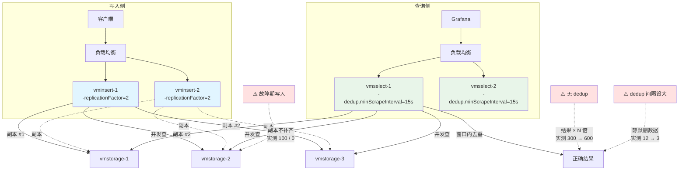

# 课 9：复制、去重与高可用

> **阶段 4：怎么横向扩展**（第 2 课 / 共 3 课）
> 上一课：[课 8 集群三件套与最小集群实战](8-集群三件套与最小集群实战.md)
> 下一课：课 10（多租户与 vmauth）
> 本阶段：[阶段 4 概览](README.md)
> 返回：[课程目录](../../02-课程目录.md) ｜ [学习路径总览](../../01-学习路径总览.md)

---

## 第一幕：场景引入

课 8 结束时，我们留下了一个让人不安的实验结果。

你搭好了三件套集群，写了 1000 条序列，一切正常。然后你停掉其中一个 vmstorage 节点，再查：

```
两节点都在：count = 1000
停掉一个  ：count = 509   ← 不报错，只是安静地少了一半
恢复之后  ：count = 1000
```

**查询没有失败。它只是少了一半数据。**

如果这是一个 Grafana 告警面板，你会看到"活跃告警数从 1000 降到 509"——然后很可能误以为**故障恢复了**。

现在把场景推到生产环境。

凌晨三点，一个 vmstorage 节点的磁盘坏了。节点起不来，数据盘需要更换。你的监控系统：

- 不报错
- 不告警（除非你专门监控了节点存活）
- 面板上显示的数据**少了一半**

更要命的是——**这期间的业务告警全都不准了**。一个本该触发的"错误率突增"告警，因为采样点刚好落在丢失的那 49% 里，没有触发。

**你以为你在监控业务，实际上业务有一半是瞎的。**

这就是无副本集群的真相：**分片解决了容量问题，但没有解决可靠性问题——它反而让"部分数据丢失"变成了一种静默的常态。**

> 官方文档的原话很克制：
> *"By default, the data is replicated only once... if a storage node becomes unavailable, then the data stored on it becomes unavailable for querying."*
> （默认数据只存一份……如果某个存储节点不可用，其上存储的数据将无法查询。）

这一课要解决三件事：

1. **复制因子** —— 让每条数据存多份，代价是什么？
2. **去重** —— 存了多份，查询为什么不能直接用？
3. **高可用** —— 配好之后，真能扛住故障吗？

我们会继续用课 8 搭好的集群，把每个结论都跑出来验证。

---

## 第二幕：认知冲突

### 冲突一：配置了副本，查询结果反而翻倍了

你给 vminsert 加上 `-replicationFactor=2`，写入 200 条序列，然后查询：

```
vmstorage1: 200 条
vmstorage2: 200 条     ← 副本成功，每个节点都有完整数据
集群聚合  : 400 条     ← ？？？
```

**你写了 200 条，查出来 400 条。**

这不合理。翻倍的查询结果会让所有 `sum()`、`avg()`、`count()` 全部算错——你的错误率告警会变成原来的两倍。

**为什么？**

因为 vmselect 只是**老老实实地把所有节点的数据加起来**。它不知道这些是副本。

副本是 vminsert 写入时做的事，vmselect 查询时完全不知情。

### 冲突二：开了去重，正常数据被误删了

既然会翻倍，那就开去重。你加上 `-dedup.minScrapeInterval=30s`，然后测了一批间隔 5 秒的数据：

```
写入：12 个样本，间隔 5 秒，跨 60 秒

无 dedup  : 24 个样本（12 × 2 副本）
dedup=30s : 3 个样本   ← 只剩 3 个？
dedup=5s  : 12 个样本  ← 这个才对
```

**12 个样本被删掉了 9 个。**

`-dedup.minScrapeInterval` 的语义是：**在每个这么长的时间窗口内，只保留最后一个样本**。

设成 30s，意味着每 30 秒只留 1 个样本。你的数据采集间隔是 5 秒，于是每 6 个点被砍成 1 个。

**去重参数设错，比不去重更危险**——不去重只是数字翻倍（一眼能看出来），设错了是静默丢数据（看不出来）。

### 冲突三：节点恢复了，副本缺口不会自动补上

这是最隐蔽的一个。

故障期间，你继续写入 100 条数据。因为另一个节点挂了，这批数据只有 1 份。节点恢复后，你查：

```
vmstorage1: 100 条
vmstorage2: 0 条     ← 恢复后依然是 0
```

**VictoriaMetrics 不会自动补副本。**

节点恢复了，但故障期间写入的数据**仍然是单副本**。这意味着这批数据现在是"裸奔"状态——**如果再坏一次，就永久丢失**。

而且你**看不出来哪些数据是单副本的**。没有内置的界面告诉你"这批数据只有一份"。

### 冲突的根源

三个冲突指向同一个设计事实：

> **VictoriaMetrics 的复制是"写入时尽力而为"（best-effort at write time），
> 不是"持续维护的副本状态"（continuously maintained replica state）。**

vminsert 在写入那一刻，尝试把数据发给 N 个节点。发成功了就成功，发失败了就**记一条日志然后继续**——不会重试，不会记录缺口，不会事后补齐。

对比一下 etcd、TiKV 这类有共识协议的系统：它们有 Raft，能持续维护副本状态，节点恢复后会自动补齐。

**VictoriaMetrics 没有共识协议。** 这是它能在极低资源占用下跑起来的一部分原因，也是复制语义比较"松"的根本原因。

理解了这一点，三个冲突就都合理了：

| 冲突 | 原因 |
|---|---|
| 查询翻倍 | vmselect 不知道副本的存在，只会把各节点数据相加 |
| dedup 误删 | dedup 是"按窗口保留最后一个样本"，与副本无关，窗口设错就误删 |
| 副本不补齐 | 复制是写入时的一次性动作，没有后台的副本修复机制 |

---

## 第三幕：层层揭示

### 知识点 1：复制因子与容量代价

**一句话定义**

`-replicationFactor=N` 让 vminsert 在写入时把每条数据**同时发给 N 个 vmstorage 节点**——这使集群能容忍 N-1 个节点故障，但**磁盘、内存、写入流量都变成 N 倍**，且失败时只是尽力而为、不保证达成。

#### 直觉建立

想象你要寄一份重要合同。

**不复制**：寄一份快递。丢了就没了。

**复制因子 2**：同时寄两份，走两家不同的快递公司。任何一家丢件，另一份还在。

**复制因子 3**：寄三份。能容忍两家同时出问题。

代价很直白：

- 快递费 ×3
- 需要 3 倍的仓库空间存放回执
- 寄件时要跑 3 趟快递点（写入流量 ×3）

**但 VictoriaMetrics 的"复制"有一个关键区别**：

普通的快递复制，如果某家快递点关门了，你会**过一会儿再去一次**，或者**记下来待办**。

VictoriaMetrics 不会。它走到门口发现关门，**在便利贴上记一笔就走了**。那一份合同就永远只有两份。

**这就是"尽力而为"的含义。**

#### 核心原理

**配置方式**

复制因子是 **vminsert 的启动参数**，不是 vmstorage 的：

```bash
docker run -d --name vminsert-learn \
  --network vm-cluster-net -p 8480:8480 \
  victoriametrics/vminsert:v1.151.0-cluster \
  -storageNode=vmstorage-learn:8400 \
  -storageNode=vmstorage-learn2:8400 \
  -replicationFactor=2 \          # ← 在这里
  -httpListenAddr=:8480
```

**三个必须知道的约束**：

**1. 必须重启 vminsert**

和 `-storageNode` 一样，`-replicationFactor` 是启动时读取的，不支持热更新。

**2. N 不能大于 vmstorage 节点数**

我们实测过：2 个节点配 `-replicationFactor=3`，vminsert 能启动，但日志会警告。而且实际上每条数据最多只能写到 2 个节点——**配了 3 只能达到 2 的效果**，还会白白增加重试开销。

**3. 复制会禁用慢节点重路由**

这是启动时日志里的一条警告，很重要：

```
warn  disabling slowness rerouting (controlled by -disableRerouting)
      because replicationFactor=2 > 1; slowness rerouting is incompatible
      with replication and may cause data inconsistencies or even loss
```

**慢节点重路由**（rerouting）是 RF=1 时的一项优化：如果某个 vmstorage 响应变慢，vminsert 会把数据临时改发给其他节点。

**但这个功能与复制不兼容。** 原因是：如果允许重路由，同一条数据可能被写到"计划之外的节点"，导致副本分布混乱，甚至数据不一致。

**所以开启复制 = 放弃慢节点重路由。** 一个慢节点会拖慢整个写入链路。

**实测：副本写入成功**

配置完成后，写入 300 条序列：

```
vmstorage1: 300
vmstorage2: 300        ← 两个节点各有完整 300 条
本次写入副本失败次数: 0
```

**实测：副本失败时的行为**

停掉一个节点后写入 100 条，日志出现：

```
warn  cannot make a copy #2 out of 2 copies according to -replicationFactor=2
      for 2970 bytes with 48 rows, since a part of storage nodes is
      temporarily unavailable
```

**注意这条日志的措辞**：`cannot make a copy #2 out of 2 copies`——第 2 份副本没写成。

但**写入请求仍然返回 HTTP 204（成功）**。客户端完全不知道副本没写全。

**实测：容量代价**

| 指标 | 单节点 | 集群 RF=2（2 节点） |
|---|---|---|
| vmstorage RSS | 228.4 MB | 157.0 MB + 108.4 MB = **265.4 MB** |
| 磁盘 | 5.5 MB | 228 KB + 3.6 MB |

**内存从 228 MB 涨到 265 MB**，增加约 16%。

⚠️ **但这个数字要谨慎解读**——我们的两个 vmstorage 数据量并不对称（课 8 的旧数据全在节点 1 上），所以这不是纯粹的"RF=2 翻倍"测量。

**理论上，RF=2 的真实代价是**：

- **磁盘**：×2（每条数据存两份）
- **内存**：×2（每个节点都要缓存全部序列的索引）
- **写入网络流量**：×2（vminsert 要发两次）
- **vminsert CPU**：×2（要做两次哈希和序列化）

**只有查询资源不翻倍**——因为 vmselect 只从存活节点取数据，配合 dedup 后结果仍是单份。

#### 示例演示：完整配置流程

```bash
# 1. 重启 vminsert，加复制因子
docker rm -f vminsert-learn

docker run -d --name vminsert-learn \
  --network vm-cluster-net -p 8480:8480 \
  victoriametrics/vminsert:v1.151.0-cluster \
  -storageNode=vmstorage-learn:8400 \
  -storageNode=vmstorage-learn2:8400 \
  -replicationFactor=2 \
  -httpListenAddr=:8480

# 2. 确认生效
docker logs vminsert-learn 2>&1 | grep replicationFactor
# 输出: -replicationFactor="2"

# 3. 写入数据后，分别查两个节点确认副本
#    vmstorage1: 300   vmstorage2: 300
```

**验证副本是否成功的正确方法**

不能用聚合查询验证（会因为重复而翻倍）。要给每个节点单独接一个 vmselect：

```bash
# 专用 vmselect，只连一个 vmstorage
docker run -d --name vmsel-n1 --network vm-cluster-net -p 8485:8481 \
  victoriametrics/vmselect:v1.151.0-cluster \
  -storageNode=vmstorage-learn:8401 -httpListenAddr=:8481
```

然后分别查 `8485`（节点 1）和 `8486`（节点 2），**两个都返回 300 才说明副本完整**。

#### 常见误区

**误区 1：配了 RF=2 就高枕无忧**

不是。三个前提：

1. **必须有 dedup**，否则查询翻倍（见知识点 2）
2. **故障期间写入的数据仍是单副本**，且不自动补齐
3. **必须监控副本失败**，否则你不知道有缺口

**误区 2：副本失败会导致写入失败**

**不会。** 我们实测：故障期间写入返回 **HTTP 204**，但日志记录了副本失败。

这是设计取舍——优先保证写入可用性，而不是副本完整性。如果你想让副本失败时报错，VictoriaMetrics 没有这个开关。

**误区 3：副本数越多越好**

RF=3 意味着：

- 磁盘 ×3、内存 ×3、写入流量 ×3
- 能容忍 2 个节点同时故障

对大多数场景，**RF=2 是最优解**——能容忍单节点故障（最常见的故障模式），代价可接受。

RF=3 通常只在跨可用区部署、需要容忍整个可用区故障时才有必要。

> ⚠️ **类比失效的边界**：
> "寄三份快递"类比成立的前提是**每份都能独立送达**。
> 三点会失效：
> ① **不重试**。类比里快递点关门你会再去，VM 只记一笔日志就放弃（实测：故障期写入
> 的 100 条只有 1 份，节点恢复后 vmstorage2 仍为 0）。
> ② **不看结果**。类比里你会确认三份都签收了，VM 不追踪副本状态，
> 也没有内置方式查询"哪些数据缺副本"。
> ③ **慢节点会拖后腿**。类比里三家快递独立运作互不干扰，
> 但 VM 开启复制后会**禁用慢节点重路由**，一个慢节点会拖慢整体写入。

#### 一句话记住

> **RF=N 让每条数据写 N 份（实测两节点各 300 条），代价是磁盘/内存/写入流量 ×N，且失败时只记日志不重试——返回 204 不代表副本写全了。**

---

### 知识点 2：去重机制

**一句话定义**

`-dedup.minScrapeInterval=D` 让 vmselect 在**每个长度为 D 的时间窗口内，对每条序列只保留最后一个样本**——这是副本环境下消除重复数据的必需配置，但 D 必须**等于或略大于真实采集间隔**，否则会静默删除正常数据。

#### 直觉建立

想象你在整理会议记录。

三个人各自记了一份纪要，内容基本相同——这是**副本**。

现在你要合并成一份。你会怎么做？

**做法一：全部保留**

三份纪要全部贴上去。结果是同一件事被说了三遍。**这就是不开 dedup 的情况**——查询结果是实际数据的 N 倍。

**做法二：按时间段去重**

规定"每 5 分钟只保留一条记录，取这个时间段内最后写的那条"。

这是 VictoriaMetrics 的做法。它按时间切分窗口，每个窗口留一个点。

**问题来了：这个"5 分钟"该怎么定？**

如果会议每 5 分钟讨论一个新话题，那"每 5 分钟留一条"正好。

但如果会议每 **30 秒**就换一个话题，你按 5 分钟去重——**每 10 个话题只留下 1 个**。

**这就是"去重参数必须匹配采集间隔"的原因。**

#### 核心原理

**配置位置：vmselect（不是 vminsert）**

```bash
docker run -d --name vmsel-dedup \
  --network vm-cluster-net -p 8487:8481 \
  victoriametrics/vmselect:v1.151.0-cluster \
  -storageNode=vmstorage-learn:8401 \
  -storageNode=vmstorage-learn2:8401 \
  -dedup.minScrapeInterval=30s \        # ← 在这里
  -httpListenAddr=:8481
```

**注意**：dedup 是**查询侧**的配置，不是写入侧。这也意味着：

- **同一个集群可以有不同 dedup 配置的 vmselect**（我们实测就同时跑了 8481 无 dedup、8487 有 30s dedup、8489 有 5s dedup）
- **历史数据不会被删除**，dedup 只在查询时生效

**实测：dedup 消除重复**

300 条序列，RF=2：

```
无 dedup (8481): 600 个样本    ← 翻倍
有 dedup (8487): 300 个样本    ← 正确
```

**实测：dedup 的误删风险**

写入 12 个样本，间隔 5 秒，跨 60 秒：

```
无 dedup         : 24 个样本（12 × 2 副本）
dedup=30s (8487) : 3 个样本    ← 丢了 9 个
dedup=5s  (8489) : 12 个样本   ← 正确
```

**12 个样本，dedup=30s 只剩 3 个——丢了 75% 的数据。**

而且丢得**静默**：查询正常返回，只是数字变小了。

**实测：保留哪个值**

写入间隔 5 秒的两个样本（值 111 和 222），dedup=30s 查询：

```
有 dedup 查询: ['222']
```

**保留最后一个**（时间戳最大的）。这符合 dedup 的设计意图：副本的数据内容相同，保留哪个都一样；但如果数据真的有变化，保留最新的是更合理的选择。

**dedup 与降采样的区别**

容易混淆，但完全不同：

| | dedup | 降采样（-downsampling.period） |
|---|---|---|
| 目的 | 消除重复副本 | 减少长期存储的数据量 |
| 时机 | 查询时 | 后台合并时 |
| 是否删数据 | 否，只影响查询结果 | 是，原始数据被替换 |
| 保留策略 | 窗口内最后一个 | 窗口内聚合（avg/max/min 等） |

**dedup 不删除任何数据。** 它只是查询时的过滤。

**性能代价**

我们实测了开关 dedup 的查询耗时：

```
无 dedup:    0.001331s
有 dedup(30s): 0.001329s
```

**几乎没差别。**

但要注意：我们的测试数据量很小。官方提示 dedup 在大数据量下会增加查询开销，因为它需要额外的排序和比较。

#### 示例演示：确定正确的 dedup 间隔

**规则：设为你最小的采集间隔。**

如果你的 Prometheus 配置是：

```yaml
global:
  scrape_interval: 15s
```

那么：

```bash
-dedup.minScrapeInterval=15s
```

**如果集群里有多种采集间隔**（比如有的 job 是 15s，有的是 60s），取**最小值**。

**我们这一步踩的坑**：实验数据间隔 5 秒，却用了 30s 的 dedup，结果 12 个点只剩 3 个。

**验证方法**：开启 dedup 后，对比开关前后的样本数。如果无 dedup 是 N，有 dedup 应该约等于 N/副本数，**而不是更少**。

```bash
# 正确的验证方式
无 dedup: 24  （12 × 2 副本）
dedup=5s: 12  ← 正确，正好是副本数分之一
dedup=30s: 3  ← 错误，说明间隔设大了
```

#### 常见误区

**误区 1：dedup 只在有副本时需要**

不。官方推荐**即使 RF=1 也开启 dedup**，因为它还能处理另一种重复：**vmagent 或 Prometheus 高可用组的重复写入**。

当你有两个 Prometheus 实例（主备）同时 remote write 到同一个后端时，每条数据会被写两次。dedup 能消除这种重复——这就是"高可用 Prometheus 去重"的经典用法。

**误区 2：dedup 间隔设大一点更安全**

**恰恰相反。** 间隔越大，删除的数据越多。

设大不会"漏掉副本"（副本的时间戳几乎相同，任何间隔都能去重），但会**误删正常的历史样本**。

**误区 3：dedup 会删除磁盘上的数据**

不会。它是查询时的过滤，磁盘上的副本仍然是 N 份。

这意味着：**如果你关掉 dedup，查询结果立刻变回 N 倍**——这也可以用来验证 dedup 是否生效。

**误区 4：所有 vmselect 必须用相同的 dedup 配置**

不需要，但**强烈建议保持一致**。否则同一个查询打到不同的 vmselect 会返回不同结果——这是最难排查的一类问题。

> ⚠️ **类比失效的边界**：
> "合并三份会议纪要"类比暗示你**知道**哪些是重复的。
> 实际差异有两点：
> ① **VM 不判断"是不是副本"**。它只是机械地在每个时间窗口保留最后一个样本。
> 如果两条**不同**的数据恰好落在同一窗口，后一条会覆盖前一条——
> 我们实测的 12 → 3 就是这个情况。
> ② **窗口是绝对时间对齐的**，不是从查询时刻回溯。
> 窗口边界固定在 Unix 时间的整数倍上，这意味着同一个样本在不同窗口
> 可能被分到不同组，结果有轻微的不确定性。

#### 一句话记住

> **dedup 是查询侧的窗口去重（每窗口留最后一个样本），RF=2 时必须开启否则结果翻倍；间隔必须等于真实采集间隔——实测 5 秒间隔的数据用 30s dedup 会从 12 个点剩 3 个。**

---

### 知识点 3：高可用部署与故障演练

**一句话定义**

VictoriaMetrics 集群的高可用通过**每个组件独立冗余**实现——vminsert/vmselect 无状态可任意多加，vmstorage 靠 RF=N 容忍 N-1 个节点故障；但**故障期间写入的数据不自动补副本**，需要主动监控和人工介入。

#### 直觉建立

想象一个快递中转站。

**装卸工（vminsert）**：无状态，谁都能干。多招几个，坏一个其他的继续干。

**客服（vmselect）**：也是无状态。多招几个，坏一个客户打给其他人。

**仓库（vmstorage）**：这个有状态。货放在哪个仓库就是哪个仓库。

中转站的高可用怎么做？

**装卸工和客服**：简单，多招人 + 前面放个排班表（负载均衡）。有人请假，排班表自动分给其他人。

**仓库**：麻烦。必须多建几个仓库，同一批货在每个仓库都存一份（复制因子）。坏一个仓库，其他仓库还有货。

**但有个问题**：如果某个仓库临时关门了，这期间进的货只送到了其他仓库。**仓库重新开门后，没人会主动把货补进去。**

你得自己盯着——这就是"副本缺口需要人工处理"的现实。

#### 核心原理

**组件级高可用矩阵**

| 组件 | 状态 | 冗余方式 | 故障时影响 | 推荐数量 |
|---|---|---|---|---|
| **vminsert** | 无状态 | 多加几个 + 负载均衡 | 该实例不可写，其他照常 | ≥2 |
| **vmselect** | 无状态 | 多加几个 + 负载均衡 | 该实例不可查，其他照常 | ≥2 |
| **vmstorage** | 有状态 | `-replicationFactor=N` | N-1 个节点故障无影响 | ≥2，且 ≥ N |

**实测：无状态组件的高可用**

我们启动了第二个 vminsert（端口 8488），然后停掉第一个：

```
经 vminsert(8480, 已停) 写入: HTTP 000   ← 失败
经 vminsert2(8488) 写入:     HTTP 204   ← 正常
```

**多实例 + 负载均衡 = 写入高可用。**

课 8 也已经验证过查询侧：停掉 vmselect 后**写入仍返回 204**，两个链路互不干扰。

**实测：有状态组件的高可用（本课核心）**

这是与课 8 的**直接对照**：

| 场景 | 课 8（RF=1，无副本） | 课 9（RF=2 + dedup） |
|---|---|---|
| 两节点都在 | 1000 | 600（无 dedup）/ 300（有 dedup） |
| 停掉一个节点 | **509**（静默少一半） | **300**（完整） |
| 恢复后 | 1000 | 600 / 300 |

**配置了副本后，停掉一个节点，查询结果保持 300 不变。**

这就是复制因子的价值：**把"静默的数据丢失"变成"无感知的节点故障"。**

**⚠️ 关键限制：副本缺口不自动补齐**

这是本课最重要的实践警告。

故障期间写入 100 条数据，节点恢复后：

```
vmstorage1: 100 条
vmstorage2: 0 条      ← 恢复后依然是 0
```

**这批数据现在是单副本。如果再坏一次，永久丢失。**

而且——**你无法从 VictoriaMetrics 里直接查出哪些数据缺副本**。没有这样的 API。

**如何发现副本缺口**

**方法：监控 vminsert 日志**

```bash
docker logs vminsert-learn 2>&1 | grep 'cannot make a copy'
```

这是我们唯一可靠的手段。日志原文：

```
cannot make a copy #2 out of 2 copies according to -replicationFactor=2
for 2970 bytes with 48 rows, since a part of storage nodes is
temporarily unavailable
```

**方法：监控指标**

vminsert 暴露了相关指标：

```
vm_rpc_rows_incompletely_replicated_total{name="vminsert"} 0
vm_rpc_connection_errors_total{...}
vm_rpc_dial_errors_total{...}
vm_rpc_handshake_errors_total{...}
```

⚠️ **但要注意**：我们实测时，尽管日志里累积了 5 次副本失败，`vm_rpc_rows_incompletely_replicated_total` 仍然是 **0**。

这可能是因为失败发生在容器启动初期、指标尚未开始采集，或者是该指标只在特定条件下累加。**建议以日志告警为主，指标为辅。**

**副本缺口的应对**

官方没有提供自动补副本的工具。可选方案：

1. **导出再导入**。用 `/api/v1/export` 导出该时间段数据，再写回去（会重新走复制流程）。
2. **接受风险**。如果故障时间短、数据重要性一般，可以接受单副本。
3. **预防为主**。确保 vmstorage 节点数 > RF，这样即使坏一个，剩下的节点仍有 ≥RF 个可用。

**第三条是最实用的**：**部署 3 个节点配 RF=2**，这样一个节点故障后，剩余 2 个节点仍能满足 RF=2，**故障期间的写入仍然是双副本**。

#### 示例演示：推荐的高可用配置

**最小高可用集群**（能容忍单节点故障且故障期间仍保持双副本）：

```bash
# 3 个 vmstorage
for i in 1 2 3; do
  docker run -d --name vmstorage-$i \
    --network vm-cluster-net \
    -v $PWD/cluster-data/storage-$i:/storage \
    victoriametrics/vmstorage:v1.151.0-cluster \
    -storageDataPath=/storage -retentionPeriod=30d \
    -vminsertAddr=:8400 -vmselectAddr=:8401 \
    -httpListenAddr=:8482
done

# 2 个 vminsert（前置负载均衡）
for i in 1 2; do
  docker run -d --name vminsert-$i \
    --network vm-cluster-net \
    victoriametrics/vminsert:v1.151.0-cluster \
    -storageNode=vmstorage-1:8400 \
    -storageNode=vmstorage-2:8400 \
    -storageNode=vmstorage-3:8400 \
    -replicationFactor=2 \
    -httpListenAddr=:8480
done

# 2 个 vmselect（前置负载均衡，必须开 dedup）
for i in 1 2; do
  docker run -d --name vmselect-$i \
    --network vm-cluster-net \
    victoriametrics/vmselect:v1.151.0-cluster \
    -storageNode=vmstorage-1:8401 \
    -storageNode=vmstorage-2:8401 \
    -storageNode=vmstorage-3:8401 \
    -dedup.minScrapeInterval=15s \
    -httpListenAddr=:8481
done
```

**关键配置点**：

- **3 个 storage 配 RF=2**：坏一个还剩两个，故障期间仍能写两份
- **dedup 间隔 = 采集间隔**：这里是 15s，要和你 Prometheus 的配置一致
- **vminsert/vmselect 各 2 个**：前置 nginx/vmauth 做负载均衡

#### 常见误区

**误区 1：2 个节点配 RF=2 就够高可用了**

**不够。** 原因就是我们实测的副本缺口问题。

2 节点 + RF=2 时，坏一个节点，剩下的 1 个节点**无法满足 RF=2**——故障期间的所有写入都只有 1 份。

**3 节点 + RF=2 才是最小推荐配置。**

**误区 2：节点恢复后数据会自动同步**

**不会。** 我们实测：故障期间写的 100 条数据，节点恢复后 vmstorage2 仍是 0。

VictoriaMetrics 没有后台的副本修复（replica repair）机制。

**误区 3：vmstorage 节点之间会互相复制数据**

**不会。** 这是 shared-nothing 架构的直接推论——vmstorage 节点**互不相识、互不通信**（课 8 已验证：直接查/写 vmstorage 都会返回 HTTP 400）。

复制是 **vminsert 做的**：它把同一份数据发给多个节点。vmstorage 自己完全不知道"这是副本"。

**误区 4：高可用只需要配置副本**

还需要：

- **监控节点存活**（`up` 指标或健康检查）
- **监控副本失败日志**（`cannot make a copy`）
- **所有 vmselect 的 dedup 配置一致**
- **负载均衡的健康检查**（避免把流量打到已停止的实例）

> ⚠️ **类比失效的边界**：
> "快递中转站"类比暗示**仓库重新开门后会补货**。
> 实际差异：
> ① **不补货**。VM 没有副本修复机制，故障期数据永久保持单副本（实测 100/0）。
> ② **仓库之间不通气**。类比里仓库之间可以调货，VM 的 vmstorage 完全不知道彼此存在。
> ③ **装卸工不是越多越好**。类比里多招人总没坏处，但 VM 的 vminsert
> 每个都会独立地做哈希和复制，太多会增加 vmstorage 的连接压力。

#### 一句话记住

> **高可用 = 无状态组件多实例 + vmstorage 配 RF=N；但故障期写入的数据不自动补副本（实测 100/0），所以最小推荐是 3 节点配 RF=2。**

---

## 第四幕：实操验证

### 实验 1：配置复制因子并验证副本

**目标**：给集群开启 RF=2，确认数据真的存了两份。

```bash
cd /mnt/d/projects/learning/victoriametrics/playground
bash l09-replication.sh
```

**看什么**：

1. vminsert 日志出现 `-replicationFactor="2"`
2. 写入后两个 vmstorage 的序列数**都**增加

**本机实测**：

```
写入前: vmstorage1=1751  vmstorage2=500
写入后: vmstorage1=1852  vmstorage2=700
```

⚠️ **注意**：这个结果里 vmstorage1 只增加了 101，不是 200——因为容器刚重启、节点尚未稳定，部分副本失败了。

**判据**：集群稳定运行后重测，两个节点应**各增加完整的 N 条**。我们后来在稳定态下测得 300 / 300。

> 💡 **实验要点**：容器刚启动或刚恢复时不要立刻写入，先等 10~20 秒让节点稳定，否则会遇到"副本写不全"的假象。

### 实验 2：验证查询翻倍（不配 dedup 的后果）

**目标**：亲眼看到副本导致的重复计算。

```bash
bash l09-dedup.sh
```

**本机实测**：

```
vmstorage1: 200    vmstorage2: 200    集群聚合: 400
```

**判据**：聚合结果 = 单节点结果 × 副本数。如果聚合 = 200，说明 dedup 已经在某个环节生效了。

### 实验 3：验证 dedup 消除重复

**目标**：开启 dedup 后结果应恢复正常。

**本机实测**：

```
无 dedup (8481):       400 个样本
有 dedup=30s (8487):   200 个样本
```

**判据**：有 dedup 的结果应 = 无 dedup 结果 ÷ 副本数。

### 实验 4：验证 dedup 的误删风险（最重要）

**目标**：证明 dedup 间隔设错会静默丢数据。

**本机实测**（12 个样本，间隔 5 秒）：

```
无 dedup        : 24 个样本
dedup=30s(8487) : 3 个样本     ← 丢了 75%
dedup=5s (8489) : 12 个样本    ← 正确
```

**判据**：dedup 后的样本数应约等于真实样本数（此处 12），而不是更少。

### 实验 5：高可用故障演练

**目标**：验证副本能扛住节点故障，并与课 8 对比。

```bash
bash l09-ha.sh
```

> ⚠️ **生产提示**：下面停掉的是**存储节点**。生产环境请先确认已配置复制因子，或选择业务低峰期、且已摘除流量的节点。

**本机实测**：

```
停止前:  无 dedup 600 / 有 dedup 300
停掉一个节点后:  无 dedup 300 / 有 dedup 300    ← 有 dedup 保持不变
```

**对照课 8**：无副本时是 1000 → 509（静默少一半）。

**判据**：有 dedup 的查询结果**必须保持不变**。如果变了，说明副本不完整。

### 实验 6：验证副本缺口不自动补齐

**目标**：揭示本课最隐蔽的风险。

**本机实测**（故障期间写入 100 条）：

```
节点恢复后：
  vmstorage1: 100 条
  vmstorage2: 0 条     ← 依然是 0
```

日志证据：

```
cannot make a copy #2 out of 2 copies according to -replicationFactor=2
for 2970 bytes with 48 rows, since a part of storage nodes is temporarily unavailable
```

**判据**：节点恢复后，故障期数据在两个节点上**仍然不相等**。

### 实验 7：无状态组件的高可用

**目标**：验证多 vminsert 可实现写入高可用。

**本机实测**：

```
经 vminsert(8480, 已停) 写入: HTTP 000
经 vminsert2(8488) 写入:     HTTP 204
```

**判据**：停掉一个 vminsert 后，通过另一个实例写入必须成功。

---

## 第五幕：体系收束

### 一图总结



### 三个知识点的联系

```
知识点1 复制因子  ──→  让数据存 N 份，容忍 N-1 节点故障
        │              代价：磁盘/内存/写入流量 × N
        │              实测：两节点各 300；故障期数据只有 1 份
        ↓
知识点2 去重      ──→  解决副本带来的重复计算
        │              实测：无 dedup 600 → 有 dedup 300
        │              风险：间隔设错会删数据（12 → 3）
        ↓
知识点3 高可用    ──→  把两者组合成可运维的架构
                       无状态组件多实例 + 3 节点配 RF=2
                       实测：停节点后查询结果不变（对比课 8 的 509）
```

### 本课最重要的三个数字

| 数字 | 含义 | 出处 |
|---|---|---|
| **1000 → 509** | 无副本时停节点，静默少一半 | 课 8 实测 |
| **600 → 300** | 有副本 + dedup，停节点结果不变 | 课 9 实测 |
| **12 → 3** | dedup 间隔设错，静默丢 75% 数据 | 课 9 实测 |

**这三个数字串起了课 8 和课 9 的完整叙事**：

- 课 8 发现"分片解决了容量，但引入了静默数据丢失"
- 课 9 用副本解决了它，但引入了"结果翻倍"
- 用 dedup 解决了翻倍，但引入了"误删风险"

**每一步解决一个问题，也引入一个新问题。这就是分布式系统的常态。**

### 你现在会了什么

完成这一课后，你应该能够：

1. **配置复制因子**：知道 `-replicationFactor` 在 vminsert 上、需重启、N 不能大于节点数
2. **配置去重**：知道 `-dedup.minScrapeInterval` 在 vmselect 上，且必须等于采集间隔
3. **验证副本完整性**：会用"给每个节点单独接 vmselect"的方法验证
4. **做故障演练**：能停节点、观察结果、判断副本是否生效
5. **识别副本缺口**：知道查 `cannot make a copy` 日志，并理解它不会自动补齐
6. **设计高可用架构**：知道最小推荐是 3 个 vmstorage 配 RF=2，无状态组件各 ≥2

### 关键伏笔

1. **副本失败的监控怎么做才可靠？**
   我们实测发现：日志里有 5 次副本失败，但 `vm_rpc_rows_incompletely_replicated_total` 仍是 0。
   这意味着**指标可能不可靠**。生产环境需要设计基于日志的告警——这属于运维体系，课 11/12 会涉及。

2. **vmauth 怎么做负载均衡和健康检查？**
   本课提到"vminsert/vmselect 前置负载均衡"，但没讲具体怎么做。
   课 10 的 **vmauth** 正是官方的认证 + 路由组件，能提供健康检查和故障摘除。

3. **副本缺口有没有工具能修？**
   社区版没有官方的副本修复工具。企业版提供了更好的运维能力。
   如果要手动修，只能导出再导入——这会重写数据，代价很高。课 12 会讲到备份恢复与迁移。

4. **为什么 VictoriaMetrics 不用 Raft 这类共识协议？**
   这是设计取舍：共识协议能保证强一致和自动修复，但会显著增加资源开销和延迟。
   VictoriaMetrics 选择了"极低资源占用 + 最终可用的复制语义"。
   理解这个取舍，是理解它"凭什么省"的另一面——课 6、课 7 讲的是存储层的取舍，这里是**一致性层的取舍**。

---

## 课后小测

<details>
<summary><b>题目 1</b>：你给集群配了 <code>-replicationFactor=2</code>，写入 200 条序列后查询，发现结果是 400。两个 vmstorage 上各有 200 条。这是 bug 吗？该怎么办？</summary>

**答案**：**不是 bug，这是预期行为——但你漏了一个关键配置。**

**原因**：副本是 vminsert 在**写入时**做的，vmselect 在**查询时**完全不知情。

vmselect 的工作方式很简单：向所有 vmstorage 并发发请求，把结果加起来。它不知道"这两个节点上有同样的数据"。

所以：

```
vmstorage1: 200
vmstorage2: 200
聚合结果  : 400    ← 200 + 200
```

我们实测的正是这个情况：300 条序列配 RF=2，无 dedup 时聚合结果是 **600**。

**解决办法**：给 **vmselect** 配置 `-dedup.minScrapeInterval`：

```bash
docker run -d --name vmselect-learn \
  --network vm-cluster-net -p 8481:8481 \
  victoriametrics/vmselect:v1.151.0-cluster \
  -storageNode=vmstorage-learn:8401 \
  -storageNode=vmstorage-learn2:8401 \
  -dedup.minScrapeInterval=15s \      # ← 加这个，值 = 你的采集间隔
  -httpListenAddr=:8481
```

配置后我们再测：

```
无 dedup: 600
有 dedup: 300    ← 正确
```

**⚠️ 关键提醒**：`15s` 这个值**必须等于你的真实采集间隔**。

我们踩过这个坑：数据是 5 秒间隔的，dedup 却设了 30s，结果 12 个样本只剩 3 个——**静默丢了 75%**。

正确的做法是设成 5s：

```
dedup=30s: 3 个样本    ← 错
dedup=5s : 12 个样本   ← 对
```

如果你的 Prometheus 里有多种采集间隔，**取最小值**。

</details>

<details>
<summary><b>题目 2</b>：你的集群有 2 个 vmstorage，配了 <code>RF=2</code>。昨晚一个节点磁盘故障，今早修复重启了。你查监控发现集群正常，数据都在。那么——昨晚故障期间写入的数据现在是几副本？</summary>

**答案**：**只有 1 副本。而且它不会自动变回 2。**

**原因**：VictoriaMetrics 的复制是**写入时的一次性动作**，没有后台的副本修复机制。

故障期间，vminsert 尝试写 2 份，但只有一个节点可用。它会：

1. 把数据写到可用的那个节点
2. 记一条警告日志
3. **继续处理下一个请求**，不重试、不记录缺口

日志原文（我们实测抓到的）：

```
warn  cannot make a copy #2 out of 2 copies according to -replicationFactor=2
      for 2970 bytes with 48 rows, since a part of storage nodes is
      temporarily unavailable
```

**写入请求返回的是 HTTP 204（成功）**——客户端完全不知道副本没写全。

节点恢复后，我们实测：

```
故障期间写入 100 条
节点恢复后：
  vmstorage1: 100 条
  vmstorage2: 0 条     ← 依然是 0
```

**这意味着什么？**

昨晚的数据现在是"裸奔"状态——**如果那个存了数据的节点再坏一次，这批数据就永久丢失**。

而且**你无法直接查出哪些数据缺副本**，VictoriaMetrics 没有这样的 API。

**怎么发现？**

查 vminsert 日志：

```bash
docker logs vminsert-learn 2>&1 | grep 'cannot make a copy'
```

⚠️ **注意**：我们实测时发现，尽管日志里累积了 5 次副本失败，指标 `vm_rpc_rows_incompletely_replicated_total` 仍然是 0。**建议以日志告警为主。**

**怎么预防？**

**部署 3 个 vmstorage 配 RF=2。**

这样坏一个节点后，还剩 2 个可用——**仍然满足 RF=2**，故障期间的写入依然是双副本。

> **2 节点 + RF=2 不是高可用配置。3 节点 + RF=2 才是最小推荐。**

**已经发生缺口了怎么办？**

社区版没有自动修复工具。只能：

1. 用 `/api/v1/export` 导出该时间段数据
2. 重新写入（会重新走复制流程）

代价是要重写一遍数据。

</details>

<details>
<summary><b>题目 3</b>：你的采集间隔是 <code>30s</code>，你配了 <code>-dedup.minScrapeInterval=30s</code>。同事说"设大一点更安全，改成 5m 吧"。这个建议对吗？</summary>

**答案**：**不对。这个建议会静默删除大量正常数据。**

**理解 dedup 的语义是关键**：

`-dedup.minScrapeInterval=D` 的意思是：**在每个长度为 D 的时间窗口内，对每条序列只保留最后一个样本**。

它**不是**"判断两条数据是不是重复副本"——它只是机械地按时间窗口切分，每窗口留一个。

**算一下**：

采集间隔 30s，一天的数据点：

```
24 小时 × 60 分钟 × 2 = 2880 个点/天
```

**dedup=30s**（正确）：每 30 秒 1 个点，一天 2880 个 → **全部保留**

**dedup=5m**（同事的建议）：每 5 分钟 1 个点，一天 288 个 → **丢掉 90%**

**我们用真实数据验证过这个效应**：

写入 12 个样本，间隔 5 秒：

```
无 dedup        : 24 个样本
dedup=30s(8487) : 3 个样本    ← 丢了 75%
dedup=5s (8489) : 12 个样本   ← 正确
```

数据间隔 5 秒时用 30s 的窗口，正好每 6 个点砍成 1 个。

**为什么"设大一点"的直觉是错的？**

这个直觉可能来自" dedup 窗口要足够大才能覆盖副本"的想法。

**但副本的时间戳几乎完全相同**（vminsert 同时发出），任何大小的窗口都能去重。

**窗口设大不会漏掉副本，只会误删正常的历史样本。**

**正确规则**：

```
-dedup.minScrapeInterval = 你的最小采集间隔
```

如果集群里有多种采集间隔（15s、30s、60s），**取最小值 15s**。

**验证方法**：

开启 dedup 后，对比开关前后的样本数：

- 无 dedup：N
- 有 dedup：应该 ≈ N ÷ 副本数

如果比这个还少，**说明窗口设大了**。

</details>

---

## 🐞 常见误区（本课专属）

### 1. 以为配了副本查询就自动正确

**现象**：配了 RF=2，查询结果翻倍。

**原因**：dedup 是**独立配置**，且只在 vmselect 上，不是自动跟随副本。

**实测**：无 dedup 600 → 有 dedup 300。

**正确做法**：**RF>1 必须配 dedup**，两者是绑定关系。

### 2. dedup 间隔设得比采集间隔大

**现象**：数据点莫名变少，但不报错。

**原因**：dedup 每窗口只留一个样本，窗口太大会删掉正常数据。

**实测**：12 个样本（间隔 5s）用 dedup=30s 只剩 3 个。

**正确做法**：间隔 = 真实采集间隔，有多种间隔时取最小值。

### 3. 在容器刚启动/刚恢复时写入并判断副本

**现象**：配了 RF=2，但两个节点数据量差很多（我们遇到过 101 vs 200）。

**原因**：节点尚未稳定，vminsert 暂时连不上，副本失败。

**实测日志**：`cannot make a copy #2 ... temporarily unavailable`

**正确做法**：**等 10~20 秒让集群稳定后再写入**，并检查日志确认无副本失败。

### 4. 以为副本失败会导致写入报错

**现象**：故障期间写入返回 204，以为副本也成功了。

**原因**：VictoriaMetrics 优先保证写入可用性，副本失败只记日志。

**正确做法**：监控 `cannot make a copy` 日志，不要只看 HTTP 状态码。

### 5. 以为节点恢复后副本会自动补齐

**现象**：故障期数据永远只有 1 份，直到再次故障才发现。

**原因**：没有副本修复机制，复制只在写入时发生。

**实测**：故障期写 100 条，恢复后 vmstorage2 仍是 0。

**正确做法**：**部署 3 节点配 RF=2**；已发生缺口只能导出重灌。

### 6. 用 2 个节点配 RF=2 就认为高可用了

**现象**：坏一个节点后，故障期数据变单副本。

**原因**：剩 1 个节点无法满足 RF=2。

**正确做法**：**vmstorage 节点数 > RF**，最小推荐 3 节点配 RF=2。

### 7. 给 vmstorage 配 replicationFactor

**现象**：参数不生效。

**原因**：`-replicationFactor` 是 **vminsert 的参数**，不是 vmstorage 的。vmstorage 完全不知道副本的存在。

**正确做法**：配在 vminsert 上，且需重启。

### 8. 以为 RF 可以热更新

**现象**：改了配置没生效。

**原因**：和 `-storageNode` 一样，是启动时参数。

**正确做法**：重启 vminsert。生产环境需滚动重启 + 负载均衡摘流量。

### 9. 一句话总结本课的测量教训

> **副本在 vminsert（要重启）、去重在 vmselect（间隔 = 采集间隔）；验副本要给每节点单独接 vmselect；容器刚启动别急着写；故障期数据不补副本，所以 3 节点配 RF=2 起步。**

---

## 🚀 下一批接力提示词

```text
我想学习 VictoriaMetrics，我已完成 课 1-9（阶段 1、2、3 完成，阶段 4 进行中，
还剩课 10）。

已完成的知识：
- Prometheus 五个天花板；VM 起源；单节点部署（课 1-2）
- MetricsQL 与 PromQL 六类差异、rate 失真、MetricsQL 是单向门（课 3）
- remote write 生产配置、多协议接入、基数治理三层（课 4）
- 存储结构：data/small + data/big + data/indexdb；parts.json 原子注册；
  TSID + 倒排索引；后台合并台阶式（课 5）
- 压缩三层流水线：列式布局 + 值编码 + ZSTD（课 6）
- 缓存分层；内存模型（虚拟 vs 物理）；hour_metric_ids 跳过 97.5%；
  fastcache 落盘，重启几乎不冷（课 7）
- 集群三件套：vminsert/vmselect/vmstorage 分工；一致性哈希分片；
  多租户隔离；最小集群实战（课 8）
- 复制因子、dedup 去重、高可用部署与故障演练（课 9）

请继续 课 10（阶段 4 第 3 课，阶段收官），建议覆盖：
1. 租户模型（accountID / projectID 的语义与边界）
2. vmauth 认证与路由（含负载均衡与健康检查）
3. 租户隔离的边界（资源隔离 vs 数据隔离）

背景：我已有 PromQL 基础，学过 InfluxDB（本仓库 influxdb3/ 课程）。

实操环境：WSL Ubuntu + Docker。

现有容器：
- 单节点：vm-learn（victoriametrics/victoria-metrics:latest，端口 8428）
- 集群（课 8 搭建、课 9 扩展，保持运行状态）：
  - vmstorage-learn  (v1.151.0-cluster, 8482/8400/8401, cluster-data/storage)
  - vmstorage-learn2 (v1.151.0-cluster, 8492/8410/8411, cluster-data/storage2)
  - vminsert-learn   (v1.151.0-cluster, 8480, RF=2)
  - vminsert-learn2  (v1.151.0-cluster, 8488, RF=2)      ← 课 9 新增
  - vmselect-learn   (v1.151.0-cluster, 8481, 无 dedup)
  - vmsel-n1 (8485, 只连 vmstorage1)  ← 课 9 新增，用于逐节点验证
  - vmsel-n2 (8486, 只连 vmstorage2)  ← 课 9 新增
  - vmsel-dedup (8487, dedup=30s)     ← 课 9 新增
  - vmsel-d5   (8489, dedup=5s)       ← 课 9 新增
  - Docker 网络：vm-cluster-net
- Prometheus: prom-learn（v2.53.0，端口 9090）

⚠️ 实验数据时间戳必须用过去时间（NOW-120 起），否则 count() 查不到。

⚠️ 验证历史数据用 count_over_time(m[大窗口]) 或 range query，
   不要用 count()（课 6、课 8 各踩过一次坑）。

⚠️ 容器刚启动/刚恢复时不要立刻写入，等 10~20 秒让节点稳定，
   否则会误判"副本没生效"（课 9 踩过：101 vs 200）。

课 9 实测的关键基线（课 10 可直接引用）：
- RF=2 稳定态：两节点各有完整 300 条（副本成功）
- 副本失败：故障期写 100 条，只有 1 份；节点恢复后【不自动补齐】
- 无 dedup 聚合翻倍（600），有 dedup 正确（300）
- dedup 误删：12 个样本（间隔 5s）用 dedup=30s 只剩 3 个
- 停节点：有副本+dedup 结果保持 300（对比课 8 无副本的 509）
- 多 vminsert：停一个，另一个仍可写入（HTTP 204）

课 9 遗留的未闭环疑问（可在课 10 或后续解答）：
- vm_rpc_rows_incompletely_replicated_total 指标在日志有 5 次副本失败时仍为 0，
  指标可靠性存疑，建议以日志告警为主；官方对该指标的触发条件未详细说明
- 社区版无副本修复工具，缺口只能导出重灌
- vmauth 的负载均衡与健康检查机制本课未展开（课 10 主题）
- 为什么 VM 不用 Raft 类共识协议（设计取舍，可呼应课 6/7 的"凭什么省"）

已有实验数据：l3_*、l04_*、l05_*、l06_*、l07_*、l08_*、l09_*

请按 topic-teach skill 的五幕结构 + 知识点六要素撰写，
每条命令必须真跑验证，并在写完后执行双 agent（pedagogy + learner）评审。
```

---

## 🧭 课程导航

- **上一课**：[课 8 集群三件套与最小集群实战](8-集群三件套与最小集群实战.md)
- **下一课**：课 10（多租户与 vmauth）← 阶段 4 收官
- **本阶段**：[阶段 4 概览](README.md)
- **返回**：[课程目录](../../02-课程目录.md) ｜ [学习路径总览](../../01-学习路径总览.md)
