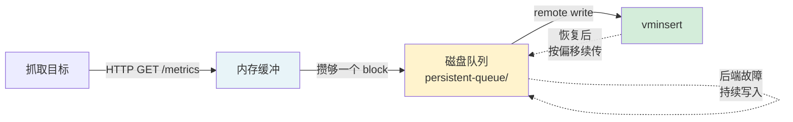
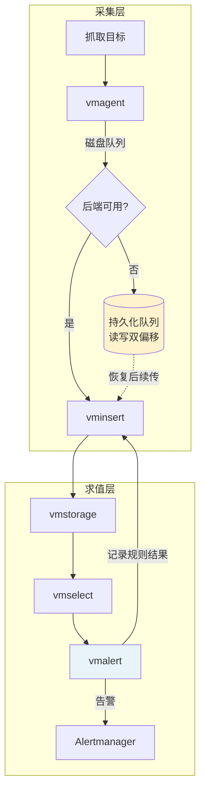

# 课 11：vmagent 与 vmalert

> 阶段 5「交给运维的那天」第 1 课
> 上一课：[课 10 多租户与 vmauth](../4-怎么横向扩展/10-多租户与vmauth.md) ｜ 返回：[课程目录](../../02-课程目录.md)

---

## 本课要回答的三个问题

前四个阶段解决的是「存储层能不能扛住」。这一课换个视角：**数据是怎么进来的，异常是怎么被发现的**。

1. Prometheus 自己抓取出的数据，在后端故障时会不会丢？vmagent 凭什么说不丢？
2. 告警规则从 Prometheus 搬到 vmalert，要改几个字？哪些写法在 Prometheus 里根本跑不了？
3. 用 vmagent + vmalert 换掉 Prometheus 之后，有哪些端点、哪些行为会悄悄变掉？

---

## 第一幕 · 场景引入：运维交接的那天

监控系统跑了三个多月，你要把它交给运维团队接管。交接文档写到一半，对方抛来三个问题：

> 「采集 agent 挂了怎么办？后端升级的时候数据会不会丢？」
> 「告警规则现在散在三个 Prometheus 实例上，能集中管吗？」
> 「我们想上 Grafana 的告警，和现在这套怎么选？」

这三个问题指向同一件事：**Prometheus 把「采集」「存储」「告警求值」三件事捆在一个进程里，而生产环境需要把它们拆开。**

VictoriaMetrics 给出的答案是两个组件：

| 组件 | 接管了 Prometheus 的哪部分 | 本质 |
|------|---------------------------|------|
| **vmagent** | 抓取（scrape）+ remote write | 纯采集器，**不存数据、不支持查询** |
| **vmalert** | 告警规则求值 + 记录规则求值 | 纯求值器，**不抓数据、不存数据** |

本课全部结论都来自本机实测，VM 版本 **v1.151.0**（2026-08-28 构建）。

---

## 第二幕 · 认知冲突：一个「不会丢数据」的承诺

vmagent 官方文档写着：「数据会先落盘到持久化队列，后端不可用时也不丢」。

这句话值得怀疑。原因有两个：

1. Prometheus 也有 remote write 队列，但它是**内存队列**——进程一崩，队列里的数据全没。
2. 「持久化」三个字可以有很多实现，到底是每条样本都 fsync，还是攒够一批才写？

先看 Prometheus 的实际配置（本机 `prom-learn` 容器中真实存在）：

```yaml
remote_write:
  - url: http://...
    queue_config:
      max_samples_per_send: 2000
      capacity: 5000        # ← 队列容量：5000 个样本
      max_shards: 10
```

`capacity: 5000` 是**按样本数**计的，且队列在**内存**里。按每样本约 200 字节估算，5000 个样本约 1 MB——5 秒抓取间隔下，这只够撑几百个目标的几轮抓取。

vmagent 的参数长得完全不一样：

```bash
-remoteWrite.maxDiskUsagePerURL=209715200   # 200 MB，按字节
-remoteWrite.tmpDataPath=/vmagent-remotewrite-data   # 落盘路径
```

**按字节 + 显式磁盘路径**，这是第一个信号：两者的队列根本不是同一种东西。

> 💡 **类比**：Prometheus 的队列像是收银台前的排队区——容量有限，店一关门（进程退出）队伍就散了。vmagent 的队列像是**仓库的卸货月台**——货卸下来先堆在月台上，仓库门关了货还在月台上堆着，门一开继续往里搬。
>
> **类比失效的边界**：月台也有容量上限，超过上限 vmagent 会**丢弃最老的数据**（不是阻塞），且这个上限的判定是"尽力而为"的——本课实验 5 会给出实测证据。

---

## 第三幕 · 层层揭示

### 知识点 1：vmagent 抓取与持久化队列

#### 一句话定义

vmagent 是一个**只负责采集和转发**的 agent，它用**磁盘持久化队列**缓冲待发送数据，从而在后端不可用时保证数据不丢。

#### 直觉建立

先把它跑起来。vmagent 的抓取配置**完全复用 Prometheus 的 `scrape_configs` 格式**——这是它能无痛替换 Prometheus 的前提。

```bash
docker run -d --name vmagent-learn --network vm-cluster-net \
  -p 8429:8429 \
  -v $PWD/prometheus-vmagent.yml:/etc/prometheus/prometheus.yml:ro \
  -v $PWD/vmagent-data:/vmagent-remotewrite-data \
  victoriametrics/vmagent:v1.151.0 \
  -promscrape.config=/etc/prometheus/prometheus.yml \
  -remoteWrite.url=http://vminsert-learn:8480/insert/0/prometheus/api/v1/write \
  -remoteWrite.maxDiskUsagePerURL=209715200 \
  -remoteWrite.tmpDataPath=/vmagent-remotewrite-data \
  -httpListenAddr=:8429
```

关键点：**`-promscrape.config` 直接吃 Prometheus 的配置文件**。文件格式、relabel 语法、`static_configs` / 服务发现，全部照搬。

启动后确认三个抓取目标都健康：

```
vmsingle       172.17.0.3:8428        health=up    samples=1083
vmagent-self   localhost:8429         health=up    samples=1015
vmselect       vmselect-learn:8481    health=up    samples=728
```

#### 核心原理：三段式缓冲

vmagent 的数据流是「内存 → 磁盘 → 网络」三段：



磁盘队列目录的真实结构（实测）：

```
/vmagent-remotewrite-data/persistent-queue/1_C3AA545DE75AD94A/
├── 0000000000000000    1,238,996 字节
├── flock.lock                   0 字节
└── metainfo.json               68 字节
```

`metainfo.json` 是整个机制的证据：

```json
{"Name":"1:secret-url","ReaderOffset":783845,"WriterOffset":1238996}
```

**读偏移与写偏移是分开记录的**——这正是它能"续传"的原因：发送端记住自己读到哪，写入端继续往后追加，两者互不干扰。

#### 示例演示：后端故障演练

这是本课最重要的实验。**关键是必须让后端真正断开**——`docker pause` 只是冻结进程，TCP 连接仍被内核接受，数据会进内核缓冲区，测不出队列行为。必须用 `docker stop`。

```bash
# 基线
curl -s http://localhost:8429/metrics | grep -E "^vmagent_remotewrite_(blocks_sent_total|pending_data_bytes|retries_count_total)"

# 断开后端
docker stop vminsert-learn vminsert-learn2

# 每 30 秒采样
```

实测结果（`l11-final-verify.sh` 真实输出）：

| 故障时长 | pending_data_bytes | retries | samples_dropped | 队列目录 |
|---------|-------------------|---------|-----------------|---------|
| 0s（基线） | 0 | 0 | 0 | 1,243,161 B |
| 30s | **0** | 33 | **0** | 1,243,161 B |
| 60s | **0** | 105 | **0** | 1,243,161 B |
| 90s | **225,586** | 172 | **0** | 1,468,747 B |
| 120s | **482,190** | 211 | **0** | 1,708,969 B |
| 150s | **722,357** | 232 | **0** | 1,996,538 B |

恢复后端后：

| 恢复后 | pending_data_bytes | blocks_sent | dropped |
|--------|-------------------|-------------|---------|
| +10s | **0** | 372 | 0 |
| +20s | 0 | 382 | 0 |
| +30s | 0 | 395 | 0 |
| +40s | 0 | 409 | 0 |

三个结论：

1. **`dropped` 全程为 0**——后端停机 150 秒，一个样本都没丢。这是本课的核心承诺，实测成立。
2. **恢复后 10 秒内队列排空**，且 `blocks_sent` 从 307 持续增长到 409——积压数据被补发。
3. **前 60 秒 `pending=0` 且目录不增长**——数据全在内存里，还没落盘。

第 3 点最重要，直接引出下一个误区。

#### 常见误区

**误区 1：以为队列一有数据就落盘。**

实测推翻：故障后 **60 秒内** `pending_data_bytes` 一直是 0，队列目录大小纹丝不动（1,243,161 B）。直到第 90 秒才开始增长。

原因是 vmagent 有**内存缓冲期**——数据先在内存攒着，攒够一定量或超过一定时间才落盘。这意味着：

- 短暂后端抖动（几十秒）根本用不到磁盘队列
- **但也意味着**：如果 vmagent 进程在内存缓冲期崩溃，这部分数据会丢

所以「持久化队列」保护的是**后端故障**，不是 **vmagent 自身崩溃**。

**误区 2：以为 `pending_data_bytes` 归零后磁盘文件会缩小。**

实测推翻：`pending` 恢复到 0 之后，队列文件**依然保持 1,238,996 字节**，重启 vmagent 后大小不变。

看 `metainfo.json`：`ReaderOffset: 783845 < WriterOffset: 1238996`——**读追上了写，但文件没有被截断**。磁盘队列是**只追加**的，靠偏移量判断读到了哪，不靠删除文件。

生产含义：不要按 `du` 出来的目录大小判断队列是否积压，**必须看 `vmagent_remotewrite_pending_data_bytes`**。

**误区 3：以为 `maxDiskUsagePerURL` 是硬上限。**

实测推翻：把上限设为 50 KB，队列一路涨到 **242 KB** 仍未丢弃（`dropped=0`）。

查官方 flag 说明（v1.151.0）发现关键一句：

> Buffered data is stored in **~500MB chunks**

即数据按约 500 MB 的块组织，小上限的判定是粗粒度的。这是**软约束**，不是精确的硬边界。生产上不要把磁盘配额卡得太死，按实际可用空间留足余量。

**误区 4：以为查询 vmagent 自身指标要用 `/api/v1/query`。**

实测推翻：

```
vmagent:8429/api/v1/query → HTTP 400
```

vmagent **不实现查询 API**——它是采集器，不是数据库。要查 vmagent 的自监控指标，直接抓它的 `/metrics` 端点；要查采集到的数据，去查后端 vmselect。这是与 Prometheus 的本质差异（Prometheus 三件事都做，vmagent 只做一件）。

#### 一句话记住

> vmagent 用**磁盘队列 + 读写双偏移**保证后端故障时不丢数据；但前 60 秒走内存缓冲，且磁盘文件只追加不回收——看积压要看指标，不要看目录大小。

---

### 知识点 2：vmalert 告警与记录规则

#### 一句话定义

vmalert 是**只做规则求值**的组件：它从 vmselect 查数据、按规则算出告警或预聚合结果，把告警发给 Alertmanager、把记录规则结果写回 VM。

#### 直觉建立

先看它和 Prometheus 的规则文件有什么不同——**答案是：几乎没不同**。

告警规则（`rules/alerts.yml`）：

```yaml
groups:
  - name: l11-basic
    rules:
      - alert: TargetDown
        expr: up == 0
        for: 10s
        labels:
          severity: critical
        annotations:
          summary: "抓取目标 {{ $labels.instance }} 已下线"
```

记录规则（`rules/recording.yml`）：

```yaml
groups:
  - name: l11-recording
    interval: 10s
    rules:
      - record: job:up:sum
        expr: sum by (job) (up)
```

**语法与 Prometheus 完全一致**——`alert` / `expr` / `for` / `labels` / `annotations` / `record`、Go template 变量 `{{ $labels.xxx }}` 与 `{{ $value }}`，全部照搬。

启动：

```bash
docker run -d --name vmalert-learn --network vm-cluster-net \
  -p 8880:8880 \
  -v $PWD/rules:/etc/vmalert:ro \
  victoriametrics/vmalert:v1.151.0 \
  -rule=/etc/vmalert/*.yml \
  -datasource.url=http://vmsel-dedup:8481/select/0/prometheus \
  -notifier.url=http://alertmanager-learn:9093 \
  -remoteWrite.url=http://vminsert-learn:8480/insert/0/prometheus \
  -remoteRead.url=http://vmsel-dedup:8481/select/0/prometheus \
  -httpListenAddr=:8880 \
  -evaluationInterval=5s
```

#### 核心原理：四个 URL 的分工

vmalert 有四个独立的 URL 参数，**各管一段，极易配错**：

| 参数 | 作用 | 配错的后果 |
|------|------|-----------|
| `-datasource.url` | 查询数据源（规则求值用） | 所有规则求值失败 |
| `-remoteRead.url` | 告警恢复判定（`-replay` 等场景） | 恢复检测异常 |
| `-remoteWrite.url` | **记录规则结果写回** | 记录规则算出但不落库 |
| `-notifier.url` | 告警发给 Alertmanager | 告警只在 vmalert 里，AM 收不到 |

⚠️ **本课踩到的真实坑**：`-remoteWrite.url` 会自动追加 `/api/v1/write`。如果你照着 vminsert 的写入地址写成：

```bash
-remoteWrite.url=http://vminsert-learn:8480/insert/0/prometheus/api/v1/write
```

日志会报：

```
unsupported path requested: "/insert/0/prometheus/api/v1/write/api/v1/write"
```

**这与课 10 vmauth 的 `url_prefix + 原始路径` 是同一个坑的不同表现**——课 10 里是 vmauth 拼接，这里是 vmalert 自动追加。正确写法是**去掉 `/api/v1/write` 后缀**：

```bash
-remoteWrite.url=http://vminsert-learn:8480/insert/0/prometheus   # ✅
```

识别方法：记录规则状态显示"无错误"，但后端查不到数据，就去看容器日志里有没有 `unsupported path`。

#### 示例演示 1：告警完整状态机

停止被抓取的目标 `vm-learn`，每 5 秒采样一次（`l11-final-alert.sh` 真实输出）：

| 时刻 | up(vmsingle) | vmalert | Alertmanager |
|------|-------------|---------|--------------|
| T+1×5s | 1 | 无 | 0 |
| T+5×5s | **1** | 无 | 0 |
| T+6×5s | **0** | 无 | 0 |
| T+7×5s | 0 | **TargetDown=pending** | 0 |
| T+8×5s | 0 | TargetDown=pending | 0 |
| T+9×5s | 0 | **TargetDown=firing** | **1** |
| T+16×5s | 0 | TargetDown=firing | 1 |

恢复后：

| 时刻 | vmalert | Alertmanager |
|------|---------|--------------|
| R+1×5s | TargetDown=firing | 1 |
| R+7×5s | TargetDown=firing | 1 |
| R+8×5s | **无** | **0** |

完整链路打通：`up=1 → up=0 → pending → firing → 送达 AM → 恢复 → 清除`。

**两个延迟值得记住**：

1. 停止容器后 **30 秒** `up` 才变 0——抓取有超时判定，不是立刻翻转
2. 恢复后 **35 秒**告警才清除——`up` 恢复需要重新抓取 + 求值周期

这意味着**告警从故障发生到发出，至少有一个抓取间隔 + 一个求值周期的延迟**。设计 `for` 时长时必须把这个算进去。

#### 示例演示 2：记录规则真的省查询开销吗

实测记录规则产物（写入后端）：

```
job:up:sum               job=vmagent-self   = 1
job:up:sum               job=vmselect       = 1
job:up:sum               job=vmsingle       = 1
job:scrape_samples:avg   job=vmagent-self   = 1015
job:scrape_samples:avg   job=vmselect       = 728
job:scrape_samples:avg   job=vmsingle       = 1081
```

⚠️ **诚实说明**：在只有 3 条序列的小数据集上，记录规则的耗时优势**被噪声淹没**：

```
原始 sum by(job)(up)  : 0.004098s / 0.001542s / 0.000809s
记录规则 job:up:sum   : 0.000901s / 0.001002s / 0.003053s
```

range 查询 6 小时窗口：

```
sum by(job)(up)  : 0.001973s / 0.001609s / 0.001626s
job:up:sum       : 0.001729s / 0.001006s / 0.000857s
```

数字互有胜负，**不能据此宣称"记录规则快 N 倍"**。记录规则的真实价值在于：把昂贵聚合的计算次数从「每次查询一次」降到「每个求值周期一次」——在**序列数多、查询并发高**的生产场景才显现。本课数据集太小，测量不出这个差异。

#### 示例演示 3：MetricsQL 直接可用（Prometheus 跑不了）

这是 vmalert 相对 Prometheus 的**增量**。同一批函数，两边对比：

| 表达式 | VM（vmselect） | Prometheus（prom-learn） |
|--------|---------------|-------------------------|
| `lag(up)` | ✅ 返回 `0.934` / `2.125` 等 | ❌ `parse error: unknown function with name "lag"` |
| `topk_avg(1, sum by (job) (up), "job")` | ⚠️ 参数类型错误时才报错 | ❌ `unknown function with name "topk_avg"` |

在记录规则里实测通过：

```yaml
- record: l11:mql:lag
  expr: lag(up{job="vmsingle"})
```

产出（tenant 0）：

```
l11:mql:lag   {instance="172.17.0.3:8428", job="vmsingle"}   = 3.018
```

**意义**：把 MetricsQL 的独有函数写进记录规则，等于让这些能力在告警链路里也生效。这是 vmalert 不是"Prometheus 告警的平替"，而是"加强版"的地方。

#### 常见误区

**误区 5：以为规则文件改了 reload 就生效。**

实测：**reload 返回 200，但新规则没加载**。查指标：

```
vmalert_config_last_reload_successful 0   # ← 0 表示失败
```

根因是我写错了 MetricsQL 语法：

```yaml
- record: l11:mql:lagtest
  expr: lag(up[job="vmsingle"])    # ❌ label matcher 放进方括号了
```

正确写法（`{...}` 花括号）：

```yaml
- record: l11:mql:lag
  expr: lag(up{job="vmsingle"})    # ✅
```

更糟的是，这个错误让 **vmalert 重启时直接 fatal**：

```
fatal  cannot parse configuration file: failed to parse [/etc/vmalert/*.yml]
  invalid group "l11-mql": bad MetricsQL expr: "lag(up[job=\"vmsingle\"])"
```

**判据**：改完规则后必须查 `vmalert_config_last_reload_successful`，为 1 才算生效。修复语法后实测：

```
POST /-/reload → 200
vmalert_config_last_reload_successful 1
l11:reload:proof → 有数据: 1     # 新规则生效
```

**误区 6：以为 vmalert 有 `/healthz`。**

实测：

```
vmalert /healthz → HTTP 400  body="unsupported path requested: \"/healthz\""
vmalert /health  → HTTP 200
prometheus /-/healthy → HTTP 200
```

**vmalert 没有 `/healthz` 端点，只有 `/health`**（少一个 z）。如果你把 Prometheus 的健康检查配置直接搬过来，探针会一直失败。

**误区 7：把 vmalert 的数据源指向它自己要监控的目标。**

我第一版把 `-datasource.url` 配成 `vmselect-learn`，然后停止 `vmselect-learn` 来触发告警——结果 vmalert 自己的数据源也断了，告警永远触发不了，还出现"停止时 0 条告警、恢复后反而 1 条"的诡异时序。

**判据**：做告警演练时，**被停的目标绝不能是 vmalert 的数据源**。应改用另一个 vmselect（如 `vmsel-dedup`）。

#### 一句话记住

> vmalert 是「Prometheus 规则语法 + MetricsQL 函数 + 四个 URL 各管一段」；改完规则必须查 `vmalert_config_last_reload_successful`，健康检查用 `/health` 不是 `/healthz`。

---

### 知识点 3：与 Prometheus / Alertmanager 的兼容与差异

#### 一句话定义

vmagent + vmalert 在**配置文件格式**和**规则语法**上高度兼容 Prometheus，但在**HTTP 端点**和**部分行为**上存在明确差异。

#### 直觉建立：兼容性对照表

同一台机器上，三个组件并排探测（`l11-final-verify.sh` 实测）：

| 端点 | vmagent:8429 | vmalert:8880 | Prometheus:9090 |
|------|-------------|-------------|-----------------|
| `/api/v1/targets` | ✅ 200 | ❌ 400 | ✅ 200 |
| `/api/v1/status/config` | ✅ 200 | ❌ 400 | ✅ 200 |
| `/api/v1/status/flags` | ❌ **400** | ❌ **400** | ✅ 200 |
| `/-/reload` | ✅ 200 | ✅ 200 | ❌ 405（需 POST） |
| `/config` | ✅ 200 | ❌ 400 | ✅ 200 |
| `/service-discovery` | ✅ 200 | ❌ 400 | ✅ 200 |
| `/api/v1/query` | ❌ 400 | ❌ 400 | ⚠️ 400（需带参数） |

三个可直接落地的结论：

1. **`/api/v1/status/flags` 两边都不支持**——Prometheus 返回 200，vmagent/vmalert 返回 400。任何依赖这个端点的工具（部分 Grafana 数据源探测、自动化巡检脚本）会失败。
2. **vmalert 只有规则相关端点**（`/api/v1/rules`、`/api/v1/alerts`），没有 Prometheus 的 targets / config / service-discovery。
3. **vmalert 的 `/-/reload` 支持 GET**，Prometheus 只支持 POST（GET 返 405）。

#### 核心原理 1：告警链路的对接方式

vmalert 通过 `-notifier.url` 对接 Alertmanager，走的是标准 Alertmanager v2 API：

```
vmalert_alerts_sent_total{addr="http://alertmanager-learn:9093/api/v2/alerts"} 18
```

实测告警送达后，Alertmanager 的 `/api/v2/alerts` 能查到告警，且带完整的 labels 与 status。**Alertmanager 侧无需任何 VM 特有配置**——这意味着你现有的 Alertmanager 路由、静默、抑制规则全部可以复用。

```yaml
# alertmanager.yml —— 标准配置，无 VM 特有字段
global:
  resolve_timeout: 5m
route:
  receiver: 'devnull'
  group_wait: 5s
  group_interval: 10s
  repeat_interval: 30s
receivers:
  - name: 'devnull'
```

#### 核心原理 2：什么时候该用 vmagent 替代 Prometheus

这是本课的**决策结论**。

| 场景 | 建议 | 理由 |
|------|------|------|
| 后端是 VictoriaMetrics 集群 | ✅ **用 vmagent** | 磁盘队列保证后端故障时数据不丢（本课实测） |
| 采集目标数量大（数千+） | ✅ 用 vmagent | 内存占用显著低于 Prometheus，且可水平拆分多个 vmagent |
| 需要在采集端做基数治理 | ✅ 用 vmagent | relabel + 流式聚合（见下一节） |
| 需要本地查询历史数据 | ❌ **保留 Prometheus** | vmagent **不实现查询 API**（实测 `/api/v1/query` 返 400） |
| 依赖 Prometheus 的 Alertmanager 之外的高级特性 | ⚠️ 需评估 | 部分端点不兼容 |
| 已有 Prometheus 运行良好、规模不大 | ⚠️ 不必换 | 迁移有成本，收益有限 |

#### 核心原理 3：采集端的基数治理

课 4 讲过基数治理，但那是**写入侧**。vmagent 提供了**采集侧**的两个手段：

**手段一：抓取上限（硬拦截）**

```bash
-promscrape.maxScrapeSize=1000          # 单次抓取响应体上限（字节）
-promscrape.seriesLimitPerTarget=50     # 单个目标的序列数上限
```

实测 `-promscrape.maxScrapeSize=1000`：

```
vmsingle       samples=0    err=...exceeds...
vmagent-self   samples=0    err=...exceeds...
vmselect       samples=0    err=...exceeds...
```

**三个目标全部 samples=0，硬拦截生效**——这个参数用来防"某个目标突然吐出几百 MB 指标拖垮 agent"。

**手段二：流式聚合（stream aggregation）**

在采集端按时间窗口预聚合，把多条样本压成一条再写入后端。

```yaml
# stream-aggr.yml
- match: '{__name__="up"}'
  interval: 30s
  outputs: [sum_samples]
  keep_metric_names: true
```

实测（写入 tenant 79）：

```
tenant 79（vmagent + 流式聚合）指标数 = 337
tenant 0 （vmagent 原始全量）  指标数 = 440
```

#### 示例演示

**示例 1：并排探测三个组件的端点**

```bash
for ep in /api/v1/targets /api/v1/status/flags /-/reload; do
  for port in 8429 8880 9090; do
    printf "%-28s :%s -> %s\n" "$ep" "$port" \
      "$(curl -s -o /dev/null -w '%{http_code}' http://localhost:$port$ep)"
  done
done
```

实测结论：`/api/v1/status/flags` 在 vmagent/vmalert 上**都是 400**，Prometheus 是 200。

**示例 2：`maxScrapeSize` 的硬拦截**

```bash
docker run -d --name vmagent-sz \
  -promscrape.config=/etc/prometheus/prometheus.yml \
  -promscrape.maxScrapeSize=1000 \
  -remoteWrite.url=http://vminsert-learn2:8480/insert/0/prometheus
```

三个目标**全部 `samples=0`**，报 `exceeds...`。这个参数用于防"某个目标突然吐出几百 MB 指标拖垮 agent"。

**示例 3：流式聚合的基数缩减**

tenant 79 走流式聚合、tenant 0 走原始全量，同一批目标：

```
tenant 79（vmagent + 流式聚合）指标数 = 337
tenant 0 （vmagent 原始全量）  指标数 = 440
```

#### 常见误区

**误区 8：以为 `keep_metric_names` 只是改个名字。**

实测发现它有两个致命约束，我都踩了：

**坑 A：全量匹配时把所有指标名抹平。**

用 `- match: '{__name__=~".+"}'` 匹配所有指标 + `keep_metric_names: false`，tenant 里 341 个指标**全部丢失原名**，`up` 彻底消失。聚合产物全挤在一个没有辨识度的名字下。

**坑 B：与多个 outputs 冲突，直接 fatal。**

```yaml
- match: '{__name__="up"}'
  outputs: [sum_samples, count_samples]
  keep_metric_names: true      # ← 冲突
```

容器启动即崩：

```
fatal  cannot initialize aggregator #0:
  `outputs` list must contain only a single entry if `keep_metric_names` is set;
  got ["sum_samples" "count_samples"]
```

**规则：`keep_metric_names: true` 时，`outputs` 只能有一个值。**

**误区 9：以为流式聚合的产物是独立的新指标。**

实测推翻。`keep_metric_names: true` 时，聚合结果**写回同名指标**：

```
tenant 79  up  = ['10', '6', '6']
tenant 0   up  = ['1', '1', '1', '1', '1', '1', '1', '1']
```

`up` 从 1 变成 6/10——`sum_samples` 把 30 秒窗口内（5 秒间隔 ≈ 6 次抓取）的值累加了。

**这是数据污染，不是优化。** 若要保留原始 `up`，必须配合 `drop_input` / `keep_input` 谨慎配置，或把聚合结果写到独立租户。生产上使用流式聚合前，务必先在测试租户验证产物语义。

#### 一句话记住

> 配置文件和规则语法兼容 Prometheus，**HTTP 端点不兼容**（`status/flags` 和 vmalert 的 `/healthz` 都是坑）；采集端可用 `maxScrapeSize` 硬拦截与流式聚合降基数，但 `keep_metric_names` 有两条硬性约束。

---

## 第四幕 · 实操验证

### 实验清单与判据

| # | 实验 | 判据 | 结果 |
|---|------|------|------|
| 1 | vmagent 启动并抓取 3 个目标 | `/api/v1/targets` 三个 health=up | ✅ 1083/1015/728 样本 |
| 2 | 后端故障 150 秒 | `samples_dropped` 全程为 0 | ✅ 0 |
| 3 | 队列落盘时机 | 前 60s pending=0，90s 起增长 | ✅ 0→225586→722357 |
| 4 | 恢复后排空 | pending 归零、blocks_sent 继续涨 | ✅ 307→409 |
| 5 | 队列上限软约束 | 50KB 上限涨到 242KB 未丢弃 | ✅ 软约束成立 |
| 6 | 记录规则写入后端 | 后端能查到 `job:up:sum` | ✅ 3 个 job 各有值 |
| 7 | MetricsQL 进记录规则 | `lag()` 产出数据 | ✅ 3.018 |
| 8 | Prometheus 对照 | 同函数在 prom-learn 报错 | ✅ `unknown function` |
| 9 | 告警完整状态机 | pending→firing→AM 收到→清除 | ✅ 全流程打通 |
| 10 | reload 生效 | `config_last_reload_successful=1` + 新规则产出 | ✅ |
| 11 | 健康检查端点 | vmalert 无 `/healthz`，有 `/health` | ✅ 400 / 200 |
| 12 | 兼容性端点表 | 三组件并排探测 | ✅ 7 个端点 |
| 13 | 流式聚合 | 聚合产物写入 + 三个坑复现 | ✅ 337 vs 440 |

### 可复现脚本

全部脚本位于 `victoriametrics/playground/`：

| 脚本 | 用途 |
|------|------|
| `l11-vmagent-start.sh` | 启动 vmagent（含持久化队列配置） |
| `l11-queue-real.sh` | 队列故障演练（docker stop 版） |
| `l11-queue-disk.sh` | 长窗口落盘观察（150 秒） |
| `l11-vmalert-start.sh` | 启动 vmalert + Alertmanager |
| `l11-vmalert-fix2.sh` | 修正 remoteWrite 路径后重启 |
| `l11-final-alert.sh` | 告警状态机高频轮询 |
| `l11-mql-fix.sh` | MetricsQL 规则修正与 reload 验证 |
| `l11-final-verify.sh` | 兼容性端点表 + 队列演练 |
| `l11-aggr-final2.sh` | 流式聚合（正确配置） |

> ⚠️ 所有脚本须经 WSL 执行：`wsl bash -lc "cd /mnt/d/projects/learning/victoriametrics/playground && bash xxx.sh"`
> 执行前先 `sed -i 's/\r$//' xxx.sh` 去掉 Windows 换行符。

---

## 第五幕 · 体系收束

### 本课核心结论



1. **vmagent 的持久化队列是真的**——后端停机 150 秒零丢弃，靠的是磁盘队列 + 读写双偏移。
2. **但有内存缓冲期**——前 60 秒走内存，vmagent 自身崩溃仍会丢数据。
3. **vmalert 语法兼容 Prometheus，能力超出 Prometheus**——MetricsQL 可直接写进记录规则。
4. **端点兼容性有明确缺口**——`status/flags` 两边都没有，vmalert 没有 `/healthz`。
5. **采集端可治理基数**——`maxScrapeSize` 硬拦截、流式聚合降基数，但后者有两个致命配置约束。

### 与前后课程的连接

| 连接点 | 说明 |
|--------|------|
| ← 课 4 基数治理 | 课 4 是写入侧治理，本课补上采集侧（relabel + 流式聚合） |
| ← 课 8/9 集群 | vmagent 写入 vminsert，vmalert 查询 vmselect，链路闭合 |
| ← 课 10 多租户 | vmalert 的 `remoteWrite.url` 路径坑与 vmauth 的拼接坑同源 |
| → 课 12 备份迁移 | 采集与告警链路标准化后，才能谈备份与迁移 |

### 🐞 常见误区汇总

1. 以为队列一有数据就落盘（实测前 60 秒在内存）
2. 以为 `pending` 归零后磁盘文件会缩小（只追加不截断）
3. 以为 `maxDiskUsagePerURL` 是硬上限（实测是软约束，按 ~500MB 块组织）
4. 以为能用 `/api/v1/query` 查 vmagent（它是采集器，返 400）
5. 以为改完规则 reload 就生效（必须查 `config_last_reload_successful`）
6. 以为 vmalert 有 `/healthz`（只有 `/health`，少一个 z）
7. 把 vmalert 数据源指向自己要监控的目标（告警永远触发不了）
8. 以为 `keep_metric_names` 只是改名字（全量匹配会抹平所有指标名；与多 outputs 冲突会 fatal）
9. 以为流式聚合产物是独立新指标（实测写回同名指标，`up` 从 1 变成 6）

### 决策清单

- [x] **什么时候用 vmagent 替代 Prometheus**：后端是 VM 集群、目标数量大、需采集端治理时；需要本地查询时保留 Prometheus
- [ ] **告警规则放 vmalert 还是 Grafana**：vmalert 适合集中管理 + MetricsQL 场景；Grafana 适合以面板为中心的团队
- [ ] **流式聚合用不用**：先在测试租户验证产物语义，确认不会污染同名指标
- [ ] **队列磁盘配额怎么定**：按实际可用空间留余量，别卡太死（软约束）

---

## 🚀 下一批接力提示词

```text
继续 VictoriaMetrics 课 12《备份恢复、迁移与选型决策》（阶段 5 第 2 课）。

【当前状态】
- 课 11 已交付，阶段 5 第 1 课完成
- 环境：WSL Ubuntu + Docker 29.4.1，20 核 / 31 GB
- VM 版本：v1.151.0（2026-08-28 构建）
- 本机 Windows 侧无 Docker，所有容器操作须经 wsl bash -lc 执行

【在运行的容器（课 11 结束时）】
- vm-learn:8428（单节点）
- 集群：vmstorage-learn / vmstorage-learn2、vminsert-learn / vminsert-learn2、
  vmselect-learn:8481 / vmselect-learn2:8489 / vmsel-dedup:8487
- vmagent-learn:8429（持久化队列 /vmagent-remotewrite-data）
- vmalert-learn:8880（规则目录 playground/rules/）
- alertmanager-learn:9093
- prom-learn:9090（对照用）

【课 12 必须覆盖的知识点】
- 知识点 1：快照与备份恢复（vmbackup / vmrestore）
- 知识点 2：迁移路径
- 知识点 3：选型决策：什么时候不该用 VM

【待解伏笔（来自阶段 5 README）】
- 多集群之间怎么迁移数据？
- 灾难恢复的 RTO / RPO 怎么定？

【必须回写的四处档案】
1. 00-学习档案.md（进度表本课三行 + 评审记录 + 事实核查 + 断点信息）
2. 00-评审清单.md（本课勾选 + 评审记录表追加）
3. stages/5-生产落地/README.md 或对应 overview（课 12 标 ✅、阶段状态、核心结论）
4. 02-课程目录.md 与 01-学习路径总览.md（索引链接与进度条）
交付后跑一次链接可达性检查。

【课 11 遗留未闭环，课 12 可顺带验证】
- 磁盘队列文件只追加不截断：长时间运行后文件是否会无限增长？
- vmalert 的 -remoteRead.url 具体作用于哪些场景（本课未实测）
- 流式聚合在 drop_input / keep_input 各种组合下的产物语义（本课只测了一种组合）

【沿用约定】
- 每条命令真跑一遍，脚本写入 playground/l12-*.sh
- 五幕结构 + 六要素 + 接力提示词 + 课程导航
- 双 agent 交叉评审（pedagogy + learner），可对用户可见
- 危险操作（rm -rf / docker stop）加安全提示
```

---

## 🧭 课程导航

- **上一课**：[课 10 多租户与 vmauth](../4-怎么横向扩展/10-多租户与vmauth.md)
- **下一课**：[课 12 备份恢复、迁移与选型决策](12-备份恢复迁移与选型决策.md)（收官课）
- **阶段首页**：[阶段 5：生产落地](README.md)
- **返回**：[课程目录](../../02-课程目录.md) ｜ [学习路径总览](../../01-学习路径总览.md)
- **学习档案**：[00-学习档案.md](../../00-学习档案.md) ｜ [00-评审清单.md](../../00-评审清单.md)

---

> 实测环境：VictoriaMetrics v1.151.0 / Alertmanager v0.27.0 / Docker 29.4.1 / WSL Ubuntu
> 核查于 2026-09
