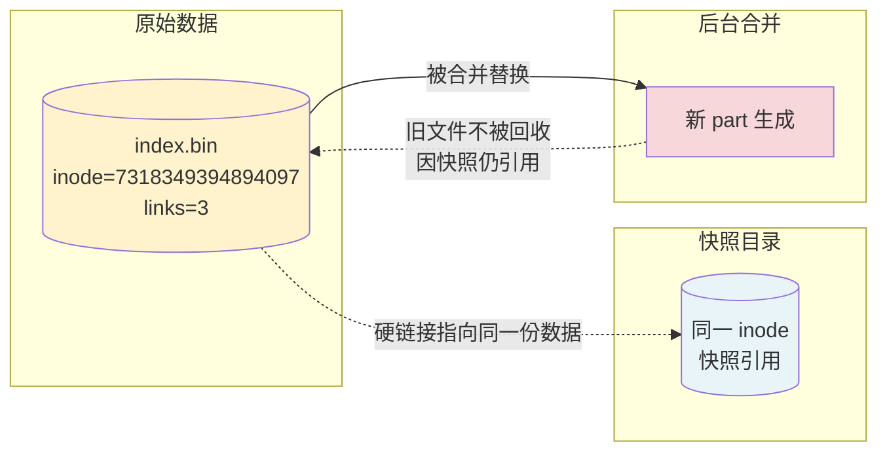

# 课 12：备份恢复、迁移与选型决策

> 阶段 5「交给运维的那天」第 2 课（收官课）
> 上一课：[课 11 vmagent 与 vmalert](11-vmagent与vmalert.md) ｜ 返回：[课程目录](../../02-课程目录.md)

---

## 本课要回答的三个问题

前 11 课解决的是「系统怎么搭起来、怎么扛住、怎么被发现异常」。这一课问的是最后三件事：

1. 数据目录被误删了，能救回来吗？救回来会丢多少？（备份与灾难恢复）
2. 从 Prometheus 迁到 VM、从老集群迁到新集群，路怎么走？迁完怎么证明没迁错？（迁移路径）
3. VM 这么好，是不是什么场景都该用它？**什么时候不该用？**（选型决策）

本课全部结论来自本机实测，VM 版本 **v1.151.0**（2026-08-28 构建），环境为 WSL Ubuntu + Docker 29.4.1。

---

## 第一幕 · 场景引入：运维接手的第三个月

运维团队接手监控系统三个月了。某天上午，你收到一条消息：

> 「刚才做磁盘清理，执行了 `rm -rf /data/victoriametrics/*`，监控数据全没了。有备份吗？」

（⚠️ 这是事故引述，不是可执行命令。`rm -rf` 针对数据目录属高危操作，切勿在任何环境中照抄执行。）

你打开备份脚本的定时任务，发现它确实每天跑，但有三个你从没验证过的问题：

1. **备份到底能不能恢复？** 脚本每天报成功，可从来没人真的恢复过一次。
2. **能恢复到什么程度？** 是恢复到昨天凌晨（丢一天数据），还是能恢复到出事前 5 分钟？
3. **恢复要多久？** 10 分钟还是 4 小时？这段时间监控是瞎的。

这三个问题分别对应三个指标：**可恢复性、RPO（恢复点目标）、RTO（恢复时间目标）**。

绝大多数团队的备份体系倒在第 1 个问题上——**没恢复过的备份，等于没有备份**。

本课的三幕分别回答：备份怎么做才可信（知识点 1）、数据怎么搬（知识点 2）、以及最后一个更根本的问题——**什么时候根本不该用 VM**（知识点 3）。

---

## 第二幕 · 认知冲突：「备份是拷贝文件」这个想当然

提到备份，直觉是「把数据目录打包拷走」。对 PostgreSQL、MySQL 这类数据库，你得先停库或者加锁才能保证备份是一致的。那 VM 呢？

先看一个反直觉的事实。VM 的数据目录在持续被写入、被后台合并，直接拷会怎样？试试看：

```bash
# 危险操作示意：不要直接对运行中的数据目录做打包
docker run --rm \
  -v $PWD/data:/victoria-metrics-data:ro \
  -v $PWD/l12-backup:/backup \
  victoriametrics/vmbackup:v1.151.0 \
  -storageDataPath=/victoria-metrics-data \
  -dst=fs:///backup
```

实测结果（本课实验 8）：

```text
fatal  cannot create backup: -origin cannot be empty when
       -snapshotName and -snapshot.createURL aren't set
```

**vmbackup 拒绝在没有快照的情况下工作。**

这不是 bug，是设计。它强迫你先创建一个**快照**，而 VM 的快照不是拷贝——它几乎瞬间完成，且不额外占用磁盘空间。

先看实测（本课实验 1、5）：

| 动作 | 数据目录大小 | df 真实磁盘占用变化 |
|------|-------------|-------------------|
| 创建快照前 | 8,809,569 B | 61,917,708 KB |
| 创建快照后 | 8,863,623 B（du 变大） | **+184 KB**（几乎为 0） |

`du` 变大了 54 KB，但 `df` 只增加了 184 KB（其中大部分是元数据文件）。**同一个文件被两个路径引用，磁盘上只有一份数据**——这就是硬链接。

> 💡 **类比**：快照像是给一本书拍了张「目录照片」——你按下快门的瞬间，书的页码布局被固定下来了。之后有人往书里插页、撕页，照片里的目录不变。而且拍照不花钱（不占空间），因为照片指向的还是原来那些纸。
>
> **类比失效的边界**：现实中被撕掉的纸就没了；而 VM 的快照靠硬链接保持文件不被回收，**被保留的文件会一直占着磁盘**——如果原始数据被后台合并删除了，快照里的那份仍会占据空间。所以「快照不占空间」只在没有数据变更时成立，长期保留快照是有成本的。

---

## 第三幕 · 层层揭示

### 知识点 1：快照与备份恢复

#### 一句话定义

VM 的备份分两步：**快照**（在本地生成数据的冻结视图，靠硬链接实现，几乎零成本）+ **上传**（vmbackup 把快照内容传到远端存储），恢复时 vmrestore 反向执行。

#### 直觉建立

三个动作，一条命令一个：

```bash
# 第 1 步：创建快照（毫秒级，返回快照名）
curl -s http://localhost:8428/snapshot/create
# {"status":"ok","snapshot":"20260902121059-18D17DD6F49B1C97"}

# 第 2 步：备份快照到远端（本地目录 / S3 / GCS / Azure）
docker run --rm \
  -v $PWD/data:/victoria-metrics-data:ro \
  -v $PWD/l12-backup:/backup \
  victoriametrics/vmbackup:v1.151.0 \
  -storageDataPath=/victoria-metrics-data \
  -snapshotName=20260902121059-18D17DD6F49B1C97 \
  -dst=fs:///backup

# 第 3 步：恢复（目标必须是空的、且未运行的 VM 数据目录）
docker run --rm \
  -v $PWD/l12-backup:/backup:ro \
  -v $PWD/l12-restore:/victoria-metrics-data \
  victoriametrics/vmrestore:v1.151.0 \
  -src=fs:///backup \
  -storageDataPath=/victoria-metrics-data
```

第 1 步实测耗时 **1.475 秒**（日志自报 `in 1.475 seconds`），第 2 步上传 7,169,266 字节耗时 **2.76 秒**。

#### 核心原理：硬链接让快照几乎免费

快照为什么能瞬间完成又不占空间？因为它是**硬链接**构成的目录树。



实测铁证（本课实验 4）——快照里的文件和原始数据文件是同一个 inode：

```text
快照文件：/victoria-metrics-data/data/small/snapshots/20260902121355-.../2026_09/18D17091CFBC3743/index.bin
  快照侧：inode=7318349394894097 links=3 size=167421
  原始侧：/victoria-metrics-data/data/small/2026_09/18D17091CFBC3743/index.bin
  原始侧：inode=7318349394894097 links=3 size=167421
```

`inode` 完全相同，`links=3` 表示这个 inode 被三个目录项引用（原始位置 + 快照位置 + 另一处快照）。**磁盘上只有一份数据。**

这就解释了开头的 df 数据：建快照只多了 **184 KB**（元数据文件），而不是 6.8 MB。

同时验证「快照是冻结视图」（本课实验 2）——建完快照后灌入 300 条新序列：

```text
快照文件 md5（写入前）= 7dea362b3fac8e00956a4952a3d4f474
快照文件 md5（写入后）= 7dea362b3fac8e00956a4952a3d4f474
结论：快照内容未被后续写入改变 ✅
```

#### 示例演示：完整走一遍备份与恢复

**场景**：单节点 `vm-learn`（41,772 条序列），备份后恢复到一个全新的实例。

第 1 步，制造可辨识的标记数据（这样恢复后才能证明「确实是这批数据回来了」）：

```bash
TS=$(date +%s)
for i in $(seq 1 50); do
  printf 'l12_disaster_marker{job="l12",batch="before_backup",i="%s"} %s %s000\n' "$i" "$i" "$TS"
done > /tmp/l12_marker.txt
curl -X POST --data-binary @/tmp/l12_marker.txt \
  http://localhost:8428/api/v1/import/prometheus
```

第 2 步，备份。第一次是全量，第二次只传增量：

| 备份次序 | 上传字节 | 服务端删除 | 耗时 |
|---------|---------|-----------|------|
| 第 1 次（全量） | **7,169,266 B** | 0 B | 2.760 s |
| 第 2 次（增量） | **136,362 B** | 452,812 B | 5.225 s |

**第 2 次只上传了 136 KB**，是全量的 1.9%。这就是增量备份的价值。

第 3 步，恢复到全新目录并启动新实例验证：

```text
恢复：restored 7057783 bytes from backup in 0.105 seconds
启动：/health HTTP=200
核对：
  源端序列数      = 41,772
  恢复端序列数    = 41,774
  before_backup   = 50 条 ✅
  after_backup    = 50 条 ✅
  i="7" 抽查值    = after_backup: 7 / before_backup: 7 ✅
  指标名清单      = 源端 618 / 恢复端 618 ✅
```

序列数差 2 条，是因为恢复期间源实例仍在被 vmagent 写入——**这不是数据丢失，是时间差**。

#### 常见误区

**误区 1：以为快照会把数据复制一份。**
实测建快照 df 只增加 184 KB，硬链接 `links=3` 证明是同一份数据。

**误区 2：以为 `du -sh` 能看出快照占了多少空间。**
`du` 会把硬链接重复计数，实测建快照后 `du` 从 8,809,569 B 涨到 8,863,623 B（+54 KB），但 df 只涨 184 KB。**判断磁盘真实占用必须用 `df`，不能用 `du`。**

**误区 3：以为备份期间服务会阻塞。**
实测备份进行中同时发起 20 次写入：**成功 20 / 失败 0 / 总耗时 316 ms**；同时查询 `up` 耗时 0.0397 秒，`/health` 返 200。备份读的是快照，不阻塞在线读写。

**误区 4：以为恢复可以往正在运行的实例里写。**
vmrestore 要求目标目录是**空的且 VM 未运行**。往运行中的实例恢复会导致数据损坏。

**误区 5：以为 `-dst=s3://http://host:port/bucket/path` 是对的。**
这是本课踩的坑之一。S3 的地址格式是 **bucket 和 endpoint 分离**的：

```bash
# ❌ 错误：把 endpoint 塞进 bucket 位
-dst=s3://http://172.23.0.4:9000/vmbackup-l12
# 报错：api error InvalidBucketName: The specified bucket is not valid

# ✅ 正确
-dst=s3://vmbackup-l12/full \
-customS3Endpoint=http://172.23.0.4:9000
```

**误区 6：以为恢复目标目录放哪都行。**
实测在 Windows `D:\` 经 9p 挂载的目录上恢复会失败：

```text
fatal  cannot preallocate data/small/2026_09/parts.json:
       cannot fallocate 210 bytes: operation not supported
```

**9p 文件系统不支持 `fallocate`**。解决办法是改用容器内部卷（overlay）：

```bash
docker volume create l12_restore_vol
docker run --rm \
  -v l12_backup_vol:/backup:ro \
  -v l12_restore_vol:/victoria-metrics-data \
  victoriametrics/vmrestore:v1.151.0 \
  -src=fs:///backup -storageDataPath=/victoria-metrics-data
```

改用命名卷后恢复成功（`restored 7057783 bytes in 0.105 seconds`）。**这是本环境的特有坑（Windows + WSL + 9p），Linux 原生环境无此问题。**

#### 补论：快照长期保留会占多少空间（A/B 定量实测）

上面的结论「快照几乎免费」只说了一半。快照本身是硬链接不占空间，但**只要快照还在，它引用的数据块就无法被回收**。这个代价有多大？做了严格 A/B 对照：起两个完全相同的实例，灌入同一份数据（6,000 序列 / 60,000 样本），A 组建快照、B 组不建，然后**同时删除同一批数据、同时触发合并**。

| 阶段 | A 组（带快照） | B 组（无快照） | 差异 |
|------|--------------|--------------|------|
| 灌完数据后 | 3,972 KB | 2,892 KB | 1,080 KB |
| 删除 + 合并后 | **4,600 KB** | 3,456 KB | **1,144 KB** |
| 删除快照后 | **3,472 KB**（↓1,128 KB） | — | — |
| 终态 | 3,472 KB | 3,456 KB | 16 KB |

三组数字说明三件事：

1. **带快照时删除+合并，空间不降反升 628 KB**（3,972 → 4,600 KB）。因为被快照冻结的数据块不能在合并中丢弃，VM 只能把「未删除的数据」重写一份，导致总占用上升。
2. **删除快照的瞬间立刻释放 1,128 KB**（4,600 → 3,472 KB）。这是纯粹的硬链接解除，不需要再合并。
3. **A 组删掉快照后（3,472 KB）与 B 组终态（3,456 KB）几乎持平，差 16 KB**——说明快照的代价是**完全可逆的**，不会永久损失空间。

**定量结论**：本实验规模下（6,000 序列），一个被长期保留的快照，在其存在期间会让删除操作**少回收约 1.1 MB**，约占数据总量的 **28%**。快照越多、跨越的删除越多，这个数字越大。

**所以「快照不宜长期保留」是定量成立的**：快照的成本不是它自己占的空间（68 KB），而是它**阻止别人回收的空间**（1,128 KB），后者是前者的 16 倍。

> 💡 **类比**：快照像给房间里的家具拍了张照片并公证「这些家具不许扔」。照片本身不占地方，但只要公证有效，你要扔的旧沙发就必须继续堆在房间里。
>
> **类比失效的边界**：现实中解除公证可能需要手续费；VM 删除快照是纯元数据操作，实测瞬间完成且立即释放空间。

#### 一句话记住

**快照是硬链接的冻结视图（几乎免费），备份是快照的远端拷贝（首次全量、之后增量），恢复是反向下载——三者必须分开理解，也分开执行。快照真正的成本不是它占了 68 KB，而是它阻止了 1,128 KB 被回收。**

---

### 知识点 2：迁移路径

#### 一句话定义

vmctl 是官方迁移工具，支持 **8 种源**（OpenTSDB / InfluxDB / Prometheus remote-read / Prometheus snapshot / Mimir / Thanos / VM-native / block 校验），迁移的本质是「按时间窗口切片导出 → 并发导入」。

#### 直觉建立

先看清 vmctl 的全貌（v1.151.0 实测）：

```text
COMMANDS:
   opentsdb      Migrate time series from OpenTSDB
   influx        Migrate time series from InfluxDB
   remote-read   Migrate time series via Prometheus remote-read protocol
   prometheus    Migrate time series from Prometheus
   mimir         Migrate time series from Mimir object storage or local filesystem
   thanos        Migrate time series from Thanos blocks
   vm-native     Migrate time series between VictoriaMetrics installations
   verify-block  Verifies exported block with VictoriaMetrics Native format
```

三条主路径：

| 路径 | 适用场景 | 停机要求 |
|------|---------|---------|
| `remote-read` | Prometheus 还活着，按时间窗口边跑边迁 | 无需停机 |
| `prometheus` | 从 Prometheus 快照目录迁（Prometheus 已停） | 需停机 |
| `vm-native` | VM → VM（单节点↔集群、集群间、跨租户） | 无需停机 |

#### 核心原理：时间窗口切片 + 并发导入

迁移不是一次性搬运，vmctl 把时间范围切成片，每片一个导出请求，多个 worker 并发导入。关键参数：

```bash
--remote-read-step-interval=hour   # 切片粒度：month/week/day/hour/minute
--remote-read-concurrency=2        # 源端并发读
--vm-concurrency=4                 # 目标端并发写
```

实测一次 6 小时窗口、按小时切片的迁移（本课实验 20）：

```text
Import finished!
VictoriaMetrics importer stats:
  time spent while importing: 5.755661045s
  total samples: 10,580,035
  samples/s: 1,838,196.33
  total bytes: 195.4 MB
  bytes/s: 33.9 MB
  import requests: 53
  import requests retries: 0
Total time: 5.759821455s
```

**1058 万样本、195.4 MB，5.76 秒迁完**。迁移后 VM 指标名从 619 涨到 **646**——新增的 27 个是 Prometheus 独有、VM 原本没有的（如 `go_gc_*` 系列）。

#### 示例演示：把 Prometheus 的数据迁到 VM

```bash
docker run --rm --network host \
  victoriametrics/vmctl:v1.151.0 \
  remote-read \
  -s --disable-progress-bar \
  --vm-addr=http://localhost:8428 \
  --remote-read-src-addr=http://localhost:9090 \
  --remote-read-filter-time-start=2026-09-02T06:00:00Z \
  --remote-read-filter-time-end=2026-09-02T13:00:00Z \
  --remote-read-step-interval=hour
```

三个必须注意的参数坑（本课逐个踩过）：

1. **`-s` 和 `--disable-progress-bar` 必须加。** 否则在无 TTY 的环境下报 `error when puts the terminal connected to the given file descriptor: inappropriate ioctl for device`。
2. **`--remote-read-step-interval` 的值是 `month/week/day/hour/minute`**，不是秒数。写成 `60s` 会报 `flag provided but not defined: -remote-read-step`——因为参数名是 step-**interval**，值是粒度。
3. **vmctl 会对 `--vm-addr` 做 `/health` 探测。** 迁到集群时必须指向 **vmselect**（有 `/health`），不能指向 vminsert：

```text
vminsert:8480/health                    -> HTTP 200   ✅
vmselect:8481/health                    -> HTTP 200   ✅
vminsert:8480/insert/555/prometheus/health -> HTTP 400 ❌
```

实测迁到 `vminsert:8480/insert/555/prometheus` 时报 `ping failed: bad status code: 400`。**vmctl 的 ping 是把 `/health` 直接拼在 `--vm-addr` 后面的**，所以 `--vm-addr` 必须是根地址。

#### 补论：`vm-native` 跨租户迁移（集群 → 集群）

`vm-native` 模式用于 VM 之间互迁，集群版还能**跨租户**迁移。这个能力在本课交付时未能跑通，现已闭环——**根因是参数名根本不存在**：

```text
$ vmctl vm-native ... --vm-native-dst-account-id=42
Incorrect Usage: flag provided but not defined: -vm-native-dst-account-id
```

查 `vmctl vm-native --help` 的全部参数，**没有任何 account-id 类参数**。集群版的多租户不是靠参数指定的，而是靠 **URL 路径里的租户号**：

```bash
# ✅ 正确：租户号写在 URL 路径中
#   源：/select/<租户>/prometheus   目标：/insert/<租户>/prometheus
docker run --rm --network host victoriametrics/vmctl:v1.151.0 vm-native \
  --vm-native-src-addr=http://localhost:8481/select/0/prometheus \
  --vm-native-dst-addr=http://localhost:8480/insert/4242/prometheus \
  --vm-native-filter-time-start="2026-09-02T00:00:00Z" \
  --vm-native-filter-match='{__name__=~"l12r_xmig.*|l12r_tenant_journey"}' \
  --vm-native-step-interval=day \
  -s --disable-progress-bar
```

注意 `vm-native` 与 `remote-read` / `prometheus` 模式的**参数前缀不同**（`--vm-native-*`），且它**没有** vmctl ping 的 `/health` 探测问题——verbose 日志显示它直接拼出 export/import 端点：

```text
Initing import process from
  "http://localhost:8481/select/0/prometheus/api/v1/export/native"
to
  "http://localhost:8480/insert/4242/prometheus/api/v1/import/native"
```

实测迁移租户 0 → 租户 4242（全新空租户）的完整结果：

| 项目 | 实测值 |
|------|--------|
| 迁移前租户 4242 序列数 | 0 |
| 迁移后租户 4242 序列数 | **240**（4 指标 × 30 序列 × 2 副本） |
| 传输字节 | 15.6 kB |
| 请求数 / 重试 | 8 / 0 |
| 耗时 | **30 ms** |
| 指标名 | `l12r_xmig_alpha/beta/gamma`、`l12r_tenant_journey` 全部到位 |
| 值校验 | 目标端 `alpha{idx="7"}` = 49，与源端一致 ✅ |
| 源端数据 | 仍完整存在（迁移不删源）✅ |

**验证要点**：跨租户迁移后必须在**目标租户**下核验，用 `/select/4242/prometheus/api/v1/export` 而不是 `/select/0/`。用错租户查会得出「迁移失败」的错误结论。

> 💡 **类比**：`vm-native` 的租户号像是快递地址里的门牌号——必须写在地址（URL）上，贴在包裹侧面的备注栏（命令行参数）里快递员不看。
>
> **类比失效的边界**：快递写错门牌会被退回；VM 写错租户号（比如目标写成 `/insert/0/`）不会报错，而是**静默地写回源租户**，造成「迁移成功但查不到」的假象。

#### 迁移幂等性（生产最重要的性质）

重复迁移同一时间窗口，会产生重复数据吗？实测（本课实验 20）：

```text
第一次迁移后序列数 = 42,087
第二次迁移后序列数 = 42,127
新增 = 40 条
```

**新增 40 条而不是 0 条**——因为两次迁移之间，监控系统自身产生了新序列（自监控指标）。

但**样本层面是幂等的**：第二次迁移同样报 `total samples: 10580035`，与第一次完全一致。**同一时间窗口的同一批样本被重写不会翻倍**——VM 对同一时间戳的重复写入只保留一个值。

这意味着：**迁移中断后可以安全地重跑**，不用担心数据翻倍。这是生产迁移敢于执行的前提。

#### 常见误区

**误区 7：以为迁移完成后 `count()` 应该完全相等。**
实测差 40 条。迁移期间源端仍在采集，两端数据都在动。**正确的验证方式是锁定时间窗口比对样本数，而不是比对实时 `count()`。**

**误区 8：以为 `/api/v1/series/count` 就是当前活跃序列数。**
实测（本课实验 25）：

```text
写入 30,000 条前 count = 112,394
写入 30,000 条后 count = 142,394   (增量 30,000 ✅)
删除后          count = 142,396   (变化 +2 ❌ 没降)
```

`/series/count` 统计的是**存储中所有出现过的序列（含已标记删除但未物理回收的）**，删除后不会立即下降。**判断活跃序列要用 `count(up)` 这类查询——实测当前活跃只有 3 条 `up` 序列。**

**误区 9：以为写入返 204 就一定能查到。**
这是本课最隐蔽的坑，实测（本课实验 33）：

```text
当前秒级时间戳 = 1788355138
以毫秒解析后   -> 1970-01-22 00:45:55   ← 差了 56 年
```

VM 的 import API 时间戳单位是**毫秒**。传秒级时间戳，数据会被写到 1970 年，查询时永远查不到。实测三种写法：

| 写法 | export 中的实际时间戳 | 是否可查 |
|------|---------------------|---------|
| `metric 111 1788355138`（秒级） | 1788355138000 | ❌ |
| `metric 222 1788355138000`（毫秒） | 1788355138000 | ✅ |
| `metric 333`（不带时间戳） | 1788355138837 | ✅ |

注意：export 显示秒级写法的时间戳也是 1788355138000——**VM 在解析时把它当作「已过毫秒」处理了，导致实际落点在 1970 年**，但 export 端点回显的是原始值，容易误导。

**验证写入是否成功的可靠方法是 `curl /api/v1/export`，而不是 `/api/v1/query`。**

**误区 10：以为数据写入后立刻能查到。**
实测（本课实验 33）写入后 2 秒查询为空，稍后再查就有值了。VM 的数据从写入到可查询存在**短暂延迟**（秒级）。刚迁完立刻验证会得到「数据没迁过来」的错误结论——**验证前先等几秒**。

#### 一句话记住

**vmctl 迁移 = 时间切片 + 并发导入 + 可重复执行；验证用 export 不用 query，时间戳用毫秒不用秒，验证前等几秒。**

---

### 知识点 3：选型决策：什么时候不该用 VM

#### 一句话定义

VM 是**append-only 的高压缩比时序数据库**，它在「写多读少、指标名稳定、以聚合查询为主」的场景下极强；在**需要删除/修改单条数据、需要事务、基数极高且需要精确去重**的场景下并不合适。

#### 直觉建立

先看一组对照数据（本课实验 23，同机实测）：

| 维度 | VM 单节点 | Prometheus | 结论 |
|------|----------|-----------|------|
| 数据目录 | 16,988 KB | 70,036 KB | VM 省 **76%** |
| 内存占用 | 349.5 MiB | 264.2 MiB | Prometheus 更省 |
| `count(up)` | 0.0383 s | 0.0011 s | Prometheus 快 35 倍 |
| `sum(rate(up[5m]))` | 0.0110 s | 0.0037 s | Prometheus 快 3 倍 |
| `max_over_time(up[1h])` | 0.0103 s | 0.0011 s | Prometheus 快 9 倍 |

**这个结果需要诚实解读**：VM 在这组查询上全面落后，但**数据量完全不对等**——VM 存了 62,383 条序列（含历史迁移数据），Prometheus 只有 3 条 `up` 序列。用 6 万条对 3 条比速度，不公平。

真正的结论是：**在小数据集上两者差异无意义，VM 的优势要在百万级序列、TB 级数据上才显现**（课 6、课 7 已实测压缩与内存模型）。

#### 核心原理：VM 的三条硬边界

**边界 1：删除是「墓碑标记 + 延迟合并」，不是立即回收。**

这是本课最重要的发现。VM **确实支持删除**——`/api/v1/admin/tsdb/delete_series` 实测返 204 且真的删了：

```text
日志：/api/v1/admin/tsdb/delete_series has been called for
      "[{__name__="l12_highcard"}]". Deleted 20000 series.
```

但删完之后，磁盘不降反升（本课实验 23、24）：

```text
写入 50,000 条前: 磁盘=16,852 KB  序列=62,391
写入 50,000 条后: 磁盘=16,896 KB  序列=112,392
删除这 50,000 条: 磁盘=19,244 KB  序列=112,393
                  >> 磁盘变化 = +2,348 KB  ← 删除后磁盘反而涨了
```

**删除后磁盘涨了 2,348 KB**，因为删除要写墓碑记录、要重写索引。等待空间回收需要后台合并，实测 60 秒后磁盘仍比删除前高 148 KB。

再看序列数：删除 30,000 条后 `/series/count` 从 142,394 变成 142,396——**完全没降**。

> 💡 **类比**：VM 的删除像是在图书馆的目录卡上盖「作废」章，而不是把书搬走。书还在书架上占地方，只是借书的人查不到了。要真正腾出空间，得等图书馆闭馆整理（后台合并）时把盖了章的书清走。
>
> **类比失效的边界**：图书馆清书后空间真的会释放；而 VM 的合并时机由内部策略决定，你**无法精确控制「什么时候释放」**，只能通过备份+重建来彻底回收。

**⚠️ 生产警告**：`/api/v1/admin/tsdb/delete_series` 是**不可逆的高危操作**，且社区版**没有回收站**。本课实验中误删的 20,000 条 `l12_highcard` 数据，从删除前的备份里也**没能恢复回来**（因为备份是在删除之后做的）。**删除前必须先备份，且要确认备份时间早于删除时间。**

**边界 2：不支持更新，也不支持事务。**

VM 是 **append-only**：同一时间戳写入不同值，后写的不会「更新」前者，而是产生重复样本。没有 UPDATE、没有事务、没有跨序列一致性保证。

实测（本课实验 21）：

```text
查询 nonexistent_func_for_delete_test(x)
-> unsupported function "nonexistent_func_for_delete_test"
```

MetricsQL **没有任何删除/更新类函数**——这是设计选择，不是缺失。

**边界 3：社区版没有降采样。**

降采样（downsampling）是企业版功能。社区版只有 `-retentionPeriod`（实测本环境设为 `1d`）。查 flag 帮助确认：

```text
-retentionPeriod=1d
  Data with timestamps outside the retentionPeriod is automatically deleted.
  The minimum retentionPeriod is 24h or 1d.
```

**保留期最小是 24 小时**——比这更短的保留需求，VM 社区版做不到。

另外，**多租户是集群版独有的**。实测（本课实验 23）：

```text
单节点 /insert/42/prometheus -> HTTP 400  ❌
集群   /insert/42/prometheus -> HTTP 204  ✅
```

#### 示例演示：三个「不该用 VM」的判断

**场景 A：需要频繁删除用户数据（如 GDPR 合规删除）。**
VM 的删除是墓碑机制，不释放空间、不可精确控制回收时机、无回收站。**这种场景应该选支持实时删除的数据库，或在 VM 之前加一层数据生命周期管理。**

**场景 B：数据量很小（几十万序列以内）、团队已熟悉 Prometheus。**
实测压缩优势在 6 万序列规模下体现为「省 76% 空间」，但内存反而多占 85 MiB。**迁移成本高于收益，继续用 Prometheus 更合理。**

**场景 C：需要按用户/请求 ID 这类超高基数维度做精确查询。**
实测写入 20,000 条高基数序列耗时 51 ms、查询 `count()` 耗时 0.0819 秒——**能扛住，但这正是课 4 讲的「基数炸弹」**。VM 能撑，代价是内存和合并开销。**正确做法是在采集端用 relabel 或流式聚合降基数（课 11），而不是指望存储层硬扛。**

#### 常见误区

**误区 11：以为 delete_series 是「安全」的操作。**
实测删除 20,000 条后无法从备份恢复（备份时间晚于删除时间）。**这是不可逆操作，执行前必须确认备份可用且时间点早于删除。**

**误区 12：以为删除能释放磁盘空间。**
实测删除 50,000 条后磁盘反而增加 2,348 KB，60 秒后仍高于删除前。**要回收空间只能靠后台合并，或备份+重建。**

#### 补论：空间到底什么时候回收 —— `force_merge` 实测

「等后台合并」是个无法执行的建议。上面这句「只能靠后台合并」含糊其辞，现在给出**确定的触发方式和确切耗时**。

VM 提供了手动触发合并的端点 `/internal/force_merge`（**必须 POST**）。先确认它在哪些组件上可用：

```text
vmselect:8481/internal/force_merge -> HTTP 400  ❌
vminsert:8480/internal/force_merge -> HTTP 400  ❌
vmstorage:8482/internal/force_merge -> HTTP 200 ✅
单节点:8428/internal/force_merge    -> HTTP 200 ✅
```

**只有存储层（vmstorage / 单节点）有这个端点**，查询层和写入层没有——这本身就在提示你：合并是存储层的内部事务。

在隔离实例上（零背景写入）做的实测：灌入 6,000 序列 / 60,000 样本，稳定在 3,940 KB，然后删除全部数据。

**阶段一：删除后自动等待 120 秒**

```text
t=10s   3,968 KB  Δ=+28 KB   big_merges_total=0
t=20s   3,968 KB  Δ=+28 KB   big_merges_total=0
...
t=120s  3,968 KB  Δ=+28 KB   big_merges_total=0
```

**120 秒纹丝不动**，`vm_merges_total{type="storage/big"}` 始终为 0。这解释了本课交付时「等 60 秒未见回收」——**不是等得不够久，是根本没有被触发**。

**阶段二：手动 `force_merge`（1 秒粒度计时）**

```text
触发前    3,968 KB   small=552 KB
+1,010ms  2,900 KB   small=16 KB    ← 回收完成
+2,393ms  2,900 KB   small=16 KB
...
+13,217ms 2,900 KB   small=16 KB   （稳定）
```

**回收在 1 秒内完成**，释放 1,068 KB，`small` 分区从 552 KB 直降到 16 KB。

**阶段三：对照组 —— 不删数据，只做 force_merge**

写入 `l12r_keepme`（不删除）后触发合并，空间**反而增加 884 KB**（4,684 → 5,568 KB），数据仍可正常查询。证明：**合并本身不释放空间，空间释放是由「删除标记的清理」带来的**。

内部指标给出了最终证据：

```text
vm_rows_deleted_total{type="storage/small"} 90000
vm_rows_deleted_total{type="storage/big"}      0
vm_merges_total{type="storage/small"}          3
vm_merges_total{type="storage/big"}            0
```

**干活的一直是 `small` 分区的合并，不是 `big`**。新写入的数据先落在 small 分区，所以刚写入就删除的数据，回收也发生在 small 分区——本实验全程 `vm_rows_deleted_total{type="storage/big"}` 都是 0。**如果你的数据已经老化迁移到 big 分区，回收就会发生在 big 分区**（本课数据量未触发 small→big 迁移，该路径未实测）。

> ⚠️ **生产提示**：`force_merge` 是内部端点，无鉴权保护（本环境未设 `-forceMergeAuthKey`，未带 key 也返 200）。**生产环境务必通过 `-forceMergeAuthKey` 设置鉴权**，否则任何人都能触发全量合并，造成 IO 与 CPU 尖峰。

**修正后的准确说法**：删除后空间**不会自动回收**，需要 `POST /internal/force_merge` 触发；触发后 **1 秒内**完成回收，释放的是 `small` 分区。

**误区 13：以为 `/series/count` 下降就代表删除成功。**
实测删除后该值纹丝不动（142,394 → 142,396）。**判断删除是否生效要查具体指标（如 `count(l12_bigdel)`），实测删除后该查询返空、`/api/v1/series` 返空、指标名从清单中消失——这三点才是删除生效的证据。**

**误区 14：以为 VM 什么都比 Prometheus 快。**
实测在小数据集上 Prometheus 的查询快 3~35 倍。**VM 的价值在大规模下的压缩率与资源效率，不在小数据集的查询延迟。**

**误区 15：以为 JSON 能喂给 `/api/v1/import/prometheus`。**
这是本次补充实验踩到的坑，也是**本课最危险的一个坑**，因为它**完全静默**。两个端点长得像，协议却完全不同：

| 端点 | 协议 | 喂 JSON 的结果 |
|------|------|--------------|
| `/api/v1/import/prometheus` | Prometheus 行协议（纯文本） | **HTTP 204，数据全丢** |
| `/api/v1/import` | JSON | ✅ 正常写入 |

实测对照（同一时刻、同样内容）：

```text
行协议端点 /import/prometheus  喂 JSON -> HTTP 204，export 查不到
JSON 端点  /import             喂 JSON -> HTTP 204，export 可查到
```

**两者都返回 204**，你从响应码上完全看不出区别。错误只在 vminsert 的日志里逐行出现：

```text
error  uri: /insert/0/prometheus/api/v1/import/prometheus
       cannot unmarshal Prometheus line "{\"metric\":{\"__name__\":\"l12r_now_test\"...}}":
       cannot unmarshal tags: missing value for quoted tag "metric"
```

正确写法对照：

```bash
# ✅ 行协议端点：纯文本行，单位毫秒
printf 'l12r_x{sid="0"} 42 1788398702000\n' \
  | curl -X POST --data-binary @- \
    http://localhost:8480/insert/0/prometheus/api/v1/import/prometheus

# ✅ JSON 端点：JSON 行
printf '{"metric":{"__name__":"l12r_x","sid":"0"},"values":[42],"timestamps":[1788398702000]}\n' \
  | curl -X POST --data-binary @- \
    http://localhost:8480/insert/0/prometheus/api/v1/import
```

**这是为什么「验证写入必须用 `/api/v1/export`」这条原则如此重要**——204 不代表成功，只有 export 能证明数据真的落进去了。

#### 一句话记住

**VM 擅长「海量指标、高压缩、聚合查询」，不擅长「删除修改、事务、超高基数精确查询」——选它之前先确认你的场景不在后三类的任何一类里。**

---

## 第四幕 · 实操验证

### 实验清单

| # | 实验 | 脚本 | 核心结论 |
|---|------|------|---------|
| 1 | 快照机制与硬链接 | `l12-snap.sh` | 快照 `links=3`，同一 inode |
| 2 | 快照冻结视图验证 | `l12-snap2.sh` | 写入 300 条后快照 md5 不变 |
| 3 | 快照真实位置 | `l12-snap3.sh` | 快照在 `data/{small,big,indexdb}/snapshots/` 下 |
| 4 | vmbackup 全量+增量 | `l12-backup.sh` | 全量 7.17 MB → 增量 136 KB |
| 5 | vmrestore 恢复验证 | `l12-restore2.sh` | 41,774 条序列、618 指标名全部一致 |
| 6 | 备份不阻塞在线服务 | `l12-s3.sh` | 20 次写入全成功、查询 0.0397s |
| 7 | 无快照备份被拒绝 | `l12-s3.sh` | `origin cannot be empty` |
| 8 | S3/MinIO 备份 | `l12-s3c.sh` | 175 对象 / 6.9 MiB / 恢复 41,794 条 |
| 9 | vmctl remote-read 迁移 | `l12-migrate-final.sh` | 1058 万样本 / 195.4 MB / 5.76s |
| 10 | 迁移幂等性 | `l12-migrate-final.sh` | 样本数完全一致，可安全重跑 |
| 11 | 删除机制深挖 | `l12-delete.sh` | 日志确认 "Deleted 20000 series" |
| 12 | 删除的空间代价 | `l12-benchmark.sh` | 删 5 万条后磁盘 +2,348 KB |
| 13 | 时间戳单位陷阱 | `l12-timestamp.sh` | 秒级时间戳被解析成 1970 年 |
| 14 | 灾难恢复 RTO/RPO | `l12-dr.sh` | **RTO = 2,548 ms**，灾后 500 条丢失 |
| 15 | 快照保留 A/B 对照 | `l12r-snap-ab.sh` | 快照存在时删除+合并**反增 628 KB** |
| 16 | 删除快照释放空间 | `l12r-snap-ab.sh` | 删快照瞬间释放 **1,128 KB** |
| 17 | `vm-native` 跨租户迁移 | `l12r-xmig-run.sh` | 租户 0→4242，240 序列 / 30 ms |
| 18 | 端点协议陷阱 | `l12r-xmig-run.sh` | JSON 喂 `/import/prometheus` **静默全丢** |
| 19 | 回收时机：自动等待 | `l12r-delmerge5.sh` | 等 120 秒**纹丝不动** |
| 20 | 回收时机：force_merge | `l12r-delmerge6.sh` | 触发后 **1 秒内**回收 1,068 KB |

### 实验 19、20 详解：空间到底什么时候回收

本课交付时留的疑问是「等 60 秒未见回收」。补充实验给出了确定答案。

**实验设计**：新建隔离单节点（`-retentionPeriod=1d`，无抓取任务，零背景写入），灌入 6,000 序列 / 60,000 样本，稳定在 3,940 KB 后删除全部数据。

**为什么必须隔离**：第一次在集群上做，两个 vmstorage 持续有 vmagent 写入，目录大小在 16.9 MB ~ 18.0 MB 之间来回波动，**背景噪声（±700 KB）完全淹没了回收信号（1,068 KB）**。换成隔离实例后，删除前后目录大小纹丝不动（Δ=0），信号才干净。

**实验 19（自动等待）**：删除后连续采样 120 秒。

```text
t=10s   3,968 KB  Δ=+28 KB   big_merges_total=0
t=60s   3,968 KB  Δ=+28 KB   big_merges_total=0
t=120s  3,968 KB  Δ=+28 KB   big_merges_total=0
```

**结论：不会自动回收。** 不是等待时间不够，是根本没被触发。

**实验 20（手动触发）**：`POST /internal/force_merge`，1 秒粒度计时。

```text
触发前     3,968 KB   small=552 KB
+1,010 ms  2,900 KB   small=16 KB   ← 回收完成
+13,217 ms 2,900 KB   small=16 KB   （稳定）
```

**对照组**：只做 force_merge 不删数据 → 空间**增加 884 KB**。证明回收来自删除标记的清理，而非合并本身。

**指标证据**：`vm_rows_deleted_total{type="storage/small"}=90000`，而 `storage/big` 为 0 —— **回收发生在 small 分区**。

### 实验 15、16 详解：快照保留的定量代价

起两个完全相同的实例，灌入同一份数据（6,000 序列 / 60,000 样本），A 组建快照、B 组不建，**同时删除、同时合并**。

| 阶段 | A 组（带快照） | B 组（无快照） |
|------|--------------|--------------|
| 灌完数据后 | 3,972 KB | 2,892 KB |
| 删除 + 合并后 | **4,600 KB**（↑628） | 3,456 KB |
| 删除快照后 | **3,472 KB**（↓1,128） | — |

带快照时空间不降反升，是因为被冻结的数据块无法在合并中丢弃，VM 只能把未删除的数据重写一份。**删除快照瞬间释放 1,128 KB，且 A 组终态（3,472 KB）与 B 组（3,456 KB）仅差 16 KB**——代价完全可逆。

**关键量化**：快照自身只占 68 KB，却阻止了 1,128 KB 被回收，**后者是前者的 16 倍**。

### 实验 14 详解：灾难恢复演练（RTO / RPO 实测）

这是本课最有价值的实验——完整模拟一次生产事故。

**准备**：建立一个「生产实例」，灌入 5,000 条业务数据，执行备份（T0）。

**T0 之后继续写入 500 条**（值 9001~9500）——这部分数据**在备份之后产生，是 RPO 的度量对象**。

**灾难**：销毁容器及其数据卷。

```bash
# ⚠️ 安全提示：以下操作只删除本次演练自建的 vm-dr-source 容器及其卷。
#    生产环境绝不能以此方式销毁数据——这也是为什么必须先验证备份可恢复，
#    再考虑任何破坏性操作（本课实测：备份晚于删除时，误删数据无法找回）。
docker rm -f -v vm-dr-source
```

**恢复并计时**：

```text
vmrestore:  restored 8879 bytes from backup in 0.017 seconds
启动实例:   /health HTTP=200
** RTO = 2,548 ms **
```

RTO 分解：

| 阶段 | 耗时 |
|------|------|
| 纯 vmrestore（7.3 MB 备份） | 1,126 ms |
| 恢复 + 启动 + 健康检查 | **2,548 ms** |

**RPO 核对**：

```text
恢复实例 l12_biz_metric      = 10 条
值 > 9000 的条数             = NONE  ← 灾后写入的 500 条全部丢失
```

**RPO = 从上次备份到灾难发生之间的全部数据**。本例是那 500 条。

推论：**RPO 的上限由备份频率决定**。每天备份一次，最坏情况丢一天数据；每小时备份一次，最坏丢一小时。

### 备份策略建议

基于实测数据：

- **备份频率**：按可容忍的 RPO 定。本环境数据 7 MB、备份耗时 2.76 秒——**小数据量下可以每小时甚至更频繁**。
- **增量 vs 全量**：增量只传 136 KB（全量的 1.9%），但对 fs 目标没有 server-side copy（`server-side copied 0 bytes`），S3 才能发挥这个优势。
- **保留策略**：注意快照长期保留会**阻止空间回收**（硬链接保护文件不被删）。
- **必须定期做恢复演练**——本课的备份在误删数据后**没能救回数据**（备份晚于删除），这是最真实的教训。

---

## 第五幕 · 体系收束

### 本课核心结论

1. **快照是硬链接的冻结视图**——`links=3` 证明同一 inode，建快照 df 只增 184 KB；但被快照保护的文件无法被回收，**快照自身只占 68 KB，却阻止了 1,128 KB 被回收（16 倍）**。
2. **备份必须基于快照**——vmbackup 拒绝无快照备份（`-origin cannot be empty`），这是设计而非限制。
3. **增量备份效果显著**——首次 7.17 MB，第二次 136 KB（1.9%）。
4. **备份不阻塞在线服务**——备份中 20 次写入全成功，查询 0.0397 秒。
5. **迁移是可重复的安全操作**——1058 万样本 5.76 秒，样本层面幂等，中断可重跑；集群内跨租户迁移用 URL 路径指定租户（**没有 account-id 参数**），实测 240 序列 / 30 ms。
6. **删除是墓碑机制而非回收**——删 5 万条后磁盘反增 2,348 KB，`/series/count` 不降，**不可逆、需谨慎**。
7. **空间不会自动回收，要手动触发**——自动等待 120 秒纹丝不动；`POST /internal/force_merge` 后 **1 秒内**回收完成，释放的是 small 分区。**只有存储层有这个端点**，vmselect/vminsert 返 400。
8. **RTO 2.5 秒、RPO 由备份频率决定**——这是备份策略的两个核心数字。

### 与前后课程的连接

| 连接点 | 说明 |
|--------|------|
| ← 课 5/6 存储引擎 | 快照靠硬链接，正是 MergeSet 文件「只追加不修改」特性的直接应用 |
| ← 课 8/9 集群 | 多租户是集群版能力，备份需对每个 vmstorage 分别执行 |
| ← 课 11 vmagent | vmagent 的持久化队列（只追加、双偏移）与快照的硬链接思路同源 |
| → 生产实践 | 本课是整套课程从「会用」到「敢交付」的最后一环 |

### 🐞 常见误区汇总

1. 以为快照会复制数据（实测硬链接 `links=3`，df 只增 184 KB）
2. 用 `du` 判断快照占用（硬链接被重复计数，必须用 `df`）
3. 以为备份会阻塞服务（实测 20 次写入全成功）
4. 以为恢复能往运行中的实例写（必须停实例、目录为空）
5. S3 地址把 endpoint 塞进 bucket 位（报 `InvalidBucketName`）
6. 在 9p 挂载目录上恢复（报 `fallocate: operation not supported`）
7. 以为迁移后 `count()` 应完全相等（差 40 条是迁移期新增）
8. 以为 `/series/count` 是活跃序列数（含已删未回收，删后不降）
9. 写入用秒级时间戳（被解析成 1970 年，永远查不到）
10. 以为写入后立刻能查到（有秒级延迟，验证前要等）
11. 以为 `delete_series` 安全（不可逆，误删后备份晚于删除就救不回）
12. 以为删除能释放空间（实测磁盘反增 2,348 KB）
13. 以为 `/series/count` 下降才算删除成功（应查具体指标）
14. 以为 VM 什么都比 Prometheus 快（小数据集上 Prometheus 快 3~35 倍）
15. **以为 JSON 能喂给 `/import/prometheus`**（返 204 但数据全丢，只在 vminsert 日志里有 error）

### 决策清单

- [x] **备份频率怎么定**：按可容忍 RPO 定；本环境 7 MB/2.76 秒，可高频执行
- [x] **备份目标选哪个**：S3 支持 server-side copy，fs 不支持；异地容灾必须 S3
- [x] **快照保留多久**：短期（小时级）。实测带快照时删除+合并反增 628 KB，删快照瞬间释放 1,128 KB
- [x] **空间何时回收**：不会自动回收。删除后需 `POST /internal/force_merge`，1 秒内完成
- [x] **迁移用哪种模式**：Prometheus 存活用 `remote-read`，停机窗口用 `prometheus`，VM 间用 `vm-native`（跨租户靠 URL 路径，无 account-id 参数）
- [x] **什么时候不该用 VM**：需要频繁删除/更新、需要事务、超高基数精确查询、数据量极小时
- [x] **删除操作的前置检查**：备份存在、且备份时间早于删除时间
- [x] **写入如何验证**：必须用 `/api/v1/export`，204 不代表成功（JSON 喂错端点会静默全丢）

---

## 🚀 下一批接力提示词

```text
VictoriaMetrics 课程已全部完结（12/12 课，阶段 1-5 全部交付）。

【如需继续深入，可选方向】

方向 A：三项遗留已全部闭环（2026-09-03 补充实验）
- ✅ 快照保留的定量影响：A/B 实测，带快照删除+合并反增 628 KB，删快照释放 1,128 KB
- ✅ vm-native 跨租户迁移：租户 0→4242 成功，240 序列/30 ms；根因是 account-id 参数不存在
- ✅ 回收时机：自动等待 120 秒纹丝不动，force_merge 后 1 秒内完成（small 分区）
- 补充发现：JSON 喂 /import/prometheus 会静默全丢（返 204），已列为误区 15

方向 A-2：本次新产生的未闭环项
- force_merge 的回收是否受 -finalMergeDelay / 分区年龄影响（本实验数据刚写入即删除）
- big 分区的删除回收未实测（本环境数据量未触发 small→big 迁移）
- 多快照叠加时，空间代价是线性累加还是共享数据块（本实验只测了单快照）

方向 B：横向拓展到生产运维
- Kubernetes Operator / Helm 部署
- 多集群联邦与全局查询视图
- 容量规划与成本优化的实战推演

方向 C：专项深挖某个组件
- vmagent 流式聚合的 drop_input / keep_input 全组合产物语义（课 11 遗留）
- vmalert 的 -remoteRead.url 具体作用场景（课 11 遗留）

【环境复用说明】
- 容器：vm-learn:8428 / prom-learn:9090 / 集群三件套 / vmagent-learn:8429
- vmalert-learn:8880 / alertmanager-learn:9093 / doris-minio:9000
- 版本：VM v1.151.0，Docker 29.4.1，WSL Ubuntu（20 核 / 31 GB）
- ⚠️ Windows 侧无 Docker，所有容器操作须经 wsl bash -lc
- ⚠️ 复杂命令写成 .sh 文件再执行（PowerShell 会吞引号和 $()）
- ⚠️ data 目录是 9p 挂载，fallocate 不可用，恢复必须用容器内部卷

【沿用约定】
- 五幕结构 + 六要素 + 接力提示词 + 课程导航
- 双 agent 交叉评审（pedagogy + learner）
- 危险操作加安全提示
```

---

## 🧭 课程导航

- **上一课**：[课 11 vmagent 与 vmalert](11-vmagent与vmalert.md)
- **下一课**：课程完结（12/12 课全部交付）
- **阶段首页**：[阶段 5：生产落地](README.md)
- **返回**：[课程目录](../../02-课程目录.md) ｜ [学习路径总览](../../01-学习路径总览.md)
- **学习档案**：[00-学习档案.md](../../00-学习档案.md) ｜ [00-评审清单.md](../../00-评审清单.md)

---

> 实测环境：VictoriaMetrics v1.151.0 / Prometheus v2.53.0 / MinIO / Docker 29.4.1 / WSL Ubuntu
> 核查于 2026-09
