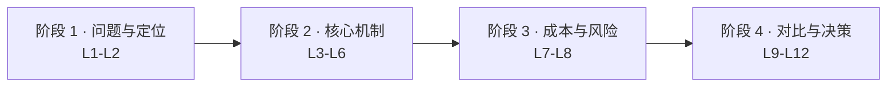

# ZooKeeper 学习路径总览

> 课程制 · 4 阶段 / 12 课 / 36 知识点 · 决策参考导向
> 创建：2026-08-27 · 课程入口：[学习档案](00-学习档案.md) | [课程目录](02-课程目录.md) | [路径图](assets/learning-path-overview.svg)

## 一、学习者画像

| 维度 | 设定 |
|------|------|
| 当前水平 | 入门：听说过 ZooKeeper，可能装过/简单用过，未系统理解机制 |
| 学习目标 | 决策参考：评估要不要在项目里用 ZK，能与 etcd/Consul 等对比做选型 |
| 输出偏好 | Markdown + 图表，每课带「决策视角」小结 |
| 关联背景 | 已学 kafka-basics 课程，了解 Kafka 曾依赖 ZK、KRaft 去 ZK 化 |

## 二、故事主线

以「电商公司后端工程师评估是否引入 ZooKeeper」贯穿全程：

大促夜订单服务双主故障（L1）→ 弄清 ZK 是什么、凭什么可靠（L2–L6）→ 算清部署运维成本与踩坑风险（L7–L8）→ 横向对比 etcd/Consul 等候选、看清生态趋势（L9–L10）→ 形成选型决策树并在三个真实场景演练（L11–L12）。

终点产物：一份能向团队汇报的《协调服务选型决策》。

## 三、阶段地图

| 阶段 | 回答的问题 | 课次 |
|------|-----------|------|
| 1 · 问题与定位 | 它到底解决什么问题 | L1–L2 |
| 2 · 核心机制 | 它凭什么可靠、能干什么 | L3–L6 |
| 3 · 成本与风险 | 用它要付出什么 | L7–L8 |
| 4 · 对比与决策 | 和竞品怎么比、最终怎么选 | L9–L12 |

## 四、学习顺序与节奏

- 严格按序推进：机制理解（阶段 2）依赖问题域（阶段 1），决策（阶段 4）依赖成本认知（阶段 3）
- 每课 30–45 分钟；决策参考导向下实操轻量化（以 Docker 单机体验与思想实验为主），重心在机制理解与对比分析
- L6 起穿插可选的 zkCli 实操；L9–L12 是本课程的决策核心篇章

## 五、断点续学

1. 先读 [00-学习档案.md](00-学习档案.md) 定位当前进度
2. 再读 [00-评审清单.md](00-评审清单.md)，存在未勾选条目时先补对应评审，再继续下一批
