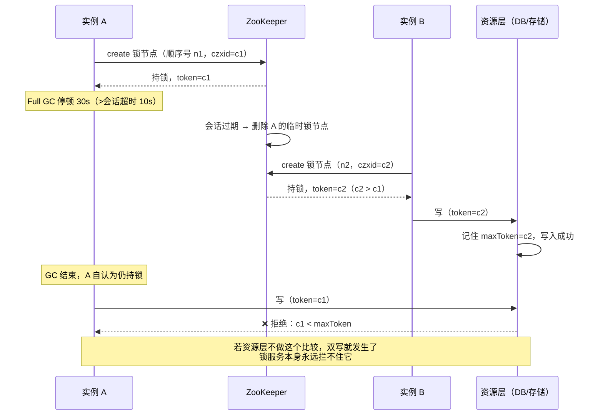
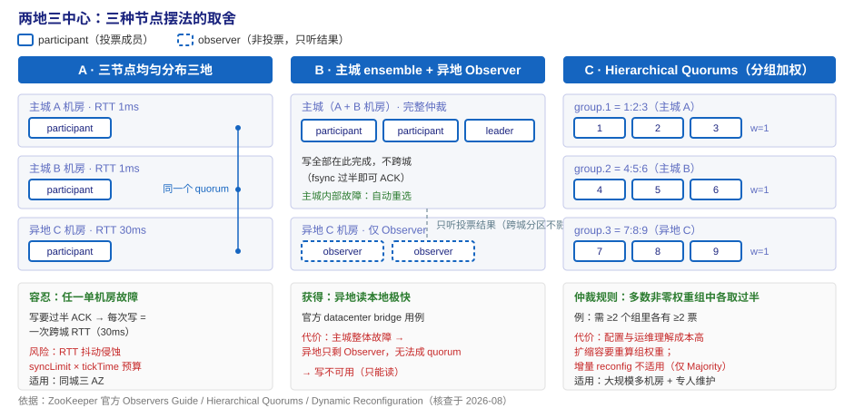
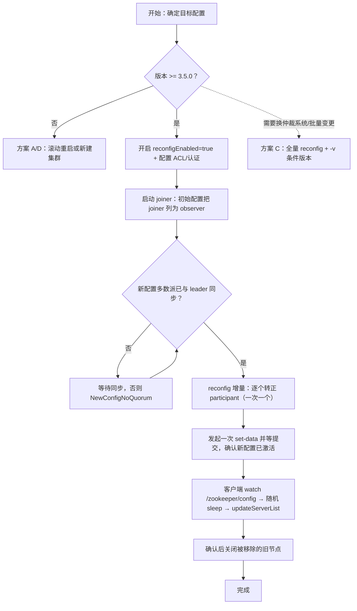

# ZooKeeper 场景解法库

> **怎么用**：每个场景先自己想 30 秒，再展开看解法。**先想后看，能力才长出来**——直接看答案只会让你"读过"，不会让你"会设计"。
> 配套：[08-实战经验.md](08-实战经验.md)（为什么会崩）｜ [09-排障速查手册.md](09-排障速查手册.md)（崩了怎么办）｜ 本库（新要求来了怎么设计）。
>
> 生成于**课程完结后**（5 阶段 / 15 课 / 47 知识点 + 结课实战项目全部完成），场景已结合本课程知识点定制，非通用文章。

## 📌 与课 12《场景演练》的分工（先看这段，别走错门）

| 产物 | 回答的问题 | 姿态 |
|------|-----------|------|
| [课 12](stages/4-对比与决策/lessons/lesson-12-场景演练三个真实项目的选型决策.md) | **选谁**：ZK / etcd / Consul / Redis 之间怎么选型 | 决策 · 对比 |
| **本库** | **选定之后怎么设计**：默认你已经决定继续用 ZK（或不得不用），新要求来了该怎么设计、有哪些可选路径 | 设计 · 权衡 |

一句话：**课 12 帮你决定要不要进这个门，本库帮你进门之后怎么摆家具。**

> ⚠️ 每场景的「推荐路径」是**默认顺序，不是标准答案**——它假设你处在"最常见的约束"下。你的约束不同（团队规模、SLA、能否改资源层、是否跨城），顺序就该换。看解法时重点看**代价与不适用边界**，而不是背推荐顺序。

## 🗺️ 场景地图

| # | 场景 | 那句让你头皮发麻的话 | 主要考验 | 关联故障模式（[08](08-实战经验.md)） |
|---|------|--------------------|---------|-----------------------------------|
| 1 | [分布式锁要保护外部资源](#场景-1分布式锁要保护外部资源fencing-该放哪一层) | "为什么同一笔账扣了两次？" | 正确性的边界在哪一层 | 模式 2（GC 级联）、模式 4（会话过期） |
| 2 | [客户端从 20 涨到 2000](#场景-2客户端从-20-涨到-2000读扩展与连接治理) | "连接数爆了，加机器行不行？" | 读扩展 vs 故障域隔离 | 模式 1（fsync）、模式 3（连接拒绝） |
| 3 | [两地三中心，三个节点怎么摆](#场景-3两地三中心三个节点怎么摆) | "机房整体故障时必须还能写" | 仲裁分布 vs 跨城延迟 | 模式 6（选举风暴）、模式 1 |
| 4 | [五个团队共用一个集群](#场景-4五个团队共用一个集群隔离怎么设计) | "A 团队塞了 50MB，全公司一起挂" | 四类隔离（命名/资源/权限/故障域） | 模式 2（OOM）、模式 5（启动即崩） |
| 5 | [在线扩容与换机](#场景-5在线扩容与换机reconfig-还是滚动重启) | "3 节点扩到 5，能不停机吗？" | 变更期间不产生第二个 quorum | 模式 6、模式 4（重连潮） |
| 6 | [数据从 20MB 涨到 2GB](#场景-6数据从-20mb-涨到-2gb膨胀怎么治) | "堆又满了，加内存吧？" | 什么必须留在 ZK、什么必须挪走 | 模式 5、模式 2、模式 1 |
| 7 | [ZK 抖 30 秒，业务挂 20 分钟](#场景-7zk-抖-30-秒业务挂-20-分钟韧性设计) | "ZK 早就恢复了，业务为什么还没好？" | 客户端失败行为决定事故半径 | 模式 4、模式 3、模式 2 |
| 8 | [要不要迁走 ZK](#场景-8要不要迁走-zk去-zk-化路径) | "ZK 都要被淘汰了，还学/还用吗？" | 生态趋势 vs 自身约束 | —（这是方向题，不是故障题） |

> **证据纪律**：每个解法都标注依据（官方文档 / 联网核查 / 领域公认实践）。拿不准的一律标 `⏳ 置信度` 并写明不确定在哪，完整清单见文末[证据与置信度](#证据与置信度)。

---

## 场景 1：分布式锁要保护外部资源（fencing 该放哪一层）

**场景描述**：对账任务每晚 2 点跑，用 ZK 分布式锁保证只有一个实例执行。某晚实例 A 撞上 Full GC，**停顿 30 秒**；会话超时只设了 10 秒 → 集群判死会话、删掉 A 的锁节点 → 实例 B 拿到锁开始扣款；A 恢复后完全不知道自己已经失锁，继续把剩下的扣款写完。监控上看到 `zk_jvm_pause_time_ms` p99 飙升、`zk_num_alive_connections` 呈 V 形。

**🔒 先自己想 30 秒**：第一反应是不是"把会话超时调大到 60 秒"？调大之后这个事故就不会再发生了吗？

💡 提示（分层想）

分三层问自己：

1. **锁服务层**：A 有没有办法知道自己已经失锁？（提示：它 GC 期间什么都做不了，恢复后要靠什么判断？）
2. **资源层**：如果 A 带着"我以为我还有锁"的信念去写，谁有资格拒绝它？
3. **业务层**：如果真的写了两次，后果能不能被消除（而不是被阻止）？

再想一件事：把超时从 10 秒调到 60 秒，只是把"停顿超过多久才出事"这个阈值挪了位置，**"停顿够久一定出事"这件事消失了吗**？

📖 展开解法

### 解法一览

| 解法 | 能解决到 | 代价 | 适用边界 |
|------|---------|------|---------|
| **A · fencing token**（锁服务签发单调 token，资源层拒绝更旧者） | 正确性完整：旧持有者的写被资源层直接拒绝 | 资源层必须支持"带条件的写"；要改资源层代码 | 资源是自有系统、可改造 |
| **B · 业务层幂等**（唯一键 / 流水号去重 / 乐观锁 version） | 后果被消除：重复执行不再产生错误，锁退化为"效率工具" | 每条写路径都要设计幂等键，设计成本不低 | 资源层不可改造（第三方 API、无法加条件的存储） |
| **C · 串行化中间层**（把并发动作收进单写者队列，如 MQ 单分区单消费者） | 消除并发本身，锁都不用了 | 引入新组件、吞吐受单消费者限制、多一个可用性依赖 | 动作可异步、可重放 |
| **D · 调大会话超时 + 治理客户端 GC** | 只降低触发概率 | **不解决正确性**——停顿够久照样出事 | 必做，但只能当辅助 |
| **E · 按 Curator 官方语义处理连接状态** | 让客户端行为正确（见下） | 要写 `ConnectionStateListener`，且要理解 SUSPENDED 与 LOST 的区别 | 用 Curator 的 Java 客户端 |

**E 的官方依据**（Curator 官方 Error Handling 文档，核查于 2026-08）：

- `SUSPENDED`：*"There has been a loss of connection. Leaders, locks, etc. should suspend until the connection is re-established."* —— **连接丢失，leader/锁相关动作应暂停，直到重连**。
- `LOST`：会话已过期；官方明确 *"It is possible to get a RECONNECTED state after this but you should still consider any locks, etc. as dirty/unstable"* —— 即使之后收到 RECONNECTED，也要把锁视为"脏的/不稳定的"。
- 默认错误策略是**保守**的：把 SUSPENDED 与 LOST 同等对待（recipe 会认为会话已丢失并清理 watcher/节点）。想要更激进（只有 LOST 才算错误）可以设 `connectionStateErrorPolicy(new SessionConnectionStateErrorPolicy())`——**代价是 SUSPENDED 期间你会继续以为自己持锁**。

###  fencing 是怎么挡住双写的

### 推荐路径（递进，不是一次全上）

1. **先做 B（幂等）**：让"出错了也不出事"。这是唯一在资源层不可改造时仍然有效的办法。
2. **再做 A（fencing）**：让"根本错不了"。代价是资源层要支持条件写——**这恰恰是本场景真正的分水岭**。
3. **资源层改不了**：停在 B，或引入 C（串行化）把并发消掉。
4. **D 与 E 全程作为基础**：D 降低概率（Curator 默认会话超时 60 秒，本就是为 GC 留余量），E 保证客户端在状态变化时不乱来。

### 知识点挂钩

- **A（fencing）** → [阶段 2 课 6 · 分布式锁与 Curator](stages/2-核心机制/lessons/lesson-06-四大经典用法从配置中心到分布式锁.md)：Kleppmann 原文"可用 zxid 或 znode 版本号当 fencing token"；**锁服务不是锁，资源层拒绝旧 token 才是锁**
- **D（会话超时）** → [阶段 2 课 5 · 会话与 Watch](stages/2-核心机制/lessons/lesson-05-会话与Watch临时节点和一次性通知.md)：过期由**集群**裁决（不是客户端）、超时被钳在 `[2×tickTime, 20×tickTime]`、临时节点判死即删
- **双写的本质** → [阶段 1 课 1 · 为什么需要 ZK](stages/1-问题与定位/lessons/lesson-01-为什么需要ZooKeeper.md)："两个权威比没有权威更危险"，GC 停顿论证在这里完整兑现
- **可运行实现** → [结课实战项目 · stock_task.py](projects/分布式任务调度器的协调层/README.md)（token 取法按 `ephemeralOwner == client_id` 精确定位自己的锁节点）

### 什么情况下此方案不适用

- **资源层完全不支持条件写**：A 方案直接失效——这不是 ZK 的问题，**换 etcd 也一样没用**（[08 适用边界表](08-实战经验.md)已列）。此时只能靠 B 或 C。
- **锁只用于"效率"而非"正确性"**（重跑一次无所谓的定时任务）：上 fencing 是过度设计，Redis `SET NX PX` 就够（[课 12 场景 C](stages/4-对比与决策/lessons/lesson-12-场景演练三个真实项目的选型决策.md)）。

### 做错会踩的坑

- 只调大会话超时（只做 D）：窗口缩小了但没消失，是最常见的自欺欺人。→ 故障模式 2
- 把 `SUSPENDED` 当成"我还持锁"继续写：这正是本事故的剧本。→ 故障模式 2、故障模式 4
- fencing token 取成 `min(children)` 的顺序号：在客户端库自带的命名规则下可能取到**别人**的节点。→ 实战项目已修正为按 `ephemeralOwner` 定位自己的节点

---

## 场景 2：客户端从 20 涨到 2000（读扩展与连接治理）

**场景描述**：协调服务从"十几个 Java 应用"扩到"上千个容器化微服务"。症状：`zk_num_alive_connections` 逼近告警线、`zk_watch_count` 破万、容器宿主上开始出现连接被拒（同一宿主 IP 上的多个 Pod 共享源 IP，撞上 `maxClientCnxns` 默认 60 的**按 IP**限制），leader 所在节点的读 CPU 明显偏高。

**🔒 先自己想 30 秒**：加机器？加 Observer？还是拆集群？——先问自己：**你要扩展的是读吞吐、连接数、还是故障隔离？** 这三件事的解法完全不同。

💡 提示（分维度想）

三个维度分开算：

1. **读吞吐**：读在哪儿被服务？（提示：想想 follower 与 leader 的读路径）
2. **连接与 watch 数**：谁能加、加了有什么副作用？（提示：加投票成员会拖慢什么？）
3. **故障域**：一个业务把集群打挂时，你能接受多少业务陪葬？

还有一条很容易被漏掉的：**客户端侧能减掉多少压力**？——很多时候 80% 的压力是客户端用法不当造成的。

📖 展开解法

### 解法一览

| 解法 | 能解决到 | 代价 | 适用边界 |
|------|---------|------|---------|
| **A · 加 Observer**（官方 Observers Guide） | 读吞吐水平扩展；**不损害写性能**；可跨机房部署 | 不提升写吞吐；不提供投票冗余；多一批节点要运维 | 读远多于写、需要读扩展或跨机房读本地 |
| **B · 客户端侧减负**（本地缓存 + 持久 watch + 复用长连接 + 选对 Curator 缓存实现） | 连接数、watch 数、读请求量**同时**下降，且零硬件成本 | 要改客户端代码；缓存一致性要靠重连后全量重读兜底 | 几乎所有场景都该先做这一步 |
| **C · 按业务域拆集群** | 故障域隔离；单集群连接/watch 数直接除以 N | 运维账单 ×N（[课 7 三张账单](stages/3-成本与风险/lessons/lesson-07-部署与运维成本3节点起步的小集群.md)）；**跨集群无法共享协调数据** | 各域之间不需要共享锁/统一命名 |
| **D · 换技术栈**（etcd / Consul / Nacos，或平台内建能力） | 换掉整个协调模型 | 迁移成本最高；等于重做一遍选型 | 协调模型本身不匹配（见课 11 决策树） |

**A 的官方依据**（ZooKeeper Observers Guide，核查于 2026-08）：

> *Observers are non-voting members of an ensemble which only hear the results of votes... we can increase the number of Observers as much as we like without harming the performance of votes.*

配置只有两处：observer 节点自己写 `peerType=observer`，**每个**节点的配置文件里给该 server 行加 `:observer` 后缀。官方文档还提到 `observerMasterPort=2191`：让 Observer 连 follower 而不是 leader，从而"把 Observer 数量扩展到数百个"并减轻 leader 负担。

**B 的抓手**（[课 8](stages/3-成本与风险/lessons/lesson-08-经典的坑Watch风暴羊群效应与Session.md) 已核数据）：Curator 的 `CuratorCache` 取代已废弃的 `TreeCache`/`PathChildrenCache`（同场景 2563 vs 1005 ops/s）；3.6+ 的持久 watch 免去"回调里重注册"的窗口；复用长连接而不是每任务建 handle。

### 推荐路径

1. **先做 B**（零成本、立刻见效，常常就够了）
2. **再做 C**（隔离故障域——这一步的价值是"爆炸半径"，不是性能）
3. **仍不够再上 A**（确实需要读扩展，且能接受多一批节点）
4. **D 是最后手段**：只有在"协调模型本身不匹配"时才换，判断依据走[课 11 决策树](stages/4-对比与决策/lessons/lesson-11-决策框架一棵选型决策树.md)

### 知识点挂钩

- **A（Observer）** → [阶段 2 课 4 · 集群与 ZAB](stages/2-核心机制/lessons/lesson-04-集群与ZAB过半派的生存智慧.md)：Observer 自 3.3.0 引入、非投票、不计入 quorum；**投票成员越多写性能越降**（加 follower 反而更慢）
- **C（拆集群）** → [阶段 3 课 7](stages/3-成本与风险/lessons/lesson-07-部署与运维成本3节点起步的小集群.md)：2F+1 与故障独立性、Monitor Guide 告警阈值（连接 > 50/节点、watch > 1 万、`zk_znode_count` > 100 万）
- **B（客户端减负）** → [阶段 3 课 8](stages/3-成本与风险/lessons/lesson-08-经典的坑Watch风暴羊群效应与Session.md)：Watch 风暴、羊群效应、Curator 缓存选型
- **D（换栈）** → [阶段 4 课 9](stages/4-对比与决策/lessons/lesson-09-横向对比ZooKeeper-vs-etcd-vs-Consul-vs-Redis.md)

### 什么情况下此方案不适用

- **A 不解决写瓶颈**：所有写仍然走唯一 leader，Observer 只是不参与投票。写密集场景加 Observer 毫无帮助。
- **C 会切断共享协调**：需要全局锁、统一命名、跨团队选主时，**不能拆**（一拆就变成两套权威）。
- **A 的 Observer 只扩读不扩冗余**：Observer 挂掉不影响可用性，但也意味着它**不提供**任何容错贡献。

### 做错会踩的坑

- 直接加 follower 而不是 Observer → 写性能不升反降（投票成本上升）
- 容器环境忘了 `maxClientCnxns` 按**源 IP** 计数 → 新连接被**静默拒绝** → 故障模式 3
- 拆完集群发现运维成本翻倍，而真正的瓶颈其实是客户端用法 → 故障模式 1、故障模式 4

---

## 场景 3：两地三中心，三个节点怎么摆

**场景描述**：公司要求"任一机房整体故障，协调服务不中断"。现有三个机房：主城 A 机房、主城 B 机房（同城，RTT ≈ 1ms）、异地 C 机房（RTT ≈ 30ms）。你手上有 3 个（或 5 个）ZK 节点名额。

**🔒 先自己想 30 秒**：三个节点一个机房放一个，是不是就"高可用"了？——先问自己：**你要容忍的是"单机故障""单机房故障"还是"主城整体故障"？** 这三件事的节点摆放完全不同。

💡 提示（先算两个数）

1. **仲裁**：`2F+1` 说的"多数"，准确含义是"**能互相通信的多数**"（机器活着但被分区隔离不算）。据此算一算：3 个节点分放三地，能容忍哪种故障？
2. **延迟预算**：`syncLimit × tickTime`（默认 5 × 2000ms = 10 秒）是 follower 被判落后的容忍上限；而每次写都要过半节点 **fsync 事务日志**才能 ACK。把跨城 RTT（30ms）代入，写延迟会变成多少？如果 RTT 抖动到 500ms 呢？

再想第三件事：**"备机房读本地很快"和"主机房全挂后备机房还能写"是两个不同的需求**，后者要求备机房有投票权。

📖 展开解法

### 拓扑一览（三种摆法的取舍）

### 解法一览

| 解法 | 能解决到 | 代价 | 适用边界 |
|------|---------|------|---------|
| **A · 三节点均匀分布三地**（2F+1，容忍任一单机房故障） | 任一机房故障仍可读写 | 每次写＝一次跨城 RTT；RTT 抖动会侵蚀心跳预算 | 同城三 AZ，或 RTT 稳定且远小于 `syncLimit×tickTime` |
| **B · 主机房跑完整 ensemble + 备机房纯 Observer**（官方 "datacenter bridge" 用例） | 备机房**读**本地极快；跨城分区不影响主集群 | 主城整体故障 → 备机房**无法独立形成 quorum**，写不可用 | 可接受"主城全挂即停写" |
| **C · Hierarchical Quorums**（`group` + `weight` 按机房分组） | 可表达"每组过半 + 跨组多数"的仲裁规则，容纳 9 节点级规模 | 配置与运维理解成本高；扩缩容要重算组权重；**增量 reconfig 不适用** | 大规模、多机房、有专人维护 |
| **D · 双集群 + 应用层容灾切换** | 主城全挂时业务仍能继续（切到备集群） | 一致性由业务层承担；切换会丢失/重建协调状态 | 业务能容忍协调状态重建 |
| **E · Oracle Quorum**（2 实例 + 外部故障探测器） ⏳ | 用外部"oracle"授权让 2 实例集群也能推进 | **官方自己列出了 split brain 与 lost progress 风险** | ⚠️ 仅限专用/硬件级故障探测场景，**不建议通用生产** |

**B 的官方依据**（Observers Guide 原文，核查于 2026-08）：

> *As a datacenter bridge: ... if the ensemble runs entirely in one datacenter, and the second datacenter runs only Observers, partitions aren't problematic as the ensemble remains connected. Clients of the Observers may still see and issue proposals.*

**C 的官方依据**（Hierarchical Quorums，核查于 2026-08）：`group.x=1:2:3` + `weight.x=1`；仲裁规则是"**多数非零权重组中各取过半票**"——例：三组各三节点，需至少两个组里各有两票。

**E 的官方依据与警告**（Oracle Quorum，3.9 官方文档载明）：配置 `oraclePath=/to/some/file`，文件里写 0/1 表示该实例是否被授权推进。官方文档在 Safety Issue 一节明确列出**脑裂**与**进度丢失**两种失效模式（oracle 同时授权两边、或 oracle 不参考最新 zxid）。⏳ **置信度：中**——机制为官方一手，但**首次引入版本未确认**，且这是明显面向特定硬件场景的特性。

### 推荐路径

1. **同城三 AZ** → **A**（最直接，延迟可控）
2. **跨城（RTT 30ms 级）且能接受"主城全挂即停写"** → **B**（官方推荐用法，写延迟与分区风险都最小）
3. **要求"主城全挂仍可写"** → 必须让投票节点跨城分布：**A（三地投票）** 或 **C（分层仲裁）**；接受业务层切换代价时可考虑 **D**
4. **E 不建议**——除非同时满足全部前置条件：① 有**硬件级或等价可靠**的故障探测器（官方举例：能判断对方主机是否断电的硬件装置）；② oracle 文件**每个实例独占、绝不共享**；③ 完全理解官方文档 Safety Issue 一节列出的脑裂与进度丢失，并接受"用活性换安全性"的取舍；④ 有专人维护这套 oracle。若只是想"省一个节点"，请回到 A 或 B

### 知识点挂钩

- **过半的真正含义** → [阶段 2 课 4](stages/2-核心机制/lessons/lesson-04-集群与ZAB过半派的生存智慧.md)：过半 = 能互相通信的多数；2F+1 与奇数原则（"6 台只容 2 台"）
- **延迟与故障独立性** → [阶段 3 课 7](stages/3-成本与风险/lessons/lesson-07-部署与运维成本3节点起步的小集群.md)：`tickTime`/`initLimit`/`syncLimit` 语义、"多数机器共用同一交换机是关联故障"、跨机房 2+1 少数派拒写
- **横向对照** → [阶段 4 课 9](stages/4-对比与决策/lessons/lesson-09-横向对比ZooKeeper-vs-etcd-vs-Consul-vs-Redis.md)：Consul 每 DC 独立 leader 与不相交 peer set（多 DC 是它的一等公民能力）

### 什么情况下此方案不适用

- **跨城 RTT 接近或超过 `syncLimit × tickTime` 时，不要把投票节点跨城放**——心跳误判会直接表现为反复选举。→ 故障模式 6
- **准备跨城放投票节点，却没把 `dataLogDir` 独占低延迟盘**：跨城延迟 + fsync 停顿叠加，选举风暴概率陡增。→ 故障模式 1

### 做错会踩的坑

- 只通 2181 不通 3888：集群**平时完全正常**，直到需要选举才暴露 → [09-排障速查手册 · 症状 7](09-排障速查手册.md)
- **扩容/供给时新节点加入过快，让新节点之间自己选出一个主** → 这就是 [08 案例 1 GitHub 双主事故](08-实战经验.md)的机制，与场景 5 的 reconfig joiner 警告同源
- 以为"备机房有 ZK 节点 = 备机房能接管"：纯 Observer 备机房在主城全挂时**只能读**

---

## 场景 4：五个团队共用一个集群（隔离怎么设计）

**场景描述**：全公司一套 3 节点 ZK，五个团队共用。某天 A 团队把 50MB 的报表数据塞进了 znode；同周 B 团队的客户端 watch 用法不当，`zk_watch_count` 暴涨。结果：**一次事故，五个团队一起挂**——因为 ZK 是内存数据库，所有团队共享同一棵树、同一份堆。

**🔒 先自己想 30 秒**：给每个团队建一个目录（命名空间），是不是就隔离了？

💡 提示（先分清四件事）

"隔离"是四个不同的东西，别混为一谈：

1. **命名空间隔离**：路径不冲突——能防误删别人的节点吗？能防别人往你这儿写吗？
2. **资源隔离**：数据量、连接数、watch 数——谁消耗得多，谁就把大家拖死？
3. **权限隔离**：能不能读/写别人的路径？
4. **故障域隔离**：一个人把集群搞挂，其他人陪葬吗？

再想一个关键问题：**ZK 的 quota 能管住哪几项资源，管不住哪几项？**（提示：想想本场景里真正打死集群的那两样东西。）

📖 展开解法

### 解法一览

| 解法 | 能解决到 | 代价 | 适用边界 |
|------|---------|------|---------|
| **A · chroot + 命名规范**（连接串 `host:2181/app1`） | 命名空间隔离 + 路径归属清晰 | **只是客户端侧约定**，换客户端或直连即绕过；不提供权限与资源隔离 | 团队间互信、只要防手滑 |
| **B · chroot + quota**（soft 告警 / hard 拒绝） | 数据资源隔离：znode 数与字节数 | 只管这两项（见"不适用"）；配错会误伤 | 多团队共享且数据量不可控 |
| **C · ACL 鉴权**（digest / SASL） | 权限隔离：谁能读、谁能写 | 凭据分发与管理成本；客户端要 `addauth` | 跨团队存在不信任边界 |
| **D · 物理分集群** | 完整隔离（含故障域） | 运维账单 ×N；跨集群无法共享协调数据 | 关键业务、预算与人力允许 |
| **E · 平台化封装**（禁止业务直连 ZK，统一走内部 SDK） | 从根上收口用法 | 要自研/维护一层 SDK；ZK 变成实现细节 | 规模大、团队多、踩过多次坑之后 |

**B 的官方依据**（Quota Guide，核查于 2026-08）：

- `setquota -n`（子节点数/计数）与 `-b`（字节数）两种配额；配额存在 `/zookeeper/quota`，可给该节点设 ACL 防止别人改配额
- **soft quota 只打 WARN 日志，hard quota 会抛 `QuotaExceededException`**；同一路径同时设 soft 与 hard 时 **hard 优先**
- 官方原文：*"Combined with the Chroot, the quota will have a better isolation effectiveness between different applications"*（配合 chroot 使用，隔离效果更好）
- 限制：一条路径树（根到叶）**只能设一个 quota**；父子路径已设配额时 `setquota` 会拒绝

⏳ **置信度：中**——quota 的 soft/hard 语义为 3.9 官方文档一手；但 hard quota 的**首次引入版本未确认**（3.5.10 文档只描述"超出打 WARN"，无 hard quota）。

### 推荐路径

1. **A 起步**（chroot + 命名规范，零成本）
2. **加 B**（先设 soft 观察实际用量，再对关键路径设 hard 兜底）
3. **加 C**（只要存在跨团队不信任边界——注意这是**安全**问题，不是性能问题）
4. **关键业务走 D**，团队规模与事故次数到位后做 E

### 知识点挂钩

- **A（chroot 与路径）** → [阶段 2 课 3](stages/2-核心机制/lessons/lesson-03-数据模型ZNode树与四种节点.md)：ZNode 树、路径、`jute.maxbuffer` 1MB 上限（防被当大数据存储的内置 sanity check）
- **B/D（资源与故障域）** → [阶段 3 课 7](stages/3-成本与风险/lessons/lesson-07-部署与运维成本3节点起步的小集群.md)：内存数据库 + 共享一棵树 → 一个团队塞大对象，全体成员几乎同时 OOM
- **E（收口用法）** → [阶段 3 课 8](stages/3-成本与风险/lessons/lesson-08-经典的坑Watch风暴羊群效应与Session.md)：客户端反模式清单

### 什么情况下此方案不适用

- **quota 管不住 watch 数与连接数**——而这两样恰恰是最容易打死集群的资源。所以 B 只能兜住"数据膨胀"，兜不住"用法不当"（后者要靠 C/E）。
- **chroot 不是安全边界**：它是客户端侧的约定，任何能直连集群的客户端都可以不带后缀连上来写任意路径。要防就得上 ACL。

### 做错会踩的坑

- 只在应用侧约定目录、不上 ACL：等于"君子协定"。→ 故障模式 2（OOM）
- 塞大对象后节点重启加载失败：`Unreasonable length` / `Unable to load database`。→ 故障模式 5
- 某团队客户端每任务新建连接：撞上按源 IP 的连接上限，**静默拒绝**。→ 故障模式 3

---

## 场景 5：在线扩容与换机（reconfig 还是滚动重启）

**场景描述**：3 节点集群要扩到 5 节点（或机器过保，需要把三台全部换成新 IP）。你希望**不停机**。

**🔒 先自己想 30 秒**：改配置滚动重启，一台一台来，好像也没什么问题？——先问自己三个问题：
① 重启期间 quorum 怎么维持？② **新节点启动后，会不会自己跟自己选出一个主？** ③ 客户端什么时候知道集群变了？

💡 提示（想清楚"第二个 quorum"）

第二个问题是**最关键**的：ZK 集群的成员名单是配置出来的。如果新节点的配置里写着"我和其他新节点是一伙的"，而它们彼此能通信但与老集群尚未同步，会发生什么？

（回想一下 [08 案例 1](08-实战经验.md)：GitHub 那次双主事故，就是"新主机加入过快，选出了第二个 leader"。）

再想第三问：如果几千个客户端**同时**获知集群变更并同时迁移连接，会发生什么？

📖 展开解法

### 解法一览

| 解法 | 能解决到 | 代价 | 适用边界 |
|------|---------|------|---------|
| **A · 滚动重启改配置**（3.5.0 前的老办法） | 能做成，可停机窗口可控 | 官方定性：*"a manually intensive and error-prone method ... that has caused data loss and inconsistency in production"* | 仅 <3.5.0，或作为兜底 |
| **B · 增量 reconfig**（`reconfig -add` / `-remove`） | 在线加删成员、改角色与端口，**无服务中断** | 3.5.3 起**默认关闭**（`reconfigEnabled=true` 才启用）且要求 ACL + 认证；增量模式仅适用于 Majority 仲裁 | 3.5.0+，且当前用 Majority 仲裁 |
| **C · 全量 reconfig**（`reconfig -file` / `-members`） | 批量变更；**唯一能动态切换仲裁系统的方式**（Majority ⇄ Hierarchical） | 并发提交时可能互相覆盖（官方 Liveness 说明），需配合 `-v` 条件版本 | 需要换仲裁系统或一次性大改 |
| **D · 新建集群 + 迁移** | 最干净，可同时跨大版本升级 | 需要停机窗口或双写；协调状态要重建 | 跨大版本、或从静态配置迁移到动态配置 |

### B 的官方关键约束（Dynamic Reconfiguration 文档，核查于 2026-08）

这几条是**最容易出事**的地方，逐条对照：

1. **joiner 的初始配置要把它列成 observer**：
   > *"Note that listing the joiners as observers will not actually make them observers - it will only prevent them from accidentally forming a quorum with other joiners."*
2. **官方 Warning（务必记住）**：
   > *"Never specify more than one joining server in the same initial configuration as participants... if multiple joiners are listed as participants they may form an independent quorum creating a split-brain situation."*

   同时加多个 joiner 时，只能列**一个**为 participant（其余列 observer），否则新节点之间可能自成 quorum → **脑裂**。这与 GitHub 那次双主事故是同一个机制。
3. **reconfig 前必须保证新配置的多数派已与 leader 同步**，否则报 `NewConfigNoQuorum`。
4. **移除节点不会自动关停它**：它变成 "non-voting follower"（比 observer 对吞吐影响更大），需人工关闭。
5. **这三种操作会触发 leader hand-off（短暂无主）**：移除 leader、leader 转 observer、修改 leader 的 quorum port。
6. **reconfig 提交 ≠ 新配置已激活**：官方建议要确认"可以安全关闭被移除的旧节点"时，**再发起一次写操作（如 set-data，不能用 sync）并等它提交**。
7. **客户端侧**：订阅 `/zookeeper/config` 变更 → `sync` + `getConfig` → `updateServerList`；官方明确建议 **先随机睡眠一小段时间再迁移**，避免几千客户端同时搬家。
8. **observer 转 participant 可能失败**（observer 不能 ACK 历史前缀，不计入所需的多数）：需先 remove 再 add。

### 推荐路径（一次只加一个）

1. **先 B**：joiner 的**初始配置**一律把自己列成 observer——这是**官方**做法，目的是防止多个 joiner 自成 quorum；需要加多个 participant 时**逐个转正（一次一个）**，这比官方最低要求更保守。另外，"新节点先以 Observer 身份入队同步、稳定后再转为 participant"是**社区通行稳妥做法**（官方文档无此明确步骤，课 7 已标注）
2. **需要换仲裁系统 / 批量变更**：走 C，并用 `-v <version>` 防止覆盖别人的变更
3. **跨大版本或配置已不可救药**：走 D
4. **无论哪条路，都要先演练一遍**（停 leader 验证重选时间，仅低峰做）

### 知识点挂钩

- **仲裁与角色** → [阶段 2 课 4](stages/2-核心机制/lessons/lesson-04-集群与ZAB过半派的生存智慧.md)：过半、角色、恢复三件套 DIFF/TRUNC/SNAP
- **reconfig 与运维** → [阶段 3 课 7](stages/3-成本与风险/lessons/lesson-07-部署与运维成本3节点起步的小集群.md)：3.5.0 前后对比、`/zookeeper/config`、3.5.3 起默认禁用及理由、滚动升级先经 3.4.6
- **客户端重连整形** → [阶段 3 课 8](stages/3-成本与风险/lessons/lesson-08-经典的坑Watch风暴羊群效应与Session.md)：重连风暴与抖动退避

### 什么情况下此方案不适用

- **集群当前已经失去 quorum（无 leader）**：先恢复再改——reconfig 需要 leader 处理。
- **版本 < 3.5.0**：没有 reconfig，只能 A 或 D。
- **当前用 Hierarchical 仲裁**：增量 reconfig 不适用（官方：增量仅支持 Majority）。

### 做错会踩的坑

- 一次把多个 joiner 列为 participant → 新节点自成 quorum → **第二个集群/脑裂**（GitHub 事故机制）
- reconfig 后立刻关掉旧节点 → 新配置可能尚未激活 → 写不可用
- 客户端同时收到变更通知并同时迁移 → 重连潮撞上 `maxClientCnxns` → 故障模式 3 + 故障模式 4
- 移除 leader 未预期 → 短暂无主（写入不可用）

---

## 场景 6：数据从 20MB 涨到 2GB（膨胀怎么治）

**场景描述**：`zk_znode_count` 从 5 万涨到 5000 万，`zk_approximate_data_size` 从 20MB 涨到 2GB。症状：堆吃紧、Full GC 变频繁、节点重启加载快照从 3 秒变成 3 分钟、快照与 fsync 变慢。Monitor Guide 的参考告警阈值是 `znode_count > 100 万` / 数据 `> 1GB`（课 7 已核）。

**🔒 先自己想 30 秒**：加内存？拆集群？——先问一句更根本的：**这些数据里，有哪些是"必须参与 ZK 的一致性判断"的？**

💡 提示（分三段想）

1. **止血**：怎么让它别再涨？（谁在写？有没有上限？）
2. **清理**：已经涨起来的部分怎么安全减掉？
3. **根治**：哪些数据**根本不该**待在 ZK 里？（提示：ZK 官方说它是为**KB 级**协调数据设计的）

判断"该不该留在 ZK"的标准：**这份数据是否需要 ZK 的全序（zxid）、CAS 版本或会话语义？** 锁顺序节点、选主节点、临时注册节点——需要；报表数据、日志、大段配置正文——不需要。

📖 展开解法

### 解法一览

| 解法 | 能解决到 | 代价 | 适用边界 |
|------|---------|------|---------|
| **A · 外置存储 + ZK 只存指针**（ZK 存版本号/路径/哈希，真实数据放 DB 或对象存储） | 根治：堆压力与快照体积同时回到 KB 级 | 多一次读取；要处理"指针与外置数据不一致"的窗口 | 大对象、配置正文、报表、日志 |
| **B · 生命周期治理**（容器/TTL 节点 + autopurge + 定期巡检） | 让数据**自动**消亡，不再单调增长 | 要梳理每个路径的生命周期；清理规则配错会误删 | 数据天然有生命周期（会话态、临时任务） |
| **C · quota**（soft WARN 观察 + hard 拒绝兜底 + chroot 分区） | 硬上限：到达阈值直接拒绝写入 | 拒绝写入 = 业务报错（要提前沟通）；只管 znode 数与字节数 | 多团队共享、写入方不受控 |
| **D · 拆集群 / 分域**（见场景 2、场景 4） | 单集群数据量除以 N | 运维账单 ×N | 数据可按域切分 |
| **E · 换存储** | — | — | ⚠️ **这是"问题问错了"**：etcd 也不适合大对象（默认配额 2GB，超限进只读告警） |

**B 的抓手**：容器节点（最后一个子节点被删后会被服务端择机删除）与 TTL 节点（3.5.3+，需 `extendedTypesEnabled=true`，仅作用于持久类节点）用于自动清理；`autopurge` **默认不清理**（是 operator 责任），必须显式配置 `snapRetainCount` / `purgeInterval`。

### 推荐路径

1. **C（先止血）**：设 soft quota 观察真实用量，对关键路径设 hard 兜底——**这一步要和业务方提前沟通"超限会报错"**
2. **B（防增长）**：梳理生命周期，能自动清理的一律自动清理，配好 autopurge
3. **A（根治）**：把不需要 ZK 语义的大对象挪出去，ZK 只留指针/版本号
4. **D（隔离）**：剩下确实需要 ZK 语义的数据按域拆开

### 知识点挂钩

- **"该不该放"的标准** → [阶段 1 课 2](stages/1-问题与定位/lessons/lesson-02-ZooKeeper是什么.md)：官方"为 KB 级协调数据设计"、1MB sanity check 的存在本身就是态度
- **A/B 的机制** → [阶段 2 课 3](stages/2-核心机制/lessons/lesson-03-数据模型ZNode树与四种节点.md)：容器/TTL 节点（3.5.3，默认关闭）、临时节点禁子节点
- **C/D 的运维** → [阶段 3 课 7](stages/3-成本与风险/lessons/lesson-07-部署与运维成本3节点起步的小集群.md)：内存数据库与堆、快照与 autopurge、Monitor 阈值
- **E 的对照** → [阶段 4 课 9](stages/4-对比与决策/lessons/lesson-09-横向对比ZooKeeper-vs-etcd-vs-Consul-vs-Redis.md)：etcd 默认 2GB 配额

### 什么情况下此方案不适用

- **必须参与一致性判断的数据不能外置**：锁顺序节点、选主节点、临时注册节点——它们正是靠 ZK 的全序与会话语义工作的，挪出去就失去了意义。
- **外置后要处理一致性窗口**：ZK 里的指针与外置数据可能短暂不一致，用版本号/内容哈希校验，别假设"读到指针就一定取得到对应内容"。

### 做错会踩的坑

- 只加堆不治数据：堆越大单次 Full GC 越长，反而更容易触发会话过期 → 故障模式 2
- 写入超过 `jute.maxbuffer` 的大 znode：客户端能写、服务端读不回，节点重启直接 FATAL → 故障模式 5
- 数据变大 → 快照变大 → fsync 变慢 → 选举风暴链条启动 → 故障模式 1、故障模式 6

---

## 场景 7：ZK 抖 30 秒，业务挂 20 分钟（韧性设计）

**场景描述**：网络闪断导致 ZK 抖动 30 秒。ZK 侧 30 秒后完全恢复，但业务持续不可用 20 分钟。复盘发现三件事同时发生：全机群锁被判丢失、服务发现列表被客户端清空、所有客户端在同一瞬间重连。

**🔒 先自己想 30 秒**：ZK 早就恢复了，业务为什么没恢复？——**"ZK 恢复"和"业务恢复"是两件事**，中间隔着一层：客户端在断连期间做了什么。

💡 提示（从客户端视角重看一遍）

断连那 30 秒里，你的客户端是"保守"还是"激进"？逐个问：

1. 读不到服务列表时，它是**继续用上次的快照**，还是**清空/报错**？
2. 重连成功后，它是**全量重读**，还是只信增量事件？
3. 几千个客户端是**同时**重连，还是错开的？
4. 拿到锁的实例在 `SUSPENDED` 期间，是**暂停**还是**继续干**？

第 4 问的答案，决定了这次抖动会不会演变成场景 1 的双写事故。

📖 展开解法

### 解法一览

| 解法 | 能解决到 | 代价 | 适用边界 |
|------|---------|------|---------|
| **A · 陈旧降级 stale-on-error**（连接异常时继续用上次成功的快照，RECONNECTED 后再刷新） | 读路径在抖动期间不中断 | 可能读到短暂陈旧的数据 | 服务发现、配置订阅等"陈旧可接受"的读路径 |
| **B · 重连抖动与退避**（随机化后再迁移/重连） | 避免 thundering herd 打满 leader | 恢复时间略微变长（有意为之） | 客户端数量大时必做 |
| **C · 会话超时与 LB 空闲超时对齐 + 复用长连接** | 消除"被 LB 掐断"这类**自找**的会话丢失 | 要改 LB 与客户端配置 | 所有经 LB 访问 ZK 的部署 |
| **D · 正确使用客户端状态语义**（Curator SUSPENDED/LOST） | 让客户端行为正确：该暂停的暂停，该认死的认死 | 要写 `ConnectionStateListener`；要理解官方默认策略 | 用 Curator 的 Java 客户端 |
| **E · 下游语义降级 + 熔断**（抖动期间保持现状、写路径 fail-fast） | 把"ZK 抖动"隔离在协调层，不外溢成业务雪崩 | 要为每个下游定义"协调失效时该怎么办" | 所有依赖 ZK 的业务写路径 |

**D 的官方依据**（同场景 1，Curator Error Handling）：`SUSPENDED` → *"Leaders, locks, etc. should suspend until the connection is re-established"*；`LOST` → 即使之后 RECONNECTED 也要把锁视为 dirty/unstable。默认错误策略**保守**（SUSPENDED 当 LOST 处理并清理），想改成激进用 `SessionConnectionStateErrorPolicy()`——代价是 SUSPENDED 期间你仍会以为自己持锁。

**B 的官方依据**（Dynamic Reconfiguration · Rebalancing Client Connections）：官方建议客户端在收到配置变更后 *"sleep a random short period of time before invoking updateServerList"* —— 同样的"随机错峰"思路也适用于任何大规模重连场景。

### 推荐路径

1. **C（基础配置，必做）**：LB 空闲超时 > 协商后的会话超时；复用长连接；只在 `SESSION_EXPIRED` 时新建会话
2. **A（读路径韧性）**：服务发现/配置订阅一律"陈旧降级"，绝不清空
3. **D（语义正确）**：SUSPENDED 暂停、LOST 认死，别自己发明状态机
4. **B（重连整形）**：随机退避，客户端规模越大越重要
5. **E（写路径与下游策略）**：为每条依赖 ZK 的写路径定义"协调失效时怎么办"

### 知识点挂钩

- **会话与断连语义** → [阶段 2 课 5](stages/2-核心机制/lessons/lesson-05-会话与Watch临时节点和一次性通知.md)：过期由**集群**裁决；断连期间**收不到任何 watch 事件**；`CONNECTION_LOSS` 结果未知（请求可能已成功也可能没发出）
- **反模式与超时** → [阶段 3 课 8](stages/3-成本与风险/lessons/lesson-08-经典的坑Watch风暴羊群效应与Session.md)：客户端 GC 是全机群会话过期的首要根因；库内置防 herd effect 启发式
- **锁/选主的状态处理** → [阶段 2 课 6](stages/2-核心机制/lessons/lesson-06-四大经典用法从配置中心到分布式锁.md)
- **kazoo 侧** → [阶段 0 课 0.3](stages/0-上手篇/lessons/lesson-0-3-Python客户端kazoo入门.md)：官方原文"LOST 后临时节点被清、锁需重新获取"，建议注册 `add_listener`

### 什么情况下此方案不适用

- **锁与 leader 状态不能"陈旧降级"**：SUSPENDED 期间继续以 leader 身份写 = 场景 1 的双写。这类语义必须 **fail-fast / 暂停**，没有"将就一下"这个选项。
- **强一致读不能降级**：需要读到最新的协调状态时（例如刚写完就要读回），陈旧快照会造成逻辑错误——这时应重试或报错，而不是继续。

### 做错会踩的坑

- 客户端一断连就清空本地缓存 → 抖动期间整个服务列表消失
- 一断连就新建会话（而不是等 `SESSION_EXPIRED`）→ 会话激增、临时节点反复重建 → 故障模式 4
- 几千客户端同时重连 → 撞上按 IP 的连接上限 → 故障模式 3
- 客户端 GC（而非网络）才是首要根因 → 故障模式 2

---

## 场景 8：要不要迁走 ZK（去 ZK 化路径）

**场景描述**：Kafka 已升到 4.x（已移除 ZooKeeper 依赖）；团队里有人提议"ZK 都过时了，新项目别用了，存量也赶紧迁"；另一方面，存量集群上还挂着 HBase、自研选主和一堆老任务，没人愿意接运维。

**🔒 先自己想 30 秒**："ZK 要被淘汰了"——这是**技术理由**还是**情绪**？你自己的约束是什么？

💡 提示（把两件事分开）

1. **ZK 的未来** ≠ **我的决策**：生态趋势是"新项目"的强信号，但不是"存量重构"的充分理由（回想[课 10](stages/4-对比与决策/lessons/lesson-10-生态趋势Kafka为什么抛弃ZooKeeper.md)的收尾结论：结论不可移植，方法可移植）。
2. **新需求** 与 **存量依赖** 是两类决策，节奏完全不同：新需求今天就能改；存量依赖应该**跟随上游**，而不是自研迁移。
3. 问一句最实在的：**迁走之后，谁来保证现在由 ZK 保证的那些性质？**（全序、会话、fencing）

📖 展开解法

### 路径一览

| 路径 | 能解决到 | 代价 | 适用边界 |
|------|---------|------|---------|
| **A · 生态跟随**（Kafka → KRaft；其他组件按各自上游路线走） | 存量依赖随上游演进，风险最小 | 节奏不由你控制；升级本身有窗口 | 依赖的是主流开源组件 |
| **B · 新协调需求不引入 ZK** | 新增技术债为零 | 团队要掌握另一套东西（K8s Lease / etcd / Nacos） | 所有**新**项目 |
| **C · ZK 收缩为"存量基础设施依赖"** | 不再新增用途，只维护到上游替换完成 | 仍需有人懂运维（配套场景 2/4/5/6 的规范） | 存量无法立即替换时 |
| **D · 维持 ZK 但做运维标准化**（固化规范 / 上云托管） | 降低运维负担与事故率 | 不解决"人才与兴趣"问题 | 过渡期 |

⏳ **置信度：中**——Kafka 4.0.0 于 **2025-03** 发布并移除 ZooKeeper 依赖（默认 KRaft），该日期来自多家技术媒体一致报道，**官方 release 原文未逐字核对**；Kafka 去 ZK 的整体时间线已在[课 10](stages/4-对比与决策/lessons/lesson-10-生态趋势Kafka为什么抛弃ZooKeeper.md) 核实。

### 推荐路径

1. **B 立即生效**：新协调需求不引入 ZK（判据走[课 11 决策树](stages/4-对比与决策/lessons/lesson-11-决策框架一棵选型决策树.md)）
2. **A 排期推进**：存量按上游组件的官方节奏迁移，不自研
3. **D 过渡期兜底**：把本库场景 2/4/5/6 的结论固化成运维规范（拆域、quota、reconfig 流程、数据治理）
4. **C 是最终形态**：ZK 只剩"被依赖但不被新增"的存量角色

### 知识点挂钩

- **生态趋势** → [阶段 4 课 10](stages/4-对比与决策/lessons/lesson-10-生态趋势Kafka为什么抛弃ZooKeeper.md)：KIP-500 揭示的根因（controller 与 ZK 状态发散）、"结论不可移植、方法可移植"
- **对比与决策** → [阶段 4 课 9](stages/4-对比与决策/lessons/lesson-09-横向对比ZooKeeper-vs-etcd-vs-Consul-vs-Redis.md)、[课 11](stages/4-对比与决策/lessons/lesson-11-决策框架一棵选型决策树.md)
- **具体选型论证** → [阶段 4 课 12](stages/4-对比与决策/lessons/lesson-12-场景演练三个真实项目的选型决策.md)（本场景只给方向，不重复选型论证）

### 什么情况下此方案不适用

- **已有大量存量设施依赖 ZK**（老 Kafka、HBase、自研选主/锁）时，"迁走"是**排期与组织问题**，不是纯技术决策——先算清迁移窗口与回滚预案，再谈技术选型。
- **别因为"ZK 老了"就替换仍在稳定工作的协调层**：如果一个 ZK 集群三年没出事、也没人往里塞新东西，替换它的收益可能远低于风险。

### 做错会踩的坑

- 为了"去 ZK"而自研协调层 → 把本课程的坑（watch 重注册、羊群、fencing、会话判定）重新踩一遍
- 把 etcd 当"更大的 ZK"用 → 同样不适合大对象（默认 2GB 配额，超限进只读告警），同样需要 fencing
- 用"生态趋势"直接推导存量重构 → 忽略了迁移窗口内的双写/双权威风险（课 10 的核心教训）

---

## 🧭 跨场景通用设计原则

把上面 8 个场景抽象一下，留下这 6 条：

1. **正确性只能由最靠下的那层保证**。锁服务签发 token，但真正挡住双写的是**资源层拒绝旧 token**。问"这一条该放哪一层"，比问"用哪个组件"重要得多。（场景 1）
2. **ZK 的账单是全体承担的**：内存数据库 + 共享一棵树 + 写全过唯一 leader。任何一份数据、一个连接、一个 watch，成本都不只落在写它的那个人头上。（场景 2/4/6）
3. **隔离优先于扩容**。拆分能同时降低压力与爆炸半径；加 Observer 只降低读压力，不改变"一个团队搞挂全公司"。（场景 2/4）
4. **任何成员变更动作，先问"会不会产生第二个 quorum"**。reconfig joiner、扩容、自动化供给——这是 ZK 运维里后果最严重的一类错误。（场景 3/5）
5. **客户端的失败行为决定事故半径**。ZK 恢复 ≠ 业务恢复；真正决定 P0 时长的是断连那 30 秒里客户端做了什么。（场景 7）
6. **不确定的东西不进"确定区"**。标 `⏳` 的条目请自己验一遍再上生产——本库宁可示弱，不愿编造。（见下）

> 还有一个反直觉但重要的判断：**"不该用 ZK"和"用好 ZK"是同一种能力**。真正的分水岭不是会不会写锁配方，而是能不能说清"这个场景下我该不该用它"。

---

## 🔍 证据与置信度

> 本库按 Phase 5 的证据纪律从严执行：每个场景解法须可溯源（官方文档 / 联网核查 / 领域公认实践）。

### 已核实（官方文档一手，核查于 2026-08）

| 条目 | 来源 |
|------|------|
| Observer 非投票、可任意增加不损害投票性能、`peerType=observer` + `:observer` 后缀、datacenter bridge 用例、`observerMasterPort` | ZooKeeper 官方 Observers Guide |
| 动态重配置 3.5.0 起；3.5.3 起 `reconfigEnabled` 默认关闭及安全理由；`/zookeeper/config` 权限模型；joiner 列为 observer 的用意；**"绝不要把多个 joiner 列为 participant"** 官方 Warning；`NewConfigNoQuorum`；移除后变 non-voting follower；leader hand-off 三种情形；reconfig 提交 ≠ 激活；客户端随机 sleep 后 `updateServerList` | ZooKeeper 官方 Dynamic Reconfiguration |
| `group`/`weight` 配置与"多数非零权重组中各取过半"的仲裁规则 | ZooKeeper 官方 Hierarchical Quorums |
| quota soft（WARN）/ hard（`QuotaExceededException`）、hard 优先、存于 `/zookeeper/quota`、一条路径树仅一个配额、配合 chroot 隔离效果更好 | ZooKeeper 官方 Quota Guide |
| Oracle Quorum 的 `oraclePath` 机制与官方自述的 split brain / lost progress 风险 | ZooKeeper 官方 Oracle Quorum（3.9 文档） |
| `SUSPENDED`/`LOST` 语义原文、默认保守错误策略、可切换为 `SessionConnectionStateErrorPolicy` | Curator 官方 Error Handling |
| 当前分支：3.9.x = current，3.8.x = latest stable | ZooKeeper 官网 releases 页 |

### ⏳ 置信度标注项（未确认部分，请自行验证）

| 条目 | 状态 |
|------|------|
| **hard quota** 的首次引入版本 | ⏳ **中**：语义为 3.9 官方文档一手；3.5.10 文档仅描述"超出打 WARN"（无 hard quota），故引入于 3.6–3.9 之间，**精确版本未确认** |
| **Oracle Quorum** 的首次引入版本 | ⏳ **中**：机制为 3.9 官方文档一手，官方未在本页标注引入版本 |
| Kafka 4.0.0 发布日期（2025-03）与移除 ZK 依赖 | ⏳ **中**：多家技术媒体一致报道，**官方 release 原文未逐字核对**；去 ZK 的整体时间线已在课 10 核实 |
| `observerMasterPort=2191` 的引入版本 | ⏳ 低：3.9 官方文档载明该配置，引入版本未确认 |

> **宁缺毋滥**：本库收录 8 个场景，每个场景 ≥3 个解法，全部可溯源；无凑数条目。

---

## 🚀 接下来可以做什么

- **检验自己**：复制"考我一下 ZooKeeper，重点考场景解法库里的权衡题（fencing / 跨机房 / reconfig / 隔离）"，进入知识点对齐（Phase 6）。
- **动手验证**：跑一遍 [结课实战项目](projects/分布式任务调度器的协调层/README.md)，对照[验收清单](projects/分布式任务调度器的协调层/验收清单.md)逐项打勾——场景 1 的 fencing 在项目里有可运行实现。
- **补汇总手册**：`final-课程手册.md`（Phase 4）尚未生成，需要可让我把 15 课 + 实战项目 + 场景解法库汇总成一本手册。
- **换个场景**：把你手上真实的新要求发给我，我按本库的结构（多解法 → 递进路径 → 知识点挂钩 → 不适用边界）帮你做一次设计推演。

📚 **返回**：[课程目录](02-课程目录.md) ｜ [08-实战经验](08-实战经验.md) ｜ [09-排障速查手册](09-排障速查手册.md)
