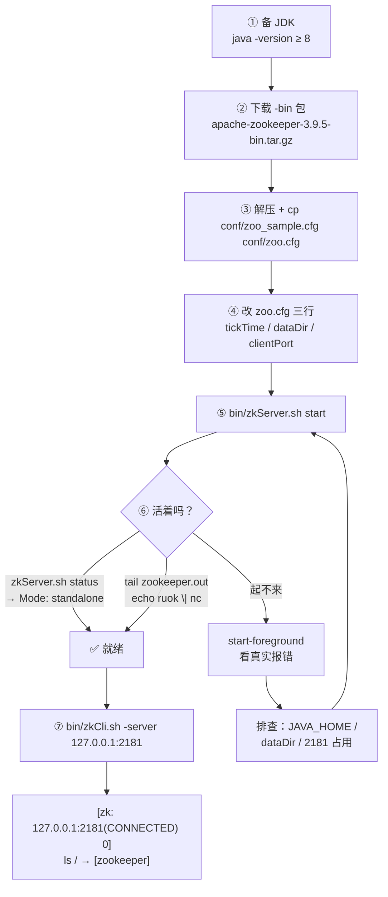
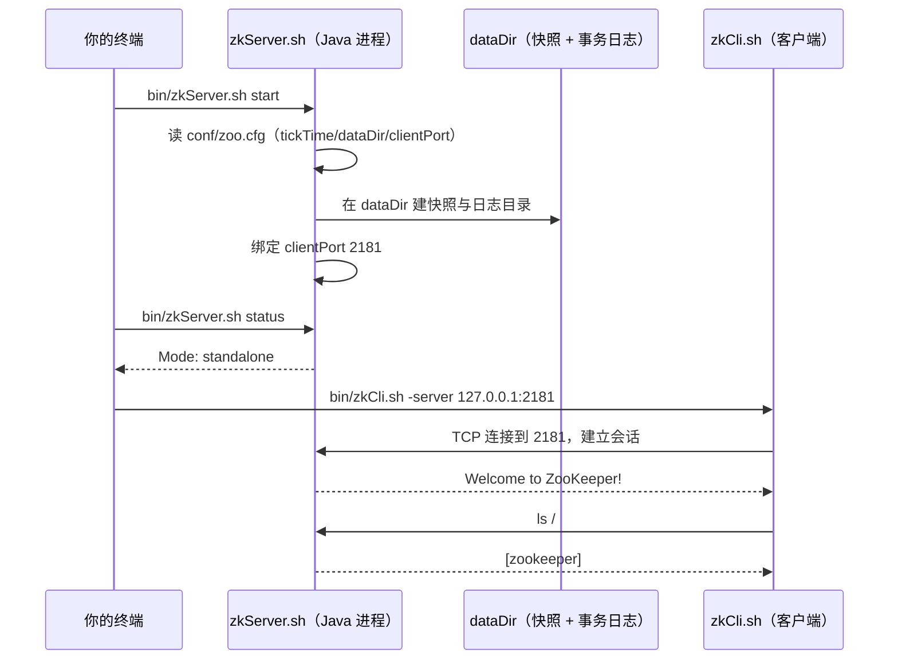

# 第 0.1 课 · 环境搭建：从零跑起一个 ZooKeeper

> 阶段 0 · 上手篇 · 知识点：JDK 与发行包 / zoo.cfg 最小配置 / 启停与状态检视
>
> 🧭 课程导航：[课程目录](../../../02-课程目录.md) · 阶段入口：[阶段 0 上手篇](../overview.md) · 下一课：[L0.2 zkCli 增删改查基本功](lesson-0-2-zkCli增删改查基本功.md)

## 第一幕 · 场景引入：评审会上那句"你跑过吗"

技术评审会，你把"要不要引入 ZooKeeper"的调研报告念到一半，架构师抬眼问了一句：

> "这东西你自己装过、跑起来过吗？"

你卡住了。报告里写满了"ZAB 协议""过半派""临时节点"，但你确实**一次都没装过**——所有结论都是从文档和博客上读来的。更要命的是你心里还压着一个没说出口的担忧：这玩意听起来要装 JDK、配集群、调一堆参数，**我一个人、一台笔记本，真能把它跑起来吗？**

本课就把这个担忧拆掉。答案是：**能，而且比你想的简单得多。** 单机模式下一个 ZooKeeper 只需要 **一个压缩包 + 三行配置 + 一条启动命令**，全程不到十分钟。你在报告里读到的那些"复杂"，绝大部分是**生产集群**的复杂（3 台机器、专用磁盘、监控告警），那是 L7 的账单；单机试玩根本用不上。

**本课目标：**

1. 在自己的机器上从零装好一个可运行的 ZooKeeper（单机模式）
2. 看懂 `zoo.cfg` 里那几行配置分别在管什么，不再抄完就忘
3. 会用三种方式确认"它还活着"（`status` / 日志 / 四字命令），并能在启动失败时自己定位

---

## 第二幕 · 认知冲突：三个"想当然"，三个都不对

**想当然一："装 ZooKeeper 要装一大堆东西。"**

真相是：ZooKeeper 服务端**就是一个 Java 进程**，官方发行包里连它依赖的 jar 都打包好了。你需要的额外东西只有一个——**JDK**。没有数据库要装，没有配置文件要改系统参数，没有服务要注册进系统。**它的全部家当解压后就是一个目录。**

**想当然二："配置文件肯定有一大堆参数。"**

单机模式的 `zoo.cfg` 最小形态只有三行，而且三行都有默认值含义。官方文档给的样例配置就这三行：

```text
tickTime=2000
dataDir=/var/lib/zookeeper
clientPort=2181
```

你看到的那些 `initLimit`、`syncLimit`、`server.1=...`，全是**集群模式**才需要的，单机一个都不用（L7 会逐个算它们的账）。

**想当然三："启动之后怎么知道它活着？"**

这是新手最容易懵的地方——`zkServer.sh start` 敲下去，终端只回几行字就结束了，**没有任何"启动成功"的绿灯**，也没有进程在前台跑给你看。它到底起来了没有？三个笨办法加上一个巧办法，第三幕 3.5 逐一给你：

- `zkServer.sh status`（问它自己）
- 看 `zookeeper.out` 日志（看它自己说了什么）
- 四字命令 `ruok`（隔着网络戳一下）
- 连上 `zkCli.sh`（真刀真枪用一次）

三个想当然拆完，剩下的就是照着做。

---

## 第三幕 · 层层揭示：四步，从下载到连上

### 3.1 第一步：备好 JDK

ZooKeeper 是 Java 写的，服务端和官方客户端都跑在 JVM 上。先确认你有 JDK：

```bash
java -version
```

**版本要求**（官方 Administrator's Guide "System Requirements" 原文）：

> ZooKeeper runs in Java, release 1.8 or greater (JDK 8 LTS, JDK 11 LTS, JDK 12 - Java 9 and 10 are not supported).

翻成人话：**JDK 8 及以上都行；Java 9 和 10 明确不支持**（这两个是过渡版本，官方点名排除）。

> ⚠️ 一个诚实的提醒：官方这段原文只点名到 JDK 12，没有逐一点名 17/21。但实践中 3.9.x 跑在 **JDK 11 或 JDK 17** 上是社区极其普遍的做法，不少发行版与教程直接推荐 JDK 17。⏳ **置信度：中**（官方文档未明确点名 17；你若在生产上用高版本 JDK，务必先在测试环境压一遍）。本课示例以通用 JDK 11/17 为准。

**平台支持**（官方 Support Matrix）：

| 操作系统 | 客户端 | 服务端 |
|----------|--------|--------|
| GNU/Linux | 开发 + 生产 | 开发 + 生产 |
| Windows | 开发 + 生产 | 开发 + 生产 |
| Mac OS X | **仅开发** | **仅开发** |
| Solaris / FreeBSD | 开发 + 生产 | 开发 + 生产 |

注意 macOS 那一行是 **Development Only**——本机学习完全够用，官方不把它当生产平台。Windows 用户不用慌，`bin/` 目录下同时提供了 `.cmd` 脚本（`zkServer.cmd` / `zkCli.cmd`），本课下面的命令把 `.sh` 换成 `.cmd`、斜杠换成反斜杠即可。

**没装 JDK？** Linux 用 `sudo apt install openjdk-17-jdk`（Debian/Ubuntu）或 `sudo yum install java-17-openjdk`（RHEL/CentOS）；macOS 用 `brew install openjdk@17`；Windows 去 Temurin / Oracle 官网下安装包。装完重开终端再 `java -version` 确认。

### 3.2 第二步：下载发行包（认准 `-bin`）

官方发布页：https://zookeeper.apache.org/releases.html

**当前版本**（核查于 2026-08）：

| 分支 | 版本 | 说明 |
|------|------|------|
| **current** | **3.9.5** | 功能最新的一线版本 |
| **stable** | 3.8.6 | 社区推荐的稳定线 |
| 3.7.2 | — | **已于 2024-02-02 起 EOL**，社区不再提供补丁 |

> 💡 官方支持两条分支并行：current 与 stable。新 minor 版本发布后，旧的 stable 线约六个月内逐步退役。本课与全课程统一以 **3.9.5** 为例。

下载页面上一排链接里有个新手必踩的坑：

```text
apache-zookeeper-3.9.5-bin.tar.gz   ← 要这个：编译好的二进制发行包
apache-zookeeper-3.9.5.tar.gz       ← 不要这个：源码包，得自己编译
```

**带 `-bin` 的才是能直接跑的那一个。** 不带 `-bin` 的是源码分发包，解压出来是 `pom.xml` 和 `src/`，需要 Maven 编译——新手第一次十有八九下错，然后卡在"为什么没有 bin/zkServer.sh"。

命令行下载（Linux / macOS）：

```bash
wget https://www.apache.org/dyn/closer.lua/zookeeper/zookeeper-3.9.5/apache-zookeeper-3.9.5-bin.tar.gz
# 官网下载慢时换国内镜像，目录结构与官网一致（把域名换成镜像根即可），例如清华镜像根：
# https://mirrors.tuna.tsinghua.edu.cn/apache/zookeeper/
# 进去后找 zookeeper-<版本号>/apache-zookeeper-<版本号>-bin.tar.gz
# ⏳ 注：镜像上是否已有 3.9.5 目录请以实际访问为准（各镜像同步有先后），没有就退回官网或用已同步的 3.8.6
```

> 💡 严谨一点的做法是顺手校验 `sha512` 和 `asc` 签名（官方发布页每个文件旁边都给了），方式见 Apache 官方的 [Verifying ASF Releases](https://www.apache.org/info/verification.html)。学习环境可以跳过，生产环境别跳。

### 3.3 第三步：解压与认识目录

```bash
tar -xzf apache-zookeeper-3.9.5-bin.tar.gz
cd apache-zookeeper-3.9.5-bin
ls
```

你会看到这样的结构（记住这四个就够）：

```text
apache-zookeeper-3.9.5-bin/
├── bin/      ← 所有可执行脚本：zkServer.sh、zkCli.sh、zkCleanup.sh…
├── conf/     ← 配置文件：zoo_sample.cfg（样例）、logback.xml（日志配置）
├── lib/      ← 依赖的 jar 包（不用管，也别删）
└── README.md / LICENSE.txt / NOTICE.txt
```

**关键动作：复制配置文件。** `conf/` 下只有 `zoo_sample.cfg` 这个样例，而 ZooKeeper 启动时认的文件名是 `zoo.cfg`：

```bash
cp conf/zoo_sample.cfg conf/zoo.cfg
```

> 🐞 这一步忘了会怎样？启动时报 `ZooKeeper config file … conf/zoo.cfg not found` 或直接起不来。新手第二大坑。

### 3.4 第四步：看懂 `zoo.cfg` 的三行

打开 `conf/zoo.cfg`，把内容精简成官方 Getting Started 给出的最小形态：

```text
tickTime=2000
dataDir=/var/lib/zookeeper
clientPort=2181
```

三个参数各管一摊：

| 参数 | 官方人话 | 你要知道的事 |
|------|----------|-------------|
| `tickTime=2000` | 毫秒为单位的基本时间单位，用于心跳；**最小会话超时 = 2 × tickTime** | 2000ms = 2 秒。它是 ZK 世界的"一拍"，超时、心跳、集群同步全按它折算（L5 会看到它被拿去钳制会话超时窗口） |
| `dataDir=/var/lib/zookeeper` | 存放内存数据库**快照**的位置；**未设置 `dataLogDir` 时，事务日志也放这里** | 换成一个**真实存在且初始为空**的目录，例如 `dataDir=/tmp/zookeeper` 或 `dataDir=/opt/zookeeper/data`。目录不存在会启动失败 |
| `clientPort=2181` | 监听客户端连接的端口 | 2181 是默认端口，全课程所有示例都连它 |

> ⚠️ 官方原文对 `dataDir` 的要求是"an existing (empty to start with) directory"——**已存在、且一开始是空的**。建议学习阶段就用 `/tmp/zookeeper` 或自己建一个 `data/` 目录，别直接沿用 `/var/lib/zookeeper`（权限可能不够，或者目录压根不存在）。

改完存盘，你就拥有了一份能启动的最小配置。**没有集群配置、没有 myid、没有 2888/3888 端口**——那些都属于"复制模式"，L7 才登场。

### 3.5 启动、检视、停止

**启动：**

```bash
bin/zkServer.sh start
```

典型输出：

```text
ZooKeeper JMX enabled by default
Using config: /opt/apache-zookeeper-3.9.5-bin/bin/../conf/zoo.cfg
Starting zookeeper ... STARTED
```

`zkServer.sh` 的完整用法（官方 Tools 文档）：

```text
./zkServer.sh {start|start-foreground|stop|version|restart|status|upgrade|print-cmd}
```

| 子命令 | 干什么 | 什么时候用 |
|--------|--------|-----------|
| `start` | 后台启动 | 日常 |
| `start-foreground` | **前台**启动，日志直接打到终端 | **排障首选**：起不来时用它，报错一眼看见 |
| `stop` | 停止 | 日常 |
| `restart` | 重启 | 改完配置后 |
| `status` | 查看状态与角色 | 确认活着 |
| `version` | 打印服务端版本 | 核对版本 |
| `print-cmd` | 打印实际启动命令（不执行） | 想看 JVM 参数时 |
| `upgrade` | — | **已废弃**，别用 |

**检视方式一：问它自己。**

```bash
bin/zkServer.sh status
```

```text
ZooKeeper JMX enabled by default
Using config: /opt/apache-zookeeper-3.9.5-bin/bin/../conf/zoo.cfg
Mode: standalone
```

最后一行 `Mode: standalone` 是最重要的一句——**单机模式，活着**。集群模式下这里会显示 `Mode: leader` 或 `Mode: follower`（L4 讲角色时会再见）。

**检视方式二：看它自己说了什么。**

ZooKeeper 默认会在**你执行 `zkServer.sh start` 时所在的当前目录**下生成一个 `zookeeper.out` 日志文件：

```bash
ls -l zookeeper.out
tail -50 zookeeper.out
```

启动成功的话，日志末尾大致会有 `binding to port 0.0.0.0/0.0.0.0:2181` 一类的行。**这个文件的位置由 `bin/zkEnv.sh` 里的 `ZOO_LOG_DIR` 决定**，默认就是启动目录——所以每次在不同目录启动就会散落一堆 `zookeeper.out`，学习阶段建议固定在一个目录里操作。

**检视方式三：隔着网络戳一下（四字命令）。**

四字命令（Four Letter Words，简称 4lw）是 ZK 的裸 TCP 诊断接口，用 `nc` 发四个字母过去：

```bash
echo ruok | nc 127.0.0.1 2181
```

活着就回一个 `imok`（I'm OK）。这是最轻量的探活方式。

> ⚠️ **这里有个官方埋的雷**：从 **3.5.3** 起，四字命令默认白名单收紧到**只剩 `srvr`** 一个（`zkServer.sh` 自己用的就是它）。所以你敲 `echo ruok | nc ...` 很可能**什么也不回**——不是服务挂了，是被白名单挡了。要放开就在 `zoo.cfg` 加一行再重启：
>
> ```text
> 4lw.commands.whitelist=ruok,stat,mntr,conf
> ```
>
> 生产上别图省事写 `*`（`wchs`/`wchp` 这类昂贵命令会一并放开，watch 多时能拖垮服务器）。这条白名单的坑在 L7 讲监控时还会再撞一次，那里给你完整的来龙去脉。

**停止：**

```bash
bin/zkServer.sh stop
```

### 3.6 第一次连接：`zkCli.sh`

服务起来了，用官方自带的命令行客户端连上去：

```bash
bin/zkCli.sh -server 127.0.0.1:2181
```

（不带 `-server` 参数时默认连 `localhost:2181`。另有两个常用参数：`-timeout 3000` 指定连接超时毫秒数、`-waitforconnection` 连上后才执行命令，写脚本时很有用。）

连接成功你会看到：

```text
Connecting to 127.0.0.1:2181
...
Welcome to ZooKeeper!
JLine support is enabled
[zk: 127.0.0.1:2181(CONNECTED) 0]
```

**恭喜，你现在站在一棵空树的根节点上。** 提示符最后那个数字是命令序号，每敲一条 +1。

先敲两条看看：

```text
[zk: 127.0.0.1:2181(CONNECTED) 0] ls /
[zookeeper]
[zk: 127.0.0.1:2181(CONNECTED) 1] help
```

`ls /` 返回的 `[zookeeper]` 是 ZK 自己保留的系统节点（存配额等信息），**永远在那儿，不是你建的**（L3 会正式介绍它）。

`help` 会列出全部可用命令——本课先不展开，L0.2 逐条走一遍。现在敲 `quit` 退出：

```text
[zk: 127.0.0.1:2181(CONNECTED) 2] quit
```

> 📝 **关于提示符的一个小说明**：官方文档（Getting Started / CLI）把提示符简写成 `[zkshell: 0]`，而你真实终端里看到的是 `[zk: 127.0.0.1:2181(CONNECTED) 0]`——后者才是运行时实际形态（带连接地址与状态）。本课程的示例统一用**实际形态**，你在文档里看到 `[zkshell: N]` 不用困惑，是同一个东西。

### 3.7 从下载到连上：一张流程图



> 🎯 决策视角小结：单机跑起来只需要 **JDK + 一个 tar 包 + 三行配置**，入门门槛远低于它"分布式协调服务"的名头给你留下的印象。但也别把这份轻松误当成生产成本——**单机模式没有任何冗余，进程一挂服务就全挂**（官方原文：if the ZooKeeper process fails, the service will go down）。它能让你看清 ZK 长什么样、手上有感觉，但**真实的部署账单在 L7**，那里才是决策时要算的数。

---

## 第四幕 · 实操演练：亲手走一遍，再亲手弄坏一次

**演练 A：完整走一遍（照抄即可，预计 10 分钟）。**

```bash
# 0. 确认 JDK
java -version

# 1. 下载（国内网络慢就换镜像）
wget https://www.apache.org/dyn/closer.lua/zookeeper/zookeeper-3.9.5/apache-zookeeper-3.9.5-bin.tar.gz

# 2. 解压并进入
tar -xzf apache-zookeeper-3.9.5-bin.tar.gz
cd apache-zookeeper-3.9.5-bin

# 3. 建数据目录（别用不存在的 /var/lib/zookeeper）
mkdir -p /tmp/zookeeper

# 4. 生成配置文件
cp conf/zoo_sample.cfg conf/zoo.cfg

# 5. 改配置：把 dataDir 指向刚建的目录，其余保持默认
#    tickTime=2000
#    dataDir=/tmp/zookeeper
#    clientPort=2181

# 6. 启动
bin/zkServer.sh start

# 7. 确认活着（三选一，建议都试）
bin/zkServer.sh status          # 期望看到 Mode: standalone
tail -20 zookeeper.out          # 看启动日志
echo ruok | nc 127.0.0.1 2181   # 期望 imok（3.5.3+ 可能需先配白名单）

# 8. 连上去
bin/zkCli.sh -server 127.0.0.1:2181
#   → ls /     期望 [zookeeper]
#   → quit

# 9. 收工
bin/zkServer.sh stop
```

**演练 B：三个必踩的启动故障，先自己判再对答案。**

| 现象 | 你看到什么 | 根因 | 怎么修 |
|------|-----------|------|--------|
| ① | `Error: JAVA_HOME is not set and java could not be found in PATH.`（或类似） | 没装 JDK，或 `JAVA_HOME` 没配 | 装 JDK；`export JAVA_HOME=/path/to/jdk` 后重试 |
| ② | 启动后立刻退出，`zookeeper.out` 里有 `dataDir ... does not exist` 或权限拒绝 | `dataDir` 指向的目录不存在 / 无写权限 | `mkdir -p` 建好目录并确认当前用户可写；学习阶段用 `/tmp/zookeeper` 最省事 |
| ③ | `Address already in use` / 端口占用相关报错 | 2181 已被占用（可能是上次没停干净的 ZK，也可能是别的进程） | `bin/zkServer.sh stop` 先停旧的；或 `lsof -i:2181`（Linux/macOS）、`netstat -ano \| findstr 2181`（Windows）找出占用者 |

<details><summary>再加一条进阶排查思路（点开看）</summary>

三个都排不掉时，用 **`bin/zkServer.sh start-foreground`** 替代 `start`。它把进程留在前台、日志直接打到终端，异常堆栈一览无余——这是所有启动类故障的**通用解法**，比翻 `zookeeper.out` 高效得多。排完 `Ctrl+C` 停掉，再用 `start` 正常启动。

</details>

**演练 C（可选）：打开 AdminServer 看一眼。**

3.5 版本起 ZK 内置了一个 HTTP 管理接口，默认端口 8080。确认它可用：

```bash
curl http://127.0.0.1:8080/commands/stat
```

返回一串 JSON 就是通了。这条路径不需要碰四字命令白名单，比 4lw 省心——L7 讲监控时会把它和 4lw、Prometheus 端点放在一起比。

> ⚠️ 如果 8080 返回连不上，可能是被 `admin.enableServer=false` 关掉了，或端口被改过（`admin.serverPort`）。学习环境一般默认开着。

---

## 第五幕 · 体系收束：你刚刚完成了什么



本课带走三句话：

1. **门槛比想象低**：单机 ZK = JDK + 一个 `-bin` 压缩包 + `zoo.cfg` 三行（`tickTime` / `dataDir` / `clientPort`）+ `zkServer.sh start`
2. **确认活着有三招**：`zkServer.sh status`（看 `Mode`）、`tail zookeeper.out`（看日志）、`echo ruok | nc`（看 `imok`，注意 3.5.3+ 白名单只留了 `srvr`）；起不来就用 `start-foreground` 看真实报错
3. **单机 ≠ 生产**：单机模式没有冗余，进程挂了服务就挂（官方明示）。它是学习与验证的沙盘，**不是**决策时的成本依据

现在你的手上有一个活着的服务和一个连上的客户端。下一课，我们在这棵空树上**真正动手写点东西**——把增删改查、四种节点、版本号冲突、Watch 通知全部亲手触发一遍。

### 📇 术语速查卡

| 术语 | 一句话解释 |
|------|-----------|
| standalone（单机模式） | 只有一个 ZK 服务进程，无复制无冗余，进程挂则服务挂；学习/开发用 |
| quorum / replicated mode（复制模式） | 多机成组提供服务，需 ≥3 台且建议奇数台；生产用（L4/L7） |
| `-bin` 发行包 | 已编译好的二进制包，解压即可跑；不带 `-bin` 的是源码包需自行编译 |
| `zoo.cfg` | 服务端主配置文件，启动时默认读 `conf/zoo.cfg` |
| `tickTime` | 毫秒为单位的基本时间单位，用于心跳；最小会话超时 = 2 × tickTime |
| `dataDir` | 存内存数据库快照的目录；未配 `dataLogDir` 时事务日志也放这里 |
| `dataLogDir` | 事务日志专用目录，与快照分离可显著降低延迟（L7 详讲） |
| `clientPort` | 监听客户端连接的端口，默认 2181 |
| `zookeeper.out` | 默认日志文件，生成在**执行启动命令时的当前目录**（由 `ZOO_LOG_DIR` 决定） |
| 四字命令（4lw） | 裸 TCP 诊断接口（`ruok`→`imok`、`srvr`、`stat`、`mntr`）；3.5.3 起默认白名单仅 `srvr` |
| AdminServer | 3.5+ 内置的 HTTP 管理接口，默认 8080 端口，返回 JSON |
| JLine | zkCli 使用的交互式命令行库，提供历史与补全；启动时提示 "JLine support is enabled" |
| 会话（Session） | 客户端与服务端之间的逻辑连接，有自己的 ID 与超时（L5 主角） |

### 🗂️ 命令速查卡（本课）

```bash
java -version                                   # 确认 JDK（≥ 1.8，不支持 9/10）
cp conf/zoo_sample.cfg conf/zoo.cfg             # 生成配置文件（必做）
bin/zkServer.sh start                           # 后台启动
bin/zkServer.sh start-foreground                # 前台启动（排障利器）
bin/zkServer.sh status                          # 看状态 → Mode: standalone
bin/zkServer.sh stop                            # 停止
bin/zkServer.sh restart                         # 重启
bin/zkServer.sh version                         # 看版本
bin/zkServer.sh print-cmd                       # 打印启动命令（不执行）
tail -50 zookeeper.out                          # 看日志（默认在启动目录）
echo ruok | nc 127.0.0.1 2181                   # 探活 → imok（注意白名单）
curl http://127.0.0.1:8080/commands/stat        # AdminServer（3.5+）
bin/zkCli.sh -server 127.0.0.1:2181             # 连客户端
bin/zkCli.sh -timeout 3000 -server <ip>:2181    # 带超时连接（毫秒）
```

### ✏️ 课后思考题（可选）

1. 你执行 `zkServer.sh start` 时不小心在两个不同目录下各执行了一次，`zookeeper.out` 会散落在哪里？这说明了什么？（提示：日志位置由 `ZOO_LOG_DIR` 决定，默认是启动时的当前目录）
2. `echo ruok | nc 127.0.0.1 2181` 什么也没返回。列出**至少三种**可能原因，并说明你会按什么顺序排除它们。
3. 把 `tickTime` 从 2000 改成 10000，按官方说明"最小会话超时 = 2 × tickTime"推算：最小会话超时会变成多少秒？这个改动对客户端意味着什么？（L5 会揭晓答案并引入超时协商机制）

## 🚀 下一批接力提示词

> 学完本课后，**复制下面这段文字发给 AI**，即可无缝进入下一课（无需重新描述上下文）：

```
继续学 ZooKeeper。我的学习档案在 zookeeper/00-学习档案.md，
刚学完阶段 0《上手篇》的课《环境搭建：从零跑起一个 ZooKeeper》知识点 JDK 与发行包、zoo.cfg 最小配置、启停与状态检视，
请按大纲继续讲解下一课（课 0.2：zkCli 增删改查基本功）。
```

## 🧭 课程导航

➡️ **下一课**：[L0.2 zkCli 增删改查基本功](lesson-0-2-zkCli增删改查基本功.md)

📚 **返回**：[阶段 0 上手篇](../overview.md) · [课程目录](../../../02-课程目录.md)
