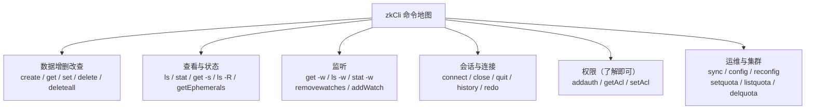
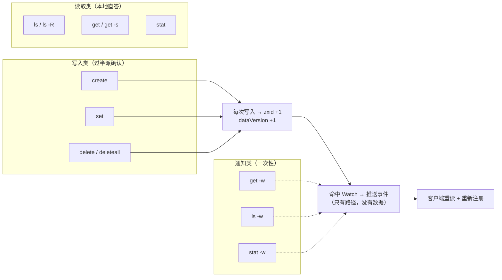

# 第 0.2 课 · zkCli 增删改查基本功：把这棵树玩熟

> 阶段 0 · 上手篇 · 知识点：CLI 命令地图 / 四种节点亲手创建 / 版本 CAS 与报错对照 / Watch 与临时节点初体验
>
> 🧭 课程导航：[课程目录](../../../02-课程目录.md) · 阶段入口：[阶段 0 上手篇](../overview.md) · 上一课：[L0.1 环境搭建](lesson-0-1-环境搭建与第一次连接.md) · 下一课：[L0.3 Python 客户端 kazoo 入门](lesson-0-3-Python客户端kazoo入门.md)

## 第一幕 · 场景引入：连上了，然后呢？

上一课结束时，你连上了一个崭新的 ZooKeeper，敲 `ls /` 得到一行冷冰冰的：

```text
[zk: 127.0.0.1:2181(CONNECTED) 0] ls /
[zookeeper]
```

一棵空树，只有一个系统保留节点。你照着文档敲了几条命令，`create /test hello` 回一句 `Created /test`，`get /test` 把 `hello` 吐回来——**感觉跟操作一个文件系统没什么两样**。

然后你开始按文件系统的直觉往下走，然后**连撞四堵墙**：

```text
[zk: 127.0.0.1:2181(CONNECTED) 1] create /app
Created /app
[zk: 127.0.0.1:2181(CONNECTED) 2] get /app
null                          ← ① 我没存东西，它怎么给我个 "null"？

[zk: 127.0.0.1:2181(CONNECTED) 3] create /app/config "a=1"
Created /app/config
[zk: 127.0.0.1:2181(CONNECTED) 4] delete /app
Node not empty: /app          ← ② 删个"文件夹"都不行？

[zk: 127.0.0.1:2181(CONNECTED) 5] get -w /app/config
a=1
[zk: 127.0.0.1:2181(CONNECTED) 6] set /app/config "a=2"
WATCHER::
WatchedEvent state:SyncConnected type:NodeDataChanged path:/app/config
[zk: 127.0.0.1:2181(CONNECTED) 7] set /app/config "a=3"
                              ← ③ 说好的监听呢？第二次怎么没通知了？

[zk: 127.0.0.1:2181(CONNECTED) 8] create -e /app/online "inst-1"
Created /app/online
[zk: 127.0.0.1:2181(CONNECTED) 9] quit
# 重新连上
[zk: 127.0.0.1:2181(CONNECTED) 0] ls /app
[config]                      ← ④ 我刚建的 online 呢？谁删了它？
```

四堵墙，四个"为什么"。它们分别对应 ZK 数据模型的四件根本事：**数据可以为空、删除不能递归、Watch 是一次性的、临时节点随会话生死**。

**本课目标：**

1. 掌握 zkCli 全部常用命令，能独立完成增删改查与状态查看
2. 亲手创建四种节点类型，看懂它们的命名与生命周期差异
3. 亲手触发版本冲突、删除失败等典型报错，建立"报错 → 原因"的反射
4. 亲手体验 Watch 的一次性触发与临时节点随会话消失——这两件事后面每一课都要用到

> 💡 本课**只教"怎么做"和"看到了什么"**，"为什么是这样"的原理留到 L3（数据模型）、L5（会话与 Watch）。先让手熟，再让脑通。

---

## 第二幕 · 认知冲突：文件系统的四连败

**败局一：`null` 不是空字符串。**

`create /app` 不带数据时，节点**照样被创建**，只是数据字段为空。`get` 对它返回的是字面量 `null`。这跟文件系统"文件必须有内容"的直觉不符，但在 ZK 里完全正常——**znode 的价值常常在"它存在"这件事本身，而不在它存了什么**。比如 `/services/order/instances/inst-1` 这个临时节点，光是"它在"就已经表达了"这个实例在线"，数据里放不放 IP 端口是锦上添花。

**败局二：`delete` 不能递归。**

文件系统里 `rm -rf` 一把梭，ZK 里 `delete` **只能删没有子节点的节点**，有孩子就回一句 `Node not empty`。这是刻意的：ZK 是协调账本，递归删除意味着"一次操作静默抹掉一整棵子树"，代价太大、太容易误伤。真要连根拔，得**显式**敲 `deleteall`——一个读起来就让人停顿一下的命令名，本身就是提醒。

**败局三：`-w` 是一次性的。**

`get -w` 设的监听**触发一次就销毁**，第 7 步再 `set` 就没有通知了。这不是 bug，这是 ZK Watch 的核心语义（官方原文：a watch event is one-time trigger）。想要持续监听，就得**每次收到通知后重新注册**，或者用 3.6.0 起的持久 Watch。ZK 宁可让你多写一行代码，也不愿维护"订阅列表"这种需要服务端记住每个客户端状态的东西——服务端越健忘，集群越可靠。

**败局四：临时节点随会话消失。**

`create -e` 建的 `/app/online`，在 `quit` 之后就没了。这是**特性不是故障**：临时节点的生命绑定在"创建它的那个会话"上，会话一结束，服务端自动清理。你想想它的用途就明白了——用临时节点表示"实例在线"，实例进程崩溃退出时，没人需要去调"注销接口"，条目**自动消失**。这是 L1 那场双主事故的解药之一，L5 会把它讲透。

四连败指向同一件事：**这不是文件系统，这是一本有规矩的账本。** 规矩得亲手摸一遍才记得住。

---

## 第三幕 · 层层揭示：一张命令地图，七组动作

### 3.1 命令地图：先看清全貌

在 zkCli 里敲 `help`，你会得到官方的完整命令清单。把常用的按用途分个类，心里就有底了：



| 分组 | 命令 | 本课是否动手 |
|------|------|-------------|
| **增删改查** | `create`、`get`、`set`、`delete`、`deleteall` | ✅ 全动手 |
| **查看状态** | `ls`、`ls -R`、`stat`、`get -s`、`ls -s`、`getEphemerals` | ✅ 全动手 |
| **监听** | `get -w`、`ls -w`、`stat -w`、`removewatches`、`addWatch` | ✅ 前三个 + 移除 |
| **会话** | `connect`、`close`、`quit`、`history`、`redo` | ✅ quit / history |
| **权限 / 运维** | `addauth`、`getAcl`、`sync`、`config`、`reconfig`、配额系列 | 📖 只认识，不深入 |

完整 `help` 输出（官方 Getting Started 文档，3.9.x）：

```text
ZooKeeper -server host:port cmd args
addauth scheme auth
close
config [-c] [-w] [-s]
connect host:port
create [-s] [-e] [-c] [-t ttl] path [data] [acl]
delete [-v version] path
deleteall path
delquota [-n|-b] path
get [-s] [-w] path
getAcl [-s] path
getAllChildrenNumber path
getEphemerals path
history
listquota path
ls [-s] [-w] [-R] path
printwatches on|off
quit
reconfig [-s] [-v version] ...
redo cmdno
removewatches path [-c|-d|-a] [-l]
set [-s] [-v version] path data
setAcl [-s] [-v version] [-R] path acl
setquota -n|-b val path
stat [-w] path
sync path
```

> 📝 官方文档这份清单里**没有 `exists`**（判断节点是否存在请直接 `stat`，不存在会提示 `Node does not exist`），也**没有列出 `addWatch`**——但 `addWatch` 在 3.6.0 及以上版本的 zkCli 里确实可用（见 3.6 节说明）。这两处都以你手上版本实际敲 `help` 看到的为准。

**先搭一棵测试树**，后面所有示例都在它上面做。请**逐个**敲进去（ZK 的 `create` 没有"自动建父目录"的选项，父节点不存在会直接报错）：

```text
[zk: 127.0.0.1:2181(CONNECTED) 0] create /app "订单服务"
Created /app
[zk: 127.0.0.1:2181(CONNECTED) 1] create /app/config
Created /app/config
[zk: 127.0.0.1:2181(CONNECTED) 2] create /app/config/db "jdbc:mysql://10.0.0.1:3306/order"
Created /app/config/db
[zk: 127.0.0.1:2181(CONNECTED) 3] create /app/election
Created /app/election
[zk: 127.0.0.1:2181(CONNECTED) 4] ls -R /app
/app
/app/config
/app/config/db
/app/election
```

> 🐞 **新手第一大坑**：`create /app/config/db "..."` 会失败，如果 `/app/config` 还没建。zkCli 的 `create` **没有 makepath 选项**，父节点必须一层层手工建（Python 客户端 kazoo 有 `makepath=True`，L0.3 会看到这个对比）。报错长这样：`KeeperErrorCode = NoNode for /app/config/db`。

### 3.2 增：`create` 与四种节点

`create` 的完整语法：`create [-s] [-e] [-c] [-t ttl] path [data] [acl]`

四个开关决定了节点的**材质**（L3 会系统讲，这里先亲手做出来看效果）：

| 命令 | 类型 | 名字变化 | 生死 |
|------|------|----------|------|
| `create /app/a "1"` | 持久节点 | 原样 | 显式删除才消失 |
| `create -e /app/b "1"` | 临时节点 | 原样 | 会话结束自动删除 |
| `create -s /app/c "1"` | 持久顺序节点 | 追加十位编号 | 显式删除才消失 |
| `create -s -e /app/d "1"` | 临时顺序节点 | 追加十位编号 | 会话结束自动删除 |

**亲手试顺序节点**——连敲三次，看编号：

```text
[zk: 127.0.0.1:2181(CONNECTED) 5] create -s /app/election/candidate- ""
Created /app/election/candidate-0000000000
[zk: 127.0.0.1:2181(CONNECTED) 6] create -s /app/election/candidate- ""
Created /app/election/candidate-0000000001
[zk: 127.0.0.1:2181(CONNECTED) 7] create -s /app/election/candidate- ""
Created /app/election/candidate-0000000002
```

三个观察：

1. 你给的名字只是**前缀**，ZK 追加了 **十位数字、左边补零**的后缀（格式 `%010d`）
2. 定宽补零是为了**按名字排序就等于按创建先后排序**——这正是选主和公平锁的排队机制赖以成立的基础
3. 计数器由**父节点**维护，只增不减：删掉 `candidate-0000000001`，下一个仍是 `...003`，编号不回收

**亲手试临时节点的一个禁令**——临时节点不能有子节点：

```text
[zk: 127.0.0.1:2181(CONNECTED) 8] create -e /app/online "inst-1"
Created /app/online
[zk: 127.0.0.1:2181(CONNECTED) 9] create /app/online/metrics "cpu=10"
Ephemerals cannot have children: /app/online/metrics
```

> 💡 为什么这么"不讲理"？想想看：临时节点随会话消失，如果它有持久的子节点，父节点一消失孩子就成了"挂在不存在路径下的孤儿"。ZK 选择**一刀切禁止**换掉一整类歧义——典型的"设计做减法"。L3 会展开。

**另两种扩展类型（认识即可）**：`create -c` 建**容器节点**（最后一个孩子被删后，容器自身会被服务端清理）；`create -t 3000` 建 **TTL 节点**（3000 毫秒后过期，但**默认关闭**，需服务端开启 `zookeeper.extendedTypesEnabled=true`，否则报 `KeeperErrorCode = Unimplemented`）。它们是 3.5.3 加的补丁，主流用法仍以四种基本类型为主。

### 3.3 查：`ls` / `get` / `stat` 三剑客

```text
[zk: 127.0.0.1:2181(CONNECTED) 10] ls /app
[config, election, online]

[zk: 127.0.0.1:2181(CONNECTED) 11] get /app/config/db
jdbc:mysql://10.0.0.1:3306/order

[zk: 127.0.0.1:2181(CONNECTED) 12] get -s /app/config/db
jdbc:mysql://10.0.0.1:3306/order
cZxid = 0x5
ctime = Mon Aug 31 10:15:33 CST 2026
mZxid = 0x5
mtime = Mon Aug 31 10:15:33 CST 2026
pZxid = 0x5
cversion = 0
dataVersion = 0
aclVersion = 0
ephemeralOwner = 0x0
dataLength = 34
numChildren = 0
```

三条命令的分工：

| 命令 | 看什么 | 常用开关 |
|------|--------|---------|
| `ls <path>` | **子节点名单** | `-s` 同时显示本节点 stat、`-R` 递归列出整棵子树、`-w` 设子节点监听 |
| `get <path>` | **本节点数据** | `-s` 同时显示 stat、`-w` 设数据监听 |
| `stat <path>` | **只看 stat，不看数据** | `-w` 设监听 |

`get -s` 吐出的这 11 行就是节点的**账本行**，L3 会逐字段精读。现在先记住三个最有诊断价值的：

- **`dataVersion`** —— 数据被改过几次（创建时为 0，每改一次 +1）。它是 CAS 乐观锁的弹药
- **`ephemeralOwner`** —— 临时节点这里是**创建者会话 ID**，持久节点恒为 `0x0`。**看一眼这个字段就知道节点是什么类型**
- **`cZxid` / `mZxid` / `pZxid`** —— 三个事务号，分别记录"出生那笔""最近改数据那笔""最近动子节点名单那笔"

再看一眼 `getEphemerals`——列出**当前会话**创建的临时节点：

```text
[zk: 127.0.0.1:2181(CONNECTED) 13] getEphemerals
[/app/online]
```

> 🐞 注意限定词是**当前会话**。你另开一个终端连上去敲 `getEphemerals`，看到的是那个新会话自己的临时节点，很可能为空。

### 3.4 改：`set` 与版本 CAS

```text
[zk: 127.0.0.1:2181(CONNECTED) 14] get -s /app/config/db
jdbc:mysql://10.0.0.1:3306/order
...
dataVersion = 0
...

[zk: 127.0.0.1:2181(CONNECTED) 15] set /app/config/db "jdbc:mysql://10.0.0.2:3306/order"

[zk: 127.0.0.1:2181(CONNECTED) 16] get -s /app/config/db
jdbc:mysql://10.0.0.2:3306/order
...
dataVersion = 1
mZxid = 0x9
...
```

`dataVersion` 从 0 变 1，`mZxid` 也变了。**不带 `-v` 的 `set` 是无条件覆盖**（等价于 `-v -1`）。

现在亲手制造一次**版本冲突**——这是 ZK 并发更新防丢更新的核心机关：

```text
[zk: 127.0.0.1:2181(CONNECTED) 17] set -v 0 /app/config/db "jdbc:mysql://10.0.0.3:3306/order"
version No is not valid : /app/config/db
```

**失败原因**：你带着"我看到的版本是 0"提交，但服务端上它已经是 1 了——**说明在你读取之后有人改过它**。ZK 拒绝这次写入，而不是静默覆盖。

这就是 **CAS（比较并交换）**：

```text
1. get -s  →  拿到数据 + dataVersion == 0
2. set -v 0 <path> <新数据>          ← 带着"我看到的版本"提交
3. 期间有人改过 → 服务端版本已不是 0
   → 报 version No is not valid → 重读、重试
   （不带 -v 等价于 -v -1：放弃检查直接覆盖）
```

> ⚠️ **`-v -1` 是"我不管，直接覆盖"**。除非你明确不在乎丢更新，否则别用。这就是为什么 L6 讲配置中心时，`set` 一定要带上读到的版本号。

`delete` 也支持 `-v`，语义相同。

### 3.5 删：`delete` 与 `deleteall`，以及四种报错

```text
[zk: 127.0.0.1:2181(CONNECTED) 18] delete /app
Node not empty: /app                 ← 有子节点，拒绝

[zk: 127.0.0.1:2181(CONNECTED) 19] delete /app/nonexistent
Node does not exist: /app/nonexistent ← 节点不存在

[zk: 127.0.0.1:2181(CONNECTED) 20] deleteall /app
[zk: 127.0.0.1:2181(CONNECTED) 21] ls /
[zookeeper]                          ← 整棵子树连根拔起
```

**报错对照表**（这几条你会反复遇到，值得背下来）：

| 报错信息 | 含义 | 怎么修 |
|----------|------|--------|
| `Node not empty: /app` | 要删的节点还有孩子 | 先删孩子，或用 `deleteall`（**谨慎**） |
| `Node does not exist: /xxx` | 路径不存在 | 检查路径拼写；注意父节点是否建了 |
| `Node already exists: /xxx` | 同名节点已存在 | 换名字；或这正是你要的"抢占"语义（L6 选主/加锁就靠它） |
| `version No is not valid : /xxx` | 带版本写入/删除时版本不匹配 | 重读拿新版本再提交（CAS 重试） |
| `Ephemerals cannot have children: /xxx` | 试图给临时节点建子节点 | 临时节点只能是叶子 |
| `KeeperErrorCode = NoNode for /xxx` | Java 客户端风格的"NoNode" | 同"节点不存在"，多见于递归创建父目录缺失 |
| `KeeperErrorCode = Unimplemented for /xxx` | 用了未启用的特性（如 TTL 节点） | 服务端开启 `zookeeper.extendedTypesEnabled=true` |

> 💡 **把报错当朋友看**：`Node already exists` 在配置场景是错误，但在**选主 / 加锁**场景恰恰是"有人抢先了"的信号——同一条报错，换个场景就是正常的控制流。L6 讲四张配方时你会看到它被当成判断依据来用。

### 3.6 监听初体验：一次性信号弹

**开两个终端**，都连上同一个 ZK，我们让终端 B 改数据、终端 A 收通知。

**终端 A（设监听）**：

```text
[zk: 127.0.0.1:2181(CONNECTED) 0] create /app/watchtest "v1"
Created /app/watchtest
[zk: 127.0.0.1:2181(CONNECTED) 1] get -w /app/watchtest
v1
```

**终端 B（触发变更）**：

```text
[zk: 127.0.0.1:2181(CONNECTED) 0] set /app/watchtest "v2"
```

**终端 A 立刻收到**：

```text
WATCHER::
WatchedEvent state:SyncConnected type:NodeDataChanged path:/app/watchtest
```

**终端 B 再改一次**：

```text
[zk: 127.0.0.1:2181(CONNECTED) 1] set /app/watchtest "v3"
```

**终端 A：什么都没有。** ← 这就是"一次性"。

三种监听的触发条件：

| 命令 | 监听对象 | 触发事件 |
|------|----------|----------|
| `get -w <path>` | 该节点的**数据** | `NodeDataChanged`（数据变更）、`NodeDeleted` |
| `ls -w <path>` | 该节点的**子节点名单** | `NodeChildrenChanged`（孩子增删） |
| `stat -w <path>` | 该节点的**存在性** | `NodeCreated`、`NodeDeleted`、`NodeDataChanged` |

取消监听：`removewatches <path> [-c|-d|-a] [-l]`（`-c` 取消子节点监听、`-d` 取消数据监听、`-a` 取消全部、`-l` 列出当前监听）。

> 💡 想持续监听怎么办？两条路：**①** 收到通知后**立即重新注册**（这是 ZK 的标准做法，L5/L6 会讲为什么必须这么做）；**②** 用 **3.6.0 起**的持久 Watch：`addWatch [-m mode] path`，模式可选 `PERSISTENT`（本节点数据 + 子节点名单）与 `PERSISTENT_RECURSIVE`（递归整棵子树，**默认**），触发后**不会销毁**，可用 `removewatches` 移除。
>
> ⏳ **置信度：中**——`addWatch` 在 3.6.0+ 的 zkCli 中确实可用（社区多处实测会话输出可证），但**官方 Getting Started 文档那一份 `help` 清单里没有列出它**。请以你手上版本实际敲 `help` 的结果为准；L5 会从官方 Programmer's Guide 的角度正式讲持久 Watch 的语义。

### 3.7 临时节点生死实验：亲眼看它消失

这是本课最值得做的一个实验——它把"会话"这个抽象概念变成看得见的现象。

```text
# 终端 A
[zk: 127.0.0.1:2181(CONNECTED) 0] create -e /app/online "inst-1:8080"
Created /app/online
[zk: 127.0.0.1:2181(CONNECTED) 1] ls /app
[watchtest, online]
[zk: 127.0.0.1:2181(CONNECTED) 2] get -s /app/online
inst-1:8080
...
ephemeralOwner = 0x1000a2b3c4d0001     ← 非 0，是创建者会话 ID
...
[zk: 127.0.0.1:2181(CONNECTED) 3] quit
```

**重开一个 zkCli 连上去**：

```text
[zk: 127.0.0.1:2181(CONNECTED) 0] ls /app
[watchtest]        ← /app/online 不见了
```

**没有任何人执行过删除命令，它就消失了。**

这就是临时节点。正因为如此，它成为"服务在线标记""锁持有者""主节点标记"的天然载体——**进程崩溃时不需要任何人来做善后**。

> ⚠️ 一个重要限定：**会话结束 ≠ 断连即删**。客户端短暂断连，临时节点不会立刻消失，要等会话真正超时（超时窗口默认在 4~40 秒之间协商，L5 讲）。本课 `quit` 是**主动关闭会话**，属于立即结束；而"网络闪断"是另一回事。别把这两者混为一谈。

### 3.8 顺手认识几条"配角"命令

| 命令 | 作用 | 备注 |
|------|------|------|
| `history` | 列出本次会话敲过的命令及编号 | 配 `redo <编号>` 重放 |
| `redo 12` | 重放第 12 条命令 | 重复实验很省事 |
| `printwatches on\|off` | 开关是否打印 Watch 事件 | 默认 `on` |
| `sync <path>` | 把该路径的数据从 Leader 同步到所连节点 | 集群模式下读前保证新鲜（L4/L6） |
| `close` | 关闭当前连接（但不退出 shell） | 与 `quit` 不同 |
| `connect host:port` | 在 shell 内切换到另一个服务 | — |
| `getAllChildrenNumber <path>` | 递归统计子孙节点总数 | 比 `ls -R \| wc -l` 方便 |
| `sync` / `config` / `reconfig` | 集群运维相关 | L7 登场 |

> 🎯 决策视角小结：zkCli 是**最便宜的验证工具**——不需要写代码、不需要装依赖，任何关于"ZK 会怎么表现"的疑问，都可以在终端里十秒钟得到答案。**评估一项技术时，先把它跑起来亲手摸一遍，比读十篇对比文章有用。** 你在这个沙盘里撞到的每一条报错（`Node not empty`、`version No is not valid`），在生产事故的日志里都会以别的形式再出现一次。

---

## 第四幕 · 实操演练：一个完整的迷你服务注册实验

**实验目标**：用两个终端模拟"两个服务实例上线、其中一个宕机"，亲手观察服务发现是怎么自动发生的。

### 步骤 1：建好目录骨架（终端 A）

```text
create /services
create /services/order
create /services/order/instances
```

> 注意：一层一层建，`create` 不会帮你建父目录。

### 步骤 2：终端 A 监听实例名单

```text
[zk: 127.0.0.1:2181(CONNECTED) 4] ls -w /services/order/instances
[]
```

返回空数组 `[]`——没有实例，但**监听已经设上了**。

### 步骤 3：终端 B 模拟实例 1 上线

```text
[zk: 127.0.0.1:2181(CONNECTED) 0] create -e /services/order/instances/inst-1 "10.0.0.1:8080"
Created /services/order/instances/inst-1
```

**终端 A 立刻收到：**

```text
WATCHER::
WatchedEvent state:SyncConnected type:NodeChildrenChanged path:/services/order/instances
```

> 💡 看到了吗？**终端 A 收到的通知里只有路径，没有"新增了谁"这个信息。** 这是 Watch 的轻量设计（官方：WatchedEvent 只含 state/type/path，不含数据）。客户端收到后必须**自己去重新拉一次名单**——这是 ZK 客户端代码的固定套路，L0.3 写代码时会再遇一次。

### 步骤 4：终端 A 重新拉名单 + 重新设监听

```text
[zk: 127.0.0.1:2181(CONNECTED) 5] ls -w /services/order/instances
[inst-1]
```

**每次收到通知都要重新注册监听**——因为刚才那个已经用掉了。

### 步骤 5：终端 B 再上一个实例，然后"宕机"

```text
[zk: 127.0.0.1:2181(CONNECTED) 1] create -e /services/order/instances/inst-2 "10.0.0.2:8080"
Created /services/order/instances/inst-2
[zk: 127.0.0.1:2181(CONNECTED) 2] quit          ← 模拟进程退出
```

### 步骤 6：观察

在终端 A（先按步骤 4 的方式重新设了监听的话）观察通知，然后：

```text
[zk: 127.0.0.1:2181(CONNECTED) 6] ls -w /services/order/instances
[inst-1]        ← inst-2 自动消失了
```

**再开一个终端 C**（新会话），验证 `getEphemerals` 的会话归属：

```text
[zk: 127.0.0.1:2181(CONNECTED) 0] getEphemerals
[]              ← 空！因为 inst-1 是终端 B 建的，不属于这个新会话
```

<details><summary>实验结论（先自己想，再看）</summary>

1. **服务注册 = 建临时节点**：实例启动时 `create -e`，进程退出时节点自动消失，无需注销接口
2. **服务发现 = `ls -w` + 收到通知后重拉名单 + 重新注册监听**：这三步是一个不可分割的循环，漏掉"重新注册"就会丢掉后续所有变更
3. **通知只告诉你"变了"，不告诉你"变成什么"**：客户端必须自己再读一次
4. **`getEphemerals` 是会话私有的**：想看全网的临时节点，得用 `ls` 逐个看，或用服务端命令 `dump`（仅限 Leader，L7）

这正是 L6 要讲的"服务发现配方"的原始形态。你现在已经亲手跑过一遍了。

</details>

### 判案三连（可选，检验手感）

1. 你执行 `set -v 3 /x "new"` 成功，紧接着**原样再执行一次**，会怎样？为什么？
2. `create -s /q/t- ""` 返回 `Created /q/t-0000000007`，然后你 `delete /q/t-0000000007`，再 `create -s /q/t- ""`，新节点的名字是什么？
3. 终端 A 执行 `stat -w /x`（`/x` 不存在），终端 B 执行 `create /x "1"`。终端 A 会收到什么事件？为什么监听一个**还不存在的**节点也能生效？（提示：`stat` 在 zkCli 里对应的是 API 层的 `exists`）

<details><summary>参考答案</summary>

1. **第二次失败，报 `version No is not valid : /x`**。第一次成功后 `dataVersion` 已经从 3 变成 4，再带 `-v 3` 提交就不匹配了。这正是 CAS 的预期行为。
2. **`...008`**。顺序节点的计数器由父节点维护且**只增不减**，删除不会回收编号。
3. **收到 `NodeCreated` 事件**。按官方 Watch 事件矩阵，**Created 事件只能由 `exists` 触发**——而 zkCli 里的 `stat` 对应的正是 API 层的 `exists`，所以 `stat -w` 可以对一个**还不存在的路径**设上监听，等它被创建的那一刻收到通知。这正是选主场景的标准玩法：大家都盯着那个还不存在的 `/master`，谁先建出来谁就是主，其余人收到 `NodeCreated` 后重新排队。
   > ⚠️ 反过来，**`get -w` 对不存在的路径会直接报 `Node does not exist`，设不上监听**——`getData` 要求节点已存在。别把两者弄混。

</details>

---

## 第五幕 · 体系收束：从命令到心智模型



本课带走四句话：

1. **命令就三类**：写（create/set/delete，都要过服务端确认）、读（ls/get/stat，本地直答）、听（`-w`，一次性）
2. **四种节点材质**：`-e` 临时（随会话消失、不能有孩子）、`-s` 顺序（追加十位编号、编号不复用），两者可组合；`ephemeralOwner` 字段一眼看出是不是临时
3. **报错都是有意义的**：`Node not empty` 是防误删、`version No is not valid` 是防丢更新、`Node already exists` 在选主/加锁场景是"有人抢先"的信号
4. **Watch 是一次性信号弹，且只报路径不报内容**：收到通知后必须"重读 + 重新注册"，这两步是 ZK 客户端的固定套路

你的手现在熟了。但**用命令行点来点去终究不是项目里的用法**——下一课，我们把同样的动作写成 Python 代码，顺便看看客户端库替你包掉了哪些坑、又留下了哪些坑。

### 📇 术语速查卡

| 术语 | 一句话解释 |
|------|-----------|
| znode | 账本条目：路径 + 数据 + 子节点名单 + stat；可同时存数据和挂孩子 |
| `-e` / ephemeral | 临时节点：随创建者会话消亡，不能有子节点 |
| `-s` / sequential | 顺序节点：名字自动追加十位补零编号，父节点维护、只增不复用 |
| `-c` / container | 容器节点：最后一个子节点被删后，自身被服务端清理（3.5.3+） |
| `-t` / TTL | TTL 节点：带过期时间，默认关闭，需 `zookeeper.extendedTypesEnabled=true` |
| `dataVersion` | 数据被改过几次，创建时为 0；CAS 乐观锁的弹药 |
| `ephemeralOwner` | 临时节点＝创建者会话 ID；持久节点恒为 `0x0` |
| cZxid / mZxid / pZxid | 出生那笔 / 最近改数据那笔 / 最近动子节点名单那笔的事务号 |
| CAS | 带着"我看到的版本号"提交，版本不符则拒绝——防并发更新丢失 |
| Watch | 一次性通知，只含 state/type/path，不含数据 |
| NodeChildrenChanged | 子节点名单变动事件（由 `ls -w` 触发） |
| NodeDataChanged | 节点数据变动事件（由 `get -w` / `stat -w` 触发） |

### 🗂️ 命令速查卡（本课）

```text
# —— 建（父节点必须先存在，zkCli 没有 makepath）——
create /app "data"                    # 持久节点
create /app/no-data                   # 数据为空，get 返回 null
create -e /app/online "inst-1"        # 临时节点
create -s /app/t- ""                  # 持久顺序 → /app/t-0000000000
create -s -e /app/c- ""               # 临时顺序 → /app/c-0000000000

# —— 查 ——
ls /app                               # 子节点名单
ls -R /app                            # 递归列出整棵子树
ls -s /app                            # 名单 + 本节点 stat
get /app/config                       # 本节点数据
get -s /app/config                    # 数据 + stat
stat /app/config                      # 只要 stat
getEphemerals                         # 当前会话创建的临时节点
getAllChildrenNumber /app             # 递归统计子孙总数

# —— 改（CAS）——
set /app/config "new"                 # 无条件覆盖
set -v 3 /app/config "new"            # 版本必须匹配，否则 version No is not valid

# —— 删 ——
delete /app/config                    # 只能删无子节点的
delete -v 2 /app/config               # 带版本删除
deleteall /app                        # 递归删除（谨慎！）

# —— 监听（一次性）——
get -w /app/config                    # 监听数据变更
ls  -w /app                           # 监听子节点增减
stat -w /app/config                   # 监听存在性
removewatches /app/config -d          # 取消数据监听

# —— 杂项 ——
history / redo 12 / printwatches on|off
close / connect host:port / quit
sync /app                             # 读前同步（集群模式）
```

### ✏️ 课后思考题（可选）

1. 你想建出 `/a/b/c/d` 这条路径，但 `/a` 都不存在。zkCli 里最少要敲几条 `create`？这暴露了 zkCli 的什么限制？（提示：L0.3 的 kazoo 有 `makepath=True`）
2. `ls -w /x` 设上监听后，别人在 `/x` 下**改了某个子节点的数据**（没增删节点）。你会收到通知吗？为什么？（提示：想清楚 `ls -w` 监听的是"名单"还是"内容"）
3. Watch 通知里不含数据，客户端必须重读。这个设计带来了什么好处，又留下了什么问题？（提示：想想服务端要维护多少状态；以及 L5 会讲的"通知丢失"场景）

## 🚀 下一批接力提示词

> 学完本课后，**复制下面这段文字发给 AI**，即可无缝进入下一课（无需重新描述上下文）：

```
继续学 ZooKeeper。我的学习档案在 zookeeper/00-学习档案.md，
刚学完阶段 0《上手篇》的课《zkCli 增删改查基本功》知识点 CLI 命令地图、四种节点亲手创建、版本 CAS 与报错对照、Watch 与临时节点初体验，
请按大纲继续讲解下一课（课 0.3：Python 客户端 kazoo 入门）。
```

## 🧭 课程导航

⬅️ **上一课**：[L0.1 环境搭建](lesson-0-1-环境搭建与第一次连接.md)

➡️ **下一课**：[L0.3 Python 客户端 kazoo 入门](lesson-0-3-Python客户端kazoo入门.md)

📚 **返回**：[阶段 0 上手篇](../overview.md) · [课程目录](../../../02-课程目录.md)
