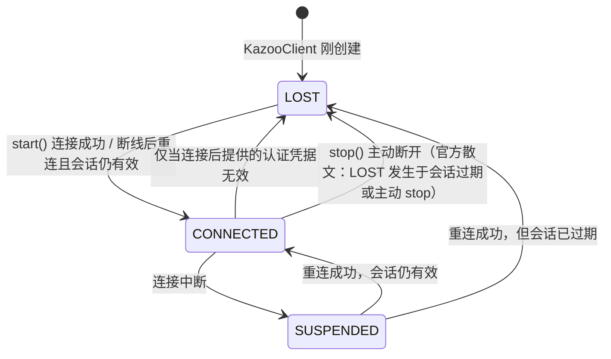
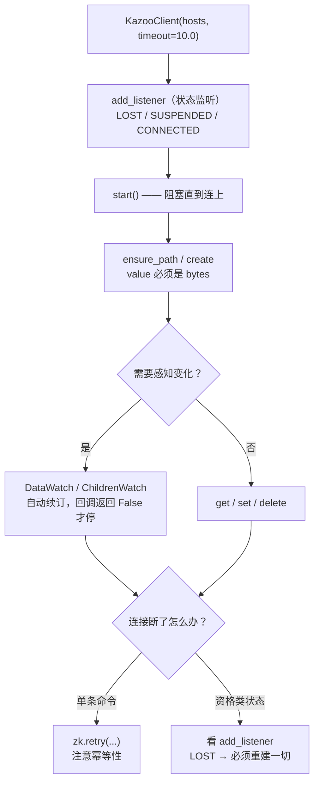

# 第 0.3 课 · Python 客户端 kazoo 入门：写下第一段 ZK 代码

> 阶段 0 · 上手篇 · 知识点：kazoo 安装与连接骨架 / CRUD 与 bytes 陷阱 / 连接状态监听 / DataWatch 与 retry
>
> 🧭 课程导航：[课程目录](../../../02-课程目录.md) · 阶段入口：[阶段 0 上手篇](../overview.md) · 上一课：[L0.2 zkCli 增删改查基本功](lesson-0-2-zkCli增删改查基本功.md) · 下一课：[L1 为什么需要 ZooKeeper](../../1-问题与定位/lessons/lesson-01-为什么需要ZooKeeper.md)

## 第一幕 · 场景引入：命令行玩得转，代码一写就崩

你在 zkCli 里已经能把四种节点建出来、把 Watch 玩明白、把版本冲突亲手触发一遍了。信心满满地把同样的动作翻译成 Python，五分钟写完了人生第一段 ZK 代码：

```python
from kazoo.client import KazooClient

zk = KazooClient(hosts='127.0.0.1:2181')
zk.start()
zk.create("/app/config/db", "jdbc:mysql://10.0.0.1:3306/order")
zk.stop()
```

一运行：

```text
TypeError: Invalid type for 'value' (must be a byte string)
```

改掉，再运行：

```text
kazoo.exceptions.NoNodeError
```

再改，终于跑通了。你盯着屏幕上这几行代码，心里浮起一个更根本的不安：**就算 CRUD 都跑通了，我写的这个客户端在生产上到底安不安全？** 进程 GC 卡顿三秒钟会怎样？网络闪断一秒钟会怎样？我建的临时节点还在吗？我以为自己还握着的锁，真的还握着吗？

**本课目标：**

1. 用 Python 的 kazoo 客户端跑通连接、增删改查，并避开三个新手必踩的坑
2. 理解**连接状态监听**为什么是 ZK 客户端代码里最重要、也最容易被漏掉的一段
3. 用 `DataWatch` 写出一个能实时响应配置变更的最小配置中心
4. 带走一张**实验地图**——后面每一课讲到机制时，你都能用本课的技能亲手验证一遍

---

## 第二幕 · 认知冲突：命令行和代码之间，隔了三道坎

**坎一：数据是 `bytes`，不是 `str`。**

zkCli 里你敲 `create /x hello`，`hello` 就是字符串。到 kazoo 里，**所有 value 必须是 `bytes`**。这是 kazoo 在客户端侧做的显式类型检查，源码里那行判断长这样：

```python
if value is not None and not isinstance(value, bytes_types):
    raise TypeError("Invalid type for 'value' (must be a byte string)")
```

**为什么这么严格？** 因为 ZK 存的是**原始字节**，它不知道也不关心你存的是 UTF-8 文本、JSON 还是 protobuf。把编码选择权明确交给你，比库自作主张猜一个编码要好——`b"中文"` 和 `"中文".encode("utf-8")` 是两回事，猜错了就是线上乱码。

**坎二：父节点不存在，直接抛异常。**

zkCli 不会帮你建父目录（L0.2 已经撞过一次），kazoo 的 `create()` 默认也一样——父路径不存在就抛 `NoNodeError`。但 kazoo 给了两个解法，这是它比 zkCli 方便的地方：`zk.ensure_path()` 递归建父路径，或 `create(..., makepath=True)` 一步到位。

**坎三（最要命）：客户端会自动重连，但"自动重连"救不了你的业务假设。**

kazoo 官方文档说得明白：连接建立后，客户端会**尽力保持连接**，无论中间掉了多少次、会话是否过期。听起来很省心？问题恰恰出在这——**它重连了，但你不知道中间发生过什么**：

- 连接断过（状态 `SUSPENDED`）→ 你之前建的**临时节点可能还在，也可能已经没了**
- 会话过期（状态 `LOST`）→ 服务端**已经把你的临时节点全删了**，你以为自己还持有锁，其实早就丢了

客户端帮你重连了网络，但**"我现在还算不算在线"这个业务判断，必须由你自己监听状态来做**。kazoo 官方文档的原话是：使用 `Lock` 配方或创建临时节点时，**强烈建议**注册一个状态监听器。

> 🐞 这是 ZK 客户端代码**最常见也最致命的 bug 来源**：只写了 CRUD，没写状态监听。程序在正常网络下跑得好好的，一次网络抖动后就静默地做错了事——而日志里一个错误都没有。

三道坎，第三道才是真坎。第三幕逐个拆。

---

## 第三幕 · 层层揭示：从连上到写对

### 3.1 安装 kazoo

```bash
pip install kazoo
```

| 项 | 值 | 核查时间 |
|----|-----|---------|
| 最新版本 | **2.11.0**（2026-03-21 发布） | 2026-08 |
| Python 支持 | **3.8 – 3.14**（CPython 与 PyPy）；**已移除 Python 2** | 2026-08 |
| 维护状态 | `Development Status :: 5 - Production/Stable`，无弃用/停维护警告 | 2026-08 |
| License | Apache License 2.0 | 2026-08 |

> 💡 kazoo 是 Python 生态里最主流的 ZK 客户端（官方 ZK 只提供 Java 与 C 绑定）。它封装了重连、Watch 续订、以及官方 Recipes 里的锁与选主配方——**这些封装正是本课要讲的重点**。

### 3.2 连接骨架：六行代码，与一句必须知道的警告

```python
import logging
from kazoo.client import KazooClient

logging.basicConfig()                              # ① 不配日志会看到一行烦人的提示

zk = KazooClient(hosts='127.0.0.1:2181')           # ② 默认值就是它，timeout 默认 10.0 秒
zk.start()                                         # ③ 阻塞直到连上或超时
print(zk.state)                                    # 'CONNECTED'
zk.stop()                                          # ④ 收工，主动断开
```

四件事值得说明：

**① `logging.basicConfig()` 不是可选的装饰。** kazoo 用标准库 `logging` 输出日志。你的应用若完全没配 logging，运行时会看到：

```text
No handlers could be found for logger "kazoo.client"
```

加一行 `logging.basicConfig()` 就没了。正式项目里请按你自己的日志体系配（本课示例用 `level=logging.WARN` 把 kazoo 的 INFO 刷屏压掉）。

**② 构造函数的关键参数。** 完整签名很长，入门期只需记住前两个：

```python
KazooClient(hosts='127.0.0.1:2181', timeout=10.0, ...)
```

- `hosts`：逗号分隔的地址串，**默认 `'127.0.0.1:2181'`**。连集群就写 `'zk1:2181,zk2:2181,zk3:2181'`（客户端会自己挑一台，失败自动换下一台——L5 讲会话时会展开）
- `timeout`：**连接超时，默认 10.0 秒**（注意单位是秒，不是毫秒）

**③ `start()` 会阻塞。** 如果 ZK 没起来，`start()` 会**一直等到超时**（默认 10 秒）才抛异常，不是立刻失败。写启动脚本时心里要有这个数。

**④ `stop()` 会结束会话。** 会话一结束，你建的**所有临时节点立刻消失**。这不是 bug，正是 L0.2 亲手验过的机制。

### 3.3 CRUD：把 zkCli 的动作翻译成 Python

```python
import logging
from kazoo.client import KazooClient
from kazoo.exceptions import NoNodeError, NodeExistsError, BadVersionError

logging.basicConfig(level=logging.WARN)

zk = KazooClient(hosts='127.0.0.1:2181')
zk.start()

# ── 建父路径：ensure_path 递归创建，但不能设数据 ──
zk.ensure_path("/app/config")

# ── 建节点：value 必须是 bytes！ ──
zk.create("/app/config/db", b"jdbc:mysql://10.0.0.1:3306/order")

# ── 读：返回 (data: bytes, stat) 二元组 ──
data, stat = zk.get("/app/config/db")
print(data.decode("utf-8"), "| version =", stat.version)
# → jdbc:mysql://10.0.0.1:3306/order | version = 0

# ── 改：带版本号的 CAS 乐观锁 ──
try:
    zk.set("/app/config/db", b"jdbc:mysql://10.0.0.2:3306/order", version=stat.version)
    print("改成功")
except BadVersionError:
    print("版本不匹配：说明我读之后有人改过 → 重读再提交")

# ── 建临时顺序节点：makepath=True 会自动补上缺失的父路径 ──
path = zk.create(
    "/app/election/candidate-", b"",
    ephemeral=True, sequence=True, makepath=True,
)
print("抢到：", path)        # → /app/election/candidate-0000000000

# ── 查子节点名单 ──
print(zk.get_children("/app/config"))     # → ['db']

# ── 删 ──
zk.delete("/app/config/db")

zk.stop()
```

**方法签名速记**（官方 API 文档）：

```python
create(path, value=b'', acl=None, ephemeral=False, sequence=False,
       makepath=False, include_data=False)   -> str   # 返回节点真实路径
set(path, value, version=-1)                 -> ZnodeStat
get(path, watch=None)                        -> (bytes, ZnodeStat)
delete(path, version=-1, recursive=False)    -> bool
exists(path, watch=None)                     -> ZnodeStat | None
get_children(path, watch=None)               -> list[str]
ensure_path(path, acl=None)                  -> bool   # 递归建路径，不能设数据
```

**异常对照表**（照着 zkCli 的报错记忆，一一对应）：

| kazoo 异常 | zkCli 里的对应报错 | 什么时候抛 |
|-----------|-------------------|-----------|
| `TypeError: Invalid type for 'value' (must be a byte string)` | （zkCli 无此问题） | value 传了 `str` 而不是 `bytes` |
| `NoNodeError` | `Node does not exist` / `KeeperErrorCode = NoNode` | 路径不存在，或**父路径不存在** |
| `NodeExistsError` | `Node already exists` | 同名节点已存在（选主/加锁时这是正常信号） |
| `BadVersionError` | `version No is not valid` | 带版本写入/删除时版本不匹配 |
| `NoChildrenForEphemeralsError` | `Ephemerals cannot have children` | 试图给临时节点建子节点 |
| `ZookeeperError` | — | 兜底：value 超过 1MB、服务端返回非零错误码等 |

> 💡 **`ensure_path` 与 `makepath=True` 选哪个？** 建**纯目录层**（如 `/app/config`）用 `ensure_path`；建**叶子节点且懒得管父路径**（如锁的候选节点）用 `makepath=True`。两者都能避免 `NoNodeError`。

### 3.4 连接状态监听：ZK 客户端最不能省的一段代码

kazoo 把客户端连接抽象成三个状态（`KazooState`）：

| 状态 | 含义 | 你的代码该做什么 |
|------|------|-----------------|
| `LOST` | 会话已丢失（初始状态、会话过期、或主动 `stop()`） | **重建一切**：临时节点没了、锁没了，全部重新申请 |
| `CONNECTED` | 已连接 | 正常工作 |
| `SUSPENDED` | 与服务端断开了（网络问题、或对端节点脱离集群） | **暂停依赖"我还在"的动作**——此刻不能确定自己还持有锁 |

状态迁移图（官方 Basic Usage 文档）：



**标准写法**：

```python
import logging
from kazoo.client import KazooClient, KazooState

logging.basicConfig(level=logging.WARN)

def my_listener(state):
    if state == KazooState.LOST:
        # 会话已死：服务端把我的临时节点全删了
        # → 必须重建：重新注册实例、重新抢锁、重新宣告主节点身份
        print("[LOST] 会话丢失，需要重建全部临时状态")
    elif state == KazooState.SUSPENDED:
        # 断连中：此刻无法确认自己是否仍持有锁 → 暂停受保护的操作
        print("[SUSPENDED] 连接中断，暂停依赖锁的动作")
    else:
        print("[CONNECTED] 已连接")

zk = KazooClient(hosts='127.0.0.1:2181')
zk.add_listener(my_listener)
zk.start()
```

**官方那句警告值得背下来**（Basic Usage 原文大意）：使用 `kazoo.recipe.lock.Lock` 或创建临时节点时，**强烈建议**添加状态监听器，好让你的程序能正确处理连接中断与会话丢失。

再看一眼 kazoo 对 `LOST` 的关键说明：

> When a connection transitions to LOST, any ephemeral nodes that have been created will be removed by ZooKeeper. This affects all recipes that create ephemeral nodes, such as the Lock recipe. Locks will need to be re-acquired after the state transitions to CONNECTED again.

翻译成人话：**一旦进入 `LOST`，你之前靠临时节点建立的一切资格（在线标记、锁、主节点身份）全部作废，必须在回到 `CONNECTED` 后重新申请。** 这一条在 L6 讲锁与选主时会变成事故复盘的核心情节。

### 3.5 DataWatch：一个能实时响应配置变更的最小配置中心

回忆 L0.2 里 CLI 的痛点：`get -w` 是**一次性**的，收到通知后必须重新注册，漏一步就再也收不到。

kazoo 提供了高层 API 替你包掉这个循环——`DataWatch` 与 `ChildrenWatch`：

| 用法 | 监听对象 | 回调签名 |
|------|----------|---------|
| `@zk.DataWatch(path)` | 某节点的**数据** | `def cb(data, stat)` |
| `@zk.ChildrenWatch(path)` | 某节点的**子节点名单** | `def cb(children)` |

两个关键行为（官方文档）：

1. **注册时立即调用一次**，之后每次变更再调用
2. 持续生效，**直到回调函数返回 `False`** 才停止
3. 如果监听的节点不存在，`data` 会是 `None`——**回调里必须判空**

```python
# config_watcher.py —— 最小配置中心：配置一变，立刻收到
import logging, time
from kazoo.client import KazooClient

logging.basicConfig(level=logging.WARN)

zk = KazooClient(hosts='127.0.0.1:2181')
zk.start()

zk.ensure_path("/app/config")
if not zk.exists("/app/config/db"):
    zk.create("/app/config/db", b"v1")

@zk.DataWatch("/app/config/db")
def watch_db(data, stat):
    if data is None:                     # 节点被删了/还不存在
        print("[watch] 节点不存在")
        return
    print(f"[watch] 配置变更为 {data.decode('utf-8')!r}，version={stat.version}")

print("监听中。请另开终端连 zkCli，执行：set /app/config/db v2")
time.sleep(60)
zk.stop()
```

运行它，然后在另一个终端里敲：

```text
[zk: 127.0.0.1:2181(CONNECTED) 0] set /app/config/db "v2"
[zk: 127.0.0.1:2181(CONNECTED) 1] set /app/config/db "v3"
[zk: 127.0.0.1:2181(CONNECTED) 2] delete /app/config/db
```

Python 这边会依次打印：

```text
[watch] 配置变更为 'v1'，version=0      ← 注册时立刻触发一次
[watch] 配置变更为 'v2'，version=1
[watch] 配置变更为 'v3'，version=2
[watch] 节点不存在                      ← data 为 None，判空很重要
```

**三次变更全部收到，你一行"重新注册"的代码都没写。** 这就是 `DataWatch` 相对 CLI `-w` 的价值：它把"收到通知 → 重读 → 重新注册"这个循环封装进了库里。

> ⚠️ 但别以为用了 `DataWatch` 就高枕无忧：**连接断开期间发生的变更，你依然收不到**（一次性 Watch 的固有语义，L5 会讲那个"通知永久丢失"的官方唯一场景）。`DataWatch` 解决的是"重复注册的样板代码"，不是"事件不丢"。

### 3.6 retry：一条命令失败时自动重试

默认情况下，**kazoo 不会自动重试命令**——连接断了，命令直接抛异常。要重试得显式用 `retry()`：

```python
# 用客户端自带的默认重试策略
data, stat = zk.retry(zk.get, "/app/config/db")

# 或自定义策略：最多 3 次，且会话过期时不忽略（直接抛）
from kazoo.retry import KazooRetry
kr = KazooRetry(max_tries=3, ignore_expire=False)
data, stat = kr(zk.get, "/app/config/db")
```

`retry()` 接受"函数 + 参数"，所以你可以把**一整段多步操作**包进去一起重试。

> 🐞 **为什么重试不是默认开的？** 官方文档举了一个很实在的例子：你 `create` 一个节点，命令其实**已经成功**了，但响应在返回途中丢了。这时客户端看到的是连接错误，重试就会撞上 `NodeExistsError`——**但它其实是上次的成功结果**。
>
> 所以重试**不能盲目**，必须配合幂等判断。kazoo 自己的锁实现就是范本：它用一个 `create_tried` 标志记住"我已经尝试创建过"，重试时先去查找自己可能已创建的节点，而不是无脑重建。这段源码逻辑（L6 讲锁配方时会引用）值得你回头读一遍。

### 3.7 一个端到端可运行示例：服务注册 + 发现

把本课所有部件拼起来，一个能做服务注册与发现的完整脚本：

```python
# zk_registry_demo.py —— 服务注册 + 发现的最小可运行示例
import logging, socket, time
from kazoo.client import KazooClient, KazooState
from kazoo.exceptions import KazooException

logging.basicConfig(level=logging.WARN)

ZK_HOSTS = "127.0.0.1:2181"
BASE = "/services/order/instances"


def main():
    zk = KazooClient(hosts=ZK_HOSTS)

    # ① 状态监听：LOST 意味着我的注册已经失效，需要重新注册
    def on_state(state):
        print(f"[state] {state}")
        if state == KazooState.LOST:
            print("  → 会话已失效，我的临时节点已被服务端清除")

    zk.add_listener(on_state)
    zk.start()

    zk.ensure_path(BASE)

    # ② 注册：临时顺序节点。进程退出即自动注销，无需任何"下线接口"
    me = f"{socket.gethostname()}:8080"
    my_path = zk.create(f"{BASE}/inst-", me.encode(),
                        ephemeral=True, sequence=True)
    print(f"已注册：{my_path} → {me}")

    # ③ 发现：ChildrenWatch 自动续订（CLI 的 ls -w 是一次性的，这里不用自己续）
    @zk.ChildrenWatch(BASE)
    def on_instances_change(children):
        print(f"当前在线实例（{len(children)}）：{sorted(children)}")

    print("运行 60 秒。期间请另开终端用 zkCli 建/删 /services/order/instances 下的临时节点，观察这里的变化。")
    print("也可以直接 Ctrl+C 或 kill 本进程，再去 zkCli 里 ls 看注册是否自动消失。")
    try:
        time.sleep(60)
    except KeyboardInterrupt:
        pass
    finally:
        zk.stop()


if __name__ == "__main__":
    main()
```

跑起来后，另开终端：

```text
[zk: 127.0.0.1:2181(CONNECTED) 0] create -e /services/order/instances/inst-X "10.0.0.9:8080"
```

Python 那边立刻打印出更新后的名单。**这就是服务发现的最小形态**——L6 会把它和另外三张配方一起系统讲，你现在已经亲手跑通了。

> 🎯 决策视角小结：客户端库的封装程度，直接决定了你踩坑的深度。kazoo 帮你做了重连、Watch 续订、配方实现，但**没有替你做"我现在还算不算持有这个资格"的业务判断**——那段 `add_listener` 永远得你自己写。评估"引入 ZK 的成本"时，别只算部署几台机器（那是 L7 的账），**客户端代码的正确性成本同样要算进去**：少写那十几行状态监听，代价就是一次网络抖动后的静默错误。

---

## 第四幕 · 实操演练：三个任务

**任务 A：把配置监听跑通（必做）。**

1. 保存 3.5 节的 `config_watcher.py` 并 `python config_watcher.py`
2. 另开终端 `bin/zkCli.sh -server 127.0.0.1:2181`，依次执行 `set /app/config/db v2`、`set /app/config/db v3`、`delete /app/config/db`
3. 观察 Python 侧输出，确认：**注册时触发一次**、三次变更各触发一次、删除时 `data is None`

<details><summary>卡住了？看这三条排查思路</summary>

- 报 `NoNodeError` → `/app/config` 父路径没建，脚本里的 `ensure_path` 没跑到？确认脚本完整
- 什么都没打印 → 检查 `logging.basicConfig(level=logging.WARN)` 是不是把你的 `print` 也影响了（不会，`print` 不受 logging 控制）；确认 zkCli 连的是**同一个** 2181
- 只打印了一次 → 确认 zkCli 的 `set` 真的成功了（回显里能看到 `mZxid` 变化）

</details>

**任务 B：亲手制造一次会话丢失（强烈推荐，这一课最值钱的三分钟）。**

1. 运行 3.7 的 `zk_registry_demo.py`，记下它注册的临时节点路径
2. 另开终端，`zkCli.sh` 里 `ls /services/order/instances` 确认节点在
3. **回到 Python 进程，按 `Ctrl+C` 或直接 kill 掉它**
4. 立刻在 zkCli 里再 `ls /services/order/instances`

<details><summary>你会看到什么，以及为什么</summary>

节点**消失了**，而没有任何代码执行过"注销"。

`zk.stop()` 结束会话 → 服务端判定会话终结 → 该会话创建的全部临时节点被清除。这就是"服务下线自动摘除"的全部实现——**没有心跳协议要设计，没有注销接口要调用，没有超时扫描任务要写**。

对比一下 L1 那套"心跳 + 超时扫描"的老方案，你就能体会为什么 ZK 值得学。

</details>

**任务 C：用状态监听捕获一次服务端重启（进阶）。**

1. 运行 `zk_registry_demo.py`，观察它打印 `[state] CONNECTED`
2. 另开终端执行 `bin/zkServer.sh stop`，等两秒，再 `bin/zkServer.sh start`
3. 观察 Python 侧的状态输出序列

<details><summary>预期观察</summary>

大致会看到 `CONNECTED` → `SUSPENDED` → `CONNECTED` 或 `SUSPENDED` → `LOST` → `CONNECTED`，取决于停机时长与会话超时设置（会话超时默认协商窗口 4~40 秒，L5 讲）。

**关键结论**：如果是 `SUSPENDED → CONNECTED`（会话保住了），你的临时节点还在；如果是 `SUSPENDED → LOST`（会话过期），临时节点已被清除、资格作废——**而你的程序如果不监听状态，对此一无所知**。

</details>

---

## 第五幕 · 体系收束：从命令行到生产代码



本课带走四句话：

1. **value 永远是 `bytes`**：传 `str` 会抛 `TypeError: Invalid type for 'value' (must be a byte string)`；存之前 `.encode()`，读之后 `.decode()`
2. **父路径要自己管**：`ensure_path()` 建目录层，`create(..., makepath=True)` 一步建到底，否则 `NoNodeError`
3. **`add_listener` 不是可选项**：`LOST` 意味着你靠临时节点建立的一切资格（在线、锁、主身份）都已作废，必须重建；`SUSPENDED` 意味着"我不能确定自己还持有锁"，要暂停受保护的操作
4. **`DataWatch` / `ChildrenWatch` 帮你续订 Watch，但不保证事件不丢**：它消除的是样板代码，不是 L5 要讲的"通知丢失"边界

### 🗺️ 带去后面每一课的实验地图

你现在有了三样工具：**一个能跑的单机 ZK、一手 zkCli 命令、一段能跑的 Python 代码**。后面每一课讲机制时，请**不要只读**——用这张表里的实验亲手验一遍：

| 课程 | 可以亲手验证的实验 |
|------|-------------------|
| **L3 数据模型** | `create` 四种类型后逐个 `stat`，对比 `ephemeralOwner` 是否为 `0x0`；用 `set -v` 亲手触发一次 `version No is not valid`；`ls -R` 看整棵树 |
| **L4 集群与 ZAB** | 在同一台机器上起 3 个实例（不同 `clientPort` + `dataDir` + 2888/3888 端口），`zkServer.sh status` 看谁是 `leader`；kill 掉 leader，观察重新选举 |
| **L5 会话与 Watch** | 建临时节点后用 `kill -STOP` 冻结客户端进程模拟 GC 停顿，掐表看节点多久后消失；用两个终端验 `get -w` 的一次性语义 |
| **L6 四大配方** | 用 kazoo 写一个选主脚本，观察顺序节点排队与链式接棒；用 `InterProcessMutex` 的等价物验锁释放后的唤醒 |
| **L7 部署运维** | 在 `zoo.cfg` 配 `4lw.commands.whitelist=ruok,stat,mntr` 后用 `nc` 拿指标；开 AdminServer 用 `curl` 看 JSON |
| **L8 经典的坑** | 亲手制造 Watch 风暴：几十个客户端同时 watch 同一个节点，看请求尖峰 |
| **L9–L12 对比决策** | 把本课的配置监听脚本改写成 etcd / Redis 版本，对比代码量与心智负担 |

> 💡 **为什么值得这么做？** 分布式系统里的大量"结论"是反直觉的（比如"Watch 只触发一次""临时节点不是断连就删"）。**读一遍你只是知道，亲手撞一次你才会相信。** 这个沙盘现在已经在你机器上了，随时可用。

**你的起点在这里**：接下来进入 [L1 为什么需要 ZooKeeper](../../1-问题与定位/lessons/lesson-01-为什么需要ZooKeeper.md)，从一次大促夜的双主故障开始，回答那个最根本的问题——**我们到底为什么需要这个东西？**

### 📇 术语速查卡

| 术语 | 一句话解释 |
|------|-----------|
| kazoo | Python 生态主流的 ZK 客户端，封装重连、Watch 续订与官方 Recipes 配方 |
| `KazooClient` | 客户端主类；`hosts` 默认 `'127.0.0.1:2181'`，`timeout` 默认 10.0（秒） |
| `KazooState` | 连接状态三态：`LOST`（会话失效）/ `SUSPENDED`（断连中）/ `CONNECTED` |
| `add_listener` | 注册状态变化回调；用锁或临时节点时**强烈建议**注册 |
| `ensure_path` | 递归创建路径（只建节点，不能设数据） |
| `makepath=True` | `create` 的参数，父路径缺失时自动补建 |
| `DataWatch` / `ChildrenWatch` | 高层监听 API，自动续订 Watch，注册时立即回调一次，回调返回 `False` 停止 |
| `retry()` | 命令级重试包装；注意非幂等操作重试可能撞上"其实已成功"的结果 |
| `ZnodeStat` | 节点状态对象，含 `version`、`czxid`、`mzxid`、`ephemeralOwner` 等字段 |
| `BadVersionError` | 带版本写入时版本不匹配（对应 CLI 的 `version No is not valid`） |
| `NoNodeError` | 路径不存在或父路径不存在 |
| `NodeExistsError` | 同名节点已存在（选主/加锁场景中是正常信号） |

### 🗂️ API 速查卡（本课）

```python
# ── 连接骨架 ──
import logging; logging.basicConfig(level=logging.WARN)
from kazoo.client import KazooClient, KazooState
zk = KazooClient(hosts='127.0.0.1:2181', timeout=10.0)
zk.add_listener(lambda s: print(s))   # LOST / SUSPENDED / CONNECTED
zk.start()   # 阻塞直到连上或超时
zk.stop()    # 结束会话 → 临时节点立即消失

# ── 增删改查（value 必须是 bytes）──
zk.ensure_path("/a/b")                                    # 递归建目录层
zk.create("/a/b/n", b"data")                              # 建持久节点
zk.create("/a/b/t", b"", ephemeral=True)                  # 临时
zk.create("/a/b/s", b"", sequence=True)                   # 顺序
zk.create("/a/b/x", b"", ephemeral=True, sequence=True, makepath=True)
data, stat = zk.get("/a/b/n")                             # → (bytes, ZnodeStat)
data, stat = zk.get("/a/b/n", watch=my_func)              # 一次性 watch
zk.set("/a/b/n", b"new", version=stat.version)            # CAS → 可能 BadVersionError
zk.delete("/a/b/n", recursive=True)                       # recursive=False 时有孩子会抛错
zk.exists("/a/b/n")                                       # → ZnodeStat | None
zk.get_children("/a/b")                                   # → ['n', 't', 's', 'x']

# ── 高层监听（自动续订）──
@zk.DataWatch("/a/b/n")
def on_data(data, stat): ...          # data 可能为 None，务必判空

@zk.ChildrenWatch("/a/b")
def on_children(children): ...

# ── 重试 ──
zk.retry(zk.get, "/a/b/n")
from kazoo.retry import KazooRetry
KazooRetry(max_tries=3, ignore_expire=False)(zk.get, "/a/b/n")

# ── 异常 ──
from kazoo.exceptions import (NoNodeError, NodeExistsError,
                              BadVersionError, NoChildrenForEphemeralsError)
```

### ✏️ 课后思考题（可选）

1. 你的程序建了一个临时节点作为"在线标记"，然后进入 `SUSPENDED` 状态。此刻你能确定自己还在线吗？为什么"不能确定"本身就是必须处理的答案？（提示：想想 `SUSPENDED` 期间服务端可能已经判你死了，只是通知还没送到）
2. `zk.retry(zk.create, "/lock/candidate-", b"")` 在连接闪断时可能撞上 `NodeExistsError`——但这个"已存在"的节点**其实就是你上次创建的**。请写出一个能正确处理的重试逻辑。（提示：参考 kazoo 锁实现里的 `create_tried` 标志：先记住路径，重试时先查找自己是否已创建）
3. 对比 L0.2 的 zkCli 与 L0.3 的 kazoo：哪些事情库替你包了（Watch 续订、重连、配方），哪些事情库**永远无法**替你做（业务层面的资格判断）？这个分界线在哪里？

## 🚀 下一批接力提示词

> 学完本课后，**复制下面这段文字发给 AI**，即可无缝进入下一课（无需重新描述上下文）：

```
继续学 ZooKeeper。我的学习档案在 zookeeper/00-学习档案.md，
刚学完阶段 0《上手篇》的课《Python 客户端 kazoo 入门》知识点 kazoo 安装与连接骨架、CRUD 与 bytes 陷阱、连接状态监听、DataWatch 与 retry，
请按大纲继续讲解阶段 1 的第一课（课 1：为什么需要 ZooKeeper：双主故障之夜）。
```

## 🧭 课程导航

⬅️ **上一课**：[L0.2 zkCli 增删改查基本功](lesson-0-2-zkCli增删改查基本功.md)

➡️ **下一课**：[L1 为什么需要 ZooKeeper：双主故障之夜](../../1-问题与定位/lessons/lesson-01-为什么需要ZooKeeper.md)

📚 **返回**：[阶段 0 上手篇](../overview.md) · [课程目录](../../../02-课程目录.md)
