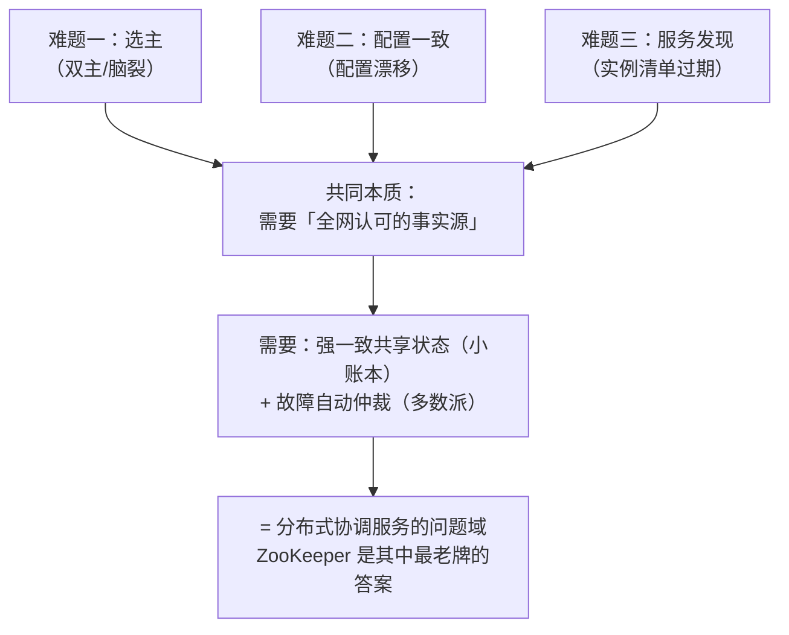

# 第 1 课 · 为什么需要 ZooKeeper：双主故障之夜

> 阶段 1 · 问题与定位 · 知识点：双主与脑裂的本质 / 三道协调难题 / 为什么 MySQL+Redis 凑不齐
>
> 🧭 课程导航：[课程目录](../../../02-课程目录.md) · 上一课：无 · 下一课：L2《ZooKeeper 是什么：定位与能力地图》

## 第一幕 · 场景引入：大促夜的双主故障

你是某电商公司的后端工程师。订单服务是公司的命脉，为了高可用做了主备部署：主机对外服务，备机随时待命。中间靠一套"心跳检测"维持秩序——备机每 2 秒向主机发一次心跳，连续几次收不到回应，就判定主机"死了"，把自己提升为主机。

大促之夜，流量暴涨，机房网络抖了一下：主机有一阵子没回应心跳，但对外服务其实还正常。

备机等不到心跳，判定主机已死，升主，开始接收写入。半分钟后网络恢复，原主机一看：我还活着啊，我才是主！它继续接收写入。

于是两个"主"同时在收订单、扣库存。等值班同学发现时，两边的数据已经各写各的，库存账对不上，只能连夜停服务人工对账。

这类故障有正式的名字：

- **双主（dual leader）**：集群中同时存在两个都被当作主节点的实例
- **脑裂（split-brain）**：网络分区后，一个集群裂成两个"都认为自己是老大"的小团伙，各自为政，数据分道扬镳

> 💡 决策视角：如果你的团队正在考虑引入 ZooKeeper 这类组件，起因多半就是被类似问题逼的——不是想要新玩具，是被"没有仲裁者"的架构坑过。

## 第二幕 · 认知冲突：我们不是有 MySQL 和 Redis 吗？

复盘会上有人提出：这不难啊，在 MySQL 或 Redis 里放一把"谁是主"的锁，谁抢到谁当家，不就完了？

看起来完美。但当晚的问题恰恰出在：**每一个"看起来能行"的方案，都在故障场景下藏着新的双主窗口。**

**冲突一：仲裁者自己也可能"分家"。**

先说 Redis（哨兵、集群模式暂时放一边）：单点的 Redis 一旦和某台机器之间的网络断了——主机视角"锁服务联系不上"，备机视角"锁我拿到了"。两台机器对"谁持锁"的认知不一致。你没有消灭脑裂，只是把脑裂的可能性从订单服务搬到了 Redis。

那给 Redis 上主从 + 自动故障转移呢？切换的那一瞬间（旧主还活着、新主已上位），同样存在锁状态丢失的窗口——这本身就是一次小规模脑裂。MySQL 同理：主库挂了要切从库，"由谁拍板切换、切完怎么保证旧主立刻停止写入"，还是需要一个所有参与者都认账的仲裁者。

**冲突二：检测"它活着"和判定"它是主"是两回事。**

"我 ping 得通它" ≠ "全网都同意它还是主"。每台机器只能看到自己视角的网络：主机没觉得自己挂了，备机认定主机挂了，两边都没撒谎，但合在一起就是错的。

打破僵局需要一条所有人先接受的规则——**多数派（majority / quorum）**：只有超过半数的成员认可的"事实"才算数。数学上它有个妙处：任何两个"过半集合"必然有交集，所以同一时刻不可能诞生两个互相矛盾、却都"过半"的决议——双主在规则层面被排除了。

**冲突三：同样的坑不止在选举。**

- 40 个服务节点各自读本地配置文件。改一次配置要发布 40 台机器，总有一台漏发——三周后某个诡异 bug 的根因，就是那次"漏发"。
- 订单服务调库存服务，地址硬编码在配置里。库存服务扩容换机器，所有调用方都要改配置重启。

三个问题表面不同，本质相同：**分布式系统里，各节点需要一个"大家共同认可的第三方事实源"**——谁是当选者、哪份配置是真的、哪些实例活着。

## 第三幕 · 层层揭示：三道难题，一个本质

把当晚事故和日常痛点抽象一下，就是"分布式协调"的三道经典难题。

**难题一：选主（Leader 选举）。**
主备/主从架构里，任何时刻必须恰好有一个主。难点不在"选出"，而在故障后的重新选举要做到：全网认可新主，且旧主恢复后不会"复活"成第二主。当晚的心跳方案恰恰栽在第二点上。

**难题二：元数据/配置一致性。**
几十上百个节点共享同一份配置，任何时刻读取都应得到一致的内容；变更要么全网可见同一版本，要么维持旧版，不允许出现"一半新一半旧"。

**难题三：组成员/服务发现。**
谁在线、谁下线，要实时且全网一致。扩容、缩容、宕机、重启，实例列表自动更新，调用方无需改配置。

**一个本质**：三道题都需要两样东西——

1. **强一致的共享状态**：一个小而极其可靠的"共识账本"
2. **故障时的自动仲裁**：机器挂了、网络断了，规则自动生效，不依赖人工拍板

注意一个反差：业务数据库存的是业务数据（TB 级、高频读写），而这里需要的是 KB~MB 级的小账本，一致性要求却极端苛刻。这正是"协调服务（coordination service）"作为一个独立品类存在的原因。

> 🎯 决策视角小结：评估 ZooKeeper 的第一个正确问题不是"它有什么功能"，而是"我的系统里有没有'需要全网认可的事实'"。有，才进入下一问：自己拼装（MySQL/Redis）还是引入专门的协调服务。本课的答案已经很明显：自己拼装 = 把脑裂搬家，不是消灭脑裂。

## 第四幕 · 实操验证：亲手拆一次 Redis 锁的翻车现场

决策参考导向，本课的"实操"是一个 3 分钟思想实验：亲手推演一遍"用 Redis 锁做主备仲裁"是怎么翻车的。

```text
T0  客户端 A 执行：
    SET lock:leader A NX PX 30000
    （NX：键不存在才设置；PX 30000：30 秒后自动过期，单位毫秒）
    → 成功，A 认为自己持锁、自己是主

T1  A 进程发生 35 秒的长时间 GC 停顿
    （或 A 所在网络被分区 35 秒——效果相同）

T2  30 秒到，锁自动过期消失

T3  客户端 B 执行：
    SET lock:leader B NX PX 30000
    → 成功，B 也认为自己持锁、自己是主

T4  A 从停顿中醒来，对"锁已过期"一无所知，继续以主自居
    → A、B 同时为主，双主达成
```

三次翻车点，对应三类真实事故模式：

1. **锁过期与持锁者存活的错位**：锁的"死期"是定死的 30 秒，持锁进程的"死活"却是未知的
2. **持锁者无法感知自己丢锁**：没有任何机制会在 T2 时刻通知 A"你已经被废了"
3. **缺乏版本仲裁**：即使 A 事后知道自己丢锁，它在停顿期间以主身份发出的写入已经发生，无法追溯作废（专业解法叫 fencing token / 版本号仲裁，后续课程会回到这一点）

留下三个自检问题，可以直接贴在你们团队的工位上：

- 我们现有的锁，在持锁进程假死 30 秒后还安全吗？
- 两台机器各自"抢到锁"时，系统里存在一个能一票否决的角色吗？
- 旧主恢复上线的那一刻，谁负责、以什么机制告诉它"你已经是备机了"？

三问但凡有一问答不上来，你的系统就欠着一笔"协调债"——这正是协调服务要还的。

## 第五幕 · 体系收束：问题域地图

一图收束本课：



本课带走三句话：

1. 心跳检测 + 自动升主，必然留下双主窗口——问题不在实现细节，在缺少仲裁规则
2. 多数派是所有共识系统的底层心法：两个过半集合必有交集，双主在数学上被排除
3. MySQL/Redis 能提供"锁"的形，提供不了"仲裁"的魂——故障场景下，没有仲裁的锁会准时背叛你

下一课预告：ZooKeeper 到底是什么——一句话定位、能力地图，以及它"小而 CP"的设计哲学如何恰好命中今天这三道难题。

### 📇 术语速查卡

| 术语 | 一句话解释 |
|------|-----------|
| 主备（active-standby） | 一台干活（主），一台待命（备）；主挂了备顶上 |
| 心跳（heartbeat） | 周期性的"我还活着"信号；收不到不代表对方死了，可能只是网络抖了 |
| 双主（dual leader） | 同时存在两个主节点，各自接受写入 |
| 脑裂（split-brain） | 网络分区导致一个集群裂成多个各自为政的"小集群" |
| 多数派（quorum） | 超过半数成员达成的决议；两个过半集合必有交集，故决议唯一 |
| 协调服务（coordination service） | 专门提供"全网认可的事实源"的独立服务品类，ZooKeeper / etcd / Consul 都属此类 |

### ✏️ 课后思考题（可选）

1. 用自己的话解释：为什么"备机 ping 不通主机就升主"的方案，双主窗口不可避免？
2. 列出你们系统里 3 个"需要全网认可的事实"（提示：谁是主、哪份配置、谁在线，或者别的）。
3. 思想实验进阶：给第四幕的 Redis 锁加上"锁 value 存机器 ID、用前先 GET 校验"，能堵住哪一次翻车？哪一次依然堵不住？
