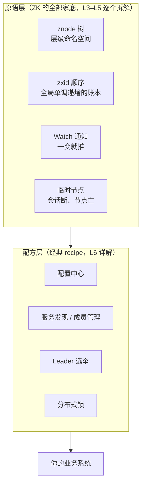
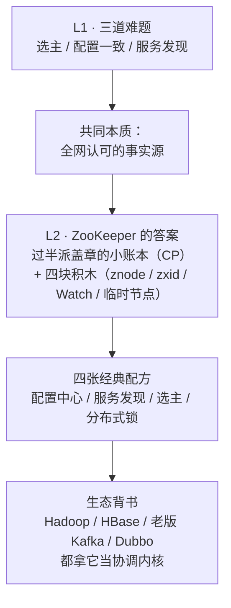

# 第 2 课 · ZooKeeper 是什么：定位与能力地图

> 阶段 1 · 问题与定位 · 知识点：一句话定位与能力地图 / 起源与生态位 / 小而 CP 的设计哲学
>
> 🧭 课程导航：[课程目录](../../../02-课程目录.md) · 上一课：[L1 为什么需要 ZooKeeper：双主故障之夜](lesson-01-为什么需要ZooKeeper.md) · 下一课：L3《数据模型：ZNode 树与四种节点》

## 第一幕 · 场景引入：官网上那句"没人听得懂"的话

大促夜事故复盘之后，"引入 ZooKeeper"正式提上议程。这周的架构评审会，你要先做一段 5 分钟的引入介绍：这到底是个什么东西。你打开官方文档，它对自己的定义是这么一句：

> ZooKeeper is a centralized service for maintaining configuration information, naming, providing distributed synchronization, and providing group services.

翻译过来："一个集中式服务，用于维护配置信息、命名、提供分布式同步与组服务。"

每个词都认识，连起来像没说。更糟的是会议室里三位同学各说了一句：

- "我看了文档，它数据结构是棵树，不就是个文件系统吗？"
- "能存数据就是数据库吧，一个小号的？"
- "老版 Kafka 和 HBase 都用它，那它算存储还是中间件？"

你发现一个残酷的事实：**"它是什么"说不清，"我们该不该用它"就没法谈**——因为你连它跟现有组件（MySQL、Redis、文件系统）是不是同一类竞争者都判断不了。

本课只有一个目标：读完之后，你能用一句话向 Leader 讲清它是什么，并且不会被上面三个问题带偏。

## 第二幕 · 认知冲突：三次归类，三次失败

ZooKeeper 之所以难讲，是因为人们习惯把它塞进熟悉的抽屉。可惜三个抽屉全塞错了。

**抽屉一："它是个数据库。"**

它确实能读写数据，但看三个硬约束：

1. 单个 znode（它存数据的最小单位，可理解为一条"带路径的记录"）默认最大 **1048575 字节，即不到 1MB**（参数 `jute.maxbuffer` 控制）
2. 官方管理员文档写得直白："**ZooKeeper is designed to store data on the order of kilobytes**"——它就是按 KB 级数据设计的，且生产环境不建议调大上限
3. 每次写都要过集群**过半机器**确认；读则不必（任意一台可直接应答），所以读快写慢——官网称其可承担每秒上万级请求，短板在写吞吐

把每天 500GB 的订单明细塞进去，它当晚就趴下。它存的不是"数据"，是"事实"：不存订单本身，存"谁是主、哪份配置是真的、哪些实例活着"。打个比方：业务数据库是"户口档案"，ZooKeeper 是门口那块"今日值班表"——小，但所有人必须认同一份。

**抽屉二："它的数据结构是树，是个文件系统。"**

形确实像：从根 `/` 开始，`/services/order/instances/node-1` 这样的路径层层寻址。但它只借了文件系统的"形"（层级命名便于组织和分区），没借"魂"：

- 整棵数据树常驻内存（靠事务日志 + 快照落盘保证不丢）
- 每次写都被盖一个全局单调递增的编号 **zxid**，所有机器按同一顺序应用变更
- 客户端读任何节点时可以顺手挂一个 **Watch**，节点一变就收到通知

所以它是"**文件系统模样的协调账本**"：路径只是地址，重点在顺序、一致性和变更通知。拿它当盘存文件用，是拿账本当仓库。

**抽屉三："它强一致，那把业务数据都放进去，全局不就一致了？"**

这是最有诱惑力的误解。先补 30 秒 CAP 常识：

> **CAP 三十秒**：分布式系统里，C（一致性，所有人看到同一份事实）、A（可用性，每个请求都有响应）、P（分区容忍，网络断了系统还得活）。P 没得选——网络一定会断——所以分区发生时只能在 C 和 A 里挑一个。

ZooKeeper 挑了 **C（CP 系统）**：网络把集群分成两半时，**少数派那一侧的写请求直接被拒绝**——宁可暂时不可写，也不让两边各自接受写入、闹出双主。这正是上一课说的"多数派仲裁"在 CAP 里的正式说法。

对照着看：主从 + 自动故障转移的 Redis 在分区时偏向 A——先各自响应、恢复后再对齐。你在 L1 第四幕推演的"锁状态丢失窗口"，根子就在这里：**不是实现不够好，是它在 CAP 里的站位和协调场景要的不一样**。

三个抽屉都失败，因为它根本不属于任何旧抽屉——它是一个新品类：**协调服务（coordination service）**。L1 已经论证过这个品类的问题域（提供全网认可的事实源），ZooKeeper 是这个品类里最老牌、被实战检验最充分的定义者（后来的同门还有 etcd、Consul，L9 再对比）。

## 第三幕 · 层层揭示：定位、能力地图、生态位

**一句话定位（把官网那句翻译成人话）：**

> ZooKeeper 是一个协调服务：用一本多机复制、过半派盖章的"小账本"，为分布式系统提供**全网一致认可的一组事实**——哪份配置是真的、哪个实例活着、谁当选主、锁在谁手上。

验证一下：官网那四个短语，恰好是上一课三道难题的官方翻译。

| 官方短语 | 含义 | 对应 L1 的难题 |
|---------|------|----------------|
| configuration information | 配置管理 | 难题二：配置一致性 |
| naming | 命名服务 | 难题三：服务发现 |
| distributed synchronization | 分布式同步（锁、屏障） | 难题一：选主（+ 锁） |
| group services | 组成员管理 | 难题三：服务发现 |

（三难题对四能力：naming 回答"X 在哪里"，group services 回答"谁在场"，两者合起来就是完整的服务发现。）

**能力地图：一层原语，一层配方。**



这张图藏着一个重要的决策洞察：**ZooKeeper 不直接卖"锁"、不直接卖"配置中心"，它只卖四块积木，配方自己搭。**这解释了两件事：

- 为什么围绕它长出了 Apache Curator 这样的客户端框架——把选举、锁等经典配方封装好，免得人人手搓
- 为什么"积木是对的、配方搭错了"也能出生产事故——这是 L8《经典的坑》的伏笔

**起源与生态位：为"看动物园"而生。**

- 2006 年前后立项于 Yahoo 研究院（核心作者 Flavio Junqueira、Benjamin Reed），起因是 Yahoo 内部多个分布式系统各自都在重复造"协调轮子"；设计思想上深受 Google 内部 Chubby 锁服务的启发
- 2008 年捐给 Apache，作为 Hadoop 子项目开源；**2010 年 11 月**经 ASF 董事会决议成为顶级项目
- 名字由来（作者自述）：当时 Yahoo 内部项目几乎全用动物命名（Pig、Hive……），有经理开玩笑"再这样我们要成动物园了"。大家一拍即合：分布式系统本身就是个动物园（混乱难管）——那就叫 ZooKeeper，看动物园的人。官网老标语呼应至今："Coordinating distributed systems is a Zoo"
- 生态位：它不跟 MySQL/Redis 抢"存数据的位"，站的是分布式技术栈里"**协调内核**"的位——官网原话："a proven coordination kernel trusted by Kafka, Hadoop, HBase, and many other distributed systems"（被 Kafka、Hadoop、HBase 等众多分布式系统信赖的协调内核）

学过 kafka 的你对最后一条应该有体感：老版 Kafka 的 broker 注册、controller 选举全在 ZK 上——那就是"协调内核"在打工。KRaft 时代 Kafka 自研了 Raft 模块，等于把内核职能"内化自建"了，但"协调内核"这个岗位本身没有消失（L10 专门展开）。

**小而 CP 的设计哲学。**

四个字，两个决定，全是刻意为之：

- **CP（选一致，舍可用）**：分区时少数派拒写。听起来是缺点，但对协调场景，"暂时不可写"的代价远小于"双主各写各"。账本里记的是"谁是主、谁持锁"，写失败重试就行；双主了整个业务集群遭殃。这是 L1 双主之债的正式偿还方案
- **小（选小，不贪大）**：单节点默认不到 1MB、官方建议 KB 级、数据常驻内存。小有三个好处：共识快（要同步的日志短）、恢复快（快照小）、内存扛得住。官方文档甚至警告：调大上限会让 leader 与 follower 的同步时间不可预测、动摇 quorum 稳定性

一句话收束这组反差：**业务数据库给"数据"找家（TB 级、可用性优先）；ZooKeeper 给"事实"找家（KB 级、一致性优先）。**

> 🎯 决策视角小结：判断 ZK 适不适合你的第一道筛子，不是"它有什么功能"，而是"你要存进去的是不是小、少、要命的事实"。业务数据、大对象、高频写入 → 一票否决；元数据、低频变更、全网必须一致 → 正中靶心。

## 第四幕 · 实操验证：3 分钟分拣演练

决策参考导向，本课的"实操"是一道分拣题。下面 9 样东西都可能被你想"放进 ZooKeeper"，先自己判一遍：哪些进，哪些不进？

1. "订单服务当前的主"的标记
2. 订单明细数据（每天新增 500GB）
3. 数据库连接串等共享配置（几 KB）
4. 用户购物车内容
5. 库存服务的存活实例列表
6. 某商品库存余量（每秒上万次扣减）
7. 任务调度集群的"当前 master"标记（一把锁）
8. 一张 5MB 的图片二进制
9. 每日对账任务的进度状态（待跑/进行中/完成）

<details><summary>参考答案（先自己分完再看）</summary>

**能进：1、3、5、7、9**——全是"事实"：谁是主（1、7）、配置是什么（3）、谁在线（5）、任务到哪步了（9）。它们量级 KB、变更低频，但必须全网一致。注意 9：进度状态若由多节点调度器共享读写，就是典型的协调元数据。

**不能进：2、4、6、8**——全是"数据"：业务数据（2、4），高频写（6：每次扣库存都要过半确认，集群先被拖垮），大对象（8：超过 1MB 上限，官方明确不建议调大；这是对象存储的活）。

</details>

判定口诀：**小（KB 级）、少（低频写）、要命（一致性要命）**——三条全中才进；缺一条，先想想别的家。

分拣的过程你会摸到一个手感：能进 ZK 的，回答的都是"谁 / 哪份 / 在不在"这类协调问题；不能进的，本身就是业务。**ZooKeeper 管的是分布式世界的"问答题答案看板"，不管业务本身。**

## 第五幕 · 体系收束：从问题域到能力地图



本课带走三句话：

1. ZooKeeper 不是数据库也不是文件系统，是"文件系统模样的协调账本"——存事实，不存业务数据
2. 官网四个短语（配置 / 命名 / 同步 / 组服务）就是 L1 三道难题的官方翻译；这个品类就是为那三道题而生的
3. "小而 CP"是刻意设计：小，共识才快；CP，分区时少数派拒写，双主在规则层被堵死——代价是分区期间少数派一侧暂时不可写，这笔账要在选型时认下

下一课预告：打开这本账本看内部——ZNode 树的路径规则、四种节点类型（持久 / 临时 / 顺序），以及 zxid 和版本号如何给每次变更"盖章编号"。

### 📇 术语速查卡

| 术语 | 一句话解释 |
|------|-----------|
| znode | ZooKeeper 账本里的一个节点，既有地址（路径）也有内容（数据），形似文件 |
| zxid | 每次写操作的全局单调递增编号，一切顺序保证的根基 |
| Watch | 客户端在节点上挂的"一次性通知"，节点一变就回调（L5 详讲演进） |
| 临时节点（ephemeral node） | 生命周期与客户端会话绑定的节点，会话断开自动删除（L5 详讲） |
| CAP 定理 | 一致性 / 可用性 / 分区容忍的三角取舍；分区时 C 与 A 只能二选一 |
| CP | 分区时保一致性、舍可用性的选择，ZooKeeper 的站位 |
| 原语（primitive） | 服务提供的最基础积木，复杂用法（配方）由原语组合而成 |
| 协调内核（coordination kernel） | 分布式技术栈中"协调岗位"的称谓，ZooKeeper 官网对自身的定位词 |

### ✏️ 课后思考题（可选）

1. 不看讲义，用一句话向 Leader（或完全没接触过分布式的同事）解释 ZooKeeper 是什么，再对照第三幕的定位自查。
2. "naming" 和 "group services" 都翻译成服务发现，它们分别回答什么问题？（提示：一个答"X 在哪"，一个答"谁在场"）
3. 你们团队现在是否有"存在 MySQL/Redis 里的全网关键事实"（配置表、锁表、状态表）？用"小、少、要命"口诀评估一遍，哪些适合搬去协调服务？

## 🚀 下一批接力提示词

> 学完本课后，**复制下面这段文字发给 AI**，即可无缝进入下一课（无需重新描述上下文）：

```
继续学 ZooKeeper。我的学习档案在 zookeeper/00-学习档案.md，
刚学完阶段 1《问题与定位》的课《ZooKeeper 是什么：定位与能力地图》知识点 一句话定位与能力地图、起源与生态位、小而 CP 的设计哲学，
请按大纲继续讲解下一课（课3：数据模型：ZNode 树与四种节点）。
```

## 🧭 课程导航

➡️ **下一课**：[L3 数据模型：ZNode 树与四种节点](../../2-核心机制/lessons/lesson-03-数据模型ZNode树与四种节点.md)

📚 **返回目录**：[课程目录](../../../02-课程目录.md)
