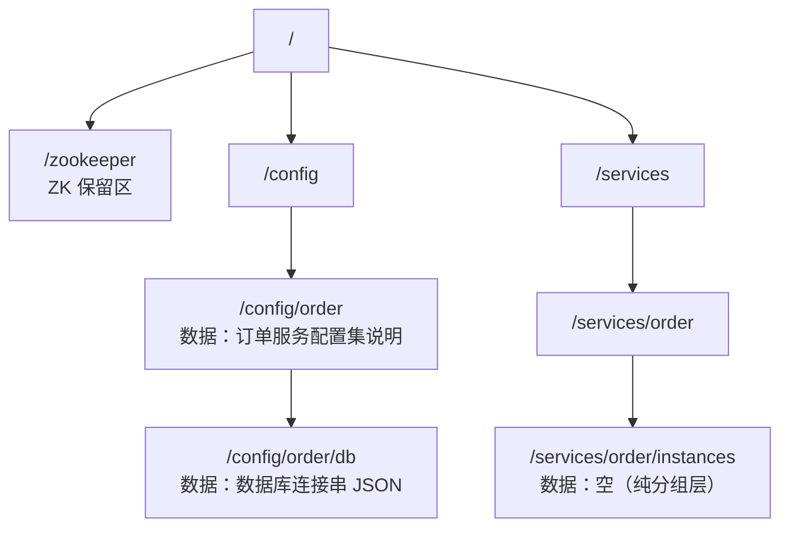
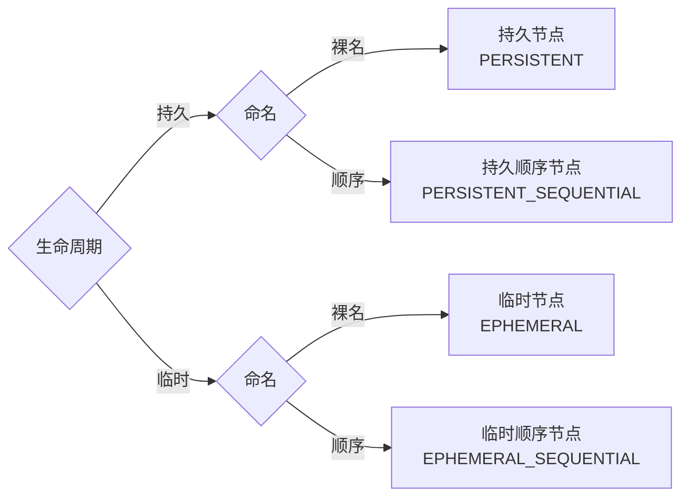
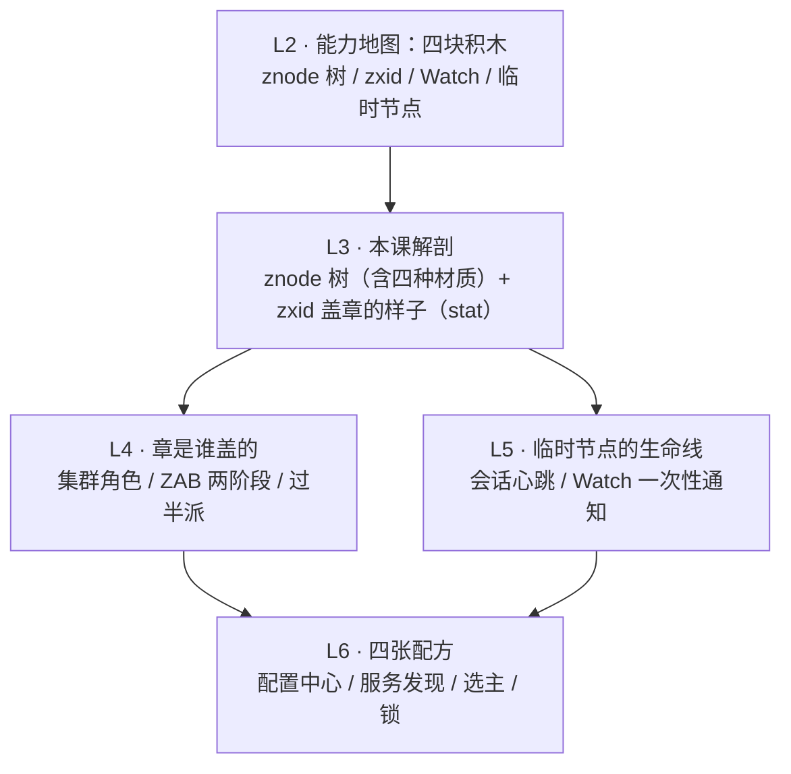

# 第 3 课 · 数据模型：ZNode 树与四种节点

> 阶段 2 · 核心机制 · 知识点：ZNode 树与路径 / 四种节点类型 / zxid 与版本控制
>
> 🧭 课程导航：[课程目录](../../../02-课程目录.md) · 上一课：[L2 ZooKeeper 是什么：定位与能力地图](../../1-问题与定位/lessons/lesson-02-ZooKeeper是什么.md) · 下一课：L4《集群与 ZAB：过半派的生存智慧》

## 第一幕 · 场景引入：命名空间设计图上的第一笔

架构评审会上你把"它是什么"讲清楚了，试点立项：先把"选主"和"配置"两个场景迁上去。你领到第一项任务——画出 ZK 的**命名空间设计图**：哪些事实放进这本账本、挂在哪层、用什么节点表示。

你心想：不就是画目录树吗？文件系统的直觉还在。结果第一笔就卡住了，接着是第二笔、第三笔：

1. 画到 `/services/order` 这一层的说明信息时你犯了难：这层到底算"文件夹"（只挂子节点）还是"文件"（自己带数据）？
2. 同事甩来一段线上 `stat` 命令的输出——`cZxid`、`mZxid`、`pZxid`、`cversion`、`dataVersion`……十来行字段像天书，让你帮忙看看"这个节点最近发生过什么"
3. 文档里创建节点有 `create`、`create -e`、`create -s`，组合出好几种节点类型——配置该用哪种？在线实例列表该用哪种？

本课目标只有两个：**画得出**（为任意协调需求选出正确的节点类型和层级）、**读得懂**（把一段 stat 输出读成这个节点的"人生履历"）。

## 第二幕 · 认知冲突：文件系统直觉的三连败

**败局一："文件还是文件夹？"——都是，也都不必是。**

文件系统的世界里，一个路径要么是目录（挂孩子）要么是文件（存数据），二选一。znode 不是：**每个 znode 可以同时拥有数据、子节点列表和一份状态记录（stat）**。`/services/order` 既是"文件"（存一行说明：这是订单服务的根），又是"文件夹"（往下挂 `instances`、`election`）。设计命名空间时你不需要纠结"这层是目录还是文件"——层级负责表达"谁属于谁"，数据负责携带说明，各干各的。

顺带一个细节：znode 的数据是**整存整取**的——读就把全部字节读出来，写就把全部字节替换掉，没有"追加一行"或"改半个字段"。这符合它"账本条目"的人设：条目小而完整（上限 1MB、建议 KB 级，L2 已算过账）。

**败局二：想给临时节点挂孩子——被规则一口回绝。**

你给"当前主节点"设计了 `/services/order/master`，用**临时节点**：主节点一挂、会话一断、标记自动消失——这是 L1 双主之夜的教训，记法很对。接着你想在它下面挂 `/metrics`、`/status` 子节点放点元数据——文档一句话拦住你：**临时节点不能有子节点**。

为什么这么"不讲理"？推演一下就明白：临时节点的生死绑定在创建者的会话上（L5 细讲会话）。如果允许它有孩子——孩子是持久的，父节点随会话消失后，孩子成了"断链的孤儿"，挂在一条不存在的路径下；孩子也是临时的，父死子亡，级联删除的语义又会搅出一堆边角问题。ZK 的选择是**一刀切禁止**：临时节点只能做叶子。这是典型的"设计做减法"——牺牲一点灵活，消灭一整类歧义。反过来看，临时节点的本体就是"某个会话活着"这个事实，一个光秃秃的叶子恰好是它最诚实的形状。

**败局三：节点的名字，不完全由你做主。**

给锁竞争者起名 `/lock/candidate-A` 方便认领？带上顺序标志创建出来的却是 `/lock/candidate-A0000000001`。你给的名字只是**前缀**，后缀是 ZK 自动追加的计数器：**十位数字、左边补零**（格式 `%010d`，定宽是为了按名字排序就等于按先后排序），计数器由**父节点**维护，只增不减——即使节点被删，编号也不回收复用。

看起来是干扰，实际是馈赠：两个客户端并发创建绝不重名，而且名字自带全局排队顺序——这正是 L6 公平锁和选主的标准积木。

三次失败指向同一个结论：这不是文件系统，账本有账本的规矩。规矩就三条：条目长什么样（树与路径）、条目有哪几种材质（节点类型）、每笔账怎么编号（zxid 与版本）。第三幕逐条拆开。

## 第三幕 · 层层揭示：一棵树、四种材质、一行账本

### 3.1 一棵树：znode 树与路径

**结构**：整棵数据树常驻内存（持久化靠事务日志 + 快照，L7 讲），每个 znode 是四件套——**路径（地址）+ 数据（整存整取）+ 子节点名单 + stat（账本行，3.3 详拆）**。同一层的孩子名字必须唯一，全树没有重名路径。

**路径规则**：一律从根 `/` 写起的绝对路径，没有"当前目录"、没有相对路径写法；节点名里不能出现 `/`，也不允许 `.` 和 `..` 这种跳层写法。根下有一个 ZK 自己的保留节点 `/zookeeper`（存配额等系统信息），`ls /` 时总能看到它——L2 官网 CLI 演示里 `[myapp, zookeeper]` 的那个 `zookeeper` 就是它。



为什么用树而不是一张 KV 表？层级天然表达**归属关系**（谁属于谁一目了然），还便于按子树做权限隔离和 Watch 分区——同一棵树上，订单服务、库存服务各占一个分支，互不干扰。

### 3.2 四种材质：节点类型的 2×2 矩阵

节点类型只有两个维度：**生命周期**（持久 or 临时）× **命名方式**（裸名 or 顺序），组合出四种基本类型：



| 类型 | 一句话人设 | 生死规则 | 典型用途 | zkCli 创建 |
|------|-----------|----------|----------|-----------|
| 持久节点 | 档案柜：放进去就在 | 显式删除才消失，与会话无关 | 配置、任务定义 | `create /config/order/db "{...}"` |
| 临时节点 | 在场灯：人走灯灭 | 创建会话结束后自动删除；**不能有子节点** | 在线标记、锁持有者 | `create -e /svc/inst-1 "ip:port"` |
| 持久顺序节点 | 号码机：发的号留底 | 持久 + 名字自动追加十位编号 | 任务队列、分布式序号 | `create -s /tasks/task- ""` |
| 临时顺序节点 | 排队叫号：人在号在 | 临时 + 十位编号，编号不复用 | 选主、公平锁 | `create -e -s /lock/candidate- ""` |

> ⚠️ 一个容易种下的错误心智模型："会话结束"不等于"断连即删"。客户端短暂断连，临时节点不会立刻消失——要等会话在超时后真正结束才删（超时窗口多大、怎么配，L5 专题讲）。

（编号细节：计数器由父节点维护，`%010d` 十位补零；它是带符号 32 位整数，理论上溢出后会变成负数——官方文档自己标注的冷知识，工程上几乎碰不到，知道即可。）

选类型的思路只有一句话：**类型即语义**。持久 = 永久事实（配置是"哪份是真的"），临时 = 在线事实（"谁在场"），顺序 = 排队事实（"谁先谁后"）。反过来，**用持久节点存在线状态，就是把"会话事实"错存成"永久事实"——挂了不会自动消失，等于把 L1 那套心跳方案原样搬进了账本**。

**扩展材质（3.5.3+，认识即可）**：还有两种后来补的类型——**容器节点**（`create -c`，为锁/选举的父目录而生：最后一个孩子被删后，它成为服务端待清理的候选，官方文档还提醒你创建子节点时要备好 NoNodeException 重试）、**TTL 节点**（`create -t <毫秒>`，带过期时间，默认关闭，需在服务端开启 `extendedTypesEnabled=true`，且只作用于持久类节点）。决策视角：这两个都是"配方层需求倒逼出的补丁"，主流用法仍以四种基本类型为主，L6 讲配方时再认领它们。

### 3.3 一行账本：zxid 与版本控制

L2 说过"每次写都盖一个章"。现在把章拆开看，再看章印在哪儿。

**zxid 的解剖**：每次写操作（创建、删除、改数据）都会得到一个全局唯一、单调递增的事务编号 zxid。它是 **64 位**数：**高 32 位是 epoch（朝代号，每次换 Leader 才 +1）**，**低 32 位是 counter（本朝第几笔，每笔 +1）**。比较 zxid 的大小就是比较"谁先谁后"——zxid 小的先发生。比如 `0x100000002` 读作（epoch=1，counter=2）：第一个 Leader 任期的第 2 笔事务。为什么换 Leader 要换朝代？这是防旧 Leader 复活闹双主的关键机关，L4 展开。

**章印在 stat 里**。每个 znode 自带一行"账本履历"，11 个字段：

| 字段 | 读法（人话） |
|------|--------------|
| `czxid` | 出生那一笔：创建本节点的事务号 |
| `mzxid` | 最近一次改**数据**的那一笔 |
| `pzxid` | 最近一次**子节点名单变动**（直接孩子增删）的那一笔 |
| `ctime` / `mtime` | 创建 / 最后修改数据的时间戳（毫秒） |
| `version` | 数据被改过几次（创建时为 0） |
| `cversion` | 子节点名单变动过几次 |
| `aversion` | ACL 权限被改过几次 |
| `ephemeralOwner` | 临时节点＝创建者会话 ID；持久节点恒为 0。**看一眼这个字段就知道节点类型** |
| `dataLength` | 数据字节数 |
| `numChildren` | 当前孩子数量 |

三个 zxid 字段的分工值得多看一眼——`czxid` 是出生证明，`mzxid` 记"我自己的数据"最后一次变更，`pzxid` 记"我的孩子名单"最后一次变更。

**pzxid 的经典误读（重点）**：它只看**直接**孩子的增删。孙辈的任何变更、孩子改自己的数据，都不动它。推演：`/services` 挂着 `/services/order`，`/services/order` 挂着 `/services/order/master`。创建 master 这一笔，只会更新 `/services/order` 的 pzxid；`/services` 的 pzxid 纹丝不动（它只认自己这一层的名单变动）。判案时用错这一条，时间线就会推错。

**版本三兄弟与 CAS**：`version` / `cversion` / `aversion` 各记各的修改次数。其中 `version` 是给客户端当**乐观锁**用的武器——这就是 L1 难题二"配置并发更新"在数据模型层的解法：

```text
1. getData("/config/order/db")     → 拿到数据 + stat.version == 4
2. setData("/config/order/db", 新数据, 4)   ← 带着"我看到的版本号"提交
3. 若期间别人已经改过 → 服务器上 version 已不是 4
   → 抛 KeeperException.BadVersion → 重读、重试
   （传 -1 表示放弃检查直接覆盖——除非明确不在乎丢更新，别用）
```

这套"读时拿版本、写时验版本、失败重试"的流程，就是大家熟悉的 CAS（比较并交换）在账本上的形态：谁都没看到对方的更新时，后写的一方会被版本号拦下来，**更新不会静默丢失**。

最后串起来看一段真实的 zkCli `stat` 输出（本课第四幕判案就用它）：

```text
[zk: localhost:2181(CONNECTED) 12] stat /config/order/db
cZxid = 0x100000002
ctime = Thu Aug 28 10:15:33 CST 2026
mZxid = 0x100000006
mtime = Thu Aug 28 11:02:47 CST 2026
pZxid = 0x100000005
cversion = 3
dataVersion = 4
aclVersion = 0
ephemeralOwner = 0x0
dataLength = 128
numChildren = 3
```

> 🎯 决策视角小结：命名空间设计 = **结构 × 材质**。结构（分层）表达"谁属于谁"；材质（节点类型）表达"事实的时效性"——永久事实用持久、在线事实用临时、排队事实用顺序。类型选错就是语义错位，而且错得很隐蔽：账本照样工作，只是该消失的不消失、该排队的没排队，故障在某次重启或某次并发时才爆发。

## 第四幕 · 实操演练：画一棵树，读一行账本

决策参考导向，本课的实操是两道纸面题。

**演练 A：给协调需求选材质。**三道老难题迁进 ZK，每个条目该用什么节点类型？先自己判，再看答案。

1. 配置：`/config/order/db`，存数据库连接串
2. 在线实例：`/services/order/instances/` 下的每个实例条目
3. 选主：`/services/order/election/` 下的竞选条目

<details><summary>参考答案（先自己分完再看）</summary>

1. **持久节点**：配置是"哪份是真的"这个永久事实，不随任何会话生死。
2. **临时节点**：在线是"谁在场"的会话事实——实例启动即建、宕机后会话超时结束、条目自动消失，不需要任何人来"注销"。追问：为什么不学 L1 的老方案、用一个持久节点存整张 JSON 实例列表？——单点更新必成瓶颈、实例宕机没人删就变脏数据、每次变更全量重写。临时节点让"在线"这个事实自动成立、自动失效，这就是类型即语义。
3. **临时顺序节点**：既要"挂了自动退位"（临时），又要"排好队、知道谁接棒"（顺序编号）。具体接棒规则是 L6 选主配方的核心剧情。

</details>

**演练 B：判案。**就用第三幕末尾那段 stat 输出，回答五问：

1. 这个节点是临时的还是持久的？
2. 它的数据被改过几次？
3. 它的子节点名单变动过几次？结合 `numChildren=3`，能推断出名单变动的构成吗？
4. 最后一笔发生在它身上的事，是"改数据"还是"动子节点"？
5. `cZxid = 0x100000002` 读作什么？

<details><summary>参考答案（先自己答完再看）</summary>

1. `ephemeralOwner = 0x0` → **持久节点**。
2. `dataVersion = 4` → 改过 **4 次**（创建时为 0，每改一次 +1）。
3. `cversion = 3` → 名单变动 **3 次**；现存 3 个孩子且变动 3 次 → **三次全是新增、从没删过**。
4. `mZxid = 0x100000006` > `pZxid = 0x100000005` → 最后一笔是**改数据**（改数据发生在最后一次动子节点之后）。
5. `0x100000002` → 高 32 位为 1、低 32 位为 2 → **epoch=1、counter=2：第一个 Leader 任期的第 2 笔事务**。

</details>

两道题做下来你应该有手感了：**设计时问"这是什么性质的事实"（选类型），排障时问"账本上发生过什么"（读 stat）**。前者防患，后者破案。

## 第五幕 · 体系收束：积木的解剖图



本课带走三句话：

1. znode 是"既是文件又是文件夹"的账本条目：路径定位、数据整存整取，**类型决定生命周期**
2. 四种基本类型是 2×2 的组合（生命周期 × 命名），**类型即语义**：持久=永久事实、临时=在线事实、顺序=排队事实；临时节点禁做父节点，是刻意的设计减法
3. stat 是节点的账本行：三个 zxid 定位"哪一笔"（出生/改数据/动子名单），三个 version 记"改几回"，`ephemeralOwner` 暴露节点类型；**version 的 CAS 是并发更新防丢的武器**

下一课预告：zxid 这枚章，到底是谁盖的、怎么盖的？为什么"过半派点头"就能让全网账本完全一致、还能在 Leader 崩溃后自动选出新朝代？——L4《集群与 ZAB：过半派的生存智慧》。

### 📇 术语速查卡

| 术语 | 一句话解释 |
|------|-----------|
| znode | 账本条目：路径 + 数据 + 子节点名单 + stat，可同时存数据和挂孩子 |
| 持久节点 | 显式删除才消失的节点，表达"永久事实" |
| 临时节点 | 随创建会话消亡的节点，表达"在线事实"；不能有子节点 |
| 顺序节点 | 名字自动追加十位编号的节点，编号父节点维护、只增不复用 |
| 容器节点 / TTL 节点 | 3.5.3+ 扩展类型：子节点清空后被服务端清理 / 带过期时间（默认关闭） |
| stat | 节点的账本行（11 个字段），记录创建、修改、版本、孩子等信息 |
| czxid / mzxid / pzxid | 出生那笔 / 最近改数据那笔 / 最近动子节点名单那笔的事务号 |
| version / cversion / aversion | 数据 / 子名单 / ACL 各自的修改计数 |
| epoch | zxid 高 32 位的"朝代号"，换一次 Leader 加一 |
| BadVersion | 带版本写入时版本不匹配抛出的异常，CAS 防丢更新的机关 |

### ✏️ 课后思考题（可选）

1. 临时节点禁止有子节点是设计减法。如果业务一定要让"主节点标记"携带元数据（比如当前主的健康分），你会怎么设计？（提示：元数据写进节点自身数据，或平移到兄弟节点）
2. pzxid 推演：`/a` 挂着 `/a/b`，`/a/b` 挂着 `/a/b/c`。创建 `/a/b/c` 之后，`/a` 和 `/a/b` 各自的哪个字段变了、哪个没变？
3. 把第三幕的 CAS 流程扩写成带循环重试的伪代码，并想清楚：重试前除了重读数据，还该重读什么？

## 🚀 下一批接力提示词

> 学完本课后，**复制下面这段文字发给 AI**，即可无缝进入下一课（无需重新描述上下文）：

```
继续学 ZooKeeper。我的学习档案在 zookeeper/00-学习档案.md，
刚学完阶段 2《核心机制》的课《数据模型：ZNode 树与四种节点》知识点 ZNode 树与路径、四种节点类型、zxid 与版本控制，
请按大纲继续讲解下一课（课4：集群与 ZAB：过半派的生存智慧）。
```

## 🧭 课程导航

➡️ **下一课**：[L4 集群与 ZAB：过半派的生存智慧](lesson-04-集群与ZAB过半派的生存智慧.md)

📚 **返回目录**：[课程目录](../../../02-课程目录.md)
