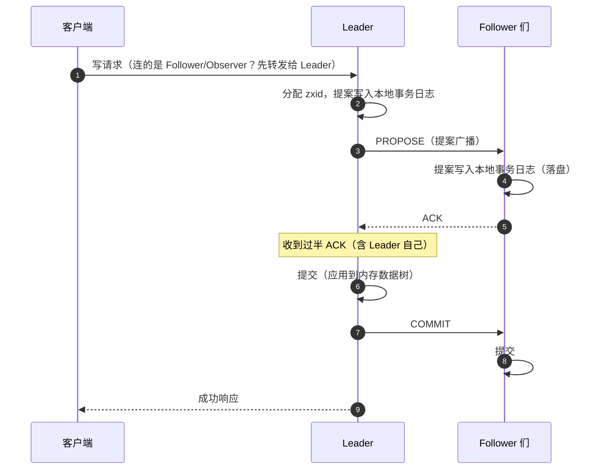
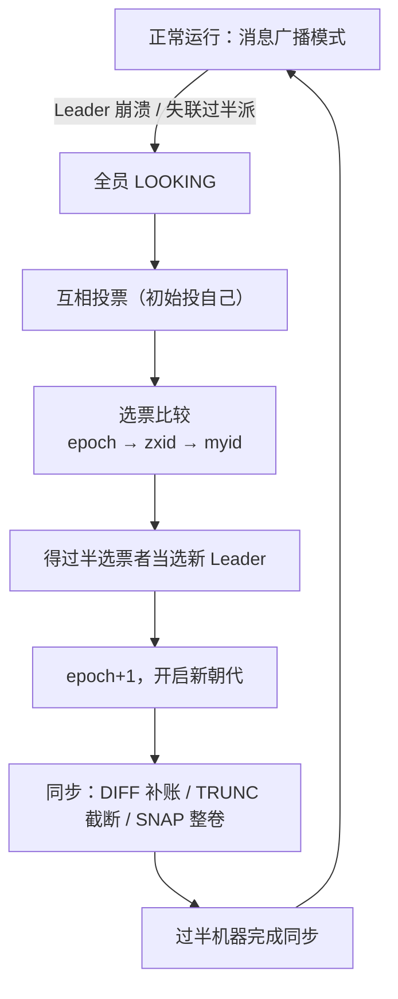
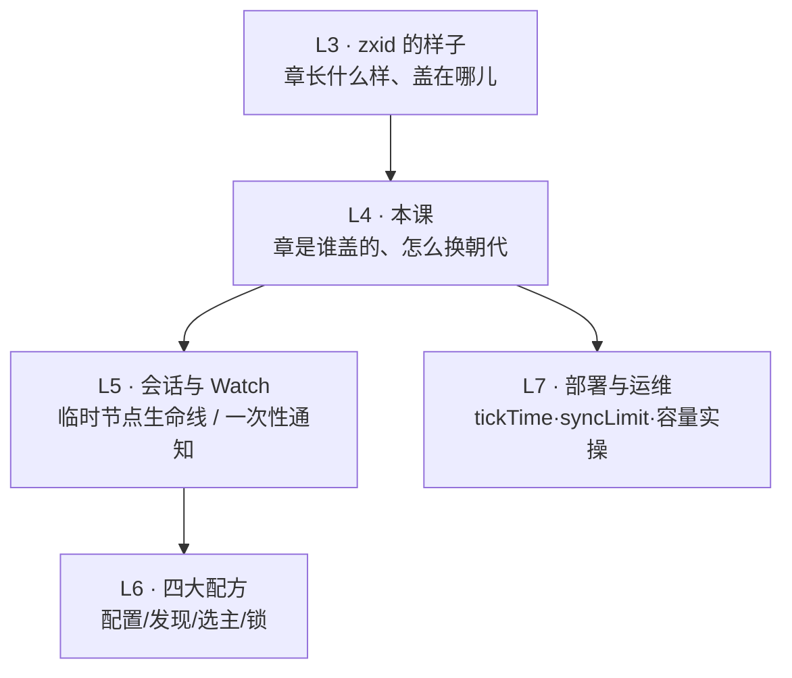

# 第 4 课 · 集群与 ZAB：过半派的生存智慧

> 阶段 2 · 核心机制 · 知识点：服务端角色与过半机制 / ZAB 两阶段流程 / 读写路径与性能特点
>
> 🧭 课程导航：[课程目录](../../../02-课程目录.md) · 上一课：[L3 数据模型：ZNode 树与四种节点](lesson-03-数据模型ZNode树与四种节点.md) · 下一课：L5《会话与 Watch：临时节点和一次性通知》

## 第一幕 · 场景引入：部署评审会上的三个追问

试点立项了，进入部署方案评审会。你代表架构组讲方案，PPT 第一页刚写下"ZooKeeper 集群"，运维老张的三个追问就来了：

1. "这集群要几台机器？为什么架构组说最好是奇数台？我们预算紧，两台行不行？"
2. "我看了你们的架构图，有个 Leader？那它挂了是不是整个集群就瘫了？半夜挂的也要人爬起来手工切换？"
3. "你们上次双主故障的复盘我读过——如果旧的 Leader 假死一会儿又活过来，新主已经在位，怎么保证不会出现两个'章'？"

三个追问正好是本课的三个知识点：**多少台**（服务端角色与过半机制）、**Leader 挂了怎么办**（ZAB 协议的崩溃恢复）、**日常怎么工作**（读写路径与性能特点）。部署参数怎么配、机器怎么摆的实操细节，L7 专门讲；今天先把机制层的"为什么"讲透。

## 第二幕 · 认知冲突：可靠性直觉的三连败

**败局一："要可靠，就得所有机器都确认。"**

直觉很顺：一笔写操作，等所有服务器都落盘确认了再算成功，这才叫稳。推演一下 5 台集群：一台 Follower 网卡抖动、Full GC 卡了 10 秒——所有写都在等它；它要是直接挂了呢？在"全员确认"的规则下，所有写永远等不到确认，**一台机器的故障被放大成整个集群的写瘫痪**。你花 5 台的钱，写路径却比单机还脆弱——全员派把"任何一台坏"放大成"全部一起坏"。

ZK 的答案在 L1 就剧透过：**过半确认**。慢的那台先不管，账先记上，它恢复后补课。

**败局二："过半就提交？没确认的那几台数据不就旧了？不怕账本分叉吗？"**

好问题，这正是本课的数学核心，L1 见过它的雏形，这里给出机制层的完整论证。推演：5 台集群，提案 A 被 Leader、F1、F2 确认（3 票，过半，A 已提交），F3、F4 还没来得及确认，Leader 崩溃。选新 Leader 的机器从哪儿产生？——从某个过半派里。而**任何两个过半集合必有交集**（3 + 3 − 5 = 1，至少共享一台）：确认过 A 的集合 {Leader, F1, F2} 与选出新主的集合至少共享一台机器，共享的那台日志里有 A；再配合"选举时选账本最全的"这条规则（3.2 详述），结论是：**新 Leader 的日志里必然有 A**。已提交的账，永远不会丢。

反过来也一样：任何一方想通过一个互相矛盾的决定，都必须凑齐一个过半派——而两个矛盾的过半派不可能同时存在。**账本分叉在数学上被堵死**，不依赖任何一台机器的忠诚。至于落后的 F3、F4：恢复期同步补课，同样 3.2 讲。

**败局三："旧 Leader 假死复活，抢着盖章。"**

这是 L1 双主之夜的最终章。推演：Leader 假死（长 GC / 网络抖动），其余机器凑齐过半派选出了新 Leader。旧 Leader 醒来，浑然不觉已经改朝换代，还拿旧朝的 zxid 给新写入盖章分发——Follower 一看：这个章的朝代号（epoch）比我已认的新朝旧——**拒收**。旧主的提案再也凑不齐过半确认，一个字都写不进账本，只能低头认账、以普通 Follower 身份追平数据。L3 埋的钩子在此兑现：epoch 不只是编号，是"谁的正统"的证明。

三次失败指向同一句话：**分布式一致性不靠"每台机器都好"，靠"过半派永远存在、且互相矛盾的过半派永远不可能同时存在"**。ZAB 协议就是这套智慧的具体实现。

## 第三幕 · 层层揭示：三种角色、两副面孔、一条数学、一套读写路径

### 3.1 三种角色：一个盖章人、一排投票员、一群观察员

| 角色 | 干什么 | 关键属性 |
|------|--------|----------|
| Leader | 处理所有写请求：分配 zxid、发起提案、收过半确认后提交 | 每个朝代只有一个 |
| Follower | 服务读请求；把写请求转给 Leader；给提案 ACK；参与选举 | 构成"票仓"（quorum 计入过半派） |
| Observer | 服务读请求；把写请求转给 Leader；同步数据但**不投票** | 3.3.0 引入；不算入过半派 |

客户端可以连集群里的任意一台（Leader/Follower/Observer 都行）；**写请求无论连到谁，最终都转给 Leader**；**读请求由所连的机器本地直接服务**——这两条是读写路径的骨架，3.4 展开。

服务器有四种状态，随生命周期切换：`LOOKING`（竞选/找主中）→ 当选 `LEADING` / 跟随 `FOLLOWING` / 围观 `OBSERVING`。

**为什么需要 Observer？**官方文档说得很直白：投票成员越多，凑过半票的开销越大，**加 Follower 反而拖慢写**。Observer 只听投票结果、不参与投票，加多少台都不碰写路径——它是"只扩读、不伤写"的专用角色，还可以放在另一个机房做异地读加速（它挂了也不影响集群可用性，因为它根本不在票仓里）。所以读吞吐不够时的正确姿势是**加 Observer，不是加 Follower**。

### 3.2 ZAB 两副面孔：消息广播与崩溃恢复

ZAB（ZooKeeper Atomic Broadcast，原子广播协议）有两个模式：正常时用**消息广播**，出事时用**崩溃恢复**。

**消息广播：一笔写的完整旅程。**它长得像教科书里的两阶段提交（2PC），但动过两处关键手术：



两处手术：①**过半确认即提交**，不等全员——慢机、坏机不再拖累全局（败局一的解法）；②**去掉了中断/回滚分支**——没确认的机器不用回滚，恢复期补齐就行，账本"只进不退"，补课比回滚便宜。顺序性由 zxid 全序保证：Leader 给每个 Follower 维护 FIFO 队列，全网按 zxid 顺序提交。

**崩溃恢复：改朝换代的三个阶段。**触发条件：Leader 崩溃/重启，或 Leader 与过半派失去联系（此时它自己也会退位——一个联系不上票仓的盖章人，章盖了也没人认）。



1. **检测**：Follower 等不到 Leader 心跳（超时窗口由 `syncLimit` 参数控制，L7 讲怎么配），转入 LOOKING；
2. **选举**（Fast Leader Election）：各服务器互相投票（一开始都投自己），选票是三元组 **(epoch, zxid, myid)**，按字典序逐级比较：**epoch 大者优先**（朝代最新）→ **zxid 大者优先**（账本最全）→ **myid 大者兜底**（保证结果唯一）。谁得过半选票谁当选。语义一句话：**选朝代最新、账本最全的；实在分不出高下，用 myid 抽签**。顺带兑现一个 L3 伏笔：epoch 占着 zxid 的高 32 位，所以"直接比较整个 zxid 的大小"天然就是"先比朝代、再比第几笔"；
3. **同步**：新 Leader 让 epoch+1，开启新朝代；各 Follower 与它对账——缺的补差异（DIFF），多的截掉（TRUNC），落后太远的直接整卷拷贝快照（SNAP）。**过半机器完成同步后**，集群才退出恢复模式、重新进入广播模式。

恢复期两条铁律，就是败局二/败局三的规则化表述：**已提交的事务，恢复后必须还在（不丢）；只提议、未提交的事务，恢复后必须消失（不复活）**。

**CP 的代价**：选举窗口内集群暂停服务（写肯定不可用，客户端请求失败后自动重连），健康网络下这个窗口通常在亚秒级——官方基准观察新 Leader 选举在 200ms 内完成（数据同步另计）；少数派分区的一侧宁可整体拒写，也不冒分叉风险继续服务——L2 的"小而 CP"从哲学落到了机制。

### 3.3 过半数学：容错表与奇数原则

**quorum（过半）= ⌊N/2⌋ + 1**，可容忍故障数 = N − quorum。官方手册的公式：**要容忍 F 台故障，部署 2F+1 台**，并明确解释了为什么奇数——"6 台集群只能容忍 2 台故障，因为剩下 3 台不是过半；所以部署通常由奇数台组成"。

| 机器数 N | 过半要求 | 可容忍故障 | 备注 |
|---------|---------|-----------|------|
| 1 | 1 | 0 | 单机，无容错 |
| 2 | 2 | **0** | 陷阱档：挂任何一台都凑不齐过半 |
| 3 | 2 | 1 | 最小可用集群 |
| 4 | 3 | 1 | 与 3 台同容错，多花一台钱 |
| 5 | 3 | 2 | 生产常见配置 |
| 6 | 4 | 2 | 与 5 台同容错，多花一台钱 |

奇数原则的真相：**偶数 N 与 N−1 的容错完全相同**。所以 3 台起步、5 台常见；2 台是最差选择——比单机贵、容错一样是 0、还多出一台会坏的东西。

> ⚠️ 过半的定义是"**能互相通信**的过半"，不是"活着的过半"。5 台全活着但被网络分区切成 3+2：3 的一侧继续服务，2 的一侧凑不齐过半、停止写。机器"健康"却"连不通"，照样不算数。

数学核心再点一次题（本课最重要的一段）：任意两个过半集合的大小之和 2(⌊N/2⌋+1) > N，必有交集；交集机器见过两边所有已提交的提案。**防丢（已提交必在新 Leader 日志里）、防分叉（矛盾决定不可能同时过半）、防旧主（旧 epoch 凑不齐票）——一条交集数学，全包了。**

### 3.4 读写路径与性能画像：一写多读的架构后果

**读路径：本地、快速、可扩展，但可能旧。**任意服务器从本地内存读，无跨机通信——这是 ZK 读吞吐高的根基，也是"读到旧值"的来源：Follower 可能还没 apply 最新提交。需要绝对最新时，读前先调 `sync()`（官方 Programmer's Guide 的典型场景：客户端 A 改完 /a 再通知 B 去读，B 应先 sync 再读，否则可能读到旧值）。哪些配方必须 sync，L6 见分晓。

**写路径：全走 Leader，天然不可水平扩展。**每笔写 = 一轮"提案广播 + 过半落盘确认"，写吞吐上限就是单台 Leader 的能力；投票成员越多、凑过半越慢（这正是 Observer 存在的理由）。**加机器扩得了读，扩不了写。**

**性能画像**：官方文档的定位是"读远多于写的场景性能尤佳，因为写需要同步服务器状态"。给决策者的翻译：ZK 的甜区 = **读多写少的小数据协调**（配置、选主、低频心跳）。写重的场景（高频状态上报、大规模注册风暴）会撞上 Leader 天花板——记住这个判断，它是 L9 横向对比和 L10"Kafka 为什么抛弃 ZK"的伏笔。

> 🎯 决策视角小结：评审会三问的完整答案——**①几台**：2F+1、奇数，3 台起步 5 台常见（部署实操 L7）；**②Leader 挂了**：自动改朝换代（检测→选举→同步），亚秒级恢复，无需人工；**③旧主复活**：epoch 换代，旧章作废，双主在规则层终结。加一条角色心法：**读不够加 Observer，别加 Follower**。

## 第四幕 · 实操演练：容量判案与选举推演

**演练 A：容量判案。**运维给出了四个备选方案，逐个判断"挂几台还能写"、值不值：① 2 台（省钱）② 3 台 ③ 4 台（"比 3 台更保险"）④ 5 台，其中 2 台放隔壁机房。

<details><summary>参考答案（先自己判完再看）</summary>

1. **2 台**：过半 = 2，容错 0——挂任何 1 台集群就不可写。花钱买了个"比单机多一台会坏的东西"，**最差方案**。
2. **3 台**：过半 = 2，容 1，最小可用集群。
3. **4 台**：过半 = 3，容 1——与 3 台完全相同的容错，白多花一台钱，"更保险"是错觉。
4. **5 台**：过半 = 3，容 2。跨机房细节：拆成主机房 3 + 备机房 2，则备机房整体故障不影响（剩 3 台恰好过半），但主机房整体故障时剩 2 < 3，不可写——"跨机房容错"取决于故障发生在哪一侧。部署形态与机架分布的完整决策，L7 展开。

</details>

**演练 B：选举推演。**5 台机器（myid 1–5），Leader 崩溃瞬间各机器最后落盘的 zxid（假设崩溃时没有在途的未确认提案）：

```text
s1: 0x50000001A   （epoch 5，第 0x1A=26 笔）— 原 Leader，崩溃
s2: 0x50000001A
s3: 0x500000019
s4: 0x50000001A
s5: 0x400000020   （epoch 4，第 0x20=32 笔）— 曾被分区，旧朝数据
```

问：谁当选新 Leader？追问：s5 恢复联网后会发生什么？

<details><summary>参考答案（先自己推完再看）</summary>

**s4 当选**。逐级比较 (epoch, zxid, myid)：s5 的 epoch=4 最旧，直接出局——注意它第 32 笔比别人的第 26 笔"行数更多"，但朝代旧就一票否决（epoch 占 zxid 高 32 位，直接比整个 zxid 也是同样结论）；s3 的 zxid 最小出局；s1/s2/s4 同 epoch 同 zxid，最后比 myid：4 > 2 > 1，**s4 胜出**。

**s5 的结局**：重新联网后发现集群已进入 epoch 6 的新朝代，它以 Follower 身份接入同步流程——它落在新 Leader 已提交位置之后，走 DIFF 补账追平后正常服务。（TRUNC 留给另一种机器：比如原 Leader s1 复活时身上可能带着已发出但未过半确认的提案，超出新 Leader 已提交位置的部分会被截掉。）

**彩蛋**：为什么需要 myid 兜底？想象三台全新启动的机器，zxid 全是 0、epoch 全相同——没有 myid，永远平票，集群永远选不出主。

</details>

两道题做下来的手感：**容量题问"过半是几"（一条公式），选举题问"谁的正统"（三级比较）**。前者定架构，后者定排障——下次选举日志摆在你面前，你能一眼看出谁该当选、谁在拖后腿。

## 第五幕 · 体系收束：从"章长什么样"到"谁盖章、怎么换朝"



本课带走三句话：

1. 角色即分工：**一个盖章人（Leader）+ 一排投票员（Follower）+ 一群观察员（Observer）**；读不够加 Observer，别加 Follower
2. ZAB 两副面孔：**广播模式** = 过半 ACK 即提交的简化两阶段（一台慢不拖全局）；**恢复模式** = 检测 → 选举（epoch → zxid → myid）→ 同步（DIFF/TRUNC/SNAP）→ 换代（epoch+1）
3. 过半数学：两个过半集合必有交集——**一条交集性质同时防丢、防分叉、防旧主**；2F+1 与奇数原则是它落在部署上的影子

下一课预告：临时节点的生死到底由什么决定？客户端断连后它的临时节点为什么不会立刻消失？还有那个"一次性"的 Watch——通知触发完就没了，配方里到处都要小心这个坑。L5《会话与 Watch：临时节点和一次性通知》。

### 📇 术语速查卡

| 术语 | 一句话解释 |
|------|-----------|
| Leader / Follower / Observer | 唯一写入口 / 参与投票与读服务 / 不投票只读（3.3.0+，跨机房读加速） |
| quorum（过半） | ⌊N/2⌋+1；能互相通信的过半派存在，集群才能写 |
| ZAB | ZooKeeper 原子广播协议：消息广播 + 崩溃恢复两个模式 |
| PROPOSE / ACK / COMMIT | 广播三步曲：Leader 发提案 → Follower 落盘确认 → Leader 发提交 |
| 事务日志 | 每台服务器落盘提案的流水账，恢复与同步的依据 |
| LOOKING / LEADING / FOLLOWING / OBSERVING | 服务器的四种状态 |
| Fast Leader Election | 默认选举算法：选票按 epoch → zxid → myid 逐级比较 |
| epoch（朝代号） | zxid 高 32 位；每次换 Leader +1，旧朝提案会被新朝拒收 |
| myid | 服务器编号，选举的最终决胜票 |
| DIFF / TRUNC / SNAP | 同步三件套：补差异 / 截多余 / 整卷快照 |
| sync() | 读前调用，确保看到 Leader 已提交的最新状态 |
| 2F+1 | 容忍 F 台故障所需的机器数；偶数台与少一台的奇数容错相同 |

### ✏️ 课后思考题（可选）

1. 6 台集群：过半是几台？能容忍几台故障？和 5 台比，多花的那台钱买到了什么？（答案：4 台过半、容 2 台；与 5 台容错相同，什么都没买到）
2. 选举规则为什么 epoch 优先，而不是"谁日志行数多谁上"？想象一下允许 s5 那种"旧朝大账本"机器当选，会发生什么？（提示：旧朝已被新朝截断/否决的未确认账，会被当成正统复活——那是脑裂级的错误）
3. 用交集性质 + "日志是连续前缀（没有洞）"两条性质，证明：Leader 发出 COMMIT 之后崩溃，这笔已提交提案必然还活在新 Leader 的日志里。（提示：COMMIT 的前提是过半 ACK；确认集合与选举过半集合必相交；新 Leader 是那个过半派里账本最新的）

## 🚀 下一批接力提示词

> 学完本课后，**复制下面这段文字发给 AI**，即可无缝进入下一课（无需重新描述上下文）：

```
继续学 ZooKeeper。我的学习档案在 zookeeper/00-学习档案.md，
刚学完阶段 2《核心机制》的课《集群与 ZAB：过半派的生存智慧》知识点 服务端角色与过半机制、ZAB 两阶段流程、读写路径与性能特点，
请按大纲继续讲解下一课（课5：会话与 Watch：临时节点和一次性通知）。
```

## 🧭 课程导航

➡️ **下一课**：[L5 会话与 Watch：临时节点和一次性通知](lesson-05-会话与Watch临时节点和一次性通知.md)

📚 **返回目录**：[课程目录](../../../02-课程目录.md)
