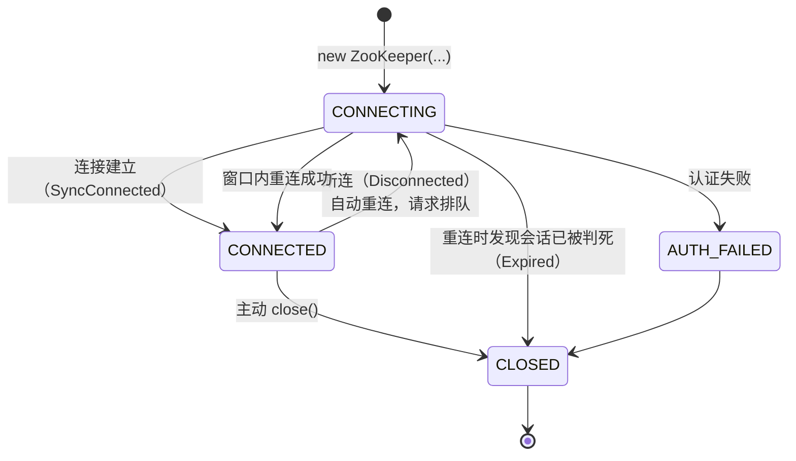
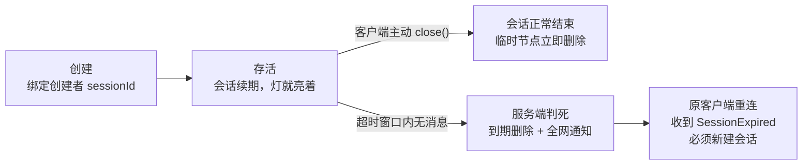
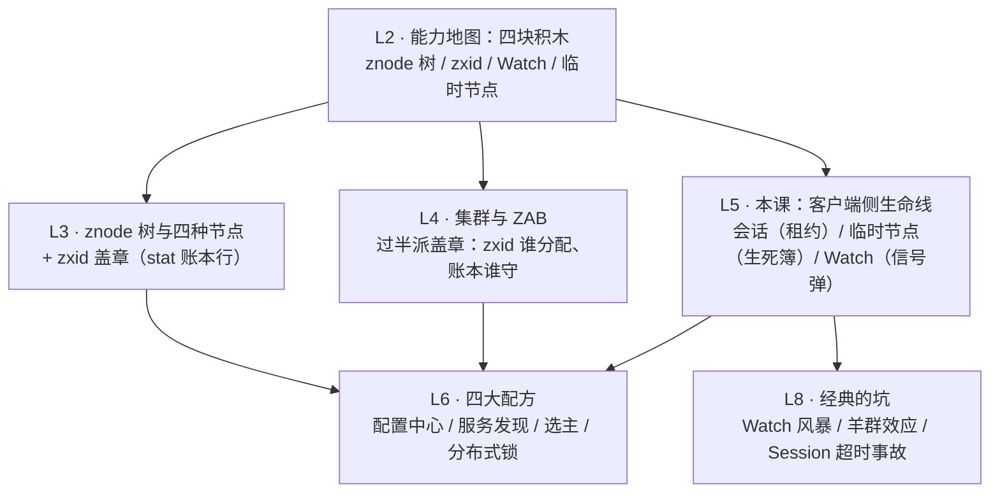

# 第 5 课 · 会话与 Watch：临时节点和一次性通知

> 阶段 2 · 核心机制 · 知识点：会话与心跳超时 / 临时节点生命周期 / Watch 触发机制与演进
>
> 🧭 课程导航：[课程目录](../../../02-课程目录.md) · 上一课：[L4 集群与 ZAB：过半派的生存智慧](lesson-04-集群与ZAB过半派的生存智慧.md) · 下一课：L6《四大经典用法：从配置中心到分布式锁》

## 第一幕 · 场景引入：故障演练夜的两个"灵异"工单

评审会通过，试点进入开发冲刺。你写了两个最经典的模块：**实例在线注册**（实例启动时创建临时节点 `/svc/order-a`）和**配置热更新**（客户端在 `/config/order` 上挂 Watch，一变就通知）。L2 能力地图的四块积木，前几课拆了两块（znode 树；zxid——这块的"谁分配"到 L4 才拆完），最后两块——**临时节点和 Watch**——正是这两个模块的承重墙。

周五例行故障演练夜，注入两个故障，弹出来两个工单：

1. **工单 ①「灯亮了十几秒才灭」**：演练脚本 `kill -9` 掉订单实例，运维老张盯着服务列表计时——L3 说过临时节点是"在场灯：人走灯灭"，可这盏灯亮了十几秒才灭。"ZK 卡了？还是我们配错了？"
2. **工单 ②「丢了一次通知」**：演练脚本把 `/config/order` 连改两次（v1→v2→v3），订阅端只收到**一次**通知。值班小陈翻遍日志："第二次变更的通知，ZK 没发！是不是 bug？"

两个工单都不是 bug，是机制。工单 ① 的答案在**会话与超时**（灯什么时候灭，由会话的生死簿决定）；工单 ② 的答案在 **Watch 的一次性语义**（通知不是订阅）。它们也是 L6 四大配方里用得最狠的两块积木。

## 第二幕 · 认知冲突：三个想当然的三连败

**败局一："TCP 断了，灯就该灭。"——被"死缓期"上了一课。**

直觉很顺：`kill -9` 让 TCP 立刻断开，服务端马上就知道连接没了，临时节点当然该立刻删。推演一下"断连即删"的世界：网卡抖动 3 秒 → 该实例的在线标记瞬间蒸发 → 监控告警炸锅 → 流量摘除、触发切换 → 抖动过去，实例又"复活"重新注册——一次抖动被放大成一场全网误判的风暴。问题出在：**TCP 断开只证明"连接不在"，不证明"进程已死"**（Full GC 暂停 5 秒的进程活着，只是没响应；被分区的实例活得好好的，只是消息到不了）。

ZK 的答案：不把死亡判定交给"连接"这个太敏感的信号，交给**超时陪审**——服务端在超时窗口内没听到该会话的任何消息，才判死。灯灭前的十几秒，是给"可能只是晕过去"的实例留的观察期，L3 那条 ⚠️（"会话结束"不等于"断连即删"）在此完整兑现。顺手立起两层概念：**连接是 TCP 层的皮，会话是逻辑层的魂**——皮断了魂还在；换一台服务器重连，魂还能续上。

**败局二："心跳是我发的，生死我说了算。"——裁判权在服务端。**

直觉：超时是客户端本地倒计时，超没超时自己最清楚。官方文档一句话打脸："**会话过期由 ZooKeeper 集群管理，而不是由客户端管理**"。三个反直觉后果：

1. **静默钳制**：你申请 60 秒超时，服务端默默批 40 秒——协商区间是服务端说了算（默认 2×tickTime ~ 20×tickTime，tickTime 默认 2000ms 即 4~40 秒），超范围会被无声拉回，只有事后查询协商结果才知情；
2. **分区期间不知道自己死了**：客户端还在轮询重连，本地感觉一切正常——生死的账本在服务端手里，它看不到；
3. **死亡通知要等复活才能送达**：官方原文——断连期间客户端收不到过期通知，直到重新建立 TCP 连接，那一刻才收到 Expired 事件。日志表现：一串 ConnectionLoss 之后，突然一条 SessionExpired。

官方还配了守则：断连时**不要**手动重建会话（客户端库会自动重连，还内置了防羊群效应的重连策略）；只有收到 SessionExpired 才强制新建会话。

**败局三："Watch 是订阅。"——它只是一次性信号弹。**

工单 ② 复盘：v1→v2 触发通知、watch 同时被清除；客户端没有重新注册；v2→v3 时已无人守望——通知不是"丢了"，是"没人看"。官方定义开头三个词就写明白了："**a watch event is one-time trigger**"（一次性触发）。为什么故意这么设计？三点动机，全是刻意的设计减法：

1. **服务端薄记账**：watch 表只登记"谁在看这个节点"，触发即清——不为海量客户端 × 海量节点维护长期订阅关系；
2. **协调语义是"状态变了，来看"，不是"每次变更投递给你"**：协调关心终态，中间态可以合并。官方明说：你无法可靠地看到每一次变更，节点在你重注册前后变多次是正常情况；
3. **通知不带数据**：WatchedEvent 只有"事件类型 + 路径"几个字节，轻若信号弹——要新值？自己来读（"通知 + 拉取"模式）。

修复姿势三板斧：收到通知 → 重读拿新值 → 顺手重注册。要持续可靠感知，用 Curator 的 Cache 组件或 3.6+ 的持久 Watch（3.3 详讲，L6/L8 见它们上场）。

三次失败收成一句话：**临时节点的生死、Watch 的存续，都不由客户端单方面说了算——它们是挂在"会话"这根生命线上的服务端记账系统。**

## 第三幕 · 层层揭示：一根租约、一本生死簿、一颗信号弹

### 3.1 会话：一根心跳维系的逻辑租约

**建立与凭据。**客户端给出 `host:port` 列表，随便挑一台连接（失败就自动换下一台）；服务端为会话分配 **64 位 sessionId + 一串 password**——像一张房卡：断线重连、甚至换一台服务器重连时，都要出示这张卡，且任何一台服务器都能验真伪。

**超时协商。**客户端申请一个超时值，服务端按自己的区间批复（可配置，3.3.0+）：

```text
客户端申请 N ──▶ 服务端钳制到 [minSessionTimeout, maxSessionTimeout] ──▶ 返回协商值
                    默认区间：[2 × tickTime, 20 × tickTime]
                    tickTime 默认 2000ms → 默认窗口 4 ~ 40 秒
```

决策要点：**不是你想要多少就多少，服务端的区间说了算**。贴着下限配（比如 4 秒）对 GC 停顿和网络抖动极度敏感，容易误杀；跨机房、高延迟环境别配小（部署侧怎么调，L7 讲；超时类事故复盘，L8 讲）。

**保活。**官方机制很朴素：**任何请求都会给会话续期**，空闲时客户端才发 PING 心跳（PING 时机设计得很保守，确保留足故障检测与换机重连的时间；Java 客户端实现上约空闲超时的 1/3 就发 PING、约 2/3 没等到响应就换下一台服务器——版本实现细节，非协议承诺）。

**状态机。**客户端句柄的一生在这些状态间流转：



正常工作就是 CONNECTING/CONNECTED 两态往返；CONNECTEDREADONLY（连上只读模式服务器）是 3.4+ 的特殊分支，先按下不表。两条铁律：**断连不重建、Expired 才重建**（官方守则）。

**判死与执行。**服务端的 SessionTracker 给所有会话记到期时间并分桶轮检（桶粒度对齐 tickTime，实现细节），超时窗口内没有任何消息到达 → 判死 → **删光该会话的全部临时节点，并立刻通知所有盯着这些节点的客户端**（官方原文）。注意这个不对称：**别人的通知即刻送达，本人的通知等复活**——因为判死那一刻本人必然处于断连状态。

### 3.2 临时节点：生死簿在服务端手里



临时节点的生死完全跟随会话这本**生死簿**：簿上在册（会话活着），灯就亮；会话以任何方式结束（主动关闭或超时判死），节点由**服务端统一执行删除**——客户端自始至终没有任何"删自己的灯"的主动权。回看 L3 的伏笔：`ephemeralOwner` 字段登记的就是创建者的 sessionId，那行字就是生死簿的登记栏——灯跟谁的会话走，一眼便知。

这套"生杀不自理"的设计与前面几课一脉相承：L1 的教训是持有者不能自证持有（双主），L4 的机制是正统性由过半派认定而非自我声明——到了客户端侧，**"我死了没有"同样不能自己说了算，要由服务端集中裁决**。集中裁决换来的是全局一致的死亡视图：灯灭的那一刻，全网看到的是同一个事实。临时顺序节点（EPHEMERAL_SEQUENTIAL）继承同一套生命周期，只是多了排队编号——它是 L6 锁与选主配方的主角。

### 3.3 Watch：一次性信号弹，不是订阅

**定义与三要素。**读操作（`exists` / `getData` / `getChildren`）可以顺手挂一个 watch；被挂的节点发生变化时，注册者收到一个 WatchedEvent——只有**会话状态 + 事件类型 + 路径**，不带任何数据。信号弹升空：那个方向有变化，看到了就自己去侦察。

**两张登记表与事件矩阵。**服务端视角，每个节点挂两张表：**数据表**（`getData`/`exists` 注册）和**子节点表**（`getChildren` 注册）。四种事件 × 三种注册入口：

| 事件 | 什么变了 | exists | getData | getChildren |
|------|---------|:------:|:-------:|:-----------:|
| NodeCreated | 这个节点出生了 | ✅ | — | — |
| NodeDeleted | 这个节点被删了 | ✅ | ✅ | ✅ |
| NodeDataChanged | 这个节点的数据变了 | ✅ | ✅ | — |
| NodeChildrenChanged | 这个节点的子名单变了 | — | — | ✅ |

触发规则读法：`create` 打两张表（新节点的数据表 + 父节点的子表）；`delete` 打三张表（本节点数据表 + 本节点子表——目录连同孩子都没了 + 父节点的子表）；`setData` 只打本节点数据表。注意矩阵的经典陷阱：**`getChildren` 挂的 watch 看不见子节点自身的数据变化**——子节点改权重（setData）不通知，只有子名单增删才通知。

**三条保证**（官方）：① 全局有序——watch 事件与其他事件、异步响应按同一顺序分发；② **先通知、后见新数据**——你绝不会先读到新值、后收到通知（不会出现"读到了新值却不知道它变过"）；③ 事件顺序 = 服务端更新顺序。

**一次性的四个细节**：

1. **双注册只回调一次**：同一个 watcher 对象既 `exists` 又 `getData` 挂在同一节点上，节点删除时它只被回调一次（官方原例——一次通知不重复发）；
2. **断连期间收不到任何 watch 事件**：官方建议把会话事件（Disconnected 等）当"进入安全模式"的信号——没有哨兵在岗的时段，进程应保守行事（L8 客户端反模式的主角）；
3. **重连后自动重注册**，但有一只漏网之鱼：`exists` 挂在一个**尚未出生**的节点上，断连期间它被创建又被删除——这条通知永久丢失（官方原文标注的唯一遗漏场景）；
4. **中间态合并**：两次变更可能只通知一次（工单 ② 的真相）；官方明说 cannot reliably see every change。

**演进：两条补丁线。**`removeWatches` 支持显式退订（设 local 标志可离线移除本地 watch）；**3.6.0 新增持久 Watch `addWatch`**：触发后不被清除。两种模式：`PERSISTENT`（守望本节点，相当于 exists+getData 的常驻版）、`PERSISTENT_RECURSIVE`（守望整棵子树，任何子孙节点变化都带路径通知）。持久 Watch 触发 NodeCreated / NodeDeleted / NodeDataChanged；递归模式**不触发 NodeChildrenChanged**——子孙节点自身的增删事件已带完整路径，父节点再喊"子名单变了"属于冗余广播（官方原文 as it would be redundant）。移除用 `removeWatches(WatcherType.Any)`。除"一次性"外，其余触发语义与保证和标准 watch 相同。

> 🎯 决策视角小结：把 Watch 当**信号弹**，别当**订阅邮件**。评估 ZK 时必须想清楚：**"中间态可合并、每次变更不保证送达"** 的语义在你的场景能否接受（要逐条投递保证，那是消息队列的活，L9 对比见）；收到通知≠全网已同步——你连的那台机器可能还没 apply 最新值，严格场景读前 `sync()`（L4 伏笔，L6 见哪些配方必须 sync）；一次性 watch 的"通知→重读→重注册"三板斧写进每个订阅端的标准动作，或者干脆用 Curator Cache / 3.6+ 持久 Watch 免去手工循环。

## 第四幕 · 实操演练：时间线判案与通知丢失复现

**演练 A：时间线判案。**集群 `tickTime=2000`，订单实例的会话协商超时 15 秒，`21:00:00` 建立会话并创建 `/svc/order-a`。演练夜时间线：

```text
21:30:02  实例发出最后一次 PING（会话续期）
21:30:05  演练脚本 kill -9 实例（TCP 断开）
21:30:08  老张 ls /svc —— 节点还在，开骂
21:30:1?  节点消失；所有 watch /svc 的客户端收到通知
21:30:20  实例被重新拉起，拿着旧 sessionId+password 重连
```

问：① 为什么 21:30:08 节点还在？② 节点大约何时消失、判死依据是什么？③ 21:30:20 重连的实例会收到什么、该做什么？追问：如果实例是 21:30:10 就重连成功，结局有何不同？

<details><summary>参考答案（先自己判完再看）</summary>

1. **死缓期**：判死依据是"超时窗口内没有任何消息"，不是 TCP 断开。最后一次消息在 21:30:02，15 秒窗口未满，服务端继续保留会话与节点——TCP 断了只说明皮断了，魂还在。
2. 约 **21:30:17**（最后消息 21:30:02 + 15 秒）判死；分桶轮检粒度对齐 tickTime=2 秒，实际删除落在 21:30:17~19——老张从 kill（21:30:05）算起等了约 12~14 秒，工单 ① 的"十几秒"由此而来。判死瞬间：删 `/svc/order-a` + 通知所有 watch /svc 的客户端（NodeChildrenChanged）。
3. 会话已被判死，重连握手时服务端验房卡发现"人已销户"——实例收到 **SessionExpired 事件**，按官方守则：此刻才新建会话，然后重新注册临时节点。
4. **追问**：21:30:10 重连成功，落在 15 秒窗口内（窗口到 21:30:17）→ 会话续命、临时节点从未消失、什么都不用做。死缓期的全部意义就在这里：抖动/GC 类的"假死"被窗口吸收，真死才判死。

</details>

**演练 B：通知丢失复现与矩阵陷阱。**三个小场景，先自己推再对答案：

```text
场景1：客户端 get -w /config（当前值 v1）
        运维 set /config "v2" → 客户端收到通知，忘了重新挂 watch
        运维 set /config "v3" → 客户端无感
        客户端 get /config → 读到 v3
场景2：客户端 ls -w /svc（watch 子名单）
        运维对 /svc/order-a set 新权重（子节点 setData）
场景3：同一个 watcher 对象，exists("/lock") 与 getData("/lock") 双注册
        运维 delete /lock
```

问：场景 1 的 v2 算"丢"吗，官方怎么描述这个语义？场景 2 会收到通知吗？场景 3 回调几次？

<details><summary>参考答案（先自己推完再看）</summary>

1. **不算丢，叫中间态合并**：watch 是一次性信号弹，v1→v2 触发后表已清空；v2→v3 无人守望，"没有 watch 就没有通知"天经地义。官方语义：cannot reliably see every change——协调关心终态（v3），中间态（v2）允许合并。标准三板斧：收到通知 → 重读（拿到 v3）→ 重新挂 watch，一气呵成就不会长期失明。
2. **不会**：`ls -w` 挂的是子节点表（child watch），只有子名单增删才触发；子节点自身 setData 改权重，事件矩阵里根本不打这张表。要看子节点数据变化，得对每个子节点单独挂 `get -w`——服务发现配方的经典坑（权重调整"看不见"），L6 配方与 L8 反模式都会回来处理它。
3. **一次**：官方原例——同一 watcher 对象的多种注册在同一次变更（删除）里只回调一次，通知不重复发。

</details>

两道题的手感：**会话题问"什么时候判死、谁说了算"（超时窗口 + 服务端裁决），Watch 题问"哪张表被打、响几声"（矩阵 + 一次性）**。前者定参数与容量（L7），后者定配方正确性（L6）。

## 第五幕 · 体系收束：四块积木集齐



本课带走三句话：

1. 会话是一根**心跳维系的逻辑租约**：超时服务端说了算（默认 4~40 秒区间钳制），过期由集群裁决而非客户端自判，**死亡通知要等复活才能送达**；断连不重建，Expired 才重建
2. 临时节点的生死簿在服务端手里：会话结束（主动 close 或超时判死）→ 服务端统一删除并全网通知——**生杀不自理**，与 L1/L4 的"不自证"哲学一脉相承；死缓期吸收假死抖动，真死才判死
3. Watch 是**一次性信号弹**：两张表（数据/子名单）× 四种事件，通知不带数据、不保证每次变更都送达、断连期间哨兵离岗；三板斧（通知→重读→重注册）是标配，3.6+ 持久 Watch 与 Curator Cache 是免手工循环的升级件

下一课预告：积木集齐，开拼配方——配置中心（持久节点 + Watch）、服务发现（临时节点 + 子名单 Watch）、Leader 选举（临时顺序节点）、分布式锁（临时顺序节点 + 前驱 Watch）。哪个配方必须读前 `sync()`、哪个配方要防羊群效应，L6 见分晓。

### 📇 术语速查卡

| 术语 | 一句话解释 |
|------|-----------|
| 会话（session） | 客户端与服务端的逻辑租约；一根心跳维系 |
| sessionId + password | 会话凭据（64 位 id + 房卡），换机重连时出示，任何服务器可验 |
| 超时协商 | 客户端申请、服务端钳制到 [2×tickTime, 20×tickTime]；默认窗口 4~40 秒 |
| PING | 空闲时的心跳；任何请求都会给会话续期 |
| CONNECTING / CONNECTED / CLOSED / AUTH_FAILED | 客户端句柄四态；正常工作在前两态间往返 |
| SessionExpired | 重连成功那一刻才送达的死亡通知；此后必须新建会话 |
| 死缓期 | 断连到判死之间的超时窗口；吸收抖动与 GC 假死 |
| SessionTracker | 服务端的会话生死簿，按到期时间分桶轮检（粒度对齐 tickTime） |
| 临时节点生命周期 | 创建绑会话 → 会话续期就活 → 会话结束（close/判死）服务端统一删除 |
| ephemeralOwner | stat 里的生死簿登记栏：临时节点＝创建者 sessionId，持久节点＝0 |
| Watch | 一次性信号弹：节点变化时给注册者发"类型+路径"，不带数据 |
| 数据表 / 子名单表 | getData·exists 注册 / getChildren 注册；每节点两张登记表 |
| 四种事件 | NodeCreated / NodeDeleted / NodeDataChanged / NodeChildrenChanged |
| 先通知后见新数据 | 官方保证：绝不会先读到新值后收到通知 |
| 中间态合并 | 两次变更可能只通知一次；cannot reliably see every change |
| 持久 Watch（3.6+） | addWatch：PERSISTENT / PERSISTENT_RECURSIVE，触发不清除；递归模式不发 NodeChildrenChanged（冗余） |
| removeWatches | 显式退订；local 标志可离线移除本地 watch |

### ✏️ 课后思考题（可选）

1. 默认 `tickTime=2000` 配置下，客户端分别申请 3 秒和 60 秒超时，实际拿到多少？如果某中间件把会话超时配成 1 秒"求快速故障感知"，实际会发生什么？（答案：4 秒和 40 秒；申请 1 秒被静默钳到 4 秒——故障感知比预期慢 4 倍且无人报错，这是超时类运营事故的经典配方，L8 展开）
2. 会话判死那一刻，盯着该会话临时节点的**其他客户端**和**会话本人**，分别什么时候收到通知？为什么这个不对称不会造成问题？（提示：其他人即刻收到（它们连着）；本人要等重连。判死瞬间本人必然断连——发不出任何请求，不存在"拿着死会话继续做事"的窗口）
3. 递归持久 Watch 为什么不触发 NodeChildrenChanged？（提示：子孙节点的 NodeCreated/NodeDeleted 自带完整路径，已完整刻画名单变化；父节点再发"子名单变了"是同一信息的第二次广播）

## 🚀 下一批接力提示词

> 学完本课后，**复制下面这段文字发给 AI**，即可无缝进入下一课（无需重新描述上下文）：

```
继续学 ZooKeeper。我的学习档案在 zookeeper/00-学习档案.md，
刚学完阶段 2《核心机制》的课《会话与 Watch：临时节点和一次性通知》知识点 会话与心跳超时、临时节点生命周期、Watch 触发机制与演进，
请按大纲继续讲解下一课（课6：四大经典用法：从配置中心到分布式锁）。
```

## 🧭 课程导航

➡️ **下一课**：[L6 四大经典用法：从配置中心到分布式锁](lesson-06-四大经典用法从配置中心到分布式锁.md)

📚 **返回目录**：[课程目录](../../../02-课程目录.md)
