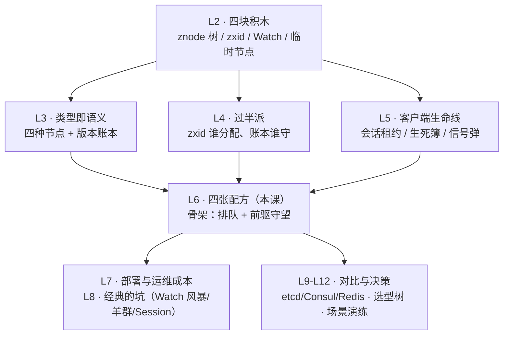

# 第 6 课 · 四大经典用法：从配置中心到分布式锁

> 阶段 2 · 核心机制 · 知识点：配置中心与服务发现 / Leader 选举实现 / 分布式锁与 Curator
>
> 🧭 课程导航：[课程目录](../../../02-课程目录.md) · 上一课：[L5 会话与 Watch：临时节点和一次性通知](lesson-05-会话与Watch临时节点和一次性通知.md) · 下一课：L7《部署与运维成本：3 节点起步的小集群》

## 第一幕 · 场景引入：四个需求，一份官方配方文档

试点上线两周，你写的两个模块稳稳当当：实例注册（临时节点在场灯）+ 配置热更新（Watch 三板斧）。大促备战启动，两个团队带着新需求来敲门——**抄你的作业**：

- **调度平台组**：31 个调度节点，同一批定时任务只能由一个节点跑——要**选主**
- **交易组**：库存扣减防超卖，跨实例互斥——要**分布式锁**

他们照着你的 demo 和几篇博客拼了两天，上线前故障演练爆出两起事故：

**事故 ①「惊群」**：演练 kill 掉主调度节点，监控曲线瞬间拉起——31 个备节点**同时**惊醒、同时重抢主位（30 次注定失败的 create 全部涌向唯一 Leader 白跑一趟），ZK 集群 CPU 飙红，选主切换比预期多了 40 秒。

**事故 ②「双扣」**：锁持有人 A 扣减途中一次 Full GC 21 秒（会话超时 15 秒），会话被判死、临时节点被删、B 接管锁开始扣减；A 从 GC 醒来，**不知道自己已经出局**，继续把没扣完的库存扣完——同一批库存扣了两次。

你意识到这两份"抄来的作业"缺的不是代码，是**官方配方**——Apache 那份《Recipes and Solutions》文档。L2 就说过：ZK 不卖锁、不卖选主，只卖四块积木；配方怎么拼，官方文档写着标准答案。这一课把四张配方全部拼完——阶段 2 就此收官。

## 第二幕 · 认知冲突：三份想当然的作业

**败局一："选主就是抢椅子。"——抢椅子惊动全班。**

抄来的选主长这样：所有节点抢 `create /leader`（临时节点），抢到的当主，没抢到的 `exists("/leader", watch)` 盯着它；主一挂，**全体收到 NodeDeleted**，全体重新抢。问题不是"能不能选出主"（能），而是**切换的代价**：31 个备节点同时惊醒、同时发起抢主——失败的 30 次 create 全部涌向唯一 Leader 白跑一趟；官方文档对这类朴素方案的原话：所有进程被通知后"集体执行 getChildren……客户端数量一大，就造成 ZK 服务器要处理的一次操作尖峰"，并给它起了名字——**羊群效应（herd effect）**：官方定义是"唤醒一大群，而其实只有一个或极少数机器能继续推进"（releasing a herd when in fact only a single or a small number of machines can proceed）。抢椅子还有第二宗罪：惊醒后谁抢到看运气，没有排队语义，主位在节点间乱跳，监控和日志都难看。

**败局二："拿到锁就高枕无忧。"——GC 那一刀，ZK 锁也挨。**

事故 ② 复盘：A 持锁 → GC 21 秒 > 会话超时 15 秒 → 判死 → 临时节点删除 → B 接管 → A 醒来继续干。这把刀你在 L1 见过：Kleppmann 用几乎相同的时间线论证 Redis 锁不安全。残酷的事实是：**这一刀砍的是所有"基于超时/租约的锁"，ZK 锁也不例外**——ZK 锁恰恰依赖"会话判死自动释放"来防死锁（这是它优雅的地方），但"自动释放"的另一面就是"持有人还活着却被判出局"的双持有窗口。L1 埋的问题在此正面回收：ZK 的解法不是挡刀，而是给每个持锁人发一块**号牌（fencing token）**——Kleppmann 原文点名："用 ZooKeeper 做锁服务时，可以用 zxid 或 znode 版本号当 fencing token"。号牌怎么挡刀，3.3 展开，L12 选型再算总账。

**败局三："通知到了，全网就同步了。"——通知只到你的服务器。**

配置热更新也被抄了个变体：运维改完开关 `/config/feature-flag`，**通过 MQ** 通知 31 个节点"去读新值"。测试环境偶尔有节点读到旧值，开发怀疑 MQ 丢消息——消息没丢：L4 讲过，读请求由你所连的服务器**本地**服务，某节点若连着还没 apply 最新提交的 Follower，读到的就是旧值。Watch 路径为什么没这个毛病？因为通知只能由**已 apply 该变更的服务器**发出——"通知→重读"在同一条连接上是新鲜的；MQ 这条路完全绕过了 Watch，那是一次裸读。官方为这种**跨客户端因果链**（A 写完、走旁路通知 B 读）给了专门的补救：读前 `sync()`。L4 的伏笔在此认领：**哪些场景需要 sync——挂了 watch 的不需要，绕过 watch 直接读的才需要**。

三份作业的共同病根：**把积木的"能拼"当成了配方的"拼对了"**（L2 那句"积木是对的、配方搭错了也能出生产事故"的伏笔兑现）。下面看官方答案。

## 第三幕 · 层层揭示：四张官方配方

### 3.1 配置中心与服务发现：两张"通知+拉取"配方

**配置中心**。存储：持久节点分层挂配置（`/config/订单服务/灰度开关`），一份配置一个节点，天然带 cversion 版本号（L3 的账本行）。读取：启动全量拉一遍 + 对每个关心的节点 `getData(watch=true)`；变更：管理员 `setData`；订阅端永远执行 L5 三板斧——**收到通知 → 重读拿新值 → 重新挂 watch**。一致性语义两句话：同连接"通知→重读"新鲜（败局三已解释）；**跨客户端因果链**读前 `sync()`。边界两条：单节点数据 KB 级（jute.maxbuffer，L2/L3 讲过）——大配置存引用（版本号/摘要），正文放对象存储；读多写少正中 ZK 甜区，但别把 ZK 当读库，高频读要做客户端本地缓存（见下 Curator）。

**服务发现**。注册：实例启动创建临时节点 `/svc/order/order-a`，数据放 `host:port`——L5 的"在场灯"，死缓期判死自动退场，零清理代码。消费端：`getChildren("/svc/order", watch=true)` 拿名单 + 本地缓存，NodeChildrenChanged 一响就重读名单。**L5 埋的坑在此回收**：子名单 watch 看不见子节点自身的 setData——实例把权重调成 0 想下线，名单没变，消费端无感继续打流量。修法三选一：对每个实例节点单独挂数据 watch；ZK 3.6+ 一发 `addWatch(PERSISTENT_RECURSIVE)` 递归持久 watch 通吃整棵子树；或直接用 Curator 本地缓存。语义上服务发现**容忍最终一致**：旧名单 + 调用失败重试兜底，不需要 sync——这是它和"读完立刻做关键决策"场景的本质区别。

**Curator 的本地缓存与发现件**。手搓 watch 循环的痛（一次性、重注册、断连 safe mode），Curator 用 **CuratorCache** 统一解决：把指定节点（可含整棵子树）的数据镜像到客户端本地内存，变更自动同步，业务只管读本地缓存 + 注册回调。老三样 NodeCache / PathChildrenCache / TreeCache 已全部废弃（官方标注 replace by CuratorCache）；另有 **curator-x-discovery** 扩展——ServiceInstance 注册、ServiceProvider 负载策略，服务发现整张配方开箱即用。版本注意（Curator 官方邮件列表 committer 回复）：Curator 5.x 支持 ZK 3.5+（最后的 3.4 兼容版是 4.2），但 CuratorCache 与持久 watch 依赖 ZK 3.6 特性——升级前先对齐两端版本。

### 3.2 Leader 选举：排队报名，链式接棒

官方配方（《Recipes and Solutions》原文意译）：

```text
1. 每个候选者在 /election 下 create("guid-n_", SEQUENCE|EPHEMERAL) → 排队报名，领号
2. C = getChildren("/election")，找出自己的号 i 与前驱（比自己小的最大号 j）
3. watch 前驱节点 /election/guid-n_j                → 只盯队伍里你前面那一个
4. 收到前驱被删的通知 → 重新 getChildren：
   - 自己成了最小号 → 执行 leader 程序（就任）
   - 否则 → 回到第 3 步，watch 新前驱
```

主挂的切换过程：主的临时节点消失（会话判死，L5 生死簿）→ **只惊醒 watch 它的那一个**（老二）→ 老二重读名单、确认自己最小 → 就任。31 个节点的集群，惊醒人数从 31 降到 1——官方原话：这样避免了羊群效应，"因为不是所有客户端都在看同一个节点"。再体会配方的妙处：**顺序节点把"谁该接棒"写成静态事实**（L3 埋的"标准积木"在此登场——接棒无需再抢），**临时节点让"接棒时机"自动触发**（前驱必以两种方式消失：主动退出或判死，watch 都会响）。

官方还附了一条容易被忽略的 Note：**"最小号"不等于"知道自己是最小号"**——你的位置是服务端名单上的事实，而"知道自己是主"隔着一次"重读名单确认"；最小号的创建者若不确认，可能还在傻等一个不存在的前驱。官方建议应用可另建一个节点宣告"leader 已就任"，让追随者们也能对齐认知。Curator 的两个封装把报名、守望、确认、接棒全包了：**LeaderLatch**（抢到就持有，直到 close 或会话死亡）与 **LeaderSelector**（回调式 `takeLeadership()`，执行完自动重新排队——主位轮值）。调度平台事故 ① 的修复一行搞定：抄来的抢椅子换成 LeaderSelector。

### 3.3 分布式锁：同一个队列，换一种用法

官方锁配方与选主**共享同一副骨架**（临时顺序节点 + 前驱守望），语义换成"最小号 = 持锁"：

```text
加锁：1. create("/locks/资源/lock-", SEQUENCE|EPHEMERAL)   → 领号入队
      2. getChildren("/locks/资源")，不带 watch（官方强调：避免羊群效应）
      3. 自己是最小号 → 持锁，进入临界区
      4. 否则 exists(前驱节点, watch=true)，等待通知
      5. exists 返回 null（前驱恰好没了）→ 回到第 2 步重新校准
解锁：delete 自己的节点（主动释放）
```

三个精妙点（官方原话背书）：

1. **公平锁**：编号即排队，先来先得（FIFO）——抢椅子版没有的语义；
2. **每次释放只惊醒一个**：官方原文——"每个节点恰好只被一个客户端 watch，因此一个节点的删除只会唤醒一个客户端，以此避开羊群效应"；且"没有轮询、没有超时"——等待靠通知，不烧 CPU；
3. **崩溃自动释放**：临时节点随会话判死消失——持锁人崩溃不会留下死锁（比 Redis"忘记设 TTL 就锁死"优雅）。

两个藏在步骤里的细节：第 2 步 getChildren **特意不带 watch**——看着名单的人会被任何排队变化（有人加塞、有人退出）惊醒，守望必须精确到"前驱节点"而不是"名单"；第 5 步 exists 返回 null 是竞态兜底——刚看清名单、前驱恰好消失，就回到第 2 步重新校准（谁 watch 一个已消失的节点，谁就永远睡死）。

**锁的软肋与号牌。**败局二的双持有窗口无法从锁服务侧根除（进程停顿是物理规律，Kleppmann 原话：这个问题"无论用什么锁服务"都存在）。ZK 的对策是发号牌：持锁时取锁节点的 **czxid**（创建事务号，zxid 全序单调，B 后创建必比 A 大）随业务写请求下发给资源方；资源方记录见过的最大号牌，收到更小的直接拒收——A 醒来带着旧号牌写库，库已见过 B 的新号牌，A 的写入被拒。代价是资源方必须配合校验（号牌不是免费的）。这是 ZK/etcd 锁对 Redis 锁的决定性优势，L12 选型算总账。

**Curator：别手搓锁。**`InterProcessMutex`（可重入互斥锁）、`InterProcessSemaphoreMutex`（不可重入）、`InterProcessReadWriteLock`（读写锁）、Multi Shared Lock——官方 Recipes 文档里的配方（除两阶段提交外）Curator 全部实现。手搓锁的高危边角——断连期间 watch 失效、会话过期后的持锁判定、加锁途中连接迁移——Curator 都处理过，这正是"别手搓"的全部理由。**L3 埋的容器节点在此认领**：Curator recipes 会自动把路径的父节点建成**容器节点**（CONTAINER）——最后一批孩子删除后，空锁目录/选举目录可被服务端择机回收，不用人肉清理。性能直觉：一次加锁 = 一次过半写（create）+ 若干本地读，延迟与 ZAB 写挂钩（L4"写不可水平扩展"显形）——高频短临界区（每秒上千次的秒杀扣减）不适合 ZK 锁，那是 L9/L12 的对比题。

> 🎯 决策视角小结：四张配方其实是一副骨架的三种语义加一张读配方——**临时顺序节点排队（锁/选主）、临时节点在场（服务发现）、持久节点 + Watch（配置中心）**。评估"能不能用 ZK 做 X"先问三件事：变化频率高不高（写都打向唯一 Leader）、一致性要求是"最终"还是"因果立即"（决定要不要 sync）、持锁/持主期间会不会长时间停顿（决定要不要 fencing）。高频写、高并发短临界区、海量订阅（Watch 风暴，L8）——都是红灯。

## 第四幕 · 实操演练：队列推演与判案三连

**演练 A：锁队列推演——watch 的是节点，不是进程。**5 个客户端在 `/locks/库存-9527` 下排队：

```text
初始队列：lock-0001(持锁) lock-0002 lock-0003 lock-0004 lock-0005
守望关系：0002→watch 0001  0003→watch 0002  0004→watch 0003  0005→watch 0004
```

事件序列：① 0001 释放 → ② 0002 惊醒、重读、自己最小、持锁 → ③ 0003 崩溃 → ④ 0004 崩溃 → ⑤ 0002 释放。问：③ 和 ④ 各惊醒谁？各自随后做了什么？⑤ 释放后谁持锁？全程 ZK 共发出几次删除通知、每次惊醒几人？

<details><summary>参考答案（先自己推完再看）</summary>

1. ③ 0003 崩溃（节点删除）惊醒 **0004**（它 watch 0003）：0004 重读名单 [0002, 0004, 0005]，自己不是最小 → watch 新前驱 0002。
2. ④ 0004 崩溃惊醒 **0005**（它 watch 0004）：重读 [0002, 0005]，不是最小 → watch 新前驱 0002。（0004 自己 watch 谁已无关紧要——它死了。）
3. ⑤ 0002 释放惊醒 **0005**：重读 [0005]，自己最小 → 持锁。
4. 全程 4 次删除通知（0001 释放、0003 崩溃、0004 崩溃、0002 释放），**每次恰好惊醒一人**；且每次惊醒后"重读名单 + 重校前驱"自动修复守望链——这就是配方对"排队者中途退出"天然免疫的原因：watch 挂在**节点**上，前驱以任何方式消失（主动释放/会话判死）都会触发，惊醒者必重新校准。抢椅子版没有任何校准机制，惊醒全靠广播。

</details>

**演练 B：判案三连。**

```text
案1：调度平台主节点 21:00:05 被 kill，31 节点链式守望。
     问：惊醒几人？此人就任前必须做哪两件事？
案2：运维改 /config/订单/限流阈值 后立即通过 MQ 触发下游灰度逻辑，
     灰度逻辑读 ZK 拿到旧阈值。问：为什么 Watch 通知路径不会出这个问题？
     此场景怎么修？
案3：锁双扣时间线：A 持锁并于 21:00:00 完成加锁开始扣减 → 21:00:02 A 进入
     Full GC（会话超时 15 秒）→ 21:00:23 A 醒来继续扣。
     请补全中间事件，标出双持有窗口，给两层防护。
```

<details><summary>参考答案（先自己判完再看）</summary>

1. **惊醒 1 人**（watch 主节点的那位）。就任前两件事：**重读名单确认自己最小**（官方 Note：最小号 ≠ 知道自己是最小号）；推荐再补一步应用层**就任宣告**（官方建议：另建一个节点宣告 leader 已就任），让 30 个追随者对齐"新主是谁"。Curator LeaderSelector 回调触发即代表确认完成。
2. Watch 路径的通知只能由**已 apply 该变更的服务器**发出，"通知→重读"在同一条连接上新鲜；此场景是**绕过 watch 的裸读 + 跨客户端因果链**（写完立刻经旁路触发另一端读）——读请求落在落后 Follower 上就拿到旧值。修法：读前 `sync()`（官方推荐动作），或改走 Watch 通知路径。
3. 时间线：A 最后一条消息是加锁 create（约 21:00:00）→ 判死于 21:00:15 前后（+15 秒，分桶粒度可能再晚 1~2 秒）→ A 的锁节点删除、B 惊醒持锁开始扣减（约 21:00:17）→ **双持有窗口 ≈ 21:00:17~23**：A 的资格已死、B 正在扣、A 尚在 GC → 21:00:23 A 醒来继续扣。两层防护：**号牌**（B 的锁节点 czxid 必大于 A 的，资源方拒收 A 的旧号牌写入——治本）；**业务兜底**（扣减幂等/库存行版本校验——治标，L12 展开）。另注：A 醒来重连会收到 SessionExpired（L5"死亡通知等复活"），可在此时主动放弃未完成操作——但 GC 期间它什么也收不到，所以号牌才是硬保障。

</details>

两道题的手感：**推演题盯"守望链怎么自动校准"（每次惊醒必重读重校），判案题盯"通知的边界"（同连接新鲜、跨客户端要 sync、停顿期谁也救不了你——只能靠号牌）**。

## 第五幕 · 体系收束：一副骨架，四张配方



四张配方一张表（阶段 2 的机制浓缩于此）：

| 配方 | 核心积木 | Watch 策略 | sync 需求 | 一致性容忍 |
|------|---------|-----------|----------|-----------|
| 配置中心 | 持久节点 + 三板斧 | 数据 watch（3.6+ 可递归持久） | 跨客户端因果链读需要 | 秒级最终一致可接受 |
| 服务发现 | 临时节点在场灯 | 子名单 watch（权重变化需数据 watch/递归） | 不需要（重试兜底） | 旧名单短暂可见可接受 |
| Leader 选举 | 临时顺序节点 | **只 watch 前驱**（防羊群） | 不需要 | 接棒即生效，全序编号保证最小者唯一 |
| 分布式锁 | 临时顺序节点 | **只 watch 前驱** + exists 竞态兜底 | 不需要 | 持锁停顿需 fencing token 兜底 |

本课带走三句话：

1. **锁与选主是同一副骨架**：临时顺序节点排队 + 前驱守望 + 重读校准；官方两处强调防羊群——getChildren 不带 watch、每次只惊醒下一个人
2. **通知的边界要记牢**：同连接"通知→重读"新鲜；跨客户端因果链读前 sync()；进程停顿期锁服务无能为力，号牌（zxid/czxid fencing token）是唯一硬保障
3. **生产环境别手搓**：Curator 把配方、断连、会话过期、本地缓存全包了（InterProcessMutex / LeaderSelector / CuratorCache / x-discovery）；版本对齐——Curator 5.x 配 ZK 3.5+，CuratorCache 与持久 watch 要 3.6+

阶段 2（核心机制）至此收官：L3 认识了账本（节点与 zxid），L4 认识了盖章人（过半派），L5 认识了生命线（会话与 Watch），本课把四块积木拼成四张能上生产的配方。下一阶段（成本与风险）回答更冷静的问题：这套东西跑起来要几台机器、日志怎么管、出过哪些经典事故——机制的浪漫之后，是运维的账单。

### 📇 术语速查卡

| 术语 | 一句话解释 |
|------|-----------|
| 配方（recipe） | 官方《Recipes and Solutions》定义的积木标准组合法；ZK 只卖积木不卖配方 |
| 羊群效应（herd effect） | 唤醒一大群而只有一个能推进；官方定义：releasing a herd when in fact only a single or a small number can proceed |
| 抢椅子选举 | 朴素 create /leader 抢占 + 全员围观；切换时全体惊醒，反例教材 |
| 链式接棒 | 官方选主配方：最小号当主，其余只 watch 前驱；主挂只惊醒一人 |
| 前驱（predecessor） | 名单中紧挨在自己前面的节点；守望的唯一对象 |
| 重读校准 | 每次被惊醒必做：重读名单 + 重挂前驱 watch；对排队者中途退出免疫 |
| 最小号 ≠ 知道 | 官方 Note：位置是服务端事实，就任需一次读取确认；可另建节点宣告就任 |
| 公平锁（FIFO） | 顺序编号即排队顺序，先来先得 |
| getChildren 不带 watch | 锁/选主配方第 2 步的官方强调：看名单会被任何排队变化惊醒 |
| 通知+拉取 | 配方通用模式：通知只指路不带数据，新值自己读 |
| sync() 边界 | 同连接 watch 后重读不需要；跨客户端因果链（旁路通知触发的读）需要 |
| fencing token（号牌） | 单调递增令牌随写请求下发，资源方拒收旧牌；ZK 用 zxid/czxid（Kleppmann 原文） |
| 双持有窗口 | 会话判死到原持锁人醒来之间的重叠期；号牌是唯一硬封口 |
| Curator | ZK 高级客户端框架；官方 Recipes 配方除两阶段提交外全实现 |
| InterProcessMutex | Curator 可重入互斥锁；另有不可重入/读写/多锁变体 |
| LeaderLatch / LeaderSelector | Curator 选主两件套：持有式 / 回调轮值式 |
| CuratorCache | 客户端本地缓存镜像，取代 NodeCache/PathChildrenCache/TreeCache（均已废弃） |
| curator-x-discovery | Curator 服务发现扩展：注册、发现、负载策略开箱即用 |
| 容器节点认领 | Curator recipes 自动把父节点建为 CONTAINER，空锁目录/选举目录可被回收（L3 伏笔兑现） |

### ✏️ 课后思考题（可选）

1. 31 个节点依次持有一把锁（每个持锁后立刻释放传给下一个），链式配方从头到尾 ZK 总共发出多少次删除通知？换成抢椅子版（全员 watch 持锁节点）大约是多少次？（答案：链式 N-1 = 30 次通知，每次恰好唤醒一人；抢椅子版每次释放都通知全部 30 个等待者，30 轮合计约 900 次通知——O(N) 对 O(N²)，这就是防羊群的量级差）
2. 为什么锁/选主配方必须用**临时**顺序节点，而不是持久顺序节点？反过来，配置中心为什么必须持久节点？（提示：锁/选重要的是"持有者死了资格自动作废"（防死锁、自动接棒）；配置要的是"写入者下线值仍在"——类型即语义，L3）
3. LeaderSelector 执行完 `takeLeadership()` 自动重新排队，LeaderLatch 不会——各适合什么场景？（提示：轮值巡检类任务用 LeaderSelector（谁闲谁当）；长期驻留的主备（主稳住直到挂）用 LeaderLatch）

## 🚀 下一批接力提示词

> 学完本课后，**复制下面这段文字发给 AI**，即可无缝进入下一课（无需重新描述上下文）：

```
继续学 ZooKeeper。我的学习档案在 zookeeper/00-学习档案.md，
刚学完阶段 2《核心机制》的课《四大经典用法：从配置中心到分布式锁》知识点 配置中心与服务发现、Leader 选举实现、分布式锁与 Curator，
请按大纲继续讲解下一课（课7：部署与运维成本：3 节点起步的小集群）。
```

## 🧭 课程导航

➡️ **下一课**：[L7 部署与运维成本：3 节点起步的小集群](../../3-成本与风险/lessons/lesson-07-部署与运维成本3节点起步的小集群.md)

📚 **返回目录**：[课程目录](../../../02-课程目录.md)
