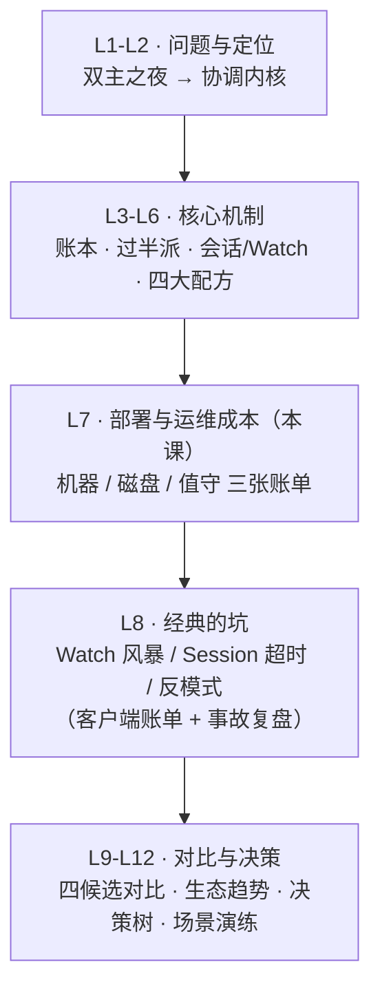

# 第 7 课 · 部署与运维成本：3 节点起步的小集群

> 阶段 3 · 成本与风险 · 知识点：部署形态与容量规划 / 事务日志与快照 / 监控与日常运维
>
> 🧭 课程导航：[课程目录](../../../02-课程目录.md) · 上一课：[L6 四大经典用法：从配置中心到分布式锁](lesson-06-四大经典用法从配置中心到分布式锁.md) · 下一课：L8《经典的坑：Watch 风暴、羊群效应与 Session》

## 第一幕 · 场景引入：预算会上的四连问

试点验收通过，四张配方（配置中心、服务发现、选主、锁）连同两个团队的修复全部平滑落地。公司批准正式立项，建生产级 ZooKeeper 集群。立项会开了半小时，机制没人质疑——被质疑的是**钱**。运维老张抱着预算表，连问四个问题：

1. **要几台机器？**——"能不能 2 台？能不能和 Kafka 那批机器混着用？"
2. **什么规格？**——"按大数据节点的标准来，32 核 128G，一步到位？"
3. **磁盘怎么管？**——"听说它天天写日志，盘会不会写爆？"
4. **以后谁盯着？**——"这玩意儿挂了我们业务全挂，出了事找谁？"

还有一个没人问出口的隐藏问题：**半年后要扩容，怎么办？**

你忽然想起 L6 结尾那句话："机制的浪漫之后，是运维的账单。"前三课你学会了 ZK 凭什么可靠（L4 过半派）、怎么和它打交道（L5 会话与 Watch）、拿它能干什么（L6 四大配方）；这一课回答的是 L4 评审会上悬而未决的另一半——**把它跑起来、养起来，要付出什么**。老张的四个问题，对应三张账单：机器账单（几台、什么规格）、磁盘账单（日志与快照怎么管）、值守账单（监控与日常运维）。隐藏问题（扩容）是一张附赠的变更账单。

## 第二幕 · 认知冲突：三份想当然的方案

**败局一："按大数据节点的标准堆高配。"——ZK 是 IO 型小服务，不是算力猛兽。**

老张直觉：贵 = 稳。给 ZK 上 32 核 128G 旗舰机、一块 2T 大盘装所有东西。两个坑：其一，**ZK 用不上这些算力**——数据树 KB 级（L2"小而美"）、树常驻内存，CPU 中等即可；其二，**大盘混用是灾难**——事务日志、快照、系统盘全在一块盘上，fsync 的顺序小写被快照的大文件 IO 和系统流量反复打断。官方 Admin Guide 的原话毫不客气："ZooKeeper's transaction log **must be on a dedicated device**（专用设备，**专用分区都不够**）"——"ZooKeeper 顺序写日志、不做寻道；与其他进程共享日志设备会造成寻道与争用，进而导致**多秒级延迟**（multi-second delays）"。另一句更狠："**The disk is death to ZooKeeper**"——一旦内存不够开始 swap，"处理一个请求换出磁盘，队列里所有请求都会跟着换出"。L4 学的"每笔写都要过半落盘"在此显形：**写延迟 = fsync 延迟**，fsync 的盘就是 ZK 的命根。高配单机不如普通三台各加一块专用日志盘。

**败局二："装完就不管，它自己会清理。"——默认配置下，它一个文件都不删。**

老张假设 ZK 像 Nginx：装完、起服务、完事。真相藏在官方 Admin Guide 维护一节的原话里："**使用默认配置时，ZooKeeper 服务器不会删除旧的快照和日志文件，这是运维者的责任**（this is the responsibility of the operator）"。事务日志一笔笔追加、快照按事务数滚动生成，磁盘水位一天天爬——三个月后某个凌晨，dataDir 写满，ZK 无法落盘，整个集群僵死，依赖它的四个模块集体失声。清理工具官方其实早就给了（autopurge，3.4.0+），但**默认关闭**——它默认你"可能要留着文件做备份"，把选择权交给了运维。没读过文档的人，拿到的是一台"倒计时的磁盘炸弹"。

**败局三："监控看进程活着就行。"——ZK 的死法是"活着但慢、活着但瞎"。**

老张的监控方案：探活进程 + CPU/内存曲线。问题：ZK 最典型的故障形态**不是进程死**，是**fsync 尖峰导致的写延迟飙升**、**Watch 数量堆积**、**Follower 掉队**——进程活得好好的，业务已经在超时报错。更尴尬的是第三个坑：3.5.3 起，官方把四字命令（4lw）默认白名单收紧到只剩 `srvr`——监控探针惯用的 `stat`、`mntr` 全部被挡，返回一句冷冰冰的 "`stat is not executed because it is not in the whitelist`"。**监控上线第一天就全瞎**，而 `zkServer.sh status` 却一切正常（它内部用的恰是白名单内的 `srvr`），一个标准的"灯是绿的，路是黑的"陷阱。

三份方案的病根同源：**把 ZK 当无状态通用中间件养，忘了它是有状态、盘敏感、要人值守的"小活物"**。下面按三张账单逐一拆解。

## 第三幕 · 层层揭示：三张账单

### 3.1 机器账单：部署形态与容量规划

**几台？**——L4 的公式直接落地：容忍 F 台故障部署 **2F+1** 台，3 台容 1、5 台容 2；偶数台与少一台的奇数容错相同，所以**3 台起步、5 台常见**，2 台是最差解（比单机贵、容错为 0）。官方 Admin Guide 还补了公式之外的一句：**尽量让故障独立**——"如果多数机器共用同一台交换机，交换机故障就是关联故障"，电源、制冷同理。翻译成采购语言：三台别塞同一个机柜、别挂同一台交换机。还有一个 L4 埋过的跨机房暗坑：**3 台按 2+1 跨机房部署，网络分区时 1 台那侧凑不成过半、直接不可写**（少数派拒写）——同机房多故障域起步更稳，跨机房加速读用 Observer（L4：不投票、不算过半、挂了不影响可用性）。

**什么规格？**——三条原则加一条社区经验。①**内存**：够放整棵树 + JVM 余量，重点是**禁止 swap**（官方给的保守算法示例：4G 物理内存的机器，堆设 3G 而不是 4G 甚至 6G——OS 和页缓存也要吃饭；最好的估算法是压测）。②**CPU**：中等即可，ZK 不做重计算。③**磁盘**：机器账单里唯一值得花大钱的地方——**每台一块专用事务日志盘**（官方："专用日志设备对吞吐与稳定延迟影响巨大"），快照与系统可以共用另一块盘；预算真紧只有一块盘时，官方给了缓解法：**调大 snapCount** 让快照少滚动，"不能根除问题，但能给事务日志腾出资源"。④社区经验（Cloudera 社区文章，非官方硬性）：Yahoo 当年用双核 2G 内存 80G 盘的**专用物理机**跑 ZK——"小机器、专用、不混部"比"大机器、共享"好；官方单机要求一节的原话背书：ZK 与其他应用争抢存储/CPU/网络/内存时，"性能会显著恶化（performance will suffer markedly）"——所以**别和 Kafka/HDFS 这类磁盘大户混部**。

**最小生产配置长什么样？**——一份 `zoo.cfg` 看懂全部关键参数（注释即考点）：

```properties
tickTime=2000          # 心跳与超时的基本单位（L5：会话超时钳制在 [2×, 20×] tick）
initLimit=10           # Follower 启动时同步 Leader 的时限（10 tick = 20s），数据量大要调大
syncLimit=5            # 运行中 Follower 与 Leader 的心跳容忍（5 tick = 10s），掉队太远被踢
dataDir=/data/zk/snap      # 快照目录
dataLogDir=/data/zk/txlog  # 事务日志目录（指向专用盘！不设则与快照同目录）
clientPort=2181        # 客户端端口
maxClientCnxns=60      # 单 IP 到本机的并发连接上限（默认 60，防 DoS/文件描述符耗尽）
autopurge.snapRetainCount=3   # 自动清理保留最近 3 份快照（默认值，最小 3）
autopurge.purgeInterval=1     # 每小时清一次（默认 0 = 关闭！生产必配）
server.1=zk1:2888:3888   # 2888=Follower 连 Leader 的端口；3888=选举端口
server.2=zk2:2888:3888
server.3=zk3:2888:3888
```

配套动作：每台机器 `dataDir` 下放一个 `myid` 文件，内容是对应的 `server.x` 编号（1/2/3）。两个参数族值得多看一眼：`initLimit`/`syncLimit` 的单位是 **tick**（tickTime=2000 时分别是 20 秒/10 秒）——L4 埋的"tickTime·syncLimit·容量实操"在此兑现：`initLimit` 管的是**启动同步**（数据量大、SNAP 整卷拷贝慢的集群要调大），`syncLimit` 管的是**运行中掉队判定**（官方原话："Follower 落后 Leader 太远就会被丢弃"）；`maxClientCnxns` 兑现 L5 的连接资源钩子——它防的是单个客户端（按 IP 计）吃光连接资源；还有个配套的 `globalOutstandingLimit`（默认 1000）：积压请求超过它就**限流客户端**，防内存被排队请求撑爆。

**半年后扩容：附赠的变更账单。**老办法（3.5.0 之前唯一解）：改所有机器的 `zoo.cfg` 加 `server.4`/`server.5`，然后**滚动重启**——一台台重启直到全员换血。官方动态重配置文档的原话给这种操作定了性："**手工密集、易错，曾在生产环境造成数据丢失与不一致**（manually intensive and error-prone, has caused data loss and inconsistency in production）"。3.5.0+ 新办法：**动态重配置（reconfig）**——成员、角色、端口甚至 quorum 系统都能在线改，"重配置像 ZK 里的其他操作一样**立即执行**"——翻译成 L4 的语言：**配置变更本身就是一笔普通事务，走 ZAB 广播、过半即生效**，存在专用 znode `/zookeeper/config` 里；新客户端还能自动更新连接串。注意两点：reconfig 自 3.5.3 起**默认关闭**，需 `reconfigEnabled=true` 显式开启（安全考量：3.5.3 之前任何能连上的客户端都能改集群成员——包括塞进一台恶意服务器）；旧格式配置文件升级后可自动拆分为静态+动态两份（`dynamicConfigFile` 指向动态部分）。3 台起步的集群第一次扩到 5 台，就是这条账单的标准案例。

### 3.2 磁盘账单：事务日志与快照

L2/L3 反复预告的"持久化靠事务日志 + 快照，L7 讲"在此兑现。这套机制就是数据库世界经典的 **WAL（write-ahead log，官方原话 "think write-ahead log"）**：

```text
每笔写请求 ──▶ 追加写入事务日志(log.xxx) ──▶ fsync 落盘 ──▶ 内存树 apply
                                │
                  攒满 snapCount 笔（默认 10 万）
                                ▼
              触发快照：整棵内存树序列化写到 dataDir
              同时滚动出一个新的事务日志文件继续追加
```

三个细节值得深挖：

1. **快照为什么"攒笔数"而不是定时？**官方参数 `snapCount` 默认 100,000——事务日志攒满约 10 万笔就拍一次快照、滚一个新日志文件。更有意思的是官方为防"全员同时快照"的设计：每台服务器实际触发点在 **[snapCount/2+1, snapCount] 区间随机取值**——三台机器不会同一时刻集体做序列化（这股味道你在 L6 闻过：又是防羊群）。配套的 `preAllocSize`（默认 64M）预分配日志块，让顺序追加不用频繁扩文件——一切设计都在保护那条"顺序写、不寻道"的铁律。
2. **快照是"模糊"的，但恢复是精确的。**快照期间服务器**不停止服务**，序列化进行时新写照常进事务日志——这类"边跑边拍"的快照常被称为 **fuzzy snapshot（模糊快照）**：它不是某一瞬间的冻结镜像。没关系：恢复流程是"**加载最近一次快照 → 重放其后的全部事务日志**"，L3/L4 学的 zxid 全序在这里兜底——每笔事务带唯一递增编号，重放到哪里、停在哪里，完全确定。这也解释了清理保留规则：快照之前的日志理论上已无用（官方："快照取代它之前的所有日志"），但保留份数要 >3——官方给的理由很朴素："万一最近一份日志损坏，还有 3 份备份"。
3. **磁盘怎么管不会爆？**三层防线：**自动清理**（`autopurge.purgeInterval=1` + `snapRetainCount=3`，3.4.0+，生产必配——本课败局二的解药）；**手动兜底**（`PurgeTxnLog` 工具，官方建议当 cron 每日跑，同样保留 >3 份——适合没开 autopurge 的存量集群救急）；**水位告警**（磁盘 80% 报警——爆盘之前人要先知道）。备份顺带说清：备份对象就是快照 + 事务日志两个目录，恢复 = 拷回 + 启动重放（zxid 兜底，无需精确到"某个时间点"的复杂操作）。

一张表收口磁盘账单：

| 文件 | 位置 | 写入模式 | 角色 |
|------|------|---------|------|
| 事务日志 log.\<zxid\> | dataLogDir（专用盘） | 每笔写追加 + fsync，顺序小写 | WAL：崩溃恢复与 Follower 同步的依据（L4 PROPOSE 落盘的就是它） |
| 快照 snapshot.\<zxid\> | dataDir | 攒满 snapCount 笔触发，大文件顺序写 | 全量存档：恢复起点，避免从开天辟地重放 |
| myid | dataDir | 一次写死 | 本机在 server.x 中的编号，选举身份证（L4 选票三元组第三位） |

### 3.3 值守账单：监控与日常运维

**监控的三道门。**第一道，**四字命令（4lw）**：`echo mntr | nc zk1 2181` 一行拿到全部健康指标（`ruok`/`imok` 探活、`srvr`/`stat` 状态、`mntr` 键值对指标）——但 3.5.3 起默认白名单只有 `srvr`（zkServer.sh 自用），其余全被挡，必须显式配 `4lw.commands.whitelist=stat,mntr,ruok` 再滚动重启生效。第二道，**AdminServer**（3.5+）：HTTP 接口（默认 8080 端口），`curl http://zk1:8080/commands/stat` 直接拿 JSON——不用碰白名单。第三道，**内置 Prometheus 指标端点**（3.6+）：`zoo.cfg` 加 `metricsProvider.className=org.apache.zookeeper.metrics.prometheus.PrometheusMetricsProvider`，ZK 自己起一个 Jetty 服务暴露 `/metrics`（默认 7000 端口）——官方 Monitor Guide 的推荐语："跑一个 Prometheus 是摄取和记录 ZK 指标**最简单**的方式"。三道门逐代演进：4lw 是裸 TCP 文本（够用但要开白名单），AdminServer 是 HTTP 化过渡，Prometheus 端点是现代标准答案。

**盯什么指标？**官方 Monitor Guide 直接给了一份参考告警规则（原文摘录，阈值按自己集群调）：

| 指标（mntr/Prometheus） | 官方参考阈值 | 背后的课 |
|---|---|---|
| `znode_count` | > 1,000,000 | L2"小而美"——百万节点就该反思用法了 |
| `approximate_data_size` | > 1 GB | 树快装不进舒适内存了（3.1 禁 swap） |
| `num_alive_connections` | > 50（对照 maxClientCnxns=60） | L5：连接是资源 |
| `watch_count` | > 10,000 | L8 的 Watch 风暴预警（下集预告） |
| `increase(election_time_count[5m])` | > 0（发生过选举就告警） | L4：改朝换代值得人看一眼 |
| `open_file_descriptor_count` | > 300 | 连接与 watch 都吃文件描述符 |
| `fsync` 耗时 | rate(fsynctime_sum[1m]) > 100 | 慢盘第一现场——写延迟=fsync 延迟（3.1/3.2） |

另有一个不起眼但救命的开关：`fsync.warningthresholdms`（默认 1000ms）——事务日志一次 fsync 超过 1 秒，ZK 自己就在日志里打 warning。**排查"集群变慢"时先 grep 它**，十有八九能直接锁定慢盘/混部元凶。

**日常四件事。**①**滚动重启**：任何需要重启的变更（改 4lw 白名单、升级版本、调参数），规程永远是"一次一台、确认该台重新加入并同步跟上，再下一台"——3 台集群任何时刻最多停 1 台，过半派照常工作（L4 数学）。②**升级**：同样走滚动重启；跨大版本（如 3.4→3.5）滚动升级前先看官方升级说明（有先升 3.4.6 这类前置要求）。③**备份**：定期拷快照+事务日志（见 3.2），恢复演练至少做一次。④**变更**：扩缩容、换 Observer 角色优先走 reconfig（3.1），别手改配置文件全员重启。值守账单的本质：**ZK 集群小，但它是"牵一发动全身"的核心依赖，变更永远走最小爆炸半径**。

> 🎯 决策视角小结：ZK 的运维成本三句话——**机器便宜**（3 台中等规格小机器，别混部，每台加一块专用日志盘是唯一值得花钱的地方）；**磁盘要管**（默认不清文件是给你的自主权不是 bug，autopurge 必配 + 水位告警）；**人要常看**（指标盯 fsync/latency/watch/连接/选举，变更走滚动重启或 reconfig）。换算成汇报语言：这是一笔**固定的小额年费**，不是一次性投入——选型时把它算进 TCO，别只算买机器的钱（L11 成本收益清单的伏笔）。

## 第四幕 · 实操演练：采购判官与三案连判

**演练 A：采购单判官。**老张拿到四份采购方案，逐一判断"过/不过/怎么改"：

```text
方案①：2 台 32 核 128G 旗舰机——"一台顶你们三台，还省钱"
方案②：3 台 8 核 16G，单块 2T 大盘装一切——"省两块盘钱"
方案③：3 台 8 核 16G，系统盘 + 专用事务日志盘，快照放系统盘外另一块
方案④：方案③配置，但三台全放同一机柜、同一台交换机
```

<details><summary>参考答案（先自己判完再看）</summary>

1. **方案① 不过**：2 台容错为 0（2F+1：容 1 台故障最少 3 台），比单机多花钱还多一台会坏的东西（L4 已判）；且旗舰机的大内存对 ZK 是浪费——它缺的是专用日志盘，不是算力。
2. **方案② 不过**：台数对，但事务日志与快照/系统混盘踩官方红线——"transaction log must be on a dedicated device（专用分区都不够）"，fsync 被打断可致多秒级延迟。改法：加一块专用盘指给 `dataLogDir`；实在只有一块盘，官方缓解法是调大 `snapCount`（治标）。
3. **方案③ 过**：规格与磁盘布局都达标（`dataLogDir` → 专用日志盘；`dataDir` 快照放另一块；16G 内存给 JVM 堆要留 OS 余量、禁 swap）。可再补两条软件要求：autopurge 必配、监控接入。
4. **方案④ 不过**：硬件全对，但违反"故障独立性"——交换机/机柜电源是关联故障单点，一台交换机挂掉三台齐挂，容错白买。改法：分散到不同机柜/故障域；真要跨机房，注意 3 台 2+1 部署在分区时 1 台侧不可写（L4 少数派拒写），跨机房场景优先考虑 Observer 而不是硬拆投票成员。

</details>

**演练 B：三案连判。**

```text
案1：运行三个月后磁盘水位 92%。检查：dataDir 下快照 200+ 个，dataLogDir
     事务日志堆了几十天。为什么没人清？怎么救？为什么建议保留 3 份以上？
案2：监控上线第一天：exporter 全部报错 "stat is not executed because it
     is not in the whitelist"，但 zkServer.sh status 一切正常。为什么
     status 没事？两条修法？
案3：业务量涨了，3 台要扩到 5 台且不能停服。两条路各怎么走？reconfig
     凭什么可靠？reconfigEnabled 为什么默认关闭？
```

<details><summary>参考答案（先自己判完再看）</summary>

1. **autopurge 默认关闭**（`purgeInterval` 默认 0），官方明说默认配置下清文件是运维者的责任——没人清就无限堆积。救急：跑 `PurgeTxnLog`（或手动删旧文件），保留最近 ≥3 份快照及对应日志；根治：`autopurge.purgeInterval=1` + `snapRetainCount=3`，滚动重启生效，外加磁盘 80% 水位告警。保留 >3 份的理由（官方）："万一最近一份日志损坏，还有备份"——快照虽"取代"之前的日志，备份冗余是保险。
2. **status 没事**：zkServer.sh 内部用的是 `srvr`——恰好是 3.5.3 起默认白名单里唯一的命令（官方默认只留它就是给 zkServer.sh 用的）；监控用的 `stat`/`mntr` 不在白名单，被拒。修法一：`zoo.cfg` 配 `4lw.commands.whitelist=stat,mntr,ruok`（逗号分隔，`*` 全开但生产不建议——昂贵命令如 wchc/wchp 也会被放开），滚动重启；修法二（3.6+）：跳过 4lw，直接启用内置 Prometheus MetricsProvider（7000 端口 `/metrics`），或用 AdminServer HTTP（8080 `/commands/stat`）。
3. **老路**：全员改 zoo.cfg 加 server.4/server.5 → 滚动重启——官方定性"手工密集、易错，曾在生产造成数据丢失与不一致"；**新路**：3.5+ 开 `reconfigEnabled=true`，新节点先入队完成数据同步（社区通行的稳妥做法：先以 Observer 身份加入、不碰投票过半），再一条 reconfig 命令把成员列表 3→5——变更本身是一笔普通事务，走 ZAB 广播、过半即生效（存于 `/zookeeper/config`），客户端自动更新连接串，服务不中断。可靠性来自你已学过的机制复用：配置变更和数据写入走同一条过半派流水线。默认关闭是安全考量：3.5.3 前任何客户端都能改成员（塞恶意服务器），3.5.3 起默认禁用 + ACL 管控，要用就显式开启并配好权限。

</details>

两道题的手感：**采购题盯"钱花在刀刃上"（台数 2F+1、盘专用、故障独立），判案题盯"默认值不等于生产值"（autopurge 关、白名单只剩 srvr、reconfig 关）——ZK 的默认配置是保守而非免维护，生产化就是把这一个个默认值改对**。

## 第五幕 · 体系收束：机制之后，账单登场



三张账单一张总表：

| 账单 | 核心结论 | 官方依据（Admin Guide 等） |
|------|---------|--------------------------|
| 机器账单 | 2F+1 奇数、3 台起步 5 台常见；故障要独立；读扩展加 Observer；别与 IO 大户混部 | 容错公式与奇数原则、关联故障、单机资源争抢"性能显著恶化" |
| 磁盘账单 | 事务日志专用盘（分区都不够）；WAL=日志 fsync + 快照滚动；autopurge 必配、保留 >3 份；禁 swap | "must be on a dedicated device"、"The disk is death to ZooKeeper"、"默认不清是运维责任" |
| 值守账单 | 盯 fsync/latency/watch/连接/选举；4lw 开白名单或上 Prometheus(7000)；变更一次一台或走 reconfig | Monitor Guide 参考告警规则、4lw 白名单 3.5.3 默认仅 srvr、reconfig 3.5.0+/默认关 |

本课带走三句话：

1. **写延迟 = fsync 延迟**：ZK 是盘敏感的小服务——专用日志盘是唯一值得花大钱的硬件，swap 是死刑，混部是慢性病
2. **默认配置 ≠ 生产配置**：autopurge 默认关（磁盘倒计时）、4lw 白名单默认只剩 srvr（监控变瞎）、reconfig 默认关（变更走老路）——生产化就是把这三个默认值逐个改对
3. **变更永远走最小爆炸半径**：滚动重启一次一台（过半数学兜底），扩缩容用 reconfig（配置变更=一笔过半事务，机制复用而非另起炉灶）

阶段 3（成本与风险）开篇讲的是**服务端成本**：机器、磁盘、值守都是集群侧的账。下一课 L8《经典的坑》把镜头转向**客户端账单**：Watch 风暴怎么把集群打挂（本课 watch_count 告警指标的完整故事）、Session 超时类故障的排查姿势、以及那些"服务端没错、客户端用错了"的反模式——L5/L6 埋的半数钩子将在事故复盘中收网。

### 📇 术语速查卡

| 术语 | 一句话解释 |
|------|-----------|
| ensemble（集群组） | 一组互相投票的 ZK 服务器；最小容错配置 3 台（2F+1） |
| 故障独立性 | 官方要求：机器故障不相关——别共用交换机/电源/制冷 |
| dataDir / dataLogDir | 快照目录 / 事务日志目录；后者应指向专用盘 |
| 专用日志盘（dedicated device） | 官方红线：事务日志必须独占一块盘，专用分区都不够 |
| swap 禁令 | "The disk is death to ZooKeeper"——堆内存留 OS 余量，压测定大小 |
| myid | dataDir 下的本机编号文件（1~255），对应 server.x 与选票第三位 |
| tickTime | 基本时间单位（默认 2000ms）；initLimit/syncLimit 都以它计数 |
| initLimit / syncLimit | 启动同步时限（默认 10 tick）/ 运行中掉队判定（默认 5 tick，掉太远被踢） |
| 事务日志（WAL） | 每笔写先追加+fsync 再 apply 内存；恢复与同步的依据 |
| 快照（snapshot） | 攒满 snapCount（默认 10 万）笔触发全量存档；各机随机错开防"集体快照" |
| 模糊快照（fuzzy snapshot） | 快照期间不停止服务，非冻结镜像；恢复=快照+按 zxid 重放，结果精确 |
| preAllocSize | 事务日志预分配块（默认 64M），保顺序写不寻道 |
| autopurge | 3.4.0+ 自动清理：snapRetainCount（默认/最小 3）+ purgeInterval（默认 0=关） |
| PurgeTxnLog | 官方清理工具，cron 跑，保留 >3 份（防最近日志损坏） |
| 4lw 四字命令 | ruok/srvr/stat/mntr 等；3.5.3 起白名单默认仅 srvr |
| 4lw.commands.whitelist | 逗号分隔启用列表（`*` 全开，生产不建议）；改完需滚动重启 |
| AdminServer | 3.5+ 内置 HTTP 接口（默认 8080，`/commands/stat`），不碰白名单 |
| Prometheus MetricsProvider | 3.6+ 内置指标端点（默认 7000，`/metrics`），官方推荐的监控接入 |
| fsync.warningthresholdms | fsync 超过它（默认 1000ms）自动打日志告警——慢盘第一现场 |
| maxClientCnxns / globalOutstandingLimit | 单 IP 连接上限（默认 60）/ 全局积压上限（默认 1000，超了限流） |
| 滚动重启 | 一次一台、等同步跟上再下一台；任何时刻集群最多缺 1 台 |
| reconfig 动态重配置 | 3.5.0+ 在线改成员/角色/端口；变更=一笔 ZAB 事务（/zookeeper/config）；3.5.3 起默认关 |

### ✏️ 课后思考题（可选）

1. `tickTime=2000` 时，`initLimit=10` 和 `syncLimit=5` 分别是多少秒？一个存了百万 znode、快照几百 MB 的老集群，哪个参数最可能需要调大、为什么？（答案：20 秒、10 秒；initLimit——Follower 重启要同步的数据量大、SNAP 整卷拷贝耗时长，同步超时会被判掉队，官方文档明说"数据量大时调大 initLimit"）
2. 预算只够给每台机器一块数据盘（放不了第二块专用盘），怎么把混盘的伤害降到最低？这套缓解为什么"治标不治本"？（提示：官方缓解法是调大 snapCount 让快照少滚动——但事务日志的 fsync 仍与快照/系统 IO 同盘争抢，寻道与争用只是变少不是消失）
3. 三台跨机房 2+1 部署，专线抖动把两边隔开：哪边还能写？哪边的客户端会怎样？如果目的只是"让 B 机房读得快"，更优解是什么？（提示：2 台侧凑成过半可写，1 台侧少数派拒写、其上客户端写全部失败；B 机房加速读应加 Observer——不投票不破坏过半数学，挂了也不影响可用性，L4）

## 🚀 下一批接力提示词

> 学完本课后，**复制下面这段文字发给 AI**，即可无缝进入下一课（无需重新描述上下文）：

```
继续学 ZooKeeper。我的学习档案在 zookeeper/00-学习档案.md，
刚学完阶段 3《成本与风险》的课《部署与运维成本：3 节点起步的小集群》知识点 部署形态与容量规划、事务日志与快照、监控与日常运维，
请按大纲继续讲解下一课（课8：经典的坑：Watch 风暴、羊群效应与 Session）。
```

## 🧭 课程导航

➡️ **下一课**：[L8 经典的坑：Watch 风暴、羊群效应与 Session](lesson-08-经典的坑Watch风暴羊群效应与Session.md)

📚 **返回目录**：[课程目录](../../../02-课程目录.md)
