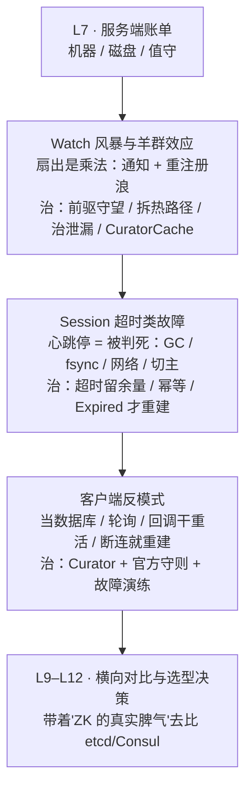

# 第 8 课 · 经典的坑：Watch 风暴、羊群效应与 Session

> 阶段 3 · 成本与风险 · 知识点：Watch 风暴与羊群效应 / Session 超时类故障 / 客户端反模式
>
> 🧭 课程导航：[课程目录](../../../02-课程目录.md) · 上一课：[L7 部署与运维成本：3 节点起步的小集群](lesson-07-部署与运维成本3节点起步的小集群.md) · 下一课：L9《横向对比：ZooKeeper vs etcd vs Consul vs Redis》

## 第一幕 · 场景引入：凌晨三点的连锁告警

集群上线三个月，一直很稳。L7 那三张账单你都付清了：机器 3 台独立故障域、事务日志走专用盘、autopurge 配了、Prometheus 指标接上了、`watch_count` 也设了告警（阈值 10000）。

凌晨三点，告警连环炸：

```text
03:00:12  [ZK]     zk_watch_count 突破 10000（告警线）
03:00:13  [ZK]     zk_packets_sent 尖峰，是 packets_received 的 20 倍
03:00:15  [ZK]     zk_avg_latency 从 2ms 涨到 800ms，outstanding_requests 堆积
03:00:18  [业务]   配置中心客户端大面积超时，服务发现名单刷新失败
03:00:22  [ZK]     zk_num_alive_connections 断崖下跌（连接开始掉）
03:00:25  [业务]   分布式锁大面积"丢失"，两个调度实例同时开跑——双主前兆
```

运维老张第一反应是查服务端：磁盘 fsync 正常、Leader 没换、CPU 没满、三台机器进程全活着。**服务端指标一片祥和，业务却在全线崩溃。**

这就是阶段 3 的第二张账单——**客户端账单**。L7 讲的是集群侧的账（机器、磁盘、值守），这一课复盘的是另一类事故：**服务端没错，是客户端用法把它压垮了**。三种经典死法，正好对应本课三个知识点：

1. **Watch 风暴与羊群效应**：一个热节点变更，瞬间扇出上万次通知 + 上万次重注册读请求
2. **Session 超时类故障**：GC 停顿/网络抖动让会话被判死，临时节点蒸发、锁与选主集体错乱
3. **客户端反模式**：把 ZK 当数据库、轮询代替 Watch、在 watcher 回调里做重活……服务端没错，是使用姿势错了

L5 学 Watch 时埋的三板斧与断连 safe mode、L6 学锁时埋的羊群效应、L7 埋的 `watch_count` 告警——这一课全部收网。

## 第二幕 · 认知冲突：三种"服务端没错"的死法

**败局一："一个节点变了，通知一下而已。"——扇出是乘法，不是加法。**

工程师给全局配置节点 `/config/global` 挂了 watch，全公司 8000 个客户端实例都盯着它。凌晨三点有人推了一次配置变更。算算服务端要干什么：**8000 条通知瞬间发出**（一次扇出）；每个客户端收到通知后按 L5 的三板斧"重读 + 重注册"——**又是 8000 次读请求 + 8000 次 watch 重注册**涌进来。官方对这类场景的定性是：一个被大量客户端 watch 的热 znode 变更时，会产生**扇出式的通知风暴（fan-out notification storm）**；如果节点变更频繁，风暴就按变更频率反复发作，"服务器需要向成千上万个客户端发送事件通知……配置频繁变更时服务器承受巨大压力"。

更狠的是**重连时的重注册浪**：官方 ZOOKEEPER-1416（Facebook 提交的持久递归 Watch 提案）里写着真实痛点——"如果有数千个 znode 被 watch，客户端（重）连时必须发送**数千个 watch 请求**"。他们存了几千个数据库分片的定义，命名服务每次启动或换 watcher 都要发数千个 watch 请求。回到你的事故：03:00:22 连接开始掉，掉完重连，重连就要重注册——**风暴引发掉线，掉线引发更猛的重注册浪，正反馈闭环**。这就是告警里 `packets_sent` 是 `packets_received` 20 倍的原因：服务端在发"客户端没主动要"的通知。

**败局二："进程活着，会话怎么会死？"——心跳停了，账本就销户。**

03:00:25 锁大面积丢失。查业务进程：CPU 正常、没重启、日志没报错。但服务端判它死了。官方原文（L5 已背过）："**会话过期由 ZooKeeper 集群管理，而不是由客户端管理**"。判死只有一个依据——超时窗口内没收到任何消息。而让客户端"发不出消息"的头号元凶不是网络，是 **GC 停顿（stop-the-world）**：进程被冻结几十秒，心跳发不出去，等 GC 结束世界恢复，会话早已被判死，临时节点全被删、锁全被释放。客户端这边"我明明活着"，服务端那边"你早死了"——这是 ZK 最经典的认知错位。

会话一死，连锁反应按 L5 的临时节点生命周期展开：临时节点删 → 锁没了、选主资格没了、服务发现名单里自己消失了 → 所有 watch 这些节点的客户端（别的实例）同时被惊醒 → 又回到败局一的风暴。**Session 批量过期是 ZK 的"羊群效应"总爆发形态**：临时节点集体消失、watch 集体触发、客户端集体重连，Leader 独自扛下全部尖峰。官方运维文献（Netdata ZK 系列）把这称为 ZK 的 thundering-herd failure mode，并点名两类 GC 根因：客户端 GC 停顿超过会话窗口、服务端 GC 停顿。所以 **Curator 默认会话超时设 60 秒**——远高于默认的 4~40 秒窗口上限，就是为了给 GC 留余量（这条默认值本身就是踩坑踩出来的经验）。

**败局三："Watcher 里直接干活，多省事。"——回调线程是单车道。**

客户端同学写了个"高效"实现：watcher 回调里直接查数据库、调下游接口、写本地缓存。压测没问题，上线后在变更高峰期频繁"收不到通知"。真相：ZK 客户端的 **watcher 回调在 EventThread 里串行执行**（L5 提过的"双线程模型"的另半边）——一个回调卡住，后续所有事件排队；通知积压在服务端到客户端的通道里，表现为"通知丢了"或"延迟巨大"。更糟的是，阻塞期间你没法及时重注册 watch，按 L5 官方原文"在收到事件和重新设置 watch 之间存在延迟，你无法可靠看到每一次变更"——**不丢才怪**。官方"Things to Remember"最后一条早就给了行为准则：断连期间收不到任何 watch，所以**用会话事件进入 safe mode（保守模式）**——你的进程该收敛行为，而不是照常狂发请求。

三份败局的病根同源：**把 ZK 的客户端当成"无脑的 TCP 长连接 + 订阅"，忽略了它是一次性信号弹 + 服务端资源 + 单线程回调的组合体**。下面按三个知识点逐一拆解。

## 第三幕 · 层层揭示：风暴、会话与反模式

### 3.1 Watch 风暴与羊群效应：同族，但不是一回事

这两个词常被混用，但它们是一对"同族兄弟"——**共享同一个病根（扇出），却发生在不同层面**：

| | 羊群效应（herd effect） | Watch 风暴（watch storm） |
|---|---|---|
| 发生层 | **配方/逻辑层**：谁被唤醒去干活 | **基础设施层**：通知与请求量本身 |
| 官方定义 | 官方 Recipes 原文："唤醒一大群，而其实只有一个或极少数机器能继续推进"（releasing a herd when in fact only a single or a small number of machines can proceed） | 一个被大量 watch 的热 znode 变更时，产生扇出式通知风暴（fan-out notification storm），并伴随重注册读请求浪 |
| 典型现场 | 31 个备节点同时抢主（L6 事故①）；所有等待者都 watch 同一个锁节点 | 8000 个客户端 watch 同一个配置节点；重连时批量重注册 watch |
| 代价 | 绝大多数唤醒是**无效功**（只有一个能抢到），外加请求涌向唯一 Leader | 通知扇出 + 重注册请求浪，压垮网络/CPU/请求管道，可级联到会话过期 |
| 解法 | **只守望前驱**（L6 已讲：每个节点只被一个客户端 watch，删一个只唤醒一个） | 拆热路径（分片/降低扇出）、修 watch 泄漏、上持久 Watch/Curator Cache |

看清关系：**羊群效应是一种"逻辑上的无效唤醒"，Watch 风暴是"物理上的流量洪水"**。前者往往诱发后者（L6 的抢椅子版 30 轮约 900 次通知就是 O(N²) 级的风暴），但后者也可以独立发生——8000 个客户端盯一个配置节点，每个客户端被唤醒都是"有效"的（都真需要新配置），扇出却是实打实的。

**为什么 ZK 天生容易长风暴？**两个结构性原因：

1. **watch 在服务端本地维护**（官方原文："Watches are maintained locally at the ZooKeeper server to which the client is connected. This allows watches to be light weight to set, maintain, and dispatch"）。轻量是优点，代价是**每条 watch 都要占服务端内存**。官方 JIRA（ZOOKEEPER-1177）给了量化数据：**单个 watch 约 100 字节**；他们的测试场景 1 万个客户端 × 2 万个 znode = 2 亿条 watch，WatchManager 吃掉 1.2G+ 内存、预计要 20G。这个 JIRA 最终在 **3.6.0 修复**（改 bitmap 存储 + 降低锁竞争）。所以 L7 那句 `watch_count > 10000` 告警不是随便写的——它背后是真实的内存与 CPU 成本。
2. **一次性语义导致"触发后必须重注册"**。热节点每变一次 = 一轮"通知扇出 + 重注册读浪"。变更频繁的节点，风暴按变更频率重复发作。

**怎么治？**四味药，按优先级：

1. **配方层：只守望前驱**（L6 已讲，治羊群效应，顺带削掉大部分风暴）。
2. **热路径分片**：不要 8000 个客户端盯 `/services/provider`，改成盯 `/services/provider/instance-1`…`instance-N`，每个客户端只盯自己关心的分片；单个分片变更只通知该分片的订阅者。配套的模式还有**屏障节点（barrier znode）**思路——客户端们盯一个父节点，服务端只在真正需要全体响应时写入一个信号值（而不是给每个客户端各建一个节点），把"万人盯各自节点"收敛成"万人盯一个信号"。若数据本身是"一个整体不可拆"（比如一份完整配置文档），那就换个思路——**别让 8000 个实例直连 ZK**，改成少数几个"配置中继"订阅 ZK、再分发给业务（或干脆用本地缓存 + 版本号轮询兜底）。
3. **治 watch 泄漏**：盯住 `watch_count / 连接数` 这个比值，如果它**持续增长不回落**，就是泄漏。典型成因：每次读都 new 一个 watcher 对象（不复用、不移除）、重连逻辑重复注册、会话关闭没清理。药方：**复用 watcher 对象、用 `removeWatches` 显式退订（3.5.0+）、审计重连逻辑**。
4. **升级到持久 Watch / Curator Cache**：3.6+ 的 `addWatch` 是**服务端自动重注册**，客户端不需要"触发→重读→重注册"这一轮往返。Curator 基于它重写的 **CuratorCache** 效果（Jordan Zimmerman 在 ZOOKEEPER-1416 里贴的基准）：**TreeCache 约 1005 ops/s vs CuratorCache 约 2563 ops/s（2 倍以上）**，且 CuratorCache 只需 **1 个 watcher**，而 TreeCache 需要约 **2 万个**（1 万个节点场景）；每次节点删除 TreeCache 要调 `exists()` 重挂 watch，CuratorCache 一个 ZK 调用都不用发。

> ⚠️ 但持久递归 Watch 是**双刃剑**：它不会因触发而消失，能维持更高的 watch 数量；如果对一棵繁忙子树用 `PERSISTENT_RECURSIVE`，**每个后代节点的每次变更都会发通知**——扇出量可能比单点 watch 还大。递归范围必须按需收紧，别图省事一路 recursive 到底。

### 3.2 Session 超时类故障：一棵排查树

会话被判死只有一个直接原因（超时窗口内服务端没收到任何消息），但诱因一堆。按"谁冻结了心跳"分四大类：

```text
Session 批量过期
├─ ① 客户端 GC 停顿（最常见）：STW 停顿 > 剩余会话窗口 → 心跳发不出
│     官方文献建议：停顿应远小于会话超时；Curator 默认会话超时 60s 正为此
├─ ② 服务端 GC 停顿 / fsync 尖峰：Leader 僵住 → 心跳收不到 / 请求排不上
│     L7 的 fsync.warningthresholdms（默认 1000ms）是这类问题的第一现场
├─ ③ 网络问题：闪断、防火墙/安全组变更、非对称路由、MTU 不匹配、DNS 失败
│     虚拟化/云环境延迟更高更抖，官方明确"5 秒超时过低"
└─ ④ Leader 切换：选举窗口内不可写、请求失败；若切换与过期时间对齐 → 切换是因，过期是果
```

**怎么区分？**看三条线索：

- **服务端日志里的 "Expiring session"**：直接证据，配合 `zk_num_alive_connections` 的 V 形暴跌（掉了又回弹）确认是批量过期；
- **客户端状态迁移**：`SUSPENDED → LOST`（Curator 语义）。官方提醒：服务端指标只看到一半画面，**客户端也要埋点**——记录每次状态迁移与重连尝试；
- **看时间对齐**：过期时刻与 Leader 选举对齐 → 查选举；与 fsync 尖峰对齐 → 查磁盘；与业务发布/流量高峰对齐 → 查客户端 GC。

**CONNECTION_LOSS 与 SessionExpired 的处置差异**（L5 已讲守则，这里补官方 FAQ 的"不确定"本质）：CONNECTION_LOSS **不意味着请求失败也不意味着成功**——官方 FAQ 原话：链路可能在请求到达服务端之后、响应返回之前断开（那 create 其实成功了），也可能在包发出之前就断了（那没成功），"客户端库无法区分，只能返回 CONNECTION_LOSS，程序员必须自己判断是否需要重试"。判断方法（官方给的示例）：**检查要创建的节点是否存在、或检查要修改的 znode 的值**——用业务侧的幂等探活来兜底。而 SESSION_EXPIRED 是"服务端判你死"，官方定性极重："**在一个正常运行的集群里，你本不该看到 SESSION_EXPIRED**"，客户端应视自己为已死并进入恢复；库作者"**不应尝试自动恢复，而应返回致命错误**"。恢复动作（复杂应用）：重建临时节点、重新参与选主、重建已发布状态——**不是重连一下就完事**。

还有一个 L5 埋过的暗坑值得单独拎出来：**陈旧临时节点阻塞重注册**。客户端会话过期 → 重启 → 用新会话去创建同名临时节点路径 → 发现节点还在（旧会话的残留还没被清理或清理有延迟）→ create 报 NodeExists → 注册失败、服务起不来。这是已知问题类（如 ZOOKEEPER-4837，截至 3.9.5 未修复，影响 3.9.2+；更早的 ZOOKEEPER-2919）。**变通做法**：手工删除该陈旧节点再让客户端重建；删之前记下路径、owner sessionId、version，保证删除无歧义。选主/锁这类"同名路径反复注册"的配方尤其要注意。

### 3.3 客户端反模式清单

服务端没错的那些事故，多半能在这张表里找到自己：

| 反模式 | 后果 | 正解 |
|--------|------|------|
| **把 ZK 当数据库/大对象存储** | 整棵树常驻内存，大 value 撑爆堆、拖慢快照与恢复；`jute.maxbuffer` 默认 1MB 上限（L2） | 只存元数据/指针（S3 URL、DB 行 ID），数据放该放的地方 |
| **轮询代替 Watch** | 无谓请求打满 Leader、延迟高 | 用 Watch（或 Curator Cache），本地缓存 + 事件失效 |
| **watcher 回调里做重活**（查 DB、调下游） | EventThread 串行阻塞 → 通知积压/丢失、来不及重注册 | 回调只做轻量操作（置标志/投递队列），重逻辑交业务线程池 |
| **每次读 new 一个 watcher 对象** | watch 泄漏（watch_count/连接数持续增长） | 复用 watcher 对象 + `removeWatches` 显式退订 |
| **在热节点上挂海量 watch** | Watch 风暴（扇出 + 重注册浪） | 拆热路径/分片、减少直连客户端、上持久 Watch |
| **对繁忙子树用持久递归 Watch** | 每个后代每次变更都通知，扇出更大 | 递归范围按需收紧，必要时改用定向单点 watch |
| **会话超时设得太小**（如 4~5 秒） | GC/抖动即误判死亡，云与虚拟化环境尤甚 | 云/虚拟化建议 10~20 秒起；Curator 默认 60 秒 |
| **断连后手动新建会话** | 旧会话的 watch 与临时节点全丢，把"可恢复抖动"放大成"真事故" | 官方守则：**断连不重建，只有收到 SessionExpired 才重建** |
| **忽略 CONNECTION_LOSS 的"结果未知"** | 盲目重试造成重复创建；或不重试造成漏操作 | 幂等设计 + 探活校验（查节点是否存在/值是否为目标值） |
| **不测服务端故障** | 生产第一次遇到分区/宕机才发现应用扛不住 | 官方"常见陷阱"原文：**必须测试 ZK 服务器故障**——用多节点集群、挨个重启，在实验室验证而非生产 |

最后一条值得展开：官方 Programmer's Guide 专门列了一节"ZooKeeper 用户常掉进去的坑"（Gotchas），除了"必须测试服务器故障"，还有两条与本课强相关——**客户端的服务器列表必须与实际集群列表匹配**（客户端列表是集群的子集能跑但不最优，**列了集群里没有的服务器则不行**）；**watch 一个尚未出生的节点时，如果它在你断连期间被创建又被删除，这条通知会永久丢失**（L5 已讲）。

## 第四幕 · 实操演练：事故复盘与三案连判

**演练 A：凌晨三点的复盘（把告警翻译成结论）。**

```text
给定开头那张告警时间线（watch_count 破万 → packets_sent 尖峰 → latency 800ms
→ 业务超时 → 连接断崖 → 锁大面积丢失 + 双主前兆），回答：
① 为什么 packets_sent 是 packets_received 的 20 倍？这个比值说明了什么？
② 连接数为什么会在 03:00:22 断崖下跌？（提示：不是 ZK 主动踢人）
③ 锁"丢失"与"双主前兆"的因果链是什么？服务端到底有没有错？
④ 如果只能做一件事止血，先做哪个？为什么？
```

<details><summary>参考答案（先自己推完再看）</summary>

1. **比值说明是"通知扇出"而非"请求量上涨"**：`packets_received` 是客户端主动发来的请求，`packets_sent` 含服务端主动发出的 watch 通知。后者远超前者 = 服务端在发**客户端此刻并没有请求**的东西——这是判定 Watch 风暴的关键证据（若两者同步上涨，那是请求量问题不是风暴）。
2. **连接断崖是"风暴 → 会话过期"的级联**：通知与重注册浪占满请求管道（`outstanding_requests` 堆积、latency 800ms），心跳响应也跟着变慢甚至超时；同时客户端 GC/超时叠加，一批会话被判死 → 连接被关闭。所以**不是 ZK 踢人，是会话在风暴中批量过期**。
3. **因果链**：GC 停顿/网络抖动或风暴导致心跳受阻 → 会话被判死 → 该会话的临时节点（锁节点、选主节点）被服务端删除 → 锁"没了"；另一个等待者立刻抢到锁 → 而原持有者 GC 醒来仍以为自己持锁（L1 双主之夜同款：**进程停顿 + 租约到期**）→ 两个实例同时干活。服务端**没错**：它严格按"超时未收到消息即判死"执行，锁节点删除也是 L5 承诺的语义。**错在客户端**：GC 停顿超过会话窗口（会话超时配得太小）、且在风暴中让心跳被挤掉。
4. **先止血做什么**：优先**降低扇出**——把热配置路径分片/减少直连 ZK 的客户端数量（或用本地缓存 + 版本号兜底），先让 `packets_sent` 与 `watch_count` 回落，切断"风暴→掉线→重注册浪"的正反馈。会话超时调大（如调到 15~30 秒，或直接用 Curator 默认的 60 秒）是治本项但需滚动重启/发布，属于第二步；真出现双主还要立即停掉其中一个实例并做业务幂等兜底（L1 的教训：技术兜底 + 业务兜底双管齐下）。

</details>

**演练 B：三案连判。**

```text
案1：watch_count 稳定在 5 万，但只分布在 5 个路径上；另一个集群 5 万条
     watch 分布在 100 个路径上。哪个更危险？为什么？用什么命令查热路径、
     有什么风险？
案2：日志里一串 ConnectionLoss 后突然一条 SessionExpired，随后业务报
     "节点已存在"注册失败。三问：这两个错误的本质区别（结果是否已知）？
     收到 Expired 后该做什么？"节点已存在"最可能是什么、怎么破？
案3：同学把服务发现从"客户端直连 ZK 订阅"改成"3 个配置中继订阅 ZK +
     其余实例问中继"，并给 /services 整棵子树上了 PERSISTENT_RECURSIVE
     watch。评价这个改造，并指出新引入的风险。
```

<details><summary>参考答案（先自己推完再看）</summary>

1. **分布在 5 个路径的更危险**：关键比值是"每条被 watch 路径上的 watch 数"——5 万条落在 100 个路径（约 500/路径）对服务发现是正常量级；5 万条落在 5 个路径（约 1 万/路径）就是**羊群候选**，任一热路径变更就是万级扇出。查热路径用 `wchp`（按路径分组）/`wchc`（按会话分组），但**两者都是 O(n)，会遍历整个 watch 表**——在十万级 watch 的服务器上跑 `wchp` 本身就可能引起延迟尖峰。规避：在低峰期跑、**在 Follower 上跑而不是 Leader 上**。
2. **本质区别**：CONNECTION_LOSS 的**结果未知**（官方 FAQ：请求可能已到服务端成功、也可能没发出去，客户端库无法区分），SESSION_EXPIRED 是**服务端已判你死**（临时节点已删、watch 已清）。处置：收到 Expired 才按官方守则**新建会话**，并做完整恢复——重建临时节点、重新参与选主、重建已发布状态（不是重连一下就完事）；库不应自动恢复而应上报致命错误让应用决策。"节点已存在"最可能是**陈旧临时节点阻塞重注册**（ZOOKEEPER-4837 / 2919 一类已知问题）：新会话去建同名路径，旧会话的残留还在。破法：记录路径 + owner sessionId + version 后手工删除该陈旧节点，再让客户端以新会话重建；选主/锁这类"同名路径反复注册"的配方尤其要防这一手。
3. **改造方向对，新风险也实**：把 8000 个直连客户端收敛成 3 个中继，**扇出从 8000 降到 3**，是解决 Watch 风暴的正解（官方建议正是"重新分配热路径上的 watch"，或用屏障节点模式）；中继再向内部分发，ZK 不再是瓶颈。但给整棵 `/services` 上 `PERSISTENT_RECURSIVE` 引入了新风险：**持久递归 watch 不因触发而消失，且每个后代节点的每次变更都会通知**——若 `/services` 下实例心跳/权重频繁变动，通知量可能比原来的单点 watch 更大，而且持久 watch 能维持更高的 watch 计数（内存压力回到 3.1 的第一个结构性原因）。建议：递归范围收紧到真正需要的子树；对"高频变动的子节点"单独评估是否值得递归；同时监控 `watch_count` 与 `packets_sent/received` 比值验证改造效果。

</details>

两道题的手感：**复盘题练"从指标反推因果"（sent/received 比值定风暴、V 形暴跌定批量过期、时间对齐定根因），判案题练"从症状反推机制"（分布定危险度、Expired 定恢复动作、递归 watch 定新风险）**。

## 第五幕 · 体系收束：客户端账单，与阶段 3 的终点



三类坑一张总表：

| 坑 | 根因（一句话） | 治法（一句话） |
|----|--------------|--------------|
| Watch 风暴 | 热节点扇出 = 订阅数 × 变更频率，外加一次性语义引发的重注册浪 | 拆热路径/收敛订阅者；修 watch 泄漏；上持久 Watch 与 CuratorCache（递归范围要收紧） |
| 羊群效应 | 逻辑上唤醒了一群但只有一个能推进（配方层） | 只守望前驱（L6）：每个节点只被一个客户端 watch |
| Session 超时 | 心跳停了服务端就销户，GC 停顿是头号元凶；判死后临时节点与锁全灭 | 超时留足 GC 余量（云/虚拟化 10~20s 起；Curator 默认 60s）；幂等 + Expired 才重建；盯 GC 与 fsync |
| 客户端反模式 | 把 ZK 当数据库/当 TCP 订阅/当回调执行器 | Curator 兜底 + 官方守则（不手动重建、回调只做轻活）+ 必做故障演练 |

本课带走三句话：

1. **扇出是乘法不是加法**：一个热节点的代价 = 订阅数 × 变更频率 ×（通知 + 重注册），而风暴会引发掉线、掉线引发更猛的重注册浪——正反馈要先切断
2. **心跳停了就是死，不管进程多健康**：会话超时必须留足 GC 余量；CONNECTION_LOSS 是"结果未知"要幂等探活，SessionExpired 是"已判死"要走完整恢复
3. **服务端没错不代表你没错**：本课所有事故的 ZK 都严格履行了它的承诺——坑在客户端姿势；生产环境用 Curator、按官方守则写、并且**必须在实验室把服务器故障测一遍**

至此阶段 3（成本与风险）收官：L7 算了**服务端账单**（机器、磁盘、值守——三台小机器 + 专用日志盘 + 三个必改默认值），L8 算了**客户端账单**（风暴、会话、反模式——Curator + 超时余量 + 故障演练）。两张账单合起来回答了立项时的灵魂拷问：**"用 ZK 到底要付出什么？"**——答案是：钱不多，但**姿势要对**；它的坑全都写在官方文档里，只是没人读。

下一阶段（L9–L12）进入**对比与决策**：带着 ZK 的真实脾气（写不可扩展、watch 一次性、会话敏感、JVM + 专用盘）去和 etcd、Consul、Redis 横向比，看 Kafka 为什么另起炉灶搞 KRaft，最后落成一棵**选型决策树**和你能在会上讲的那份《协调服务选型决策》。

### 📇 术语速查卡

| 术语 | 一句话解释 |
|------|-----------|
| Watch 风暴 | 热 znode 变更引发的扇出式通知 + 重注册读请求浪；`packets_sent` 远超 `packets_received` 是其指纹 |
| 羊群效应（herd effect） | 唤醒一大群而只有一个能推进（官方定义）；发生在配方/逻辑层，用"只守望前驱"治 |
| 扇出（fan-out） | 一次变更触发的通知条数 = 该路径上的 watcher 数；订阅数 × 变更频率决定风暴量级 |
| watch 内存成本 | 官方 JIRA 数据：单条约 100 字节；2 亿条可吃掉 GB 级内存（3.6.0 优化存储后改善） |
| watch 泄漏 | `watch_count / 连接数` 持续攀升：watcher 不复用、重连重复注册、会话关闭未清理 |
| `wchp` / `wchc` | 按路径 / 按会话列出 watch 分布；**均 O(n)，高负载下慎跑，优先在 Follower 上跑** |
| 热路径分片 | 把"万人盯一个节点"拆成"各盯各的分片"，把扇出从 N 降到分片内数量 |
| 持久递归 Watch | 3.6+ `addWatch`：不因触发消失、覆盖整棵子树；**后代每次变更都通知，范围要收紧** |
| CuratorCache | 基于持久 Watch 重写的缓存配方：官方基准 2563 vs TreeCache 1005 ops/s，1 个 watcher vs 约 2 万个 |
| EventThread 串行回调 | watcher 回调在单线程里排队执行；回调里做重活会阻塞后续所有事件 |
| safe mode（保守模式） | 官方建议：断连期间收不到任何 watch，进程应收敛行为而非照常狂发请求 |
| GC 停顿致会话过期 | STW 停顿超过会话窗口 → 心跳发不出 → 被判死；Curator 默认会话超时 60 秒正为此 |
| CONNECTION_LOSS | **结果未知**：请求可能成功也可能没发出；官方给的解法是业务侧探活（查节点/查值）+ 幂等 |
| SESSION_EXPIRED | 服务端已判死：临时节点与 watch 全清；官方要求"客户端视自己已死"并做完整恢复 |
| 陈旧临时节点阻塞重注册 | 新会话建同名临时路径撞上旧残留 → NodeExists；已知问题类（ZOOKEEPER-4837/2919），变通是手工删残留 |
| 反模式 | 当数据库 / 轮询代替 Watch / 回调干重活 / 断连就重建会话 / 会话超时过小 / 不测故障 |

### ✏️ 课后思考题（可选）

1. 一个配置节点被 5000 个客户端 watch，每分钟变更 2 次。粗算服务端的"通知 + 重注册"压力量级；如果这 5000 个客户端分散在 50 台机器（NAT 出口只有 5 个 IP），还会撞上 L7 的哪个参数？（提示：5000×2 = 每分钟 1 万条通知，外加约 1 万次重读与重注册读请求；`maxClientCnxns` 默认 60 是**按源 IP**计的——NAT 后 5 个 IP × 60 = 300 条上限，容器/NAT 环境会静默拒绝新连接，且症状表现为"部分客户端连不上"）
2. 为什么 Curator 把默认会话超时设成 60 秒，而不是 ZK 服务端默认协商窗口的 4~40 秒中的某个值？（提示：ZK 服务端会把请求值钳制到 `[2×tickTime, 20×tickTime]`；按这条已学的钳制规则推导，Curator 的 60 秒请求值在默认 tickTime=2000 下会被钳到 40 秒——它争取的就是"尽量大"；而大超时的代价是崩溃后锁与临时节点释放更慢，故障感知迟钝。这是"少误判"与"快感知"的取舍）
3. 你的 watch 回调里必须调用一个耗时 200ms 的下游接口，怎么改才不阻塞后续事件？（提示：回调只置标志位或投递到业务队列，重逻辑交独立线程池；同时注意回调里若还要重读 ZK，别在 EventThread 里发同步请求——L5 三板斧的"重读+重注册"要挪到业务线程，或直接用 CuratorCache 让框架代劳）

## 🚀 下一批接力提示词

> 学完本课后，**复制下面这段文字发给 AI**，即可无缝进入下一课（无需重新描述上下文）：

```
继续学 ZooKeeper。我的学习档案在 zookeeper/00-学习档案.md，
刚学完阶段 3《成本与风险》的课《经典的坑：Watch 风暴、羊群效应与 Session》知识点 Watch 风暴与羊群效应、Session 超时类故障、客户端反模式，
请按大纲继续讲解下一课（课9：横向对比：ZooKeeper vs etcd vs Consul vs Redis）。
```

## 🧭 课程导航

➡️ **下一课**：[L9 横向对比：ZooKeeper vs etcd vs Consul vs Redis](../../4-对比与决策/lessons/lesson-09-横向对比ZooKeeper-vs-etcd-vs-Consul-vs-Redis.md)

📚 **返回目录**：[课程目录](../../../02-课程目录.md)
