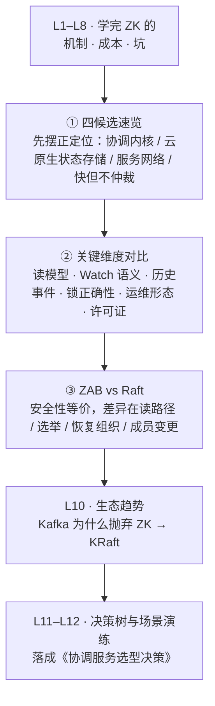

# 第 9 课 · 横向对比：ZooKeeper vs etcd vs Consul vs Redis

> 阶段 4 · 对比与决策 · 知识点：四候选速览 / 关键维度对比 / ZAB 与 Raft 差异
>
> 🧭 课程导航：[课程目录](../../../02-课程目录.md) · 上一课：[L8 经典的坑：Watch 风暴、羊群效应与 Session](../../3-成本与风险/lessons/lesson-08-经典的坑Watch风暴羊群效应与Session.md) · 下一课：L10《生态趋势：Kafka 为什么抛弃 ZooKeeper》

## 第一幕 · 场景引入：一场各说各话的选型会

学完 L1–L8，你已经把 ZooKeeper 从"是什么"（L2）、"凭什么可靠"（L3–L6）到"要付多少成本、有哪些坑"（L7–L8）摸了个透。现在回到最初那个问题：**这东西，我们要不要用？**

架构评审会上，四个人给出了四个答案：

- **老张（大数据组）**："用 ZK，我们 Hadoop、Kafka、Dubbo 都跑在它上面，十年老兵，稳。"
- **小李（云原生组）**："用 etcd，Kubernetes 御用，Go 写的单文件，gRPC 接口，Watch 是流式的，不折腾。"
- **小王（基础设施组）**："用 Consul，自带健康检查、DNS 接口、多数据中心，服务发现开箱即用，还带 Web UI。"
- **小陈（业务组）**："Redis 不就够了？`SET lock NX PX 30000`，一行命令搞定分布式锁，我们一直这么用。"

四个人说的都对——但都对在**各自的场景**里。这场会的症结不是"谁更强"，而是**他们其实在回答四个不同的问题**：老张要的是"协调原语"，小李要的是"给 K8s 存状态"，小王要的是"服务发现 + 健康检查"，小陈要的是"一把能用的锁"。

这就是本课的开场：**"ZooKeeper vs etcd vs Consul vs Redis"是个被问烂了的问题，但绝大多数对比文章都在拿它们的不同维度互相攻击**。要真正比出结论，得先做一件事——把它们放回各自的坐标系。

本课的路线：

1. **四候选速览**：每个东西"到底是什么"，先摆正它的定位（很多人对比了一整页，其实在拿锁和数据库比）
2. **关键维度对比**：同维度横向拉表——一致性、读模型、Watch 语义、数据模型、故障检测、运维形态
3. **ZAB 与 Raft 差异**：把 L4 学的 ZAB 放到 Raft 旁边，看清两个共识协议的真实异同（这是本课最有"内功"的一节）

学完这课，你带走的不是"谁赢"，而是**一套能自己推演的对比坐标系**——这正是 L11 决策树和 L12 场景演练的地基。

## 第二幕 · 认知冲突：四个"看起来都能干"的误区

在摆正定位之前，先拆掉四个流传最广的误判。它们听起来都很有道理，但每个都藏着一个偷换。

**误区一："它们都是 CP，所以差不多。"**

Consul 的官方文档把读分成三种模式（`default` / `consistent` / `stale`），而且 **DNS 查询默认走 stale 模式**；更有意思的是它的架构分层——**Raft 管强一致的服务目录，Serf gossip（基于 SWIM）管成员管理与健康检查传播**，后者是最终一致的。也就是说，Consul 是一个"**底层 CP + 上层部分最终一致**"的混合体。而 ZK 是**读请求直接本地处理**（官方 Internals 原文："Read requests are handled locally at each server"，并给读打上 zxid 标记——这也是 L5 讲"读前可能要 `sync()`"的根因），etcd 默认走 **ReadIndex 线性读**（leader 先确认自己还是 leader 再读）。

所以"都 CP"这个说法把**默认读模型**这个关键差异抹平了：ZK 默认读可能稍滞后、etcd 默认读线性、Consul 三档可选且 DNS 默认陈旧。**一致性不是一个布尔值，是一组可配置的档位**。

**误区二："Redis 也能做分布式锁，所以 Redis 也是协调服务。"**

这是最危险的一个。Redis 官方的分布式锁文档自己就写了一个 **"SAFETY VIOLATION"** 的大字标题，描述这个场景：客户端 A 在主节点拿到锁 → 主节点在把 key 同步给副本前崩溃 → 副本被提升为主 → 客户端 B 拿到同一把锁。官方定性：**基于故障转移的实现不满足互斥性**。

那 Redlock（多独立主节点 + 多数派）呢？Redis 官方介绍了这个算法，但在页面末尾留了一段"关于一致性的免责声明"，**明确建议你去读 Martin Kleppmann 的分析和 antirez 的回应**——这是官方文档里非常罕见的"我们对自己的安全性有公开争论"的坦白。Kleppmann 的核心论证（L1、L6 都引过他的时间线）是：Redlock 依赖**有界网络延迟、有界进程暂停、有界时钟漂移**这三条时序假设，而它又不提供 fencing token，所以对"正确性"场景不安全。antirez 的反驳也很硬核：**"获取锁之后客户端被暂停、锁过期、恢复后继续写"这个问题不是 Redlock 独有，ZK 的会话锁一样会中招**——他甚至亲自把这套 NPC 异常套在 ZK 临时节点锁上推演了一遍（客户端 1 建临时节点 /lock → GC 卡住 → 心跳断、临时节点被删 → 客户端 2 建 /lock 成功 → 客户端 1 GC 结束仍以为自己持锁）。这一刀在 L6 我们已经认下了：**ZK 锁"也不例外"，它的优势在 fencing 号牌（zxid/sequence 单调递增可校验），不在"永不失效"**。

**误区三："etcd 就是云原生的 ZooKeeper，直接平替。"**

两者确实高度同构——都是强 Leader、多数派、为协调而生。 Rutgers 的分布式系统课程讲义把这层关系说得很直白：**etcd 在多数新项目里取代 ZK，是运维原因而非正确性原因**——"两者都强一致，都用共识（Raft vs Zab），安全性和活性保证等价；差别在开发者体验：etcd 有原生 gRPC/HTTP，ZK 要专用客户端库 + JVM 运维开销；etcd 的 watch 是持续流，ZK 的是一次性要重注册"。

但"平替"忽略了三处**结构性差异**：数据模型（ZK 是**层级 znode 树**，etcd 是**扁平 key 空间**，后者没有"父节点"概念，靠前缀查询和 range watch 模拟目录）；历史版本（etcd 有 **MVCC + revision**，可以"从某个 revision 开始 watch"，ZK 没有历史版本）；以及 ZK 特有的**临时节点 + 会话**语义 vs etcd 的 **lease（租约）**。（上面这段"运维原因而非正确性原因"的判断引自 Rutgers 大学分布式系统课程讲义，属**教学二手资料**而非官方一手文档，但它与官方事实完全自洽——etcd 官方 API guarantees 与 ZK 官方 Internals 确实都宣称各自的强一致保证。）

**误区四："Consul 有健康检查和多数据中心，功能最强，那就选它。"**

功能多不等于适配。Consul 的设计取向是**"服务网络平台"**（官方定位：service networking solution，提供服务发现、服务网格、身份鉴权、L7 流量管理）。它的强项（健康检查、DNS、多 DC、UI）在"服务发现"场景是真优势；但如果你要的是**分布式锁/选主**这类协调原语，Consul 的 session + KV 锁机制在**时序假设上和 Redis 锁同类**（依赖 TTL 与会话存活），并没有 ZK/etcd 那种共识层的全序保证。

更实际的一点：**Consul 自 2023 年 9 月后的版本改用 BUSL 1.1 许可证**（源可用，但按 OSI 定义不算开源），如果你的组织有严格的"仅开源"政策或要把 Consul 作为托管服务卖给客户，这是一条硬约束（etcd 与 ZK 都是 Apache 2.0）。

四个误区一个病根：**把"能干这件事"等同于"适合干这件事"**。Redis 能存锁，但它的复制是异步的；Consul 能当 KV，但它的锁不在共识层；etcd 能平替大部分 ZK 用法，但数据模型和历史语义不同；ZK 能当服务发现，但它没有内置健康检查（L6 讲过：ZK 靠临时节点判活，"失联即不健康"这一种信号）。

## 第三幕 · 层层揭示：速览、对比与协议差异

### 3.1 四候选速览：先把每个东西放回它的坐标系

| | ZooKeeper | etcd | Consul | Redis |
|---|---|---|---|---|
| **一句话定位** | 分布式**协调内核**（官网：a coordination kernel） | 分布式**强一致 KV 存储**（官网：a distributed, reliable key-value store for the most critical data） | **服务网络平台**（服务发现 + 服务网格 + KV） | 内存数据结构存储（缓存/消息队列/锁的"兼职选手"） |
| 诞生 | 2007 前后（Yahoo → ASF） | 2013（CoreOS，现 CNCF） | 2014（HashiCorp） | 2009 |
| 共识协议 | **ZAB** | **Raft** | **Raft** + Serf gossip | 无（主从异步复制；集群分片无共识） |
| 数据模型 | **层级 znode 树**（有父子、有四种节点类型） | **扁平 key 空间**（字节串，靠前缀模拟目录）+ MVCC/revision | KV + 服务目录（catalog）+ 健康检查 | 多种数据结构（string/hash/list/set/zset…） |
| 典型主场 | Hadoop / Kafka(旧) / HBase / Dubbo | **Kubernetes**（唯一元数据存储） | 微服务服务发现、服务网格、多 DC | 缓存、会话、排行榜、轻量锁 |

一句话记住它们的"人格"：**ZK 是"协调原语专家"，etcd 是"云原生状态存储"，Consul 是"服务网络管家"，Redis 是"快，但别拿它当仲裁者"**。

这个表已经能解释选型会上的分歧了：老张要协调原语 → ZK；小李要给 K8s 存状态 → etcd（这甚至不是选择题，K8s 只认 etcd）；小王要服务发现 → Consul；小陈要一把锁 → Redis（但得先问一句"这把锁丢了会怎样"）。

### 3.2 关键维度对比：同维度横拉

下面这张表是本课的核心工具，**每个格子都能在 L1–L8 或官方原文里找到出处**：

| 维度 | ZooKeeper | etcd | Consul | Redis |
|------|-----------|------|--------|-------|
| **CAP 取向** | CP（少数派拒写，L2/L4） | CP（严格可串行化） | 底层 CP + gossip 层最终一致；读三档可调 | 主从异步复制，**偏向 A** |
| **默认读模型** | **本地读**（可能稍滞后，严格场景 `sync()`，L5） | **线性读**（默认 ReadIndex 确认 leader 身份） | `default`（leader 租约，理论上可能微陈旧） / `consistent`（与法定人数确认）/ `stale`（任意节点，可能陈旧） | 读主；主从复制异步 |
| **Watch 语义** | **一次性触发**，触发后须重注册（3.6+ 有持久 watch 补丁）；官方明说"无法可靠看到每一次变更"（L5/L8） | **流式持续 watch**，且 Ordered / Unique / **Reliable**（不丢子序列）/ Atomic / **Resumable**（可按 revision 断点续传） | **阻塞查询（blocking query）**，基于 index 长轮询 | 键空间通知（**非可靠投递**，断连期间事件丢失） |
| **历史事件** | 无（只有当前值 + 版本号） | **有**（MVCC + revision，可从历史 revision 读/watch） | 无 MVCC（有 Raft index 用于阻塞查询） | 无 |
| **"临时"语义** | **临时节点 + 会话**（心跳维持，会话过期即删；L5） | **lease 租约**（TTL + keepalive，租约到期删除绑定 key） | session（TTL，也有健康检查驱动） | `SET NX PX` 过期时间 |
| **锁的正确性** | 共识层全序 + **单调递增序号可当 fencing 号牌**（L6）；但会话过期 NPC 问题"也不例外" | 共识层 + **revision 可作 fencing token**，官方 lease 文档专门讲如何正确实现锁 | session + KV 锁，依赖 TTL 与会话存活 | 单实例锁：**官方定性 SAFETY VIOLATION**（故障转移丢锁）；Redlock：安全性有公开争论 |
| **健康检查** | 无内置（靠临时节点/会话判活这一种信号） | 无内置（用 lease 自己搭） | **内置**（HTTP/TCP/脚本/TTL 多种，官方强项） | 无 |
| **接口** | 自定义 TCP 二进制协议 + 专用客户端（Curator 兜底） | **gRPC + HTTP/JSON**（任何语言直连，curl 都能用） | HTTP/JSON + **DNS** | RESP 协议 |
| **多数据中心** | 无原生支持 | 无原生（需手工/单集群延展） | **原生**（WAN gossip 联邦，每个 DC 独立 Raft 域） | 无 |
| **运维形态** | **JVM** + 专用事务日志盘 + 3/5 节点（L7） | Go **单二进制**，内置存储（bbolt） | Go 单二进制 + **每个节点跑 agent** | 极简，但主从/集群需额外组件 |
| **许可证** | Apache 2.0 | Apache 2.0 | **BUSL 1.1**（2023-09 后，非 OSI 开源） | BSD-3 / RSALv2+SSPLv1 双许可等（视版本） |

**怎么读这张表？** 三句口诀：

1. **看 Watch 那一行**：这是"配置中心/服务发现"场景的分水岭。ZK 的一次性语义是 L8 风暴事故的根源，etcd 的 Resumable 流式 watch 天然免疫"重注册浪"。
2. **看"锁的正确性"那一行**：这是"要不要用 Redis 做锁"的裁决依据——不是性能问题，是**模型问题**。
3. **看"运维形态"那一行**：这是 L7 三张账单的延续——ZK 要 JVM + 专用盘，etcd/Consul 是 Go 单文件。**大多数团队选 etcd 不选 ZK，选的就是这一行**（Rutgers 讲义原话：是运维原因，不是正确性原因）。

### 3.3 ZAB 与 Raft：同宗同源，两条岔路

这是本课最"内功"的一节。L4 学过 ZAB，现在把它放到 Raft 旁边。

**先看共同点（它们为什么是同一类东西）**：两者都是**强 Leader + 多数派 + epoch/任期**的模型，都保证"已提交的日志不会丢"，安全性都建立在"两个多数派必有交集"上。Raft 论文（Ongaro & Ousterhout, USENIX ATC 2014）的设计目标是把共识拆成三个可理解的子问题：Leader 选举、日志复制、安全性。ZAB 的官方定位（Apache ZooKeeper Internals）是"**原子广播**"——保证 reliable delivery（一个 server 投递了，所有 server 终将投递）、total order（全局定序，由 **zxid** 体现）、causal order（因果顺序）。**一个强调"状态机复制"，一个强调"事务定序广播"，这是设计目标的第一个分岔。**

**再看差异（四条，按重要性排序）**：

**差异一：读请求谁处理（最影响使用体验）。** 官方 Internals 原文说得很清楚："**Read requests are handled locally at each server**"，读就是本地内存操作，不打磁盘、不跑协议——这是 ZK 读性能极好的根本原因（L4 的"读可扩展、写不可扩展"）。etcd 默认线性读要走 ReadIndex（leader 记录 commitIndex → 向多数派发心跳确认自己仍是 leader → 等状态机应用到该 index → 才读），**多一次往返换线性一致**；它同时提供**每次读请求可带**的 `serializable=true` 选项，走本地读（可能读到陈旧值）来换低延迟与高吞吐——这是**调用方按需选择**，不是改服务端配置。**一句话：ZK 默认快但可能微滞后，etcd 默认线性但慢一点，两者都能反向配置（ZK 用 `sync()` 补强，etcd 用 `serializable` 降级）。**

**差异二：选举机制——"主动靠拢" vs "被动筛选"。** ZAB 用 **Fast Leader Election**：节点广播选票 `(myid, zxid, electionEpoch)`，收到更优选票就**主动改投并重新广播**，不断向"数据最新者"收敛，直到多数派聚焦同一节点；比较规则是**先比 zxid（数据新旧），相同时比 myid（打破平局）**。Raft 用**随机超时（典型 150–300ms）+ 每任期一票、先到先得**，投票者会**主动拒绝日志比自己旧的 candidate**。目标相同（选数据最新的节点），路径不同：ZAB 是"不断 PK 靠拢"，Raft 是"随机错开 + 选举限制筛选"。Raft 的消息数更少、选举更快；ZAB 的 zxid 把"任期+序号"压进一个 64 位整数，**比较新旧就是一次整数比较**，非常简洁。

**差异三：恢复阶段的组织方式。** ZAB 明确划分 **崩溃恢复（Leader 选举 + 数据同步）+ 消息广播** 两个阶段，且**新 Leader 必须先完成数据同步（多数派对齐）才对外服务**——对齐方式有三种：`DIFF`（补缺失事务）/ `TRUNC`（截断 Follower 多出来的未提交日志）/ `SNAP`（落后太多，直接发快照）。Raft 没有独立的"同步阶段"，Leader 一上任就直接工作，靠 `AppendEntries` 的一致性检查**边服务边把落后的 Follower 拉齐**。**取舍很清楚：ZAB 恢复慢一点，但 Leader 开始服务时多数派是干净的；Raft 恢复快，但部分 Follower 可能短暂滞后。**

**差异四：成员变更。** Raft 有**联合共识（Joint Consensus）或单节点变更**的标准机制。ZK 在 **3.5.0 之前没有动态成员变更**，改配置要停机改文件重启（L7 讲过的"manually intensive and error-prone"）；3.5.0 之后才有 **reconfig**（动态配置存于 `/zookeeper/config`，官方定性"立即执行，就像其他操作一样"）。

**还有两个值得知道的细节**：

- **日志方向**：Raft 是严格的 **Leader → Follower 单向**；ZAB 在新 Leader 晋升时会通过 `NEWEPOCH` **收集所有 Follower 的历史提案**来生成初始历史——也就是说 ZAB 允许"新 Leader 参考 Follower 的数据"。
- **未提交事务的态度**：对上一任 Leader 留下的"状态不明的日志"，**Raft 视其为未提交**（要等当前任期提交新日志时顺带确认），**ZAB 视其为已提交**（新 Leader 认为自己最权威，用 DIFF 补发给多数派，在新 epoch 中正式提交）。

**最重要的一句话：两者的安全性在同一故障模型下等价。** 差异在活性策略、恢复组织和工程可理解性，不在"谁更正确"。所以**选型时不要把"ZAB vs Raft"当成决策依据**——真正该看的是上一节那张表里的 Watch 语义、读模型、运维形态与生态位。（Rutgers 讲义的说法更直接：etcd 取代 ZK 是**运维原因**，不是正确性原因。）

## 第四幕 · 实操演练：把对比表用起来

**演练 A：给四个需求各配一个候选（口述即可，关键是说清"为什么不是其他三个"）。**

```text
需求1：Kubernetes 集群的元数据存储（Pod/Service/ConfigMap/Secret）
需求2：Dubbo 微服务注册中心（Java 栈，需要服务上下线感知）
需求3：秒杀场景的库存扣减互斥（每秒上千次，临界区极短）
需求4：跨 3 个机房的全局服务发现 + 健康检查（要 DNS 接入、要 UI 可看）
```

<details><summary>参考答案（先自己推完再看）</summary>

1. **需求 1 → etcd，且这不是选择题**。Kubernetes 的控制面只写 etcd，其 `resourceVersion` 乐观并发、List-Watch 控制器模式，全都建立在 etcd 的 **MVCC revision + 可靠流式 watch** 上。ZK 做不到的关键点正是这两条：**没有历史版本**（无法"从 revision N 开始 watch"）、**watch 是一次性的**（控制器重连就要重注册，正是 L8 风暴的成因）。Consul 的阻塞查询基于 index 但精度不如 revision 模型；Redis 无共识层。所以 K8s 选 etcd 是**模型匹配**，不是"etcd 更快"。
2. **需求 2 → ZooKeeper（配 Curator）**。Dubbo 生态原生支持 ZK 注册中心，`/dubbo/服务名/providers/` 下挂临时节点，会话断即摘除——这正是 L6 学的服务发现配方。为什么不是 Consul？功能上 Consul 更强（自带健康检查），但**引入一个新组件 vs 复用已有 ZK** 的运维账要算（L7 的 TCO）；且 Dubbo 的 ZK 集成是现成的。为什么不是 etcd？Dubbo 对 etcd 的支持深度不如 ZK，且团队是 Java 栈（Curator 成熟）。
3. **需求 3 → Redis（但要限定场景）或 etcd，几乎不选 ZK**。这是 L6 埋的那道题的答案：**高频短临界区（每秒上千次）不适合 ZK 锁**——ZK 锁每次获取都是一次写（走共识、落事务日志、fsync），Leader 是写吞吐天花板（L4），撑不住这个频率；而且 ZK 会话超时窗口（默认 4~40 秒）相对于"毫秒级临界区"太粗糙。正解是：**如果丢锁只是"多扣一点/多卖一点"的效率问题，用 Redis 单实例 `SET NX PX` + Lua 释放 + 业务幂等兜底**（Kleppmann 也认为效率锁用单 Redis 就够，Redlock 是"非驴非马"）；**如果丢锁会导致数据损坏，则必须在资源侧做幂等/版本号 CAS，或换 etcd**（etcd 锁约 5–10ms 一次获取，且 revision 可作 fencing token）。ZK 锁适合的是**低频、长临界区、要强保证**的场景（如主备切换、定时任务选主）。
4. **需求 4 → Consul**。这是唯一一个 Consul 有结构性优势的场景：**原生多数据中心**（WAN gossip 联邦，每个 DC 独立 Raft 域，请求转发到正确的 leader）、**内置健康检查**（HTTP/TCP/脚本/TTL）、**DNS 接口**（老系统零改造接入）、**自带 Web UI**。ZK/etcd 都没有原生的多 DC 与健康检查。注意两点：DNS 查询默认 stale（要强一致得改 `dns_config.allow_stale=false` 或走 consistent 模式的 HTTP API）；以及 **BUSL 1.1 许可证**要过一遍法务。

</details>

**演练 B：三案连判（机制层推理，不是背结论）。**

```text
案1：团队把 ZK 配置中心迁到 etcd，压测发现"配置变更后客户端感知延迟更低、
     且 ZK 时代重连时的请求尖峰消失了"。用 Watch 语义差异解释这两个现象，
     并指出迁移后必须新增的一个运维动作。
案2：同学用 Consul 的 session + KV 实现了一把分布式锁，压测无重复持锁。
     他据此认为"Consul 锁和 ZK 锁一样安全"。你怎么评价？关键要问清什么？
案3：有人主张"ZAB 和 Raft 安全性等价，所以把 ZK 换成 etcd 时，
     应用层锁/选主逻辑一行都不用改"。指出这个推论错在哪（至少两点）。
```

<details><summary>参考答案（先自己推完再看）</summary>

1. **现象解释**：①**感知延迟更低**——ZK 的 watch 是一次性的，客户端收到通知后必须"重读 + 重注册"才拿到新值；这多一次往返。etcd 的 watch 是**流式**的，事件里**直接携带变更后的 KV**（`prev_kv` 还能带上旧值），省掉这次往返。②**重连尖峰消失**——正是 L8 的"重注册浪"：ZK 客户端重连时要为所有 watch 重新发注册请求（ZOOKEEPER-1416：数千 znode 被 watch 时重连要发数千个 watch 请求）；etcd 的 watch 是 **Resumable** 的——断线后可以用"上次收到的 revision"续传，不需要重新枚举所有 key。**必须新增的运维动作：compaction（压缩）+ 监控 revision 历史窗口**。etcd 保留历史版本是有代价的：不压缩 bbolt 会一直涨（默认配额 2GB，超了会进只读告警状态），而压缩太频繁又增加锁竞争；同时 watch 的 Resumable 只在"revision 还在历史窗口内"时成立——**如果客户端落后太多、想续传的 revision 已被压缩，watch 会被取消（响应里 `compact_rev` 提示），客户端必须做全量重建**。这是 ZK 时代完全没有的一类运维项。
2. **评价：压测没复现 ≠ 安全**。Consul 的 session 锁依赖 **TTL 与会话存活**来判定持有者死亡，这在**时序假设上和 Redis 锁同类**——它不在共识层为"锁的获取顺序"提供全序编号。ZK/etcd 的关键优势是**能拿到单调递增的 fencing 号牌**（ZK 的 sequence / zxid，etcd 的 revision），让**资源侧**拒绝旧持有者的迟到写入（L6 的号牌方案）。要问清三件事：①**这把锁保护的资源能不能校验号牌**（能校验 → 强保证成立；不能校验，比如写一个不支持 CAS 的文件或调一个没有版本号的 HTTP 接口 → 那 ZK/etcd 的优势也发挥不出来，L6 原话："号牌不是免费的"）；②**临界区多长、有没有 GC/暂停风险**（有 → 哪怕是 ZK 锁也会中 NPC，L6 认过这一刀）；③**Consul 读走的是哪一档**（默认 `default` 用 leader 租约，理论上可能读到微陈旧的值——对锁这种要强一致的场景，应该用 `consistent` 模式）。
3. **推论错在至少三点**：①**数据模型不同**——ZK 是层级树（有父子、有 `create -s` 顺序节点、有临时节点绑定会话），etcd 是扁平 key 空间，**没有"父节点"、没有顺序节点原语**。ZK 的选主/锁配方（L6）建立在"临时顺序节点 + 只守望前驱"上，迁移到 etcd 必须**重写为 lease + revision CAS 事务**的形式，不是"一行不改"。②**故障检测语义不同**——ZK 是**会话**（心跳维持，会话过期删临时节点），etcd 是 **lease**（TTL + keepalive，租约到期删绑定 key）；对应的客户端状态机与恢复逻辑完全不同（ZK 有 CONNECTION_LOSS/SessionExpired 那套守则，L5/L8）。③**Watcher 语义不同**——L6 的"只守望前驱"依赖 ZK 的一次性 watch，etcd 是流式 watch + 全量事件流，**"只唤醒一个等待者"这个羊群效应解法在两边实现方式不一样**。④补充：**Watch 的投递保证不同**（ZK 明确"不保证看到每次变更"，etcd 保证 Reliable/Resumable），所以上层"收到通知就认为状态同步了"的假设在两边强度不同。

</details>

两道题的手感：**配需求题练"场景 → 模型匹配"（不是比谁强，是比谁的模型对得上），判案题练"从现象反推机制"（延迟低→省往返、尖峰消失→可续传、压测无重复≠安全→问时序假设与 fencing）**。

## 第五幕 · 体系收束：对比坐标系，与阶段 4 的开篇



本课三张表，各记各的：

1. **速览表**记"人格"：ZK 是协调原语专家，etcd 是云原生状态存储，Consul 是服务网络管家，Redis 是快但别当仲裁者
2. **对比表**记"三行定生死"：**Watch 语义**（配置/发现的命门）、**锁的正确性**（要不要用 Redis 的裁决依据）、**运维形态**（大多数团队选 etcd 的真实理由）
3. **协议表**记"一句话"：**ZAB 与 Raft 安全性等价，差异在活性与工程组织，别拿它当选型依据**

本课带走三句话：

1. **先摆正定位再对比**——拿锁和数据库比是维度错误；"都能干"不等于"都适合"
2. **一致性不是布尔值，是一组档位**——ZK 本地读（可 `sync()`）、etcd 线性读（可降级 serializable）、Consul 三档（DNS 默认 stale）；真正决定体验的是**默认档**是什么
3. **ZAB 与 Raft 安全性等价**——etcd 取代 ZK 是**运维原因**（单二进制 vs JVM+专用盘、gRPC vs 专用客户端、流式 watch vs 一次性），不是正确性原因；这也预告了 L10 的主题：连 Kafka 这种 ZK 的超级用户，最后也为了运维与架构自主性走向了 KRaft

至此阶段 4（对比与决策）开篇：你已经有了**一套自己能推演的对比坐标系**。下一课（L10）看一个真实的"用脚投票"案例——**Kafka 为什么抛弃 ZooKeeper**，从 2.8 预览到 3.3 生产可用再到 4.0 移除，把 KRaft 的动机、时间线与社区现状讲清楚。然后 L11 落成**选型决策树**，L12 在三个真实场景里演练，终点是你能在会上讲的那份《协调服务选型决策》。

### 📇 术语速查卡

| 术语 | 一句话解释 |
|------|-----------|
| 协调内核（coordination kernel） | ZK 官网对自己的定位；提供协调原语而非数据存储 |
| ZAB vs Raft 安全性等价 | 同故障模型下两者安全性保证相同，差异在活性策略与工程组织 |
| 本地读 + zxid | ZK 读在连接的那台机器上直接处理并打上 zxid，可能微滞后；严格场景读前 `sync()` |
| ReadIndex 线性读 | etcd 默认读方式：leader 先与多数派确认自己仍是 leader 再读，多一次往返换线性一致 |
| Consul 三档读 | `default`（leader 租约）/ `consistent`（与法定人数确认）/ `stale`（任意节点）；**DNS 默认走 stale** |
| Serf gossip（SWIM） | Consul 的成员管理与故障检测层，最终一致；与强一致的 Raft 目录层各管一摊 |
| MVCC + revision | etcd 保留历史版本，全局单调递增 revision 是 watch 续传与 fencing token 的基础 |
| Resumable watch | etcd watch 可用"上次 revision"断点续传；落后到 revision 已被压缩则被取消 |
| lease（租约） | etcd 的 TTL 机制，绑定 key，租约到期自动删除——对应 ZK 的临时节点 + 会话 |
| Fast Leader Election | ZAB 选举：广播 `(myid, zxid, epoch)`，遇更优选票主动改投靠拢，先比 zxid 再比 myid |
| 随机选举超时 | Raft 选举：150–300ms 随机超时 + 每任期一票，投票者主动拒绝日志更旧的 candidate |
| DIFF / TRUNC / SNAP | ZAB 恢复期数据同步三方式：补缺失 / 截断多余未提交 / 落后太多发全量快照 |
| 联合共识（Joint Consensus） | Raft 的成员变更机制；ZK 3.5.0 前无动态成员变更，改配置需停机重启 |
| SAFETY VIOLATION | Redis 官方文档对"主从异步复制导致故障转移丢锁"的定性用语 |
| Redlock | Redis 官方多节点锁算法（N 个独立主节点取多数派）；官方页面附"一致性免责声明"建议读 Kleppmann 与 antirez 的争论 |
| fencing token（号牌） | 单调递增令牌，资源侧校验并拒绝过期令牌的写入；ZK 用 sequence/zxid，etcd 用 revision |
| NPC 问题 | Network delay / Process pause / Clock drift；antirez 指出它同样击中 ZK 会话锁 |
| BUSL 1.1 | Consul 2023-09 后采用的源可用许可证（非 OSI 开源）；etcd 与 ZK 均为 Apache 2.0 |

### ✏️ 课后思考题（可选）

1. 你的团队要把 ZK 配置中心迁到 etcd。列出**三处必须重写的应用层逻辑**（提示：①层级树 + 顺序节点的选主/锁配方 → lease + revision CAS 事务；②会话状态机（CONNECTION_LOSS/SessionExpired）→ lease keepalive 与租约续期逻辑；③一次性 watch 的"重读 + 重注册"→ 流式 watch + `prev_kv`，并新增 compaction 与"revision 被压缩需全量重建"的处理分支）
2. 同样是"服务发现"，ZK 靠**临时节点**（失联即摘除），Consul 靠**主动健康检查**（HTTP/TCP/脚本/TTL 多种信号）。各举一个"另一种方式会误判"的场景（提示：ZK 判活信号单一——进程还在但**已经僵死/GC 卡死**时，会话可能还活着或已超时，取决于暂停时长，而它**发现不了"进程活着但服务已经不可用"**（比如端口还在但依赖的 DB 挂了）；Consul 的检查本身也可能失败——**网络抖动导致健康检查误判下线**，把健康实例摘掉，所以生产上要配好检查间隔与临界值）
3. 为什么"ZAB 与 Raft 安全性等价"这个结论，反而是**不要把协议差异当选型依据**的理由？那选型到底该看什么？（提示：既然安全性等价，那么差异只剩下活性策略、恢复组织、成员变更这些**工程属性**——它们影响的是"恢复快慢""好不好运维"，不是"会不会出错"。真正决定选型的是**上一层的模型与生态**：Watch 语义、数据模型、历史事件、读模型默认值、运维形态、生态绑定（K8s 只认 etcd）、团队栈与许可证。这也是本课那张对比表按"维度"而非按"协议"组织的原因）

## 🚀 下一批接力提示词

> 学完本课后，**复制下面这段文字发给 AI**，即可无缝进入下一课（无需重新描述上下文）：

```
继续学 ZooKeeper。我的学习档案在 zookeeper/00-学习档案.md，
刚学完阶段 4《对比与决策》的课《横向对比：ZooKeeper vs etcd vs Consul vs Redis》知识点 四候选速览、关键维度对比、ZAB 与 Raft 差异，
请按大纲继续讲解下一课（课10：生态趋势：Kafka 为什么抛弃 ZooKeeper）。
```

## 🧭 课程导航

➡️ **下一课**：L10《生态趋势：Kafka 为什么抛弃 ZooKeeper》（待开讲，发送上面的接力提示词即可开始）

📚 **返回目录**：[课程目录](../../../02-课程目录.md)
