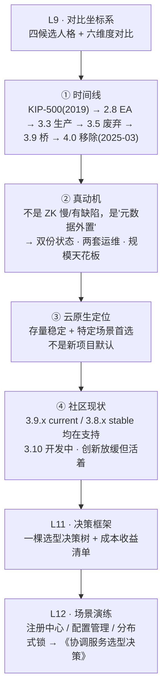

# 第 10 课 · 生态趋势：Kafka 为什么抛弃 ZooKeeper

> 阶段 4 · 对比与决策 · 知识点：Kafka 去 ZK 时间线 / 云原生时代的定位 / 社区现状
>
> 🧭 课程导航：[课程目录](../../../02-课程目录.md) · 上一课：[L9 横向对比：ZooKeeper vs etcd vs Consul vs Redis](../lessons/lesson-09-横向对比ZooKeeper-vs-etcd-vs-Consul-vs-Redis.md) · 下一课：L11《决策框架：一棵选型决策树》

## 第一幕 · 场景引入：一封感谢信，和一次分手

学完 L9，你手里有了一张四候选对比表，知道了"ZK 是协调原语专家、etcd 是云原生状态存储"。这时候翻开 Kafka 4.0 的官方发布公告，你会看到一件有点意外的事——

公告第一句宣布"这是**第一个完全不依赖 Apache ZooKeeper 运行**的主版本"，紧接着却写了一段近乎温情的致谢：

> "我们想借此机会向 ZooKeeper 社区表达感谢，说一声谢谢！**ZooKeeper 作为 Kafka 的骨干支撑了十多年**，它把 Kafka 服务得非常好。如果没有它，Kafka 大概率不会是今天这个样子。我们对此不敢视为理所当然，并高度珍视社区为构建 ZooKeeper 投入的全部心血。谢谢！"

感谢完，转身把 ZooKeeper 的代码全部删掉。4.0 的发布说明里躺着几十条 `Remove ...` 的提交：`Remove KafkaController`、`Remove ZooKeeperClient`、`Remove AdminZkClient`、`Remove ZkData`、`Remove zookeeper dependencies in build.gradle`……

这就有意思了。**一个被感谢了十年的组件，为什么非要被换掉？换掉的理由到底是什么？ZK 是被"抛弃"了，还是只是"完成使命"？**

更要紧的是——**你在学 ZooKeeper，这件事对你意味着什么？** 如果连 Kafka 这样最著名的用户都撤了，ZK 是不是要凉了？现在还该不该学、该不该用？

这就是本课要回答的。路线是三条：

1. **Kafka 去 ZK 时间线**：从 KIP-500 到 4.0 移除，看清楚每一步发生了什么、动机是什么
2. **云原生时代的定位**：ZK 在 K8s 时代站在哪里，哪些盘还在、哪些盘没了
3. **社区现状**：ZK 项目本身死没死？版本线、活跃度、还有谁在依赖它

学完这课，你要能回答那句最关键的话：**"Kafka 不用 ZK 了，是因为 ZK 不行吗？"**——答案是"不是"，而说清楚为什么不是，恰恰是这课的价值。

## 第二幕 · 认知冲突：四个"听起来很合理"的误读

先把四个最常见的误读摆出来。它们流传很广，每个都有一半的道理，但每个都把结论推错了地方。

**误读一："ZK 撑不住 Kafka 的规模，所以被抛弃——是性能问题。"**

规模确实是导火索，但**不是 ZK 本身慢**。KIP-500 原文点出的病灶是**架构性的**：元数据放在 Kafka 之外，导致"**两份状态、两个视图**"。原文写得很具体：

> "当 controller 把状态变更通知（如 LeaderAndIsrRequest）推给其他 broker 时，**可能有些 broker 拿到了部分变更、没拿到全部**；虽然 controller 会重试几次，但最终会放弃，**这可能让 broker 处于发散状态**。更糟的是，尽管 ZooKeeper 是记录存储（store of record），**ZK 里的状态常常和 controller 内存里的状态对不上**。"

为什么会这样？KIP-500 接着给了一段你学完 L5、L8 会觉得"这不就是我刚学的坑吗"的描述：

> "**controller 没有通用办法去跟踪 ZK 的事件日志**。虽然 controller 可以设置一次性 watch，**出于性能原因 watch 的数量是受限的**；当 watch 触发时，它**只告诉你状态变了，不告诉你现在是什么状态**；等 controller 重新读取 znode 并重新设置 watch 时，**状态可能已经和 watch 刚触发时不一样了**。**如果没设上 watch，controller 可能根本不会得知这次变更**。在某些情况下，**重启 controller 是解决这个差异的唯一办法**。"

读到这里你应该会心一笑：这正是 L5 讲的"**一次性信号弹，不是订阅**"+ L8 讲的"**重注册间隙丢事件**"+"**watch 数量受限**"（ZOOKEEPER-1177 那条内存账）。**Kafka 不是嫌 ZK 慢，是被 ZK 的 watch 语义在超大规模元数据场景下反复坑到"只能重启 controller"**。这是一个**语义匹配问题**，不是性能数字问题。

**误读二："KIP-500 换了个更好的共识协议——ZAB 不如 Raft。"**

错得最彻底的一个。L9 刚论证过：**ZAB 与 Raft 在同一故障模型下安全性等价**。KIP-500 自己也没打算在"谁更正确"上做文章——它的思路是 **"Kafka on Kafka"（用 Kafka 自己管元数据）**：元数据不再存外部系统，而是存进 Kafka 内部的一个元数据分区 `__cluster_metadata`，controller 就是这个分区的 leader。

KRaft 协议本身的定位也很克制。KIP-595（KRaft 的协议规范）原话说：这是 **"一种 Raft 方言（a sort of Raft dialect），深受 Kafka 日志复制协议影响"**——它**是拉模式（pull-based）而非 Raft 的推模式**，并且**用 Kafka 术语（offset/epoch）而非 Raft 术语（index/term）**。作者的原话是："**你可以把它看成从 Kafka 日志复制出发，再加上 Raft 的 leader 选举**"。

所以真相是：**换协议是"顺带"，换架构才是目的**。换掉 ZAB 不是因为 ZAB 不行，而是因为**元数据要住在 Kafka 自己家里**——只有住在自己家，才能复用 Kafka 已有的日志复制能力（事件溯源、快照、offset 语义），也才能有一套统一的安全模型和一套运维。

**误读三："4.0 直接把 ZK 删了，老集群没法升级——社区太激进。"**

"不能直接升级"是真的，但这是**精心设计的渐进路线**，不是激进。KIP-833 明确给出了"为什么要先废弃再删除"的理由：

> "在 3.4 废弃 ZK 模式的理由，是为了能在 4.0 移除它。（一般而言，**Kafka 要求功能至少被废弃一个版本，才能在下一个主版本移除**。）在废弃期间，ZK 模式**仍被完全支持**。"

而且迁移路径是**在线的、可回滚的**：先部署 KRaft controller 仲裁组、开启迁移模式滚动 broker（此时元数据**双写 ZK 与 KRaft** 作为安全网），确认后再定稿（finalize），**定稿前可以回滚，定稿后不可逆**。这条路从 3.4 的早期访问一路打磨到 3.9 才成熟。

真正被打了个措手不及的，是**一直不升级的人**——4.0 的二进制里**完全没有 ZK 客户端库**，拿 ZK 配置的 4.0 broker 根本起不来。

**误读四："连 Kafka 都跑了，ZooKeeper 要凉了。"**

这是本课要正面拆的误区，答案在第三幕的"社区现状"和"云原生定位"。先给结论：**Kafka 撤了，不等于 ZK 凉了**。Kafka 是 ZK 最有名的用户之一，但不是唯一用户，更不是 ZK 的全部意义所在。而且——**Kafka 自己反复说"感谢 ZooKeeper 社区"、"ZK 服务了 Kafka 十多年"、"没有它 Kafka 不会有今天"**，这是官方公告的原文，不是客套。

四个误读，一个病根：**把"某个用户不用了"等同于"这个技术被淘汰了"**。技术选型里最常见的思维错误，就是把**单一案例**当成**普遍结论**。

## 第三幕 · 层层揭示：时间线、定位与现状

### 3.1 Kafka 去 ZK 时间线：从 KIP-500 到 4.0

先把时间线钉死（这是本课的骨架，也是"为什么"的答案所在）：

| 时间／版本 | 事件 | 意义 |
|---|---|---|
| 2019-08 | **KIP-500 提出**（Colin McCabe 等） | 正式立项"用自管理元数据仲裁取代 ZooKeeper" |
| 2021-04 | **Kafka 2.8**：KRaft **早期访问（Early Access）** | 代码合入主线，仅供测试，明确不能上生产 |
| 2021-09 | **Kafka 3.0**：KRaft **预览（Preview）** | 仍非生产可用 |
| 2022-08/10 | **Kafka 3.3**：**KRaft 生产就绪**（KIP-833），**仅限新集群** | 里程碑：KRaft 可以放心用了，但老集群还迁不了 |
| 2023-01 | **Kafka 3.4**：ZK→KRaft **迁移工具早期访问** | 开始有桥可过；同期 ZK 模式进入废弃倒计时 |
| 2023-04/05 | **Kafka 3.5**：迁移工具**生产可用**；**ZK 模式正式废弃** | 官方明确"KRaft 是未来"，但 ZK 模式仍完全支持 |
| 2023-09 | **Kafka 3.6**：迁移 GA、JBOD 等补齐 | 迁移链路成熟 |
| 2024-11 | **Kafka 3.9**：**"桥接版本"（bridge release）** | 官方推荐的过渡跳板；支持动态仲裁（KIP-853） |
| **2025-03-18** | **Kafka 4.0：ZK 模式彻底移除，只支持 KRaft** | **第一个无 ZooKeeper 的主版本** |

**这条时间线里藏着三件事，比日期本身重要：**

**① 动机是"架构统一"，不是"ZK 有 bug"。** KIP-500 列了两大动机：**元数据作为事件日志（Metadata as an Event Log）** 与 **简化部署与配置**。后者原文很实在：

> "ZooKeeper 是一个独立的系统，有自己的配置文件语法、管理工具和部署模式。这意味着系统管理员**要学会管理和部署两套分布式系统**才能部署 Kafka……统一之后会极大改善运行 Kafka 的'第一天'体验。"

还有一条容易被忽略的**安全论点**："因为 Kafka 和 ZK 的配置是分开的，**很容易搞错**。比如管理员在 Kafka 上配了 SASL，就误以为已经保护了网络上传输的所有数据。事实上，**还必须在独立的外部 ZooKeeper 系统里配置安全**才能做到。统一两套系统会带来**统一的安全配置模型**。"

**② 改造是"先把分散的写口子收拢，再换存储"。** 很多人以为 KIP-500 是一步到位，其实是分步的：KIP-500 本身是一份**总体愿景**文档（原文自陈"为了呈现全貌，我省略了 RPC 格式、磁盘格式等细节，后续会用一批 follow-on KIP 逐步细化"）。这批后续提案里，**承担"桥接版本改造"职责的是独立的 KIP-590**——它把所有"任意 broker 直写 ZK"的路径（AlterConfig、CreateAcls、CreateTopics、AlterClientQuotas、DelegationToken 等一长串）**全部改成"转发给 controller，由 controller 单点写"**。这一步还在用 ZK，但已经把"谁都能改元数据"收敛成"只有 controller 能改"。**先收口，再换心**——这是能在线迁移的前提。

**③ 收益是量化的，而且验证了 L4 的判断。** 官方与社区给出的关键数字（**注**：20 万分区上限、controller 切换耗时等具体数字来自社区与厂商技术文章，属**二手来源**；"百万级分区""近乎瞬时切换"的**方向性结论**与 KIP-500 官方动机一致）：分区规模从 ZK 时代的**约 20 万**上限，提升到 KRaft 的**百万级**；controller 故障切换从 ZK 时代的**十几到几十秒**（要重新加载全量状态），变成 KRaft 的**近乎瞬时**（热备 controller 一直跟到最新状态）；建/删 topic 从"重载全量 topic 列表"变成 **O(1)** 操作（在元数据日志里追加一条记录即可——这条是 KIP-500 原文明确写的）。

顺带闭环你学过的东西：KRaft 里 **broker 从 controller 拉（pull）元数据**，用 offset 表示"我读到哪了"，只取增量——这正是 KIP-500 原文要的效果："**元数据变更将总是以相同顺序到达**"。而 ZK 时代是 controller **推（push）**，配合一次性 watch，就可能推不全。**推 vs 拉、一次性通知 vs 可续传的事件日志**——L5、L8、L9 反复出现的那个对比，在这里以"整个 Kafka 控制面的重写"收了尾。

**顺带三个 4.0 同期的重要变化**（都在官方升级文档里，别只记住"删了 ZK"）：**KIP-848 新一代消费者重平衡协议 GA**（增量式、服务端驱动，消灭"stop-the-world"重平衡；10 消费者 +900 分区的场景，社区基准从约 103 秒降到约 5 秒）；**KIP-932 Queues for Kafka 早期访问**（share group，支持队列语义）；**Java 基线提高**（broker/Connect/工具要 Java 17，客户端要 Java 11）。

### 3.2 云原生时代的定位：ZK 站在哪里

现在回答"ZK 在 K8s 时代还有没有位置"。答案分三层，一层比一层具体：

**第一层：ZK 没有倒在"云原生的对立面"，它是被"职责边界"重新划分了。**

Kafka 撤 ZK 的真实逻辑是：**"协调"这件事，能内建就内建**。这个逻辑不只 Kafka 有——etcd 之于 Kubernetes 也是"内建"逻辑的胜利（L9 讲过：K8s 只认 etcd，因为它的 `resourceVersion` 与 List-Watch 控制器模式建立在 etcd 的 MVCC + 可靠流式 watch 上）。

但"能内建"有前提：**你得是一个有日志/复制能力的系统，而且规模大到值得自建控制面**。Kafka 是，K8s 是（所以选了 etcd）；**大多数业务系统不是**——它们要的是"现成的协调原语"，不是"自己再写一遍 Raft"。**ZK 的价值恰恰在这里：它服务的不是 Kafka 这种巨头，而是成百上千个"需要一个可靠的协调者、但不想自建控制面"的系统。**

**第二层：看谁还在用它——盘还在，只是换了一批。**

- **Hadoop / HDFS**：高可用（NameNode 主备切换）靠 **ZKFC（ZK Failover Controller）+ fencing** 实现，这是生产环境的硬依赖
- **HBase**：集群协调、RegionServer 注册、主选举，长期依赖 ZK
- **SolrCloud**：集群管理、配置、leader 选举
- **Dubbo（Java 微服务）**：注册中心经典方案之一，服务提供者挂临时节点，会话断即摘除——正是 L6 学的服务发现配方
- **其他**：Storm、以及大量自研系统的配置管理/选主/分布式锁

这些系统有个共同点：**它们要么早于 K8s 生态成熟，要么运行在 K8s 之上但仍需要一个轻量的、语言无关的协调点**。它们不会因为 Kafka 换了控制面就跟着换。

**第三层：ZK 在 K8s 上"能跑"，但要接受它不是为云而生的。**

K8s 上跑 ZK 有两种形态：一是 **Operator（如官方/社区的 ZooKeeper Operator）** 自动化部署与扩缩容；二是 **Helm/StatefulSet** 手工编排。可行的，但你要清楚它的"云原生适配度"：

- ✅ **能容器化**：有 StatefulSet + PVC 方案，Operator 能管生命周期
- ⚠️ **但 JVM + 有状态 + 专用盘** 的账仍在（L7 三张账单：机器、磁盘、值守）
- ⚠️ **无原生健康检查**：ZK 靠会话/临时节点判活这一种信号，不像 Consul 那样内置 HTTP/TCP/脚本检查（L9 对比表）；在 K8s 上通常要靠 readiness/liveness probe 补齐
- ⚠️ **配置与成员变更**不如云原生组件顺滑（动态 reconfig 3.5.0 才有，L9 讲过）

一句话总结定位：**ZK 在云原生时代是"稳定存量 + 特定场景首选"，不是"新项目的默认选项"**。新项目里，如果你要的是服务发现 → Consul/Nacos/K8s Service；要的是给 K8s 存状态 → etcd；要的是在 Java 栈里做选主/锁/协调 → ZK 依然是非常扎实的选择。

### 3.3 社区现状：ZK 项目本身死没死

这是最容易被"Kafka 跑了"带着走的问题。看数据说话：

**项目还在活跃维护。** 截至最近一期（2026-06）的 Apache 董事会报告：项目状态 **Ongoing**，有 **34 名 committer、19 名 PMC 成员**；本季度虽无新版本发布，但**邮件列表流量显著上升**（dev@ 增加 105%、issues@ 增加 110%、notifications@ 增加 106%），**29 个 JIRA 新建、17 个关闭**；社区计划"继续推进 **3.9 的下一个维护版本**和 **3.10.0 主版本**"。

**版本线健康。** 官方发布页明确"社区同时支持两个分支：stable 与 current"：

- **3.9.x 是 current（当前版）**，最新 **3.9.5**（2026-03 发布）
- **3.8.x 是 stable（稳定版）**，最新 **3.8.6**（2026-02 发布）
- **3.7 已于 2024-02-02 EOL**（停止修补，含安全与 CVE）
- **3.10.0 在开发中**：计划把最低 JDK 提到 **17**、升级 Jetty 到 12.x、性能与监控增强。社区讨论明确 **"目前没有 4.0.0 的计划"**，且 **"3.9.x 会作为稳定版被支持很长时间"**，用 Java 8/11 的用户仍被覆盖

**所以"ZK 死了"这个说法完全站不住。** 它在做的事情是**维护 + 渐进演进**：修 CVE、做维护版本、准备下一个主版本提高技术基线（JDK 17/Jetty 12）。这不是一个"被抛弃的项目"的样子，是一个**成熟基础设施项目**的样子。

**但也要诚实看到另一面**：ZK 的**创新节奏明显放缓**了——对比 etcd 背靠 CNCF 与 K8s 的高速演进、Consul 往服务网格扩张，ZK 的路线是"稳定压倒一切"。这既是它的优点（老系统敢依赖），也是它的现实（新特性少）。**它的生态位从"最热门的协调服务"变成了"最可靠的协调服务之一"**。

## 第四幕 · 实操演练：把"Kafka 撤了"这件事推演成你自己的结论

**演练 A：判断四个团队的选择，并给出理由（口述即可，关键是说清依据）。**

```text
场景1：团队 A 维护一套 Hadoop + HBase 集群（数据平台），ZK 已在生产稳定运行 5 年。
       Kafka 4.0 发布后，负责人问："我们要不要把 ZK 换掉？"
场景2：团队 B 是 Java 微服务栈，用 Dubbo + ZK 做注册中心，正在上 K8s。
       有人提议："都上 K8s 了，换成 Nacos 或直接用 K8s Service 吧。"
场景3：团队 C 新建系统，需要分布式锁 + 选主，技术栈 Go，无历史包袱。
       有人说"用 ZK"，有人说"用 etcd"，还有人说"Redis 一行搞定"。
场景4：团队 D 仍在使用 Kafka 2.8（ZK 模式），想升级到 4.0 享受新特性。
```

<details><summary>参考答案（先自己推完再看）</summary>

1. **团队 A：不用换，也不该换。** Hadoop HDFS 的高可用（ZKFC + fencing）与 HBase 的集群协调**就是建立在 ZK 上的**，这是上游生态的硬依赖，不是你能单方面替换的（除非整个 Hadoop 生态迁移，而它没有这计划）。ZK 3.9.x 仍在被官方支持、持续修 CVE，稳定版本路线明确。**结论：保持 3.8/3.9 版本线的维护与监控即可**（L7 三张账单照付），把"Kafka 4.0 移除 ZK"当成"Kafka 自己的架构演进"，不要外推到你的 HBase 集群。这正是本课"不要从单一案例推出普遍结论"的直接应用。
2. **团队 B：可以换，但要算账，而不是跟风。** 上 K8s 之后，注册中心有三条路：①**继续用 ZK**（Dubbo 原生支持最深，Java 栈 + Curator 成熟，改动最小）；②**换 Nacos**（服务发现 + 配置管理一体，国内 Java 生态流行，自带健康检查）；③**用 K8s Service**（最云原生，但跨语言/跨集群、以及 Dubbo 那种细粒度服务治理需要额外适配）。决策依据不是"哪个新"，而是 L9 那张对比表加 L7 的运维账：**ZK 缺内置健康检查**（L9 维度表）、**要 JVM + 专用盘**（L7）；Nacos 功能更贴合服务发现但要引入新组件、新运维面。**如果 ZK 目前稳定、团队熟悉、没有痛点 → 不换，理由是"没有收益覆盖迁移成本"；如果确实被"缺少健康检查""运维负担"困扰 → 换，但要按 L11 的决策树算清成本收益，并向团队讲清理由**（L11/L12 会正式练这个）。
3. **团队 C：首选 etcd，不是 ZK，更不是 Redis。** 三个理由：①**技术栈是 Go**——etcd 是 Go 写的、**gRPC + HTTP/JSON 接口**（curl 就能用），ZK 要专用客户端库且是 JVM 系，Go 生态里 etcd 客户端成熟得多（L9"接口"行）；②**无历史包袱 + 云原生**——etcd 单二进制、内置存储、运维形态优于 ZK 的 JVM + 专用盘（L9"运维形态"行，也是"多数新项目选 etcd 的真实理由"）；③**锁与选主要正确性**——etcd 有共识层全序 + revision 可作 fencing token；Redis 单实例锁被官方定性为 **SAFETY VIOLATION**，Redlock 安全性有公开争论（L9"锁的正确性"行），**"一行搞定"的前提是"丢锁只是效率问题"**。选 ZK 的唯一强理由是"团队是 Java 栈且已有 ZK 运维能力"。
4. **团队 D：不能直接升，必须走两步桥。** 官方升级文档原文：**"Apache Kafka 4.0 只支持 KRaft 模式——ZK 模式已被移除"**，且 **"ZK 模式的集群必须先迁移到 KRaft 模式，才能升级到 4.0.x"**。正确路径：**先升到 Kafka 3.9（官方推荐的桥接版本，ZK 与 KRaft 双模式都支持，迁移工具最成熟）→ 在原集群旁部署 KRaft controller 仲裁组 → 开启迁移模式滚动 broker（期间元数据双写 ZK + KRaft，可回滚）→ 确认健康后 finalize（不可逆）→ 再滚动升级 broker 到 4.0 → 最后用 `kafka-features.sh upgrade --release-version 4.0` 定稿**。另外两条实务提醒：**审计所有脚本里的 `--zookeeper` 参数**（4.0 已移除该 flag，要换成 `--bootstrap-server`，CI 和监控agent 里最容易漏）；**升级后 ZK 专用监控指标会消失**（如 MSK 的 ZookeeperRequestLatencyMsMean / ZookeeperSessionState），相关告警和面板要提前更新或下线。

</details>

**演练 B：三案连判（从机制推结论，不是背答案）。**

```text
案1：有人说"Kafka 抛弃 ZK，证明 ZK 的 watch 机制是设计缺陷"。
     请反驳或完善这个说法（提示：结合 L5/L8 与 KIP-500 原文）。
案2：KRaft 用 Raft 取代了 ZAB，是否说明 ZAB 不如 Raft？
     用 L9 的结论与 KIP-595 原文回答。
案3：既然 Kafka 4.0 移除了 ZK，而 HBase/HDFS/Dubbo 还依赖 ZK，
     有人推断"ZK 会像 Kafka 的 ZK 模式一样被逐渐淘汰"。
     请指出这个推断的问题，并给出更准确的现状判断。
```

<details><summary>参考答案（先自己推完再看）</summary>

1. **说法过强，但方向部分成立。** 更准确的表达是：**ZK 的 watch 语义在"需要完整、可靠、有序地跟踪海量变更"的场景下不匹配**，而不是"设计缺陷"。理由：①ZK 的 watch 是**为"通知某事发生了，你去重读"这类轻量协调**设计的——官方定性 "lightweight to set, maintain, and dispatch"，且明说**无法可靠看到每一次变更**（L5）；这个设计在配置变更、选主、锁释放这类**低频、单键**场景完全够用。**不匹配的是 Kafka 的场景**：元数据变更是**高频、海量、且要求严格有序**的，而 ZK 的一次性 watch + "只告诉你变了不告诉你变成啥" + 注册间隙丢事件 + 数量受限，正好踩中 L8 讲过的所有坑。②KIP-500 原文没有骂 ZK，只是陈述后果："**broker 可能处于发散状态**""**ZK 的状态常与 controller 内存状态对不上**""**某些情况下重启 controller 是解决差异的唯一办法**"。③所以结论应该是：**不是 ZK 有缺陷，是 Kafka 的用例超出了 ZK watch 语义的适用边界**——这正是 L9 反复强调的"**先摆正定位再对比**"。
2. **不能说明。** 三个层次：①**L9 已论证：ZAB 与 Raft 在同一故障模型下安全性等价**，差异在活性策略、恢复组织与工程可理解性，不在"谁更正确"。②**KIP-595 自己就没说 Raft 更好**，它的原话是 KRaft 是 **"一种 Raft 方言"**，**拉模式而非 Raft 的推模式**，**用 offset/epoch 而非 index/term**，并明说"**可以看成从 Kafka 日志复制出发，再加上 Raft 的 leader 选举**"——它是**复用 Kafka 已有能力 + 补上 leader 选举**，不是在协议优劣上做选择。③**换协议的真正原因是架构**：KIP-500 的动机是"**元数据应存在 Kafka 自己里**（Kafka on Kafka）"以消除双份状态、统一安全模型与运维面；既然元数据要住在 Kafka 自己的日志里，那必然要用 Kafka 风格的复制协议。**换协议是果，换架构是因**。
3. **推断的问题：把"一个用户的技术决策"当成"整个技术的生命周期"。** 具体错在三点：①**动机不可外推**——Kafka 去 ZK 的动机是"元数据外置导致双份状态 + 两套运维 + 规模天花板"，这是** Kafka 特有的问题**；HDFS 的 ZKFC、HBase 的协调、Dubbo 的注册中心**没有这些问题**，它们的元数据规模与一致性需求完全不同，没有自建控制面的动机。②**迁移成本不可外推**——Kafka 能自建，是因为它本身就是"分布式日志 + 复制协议"的专家，KIP-595 明说这是"从 Kafka 日志复制出发"；HBase/Dubbo 没有这个能力也没有这个必要。③**社区事实不支持"淘汰"**——官方版本线 3.9.x（current，3.9.5）/ 3.8.x（stable，3.8.6）**均在支持中**，3.10.0 在开发中（JDK 17 + Jetty 12），2026-06 董事会报告显示社区流量上升、JIRA 活跃。**更准确的现状判断**：ZK 的生态位从"最热门的协调服务"变成了"**最可靠的成熟协调服务之一**"——**存量稳定、创新放缓、新项目不再是默认选项，但在 Java 栈协调、Hadoop/HBase 生态、以及需要现成协调原语又不想自建控制面的场景里，仍是扎实的选择**。这也正是 L11 决策树要处理的那种"分场景判断"，而不是一刀切的"用/不用"。

</details>

两道题的手感：**演练 A 练"把趋势翻译成自己团队的决策"（关键在依据，不在结论），演练 B 练"用一手文档纠正流行说法"（关键在区分'不匹配'与'有缺陷'、'换架构'与'换协议'）**。

## 第五幕 · 体系收束：从"Kafka 跑了"到"我该怎么判断"



本课三张"表"，各记各的：

1. **时间线**记四个关键节点：**2019 KIP-500 立项 → 2022-08 Kafka 3.3 KRaft 生产就绪 → 2023-05 3.5 废弃 ZK → 2025-03 4.0 移除**
2. **动机**记一句话：**不是 ZK 不行，是"元数据外置"这件事不行**——双份状态、两套运维、两套安全配置、规模天花板
3. **定位与现状**记一对判断：**ZK 是"稳定存量 + 特定场景首选"，不是"新项目默认"**；**社区活着（3.9.x/3.8.x 双分支支持、3.10 开发中），但创新放缓**

本课带走三句话：

1. **读动机要读一手文档**——KIP-500 的动机段写得清清楚楚："双份状态、controller 与 ZK 视图发散、重启 controller 是唯一解法、两套配置易出安全错"。**流行说法里的"性能不行""协议不行"，在一手文档里都不是主因**
2. **"某个用户不用了" ≠ "技术被淘汰"**——Kafka 能自建控制面，是因为它本就是分布式日志专家；大多数系统没这个能力也没这个必要。**单一案例不能推出普遍结论，这是选型思维里最贵的错误**
3. **ZK 的 watch 语义没有"缺陷"，只有"边界"**——它在低频协调场景完全够用，不匹配的是"高频海量有序元数据跟踪"。**L5、L8 学的那些坑，在 Kafka 这个极端用例上以"重写整个控制面"的方式收了尾**

下一课（L11）把这四课积累的东西**落成一把尺子**：一棵**选型决策树** + 一份**成本收益清单** + 一组**向团队汇报的要点**。再下一课（L12）在三个真实场景（注册中心、配置管理、分布式锁）里跑一遍，产出你能在会上讲的那份《协调服务选型决策》。

### 📇 术语速查卡

| 术语 | 一句话解释 |
|------|-----------|
| KIP-500 | Kafka 改进提案：用自管理元数据仲裁取代 ZooKeeper（2019-08 提出） |
| KRaft（Kafka Raft） | Kafka 自研的元数据共识协议；KIP-595 定性为"一种 Raft 方言"，拉模式、用 offset/epoch 而非 index/term |
| `__cluster_metadata` | KRaft 中存放集群元数据的内部主题（元数据即事件日志） |
| Metadata as an Event Log | KIP-500 核心思想：把元数据变更当成有序事件日志，而非孤立的键值变更 |
| Kafka on Kafka | 用 Kafka 自己存自己的元数据（元数据住进 Kafka 内部日志） |
| 桥接版本（bridge release） | Kafka 3.9：同时支持 ZK 与 KRaft、迁移工具最成熟，官方推荐的 4.0 过渡跳板 |
| 双写（dual-write） | 迁移期间元数据同时写 ZK 与 KRaft 作为安全网；**定稿（finalize）前可回滚，之后不可逆** |
| KIP-833 | 将 KRaft 标记为生产就绪（3.3），并规划 3.5 废弃 ZK、4.0 移除 |
| 废弃先于移除 | Kafka 规则：功能须至少废弃一个版本，才能在下一主版本移除（所以不是激进） |
| KIP-848 | 新一代消费者重平衡协议，4.0 GA；增量式、服务端驱动，消灭 stop-the-world 重平衡 |
| KIP-932 | Queues for Kafka（share group），4.0 早期访问，支持队列语义与逐条 ACK |
| KIP-590 | 桥接改造：把所有"任意 broker 直写 ZK"路径收敛为"controller 单点写"（先收口再换心） |
| ZKFC | HDFS 的 ZK Failover Controller，配合 fencing 实现 NameNode 主备切换 |
| 双分支支持 | ZK 官方策略：同时支持 stable（3.8.x）与 current（3.9.x）两条线 |
| 3.10.0（开发中） | ZK 下一个主版本：最低 JDK 17、Jetty 12.x、性能与监控增强；社区称"暂无 4.0.0 计划" |

### ✏️ 课后思考题（可选）

1. 结合 L5（watch 一次性）、L8（重注册间隙丢事件、watch 数量受限）、本课 KIP-500 原文（controller 与 ZK 状态发散、重启 controller 是唯一解法），说明：**为什么"同样的 watch 语义"在 Dubbo 注册中心场景够用，在 Kafka 元数据场景就不够用？**（提示：从**变更频率、变更对象数量、对"严格有序"的要求、错过一次变更的后果**四个维度对比——Dubbo 是低频、单服务上下线、错过一次可由心跳/重连兜底；Kafka 是高频、海量分区元数据、要求严格全序、错一次就可能让 broker 发散到"只能重启 controller"）
2. 如果你的团队要把 Kafka 从 ZK 模式迁到 KRaft，除了"先升 3.9 再迁移"这条官方路径，还要做哪三项**容易被忽略的配套工作**？（提示：①**审计所有 `--zookeeper` 参数**——4.0 已移除，脚本/CI/监控 agent 里最易漏，须换成 `--bootstrap-server`；②**提前改造 ZK 专属监控告警**——迁移后 ZK 相关指标（如 ZK 请求延迟、会话状态）消失，面板与告警要更新或下线；③**定稿前充分观察 + 保留回滚窗口**——双写期可回滚、finalize 后不可逆，所以要在 finalize 前跑完一个完整业务周期验证，ZK 集群也不要立刻下线）
3. 用本课"社区现状"的数据（双分支支持、3.10 开发中、董事会报告里的流量与 JIRA 数字），评价这个说法："**技术选型应该避开所有'创新放缓'的老项目**"。（提示：区分"**停止维护**"与"**成熟稳定**"——ZK 有 3.9.x/3.8.x 双分支持续修补 CVE、有 3.10.0 演进 JDK/Jetty 基线、社区流量在涨，这是**成熟基础设施**的特征而非衰亡；"创新放缓"对**基础设施**往往是优点（API 稳定、老系统敢依赖）。真正该避的是"**无维护、无安全修补、无社区**"的项目（如已 EOL 的 ZK 3.7 及更早版本）。选型时该问的是"**它还被维护吗 / 还安全吗 / 生态还匹配吗**"，而不是"**它最近有没有发新特性**"）

## 🚀 下一批接力提示词

> 学完本课后，**复制下面这段文字发给 AI**，即可无缝进入下一课（无需重新描述上下文）：

```
继续学 ZooKeeper。我的学习档案在 zookeeper/00-学习档案.md，
刚学完阶段 4《对比与决策》的课《生态趋势：Kafka 为什么抛弃 ZooKeeper》知识点 Kafka 去 ZK 时间线、云原生时代的定位、社区现状，
请按大纲继续讲解下一课（课11：决策框架：一棵选型决策树）。
```

## 🧭 课程导航

➡️ **下一课**：L11《决策框架：一棵选型决策树》（待开讲，发送上面的接力提示词即可开始）

📚 **返回目录**：[课程目录](../../../02-课程目录.md)
