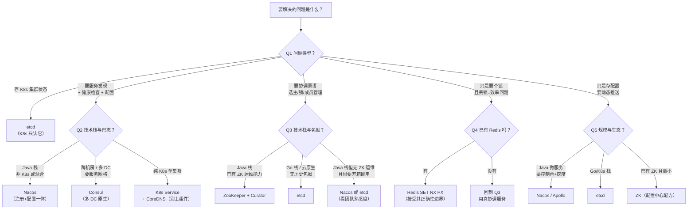
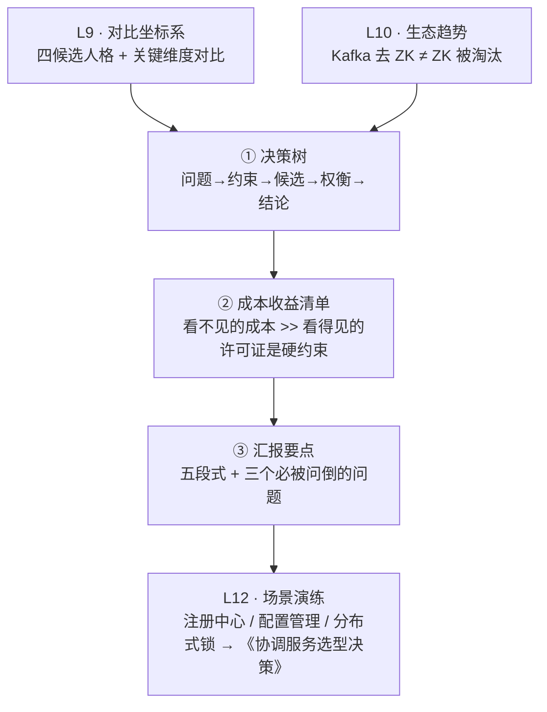

# 第 11 课 · 决策框架：一棵选型决策树

> 阶段 4 · 对比与决策 · 知识点：选型决策树 / 成本收益清单 / 向团队汇报要点
>
> 🧭 课程导航：[课程目录](../../../02-课程目录.md) · 上一课：[L10 生态趋势：Kafka 为什么抛弃 ZooKeeper](../lessons/lesson-10-生态趋势Kafka为什么抛弃ZooKeeper.md) · 下一课：L12《场景演练：三个真实项目的选型决策》

## 第一幕 · 场景引入：四个结论，吵成一团

L9 给了你一张四候选对比表，L10 告诉你 Kafka 撤了 ZK 但 ZK 没凉。现在信息够了，该做决定了。

回到 L1 那家电商公司。你已经把"要不要引入 ZooKeeper"调研完，带着结论参加架构评审会。结果会上四个人给了你四个答案：

```text
架构师 A："ZooKeeper 最成熟，Hadoop/HBase/Kafka 都用了十几年，用它。"
架构师 B："etcd 才是云原生正统，K8s 御用，Go 写的，运维简单，用它。"
架构师 C："Consul 功能最全，服务发现+健康检查+KV 一站式，用它。"
架构师 D："Redis 我们已经在用了，加个 SET NX 就行，别引入新组件。"
```

四个人都能说出道理，而且**每个人说的都是真的**。但他们的结论互相矛盾——问题出在哪？

出在：**他们各自在回答一个不同的问题，而且都把自己熟悉的那套当成了默认场景。**

A 想的是"协调原语"（选主/锁/成员管理），B 想的是"云原生状态存储"，C 想的是"服务发现与健康检查"，D 想的是"够用就行别加组件"。**四个人其实在四个不同的坐标系里说话。**

这就是本课要解决的问题：**给你一把尺子，把"哪个技术更好"这种吵不出结果的问题，翻译成"在我的具体约束下，哪个方案的总成本最低、风险最小"这个可以算的问题。**

本课的路线是三条，正好是做一次技术决策的完整动作：

1. **选型决策树**：先问对问题，再选工具——把"哪个更好"变成一串可回答的判断题
2. **成本收益清单**：选型 = 算总账，把看得见的和看不见的成本都摆上桌
3. **向团队汇报要点**：决策要能讲清楚、经得起追问，才算完成

学完这课，你再回到那个评审会，就不会被四个声音带着走了——你会先问三个问题，把坐标系对齐，然后沿着一棵树走到一个**能说出理由**的结论。

## 第二幕 · 认知冲突：三个让决策跑偏的陷阱

在给你那棵树之前，先把三个最常见的坑挖出来。**这三个坑，比"不懂技术细节"更容易导致错误决策。**

### 陷阱一：把"工具对比"当成"需求澄清"

这是最大的坑，也是会上吵成一团的真正原因。

架构师 A/B/C/D 一上来就在比工具：**ZK 成熟 vs etcd 云原生 vs Consul 功能全 vs Redis 简单**。但**在比之前，有一个更前置的问题没被回答**：

> **我们到底要协调什么？一致性要求有多硬？错了会怎样？**

L1 已经给你打过底：**双主故障的本质是"两个节点都以为自己是主"**，而协调服务的全部价值就是"**让全网对一件事达成唯一结论**"。所以决策的起点不是"选哪个组件"，而是：

- **要协调的是什么**？（选主？锁？配置？服务名单？还是只是存个 KV？）
- **错了的代价是什么**？（两个节点同时干活会不会把数据写坏？配置晚几秒生效无所谓？服务名单少一个实例只是少点流量？）
- **规模和频率大概什么量级**？（几百个节点还是几千个？每秒几次变更还是几千次？）

**不回答这三个问题就直接比工具，等于没看病人就开药。** L9 那句"先摆正定位再对比"在这里升级成一句更狠的：**先澄清需求，再对比工具；而且需求澄清阶段不该出现任何工具名。**

### 陷阱二：只看"功能清单"，不看"能力边界"

"Consul 功能最全，那就选它"——这是 L9 拆过的误读，这里从决策角度再补一刀。

**功能清单是"能做什么"，能力边界是"做到什么程度会出问题"。** 决策时后者往往更致命，因为**越界是静默发生的**——不会报错，只会在某个深夜以故障的形式出现。

几个已经核实过的"硬边界"，它们应该直接变成决策树上的**剪枝条件**：

| 组件 | 硬边界（官方一手） | 越过会怎样 |
|------|------------------|-----------|
| **ZooKeeper** | 官方定位"为存储协调数据而设计……通常以 KB 计"；内置 **1M** 校验（jute.maxbuffer 默认 1048575 字节）防止被当大数据存储用 | 单 znode 过大 / 子节点过多 → `getChildren` 超限报错；数据进内存，容量受内存限制 |
| **etcd** | 单请求默认 **1.5 MiB**（`--max-request-bytes` 可配）；存储配额默认 **2GB**，官方建议正常环境最大 **8GB**，超配启动时告警 | 数据超限 → 集群进只读告警状态 |
| **Consul KV** | 单个 value **硬限 512KB**，超限直接返回 **HTTP 413**（`kv_max_value_size` 可调）；官方明确"**不要用作通用数据库或对象存储**"，且"更新过快时**不要用阻塞查询**去监听"（会退化成忙循环打满 CPU） | 越界直接报错；高频写 + 阻塞查询 → 服务端 CPU 打满 |
| **Redis** | 单实例锁在故障转移场景被官方定性为 **SAFETY VIOLATION**；Redlock 安全性存在公开争论 | 丢锁可能是**正确性问题**，不只是效率问题 |

看清这张表，你就明白"功能清单对比"为什么靠不住：**Consul 功能确实最全，但它的 KV 有 512KB 硬限且官方明说别当数据库用**；**etcd 确实云原生，但它的存储配额是 2GB 量级的**——这些边界在你"只是存配置"时无所谓，在你"想顺手多存点东西"时就是事故。

### 陷阱三：把"别人的结论"当成"我的约束"

L10 刚拆过这个：**"Kafka 不用 ZK 了"推不出"我不该用 ZK"**。这里把它提炼成一个通用陷阱。

别人的选型结论，是在**别人的约束**下做出的：

- Kafka 能自建 KRaft，是因为**它本身就是分布式日志专家**，KIP-595 原话说"从 Kafka 日志复制出发再加 Raft 选举"——**你有没有这个能力？**
- Kafka 去 ZK 的动机是"元数据外置导致双份状态 + 两套运维 + 规模天花板"——**你的系统有这个问题吗？**（大多数系统没有）
- 某个大厂用 etcd 替换了 ZK——**你的技术栈是 Go 吗？你的团队有 K8s 运维能力吗？**

**选型结论不可移植，可移植的是"做决策的方法"。** 这也是本课给你一棵决策树而不是一张"最佳选择表"的原因：**树能适配你的约束，表不能。**

三个陷阱，一个病根：**决策时把注意力放在了"工具"上，而不是"我的问题"和"我的约束"上。** 好的技术决策，顺序永远是**问题 → 约束 → 候选 → 权衡 → 结论**，而不是反过来。

## 第三幕 · 层层揭示：决策树、成本账与汇报要点

### 3.1 选型决策树：先问对问题，再选工具

下面这棵树，把"选哪个协调服务"拆成一串**有明确答案的判断题**。每一层都在缩小范围，走到叶子就是候选方案。

先给一张**总览图**（Mermaid），再逐层解释：



**现在逐层解释每个分叉为什么这么设计。**

**第一层 Q1：先分类你要解决的问题。** 这是最重要的一层，因为它决定了后面所有分支。四个分类来自 L2 的能力地图和 L6 的四大用法：

- **存 K8s 集群状态** → 答案唯一：**etcd**。这不是偏好问题——L9 讲过，**K8s 只认 etcd**，因为 `resourceVersion` 与 List-Watch 控制器模式建立在 etcd 的 MVCC + 可靠流式 watch 上。这一支**没有决策空间**，别浪费时间对比。
- **要服务发现 + 健康检查 + 配置** → 进 Q2（这是"基础设施"类需求，Consul/Nacos 这类"服务网络管家"更对口，因为 ZK **没有内置健康检查**）
- **要协调原语（选主/锁/成员管理）** → 进 Q3（这是 ZK 与 etcd 的主场）
- **只要个锁且丢锁只是效率问题** → 进 Q4（可以先看看能不能不引入新组件）
- **只存配置要动态推送** → 进 Q5（配置中心是独立赛道，Nacos/Apollo 这类专用工具通常比通用协调服务更省事）

**第二层 Q2（服务发现分支）：技术栈与部署形态决定一切。**

- **Java 栈、非 K8s 或混合云** → **Nacos**。理由：注册+配置一体化，支持 **AP/CP 切换**，国内 Java 生态（Spring Cloud/Dubbo）集成最深。**注意 Nacos 的一致性模型是双模的**——服务发现默认 Distro（AP），配置管理用 Raft（CP），这与 ZK/etcd 的"纯 CP"不同，选型时要知道自己拿的是哪一档。（**注**：Nacos 双模描述来自社区与厂商技术文章，属**二手来源**；其"AP/CP 可切换"的产品定位与 Nacos 官网自述一致，但具体协议名与默认档以你所用版本的官方文档为准。）
- **跨机房/多数据中心 + 要服务网格** → **Consul**。L9 讲过：**Consul 每个 DC 是独立 Raft 域、独立 leader、peer set 互不相交**，这是它相对 etcd/ZK 的结构性优势。
- **纯 K8s 单集群**（全部工作负载都在同一个 K8s 集群内、无跨集群/无外部注册需求） → **K8s Service + CoreDNS 就够了，别上组件**。这是决策树里最容易被忽略却最省钱的一支：**最便宜的组件是你不需要部署的那个。**（若工作负载跨多个 K8s 集群、或需要与虚拟机/外部服务互相发现，则不适用这一支，回到上面的 Consul/Nacos 分支。）

**第三层 Q3（协调原语分支）：技术栈 + 历史包袱决定。**

- **Java 栈 + 已有 ZK 运维能力** → **ZooKeeper + Curator**。理由：Curator 把官方配方（选主/锁/成员）都实现好了（L6），Java 栈集成最深。**这是 ZK 在 2026 年依然扎实的主场。**
- **Go 栈 / 云原生 / 无历史包袱** → **etcd**。理由：Go 单二进制、**gRPC + HTTP/JSON 接口**（curl 可用）、运维形态优于 ZK 的 JVM + 专用盘（L9"运维形态"行）。
- **Java 栈但无 ZK 运维能力、想要开箱即用** → **Nacos 或 etcd**，看团队熟悉哪个。**引入一个没人会运维的组件，比不引入更危险。**

**第四层 Q4（只是要锁）：诚实地问自己"丢锁的后果"。**

- **已有 Redis + 丢锁只是效率问题**（比如防止重复执行一个幂等任务，重复跑一次只是浪费点 CPU）→ **Redis `SET NX PX` 就够**，别引入新组件。
- **没有 Redis，或丢锁是正确性问题**（比如两个节点同时扣库存、同时写同一份数据）→ **回到 Q3，用真正的协调服务**。依据 L9：
  **Redis 单实例锁在故障转移场景被官方定性为 SAFETY VIOLATION；Redlock 安全性有公开争论（Kleppmann vs antirez）。**

  这里要补一句 L6 学过的诚实边界：**ZK/etcd 的锁也不是万能的**——进程停顿（GC STW）会突破一切租约锁，Kleppmann 原文说 "no matter what lock service you use"。所以正确做法是 **fencing token**（L6 讲过：可用 zxid 或 znode 版本号当 fencing token，etcd 可用 revision）。**选 etcd/ZK 不是为了"锁绝对不失效"，而是为了"失效时下游能挡住"。**

**第五层 Q5（配置中心）：这是独立赛道。**

- **Java 微服务、要控制台 + 灰度 + 权限** → **Nacos / Apollo**。专用配置中心在"配置管理"这件事上通常比通用协调服务更省事（ZK 的配置中心配方需要自己写监听和重读逻辑，L6 讲过）。
- **Go / K8s 栈** → **etcd**。
- **已有 ZK 且配置量小** → **继续用 ZK**，别为了"统一"而引入新组件。

**树的用法提示**：这棵树不是"必须严格执行"的教条，而是**一个思考顺序**。它的价值在于**逼你先回答约束类问题（技术栈、部署形态、已有能力、丢锁后果），再谈工具**。如果你在某个分叉上有强理由走另一条路——**那就走，但把理由写下来**，这就是 3.3 汇报要点要的"决策依据"。

### 3.2 成本收益清单：选型 = 算总账

选型的本质是**算总账**，而不是比功能。下面这张清单把账目分为**看得见的**和**看不见的**——**真正让选型翻车的，几乎都是看不见的那些。**

| 成本项 | 是什么 | ZK | etcd | Consul | Nacos | Redis |
|--------|--------|----|----|--------|-------|-------|
| **部署成本**（看得见） | 起几个节点、要不要专用盘 | 3 节点起、JVM、**事务日志要专用设备**（L7） | 3 节点起、单二进制 | 3–5 server + 每节点 agent | 2 模式（可单机起步） | 通常已有 |
| **运维复杂度**（看不见） | 日常要做什么 | 清快照/日志（默认不清）、调 JVM、盯 fsync 与 watch 数（L7） | 压缩历史版本、盯配额 | 管 Raft + gossip 两套、ACL 与 intention | 控制台友好，最省心 | 团队已会 |
| **团队学习曲线**（看不见） | 上手要多久 | 要理解 ZNode 树/会话/watch 语义（L3/L5），**心智负担最重** | 扁平 KV + lease，概念最少 | 要懂 agent/server/ACL/intention | 控制台开箱即用 | 几乎为零 |
| **客户端生态**（看得见） | 有没有成熟客户端 | Java/C 官方；**Curator** 补齐配方 | 多语言 + gRPC/HTTP | HTTP/DNS，多语言友好 | Java 生态最深 | 全语言 |
| **监控告警**（看不见） | 指标从哪来 | 四字命令 + **3.6+ Prometheus**（L7） | Prometheus 原生 | 自带 UI + Prometheus | 内建控制台 | 已有体系 |
| **许可证风险**（看不见，但可能致命） | 能不能商用 | **Apache-2.0** | **Apache-2.0** | **BUSL 1.1**（2023-09 起，非 OSI 许可，有竞业使用限制） | Apache-2.0 | 视版本（Redis 7.4+ 为 RSALv2/SSPLv1，非 OSI；**注**：该版本—许可对应关系来自二手来源，商用前请以官方 LICENSE 文件与法务意见为准） |
| **退出成本**（最看不见） | 将来想换，有多痛 | 数据模型层级深、客户端绑定重 | 扁平 KV，相对好迁 | 与 Consul 生态绑定 | 与 Spring Cloud 绑定 | 锁语义弱，好换 |

**三条从这张表读出来的决策原则：**

**① 看不见的成本 >> 看得见的成本。** 部署 3 个节点谁都会，难的是"**凌晨三点它出问题时，谁能起来修**"。所以"团队学习曲线"和"运维复杂度"两行，权重往往高于功能对比。

**② 许可证是硬约束，不是软指标。** 这一行最容易被漏掉。事实：**Consul 自 2023 年 9 月（1.17.0）起改为 BUSL 1.1**，这不是 OSI 许可，带有竞业使用限制（每个版本发布 4 年后转 MPL-2.0）；**ZooKeeper、etcd、Nacos 均为 Apache-2.0**（Redis 7.4 起改为 RSALv2/SSPLv1，同样非 OSI）。**如果你的公司要做商业化产品、或者法务对许可证敏感，这一行可能直接决定结论，其他所有对比都白做。**

**③ 退出成本决定你能不能"先试试"。** 选一个退出成本低的方案，等于**给自己买了一个期权**——错了能改。反过来，选一个深度绑定的方案，就等于押注。

**收益侧也要诚实列出来**（不然算的是半本账）：

| 收益项 | 说明 |
|--------|------|
| **正确性提升** | 消除双主/双持有这类 L1 讲过的灾难（这是引入协调服务的**首要理由**） |
| **开发效率** | 选主/锁/成员管理有现成配方（Curator）或现成能力，不用自己写 |
| **运维可见性** | 服务名单、配置变更有统一视图 |
| **故障恢复** | 自动摘除故障节点（临时节点/健康检查） |

**决策的判据**：**收益必须能覆盖成本，且"不做的风险"要显式写出来。** 如果算完发现"引入 ZK 的运维成本 > 它能避免的故障损失"，那正确答案就是**不引入**——这也是完全有效、且经常被忽略的一个结论。

### 3.3 向团队汇报要点：让决策经得起追问

技术决策的最后一步不是"选出答案"，而是**让相关的人理解并接受这个答案**。一份能过评审的选型汇报，结构是固定的五段：

```text
① 问题与约束（先说清"我们要解决什么、受什么限制"——不出现工具名）
② 候选方案（列出 2–4 个真正在考虑范围内的，说明为什么其他的不在范围内）
③ 关键差异（只列与本次决策相关的 3–5 个维度，不要贴整张对比表）
④ 推荐结论 + 决策依据（一句话结论 + 为什么是这个而不是那个）
⑤ 风险与退出方案（已知风险、触发重评的条件、将来怎么换）
```

**逐段说明要点（这是本课最"能直接用"的部分）：**

**① 问题与约束——先对齐坐标系。** 这一段的目标是**让所有人承认"我们在解决同一个问题"**。要写清：业务场景、一致性要求（错了会怎样）、规模量级、团队现有能力与运维约束、许可证/合规要求。**刻意不提工具名**，避免一上来就陷入"ZK vs etcd"的口水战。

**② 候选方案——给出"为什么是这几个"。** 不要罗列六个组件，那样显得没做筛选。列出 2–4 个，并说明**淘汰理由**（例如"Consul 因 BUSL 许可证不在考虑范围""Redis 因丢锁属正确性问题被排除""纯 K8s 场景直接用 Service，不引入组件"）。**这正好是决策树剪枝过程的书面化。**

**③ 关键差异——只列相关的维度。** 从 L9 那张对比表里**挑出与本次决策相关的 3–5 行**，不要整表粘贴。例如做"分布式锁"决策，关键行是：**锁的正确性、watch 语义、运维形态、客户端生态**；做"服务发现"决策，关键行变成：**健康检查、多数据中心、一致性档位、许可证**。

**④ 推荐结论 + 决策依据——一句话 + 为什么。** 结论要能一句话说清（"推荐 **etcd**，因为我们是 Go 栈 + K8s 环境，且团队无 ZK 运维经验"）。**"为什么不是 X"比"为什么是 Y"更重要**——评审会上被挑战的通常是前者。

**⑤ 风险与退出方案——这一段决定专业度。** 必须写：已知风险（如"etcd 存储配额 2GB，需在数据量接近前做压缩"）、触发重评的条件（如"若实例数超过 1 万或服务跨机房部署，需重新评估"）、退出路径（如"数据模型为扁平 KV，将来迁出只需双写过渡"）。**愿意主动写"我什么时候会承认自己错了"的汇报，可信度完全不同。**

**汇报时最容易被问倒的三个问题**（提前准备好）：

1. **"为什么不用 Redis？我们已经在用了。"** → 答：先问"丢锁是效率问题还是正确性问题"（Q4）。是效率问题→可以用 Redis；是正确性问题→引用官方 SAFETY VIOLATION 与 Redlock 争论，说明为什么不够。
2. **"Kafka 都把 ZooKeeper 换了，我们为什么还要用？"** → 答：L10 的结论——Kafka 去 ZK 的动机是"元数据外置导致双份状态"，**这是 Kafka 特有的问题，我们没有**；且 ZK 社区仍活跃（3.9.x/3.8.x 双分支支持、3.10 开发中）。**单一案例不能推出普遍结论。**
3. **"etcd 和 ZooKeeper 到底哪个好？"** → 答：**在同一故障模型下 ZAB 与 Raft 安全性等价**（L9），差别不在"谁更正确"，而在**运维形态、接口、生态、团队熟悉度**——所以要结合我们的约束来看，这也是为什么结论是 X 而不是 Y。

## 第四幕 · 实操演练：用这棵树走三遍

**演练 A：把四个架构师的争论翻译成决策树路径。**

回到第一幕那个评审会。假设这家电商公司的真实情况是：**Java 技术栈、Dubbo 微服务、部署在自建机房（非 K8s）、需要一个分布式锁来避免定时任务重复执行、团队没有专职 ZK 运维。**

请沿决策树走一遍，给出结论并说明每个分叉的判断依据。

<details><summary>参考答案（先自己走完再看）</summary>

**路径**：起点 → Q1「要协调什么」→ 答案是"**协调原语（分布式锁）**"→ 进 Q3「技术栈与包袱」。

但这里有个**关键的前置判断**要先做（Q4 的精神）：**丢锁的后果是什么？** 题目说"避免定时任务重复执行"——如果任务是**幂等的**（重复跑一次只是浪费 CPU），那 Q4 会指向 **Redis `SET NX PX`**，不引入新组件，这是最省的答案。如果任务**不幂等**（重复执行会把数据写坏），那丢锁是**正确性问题**，Redis 不够（官方 SAFETY VIOLATION + Redlock 争论），必须走 Q3。

**假设任务不幂等**（这是更常见也更需要协调服务的场景），走 Q3：

- Q3 有三个分支：Java 栈 + **已有 ZK 运维能力** → ZK + Curator；Go/云原生无包袱 → etcd；Java 栈但**无 ZK 运维能力** → Nacos 或 etcd。
- 题目明确说"**团队没有专职 ZK 运维**"→ 落在第三个分支：**Nacos 或 etcd，看团队熟悉度**。
- 又因为是**Java 栈 + Dubbo**，Nacos 与 Dubbo/Spring Cloud 集成最深、控制台开箱即用、运维最省心 → **推荐 Nacos**。

**结论**：**如果任务幂等 → Redis 就够，别引入组件；如果任务不幂等 → 推荐 Nacos（Java 栈 + 无 ZK 运维能力 + Dubbo 生态），而不是架构师 A 说的 ZooKeeper。**

**这个过程说明了什么**：架构师 A 说"ZK 最成熟"**没错**，但他在回答"**哪个协调服务最成熟**"，而真正的问题是"**在团队没有 ZK 运维能力的前提下，怎么安全地拿到一个正确的锁**"。**问题一变，答案就变了。** 这就是"先澄清需求再对比工具"的价值——它把一个吵不出结果的偏好之争，变成了一串有确定答案的判断题。

**补充两个容易漏的点**：①即便选了 Nacos/etcd，也要用 **fencing token** 兜底（L6），因为进程停顿会突破一切租约锁；②如果公司**法务对许可证敏感**或**要做商业化产品**，Consul（BUSL 1.1）应在②候选方案里就被淘汰并写明理由。

</details>

**演练 B：三案连判（算总账，不是背答案）。**

```text
案1：团队用 Redis 做分布式锁已半年，从未出过问题。
     新架构师提议换成 etcd，理由是"Redis 锁不安全"。
     请判断这个提议该不该采纳，并给出决策依据。
案2：某团队在 K8s 上跑 Java 微服务，用 ZooKeeper 做服务注册中心（历史遗留）。
     有人提议迁到 Nacos，理由是"ZK 缺健康检查、运维重"。
     请判断迁移的收益是否覆盖成本。
案3：团队要做一个跨机房（两地三中心）的服务发现，候选 ZK / etcd / Consul / Nacos。
     请沿决策树给出推荐，并说明关键依据。
```

<details><summary>参考答案（先自己推完再看）</summary>

1. **不该直接采纳，要先问"丢锁的后果"（Q4）。** 决策依据：①Redis 锁"不安全"是有前提的——**官方定性 SAFETY VIOLATION 的场景是"故障转移"**（主节点宕机、锁还没同步到从节点就切主），Redlock 的安全性则有公开争论。**半年没出问题不代表不会出问题，但也说明触发条件（正好在故障转移窗口内）确实罕见。** ②真正的判据是**丢锁的后果**：如果丢锁只是"重复执行一次幂等任务"（效率问题），那 Redis 完全够用，**换成 etcd 的收益（正确性提升）覆盖不了迁移成本 + 新组件运维成本**；**如果丢锁会导致数据写坏（正确性问题），那就该换**，并且要补 fencing token。③另外注意：**换 etcd 也不是终点**——L6 讲过进程停顿会突破一切租约锁，所以即便用 etcd 也要 fencing。**结论：先分类后果，效率问题→不换（或换但要说清收益），正确性问题→换。**
2. **收益大概率覆盖成本，但要算清三笔账。** 支持迁移的收益：①**ZK 确实没有内置健康检查**（L9 对比表），在 K8s 上要靠 readiness/liveness probe 补齐，而 Nacos 原生支持 HTTP/TCP/MySQL/自定义探针，这是**真实的能力缺口**，不是跟风；②**运维负担**——ZK 要 JVM + 事务日志专用设备 + 清快照日志（L7 三张账单），Nacos 单包部署 + 控制台，运维成本低一个量级；③**生态匹配**——Java 栈 + K8s，Nacos 与 Spring Cloud 集成顺畅，且注册+配置一体化省掉一个组件。**成本侧**：迁移涉及客户端改造、双注册过渡期、团队学习、可能的灰度回滚方案。**判据**：如果团队确实被"缺少健康检查导致流量打到死节点"或"ZK 运维吃力"困扰过（有真实痛点），收益覆盖成本，该迁；**如果只是"感觉 ZK 老"**，那痛点不成立，不要为迁移而迁移（这正是 L10 提醒的"不要从单一案例推出普遍结论"的另一面——也不要因为"Nacos 新"就迁）。**另外**：若已在纯 K8s 单集群且不需要配置中心，更省的一支是 **K8s Service + CoreDNS，连 Nacos 都不用上**（决策树 Q2 的第三支）。
3. **推荐 Consul，关键依据是"多数据中心"这个结构性能力。** 沿决策树：Q1 → "服务发现 + 健康检查 + 配置" → 进 Q2；Q2 → "跨机房 / 多 DC" → **Consul**。依据：**Consul 每个 DC 是独立的 Raft 域、有独立 leader、peer set 互不相交**（L9 原文），DC 之间默认**不复制数据**，本地 DC 的请求不依赖远端 DC 可用——这正是"两地三中心"想要的性质。对比：①**ZK/etcd 是单集群语义**，跨机房部署要面对"2+1 少数派拒写"（L7 讲过跨机房 2+1 的问题）与写延迟；②**Nacos 跨 DC 需要手动配置集群路由**，弱于 Consul 的原生支持。**但必须同时给出风险与退出方案**（3.3 第⑤段）：**Consul 自 2023-09（1.17.0）起为 BUSL 1.1 许可，非 OSI 许可、有竞业使用限制**——若公司要商业化或法务敏感，这一项可能直接否决，此时退而求其次：ZK（Apache-2.0）或 Nacos（Apache-2.0），接受跨 DC 能力弱一些。此外 Consul KV 有 **512KB 硬限**且官方明说别当数据库用，配置量要在边界内。**这就是"推荐结论 + 决策依据 + 风险与退出"的完整形态。**

</details>

两道题的手感：**演练 A 练"把偏好之争翻译成约束判断题"（关键在先问后果再谈工具），演练 B 练"算总账并给出可辩护的结论"（关键在收益/成本都要写，且主动写风险与退出）**。

## 第五幕 · 体系收束：从"哪个更好"到"我该怎么定"



本课三张"表"，各记各的：

1. **决策树**记分叉顺序：**Q1 问题类型 → Q2 服务发现（技术栈/形态）→ Q3 协调原语（技术栈/包袱）→ Q4 锁的后果 → Q5 配置中心**
2. **成本清单**记两条原则：**看不见的成本（学习曲线/运维/退出）>> 看得见的成本**；**许可证是硬约束，可能一票否决**
3. **汇报要点**记五段结构：**问题与约束 → 候选方案（含淘汰理由）→ 关键差异（3–5 行）→ 结论+依据 → 风险与退出**

本课带走三句话：

1. **先澄清需求，再对比工具**——需求澄清阶段不该出现任何工具名。四个架构师吵成一团，是因为他们在四个坐标系里说话
2. **功能清单是"能做什么"，能力边界是"做到什么程度会出事"**——后者更致命，因为越界静默发生（etcd 1.5MiB/2GB、Consul 512KB 且别当数据库、ZK 1MB 校验、Redis 锁的 SAFETY VIOLATION）
3. **选型结论不可移植，可移植的是决策方法**——Kafka 能自建 KRaft 是因为它本就是分布式日志专家；**别把别人的结论当成你的约束**

下一课（L12）就是终点：**在三个真实场景（注册中心、配置管理、分布式锁）里跑一遍完整流程**，产出你能在会上讲的那份**《协调服务选型决策》**——那是这门 12 课的收官交付物。

### 📇 术语速查卡

| 术语 | 一句话解释 |
|------|-----------|
| 决策树 | 把选型拆成一串有确定答案的判断题，逐层剪枝走到候选方案 |
| 剪枝条件 | 决策树上"不满足就直接淘汰"的硬条件（如许可证、能力硬边界） |
| 硬边界 | 组件的能力上限，越界静默失败或报错（etcd 1.5MiB 请求/2GB 配额、Consul 512KB、ZK 1MB 校验） |
| 看得见的成本 | 部署节点数、要不要专用盘这类一眼能算的成本 |
| 看不见的成本 | 学习曲线、运维复杂度、许可证风险、退出成本——**真正让选型翻车的** |
| 退出成本 | 将来想换方案有多痛；选退出成本低的方案等于买了一个"改错"的期权 |
| BUSL 1.1 | Consul 自 2023-09（1.17.0）起的许可证，非 OSI 许可，有竞业使用限制，发布 4 年后转 MPL-2.0 |
| Apache-2.0 | ZooKeeper / etcd / Nacos 使用的 OSI 批准许可，商用无限制 |
| fencing token | 单调递增的令牌，下游用它挡住"过期锁持有者"的写入（L6 已讲；ZK 用 zxid/znode version，etcd 用 revision） |
| Nacos 双模一致性 | 服务发现默认 Distro（AP），配置管理用 Raft（CP），可切换 |
| Distro 协议 | Nacos 服务发现默认用的 AP 协议，优先保证可用性 |
| 五段式汇报 | 问题与约束 → 候选方案 → 关键差异 → 结论+依据 → 风险与退出 |

### ✏️ 课后思考题（可选）

1. 本课说"需求澄清阶段不该出现任何工具名"。请挑一个你当前或熟悉的项目，用**不带任何组件名**的语言，写出它的"要协调什么 / 错了会怎样 / 规模与频率"三件事，再据此走一遍决策树，看结论与你原本的选型是否一致。（提示：这一步的价值在于暴露"我其实是在跟着习惯选，还是在跟着约束选"；如果写三件事时你不得不提到某个组件名，说明需求还没被抽象干净）
2. 成本清单里"许可证"被归为**看不见但可能致命**的成本。请查一下你所在公司/项目对开源许可证的政策，并判断：**Consul（BUSL 1.1）和 Redis 7.4+（RSALv2/SSPLv1）在你的场景下是否可用？** 如果不可用，本课决策树的哪些分支需要改？（提示：政策通常分三类——①完全不限制（都可用）；②要求 OSI 批准许可（BUSL/RSAL/SSPL 都不可用，Consul/新 Redis 被淘汰）；③禁止特定"竞业使用"条款（若你所在公司与 HashiCorp/Redis 构成竞争则受影响）。若属②，Q2 的"跨机房/多 DC"分支要从 Consul 改为 ZK 或 Nacos，Q4 的"已有 Redis"分支要确认 Redis 版本与许可）
3. 本课强调"愿意主动写'我什么时候会承认自己错了'的汇报，可信度完全不同"。请为你熟悉的一个技术选型，补写一段**"触发重评的条件"**（即：出现什么信号，就说明这个决定该被重新审视）。（提示：好的触发条件是可观测、可判定的，例如"单集群实例数超过 1 万""配置数据量接近 etcd 配额的 50%""跨机房部署提上日程""团队中负责运维该组件的人离职且无人接手""连续两个季度出现该组件相关故障"——**避免"如果出问题就重评"这种无法判定的表述**）

## 🚀 下一批接力提示词

> 学完本课后，**复制下面这段文字发给 AI**，即可无缝进入下一课（无需重新描述上下文）：

```
继续学 ZooKeeper。我的学习档案在 zookeeper/00-学习档案.md，
刚学完阶段 4《对比与决策》的课《决策框架：一棵选型决策树》知识点 选型决策树、成本收益清单、向团队汇报要点，
请按大纲继续讲解下一课（课12：场景演练：三个真实项目的选型决策）。
```

## 🧭 课程导航

➡️ **下一课**：L12《场景演练：三个真实项目的选型决策》（待开讲，发送上面的接力提示词即可开始；那是本课程的收官交付物——一份能向团队汇报的《协调服务选型决策》）

📚 **返回目录**：[课程目录](../../../02-课程目录.md)
