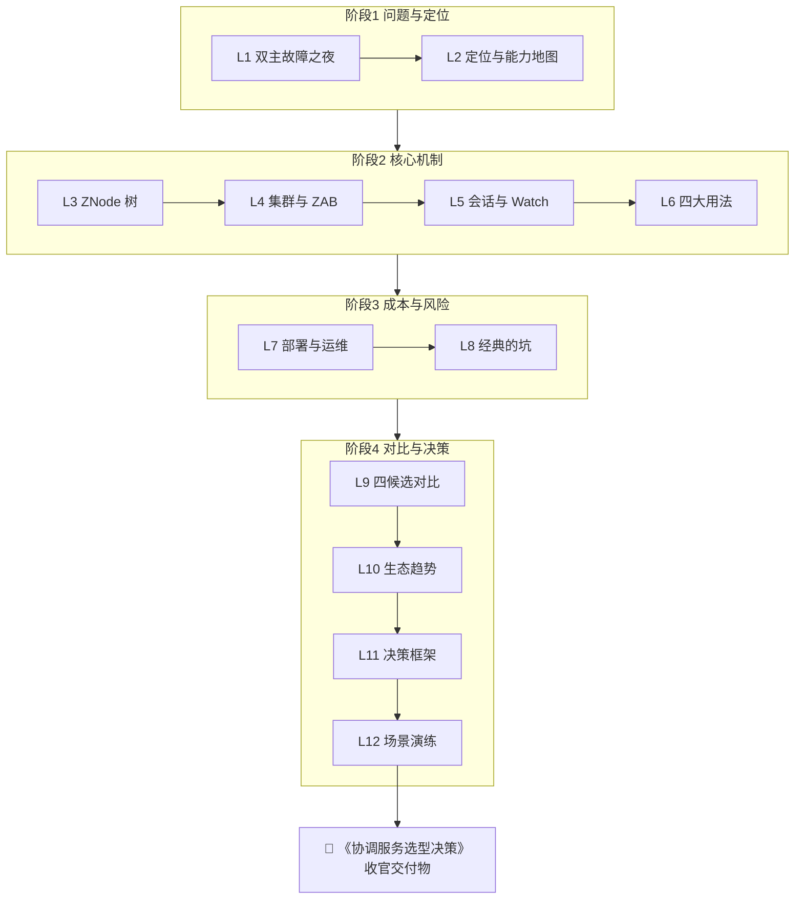

# 第 12 课 · 场景演练：三个真实项目的选型决策

> 阶段 4 · 对比与决策 · **收官课** · 知识点：注册中心选型 / 配置管理选型 / 分布式锁方案
>
> 🧭 课程导航：[课程目录](../../../02-课程目录.md) · 上一课：[L11 决策框架：一棵选型决策树](lesson-11-决策框架一棵选型决策树.md) · 下一课：**课程收官**（交付《协调服务选型决策》）

## 第一幕 · 场景引入：三个项目，三张待填的表

L11 给了你三件套——**决策树、成本收益清单、五段式汇报要点**。但工具只有被用过才算学会。

这一课是终点，也是验收。我们把三件套套到**三个真实场景**上，每个场景都按同一套动作走完：

```text
① 澄清问题与约束（不出现工具名）
② 列候选与淘汰理由（决策树剪枝）
③ 关键差异（只列相关维度）
④ 推荐结论 + 决策依据
⑤ 风险与退出方案
```

三个场景，正好覆盖三种不同的决策类型：

- **场景 A（注册中心选型）**：结论可能是"**不引入组件**"——这是最省钱却最容易被忽略的答案
- **场景 B（配置管理选型）**：这是**独立赛道**，专用配置中心通常比通用协调服务更省事
- **场景 C（分布式锁方案）**：结论取决于"**丢锁是效率问题还是正确性问题**"——这个分类决定一切

还有一个贯穿全课的提醒，来自 L10：**别人的结论不可移植。** 所以本课每个场景都会显式写出"**这个结论在什么条件下成立、什么条件下要重评**"。

学完这一课，你手里的产出不是"我知道 ZK 和 etcd 的区别"，而是一份**能发出去的《协调服务选型决策》**——这才是 12 课的终点交付物。

## 第二幕 · 认知冲突：三个场景，藏着三个反直觉

在你做决策之前，先把三个"看起来对但其实危险"的直觉挖出来。

### 反直觉一：注册中心的正确答案，可能是"不引入组件"

提到"注册中心"，很多人第一反应是"选 ZK / Nacos / Consul 哪个"。但如果你的服务**全部跑在同一个 K8s 集群里**，正确答案是：**你不需要注册中心。**

依据（官方一手）：Kubernetes 官方文档明确——**CoreDNS 监视 Kubernetes API，为每个 Service 自动创建 DNS 记录**；Pod 通过 `/etc/resolv.conf` 里的 nameserver 指向 CoreDNS，直接用服务名解析。**Pods 不自己注册**，Endpoints/EndpointSlice 控制器根据 label selector 自动维护后端列表，**只有 readinessProbe 通过的 Pod 才收流量**。

换句话说：**K8s 把"服务注册 + 服务发现 + 健康检查"三件事都内建了。** 这时候再引入一个注册中心，等于**用外部组件重复实现平台已经提供的能力**——多一套运维、多一个故障域，收益却是零。

（**⚠️ 汇报提醒**：业内流传的"Pinterest 把 1000+ 微服务从自建 Consul 迁到 K8s DNS、省掉独立注册中心"是**社区与厂商文章中的案例，属二手来源**；其**方向性结论**（K8s 内建发现可替代外部注册中心）与上面引用的官方机制一致，但**具体公司名与数字不要写进你的汇报文档**——评审会上被追问出处会很难看。真正该写进汇报的是官方那句机制：**CoreDNS 自动为每个 Service 建 DNS 记录、Pod 不自己注册、只有 readiness 通过的 Pod 才收流量**。）

### 反直觉二：配置管理和"协调服务"是两条赛道，别混着选

ZK 能做配置中心（L6 讲过配方：`getData(watch)` + `setData` 触发 + 重读），etcd 也能（KV + watch）。但**"能做"不等于"该做"**。

真正的配置中心需要这些能力：**多环境/命名空间隔离、版本管理与回滚、灰度发布、权限与审计、可视化控制台、客户端本地缓存兜底**（配置中心挂了服务还能启动）。

对比一下（**注**：下表能力对比来自厂商与社区技术文章，属**二手来源**；产品定位与官方自述一致，落地前请以所用版本官方文档为准）：

| 能力 | 专用配置中心（Nacos / Apollo） | 通用协调服务（ZK / etcd） |
|------|------------------------------|--------------------------|
| 实时推送 | **长轮询，秒级**（Nacos 长轮询+gRPC；Apollo HTTP 长轮询） | 有 watch，但**推送与治理能力需自建** |
| 版本/回滚 | **内建** | 无，需自建 |
| 权限/审计 | Nacos 基础、Apollo 完善 | 弱（ZK 有 ACL，但非配置级权限） |
| 控制台 | **有** | 无（etcd 明确"无友好管理界面"） |
| 客户端缓存兜底 | **有**（服务端挂了用本地缓存启动） | 需自建 |

**结论**：**配置管理是独立赛道，专用工具通常更省事。** 通用协调服务（ZK/etcd）适合"**基础设施/元数据类配置**"（调度参数、元数据）——这类配置量少、要求强一致、本来就该和集群状态放一起；而"**应用业务配置**"（开关、阈值、灰度）更适合 Nacos/Apollo。

一句口诀（社区共识，二手）：**"求简选 Nacos，求全选 Apollo"**；**K8s 环境**则天然是 **etcd（基础设施配置）+ 可选 Nacos（应用配置）** 的分层组合。

### 反直觉三：分布式锁的关键不在"选哪个锁服务"，而在"资源层能不能挡住"

这是最重要的一条，L6 已经埋过伏笔，这里从决策角度讲透。

**所有租约锁（Redis TTL、ZK 临时节点、etcd lease）都挡不住一种情况**：持有者进程暂停（GC STW / 网络分区 / 宿主机卡顿）→ 租约过期 → 别人拿到锁 → 原持有者醒来，**它以为自己还持有锁，继续写入**。

Kleppmann 原文（L6 已核，沿用）：**"no matter what lock service you use"**——这对 Redis、ZK、etcd **一视同仁**。

所以真正的解药是 **fencing token**：锁服务每次授予锁时发一个**单调递增的数字**（ZK 用 **zxid / czxid**，etcd 用 **revision / mod_revision**），客户端**每次写资源都带上这个 token**，**资源层记住见过的最大 token，拒绝更旧的**。

关键认知（**这是本课最该记住的一句**）：

> **锁服务的职责是"发号"（给出全序），不是"保证互斥"。真正的互斥由"资源层拒绝旧 token"来实现。**
> ——也就是那句：**"The lock service is not the lock; the resource's rejection of stale tokens is the lock."**

这带来一个**决策上的重大含义**：如果你的资源层**不支持**条件写/版本校验（比如一个只支持盲写的对象存储、或一个不可改的第三方 API），那么**任何锁服务都救不了你**——这时应该重新设计（引入事务层、用 CAS、或改用幂等方案），而不是纠结选 ZK 还是 etcd。

三个反直觉，一条主线：**决策的关键往往不在"工具选哪个"，而在"这个场景真正的约束是什么"**——K8s 已经内建了什么、配置管理到底要什么能力、资源层能不能配合 fencing。

## 第三幕 · 层层揭示：三个场景，走完三遍流程

### 场景 A · 注册中心选型

**① 问题与约束（先对齐坐标系，不出现工具名）**

```text
业务：电商后端，约 30 个微服务
部署：全部运行在同一个 Kubernetes 集群（自建机房，单集群）
技术栈：Java（Spring Boot）+ 少量 Go
需求：服务之间互相调用时能找到对方实例，故障实例要被自动摘除
现有：无注册中心，目前靠写死 IP + 少量内网 DNS
团队：3 个后端，无专职中间件运维
```

**② 候选方案与淘汰理由**（沿 L11 决策树 Q1→Q2）

- **不引入组件，用 K8s 内建（Service + CoreDNS + readinessProbe）** ← **推荐**
- **Nacos**：Java 栈最对口、注册+配置一体，但**在本场景下重复实现平台已有能力**
- **Consul**：跨机房/多 DC 才是它的强项（每 DC 独立 Raft 域），**单集群用不上**；且 **BUSL 1.1 非 OSI 许可**，若法务敏感直接出局
- **ZooKeeper**：**无内置健康检查**（要靠探针补齐），且在本场景无独特优势，运维负担最重
- **etcd**：K8s 自身的状态存储，**不适合当应用注册中心用**（那是给平台用的，不是给业务用的）

**③ 关键差异**（只列与本次决策相关的）

| 维度 | K8s 内建 | Nacos | ZK | Consul |
|------|---------|-------|----|----|
| 健康检查 | **readinessProbe 原生** | 原生多探针 | **无内置，需补** | 原生 |
| 单集群成本 | **零额外组件** | 多一套集群 | 多一套（JVM+专用盘） | 多一套 |
| 多 DC | 不涉及 | 弱 | 弱 | **原生强项** |
| 许可证 | - | Apache-2.0 | Apache-2.0 | **BUSL 1.1** |

**④ 推荐结论 + 依据**：**不引入注册中心，用 K8s Service + CoreDNS + readinessProbe。**
依据：官方机制明确——CoreDNS 自动为每个 Service 建 DNS 记录、**只有 ready 的 Pod 才收流量**、Pod 不自己注册。**30 个服务、单集群、Java 栈、无专职运维**这个约束下，引入外部注册中心的收益≈0，成本（部署+运维+故障域）>0。

**⑤ 风险与退出方案**
- **风险**：跨集群/与虚拟机上的遗留服务互访时，K8s 内建发现不够——需要网关或外部注册中心桥接
- **触发重评条件**：出现"工作负载跨多个 K8s 集群"或"需要与集群外（VM/物理机）服务互相发现"
- **退出路径**：届时引入 Nacos（Java 栈最对口）或 Consul（若还需跨机房），业务侧改动集中在"服务名解析方式"，可控

### 场景 B · 配置管理选型

**① 问题与约束**

```text
业务：上述电商的 30 个微服务，配置项多（DB 连接池、限流阈值、功能开关、灰度比例）
需求：改配置不重启；要按环境隔离（dev/test/prod）；生产配置要有权限管控与变更审计；
      要能灰度（先对 10% 实例生效）；配置中心挂了服务要能靠本地缓存启动
技术栈：Java（Spring Boot）
现状：配置散在各服务 application.yml，改一次要发版
附加：公司无 Go 栈，K8s 仅用于部署，不打算把业务配置塞进 etcd
```

**② 候选方案与淘汰理由**（沿决策树 Q1→Q5）

- **Nacos** ← **推荐（求简）**
- **Apollo** ← **推荐（求全，若权限/审计/灰度是硬要求）**
- **Spring Cloud Config**：实时性差（要 Bus 或手动 refresh），不满足"改配置不重启"的秒级要求 → **淘汰**
- **etcd**：K8s 原生、强一致，但**无控制台、无版本/权限/灰度等配置治理能力** → 适合"基础设施配置"，**不适合本场景的业务配置**
- **ZooKeeper**：能做（watch 配方），但**配置治理能力需全部自建**，且官方定位是协调（KB 级元数据）→ **淘汰**
- **Consul KV**：512KB 硬限且官方明说别当数据库用，配置治理弱 → **淘汰**

**③ 关键差异**

| 维度 | Nacos | Apollo | etcd |
|------|-------|--------|------|
| 实时推送 | **长轮询，秒级** | **长轮询，秒级** | watch，但治理需自建 |
| 灰度 | 支持 | **完善（按 IP 灰度）** | 无 |
| 权限/审计 | 基础 | **完善** | 弱 |
| 版本/回滚 | 基础 | **完善** | 无 |
| 控制台 | 有 | 有 | **无** |
| 部署复杂度 | 中等 | 较高（组件多） | 中等 |
| 生态 | **Spring Cloud Alibaba / Dubbo 最深** | 需客户端集成 | K8s 原生 |

**④ 推荐结论 + 依据**：**首选 Nacos；若"权限审计 + 灰度 + 多环境"是硬要求（金融/政务合规场景），选 Apollo。**
依据：**求简选 Nacos，求全选 Apollo**（社区共识，二手；产品定位与官网自述一致）。本团队 Java 栈 + Spring Boot、无专职运维 → Nacos 部署与运维最省、注册+配置一体化（为将来可能的注册中心需求留了口子）；但题干明确要求"权限管控 + 变更审计 + 灰度"三项，Apollo 在这三项上**明显更完善**，若这三项是**不可妥协的合规要求**，则结论翻转为 **Apollo**。

**⑤ 风险与退出方案**
- **风险**：Nacos 权限/审计相对基础，若后续审计要求变严需补能力或迁移；Apollo 组件多、部署复杂，小团队运维压力大
- **触发重评条件**：审计/合规要求升级（→ 评估迁 Apollo）；或团队规模缩小、运维人力下降（→ 回退 Nacos）
- **退出路径**：两者都支持"客户端本地缓存兜底"，迁移时可双写过渡；配置数据为结构化文本，导出/导入成本低
- **补充**：无论选哪个，**基础设施类配置（如调度参数、K8s 自身状态）仍由 etcd 承载**，与应用业务配置分层，不要混在一个系统里

### 场景 C · 分布式锁方案

**① 问题与约束**

```text
业务：定时任务调度 + 库存扣减两个场景都要"同一时刻只有一个节点执行"
场景1（定时任务）：对账任务，重复执行只会多跑一次、结果幂等
场景2（库存扣减）：扣减共享库存，重复执行会写坏数据（超卖/少卖）
部署：K8s 上跑 Java 服务，多副本
现有：Redis（已在用，做缓存），无 ZK / etcd
资源层：库存写入走自研服务 + MySQL（支持带版本号的条件更新 UPDATE ... WHERE id=? AND version=?）
```

**② 候选方案与淘汰理由**（沿决策树 Q4 → Q3）

**先做 Q4 的分类**（这一步决定一切）：
- **场景 1（定时任务，幂等）**：丢锁 = **效率问题** → **Redis `SET NX PX` 就够** ✅
- **场景 2（库存扣减，非幂等）**：丢锁 = **正确性问题** → Redis 单实例锁在**故障转移**场景被官方定性 **SAFETY VIOLATION**，Redlock 安全性有公开争论 → **需要共识型锁服务 + fencing**

**共识型锁服务候选**（场景 2）：
- **etcd**（Go 栈/云原生、已有 K8s 环境就有 etcd 运维能力） ← **推荐**
- **ZooKeeper + Curator**（Java 栈、Curator 配方成熟） ← **并列推荐**（若团队 Java 且愿引入 ZK）
- **Redis Redlock**：无全序 token、无法 fencing → **在正确性场景淘汰**

**③ 关键差异**（场景 2）

| 维度 | Redis（单实例/Redlock） | etcd | ZK + Curator |
|------|------------------------|------|--------------|
| 全序 token | **无**（随机 value 无顺序） | **revision / mod_revision** | **zxid / czxid** |
| fencing 支持 | 需自建且无序号可用 | **原生** | **原生** |
| 故障转移正确性 | **官方 SAFETY VIOLATION** | 共识保证 | 共识保证 |
| 获取锁延迟 | ~0.5–2ms（最快） | ~5–20ms | ~5–20ms（**⚠️ 均为二手口径**：各来源分别给出 etcd 约 5–10ms / 10–50ms、ZK 约 50–200ms / 5–20ms 等多种数值，差异大，**不要写进汇报**；决策时只用"共识锁需过半写、比 Redis 慢一个量级"这个**方向性结论**） |
| 运维成本 | **已有，几乎为零** | 需运维 etcd | 需运维 ZK（JVM+专用盘） |
| Java 客户端 | Redisson 成熟 | jetcd / 官方 client | **Curator 最成熟** |

**④ 推荐结论 + 依据**

- **场景 1（定时任务，幂等）**：**Redis `SET NX PX 30000` + 看门狗续期** ✅
  依据：丢锁只是效率问题（重复跑一次而已），引入 etcd/ZK 的运维成本 **远大于** 收益。**这是"不引入新组件"的正确场景。**
- **场景 2（库存扣减，非幂等）**：**etcd（或 ZK+Curator）锁 + 强制 fencing token** ✅
  依据：①Redis 无全序 token、故障转移场景官方定性不安全，正确性问题不能赌；②**但真正的互斥由资源层保证**——本题给的资源层是 **MySQL 带版本号的条件更新**，天然可做 fencing 校验；③etcd 的 revision / ZK 的 czxid 提供单调 token。

**⑤ 关键实现要点（场景 2 必须做到）**

```text
1. 获取锁时拿到单调 token
   - etcd：lock 返回的 revision（clientv3 concurrency.NewMutex 的 mu.Header().Revision）
   - ZK/Curator：锁节点的 czxid（或 znode 版本号）
2. 每次写资源都带上 token，资源层校验
   - MySQL：UPDATE ... SET ..., version=version+1 WHERE id=? AND version >= ?（用 token 或版本号做屏障）
   - 伪码：if token < highest_token_seen: reject（严格的旧 token 拒绝）
3. Curator 官方建议：加 ConnectionStateListener 监听 SUSPENDED / LOST
   - SUSPENDED：不能确定是否还持有锁，除非随后收到 RECONNECTED
   - LOST：确定已不再持有锁 → 必须停止写入并重新获取
4. 临界区要短：重活移到锁外，避免"算 5 分钟再写"导致锁早过期
```

**风险与退出方案（场景 2）**
- **风险**：资源层不支持条件写/版本校验时，**任何锁服务都无法保证正确** → 此时应改为幂等设计或引入事务层，而非换锁服务
- **触发重评条件**：出现"资源层改造支持 fencing"之前，不要上共识锁（上了也只是心理安慰）；反之若资源层已支持 fencing 且当前用 Redis，出现一次故障转移丢锁事故即触发重评
- **退出路径**：锁接口封装后，Redis → etcd/ZK 的实现切换对业务透明；token 语义（单调递增整数）通用

## 第四幕 · 实操演练：把三件套变成你自己的

**演练 A：三场景连判（自己先推，再看答案）。**

```text
案1：某团队 40 个微服务全部跑在同一个 K8s 集群，用 Nacos 做注册中心（历史遗留）。
     新同学提议"遷到 K8s Service + CoreDNS，省掉 Nacos"。
     请判断该提议的收益是否覆盖成本，并给出触发条件。
案2：某金融团队，Java 栈，要求配置变更必须有审批流程与完整审计，
     且要能按实例灰度。候选 Nacos / Apollo / etcd。
     请给出推荐与依据。
案3：某团队用 Redis 锁保护一个"调用第三方不可重入 API"的临界区（不能幂等，
     第三方 API 不支持任何条件写/版本校验）。
     请判断：换 etcd 或 ZK 能解决问题吗？正确的下一步是什么？
```

<details><summary>参考答案（先自己推完再看）</summary>

**案 1：收益大概率覆盖成本，但要看"是否还有别的原因在用 Nacos"。**
判断依据：①**K8s 内建发现确实能替代外部注册中心**——官方机制明确（CoreDNS 自动为每个 Service 建 DNS 记录、只有 ready 的 Pod 收流量、Pod 不自己注册），40 个服务单集群场景下 Nacos 的注册能力是**重复实现平台能力**；②**成本侧**：迁移涉及客户端改造（服务名解析方式）、Nacos 下线、团队习惯改变；③**关键扣分项**：先确认 Nacos 是否**同时承担配置中心**职责——如果是，那"省掉 Nacos"要连配置一起迁（→ 场景 B 的结论：应用业务配置迁 Apollo/Nacos 专用工具，或保留 Nacos 只做配置）。**若 Nacos 只做注册**，收益 > 成本，该迁；**若还做配置**，则只能迁注册、保留配置能力，或整体评估。**触发条件**：出现跨集群部署/与 VM 服务互访时，K8s 内建不够，需重新引入外部注册中心（Nacos 或 Consul）。**注意**：不要写"Pinterest 案例"进汇报（那是二手且带具体公司名），要写官方机制。

**案 2：推荐 Apollo。**
依据：①题干三个硬要求——**审批流程、完整审计、按实例灰度**——正是 Apollo 相对 Nacos 的**结构性优势**（多家技术文章一致：Apollo 权限/审计/灰度/版本最完善，Nacos 权限管理"基础"）；②Nacos 在"权限管理"维度被普遍评为"基础"，不满足金融级审计；③etcd 无控制台、无版本/权限/灰度，是"基础设施配置"工具而非"业务配置治理"工具，**直接淘汰**。**成本提示**：Apollo 组件多（Config Service + Admin Service + Portal + Client）、部署复杂度较高，小团队要评估运维人力——这正是 L11 成本清单里"看不见的运维成本"，要在汇报第⑤段写明。**退出路径**：Apollo 与 Nacos 都支持客户端本地缓存兜底，配置数据是结构化文本，迁移成本低。**注**：以上对比依据来自厂商与社区技术文章（二手），产品定位与官方自述一致；落地前以所用版本官方文档为准。

**案 3：换 etcd 或 ZK 都不能解决问题——正确答案是"重新设计，而不是换锁"。**
这是本课的**核心陷阱题**。推理链：①etcd/ZK 的价值是**提供单调 token**（revision / czxid）；②但 fencing 的正确性**依赖资源层校验 token 并拒绝旧值**——原文："The lock service is not the lock; the resource's rejection of stale tokens is the lock."；③本题的第三方 API **不支持任何条件写/版本校验** → **资源层无法配合** → 换任何锁服务都只是"发了一个没人看的号"，**双持有窗口依然存在**；④所以正确的下一步是**回到需求层**：让临界区**幂等**（比如先在本地生成一个幂等键/流水号，用第三方 API 支持的方式去重；或在调用前先落一条"处理中"的本地记录，用 DB 事务+唯一约束挡住重复调用）——**把"互斥"问题转化为"幂等"问题**。⑤**如果实在无法幂等**，那就需要引入一个**能配合的中间层**（比如所有对第三方的调用都经由一个串行化的队列/单写者服务，由它统一发号与去重），而不是指望锁服务。**这一题印证了第二幕反直觉三：锁服务的职责是发号，真正的互斥在资源层；资源层不配合，换什么都救不了。**

</details>

**演练 B：写出你的《协调服务选型决策》（收官交付物）。**

请从你**当前或熟悉的项目**里挑一个真实场景（注册中心、配置管理、分布式锁任选其一，或三个都写），用本课的三件套产出一份五段式决策文档：

```text
① 问题与约束（先对齐坐标系——刻意不出现工具名）
② 候选方案与淘汰理由（决策树剪枝的书面化）
③ 关键差异（只列 3–5 个与本次决策相关的维度）
④ 推荐结论 + 决策依据（一句话结论 + "为什么不是 X"）
⑤ 风险与退出方案（已知风险 / 触发重评条件 / 退出路径）
```

<details><summary>评分自检表（写完对着查）</summary>

写完后，用下面 8 条自查——**这是判断一份选型文档是否专业的清单**：

1. **第①段有没有出现工具名？**（出现就说明需求还没抽象干净，回去重写）
2. **第②段有没有写"淘汰理由"？**（只列候选不写淘汰 = 没做筛选）
3. **第③段是不是只列了 3–5 个相关维度？**（贴整张对比表 = 没抓住重点）
4. **第④段有没有回答"为什么不是 X"？**（只有"为什么是 Y" → 评审会上必被挑战）
5. **第⑤段有没有写"触发重评的条件"？**（且条件要**可观测可判定**，不能是"如果出问题就重评"）
6. **许可证是否检查过？**（Consul BUSL 1.1 非 OSI；Redis 7.4+ RSALv2/SSPLv1 非 OSI——**二手，商用前以官方 LICENSE 与法务意见为准**）
7. **有没有算"看不见的成本"？**（学习曲线 / 运维复杂度 / 退出成本，权重通常高于功能对比）
8. **有没有主动写"我什么时候会承认自己错了"？**（这一条决定可信度）

**加分项**：如果结论是"**不引入组件**"或"**用平台内建能力**"，并且能给出官方机制依据——那是**最高分的答案**，因为最便宜的组件是你不需要部署的那个。

</details>

两个演练的手感：**演练 A 练"在真实约束下做判断并给出触发条件"**（关键在先分清"收益/成本"再谈工具，以及识别"资源层不配合时换锁无用"这个陷阱）；**演练 B 练"产出可交付的文档"**（8 条自检表就是评审会的预判清单）。

## 第五幕 · 体系收束：十二课，一把尺子

### 全课知识地图



### 十二课，带回五句话

1. **协调的本质**：不是"存数据"，而是"**让全网对一件事达成唯一结论**"（L1）——双主的根因是"两个节点都以为自己是主"
2. **可靠的来源**：ZAB 过半派 + zxid 全序 + 临时节点 + Watch（L3–L5）给了你四块积木，Curator 把它们封装成配方（L6）
3. **代价是真实的**：JVM + 事务日志专用盘 + 清快照 + 盯 watch 数（L7）；Watch 风暴、羊群效应、Session 超时（L8）——**ZK 的坑不是缺陷，是边界**
4. **没有"更好的技术"，只有"更适合的约束"**：ZAB 与 Raft 在同一故障模型下**安全性等价**（L9）；Kafka 去 ZK 是**架构匹配问题**不是技术优劣（L10）
5. **决策的方法可移植，结论不可**：先澄清需求再对比工具（L11），**资源层不配合时换锁无用**，**最便宜的组件是你不需要部署的那个**（L12）

### 三件套最终版（随身带走）

```text
决策树：  Q1 问题类型 → Q2 服务发现(技术栈/形态) → Q3 协调原语(技术栈/包袱)
          → Q4 锁的后果(效率/正确性) → Q5 配置中心(规模/生态)
成本账：  看不见的成本(学习曲线/运维/许可证/退出) >> 看得见的成本
汇报五段：①问题与约束 → ②候选+淘汰理由 → ③关键差异(3-5行)
          → ④结论+依据(含"为什么不是X") → ⑤风险与退出(触发重评条件)
```

### 关于 ZooKeeper 的最后一句

回到 L1 那个大促之夜。**ZooKeeper 不是过时的技术，也不是万能的答案。** 它是一把**为协调而生、边界清晰**的刀——在 Hadoop/HBase/Dubbo/Kafka 生态里它仍是**硬依赖**，在 Java 栈有运维能力时它仍是**协调原语的最佳选择之一**；但在"纯 K8s 单集群服务发现""业务配置治理""只要个幂等任务的锁"这些场景里，**正确答案是别的工具，甚至是不引入工具**。

**能被正确拒绝的技术，才是真正被掌握的技术。** 这 12 课给你的不是"用 ZK 的技能"，而是"**判断该不该用 ZK、以及不用时该用什么的能力**"——这正好匹配你开篇定下的目标：**决策参考**。

### 📇 术语速查卡

| 术语 | 一句话解释 |
|------|-----------|
| 注册中心 | 维护"服务名→健康实例列表"的组件；K8s 单集群由 CoreDNS+Service+EndpointSlice 内建 |
| CoreDNS | K8s 集群 DNS，监视 API 为每个 Service 自动建 DNS 记录 |
| readinessProbe | K8s 就绪探针，**只有通过的 Pod 才收流量**（相当于内建健康检查） |
| EndpointSlice | K8s 中替代 Endpoints 的对象，按 label selector 维护 Service 后端列表 |
| 配置中心 | 集中管理配置、支持动态推送/版本/灰度/权限的**独立赛道**工具 |
| 长轮询 | 客户端发起请求、服务端 hold 住至变更或超时——Nacos/Apollo 秒级推送的共同原理 |
| fencing token | 锁服务发的**单调递增数字**（ZK 用 zxid/czxid，etcd 用 revision），资源层校验并拒绝旧值 |
| 资源层校验 | fencing 的真正执行者；**不支持条件写时任何锁服务都无法保证互斥** |
| SAFETY VIOLATION | Redis 官方对"单实例锁在故障转移场景"的定性 |
| InterProcessMutex | Curator 可重入分布式锁；官方建议配 ConnectionStateListener 监听 SUSPENDED/LOST |
| SUSPENDED / LOST | Curator 连接状态：SUSPENDED=不确定是否还持锁；LOST=确定已失去锁 |
| BUSL 1.1 | Consul 自 2023-09 起的许可，非 OSI、有竞业限制 |

### ✏️ 课后思考题（可选）

1. 本课场景 A 的结论是"**不引入注册中心，用 K8s 内建**"。请检查你当前或熟悉的项目：服务是否全部在同一 K8s 集群？是否存在"K8s 内 + 集群外（VM/物理机/另一个集群）"混合部署？**若是混合部署，K8s 内建发现的边界在哪、你会怎么补？**（提示：官方/社区共识是"若微服务同时跑在 K8s 内外，可能需要 Consul 之类的外部注册中心来桥接两个环境"；思考"桥接"具体是桥接什么——跨环境的服务名解析、健康检查口径统一、还是网络可达性）
2. 场景 C 案 3 揭示了"**资源层不配合时换锁无用**"。请挑一个你系统里**正在用分布式锁保护**的临界区，回答三个问题：①它保护的资源**支持条件写/版本校验吗**（如 MySQL `UPDATE ... WHERE version=?`）？②如果支持，你们的锁**有没有把 token 传下去并在资源层校验**？③如果不支持，能否把"互斥"改造成"**幂等**"（用唯一键/流水号去重）？（提示：第②③问的否定答案，就是你们系统里**还没爆的雷**——按 Kleppmann 的论证，进程停顿对一切租约锁成立）
3. L11 强调"愿意主动写'我什么时候会承认自己错了'的汇报，可信度完全不同"。请用本课演练 B 的模板，为你熟悉的项目**完整写一份五段式《协调服务选型决策》**，并对照 8 条自检表自评。（提示：这是本课程的**收官交付物**；写完可以发给 AI 按 8 条逐条挑刺，重点看第①段是否真的没出现工具名、第⑤段触发条件是否可判定）

## 🚀 课程已收官：下一步的三个方向

你已经学完**全部 4 阶段 12 课 36 个知识点**。接下来可以任选一个方向：

```text
方向 1（推荐）：完成收官交付物
  → 按演练 B 写出你真实项目的《协调服务选型决策》，发给 AI 按 8 条自检表挑刺

方向 2：查漏补缺 / 考核
  → "考我一下 全课程"（跨 12 课的选择题，自动评分 + 跨轮次追踪进步）
  → 或指定某课："考我一下 L5"

方向 3：延伸学习
  → 把本课的"决策方法"迁移到另一个技术选型（消息队列？缓存？网关？）
  → 或深入某一课的机制细节（如 ZAB 协议源码级、Curator 源码级）
```

## 🧭 课程导航

🏁 **本课程已全部完结**（4 阶段 / 12 课 / 36 知识点）

📚 **返回**：[课程目录](../../../02-课程目录.md) · [学习档案](../../../00-学习档案.md)
